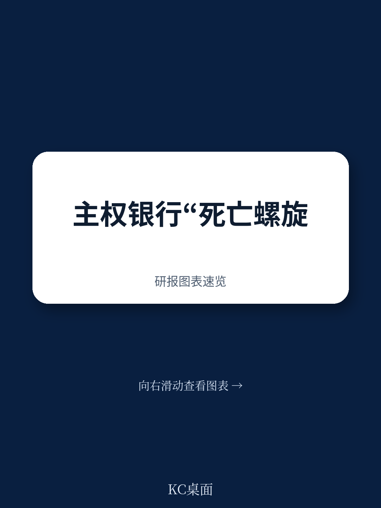
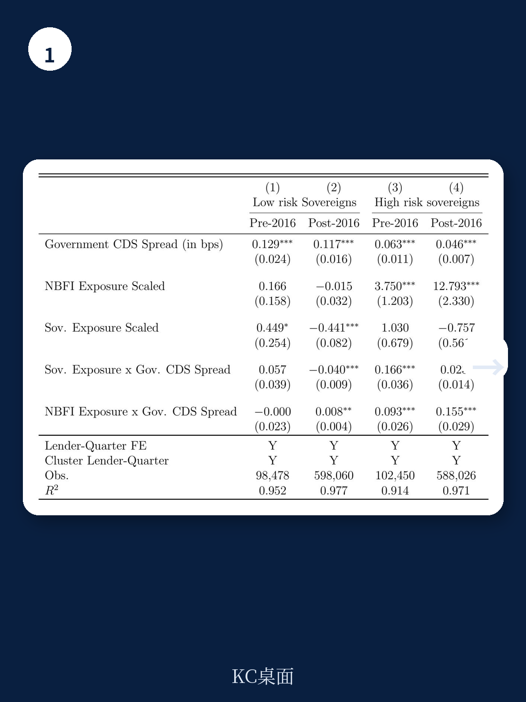
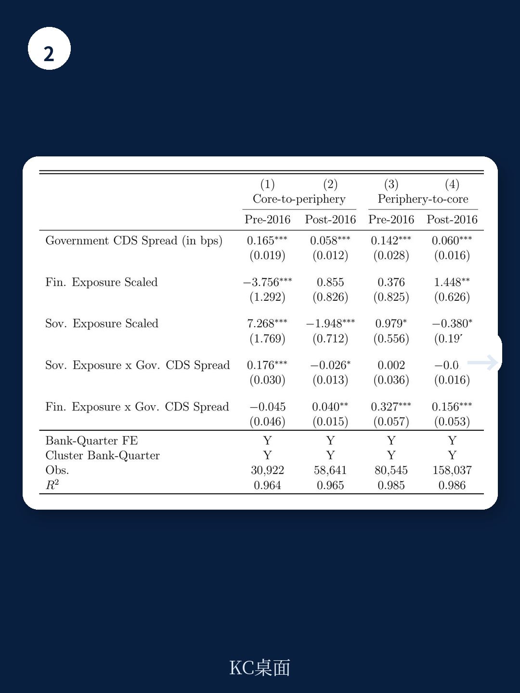

# 国际清算银行：0002BISTheevolvingne

全球资金体系的不确定性传导机制正在发生一次不易察觉但影响深远的转变。国际清算银行（BIS）最新工作论文基于欧洲银行层面数据和全球国家层面数据，系统检验了一个核心判断：传统的“主权-银行”双向反馈循环，已经扩展为“主权-银行-非银机构”的三边不确定性传导网络。这一变化并非理论推演，而是有数据支撑的结构性趋势。

报告发现，2016年之后，银行与主权信用不确定性之间的联动关系，其核心驱动力已从银行直接持有的主权债务敞口，转向银行对非银机构的间接敞口。这意味着，过去十年间，资金体系的内部连接方式发生了实质性重组。

## 1. 直接持有主权债不再是最重要的不确定性传导渠道

在欧债扰动期间，银行大量持有主权债券是不确定性传导的核心机制。主权信用出现变化导致银行资产缩水，银行扰动反过来加重主权财政负担，形成“厄运循环”。但BIS的研究显示，这一机制在2016年之后显著弱化。

具体而言，在2016年之前的样本期内，银行持有高不确定性主权债务越多，其信用违约互换利差与主权CDS利差的联动性就越强，符合经典的主权-银行循环逻辑。但在2016年之后，这一关系大幅减弱。银行直接持有主权债，已不再是解释银行与主权不确定性联动的主要变量。

> **KC评论：** 这并不意味着主权不确定性不重要，而是不确定性传导的“管道”变了。监管者如果仍然只盯着银行的主权债持仓，可能会错过真正的不确定性源头。

## 2. 银行对非银的敞口成为新的不确定性放大器

当研究者将银行对资金部门（尤其是非银机构）的敞口纳入分析后，一个更清晰的图景浮现出来。在2016年之后的时期，银行对位于高不确定性主权地区的资金交易对手的敞口越大，其与主权不确定性的联动就越强。换句话说，不确定性不是直接从主权传导到银行，而是先传导到非银机构，再经由非银机构传导至银行。

报告进一步通过银行的跨境敞口数据排除了国内救助渠道的干扰。结果显示，这一转变主要由借款主权（即债券发行国）的不确定性水平驱动，而非贷款银行所在国的特征。例如，核心欧洲银行与外围主权之间的CDS利差联动，其决定因素在2016年前后发生了切换：从银行直接持有外围主权债，变为银行对外围地区资金部门的敞口。

这一发现的关键在于，非银机构——尤其是对冲产品——通常通过短期回购从银行融资，并利用杠杆交易主权债券。这意味着，即使主权违约概率本身没有大幅上升，主权债券价格的波动也可能通过非银机构的杠杆头寸和保证金追缴，迅速传导至银行体系。

## 3. 资产流动性越高的银行，反而可能更脆弱

报告还揭示了一个反直觉的发现：持有更多流动性资产的银行，其与主权不确定性的联动反而更强。这看似矛盾，但恰恰印证了上述传导机制。流动性资产较多的银行，更有可能通过短期回购向对冲产品等非银机构提供融资。当主权债券市场出现波动时，这些非银机构被迫去杠杆，进而影响提供融资的银行。

此外，银行负债端对非银机构的敞口（如非银机构在银行的存款）也会独立地推高银行与主权不确定性的联动。这意味着，银行与非银机构之间的连接是双向的、多层次的，远不止于资产端的贷款或回购。

## 4. 非银机构自身的主权债持仓也在放大不确定性

报告最后考察了三角关系的第三边：非银机构与主权之间的直接联系。数据显示，非银机构持有主权债务越多，其自身不确定性与主权不确定性的联动就越强，尤其是在样本后期。这一发现与银行层面的结果相互印证，共同构成了完整的证据链。

非银机构在主权债券市场的参与度在过去十年显著上升。当央行缩表、传统买家减少时，非银机构成为边际定价者。但它们的持仓行为对价格更为敏感，在不确定性时期更容易出现抛售，从而放大主权债券的波动。这种波动再通过上述渠道传导至银行，形成三边反馈循环。

对于政策制定者和市场参与者而言，这一研究提供了一个新的观察框架。传统的资金稳定分析聚焦于银行的主权债持仓和资本充足率。但BIS的研究表明，在当前的资金体系结构下，需要将非银机构的杠杆、回购市场的集中度、以及银行与非银之间的资金链纳入不确定性监测的核心指标。忽视非银环节，可能意味着低估系统性不确定性的真正来源。

For informational purposes only. Portions may be generated,translated,summarized,or edited with AI assistance based on source materials and may contain omissions or errors. Please verify independently. This is not investment,legal,tax,accounting,or other professional advice.

