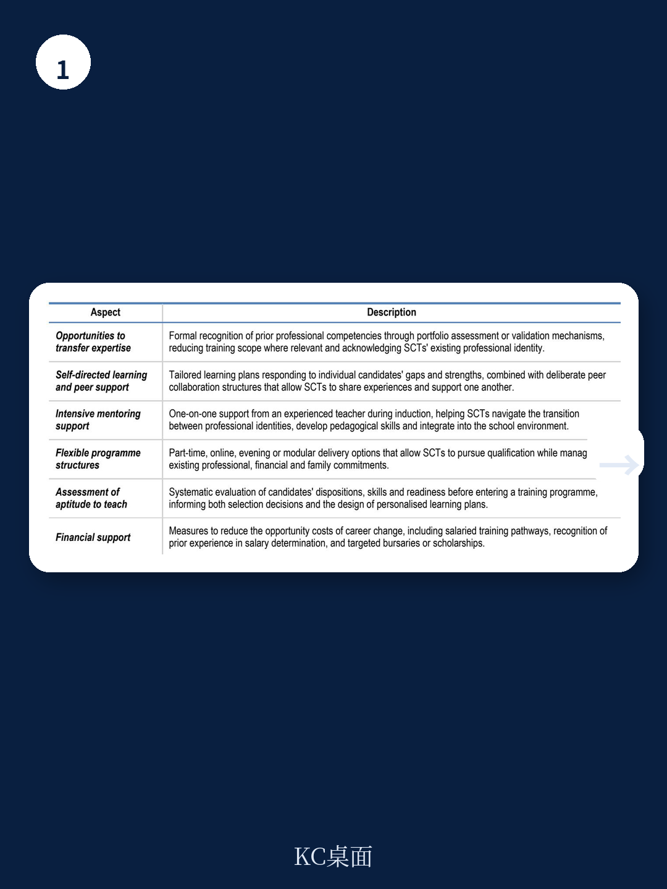
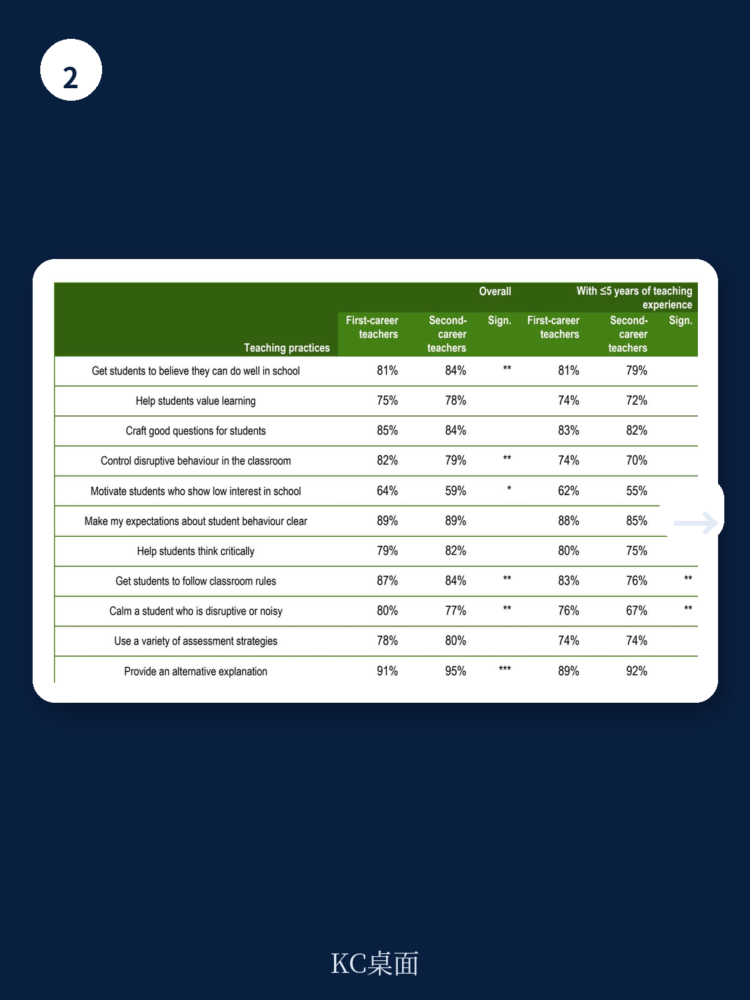

# 经合组织：0003OECDAsecondcareeri

全球教师短缺、职业流动性上升、课堂多样性加剧——三重不确定性叠加之下，经合组织（OECD）在其最新教育工作论文中，系统梳理了一个正在快速扩大的群体：第二职业教师（Second-Career Teachers,SCTs）。这些人并非师范科班出身，而是在其他行业积累了至少五年工作经验后，才转入教学岗位。报告基于2024年TALIS调查中来自55个教育系统的28万名教师数据，并采用了比官方定义更宽泛的五年工作经验门槛——这一调整使被识别为SCTs的教师比例大致翻倍。报告的核心判断是：SCTs并非传统教师队伍的简单补充，而是一个在动机、能力短板、留任意愿和职业发展需求上都显著不同的群体。教育系统若只把他们当作“缺人时的替补”，而非“需要专门设计的职业通道”，将难以真正释放其价值。

## 1. 这批教师年龄更大、性别分布更均衡，但课堂管理是共同短板

TALIS 2024数据显示，SCTs的平均年龄显著高于首职教师（First-Career Teachers）。在多数OECD国家，SCTs中男性比例也高于首职教师群体，这在一定程度上缓解了教师队伍性别失衡的问题。然而，在自我效能感评估中，SCTs在“让学生遵守课堂规则”和“安抚扰乱课堂的学生”两项上的信心显著低于首职教师。报告指出，课堂与行为管理是SCTs入职初期最常报告的挑战，这与已有定性研究的发现一致。这意味着，SCTs带来的行业经验和成熟度，并不能自动转化为对课堂秩序的掌控力——这一能力短板需要专门的培训干预，而非简单的“上岗即教”。

> **KC评论：** 课堂管理能力不足，是SCTs最容易被忽视的入职障碍。许多转行者在前一份工作中面对的是成年人或专业场景，切换至青少年课堂后，沟通和权威建立方式完全不同。报告中的TALIS数据首次在跨国层面确认了这一差异的统计显著性。

## 2. 他们更可能被分配到高需求学校，但留任意愿并不必然更高

报告对SCTs的工作地点分布做了重要揭示：在多个OECD国家，SCTs比首职教师更可能任教于社会宏观环境地位较低、移民学生比例较高、或有特殊教育需求学生较多的学校。这在一定程度上反映了政策设计的初衷——许多针对SCTs的专项通道，如美国的EnCorps STEM教师项目和“军人转教师”计划，都明确要求参与者在高需求学校服务一定年限。然而，TALIS数据同时显示，SCTs自我估计的剩余教学年限并不显著高于首职教师。在部分国家，SCTs因个人或家庭原因离开教师岗位的比例甚至更高。报告认为，这提示了一个矛盾：政策试图用SCTs填补最难的岗位，但若缺乏针对性的支持体系，这批教师可能比传统教师流失得更快。

## 3. 有效的培训通道有四个共同特征，而非简单压缩时间

报告梳理了多个OECD国家的SCTs培训项目，包括澳大利亚新南威尔士州的“转教奖学金计划”、新西兰的Te Huawhiti职业转换奖学金、荷兰的强制入学评估制度等。通过比较，报告提炼出有效培训项目的四个关键特征：第一，入学前评估，确保候选人具备基本教学潜质而非仅凭行业经验；第二，融合理论与实践，在培训早期就安排课堂实习，而非先学完理论再进教室；第三，持续的指导与辅导，特别是入职第一年的结构化导师支持；第四，灵活的路径设计，允许兼职学习、带薪实习或分阶段获得教师资格。报告特别强调，单纯压缩培训时长而不改变内容结构，往往适得其反——SCTs需要的不是“更快的通道”，而是“不同的通道”。

## 4. 观察框架：判断一个SCT通道是否有效，先看这三个指标

对于政策制定者和学校管理者而言，报告提供了三个可操作的观察维度。第一，入职第一年的课堂管理支持是否到位——这是SCTs最常报告的能力缺口，也是最容易导致早期离职的因素。第二，导师制度是否结构化——TALIS数据显示，SCTs获得正式导师指导的比例并不高于首职教师，但他们的需求往往更特殊，需要导师理解成人学习者的特点。第三，职业发展路径是否清晰——SCTs通常对职业意义感有更高期待，若学校只能提供重复性教学任务而缺乏成长空间，他们的留任意愿会迅速下降。这三个指标，比单纯看培训时长或补贴金额，更能预测一个SCT通道的实际效果。

这份报告的价值在于，它第一次让“第二职业教师”这个群体从政策口号变成了可测量、可比较、可改进的对象。当越来越多的教育系统把目光投向这批“半路出家”的专业人士时，真正的问题已经不是“要不要招”，而是“怎么接住”。

For informational purposes only. Portions may be generated,translated,summarized,or edited with AI assistance based on source materials and may contain omissions or errors. Please verify independently. This is not investment,legal,tax,accounting,or other professional advice.

