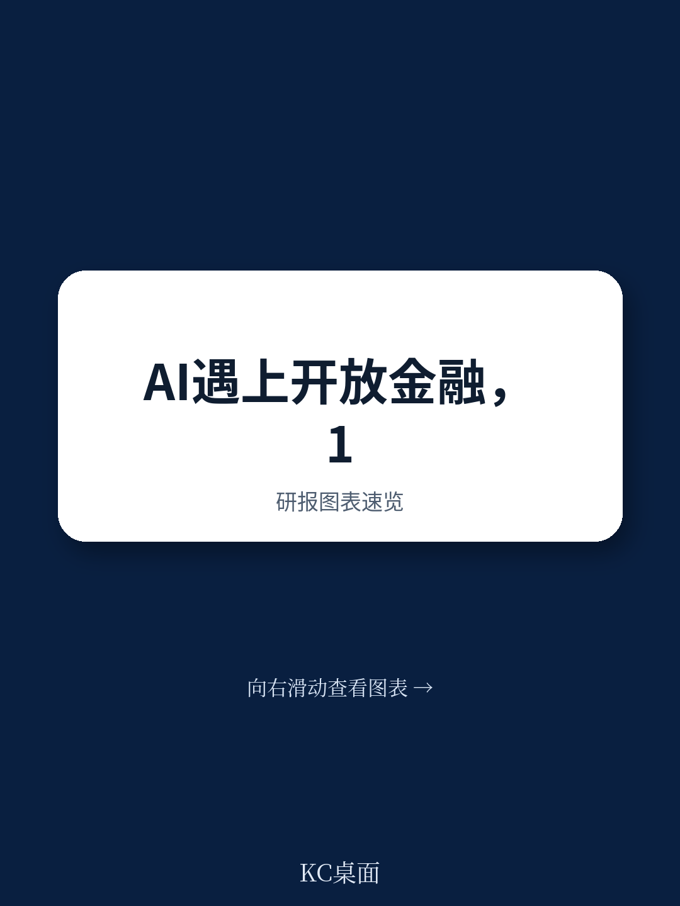
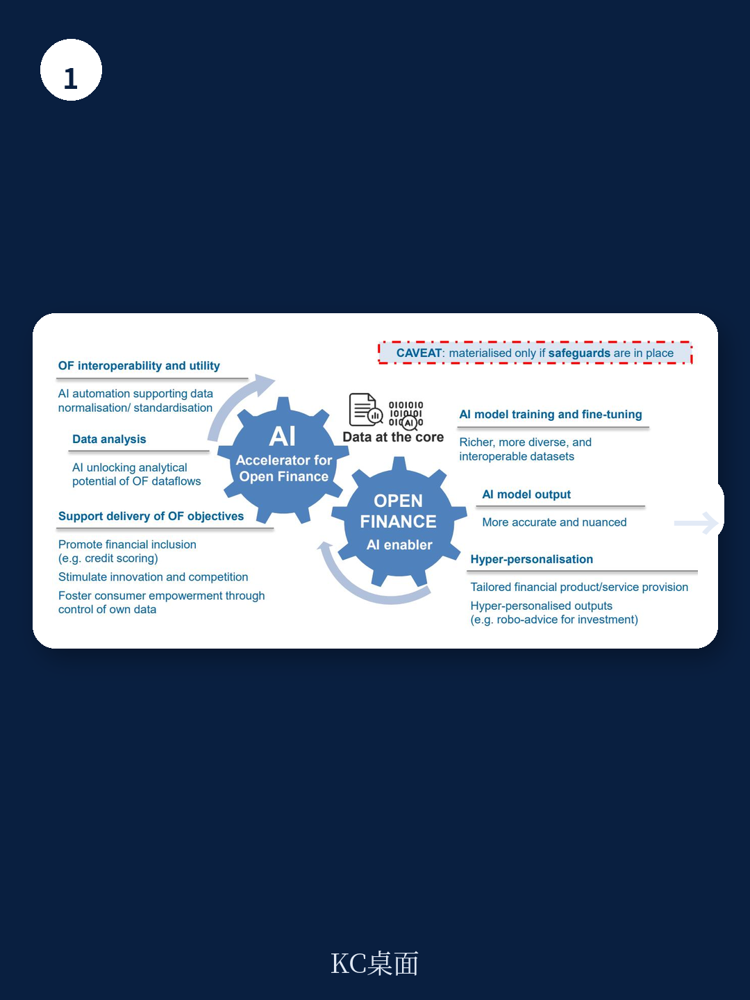
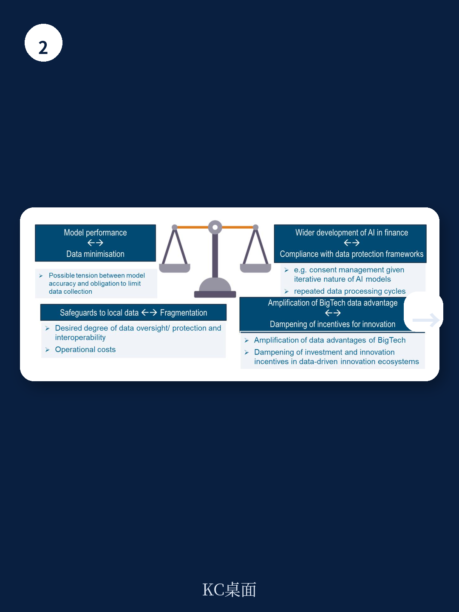

# 经合组织：0004OECD人工智能和openfinancebe99bf

资金业正同时被两股力量重塑：人工智能的加速部署，以及数据共享框架的演进。经合组织最新发布的报告指出，这两条趋势的交叉地带，至今仍是研究盲区。报告的核心判断是：开放资金为AI提供高质量结构化数据，AI反过来释放开放资金的分析潜力，但这种相互强化也放大了数据治理、消费者保护和系统不确定性，并催生出一系列此前未被充分讨论的权衡。

报告特别构建了一个“AI代理在开放资金中扩散”的理论场景，试图提前推演当高度自主的系统能够调用个人资金数据时，资金中介的形态会如何变化。这不是一份技术展望，而是一份面向政策制定者的不确定性地图。

## 1. 开放资金是AI落地的“数据基础设施”，但前提是数据治理必须升级

报告明确指出，开放资金框架的核心价值不在于数据共享本身，而在于它为AI系统提供了可互操作、高质量、结构化的数据流。没有这种数据基础，AI在资金领域的超个性化服务、实时分析和自动化决策都难以规模化落地。

但报告也给出了一个关键限定条件：传统的数据治理模式无法支撑这种协同。经合组织以韩国央行为案例，提出了“AI就绪数据治理”的概念——数据不仅要可获取，还要可追溯、可解释、可审计。这意味着，机构如果只是把开放资金当作数据接口来接入，而不重构内部的数据架构和治理流程，AI带来的效率提升可能被合规不确定性和模型偏差所抵消。

> **KC评论：** 报告没有直接说，但隐含的逻辑是：开放资金框架的竞争，未来可能从“谁的数据更多”转向“谁的数据治理更适配AI迭代”。这一点对正在建设或升级开放资金体系的地区尤其值得关注。

## 2. 不确定性不是简单叠加，而是在交叉点被系统性放大

报告最值得注意的分析，不是分别罗列AI和开放资金各自的不确定性，而是揭示两者交叉后产生的“不确定性放大效应”。具体而言，三个维度被重点讨论

第一，消费者过度依赖。当AI驱动的建议基于开放资金提供的全维度数据（储蓄、信贷、保险、研究），消费者可能更难质疑算法输出，因为“数据太全了，系统应该比我更了解自己”。第二，数据治理的透明度挑战。消费者在开放资金框架下同意共享数据时，很难预见到这些数据会被用于后续AI模型的迭代训练，尤其是当模型可解释性有限时。第三，偏见与歧视的传导。如果开放资金数据本身包含历史偏见，AI模型会将其放大，且这种放大可能跨越不同资金产品类别，形成系统性不公平。

报告没有给出简单的解决方案，但强调了一个方向：消费者同意的管理机制需要从“一次性授权”转向“持续、可追溯、可撤回”的动态模式。

## 3. 三个核心权衡，决定开放资金与AI协同的边界

报告提炼了三组结构性权衡，每一组都指向一个具体的政策或商业选择

- 模型性能 vs. 数据最小化。AI模型需要大量数据来提升性能，但数据保护原则要求“收集最少必要数据”。两者在开放资金场景下直接冲突。
- 本地数据存储 vs. 运营碎片化。为了满足数据本地化要求，AI训练数据可能被分割存储，但这会增加延迟和运营成本，降低模型效果。
- BigTech参与 vs. 第三方依赖不确定性。大型科技公司同时控制AI模型基础设施和开放资金数据流，可能形成新的市场集中。但将其排除在开放资金框架之外，又会削弱创新动力。

报告没有给出“正确”答案，而是提示：这些权衡没有普适解，取决于各地区的监管偏好、市场结构和消费者保护水平。

## 4. 一个理论场景：AI代理时代的资金中介将如何演变

报告最具前瞻性的部分，是构建了一个“AI代理在开放资金环境中扩散”的理论场景。在这个场景中，多个协调运作的AI代理可以自主分解任务、协作、并在长时间内追求复杂目标，而人类干预大幅减少。

正面来看，这种系统可以实现真正的“24/7超个性化资金管理”，尤其可能提升零售读者参与复杂资本市场的可能性——通过降低门槛、实时建议和个性化决策支持工具。谨慎来看，激励错位、责任归属不清、以及人类对资金决策的失控不确定性，可能带来比当前AI应用更严重的后果。

报告谨慎地指出，这仍是理论场景，但它的价值在于提前暴露了现有监管框架的盲区：当前的消费者保护、数据治理和算法问责规则，几乎都没有为“AI代理自主调用多源数据并执行资金操作”的场景做好准备。

For informational purposes only. Portions may be generated,translated,summarized,or edited with AI assistance based on source materials and may contain omissions or errors. Please verify independently. This is not investment,legal,tax,accounting,or other professional advice.

