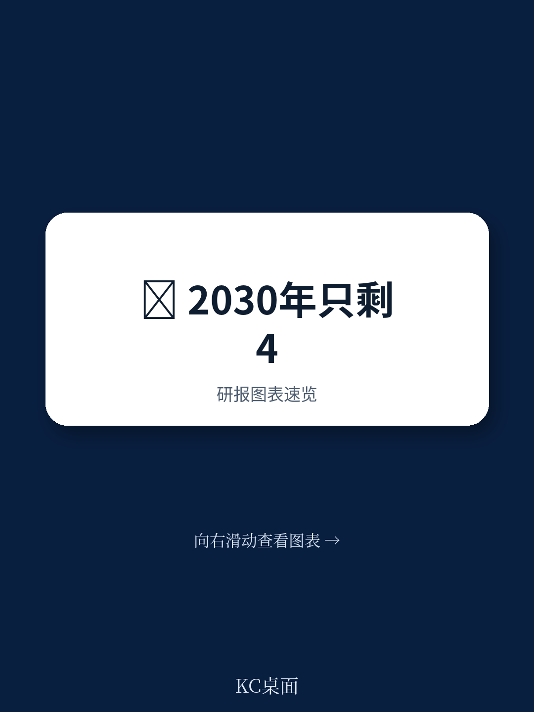
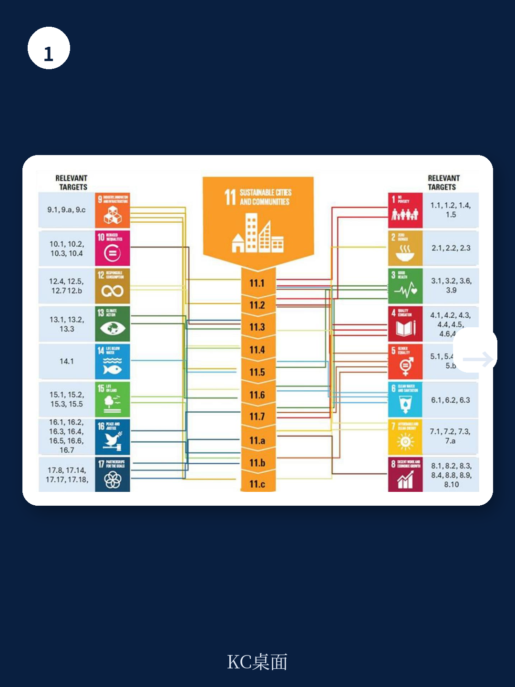
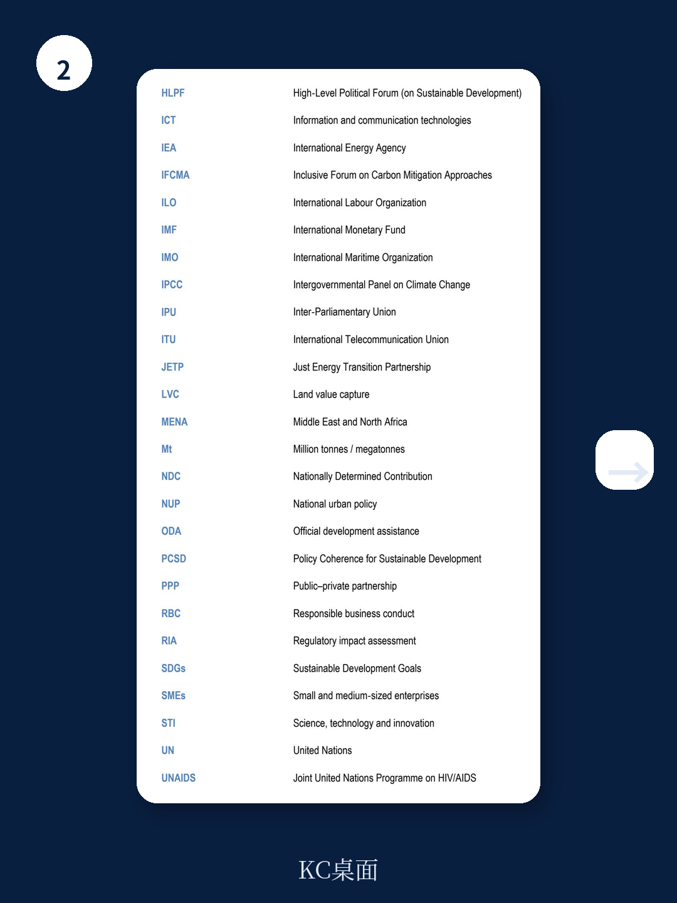

# 经合组织：0005OECDBridgingtheGap

距离2030年目标节点仅剩四年，全球在水、能源、工业和城市发展领域的进展普遍落后于承诺。气候不确定性、资源约束、数字化转型和地缘紧张正在制造跨部门、跨国界的连锁效应。与此同时，国际资金趋紧且不确定性上升，使得碎片化的政策响应成本越来越高。经合组织在提交2026年联合国高级别政治论坛的最新报告中提出一个核心判断：当前最影响可持续发展进度的，不是资金缺口或技术瓶颈，而是治理碎片化——当水、能源、工业和城市政策各自为政时，一个领域的改善往往以另一个领域的不确定性为代价。

这份报告基于经合组织成员国及伙伴国的实践经验，系统梳理了碎片化治理如何通过三种机制放大系统不确定性：降低改革有效性、推高基础设施与监管的协调成本、以及加剧低收入家庭和小企业的负担。报告同时给出了可操作的整合框架，涵盖五大战略支柱。

## 1. 碎片化不是小问题，而是乘数效应放大器

报告指出，碎片化治理并非简单的部门沟通不畅，而是会产生三种可量化的乘数效应。首先，当水、能源、工业和城市规划各自独立推进时，一个领域的收益可能直接转化为另一个领域的成本。例如，能源扩张若未同步评估水资源不确定性，可能加剧本就紧张的水资源供需矛盾；城市更新若未与工业转型衔接，可能推高住房可负担性不确定性。

其次，基础设施、空间规划、监管和研究时序这些高度关联的决策若不能对齐，整体成本将显著上升。报告特别提到，当前许多国家在长期战略与日常执行之间存在持续脱节，这种脱节在财政紧缩和公众信任下降的背景下变得更加昂贵。

第三，不协调的政策往往将调整成本转嫁给最脆弱的群体。低收入家庭和小企业在缺乏配套措施的价格改革或产业转型中承受的不确定性最大，这反过来又削弱了政策的社会基础。

> **KC评论：** 报告实际上在说，治理碎片化不是一个“锦上添花”的优化问题，而是一个“雪上加霜”的放大器。当各国都在寻找加速SDG进展的杠杆时，减少碎片化可能是成本最低、回报最确定的选项之一。

## 2. 整合的机会窗口：从循环宏观环境到城市一体化

报告并非只谈问题。它用大量案例说明，当各国采用整合方法时，存在显著的机会窗口来加速进展。这些机会包括：将城市废弃物和水管理与工业创新及能效相结合的循环宏观环境政策；能够同时降低洪涝和干旱不确定性、扩大绿地、支持生物多样性并减少城市降温需求的基于自然的解决方案；以及能够降低长期成本并保障水密集型能源系统安全的水能一体化规划。

在城市化领域，报告给出了一个关键数据：2017至2022年间，在有数据的13个SDG目标中，城市平均在8个目标上取得改善。但不同目标之间的表现差距明显，这恰恰说明整合的城市政策是提升整体表现的关键。当住房、交通、能源和数字基础设施的规划能够跨部门、跨政府层级对齐时，城市可以同时推进多个目标，而不是在目标之间做零和博弈。

报告特别强调了“国家城市政策”的作用。一个整合的城市政策框架可以帮助地方政府在有限的财政空间内最大化协同效应，减少政策碎片化带来的效率损失。

## 3. 五大战略支柱：从识别到执行的完整路径

报告的核心贡献在于提出了一个可操作的五大战略支柱框架，覆盖从识别到执行的全链条。

第一，识别协同效应和权衡取舍。报告建议各国系统性地评估水、能源、工业和城市政策之间的交叉影响，并建立早期预警机制来识别潜在的冲突点。例如，能源转型所需的矿产开采可能对水资源和当地社区产生影响，这些影响需要在政策设计阶段就被纳入考量。

第二，设计整合的政策组合。报告强调，单纯的部门政策叠加是不够的，需要设计能够同时服务于多个目标的政策组合。例如，将城市更新与能效改造、绿色基础设施和公共交通研究打包推进，可以同时推进SDG 7（能源）、SDG 9（产业创新）和SDG 11（可持续城市）。

第三，利用数字技术和数据系统。报告认为，实时和可互操作的数据平台是自适应规划的基础。更好的数据整合能够增强对水管理、能源系统和城市领域新兴不确定性的响应能力。同时，报告也提醒需要改善数字和AI系统环境足迹的测量和透明度。

第四，应对影响和全球溢出效应。系统转型必然产生不均等的影响，并可能制造跨境溢出。报告建议各国在定价、土地利用和产业转型改革前进行影响评估，为小企业和供应商设计合规路径，并提供技术援助和可持续融资渠道。对于可能产生跨境影响的国内政策，报告建议主动与伙伴国进行对话。

第五，建设适应性和面向未来的治理体系。报告主张将情景分析制度化，嵌入预算周期、采购和监管设计，并定期进行事后评估以调整方向。同时，加强多利益相关方参与，研究于劳动力能力和整合数据系统。

## 4. 一个容易被忽视的观察框架：政策连贯性不是一次性工程

报告中最有价值的部分之一，是它提供了一个可复用的观察框架：政策连贯性不是一次性的规划工作，而是一个需要持续维护的治理能力。它要求政府在三个维度上保持对齐——时间维度（长期战略与日常执行）、空间维度（不同层级政府之间）和部门维度（水、能源、工业、城市之间）。

报告特别提到，许多国家在制定长期战略时表现良好，但在日常执行中却出现系统性偏差。这种偏差往往源于部门预算的独立性、监管流程的割裂以及数据系统的互不兼容。因此，改善政策连贯性不能仅靠发布新的战略文件，而需要在预算、监管和数据这三个基础设施层面进行结构性调整。

> **KC评论：** 对于关注可持续发展政策的研究者和从业者来说，这份报告提供了一个实用的诊断工具：下次看到某个SDG目标进展缓慢时，不要只问“钱够不够”或“技术行需要继续观察”，先问“这个领域的政策是否与其他领域的政策在打架”。很多时候，答案就在这个问题的诊断中。

For informational purposes only. Portions may be generated,translated,summarized,or edited with AI assistance based on source materials and may contain omissions or errors. Please verify independently. This is not investment,legal,tax,accounting,or other professional advice.

