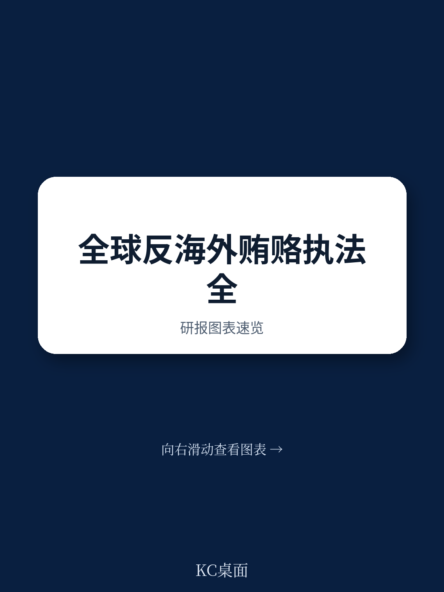
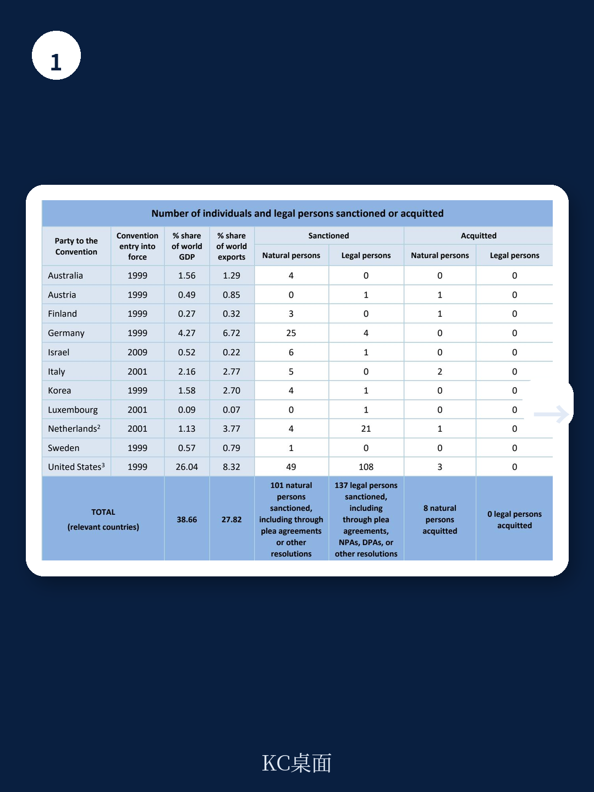
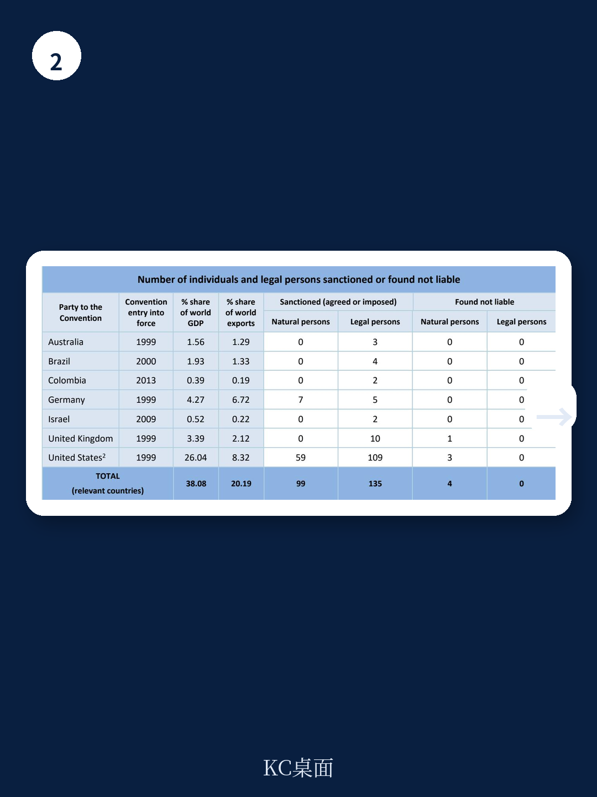

# 经合组织：OECD反贿赂公约执法数据1999-2025

从1999年《经合组织反贿赂公约》生效到2025年底，26个缔约国通过刑事诉讼累计对768名自然人和321个法人作出海外贿赂制裁。但这份数据最值得关注的不是总量，而是分布——美国一国贡献了其中152名自然人和183个法人的刑事制裁，分别占全球总量的20%和57%。如果把行政与民事程序也算进去，美国对109个法人的制裁数量，是其他所有缔约国的总和还要多。

这不是一份关于“谁在执法”的报告，而是一份关于“谁在认真执法”的对照表。经合组织这份截至2025年12月31日的执法数据汇编，首次系统披露了46个缔约国在海外贿赂、会计造假和洗钱等关联犯罪上的全口径执法结果。它揭示了一个长期被低估的事实：全球反海外腐败的执法重心，远比多数跨国企业合规部门预期的更集中。

> **KC评论：** 报告中的表格区分了“刑事制裁”和“行政/民事制裁”，但很多企业只关注刑事不确定性。实际上，美国通过行政程序制裁的109个法人，其商业影响（如出口限制、投标资格取消）往往不亚于刑事定罪。

## 1. 全球执法版图严重失衡，美国之外只有德国和法国有实质行动

在刑事制裁层面，德国以375名自然人位居榜首，但这一数字的统计口径值得细看——德国将行政罚款程序也计入刑事制裁，且大量案件针对的是个人而非企业。真正对法人形成威慑的是美国：183个法人被刑事制裁，远超第二名法国的39个和英国的17个。

更关键的是，有11个缔约国自公约生效以来从未对任何自然人或法人作出过海外贿赂刑事制裁，包括巴西、墨西哥、南非等宏观环境规模不小的国家。报告显示，这些国家不是没有案件，而是没有结案——巴西、哥伦比亚等国在行政程序中确有制裁记录，但刑事程序始终为零。

这意味着，对于在巴西、墨西哥等市场开展业务的企业而言，当地的反腐败执法不确定性更多来自行政合规审查，而非刑事追诉。但报告也指出，这些国家正在积累调查资源——截至2025年底，26个缔约国有480项海外贿赂调查正在进行中，其中相当比例来自此前执法记录空白的国家。

## 2. 关联犯罪制裁成为执法新通道，美国通过会计条款扩大打击面

报告单独列出了“与海外贿赂相关的其他犯罪”制裁数据，包括洗钱和会计违规。这一块的数据变化值得关注：美国通过刑事程序制裁了49名自然人和108个法人，通过行政程序制裁了76名自然人和213个法人，合计远超海外贿赂本身的制裁数量。

这背后的逻辑不难理解。海外贿赂的直接证据往往难以获取，但会计记录造假、内部管控缺失等关联违规更容易被审计发现。经合组织公约第8条明确要求缔约国将“账簿和记录违规”纳入制裁范围，美国正是利用这一条款，将大量海外贿赂案件转化为会计违规案件处理。

对于跨国企业的合规部门而言，这意味着一个更现实的执法路径：监管机构可能无法证明某笔付款是贿赂，但可以证明这笔付款没有被正确记录。报告中的数据显示，荷兰通过关联犯罪制裁了21个法人，而其对海外贿赂本身的法人制裁为零——这个反差说明，关联犯罪正在成为部分国家绕过直接贿赂举证难题的执法工具。

## 3. 非审判和解成为主流结案方式，企业需要重新评估和解成本

报告在方法论部分特别说明，表格数据包含了“非审判和解”——即执法机构与被告通过协议结案，无需法院正式定罪。这类和解包括暂缓起诉协议、不起诉协议和认罪协议等。从实际数据看，美国、英国、法国、瑞士等主要执法国家的制裁数字中，和解案件占比极高。

这对企业意味着什么？和解不等于无罪。即使通过暂缓起诉协议避免了刑事定罪记录，企业仍需支付罚款、接受合规整改、配合调查，并可能面临后续的民事索赔和投标资格限制。报告没有单独披露罚款金额，但过往案例显示，和解成本往往高于审判后的罚金。

> **KC评论：** 报告中的“sanctioned”包括了和解案件，但不同国家的和解法律效力差异很大。在美国，暂缓起诉协议到期后案件可能被撤销；在德国，行政罚款程序一旦完成即视为终局。企业不能用一个国家的和解经验去套另一个国家的不确定性。

## 4. 一个可复用的观察框架：从“执法密度”判断市场不确定性

这份报告最有价值的不是具体数字，而是它提供了一个评估各国反腐败执法不确定性的框架。核心变量有三个：刑事制裁密度（制裁人数占GDP份额的比例）、行政程序活跃度（是否有行政制裁记录）、以及关联犯罪执法力度（是否通过会计条款追诉）。

用这个框架看数据，可以得出几个判断：美国是唯一在三个维度上都高强度的市场；德国和法国在刑事和行政维度有实质行动，但关联犯罪执法较弱；英国在刑事制裁和关联犯罪上都有记录，但行政程序几乎未使用；巴西、哥伦比亚等拉美国家虽然刑事制裁为零，但行政程序已有动作，说明执法正在从行政端起步。

对于正在制定全球合规预算的企业，这个框架比单纯看“是否有反腐败法”更有参考价值。一个刑事制裁密度高的市场，意味着企业需要投入更多资源在直接贿赂不确定性防控上；一个关联犯罪执法活跃的市场，则意味着财务记录和内部管控的合规成本不能省。

报告最后附上了完整的数据收集方法论，包括各国如何定义“制裁”、如何区分刑事与行政程序、以及哪些案件被排除在统计之外。对于需要深入理解这些数字背后法律含义的读者，那份方法论文件的价值不亚于数据本身。

For informational purposes only. Portions may be generated,translated,summarized,or edited with AI assistance based on source materials and may contain omissions or errors. Please verify independently. This is not investment,legal,tax,accounting,or other professional advice.

