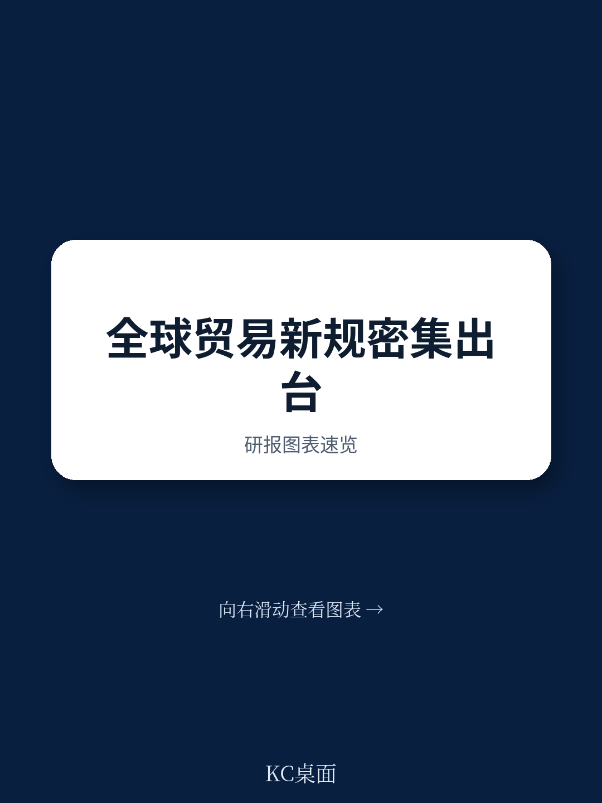
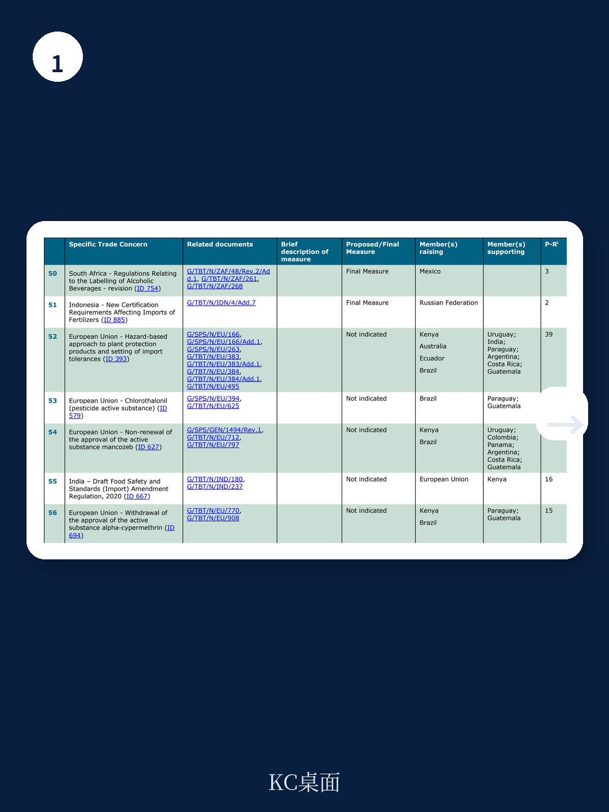
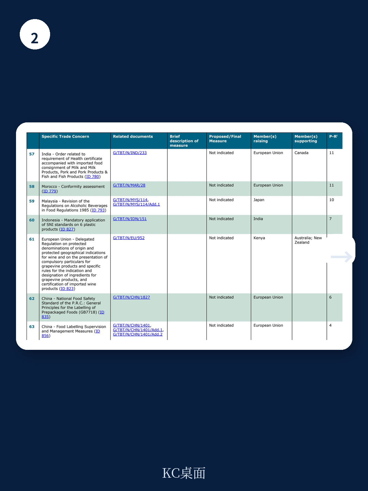

# 世界贸易组织：0008WTOTBTCommitteer

全球贸易的竞争焦点正在发生一次不易察觉的转移。世界贸易组织最新发布的贸易技术壁垒委员会会议记录显示，2025年新提出的17项特定贸易关切中，超过半数直接指向欧盟的法规提案，涉及领域从有机食品标签、塑料瓶再生含量计算，到网络安全认证和工业加速器法案。这组数据传递的信号很明确：当关税战进入僵持阶段，各国开始用技术法规和标准认证作为新的竞争工具。

这份报告的价值不在于记录了哪些国家反对了哪些措施，而在于揭示了贸易摩擦的形态正在从“价格门槛”转向“合规门槛”。后者更难量化、更难在WTO框架下快速裁决，但对供应链的实际影响可能更为深远。

## 1. 欧盟成为新贸易关切的最大靶心，合规成本正在替代关税成为主要壁垒

在17项新提出的贸易关切中，欧盟被点名7次，涉及美国、中国、韩国、阿根廷等多个申诉方。关切内容覆盖有机农业规则、塑料瓶再生含量计算、网络安全法案2.0、工业加速器法案等。这不是偶然的集中爆发，而是欧盟绿色新政和数字战略落地过程中，其法规体系与贸易伙伴的既有标准之间产生了系统性摩擦。

值得注意的不仅是数量，还有关切的性质。以网络安全法案2.0为例，中国提出的关切点并非关税或配额，而是认证标准本身可能构成市场准入障碍。同样，美国对欧盟有机食品规则的质疑，焦点在于认证互认和标签规则。这些争议的核心不是“能不能卖”，而是“按谁的规则卖”。

> **KC评论：** 这张表格最容易被忽略的信息是“支持方”一栏。多数新关切没有列出支持方，说明这些争议目前仍以双边博弈为主，尚未形成多边联盟。但一旦某个标准被多个国家同时挑战，就可能演变为WTO框架下的系统性争端。

## 2. 中国在多个技术标准领域同时面临规则博弈，从被动应对转向主动提出关切

报告显示，中国在本次会议中既是多个贸易关切的提出方，也是被质疑方。作为提出方，中国对欧盟的工业加速器法案、网络安全法案2.0以及美国加州猕猴桃法规提出了正式关切。作为被质疑方，中国在网络安全法、加密法、化妆品监管、食品标签等议题上仍面临欧盟、日本、美国等贸易伙伴的持续质疑。

这种“双向参与”的格局说明，中国企业在出海过程中，不仅要适应目标市场的技术标准，其自身的法规体系也在被外部审视。以化妆品监管为例，韩国、日本、英国、美国、印度均曾提出关切，涉及非特殊用途化妆品通知制度、标签要求等具体条款。这类关切不会直接导致贸易中断，但会增加合规的不确定性和时间成本。

## 3. 食品和农产品领域的标准争议持续高频，农药残留和认证规则成为长期博弈点

从“先前提出的贸易关切”表格可以看出，涉及食品、农药、农产品标签的争议数量最多且反复出现。欧盟对氯虫苯甲酰胺、代森锰锌等活性物质的批准或不续展决定，引发了肯尼亚、巴西、厄瓜多尔等多个农业出口国的持续质疑。这些国家并非发达地区，但它们的联合关切表明，欧盟的农药残留标准正在重塑全球农产品供应链的合规成本。

同样值得关注的是印度对进口食品健康证明的要求、印尼的清真认证规则、以及埃及的清真标准。这些措施表面上是食品安全或宗教合规，实质上构成了非关税壁垒。对于食品出口企业而言，未来五年的竞争可能不再是价格战，而是谁能更快完成多国认证体系的合规拼图。

> **KC评论：** 表格中“P-Ri”列（优先排序指数）是一个被低估的分析工具。指数越高，说明该关切被更多成员视为优先解决事项。例如欧盟的PFAS限制提案（ID 798）和印尼清真认证（ID 502）的指数分别达到2和31，后者意味着超过30个成员认为这是一个需要优先处理的系统性障碍。这类高指数关切往往预示着未来可能形成多边谈判议题。

## 4. 一个可复用的观察框架：用“关切类型+法规阶段+支持方数量”判断贸易不确定性等级

对于需要评估海外市场准入不确定性的企业或研究机构，可以从这份报告中提炼一个简易框架：第一步，区分贸易关切是针对“拟议措施”还是“最终措施”。拟议措施意味着还有窗口期进行意见反馈或调整策略；最终措施则意味着合规成本已经锁定。第二步，看支持方数量。单一国家提出的关切，通常属于双边摩擦；多个国家支持的关切，更可能演变为多边规则争议。第三步，关注“P-Ri”指数，它反映了该议题在WTO成员中的紧迫程度。

以欧盟的包装和包装废弃物法规（ID 786）为例，该措施为最终措施，韩国、美国、印度、俄罗斯均提出关切，P-Ri指数为10。这意味着出口到欧盟的包装材料企业需要立即调整合规策略，同时关注后续可能的多边协调进展。

这份世界贸易组织的报告没有给出任何预测，但它提供了一张清晰的“规则摩擦地图”。对于任何参与全球供应链的企业而言，读懂这张地图，比猜测关税走向更为紧迫。

For informational purposes only. Portions may be generated,translated,summarized,or edited with AI assistance based on source materials and may contain omissions or errors. Please verify independently. This is not investment,legal,tax,accounting,or other professional advice.

