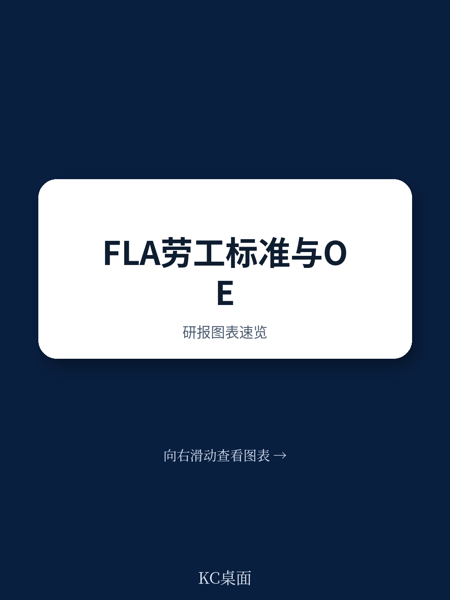
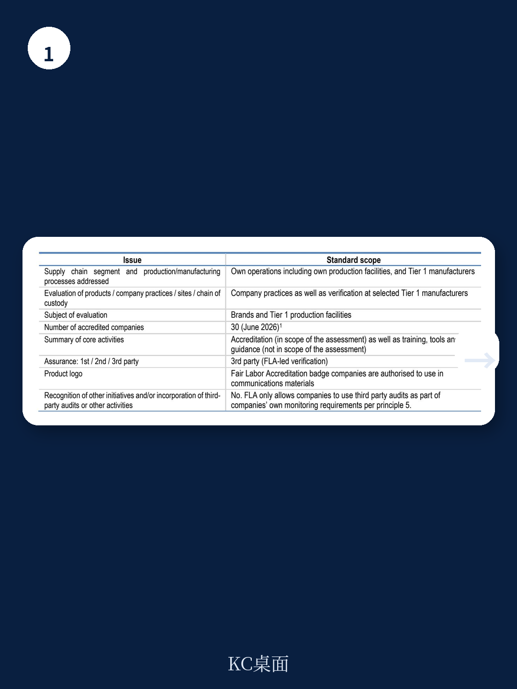
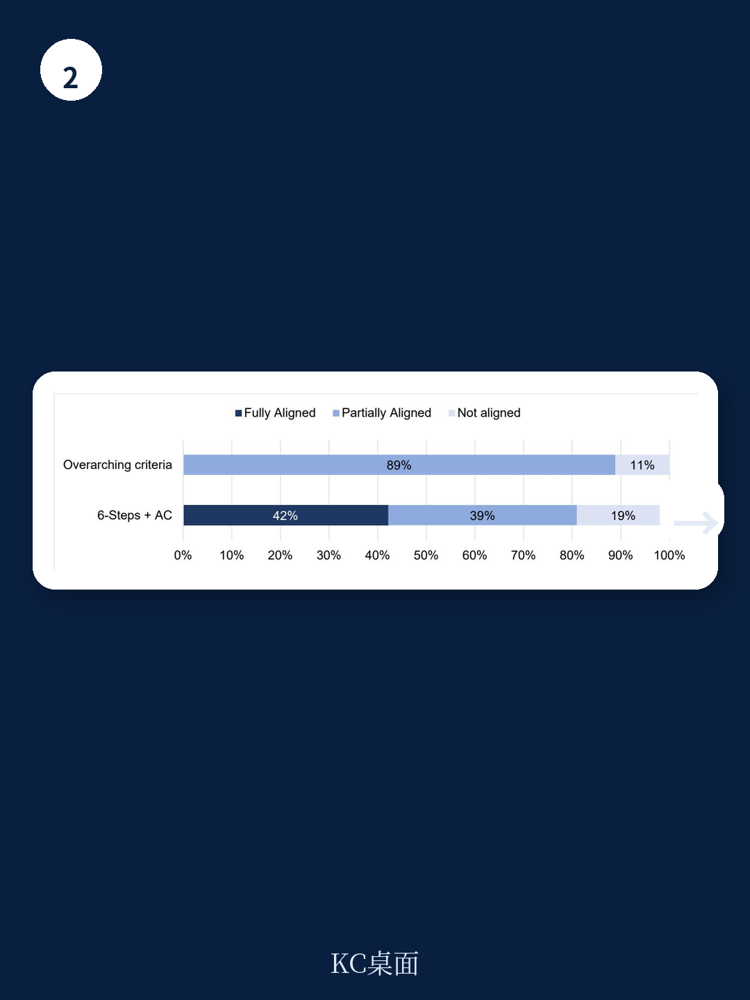

# 经合组织：FLA劳工认证标准对齐评估

2026年6月，经合组织发布了对公平劳工协会（FLA）制造业认证标准的评估报告。结论是“部分对齐”——一个看似温和、实则指向深层问题的评级。这份报告不是对FLA的否定，而是揭示了当前行业劳工认证体系中最棘手的矛盾：标准要求企业做什么，与标准真正能验证什么，之间存在系统性落差。

评估覆盖了FLA截至2025年6月前的全部书面政策与标准，聚焦于品牌和一级生产设施。30家已获认证企业和15家在途企业的实践，构成了这次检验的底色。但经合组织明确划定了边界：这次只评估标准文本本身，不涉及FLA如何执行这些标准，也不评估其内部治理。换句话说，报告检验的是“规则写得对不对”，而不是“规则执行得好需要继续观察”。

## 1. 认证标准在“识别不确定性”环节的覆盖度最薄弱

评估将尽责管理拆解为六个步骤，FLA在“嵌入政策与管理体系”（第一步）和“停止、预防或减轻损害”（第三步）上表现相对完整，但在“识别实际和潜在损害”（第二步）上出现了明显缺口。

问题出在标准对供应链不确定性识别的要求不够具体。FLA要求企业建立流程，但没有明确要求企业必须根据自身业务特点、地理分布和产品类型，系统性地识别最可能发生劳工不确定性的环节。报告指出，标准中关于不确定性排序、动态更新和跨层级传导的要求，在文本层面缺乏强制性语言。这意味着，一家企业只要建立了“流程”，即使没有真正触及高不确定性供应商，也可能通过认证。

> **KC评论：** 这里的关键不是FLA不重视不确定性识别，而是标准文本把“做什么”和“做到什么程度”之间的界限模糊化了。对于采购方而言，这提醒了一个容易被忽略的问题：认证本身不等于不确定性已被识别。

## 2. “补救”条款的强制性不足，削弱了认证的公信力

第六步“提供或配合补救”是经合组织尽责管理指南的核心支柱之一。报告认为，FLA标准在补救方面的要求存在结构性不足。

具体而言，标准要求企业在发现损害后采取纠正措施，但文本中使用了较多“应”（should）而非“须”（shall）的表述。在经合组织的评估框架下，对于验证类倡议（即FLA这类通过认证来评估企业表现的机制），提到性语言不能等同于强制性要求。如果标准不明确要求企业必须为受影响的工人提供或配合补救，那么认证所传递的“负责任”信号就会打折扣。

报告同时指出，FLA在2026年发布了补救指南，但这份指南在评估截止日期（2025年6月）之后才生效，因此未被纳入本次标准评估。这是一个时间窗口造成的遗憾，但也说明FLA自身已意识到这一缺口。

## 3. 评估方法论本身揭示了行业认证的深层困境

经合组织在方法论部分做了一个重要区分：验证类倡议与促进类倡议。FLA属于前者——它设定标准、评估企业、授予认证。但问题在于，当标准中的核心要求使用提到性语言时，认证的含金量就取决于企业自愿执行的程度，而非标准的约束力。

报告特别强调，如果验证类倡议希望与经合组织指南对齐，就必须将指南中的自愿建议转化为强制性要求。这不是经合组织在抬高门槛，而是认证机制的内在逻辑使然：如果标准不强制，认证就无法区分“真正做得好”和“只是流程上合规”。

这一观察对所有关注供应链劳工标准的从业者都有参考价值。当一家供应商持有某项认证时，追问“这个标准要求企业必须做什么，还是建议企业做什么”，比看认证名称本身更能判断其实际约束力。

## 4. 一个可复用的观察框架：从“标准对齐度”反推认证可信度

经合组织的评估工具本身就是一个可迁移的分析框架。它把尽责管理拆解为六个步骤加一个治理维度，每个维度下设具体标准，并给出“未对齐、部分对齐、完全对齐”三级评分。

对于采购方、品牌合规团队或行业研究者，这个框架提供了一种独立评估任何劳工认证的方法：先看标准文本是否使用强制性语言，再看关键环节（尤其是不确定性识别和补救）是否有明确要求，最后看评估是否覆盖了标准的实际执行。FLA的案例表明，即使是一个运作多年、拥有30家认证企业的成熟体系，在标准文本层面仍可能留下结构性缺口。

这份报告没有给出“FLA好或需要继续观察”的简单结论。它更像一面镜子，照出了行业认证体系在从“倡导”走向“验证”过程中必须面对的转型难题。对于正在选择或评估认证体系的从业者，经合组织的评估框架本身，或许比任何单一认证的结论都更有长期参考价值。

For informational purposes only. Portions may be generated,translated,summarized,or edited with AI assistance based on source materials and may contain omissions or errors. Please verify independently. This is not investment,legal,tax,accounting,or other professional advice.

