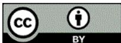
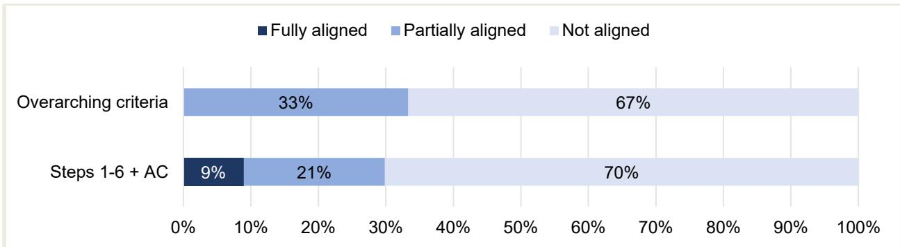
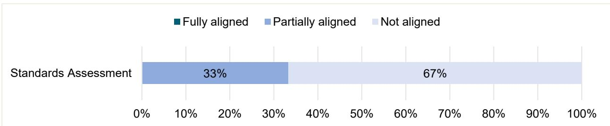
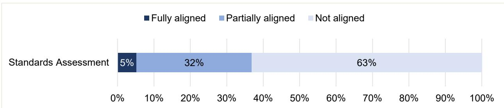
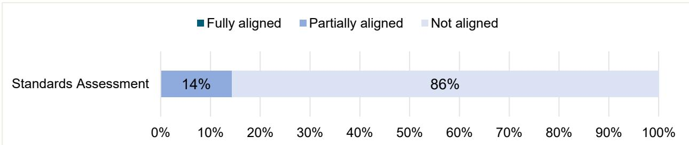
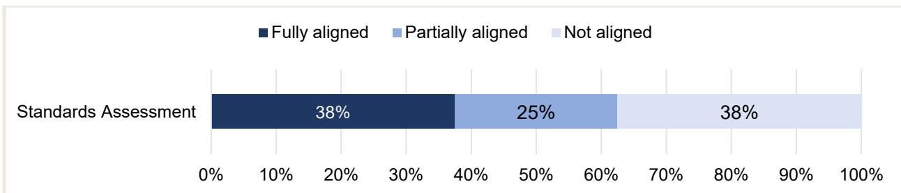
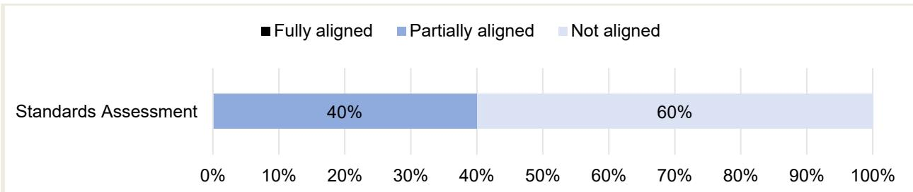
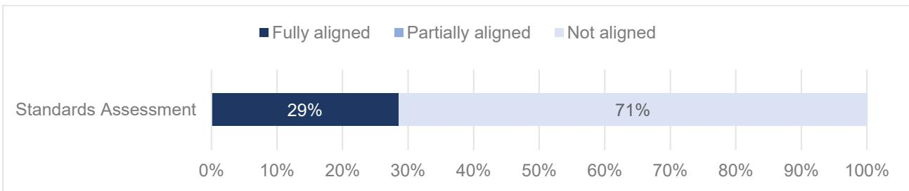
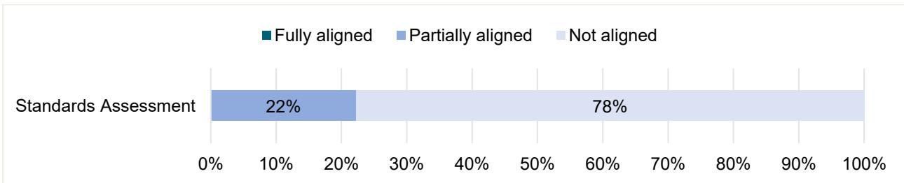
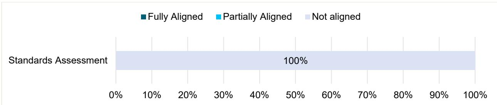

ALIGNMENT ASSESSMENT OF THE
WORLDWIDE RESPONSIBLE
ACCREDITED PRODUCTION
CERTIFICATION WITH OECD DUE
DILIGENCE STANDARDS

# Disclaimers

This work is issued under the responsibility of the Secretary-General of the OECD and does not necessarily reflect the official views of OECD Member countries.

This document and any map included herein are without prejudice to the status of or sovereignty over any territory, to the delimitation of international frontiers and boundaries and to the name of any territory, city or area.

Photo credits: © Getty Images / Matveev Aleksandr.

© OECD 2026.

## Attribution 4.0 International (CC BY 4.0).

This work is made available under the Creative Commons Attribution 4.0 International licence. By using this work, you accept to be bound by the terms of this licence (https://creativecommons.org/licenses/by/4.0/).

## Attribution – you must cite the work.

Translations – you must cite the original work, identify changes to the original and add the following text: In the event of any discrepancy between the original work and the translation, only the text of original work should be considered valid.

Adaptations – you must cite the original work and add the following text: This is an adaptation of an original work by the OECD. The opinions expressed and arguments employed in this adaptation should not be reported as representing the official views of the OECD or of its Member countries.

Third-party material – the licence does not apply to third-party material in the work. If using such material, you are responsible for obtaining permission from the third party and for any claims of infringement.

You must not use the OECD logo, visual identity or cover image without express permission or suggest the OECD endorses your use of the work.

Any dispute arising under this licence shall be settled by arbitration in accordance with the Permanent Court of Arbitration (PCA) Arbitration Rules 2012. The seat of arbitration shall be Paris (France). The number of arbitrators shall be one.

This report presents the findings of the OECD's assessment (standards-only) of the Worldwide Responsible Accredited Production (WRAP) certification (January 2023 edition) (hereafter “Standard”) (WRAP, 2023[1]) and corresponding guidance documents against the recommendations of the OECD Due Diligence Guidance for Responsible Supply Chains in the Garment and Footwear Sector (OECD, 2018[2]) (hereafter “OECD Garment Guidance”). The standards-only assessment took place between February 2024 and August 2025. This assessment did not include an assessment of the initiative’s implementation of its Standard or of its internal governance and management systems.

The assessment is part of the OECD's ongoing work with sustainability initiatives in the garment and footwear sector. Completed assessments are publicly available on the OECD's website (OECD, n.d.[3]). Please refer to the assessment methodology (OECD, 2024[4]) for further details.

The OECD Garment Guidance provides enterprises in the garment and footwear sector with step-by-step recommendations for how to conduct risk-based responsible business conduct (RBC) due diligence in order to identify and address actual and potential adverse impacts in their operations and supply chains. The Guidance is relevant for all enterprises in the sector, at all stages of the supply chain. This includes, among others, retailers, brands, manufacturers, textile producers, global commodities traders, ginners and raw material producers.

The OECD Secretariat would like to thank WRAP and its staff for their willingness to undergo an alignment assessment and acknowledge the significant positive engagement and investment in terms of time spent. The OECD Secretariat would also like to thank Kumi Consulting for its support in undertaking this assessment.

This assessment was conducted with the financial support of the Sector Programme Social and Ecological Transformation of Textile Supply Chains (SETTS), which is implemented by Deutsche Gesellschaft für Internationale Zusammenarbeit (GIZ) and supported by the German Federal Ministry for Economic Co-operation and Development.

This standard-only assessment did not include an assessment of WRAP' implementation of its standard or of its internal governance and management systems. Alignment assessments do not evaluate or draw conclusions about the adequacy of due diligence conducted by individual enterprises that participate in, are members of, or are certified by the initiative under assessment (OECD, 2024[4]).

By starting the alignment assessment process and using the alignment assessment tool (OECD, n.d. $^{[5]}$ ), initiatives agree to abide by terms and conditions of use (OECD, 2024 $^{[6]}$ ). The use of the alignment assessment tool and completion of an OECD alignment assessment does not imply any endorsement by or affiliation with the OECD. For an initiative to claim to be aligned with OECD Due Diligence Guidance (standards or implementation), it must achieve a rating of “fully aligned” in the overall conclusion of the relevant section of the alignment assessment.

## Table of contents

Disclaimers
Foreword
1 Initiative, methodology and assessment scope
About the Worldwide Responsible Accredited Production certification
Methodology
Scope of the WRAP Standards Assessment
2 Standards Assessment results
Overall Standards Assessment results
Calculation formulae
General strengths
General opportunities for improvement
Overarching criteria
Step 1 – Embed responsible business conduct in enterprise policy and management systems
Step 2 – Identify actual and potential adverse impacts in the enterprise’s own operations and supply chain
Step 3 – Cease, prevent or mitigate adverse impacts in the enterprise’s own operations and supply chain
Step 4 – Track
Step 5 – Communicate
Step 6 – Provide for or co-operate in remediation when appropriate
Additional criteria
Annex A. Alignment assessment criteria and results
Annex B. List of key documents
References
Notes
FIGURES
Figure 1. Standards Assessment: not aligned
Figure 2. Results: Overarching criteria
Figure 3. Step 1 results
Figure 4. Step 2 results
Figure 5. Step 3 results
Figure 6. Step 4 results
Figure 7. Step 5 results
Figure 8. Step 6 results
Figure 9. Additional criteria results
TABLES
Table 1. Scope of the Worldwide Responsible Accredited Production certification – Summary
Table A A.1. Due Diligence criteria

## 1 Initiative, methodology and assessment scope

## About the Worldwide Responsible Accredited Production certification

The Worldwide Responsible Accredited Production (WRAP) certification (hereafter “Standard”) applies to production facilities in the garment and footwear sector, as well as related industries such as accessories, home furnishings, and travel goods. The Standard consists of 12 principles (WRAP, n.d.[7]), which are further operationalised through an audit report template (WRAP, 2023[1]). The principles address labour and environmental practices, customs compliance and security (e.g. prohibition of child labour, limit of working hours, respect of freedom of association, compliance with environmental rules, regulations and standards). WRAP enforces a zero-tolerance policy on certain issues. $^{1}$ The most recent version of the audit report template was issued in January 2023. In July 2025, over 3 900 facilities held a valid certificate (WRAP, n.d.[8]). See Table 1 for a summary of the Standard’s scope of activities as taken into account in the assessment, and as described in more detail below:

Supply chain scope: The Standard's requirements primarily address RBC issues and management systems within the facility's own operations, with some requirements concerning the facility's key suppliers and sub-contractors.

Own operations scope and context: The Standard addresses facilities' operations. It is recognised that production facilities, particularly small and medium-sized enterprises, often operate with more limited resources, which can constrain their ability to implement RBC due diligence in their own operations and across their supply chain (see OECD Garment Guidance (OECD, 2018, pp. 18, 26, Table 7, Box 12[2]; 2021[9]). The nature and extent of due diligence can be affected by factors such as the size of the enterprise, the context of its operations, its business model, its position in supply chains, and the nature of its products or services. Large enterprises with expansive operations and many products or services may need more formalised and extensive systems than smaller enterprises with a limited range of products or services to effectively identify and manage risks. The size or resource capacity of an enterprise does not change its responsibility to conduct due diligence commensurate with risk but may affect how it does so. Enterprises with resource constraints may rely more heavily on collaborative approaches and make more careful decisions in prioritisation [OECD (2018[10]) Annex, Q6].

Performance ratings and bands: WRAP has two levels of certification: gold and platinum. Both are awarded against the same criteria, with the level determined by the length of time a facility has been WRAP-certified. More than 90% of certified facilities hold gold certification, which is awarded for full compliance with WRAP's 12 Principles and is valid for one year. Although expectations are similar to the gold level, the platinum certification, valid for two years, is awarded to facilities that have demonstrated full compliance across three consecutive audits with no corrective actions. A production facility can then use the “Certified Facility” logo as long as it holds a valid gold or platinum certification.

Assessment activities: Facilities may begin with an optional self-assessment before undergoing an audit by an accredited third-party audit firm. WRAP then reviews the audit report, after which an independent review board determines whether a certificate will be issued.

Table 1. Scope of the Worldwide Responsible Accredited Production certification – Summary

<table><tr><td>Issue</td><td>Standard scope</td></tr><tr><td>Verification or facilitation</td><td>Verification</td></tr><tr><td>Sector focus</td><td>Garment and footwear sector</td></tr><tr><td>Geographical scope</td><td>Global</td></tr><tr><td>RBC risks scope</td><td>Human rights with a strong focus on labour rights, environmental issues</td></tr><tr><td>Supply chain segment and production/manufacturing processes addressed</td><td>Own operations</td></tr><tr><td>Evaluation of products / company practices / sites / chain of custody</td><td>Company practices</td></tr><tr><td>Subject of evaluation</td><td>Production facilities</td></tr><tr><td>Number of certified companies</td><td>3 908 (July 2025) $^{1}$ </td></tr><tr><td>Summary of core activities</td><td>Certification</td></tr><tr><td>Assurance: 1st / 2nd / 3rd party</td><td>3rd party (independent)</td></tr><tr><td>Product logo</td><td>Yes</td></tr><tr><td>Verification or facilitation</td><td>The Standard does not officially recognise other third-party standards or initiatives.</td></tr></table>

Note: WRAP (n.d.[8]), WRAP-accredited monitoring firms and certified facilities, https://wrapcompliance.org/en/certification/facility-monitor-list/.

## Methodology

The assessment is based on the OECD's alignment assessment methodology (OECD, 2024[4]). For the WRAP certification (hereafter “Standard”), the OECD conducted an assessment of written policies and standards (Standards Assessment). This assessment did not include an assessment of the initiative's implementation of its Standard or its internal governance and management systems. $^{2}$

A Standards Assessment evaluates the extent to which the initiative's written policies and standards align with the relevant OECD Due Diligence Guidance, here the OECD Garment Guidance.

Standards Assessments are based on:

\- a desktop review of relevant written policies, standards, tools and methodology documents; and

• scoping interviews with staff, as relevant.

To assess the alignment of initiatives in the garment and footwear sector, the OECD has developed an alignment assessment tool (OECD, n.d.[5]) that translates the OECD Garment Guidance into assessment criteria and guidance. Each due diligence criterion is evaluated and assigned a rating ranging from not aligned, partially aligned, fully aligned or out of scope. There are a small number of criteria which are only scored in an assessment where the initiative is fully aligned, as they cover actions that companies are encouraged rather than expected to take. The governance criteria are separately evaluated and assigned a rating of fully addressed, partially addressed or not addressed. The approach taken to evaluate and rate criteria depends on the initiative's scope and core activities, including whether it sets requirements for and evaluates companies' due diligence performance, or facilitates due diligence through tools, guidance or other activities.

The overall assessment result for the Standards Assessment is based on the formula in Section 2.

## Facilitation versus verification initiatives

For the purpose of OECD alignment assessments, the OECD distinguishes between initiatives that:

(1) facilitate or support the due diligence process of an enterprise, including by carrying out due diligence activities on behalf of companies, but which do not assess or certify business practices, sites or products against requirements ("facilitation initiatives" $^{3}$ ); and.

(2) set requirements for and assess or certify individual business practices, sites or products (“verification initiatives” $^{4}$ ).

Many initiatives carry out a mix of facilitation and verification activities, and in these situations, the assessment can be adapted to cover both aspects.

Verification initiatives also often reward different levels of performance to participating or assessed enterprises (e.g. bronze, silver, gold or levels 1, 2 and 3). The rewarded performance level can be based on fulfilling all of the initiative's mandatory criteria, meeting specific thresholds or scoring points from a mix of criteria. An alignment assessment can focus on one specific performance level if agreed upon in the scoping exercise.

## Box 1. Assessing written standards of verification initiatives

The OECD's Due Diligence Guidance, including the Garment Guidance, sets out recommendations by governments to enterprises. The voluntary nature of the language in the standards reflects this. In contrast, verification initiatives require certain business practices, evaluate performance against them and allow enterprises to make corresponding public claims. Verification initiatives often use language that varies in its degree of obligation. Mandatory criteria can use terms such as “shall” or “must,” while aspirational criteria tend to use terms such as “could,” “may” or “should” to express recommendations or other optional criteria. These differences in language are important because they determine what verification initiatives expect from their participating or member enterprises for a certain performance level, or in order to issue a product or facility certificate and the degree of oversight they have. While the exact wording varies according to each initiative, it is important that any requirements are set out in clear language for stakeholders. Vague, aspirational, or inconsistent language between documents can result in core due diligence elements being entirely outside the scope of what the verification initiative requires and checks. Recommendations are in practice outside the scope of verification activities.

As a result, the alignment assessments do not consider recommendations to be at the same level or have the same weight as requirements as they do not inform whether a company is certified or not, or the claims that a company can make as a result. The assessment otherwise risks allowing for fully aligned results for verification initiatives where the initiative does not, in practice, expect companies to fulfil the criterion.

This focus on requirements does not flow from the international instruments themselves, but from the fact that the objective of verification initiatives is to require certain business practices from companies and to allow companies to make specific public claims in terms of their performance against those requirements, whether through a certification, product label or performance level. If a verification initiative aims to align with OECD Due Diligence Guidance, this involves translating the OECD's voluntary recommendations into mandatory requirements and integrating them into the initiative's systems and operations.

Source: OECD (2024[4]), Methodology for OECD alignment assessments of sustainability initiatives, https://doi.org/10.1787/b533c060-en.

## Scope of the WRAP Standards Assessment

This standard-only assessment did not include an assessment of WRAP's implementation of its Standard or of its internal governance and management systems. Further, alignment assessments do not evaluate or draw conclusions about the adequacy of due diligence conducted by individual enterprises that participate in, are members of or are certified by the initiative under assessment (OECD, 2024[4]).

For the WRAP certification (hereafter “Standard”), the OECD conducted an assessment of written policies and standards (Standards Assessment). This section sets out the main assessment activities carried out for the Standards Assessment, as well as key methodological considerations and scoping decisions.

For the Standards Assessment, the OECD has carried out the following activities:

• a desktop analysis of the written policies and standards listed in Annex B.

## Key methodological considerations:

\- WRAP is designed to attest outcomes on selected risk issues within a production facility. Risk certifications typically attest to the absence of specific risks (e.g. overtime) or the presence of certain characteristics or aspects (e.g. payment of wages) at an enterprise (OECD, 2025, p. 12[11]). The degree to which such certifications focus on risk-based due diligence practices varies. While all companies, including production facilities, are expected to conduct due diligence on their own operations and supply chain (OECD, 2018, p. 17[2]), the assessment was tailored to the specific scope of the Standard and focusses on WRAP's requirements to facilities' own operations.

\- As the Standard certifies company performance, the Standards Assessment focuses on the extent to which it sets clear and consistent requirements for companies that align with the content in the alignment assessment criteria (see Box 1 on verification initiatives more broadly).

\- The alignment assessment criteria also contain “encouraged criteria” (see grey-shaded criteria in Annex A). Although recommendations generally fall outside the scope of alignment assessments of verification initiatives (see Box 1), the “encouraged criteria” are an exception. Criteria of verification initiatives can be rated as “fully aligned” with these “encouraged criteria” if their standards incorporate these aspirational elements and are only counted when fully aligned.

## Key scoping decisions included:

\- Cut-off date for documents: The OECD evaluated only documents that were adopted before or on 2 April 2024; documents developed or revised after this date were out of scope (see Annex B).

\- RBC risk issues: The Standard was assessed against the expectations in the OECD Garment Guidance as they relate to labour and environmental risks.

Supply chain segment: The Standard's requirements apply to facilities' own operations. Criteria related to supply chain due diligence were therefore out-scoped. Relevant criteria are marked "out of scope" in Annex A. See also considerations regarding the application of due diligence expectations to small and medium-sized facilities, under "own operations and context" in Section 1 (see About the Worldwide Responsible Accredited Production certification).

\- Due diligence steps: The Standard sets expectations that relate to Steps 1-4 and Step 6 of the due diligence framework and was therefore assessed against those steps. WRAP does not require facilities to report publicly on due diligence, so Step 5.1 criteria were out-scoped. Relevant criteria are marked “not assessed” in Annex A.

Please refer to the section on “Scoping and planning” of the OECD alignment assessment methodology (OECD, 2024[4]) for more information on scoping decisions.

This section presents the findings of the assessment. Findings are presented in a bar chart displaying the number of criteria found to be fully aligned, partially aligned, or not aligned per step and calculation formulae. A number of strengths and areas for improvement are given in a narrative format to illustrate key findings. As the OECD conducted a standards-only assessment, only the overall rating for the Standards Assessment is given. For a full breakdown of ratings, see Annex A.

## Overall Standards Assessment results

The overall result for the Standards Assessment is not aligned (see Figure 1).

Figure 1. Standards Assessment: Not aligned  
  
Note: AC = Additional criteria.

## Calculation formulae

The overall conclusion of the Standards Assessment is based on the following formula:

\- Fully aligned: (overarching criteria $\varnothing = 100\%$ "fully aligned") + (Steps 1-6 + additional criteria $\varnothing = 80\%$ or more criteria "fully aligned") + (no "not aligned" criteria)

\- Partially aligned: all other combinations between “fully aligned” and “not aligned”

\- Not aligned: (overarching criteria = less than 80% of criteria “partially aligned” or “fully aligned”) and/or (Steps 1-6 + additional criteria ∅ = 25% or more criteria “not aligned”).

## General strengths

\- The audit report template is well-structured, and the audit questions guide assessors and facilities through the principles.

\- The Standard contains comprehensive requirements on labour conditions, although the environmental requirements are less comprehensive.

\- The auditor handbook (WRAP, 2024[12]) and risk management guide (WRAP, 2021[13]) provide helpful guidance on the requirements and assessment process and promote a consistent interpretation and assessment of the Standard.

\- In the audit report template, WRAP clarifies to certified entities and their potential buyers that the audit process is a sampling exercise which does not guarantee that the audited facility fully complies with the WRAP principles before, during or post-audit.

## General opportunities for improvement

\- WRAP approaches risk-based prioritisation primarily through its zero-tolerance approach, where it predefines a set of zero-tolerance issues, including deliberate and ongoing human rights violations (e.g. child labour, forced labour, inhumane treatment), threatening physical harm towards audit teams and false representations. Zero-tolerance issues are defined slightly differently across the documents, with open and closed lists. While it is important that harmful practices are addressed, the zero-tolerance approach risks undermining proactive engagement and progressive improvement.

\- WRAP's approach to zero-tolerance issues and how they relate to de-certification is not fully consistent across key documents. The zero-tolerance section on the website (WRAP, n.d.[14]) states that facilities have to go through a remediation process, with decertification as a last resort. The facility and auditor handbooks state that facilities actively participating in or associated with zero-tolerance issues will be automatically de-certified and banned from future participation [(WRAP, 2021, p. 31[15]; WRAP, 2024, p. 33[12]),].

\- WRAP requires that all corrective actions be closed before certification is granted. A strict, compliance-based approach risks disincentivising facilities from engaging in remediation processes or making meaningful progress in the longer term to prevent and mitigate impacts.

\- Some expectations are only outlined in the facilities' handbook (e.g. adoption of the principles, verification of corrective actions) which may result in auditors and facilities overlooking certain expectations if the documents are not consulted together.

## Overarching criteria

Figure 2 illustrates the assessment ratings for the nine overarching criteria that flow from the due diligence characteristics outlined in the OECD Garment Guidance and the OECD Due Diligence Guidance for Responsible Business Conduct (OECD, 2018[2]).

Figure 2. Results: Overarching criteria  
  
Note: Based on nine required criteria.

Given the majority of partially aligned and not aligned ratings, observations on the strengths and opportunities for improvement are combined in each of the points below.

\- Preventative approach: The Standard emphasises facilities' monitoring of implementation, reviewing policies and procedures, and training to prevent impacts in the long term. However, it places greater emphasis on pre-defined prevention and mitigation measures (e.g. training), rather than prevention and mitigation activities that are tailored to the specific risk and context (see Step 3). It does not require facilities to understand why a measure was ineffective (see Step 4).

\- Dynamic approach: The Standard requires regular monitoring, but overall, the monitoring exercise tends to be quite static (e.g. no re-assessments of own operations when external contexts have changed). The Standard places less emphasis on some expectations related to tracking that would help the facility to respond to obstacles to effective prevention and mitigation (see Steps 3 and 4). The Standard does not emphasise progressive improvement over time and instead requires facilities to close all identified corrective actions prior to certification.

\- Commensurate with risk (risk-based approach): The Standard does not require facilities to adapt their due diligence activities to the specific risks identified, with some exceptions (e.g. more frequent checks on health and safety issues) (see Steps 2, 3 and 4).

\- Prioritisation (risk-based approach): The Standard differentiates between predefined zero-tolerance issues and other risks and impacts. In the context of wider corrective actions for issues that are not considered zero-tolerance, the Standard also distinguishes between “major” non-compliances (e.g. systemic violations; failure of management systems; non-transparency), “minor” non-compliances (e.g. occasional or isolated violations that do not seriously compromise workers’ basic rights and/or safety) and “observations” (i.e. potential violations if timely action is not taken). However, the approach is static overall. WRAP does not require facilities to assess and prioritise risks on the basis of severity and likelihood and requires all corrective actions to be closed.

\- Meaningful engagement with stakeholders: The Standard does not require facilities to commit to meaningful stakeholder engagement (e.g. through a policy); however, it includes some relevant requirements on carrying out meaningful engagement with workers and their representatives. The Standard does not further define meaningful engagement. Requirements to engage with workers or their representatives focus on involving them in the design of corrective actions (e.g. no requirements that facilities engage with workers as part of their risk assessments (Step 2), monitoring progress (Step 4) or improving grievance mechanisms and remediation (Step 6)).

## Step 1 – Embed responsible business conduct in enterprise policy and management systems

Figure 3 illustrates the alignment assessment ratings for Step 1.

Figure 3. Step 1 results  
  
Note: Based on 19 required and 1 encouraged criterion. Encouraged criteria are only counted when fully aligned.

Given that the majority of criteria were rated partially aligned and not aligned, observations on the strengths and opportunities for improvement are combined in each of the points below.

\- The Standard requires facilities to adopt written policies addressing WRAP's 12 Principles and communicate them within the facility, but it does not emphasise a commitment to conducting due diligence in these risk areas.

\- The Standard expects that policies are updated to reflect changes in local or national laws but does not require facilities to tailor their policies to their most significant risks and impacts, or to update them in response to new findings or evolving circumstances.

\- The Standard requires facilities to communicate RBC-related expectations (i.e. compliance with WRAP Principles, local laws) to subcontractors and their top three raw material suppliers, reflecting a considerably narrower scope to communicate expectations to all direct suppliers [ (WRAP, 2023[1]), questions 1.8 – 1.10 and (WRAP, 2021[15]), p. 13].

\- The Standard requires facilities to define internal responsibilities, assign staff to oversee the implementation of the WRAP principles, adopt these principles in writing at top management level, and maintain records (e.g. record-keeping on wages, occupational health and safety, emissions) [ (WRAP, January 2023[16]), p. 29 and questions 1.2c, 9.3b, 11.3]. While these measures support risk management, the measures focus on the implementation of the WRAP principles (e.g. prohibition of child labour, working hours, respect of freedom of association, compliance with environmental rules, regulations and standards) and not on conducting due diligence in these risk areas (see Steps 2 – 6).

\- Some expectations are only outlined in the facilities' handbook (e.g. adoption of the principles, internal procedures for supervising practices related to the principles). As a result, auditors and facilities may overlook expectations if all documents are not consulted together.

Step 2 – Identify actual and potential adverse impacts in the enterprise’s own operations and supply chain

Figure 4 illustrates the alignment assessment ratings for Step 2.

Figure 4. Step 2 results  
  
Note: Based on 14 required criteria.

As for Step 1, observations on the strengths and opportunities for improvement are combined in each of the selected points below.

\- The Standard does not require facilities to conduct a high-level risk scoping exercise to identify which risks of adverse impacts are most significant in their own operations. This impacts all ratings relating to the risk scoping (e.g. risk factors, documentation and update of the scoping).

\- The Standard requires facilities to monitor the implementation of the WRAP principles [ (WRAP, 2023[1]), questions 1.4a – b] which shares some similarities with the self-assessment of own operations in the OECD Garment Guidance. However, facilities are not required to focus their monitoring on their most significant risks (risk-based prioritisation). The monitoring also does not focus on determining the extent of actual risks and impacts.

\- The Standard requires facilities to seek external expertise but limits this to building safety in Bangladesh (WRAP, 2021[17]).

\- The Standard does not require facilities to engage with potentially affected stakeholders (i.e. workers or their representatives) when identifying or assessing risks or impacts.

\- The Standard does not require facilities to understand whether they have caused or contributed to impacts or risks through their own activities and operations (e.g. business model or design or purchasing practices).

\- As for other steps, some expectations are only outlined in the facilities' handbook (e.g. conduct an internal audit assessment at a minimum of once per year).

Step 3 – Cease, prevent or mitigate adverse impacts in the enterprise’s own operations and supply chain

Figure 5 illustrates the alignment assessment ratings for Step 3.

Figure 5. Step 3 results  
  
Note: Based on eight required criteria.

As for Step 2, observations on the strengths and opportunities for improvement are combined in each of the selected points below.

\- The Standard requires facilities to take immediate actions to stop existing impacts in their own operations as all non-compliances need to be corrected before certification is granted. It requires facilities to designate responsible individuals and establish completion dates for corrective actions (WRAP, January 2023, p. 3[16]). In addition, the Standard defines zero-tolerance issues and requires facilities to address these without delay (e.g. child and forced labour, bribery). However, a zero-tolerance approach may not account for more complex situations where facilities need more time to stop activities that are causing or contributing to harm (e.g. adapting purchasing or sourcing practices or business models). While it is reasonable for a certification to require that all requirements are fulfilled in order to be certified, the emphasis of the requirements is on the absence of open corrective actions rather than on evidence of credible improvement over time (see General opportunities for improvement).

\- The Standard requires facilities to consult with worker representatives or health and safety committees on working conditions and solutions to findings [ (WRAP, January 2023[16]), questions 8.5, 8.32b, 9.5c].

\- The Standard requires facilities to provide training on the principles as a means of preventing impacts in the long term and implementing internal monitoring and risk assessment systems to review processes over time [ (WRAP, January 2023[16]), questions 4.27.11, 8.33, 8.34, 8.35, 8.64b, (WRAP, 2021, p. 13[15]). However, these trainings follow pre-defined topics and are therefore not fully tailored to the facility's most significant risks or impacts.

\- The Standard requires facilities to develop a corrective action plan (CAP) for all non-compliances, however, it does not require facilities to consider other information (e.g. from the bi-annual monitoring, grievances, impacted stakeholders) when developing the plan for their own operations, which may result in significant impacts not identified in the audit remaining unaddressed. The Standard also does not explicitly require that corrective actions be proportionate to the severity of the identified impacts, only requiring root cause analysis in limited situations (excessive working hours).

## Step 4 – Track

Figure 6 illustrates the alignment assessment ratings for Step 4.

Figure 6. Step 4 results  
  
Note: Based on five required criteria.

Given the overall partially aligned and not aligned ratings, observations on the strengths and opportunities for improvement are combined in each of the selected points below.

\- The facilities' handbook requires facilities to maintain internal procedures to oversee implementation of corrective actions. However, this is only outlined in the handbook and not in the Standard (WRAP, 2021, p. 13[15]).

\- The Standard requires facilities to ensure the effectiveness of certain trainings [ (WRAP, January 2023[16]), questions 6.2, 7.3, 8.8]. However, it does not require facilities to validate whether all prevention and mitigation measures (i.e. corrective actions per Step 3) are effective in preventing and mitigating risks and actual impacts, or to explore underlying causes where they are not.

\- The Standard requires that companies conduct bi-annual monitoring of operational aspects like water and electricity, and document the steps taken within their corrective action plan, which implicitly refers to monitoring progress.

## Step 5 – Communicate

Figure 7 illustrates the alignment assessment ratings for Step 5.

Figure 7. Step 5 results  
  
Note: Based on seven required criteria. Step 5.1. on public reporting was out-scoped.

## Key opportunities for improvement

\- The Standard does not require facilities to report publicly on due diligence. All relevant criteria were therefore out-scoped and marked “not assessed” in Annex A. However, it is recommended that WRAP integrates public reporting expectations for facilities.

\- The Standard has some requirements related to how facilities are expected to communicate with affected stakeholders on how impacts were addressed (e.g. communication with workers and trade unions, protection of affected stakeholders through a confidential reporting channel).

## Step 6 – Provide for or co-operate in remediation when appropriate

The assessment of Step 6 covers the Standard's requirements for companies to:

• provide remedy, where appropriate (OECD, 2023[18]); $^{5}$

\- establish (in own operations) or support the establishment (in supply chains) of effective operational-level grievance mechanisms (OLGM); and

• determine the appropriate form of remedy, consistent with the OECD Garment Guidance.

As WRAP does not provide a grievance mechanism directly to facilities, and as the assessment focusses on own operations, the relevant sections (back-up mechanism for the supply chain, initiative mechanism) were out-scoped.

Figure 8 illustrates the alignment assessment ratings for Step 6. $^{4}$

Figure 8. Step 6 results  
  
Note: Based on 12 required criteria.

Given the overall partially aligned and not aligned ratings, observations on the strengths and opportunities for improvement are combined in each of the selected points below.

\- The Standard includes some expectations to remediate in the case of deliberate use of child labour (WRAP, 2021, p. 31[15]). However, it does not explicitly require facilities to provide for or co-operate with others to provide remedy whenever they cause or contribute to an actual impact. The Standard instead uses the term “remediation” to refer to the resolution of site-level risks and impacts (corrective action plan), a process which varies according to the level of severity as well as WRAP’s determinations of what amounts to a major or minor non-conformance. This does not reflect the meaning of remedy in the international standards or that remediation applies irrespective of the severity of the impact.

\- While the Standard requires facilities to have a grievance mechanism [ (WRAP, January 2023[16]), question 9.3] in their own operations that could potentially enable remediation, it does not frame the mechanism as a means to deliver remedy. Facilities are required to ensure that the mechanism is known to all workers, implement safeguards such as protections against retaliation, appoint an individual to manage grievances, and establish clear procedures. These elements relate to some of the United Nations Guiding Principles (UNGP) effectiveness criteria for grievance mechanisms (i.e. legitimacy, predictability) (UN Office of the High Commissioner for Human Rights, 2021[19]) but not all.

\- While the Standard requires facilities to have a process in place to enable remediation in their own operations through the grievance mechanism, it does not frame the mechanism as a means to deliver remedy, in the sense of restoring individuals or groups to the situation they would have been in had the impact not occurred. This impacts ratings of all expectations on remediation.

\- The Standard does not encourage facilities to integrate lessons learned from complaints into their policies, practices, and monitoring systems.

## Additional criteria

Figure 9 illustrates the alignment assessment ratings for the additional criteria, $^{7}$ which relate to collaboration, communication and accountability topics covered in the OECD Garment Guidance.

Figure 9. Additional criteria results  
  
Note: Based on five required criteria. Three criteria relating to supply chains were out-scoped.

## Key opportunities for improvement

\- The Standard does not include requirements for companies to collaborate with other enterprises to prevent and mitigate risks, improve sector transparency, or access and the provision of remedy.

\- The Standard does not require companies to understand and publicly communicate the scope of initiatives they use in their due diligence.

# Annex A. Alignment assessment criteria and results

Table A A.1. Due Diligence criteria

<table><tr><td>No.</td><td>Criteria</td><td>Alignment: SA rating</td></tr><tr><td>0.01</td><td>The initiative requires the enterprise's due diligence to be preventative.</td><td>Partially aligned</td></tr><tr><td>0.02</td><td>The initiative requires the enterprise's due diligence to be an integral part of decision making.</td><td>Partially aligned</td></tr><tr><td>0.03</td><td>The initiative requires the enterprise's due diligence to be commensurate with risk (i.e. it is risk based).</td><td>Not aligned</td></tr><tr><td>0.04</td><td>The initiative requires the enterprise's due diligence to involve prioritisation (i.e. it is risk based).</td><td>Not aligned</td></tr><tr><td>0.05</td><td>The initiative requires the enterprise's due diligence to be dynamic.</td><td>Not aligned</td></tr><tr><td>0.06</td><td>The initiative requires the enterprise's due diligence to be informed by meaningful engagement with stakeholders.</td><td>Partially aligned</td></tr><tr><td>0.07</td><td>The initiative requires the enterprise's due diligence to involve ongoing communication.</td><td>Not aligned</td></tr><tr><td>0.08</td><td>The initiative requires the enterprise's due diligence to be appropriate to its circumstances.</td><td>Not aligned</td></tr><tr><td>0.09</td><td>The initiative requires the enterprise to considers the unique position of women systematically at all stages of the due diligence process.</td><td>Not aligned</td></tr><tr><td>1.01</td><td>The initiative requires the enterprise to establish a policy or policies that include RBC due diligence commitments regarding their own activities and operations and its supply chain.</td><td>Not aligned</td></tr><tr><td>1.02</td><td>The initiative requires the enterprise to establish a policy or policies that articulate their due diligence expectations of business partners – including suppliers, licensees, and intermediaries – on RBC matters across the length of their supply chain(s).</td><td>Partially aligned</td></tr><tr><td>1.03</td><td>The initiative requires that the enterprise's policy includes commitment to observe the OECD Guidelines for Multinational Enterprises and issues covered by the Guidelines. The policy should also commit to upholding international standards on sector risks and sub-sector risks, relevant to the enterprise and make explicit reference to relevant international standards.</td><td>Not aligned</td></tr><tr><td>1.04</td><td>The initiative requires that the enterprise's policy includes commitments to conduct due diligence regarding “significant risks” in the enterprise's own operations and supply chain.</td><td>Not aligned</td></tr><tr><td>1.05</td><td>The initiative requires that the enterprise's policy or policies include its expectations of suppliers to conduct due diligence regarding “significant risks” in the enterprise's supply chain.</td><td>Out of scope</td></tr><tr><td>1.06</td><td>The initiative requires that the enterprise's policy includes a commitment to responsible sourcing practices, i.e. a commitment that the enterprise will seek to prevent its purchasing practices contributing to harmful impacts.</td><td>Not aligned</td></tr><tr><td>1.07</td><td>The initiative requires that the enterprise's policy stipulates the enterprise's expectations regarding the use of subcontractors including a definition and distinctions in subcontracted work if they exist.</td><td>Partially aligned</td></tr><tr><td>1.08</td><td>The initiative requires that the enterprise's policy includes a commitment to meaningful stakeholder engagement in the course of due diligence.</td><td>Not aligned</td></tr><tr><td>1.09</td><td>The initiative requires that the enterprise's policy includes the enterprise's expectations regarding the outsourcing to homeworkers and the use of handwork, where relevant to the enterprise's business model.</td><td>Not aligned</td></tr><tr><td>1.10</td><td>The initiative encourages enterprises to include in their policy a commitment to hear and address all complaints against the enterprise regarding its own operations.</td><td>Partially aligned</td></tr><tr><td>1.11</td><td>The initiative encourages enterprises to include in their policy a commitment to hear and address measured and substantiated complaints that the enterprise has caused or contributed to harms in its supply chain that are raised through legitimate processes.</td><td>Not aligned</td></tr><tr><td>1.12</td><td>The initiative requires that the enterprise's policy is developed with and informed by relevant internal and external expertise.</td><td>Not aligned</td></tr><tr><td>1.13</td><td>The initiative requires that the enterprise's policy is approved at the most senior level of the enterprise.</td><td>Not aligned</td></tr><tr><td>1.14</td><td>The initiative requires that the enterprise's policy is updated through an iterative process that builds on increasing knowledge about harms in the enterprise's supply chain.</td><td>Not aligned</td></tr><tr><td>1.15</td><td>The initiative encourages the enterprise to establish or strengthen corporate governance to oversee and support RBC by assigning responsibility for RBC implementation to the board and senior management.</td><td>Fully aligned</td></tr><tr><td>1.16</td><td>The initiative requires the enterprise to have senior staff with competence, knowledge and experience overseeing the implementation of the RBC policy(s).</td><td>Partially aligned</td></tr><tr><td>1.17</td><td>The initiative requires the enterprise to make the policy publicly available.</td><td>Not aligned</td></tr><tr><td>1.18</td><td>The initiative requires the enterprise to communicate the RBC due diligence policy to all relevant employees.</td><td>Partially aligned</td></tr><tr><td>1.19</td><td>The initiative requires the enterprise to communicate the policy to all direct suppliers.</td><td>Out of scope</td></tr><tr><td>1.20</td><td>The initiative requires the enterprise to allocate adequate support and resources to due diligence on human rights, labour, environment and integrity risks.</td><td>Partially aligned</td></tr><tr><td>1.21</td><td>The initiative requires the enterprise to incorporate due diligence into decision making processes at an organisational level.</td><td>Not aligned</td></tr><tr><td>1.22</td><td>The initiative requires the enterprise to establish alignment across teams and business units to support the implementation of the RBC policy.</td><td>Not aligned</td></tr><tr><td>1.23</td><td>The initiative requires the enterprise to have information management systems that are accurate and current and capable of storing the full extent of information necessary to conduct due diligence.</td><td>Partially aligned</td></tr><tr><td>1.24</td><td>The initiative encourages the enterprise to store due diligence information for a minimum of five years.</td><td>Partially aligned</td></tr><tr><td>1.25</td><td>The initiative encourages the enterprise to build into supplier contracts an obligation to support supply chain due diligence of risks linked to upstream production where appropriate.</td><td>Out of scope</td></tr><tr><td>2.01</td><td>The initiative requires the enterprise to conduct an informed scoping exercise to identify which risks of harm are most significant – in relation to likelihood and severity of harm – in its own operations and in its supply chain.</td><td>Not aligned</td></tr><tr><td>2.02</td><td>The initiative requires the enterprise's scoping to build on known sector and subsector risks.</td><td>Not aligned</td></tr><tr><td>2.03</td><td>The initiative requires the enterprise's scoping to take into account risks that may be specific to the products that the enterprise makes or sells.</td><td>Not aligned</td></tr><tr><td>2.04</td><td>The initiative requires the enterprise's scoping to take into account factors within the countries where the company operates or sources that may make sector risks more likely.</td><td>Not aligned</td></tr><tr><td>2.05</td><td>The initiative requires the enterprise's scoping to take into account risks factors that may be specific to the enterprise's sourcing model.</td><td>Not aligned</td></tr><tr><td>2.06</td><td>The initiative requires the enterprise's scoping to take into account components of the company's business model that may increase the likelihood or scope of risks in its supply chain.</td><td>Not aligned</td></tr><tr><td>2.07</td><td>The initiative requires enterprises to determine which risks of harm are most significant – in relation to likelihood and severity of harm – in its own operations and in its supply chain and prioritise those for action first.</td><td>Not aligned</td></tr><tr><td>2.08</td><td>The initiative requires the enterprise's scoping to be documented.</td><td>Not aligned</td></tr><tr><td>2.09</td><td>The initiative encourages the enterprise to consult with stakeholders and experts, where gaps in information exist.</td><td>Not aligned</td></tr><tr><td>2.10</td><td>The initiative requires the enterprise to review the findings of the scoping assessment on a semi-regular basis.</td><td>Not aligned</td></tr><tr><td>2.11</td><td>The initiative requires the enterprise to continually update the information in its risk scoping based on changing circumstances and be ready to respond to emerging risks.</td><td>Not aligned</td></tr><tr><td>2.12</td><td>The initiative requires the enterprise to carry out a self-assessment of its own operations to determine the extent of risks and actual impacts.</td><td>Partially aligned</td></tr><tr><td>2.13</td><td>The initiative encourages the enterprise to follow existing credible guidance for employers when assessing for risks of harm in its own operations.</td><td>Partially aligned</td></tr><tr><td>2.14</td><td>The initiative requires the enterprise to engage with potentially affected stakeholders (workers, trade unions and representative organisations) to identify potential and actual harm in its own operations.</td><td>Not aligned</td></tr><tr><td>2.15</td><td>The initiative requires the enterprise to review its policies and systems to assess the extent to which risks are being prevented or mitigated.</td><td>Partially aligned</td></tr><tr><td>2.16</td><td>The initiative encourages the enterprise to seek external support to conduct a self-assessment if the impact may cause severe harm if not adequately prevented and/or the prevention measures require technical expertise not available in-house.</td><td>Not aligned</td></tr><tr><td>2.17</td><td>The initiative requires the enterprise to assess suppliers who are associated with higher risks of those harms prioritised during the scoping exercise.</td><td>Out of scope</td></tr><tr><td>2.18</td><td>The initiative requires the enterprise to seek assurances from suppliers that the prioritised suppliers upstream are being assessed where severe risks are linked to upstream processes (e.g. cotton growing).</td><td>Out of scope</td></tr><tr><td>2.19</td><td>The initiative requires the enterprise to conduct supplier assessments when there are gaps in information or where the context has likely changed.</td><td>Out of scope</td></tr><tr><td>2.20</td><td>The initiative requires the enterprise to assess the measures that the assessed supplier has implemented to prevent harm.</td><td>Out of scope</td></tr><tr><td>2.21</td><td>The initiative requires the enterprise to assess the actual harm on the ground and risks of harm.</td><td>Out of scope</td></tr><tr><td>2.22</td><td>The initiative requires the enterprise to assess the extent to which the workers are aware of their rights in relation to human rights and labour rights.</td><td>Out of scope</td></tr><tr><td>2.23</td><td>The initiative requires the enterprise to assess whether the supplier has established an operational-level grievance mechanism and whether it is effective and meets the recommendations in Table 8 of the Guidance</td><td>Out of scope</td></tr><tr><td>2.24</td><td>The initiative requires the nature of the enterprise's assessment to correspond to the potential risk.</td><td>Out of scope</td></tr><tr><td>2.25</td><td>The initiative requires the enterprise's assessment to be adapted to the local context.</td><td>Out of scope</td></tr><tr><td>2.26</td><td>The initiative requires the enterprise to involve workers in the design of assessments for labour and human rights issues.</td><td>Out of scope</td></tr><tr><td>2.27</td><td>For risks of harm which are subjective (such as human rights and labour risks), the initiative requires enterprises to use multiple data points to assess the situation.</td><td>Out of scope</td></tr><tr><td>2.28</td><td>The initiative requires the enterprise's assessment methodology to be adjusted if actual findings do not correspond to expected findings.</td><td>Out of scope</td></tr><tr><td>2.29</td><td>The initiative requires that the assessment team have extensive knowledge of the relevant risks, including an understanding of the best methodology to identify actual and potential harms related to the risk within the local context.</td><td>Out of scope</td></tr><tr><td>2.30</td><td>The initiative requires the enterprise's assessment team to have knowledge of national and international standards related to the adverse impact.</td><td>Out of scope</td></tr><tr><td>2.31</td><td>The initiative requires the enterprise's assessment team to have the capability to conduct the assessment within the local context.</td><td>Out of scope</td></tr><tr><td>2.32</td><td>For labour and human rights issues, assessments should rely heavily on worker interviews.</td><td>Out of scope</td></tr><tr><td>2.33</td><td>The initiative requires the enterprise to make good faith efforts to understand whether it has caused, contributed to or is linked to the impacts that it has identified.</td><td>Not aligned</td></tr><tr><td>3.01</td><td>The initiative requires the enterprise to take immediate actions to stop existing impacts.</td><td>Fully aligned</td></tr><tr><td>3.02</td><td>The initiative requires the enterprise to establish and implement a plan to prevent and/or mitigate future harm in its own operations.</td><td>Partially aligned</td></tr><tr><td>3.03</td><td>The initiative requires the enterprise to take immediate actions to prevent any potential immediate and critical danger in the short-term.</td><td>Not aligned</td></tr><tr><td>3.04</td><td>The initiative requires the enterprise to seek to develop outcome-oriented solutions that lead to prevention of harm in the longer term.</td><td>Partially aligned</td></tr><tr><td>3.05</td><td>The initiative requires the enterprise's plan on preventing and mitigating harm in its own operations to include clear timelines for follow up.</td><td>Fully aligned</td></tr><tr><td>3.06</td><td>The initiative requires the enterprise's measures pursued on preventing and mitigating harm in its own operations to be proportionate to the severity of harm.</td><td>Not aligned</td></tr><tr><td>3.07</td><td>The initiative requires the enterprise to have considered whether to seek expert advice based on the level of risk.</td><td>Not aligned</td></tr><tr><td>3.08</td><td>The initiative requires the enterprise to engage workers, trade unions and representatives of the workers own choosing during the developments of the enterprise's measures on preventing and mitigating labour-related issues in the enterprise's own operations.</td><td>Fully aligned</td></tr><tr><td>3.09</td><td>The initiative requires the enterprise to develop and implement its own plan to seek to prevent or mitigate future harm in its supply chain.</td><td>Out of scope</td></tr><tr><td>3.10</td><td>The initiative requires the enterprise's plan on preventing and mitigating harm in the supply chain to include clear timelines for follow up.</td><td>Out of scope</td></tr><tr><td>3.11</td><td>The initiative requires the enterprise's measures pursued on preventing and mitigating harm in its supply chain to be proportionate to the severity of harm.</td><td>Out of scope</td></tr><tr><td>3.12</td><td>The initiative requires the enterprise to develop and implement a plan to prevent its contribution to harm if a risk of contributing to harm in the supply chain is identified.</td><td>Out of scope</td></tr><tr><td>3.13</td><td>For brands and retailers – The initiative requires the enterprise to implement control measures to prevent contributing to harm through its purchasing practices even if it has not identified specific instances of this.</td><td>Out of scope</td></tr><tr><td>3.14</td><td>For brands and retailers – The initiative requires the enterprise to have a system of procedures to follow in instances where purchasing practices could contribute to harm.</td><td>Out of scope</td></tr><tr><td>3.15</td><td>The initiative requires the enterprise to have developed pricing models that account for the cost of wages, benefits and investments in decent work.</td><td>Out of scope</td></tr><tr><td>3.16</td><td>The initiative requires the enterprise to implement internal measures to manage risks in its supply chain, where appropriate. These include measures that the enterprise itself can control.</td><td>Out of scope</td></tr><tr><td>3.17</td><td>The initiative requires the enterprise to seek to prevent/mitigate risks through its product development</td><td>Out of scope</td></tr><tr><td>3.18</td><td>The initiative requires the enterprise to have a good, local knowledge of its suppliers.</td><td>Out of scope</td></tr><tr><td>3.19</td><td>The initiative encourages the enterprise to establish incentives for suppliers to comply with the enterprise's RBC policy.</td><td>Out of scope</td></tr><tr><td>3.20</td><td>The initiative requires the enterprise to use its leverage, when appropriate, to influence its suppliers to prevent or mitigate impacts.</td><td>Out of scope</td></tr><tr><td>3.21</td><td>The initiative encourages the enterprise to pool leverage with other buyers if an enterprise does not hold leverage.</td><td>Out of scope</td></tr><tr><td>3.22</td><td>The initiative requires the enterprise to support suppliers, when appropriate, in preventing or mitigating impacts.</td><td>Out of scope</td></tr><tr><td>3.23</td><td>The initiative requires the enterprise to engage with government, when appropriate, to seek to prevent or mitigate adverse impacts.</td><td>Out of scope</td></tr><tr><td>3.24</td><td>The initiative requires the enterprise to disengage from a supplier, when appropriate, to prevent adverse impacts in its supply chains.</td><td>Out of scope</td></tr><tr><td>3.25</td><td>The initiative requires the enterprise to comply with national laws, international labour standards, and terms of collective bargaining agreements if the enterprise determines the need to disengage from a supplier.</td><td>Out of scope</td></tr><tr><td>3.26</td><td>The initiative requires the enterprise to provide information supporting the business decision to the supplier's management and the supplier's trade union (if one exists) if disengaging from a supplier.</td><td>Out of scope</td></tr><tr><td>3.27</td><td>The initiative requires the enterprise to give the supplier sufficient notice of the end of the relationship if disengaging from the supplier.</td><td>Out of scope</td></tr><tr><td>3.28</td><td>The initiative requires the enterprise to demonstrate its own efforts to mitigate the identified adverse impact(s) for as long as an enterprise has an ongoing relationship with a supplier.</td><td>Out of scope</td></tr><tr><td>4.01</td><td>The initiative requires the enterprise to verify internally that the enterprise has carried out the actions which it has committed to in its own operations.</td><td>Partially aligned</td></tr><tr><td>4.02</td><td>The initiative requires the enterprise to monitor due diligence on an ongoing basis using appropriate direct or indirect performance indicators in its own operations.</td><td>Partially aligned</td></tr><tr><td>4.03</td><td>The initiative requires the enterprise to draw on all known information including data from on-going monitoring, internal periodic assessments, issues raised through grievance mechanisms, etc. to validate that the steps taken by the enterprise are preventing and mitigating impacts in its own operations.</td><td>Not aligned</td></tr><tr><td>4.04</td><td>The initiative requires the enterprise in instances in which harmful impacts in its own operations have not been effectively prevented or mitigated to seek to understand why this is the case and respond appropriately, including by updating and implementing corrective action plans where appropriate. If the enterprise is unable to determine why an impact has not been prevented or mitigated, it seeks external guidance.</td><td>Not aligned</td></tr><tr><td>4.05</td><td>The initiative requires the enterprise to engage with external experts to validate the effectiveness of due diligence and risk management measures undertaken in its own operations where impacts may cause severe harm if not adequately prevented, or where prevention measures require technical expertise.</td><td>Not aligned</td></tr><tr><td>4.06</td><td>The initiative requires the enterprise to verify whether its due diligence requirements are being met in its supply chain.</td><td>Out of scope</td></tr><tr><td>4.07</td><td>The initiative requires the enterprise, whenever possible, to monitor indicators – either direct or indirect – over time to validate that impacts in its supply chain have been or are being prevented.</td><td>Out of scope</td></tr><tr><td>4.08</td><td>The initiative requires the enterprise to draw on all known information including data from on-going monitoring, internal periodic assessments, issues raised through grievance mechanisms, etc. to validate that the steps taken by the enterprise are preventing and mitigating impacts in its supply chain.</td><td>Out of scope</td></tr><tr><td>4.09</td><td>The initiative requires the enterprise in instances in which harmful impacts in its supply chain have not been effectively prevented or mitigated to seek to understand why this is the case and respond appropriately, including by updating and implementing corrective action plans where appropriate. If the enterprise is unable to determine why an impact has not been prevented or mitigated, it seeks external guidance.</td><td>Out of scope</td></tr><tr><td>4.10</td><td>The initiative encourages the enterprise to engage external experts to assess the effectiveness of due diligence and risk management measures undertaken in the supply chain where impacts in the supply chain may cause severe harm if not adequately prevented, or where prevention measures require technical expertise.</td><td>Out of scope</td></tr><tr><td>5.01</td><td>The initiative requires the enterprise to communicate publicly on its supply chain due diligence.</td><td>Out of scope</td></tr><tr><td>5.02</td><td>The initiative requires the enterprise to communicate publicly on its due diligence management systems.</td><td>Out of scope</td></tr><tr><td>5.03</td><td>The initiative requires the enterprise to communicate publicly on its most significant risks in its own operations and within its supply chain.</td><td>Out of scope</td></tr><tr><td>5.04</td><td>The initiative requires the enterprise to communicate publicly on its processes for assessing risks.</td><td>Out of scope</td></tr><tr><td>5.05</td><td>The initiative requires the enterprise to communicate publicly on its plan to prevent and mitigate harm in its own operations, and progress on those measures.</td><td>Out of scope</td></tr><tr><td>5.06</td><td>The initiative requires the enterprise to communicate publicly on its plan to prevent and mitigate harm in its supply chain, and progress on those measures.</td><td>Out of scope</td></tr><tr><td>5.07</td><td>The initiative requires the enterprise, if relevant, to communicate publicly on its objectives for government policy engagement and on the outcomes of engagement efforts.</td><td>Out of scope</td></tr><tr><td>5.08</td><td>The initiative requires the enterprise to communicate publicly on how it has meaningfully engaged with its stakeholders.</td><td>Out of scope</td></tr><tr><td>5.09</td><td>The initiative requires the enterprise to communicate publicly on the processes that provide access to remediation in its own operations.</td><td>Out of scope</td></tr><tr><td>5.10</td><td>The initiative requires the enterprise to communicate publicly on processes that provide access to remediation in its supply chain.</td><td>Out of scope</td></tr><tr><td>5.11</td><td>The initiative requires the enterprise to communicate publicly on the collaborative processes with which it engages that facilitate due diligence.</td><td>Out of scope</td></tr><tr><td>5.12</td><td>The initiative requires the enterprise to communicate publicly, at a minimum, on an annual basis.</td><td>Out of scope</td></tr><tr><td>5.13</td><td>The initiative requires the enterprise to communicate information in a way that is relevant, accurate, clear, user friendly with plain language, and to present information in a way that the intended users are able to access information.</td><td>Out of scope</td></tr><tr><td>5.14</td><td>The initiative requires the enterprise to be prepared to communicate externally, including with affected stakeholders, how it addresses its human rights impacts.</td><td>Not aligned</td></tr><tr><td>5.15</td><td>If the enterprise's operations or operating contexts pose risk of severe human rights impacts, the initiative requires the enterprise to report formally on how those risks are addressed.</td><td>Not aligned</td></tr><tr><td>5.16</td><td>The initiative requires the enterprise's communications to be of a form and frequency that reflect and enterprise's human rights impacts.</td><td>Not aligned</td></tr><tr><td>5.17</td><td>The initiative requires the enterprise's communications to provide information that is sufficient to evaluate the adequacy of an enterprise's response to the human rights impact.</td><td>Not aligned</td></tr><tr><td>5.18</td><td>The initiative requires the enterprise to ensure that communications do not pose risks to affected stakeholders, personnel or to legitimate requirements of commercial confidentiality.</td><td>Fully aligned</td></tr><tr><td>5.19</td><td>The initiative requires the enterprise's communications to be accessible to impacted stakeholders.</td><td>Not aligned</td></tr><tr><td>5.20</td><td>The initiative requires the enterprise, in relation to labour rights in its own operations, to communicate with its workers and trade unions and representative organisations of the workers' own choosing, including to understand what they deem to be material information.</td><td>Fully aligned</td></tr><tr><td>6.01</td><td>The initiative requires the enterprise to provide for or co-operate through legitimate processes in the remediation of adverse impacts it has caused or contributed to.</td><td>Not aligned</td></tr><tr><td>6.02</td><td>The initiative requires the enterprise to engage in legitimate processes that enable it to hear and address material and substantiated complaints that it has caused or contributed to harm in its supply chain.</td><td>Out of scope</td></tr><tr><td>6.03</td><td>The initiative encourages the enterprise to consult relevant guidance on establishing supply chain grievance mechanisms or other legitimate processes for handling complaints.</td><td>Out of scope</td></tr><tr><td>6.04</td><td>The initiative requires the enterprise to have a process in place to enable remediation in relation to human rights impacts it has caused or contributed to.</td><td>Out of scope</td></tr><tr><td>6.05</td><td>The initiative requires the enterprise to establish processes to enable remediation for adverse impacts other than human rights impacts (e.g. labour or environmental impacts).</td><td>Partially aligned</td></tr><tr><td>6.06</td><td>The initiative encourages the enterprise to consult relevant guidance on establishing operational-level grievance mechanisms or other legitimate processes for handling complaints.</td><td>Not aligned</td></tr><tr><td>6.07</td><td>The initiative requires the enterprise to ensure that where a grievance mechanism is established, it is based on the core criteria of legitimacy.</td><td>Partially aligned</td></tr><tr><td>6.08</td><td>The initiative requires the enterprise to ensure that where a grievance mechanism is established, it is based on the core criteria of accessibility.</td><td>Not aligned</td></tr><tr><td>6.09</td><td>The initiative requires the enterprise to ensure that where a grievance mechanism is established, it is based on the core criteria of predictability.</td><td>Partially aligned</td></tr><tr><td>6.10</td><td>The initiative requires the enterprise to ensure that where a grievance mechanism is established, it is based on the core criteria of equitability.</td><td>Not aligned</td></tr><tr><td>6.11</td><td>The initiative requires the enterprise to ensure that where a grievance mechanism is established, it is based on the core criteria of transparency.</td><td>Not aligned</td></tr><tr><td>6.12</td><td>The initiative requires the enterprise to ensure that where a grievance mechanism is established, it is based on the core criteria of being dialogue-based.</td><td>Not aligned</td></tr><tr><td>6.13</td><td>The initiative requires the enterprise to ensure that where a grievance mechanism is established, it does not preclude access to judicial recourse (e.g. through legal waivers) for victims of gross human rights violations and the enterprise does not interfere with civil or criminal investigations or human rights examinations.</td><td>Partially aligned</td></tr><tr><td>6.14</td><td>The initiative encourages the enterprise to publish complaints and incorporate lessons learned into policies and monitoring systems.</td><td>Not aligned</td></tr><tr><td>6.15</td><td>The initiative's grievance mechanism is based on the core criteria of legitimacy.</td><td>Out of scope</td></tr><tr><td>6.16</td><td>The initiative's grievance mechanism is based on the core criteria of accessibility.</td><td>Out of scope</td></tr><tr><td>6.17</td><td>The initiative's grievance mechanism is based on the core criteria of predictability.</td><td>Out of scope</td></tr><tr><td>6.18</td><td>The initiative's grievance mechanism is based on the core criteria of equitability.</td><td>Out of scope</td></tr><tr><td>6.19</td><td>The initiative's grievance mechanism is based on the core criteria of transparency.</td><td>Out of scope</td></tr><tr><td>6.20</td><td>The initiative's grievance mechanism is based on the core criteria of being dialogue-based.</td><td>Out of scope</td></tr><tr><td>6.21</td><td>The initiative requires the enterprise to ensure that where a grievance mechanism is established, it does not preclude access to judicial recourse (e.g. through legal waivers) for victims of gross human rights violations and the enterprise does not interfere with civil or criminal investigations or human rights examinations.</td><td>Out of scope</td></tr><tr><td>6.22</td><td>The initiative encourages the enterprise to publish complaints and incorporate lessons learned into policies and monitoring systems.</td><td>Out of scope</td></tr><tr><td>6.23</td><td>The initiative requires the enterprise to ensure that where a grievance mechanism is established, it is based on the core criteria of legitimacy.</td><td>Out of scope</td></tr><tr><td>6.24</td><td>The initiative requires the enterprise to ensure that where a grievance mechanism is established, it is based on the core criteria of accessibility.</td><td>Out of scope</td></tr><tr><td>6.25</td><td>The initiative requires the enterprise to ensure that where a grievance mechanism is established, it is based on the core criteria of predictability.</td><td>Out of scope</td></tr><tr><td>6.26</td><td>The initiative requires the enterprise to ensure that where a grievance mechanism is established, it is based on the core criteria of equitability.</td><td>Out of scope</td></tr><tr><td>6.27</td><td>The initiative requires the enterprise to ensure that where a grievance mechanism is established, it is based on the core criteria of transparency.</td><td>Out of scope</td></tr><tr><td>6.28</td><td>The initiative requires the enterprise to ensure that where a grievance mechanism is established, it is based on the core criteria of being dialogue-based.</td><td>Out of scope</td></tr><tr><td>6.29</td><td>The initiative requires the enterprise to ensure that where a grievance mechanism is established, it does not preclude access to judicial recourse (e.g. through legal waivers) for victims of gross human rights violations and the enterprise does not interfere with civil or criminal investigations or human rights examinations.</td><td>Out of scope</td></tr><tr><td>6.30</td><td>The initiative encourages the enterprise to publish complaints and incorporate lessons learned into policies and monitoring systems.</td><td>Out of scope</td></tr><tr><td>6.31</td><td>The initiative requires the enterprise to seek remedy that restores the affected person(s) to the situation they would be in had the harm not occurred and be proportionate to the significance and scale of the adverse impact.</td><td>Not aligned</td></tr><tr><td>6.32</td><td>The initiative requires the enterprise to seek remedy that meets national laws and international guidelines on remediation, where available, and where such standards are not available, the remedy provided is consistent with that provided through similar cases.</td><td>Not aligned</td></tr><tr><td>6.33</td><td>The initiative requires the enterprise to engage with affected stakeholders in the determination of the remedy.</td><td>Not aligned</td></tr><tr><td>6.34</td><td>The initiative requires the enterprise to assess the level of satisfaction with the process and the outcome of those who raised the complaints.</td><td>Not aligned</td></tr><tr><td>AC1.01</td><td>The initiative requires the enterprise to collaborate with other enterprises to pool information.</td><td>Out of scope</td></tr><tr><td>AC1.02</td><td>The initiative requires the enterprise to collaborate with other enterprises to increase its leverage.</td><td>Out of scope</td></tr><tr><td>AC1.03</td><td>The initiative requires the enterprise to collaborate with other enterprises, trade unions, civil society, etc. as appropriate to scale-up effective measures for preventing and mitigating risks.</td><td>Not aligned</td></tr><tr><td>AC1.04</td><td>The initiative requires the enterprise to collaborate with other enterprises to increase sector transparency.</td><td>Not aligned</td></tr><tr><td>AC1.05</td><td>The initiative requires the enterprise to collaborate with stakeholders and multi-stakeholder initiatives including civil society, governments and trade unions amongst others in the remediation process and provision of remedy, where appropriate.</td><td>Not aligned</td></tr><tr><td>AC1.06</td><td>The initiative requires the enterprise to reduce audit fatigue by carrying out shared assessments, sharing assessment findings, and recognising existing assessments where feasible.</td><td>Out of scope</td></tr><tr><td>AC1.07</td><td>The initiative requires the enterprise, where the enterprise participates in a collaborative initiative, to understand which components of due diligence the initiative is helping to facilitate.</td><td>Not aligned</td></tr><tr><td>AC1.08</td><td>The initiative requires the enterprise, where the enterprise participates in a collaborative initiative, to represent the scope and results of the initiative accurately in its public communications.</td><td>Not aligned</td></tr></table>

Note: Criteria shaded in grey are encouraged criteria.

## Annex B. List of key documents

<table><tr><td>No.</td><td>Document reviewed</td><td>Year published (if specified)</td></tr><tr><td>1</td><td>Worldwide Responsible Accredited Production 12 Principles</td><td></td></tr><tr><td>2</td><td>Worldwide Responsible Accredited Production Audit Report Template</td><td>January 2023</td></tr><tr><td>3</td><td>Worldwide Responsible Accredited Production Auditor Handbook</td><td>2024</td></tr><tr><td>4</td><td>Worldwide Responsible Accredited Production Risk Management Guide</td><td>January 2021</td></tr><tr><td>5</td><td>Worldwide Responsible Accredited Production Working Hours Action Plan 3.0</td><td>July 2020</td></tr><tr><td>6</td><td>Memo No. 5 of 2021: Detailed Engineering Assessments of Bangladesh Facilities (not public)</td><td>August 2021</td></tr><tr><td>7</td><td>Memo No. 6 of 2019: Clarification on Recruitment Fees Policy (not public)</td><td>December 2019</td></tr></table>

## References

OECD (2025), The role of sustainability certifications in due diligence in the garment and footwear sector, OECD Publishing, Paris, https://doi.org/10.1787/bf84ff64-en.
[11]
OECD (2024), Methodology for OECD alignment assessments of sustainability initiatives, OECD Publishing, Paris, https://doi.org/10.1787/b533c060-en.
[4]
OECD (2024), Terms and Conditions governing OECD Alignment Assessments, https://www.oecd.org/content/dam/oecd/en/topics/policy-sub-issues/due-diligence-guidance-for-responsible-business-conduct/OECD-AA-TaC-cross-sectoral.pdf.
[6]
OECD (2023), OECD Guidelines for Multinational Enterprises on Responsible Business Conduct, OECD Publishing, Paris, https://doi.org/10.1787/81f92357-en.
[18]
OECD (2021), Introductory paper on SMEs and Responsible Business Conduct in the Garment and Footwear, https://web-archive-storage.oecd.org/aemint-web-archive-prod/web-archive/bd/bdf3f41d65482211928166c5208d9be9c8c27a67780894953b42f5a25ed94900.pdf.
[9]
OECD (2018), OECD Due Diligence Guidance for Responsible Business Conduct, OECD Publishing, Paris, https://doi.org/10.1787/15f5f4b3-en.
[10]
OECD (2018), OECD Due Diligence Guidance for Responsible Supply Chains in the Garment and Footwear Sector, OECD Publishing, Paris, https://doi.org/10.1787/9789264290587-en.
[2]
OECD (n.d.), Alignment Assessment Tool, https://airtable.com/appXZrchGJ9UiKUR2/shrbzPihkNjr6bgdO/tbl8jJNyi5tF05S9A.
[5]
OECD (n.d.), Sustainability Initiatives for Responsible Business Conduct, https://www.oecd.org/en/topics/sub-issues/due-diligence-guidance-for-responsible-business-conduct/sustainability-initiatives-for-responsible-business-conduct.html (accessed on 8 June 2026).
[3]
UN Office of the High Commissioner for Human Rights (2021), OHCHR Accountability and Remedy Project: Meeting the UNGPs' Effectiveness Criteria, https://www.ohchr.org/sites/default/files/2022-01/arp-note-meeting-effectiveness-criteria.pdf.
[19]
WRAP (2024), Auditor Handbook.
[12]
WRAP (2023), Audit Report Template.
[1]
WRAP (2021), Facilities' Handbook.
[15]
WRAP (2021), Memo No. 5 of 2021: Detailed Engineering Assessments of Bangladesh Facilities.
[17]
WRAP (2021), Risk Management Guide, https://wrapcompliance.org/wp-content/uploads/2021/01/2021-01-15-Risk-Management-Guide.pdf.
[13]

WRAP (n.d.), 12 Principles, https://wrapcompliance.org/en/about/what-we-do/12-principles/. [7]
WRAP (January 2023), Audit Report Template. [16]
WRAP (n.d.), WRAP-accredited monitoring firms and certified facilities, https://wrapcompliance.org/en/certification/facility-monitor-list/. [8]
WRAP (n.d.), Zero-tolerance issues, https://wrapcompliance.org/en/certification/certification-explained/#:\~:text=Zero%2Dtolerance%20issues%20are%20typically,the%20child%20physically%20or%20morally) (accessed on 2025). [14]

$^{1}$ Zero-tolerance issues are generally understood in the WRAP documents as deliberate and ongoing human rights violations (e.g. child labour, forced labour), unethical actions that encourage auditors to compromise their integrity, threatening physical harm towards audit teams, or false representations of a certificate or audit report (WRAP, n.d.[14]). WRAP commits to working with facilities to remediate any zero-tolerance issues. If a facility is unwilling to go through the remediation process or refuses to correct the noncompliance, WRAP reserves the right to expire or suspend a facility's certificate as the last resort.

$^{2}$ Full OECD alignment assessments constitute three core components: (a) Standards Assessment: An assessment of the initiative's written standards against assessment criteria in the assessment tool based on the OECD Due Diligence Guidance; (b) Implementation Assessment: An assessment of the initiative's implementation of its standards, including the adequacy of the initiative's monitoring and accountability mechanisms for participating companies, and the due diligence activities the initiative itself carries out (c) Governance Assessment: An assessment of the initiative's governance and internal management systems against governance, cross-recognition, transparency, and other criteria. See (OECD, 2024[4]).

$^{3}$ Facilitation initiatives refer to initiatives that facilitate or inform enterprises' risk management and broader due diligence responsibilities, but do not monitor, assess, assure, verify, or certify enterprise performance. They may, for example, provide information (e.g. country-level updates, sector-, product- or site-specific information, such as product or material life cycle assessment data, or chain of custody or other traceability information), tools (e.g. reporting templates, living wage assessment ladders, supplier assessment tools) and guidance (e.g. guidance on chemical management best practice, establishing grievance mechanisms, improving purchasing practices or supplier assessments) or set environmental or social targets or metrics for enterprises.

$^{4}$ Verification initiatives refer to initiatives that set written requirements for enterprises or products and monitor, assess, verify, certify, assure, or benchmark enterprises, sites, products, suppliers, or other business partners against those requirements.

$^{5}$ As highlighted in the Garment Guidance, a core purpose of conducting due diligence is to avoid harm. However, enterprises should “provide for or co-operate through legitimate processes in the remediation of adverse human rights impacts where they identify that they have caused or contributed to these impacts.” (OECD MNE Guidelines.IV.6).

$^{6}$ Please note that 4 criteria (6.13, 6.14, 6.23, 6.30) were merged into 2 criteria (6.01 A, 6.01B) in a revision of the assessment criteria in 2024. Past alignment assessments differ in this regard.

$^{7}$ Please note that 2 additional criteria were deleted in a revision of the assessment criteria in 2024. Past alignment assessments differ in this regard.

## OECD