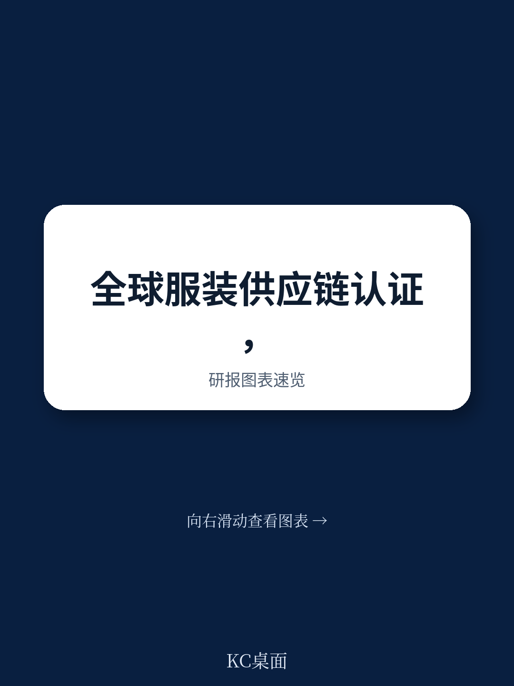
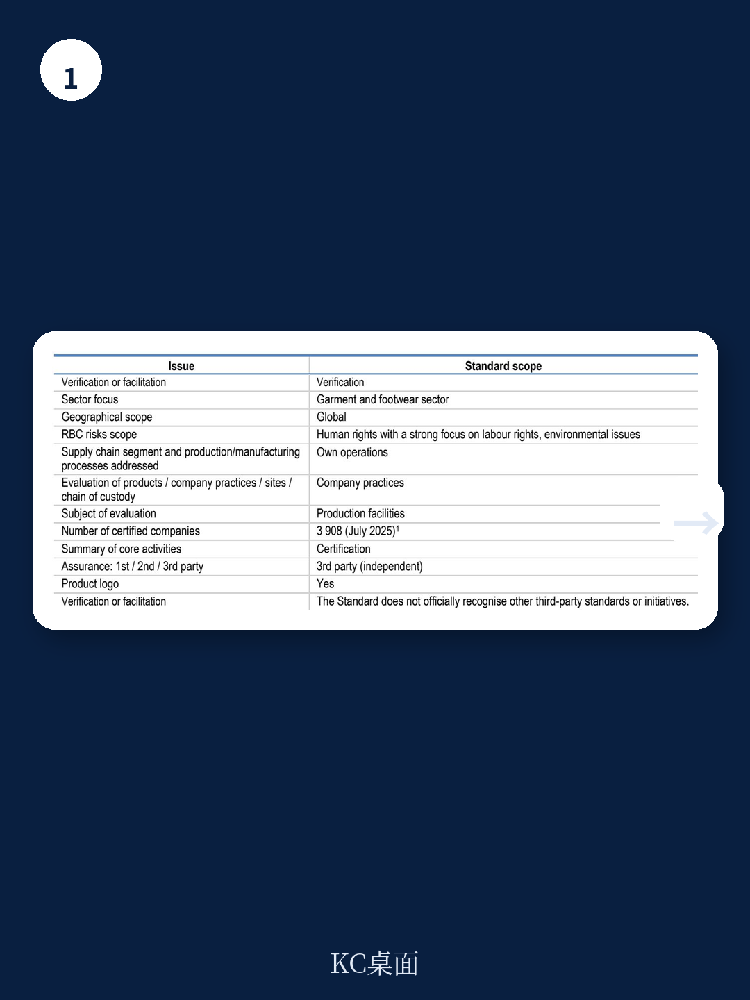
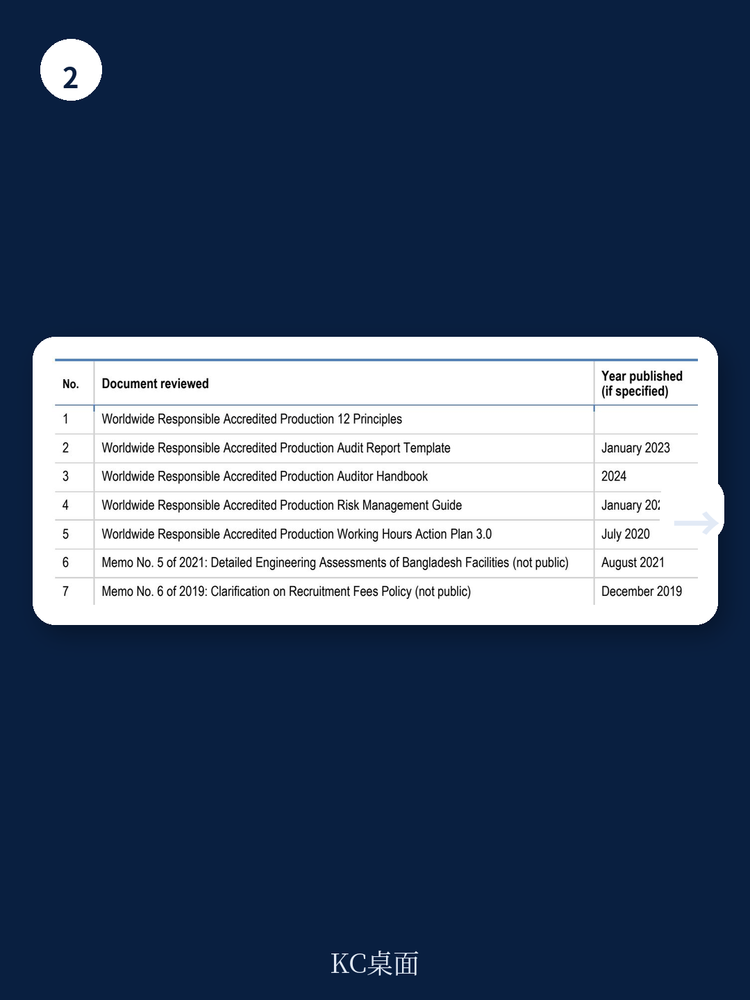

# 经合组织：WRAP认证与OECD标准存在系统性差距

全球服装和鞋类行业最广泛使用的工厂认证之一——WRAP（Worldwide Responsible Accredited Production）认证，在经合组织最新发布的评估中，未能通过其尽职调查标准的对齐检验。这份发布于2026年的报告，不是对个别工厂的合规抽查，而是对WRAP认证体系本身的书面标准、评估逻辑和操作框架的全面审查。结论是清晰的：在六个核心步骤中，WRAP的书面标准与OECD《服装和鞋类行业尽职调查指南》之间，存在结构性错位。

这不是一个关于“某家工厂是否合规”的问题，而是一个关于“认证体系本身是否在要求正确的事情”的问题。对于依赖WRAP认证来管理供应链不确定性的品牌、零售商和读者而言，这份评估意味着，认证本身并不能替代尽职调查。

## 1. 认证体系的核心矛盾：它验证结果，而非要求过程

WRAP认证覆盖全球超过3900家工厂，其标准包含12项原则，涵盖劳工权利、环境实践、海关合规等议题。工厂通过第三方审计后，可获得金级或铂金级认证。但经合组织的评估揭示了一个根本性问题：WRAP的标准侧重于验证工厂在特定时间点是否存在某些不确定性（如超时加班、工资支付），而非要求工厂建立持续的不确定性识别、预防和补救的尽职调查流程。

报告明确指出，WRAP的书面标准在“将负责任商业行为嵌入企业政策和管理系统”这一步骤上，被评为“未对齐”。这意味着，认证本身并不要求工厂拥有成文的政策承诺、管理层监督机制或内部责任分配。一个工厂即使通过了WRAP认证，也可能没有系统性的尽职调查框架来应对供应链中不断变化的劳工和环境不确定性。

> **KC评论：** 这一判断的关键在于，认证的“通过”并不等于“尽职调查到位”。对于品牌方而言，将WRAP认证作为供应链合规的唯一依据，可能掩盖了更深层的结构性不确定性——工厂可能只是通过了时点检查，而非建立了持续改进的能力。

## 2. 供应链范围与补救机制：两个最明显的缺口

评估中得分最低的领域集中在两个方向：供应链的纵深覆盖和受害者的补救渠道。

WRAP标准主要针对工厂自身的运营，对关键供应商和分包商的要求非常有限。报告指出，在“识别实际和潜在不利影响”这一步骤中，WRAP的书面标准未能要求工厂将其尽职调查延伸至上游供应链。对于服装行业而言，这意味着染色、水洗、印花等关键环节的不确定性可能完全游离于认证体系之外。

更值得关注的是补救机制。OECD标准要求企业在其造成或加剧不利影响时，提供或配合补救。但WRAP的书面标准中，关于补救的要求被描述为“建议”而非“要求”。报告特别强调，在验证性倡议中，只有强制性要求才构成认证的基础；建议性条款在实践中不具约束力。这意味着，当工厂被发现存在严重违规时，认证体系本身并不强制要求其提供补救——这与其“零容忍政策”的表述形成了张力。

## 3. 对齐评估的方法论启示：认证不等于尽职调查

这份评估的价值不仅在于对WRAP的评分，更在于它提供了一个可复用的分析框架。经合组织在方法论中明确区分了“验证性倡议”和“促进性倡议”，并指出：验证性倡议若想与OECD标准对齐，必须将OECD的自愿性建议转化为强制性要求。

这一逻辑对行业具有普遍意义。当前，服装和鞋类行业存在数十种认证和标签体系，品牌和零售商往往依赖它们来证明供应链的负责任表现。但经合组织的评估表明，认证体系的设计本身——包括其标准的强制性程度、供应链覆盖范围、补救机制的存在与否——决定了它能否真正推动尽职调查，而非仅仅提供一份合规证明。

对于行业决策者而言，这份评估提供了一个新的审视角度：在选择或依赖某个认证体系时，不应只看它覆盖了多少工厂，而应追问它的标准是否要求工厂建立持续的不确定性管理流程，是否覆盖供应链的关键环节，以及是否为受害者提供了可操作的补救路径。WRAP的案例表明，一个广泛使用的认证，其书面标准与OECD指南之间，可能存在着比预期更大的距离。
