# Assessing the gains from moving along the global value chain: evidence from Costa Rica's electronics sector

By: Alessandro Maravalle and Elena Vidal Muñoz

No. 1874

OECD Economics Department Working Papers

# Assessing the gains from moving along the global value chain: evidence from Costa Rica's electronics sector

No. 1874

This work is issued under the responsibility of the Secretary-General of the OECD and does not necessarily reflect the official view of OECD member countries.

Working Papers describe preliminary results or research in progress by the author(s) and are published to stimulate discussion on a broad range of issues on which the OECD works.

Comments on Working Papers are welcomed, and may be sent to the OECD Economics Department.

This document and any map included herein are without prejudice to the status of or sovereignty over any territory, to the delimitation of international frontiers and boundaries and to the name of any territory, city or area.

Cover image: © Shutterstock / whiteMocca

## © OECD 2026

## Attribution 4.0 International (CC BY 4.0)

This work is made available under the Creative Commons Attribution 4.0 International licence. By using this work, you accept to be bound by the terms of this licence (https://creativecommons.org/licenses/by/4.0/).

Attribution – you must cite the work.

Translations – you must cite the original work, identify changes to the original and add the following text: In the event of any discrepancy between the original work and the translation, only the text of original work should be considered valid.

Adaptations – you must cite the original work and add the following text: This is an adaptation of an original work by the OECD. The opinions expressed and arguments employed in this adaptation should not be reported as representing the official views of the OECD or of its Member countries.

Third-party material – the licence does not apply to third-party material in the work. If using such material, you are responsible for obtaining permission from the third party and for any claims of infringement.

You must not use the OECD logo, visual identity or cover image without express permission or suggest the OECD endorses your use of the work.

Any dispute arising under this licence shall be settled by arbitration in accordance with the Permanent Court of Arbitration (PCA) Arbitration Rules 2012. The seat of arbitration shall be Paris (France). The number of arbitrators shall be one.

# ABSTRACT/RÉSUMÉ

# Assessing the gains from moving along the global value chain: evidence from Costa Rica's electronics sector

This paper develops a framework to evaluate the potential economic gains from deeper participation in global value chains (GVCs). The approach combines measures of revealed comparative advantage with estimates of value-added distribution along GVCs to identify opportunities for upgrading into higher-value-added production stages. It then quantifies the long-term economic effects of such upgrading using a structural gravity model. The framework is applied to Costa Rica's electronics sector, a key focus of the country's strategy to expand its role in the semiconductor value chain. The findings indicate that strengthening Costa Rica's position within the electronics GVC could lead to substantial long-term increases in exports, output, and real wages.

Keywords: Global Value Chains, trade policy, revealed comparative advantages, gravity model.

JEL codes: F1, F13, F14

\*\*\*\*\*\*\*\*\*\*\*\*\*\*\*\*\*\*\*\*\*\*\*\*\*\*\*\*\*\*\*\*\*\*\*\*\*\*\*\*\*\*\*\*\*\*\*\*\*\*\*\*\*\*\*\*\*\*\*\*\*\*\*\*\*\*\*\*\*\*\*\*\*\*\*\*\*\*\*\*\*\*\*\*\*\*\*\*\*\*

# Progresser dans la chaîne de valeur mondiale : une application au secteur de l'électronique au Costa Rica

Cet article propose un cadre permettant d'évaluer les gains économiques potentiels résultant d'une participation accrue aux chaînes de valeur mondiales (CVM). L'approche combine des mesures de l'avantage comparatif révélé avec des estimations de la répartition de la valeur ajoutée le long des CVM afin d'identifier les opportunités de passer à des phases de production à plus forte valeur ajoutée. Elle quantifie ensuite les effets économiques à long terme d'une telle transition à l'aide d'un modèle de gravité structurelle. Ce cadre est appliqué au secteur de l'électronique du Costa Rica, un domaine prioritaire de la stratégie nationale visant à renforcer le rôle du pays dans la chaîne de valeur des semi-conducteurs. Les résultats indiquent que le renforcement de la position du Costa Rica au sein de la CVM de l'électronique pourrait entraîner des augmentations substantielles à long terme des exportations, de la production et des salaires réels.

Mots-clés : Chaînes de valeur mondiales, politique commerciale, avantages comparatifs révélés, modèle gravitationnel.

Codes JEL: F1, F13, F14

## Table of contents

Assessing the gains from moving along the global value chain: evidence from Costa Rica's electronics sector 5   
1. Introduction 5   
2. Literature review 6   
3. A toolkit to assess the potential for strengthening GVC participation 7   
3.1. Measuring participation in GVCs 7   
3.2. Comparative export performance 8   
3.3. Upstreamness 8   
3.4. Estimating the distribution of value added along a sectoral GVC 9   
4. Empirical application: the case of Costa Rica 10   
4.1. Participation into GVC 11   
4.2. Comparative export performance in Costa Rica 14   
4.3. Upstreamness 15   
4.4. Distribution of value added across the GVC 16   
4.5. Moving up the electronics GVC 18   
5. Theoretical framework and Empirical Strategy 21   
5.1. Theoretical framework 21   
5.2. Data: description and sources 22   
5.3. The impact of moving upstream in the electronics GVC on trade: partial equilibrium analysis 23   
5.4. Moving up the electronics GVC and development: the general equilibrium analysis 26   
6. Conclusions 31   
References 32

## Tables

Table 1. The impact of moving upstream on trade: results from a partial equilibrium analysis 24  
Table 2. Economic impact of increasing upstreamness in the electronics sector 28  
Table 3. Estimated economic effect of increasing upstreamness between 1995-2019 29

## Figures

Figure 1. Costa Rica had an excellent export performance over the past decade 10  
Figure 2. Medical devices and business services have become the leading exports 11  
Figure 3. Costa Rica's integration into GVCs is among the lowest of OECD countries 12  
Figure 4. Backward linkages in Costa Rica are low in many sectors 13  
Figure 5. Costa Rica's forward participation in GVCs remains low in electronics but improved in business services 13  
Figure 6. Costa Rica's export performance has shifted toward medical devices and services. 14  
Figure 7. Costa Rica's exports are less upstream on average 15  
Figure 8. Costa Rica's upstreamness in electronics is far below the OECD average 15  
Figure 9. Manufacturing offers opportunities to move up the GVC 17  
Figure 10. Upstream activities bear higher value-added in the electronics sector 17  
Figure 11. Costa Rica has been moving down the electronics GVC since 2015 19  
Figure 12. Electronics sector is a good proxy for the semiconductor sector 19  
Figure 13. Most value added in the semiconductor GVC is in design and wafer fabrication 20  
Figure 14. Moving upstream in the electronics GVC may have a large impact on the sector 26  
Figure 15. Countries that moved more upstream reaped largest benefits in electronics 27

# Assessing the gains from moving along the global value chain: evidence from Costa Rica's electronics sector

Alessandro Maravalle and Elena Vidal Muñoz $^{1}$

## 1. Introduction

Over the past decades, advances in technology and the reduction of trade barriers have significantly lowered transport costs, leading to production fragmentation and the rise of global value chains. Today, different stages of production can be carried out in different locations, resulting in increased trade in intermediates. Thus, a large part of trade growth since the 1970s can be attributed to the rise of global value chains (GVCs) (Hummels, Ishii and Kei-Mu, 2001[1]; Johnson and Noguera, 2012[2]).

Participation in GVCs may have significant economic effects, and many governments in the past decades have developed policies to promote GVC participation in the attempt to capture the associated benefits. Broader participation may give access to higher-quality and more affordable inputs, support economies of scale, and facilitate technology and knowledge spillovers. These dynamics offer local industries opportunities for economic upgrading, for example, shifting from simple assembly to the production of more sophisticated goods. GVCs also present development opportunities for small open economies, as participation in GVC requires a country to have comparative advantages in only one stage of production, rather than across the entire value chain.

This paper proposes a framework to quantify the economic gains associated with moving towards higher value-added segments within a GVC (“moving up the GVCs”). The analysis combines standard indicators of comparative advantage with estimates of value-added distribution across production stages in a GVC to identify sectors with strong potential for upgrading. These insights are then incorporated into a standard structural gravity equation system (Beverelli et al., 2023[3]) to quantify the economic effects of moving up the GVCs on trade, production and wages.

The framework is applied to Costa Rica, a small open economy that is actively integrating into global value chains, with a particular focus on the electronics sector. This sector is central to develop a develop a semiconductor ecosystem and attract investment. The results indicate that moving towards higher value-added production stages in the electronics sector could generate substantial gains in trade, real wages and output.

The paper is organized as follows. Section 1 reviews the economic impacts of GVC participation and relevant literature on estimating the impact of trade policy using a gravity equation system. Section 2 describes the preliminary analysis indicators that are used to identify what sectors and what stages of production a country should target to strengthen moving along the sectoral GVC. These indicators include competitive advantage estimator(s), standard indicators of GVC participation and an indicator of positioning along a GVC. The upstreamness index is then used jointly with international inter-country input-output data, to estimate the distribution of value added across sectoral GVCs. Section 3 applies preliminary analysis to Costa Rica and provides a description of the electronic sector and of a recent policy aimed to strengthen the semiconductor sector. Section 4 describes the empirical strategy used to estimate the economic impact of moving up the GVC in the electronics sector and provides results. Section 5 concludes.

## 2. Literature review

The paper is related to two main strands of the literature: the measurement of GVC participation and its economic impact, and the empirical estimation of trade policy using gravity equation systems.

Interest in GVC participation stems from clear evidence that the value added recorded in bilateral trade flows is often created outside the two countries directly trading and may ultimately be consumed in a third market. As production becomes increasingly fragmented across borders, manufacturing exporters frequently ship goods they did not fully produce themselves, effectively acting as intermediaries. In some cases, firms even export more than they produce, an outcome known as carry-along trade (Bernard et al., 2018[4]). Against this background, understanding where a country locates within a GVC is key to identify opportunities and devise evidence-based public policy. Indicators of participation in GVC and GVC positioning can be computed using global databases of inter-country input output relationships (ICIO) (Antràs and Chor, 2019[5]; Hummels, Ishii and Kei-Mu, 2001[1]; Borin, Mancini and Taglioni, 2025[6]; Mancini et al., 2024[7]). These measurements show the extent of GVC involvement of a country, the nature of their participation, and their positioning along the GVC. These indicators provide valuable information at the sectoral level on whether a country produces for the domestic or foreign economy, whether it provides inputs to downstream nations/industries or uses foreign inputs, or a combination of both, and in which production stages of the GVC it specializes.

In the literature GVC involvement is positively associated with higher income growth. In particular, GVC participation appears to be more relevant for growth than traditional trade $^{2}$ (Jangam et al 2024), where traditional trade is measured on the basis of gross value, while GVC trade breaks down gross value according to the country and industry of origin and destination of value added. This allows GVC trade to take into account in which country and sectors traded value-added is produced and consumed. The relevance of GVC participation for trade is also independent of the mode of GVC participation (Borin et al 2021), i.e. whether it concerns mostly activities at the start of the value chain, activities at the end of the value chain, or activities located at intermediary stages of the value chain. Higher GVC participation also increased economic resilience during the pandemic (Jangam et al., 2024), possibly because the deeper integration in value chain networks provided better opportunities to access new markets, respond to consumer demand changes, and offered greater capacity to reduce costs despite disruption.

Higher GVC participation has also been shown to enhance output stability (Arriola et al., 2020[8]; Baldwin and Freeman, 2022[9]; Bonadio et al., 2021[10]; Borin, Mancini and Taglioni, 2025[6]; D'Aguanno et al., 2021[11]). This occurs mainly through greater diversification of input suppliers or sales (of both intermediaries and final products) (Borin et al, Bonadio et al 2021, Ardelan et al, 2024). Such effects are particularly relevant for emerging and developing countries that are more likely to face higher domestic output volatility. Consequently, re-shoring previously off-shored production, while it may reduce exposure to external shocks, can actually increase output volatility by heightening exposure to demand shocks and reducing diversification (OECD, 2025[12]).

The second strand of literature relevant to this study concerns the use of gravity models to empirically assess trade policies. Owing to their strong theoretical foundations, gravity models are also well suited to analyzing trade flows within Global Value Chains (GVCs), as they can be applied to bilateral value-added trade data that capture cross-country production fragmentation within industries (Blázquez, Díaz-Mora and González-Díaz, 2023[13]; Bondi et al., 2025[14]). More specifically, this paper adopts the approach proposed by (Beverelli et al., 2023[3]), and implemented, among others, by (Esteve-Pérez et al., 2021[15]). This approach uses intra-national trade flows to identify the impact on trade of a country-specific variable within a structural gravity estimation framework. However, results commonly labelled as “general equilibrium” in gravity models should be interpreted with caution, as such models do not fully capture broader general equilibrium mechanisms, such as cross-sectoral interdependencies and spillover effects, thereby limiting their ability to account for wider economic interactions.

## 3. A toolkit to assess the potential for strengthening GVC participation

This section presents a set of indicators that can be used to preliminarily identify the sectors in which moving along the global value chain (GVC) could yield the greatest economic benefits for a given country. The proposed indicators include two standard measures of GVC participation, backward and forward participation, a measure of international comparative advantage, and the index of upstreamness that captures a country's position within a GVC. All indicators are calculated at the sectoral level. To determine which stages of production a country should target to strengthen its GVC participation, the index of upstreamness is combined with an inter-country input-output dataset. This makes it possible to estimate the distribution of value added along the GVC, thereby helping to identify the segments with higher value-added potential.

## 3.1. Measuring participation in GVCs

Two standard indicators are used to assess a country's integration into global value chains the backward and the forward GVC participation indices. Backward participation measures the use of imported inputs in the production of a country's exports, and is proxied by the ratio of foreign value-added content of exports to the total value of exports. Forward participation reflects the domestic value added embedded in a country's exports that are subsequently re-exported to a third country (OECD, 2013[16]), and is proxied by the ratio of domestic value sent to third economies to the economy's total gross exports.

These indicators are typically derived from bilateral trade in value added data (ECB, 2022[17]). Since intermediate inputs often cross borders multiple times, relying on gross output data would misrepresent the true origin of value added embedded in exports. To address it, the joint OECD – WTO Trade in Value-Added (TiVA) initiative decomposes the value added of goods and services consumed worldwide by source country. In particular, the OECD inter-country input-output tables (ICIOs) are used to decompose gross trade flows into their domestic and foreign value-added components. This decomposition enables the calculation of backward and the forward linkages indicator at both the aggregate and sectoral level.

## 3.2. Comparative export performance

The Normalised Revealed Comparative Advantage (NRCA) is used to identify in which products a country exhibit a strong export performance. Firstly, the revealed comparative advantage index is computed as follows:

$$
R C A = \frac {X _ {s i}}{X _ {s w}} / \frac {X _ {i}}{X _ {w}}
$$

where $X_{si}$ is country i's exports in sector s and $X_{sw}$ is global exports in sector s; $X_{i}$ is total exports of country i, and $X_{w}$ stands for total world exports. The RCA measures relative export performance revealed by the actual export pattern by comparing the importance of a given sector for a country's exports relative to the sector's importance for world exports. The index is then normalised to a maximum of 1 and a minimum of -1, where a negative value represents a competitive disadvantage, and a positive value represents a competitive advantage.

Although the RCA is commonly interpreted as a proxy for underlying comparative advantages, namely goods and services a country can produce more efficiently than others, recent literature cautions that these indices may contain biases when used to infer true comparative advantage (Leromain and Orefice, 2014[18]). As a result, while a positive NRCA signals strong relative export performance in international markets, it does not disentangle whether this strength arises from purely comparative advantages, such as technology or favourable factor endowment that reduce production costs, or from a broader trade environment, including trade agreements or specific trade policy measures. Despite this limitation, the NRCA remains an informative indicator of a country's relative export performance and competitive position in international trade.

## 3.3. Upstreamness

The distance of a production sector from final demand, or upstreamness, is a measure that aggregates information on the extent to which “a sector in a given country produces goods that are sold directly to final consumers or that are sold to other sectors that themselves sell disproportionately to final consumers” (Antràs and Chor, 2019[5]). Following (Antràs et al., 2012[19]; Mancini et al., 2024[7]), the index of upstreamness of sector r in country i, $U_{ir}$ , can be computed using international country input-output datasets, namely using the intermediate use matrix Z, the final demand matrix FD and the gross output vector Y. The starting point is the gross output of sector r in country i, $Y_{ir}$ , which by definition is either used as intermediate input ( $Z_{ir}$ ) or consumed as final demand ( $FD_{ir}$ ), domestically or abroad:

$$
Y _ {i r} = Z _ {i r} + F D _ {i r} = \sum_ {s = 1} ^ {S} \sum_ {j = 1} ^ {C} Z _ {i r} ^ {s j} + \sum_ {j = 1} ^ {C} F D _ {i r} ^ {j}
$$

By multiplying and dividing the first term on the right side of the equation by the gross output of sectors in country j, $Y_{sj}$ , the following identity is obtained:

$$
Y _ {i r} = \sum_ {s = 1} ^ {S} \sum_ {j = 1} ^ {C} a _ {i r} ^ {s j} Y _ {s j} + F D _ {i r},
$$

where $a_{ir}^{sj} = \frac{Z_{ir}^{sj}}{Y_{sj}}$ is the share of intermediate input of sector r in country i in gross output of sector s in country j, and is defined between zero and 1. By iteration, gross output of sector r in country i, $Y_{ir}$ , can then be expressed as a sequence of terms:

$$
Y _ {i r} = F D _ {i r} + \sum_ {s = 1} ^ {S} \sum_ {j = 1} ^ {C} a _ {i r} ^ {s j} F D _ {s j} + \sum_ {s = 1} ^ {S} \sum_ {j = 1} ^ {C} \sum_ {t = 1} ^ {S} \sum_ {k = 1} ^ {C} a _ {i r} ^ {s j} a _ {t k} ^ {s j} F D _ {t k} + \dots ,
$$

where the first term on the right-hand side of the expression above is the gross output of sector r in country i immediately used for final consumption, the second term is the gross output used as an intermediate input just one stage of production before the final consumption, and so on. The first term of the expression, $FD_{ir}$ , the production of sector r that is used as final goods, is positioned one step away from final consumers; the second term, $\sum_{s=1}^{S}\sum_{j=1}^{C}a_{ir}^{sj}FD_{sj}$ , the production of sector r consisting of intermediates used for final goods, is set two steps away from final consumers; the third term is the production of sector r consisting of inputs used in the production of other inputs employed directly for final goods, and is located three steps away from final demand, and so forth. Thus, the production of any sector r, $Y_{ir}$ , can be decomposed depending on its use across production stages defined in terms of distance from final consumption.

The index of upstreamness, $U_{ir}$ , is then obtained by expressing each production stage as a share of $Y_{ir}$ and assigning weights to each term as follows: a weight of 1 to the final consumption stage, a weight of 2 to the stage of production located one step before final consumption, and so on:

$$
U _ {i r} = 1 * \frac {F D _ {i r}}{Y _ {i r}} + 2 * \frac {\sum_ {s = 1} ^ {S} \sum_ {j = 1} ^ {C} a _ {i r} ^ {s j} F D _ {s j}}{Y _ {i r}} + 3 * \frac {\sum_ {s = 1} ^ {S} \sum_ {j = 1} ^ {C} \sum_ {t = 1} ^ {S} \sum_ {k = 1} ^ {C} a _ {i r} ^ {s j} a _ {t k} ^ {s j} F D _ {t k}}{Y _ {i r}} + \dots
$$

The measurement of industry upstreamness is then the weighted average distance from final use, in terms of production stages, of the output of a sector. By construction, $U_{ir}$ can assume values equal to or larger than 1, as a sector with higher level of upstreamness goes through at least 2 production stages before being absorbed by end-users. A value of 1 implies that all output of sector r in country i is immediately absorbed by final demand. The higher the value of $U_{ir}$ , the more sector's output is used as intermediate input at upstream stages of production.

It is also possible to compute an index of downstreamness, which captures the distance of a sector's output from the economy's primary factors of production (Fally, 2012[20]). A country or a sector that incorporates a larger value of intermediate inputs would be downstream in GVCs. The indicator also assumes values equal to or greater than 1. As downstreamness and upstreamness indicators are correlated, the analysis will focus only on upstreamness.

## 3.4. Estimating the distribution of value added along a sectoral GVC

Estimating the global distribution of value added across countries and stages of production within a sectoral GVC provides insights into which stages a country should target to “move up the value chain”, that is, to specialise in higher value-added stages of production. This distribution can be estimated using two key inputs: the index of upstreamness, which indicates where a country’s production in a specific sector is located within the GVCs; and international inter-country input-output data, which provide information on the distribution of value added across countries. By combining these two sources, it is then possible to estimate the distribution of value added of the GVC of sector r across production stages, $f_{r}(u)$ , where stages are defined by their distance from final use (upstreamness). Since upstreamness is a continuous variable, the production process can be discretised into an arbitrary finite number of stages by dividing the upstreamness range into equal-length intervals (quantiles). The value added at each production stage is then calculated by summing the value added of all countries whose production falls within the corresponding upstreamness quantile.

For a given sector r, given a total number of stages of production N, each will be of length $l = \frac{u_{MAX} - u_{MIN}}{N}$ , where $u_{MAX}$ and $u_{MIN}$ are, respectively, the maximum and the minimum value of upstreamness in the sectoral GVC of interest. The generic stage of production $SP_{k}, k=1,\ldots,N$ , is then defined between $u_{k-1}$ and $u_{k}$ , with $u_{0} = u_{MIN}$ , $u_{1} = u_{MIN} + l,\ldots,u_{n-1} = u_{n-2} + l,\ldots,u_{N} = u_{MAX}$ .

The value added associated to the first stage of production, $VA_{SP(1)}$ , the one closest to final demand, is obtained by summing the value added of all countries whose index of upstreamness lies between $u_{0}$ and $u_{1}; VA_{SP(2)}$ , the value added associated to the second stage of production, will contain the value added of all countries whose index of upstreamness lies between $u_{1}$ and $u_{2}$ , and so on. In general, it is then possible to compute the value added of a stage of production k as follows:

$$
V A _ {S P (k)} = \int_ {u _ {k - 1}} ^ {u _ {k}} f _ {r} (u) d u
$$

## 4. Empirical application: the case of Costa Rica

Trade policies are key to maximise trade benefits, boost innovation and, ultimately, growth, especially for small open economies. In this respect, Costa Rica is a good example of a very dynamic small open economy. It recorded a strong economic growth since the early 2000s thanks to its commitment to trade openness, and to factors such as a stable political environment, strong legal frameworks and incentives for investors. Over the last decade, Costa Rica raised real GDP by an average rate of 3.4%, almost twice as much as the average OECD country, increased trade (Figure 1., Panel A) and gained export market share (Figure 1., Panel B). Its trade policies and institutions helped diversify its export basket, and in 2023 advanced manufacturing products, most notably medical devices, surpassed agricultural commodities as the leading good export (Figure 2., Panel A). At the same time, exports of business services (accounting, information and communication technology (ICT), back-office operations, and financial services) have also significantly increased in value over time and recently surpassed tourism as the leading services exports (Figure 2., Panel B).

Costa Rica's trade performance is associated with a strong capacity to attract large inflows of Foreign Direct Investment (FDI), which have been concentrated in sectors such as life sciences, light and advanced manufacturing, food industry and business services (OECD, 2025[21]). Over the period 2013-22, annual FDI inflows averaged $4.6\%$ of GDP, well above the OECD average of $1.9\%$ of GDP.

Figure 1. Costa Rica had an excellent export performance over the past decade  
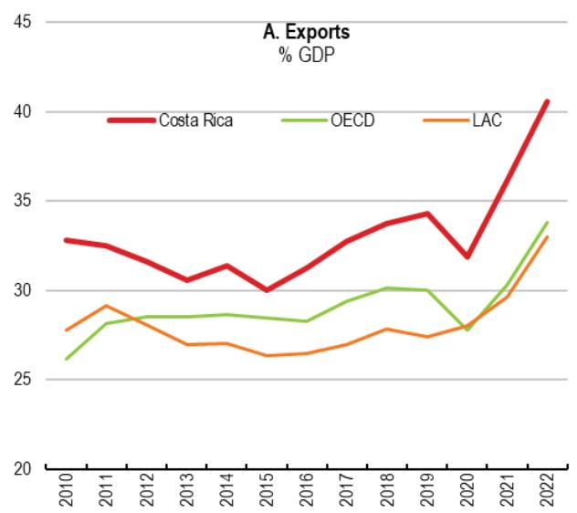

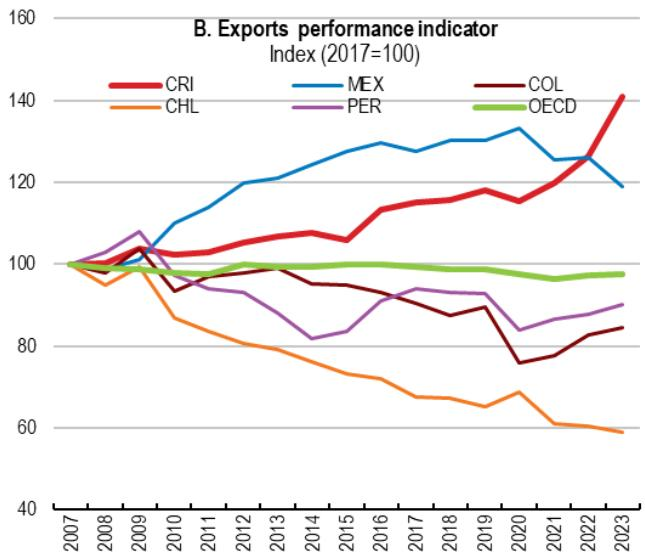  
Note: The export performance indicator is computed by comparing the growth of export volumes with that of its export market. It shows whether the country's exports grow faster or slower than its market, i.e. if over time it is experiencing market share gains or losses.
Source: OECD Economic Outlook (database).

A. Medical devices are the leading export product
% of total good exports, by type of product

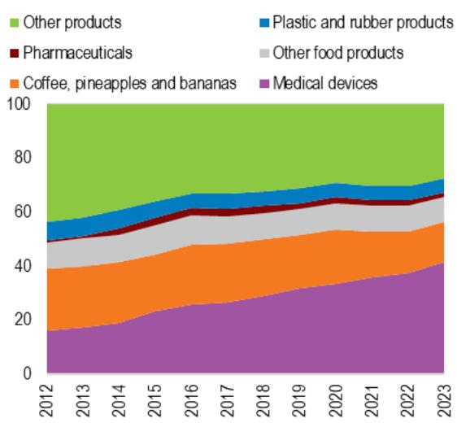

Figure 2. Medical devices and business services have become the leading exports  
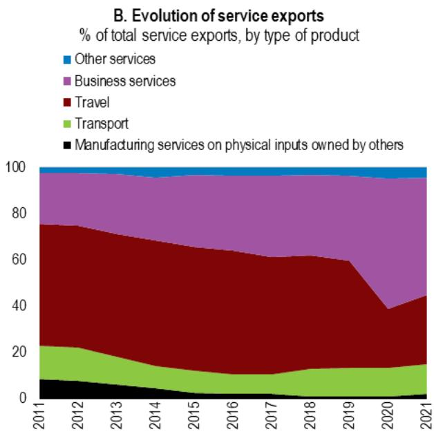  
Note: in Panel B, Business services includes telecommunications, computer, and information services and other business services  
Source: OECD-WTO Balanced Trade in Services (BaTIS) (database).

Despite these achievements, Costa Rica is overall less integrated in global value chains than most OECD countries, as shown in the next subsection. This suggests that there is room for strengthening its participation into GVC, especially in key sectors where it holds competitive advantages, such as electronics, which includes both medical devices and semiconductors, or business services.

Creating a favourable environment to FDI is a major factor to improve GVC participation and promote development, as it facilitates the establishment of MNEs already participating into GVC that provide opportunities of spillovers to local firms. Evidence shows that US companies already started partially switching some production from Asia to Latin American countries (IMF, 2023[22]) to build shorter supply chains and mitigate supply chain disruption risks. Costa Rican public policies should aim to promote sectors, and stages of production within sectors that bear the largest potential benefits, as the limited size of its economy limit its ability to diversify production.

## 4.1. Participation into GVC

Costa Rica's participation in GVCs, that is the sum of forward and backward linkage indicators, is below the OECD average when the whole economy is considered. Total GVC participation in Costa Rica barely reached 28% of total exports, against an OECD average of almost 47% in 2020, and shows very limited progress over the last ten years. Disentangling backward and forward linkages shows similar results. Costa Rica's GVC participation is mainly driven by backward linkages to GVCs, measured by the share of foreign value added in Costa Rica's total exports, yet Costa Rica ranks low among OECD countries (Figure 3. , Panel A). Similarly, Costa Rica's forward participation, i.e., the share of Costa Rican value added embodied in foreign countries' exports, is well below the OECD average, stagnating at 12% in 2020 (Figure 3. , Panel B) against an OECD average of almost 20%.

Foreign value added in domestic gross exports, % of total exports, 2020

Figure 3. Costa Rica's integration into GVCs is among the lowest of OECD countries  
A. Forward participation
Domestic value added in foreign gross exports, % of total exports, 2020  
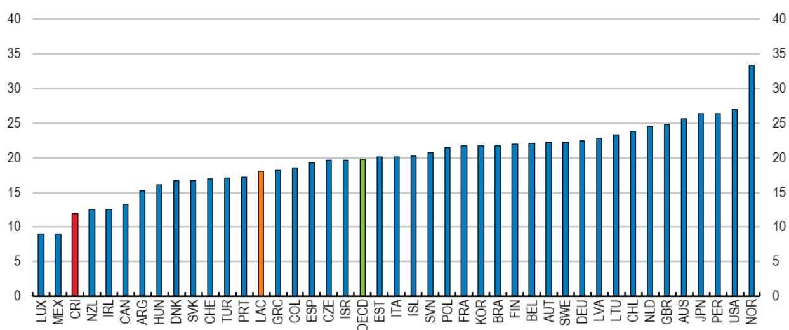  
B. Backward participation

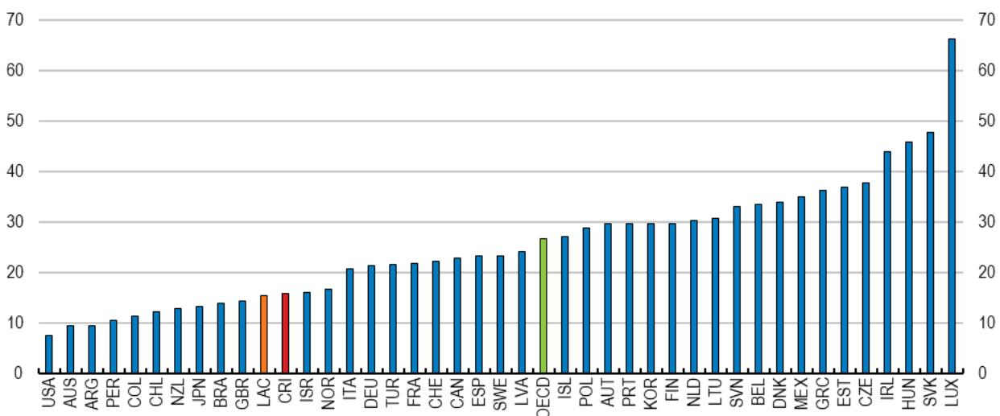  
Note: LAC is a simple average of Chile, Colombia, Mexico, Argentina, Brazil, and Peru. Source: OECD: Trade in Value Added (TiVA) 2023.

By sector, backward participation is below the OECD average in most manufacturing sectors, as well as agriculture and business services, including ICT (Figure 4.). However, Costa Rica ranks above the OECD average in two manufacturing sector (basic metals and rubber and plastics) and around the OECD average in other five sectors, including transport equipment, machinery and the important sector of electronics.

Note: Forward participation indicator is calculated as the domestic value added in foreign gross exports, % of total exports. LAC is a simple average of Chile, Colombia, Mexico, Argentina, Brazil, and Peru.
Source: OECD: Trade in Value Added (TiVA) 2023

Figure 4. Backward linkages in Costa Rica are low in many sectors
Backward participation Index, by selected sector  
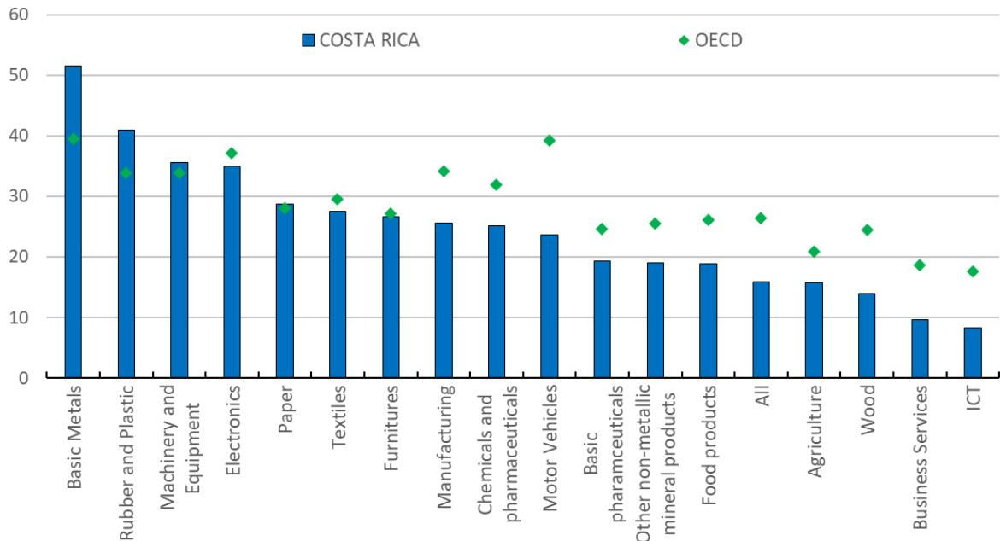  
Note: Backward participation indicator is measured by the share of foreign value added embedded in each sector's exports. Source: OECD: Trade in Value Added (TiVA) 2023.

Figure 5. Costa Rica's forward participation in GVCs remains low in electronics but improved in business services  
A. Forward participation in electronics  
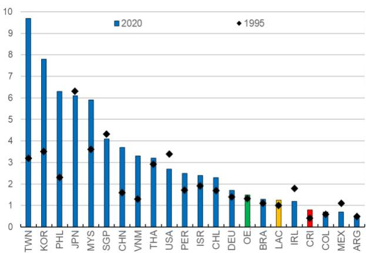

B. Forward participation in business services  
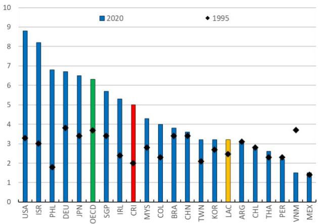

Forward participation, at the sectoral level, highlights a different dynamic between manufacturing and services sectors. In most manufacturing sectors, including the sector of computer, electronic and optical products (Figure 5. , Panel A), forward participation is below the OECD average, despite the improvement recorded between 1995 and 2020. Conversely, forward participation in business services showed a strong increase since 1995 (Figure 5. , Panel B), well above the Latin America average, and not far from the OECD average. This suggests that Costa Rica successfully moved rapidly up the business services GVC, and this shift towards more sophisticated services also explains part of the gain in competitiveness of its exports.

## 4.2. Comparative export performance in Costa Rica

Measuring comparative export performance helps identify the sectors in which Costa Rica could concentrate its efforts to increase and diversify exports and strengthen its participation in GVCs. To this end, the Normalized Revealed Comparative Advantage Index (NRCAI), a measure of comparative export performance, is computed for key goods and services over 2000-2019 using two international trade datasets: the United Nation Trade and Development dataset (UNCTAD), which provides highly disaggregated trade data, though only for goods, and the International Trade (ITD-E) Database by Borchert et al. (2022), which provides bilateral trade data up to 2019 for both goods and services but at a more aggregate level.

Results show that Costa Rica's export performance is strong in several agricultural products (e.g. fresh fruit) and significantly improved its relative export performance in advanced manufacturing products, namely medical equipment and cathode valves and tubes (semiconductors). Costa Rica also outperforms in many services, most notably health and education services. However, despite improvements, there is scope to strengthen export performance in certain services segments, notably ICT and other business services (Figure 6.).

Based on its relative export performance, aside from agriculture products, Costa Rica could focus its efforts to promote exports on advanced manufacturing goods (medical equipment), and, to a lesser extent, semiconductors. (cathode, valves and tubes), optical instruments and building and repairing of ships.

Figure 6. Costa Rica's export performance has shifted toward medical devices and services.  
The Normalised Revealed Comparative Advantage of Costa Rica  
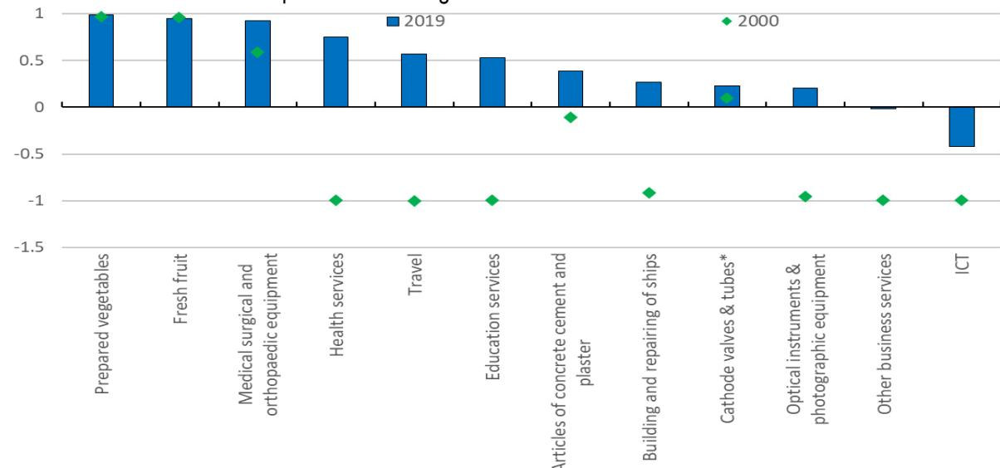  
Note: The index is normalised to a maximum of 1 and a minimum of -1, where a negative value an export performance below the average, and a positive value points to outperforming. \*Cathode valves and tubes products refer to the semiconductor sector, which reported a strong export performance in 2014, the year before INTEL moved part of its activities away from the country.
Source: Author's elaboration using database from (Borchert et al., 2022[23]) and UNCTAD database.

From a policy perspective, focusing trade policies on sectors with strong export performance may be efficient, as it can generate economic gains through higher exports, increased employment, and production at lower cost. However, country-specific circumstances may justify directing political and policy efforts toward sectors with negative or low NRCA values, particularly when there is evidence of untapped economic potential. In such cases, targeted policy support may help unlock growth opportunities that would otherwise remain unrealised.

## 4.3. Upstreamness

Costa Rican exports are characterised by very low upstreamness compared to the average LAC or OECD country (Figure 7.). This suggests that Costa Rica tends to export goods that are relatively finished or close to being used by final consumers. When considering the distribution of upstreamness at the sectoral level across countries, most Costa Rican sectors (37 out of 45) fall in the first and the second quintiles that include exports closer to final use. This is the case also for the electronics sector (Figure 8.), one of Costa Rica's largest export industries that includes medical devices and semiconductors.

## Figure 7. Costa Rica's exports are less upstream on average

Export upstreamness (total manufactures less petroleum products), 2019  
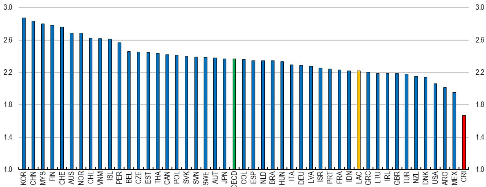  
Note: Export upstreamness is a weighted average of sectorupstreamness values, using the sectorshare of export in total exports as weights. The upstreamness indicator can assume values equal to or greater than 1, with larger values associated with relatively higher levels of upstreamness.  
Source: (Mancini et al., 2024[7]) and (Borchert et al., 2022[23])

Figure 8. Costa Rica's upstreamness in electronics is far below the OECD average. Upstreamness index, computer, electronics, and optical equipment, 2019  
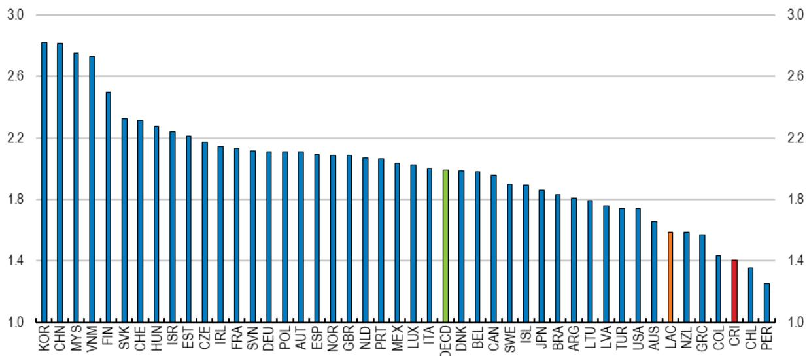  
Source: (Mancini et al., 2024[7]) and (Borchert et al., 2022[23])

## 4.4. Distribution of value added across the GVC

Identifying the production stages that generate the greatest value added within a sector, that is where a country should focus to strengthen its position or move up the global value chain (GVC), requires two key elements: the country's position along the sectoral GVC and the distribution of value added across the sector's GVC across countries.

The country's position along the sectoral GVC is proxied through the upstreamness index. The index captures the extent to which a sector's production is absorbed by final demand versus used as intermediate inputs across sectors. However, as long as sectoral production is used mostly within the same sector, upstreamness should work as a plausible proxy for the country's location along the GVC.

The distribution of value added along a sector's GVC across countries in a given year is estimated at the sectoral level by merging the distribution of sectoral value added across countries with the distribution of sectoral upstreamness across countries. For any sector, quantiles of the distribution of the upstreamness indicator, a continuous variable, are obtained by dividing the distance between the maximum and the minimum value of upstreamness into a discrete number of equal length intervals. The distribution of value added along the GVC is then obtained by summing up the value added in the sector of all countries whose value of upstreamness falls within the same quantile. Consequently, the first quantile, representing the lowest upstreamness values, corresponds to production stages closest to final consumption, while the last quantile, representing the highest upstreamness values, reflects the most upstream phases of production.

Results show that manufacturing sectors offer more opportunities to move up the GVC than service sectors. In manufacturing sectors, Costa Rica tends to specialise production at low value added stages (Figure 9., bottom panels, green bar), while the opposite occurs in many services sectors (Figure 9., top panels, green bar). Focusing on key Costa Rican exporting sectors confirms this general pattern (Figure 10., green bars). Results also show that that value added is not always concentrated at early and late stages of production along the GVC, following the so-called “smiley shape”. For example, in professional services most value added is concentrated in mid- stages.

It is important to emphasise that this stage of the analysis identifies potential opportunities to move into higher value-added segments of production, but does not evaluate their feasibility. The ability to move up the value chain, and the effective design of trade policy to support this process, depends on country- and sector specific factors. In the case of the semiconductor sector, these considerations are briefly analysed in a later section.

Figure 9. Manufacturing offers opportunities to move up the GVC  
IT and other information services  
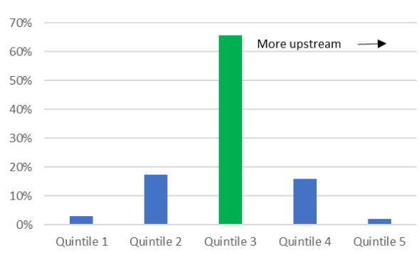  
Fabricated metal products

Accommodation and food service activities  
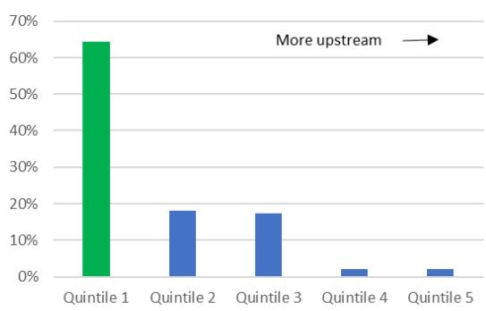

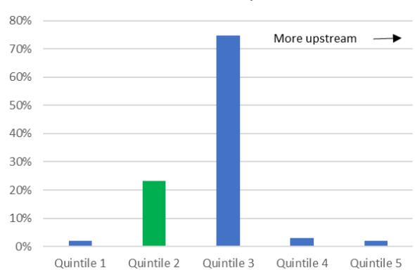

Paper products and printing  
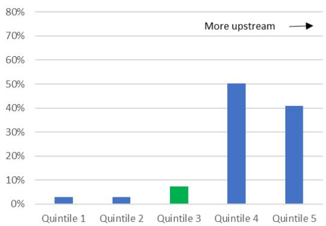  
Note: Horizontal axes reports the quintiles (from 1 to 5) of the distribution of the upstreamness index across countries; vertical axes report the value-added share of each production stage; the bar in green highlights the quintile with Costa Rica.
Source: Author's elaboration using database from (Mancini et al., 2024[7]) and OECD: Trade in Value Added (TiVA) 2023

## Figure 10. Upstream activities bear higher value-added in the electronics sector

## A. Electronics

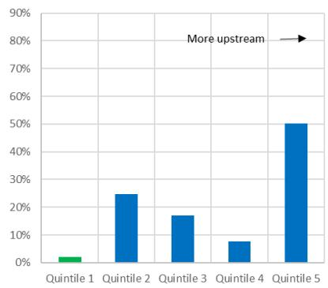

## B. Professional activities

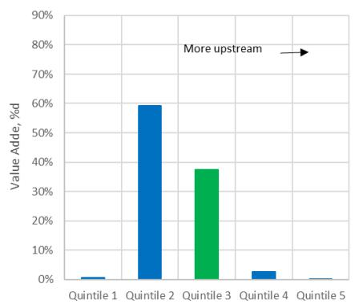

## C. Health Services

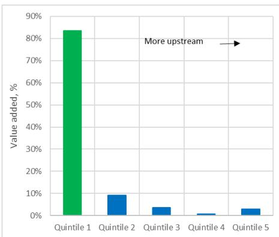  
Note: Horizontal axes reports the quintiles (from 1 to 5) of the distribution of the upstreamness index across countries; vertical axes report the value-added share of each production stage; the bar in green highlights the quintile with Costa Rica.
Source: Author's elaboration using database from (Mancini et al., 2024[7]) and OECD: Trade in Value Added (TiVA) 2023

## 4.5. Moving up the electronics GVC

The previous section shows that Costa Rica has comparative advantages in medical devices and, to a lesser extent, in semiconductors, both part of the broader electronics sector. This suggests potential for strengthening the country's participation in the electronics GVC, particularly by moving into more upstream stages of production. The focus here is on the semiconductor sector, given the recent launch of the Semiconductor Roadmap Strategy (la Hoja de ruta para el fortalecimiento del ecosistema de semiconductors en Costa Rica, SRS), which aims to enhance Costa Rica 's role in the electronics GVC.

The SRS is a cross-institutional scheme that could increase Costa Rica's attractiveness for FDI in semiconductors through a comprehensive set of policy measures. These include efforts to develop human talent, promote R&D, improve regulatory frameworks, and facilitate investment. The SRS is related to the 2022 US Creating Helpful Incentives to Produce Semiconductors and Science Act (CHIPS Act), which allocated \$53 billion USD in incentives for domestic semiconductor manufacturing and research and development to build new and expand existing semiconductor facilities. The CHIPS Act is expected to increase USA capacity in wafer production (from 10% to 14% of global production), while at the same time shifting assembly, testing and packaging (ATP) capacity from Asia (67% of global production) toward other regions, including Latin America (BCG, 2024[24]). In particular, the SRS builds on a 2023 partnership between the Government of Costa Rica and the USA State Department, supported by the International Technology Security and Innovation Fund established by the CHIPS act of 2022. The initiative aims to explore opportunities to shift some of the semiconductor manufacturing and packaging capacity from Asia to create a more resilient, secure and sustainable global semiconductor value chain.

This section provides a brief description of the semiconductor industry and describes the main economic channels through which moving up the GVC in the electronics sector could impact Costa Rica.

## 4.5.1. The semiconductor sector in Costa Rica

The semiconductor sector in Costa Rica started in the late 1990s with multinational companies (e.g., INTEL) setting up factories focusing on assembly, testing and packaging (ATP) activities. Between 1998 and 2015 the sector expanded significantly, with INTEL's operations alone contributing to up to $0.9\%$ of GDP and around $38.5\%$ of goods exports. In 2014, INTEL relocated its ATP activities from Costa Rica to Asia, although it retained support activities and established a centre for R&D activities in the country. This shift led to a notable change in the composition of both exports and employment within the industry. While the overall volume of exports and employment declined sensibly, the nature of exports moved from goods to R&D services, and the workforce transitioned from predominantly medium skills workers (blue collars in production) to high-skill professionals (engineers, software developers, bilingual administration) involved in upstream activities at higher value added (Monge, 2017[25]).

INTEL decision to move ATP activities away from Costa Rica had broader implications for the entire electronics sector. The upstreamness index for the electronics sector, which includes semiconductor, shows a downward trend in the country's position within the GVC (Figure 11.) following the relocation. This suggests that, at least until 2020, remaining activities in electronics were increasingly concentrated closer to final consumption. Currently, the semiconductor sector in Costa Rica employs around five thousand workers (COMEX, 2024[26]), with most firms in the sector operating in the ATP segment and, to a lesser extent, in that of electronic design (R&D). The sector also includes a few firms that supply inputs for semiconductor manufacturing and testing equipment.

Figure 11. Costa Rica has been moving down the electronics GVC since 2015
Upstreamness index of Costa Rica in the electronics sector over 1995-2020  
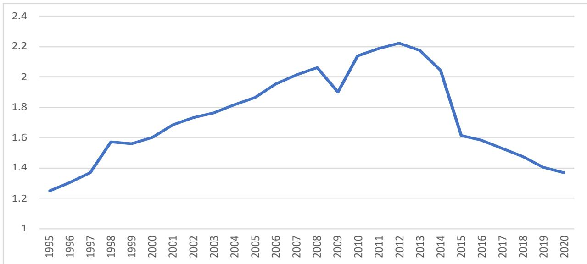  
Source: (Mancini et al., 2024[7])

Figure 12. Electronics sector is a good proxy for the semiconductor sector Distribution of the value added in the semiconductor sectors, actual versus estimated  
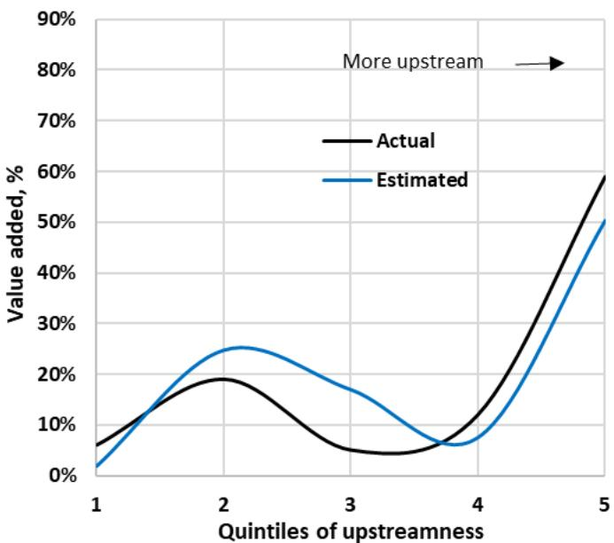  
Source: Author's calculation and (BCG, 2024[24]).

Due to the lack of more granular data, the electronics sector is used as a proxy for the semiconductor sector in the analysis. To validate this assumption, the distribution of value added along the electronics GVC, estimated using the methodology described earlier, is compared with the actual distribution reported for the semiconductor industry (BCG, 2024[24]). The results show a close alignment between the two distributions (Figure 12.), supporting the use of the electronics sector as a proxy for semiconductors.

Beyond strengthening its ATP capacity, the most promising option for Costa Rica to move up the semiconductor GVC lies into enhancing its capacity in design. ATP is a low value-added stage in the semiconductor production process (Figure 13., Panel A), and offers limited opportunities for technology transfers. This is consistent with studies showing that past ATP activities led to minimal spillovers in the local economy (Monge, 2017[25]). In contrast, R&D activities generate higher value added and have already shown potential to foster linkages with local IT service providers (software development).

The ongoing nearshoring trends in the semiconductor industry, that are likely to drive a shift of manufacturing capacity from Asia to Latin America, present an opportunity for Costa Rica to move into higher value-added segments. Costa Rica could then leverage the SRS to support this transition. In this context, Malaysia offers a relevant example. Initially specializing in ATP activities in semiconductors, Malaysia moved into upstream activities such as wafer fabrications, supported by government policies in education that improved domestic human capital. However, for Costa Rica, moving towards wafer fabrication would require substantial capital investments and long lead time to bring projects online (up to 5 years), thus implying relevant challenges in terms of capital requirements. Instead, focusing on design and R&D activities where Costa Rica has already begun building capacity, may represent a more feasible option for moving up the value chain.

## Figure 13. Most value added in the semiconductor GVC is in design and wafer fabrication

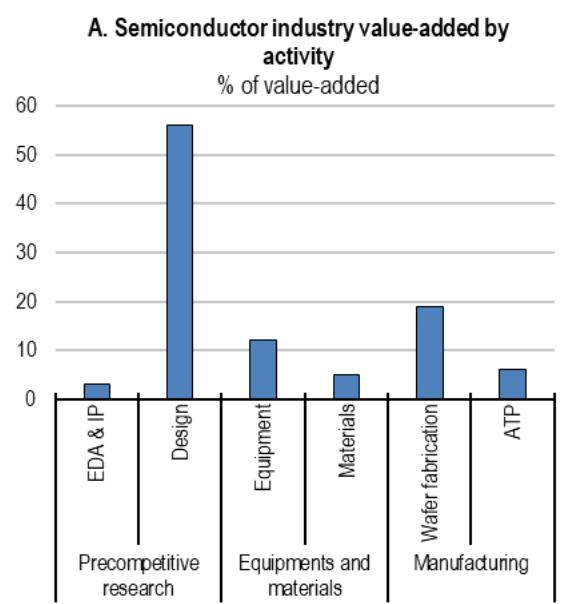

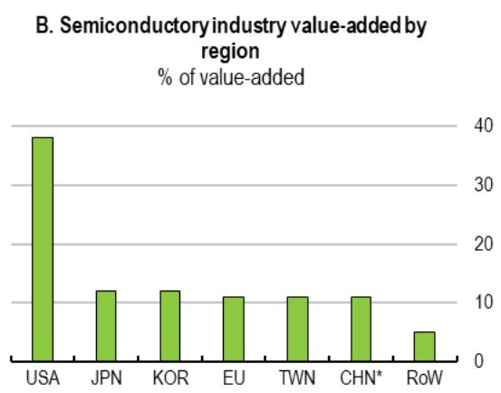  
Note: CHN refers to mainland China.  
Source: BCG 2024.

## 4.5.2. How moving up the GVC in electronics may impact trade?

Moving towards upstream activities in the electronics GVC may have a positive impact on the sector through two main channels: (1) supporting higher value-added exports (2) and lowering trade costs. Moving upstream in the electronics GVC allows a country to capture a larger share of value added accumulated in the production chain (Figure 10.). Over the period from 2000 to 2016, the electronics sector accounted for $40\%$ of global trade in parts and components, particularly in telecommunication equipment (Gaulier, Sztulman and Unal, 2019[27]). Since trade in parts and components serves as a proxy for GVC integration, moving up the GVC in electronics is expected to lead to an increase in higher-value intermediate goods exports, thus increasing the domestic value embodied in exports. Greater integration into the electronics GVC would also foster knowledge spillovers from foreign firms and generate pro-competitive effects due to increased foreign competition. Additionally, as long as moving upstream would foster stronger forward linkages, a higher share of domestic value-added would be embodied in the gross exports of third countries, further enhancing trade dynamics. This occurred to Japan that by initially specialising in high value-added activities managed to become a key supplier in the electronics GVC, thus benefiting from knowledge spillovers from downstream foreign customers (Ito et al., 2023[28]).

Specialising in upstream activities in the electronics GVC may also lower trade costs. While bilateral trade costs on intermediate goods decreased over the past years, the fragmentation of production implies that inputs may cross borders several times before being embodied in final products, leading to an increase in the cumulative trade costs (Jaax, Miroudot and van Lieshout, 2023[29]). Countries that specialize in producing components or intermediate goods at an early stage of production tend to rely less on imported inputs, thus reducing cumulative trade costs, while allowing them to benefit from upstream protectionism (Jaax, Miroudot and van Lieshout, 2023[29]). Additionally, since upstream activities (e.g., design) are core and critical inputs in the electronics GVC, countries producing these intermediate goods are very well-positioned to negotiate better trade agreements that remove or reduce tariffs, customs procedures, and other regulatory barriers that can result in high cross-border costs. Besides, the involvement in key segments of high-tech industries makes it easier to meet the standards and certifications required and reduces negotiation costs with downstream customers (Baldwin, 2016[30]). Finally, early stages of the electronics production chain feature high digital intensity, which positively affects sectoral exports and reduces administrative trade costs (Chiappini and Gaglio, 2023[31]).

## 5. Theoretical framework and Empirical Strategy

This section describes the modelling strategy used to estimate the economic impact of moving up the GVC in electronics in Costa Rica. It sketches the theoretical framework underlying the analysis presenting the main characteristics of the estimated structural gravity equation system and describes the dataset. Results are provided in two subsections depending on whether the model is estimated using a partial equilibrium or a general equilibrium technique.

## 5.1. Theoretical framework

The empirical strategy is grounded on a standard structural gravity system that, in a simplified world where each country is endowed with a single tradeable good variety and agents hold CES preferences, is represented by the following set of equations:

$$
X _ {i j} = \frac {Y _ {i} E _ {j}}{Y} \bigg (\frac {t _ {i j}}{\Pi_ {i} P _ {j}} \bigg) ^ {1 - \sigma}\tag{1}
$$

$$
\Pi_ {i} ^ {1 - \sigma} = \sum_ {j} \left(\frac {t _ {i j}}{P _ {j}}\right) ^ {1 - \sigma} \frac {E _ {j}}{Y}\tag{2}
$$

$$
P _ {j} ^ {1 - \sigma} = \sum_ {i} \left(\frac {t _ {i j}}{\Pi_ {i}}\right) ^ {1 - \sigma} \frac {Y _ {i}}{Y}\tag{3}
$$

$$
p _ {i} = \left(\frac {Y _ {i}}{Y}\right) ^ {\frac {1}{1 - \sigma}} \frac {1}{\alpha_ {i} \Pi_ {i}}\tag{4}
$$

$$
E _ {i} = \varphi_ {i} Y _ {i} = \varphi_ {i} p _ {i} Q _ {i}\tag{5}
$$

Equation (1) conveys the idea that bilateral trade between exporter i and importer j, $X_{ij}$ , increases in the size of exporter's output, $Y_{i}$ , and importer expenditure, $E_{j}$ , expressed in relative terms with respect to global output (Y), and decreases in trade costs encompassing both bilateral trade costs, $t_{ij}$ , and the outward and inward multilateral resistance factors ( $\Pi_{i}$ and $P_{j}$ ). The parameter $\sigma>1$ is the elasticity of substitution between goods from different countries.

Equation (2) and (3) define multilateral resistances as aggregates of bilateral trade costs as in (Anderson and van Wincoop, 2003[32]). The inward multilateral resistances $P_{j}$ measure the incidence of trade costs on each country j's consumers, as if these consumers were buying from a unified market. The outward multilateral resistances $\Pi_{i}$ captures trade costs faced by country i's producers as if they shipped to a unified market. The multilateral resistances show that, all else equal, two countries will trade more with each other the more remote they are from the rest of the world (Yotov et al., 2016[33]).

Equation (4) is the clearing market condition, where $p_{i}$ is the price for each variety of goods in the country of origin and $\alpha$ is a CES preference parameter. Equation (5) expresses country i's aggregate expenditure, $E_{i}$ , as a fixed proportion of its output, $Y_{i}$ , so that for $\varphi >1$ country i faces a trade deficit and a surplus for $1>\varphi>0$ . In turn, nominal output, $Y_{i}$ , is just given by the price, $p_{i}$ , and the country's endowment $Q_{i}$ .

The partial equilibrium analysis estimates equation 1 only and allows for quantifying how changes in bilateral trading costs affect bilateral trade, with all other variables are kept constant (national output, expenditure, world output and multilateral resistances). The general equilibrium analysis, instead, estimates also the indirect effect of changes in bilateral trade by allowing for changes in bilateral trade costs to impact trade also through changes in multilateral resistances (equation 2 and 3), prices (equation 4) and values of domestic production and aggregate expenditure (equation 5).

## 5.2. Data: description and sources

The dataset covers 76 countries over the period 1995-2019 and includes three types of data at the sectoral level: (1) bilateral trade flows; (2) upstreamness indices; (3) gravity variables. Trade flows data are from the International Trade and Production Database for Estimation (ITPD-E) by (Borchert et al., 2022[23]) for 170 industries within 4 broad sectors (Agriculture, Mining, Manufacturing and Services). The dataset includes domestic trade flows that are essential for the estimation of country specific variables in the gravity model.

Upstreamness indicators are from (Mancini et al., 2024[7]) and are based on the 2023 edition of the OECD Inter-Country Input-Output (ICIO) Trade in Value Added (TiVA), a database that covers 76 economies, including all OECD, EU, G20, and ASEAN economies, and 45 industries according to the ISIC Rev. 4 classification. To match trade flows data with upstreamness data the concordance procedure by (Borchert et al., 2022[23]) is adopted, which makes it possible to merge databases using ISIC rev. 3 and ISIC rev. 4 sector classification. Gravity variables from the CEPII's GeoDist database encompass variables widely used in the gravity literature as a proxy for bilateral trade costs, including bilateral distance (Ln\_dist), presence of a common official language between importing and exporting country (LANG) or the presence of contiguous border (CNTG).

Missing domestic trade observations are filled in following the two-step procedure by (Larch, Shawn and Yotov, 2021 $^{[34]}$ ), which consists of: (1) computing the ratio of total internal trade to total exports at the more disaggregated level given available data; (2) using these ratios, in combination with data on total exports, to build an average ratio for each sector to be used to fill in subsectors for which intra-national trade values are missing. For countries with zero total trade at a given year, trade value from the more recent available year are used.

## 5.3. The impact of moving upstream in the electronics GVC on trade: partial equilibrium analysis

The most popular econometric approach to study the economic impact of trade policy is a standard structural gravity equation. The gravity specification associates bilateral trade data with source and destination countries characteristics, and allows for controlling endogeneity between trade flows and explanatory variables (Yotov et al., 2016[33]), thus providing consistent estimations.

To analyse the impact on trade of moving upstream in the electronics sector the following equation is estimated as in (Anderson and van Wincoop, 2003[32]); (Head and Mayer, 2014[35]); (Yotov et al., 2016[33]):

$$
X _ {i j k t} = \exp [ \beta_ {1} F T A _ {i j t} + \beta_ {2} Y E A R \_ B R D R _ {i j k t} + \beta_ {3} B R D R \_ u p s t r e a m n e s s _ {i k t} + \delta_ {j k t} + \gamma_ {i k t} + b _ {i j} ] + \varepsilon_ {i j t}
$$

where $X_{ijkt}$ denotes bilateral trade flows in sector k at time t between the exporter i and the importer j, including the case i=j that identifies domestic trade flows. The introduction of domestic trade flows in structural gravity estimations is key to identify the impact of country-specific variables (Beverelli et al., 2023 $^{[3]}$ ). Following the literature, bilateral trade flows are in nominal terms (Shepherd, Doytchinova and Kravchenko, 2019 $^{[36]}$ ).

A proxy for bilateral costs is included through the dummy variable FTA, which accounts for the presence of free trade agreements between country i and j. Country-pair fixed effects $(b_{ij})$ control for all time-invariant bilateral characteristics, including trade frictions. Additionally, the terms $\delta_{jkt}$ and $\gamma_{ikt}$ , the exporter-sector-time and the importer-sector-time fixed effects, are the theory-consistent way to control for multilateral trade resistances and for all features that vary at the country-year and country-sector-year level. Following standard practice, a dummy variable BRDR is introduced to take into account the difference between international and domestic trade flows.

The time-varying dummy variable $YEAR\_BRDR_{ijkt}$ serves as a proxy for globalisation, helping to prevent overestimation of the variables of interest. It measures the ease of trading internationally relative to domestically (Bergstrand, Larch and Yotov, 2015[37]). As in (Beverelli et al., 2023[3]) and (Esteve-Pérez et al., 2021[15]), a variable interacting sector upstreamness with the border dummy is introduced to assess whether a country's position in the GVC influences the cross-country or cross-industry pattern of trade, and to allow for the identification of the exporter-specific variable when country-time fixed effects are included.

The variable of interest, $BRDR\_upstreamness_{ikt}$ , is the interaction between the time-varying upstreamness indicator and the dummy variable $BRDR_i$ , which takes the value of 1 for international trade and 0 for domestic trade flows. $BRDR\_upstreamness$ can be defined either on the exporter side ( $BRDR\_upstreamness_{ikt}$ ), or on the importer side ( $BRDR\_upstreamness_{jkt}$ ), without any quantitative implications for the corresponding estimates (Beverelli et al., 2023[3]).

Two extensions of equation (A) are considered. To identify the effect of a country's position in the electronics GVC on international trade relative to national trade, the variable $BRDR\_upstream\_electronics$ is introduced, which interacts $BRDR\_upstreamness_{it}$ with a dummy that takes the value of 1 for the electronics sector. To specifically assess the impact on Costa Rica's trade relative to the sample average, the variable $BRDR\_upstream\_electronics\_CR$ is introduced, which interacts $BRDR\_upstream\_electronics$ with a dummy equal to 1 for Costa Rica and 0 otherwise.

The regression is estimated using a Poisson pseudo-maximum likelihood (PPML) estimator to properly cope with zero trade values and heteroskedasticity (Santos Silva and Tenreyro, 2006[38]). Five different versions of equation (A) are estimated (Table 1.). The baseline model includes three standard gravity variable and importer-industry-time and exporter-industry-time fixed effects (column (1)). An extension of the baseline model adds three variables to infer the impact on international trade relative to national trade of moving upstreamness (column (2)). The first variable, the interaction term between the dummy variable BRDR and upstreamness (BRDR\_upstream), captures the impact of upstreamness on trade in all sectors and for all countries. The second variable (BRDR\_upstream\_electronics) is the interaction between the border dummy, the upstreamness index and a sectoral dummy, and takes the value of 1 if the sector is electronics and 0 otherwise. It captures the impact of upstreamness on trade for all countries only in the electronics sector. The third variable (BRDR\_upstream\_electronics\_CR) is the interaction terms between the border dummy, the upstreamness index, a sectoral dummy, and a country dummy, and takes the value of 1 for Costa Rica and 0 otherwise. It captures the impact on trade of upstreamness for Costa Rica only in the electronics sector.

Models from 3 to 5 include country-pair fixed effect (columns 3 to 5), with the third model focusing only on the impact of moving upstreamness on trade in all sectors and for all countries (BRDR\_upstream) (column 3), the fourth focusing on the trade impact of moving upwards for all countries but in the electronics sector only (BRDR\_upstream\_electronics) (column 4), and the fifth focusing on the impact of moving upstreamness on trade in the electronics sector in Costa Rica (BRDR\_upstream\_electronics\_CR) (column 5).

The estimation framework deals with potential endogeneity issues between upstreamness and trade (reverse causality or omitted variable) in three ways. First, exporter and importer fixed effects control for observable and non-observable country-specific links between upstreamness and trade. Second, the estimation of the coefficient of interest $\beta_{3}$ , which captures the interaction term between the international trade dummy and upstreamness ( $BRDR\_upstreamness_{ikt}$ ), is consistent as long as the dummy is uncorrelated with upstreamness or omitted variables. In this respect, it is plausible to assume that the dummy is exogenous to upstreamness, as changes in the positioning of the country along the sectoral GVC do not imply a systematic change in the trade dummy. Finally, the risk of omitting variables is further minimised by the use of country-pair fixed effects.

In this framework, there are issues of perfect collinearity (Beverelli et al., 2023[3]) that prevent the separate identification of the impact of industry exporter upstreamness and importer upstreamness on bilateral trade. Specifically, $BRDR\_upstreamness_{ikt}$ , the interaction between industry exporter upstreamness in sector k and the dummy variable $BRDR_i$ , is perfectly collinear with $BRDR\_upstreamness_{jkt}$ , the interaction between industry importer upstreamness in sector k and the dummy variable $BRDR_j$ . Thus, estimates of $\beta_3$ should be interpreted as the sum of the effects of importer and exporter upstreamness on trade (exports plus imports) relative to domestic trade.

Table 1. The impact of moving upstream on trade: results from a partial equilibrium analysis

<table><tr><td>Models Variables</td><td>(1) Gravity Baseline</td><td>(2) Gravity Electronics</td><td>(3) FE Main</td><td>(4) FE Electronics</td><td>(5) FE Costa Rica</td></tr><tr><td>Ln_Dist</td><td>-0.523***(-0.0589)</td><td>-0.510***(-0.0484)</td><td></td><td></td><td></td></tr><tr><td>CNTG</td><td>0.474***(-0.0928)</td><td>0.503***(-0.0899)</td><td></td><td></td><td></td></tr><tr><td>LANG</td><td>0.379***(-0.0983)</td><td>0.364***(-0.0914)</td><td></td><td></td><td></td></tr><tr><td>BRDR</td><td>-4.119***(-0.281)</td><td>-5.033***(-0.801)</td><td></td><td></td><td></td></tr><tr><td>FTA</td><td>0.231*(-0.119)</td><td>0.284***(-0.109)</td><td>0.109**(0.0435)</td><td>0.102**(-0.0465)</td><td>0.102**(0.0466)</td></tr><tr><td>BRDR_upstream</td><td></td><td>0.321(-0.295)</td><td>0.230(0.306)</td><td>0.329(-0.321)</td><td>0.329(0.320)</td></tr><tr><td>BRDR_upstream_electronics</td><td></td><td>1.286***(-0.0663)</td><td></td><td>1.076***(-0.118)</td><td>1.074***(0.118)</td></tr><tr><td>BRDR_upstream_electronics_CR</td><td></td><td></td><td></td><td></td><td>3.352***(0.0440)</td></tr><tr><td>Constant</td><td>16.02***(-0.36)</td><td>15.91***(-0.3)</td><td>11.97***(0.130)</td><td>11.89***(-0.139)</td><td>11.89***(0.139)</td></tr><tr><td>Observations</td><td>3,297,524</td><td>3,282,628</td><td>3,282,628</td><td>3,282,628</td><td>3,282,628</td></tr><tr><td> $R^2$ </td><td>0.98</td><td>0.98</td><td>0.98</td><td>0.97</td><td>0.98</td></tr><tr><td>Exporter-industry-time FE</td><td>Yes</td><td>Yes</td><td>Yes</td><td>Yes</td><td>Yes</td></tr><tr><td>Importer-industry-time FE</td><td>Yes</td><td>Yes</td><td>Yes</td><td>Yes</td><td>Yes</td></tr><tr><td>Country-pair FE</td><td>No</td><td>No</td><td>Yes</td><td>Yes</td><td>Yes</td></tr></table>

Note: All estimates are obtained over the sample period 1995-2019 and use the PPML estimator. Statistical significance: \*\*\* p<0.01, \*\* p<0.05, \* p<0.1. Standard errors reported in parentheses are clustered by exporter, importer, sector and year. The globalization variable has also been included in all columns, but estimates are omitted for brevity as results are very similar. The variables Ln\_dist, CNTG, LANG and BRDR are not estimated in model 3 to 5 for in these models a country-pair fixed effect is introduced.

Source: Authors' calculations; ITPD-E database (The International Trade and Production Database for Estimation) and Centre d'études prospectives et d'informations internationales (CEPII).

Results suggest that moving upstream across all sectoral GVCs does not necessarily increase international trade relative to domestic trade. In models (2) to (5), the coefficient estimate for BRDR\_upstream is positive but not statistically significant (Table 1.). However, when considering the electronics GVC only, the coefficient on BRDR\_upstream\_electronics is large, positive, and highly significant across models. While results suggest that any country that moved upstream in the electronics value chain would tend to increase international trade relative to domestic trade, this effect is even stronger for Costa Rica (BRDR\_upstream\_electronics\_CR). The use of country-pair fixed effects, which control for potential endogeneity, confirms these results, though the size of the coefficient of interest is slightly reduced (BRDR\_upstreamness\_electronics, column 4 and 5). $^{3}$

All the standard gravity variables also have the expected sign. The most relevant findings relate to the three variables capturing upstreamness, that is BRDR\_upstream, BRDR\_upstream\_electronics and BRDR\_upstream\_electronics\_CRI. Focusing on regressions 3 to 5, which include country-pair fixed effects, results confirm that moving upstream across all sectors has no significant impact on trade, as the coefficient on BRDR\_upstream is statistically insignificant. However, when focusing on a sector where value added is concentrated in upstream stages, such as electronics, moving upstream is associated with higher international trade relative to domestic trade (BRDR\_upstream\_electronics). In general, a one-tenth of one-unit increase in the upstreamness index in the electronics sector would generally lead to a 20% increase in international trade relative to domestic trade. However, for Costa Rica the effect is even stronger (BRDR\_upstream\_electronics\_CRI), at around 270% $^{4}$ .

The assumed one-tenth of one unit increase in the upstreamness index, though arbitrary, is plausible as it corresponds to around half a standard deviation in the distribution of upstreamness in electronics in 2019. It is also consistent with the historical evolution of the index in Costa Rica (Figure 11.) , which ranged between 1.2 to 2.2 between 1995 and 2020, with sharp changes following the entry or exit of large firms such as INTEL (cfr subsection The semiconductor sector in Costa Rica).

In an additional estimation not included in this paper, globalization is found to have a significant impact on international trade during the period 1995–2019, as captured by the positive and increasing value of the coefficient of the time-varying border dummies (to be interpreted as deviations from the average BRDR estimate).

## 5.4. Moving up the electronics GVC and development: the general equilibrium analysis

A partial equilibrium analysis allows for estimating the impact of moving up the GVC in electronics only on trade. To gain insight on the overall economic impact, including sectoral output and real wage, a general equilibrium gravity equation system (equation 1 to 5 in section Theoretical framework) is estimated following the procedure developed by (Anderson and van Wincoop, 2003[32]), and already used in previous empirical applications such as, among others, (Beverelli et al., 2023[3]) and (Esteve-Pérez et al., 2021[15]).

The general equilibrium (GE) approach is used to perform two experiments. The first experiment attempts to estimate what would be the long run impact of moving upstream in electronics in 2019, the last year of the sample period, on trade, real output and real wages in the electronics sector. This experiment is performed using the gravity equation system and taking estimates from the partial equilibrium model with country-pair fixed effect (column 4 in Table 1.). In this experiment, the upstreamness index is increased by half a standard deviation of the distribution of upstreamness in electronics in 2019 (0.20). Such an increase is arbitrary yet plausible. For example, for Costa Rica, the upstreamness index in electronics would remain below its peak level from 2015, the year before INTEL relocated the assembly, testing and packaging activity out of the country. The increase in upstreamness is applied only to countries in a situation similar to Costa Rica, more specifically those whose electronics upstreamness index in 2019 was below the average of the sample (1.9). The last year of the sample, 2019, is used as the baseline year.

The second experiment aims at quantifying the economic impact of the observed changes in upstreamness indices in electronics over the period 1995-2019 for all the countries in the sample through an ex-post counterfactual analysis (Beverelli et al., 2023[3]). The counterfactual exercise compares trade, real wage and real output in the electronics sector between a scenario in which the value of upstreamness in electronics for each country is kept fixed at its 1995 level, and a scenario in which it takes the actual observed values.

Results from the first experiment (Table 2. and Figure 14.) show that if Costa Rica moved up the electronics GVC in 2019, in the long run it would increase real income in the electronics sector by 16.4%, real wages by 6% and trade by 4.5%. Costa Rica also stands out as the country that would benefit the most from moving upstream in electronics, possibly for both having an initial very low value of upstreamness in electronics (Figure 7.) and for having comparative advantages in the sector (Figure 3.).

Figure 14. Moving upstream in the electronics GVC may have a large impact on the sector

Main economic effects of moving upstream in the Costa Rican electronics GVC, baseline scenario

Note: The chart is based on results from the counterfactual experiment 1 reported in Table 2. Source: Author's calculation.  
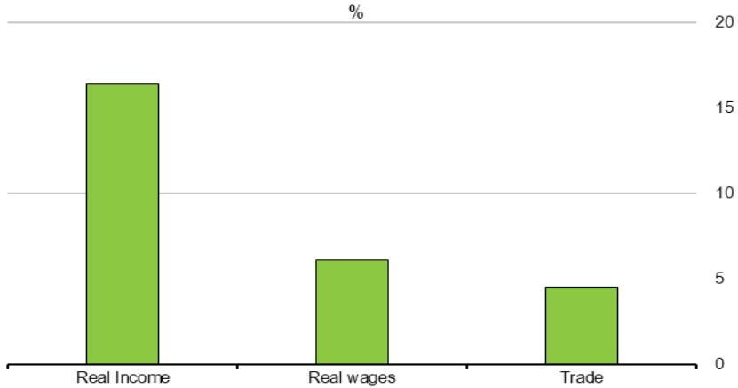

Results from the second counterfactual experiment are reported in Table 3.. Overall, they show that countries that moved more upstream in the electronics GVC between 1995 and 2016 experienced greater increases in real output, real wages and trade (Figure 15.). Conversely, countries that over the period moved downstream the electronics GVC reported on average a negligible increase in real income. It is worth stressing the case of Malaysia, which increased the real output of the electronic sector by 37% over 1995-2016, as over the same period it experienced one of the largest increase in upstreamness (+0.7). Other Asian countries (Thailand, Singapore, Taiwan and South Korea) also reported both a large positive impact on real output (more than 12%) and a large increase in upstreamness, thus confirming the story of success of Asian countries in the electronics sector over the last decades.

## Figure 15. Countries that moved more upstream reaped largest benefits in electronics

Average economic impact of the increase in upstreamness by the level of change in upstreamness, %

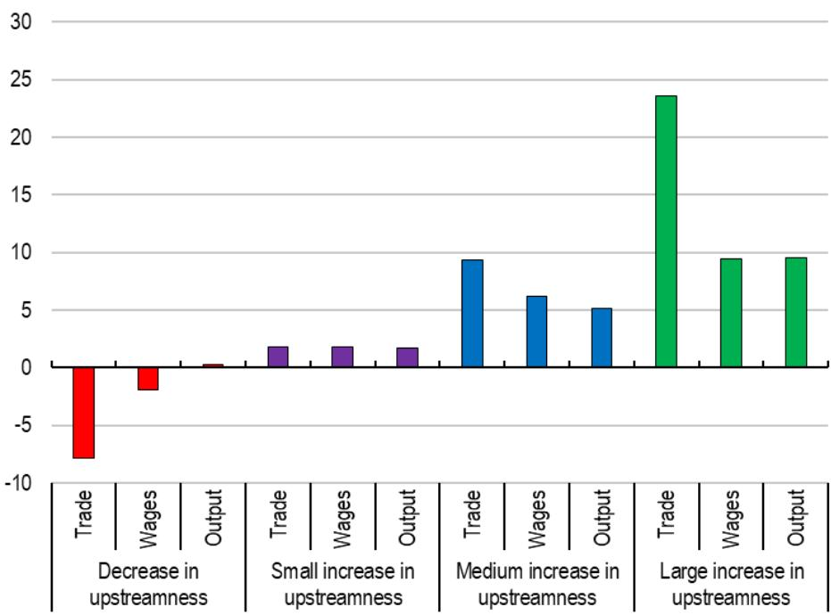  
Note: The chart is based on results from the counterfactual experiment 2 reported in Table 3.. Each bar reports the average change in an economic variable (trade, real wages or real output) of countries in which upstreamness in electronics changed between 1995 and 2019 by a similar amount. Countries are grouped into four categories according to the changes in upstreamness: decrease in upstreamness (red bars); small increase in upstreamness (purple bars, for an increase between 0 and 0.2); medium increase in upstreamness (blue bars, for an increase between 0.2 and 0.4; large increase in upstreamness (green bars, for an increase larger than 0.4).

Source: Author's calculation.

Intuitively, the main mechanism through which moving up the electronics GVC produces a positive effect within a general equilibrium (GE) analysis is that it represents a tariff-equivalent reduction in trade costs (see section How moving up the GVC in electronics may impact trade?). A plausible mechanism triggered by the increase in upstreamness is that, by reducing trade costs, exporters will trade more and generate higher profit margins. For countries experiencing lower export costs, the resulting change in real income entails a net increase in producers' output while consumers' consumption remains unchanged.

Table 2. Economic impact of increasing upstreamness in the electronics sector
Experiment 1

<table><tr><td>Country</td><td>ΔU</td><td>% change real income</td><td>% change real wages</td><td>% change trade</td></tr><tr><td>ARG</td><td>+0.20</td><td>1.1</td><td>3.1</td><td>11.8</td></tr><tr><td>AUS</td><td>+0.20</td><td>1.6</td><td>4.0</td><td>7.9</td></tr><tr><td>AUT</td><td>0</td><td>0.3</td><td>0.2</td><td>-0.5</td></tr><tr><td>BEL</td><td>0</td><td>0.6</td><td>0.2</td><td>-0.6</td></tr><tr><td>BGD</td><td>+0.20</td><td>1.0</td><td>2.9</td><td>11.9</td></tr><tr><td>BGR</td><td>0</td><td>0.5</td><td>0.3</td><td>-0.5</td></tr><tr><td>BLR</td><td>+0.20</td><td>1.9</td><td>4.5</td><td>3.7</td></tr><tr><td>BRA</td><td>+0.20</td><td>0.5</td><td>0.4</td><td>22.2</td></tr><tr><td>BRN</td><td>+0.20</td><td>1.3</td><td>4.8</td><td>3.7</td></tr><tr><td>CAN</td><td>0</td><td>1.3</td><td>1.3</td><td>0.6</td></tr><tr><td>CHE</td><td>0</td><td>-0.1</td><td>0.3</td><td>0.1</td></tr><tr><td>CHL</td><td>+0.20</td><td>1.1</td><td>3.9</td><td>9.1</td></tr><tr><td>CHN</td><td>0</td><td>0.2</td><td>0.3</td><td>0.1</td></tr><tr><td>CIV</td><td>+0.20</td><td>0.9</td><td>4.4</td><td>3.7</td></tr><tr><td>CMR</td><td>+0.20</td><td>1.1</td><td>5.0</td><td>4.0</td></tr><tr><td>COL</td><td>+0.20</td><td>0.9</td><td>2.3</td><td>14.9</td></tr><tr><td>CRI</td><td>+0.20</td><td>16.4</td><td>6.1</td><td>4.5</td></tr><tr><td>CYP</td><td>+0.20</td><td>3.4</td><td>5.0</td><td>4.7</td></tr><tr><td>CZE</td><td>0</td><td>0.3</td><td>0.0</td><td>-0.7</td></tr><tr><td>DEU</td><td>0</td><td>0.4</td><td>0.4</td><td>-0.3</td></tr><tr><td>DNK</td><td>0</td><td>0.3</td><td>0.2</td><td>-0.5</td></tr><tr><td>EGY</td><td>+0.20</td><td>1.0</td><td>2.8</td><td>9.9</td></tr><tr><td>ESP</td><td>0</td><td>0.6</td><td>0.2</td><td>-0.5</td></tr><tr><td>EST</td><td>0</td><td>0.4</td><td>0.5</td><td>0.0</td></tr><tr><td>FIN</td><td>0</td><td>0.2</td><td>0.1</td><td>0.2</td></tr><tr><td>FRA</td><td>0</td><td>0.4</td><td>0.2</td><td>-0.2</td></tr><tr><td>GBR</td><td>0</td><td>0.6</td><td>0.3</td><td>-0.2</td></tr><tr><td>GRC</td><td>+0.20</td><td>1.3</td><td>3.1</td><td>8.8</td></tr><tr><td>HKG</td><td>0</td><td>0.8</td><td>0.2</td><td>-0.6</td></tr><tr><td>HRV</td><td>0</td><td>0.5</td><td>0.0</td><td>-0.8</td></tr><tr><td>HUN</td><td>0</td><td>0.1</td><td>0.1</td><td>-0.6</td></tr><tr><td>IDN</td><td>0</td><td>0.5</td><td>0.3</td><td>-0.4</td></tr><tr><td>IND</td><td>+0.20</td><td>1.1</td><td>2.4</td><td>10.3</td></tr><tr><td>IRL</td><td>0</td><td>-0.5</td><td>0.5</td><td>0.0</td></tr><tr><td>ISL</td><td>+0.20</td><td>2.6</td><td>3.6</td><td>8.0</td></tr><tr><td>ISR</td><td>0</td><td>0.4</td><td>0.6</td><td>0.2</td></tr><tr><td>ITA</td><td>0</td><td>0.3</td><td>0.1</td><td>-0.3</td></tr><tr><td>JOR</td><td>0</td><td>0.9</td><td>0.3</td><td>-0.5</td></tr><tr><td>JPN</td><td>+0.20</td><td>2.7</td><td>2.0</td><td>7.3</td></tr><tr><td>KAZ</td><td>0</td><td>0.9</td><td>0.2</td><td>-0.7</td></tr><tr><td>KHM</td><td>+0.20</td><td>2.0</td><td>4.7</td><td>4.0</td></tr><tr><td>KOR</td><td>0</td><td>-0.4</td><td>0.2</td><td>-0.4</td></tr><tr><td>LAO</td><td>+0.20</td><td>6.5</td><td>4.3</td><td>3.8</td></tr><tr><td>LTU</td><td>+0.20</td><td>3.1</td><td>4.9</td><td>4.0</td></tr><tr><td>LUX</td><td>0</td><td>0.2</td><td>0.2</td><td>-0.7</td></tr><tr><td>LVA</td><td>+0.20</td><td>2.6</td><td>3.8</td><td>6.2</td></tr><tr><td>MAR</td><td>0</td><td>0.6</td><td>0.2</td><td>-0.7</td></tr><tr><td>MEX</td><td>0</td><td>1.3</td><td>1.4</td><td>0.2</td></tr><tr><td>MLT</td><td>0</td><td>-0.5</td><td>0.1</td><td>-0.6</td></tr><tr><td>MMR</td><td>+0.20</td><td>2.1</td><td>5.1</td><td>4.3</td></tr><tr><td>MYS</td><td>0</td><td>-0.2</td><td>0.7</td><td>-0.4</td></tr><tr><td>NGA</td><td>+0.20</td><td>2.2</td><td>5.9</td><td>3.7</td></tr><tr><td>NLD</td><td>0</td><td>0.6</td><td>0.4</td><td>-0.7</td></tr><tr><td>NOR</td><td>0</td><td>0.8</td><td>0.4</td><td>-0.3</td></tr><tr><td>NZL</td><td>+0.20</td><td>0.5</td><td>0.6</td><td>19.6</td></tr><tr><td>PAK</td><td>+0.20</td><td>1.3</td><td>4.1</td><td>6.9</td></tr><tr><td>PER</td><td>+0.20</td><td>0.8</td><td>3.1</td><td>10.4</td></tr><tr><td>PHL</td><td>0</td><td>0.2</td><td>0.5</td><td>-0.6</td></tr><tr><td>POL</td><td>0</td><td>0.3</td><td>0.1</td><td>-0.6</td></tr><tr><td>PRT</td><td>0</td><td>0.2</td><td>0.0</td><td>-0.8</td></tr><tr><td>ROU</td><td>0</td><td>0.3</td><td>0.1</td><td>-0.6</td></tr><tr><td>RUS</td><td>0</td><td>0.8</td><td>0.3</td><td>-0.4</td></tr><tr><td>SAU</td><td>+0.20</td><td>1.0</td><td>3.2</td><td>9.3</td></tr><tr><td>SEN</td><td>+0.20</td><td>0.8</td><td>2.3</td><td>12.1</td></tr><tr><td>SGP</td><td>0</td><td>0.4</td><td>0.3</td><td>-0.6</td></tr><tr><td>SVK</td><td>0</td><td>0.2</td><td>0.0</td><td>-0.7</td></tr><tr><td>SVN</td><td>0</td><td>0.4</td><td>0.2</td><td>-0.4</td></tr><tr><td>SWE</td><td>0</td><td>0.4</td><td>0.3</td><td>-0.5</td></tr><tr><td>THA</td><td>0</td><td>0.4</td><td>0.5</td><td>0.1</td></tr><tr><td>TUN</td><td>0</td><td>0.1</td><td>0.1</td><td>-0.7</td></tr><tr><td>TUR</td><td>+0.20</td><td>1.4</td><td>3.1</td><td>9.1</td></tr><tr><td>TWN</td><td>0</td><td>-0.7</td><td>0.2</td><td>-0.2</td></tr><tr><td>UKR</td><td>0</td><td>0.8</td><td>0.3</td><td>-0.5</td></tr><tr><td>USA</td><td>+0.20</td><td>1.1</td><td>1.6</td><td>10.2</td></tr><tr><td>VNM</td><td>0</td><td>0.0</td><td>0.2</td><td>-0.1</td></tr><tr><td>ZAF</td><td>+0.20</td><td>1.2</td><td>4.8</td><td>3.8</td></tr></table>

Source: Authors' calculations

Table 3. Estimated economic effect of increasing upstreamness between 1995-2019  
Counterfactual experiment 2:

<table><tr><td>Country</td><td>ΔU</td><td>% change real income</td><td>% change real wages</td><td>% change trade</td></tr><tr><td>ARG</td><td>+0.5</td><td>2.5</td><td>7.0</td><td>25.1</td></tr><tr><td>AUS</td><td>+0.3</td><td>2.7</td><td>5.7</td><td>10.4</td></tr><tr><td>AUT</td><td>+0.3</td><td>4.8</td><td>5.4</td><td>9.1</td></tr><tr><td>BGD</td><td>-0.1</td><td>1.8</td><td>-0.7</td><td>-6.5</td></tr><tr><td>BGR</td><td>+0.4</td><td>7.3</td><td>9.7</td><td>7.5</td></tr><tr><td>BLR</td><td>-0.2</td><td>-0.1</td><td>-4.8</td><td>-6.8</td></tr><tr><td>BRA</td><td>+0.5</td><td>1.5</td><td>1.1</td><td>52.1</td></tr><tr><td>BRN</td><td>+0.2</td><td>3.2</td><td>6.5</td><td>3.4</td></tr><tr><td>CAN</td><td>-0.1</td><td>0.0</td><td>-2.9</td><td>-6.6</td></tr><tr><td>CHE</td><td>+0.3</td><td>6.8</td><td>3.9</td><td>7.5</td></tr><tr><td>CHL</td><td>-0.2</td><td>1.6</td><td>-3.2</td><td>-11.7</td></tr><tr><td>CHN</td><td>-0.3</td><td>-2.7</td><td>-0.7</td><td>-7.3</td></tr><tr><td>CIV</td><td>-0.2</td><td>1.3</td><td>-4.5</td><td>-5.8</td></tr><tr><td>CMR</td><td>+0.1</td><td>1.5</td><td>1.8</td><td>0.4</td></tr><tr><td>COL</td><td>+0.3</td><td>1.7</td><td>3.3</td><td>20.4</td></tr><tr><td>CRI</td><td>+0.2</td><td>2.2</td><td>1.6</td><td>0.3</td></tr><tr><td>CYP</td><td>+0.2</td><td>3.0</td><td>3.8</td><td>2.6</td></tr><tr><td>CZE</td><td>+0.4</td><td>5.9</td><td>8.4</td><td>7.3</td></tr><tr><td>DEU</td><td>+0.3</td><td>5.1</td><td>5.2</td><td>6.9</td></tr><tr><td>DNK</td><td>+0.2</td><td>5.0</td><td>5.7</td><td>3.3</td></tr><tr><td>EGY</td><td>+0.1</td><td>1.9</td><td>2.3</td><td>6.4</td></tr><tr><td>ESP</td><td>+0.4</td><td>3.8</td><td>6.8</td><td>15.4</td></tr><tr><td>EST</td><td>+0.5</td><td>10.2</td><td>9.1</td><td>12.0</td></tr><tr><td>FIN</td><td>+0.4</td><td>2.4</td><td>2.6</td><td>20.8</td></tr><tr><td>FRA</td><td>+0.2</td><td>2.2</td><td>2.3</td><td>7.6</td></tr><tr><td>GBR</td><td>+0.4</td><td>4.2</td><td>6.1</td><td>11.2</td></tr><tr><td>GRC</td><td>-0.2</td><td>1.7</td><td>-2.0</td><td>-10.4</td></tr><tr><td>HRV</td><td>+0.3</td><td>4.5</td><td>7.7</td><td>8.5</td></tr><tr><td>HUN</td><td>+0.4</td><td>6.7</td><td>7.0</td><td>13.9</td></tr><tr><td>IDN</td><td>+0.4</td><td>5.7</td><td>8.1</td><td>8.4</td></tr><tr><td>IND</td><td>-0.2</td><td>1.5</td><td>-1.7</td><td>-12.3</td></tr><tr><td>IRL</td><td>+0.1</td><td>-1.9</td><td>1.2</td><td>-0.3</td></tr><tr><td>ISL</td><td>+0.1</td><td>1.9</td><td>1.7</td><td>1.3</td></tr><tr><td>ISR</td><td>+0.4</td><td>7.7</td><td>5.8</td><td>10.2</td></tr><tr><td>ITA</td><td>+0.0</td><td>1.2</td><td>0.8</td><td>0.4</td></tr><tr><td>JOR</td><td>+0.5</td><td>2.0</td><td>8.9</td><td>23.2</td></tr><tr><td>JPN</td><td>+0.1</td><td>1.6</td><td>1.6</td><td>3.7</td></tr><tr><td>KAZ</td><td>+1.1</td><td>2.5</td><td>12.9</td><td>106.9</td></tr><tr><td>KHM</td><td>-0.1</td><td>0.6</td><td>-3.5</td><td>-5.8</td></tr><tr><td>KOR</td><td>+0.6</td><td>12.9</td><td>7.1</td><td>14.7</td></tr><tr><td>LAO</td><td>-0.3</td><td>-6.2</td><td>-2.0</td><td>-6.7</td></tr><tr><td>LTU</td><td>0</td><td>2.7</td><td>1.5</td><td>-2.5</td></tr><tr><td>LVA</td><td>+0.6</td><td>8.8</td><td>12.6</td><td>18.3</td></tr><tr><td>MAR</td><td>+0.1</td><td>1.9</td><td>1.2</td><td>-0.8</td></tr><tr><td>MEX</td><td>-0.1</td><td>-1.4</td><td>-1.6</td><td>-4.6</td></tr><tr><td>MLT</td><td>0.4</td><td>12.4</td><td>7.5</td><td>7.1</td></tr><tr><td>MMR</td><td>-0.2</td><td>0.1</td><td>-4.4</td><td>-6.2</td></tr><tr><td>MYS</td><td>+0.7</td><td>37.1</td><td>15.7</td><td>12.5</td></tr><tr><td>NGA</td><td>+0.1</td><td>0.0</td><td>-0.8</td><td>-0.8</td></tr><tr><td>NLD</td><td>-0.2</td><td>-0.2</td><td>-2.2</td><td>-5.5</td></tr><tr><td>NOR</td><td>+0.5</td><td>4.2</td><td>8.7</td><td>16.4</td></tr><tr><td>NZL</td><td>-0.3</td><td>0.6</td><td>-0.4</td><td>-21.6</td></tr><tr><td>PAK</td><td>0.0</td><td>1.3</td><td>-0.8</td><td>-3.6</td></tr><tr><td>PER</td><td>0.0</td><td>1.7</td><td>-0.3</td><td>-3.8</td></tr><tr><td>PHL</td><td>+0.1</td><td>2.7</td><td>3.3</td><td>-0.9</td></tr><tr><td>POL</td><td>+0.4</td><td>5.8</td><td>7.2</td><td>9.6</td></tr><tr><td>PRT</td><td>+0.2</td><td>4.5</td><td>5.2</td><td>7.9</td></tr><tr><td>ROU</td><td>+0.3</td><td>5.3</td><td>6.8</td><td>8.1</td></tr><tr><td>RUS</td><td>+0.1</td><td>2.1</td><td>1.6</td><td>0.5</td></tr><tr><td>SAU</td><td>+0.1</td><td>1.6</td><td>0.9</td><td>0.6</td></tr><tr><td>SEN</td><td>-0.1</td><td>2.0</td><td>-0.5</td><td>-7.3</td></tr><tr><td>SGP</td><td>+0.6</td><td>14.1</td><td>16.9</td><td>14.7</td></tr><tr><td>SVK</td><td>+0.4</td><td>9.6</td><td>11.7</td><td>8.3</td></tr><tr><td>SVN</td><td>+0.3</td><td>5.0</td><td>5.7</td><td>10.8</td></tr><tr><td>SWE</td><td>0.0</td><td>2.0</td><td>1.6</td><td>-1.2</td></tr><tr><td>THA</td><td>+0.6</td><td>13.3</td><td>9.5</td><td>15.6</td></tr><tr><td>TUN</td><td>+0.2</td><td>6.2</td><td>6.1</td><td>3.2</td></tr><tr><td>TUR</td><td>+0.2</td><td>2.5</td><td>3.2</td><td>7.5</td></tr><tr><td>TWN</td><td>+0.6</td><td>15.8</td><td>5.9</td><td>12.9</td></tr><tr><td>UKR</td><td>+0.6</td><td>3.0</td><td>11.8</td><td>20.1</td></tr><tr><td>USA</td><td>-0.2</td><td>0.3</td><td>-0.9</td><td>-10.1</td></tr><tr><td>VNM</td><td>+0.1</td><td>2.1</td><td>2.4</td><td>3.5</td></tr></table>

Source: Authors' calculations

## 6. Conclusions

Despite strong export and FDI performance, Costa Rica's participation in GVCs remains very well below the OECD average, including in some sectors where the country exhibits a strong comparative export performance. Beyond agriculture, sectors such as advanced manufacturing (e.g., medical devices), semiconductors, and, to a lesser extent, optical instruments and ships building and repairing offer the greatest potential gains from deeper GVC integration. Using the electronics sector as an illustrative case, the paper estimates a gravity equation system that shows that moving up the electronics global value chain could yield substantial gains for Costa Rica. Our estimates suggest that real income in the electronics sector could increase by up to 16.4%, real wages by around 6%, and international trade by 4.5% relative to domestic trade. These results should be interpreted as indicative rather than definitive, and complemented with country- and sector-specific considerations when informing trade and industrial policy design. More generally, the framework in this paper can help to identify activities and sectors associated with potentially large economic gains from deeper GVC integration. However, realising these opportunities depends in practice on country-specific factors, including skills availability, innovation capabilities, infrastructure and the broader investment environment. While Costa Rica could aim to strengthen either R&D activities or wafer fabrication, both high value-added stages of production, the former appears more feasible. The country has already begun building capacity in R&D, whereas wafer fabrication entails higher barriers due to its capital intensity requirements.

## References

Anderson, J. and E. van Wincoop (2003), “Gravity with Gravitas: A Solution to the Border Puzzle”, American Economic Review, Vol. 93/1, pp. 170-192, https://doi.org/10.1257/000282803321455214.

Antràs, P. and D. Chor (2019), “On the Measurement of Upstreamness and Downstreamness in Global Value Chains”, World trade Evolution: Growth, Productivity and Employment. [5]

Antràs, P. et al. (2012), “Measuring the Upstreamness of Production and Trade Flows”, American Economic Review, Vol. Papers & Proceedings 102(3): 412–16.

Ardelean, A., M. León-Ledesma and L. Puzzello (2024), “Growth volatility and trade: Market diversification vs. production specialization”, Journal of Economic Behavior & Organization, Vol. 225, pp. 252-271, https://doi.org/10.1016/j.jebo.2024.07.001. [39]

Arriola, C. et al. (2020), “Efficiency and risks in global value chains in the context of COVID-19”, OECD Economics Department Working Papers, No. 1637, https://doi.org/10.1787/3e4b7ecf-en.

Baldwin, R. (2016), The Great Convergence, Harvard University Press, https://doi.org/10.2307/j.ctv24w655w.

Baldwin, R. and R. Freeman (2022), “Risks and Global Supply Chains: What We Know and What We Need to Know”, Annual Review of Economics, Vol. 14, https://doi.org/10.1146/annurev-economics-051420-113737.

BCG (2024), Emerging resilience in the semiconductor supply chain. [24]

Bergstrand, J., M. Larch and Y. Yotov (2015), “Economic integration agreements, border effects, [37] and distance elasticities in the gravity equation”, European Economic Review, Vol. 78, pp. 307-327, https://doi.org/10.1016/j.euroecorev.2015.06.003.

Bernard, A. et al. (2018), “Carry-along trade”, The review of economic studies, Vol. 86/2, https://doi.org/10.1093/restud/rdy006. [4]

Beverelli, C. et al. (2025), “Services trade and environmental sustainability: Conceptual linkages and empirical patterns”, OECD Trade Policy Papers, No. 292, https://doi.org/10.1787/53bd863a-en.

Beverelli, C. et al. (2023), “Institutions, trade, and development: identifying the impact of country-specific characteristics on international trade”, Oxford Economic Papers, Vol. 76/2, pp. 469-494, https://doi.org/10.1093/oep/gpad014.

Blázquez, L., C. Díaz-Mora and B. González-Díaz (2023), “Understanding digital services in GVCs: An extended gravity model through the lens of network analysis.”, The World Economy, Vol. 46, pp. 2598–2623.

Bonadio, B. et al. (2021), “Global supply chains in the pandemic”, Journal of International Economics, Vol. 133, https://doi.org/10.1016/j.jinteco.2021.103534. [10]

Bondi, A. et al. (2025), “Global value chains and the design of trade agreements”, [14] https://doi.org/10.1007/s11558-024-09581-0.

Borchert, I. et al. (2022), “The International Trade and Production Database for Estimation - Release 2 (ITPD-E-R02)”, USITC Working Paper 2022–07–A.

Borin, A., M. Mancini and D. Taglioni (2025), “Economic consequences of trade and global value chain integration: A measurement perspective”, The World Bank Economic Review, https://doi.org/10.1093/wber/lhaf017.

Chiappini, R. and C. Gaglio (2023), “Digital intensity, trade costs and exports’ quality upgrading”, The World Economy, Vol. 47/2, pp. 709-747, https://doi.org/10.1111/twec.13448.

COMEX (2024), Hoja de ruta para el fortalecimiento de semiconductores en Costa Rica.

D'Aguanno, L. et al. (2021), "Global value chains, volatility and safe openness: is trade a double-edged sword?", Bank of england financial stability paper 46. [11]

ECB (2022), Global value chains: measurement, trends and drivers.

Esteve-Pérez, S. et al. (2021), “Corruption and International Trade: A Re-assessment with Intra-National Flows”, Economics, Vol. 15/1, pp. 187-198, https://doi.org/10.1515/econ-2022-0015. [15]

Fally, T. (2012), Production Staging: Measurement and Facts.

Gaulier, G., A. Sztulman and D. Unal (2019), “Are global value chains receding? The jury is still out. Key findings from the analysis of deflated world trade in parts and components”, Banque de France WP #715.

Head, K. and T. Mayer (2014), “Gravity Equations: Workhorse, Toolkit, and Cookbook”, in Handbook of International Economics, Elsevier, https://doi.org/10.1016/b978-0-444-54314-1.00003-3.

Hummels, D., J. Ishii and Y. Kei-Mu (2001), “The nature and growth of vertical specialization in world trade”, Journal of International Economics, Vol. 54/1. [1]

IMF (2023), “World Economic Outlook” Issue 1. [22]

Ito, K. et al. (2023), “Global value chains and domestic innovation”, Research Policy, Vol. 52/3, [28] p. 104699, https://doi.org/10.1016/j.respol.2022.104699.

Jaax, A., S. Miroudot and E. van Lieshout (2023), “Deglobalisation? The reorganisation of global value chains in a changing world”, OECD Trade Policy Papers, No. 272, OECD Publishing, Paris, https://doi.org/10.1787/b15b74fe-en.

Johnson, R. and G. Noguera (2012), “Accounting for intermediates: Production sharing and trade in value added”, Journal of International Economics, Vol. 86/2.

Larch, M., T. Shawn and Y. Yotov (2021), “A simple method to quantify the ex-ante effects of “deep” trade liberalization and “hard” trade protection”, School of Economics Working Paper Series 2021-14, LeBow College of Business, Drexel University.. [34]

Leromain, E. and G. Orefice (2014), “New revealed comparative advantage index: Dataset and empirical distribution”, International economics, Vol. 139, https://doi.org/10.1016/j.inteco.2014.03.003.

Mancini, M. et al. (2024), “Positioning in Global Value Chains: World Map and Indicators, a new dataset available for GVC analyses”, World Bank Economic Review.

Monge, R. (2017), “Ascendiendo en la Cadena Global de Valor: el caso de Intel Costa Rica”, ILO Technical report 2017/8.
[25]
OECD (2025), OECD Supply Chain Resilience Review: Navigating Risks, OECD Publishing, Paris, https://doi.org/10.1787/94e3a8ea-en.
[12]
OECD (2025), OECD Economic Surveys: Costa Rica 2025, OECD Publishing, Paris, https://doi.org/10.1787/048cf07b-en.
[21]
OECD (2013), Mapping Global Value Chains, https://doi.org/10.1787/18166873.
[16]
Santos Silva, J. and S. Tenreyro (2006), “The log of gravity”, The review of Economics and Statistics, Vol. 88 no.4, pp. 641-658.
[38]
Shepherd, B., H. Doytchinova and A. Kravchenko (2019), The gravity model of international trade: a user guide [R version].
[36]
Yotov, Y. et al. (2016), An advanced guide to trade policy analysis: The structural gravity model.
[33]