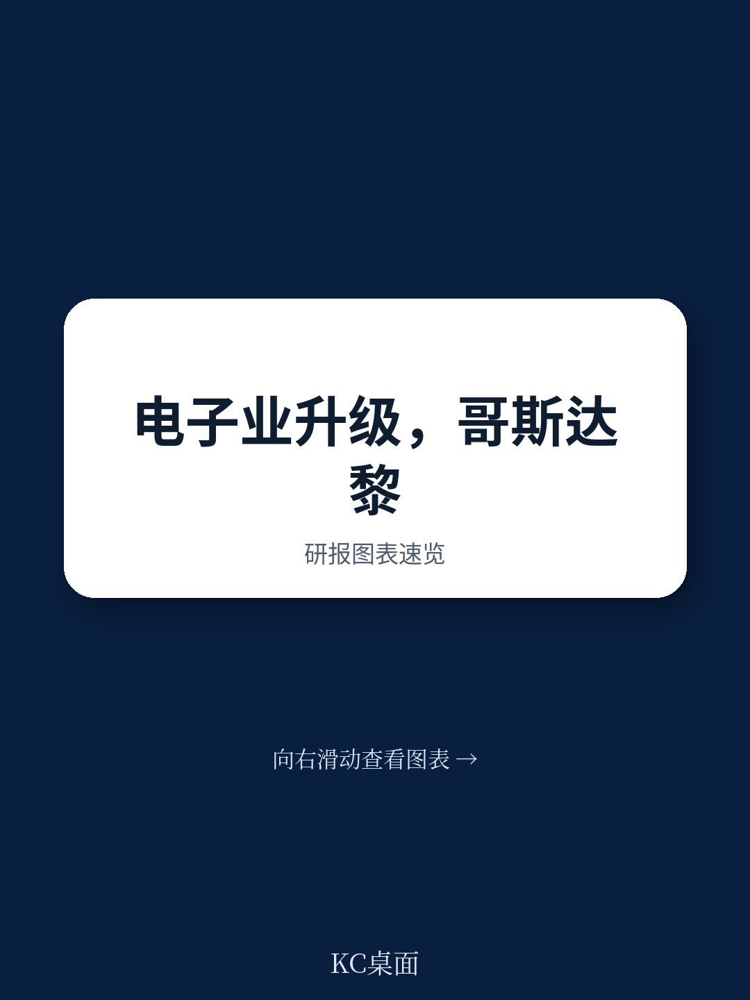
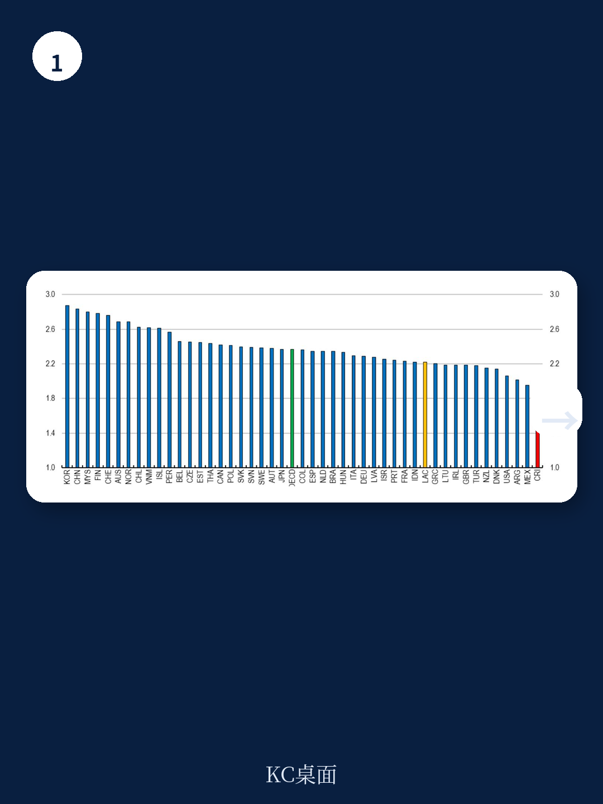
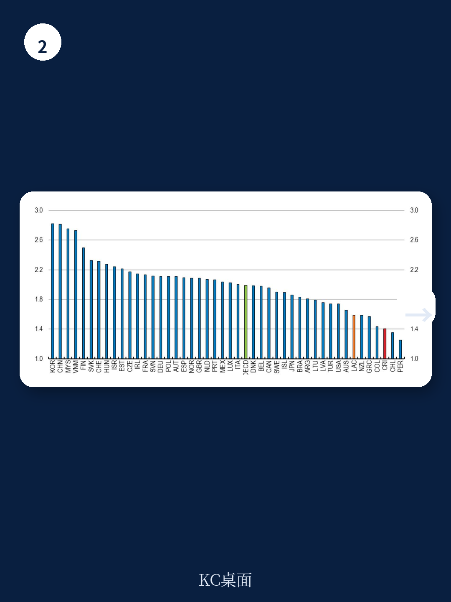

# 经合组织：评估沿全球价值链移动的收益

一份来自经合组织宏观环境学部的工作论文，试图回答一个对许多小型开放地区都至关重要的问题：当一个国家已经嵌入全球价值链，它还能不能通过向更高附加值环节移动，获得可量化的宏观环境收益？答案是可以，但前提是选对行业和环节。

论文以哥斯达黎加为案例，聚焦其电子产业——该国正以此为核心，试图在半导体价值链中占据更重要的位置。研究构建了一套分析工具，将显性比较优势、价值链参与度、上游度指数与增加值分布结合起来，再通过结构引力模型估算长期效应。结论是，如果哥斯达黎加能在电子全球价值链中向上游移动，其出口、产出和实际工资都可能出现显著增长。

这套方法本身，比哥斯达黎加这一个案更有延展性。

## 1. 哥斯达黎加的问题不是参与度低，而是位置太靠后

从数据看，哥斯达黎加在全球价值链中的参与度在经合组织国家中属于较低水平，但这并非问题的核心。更关键的是其参与方式：后向参与度（进口中间品用于出口生产）较高，而前向参与度（本国增加值被第三国用于再出口）偏低。这意味着该国更多扮演的是加工组装角色，而非关键中间品的供应者。

在电子行业，这一特征尤为突出。论文使用的上游度指数显示，哥斯达黎加电子产业的上游度远低于经合组织平均水平，且自2015年以来持续下降。换句话说，该国在电子全球价值链中的位置不仅没有上升，反而在向更下游的组装环节移动。

> **KC评论：** 上游度指数衡量的是一个产业在价值链中距离最终消费者的“步数”。组装手机比设计芯片更靠近消费者，因此上游度更低。哥斯达黎加电子产业上游度下降，说明其生产活动越来越集中在低附加值的末端环节。

## 2. 增加值分布揭示了一个明确的升级方向

论文将上游度指数与国际投入产出表结合，估算了电子全球价值链中不同环节的增加值分布。结果清晰：越靠近上游的环节，单位产出中包含的增加值越高。设计、晶圆制造等环节的增加值率远高于封装、测试和组装。

这一分布并非均匀。半导体价值链中，大部分增加值集中在设计和晶圆制造两个环节，而哥斯达黎加目前主要参与的恰好是附加值最低的后端环节。论文指出，电子产业可以作为半导体价值链的良好代理变量，这意味着该国在半导体领域的升级路径，首先要在电子产业内部实现向上游的移动。

报告没有给出具体的“应该进入哪个环节”的清单，但方法本身提供了筛选逻辑：先看显性比较优势，再看上游度与增加值分布的交集。如果一个国家在某个环节既有比较优势，又处于低增加值位置，那么向上游移动的空间就最大。

## 3. 结构引力模型给出了可量化的长期效应

论文的核心实证部分，是将“向上游移动”这一抽象概念转化为可估算的变量，纳入结构引力模型。具体做法是，利用1995年至2019年的面板数据，估计上游度变化对双边增加值贸易流的影响，再通过一般均衡框架推算对产出和工资的长期效应。

结果显示，如果哥斯达黎加电子产业的上游度提升一个标准差，其电子行业出口可能增长约20%，行业产出和实际工资也有相应提升。论文还做了一个反事实模拟：如果哥斯达黎加在1995年至2019年间，电子产业上游度的提升幅度达到样本中表现最好的国家的水平，其电子行业增加值出口可能翻倍以上。

这些数字本身有模型假设的局限，但方向是稳健的。论文也谨慎指出，引力模型中的“一般均衡”效应并未完全捕捉跨行业溢出和更广泛的宏观环境互动，因此实际效果可能低于模型估计。

> **KC评论：** 这类模型的价值不在于精确预测数字，而在于提供一个可比较的基准。对于政策制定者而言，知道“向上游移动一个标准差”对应“出口增长两成”，比空谈“产业升级”更有决策参考意义。关键在于，这个标准差是否在政策可及的范围内。

## 4. 这套分析框架可以复用到其他行业和国家

论文的价值不止于哥斯达黎加。它提供了一套可复用的诊断工具：先用显性比较优势和上游度指数筛选出“有潜力但位置偏低”的行业，再用增加值分布图确认哪些环节值得进入，最后用结构引力模型估算收益规模。

对于其他小型开放地区，尤其是那些已经嵌入全球价值链但长期停留在低附加值环节的国家，这套方法可以直接移植。它不需要复杂的企业级数据，主要依赖国际投入产出表和贸易数据，对数据基础设施较弱的国家也相对友好。

当然，方法本身不能替代产业政策的具体设计。知道“应该向上游移动”和知道“如何移动”之间，还有很长的路。论文没有讨论技能供给、基础设施、外资政策等执行层面的问题，这些恰恰是决定升级能否落地的关键。

但至少，它给出了一个可检验的起点：先搞清楚你在价值链的哪个位置，再判断往哪里走。

For informational purposes only. Portions may be generated,translated,summarized,or edited with AI assistance based on source materials and may contain omissions or errors. Please verify independently. This is not investment,legal,tax,accounting,or other professional advice.

