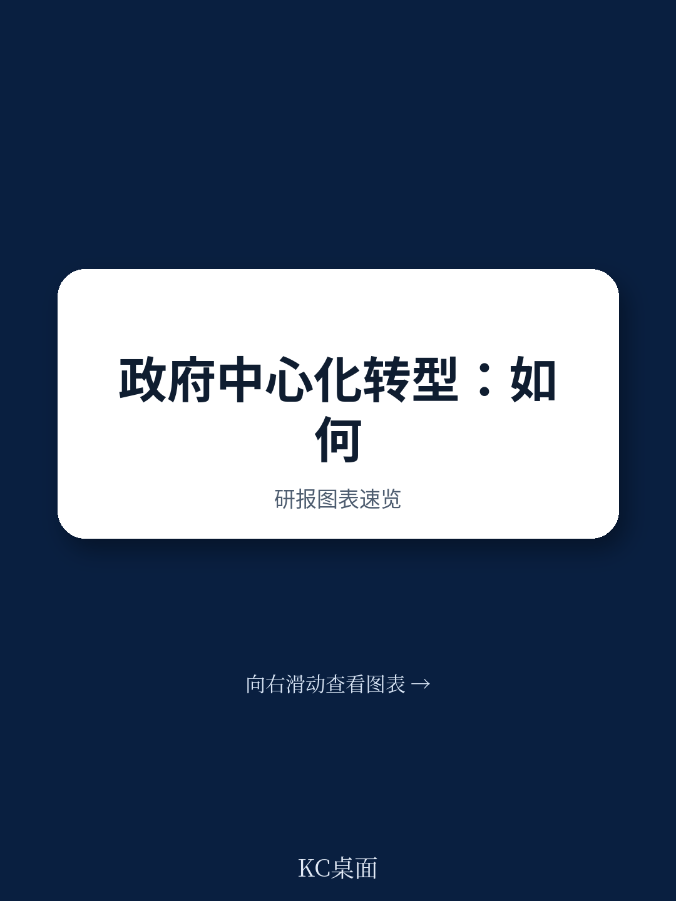
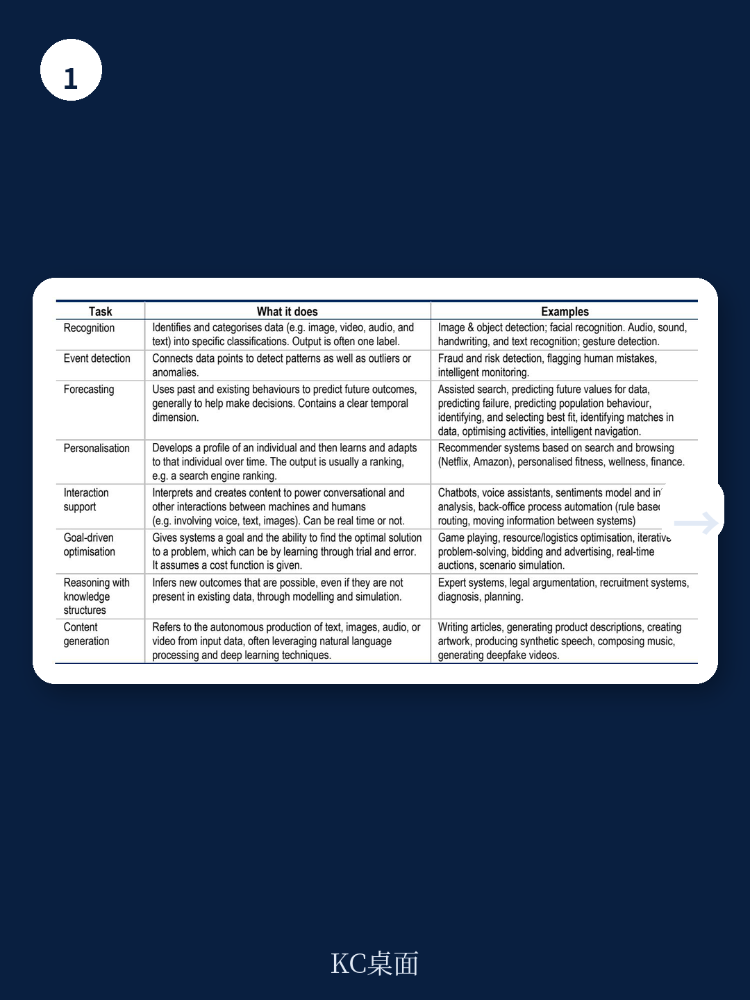
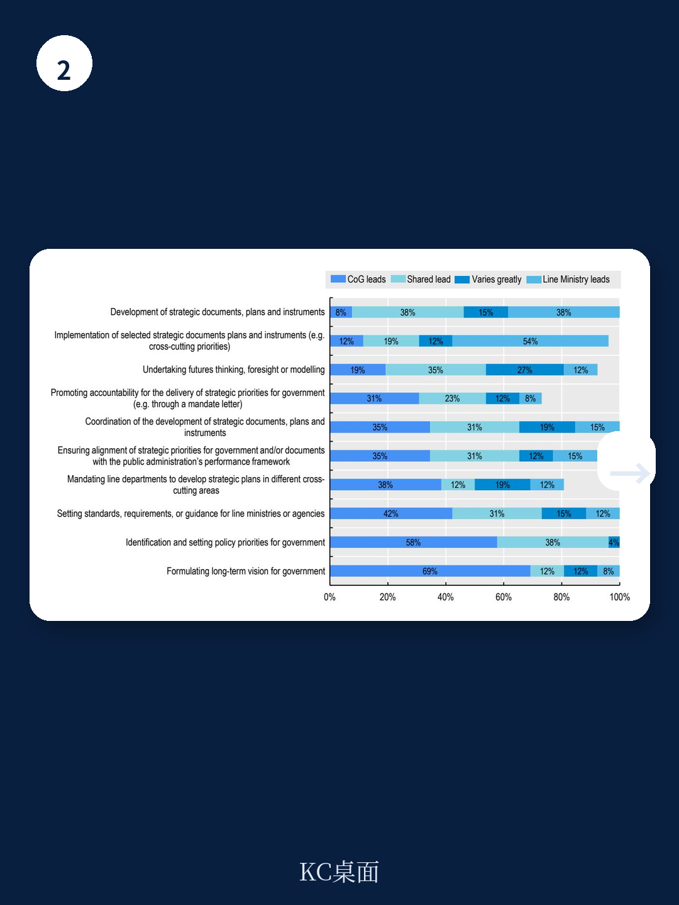

# 经合组织：建设政府中枢能力以引导和交付复杂优先事项

当政策挑战日益交叉、资源持续收紧、公众对公共服务的要求不断攀升，政府中枢——即总理府、内阁办公室或类似机构——的角色正在从传统的协调者，转向战略顾问和交付推动者。经合组织最新发布的《建设政府中枢能力以引导和交付复杂优先事项》综合报告，基于对保加利亚、爱沙尼亚、希腊、爱尔兰、波兰和葡萄牙六个国家的实证研究，给出了一个清晰判断：政府中枢能否有效运作，取决于它在三个维度上的能力——组织架构调整、优先事项规划、以及跨部门协调的政策分析能力。这份报告不是抽象的原则罗列，而是提供了可操作的观察框架和具体国家的实践案例。

## 1. 政府重组不再是简单的部门合并，而是对中枢协调能力的不确定性测试

报告指出，2020至2025年间，六个参与国政府中枢处理的跨部门优先事项数量普遍增加。政府重组最常见的类型是创建新实体，但报告发现，频繁的机构变动会带来显著的管理成本。以爱沙尼亚为例，其政府办公室在重组过程中面临的核心挑战是公务员流动性和技能匹配问题。2022年中央政府部门间公务员流动率的数据显示，人员跨部门调动并不顺畅，这直接影响了新机构的运作效率。

报告提出一个关键区分：在应对跨领域政策时，并非所有情况都需要彻底的机构重组。替代方案包括设立跨部门委员会、指定牵头部长、或采用“任务导向型”工作模式。选择何种模式，取决于问题的复杂程度和紧迫性。这为决策者提供了一个实用的判断框架——先问“这是协调问题还是结构问题”，再决定是否动机构。

> **KC评论：** 报告中的一张图表（Figure 2.5）列出了从“信息共享”到“全面整合”的四种合作强度模式。对于企业或非政府组织而言，这个框架同样适用于评估自身在应对复杂项目时的组织设计选择。关键在于，不要一遇到跨部门问题就想到成立新部门，那往往是成本最高、见效最慢的方案。

## 2. 优先事项规划的核心瓶颈，在于战略与预算之间缺乏有效连接

报告发现，六个国家政府当前战略文件中列出的优先事项数量普遍偏多，从十几个到几十个不等。但真正的问题不在于数量，而在于这些优先事项与预算编制、资源分配之间的脱节。当一项优先事项偏离轨道时，各国政府中枢的典型反应是加强监测和报告，而非重新调整资源或修改策略。报告认为，这种“监测多、调整少”的模式，恰恰是导致长期战略难以落地的根本原因。

波兰的案例提供了一个正面参照。波兰政府中枢在定义和管理政策优先事项时，建立了从内阁讨论到部门执行的标准流程，并利用数字化工具跟踪决策进展。报告特别提到，波兰政府中枢在协调机制中使用了系统性的沟通工具，确保各部门对优先事项的理解一致。这种“从设定到追踪”的闭环，比单纯增加监测频率更有效。

## 3. 数据分析能力正在成为政府中枢最紧迫的研究方向

报告对政府中枢能力需求的调查显示，数据分析与政策影响评估能力被列为最需要研究的领域。六个国家的政府中枢普遍承认，在决策中使用政策影响分析时，最大的限制因素并非数据缺失，而是分析能力不足和部门间数据共享机制不健全。希腊的案例尤其典型：其总理府下属的协调总秘书处负责监测优先改革项目的实施，但面临的最大挑战是如何从各部门获取及时、可比的数据。

报告引用了澳大利亚的“项目仪表盘”和爱尔兰的“可持续发展目标地理数据中心”作为正面案例。这些工具的核心价值不在于技术本身，而在于它们将分散在各部的数据转化为中枢可用的决策信息。报告还提到，经合组织正在推广“距离目标”方法论，帮助政府量化当前表现与长期目标之间的差距，从而更精准地分配资源。

> **KC评论：** 报告中的Figure 1.13显示，六个国家的政府中枢都将“数据分析能力”列为最优先的研究方向，其次是“政策协调能力”。这个排序本身就说明，在复杂政策环境中，信息不对称比部门利益更难解决。对于任何大型组织的决策中枢而言，建立统一的数据标准和共享机制，可能比调整组织架构更紧迫。

## 4. 政治与行政之间的“接口”质量，决定了中枢能否真正发挥战略作用

报告专门讨论了葡萄牙的案例，聚焦于政治任命官员与职业公务员之间的协作问题。葡萄牙政府中枢面临的一个典型挑战是：政治领导人更替后，高级管理人员的快速流动（报告数据显示，政府更迭后六个月内，中枢高级管理层变动率显著上升）导致制度记忆流失，政策连续性受损。葡萄牙的应对措施包括建立技术委员会支持政治层面的决策、以及推动政策准备阶段的影响分析制度化。

报告还引用了澳大利亚和丹麦的“公共服务中立性”实践，以及新西兰的“政策项目”平台，作为如何在不破坏政治-行政平衡的前提下，提升中枢分析能力的参考。这些案例的共同点是：它们不试图消除政治与行政之间的张力，而是通过制度化的流程和工具，让这种张力转化为决策质量提升的动力。

这份报告的核心价值，在于它把“政府中枢能力”这个看似抽象的概念，拆解成了可观察、可比较、可改进的具体维度。对于关注公共治理改革、政策执行效率或大型组织管理的人而言，它提供了一个不依赖意识形态的判断框架：真正决定政策能否落地的，不是口号或预算规模，而是中枢机构在组织、规划和数据三个维度上的真实能力。
