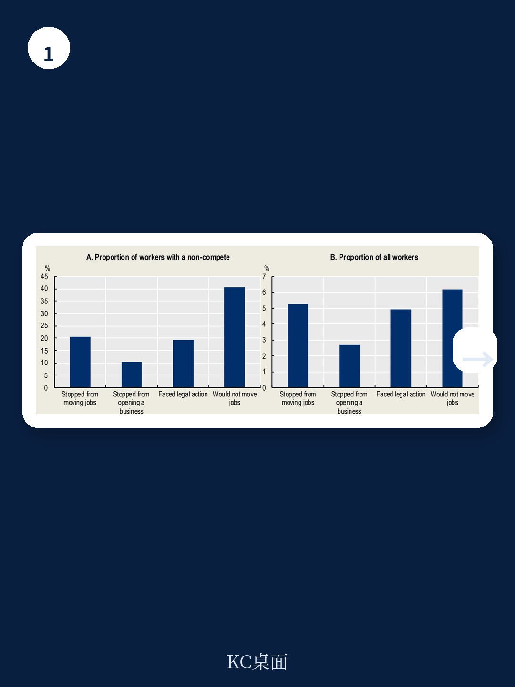
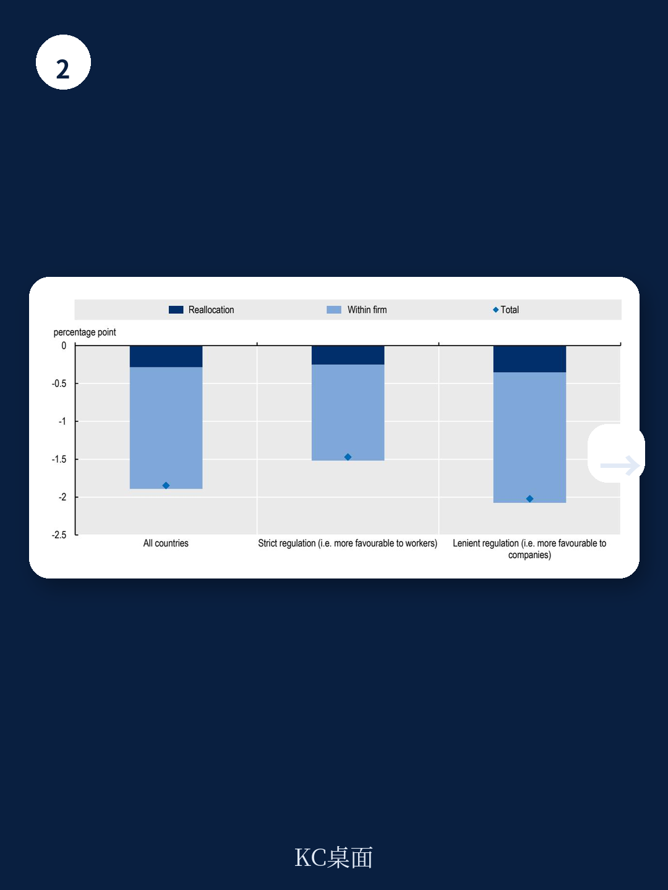

# 经合组织：竞业限制条款与生产率

一份来自经合组织的新研究，首次用跨国企业数据验证了一个长期被猜测但缺乏证据的命题：竞业限制条款不仅压低工资、抑制跳槽，还实实在在地影响了整体生产率。报告覆盖15个国家、近百万家企业级观测，结论清晰——竞业限制条款越普遍的行业，劳动力向高效企业流动的倾向越弱，落后企业追赶前沿的速度越慢。经合组织测算，行业层面竞业限制覆盖率每上升10个百分点，整体劳动生产率水平下降约1.9%。

这个数字的意义不在于精确性——作者自己也强调这并非严格的因果估计——而在于它指向一个被忽视的结构性问题：保护企业商业利益的制度设计，可能正在以牺牲宏观环境活力为代价。

## 1. 竞业限制条款越普遍，劳动力越难流向高效企业

报告的核心发现来自对“生产率提升型劳动力再配置”的测量。传统上，健康的地区应该呈现一个特征：劳动力从低效企业流出，向高效企业流入，从而推动整体生产率上升。经合组织将这一机制量化，并与竞业限制条款的行业覆盖率做关联分析。

结果相当一致。在控制行业、国家、年份固定效应以及劳动力市场紧俏程度后，竞业限制覆盖率每提高10个百分点，生产率提升型再配置的强度下降约17%。换句话说，当更多员工被竞业限制条款束缚在原岗位时，高效企业更难通过招聘获得人才，低效企业也不会因为人才流失而被倒逼改善。

> **KC评论：** 这里的关键不是“跳槽变少”本身，而是“跳槽变少”的方向出了问题。如果劳动力流动减少但流向正确，未必是坏事。但报告证据显示，竞业限制条款恰恰阻碍了“从低效到高效”这一最有价值的流动方向。

## 2. 知识扩散同样受阻，落后企业追赶速度节奏变化

劳动力再配置只是生产率增长的一条腿。另一条腿是知识扩散——前沿企业的先进做法如何被落后企业吸收。经合组织采用新熊彼特增长理论框架，测量落后企业与全球生产率前沿之间的距离变化。

结果显示，竞业限制覆盖率每上升10个百分点，落后企业的追赶速度下降约5%。对于中位非前沿企业而言，这意味着年劳动生产率增速下降约1.8个百分点。这个效应的逻辑很直接：知识往往附着在人身上，当竞业限制条款阻止关键员工跳槽到竞争对手时，前沿企业的实践、流程和管理经验就无法通过人员流动自然扩散。

值得注意的是，这一结果在加入更多制度控制变量后稳健性略弱于再配置效应，但方向始终一致。报告认为，这恰恰说明竞业限制条款对知识扩散的抑制作用可能更依赖于具体制度环境。

## 3. 即使严格监管，“寒蝉效应”依然存在

最反直觉的发现来自监管强度的分组比较。经合组织将样本国家按竞业限制监管严格程度分为两组，结果发现：在监管宽松的国家，竞业限制对再配置的谨慎效应确实更大（约20%），但在监管严格的国家，效应仍然显著为负（约14%）。

这意味着什么？即使法律上竞业限制条款很难在法庭上被强制执行，员工仍然会因条款存在而放弃跳槽机会或创业想法。经合组织将此称为“寒蝉效应”——条款的实际影响力远超其法律可执行性。报告引用的调查数据也支持这一判断：相当比例的员工报告曾因竞业限制条款而放弃工作变动或创业计划，无论这些条款在司法实践中是否有效。

这对政策制定者提出了一个棘手问题：仅仅修改法律条文可能不够。如果员工普遍高估竞业限制条款的可执行性，或者企业利用信息不对称来威慑员工，那么监管的实际效果会被大幅削弱。

## 4. 替代方案存在：保密协议的影响远弱于竞业限制

报告还比较了竞业限制条款与其他类型限制性协议的宏观环境影响。结论很明确：保密协议与生产率之间的关联远弱于竞业限制条款。这意味着企业保护商业利益的目标，可以通过对劳动力流动限制更小的方式实现。

此外，报告对“互不挖角协议”的初步分析也指向类似方向——在更多企业知晓此类协议存在的行业，生产率提升型再配置的强度趋于减弱。这类协议在多数司法管辖区已属于反垄断违法行为，但实际执行力度和企业的合规意识仍有差距。

经合组织的模拟测算显示，如果行业层面竞业限制覆盖率下降10个百分点，整体劳动生产率水平可提升约1.9%。在监管严格的国家，这一数字约为1.5%。虽然这不是精确的因果预测，但它提供了一个可参考的数量级：竞业限制条款对生产率的影响，可能比多数人想象的要大。

For informational purposes only. Portions may be generated,translated,summarized,or edited with AI assistance based on source materials and may contain omissions or errors. Please verify independently. This is not investment,legal,tax,accounting,or other professional advice.

