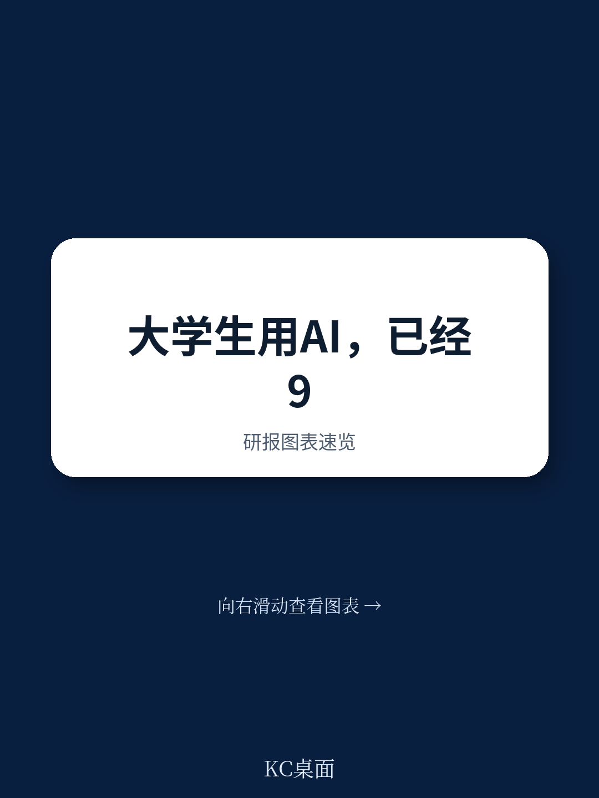
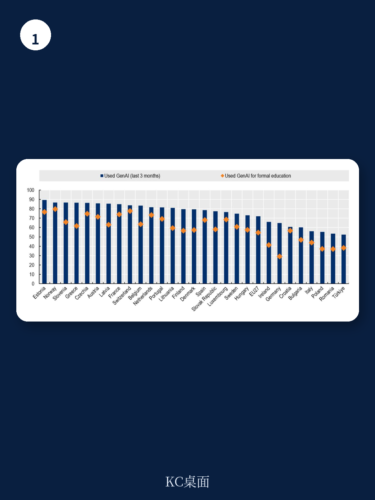

# 经合组织：支持负责任和系统性GenAI采纳的政策

2022年底ChatGPT发布三年后，经合组织（OECD）最新报告揭示了一个看似矛盾的局面：英国本科生GenAI使用率从2024年初的66%飙升至2026年的95%，德国学生使用率从63%跃升至90%以上，法国从55%升至82%。在欧盟范围内，72%的学生在过去三个月内使用过GenAI工具，爱沙尼亚和挪威的使用率接近90%，而罗马尼亚和土耳其仅略高于50%。

然而，这份基于多国调查、机构政策审查和专家研讨会的报告同时指出：广泛使用不等于深度整合。学生主要用GenAI完成摘要、翻译和编辑等常规任务，而非用于深度学习或解决复杂问题。全球范围内，仅17%的学术人员自评为“高级”或“专家级”AI用户，40%仍处于AI素养的起步阶段。在教学中使用AI的教师中，88%仅停留在“最低限度”或“中等程度”的应用。

> **KC评论：** 报告的核心判断值得反复推敲——GenAI在高校的渗透率已经完成“从0到1”的跨越，但“从1到N”的深度教学变革尚未启动。当前的使用模式更像是对现有工作流程的效率优化，而非对教学范式的重新设计。

## 1. 学生与教师之间的使用鸿沟正在扩大，而非弥合

报告中的多国数据指向一个结构性分化：学生使用率普遍超过90%，而教师的使用率虽然在上升，但远未达到同等水平。美国高校教师每周在教学中使用GenAI的比例从2024年的18%增至2025年的30%，仍远低于学生群体。澳大利亚约75%的学术人员曾为大学工作使用过GenAI，但高级职员（约81%）的使用率高于专业职员（约70%）。

这种分化并非简单的“数字素养差距”。报告指出，德国教学人员对GenAI的采纳比学生更为谨慎，而机构支持迟迟未能跟上。在学科层面，STEM和商科领域的学生与教师使用率均显著高于人文艺术领域——德国96%的工程专业学生使用GenAI，而艺术与文化研究专业仅为79%；美国人文艺术教师中40%完全不使用GenAI，是所有学科中非使用率最高的。

性别和社经背景的差异同样值得关注。英国本科调查持续发现，男性学生和来自较高社会背景的学生更倾向于使用AI，尽管性别差距已较早期有所收窄。德国早期调查中，69%的男性受访者报告使用GenAI，而女性约为60%。报告谨慎指出，鉴于主流AI工具免费可用，社经差距的成因更可能与数字自信和AI接触经历等更广泛因素相关。

## 2. 机构政策滞后于用户行为，个体被迫承担不确定性管理责任

报告最引人注目的发现之一，是机构政策与用户行为之间的巨大落差。联合国教科文组织2025年调查显示，全球仅19%的高等教育机构拥有正式的AI政策，另有42%正在制定中。地区差异显著：欧洲和北美约70%的机构已制定或正在制定指导方针，而拉丁美洲和加勒比地区仅为45%。

英国163所学位授予机构的2026年分析发现，仅96所拥有公开可查的AI政策，这意味着相当数量的机构无法让学生或监管机构在线找到明确指引。全球仅26%的教职员工报告其机构拥有正式的AI使用政策。在美国，53%的学生表示其机构不鼓励或禁止AI使用，但其中48%的学生仍每周使用AI，52%的学生报告至少有一些课程没有关于AI使用许可的明确指导。

这种政策真空的直接后果是：数据隐私、学术诚信、知识产权和公平性等不确定性的管理责任被转移至个体。全球仅25%的教职员工认为自己具备有效使用AI的技能，仅28%表示机构已为他们管理学生AI使用做好准备。报告认为，这种“个体化不确定性管理”模式在可持续性和公平性上均存在问题。

## 3. 当前使用模式以任务完成为导向，而非以学习深化为目标

报告通过多国调查数据揭示了一个关键模式：学生和教师使用GenAI的方式高度趋同——均以提升效率为核心目标。学生主要将AI用于摘要、编辑和翻译等常规任务，而非用于概念理解或问题解决。美国2025年调查显示，学生遇到学术困难时仅17%会求助于AI，更倾向于向教师提问。

教师的使用模式同样呈现“效率优先”特征。德国88%的教学人员使用GenAI，但主要用于备课和课后工作，而非互动教学或评估设计。全球范围内，在教学中使用AI的教师中，88%仅“最低限度”或“中等程度”地使用。报告引用的研究指出，频繁将起草、摘要或问题解决等任务委托给GenAI（即“认知卸载”）可能削弱批判性思维，这一效应在年轻用户中最为显著。

> **KC评论：** 报告提出的“认知卸载”不确定性值得教育决策者认真对待。当学生习惯性地将思考过程外包给AI，而教师又缺乏将其重新整合进教学设计的能力时，GenAI可能不是在增强教育，而是在悄悄削弱其核心功能——培养独立思考和问题解决能力。

## 4. 免费消费级工具的依赖构成系统性不确定性

报告指出，当前高校GenAI采纳模式的一个核心特征是对免费消费级工具的依赖。英国HEPI调查显示，2026年仅有38%的机构主动向学生提供GenAI工具，虽较2024年的9%有显著提升，但仍远低于学生需求。德国2025年监测发现，约30%的高等教育机构已采购GenAI工具许可证。

在缺乏机构供给的情况下，学生和教师转向通用消费级产品。全球学生调查显示，ChatGPT（66%）、Grammarly（25%）和Microsoft Copilot（25%）是最广泛使用的工具，均为面向消费者的通用产品而非教育专用工具。这种依赖带来三重不确定性：数据安全与控制权丧失、功能受限（免费版能力远低于付费版）、以及基于个人财务能力的访问公平性问题。

报告特别指出，教育部门往往难以形成协调一致的需求表达，这限制了技术提供商开发教育专用解决方案的动力。资源充裕的大学可以谈判企业协议或自建平台，而小型机构则难以跟上，可能加剧高等教育机构之间的分化。

## 5. 从“个体实验”到“系统整合”的转型路径

报告并未停留在问题诊断，而是提出了从当前“个体实验”模式向“负责任且系统化”采纳模式转型的框架。核心方向包括：从依赖免费消费级工具转向机构提供的、符合教育场景的AI工具；从个体化的不确定性管理转向机构层面的政策、指南和支持体系；从效率导向的任务完成转向以学习深化和教学创新为目标的应用。

报告引用的案例显示，部分先行者已在探索系统性路径。例如，澳大利亚高等教育质量与标准局（TEQSA）建立了GenAI知识中心，为机构提供实践指南；荷兰SURF协会开发了“价值观指南针”工具，帮助教育机构在AI采纳中平衡公共价值；瑞士大学联盟将开放教育与数字能力纳入2025-2028年项目规划。

但这些案例仍属少数。报告的核心信息是：GenAI在高等教育中的普及已经完成，但真正的变革尚未开始。当前的使用模式——高渗透率、低整合度、个体化不确定性管理——如果持续下去，可能不仅无法释放GenAI的潜力，反而会侵蚀高等教育的核心价值。对于教育决策者和机构管理者而言，问题的关键已不再是“是否使用AI”，而是“如何从个体实验走向系统整合”。
