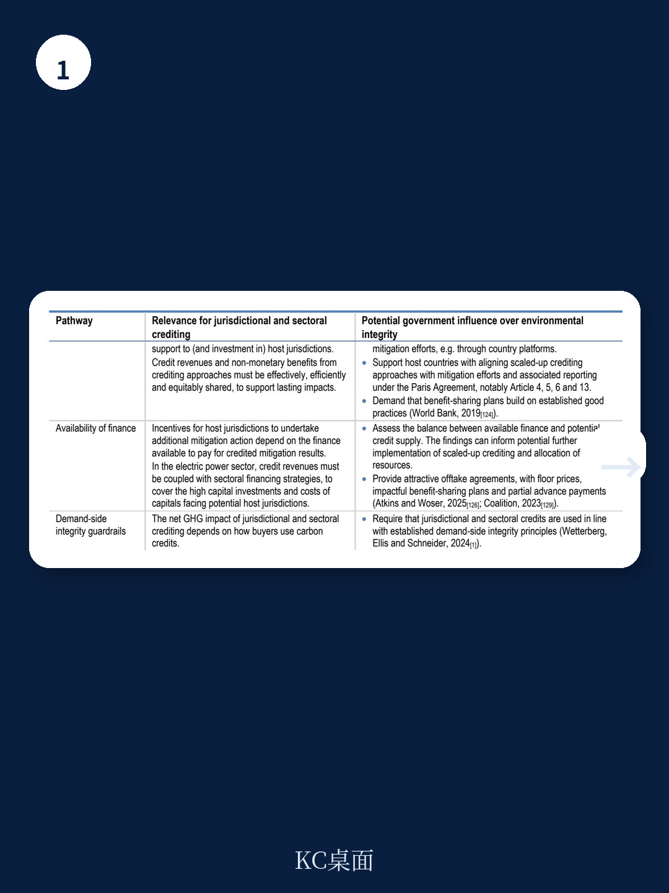
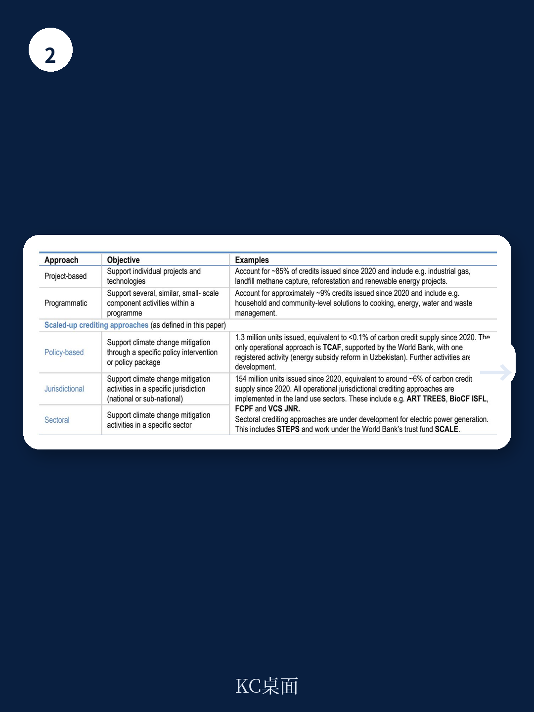

# 经合组织：规模化碳信用实现气候减缓

碳信用市场正在经历一次结构性的尺度跃迁。过去二十年，这个市场的主角是单个项目——一片森林、一座沼气池、一台风电。但经合组织最新发布的环境工作论文指出，一种以政府为主体的“规模化碳信用”模式正在成型，其逻辑与项目级碳信用截然不同：不再由项目开发者逐笔证明减排，而是由一国政府或一个行业整体承诺并执行减排政策，再依据政策效果获得碳信用。这份报告的核心判断是：如果规模化碳信用能在环境完整性上过关，它可能成为《巴黎协定》下最具杠杆效应的气候融资工具之一。

规模化碳信用的吸引力来自一个结构性的矛盾。项目级碳信用虽然灵活，但很难触及排放的结构性来源——比如一个国家的森林治理体系、电力行业的燃料结构、工业部门的能效标准。这些领域需要政府动用立法、监管、财政手段，而非单个项目所能撬动。经合组织报告统计，截至2025年，已有超过80个司法管辖区参与了某种形式的规模化碳信用倡议，但多数仍停留在技术援助和试点阶段。真正进入全面实施、并签发可交易碳信用的案例仍然有限。自2020年以来，规模化碳信用标准下签发的单位总量为1.54亿个，仅占同期全球碳信用供给的约6%。这个数字说明，规模化碳信用仍处于早期，但其战略潜力已被主要多边机构和主权捐赠方认可——同一时期，捐赠国和企业已承诺约20亿美元用于规模化碳信用，主要投向减少毁林和森林退化排放的司法管辖区REDD+项目。

规模化碳信用能否兑现其承诺，取决于一个关键变量：环境完整性。经合组织报告用大量篇幅拆解了这个问题。项目级碳信用长期面临基线虚高、额外性存疑、碳泄漏难以追踪等质疑。规模化碳信用理论上可以缓解部分不确定性——比如，当整个司法管辖区都纳入核算时，碳泄漏从“跨项目”变成了“跨辖区”，更容易被监测和调整。但报告同时指出，规模化碳信用引入了新的完整性挑战：基线设定变得更复杂，因为需要预测整个行业或辖区的排放轨迹；额外性评估不再针对单个项目，而是要判断政府是否因为碳信用收入而采取了比原本更积极的减排行动；此外，外生排放驱动因素——比如国际大宗商品价格波动、宏观宏观环境周期、自然灾害——对排放的影响可能远超政府政策本身，如何将这些因素从减排绩效中剥离，是方法论上的硬骨头。

> **KC评论：** 经合组织报告最值得关注的不是规模化碳信用“好”或“需要继续观察”的结论，而是它系统性地列出了“好”的条件有多苛刻。对于关注碳市场质量的读者，这份报告提供了一个检查清单：基线是否保守、额外性是否可归因于碳信用、MRV是否覆盖了所有关键排放源、非永久性和泄漏不确定性是否留有余地。这些条件每一条都会直接影响碳信用的实际减排价值。

报告特别分析了政策型碳信用——这是规模化碳信用中最前沿、也最不确定的一种模式。与司法管辖区或行业碳信用不同，政策型碳信用不以排放总量为基准，而是以政府实施某项具体政策（如碳税、可再生能源强制配额、燃油效率标准）为触发条件，依据该政策预期的减排效果签发信用。经合组织认为，这种模式的吸引力在于它可以直接激励政策行动，但挑战同样突出：政策效果难以精确量化，政策执行可能滞后或走样，且政策本身可能与其他减排政策重叠，导致重复计算。报告指出，政策型碳信用的方法论标准化仍处于早期阶段，目前尚无大规模实施的成熟案例。

对于主权捐赠方和碳信用买家，经合组织提出了一个战略性的权衡框架。一方面，提高环境完整性需要更复杂的基线模型、更严格的第三方审计、更频繁的MRV周期，这些都会推高交易成本，可能让部分发展中国家政府望而却步。另一方面，如果完整性标准过低，规模化碳信用的信誉将迅速崩塌，最终损害整个市场的需求基础。报告认为，未来几年是决定规模化碳信用能否成为有效气候合作工具的关键窗口期——方法论需要在这段时间内完成迭代，同时保持对发展中国家政府的吸引力。

规模化碳信用的另一个隐含前提是，碳信用收入必须真正流向减排执行者。报告指出，在司法管辖区REDD+项目中，碳信用收入如何与土著社区和地方社区分享，是一个尚未完全解决的治理问题。在电力行业，规模化碳信用应与公正转型计划挂钩，确保受影响的工人和社区得到补偿。这些社会完整性维度，与传统的环境完整性同样重要，但往往在技术讨论中被忽视。

经合组织的这份报告没有给出简单的答案。它更像是一张路线图，标出了规模化碳信用从概念到落地的关键节点和不确定性点。对于关注国际气候融资和碳市场发展的读者，报告提供了一个清晰的判断框架：规模化碳信用不是对项目级碳信用的替代，而是一种互补——前者更适合解决结构性排放，后者更适合捕捉分散的减排机会。两者能否并行发展，取决于市场参与者是否愿意为更高的完整性标准支付相应的成本。

For informational purposes only. Portions may be generated,translated,summarized,or edited with AI assistance based on source materials and may contain omissions or errors. Please verify independently. This is not investment,legal,tax,accounting,or other professional advice.

