OECD Studies on Water

# Strengthening the Economic, Financial and Technological Dimensions of Water Efficiency in Uzbekistan

Highlights of a National Dialogue on Water

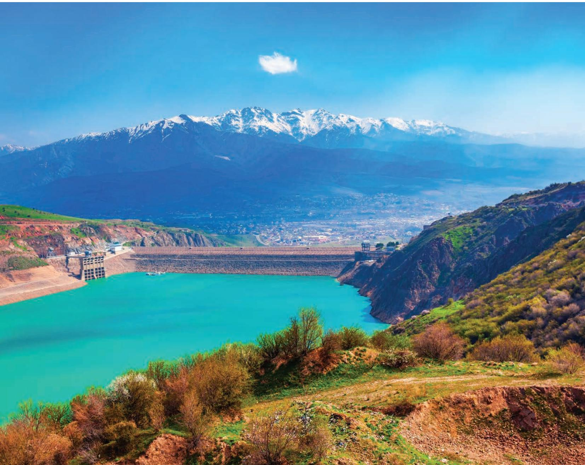

# Strengthening the Economic, Financial and Technological Dimensions of Water Efficiency in Uzbekistan

HIGHLIGHTS OF A NATIONAL DIALOGUE ON WATER

This work is published under the responsibility of the Secretary-General of the OECD and the President of the AWC. The opinions expressed and arguments employed herein do not necessarily reflect the official views of the Member countries of the OECD or the members of the AWC.

This document, as well as any data and map included herein, are without prejudice to the status of or sovereignty over any territory, to the delimitation of international frontiers and boundaries and to the name of any territory, city or area.

Please cite this publication as:
OECD/AWC (2026), Strengthening the Economic, Financial and Technological Dimensions of Water Efficiency in Uzbekistan: Highlights of a National Dialogue on Water, OECD Studies on Water, OECD Publishing, Paris,
https://doi.org/10.1787/33503ce9-en.

ISBN 978-92-64-69148-3 (print)

ISBN 978-92-64-82365-5 (PDF)

ISBN 978-92-64-76637-2 (HTML)

OECD Studies on Water

ISSN 2224-5073 (print)

ISSN 2224-5081 (online)

Photo credits: Cover © saiko3p/Shutterstock.com.

Corrigenda to OECD publications may be found at: https://www.oecd.org/en/publications/support/corrigenda.html. © OECD/Asia Water Council 2026

This work is made available under the Creative Commons Attribution 4.0 International licence. By using this work, you accept to be bound by the terms of this licence (https://creativecommons.org/licenses/by/4.0/).

Attribution – you must cite the work.

Translations – you must cite the original work, identify changes to the original and add the following text: In the event of any discrepancy between the original work and the translation, only the text of the original work should be considered valid.

Adaptations – you must cite the original work and add the following text: This is an adaptation of an original work by the OECD. The opinions expressed and arguments employed in this adaptation should not be reported as representing the official views of the OECD or of its Member countries.

Third-party material – the licence does not apply to third-party material in the work. If using such material, you are responsible for obtaining permission from the third party and for any claims of infringement.

You must not use the OECD logo, visual identity or cover image without express permission or suggest the OECD endorses your use of the work.

Any dispute arising under this licence shall be settled by arbitration in accordance with the Permanent Court of Arbitration (PCA) Arbitration Rules 2012. The seat of arbitration shall be Paris (France). The number of arbitrators shall be one.

# Foreword

The objective of the National Dialogue on Water in the Republic of Uzbekistan is to generate a set of actionable recommendations for policy reforms in critical areas of water security, designed to improve water efficiency, a national priority for Uzbekistan.

In partnership with the Ministry of Economy and Finance and with the Ministry of Water Resources of Uzbekistan, the OECD and Asia Water Council (AWC) conducted an analysis of the economic, financial, institutional and technological dimensions of water management in the country.

The dialogue focused predominantly on assessing the enabling environment for investing in water security in Uzbekistan, the potential benefits and limits of introducing public-private partnerships (PPPs) in water sectors and on identifying technological solutions to enhance efficient water management and capacity building. This report presents a synthesis of these findings, jointly with a recommended action plan for The Ministry of Economy and Finance and the Ministry of Water Resources. The purpose of the action plan is to provide a set of actions to address challenges in attracting and sustaining investment in water security in Uzbekistan. These recommendations have been informed by research, expert opinions, national-level consultation and global case studies.

The OECD and AWC hope this Dialogue has and will continue to catalyse partnerships and discussions across ministries in Uzbekistan, sectors and regional counterparts. We also expect that it will be a source of useful discussion for other countries as well.

# Acknowledgements

This document reports on the National Dialogue on Water (hereafter referred to as ‘the Dialogue’) in the Republic of Uzbekistan (Uzbekistan), which took place over 2 years (2024-2025). Insights have been incorporated from literature reviews, expert interviews with private stakeholders, consultation workshops, focus group discussions and an assessment of the enabling environment for investment in water security based on a methodology developed by the OECD and the Asian Development Bank (“Scorecard assessment”). The final version was revised following a Policy Dialogue event, which took place in-country in Uzbekistan on 11 December 2024, with comments and inputs received from stakeholders in 2025.

This report is an output of the OECD Environment Policy Committee (EPOC) and its Working Party on Biodiversity, Water and Ecosystems (WPBWE). The report was authored by Delia Sanchez Trancon and Naina Mangtani, under the supervision of Sophie Trémolet in the Climate Biodiversity and Water (CBW) Division, OECD Environment Directorate, in collaboration with Takayoshi Kato and Matthew Griffiths from the Water Management, Economics and Finance team in the Finance, Investment and Global Relations (FIG) Division, OECD Environment Directorate. The work was conducted under the overall supervision of Walid Oueslati, Head of the Climate, Biodiversity and Water Division of the OECD Environment Directorate. The chapter on “Technologies for Water Efficiencies” was written by Jaejin Han, Minseok Choi, Jihun Byun and Sangwook Lim of Asia Water Council (AWC) and conducted under the general supervision of Yongdeok Cho, AWC Secretary General.

The authors would like to extend warm thanks to the Government of the Republic of Uzbekistan for their support and leadership throughout the duration of this project, and particularly to the Ministry of Economy and Finance of the Republic of Uzbekistan, and Ministry of Water Resources of the Republic of Uzbekistan, for their support in conducting this dialogue. The authors' gratitude is also extended to Dinara Ziganshina and the team at the Scientific-Information Center of the Interstate Commission for Water Coordination of Central Asia (SIC ICWC) for expertise in water related matters and the invaluable support provided throughout the duration of this project.

The Policy Dialogue on Water in Uzbekistan has benefitted from the strong engagement and collaboration between the Ministry of Economy and Finance of Uzbekistan, the Asia Water Council (AWC), and the Organisation for Economic Cooperation and Development (OECD). It has received financial support from the Ministry of Climate, Energy and Environment of Korea. This study was also conducted with financial support from Germany's International Climate Initiative (IKI) through the project “Regional mechanisms for the low-carbon, climate-resilient transformation of the energy-water-land nexus in Central Asia”, a consortium led by the OECD in collaboration with the Scientific Information Centre of the Interstate Commission for Water Coordination of Central Asia (SIC ICWC), the European Bank for Reconstruction and Development (EBRD), the United Nations Economic Commission for Europe (UNECE) and the Food and Agriculture Organisation of the United Nations (FAO). All financial support received is gratefully acknowledged.

## Table of contents

Foreword 3
Acknowledgements 4
Acronyms and abbreviations 7
Executive Summary 8
1 Introduction 10
References 12
Notes 12
2 Water security in Uzbekistan: A cornerstone for growth 13
2.1. Increasing pressures on a water-stressed country 14
2.2. Improving water efficiency: a national priority for Uzbekistan 16
References 17
Notes 18
3 Assessing Uzbekistan's enabling environment for investment in water security 19
3.1. An overview of the OECD Scorecard for assessing the enabling environment for investment in water security 20
3.2. The enabling environment for investment in Uzbekistan: an uneven landscape for investment 21
References 40
Notes 41
4 Deploying Public-Private Partnerships for water security in Uzbekistan 43
4.1. Barriers and opportunities for scaling up public-private partnerships in water-related sectors 44
4.2. Public-private partnerships in irrigation: a national priority requiring further support 49
References 55
Notes 56
5 Technologies and innovation for water efficiency and demand management 57
5.1. Understanding the relevance of Korea's water technology experience for application in Uzbekistan 58
5.2. Technical innovation proposals have been targeted at priority areas, in line with Uzbekistan's strategy for water 2020-2030 59
6 Recommendations and action plan from the National Policy Dialogue 62
6.1. Clarify and consolidate the PPP regulatory framework to attract investment in water and wastewater services 63
STRENGTHENING THE ECONOMIC, FINANCIAL AND TECHNOLOGICAL DIMENSIONS ON WATER EFFICIENCY IN UZBEKISTAN © OECD 2026

6.2. Improve PPP oversight and governance to ensure long-term sustainability 63  
6.3. Remove barriers to PPP implementation in water-related sectors 64  
6.4. Strengthening water sectors sustainability through economic instruments reform, service improvements and cross-sectoral coherence 65  
6.5. Enhancing water and wastewater services performance to attract additional financing 65  
6.6. Update technical standards and promote innovation to safeguard water security 66  
6.7. Expand and upgrade water-related education and training programmes 66  
6.8. Action plan 67  

Annex A. PPPs: definitions and status in Uzbekistan 71  
References 75  
Notes 75

## FIGURES

Figure 3.1. The four dimensions of the enabling environment scorecard are designed to present a comprehensive overview of barriers for investment 20
Figure 3.2. The enabling environment for water security in Uzbekistan still shows room for improvement 22
Figure 3.3. Uzbekistan shows strengths in terms of overall investment framework in comparison with regional partners 23
Figure 3.4. Indicators in Dimension 1 highlight that Uzbekistan performs similarly to regional counterparts 24
Figure 3.5. Strengths in water resource allocation and conflict resolution, and limitations in data collection and economic instruments implementation 27
Figure 3.6. Examining the water-supply policy framework points to clear areas for improvement in both capacity levels and future investment planning 31
Figure 3.7. Projects demonstrate a strong level of stakeholder involvement, but limited scores in cost-benefit analysis and pooling mechanisms 36
Figure 3.8. Investments toward ensuring a water-secure future shows clear strengths but underscore the need to improve economic incentives and disclosure standards 38
Figure 4.1. Project costs for public-private partnerships are highly variable across industries 45
Figure 4.2. Distribution of public-private partnerships in water-related sectors in Uzbekistan 46

## TABLES

Table 3.1. Uzbekistan Country Statistics 2023 25  
Table 3.2. Water abstraction charge per type of user and body 29  
Table 4.1. Private-sector participation in drinking-water and wastewater services in urban areas in Uzbekistan: key contracts 47  
Table 4.2. Contractual forms of public-private partnerships for irrigation 51  
Table 4.3. Common risks associated with irrigation public-private partnerships 54  
Table 5.1. Assessment of areas for implementation of new technologies 60  
Table 6.1. Tailored action plan to develop water security in Uzbekistan 68  
Table A A.1. Agencies in Uzbekistan related to water-supply and sewerage services 74  
BOXES  
Box 4.1. The first international public-private partnership in irrigation: the Guerdane project in Morocco 52

## Acronyms and abbreviations

<table><tr><td>ADB</td><td>Asian Development Bank</td></tr><tr><td>AWC</td><td>Asia Water Council</td></tr><tr><td>FAO</td><td>Food and Agriculture Organisation</td></tr><tr><td>FDI</td><td>Foreign Direct Investment</td></tr><tr><td>GDP</td><td>Gross Domestic Product</td></tr><tr><td>IFAS</td><td>International Fund for Saving the Aral Sea</td></tr><tr><td>IFC</td><td>International Finance Corporation</td></tr><tr><td>IKI</td><td>International Climate Initiative</td></tr><tr><td>IoT</td><td>Internet of Things</td></tr><tr><td>ITPS</td><td>Intergovernmental Technical Panel on Soils</td></tr><tr><td>IWRA</td><td>International Water Resources Association</td></tr><tr><td>JSC</td><td>Joint Stock Company</td></tr><tr><td>KOICA</td><td>Korea International Cooperation Agency</td></tr><tr><td>LPWA</td><td>Low Power Wide Area</td></tr><tr><td>PPIAF</td><td>Public-Private Infrastructure Advisory Facility</td></tr><tr><td>PPP</td><td>Public Private Partnership</td></tr><tr><td>PPPDA</td><td>Public Private Partnership Development Agency</td></tr><tr><td>RAWRIS</td><td>Rural Agricultural Water Resource Information</td></tr><tr><td>SIC ICWC</td><td>Scientific Information Centre of the Interstate Commission for Water Coordination of Central Asia</td></tr><tr><td>USP</td><td>Unsolicited Proposals</td></tr><tr><td>UZS</td><td>Uzbek Sum</td></tr><tr><td>WSS</td><td>Water Supply and Sanitation</td></tr><tr><td>WST</td><td>Water Saving Technologies</td></tr><tr><td>WWTP</td><td>Wastewater Treatment plant</td></tr></table>

# Executive Summary

Uzbekistan is the second-largest economy in Central Asia and has set an ambitious goal to achieve upper-middle-income status by 2030. The country's recent economic growth has been buoyed by wide-ranging reforms since 2017, and the annual real GDP growth rate has been approximately $6\%$ over the past three years. However, rapid economic and population growth are increasing demand for water, which may constrain long-term economic development and environmental sustainability.

The government has undertaken reforms to strengthen water resource management, including the re-establishment of the Ministry of Water Resources and the adoption of the Water Sector Development Concept for 2020–2030. Uzbekistan has also committed to expanding access to safe drinking water and sanitation. Despite progress, significant service gaps remain in some regions. Uzbekistan is seeking to mobilise additional investment in infrastructure. Under the public-private partnership (PPP) development programme for 2024–2030, the government aims to attract at least USD 30 billion in private investment across infrastructure sectors, including for water supply and sanitation. Public funding for water-related infrastructure has increased in recent years, supported by both domestic resources and external financing. Nevertheless, a substantial financing gap persists. Current funding levels remain insufficient to modernise ageing infrastructure and achieve national water security objectives.

In this context, the OECD, the Asia Water Council and the Scientific Information Centre of the Interstate Commission for Water Coordination, in co-operation with Uzbekistan's Ministry of Economy and Finance and the Ministry of Water Resources, convened a national Dialogue on water during 2024 and 2025.

## Towards a more conducive enabling environment for water security investments

Uzbekistan's enabling environment for investment in water security was assessed using the OECD Scorecard. The analysis indicates that while the country has made progress in strengthening its macroeconomic and governance framework, the investment environment remains only partially conducive to large-scale water-related sector investment.

Limited cost recovery, regulatory fragmentation and institutional complexity increase transaction costs and reduce investor confidence. Overlapping mandates and unclear procedures create inefficiencies and undermine financial sustainability. Data gaps, particularly regarding sanitation coverage and service performance, limit the ability to design evidence-based policies and investment strategies. The application of the legislative framework to guide infrastructure investment and stakeholder participation to water-related projects remains uneven. Strengthening policy coherence across water, agriculture and energy sectors would help ensure that economic incentives support water security objectives and create a more predictable investment environment.

## Removing barriers to deliver Uzbekistan's PPP agenda in water sectors

Mobilising private sector participation through PPPs is a central component of Uzbekistan's strategy to finance water infrastructure. Although a modern PPP Law was adopted in 2019 and a PPP Centre established, the use of PPP contracts for water projects remains limited. Many water infrastructure projects, particularly in rural water supply and irrigation, are small and fragmented, making them difficult to structure as financially viable PPPs. Low tariffs and historically low collection rates reduce the ability of operators to generate stable cash flows, increasing perceived financial risks for investors. Addressing these constraints will require improvements in tariff policies, financial sustainability and risk allocation frameworks. Strengthening PPP governance will be important to improve project bankability. PPP models should also be adapted to the characteristics of water infrastructure projects.

## Introducing new technologies for water efficiency and demand management

Accelerating the adoption of modern technologies and innovative practices is essential to achieve water security while responding to increasing water scarcity. Digital technologies and improved monitoring systems can enhance water management and operational efficiency. Smart monitoring systems, improved groundwater monitoring and better data systems for irrigation and drainage management can support more effective water allocation and infrastructure management. Technology adoption should be accompanied by investments in training, research and institutional capacity to ensure that innovations are implemented effectively and sustainably.

## Recommendations to enhance water security in Uzbekistan

The Dialogue set out priority recommendations organised into a multi-pillar action plan, as follows:

\- Clarify and consolidate the PPP regulatory framework to attract investment in water and wastewater services delivery, by clarifying responsibilities and establishing a publicly accessible legal framework for water-related PPPs.

\- Improve PPP oversight and governance to ensure long-term sustainability, by improving coordination between ministries to streamline decision-making, enhancing evaluation systems for PPPs, and building institutional and technical capacity.

\- Remove barriers to PPP implementation in water through improved risk allocation, sectoral mapping and increased competition. This calls for mapping sectoral infrastructure needs, enhancing transparency in procurement and creating a framework for unsolicited PPP proposals.

\- Strengthen the sustainability of water resources management through economic instrument reforms and cross-sectoral coherence, through advancing agricultural tariff reforms to support PPP introduction and aligning water efficiency measures with water security objectives.

\- Enhance water and wastewater service performance to attract additional financing, particularly through addressing non-revenue water.

\- Update technical standards and promote innovation to safeguard water security, through safety management measures for dam evaluation, strengthening groundwater monitoring systems and introducing a master plan to improve irrigation and drainage networks.

\- Expand and upgrade water-related education and training programmes, focusing on building capacity in Uzbekistan's universities to increase the number of sectoral experts.

\- Improve cross-sector policy coherence across government departments based on collaboration and shared objectives to ensure policy coherence, including organising regular multi-stakeholder National Policy Dialogues on water.

Uzbekistan faces extreme water stress, making water security an urgent national priority. This chapter summarises the National Dialogue on Water Policy, which focused on strengthening the enabling environment for investment, assessing the role of public-private partnerships in water-related sectors and identifying technological pathways to improve water efficiency.

Uzbekistan is currently suffering from high water stress. $^{1}$ In 2022, this indicator reached 112%, recorded as one of the highest levels in the world alongside Turkmenistan and Pakistan (UN Water, 2024 $^{[1]}$ ). The National Dialogue on water policy has been centred on strengthening the economic, financial and technological dimensions of water security in Uzbekistan, based on requests received from several ministries and agencies in the country during the kick-off mission and consultation workshop organised in March 2024. $^{2}$

Three interlinked topics were selected for the Dialogue in partnership with the OECD, AWC and the Ministry of Economy and Finance of Uzbekistan:

\- Topic 1: Catalysing investments in water security. Stakeholders in Uzbekistan showed an interest in understanding the current barriers to investment in water security. Chapter 3 draws on analysis from the OECD Scorecard to identify existing barriers in the enabling environment for investing in water security and to inform the design of policy and regulatory reforms aimed at addressing them. Overcoming barriers for investment in water security would provide a solid basis for implementing successful public-private partnerships in water sectors.

\- Topic 2: Deploying public-private partnerships (PPPs) in water sectors in Uzbekistan. PPPs were identified by the Uzbek government as a priority policy tool to stimulate investment in water sectors, particularly with regards to overcoming the existing financing gap. As set out in Chapter 4, PPPs have the potential to offer several benefits in helping Uzbekistan achieve its water-related goals, including ensuring the sustainable supply of water, increasing the efficiency of irrigation systems and other goals as identified in the adopted Water Code. Based on feedback from ministries at the Policy Dialogue organised in Tashkent in December 2024, the efficacy and potential for implementing PPPs in irrigation are also assessed in this chapter.

\- Topic 3: Water efficiency technologies (modernisation, smart water management and capacity building). Investment in and implementation of appropriate technologies can be effective in enhancing water efficiency, including the modernisation of water infrastructure, integrated water information systems and sectoral capacity building. Chapter 5 discusses pathways and instruments to implement water-efficient technologies in Uzbekistan.

To maintain the momentum of the National Dialogue on Water and support the government of Uzbekistan in addressing water security, an action plan with implementable and pragmatic recommendations derived from the Dialogue and the government's priorities is presented in Chapter 6.

UN Water (2024), SDG 6 data, https://www.sdg6data.org/en/country-or-area/Uzbekistan#anchor\_6.2.1a.

## Notes

$^{1}$ Defined as the volume of freshwater withdrawal as a proportion of available freshwater resources.

$^{2}$ Ministries involved in the kick-off meeting in March 2024 included the Ministry of Economy and Finance, the Ministry of Construction, Housing and Communal Services, JSC “Uzsuvitaminot”, the Ministry of Agriculture, the Ministry of Water Management, the Ministry of Ecology, Environmental Protection and Climate Change (currently the National Committee on Ecology and Climate Change), the Agency for Implementation of IFAS (International Fund for Saving the Aral Sea) Projects in Uzbekistan and the Ministry of Mining and Geology.

# Water security in Uzbekistan: A cornerstone for growth

Uzbekistan faces severe and growing water stress, driven by drought, rising water demand, ageing infrastructure and heavy reliance on intensive irrigated agriculture. This chapter analyses the key pressures on water resources, the governance and institutional framework of water-related sectors and the challenges affecting water supply, sanitation and infrastructure. It also reviews national strategies and policy reforms aimed at improving water efficiency and strengthening long-term water security.

The importance of ensuring water security for broader economic development and resilience is an internationally recognised issue which has gained traction in both OECD countries and non-OECD countries. The economic case for investment in water security is robust, particularly increasing pressure on water resources (OECD, 2022[1]).

Uzbekistan suffers from high water stress with water insecurity continuing to escalate in the country (Ministry of Water Resources, 2022[2]). This situation can be attributed to several factors, including, but not limited to, the climatic and topographic conditions of the country, and challenges in water resources management. As Uzbekistan is dependent on transboundary water sources, renewable water resources are significantly lower than current water withdrawals, making Uzbekistan a water-deficient country (Ministry of Water Resources, 2023[3]).

## 2.1. Increasing pressures on a water-stressed country

Agriculture dominates water use, accounting for 90% of all water consumed in the country. The water usage of other sectors in Uzbekistan constitutes a much smaller quantity, including the municipal sector (4.5%), industry (1.4%), fisheries (1.2%), thermal power (0.5%) and other sectors (1%). The expected additional demand for water is significant, given a projected population increase of five million inhabitants by 2030, resulting in an anticipated 18-20% increase in overall water demand (Ministry of Water Resources, 2023[3]).

Uzbekistan has implemented water management strategies focusing on water supply and distribution, such as building reservoirs and canals, designed to optimise water use (S. M. Koybakov, 2020[4]). However, it is expected to face decreasing availability of water resources. Over the past 50 years, the volume of glaciers in Central Asia, which feed Uzbekistan, has decreased by an average of $30\%$ . Other expected challenges include a projected increase in urbanisation rate to up to $60\%$ by 2030, with associated challenges including soil sealing $^{1}$ and accelerated economic growth, which will require an increase in water supply from the current rate of 1.9 billion $\mathrm{m}^3$ to 3.5 billion $\mathrm{m}^3$ by 2030 (Ministry of Water Resources, 2022[2]). These figures underscore the critical role of effective water management in supporting Uzbekistan's economic and environmental sustainability (Scientific-Information Center ICWC, 2023[5]).

According to national stakeholders, water quality is considered good (Ministry of Water Resources, 2022[6]). However, increasing pressures are mounting on the quality of water resources, which can also render the issue of water scarcity even more acute (Jones, Bierkens and van Vliet, 2024[7]). These rising pressures can be attributed to factors such as low levels of domestic wastewater treatment, return flows from irrigated fields that impact water quality and increased water demand and subsequent effluent discharges through the development of economic activities.

As agriculture is the largest user of water resources in the country, Uzbekistan has over 4.3 million hectares of irrigated land, which account for 14% of agricultural land (Ministry of Economy and Finance, 2024[8]). Water-saving technologies have been introduced on 46% of irrigated lands (Ministry of Ecology, 2023[9]). However, the irrigation network's efficiency is 0.63, indicating that 37% of the water is lost during transport. Additionally, the pumping stations supporting irrigation are severely degraded, with over 60% of the equipment exceeding its service life and no longer operationally viable. Across the length of the irrigation network, 44% of the trunk and inter-farm channels require repair and restoration, and 16% require reconstruction. Eighty per cent of the pumping stations require reconstruction or significant repairs (Ministry of Water Resources, 2022[2]).

In 2022, 67% of the centralised drinking water supply was provided by groundwater. Between 2014 and 2022, the volume of groundwater extraction in the republic increased by 30%. In certain areas of the Navoi, Samarkand, Jizzakh, Kashkadarya, Namangan, Fergana and Andijan regions, the groundwater level has dropped by as much as 5 metres. Consequently, Presidential Regulation No. 439 was issued in 2022, imposing a moratorium on drilling wells and on the use of groundwater (Government of Uzbekistan, 2022[10]).

Additionally, the water and wastewater networks have significant maintenance, rehabilitation and replacement needs. Non-revenue water in Tashkent City ranges from approximately 30% to 60% (Ministry of Water Resources, 2022[2]). This wide range of figures indicates limited data reliability but also significant losses of large volumes of treated water through ageing infrastructure, some of which is over 40-45 years old.

Sewerage coverage across Uzbekistan remains limited, with only 79 out of 119 cities having sewage treatment systems. Furthermore, even in cities equipped with sewerage systems, only 57.1% of the population is provided with adequate sanitation services. At the national level, only 17% of the population is covered by the centralised sewage collection and treatment system.

Even where sewage treatment systems exist, capacity is limited and urgent repairs are required. Sewage treatment plants in Uzbekistan were constructed primarily in the 1970s and 1980s and have not undergone significant modernisation since 1993. These plants now face challenges including deteriorated infrastructure, outdated equipment, energy inefficiencies and operational difficulties due to rising electricity tariffs and limited funding.

At the end of 2020, the capacity of treatment facilities was 3.821 million m $^{3}$ per day, with 75% of capacity already being used, and in central cities, such as Tashkent, the utilisation was 88%. The total recorded length of networks also needs repair and upgrade, with 1.9 out of the total 8.6 thousand kilometres of the network recorded as beyond optimum operating life and requiring upgrades.

Water and sanitation service provision in Uzbekistan is predominantly delivered and overseen by a public operator, although the current emphasis is on increasing private sector participation. Several private entities operate in the sector, notably JSC “Musaffo Obi Hayot Magistral Suv Ta’minoti” in Tashkent, JSC “Damkhoja Magistral Suv Ta’minoti” in the Samarkand Region and JSC “Chimgan-Chorbog Magistral Suv Ta’minoti” in the Tashkent Region.

Uzsuvtaminot acts as the national holding company for water and sanitation, overseeing regional and municipal service providers across both urban and rural areas. It was established in 2019 by presidential decree. The provision of drinking water and sanitation services in Uzbekistan is structured under a centralised, state-led model, with operational responsibilities delegated to regional and local entities. At the top of this framework is Uzsuvtaminot JSC, a joint-stock company wholly owned by the State Assets Management Agency. Established as the national operator, Uzsuvtaminot is mandated to lead the strategic development and modernisation of the country's water and sewerage systems. Its core responsibilities encompass the formulation of sector-wide policy, the management of infrastructure investment programmes, including those funded by international donors, and the oversight of financial mechanisms such as tariff collection and revenue management.

Beneath the strategic oversight of Uzsuvtaminot, the day-to-day delivery of water and sanitation services is administered by a network of subsidiary bodies. These primarily consist of Regional Vodokanal enterprises, which are themselves structured as joint-stock companies, alongside several municipally owned service providers. While these regional and municipal entities retain a degree of operational autonomy, they function within the overarching strategic and regulatory framework of Uzsuvtaminot. Their principal duties include the operation and maintenance of local water and sewerage networks, ensuring service continuity and managing direct customer relations. This tiered governance model facilitates a system of decentralised operations under a framework of centralised strategic control, intended to align local service delivery with national standards and investment priorities.

Uzsuvtaminot is overseen by the Ministry of Construction, Housing and Communal Services, which conducts and permits water and sanitation utility construction and improvement projects. The Ministry of Economy and Finance oversees water and sanitation services related budgets, funds and sets tariff policies, whilst the Ministry of Health supervises the quality of tap water within the water supply network. A full breakdown of Uzbekistan's agencies related to water supply and sewerage services can be found in Annex A.

## 2.2. Improving water efficiency: a national priority for Uzbekistan

In view of the water resource situation in Uzbekistan, improving water efficiency is a national priority. In July 2021, Presidential Decree UP-6024 approved the Concept for the Development of the Water Sector of the Republic of Uzbekistan for the period 2020-2030. The main objective of the Concept is to create conditions that meet the growing water needs of the population, economic sectors and the environment. It seeks to ensure the reliable and safe operation of water infrastructure, promote effective management and rational use of water resources and improve the reclamation state of irrigated land (Government of Uzbekistan, 2020[11]).

The Concept also prioritises achieving water security amid increasing water scarcity and the challenges posed by droughts and other impacts. Its phased implementation is operationalised through Water Sector Development Strategies approved on a three-year basis. The 2021-2023 Strategy has been approved and is under implementation, while the 2024-2026 Strategy has been drafted and is pending formal adoption. These strategies are designed to align with high-priority areas and include target indicators for the corresponding period, including an increase in the efficiency of irrigation systems, a reduction in the critical level of groundwater (0-2 metres) and the introduction of water-saving technologies (Scientific-Information Center ICWC, 2023[5]).

In the Decree, a range of policy, regulatory, economic and technical objectives are to be achieved by 2030, with quantitative targets such as:

\- The development and approval of a new Water Code, adopted on 30 July 2025, represents a major step in consolidating Uzbekistan's legal framework for water governance. The Code codifies existing legislation related to water allocation, use, and protection, introduces clearer provisions for public-private partnerships in water infrastructure and strengthens mechanisms for transparent and flexible water distribution across sectors.

\- An annual water saving of 3 billion m3 of water, achieved by multiplying tenfold the total area of application of water-saving technologies over ten years, including almost a fivefold increase in the cultivated area that benefits from drip irrigation.

\- Saving 4 billion m3 of water by increasing the proportion of concrete irrigation channels by ten percentage points and improving the efficiency of the irrigation network.

\- Reducing energy consumption in pumping stations by 2 million kWh per year by replacing almost 2,000 electric motors and 1,750 pumping units with energy-saving equipment.

\- Reducing the share of budget funds allocated to water-related sectors by 30% by introducing market principles.

\- Implementing 45 projects based on the public-private partnership principles, and;

\- Equipping large water facilities with smart water systems, reaching 18 576 points with an automated monitoring system for reclamation wells.

As of 2025, the Law of Uzbekistan on Water and Water Use (1993) remains in force. The law assigns responsibility for water governance to the Cabinet of Ministers, local authorities and designated state bodies, including the Ministry of Water Resources, the National Committee on Ecology and Climate

Change and the State Committee for Geology and Mineral Resources, operating directly or through basin administrations (Orazaliev et al., 2024[12]).

A new law, approved by the Senate in April 2025, introduces amendments to the Administrative Liability Code, the Tax Code, and the Law on Licensing, Permit and Notification Procedures of the Republic of Uzbekistan. The amendments establish liability for illegal well drilling and non-compliance with regulations aimed at preventing hazardous geological processes, a penalty tax (five times the standard rate for groundwater extraction without water-metering devices) and improved procedures for issuing permits related to groundwater drilling. The law is intended to prevent the unauthorised use of groundwater, create more favourable conditions for legitimate drilling activities and promote the rational and sustainable use of groundwater resources.

## References

FAO and ITPS (2015), Status of the World's Soil Resources.

[13]

Government of Uzbekistan (2022), Resolution of President of the Republic of Uzbekistan on Additional measures for the protection and regulation of rational use of underground water resources, https://lex.uz/ru/docs/6311247.

Government of Uzbekistan (2020), Decree of the President of the Republic of Uzbekistan No. UP-6024 On approval. [11]

Jones, E., M. Bierkens and M. van Vliet (2024), “Current and future global water scarcity intensifies when accounting for surface water quality”, Nature Climate Change, Vol. 14/6, pp. 629-635, https://doi.org/10.1038/s41558-024-02007-0.

Ministry of Ecology, E. (2023), National State of the Environment Report: Uzbekistan, International Institute for Sustainable Development. [9]

Ministry of Economy and Finance (2024), The Cadastre Agency Ministry of Economy and Finance under the of the Republic of Uzbekistan.. [8]

Ministry of Water Resources (2023), Water resources of the Republic of Uzbekistan: current status and future plans, https://events.development.asia/system/files/materials/2023/05/202305-water-resources-republic-uzbekistan-current-status-and-future-plans.pdf. [3]

Ministry of Water Resources, I. (2022), The concept on Water Sector Development for 2020-2030. [2]

Ministry of Water Resources, O. (2022), Decree - On approval of the concept of development of water management sector of the republic of Uzbekistan for 2020-2030, Ministry of Water Resources of the republic of Uzbekistan.

OECD (2022), Financing a Water Secure Future, OECD Studies on Water, OECD Publishing, Paris, https://doi.org/10.1787/a2ecb261-en. [1]

Orazaliev, K. et al. (2024), “Current regulation of water relations in Central Asia”, Regional Science Policy & Practice, Vol. 16/9, p. 100038, https://doi.org/10.1016/j.rspp.2024.100038.

S. M. Koybakov, M. (2020), “NEW METHODS TO PROTECT YEAR-AROUND OPERATION CANALS FROM SNOW”, NEWS of National Academy of Sciences of the Republic of Kazakhstan, Vol. 6/444, pp. 102-109, https://doi.org/10.32014/2020.2518-170x.136.

Scientific-Information Center ICWC (2023), Water Yearbook: Central Asia and Around the Globe, http://www.cawater-info.net/yearbook/2023/05\_yearbook2023\_uz\_en.htm. [5]

## Notes

$^{1}$ Soil sealing is defined by the FAO ‘soil sealing’ as the permanent covering of the soil surface with an impermeable material, causing increased flooding risks, biodiversity loss, soil degradation and other negative outputs (FAO and ITPS, 2015 $^{[13]}$ ).

## Assessing Uzbekistan's enabling environment for investment in water security

This chapter examines Uzbekistan's enabling environment for investment in water security through the OECD Scorecard. It finds uneven progress across the multiple dimensions for the enabling environment and highlights priority reforms in regulation, data, project preparation and institutional capacity to help attract investment at scale.

Uzbekistan is projected to face the largest financing shortfall among all Central Asian countries for achieving the goal of ensuring clean water and sanitation for all and improving overall efficiency of water use by 2030, with an estimated gap of approximately USD 5 billion for the 2025-2030 period (Vinokurov, 2024[1]). To bridge the funding gap, there is a clear need to identify and remove barriers that may constrain investment to attract and accelerate greater financing.

This chapter aims to identify the current barriers and opportunities in the enabling environment for investment in water security in Uzbekistan by applying the OECD Scorecard for Assessing the Enabling Environment for Investment in Water Security (the “Scorecard”). $^{1}$ The Scorecard offers a comprehensive method for assessing the current investment environment as a basis for identifying key areas where reforms can be implemented to facilitate investment. The assessment of the enabling environment is based on external data sources and data collected by a national expert. This assessment in turn provides a basis for understanding how PPPs can be effectively implemented, as discussed further in Chapter 4.

## 3.1. An overview of the OECD Scorecard for assessing the enabling environment for investment in water security

The purpose of the OECD Scorecard is to pinpoint issues that hamper water security-related investments by public and private investors. The Scorecard is tailored to meet the needs of policymakers, donors and investors who want to improve the enabling environment for water security. $^{2}$ While the assessment highlights key areas for attention, the ultimate decision on prioritisation rests with decision-makers and should be adapted to the circumstances of each country.

The Scorecard categorises the enabling conditions for investment in water security into four dimensions as demonstrated in Figure 3.2. These include the country's policy framework for investment (Dimension 1), the water policy framework for investment (Dimension 2), the underlying framework to ensure projects are bankable and sustainable (Dimension 3) and the contribution of other economic sectors to water security (Dimension 4).

Figure 3.1. The four dimensions of the enabling environment scorecard are designed to present a comprehensive overview of barriers for investment  
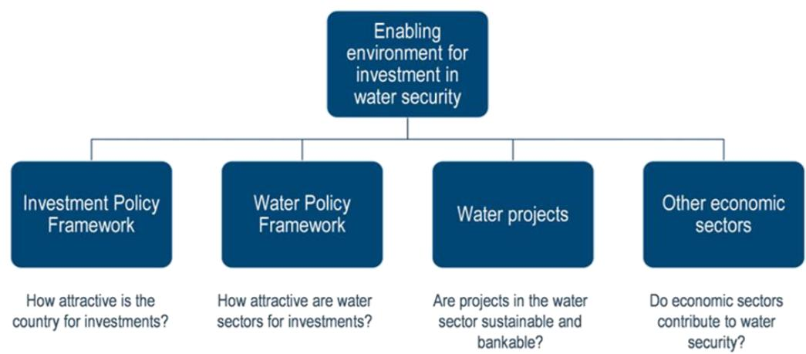  
Source: (Sanchez Trancon et al., 2024[2]).

The Investment Policy Framework (Dimension 1) focuses on the investment framework in the country. It aims to assess whether the country is attractive for investors at a general level.

The Water Policy Framework (Dimension 2) focuses on how water related policies can generate the conditions for water projects to generate value and attract investment. This dimension is organised around cross-cutting water issues. It evaluates the water sector's policy framework by identifying market conditions, policy barriers and regulatory shortcomings that might hinder successful water security investments.

The Water Project Framework (Dimension 3) assesses whether the water-related institutional structures, mandates, policies and regulations are conducive to bankable and sustainable water projects. This considers business models, economic and financial viability and their broader societal and environmental impacts.

Dimension 4 relates to “Other economic sectors” and centres on the impact of other economic sectors on water security. Investments in agriculture and food, energy and other sectoral resilience, urban development and other domains can have significant unintended consequences on water availability and exposure and vulnerability to water risks.

The four dimensions are interlinked. However, the nature of the linkages between dimensions can differ among countries and regions. The tool explores these four dimensions by identifying key indicators to aid governments and relevant partners in removing investment barriers.

Each dimension and question is scored on a scale of 0-5.

## 3.2. The enabling environment for investment in Uzbekistan: an uneven landscape for investment

Overall, Uzbekistan's environment for investment in water security is only moderately attractive and still requires improvement, as shown in Figure 3.2. The Investment Policy Framework (Dimension 1) in Uzbekistan shows moderate progress, with a score of 2.31, demonstrating some strengths in the overall policy framework for investment ahead of most Central Asian countries, as evidenced in Figure 3.4.

The water policy framework (Dimension 2) and the sustainability and bankability of projects (Dimension 3) scored 1.71 and 1.88 respectively, demonstrating early steps for both dimensions. Other economic sectors (Dimension 4) posted the highest score of 2.28, demonstrating movement towards enhanced efficiency.

Figure 3.2. The enabling environment for water security in Uzbekistan still shows room for improvement  
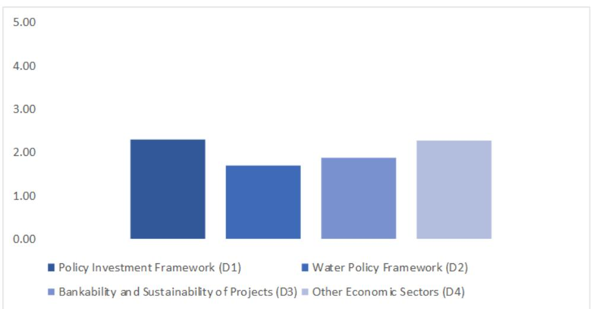  
Note: Dimension 2 covers water resource management, urban and rural drinking water, urban and rural sanitation, hydropower and irrigation. Data for rural and urban drinking water are analysed together because no disaggregated data are available; for the same applies to sanitation. Source: Country consultations, including at the Policy Dialogue on Water Finance and Technologies in Uzbekistan, https://www.oecd.org/en/events/2024/12/policy-dialogue-on-water-finance-and-technologies-in-uzbekistan.html.

Cumulatively, Uzbekistan scored 8.18 out of 20, reaching an “engaged” stage. $^{3}$ However, there are areas in which Uzbekistan can progress to strengthen the enabling environment for investment in water security before attracting private sector participation at scale.

While Uzbekistan demonstrates notable strengths in the enabling environment for investment, the overall analysis was constrained by data limitations. In several areas, restricted data availability affected both the depth and scope of the assessment, with approximately half of the total indicators (327) unable to be evaluated due to missing data. This challenge was particularly evident in the irrigation and rural sub-sectors. In addition, due to Uzbekistan's legislative and service delivery model, drinking water and wastewater are treated as a single sector, which further shaped how the data was presented. A granular approach was applied wherever possible, allowing for more nuanced insights when data permitted.

## 3.2.1. Dimension 1: Emerging evidence of a promising policy framework for investment

The Investment Policy Framework (Dimension 1) in Uzbekistan is considered solid, with a score of 2.31, demonstrating clear strengths in the overall policy framework for investment. Uzbekistan scored higher than most regional counterparts, as shown in Figure 3.3, with clear strengths demonstrated in the domestic financial sector.

Achieving an improvement in the policy framework for investment will require addressing public governance mechanisms, alongside expanding financial accessibility and streamlining regulatory frameworks. Overall, Uzbekistan outperforms the average for regional counterparts regarding the strength of domestic finance and corporate governance mechanisms, and underperforms in areas including public governance mechanisms, one of Uzbekistan's weakest indicators, as indicated in Figure 3.4.

Figure 3.3. Uzbekistan shows strengths in terms of overall investment framework in comparison with regional partners  
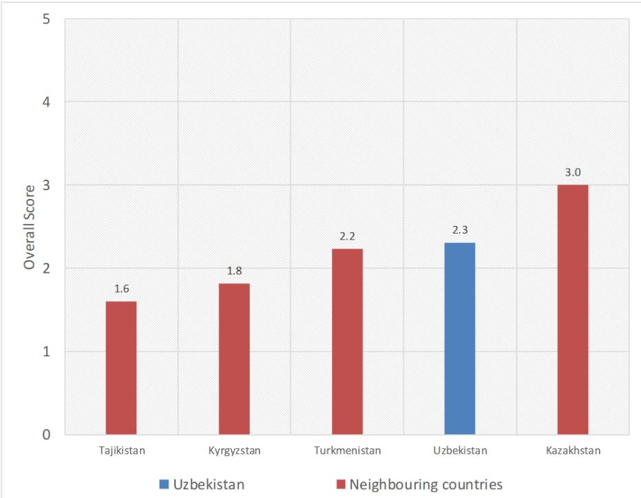  
Note: The results from Uzbekistan's D1 analysis were compared against neighbouring countries in Central Asia to provide a basis for comparison.  
Source: OECD analysis of data from OECD-UCLG World Observatory on Subnational Government Finance and Investment, World Bank, IMF, World Economic Forum, and Fitch.

Uzbekistan has a stable macroeconomic landscape, characterised by higher GDP growth than its neighbours the Kyrgyz Republic and Kazakhstan (World Bank, 2024[3]). This robust economic performance is further supported by a lower inflation rate and a notably strong domestic finance sector. (World Bank, 2024[4]). However, some areas remain on par with or slightly lower than regional counterparts. This includes issues such as a lack of public governance mechanisms and slightly lower scores in decentralisation, which lower its score in terms of the Policy Framework (Dimension 1), as illustrated in Figure 3.4 below. In terms of credit ratings, Fitch Ratings maintained Uzbekistan's rating at BB- with a stable outlook during the most recent update in August 2024.

Figure 3.4. Indicators in Dimension 1 highlight that Uzbekistan performs similarly to regional counterparts  
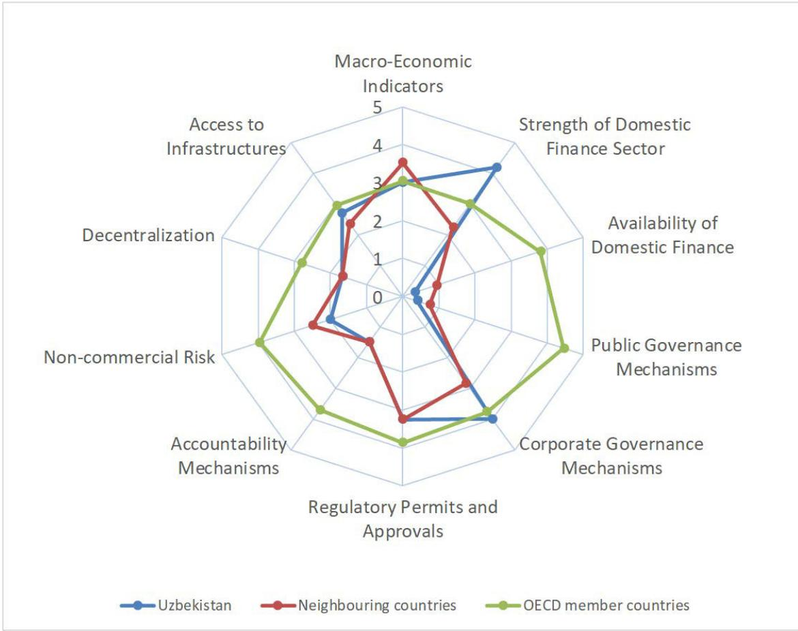  
Note: The results from Uzbekistan's D1 analysis were conducted against neighbouring countries in Central Asia and OECD member countries. Source: OECD analysis of data from OECD-UCLG World Observatory on Subnational Government Finance and Investment, World Bank, IMF, World Economic Forum, and Fitch.

In recent years, Uzbekistan has seen strong economic growth, as demonstrated in Table 3.1 below, which highlights areas such as GDP growth reaching 6% per year, significantly above the OECD GDP growth rate of 1.7% in 2024. The country has seen high annual GDP growth over the last decade, and growth rebounded quickly after the COVID-19 pandemic. Inflows of foreign direct investments (FDI) have increased. In 2000 and 2006, annual FDI inflows did not exceed USD 200 million, while in 2022 they reached a record USD 2.3 billion (World Bank Group, 2024[5]).

As the authorities continue with strong macroeconomic policies and reforms, growth is expected to remain strong in the years ahead. However, growth is estimated at marginal rates in 2025 and 2026, particularly for real disposable household income (ADB, 2025[6]). Despite this, the overall growth trajectory and general trend should allow the authorities to reach the goal of Uzbekistan becoming an upper-middle-income country by 2030 (IMF, 2022[7]).

Table 3.1. Uzbekistan Country Statistics 2023

<table><tr><td colspan="2">Uzbekistan</td></tr><tr><td>Income Group</td><td>Lower middle income</td></tr><tr><td>Total Population (million)</td><td>36.4</td></tr><tr><td>GDP - USD (current)</td><td>90.89 billion</td></tr><tr><td>GDP growth (annual %)</td><td>6%</td></tr><tr><td>GDP per capita (PPP)- USD (current international)</td><td>9 724</td></tr><tr><td>Inflation, consumer prices (annual %)</td><td>11.4</td></tr><tr><td>Foreign direct investment, net inflows (% GDP)</td><td>3.1</td></tr></table>

Source: (World Bank Group, 2024[5]).

Financial stability within Uzbekistan is evidenced by solid banking sector indicators such as Tier 1 capital adequacy and a low level of non-performing loans (IMF, 2024[8]). Yet the limited data on broader financial metrics suggests there is room for greater transparency and reporting to provide a more nuanced understanding of the financial landscape.

Recent government reforms have opened the country to investment, with efforts to ease business registration and licensing (OECD, 2023[9]). However, investors have called for a level playing field between public and private firms, highlighting competition policy and enforcement as significant challenges.

Some challenges identified include a weak institutional framework for competition policy, inadequate controls on market concentration, limited measures against cartels and concerted practices, alongside inadequate oversight of market dominance and monopoly practices. The simplification of cross-border trade remains a critical area needing further progress, with a consensus that significant advancements in trade facilitation have been limited over the past five years (OECD, 2023[9]). However, in terms of expansion and growth, recent government action has also facilitated an increase in international trade, particularly through policies including exchange rate liberalisation, the relaxation of currency restrictions and measures to further foster competition. Uzbekistan has also reaffirmed its commitment to join the World Trade Organisation at the 14th Ministerial Conference in 2026 and has adopted several legal acts to align its trade regime with WTO rules in several areas, alongside signing four bilateral agreements (World Trade Organisation, 2024[10]). Despite these efforts, persistent logistical bottlenecks and disruptions continue to make international trade slow and costly.

Available information suggests that enhancing access to domestic finance could significantly aid economic expansion. As access to finance is a cornerstone of investment, developing a more inclusive financial system could be advantageous for Uzbekistan's investment climate.

Efforts made by the government to refine the regulatory landscape for businesses have been acknowledged and remain on par with regional comparators, as evidenced in Figure 3.4. However, there is a need for accompanying pro-competition policies to guarantee free enterprise entry and fair market competition.

Governance mechanisms in Uzbekistan slightly lag in comparison with regional benchmarks, particularly in areas of accountability, government effectiveness and anti-corruption efforts (World Bank, 2024[11]). However, Uzbekistan has made clear progress in transparency in both budget and procurement processes. For example, the “Open Budget” portal outlines the core aspects of the budgetary process and publishes information about the main parameters of national and local budgets. Information on debt obligations, including those of major state-owned enterprises, has also been made publicly available since 2021 (World Bank, 2023[12]). In this regard, Kazakhstan's stronger governance indicators provide a model worth considering for good practices.

The country's moderate performance in terms of decentralisation indicates a balanced distribution of subnational government functions but also points to the need for enhanced efficiency at the local governance level.

In terms of the regulatory environment, Uzbekistan has strong enabling conditions for business initiation and property registration. However, areas such as construction permit acquisition call for process optimisation, which is key for water and wastewater service delivery. Further pro-competition reforms can support private sector growth in Uzbekistan's evolving regulatory environment. While progress in other reform areas has been positively received, firms remain concerned about competition issues, reflecting challenges in implementing legal reforms and their limited scope so far. These concerns are compounded by the need for complementary reforms in areas such as land markets, corporatisation and privatisation of state assets to ensure a level playing field between public and private enterprises (OECD, 2023[9]).

Assessment of non-commercial risks suggests regional parity in terms of political stability (World Bank, 2024[11]). Nonetheless, the regional comparison highlighted slight advantages for neighbouring countries in terms of political and security stability.

Regarding infrastructure within the country, Uzbekistan satisfies fundamental requirements with its reliable access to electricity. However, advancing in other infrastructural domains such as energy, internet access and healthcare facilities will be crucial to elevate the nation's infrastructure to a level that actively draws investment (World Bank, 2024[13]).

## 3.2.2. Dimension 2: Further reforms to the water policy framework for investment are needed

Uzbekistan scored 1.71 in the water policy framework (Dimension 2), indicating an uneven enabling environment for attracting and maintaining investment in the water sub-sectors. $^{4}$ Some notable positive areas indicate strengths around authorities in charge of water resources and transparent mechanisms to solve conflicts between water users. However, limitations are consistently observed around schemes for irrigation planning, service provider capacity levels and transparency of contracts.

The assessment of the water policy framework (Dimension 2) in Uzbekistan is significantly constrained by gaps in data collection, in particular the absence of disaggregated data between rural and urban areas. This presents an opportunity to improve data collection and reporting.

This data restriction limits the depth of analysis and the ability to formulate targeted policy responses. To strengthen the enabling environment for investment and provide clarity to potential investors, improvement in data availability will be an asset. Enhanced data granularity would support the identification of critical pressure points, inform the design of context-specific interventions to improve efficiency and enable a more accurate understanding of constraints across both rural and urban settings.

With the data available, current limitations identified in the water policy framework coalesce around the following key themes:

\- Uzbekistan has yet to establish a comprehensive legal framework that integrates market principles and mechanisms, which affects the drinking water, wastewater and irrigation sectors.

\- The regulatory framework for water-related sectors currently lacks an independent regulator responsible for decision-making or a clear attribution of regulatory functions among relevant bodies. This absence has been notable, and has led to blurred responsibilities between institutions, potentially resulting in undue influence and a decline in trust. While significant institutional reforms have been undertaken in recent years, including consolidation of sector responsibilities and adoption of the new Water Code, further clarification of regulatory mandates. Particularly tariff approval, oversight of service performance and PPP governance could strengthen transparency, reduce overlaps and enhance investor confidence.

\- The sector has limited accountability and transparency mechanisms, a lack of well-defined funding strategies and rigorous performance evaluations for service providers.

Historically, water supply and wastewater have not been appealing to private investors due to low tariffs and limited effectiveness in billing collection rates. The new tariff policy for the water supply and wastewater sector includes tariff revisions aimed at addressing cost recovery challenges, which could stimulate private sector investment. However, this is not consistently applied across all sectors, including irrigation.

In the current regulatory framework, Uzbekistan applies the principle of a unified tariff for the use of water resources. Any future reform of economic instruments should therefore be developed within the parameters of the existing legal framework and the unified tariff principle.

While the Tax Code establishes differentiated abstraction charge rates by source and activity type, stakeholders emphasise that tariff policy for water resource use is generally implemented under a unified framework without differentiated tariff structures applied across sectors in practice.

## The water resource policy framework

Uzbekistan possesses clear strengths in terms of water resource allocation, as demonstrated in Figure 3.5 below. The roles and responsibilities regarding water resource allocation are clearly defined and delineated, and there are strong conflict resolution measures in place. However, there are limited cohesive economic instruments and a notable absence of data on water resources.

Figure 3.5. Strengths in water resource allocation and conflict resolution, and limitations in data collection and economic instruments implementation  
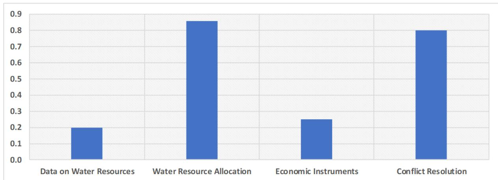  
Source: Country consultations, including at the Policy Dialogue on Water Finance and Technologies in Uzbekistan, https://www.oecd.org/en/events/2024/12/policy-dialogue-on-water-finance-and-technologies-in-uzbekistan.html.

The government acknowledges that enhancing water use efficiency is essential to ensure future water security. Alongside the Water Sector Development Concept 2020-2030, which places water efficiency at the center of the national strategy (Government of Uzbekistan, 2020[14]), Uzbekistan has several documents guiding water management, water use and water supply in the country. These include the following:

\- The Law of the Republic of Uzbekistan on Water and Water Use (6 March 1993). It aims to regulate water relations and rational use of water, the provision of protection of water, improvement of water and the protection of rights of enterprises, institutions, organisations, farms and individuals relating to water relations.

\- The Concept of Development of the Water Management Sector of the Republic of Uzbekistan for 2020-2030. It aims to promote sustainable water management, attract investment, introduce market-based reforms and integrate modern technologies to improve infrastructure and efficiency in the sector. The concept includes the new Water Code, which is designed to codify all the norms of the existing legislation in relation to water delivery, use and consumption in Uzbekistan. The phased implementation of the concept is due to be executed based on Water Sector Development Strategies, approved every three years in line with high priority areas.

The adopted Water Code aims to address identified barriers to investment, such as limited transparency in water allocation regimes, and to shift from a reactive to a preventive approach in exceptional circumstances like drought and water pollution.

## Data on water resources

Data gaps remain a predominant issue. The availability of data on water resources shows limited progress, which can be partially attributed to the absence of a centralised database for water resources in the country. Access to timely and reliable hydrological data remains constrained, primarily due to outdated or poorly equipped hydrometric stations in upstream areas. Irregular or incomplete data exchange between riparian countries, particularly regarding flow forecasting, river discharge and reservoir operations, further limits water availability. Such fragmentation hampers the effective use of information in planning and decision-making for both public and private investments.

Presidential Decree PP-4356 in Uzbekistan has mandated that all governmental bodies engaged in water management regularly report on the quantity and quality of water usage across sectors. The overarching aim is to facilitate the accounting, monitoring and maintenance of water supply quality and safety, but as of 2025 there was limited publicly available reporting.

## Strong water resource allocation measures

The Law on Water and Water Use covers water allocation regimes, dispute resolution and water-use permits. It provides clarity on the legal status of water resources, the authorities responsible for issuing licenses for water abstraction and discharge depending on the water body, abstraction limits per type of user, procedures for dealing with exceptional circumstances and a priority order between users. However, there are no enforced obligations related to return flows (Government of Uzbekistan, 1993[15]).

Uzbekistan has introduced specific frameworks to support water resource allocation. This is particularly important in the context of droughts, as per capita water availability has decreased significantly over the past 15 years. Basin Irrigation Authorities are responsible for preparing basin management plans and submitting them to the Ministry of Water Resources and establishing specific measures for droughts and other extraordinary events.

Water resources are also monitored, and water abstraction limits, different for surface water and groundwater, are set for all water users and consumers. The abstraction limits are set by water management agencies for water sources for main canals (systems), secondary and tertiary irrigation systems, economic sectors, territories and water users/consumers, and, when concerning groundwater, by geology and mineral resources agencies. Specific charges $^{5}$ for groundwater and surface-water abstraction have also been established for both individuals and commercial bodies, as indicated in Table 3.2 below.

Water resource allocation mechanisms for irrigation systems are planned according to the Law of Uzbekistan "On Water and Water Use", considering actual annual water availability. Planning of drainage-water use for agriculture considers the state of irrigated land and the quality of drainage water. The water-use plans are drafted and approved by public agencies such as the Water Supply Service, the Ministry of Water Management and the Basin Irrigation System Authorities.

## Limited coherence between economic instruments constrains water security

The effectiveness of economic instruments for water management varies across sectors. The application of economic instruments for water management is not yet effective in protecting water resources and ensuring service delivery due to enforcement challenges. In addition, there is limited coherence in terms of water pricing strategy across water sectors and users.

The application of tariff reforms demonstrates a positive approach. However, the government has established tariffs only for service delivery to households and commercial users.

For farmers, water tariffs are embedded within the irrigation water-abstraction charge, referred to as the water-use tax, according to the official translation. This arrangement has weakened essential economic signals and reduced service accountability. While the reform has simplified administrative procedures, it has also created rigidities that impede progress on key sectoral objectives such as volumetric billing, the structuring of public–private partnerships and the sustainable financing of water infrastructure.

The water-abstraction charges (referred to as the water-use tax, according to the official translation) $^{6}$ are differentiated by water source and type of economic activity (see Table 3.2) and are applied on a volumetric basis. There have been significant rate increases in recent years for some users to incentivise efficient water usage and reduce implicit water-consumption subsidies.

The tax on water-resource use (water-abstraction charge) primarily serves as an economic instrument to promote efficient and responsible water use, strengthen water-accounting and monitoring practices and reinforce the recognition of water as a valuable resource. Its principal objective is not revenue generation. Furthermore, the abstraction charge applies to water use within national jurisdiction and does not imply the introduction of payments or charges related to transboundary water flows.

In practice, tariff-policy discussions in the water management sector proceed from the principle of applying a unified tariff for the use of water resources, and no differentiated tariffs are currently applied across sectors or categories of users. Any proposals for reform should therefore be grounded in the existing regulatory and legal framework and current implementation practice.

Table 3.2. Water abstraction charge per type of user and body

<table><tr><td></td><td>Surface water (UZS/m3)</td><td>Groundwater (UZS/m3)</td></tr><tr><td>Commercial users and industry</td><td>700</td><td>850</td></tr><tr><td>Power plants and public utilities</td><td>110</td><td>135</td></tr><tr><td>Agriculture (irrigation and fish farming)</td><td>100</td><td>100</td></tr><tr><td>Washing vehicles</td><td>15 000</td><td>15 000</td></tr><tr><td>Bulk water – for business that use water to produce soft drinks and alcohol (except beer and wine)</td><td>38 000</td><td>38 000</td></tr></table>

Note: Tax rates for abstraction from surface water and groundwater within the established limit are set in absolute value per cubic metre in 2025. Water resources used for the operation of hydraulic turbines of hydropower plants, as well as water discharged back by thermal power plants and cogeneration plants, water used for flushing saline agricultural lands, underground water extracted from mine drainage to prevent environmental harm, water used by health institutions for medical purposes and water used by non-profit organisations are not subject to taxation. USD 1 equals UZS 12 590 UZS in July 2024; therefore, the tax ranges from USD $0.04 / \mathrm{m}^3$ to USD $2.71 / \mathrm{m}^3$ depending on the user. Source: (Ministry of Economy and Finance of the Republic of Uzbekistan, 2025[16]).

For agricultural water, Article 445 of the Tax Code provides that a reduced rate applies when water-saving irrigation technologies are implemented and/or when water intake is measured using approved devices. A reduction factor of 0.5 applies when both measures are in place for irrigation, and a factor of 0.7 applies when only one is applied or when measuring devices are used in fish farming. Conversely, a higher rate is applied, using an increasing coefficient of 1.1, if neither water-saving technologies are used nor water intake is measured. These provisions are designed to incentivise the adoption of efficient water-management practices (Ministry of Economy and Finance of the Republic of Uzbekistan, 2025[16]).

The uneven deployment of metering across sectors undermines the effectiveness of economic instruments. However, notable efforts have been made to increase metering for drinking-water services, and incentives have been introduced in agriculture to expand the use of water-measuring devices. For drinking water, 73.2% of Uzsuvtaminot JSC customers (representing 218 000 units) now have metering devices (State Assets Management Agency, 2024[17]).

Furthermore, there has been limited success in implementing pollution charges based on the polluter-pays principle, which applies mainly to commercial and industrial users. Cabinet of Ministers Decision No. 202 of April 2021 highlighted that legal entities emitting pollutants into the environment, discharging wastewater and disposing of waste are required to pay compensation charges (Cabinet of Ministers of the Republic of Uzbekistan, 2021[18]). However, this is not in place for residential and agricultural users. This leads to inefficiencies in terms of discouraging water pollution and a lack of incentives for using treated wastewater for irrigation.

## Dispute resolution

Uzbekistan demonstrates success in having established dispute-resolution mechanisms for water-related sectors, with the Law of Uzbekistan "On Water and Water Use" setting guidelines for water-conflict resolution with clear procedures at the national level. Several entities are involved, including the Cabinet of Ministers, local authorities, citizen self-governing bodies and authorised agencies. While the law specifies the circumstances under which each entity should address conflicts, some areas of ambiguity remain, which limit the full success of dispute resolution. These ambiguities can lead to contractual disagreements, which in turn deter potential investments.

## Drinking water and wastewater policy framework

When examining the water-supply framework in Uzbekistan, as highlighted in Figure 3.6, economic regulation appears robust, providing a strong basis for facilitating access to private finance. The regulatory structure is somewhat clear, particularly in terms of reporting, with authorities required to report on service delivery, recommend planning and action and assess performance against targets. However, it lacks an independent regulatory body that is autonomous from the government. Areas where improvements could be made include introducing a comprehensive approach to sectoral investment planning, clarifying where responsibilities lie for investments and strengthening service provider capacity levels, where scoring is weakest.

Figure 3.6. Examining the water-supply policy framework points to clear areas for improvement in both capacity levels and future investment planning  
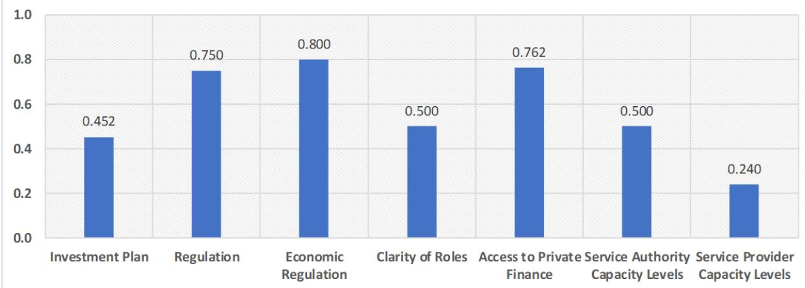  
Note: The figure provides data solely for urban water supply due to similar responses recorded for both rural and urban water supply, particularly as Uzsuvitaminot JSC and its divisions are responsible for providing both water-supply and sanitation services. A key difference observed is that a small number of rural water-supply systems are managed by private water companies, such as Obi Hayot, which is a group of private companies, responsible for delivering public water supply services in rural areas. Obi Hayot operates the new water-supply as part of a KfW-financed project.  
Source: Country consultations, including at the Policy Dialogue on Water Finance and Technologies in Uzbekistan, https://www.oecd.org/en/events/2024/12/policy-dialogue-on-water-finance-and-technologies-in-uzbekistan.html.

## Drinking water services investment plan

Uzbekistan does not currently have a single comprehensive water sector investment plan. A national investment programme is adopted for specific periods, with a particular focus on irrigation, land reclamation and pumping stations. A key benefit of these periodic investment programmes is that they are designed and implemented with due consideration of climate-mitigation measures and overseen by the Ministry of Construction, Housing and Communal Services.

Regarding sectoral planning, including accelerating work on improving the supply of clean water and sanitation for the population, Uzbekistan adopted Presidential Decree No. PP-257, which focuses on additional measures to increase the level of supply for drinking water and sanitation services. This decree includes measures such as increasing the population with access to drinking water to 87% and upgrading sewerage systems in over 32 cities and 155 regional centres (Republic of Uzbekistan, 2022[19]). A second decree was adopted in 2023, which also focused on additional measures, with targets to control water volume, improve financial conditions of drinking-water supply and strengthen tariff policy (Government of Uzbekistan, 2023[20]). However, neither of these decrees contains a detailed investment plan. Formal consolidation into a single plan could help increase clarity. It would also support the identification of investment needs in greater depth and help determine where funding could have the maximum potential impact.

## Regulatory structures

The regulatory functions are divided across several entities. The Ministry of Construction, Housing and Communal Services acts as the regulatory authority for drinking-water supply and sanitation. A separate regulation has been adopted on the formation, approval and establishment of tariffs, which falls under the jurisdiction of the Ministry of Economy and Finance of Uzbekistan. The limited clarity surrounding the functions of the regulator and the lack of publicly available information create a fractured regulatory system with limited clarity on role delineation.

Assessing the extent to which economic regulation sustains and attracts investment yields an overall positive score, including a clear process for setting and revising tariffs; however, limited data make it difficult to assess its efficacy in practice. This is exemplified by the absence of reporting on contract arrangements for service providers and the lack of performance-based contracts.

The absorption of donor capital commitments is estimated to be at full capacity. However, there is a lack of data to assess whether cash flows are sufficient to meet financing obligations within the country.

In terms of the overarching aim of service authorities being capable of fulfilling their mandate, there is a lack of human resources for operations, maintenance, design and construction, which limits Uzsuvitaminot's capacity levels.

The process of involving the private sector in operations has only just begun and remains at an initial testing stage, with regulations currently under development. A full discussion of Uzbekistan's current ability to attract private-sector investment in water-related sectors is provided in Chapter 4.

## Early signs of private interest in the water and wastewater sector

The government has introduced several reforms to attract private investment into water and wastewater services, including those related to economic regulation and the legal status of service providers. There are no financial rules in place in Uzbekistan that constrain financial flows for investment. According to existing legislation, enterprises can issue securities on the capital market. However, limited progress has been made in attracting private and public financing.

According to current legislation, joint-stock companies can raise additional funds by issuing securities (shares and bonds) on the capital market. Uzsuvtaminot JSC issued USD 990 000 worth of shares in 2021 and USD 6.09 million in 2022. Additionally, relevant projects of Uzsuvtaminot JSC can be financed by bank loans.

As of 2025, private sector participation remained limited; however, early signs of growth were beginning to emerge. The drinking-water supply and wastewater systems of the cities of Kagan, Shirin, Yangiyer, Bekabad and Yangiyul were transferred to the private sector through public-private partnerships starting in July 2024.

To attract private investment in water-related sectors, the government of Uzbekistan offers a series of incentives, including:

• government guarantees for investments in the sector

\- provision of land with essential infrastructure (e.g. gas, electricity, water and transport) for project development

• tax and customs privileges and preferences for investors

Service providers have access to finance; however, they can only access financing with limited maturity and interest rates that are not adapted to their needs. The Republic of Uzbekistan's Investment Programme for the first quarter of 2024 allocated USD 48.7 million for Uzsutaminot JSC projects to be financed through foreign loans under state guarantee. By year-end, the company had implemented 20 drinking-water-supply and sanitation projects, utilising credit funds totalling USD 179 million and exceeding planned targets by 4.5 per cent. The financing was sourced from multiple international partners: the Asian Development Bank (USD 90.6 million), SUEZ (USD 26 million), the European Bank for Reconstruction and Development (USD 24.1 million), the Saudi Fund for Development and OPEC funds (USD 21.2 million)

and the World Bank (USD 8.4 million). This demonstrates successful mobilisation of additional international financing beyond initial programming.

In addition, Resolution No. 107 of the Cabinet of Ministers (9 March 2022) established risk categories for state-owned enterprises engaging in external-debt financing. This system categorises enterprises based on their financial and economic performance and the volume of external-debt funds secured.

## Adjusting tariff setting for cost-recovery

The tariff setting process for water and wastewater services is clearly delineated, with annual adjustments based on the inflation index and consultations with relevant ministries. However, tariffs are still set below cost-recovery levels. The methodology for cost assessment and tariff revision in water supply and wastewater is developed and agreed with the Ministry of Economy and Finance, the Ministry of Construction, Housing and Communal Services and Uzsultaminot JSC.

The responsibility for setting drinking-water and wastewater tariffs is decentralised, despite the presence of a national operator, Uzsultaminot JSC. Under the 2022 Law “On Drinking Water Supply and Wastewater Disposal”, regional water-supply organisations are mandated to develop cost-reflective tariffs based on production costs, financial and operational expenses and provisions for infrastructure modernisation. These proposed tariffs are then subject to approval by local authorities rather than a central regulatory body. While Uzsultaminot co-ordinates service delivery and tariff preparation, final decisions rest with subnational governments, resulting in significant regional variation in tariff levels and periodic adjustments based on local economic and infrastructural conditions.

Tariffs are automatically updated on an annual basis, without submitting new or revised applications for approval, taking the inflation index into account, upon agreement with the Ministry of Economy and Finance, the Ministry of Construction, Housing and Communal Services and Uzsultaminot JSC.

Since 1 January 2024, new tariff-setting rules have been implemented under Presidential Decree No. PP-343 of 24 October 2023, establishing cost-based pricing for drinking-water supply and wastewater services. Tariffs are calculated based on total costs including production expenses, current expenditures, development and modernisation investments, financial costs, taxes, Uzsuvitaminot JSC operational costs and organisational profitability levels. Where regional authorities and municipalities set tariffs below the calculated cost amount, the difference is covered from the State Budget through a state-order mechanism, ensuring financial sustainability while maintaining affordability controls at the local level. Subsidies currently exist for multi-child families and certain classes of citizens, including citizens with disabilities.

## Clarity of roles

Uzsuvtaminot JSC is the national holding company responsible for the strategic management, development and modernisation of Uzbekistan's centralised drinking-water supply and sanitation systems. It has the primary mandate for investing in drinking-water and sanitation infrastructure, in partnership with the government. However, the mandate to invest in water-resource management remains unclear within the Ministry of Water Resources.

Regional Vodokanal enterprises and municipal providers have an obligation to provide services to the poorest households and households without access. In 2010, the Ministry of Housing announced a call to encourage water-supply and sanitation service provision by non-profit organisations and community organisations in rural settlements that do not have access to centralised drinking-water supply (Decree UP-6074); however, this has not been systematically implemented.

Uzsuvtaminot JSC operates as the central contractual hub of Uzbekistan's water sector, simultaneously fulfilling multiple, potentially conflicting roles as service provider, procurement client, concession grantor and borrower. Under its updated charter (registered September 2024), the company has been granted extensive contractual powers that span the entire water value chain, from direct service provision through standard consumer contracts mandated by the 2022 Law on Drinking-water Supply and Wastewater to acting as the sole procurement client for major infrastructure projects under Article II provisions.

The charter explicitly empowers Uzsuvtaminot to introduce and monitor public-private partnerships, as demonstrated through its role as concession-granting authority for the 2022 Tashkent management contract with SUEZ and the five-city PPP programme launched in October 2023. Additionally, the company serves as the national executing agency for international financial-institution projects under Presidential Decree PF-5883 while simultaneously managing social-contract grants with NGOs for rural water access under Decree UP-6074. This concentration of diverse contractual functions within a single entity creates a complex institutional architecture that, while enabling co-ordinated sector development, raises potential concerns regarding conflicts of interest and the separation of regulatory, operational and commercial functions within the water-sector governance framework.

## A need for capacity building to improve service delivery

One of the key challenges in the water and wastewater sector, which limits its efficiency, is the low capacity of human resources for operation and maintenance, design and construction of the networks and investment planning. The staff of Uzsuvitaminot JSC averages 5-6 people per thousand connections, which is higher than the 2-3 per thousand connections that usually apply to utilities considered efficient. Despite this, issues remain, including insufficient tariff collection, a lack of up-to-date technologies and non-revenue-water levels that are still high. For example, there is no reporting on operating-cost coverage and debt-service ratio data are not available.

In terms of operational performance, Uzbekistan's drinking-water and wastewater sector shows mixed results. Continuity of service is relatively low, estimated at 21.3 hours per day, representing $88.75\%$ availability. Customer-metering coverage in the drinking-water supply system is reported at $73.2\%$ (State Assets Management Agency, 2024[17]). However, from 2024 it is mandatory to include water metering in all drinking-water-supply and sewerage-facility and network designs, to install metering devices on water infrastructure and networks, and to install household water meters connected to a unified billing system when extending networks to those households (Resolution of the President of the Republic of Uzbekistan, 2023[21]).

The collection ratio is estimated by IBNET at 88% in urban areas. The level of non-revenue water is high at 36%. However, water losses in some cities can reach 50%, largely attributable to ageing infrastructure and a lack of sufficient investment in maintenance. This presents a significant challenge in attracting and sustaining investment. Non-revenue water generates financial losses due to the inability to recover production, treatment and distribution costs. Furthermore, high non-revenue water can cause supply interruptions, leading to customer dissatisfaction. Investors often view high non-revenue water as an indicator that infrastructure may be nearing, or has passed, the end of its lifecycle, which can necessitate increased borrowing or complicate fundraising activities and financing mobilisation. Such conditions also lead to deferred investments: resources that could otherwise fund system improvements such as energy efficiency or network expansion, are instead allocated to overdue maintenance and replacement.

The results of this Scorecard highlight the need to strengthen monitoring levels to generate a more accurate picture of Uzbekistan's water usage and, consequently, provide more informed sectoral decision-making. For example, current collection rates make it challenging to demonstrate the creditworthiness of the provider, a crucial factor for attracting private investment. There is not yet a consensus among decision-makers on the importance of enhancing tariff collection. Based on data from 2016, 2017 and 2020, collection rates in the sector averaged $70\%$ , $75\%$ and $77\%$ respectively, with Syrdarya province at $65.8\%$ , Kashkadarya province at $63.3\%$ and Khorezm province at $60\%$ .

Recent reforms under Presidential Decree No. PF-74 (7 May 2024), which increased salary levels for water-sector employees and expanded revenue sources for performance-based incentives financed through extra-budgetary funds, represent an important step toward strengthening institutional capacity.

## Irrigation

Due to limited data availability, a comprehensive assessment of the irrigation sector could not be conducted. However, the analysis did yield valuable insights into key barriers and opportunities, which are outlined below.

There is no single comprehensive sectoral investment plan for irrigation. However, the country's special investment programme is adopted for specific periods and covers irrigation. Furthermore, the Decree for the Development of Water Management for Uzbekistan for 2020 to 2030 places specific focus on expanding water-saving irrigation technologies and ensuring the sustainability of irrigated lands, alongside increasing the efficiency of irrigation systems.

The Ministry of Water Management both oversees and provides water services for irrigation. All investment projects in this sector align with national climate-change-mitigation targets. Monitoring of irrigation programmes is not systematically conducted. However, in 2021, the Cabinet of Ministers issued a decision to improve certain legislative acts related to the activities of the Ministry of Water Resources, which introduced water accounting and reporting specifically for irrigation-system administrators (Cabinet of the Ministers of Uzbekistan, 2021[22]).

The low capacity of human resources for operation and maintenance, design, construction, monitoring and evaluation of irrigation networks is a major barrier for attracting investment. Service providers lack experience in preparing investment plans and in operating and managing infrastructure, as illustrated by high water losses in irrigation channels.

Water losses remain high in irrigation channels within the country. Irrigation efficiency at the Water Users' Association (WUA) level was estimated to be around 65.2%, with even lower indicators in several regions, and 35-40% of water is lost in irrigation networks.

Subsidies, soft loans and water tax preferences for water-saving irrigation technologies, as well as subsidies to cover the cost of electricity consumed by pumping units and irrigation wells, are available to agricultural producers. However, if not properly monitored, these incentives could pose a risk to future water security by potentially leading to over-exploitation of resources.

## 3.2.3. Dimension 3: Limited sustainability and bankability of water-related projects

The framework for assessing project sustainability and bankability (Dimension 3) highlights that water-related projects in Uzbekistan face significant barriers. Limitations include a lack of unified methodologies for environmental and social impact assessments, cost-benefit analysis and data-collection methodologies, as well as limited data availability. However, as demonstrated in Figure 3.7 below, positive elements include the existence of legislative frameworks to guide investment decisions, national guidelines to assess project viability and strong stakeholder participation in projects.

Figure 3.7. Projects demonstrate a strong level of stakeholder involvement, but limited scores in cost-benefit analysis and pooling mechanisms  
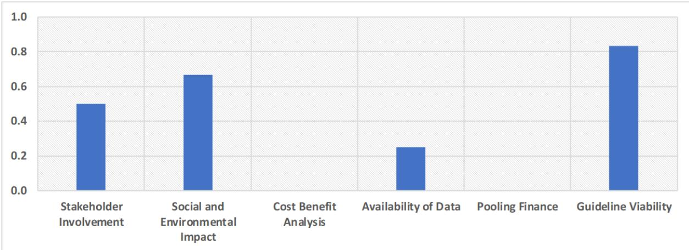  
Note: The data recorded in Uzbekistan showed a score of 0 for both cost-benefit analysis and pooling finance, thus reducing the overall score of Dimension 3.  
Source: Country consultations, including at the Policy Dialogue on Water Finance and Technologies in Uzbekistan, https://www.oecd.org/en/events/2024/12/policy-dialogue-on-water-finance-and-technologies-in-uzbekistan.html.

## Positive levels of stakeholder involvement

Stakeholders are involved in several steps of the project cycle according to legislation. As per GLAAS reporting, the extent to which service users and communities participate in decisions remains high, and the percentage of the population with access to formal feedback mechanisms to address concerns and complaints is also high, estimated at between 75-94%.

A procedure for public hearings exists to ensure discussion of economic activities that may negatively impact on the environment (Cabinet of Ministers Decree No. 541 of 07.09.2020). Following these hearings, decisions can be made to either support or reject the planned economic activity in the specified area. Measures may also be taken to mitigate the impact of ongoing activities on the natural environment.

## Progress has been made in terms of assessing the environmental impact of projects

There is no unified methodology that addresses water security and water-related risks, including those extending beyond a project's boundaries. This presents a key area where water-related risks could be further factored into decision-making, including through the creation of a risk-analysis matrix.

However, the Cabinet of Ministers of the Republic of Uzbekistan has made improvements to the environmental-impact-assessment mechanism, building on the Presidential Decree on the “Approval of the Concept of Environmental Protection of the Republic of Uzbekistan until 2030” to bolster regulation on the environmental impacts of projects. Several laws and regulations, including the Law on Environmental Control, the regulations on compensation payments for pollution and waste disposal, the Law on Nature Conservation and the Regulations on Water Use and Water Consumption, contain provisions for assessing social and environmental elements.

There is no official methodology for conducting cost-benefit analyses for all types and sizes of projects. For projects related to the construction and reconstruction of facilities affecting water and water bodies, approval is required by the authorities responsible for ecology, environmental protection, geology and mineral resources. Additionally, these projects must undergo a state expert review in accordance with legislation.

## Limited availability of data on water projects

There is no centralised platform for potential investors and project developers to access comprehensive information on water-investment needs or water projects. However, some information on projects is made available to the public through the official websites of relevant ministries and agencies, local authorities and the Statistical Agency under the President of Uzbekistan.

To ensure compliance with construction standards and rules, a government resolution mandates that the Ministry of Water Management oversee data collection on water projects (No. 573 of 17 September 2021). Some of this data is shared and collected with the involvement of experts from the water sector, agriculture, land planning and other relevant fields.

Measures designed to ensure project viability are in place, although they are not fully applied to the water and wastewater sector

There are national guidelines for project preparation, including for assessing project viability and risk distribution. However, implementation of these guidelines in the water and wastewater sector remains patchy.

Presidential Resolution PP-332 of 25 July 2022 outlines a procedure for developing infrastructure-investment projects, including provisions for conducting due diligence and approving pre-project documentation. It emphasises the importance of conducting a feasibility study to evaluate cost-effectiveness and project payback. Specifically, it mandates that the feasibility study include project-management schemes for the whole lifecycle of the project, including legal frameworks, clear management structures and financial estimates. Furthermore, it stipulates the interaction among project participants and the allocation of costs, benefits and responsibilities, while addressing institutional risks, their primary factors, expected changes and measures for risk mitigation.

The Ministry of Water Management (concerning water bodies and water management facilities), the Ministry of Construction, Housing and Communal Services, and Uzsutaminot JSC (water supply and sanitation), along with Uzbekhydroenergo JSC (hydropower), jointly with other public authorities and local executive bodies, assess the economic efficiency and safety of priority investment projects. This assessment, particularly for projects involving foreign investments and international financial institutions, is conducted through an analysis of pre-established indicators.

Effective mechanisms and instruments to pool projects or manage joint accounts for specific funding are not yet available in the country.

## 3.2.4. Dimension 4: The performance of other economic sectors demonstrates a relatively positive contribution to water security, with room for improvement

Among all four dimensions, Uzbekistan demonstrates its strongest performance in the contribution of other economic sectors to water security. This demonstrates the importance of water efficiency as a national priority relevant to all sectors and reflects the presence of clear water-risk-mitigation strategies, particularly through insurance classifiers.

However, despite the prevalence of many sectoral strategies, which lead to a strong score for this dimension, limitations are observed in the inconsistent application of guidelines. Furthermore, the absence of data for some sector-specific strategies limits a comprehensive assessment of national water security. Strong and consistent implementation across sectors is required to ensure water security.

While the introduction of subsidies and benefits aims to enhance water security, certain structural challenges may reduce the efficiency of these tools, which is reflected in the low score for public policy.

The lack of co-ordination between sectors, fragmented investment in isolated domains without consideration of their interconnectedness and the absence of a comprehensive approach can lead to inefficiencies and increase water insecurity. Initiatives related to water efficiency can also have unintended consequences, such as over-abstraction and salinisation, which are not currently considered by the government.

Regular multi-stakeholder National Policy Dialogues, envisaged under the ongoing OECD-led nexus programme in partnership with UNECE, could support broad sector co-ordination. Since 2008, the OECD and UNECE have facilitated such events and supported progress in areas including strengthening capacity to use economic policy instruments for water management. Dialogues are planned to continue in 2025 with support through the IKI-funded Energy, Water and Land-use Nexus Programme.

Figure 3.8. Investments toward ensuring a water-secure future shows clear strengths but underscore the need to improve economic incentives and disclosure standards  
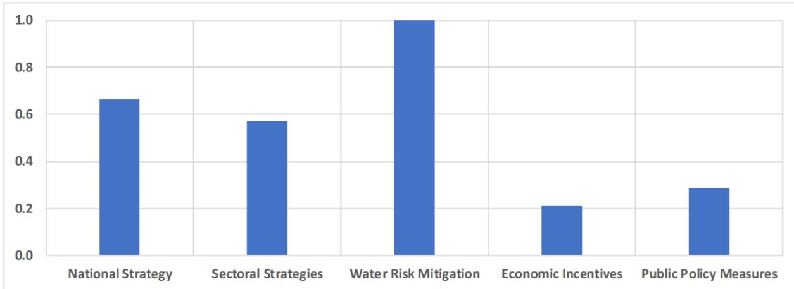  
Note: A no-response score was recorded for disclosure standards and has therefore been removed from the graph and the scoring.
Source: Country consultations, including at the Policy Dialogue on Water Finance and Technologies in Uzbekistan, https://www.oecd.org/en/events/2024/12/policy-dialogue-on-water-finance-and-technologies-in-uzbekistan.html.

## A strong national strategy for water

Uzbekistan adopted the Concept of Water Strategy for 2020-2030 to guide sectoral development. Several other sectoral documents also guide the country's strategy towards water security, indicating the government's awareness of the importance of water security for ensuring economic growth and achieving its environmental and development objectives.

The 2030 Strategy of Uzbekistan, Section III “Water conservation and environmental protection”, introduces indicators for the following key objectives:

\- Promoting sound water use and a water-saving culture.

\- Achieving sound water use in agriculture.

\- Developing irrigation and water conservation technologies, with wide involvement of the private sector and public-private partnership mechanisms in the sector.

\- Reducing energy consumption by pumping stations as part of the wider adoption of -energy technologies.

Goal 31 under the Development Strategy of New Uzbekistan for 2022-2026 also highlights the need to reform the water-management system and implement a dedicated state programme for the water economy to support economic objectives (Development Strategy Center, 2021[23]).

Further co-ordination on economic incentives, both across and within sectoral strategies, could bolster water security

The government has introduced some measures to support water security. For example, in 2015, a distinct tax category was created for enterprises using water in the production of non-alcoholic beverages, with the corresponding tax rate per cubic metre increasing by 90% since its inception. Furthermore, from 2019, dedicated tax rates were established for industrial enterprises and vehicle-washing stations, with the tax rate for surface water utilised by industrial enterprises increasing from UZS 61.9/m $^{3}$ in 2015 to UZS 360/m $^{3}$ in 2019. Additionally, from early 2019, small businesses with an annual turnover of up to UZS 1 billion (approximately USD 120 000) became liable for the water-abstraction charge (referred to as the water-use tax).

Uzbekistan has implemented policy measures aimed at promoting the use of water-saving technologies in agriculture. These measures are designed to support agricultural producers in adopting technologies that enhance water efficiency. Key measures include loan guarantees covering up to 50% of collateral (capped at UZS 2.5 billion) and interest-rate compensation provided through the State Fund for Support of Entrepreneurial Activity. Strong insurance schemes exist for water risks, providing compensation in cases of property loss and damage specifically related to water risks, including floods and droughts.

Since 2021, subsidies have been available to cover part of the costs for implementing water-saving technologies and acquiring laser-based land-planning equipment. Land plots using these technologies are protected from optimisation or withdrawal for at least five years, ensuring long-term investment security.

In addition to these subsidies, several benefits are extended to support farmers who implement these technologies, including:

• exemption from land tax for a duration of five years

• partial compensation for loan interest

• exemption from customs duties for components of technology imported from abroad

\- subsidies for the installation of alternative energy sources, such as diesel generators and solar panels, in cotton and grain fields where water-saving technology is utilised

\- exemption from water-abstraction charge (water-use tax) for agricultural fields equipped with water meters

These initiatives are part of the government's efforts to reduce the financial barriers associated with the transition to more efficient water use in agriculture.

Regulatory measures can also be strengthened to support water security, particularly in relation to public procurement. A law on public procurement includes a sustainability principle that considers the economic, environmental and social impacts of procurement. It specifically mentions water consumption as a factor in evaluating bidders' proposals and selecting contractors. However, it does not extend to water conservation, pollution reduction or other issues such as soil and flood protection.

There is no corporate-disclosure policy on water-related risks within non-financial reporting. However, regulatory measures support water security, including rules for commissioning production, water and other infrastructure, and regulations for establishing water-protection zones and sanitary zones of water bodies. Specific criteria are applied to bidders in public procurement to help improve the environment or reduce negative environmental impacts.

The purpose of conducting this assessment of barriers to investing in water security in Uzbekistan is to identify areas where reforms or adjustments could be enacted to facilitate easier financing flows. The results of the analysis based on the Scorecard suggest that Uzbekistan has made significant progress in strengthening the enabling environment. Targeted reforms could make a significant difference in attracting investment, including strengthening regulatory frameworks, improving data collection and introducing cost-benefit analysis of projects. This is particularly significant as Uzbekistan looks to scale up its PPP capabilities in drinking-water and wastewater services as well as irrigation, which is a key government priority. The following chapter leverages the results of the Scorecard to demonstrate which specific barriers could be removed to scale up PPPs in water-related sectors in the country.

## References

ADB (2025), Asian Development Outlook (ADO) April 2025: Uzbekistan, https://www.adb.org/sites/default/files/publication/1044336/uzb-ado-april-2025.pdf.

Cabinet of Ministers of the Republic of Uzbekistan (2021), On further improvement of economic mechanisms for environmental protection in the territory of the Republic of Uzbekistan, https://lex.uz/en/docs/5367873#. [18]

Cabinet of the Ministers of Uzbekistan (2021), On improving certain legislative acts related to the activities of the Ministry of Water Resources of the Republic of Uzbekistan, https://lex.uz/ru/docs/5639095#5647350. [22]

Development Strategy Center (2021), Development Strategy of New Uzbekistan for 2022-2026., [23] https://uzembassy.kz/upload/userfiles/files/Development%20Strategy%20of%20Uzbekistan.pdf.

Government of Uzbekistan (2023), On additional measures for further improvement of the drinking water supply and sewerage system, https://lex.uz/docs/6648590.

Government of Uzbekistan (2020), Presidential Decree No. UP-6024 validating the Concept for the development of water sector of the Republic of Uzbekistan for the period of 2020-2030.. [14]

Government of Uzbekistan (1993), Law of the Republic of Uzbekistan on Water and Water Use of 6 March 1993.

IMF (2024), Financial Soundness Indicators, https://data.imf.org/?sk=51B096FA-2CD2-40C2-8D09-0699CC1764DA&sld=1390030341854.

IMF (2022), IMF Staff Concludes Visit to Uzbekistan.

Ministry of Economy and Finance of the Republic of Uzbekistan (2025), Tax Code of the Republic of Uzbekistan, https://lex.uz/ru/docs/4674893#4689275. [16]

OECD (2023), Insights on the Business Climate in Uzbekistan, OECD Publishing, Paris, https://doi.org/10.1787/317ce52e-en. [9]

Republic of Uzbekistan (2022), On additional measures to increase the level of provision of the population with drinking water supply and sewerage services, https://lex.uz/docs/6033210. [19]

Resolution of the President of the Republic of Uzbekistan (2023), No. PP-343, https://cis-legislation.com/document.fwx?rgn=154323. [21]

Sanchez Trancon, D. et al. (2024), “Assessing the enabling conditions for investment in water security: Scorecard pilot test in Asian countries”, OECD Environment Working Papers, No. 235, OECD Publishing, Paris, https://doi.org/10.1787/b96936c4-en.

State Assets Management Agency (2024), The consolidated report on the performance of state owned enterprises with state participation in 2023 and the condition of state property usage, https://davaktiv.uz/uploads/pages/files/1224/Cons.report-2023%20%28website%29.pdf.

Vinokurov, E. (2024), Drinking Water Supply and Sanitation in Central Asia.

World Bank (2024), Access to Electricity (% of population), https://data.worldbank.org/indicator/EG.ELC.ACCS.ZS.

World Bank (2024), GDP Growth, Annual %, https://data.worldbank.org/indicator/NY.GDP.MKTP.KD.ZG.

World Bank (2024), Inflation Rate, Consumer Prices, https://data.worldbank.org/indicator/FP.CPI.TOTL.ZG.

World Bank (2024), Worldwide Governance Indicators, https://databank.worldbank.org/source/worldwide-governance-indicators#.

World Bank (2023), Uzbekistan Infrastructure Governance Assessment, https://thedocs.worldbank.org/en/doc/9a1b20251d1688c58b83ce8d3baa250f-0080012023/original/Uzbekistan-InfraGov-Report.pdf.

World Bank Group (2024), World Bank Country Data: Uzbekistan, https://data.worldbank.org/country/uzbekistan.

World Trade Organisation (2024), Uzbekistan continues to make progress towards WTO accession, https://www.wto.org/english/news\_e/news24\_e/acc\_24may24\_e.htm.

## Notes

$^{1}$ The OECD Scorecard has been developed iteratively with a view to improving its functionality. The first version was trialled in six Asian countries, including Bangladesh, Mongolia, Nepal and Pakistan, in collaboration with the Asian Development Bank and partners. This pilot created a mechanism to identify conditions for attracting and sustaining investment in water security while refining the framework to ensure its global applicability. The second round of pilot tests was conducted in Armenia, Azerbaijan, Georgia, the Republic of Moldova and Ukraine, which offered recommendations on how to enhance water security. The third version of the Scorecard was utilised in Uzbekistan, constituting the latest version.

$^{2}$ This includes, but is not limited to, ministries and other government agencies overseeing water services and water resources management, Ministries of Finance, Domestic Commercial Banks, National Development Banks and other entities capable of investing in water security. Furthermore, the tool is also relevant for international stakeholders (i.e. International Financial Institutions [IFIs], development agencies and bilateral donors) that are looking to invest in water security.

$^{3}$ For the cumulative scoring, based on a maximum of 20, the classifications are as follows: 0-5 as “Nascent”, 5-10 as “Engaged”, 10-15 as “Capable”, 15-17.5 as “Effective” and 17.5-20 as “Model” (Sanchez Trancon et al., 2024 $^{[2]}$ ).

$^{4}$ This includes, but is not limited to, irrigation and drainage, drinking water supply and sanitation, groundwater management, water use and co-ordination between authorities.

$^{5}$ Under the Tax Code, abstraction charges are referred to as the “tax on water resource use” (according to the official translation). However, based on their described characteristics, they align with the OECD definition of water abstraction charges: a payment for the right to use a natural resource, often based on quantity abstracted (for the general state budget or earmarked). The charges are volumetric where water meters are available and otherwise based on estimated usage depending on the type and category of use (Ministry of Economy and Finance of the Republic of Uzbekistan, 2025 $^{[16]}$ ).

$^{6}$ See previous footnote.

## Deploying Public-Private Partnerships for water security in Uzbekistan

This chapter explores how public-private partnerships could help Uzbekistan address its water-financing needs. It analyses the current PPP framework and pipeline, highlights the reforms needed to strengthen implementation in water sectors and considers the conditions under which PPPs in irrigation could be feasible and effective.

Uzbekistan is facing an urgent need to mobilise financing to ensure water security. The country is experiencing growing demand for water for municipal needs associated with projected population growth and for agriculture, in addition to the need to upgrade and replace the existing network (ADB, 2023). The government aims to use public-private partnerships as a key tool to mobilise the required investments.

As an illustration, the government of Uzbekistan aims to expand public-private partnership agreements to a value of USD 14 billion across all sectors by 2026. In 2021, private participation in the infrastructure of Uzbekistan was the second highest in the world as a percentage of GDP at 3.6%, behind Mozambique at 4.7% (Asian Development Bank, 2025[1]).

The application of the OECD Scorecard for assessing the enabling environment for investment in water security, as summarised in Chapter 3, identified a set of barriers for the introduction of public-private partnerships in Uzbekistan in water-related sectors. This chapter focuses specifically on the conditions required for successful public-private partnership implementation in water-related sectors in Uzbekistan, based on an overview of the status of public-private partnerships in the country and the Scorecard results.

Based on the government's request, the potential for private sector investment via public-private partnerships in the irrigation sector was specifically assessed. This section also provides an overview of international best practices for implementing public-private partnerships in irrigation to inform recommendations on how the approach to irrigation public-private partnerships could be strengthened in the country.

## 4.1. Barriers and opportunities for scaling up public-private partnerships in water-related sectors

The OECD defines a public-private partnership as a long-term contractual agreement between the government and a private-sector partner, with the latter traditionally financing and delivering public services using a capital asset and sharing the associated risks with the government (OECD, 2019[2]). The private party is traditionally responsible for the design, construction, financing, operation, management and delivery of the service for a pre-determined period of time, receiving compensation from fixed payments or tolls charged to service-end users (OECD/ADB, 2019[3]).

In the case of water, public-private partnerships and other types of blended-finance mechanisms are being used to bridge the financing gap, identified as a key barrier to achieving the targets of achieving access to safe drinking water and sanitation for all by 2030. As an illustration, in 2024, Multilateral Development Banks deployed USD 14.4 billion in water-related investments to low- and middle-income countries (World Bank, 2024[4]). The structure of water-related sectors allows the implementation of public-private partnerships across several parts of the supply chain, from operation to financing. Further details on international public-private partnerships are provided in Annex A.

Uzbekistan has adopted an ambitious public-private partnership programme, including in water-related sectors, agriculture, healthcare, education, construction and transportation, as part of the country's economic revitalisation efforts, with a primary focus on accelerating infrastructure development.

In Uzbekistan, however, all forms of private sector participation are considered to constitute a public-private partnership, including operations and management contracts, irrespective of whether the private sector effectively contributes private investment. In this report, this broader definition is used, even though it will be important going forward to review the definition of contract types and to clarify what may or may not constitute a public-private partnership with actual investment obligations in Uzbekistan.

According to the Centre for Public-Private Partnership Projects (formerly the Agency for Development of Public-Private Partnerships) under the Ministry of Economy and Finance, project costs of public-privatepartnerships projects vary significantly between sectors. Water management straddles between low and medium project-cost categories in terms of public-private partnership investments. Figure 4.1 shows the distribution of project costs per sector. $^{1}$ It is important to note that certain projects categorised under ecology and environmental protection may also include water-related PPPs.

Figure 4.1. Project costs for public-private partnerships are highly variable across industries  
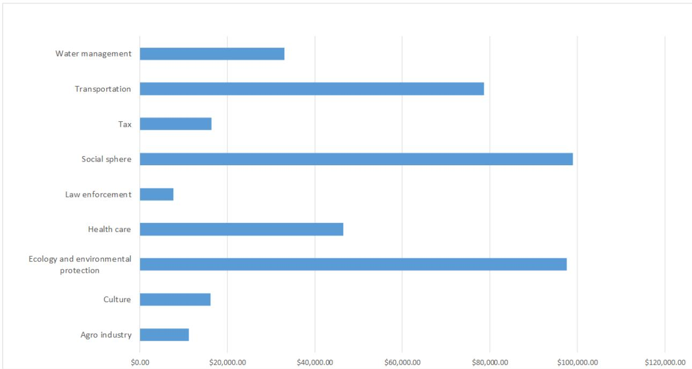  
Note: This excludes major outliers from both ends of the spectrum. The category “communal” was removed, with an average value of over USD 1.3 million, as well as “construction”, “sports” and “craftmanship”, all of which were below USD 5 000. PPPs recorded as having been cancelled on the Centre for Public-Private Partnership Projects (formerly PPPDA) website were removed from the scope of the analysis.
Source: Centre for Public Private Partnership Projects registry (formerly PPPDA registry).

## 4.1.1. Numerous small public-private partnerships have been signed for the operation of pumping stations

As of July 2024, according to the Centre for Public-Private Partnerships Projects database, there were over 462 public-private partnerships active in Uzbekistan for water-related projects. $^{2}$ Most public-private partnerships were small in scale, with the vast majority dedicated to the operation of small-scale pumping stations, with the breakdown detailed in Figure 4.2 below.

The value of pumping-station public-private partnerships ranged from UZS 20 million (approximately USD 1 544) to UZS 69.5 billion (approximately USD 5.39 million). However, the latter represents a significant outlier, encompassing all pumping stations under the Amu-Surkhan Irrigation Systems Basin Department and the Jaykhun pumping station in the Muzrabot District, implemented under public-private-partnership terms.

Excluding outliers, the average value of public-private partnerships in pumping stations was equivalent to UZS 773.81 million, equivalent to approximately USD 59 636. $^{3}$ However, while contract structures are still under development, several private companies have positioned themselves to establish large-scale PPP contracts.

Figure 4.2. Distribution of public-private partnerships in water-related sectors in Uzbekistan  
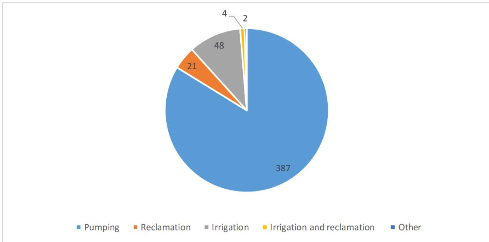  
Source: Centre for Public Private Partnership Projects database (formerly PPPDA database, as of August 2024).

Uzbekistan is actively developing a pipeline of infrastructure projects for water sectors, with a significant concentration of projects in Tashkent. The main private operators currently include Metito, Abu Dhabi Sustainable Water Solutions, Suez and Stantec, all of which are engaged in project implementation, as indicated in Table 4.1 below.

Table 4.1. Private-sector participation in drinking-water and wastewater services in urban areas in Uzbekistan: key contracts

<table><tr><td>Project</td><td>Private partner</td><td>Capacity/project type</td><td>Contract period</td><td>Status</td><td>Contract details</td></tr><tr><td>Tashkent City Wastewater Treatment Plant (WWTP)</td><td>Abu Dhabi SWS</td><td>100 000 m3/d</td><td>2023-2049</td><td>The construction of the WWTP is expected to commence in 2026, with operational capacity expected to be reached in 2030.</td><td></td></tr><tr><td>Wastewater treatment engineering consultancy in the Tashkent Region</td><td>Stantec</td><td>392 000 m3/d</td><td>2024-2029</td><td>Project under scoping.</td><td>Stantec will provide design review, construction supervision and construction-management services for the third phase of the Development of Sewerage Systems in the Tashkent region. The project includes nine contracts encompassing sewerage networks, pumping stations and wastewater treatment plants.</td></tr><tr><td>Tashkent Water and Wastewater Systems Improvement</td><td>Suez</td><td>Performance-based contract</td><td>2023-2030</td><td>Suez&#x27;s contract came into effect in August 2023 and will run until 2030.</td><td>Suez signed a PPP in the Surkhandarya province with the aim of improving access to water, focusing on increasing connection rates for residents, improving water quality and minimising water losses.</td></tr><tr><td>Tashkent City Urban Heating Network O&amp;M contract</td><td>Veolia</td><td>Operation, maintenance and management</td><td>2021-2051</td><td></td><td>Veolia oversees the operation and maintenance of the urban heating network and hot-water installations, evaluates the condition of these facilities, identifies required investments, funds the operational assets programme and manages related projects.</td></tr><tr><td>Namangan Wastewater Treatment Plant</td><td>Metito</td><td>100 000 m3/d</td><td>2 + 23 years</td><td>Project details are still being scoped with project partners</td><td>The project aims to rehabilitate and expand the water and wastewater infrastructure in the Namangan region, enhancing access to safe water and fostering community sustainability.</td></tr></table>

Source: (Global Water Intelligence, 2024[5]).

## 4.1.2. Current strategy for the implementation of water-related public-private partnerships in Uzbekistan

In 2024, in line with the “Uzbekistan 2030” strategy, the Government of Uzbekistan issued Presidential Decree No. PP-308, which sets out a strategic roadmap for the development of public-private partnerships. This roadmap is designed to attract USD 30 billion in private investment into public-private-partnership projects by 2030.

Among several commitments, the decree also sets out specific measures in the field of water and wastewater services. These include specific commitments to modernise and manage both the water-supply and sewerage networks in each region by the end of 2028, ensuring coverage of up to 87% of the population with clean and uninterrupted drinking water and up to 30% with centralised wastewater services. The decree also commits to modernising the sewerage system in Namangan (the second-largest city in Uzbekistan) and to eliminating discrepancies between European and national standards for wastewater-treatment facilities. In addition, it includes commitments to modernise all obsolete irrigation pumping stations by 2028.

Further strategy regarding the introduction of public-private partnerships has also been included in the Presidential Decree on the Approval of the Concept of Development of the Water Management Sector of the Republic of Uzbekistan for 2020-2030. This decree highlights that Uzbekistan is advancing reforms in water management by integrating public-private partnerships and outsourcing mechanisms to enhance efficiency and introduce market-driven principles. The approach includes partially transferring water-management responsibilities to stakeholders such as farmer associations, Water Consumer Associations and agricultural clusters.

In 2024, responsibility for public-private partnerships development in Uzbekistan was consolidated under the Ministry of Economy and Finance. The Public-Private Partnership Development Agency (PPDA) was abolished by Cabinet of Ministers Resolution No. 720 (30 October 2024). Under Presidential Resolution No. PP-308 (30 August 2024), a dedicated Centre for Public Private Partnership Projects was established as a state institution within the Ministry. The Centre operates within the Ministry's existing staffing structure and is tasked, among other functions, with managing funds from the public-private-partnerships fund (Government of Uzbekistan, 2024[6]).

The adopted Water Code aims to introduce the foundations for expanding public-private partnerships in water management. In the Code, public-private partnerships are defined as long-term contractual partnerships between public water agencies and the private sector, with the aim of developing, implementing and financing water-infrastructure projects. The operation and maintenance of water facilities, as well as the repair, construction and modernisation of water management facilities alongside other water services, are all highlighted as areas that can be transferred to the private sector. The Code also explicitly incorporates public-private partnerships for irrigation system canals, allowing private entities to participate in the operation and management of irrigation infrastructure.

## 4.1.3. Two routes of market entry for public-private partnerships

According to the adopted Water Code, public-private partnerships are to be executed entirely on a competitive basis using transparent procedures. Two routes of market entry are currently in place for private investors in public-private partnership projects. The first route involves a standard tender, which is predominantly supported by international finance institutions. This process is the typical route used for public-private partnerships and has demonstrated success in ensuring the lowest price and optimal technical conditions. However, this method traditionally takes longer to implement.

The second route is the unsolicited-proposal route (USP), commonly referred to as Swiss Challenge proposals, which has been the model used to implement both the Tashkent City Wastewater Treatment Plant and the Tashkent Water and Wastewater Systems Improvement. $^{4}$ This model refers to a procurement method in which a private-sector entity, the proposal initiator, submits an unsolicited infrastructure proposal either directly or with government support. If deemed viable, the government issues a request for proposals inviting alternative bids from other interested parties within a fixed number of days. Typically, the proposal initiator is granted the right of first refusal, allowing them to either match or challenge the most competitive offer. Should the initiator fail to do so, the contract is awarded to the most competitive challenger.

Given Uzbekistan's acceptance of unsolicited proposals, the public sector may find itself in a weak negotiating position without access to expert advisory support. In other countries, public-private-partnerships promoters engage advisory services with both legal and technical expertise, including international experience, to ensure balanced public-private-partnerships design and avoid poorly allocated risks (World Bank Group, 2022[7]). Private firms often possess stronger legal and financial capacity than public agencies, making professional guidance essential throughout the public-private-partnerships process.

Governments tend to struggle with reputational risks related to USPs, including perceptions of opaque structures, lack of competition, corruption and political patronage.

## 4.1.4. Addressing the commercial risk associated with low tariffs

Drinking-water and wastewater tariffs are generally low and vary considerably across users and regions. This has limited the private sector's appetite for entering the water and wastewater sector via public-private-partnerships projects. Presidential Resolution No. 309, adopted in 2019, sought to address this issue by regulating the procedure for setting tariffs for drinking-water and wastewater services. It required tariffs to cover service costs as well as expenses for development and modernising networks.

Household tariffs currently range from UZS 1 300 to 8 000 per m3 (approximately USD 0.10 to USD 0.63/m $^{3}$ ), with notably low rates in Karakalpakstan at around USD 0.26 /m $^{3}$ . In contrast, non-household users face substantially higher tariffs, from UZS 3 000 to 15 000/m $^{3}$ (USD 0.24 to 1.18/m $^{3}$ ), reflecting differentiated pricing for commercial and industrial consumption. These regional and user-based differences stem from tariffs being set locally, based on specific economic, infrastructural and environmental conditions. Recent adjustments, including a 26-36% increase in Tashkent Region in July 2025, signal a broader trend of tariff reform underway from 2024 through mid-2025.

In Uzbekistan, responsibility for setting drinking-water and wastewater tariffs is decentralised, despite the presence of a national operator, Uzsuvitaminot JSC. Under the 2022 Law “On Drinking Water Supply and Wastewater Disposal”, regional water-supply organisations are mandated to develop cost-reflective tariffs. These proposed tariffs are then subject to approval by local authorities rather than a central regulatory body. Final decisions rest with subnational governments, resulting in significant regional variation in tariff levels and periodic adjustments based on local economic and infrastructural conditions. Such low tariffs reduce the sector’s financial sustainability and dampen investor confidence.

In response to the challenges posed by low tariffs, the government of Uzbekistan has implemented measures to foster private-sector involvement. These include providing revenue guarantees, subsidies to cover operational expenditures and various tax incentives.

For wastewater-treatment plant public-private partnerships, the compensation model has primarily relied on availability payments with full foreign-exchange compensation. This means that the government pays the private company a fixed amount regularly if the plant is operating, rather than the payment being dependent on how much the treatment plant is used. Under this structure, the private partner assumes no risk related to tariff collection (Global Water Intelligence, 2024[5]). However, this structure of subsidy provision is not systematically entrenched in the public-private-partnership legislation and is applied differently across projects.

## 4.2. Public-private partnerships in irrigation: a national priority requiring further support

During Uzbekistan's 2023 presidential election campaign, the incumbent president pledged to implement water-saving technologies across all irrigated land by 2030. This commitment focuses on modernising irrigation through advanced techniques such as drip irrigation and laser land-levelling. $^{5}$ Since then, the government has broadened its objectives to include the introduction of public-private partnerships.

Building on this, Presidential Decree No. UP/DP-16 of 30 January 2025 mandates the Ministry of Water Resources to attract private-sector investment into the irrigation sector through public-private partnerships. The decree targets a 30% reduction in electricity consumption by implementing management improvements across 200 pumping stations, financed through system organisations under the Ministry in collaboration with private partners.

The potential for introducing public-private partnerships for the management of irrigation channels varies depending on the types of channels under consideration:

\- Primary (main) channels carry bulk water from reservoirs or rivers to secondary off-takes. They are strategic assets managed by the Basin Irrigation System Authorities and account for the highest energy costs (large pumping stations) and conveyance losses. Current public-private-partnership pilots concentrate on this level, pairing rehabilitation with performance-based operation and maintenance and energy-saving guarantees.

\- Secondary (inter-farm) channels distribute water from the primary network to multiple farm clusters. Responsibility rests with district Irrigation System Authorities. Public-private partnerships options here include bundled operation and maintenance contracts linked to digital flow-monitoring, but revenue recovery is harder because water charges (the water use tax) are still collected upstream.

\- Tertiary (on-farm) channels deliver water from secondary canals to individual fields. They are usually operated by agricultural clusters or irrigation-water delivery services. Private participation is most feasible through service contracts that couple tertiary-level metering and maintenance with cluster-supply agreements.

Matching public-private-partnership design to channel level is therefore critical: primary-channel projects can sustain long-term availability payments backed by energy savings, whereas secondary- and tertiary-channel public-private partnerships need clear volumetric-billing rules or anchor-off-taker agreements to be bankable, as well as government support to address affordability challenges depending on the farmers' revenue.

There is a clear need for funding to introduce water-saving and efficient technologies and measures into Uzbekistan's irrigation networks, particularly in view of meeting the President's ambitions. However, given the heterogeneity of the irrigation networks in place, the current subsidy structure for farmers and the cost of advanced technologies, introducing public-private partnerships in irrigation as a solution to address the funding gap will require further assessment. Such an assessment should distinguish between different channel types and seek to engage stakeholders who may be impacted.

It remains important to acknowledge that public-private partnerships in irrigation are not a “fix all” solution for issues such as poorly managed irrigation schemes or under-resourcing for new development. Public-private partnerships should be used in irrigation as an additional tool, exercised with caution and only when specific conditions are met.

Based on the enabling-environment assessment, several components, such as contractual arrangements as well as the conditions for their introduction, may benefit from strengthening. Negative early experiences can undermine the credibility of public-private partnerships as a long-term policy tool, making careful project design and stakeholder alignment essential.

Given the social component of irrigation services and the economic sensitivity of rural areas, Uzbekistan may face socio-political challenges in introducing public-private partnerships for irrigation. Irrigation is typically a more sensitive sector for public-private partnerships, and such an approach can only be pursued in countries with a strong track record of successful public-private partnerships and a robust enabling framework. The complexity of risk allocation in irrigation further justifies the need to strengthen Uzbekistan's public-private partnership framework before moving forward with this option.

Uzbekistan could benefit from gradual private-sector engagement through targeted contractual mechanisms. Public-private partnerships are not the sole mechanisms for involving the private sector in irrigation. Various contractual models, such as service contracts, management contracts and leasing arrangements, can be tailored to meet stakeholder needs.

## 4.2.1. Contractual forms for irrigation vary significantly internationally

Public-private partnerships in irrigation vary significantly. Table 4.2 below illustrates the typical contractual forms of public-private partnerships in irrigation, alongside a description of the types of contracts used and the level of investment. However, it is important to note that this is not a comprehensive list.

Smaller irrigated-agriculture projects may not be able to deliver predictable financial returns. Furthermore, as public-private partnerships in irrigation have not been consistently implemented on a global scale, the landscape is still evolving.

Table 4.2. Contractual forms of public-private partnerships for irrigation

<table><tr><td>Contractual Form</td><td>Description of Contract</td><td>Level of Investment</td></tr><tr><td>Operation, management and maintenance contract</td><td>The private sector is responsible for operation, management and maintenance of infrastructure services for specified recipients. The private-sector provider charges a fee in return for the provision of a service, with the fee originating either from the government or from end users.</td><td>Assets tend to be publicly financed.</td></tr><tr><td>Infrastructure concession</td><td>The private sector is employed to raise commercial funds for the development of infrastructure and is responsible for the construction, operation, management and maintenance of the infrastructure.</td><td>Investment can be made either in part or in whole by the private sector. Grant funding can also cover a proportion of the cost.</td></tr><tr><td>Farm-service agreement</td><td>The private-sector provider can enter into a partnership with smallholder farmers or communities for service provision at farm level.</td><td>The level of private-finance investment required depends on the type of private-sector service provision.</td></tr><tr><td>Hub-farm agreement</td><td>The private sector can undertake commercial agricultural production either through a land concession or a lease.</td><td>Private capital is typically required for on-farm investment, and irrigation fees can reflect some or all infrastructure-related costs.</td></tr></table>

Source: (PPPRC, 2024[8]).

## 4.2.2. Project, market and institutional barriers to address for irrigation public-private partnerships in Uzbekistan: insights from international practices

Uzbekistan is exploring ways to update its irrigation infrastructure, including the introduction of concrete-lined channels to improve efficiency. However, the efficacy of introducing public-private partnerships may be limited in this context, as a significant portion of the existing irrigation network consists of intra-farm channels, which may face greater resistance to change. Public-private partnerships are more appropriate for new developments rather than for schemes already in operation (World Bank Group, 2022[7]). This is because such projects often encounter increased resistance from various stakeholders, each influenced by their own perceptions of risk.

Farmers no longer pay irrigation tariffs but instead remain liable for the water-abstraction charge (“tax on water use”, according to the official translation) based on estimated or metered volumes (Tax Code, Articles 445-447), as set out in Presidential Resolution PP-5 of 2024. Farmers cover electricity costs for privately operated pumps, while electricity for large state-run primary pumping stations continues to be funded by the state budget.

The uptake of water-saving technologies offers the potential to boost farm incomes while reducing water-related costs. Public-private partnerships can be particularly effective in modern schemes requiring large investments and private sector expertise. These models are most successful in pressurised irrigation systems, such as drip and sprinkler irrigation, where entrepreneurial farmers are more likely to pay for improved services. In such cases, the private sector typically shares in the initial capital investment and contributes to operation and maintenance.

The experience of other countries in managing irrigation public-private partnerships highlights the importance of addressing demand and payment risks, which are notoriously difficult to control. Uzbekistan can also draw on emerging lessons in tariff setting to improve farmer uptake of public-private partnership schemes. Setting tariffs close to the mobilisation costs of alternative water sources helps reduce opportunistic behaviour and mitigate demand risk (World Bank Group, 2022[7]), thereby making public-private partnership projects more attractive to end users.

Opportunities for private-sector involvement in irrigation public-private partnerships are generally limited and thus would require effective marketing campaigns. Internationally, there are few examples of successful public-private partnerships in irrigation. Where they do exist, outcomes are mixed and success measures are not clearly defined, as evidenced by the case study on Morocco, a large-scale public-private partnership for irrigation, discussed in Box 4.1 below.

## Box 4.1. The first international public-private partnership in irrigation: the Guerdane project in Morocco

In response to recurring droughts, Moroccan farmers, particularly citrus growers in the Guerdane region, have increasingly relied on irrigation. However, intensive agricultural practices have significantly depleted groundwater reserves.

In July 2004, a public-private partnership (PPP) irrigation concession was awarded by the Government of Morocco with support from the International Financial Corporation. A consortium led by Omnium Nord-Africain (ONA), a Moroccan international conglomerate, won the 30-year concession, with other members including Morocco's Fund Igrane and Austria's Infrastructure Development and Management.

## Background

The Guerdane irrigation perimeter in Morocco's Taroudant Province spans 10 000 hectares and produces $50\%$ of the country's citrus crops. Historically, approximately 600 citrus farmers relied exclusively on private wells drawing from the Souss aquifer. However, overexploitation led to a decline in groundwater levels, making citrus farming increasingly unsustainable. Between 1995 and 2002, citrus cultivation in the region contracted by $22\%$ due to farm abandonment and reduced productivity.

To address water shortages, the 1995 Souss-Massa Watershed Management Plan allocated 45 million cubic metres of water annually from the Mohamed Mokhtar Soussi-Aoulouz dam system, located 40 miles away. The government engaged a private partner to develop a 300-kilometre irrigation network and distribution system, ensuring water delivery based on farm size. The project aimed to provide surface water to cover approximately half of the region's irrigation needs.

The total investment cost, of around 70 million euros, was divided between users (8%), the Moroccan government (48%) and the private operator ONA (44%).

## Structure

The transaction is structured as a 30-year concession contract for the construction, co-financing and management of an irrigation network to channel water from a dam complex and distribute it to farmers in Guerdane. At the end of the concession, ownership of the infrastructure will revert to the government.

The concession grants exclusivity to channel and distribute irrigation water within the perimeter. The construction timeline and associated costs, as well as the collection risk, are transferred to the concessionaire. The government is responsible for ensuring water security.

## Selection criteria

The selection criteria for the winning bidder were based on the water tariff, to incentivise a lower tariff, in line with the government's goal of making surface water accessible and affordable for a larger number of farmers. The public subsidy was designed to ensure that water tariffs remained aligned with current pumping costs, thus making them affordable to farmers. The winning bidder offered a significantly lower tariff compared to the price that citrus farmers had previously paid for groundwater irrigation.

## Risk mitigation mechanisms

To mitigate the demand/payment risk, an initial subscription campaign was conducted, during which farmers paid a fee covering the average cost of on-farm connections. The concessionaire's construction obligation only began once $80\%$ of the available water had been subscribed to. Water shortage risks were allocated as follows: the concessionaire assumed a revenue loss risk, capped at $15\%$ , whilst farmers faced a tariff surcharge in case of drought (capped at $10\%$ of the tariff), and the government sustained the risk of more significant shortages through financial compensation to the concessionaire.'

## Socio-economic analysis

Two potential negative impacts for both farmers and the region were identified: individual costs and associated risks, as well as the broader socio-economic effects beyond the perimeter.

The individual costs for farmers involved in the project include connection fees, investments in the mandatory drip irrigation systems (which are partially subsidised but require an advance payment), costs for tree renewal, and water bills. While the IFC claims that the project has made surface water available to farmers at an affordable price, many farmers interviewed argued that the water costs are excessive – more than double the average price charged by Morocco's public irrigation systems. Additionally, farmers bear significant costs for additional irrigation needs, which account for about 50% of plantation water requirements, typically supplied by private boreholes. Despite the high added value of citrus production, these costs, combined with financial and environmental risks, limit the accessibility of the project for many farmers.

Source: (Houdret and Bonnet, 2016[9]; The World Bank, 2010[10])

## 4.2.3. Considering risk allocation for public-private partnerships in irrigation

There is a clear need to assess the risks for public-private partnerships in irrigation prior to implementation. In line with the same principles for public-private partnerships in general, risk allocation for irrigation public-private partnerships should follow key principles to ensure efficiency and sustainability.

Risks should be allocated to the party that is best able to manage them through risk mitigation or absorption to ensure the following: minimising the likelihood of the risk occurring, mitigating the impact of the risk on project outcomes and absorbing the risk at the lowest cost (World Bank Group, 2022[7]).

The extent of government involvement and risk-sharing depends on what is necessary in a specific context to ensure project viability. International experience shows that levels of government involvement vary significantly across public-private-partnership schemes for irrigation.

Some of the key risks the government of Uzbekistan may face when implementing public-private partnerships in irrigation are identified in Table 4.3 below, although this list is non-exhaustive and other risks may occur throughout the duration of the project. This list can serve the government as an initial guideline for identifying common risks across public-private partnerships in irrigation projects.

Table 4.3. Common risks associated with irrigation public-private partnerships

<table><tr><td>Risk area</td><td>Type of risk</td><td>Description</td></tr><tr><td rowspan="3">Construction</td><td>Design risk</td><td>The irrigation PPP may be either under- or over-designed, which can restrict its ability to achieve sustainability and reliability.</td></tr><tr><td>Land acquisition</td><td>Project sites may be unavailable within the required timeframe or in the manner anticipated.</td></tr><tr><td>Site risk</td><td>Project sites can be sensitive due to the socio-economic context and tensions around natural resources.</td></tr><tr><td rowspan="2">Water abstraction</td><td>Scarcity risk</td><td>The water source for the irrigation scheme may be insufficient or unavailable for the required level of service.</td></tr><tr><td>Enforcement of water abstraction</td><td>Regulation may be weak, or the public agency may lack the capacity to enforce water-abstraction rights.</td></tr><tr><td rowspan="2">Demand</td><td>Water</td><td>Demand for irrigation water may be insufficient to sustain the scheme.</td></tr><tr><td>Agricultural offtake</td><td>Even if productivity increases, farmers may not be able to sell their agricultural produce in the markets.</td></tr><tr><td rowspan="2">Payment</td><td>Payment and collection risk</td><td>There may be risks associated with charging farmers cost-recovery tariffs for operation and maintenance.</td></tr><tr><td>Counterparty risk</td><td>The government party may fail to fulfil its contractual obligations.</td></tr><tr><td rowspan="3">Planning</td><td>Integration risk</td><td>The granting authority may not have the power to govern all stakeholders within a scheme</td></tr><tr><td>Value chain</td><td>Gaps in planning across the value chain can lead to risks.</td></tr><tr><td>Asset-management planning</td><td>Risks may arise from a lack of long-term planning for irrigation assets, including life-cycle costing.</td></tr><tr><td rowspan="7">Cross-cutting</td><td>Pre-contract risk</td><td>Procurement of the PPP may be carried out inefficiently, including through a poorly structured arrangement</td></tr><tr><td>Contract design</td><td>The contract may be inappropriate for the life cycle of the irrigation scheme limited in scope</td></tr><tr><td>Financial risk</td><td>Investors of lenders may be unwilling to provide upfront funding or to continue financing.</td></tr><tr><td>Reaching financial closure</td><td>Weak planning can lead to difficulties in achieving financial closure.</td></tr><tr><td>Performance risk</td><td>Risks may arise around asset performance and the ability to deliver quality and quantity within promised timeframes.</td></tr><tr><td>Force majeure</td><td>Events external to the PPP, such as natural disasters, may undermine the project.</td></tr><tr><td>Social risk</td><td>The project or associated land reallocation may cause social disruption and generate resistance.</td></tr></table>

Note: This list is drawn from the World Bank and PPIAF's irrigation toolkit and is a non-exhaustive set of risks. Source: Adjusted from (World Bank Group, 2022[7]).

## References

Asian Development Bank (2025), Accelerating Private Sector and Green Transformation in Uzbekistan, Asian Development Bank, Manila, Philippines, https://doi.org/10.22617/tcs240578-2.

Global Water Intelligence (2024), Private investment drives Uzbekistan's growing water sector boom, https://www.globalwaterintel.com/articles/private-investment-drives-uzbekistan-s-growing-water-sector-boom.

Government of Uzbekistan (2024), Resolution, President of the Republic of Uzbekistan: On measures for the development of public-private partnerships in the Republic of Uzbekistan for 2024-2030, https://lex.uz/ru/docs/7089558#.

Houdret, A. and S. Bonnet (2016), “Le premier partenariat public-privé pour l’irrigation au Maroc : durable pour tous ?”, Cahiers Agricultures, Vol. 25/2, p. 25001, https://doi.org/10.1051/cagri/2016009.

OECD (2019), OECD, Recommendation of the Council on Principles for Public Governance of Public-Private Partnerships, https://legalinstruments.oecd.org/public/doc/275/275.en.pdf.

OECD/ADB (2019), “Public-private partnerships”, in Government at a Glance Southeast Asia 2019, OECD Publishing, Paris, https://doi.org/10.1787/15cb126c-en.

PPPRC (2024), https://ppp.worldbank.org/public-private-partnership/ppp-sector/watersanitation/ppps-irrigation, https://ppp.worldbank.org/public-private-partnership/sites/default/files/2022-02/Irrigation\_PPP\_Toolkit\_.pdf.

The World Bank (2010), Morocco: Guerdane Irrigation.

World Bank (2024), Water Security Financing Report, http://documents.worldbank.org/curated/en/099100406262537840.

World Bank (2014), Unsolicited Proposals - An Exception to Public Initiation of Infrastructure PPPs.

World Bank Group (2022), Irrigation PPP toolkit.

## Notes

$^{1}$ For more information on the Centre for Public Private Partnership Projects, please see Annex A.

$^{2}$ The Centre for Public Private Partnership Projects (formerly PPPDA) is a register of public-private partnership projects in Uzbekistan, designed to ensure co-operation and increase transparency in the management of PPP projects.

$^{3}$ Exchange rate true as of April 2025, with data drawn from the Centre for Public-Private Partnership Projects (previous PPPDA) in July 2024.

$^{4}$ Qualitative analysis of outputs from USP public-private partnerships remains limited. However, preliminary data suggest that USPs play a significant role in advancing public investment projects, with 16% of all public-private partnerships initiated through USPs occurring in the water and sewerage sector internationally. In low-income countries, a higher proportion of PPPs reach financial close through USPs, while upper-middle-income countries record a higher total contract value compared to those in low-income countries (World Bank, 2014 $^{[11]}$ ).

$^{5}$ A precision agricultural method using laser-guided equipment to reshape field surfaces for optimal water use.

## 5 Technologies and innovation for water efficiency and demand management

This chapter explores how technological innovation can support safer, more efficient and more reliable water management in Uzbekistan. Drawing on AWC expertise and Korea's experience, it highlights priority actions in infrastructure modernisation, smart-water management, groundwater and irrigation systems and capacity building.

This chapter discusses best practices for the implementation of new technologies, based on AWC's expertise, and identifies areas within Uzbekistan's water sectors that may benefit from innovation. The recommendations have been developed in line with the objectives outlined in Uzbekistan's water-sector development plans for 2020 and 2030, with a particular focus on maintaining the safety and reliability of the country's water facilities.

This chapter focuses on assessing current technical performance and analysing the quality of infrastructure in water-related sectors. The recommendations are based on literature reviews, expert interviews, field visits, consultations with government officials and discussions from in-person policy consultation workshops in Uzbekistan, and leverage Korea's experience.

The following areas were identified as potentially benefiting from technological innovation:

• effective development and utilisation of rivers within the country

• modernisation of water infrastructure

• capacity building for efficient water management

## 5.1. Understanding the relevance of Korea's water technology experience for application in Uzbekistan

In the Republic of Korea, K-water has demonstrated its expertise in introducing innovative technologies in water-related sectors, including the Dam Smart Safety Management System, support to the Mekong River Commission and a smart-control surveillance-operation system for groundwater resources.

Some key projects that have been successful include:

\- Management of local water services: In 2004, 36% (85 000 km) of Korea's water pipes were over 20 years old, resulting in 670 million m $^{3}$ of water leakages, equivalent to 36 days of national water supply or an economic loss of KRW 691.7 billion (approximately USD 524.4 million). To prevent such losses and make more effective use of water resources, K-water gradually took on the operation of local water services in 23 localities. Through these efforts, K-water developed a network management system, upgraded ageing infrastructure and increased the water flow rate from 60% (prior to the contractual arrangements with local authorities) to 85%. Since the implementation of these arrangements, the population served by water supply has increased to 2.56 million – an additional 800 000 residents. Customer satisfaction has also risen to 84%, representing an 18% increase.

\- Modernisation of local water service: K-water has successfully implemented 23 efficient water-service-operation and leakage-reduction projects in the West Chungcheong region. This includes local-water-service modernisation projects aimed at improving water-flow rates through the maintenance of ageing water pipes and water-treatment facilities, alongside the enhancement of management capabilities through facility upgrades. To achieve a water-efficiency rate of over $85\%$ in each city, key components of the project included the introduction of a block system, categorised into large, medium and small blocks, the improvement of ageing water-supply networks and the appropriate management of overall network pressure. These efforts have significantly strengthened the foundation for the efficient operation of the water-supply-network management system.

\- Innovative energy use related to water: Since the pilot installation of a 2.4 kW floating solar-power module at Juam Dam in 2009, K-water successfully commercialised the world's first floating solar-power system utilising a dam surface by installing a 500 kW floating solar-generation facility at Hapcheon Dam in 2012. Currently, seven power plants with a combined capacity of 6 MW are in operation. This initiative has enabled K-water to create new industries by leveraging the added value of water. Beginning with the construction of the Juam Dam plant, K-water has been developing and expanding an urban distributed hydrothermal-energy system using raw water from regional water-supply facilities. Thermal energy derived from river water has been designated as a form of new renewable energy, and efforts are underway to scale up the hydrothermal energy sector by targeting demand in public buildings, national projects and large private energy-consuming facilities. The Korean Ministry of Environment aims to introduce 2 GW of hydrothermal energy by 2050, with the objective of saving 2 138 GWh of energy annually and reducing $CO_{2}$ emissions by 547 000 tonnes. K-water also plans to supply hydrothermal energy to its 43 regional water-purification plants currently in operation, aiming to achieve 100% carbon neutrality by 2030. Through this, it expects to reduce annual greenhouse-gas emissions by 651 000 tonnes and fine-dust emissions by 767 tonnes by 2030.

During the 2014-2015 Asia Water High-Level Roundtables, thirty-one organisations, including governments, multilateral development banks, international organisations, research institutes and civil-society groups, convened to advance practical solutions for water resilience in response to Asia's pressing water challenges. A consensus emerged on the need for a professional and sustainable consultative platform, leading to the formal establishment of the Asia Water Council at the fourth Roundtable, held during the seventh World Water Forum in Gyeongju, Republic of Korea.

The Asia Water Council (AWC) was established as a leading platform dedicated to addressing water challenges in Asia and beyond, supporting sustainable development through clean and sufficient water. With 147 members from 27 countries, AWC collaborates with governments, academia, civil society and international organizations, including the World Water Council, the International Water Resources Association, the OECD and the Asian Development Bank, to implement joint water projects.

The synergies between AWC and Uzbekistan are evident. In March 2025, Uzbekistan became a member of the AWC, as the Minister of Water Resources, Shavkat Khamraev, attended the 22 $^{nd}$ AWC Board of Directors meeting in Cambodia, where he met with council representatives and participated in an exhibition of innovative water-management solutions.

## 5.2. Technical innovation proposals have been targeted at priority areas, in line with Uzbekistan's strategy for water 2020-2030

Following literature reviews, in-country dialogues and understanding synergies between AWC's work and the goals of the government of Uzbekistan, AWC undertook an assessment of areas with the greatest potential for the implementation of new technologies.

Based on this assessment, several areas of Uzbekistan's water sectors have been identified that may benefit from Korea's experience and AWC's recommendations, particularly in line with Uzbekistan's National Strategy on Water Management and Development of Irrigation 2020-2030. These are areas where technologies and innovation could be leveraged to foster efficiency and build capacity for water management. Identified areas are shown on the table below.

Table 5.1. Assessment of areas for implementation of new technologies

<table><tr><td>Area identified</td><td>Analysis</td><td>Drawing from Korean experience</td></tr><tr><td>Dam safety</td><td>Currently, there are limitations in Uzbekistan regarding technical assistance, which constrains the capacity to monitor, operate and maintain infrastructure.The large dams on shared rivers, numbering over 100, are becoming increasingly high-risk due to ageing, a lack of maintenance and the absence of legal safety-management systems.New measures are required to address the potential repercussions of natural disasters, such as dam collapses or earthquakes. At present, the actual operation of many large dams often diverges from their original design standards and guidelines.</td><td>K-water has established and is implementing the Water Infrastructure Safety Diagnosis and Maintenance Service Platform Roadmap.The Dam Smart Safety Management Platform integrates advanced technologies for efficient and proactive dam safety management.This includes smart monitoring for real-time data collection, drone inspection for remote performance checks and AI analytics for data-driven diagnostics.The Digital Twin enables virtual assessments, while seismic monitoring detects structural stability in real time. Digital resources support data-driven decision-making, and the dam-safety-management centre ensures comprehensive oversight and co-ordination.</td></tr><tr><td>Groundwater over abstraction and pollution</td><td>As of 2017, the reserves of groundwater in Uzbekistan with relatively good water quality are estimated at 27 584 million  $m^{3}$ . The total permitted groundwater-extraction volume was 6 134 million  $m^{3}$ , and annual consumption averaged 5 320 million  $m^{3}$ .Due to unauthorised water extraction facilities and illegal water extraction, groundwater reserves are significantly declining, alongside worsening water quality. Consequently, groundwater available for households is rapidly decreasing.</td><td>Korea’s Groundwater Act provides a framework for the development, use and conservation of groundwater. The Act sets criteria including permit requirements for groundwater development, provision of facility maps when developing groundwater, mandatory regular water-quality testing by users, based on both the purpose and volume of use, groundwater-facility surveys and a licensing system for individuals or entities possessing approved technical expertise and equipment.Groundwater abstraction is strictly monitored, with water quality representing the primary challenge. In Korea, the main sources of groundwater contamination include agricultural runoff (containing fertilisers, herbicides and pesticides), domestic wastewater (such as leakage from damaged sewage pipes), industrial waste, oil spills and unregulated development activities.To address groundwater pollution, Korea has implemented measures for facilities identified as potential contamination sources (Article 16-2 of the Groundwater Act). These efforts form part of the 4th Basic Groundwater Management Plan (Strategy 3-2-1) and the Groundwater Management Advancement Strategy (3-2). The database contains information on facility characteristics, pollutant types, discharge volumes and permit-approval dates.When groundwater contamination is identified through detailed soil contamination surveys, remediation measures may include soil excavation and water-oil separation in cases of mixed contamination, or groundwater pumping using wells when only groundwater is affected.</td></tr><tr><td>Water-supply facilities</td><td>Some areas of Uzbekistan's water-supply systems require renovation, replacement or more efficient operation guidelines. Key issues include: unclear responsibility for maintenance frequent breakdowns of pumps, electrical machinery and other equipment, and inefficient operation of the water supply system a water supply rate of approximately 68%, combined with instability in water quantity and quality, interruptions and insufficient pressure ageing systems and low water-supply rates in most rural areas</td><td>Korea widely uses Internet-of-Things-based smart-metering systems. These allow remote monitoring of consumption through long-range communication technologies such as NarrowBand-IoT.The IoT-based Smart Watering System enables real-time usage monitoring and automated data transmission via LPWA and LTE base stations. Data are processed through an IoT platform and integrated into a smart-metering programme.The system supports real-time water monitoring, optimises water-distribution-network management and improves metering accuracy through automated data collection.</td></tr><tr><td>Irrigation and drainage management</td><td>As of 2019, the irrigated area in Uzbekistan was estimated at 4.2 million hectares or 20.2% of agricultural land, producing more than 90% of crop output.Considering areas suitable for irrigation and future water conservation, development potential is estimated at 4.9 million hectares. Most irrigation systems currently rely on pumps and canal systems.</td><td>The Rural Agricultural Water Resource Information System (RAWRIS) integrates and manages information on agricultural production infrastructure, disasters and catastrophes and water resources.It enables rational use of irrigation water, improves information reliability, supports optimal rural water-development planning and enhances disaster-management capacity through prediction and evaluation of water supply, flood control, water quality and other hazards. Alongside this, it includes a joint response to national water-management information and strengthening of water management's external status.</td></tr><tr><td>Capacity building for efficient water management</td><td>Uzbekistan's national strategy identifies education and training programmes as essential for improving water-resource management and promoting sustainable development.The institutionalisation of the Suvchilar Maktabi (School of Water Practitioners) presents an opportunity to build long-term capacity in sustainable water use and irrigation. Launched in May 2023 under presidential direction and jointly implemented by Agrobank, the Ministry of Water Resources and the Tashkent Institute of Irrigation Engineers, the initiative has trained over 61 000 farmers and irrigation specialists across 155 districts. Supported by foreign experts, the curriculum promotes efficient drip irrigation, digital tools and climate-resilient methods. The second phase (2024-2030) aims to train 10 000 participants annually through fieldwork, e-learning and demonstration sites across 13 regions.</td><td>The ODA project of the Korea International Cooperation Agency (KOICA) provides a framework for developing a capacity-building programme. In 2024, K-water carried out seven capacity-building programmes, including training under the Sebanghieng Climate-Adaptive Flood Early Warning System Construction Project, with a total of 60 participants.Over the past ten years, Korea has implemented 13 449 ODA education projects in Uzbekistan, with a total disbursement of USD 228 million. A cumulative 422 projects focused on water-related sectors, totalling USD 100 million (KRW 140 billion).Training programmes in water resource management could be considered by identifying training needs at the national and local levels. The training could include hydrological monitoring, irrigation system operation and water resource protection. Training in the following topics could be considered:Automation and digitalisation of water management, including real-time monitoring and optimisation toolsdissemination of Water Saving Technologies to increase water-resource-management efficiency. This should ensure that water-management professionals and agricultural workers are equipped with the knowledge and skills to implement efficient irrigation practices.Consideration of droughts and other impacts on water resources and training on water management strategies to adapt.</td></tr></table>

## Recommendations and action plan from the National Policy Dialogue

This chapter presents an action plan to strengthen Uzbekistan's water sector by addressing key barriers to investment and public-private-partnership implementation. It outlines priority reforms to improve regulatory clarity, governance, economic instruments, service performance, technological innovation and capacity building to attract financing and enhance long-term water security.

Uzbekistan has made strong progress in strengthening its broader investment environment, with some advancements in water security and public-private-partnership (PPP) reforms. However, the assessment from the Scorecard highlights persistent barriers to investment in water security and specific ones that deter private sector participation through PPPs.

The following recommendations address key constraints identified and align with the government's priority to advance PPPs in water-related sectors. Implementing these reforms would enhance investor confidence and accelerate water-related investments.

Key recommendations are outlined below. They have been brought together into an action plan, which outlines the identified challenges, specific actions required, expected outcomes and proposed timeline for implementation.

## 6.1. Clarify and consolidate the PPP regulatory framework to attract investment in water and wastewater services

Clarifying the regulatory framework for water and wastewater services. Ensuring a clear separation of regulatory responsibilities is essential to attracting private-sector investment. Despite multiple reviews, overlapping mandates, unclear processes and inadequate transparency continue to create inefficiencies in service delivery and financial sustainability, thereby deterring international PPPs. The absence of an independent regulatory authority contributes to uncertainty, with private-sector actors facing unclear regulations and fragmented oversight. A well-defined regulatory structure can improve governance, enhance transparency and strengthen investor confidence. The Water Code, adopted on 30 July 2025, presents an opportunity, once fully implemented, to clearly delineate ministerial responsibilities and introduce a robust regulatory framework, including a benchmarking system. This would improve regulatory monitoring and compliance and help ensure a more stable investment environment.

Establishing a transparent legal framework for water-related PPPs. A publicly accessible legal and regulatory framework for PPPs is crucial for creating a predictable investment environment. A legal risk-mitigation matrix could address risks related to water scarcity, financial instability and infrastructure failures, safeguarding both public and private-sector interests. In addition, clearly defining government roles and responsibilities in water-related PPPs would enhance accountability and reduce investor uncertainty.

## 6.2. Improve PPP oversight and governance to ensure long-term sustainability

Improving co-ordination between ministries to streamline decision-making, by establishing an inter-ministerial task force and clear guidelines for collaboration. Strengthening inter-ministerial coordination is essential for ensuring investor confidence and improving PPP implementation, which can be undertaken through consistent close co-ordination and ensuring long-term goals are aligned between ministries. Uzbekistan's PPP framework involves multiple ministries, each with distinct responsibilities for PPP approval leading to inefficiencies and overlapping mandates that create implementation challenges. Clearly delineating responsibilities would streamline decision-making, improve efficiency and align national strategies with water sector goals.

Enhancing monitoring and evaluation systems for PPPs. Given the recent establishment of the dedicated Centre for Public–Private Partnership Projects, it is crucial to empower this new entity with robust monitoring and evaluation capacities. The Centre could establish a comprehensive framework defining clear, measurable indicators for project performance, financial viability and socio-economic impact. It could mandate standardised reporting protocols across all PPP projects. The Centre could invest in internal capacity building for monitoring and evaluation, providing specialised training for staff. Furthermore, the

Centre could commission regular independent audits of PPP projects and ensure the public dissemination of monitoring reports to foster transparency and accountability, thereby strengthening investor confidence and optimising the long-term benefits of PPP initiatives in Uzbekistan.

Building institutional and technical capacity for PPPs through the promotion of mechanisms to recruit, develop and retain talent. Enhancing institutional and technical capacity within Uzbekistan's government is essential for the successful design and implementation of PPPs. Strengthening the PPP Centre and relevant institutions will improve project structuring, negotiation and execution, addressing existing expertise gaps. Notably, many projects supported by international financial institutions also include dedicated capacity-building components.

Presidential Decree No. PF-74 of 7 May 2024 introduced increases in salary levels for employees in water-related sectors and expanded the range of revenue sources available for performance-based incentives financed through extra-budgetary funds. These measures represent an important step toward strengthening human capital, retaining qualified specialists and improving service quality. Building on these reforms, continued efforts to enhance specialised PPP-training programmes focused on project structuring, risk allocation, financial modelling and contract negotiation would further strengthen oversight and execution capacity and support the long-term sustainability of PPP arrangements.

## 6.3. Remove barriers to PPP implementation in water-related sectors

Developing a risk allocation matrix to improve PPP implementation. Using a risk allocation matrix before issuing PPPs would enhance project implementation and efficiency. Properly managing risks at the pre-procurement, planning, execution and transfer stages ensures sustainable and cost-effective PPPs. This is particularly relevant for irrigation PPPs, where limited experience requires additional planning to ensure value for money and public benefit. A risk allocation matrix should ensure risks are assigned to the party best equipped to manage them, optimising efficiency, increasing investor confidence and improving PPP performance.

Mapping sectoral needs to identify priority PPP investments. Comprehensive sectoral mapping is necessary to identify priority areas for infrastructure investment planning, PPP implementation and maximise impact. Uzbekistan lacks an overarching assessment of its water and wastewater and irrigation services, including infrastructure upgrade priorities and service-expansion needs. Detailed mapping would highlight key areas where PPPs can deliver the most benefits. This is particularly important for irrigation PPPs, which are government priorities. The government needs to evaluate the enabling environment and conduct due diligence before issuing irrigation PPPs to ensure technical, financial and environmental viability.

Enhancing transparency and competition in PPP procurement. Introducing stronger transparency and competition measures in PPP procurement will improve value for money and investor confidence. Open and clear procurement processes reduce corruption risks and improve service quality and efficiency. Uzbekistan currently has several active unsolicited PPP proposals, which limit transparency and competition in contract bidding. Establishing clear selection guidelines, including publicly accessible eligibility criteria, contractual obligations and bidding processes, would ensure greater accountability and efficiency. This is particularly relevant for Swiss Challenge proposals, where unsolicited bids can be challenged by competing offers. Ensuring these proposals are well-publicised and marketed will help attract counterbids, increasing competition and improving project outcomes.

Developing a framework for unsolicited PPP proposals. A clear framework for unsolicited PPP proposals is essential to improving competition and transparency. While Uzbekistan relies on unsolicited bids to introduce PPPs in the water and wastewater sectors, these tend to lack transparency and competitive safeguards. A formal framework for unsolicited proposals would reduce the risks of monopolistic pricing and inefficiencies, ensuring fair competition. A structured approach would also minimise corruption risks and ensure bids follow standardised evaluation criteria aligned with public interest. By implementing clear rules and oversight mechanisms, Uzbekistan can increase investor confidence, promote competition and maximise public benefit from water-related PPPs.

## 6.4. Strengthening water sectors sustainability through economic instruments reform, service improvements and cross-sectoral coherence

Implementing coherent and strategic economic instruments for water resource management. Ensuring the coherent and strategic implementation of economic instruments is essential for fair cost distribution and effective water-resource management. The primary purpose of the water-abstraction charge (tax on water-resource use) is to incentivise efficient and responsible water use, promote the appreciation of water as a valuable resource and strengthen accounting and monitoring practices, not to maximise revenue collection.

Water abstraction charges (called the tax on water resource use) and drinking water and wastewater tariffs are currently applied inconsistently across sectors and users, and pollution charges are not applied, limiting water security. Limited implementation of complementary measures, such as metering systems and water-quality monitoring, further weakens their effectiveness. A coherent strategy should ensure these instruments are implemented consistently, aligning economic sustainability with environmental and social objectives.

Advancing agricultural tariff reforms to support the introduction of PPPs in irrigation. Continued refinement of economic instruments in agriculture should be pursued within the existing unified tariff framework. Any adjustments should aim to strengthen cost recovery, improve efficiency signals and support the long-term sustainability of irrigation services, while ensuring affordability and alignment with the current legal and regulatory structure. Effective tariff adjustments need to balance affordability for farmers while ensuring cost recovery, increasing investor interest in PPPs. Currently, government subsidies cover the difference in tariff costs, and their reduction could support the transition towards sustainable and bankable PPPs. However, income-level mapping of farmers should be conducted before tariff increases to ensure fair implementation. Mitigation measures, such as targeted subsidies for vulnerable farmers, should be introduced and monitored to maintain affordability without distorting market incentives.

Aligning water-efficiency measures with water-security objectives is essential for effective resource management. While water-efficiency strategies across sectors aim to increase water availability and improve demand management, their success depends on implementation and cross-sectoral coordination. Water-tax reductions for farmers adopting water-saving technologies may increase overall consumption, impacting water security in other sectors. Similarly, small concrete reservoirs help mitigate floods and droughts. However, nature-based solutions to improve water retention and storage could better be beneficial and improve resilience. Mapping synergies between water management and environmental goals and policies is a requirement to support water security.

## 6.5. Enhancing water and wastewater services performance to attract additional financing

Reducing non-revenue water by unlocking environmental finance. Cutting down losses conserves resources, reduces energy use and strengthens environmental sustainability. Environmental funds and development banks can be mobilised to support leakage-reduction initiatives, given the impact of such interventions on lowering emissions per cubic metre delivered and enhancing resilience. Leveraging these financing opportunities would improve service efficiency while securing new investment streams.

## 6.6. Update technical standards and promote innovation to safeguard water security

Appropriate safety-management measures could be established through precise safety diagnosis and evaluation of dams. To assess and analyse dam safety, a risk-informed decision-making method could be introduced, moving away from the existing standard or criteria-based approach. Risk-informed dam-safety assurance incorporates risk-assessment outcomes as a key factor in decision-making. Dam safety management should integrate both deterministic and probabilistic safety analyses, along with legal, regulatory and business requirements. Several US agencies outline key steps such as identifying failure modes, risk analysis, evaluation and prioritization of risk-reduction measures. Following these structured steps enhances dam safety and operational efficiency through a systematic, risk-informed approach.

Building on the amendments to the groundwater law, strengthening monitoring systems and standards could result in more efficient groundwater conservation. The introduction of real-time monitoring could be explored through the following measurement items: groundwater level, electrical conductivity and water quality survey conducted twice per year, with a one-hour measurement cycle. This would include measurement-network maintenance, providing for continuous data acquisition and enhancing reliability through periodic inspection. Routine inspections could be carried out quarterly, with special inspections when abnormalities occur. This could subsequently reinforce the National Groundwater Information System. It could include publication of a groundwater statistical yearbook, alongside technical support for local governments, leading to informed policy and financial decisions.

In relation to water efficiency, a master plan could be established for modernising and improving irrigation and drainage facilities. This could entail the gradual replacement of earthen embankments with concrete linings where water loss is a concern. Establishment of an ICT-based comprehensive irrigation and drainage operation-information system could help improve the efficiency of agricultural water management.

## 6.7. Expand and upgrade water-related education and training programmes

A proposed curriculum could be developed to train water experts. It could introduce blue (water supply), white (wastewater) and green (sustainability) competency-enhancement plans, based on strategies for each field, to support capacity building. As a strategy for implementing this curriculum, existing universities with strong capacity could be promoted rather than establishing new institutions. Implementation could be divided into two areas: capacity building and strengthening Suvchilar Maktabi (School of Water Practitioners). To strengthen the School of Water Practitioners on a sustainable basis, four areas are recommended: funding, legal framework, resources and formal centre designation. Priority should be given to securing adequate human and material resources to ensure the delivery of high-quality, continuous training.

Organisation of regular National Policy Dialogues on water can show political leadership on water-related sectors priorities and bring together the wide range of stakeholders in water-related sectors to debate and progress policy priorities. Under the OECD-led Nexus programme, the OECD, in partnership with UNECE will facilitate such dialogues, presenting an opportunity for Uzbekistan to develop appropriate agenda items for progression. For example, following the “Year of Environmental Protection and Green Economy” model and to align with Uzbekistan’s broader environmental objectives under the Uzbekistan-

2030 Strategy, a parallel mechanism could be introduced to strengthen intersectoral co-ordination on water-efficiency components through these Dialogues.

## 6.8. Action plan

The Water Code, adopted on 30 July 2025, together with recent policy decisions adopted over 2024-2025, is expected to shape the next phase of reforms in Uzbekistan's water sector. The action plan below is designed to support implementation of these reforms and to address remaining institutional, financial and technical constraints identified through the National Dialogue.

The action plan below highlights a set of priority recommendations drawn from the full set of recommendations outlined in this paper, with a focus on those considered most feasible and impactful in the short to medium term.

Table 6.1. Tailored action plan to develop water security in Uzbekistan

<table><tr><td colspan="5">Main findings</td></tr><tr><td colspan="5">Measures to improve the enabling environment for water security in Uzbekistan to establish the foundations for PPP implementation in water sectors</td></tr><tr><td>Analysis of condition</td><td>Proposed measure</td><td>Methodology</td><td>Justification</td><td>Timeframe</td></tr><tr><td>There is limited technical capacity in water and sanitation service delivery.Constrained operational capacity undermines the financial sustainability of service provision, reducing the sector's appeal to private investors.</td><td>Continue implementation and monitoring of salary and incentive reforms introduced under Presidential Decree PF-74 (May 2024) and assess whether further adjustments are required to ensure competitiveness with other sectors and improve operational efficiency.</td><td>Develop a business case for Parliament that justifies salary increases by demonstrating the financial benefits of improved operational efficiency.</td><td>This will help reduce high turnover in the sector and improve operational efficiency, strengthening the financial sustainability of services. It will also support the development of appropriate project pipelines.</td><td>Short to medium term (6 to 24 months).Business-case preparation in the short-term, followed by presentation to the Oliy Majlis over the remaining 18 months.</td></tr><tr><td>Economic instruments are currently implemented partially among water users, with inconsistencies noted.Abstraction charges and tariffs are below cost-recovery levels, and subsidies are not applied consistently.</td><td>Move towards cost recovery through tariff adjustments and apply consistent abstraction charges.</td><td>Undertake a tariff assessment to identify requirements to reach cost-recovery objectives, with improved targeting of subsidies.Study the potential introduction of pollution charges.Review existing abstraction charges to ensure long-term sustainable use.</td><td>Tariffs should be gradually increased to cover at least operating costs and reduce the subsidy burden on the government, following a thorough assessment of efficiency gains and social impacts.Mitigation measures should be adopted in poorer areas, supported by communication campaigns to socialise reforms and ensure fair access to drinking-water and wastewater services.</td><td>Short term prioritisation (including tariff, abstraction-charge and pollution-charge studies), with reform implementation over the longer term.</td></tr><tr><td colspan="5">Recommendations for the efficient and sustainable implementation of PPPs in the water and sanitation sector in Uzbekistan</td></tr><tr><td>Uzbekistan has several ministries and actors responsible for introducing PPPs in the country. Given the cross-cutting nature of both PPPs and the water sectors, co-ordination challenges currently observed in Uzbekistan are leading to inefficiencies.</td><td>Improving co-ordination between ministries involved in water-related PPPs could help ensure investor confidence by establishing an inter-ministerial task force and clear guidelines for collaboration.</td><td>Undertake a mapping exercise to understand responsibility allocation across ministries and identify overlaps. Add an annex to the 2021 PPP Law outlining areas requiring improvement.</td><td>Strengthening co-ordination and ensuring clear delineation of responsibilities between ministries would streamline decision-making, ensure national strategies and water ambitions are met and enhance the implementation of water-sector PPPs.</td><td>Short to medium term.</td></tr><tr><td>Although steps have been taken to improve regulation, there is limited clarity over roles and regulatory responsibilities. Private-sector actors experience uncertainty regarding the regulatory structure. There is unclear regulation of private-sector participation in the WSS sector and overlapping responsibilities between the Ministry of Water Resources and the Ministry of Economy and Finance in tariff setting.</td><td>Clarifying and making the legal and regulatory framework for PPPs publicly available could enhance transparency and accessibility.</td><td>Undertake a regulatory-impact assessment to identify areas where regulation needs strengthening, focusing on achieving long-term reform. In the short term, map responsibilities between ministries for PPPs in water-related sectors and clarify the mandate for private investors.</td><td>Clear delineation of roles and responsibilities of the government during water-related PPPs would ensure accountability and create a predictable investment landscape.</td><td>Short term for responsibilities mapping. Medium-to-long term for regulatory-impact assessment.</td></tr><tr><td>Uzbekistan does not have an updated overarching assessment of the water and wastewater sector, including areas constituting immediate priorities for upgrades and investments.</td><td>Undertake a comprehensive mapping of water and wastewater-sector to identify priority areas requiring investments that could be accelerated via PPPs, thus maximising impact.</td><td>Update the previous sector assessment, based on drinking-water-supply needs, to better target areas most in need.</td><td>A comprehensive mapping exercise would identify where PPPs can be most beneficial, ensuring effective resource allocation and project implementation in regions where they are most needed.</td><td>Short term.</td></tr><tr><td>Uzbekistan uses unsolicited bids to introduce PPPs in the water and wastewater sectors. This limits transparency in awarding PPPs and may lead to inefficiencies.</td><td>Establish a clear and transparent framework for the Unsolicited Proposal Route.</td><td>Draft, for Parliament's approval, a clear framework governing Unsolicited Proposal Route PPPs.</td><td>A framework would improve competition by reducing the risks of monopolistic pricing and inefficiencies, minimising corruption risks in contract awards and ensuring bids follow standardised evaluation criteria aligned with the public interest.</td><td>Short term.</td></tr><tr><td>The efficiency of PPPs could be further strengthened by ensuring risks are assigned consistently to the party most capable of managing them.</td><td>Develop a risk-allocation matrix before issuing PPPs to ensure smooth project implementation.</td><td>Employ a risk-allocation matrix as a prerequisite prior to PPP scoping and implementation.</td><td>Ensuring that all risks involved in pre-procurement, planning and execution stages are appropriately identified will allow for sustainable and cost-efficient PPPs.</td><td>Medium term.</td></tr><tr><td>Limited data and information regarding the progress and success of PPPs could undermine investor confidence.</td><td>Strengthening the PPP Centre's monitoring and evaluation functions could support comprehensive mapping of PPP progress and best practice across the country.</td><td>Present a scoping note to Parliament on strengthening the PPP Centre, based on the best practice for monitoring and evaluation.</td><td>The Centre could carry out regular monitoring, providing updated data, allowing increased reporting and transparency, thus generating examples of best practice and a potential pipeline for investors. This could also serve to reduce any social unease during implementation of PPPs.</td><td>Long term.</td></tr><tr><td>Limited government capacity and expertise in PPPs may hinder successful and consistent implementation.</td><td>Building capacity and expertise within the Government of Uzbekistan for the PPP Centre will ensure continued PPP success,</td><td>Build on Presidential Decree No. PF-74 of 7 May 2024 by further strengthening recruitment and retention incentives for PPP-related functions (including performance-based incentives financed via extra-budgetary funds), and by expanding employment opportunities and career pathways within PPP-relevant institutions.</td><td>Enhancing institutional and technical capacity is a prerequisite for the successful design and implementation of PPPs in water-related sectors</td><td>Medium term.</td></tr><tr><td colspan="5">Strengthening standards for technology and innovation measures to ensure water security</td></tr><tr><td>Dams in Uzbekistan are currently outdated, which increases the risk of unsafe conditions.</td><td>Safety-management measures could be implemented through safety diagnosis and evaluation of dams.</td><td>Introduce a risk-informed decision-making approach, rather than the current criteria-based approach, using both deterministic and probabilistic safety analysis.</td><td>Following these steps would enhance current dam operation and efficiency.</td><td>6-12 months.6 months for mapping and developing the risk-informed decision-making approach, with a further 6 months to execute it.</td></tr><tr><td>Limited cohesive groundwater-management rules and systems lead to inefficiencies in groundwater conservation.</td><td>Strengthening groundwater-monitoring systems could enhance efficiency and promote more sustainable groundwater abstraction.</td><td>Strengthen the integrated monitoring system linked to surface water in the medium term, alongside routine network inspection.</td><td>This could lead to more efficient use and gradual construction of an IoT-based smart-metering system and smart-water-management system.</td><td>6 months for introducing groundwater-management rules, and a further 6 months for introducing an IT-monitoring system.Once data are established and collected (24-28 months), the IoT-based smart-metering and management system could be introduced.</td></tr><tr><td>Water efficiency is a national issue in Uzbekistan, particularly due to outdated irrigation and drainage facilities.</td><td>Establishing a master plan could be beneficial for modernising and improving irrigation and drainage facilities.</td><td>Develop a master plan that enables the gradual replacement of earthen embankments with concrete lining, following the establishment of an ICT-based irrigation and drainage operation-information system.</td><td>This would improve efficiencies in agricultural-water management.</td><td>Long term.A sector mapping should be completed in 6 months to identify priority areas, with gradual replacement over the following 12-48 months.</td></tr><tr><td>There is currently insufficient expertise in advanced water- and wastewater-treatment technologies, which constrains overall sector capacity.</td><td>Design a specialist curriculum on blue (water supply), white (wastewater) and green (sustainable) technologies, based on existing university curricula.</td><td>Implementation could be divided into capacity building and strengthening training centres.</td><td>Enhancing sector expertise may help retain and attract further talent in the water and wastewater sector and improve management efficiency.</td><td>Short term, integrate key technology modules into existing training programmes.</td></tr></table>

# Annex A. PPPs: definitions and status in Uzbekistan

## Defining PPPs

The OECD defines a public-private partnership as a long-term contractual agreement between the government and a private-sector partner, with the latter traditionally financing and delivering public services using a capital asset and sharing the associated risks with the government (OECD/ADB, 2019[1]). $^{1}$

A public-private partnership (PPP) is defined as an agreement between the government and one or more private partners (which may include the operators and the financers) according to which the private partners deliver the service in such a manner that the service-delivery objectives of the government are aligned with the profit objectives of the private partners and where the effectiveness of the alignment depends on sufficient transfer of risk to the private partners (OECD, 2008[2]).

PPPs assume a variety of forms, structures and contracts. The private party is traditionally responsible for the design, construction, financing, operation, management and delivery of the service for a predetermined period of time, receiving compensation from fixed payments or tolls charged to service-end users (OECD/ADB, 2019[1]).

Effective management and strong institutional capacity are prerequisites for successful PPP projects and for their long-term fiscal sustainability. Without strong legal, regulatory and compliance frameworks, risk sharing, budget liabilities and negotiations can cause disputes and hinder successful PPP progress or implementation (OECD/ADB, 2019[1]). PPPs typically do not fit one specific category or design, but rather are based on hybrid models, adopting several features of contracts in line with the political and economic context of a country, designed to fit local needs.

## Potential benefits and challenges of PPPs in the water sector

## Potential benefits

Capital provision: Public-private partnerships can provide access to upfront capital (Lima, Brochado and Marques, 2021[3]). This capital can be used to develop new water infrastructure assets with minimal public financial commitments, advancing infrastructure development while providing relief from fiscal burdens. (Ameyaw and P.C. Chan, 2016[4]). By leveraging PPPs, operational efficiency can be enhanced and outdated infrastructure can be modernised.

Knowledge and technology transfer/expertise: Private-sector partners in PPPs can bring new processes, technologies and practices to water-management projects. PPPs can also provide training for public-sector employees, sharing best practice and setting benchmarks for standards, thus improving efficiencies. This can strengthen the expertise of existing staff, who are then better able to run operations and create foundations for local knowledge.

Operational efficiencies: If solid contractual agreements are in place, a system of internal control and financial reporting can be effectively implemented. Contractual agreements and controls bind private-sector partners to performance standards, ensuring consistent compliance and thus higher levels of service delivery.

Expanding access: PPPs can generate broader access to improved infrastructure, environmental improvements and regional economic development. These benefits extend beyond the PPP and can promote economic development in rural areas where previous water access may have been limited.

Competition: Competition in tendering and bidding processes for PPP fosters an environment where private-sector firms remain incentivised to enhance operations and deliver the best value for money to secure contracts. These dynamics drive continued innovation and improvements in processes, technologies and workforce capabilities.

## Challenges of PPPs

Monopolies: For larger-scale PPP projects, there may be a limited number of private partners willing or able to complete the tasks specified in the PPP contract. This places the government in a position of having limited bargaining power and can inadvertently create a monopoly for service providers in certain areas. Local providers may then be unable to bid for these projects and may struggle to provide services in a particular segment of water infrastructure.

Social acceptability: Communities may be unwilling or distrustful of large-scale private-sector actors taking responsibilities for water services, as they may perceive this as a hidden way to appropriate water resources, which are typically publicly-owned or seen as a common public good. This can create a hostile atmosphere, with local vendors or consumers unwilling to use water infrastructure financed or managed by private partners, and occasionally social unrest.

Performance: PPPs typically define performance targets: although this can increase efficiency, it can result in private sector operators taking shortcuts in order to meet targets or neglecting long-term maintenance. The resultant effect can be degradation of service quality over time or negative impacts on the environment, if the infrastructure is not adequately maintained (this applies particularly to underground assets, whose serviceability is more difficult to monitor).

## The status of PPPs in Uzbekistan

## Governance arrangements for PPPs in Uzbekistan are not yet fully streamlined

The governance framework for PPPs in Uzbekistan involves multiple stakeholders, including several ministries and the Centre for Public-Private Partnership Projects under the Ministry of Economy and Finance of the Republic of Uzbekistan. Co-ordination among these entities can sometimes be challenging due to overlapping responsibilities.

The Cabinet of Ministers of the Republic of Uzbekistan is tasked with ensuring the implementation of a unified state policy in PPPs. In situations of uncertainty regarding the appointment of a public partner for PPP projects, the Cabinet of Ministers designates the public partner. The cabinet also holds responsibility for adopting regulatory legal acts concerning PPPs, approving the concept of PPP projects with a total value exceeding USD 10 million and establishing procedures for maintaining the PPP project register.

In 2024, responsibility for public-private partnership (PPP) development in Uzbekistan was consolidated under the Ministry of Economy and Finance. The Public-Private Partnership Development Agency (PPDA) was abolished by Cabinet of Ministers Resolution No. 720 (30 October 2024). Its functions were transferred to the Ministry of Economy and Finance. Under Presidential Resolution No. PP-308 (30 August 2024), a dedicated Centre for Public-Private Partnership Projects was established as a state institution within the Ministry. The Centre operates within the Ministry's existing staffing structure and is tasked, among other functions, with managing funds from the Public-Private Partnership Fund.

Risks remain regarding the strategic implementation of PPPs across different ministries, with limited fiscal oversight posing potential risks, alongside restricted expertise for ministries to systematically implement PPPs. This results in confusion and overlap between ministries, with no clear delineation of responsibilities, thus hampering a full range of private sector investment.

The framework for introducing PPPs in Uzbekistan continues to evolve and grow, with specific areas still requiring further refining.

The PPP legal framework has evolved in recent years. Key provisions of the initial PPP law, adopted in 2019 (No. 537), covered the following aspects:

\- Defining the scope of PPP projects, with the primary focus placed on the design, construction, supply, financing, reconstruction, upgrading, operation and maintenance of property, property complexes or public infrastructure.

\- Specifying key principles for PPPs, including equality between the public and private partners, transparency of rules and procedures in implementing public-private partnerships, competitiveness and objectivity in the selection of a private partner, non-discrimination and prohibition of corruption.

\- Specifying a reasonable allocation of benefits to private partners, including ensuring subsidies to private partners, contributions in the form of assets and property necessary for implementation of private-public partnership projects, budgetary funds from the government, provision of loans and other financing, state guarantees, tax and other benefits.

In 2021, Law No. 669 was adopted to address gaps and shortcomings in the PPP Law identified during the testing period since 2019. This included prohibitions on pegging prices for goods, works and services, introducing the concept of project companies and defining concessions. The law also set out the information that must be disclosed on the official websites of both the public partner and the Centre for Public-Private Partnership Projects (formerly PPPDA) in the context of PPP projects.

Despite some limitations, early indicators from nascent PPP projects suggest potential benefits, particularly in projects such as the reconstruction of Samarkand International Airport, which has already demonstrated success since the adoption of Law No. 669. This revision has provided a more robust legal framework, enhancing investor confidence and streamlining project implementation processes.

The development and early implementation of the PPP framework benefitted from the involvement of international financial institutions (IFIs), such as the International Finance Corporation (IFC), the Asian Development Bank (ADB) and the European Bank for Reconstruction and Development (EBRD). These partnerships supported the establishment of the first PPP tenders in Uzbekistan, notably in the renewable-energy sector, where pilot projects for utility-scale solar and wind power plants were introduced under build-own-operate-transfer (BOOT) models (Freshfields, 2024[5]).

In 2021, Uzbekistan either awarded or signed over 150 PPP projects, a threefold increase from 2020, with approximately 10 involving international bidders and lenders. The total value of these agreements exceeded USD 2 billion, underscoring the growing momentum of PPP adoption in Uzbekistan (Kosta Legal, 2022[6]). While many PPPs are still in their early stages, making it difficult to fully evaluate their impacts and long-term benefits, the number of PPPs has increased across the country. As of August 2024, the national PPP project registry listed over 900 ongoing projects (PPPDA, 2024[7]).

Despite clear increases in the volume of PPPs, Uzbekistan currently lacks a cohesive policy and regulatory framework, as well as an appropriate institutional structure for conducting fiscal analyses of PPP projects. There is no established or standardised methodology for evaluating their fiscal impact. This suggests that the outcomes of PPPs may not be adequately evaluated and may not be achieving their full potential for success.

The dismantling of the Contingent Liabilities Unit, previously responsible for monitoring the fiscal exposure of PPP and SOE portfolios, is notable, particularly given the country's expanding portfolio of externally financed projects. While the PPP Law introduced a diversified approach to project development and decision-making based on investment value, the absence of comprehensive fiscal-oversight mechanisms remains a critical gap. (World Bank, 2023[8]).

## The Centre for Public-Private Partnership Projects (formerly PPPDA) in Uzbekistan

The Centre for Public-Private Partnership Projects is responsible for implementing PPPs in accordance with state policy, participating in the development and execution of state programmes and ensuring interdepartmental co-ordination during PPP-project preparation and implementation. The Centre supports various ministries, state committees, departments and local authorities in executing state programmes and developing PPP project concepts. It also facilitates interactions with investors, international financial and donor organizations, the scientific and expert community, and other PPP stakeholders. Additionally, it prepares methodological documents, guidelines and instructions related to PPPs, reviews and provides feedback on the technical and economic parameters of PPP projects and develops draft model agreements.

Table A A.1. Agencies in Uzbekistan related to water-supply and sewerage services

<table><tr><td>Agency</td><td>Responsibility</td></tr><tr><td>Parliament “Oliy Majilis”</td><td>Responsible for the adoption of laws and state budgets, including the new Water Code, and for setting the structure and powers of judicial branches of government.</td></tr><tr><td>Ministry of Economy and Finance</td><td>Develops economic programmes in Uzbekistan, supports utility-sector reform, co-ordinates with other ministries and sets tariff levels.</td></tr><tr><td>Ministry of Health</td><td>Supervises the quality of tap water in the water-supply network through sanitary and epidemiological services and oversees compliance with established state standards.</td></tr><tr><td>Ministry of Mining, Industry and Geology</td><td>Holds overarching responsibility for groundwater permits.</td></tr><tr><td>National Committee on Ecology and Climate Change</td><td>Holds overarching responsibility for pollution control, and for the management of surface water, groundwater and soil</td></tr><tr><td>Ministry of Construction, Housing and Communal Services</td><td>Oversees Uzsuvtaminot, the public company responsible for national WSS services. It also develops tariff proposals and submits them to other ministries for approval.</td></tr><tr><td>Councils of People&#x27;s Deputies</td><td>Responsible for tariff setting at the local level.</td></tr></table>

Note: This table is not a comprehensive overview of all ministries and bodies responsible for policies related to water supply and sewerage. It is designed to provide an overview of the separation of responsibilities. Other ministries may also play a role, particularly at the local level. Source: (World Bank, n.d.[9]).

## References

Ameyaw, E. and A. P.C. Chan (2016), “Critical success factors for public-private partnership in water supply projects”, Facilities, Vol. 34/3/4, pp. 124-160, https://doi.org/10.1108/f-04-2014-0034.

Freshfields (2024), A general introduction to public-private partnerships in Uzbekistan, https://www.lexology.com/library/detail.aspx?g=4150f3aa-959f-4f2a-a998-72d3917eb35b#footnotes\_entry\_29405260579070114.

Kosta Legal (2022), A general introduction to public-private partnerships in Uzbekistan, https://www.lexology.com/library/detail.aspx?g=f9f35dd2-0864-4bb7-8a1f-96ba69d05563. [6]

Lima, S., A. Brochado and R. Marques (2021), “Public-private partnerships in the water sector: A review”, Utilities Policy, Vol. 69, p. 101182, https://doi.org/10.1016/j.jup.2021.101182. [3]

OECD (2008), Public-Private Partnerships: In Pursuit of Risk Sharing and Value for Money, OECD Publishing, Paris, https://doi.org/10.1787/9789264046733-en.

OECD/ADB (2019), “Public-private partnerships”, in Government at a Glance Southeast Asia 2019, OECD Publishing, Paris, https://doi.org/10.1787/15cb126c-en.

PPPDA (2024), Register of PPP projects, https://www.pppda.uz/en/register/register-of-ppp-projects. [7]

World Bank (2023), Central Asia: Uzbekistan Infrastructure Governance Assessment, https://thedocs.worldbank.org/en/doc/9a1b20251d1688c58b83ce8d3baa250f-0080012023/original/Uzbekistan-InfraGov-Report.pdf. [8]

World Bank (n.d.), Uzbekistan: General Water Security Assessment, https://documents1.worldbank.org/curated/en/099062424121035288/pdf/P1700301356bad0519ce81fc808f542aeb.pdf.

## Notes

$^{1}$ Other phrases for this mode of operation also include private sector participation (PSP) and privatisation. Although these definitions are often used interchangeably within the literature, PSP contracts tend to involve a transfer of obligations to private partners, without partnership. Privatisation differs, and tends to involve sale of shares or ownership, and does not frequently occur in sectors which are considered public services.

OECD Studies on Water

# Strengthening the Economic, Financial and Technological Dimensions of Water Efficiency in Uzbekistan

## Highlights of a National Dialogue on Water

This report presents the findings of the National Dialogue on Water in Uzbekistan, conducted by the OECD, the Asia Water Council and national partners during 2024–2025. It examines how Uzbekistan can strengthen the economic, financial and technological foundations of water security in response to growing water stress, rising demand, ageing infrastructure and environmental pressures.

Using the OECD Scorecard for Financing Water Security, the report assesses the country's enabling environment for investment and the barriers to mobilising finance at the scale required. While Uzbekistan has made significant progress in economic reform and institutional development, challenges remain, including limited cost recovery, fragmented regulatory arrangements, institutional complexity, data gaps and the weak financial performance of water infrastructure and service providers.

The report also explores the role of public-private partnerships in water supply, sanitation and irrigation and highlights how digital technologies, improved monitoring systems and innovation can enhance water efficiency and demand management. Drawing on these findings, the report proposes a multi-pillar action plan to strengthen water security through regulatory reform, improved sector governance, enhanced financial sustainability, technology adoption, capacity building and greater cross-sector policy coherence.