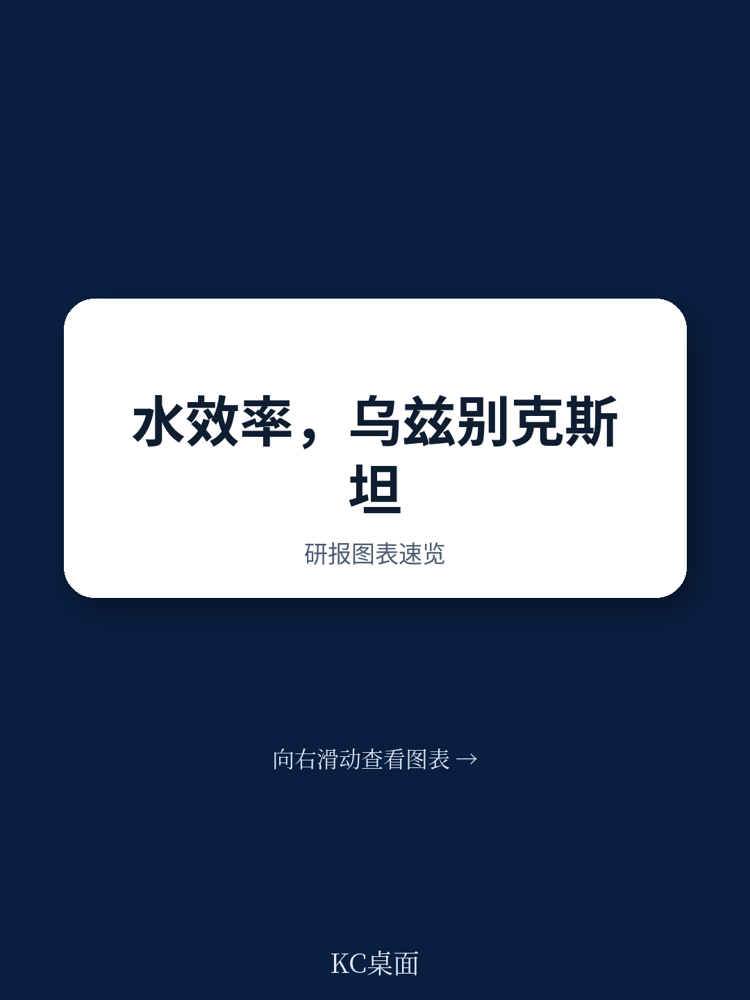
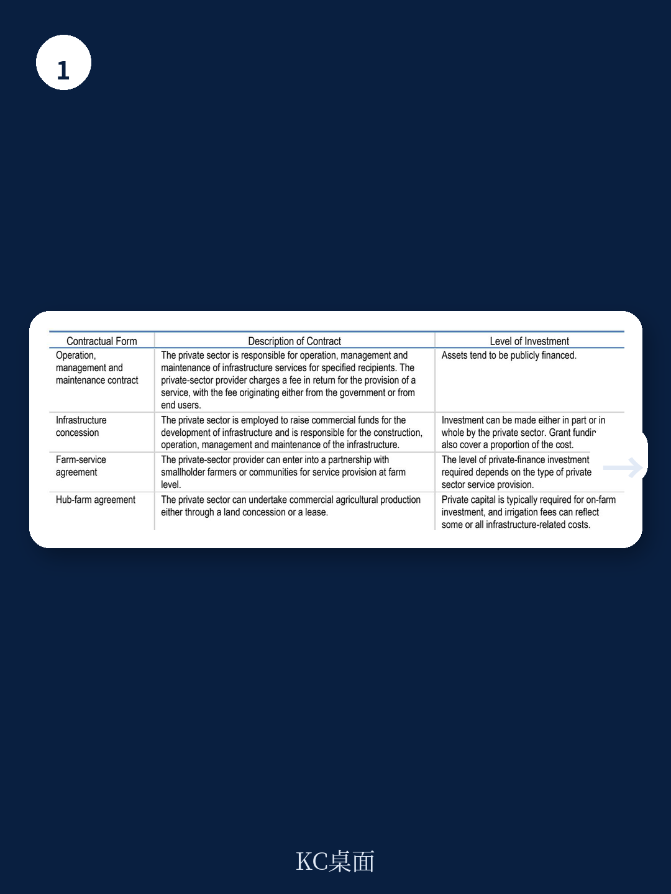
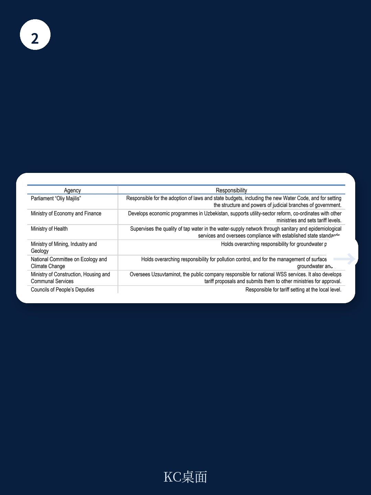

# 经合组织：强化宏观环境资金与技术维度

乌兹别克斯坦是过去三年中亚增长最快的地区之一，年均实际GDP增速约6%。但这个国家正面临一个日益尖锐的矛盾：宏观环境扩张和人口增长正在推高用水需求，而基础设施老化、水价机制僵化、部门间协调不畅，可能反过来制约其实现2030年成为中高收入国家的目标。

经合组织与亚洲水理事会联合发布的这份报告，基于2024至2025年在乌兹别克斯坦开展的国家水对话，系统评估了该国水安全领域的研究环境、公私合作机制和技术应用潜力。报告的核心判断是：乌兹别克斯坦在水效率提升上不缺技术方案，缺的是一个能让研究落地的制度环境。

## 1. 研究环境评分显示：制度碎片化是最大短板

报告采用经合组织开发的“水安全研究环境评分卡”，从四个维度对乌兹别克斯坦进行系统评估。结果显示，该国在宏观宏观环境框架和整体治理层面得分相对较高，但在“水行业政策与治理”维度上存在明显短板。

具体而言，水资源管理涉及多个部委——从宏观环境与财政部、水资源部到建设、住房与公共事业部，再到地方人民代表委员会——职责重叠、程序不清晰。报告特别指出，这种制度碎片化增加了交易成本，也降低了读者信心。更关键的是，数据缺口严重，尤其是在卫生设施覆盖率和运营绩效方面，导致政策制定和研究决策缺乏证据支撑。

> **KC评论：** 评分卡的价值不在于给出一个总分，而在于暴露“看起来不错”的宏观框架与“实际难落地”的行业治理之间的落差。对于任何试图吸引基础设施研究的发展中国家，这个分析框架本身就有参考意义。

## 2. PPP项目落地难，根源在现金流而非法律

乌兹别克斯坦在2019年通过了现代公私合作法，并设立了PPP发展署。政府的目标是在2024至2030年间，通过PPP模式吸引至少300亿美元私人研究进入基础设施领域，其中包括供水和卫生设施。

但现实是，水领域的PPP项目落地数量仍然有限。报告分析了两层原因。第一层是项目结构问题：许多农村供水和灌溉项目规模小、分散，难以打包成财务上可行的PPP。第二层是财务可持续性问题：水价长期偏低，收费率也不高，运营商难以产生稳定的现金流。报告引用的数据显示，乌兹别克斯坦对不同类型用户征收的水资源使用费差异较大，但整体水平不足以覆盖运营和维护成本。

报告建议，PPP模式需要根据水基础设施项目的特点进行调整，而不是简单套用能源或交通领域的模板。同时，需要改善不确定性分配框架和治理机制，提升项目的银行可接受度。

## 3. 技术方案已明确，但落地需要配套能力

报告的技术章节由亚洲水理事会团队撰写，重点考察了韩国水技术经验在乌兹别克斯坦的适用性。识别出的优先技术领域包括：智能监测系统、改进的地下水监测、灌溉和排水管理的数据系统，以及物联网在用水计量中的应用。

但报告也谨慎指出，技术采纳必须伴随培训、研究和机构能力建设。没有运营和维护能力的技术研究，很可能变成闲置资产。这一点在乌兹别克斯坦并非没有先例——过去一些由国际资助的技术项目，因缺乏本地运维能力而未能持续发挥作用。

## 4. 报告提出的行动框架：七个方向，一个逻辑

报告最终给出了一个多支柱的行动计划，涵盖七个方向：明确PPP监管框架、改善PPP治理、消除实施障碍、改革宏观环境工具、提升服务绩效、更新技术标准、扩大教育和培训。

这七个方向并非平行罗列，而是围绕一个核心逻辑展开：要让水安全研究从“政府预算驱动”转向“多元资本参与”，必须先解决制度层面的三个前提——价格信号真实、不确定性分配清晰、数据基础扎实。没有这三个前提，再多的技术方案和PPP法律都难以转化为实际研究。

对于其他面临类似水安全挑战的发展中国家，这份报告提供的不是一套可复制的方案，而是一个可检验的框架：你的水安全研究缺口，到底是缺钱、缺技术，还是缺一个能让钱和技术有效运转的制度环境？
