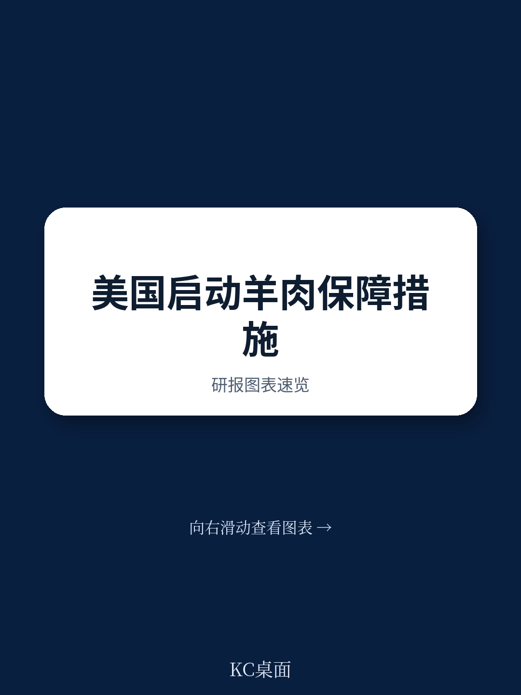

# 世界贸易组织：美国对进口羊肉发起保障调查

2026年7月13日，美国国际贸易委员会应美国贸易代表办公室请求，正式启动对进口羊肉的保障措施调查。这份提交至世界贸易组织的通知显示，调查的触发条件并非来自国内产业请愿，而是由行政机构直接发起。更值得关注的是，调查认定本案“异常复杂”，将严重损害裁决的截止日推迟至2026年11月13日，若结论为肯定，则报告提交总统的最终期限为2027年1月9日。

这一时间表意味着，从调查启动到最终决策，整个流程可能跨越美国中期选举后的权力交接期。政治周期与贸易救济程序的叠加，让这起看似针对单一农产品的案件，具备了超出行业本身的观察价值。

## 1. 进口量增长与国内产业仍在调整已形成可验证的因果关系

调查通知中引用的核心证据链条清晰：进口羊肉在多个来源国供应下持续增长，且价格显著低于美国国内同类产品。报告明确指出，低价进口导致了国内产业的销售损失、收入下降和市场份额流失。

更关键的信号在于结构性变化。通知提到，已有企业完全退出该行业，同时伴随就业岗位减少、产能利用率下降以及盈利能力持续承压。这些指标组合在一起，指向的不是周期性波动，而是产业基础的实质性调整。对于美国羊肉产业而言，进口竞争已从市场不确定性演变为生存威胁。

> **KC评论：** 保障调查不同于反倾销或反补贴，它不要求证明不公平贸易行为，只需证明进口激增对国内产业造成了严重损害。这意味着，即使进口商定价完全合规，只要进口量增长与产业受损之间存在因果关系，调查仍可能成立。这是贸易救济工具中门槛最低、但政治影响最大的一种。

## 2. 调查范围刻意聚焦，排除了活羊和成年羊肉

产品覆盖范围被严格限定为“新鲜、冷藏或冷冻的羔羊肉”，明确排除了活羊和成年羊肉。这一界定在技术上意味着，调查将只针对价值链中附加值最高的加工环节，而非整个羊肉产业链。

从贸易数据角度看，被排除的品类——活羊和成年羊肉——恰恰是澳大利亚和新西兰对美出口的重要组成部分。这种选择性聚焦可能反映了调查发起方的策略考量：将损害论证集中在最容易被进口替代的加工环节，同时避免触发与主要供应国在活畜贸易上的全面摩擦。

## 3. 调查程序预留了“不可预见的发展”这一关键法律变量

通知中有一个容易被忽视的细节：请求方未在初始文件中引用“不可预见的发展”条款，但明确保留了未来要求委员会识别相关因素的权利。这一条款在WTO保障措施争端中具有特殊地位——它要求调查方证明，进口激增是“不可预见的发展”和GATT义务履行的结果。

历史上，多起保障措施案件正是因为未能充分论证“不可预见的发展”而被WTO争端解决机构裁定违规。美国此次在调查启动阶段刻意留白，既可能是程序策略，也可能意味着调查方尚未找到足够有力的外部冲击证据。这一变量将在后续阶段成为各方博弈的焦点。

## 4. 听证会与简报时间表暗示了调查的双阶段结构

调查被明确分为“严重损害”和“救济措施”两个阶段，各自设有独立的听证会和简报截止日。严重损害听证会定于2026年10月16日，预听证简报截止日为10月8日；若损害认定成立，救济措施听证会将在12月1日举行。

这种双阶段设计意味着，即使损害认定在11月完成，救济措施的讨论也将延续至2027年初。对于进口商和出口国而言，真正的不确定性不在于调查本身，而在于最终可能被建议的救济形式——关税配额、附加关税还是数量限制。每一种选择都会对不同供应国的竞争格局产生差异化影响。

这起调查的走向，不仅取决于美国国内产业数据的进一步验证，更取决于WTO框架下“不可预见的发展”条款能否被有效激活。对于依赖对美羊肉出口的国家而言，从现在到2027年1月，将是评估替代市场和调整供应链的关键窗口期。

For informational purposes only. Portions may be generated,translated,summarized,or edited with AI assistance based on source materials and may contain omissions or errors. Please verify independently. This is not investment,legal,tax,accounting,or other professional advice.

