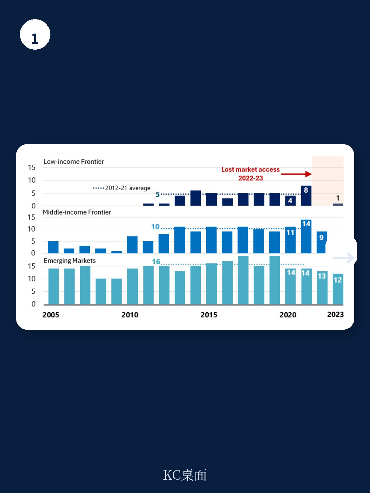
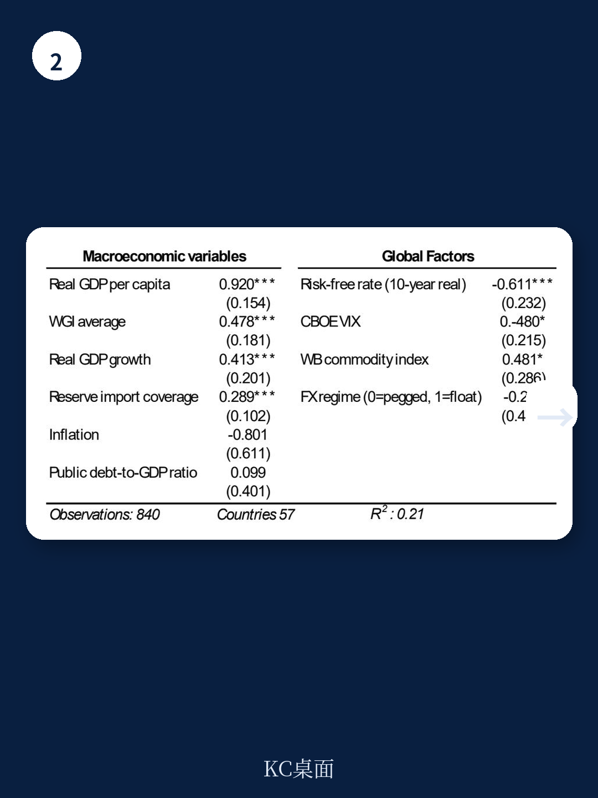

# IMF：前沿地区首次发债后的债务动态

全球流动性宽松时，前沿地区第一次发行欧元债并不难。真正困难的是在发债之后——能否维持市场准入、控制债务积累、避免陷入更深的脆弱性。IMF最新工作论文对2005至2023年间新兴市场和发展中地区的研究显示，多数前沿地区在首次发债后，债务状况并未改善，反而因财政纪律松弛和利息负担加重而出现变化。

该研究将地区分为三类：持续市场准入国（RMACs）、前沿地区（Frontier Economies）和无市场准入国（NMACs）。前沿地区是那些已经发行过欧元债，但市场准入仍不稳固的国家——它们处于“炼狱”状态，尚未进入“天堂”。

## 1. 全球窗口打开，但国内基本面决定谁能进入

研究采用离散时间事件LOGIT模型，分析了57个地区在1980至2024年间首次市场进入的决定因素。结果显示，全球流动性条件——美国实际10年期利率、VIX指数、大宗商品价格指数——确实能打开发行窗口。但真正决定成败的是国内因素：人均实际GDP每提高一个对数单位，市场进入概率提升0.919；治理质量（WGI平均值）每提高一个单位，概率提升0.478；外汇储备（以进口月数衡量）每增加一个月，概率提升0.289。

换句话说，全球流动性是“门票”，但国内基本面才是“入场资格”。那些在窗口期前已经积累了较高收入水平、较好治理能力和充足储备的地区，才能成功利用窗口。

> **KC评论：** 这一结论对当前环境有直接含义。2023年以来全球利率高企，前沿地区几乎无法发行欧元债。当下一轮宽松周期来临时，哪些国家能抓住机会？不是那些最需要资金的国家，而是那些在窗口关闭期间已经改善了基本面的国家。

## 2. 发债后财政纪律反而松弛，债务加速积累

研究对前沿地区进入市场前后的财政行为进行了对比。一个清晰的模式浮现：在进入市场前，各国倾向于约束借贷，以向读者展示信用；但进入市场后，新的融资来源“软化”了支出约束，财政立场趋于宽松。

债务分解显示，进入市场后，前沿地区的债务积累主要由两个因素驱动：初级赤字扩大和利息负担上升。与此同时，利率与宏观环境增长之间的利差（interest-growth differential）收窄并转为负值，这意味着债务动态在出现变化——宏观环境增长不足以覆盖利息成本，债务只能靠新借款来滚动。

研究还发现，无论是使用低收入国家债务可持续性框架（LIC-Frontiers）还是市场准入国家框架（MAC-Frontiers）的前沿地区，这一模式都高度一致。这说明问题不在于框架设计，而在于市场准入本身带来的行为变化。

## 3. 市场准入并未带来增长加速

一个反直觉的发现是：进入国际债券市场后，前沿地区的增长表现并未显著改善。研究比较了进入市场前后这些国家相对于全球平均水平的增长差异，结果没有发现统计上显著的改善。

这意味着，发债筹集的资金并未有效转化为更高的生产能力或基础设施研究。相反，这些资金更多用于填补财政缺口或偿还旧债。当全球资金条件收紧时，这些地区就面临双重不确定性：再融资成本飙升，同时增长动力不足。

> **KC评论：** 这提醒我们，市场准入本身不是目的。真正重要的是发债后的资金使用效率。如果资金没有投向能提升生产率的领域，那么发债只是推迟了调整，而不是解决了问题。

## 4. 对当前政策的启示：建立可信的中期财政框架

研究在结论部分明确指出，前沿地区需要建立可信的中期财政框架、加强债务管理能力、并维持充足的外汇储备缓冲，以管理向市场融资的过渡。

这一建议在当前环境下尤为紧迫。2022至2023年间，前沿地区的欧元债发行几乎停滞，多个国家出现违约或被迫向IMF求助。下一轮全球流动性宽松迟早会到来，但窗口不会永远敞开。那些在窗口关闭期间已经建立了财政纪律和制度能力的国家，才能在窗口重新打开时真正受益。

对于读者而言，区分“能利用窗口”和“只是碰巧赶上窗口”的前沿地区，将是下一轮周期中判断不确定性的关键。
