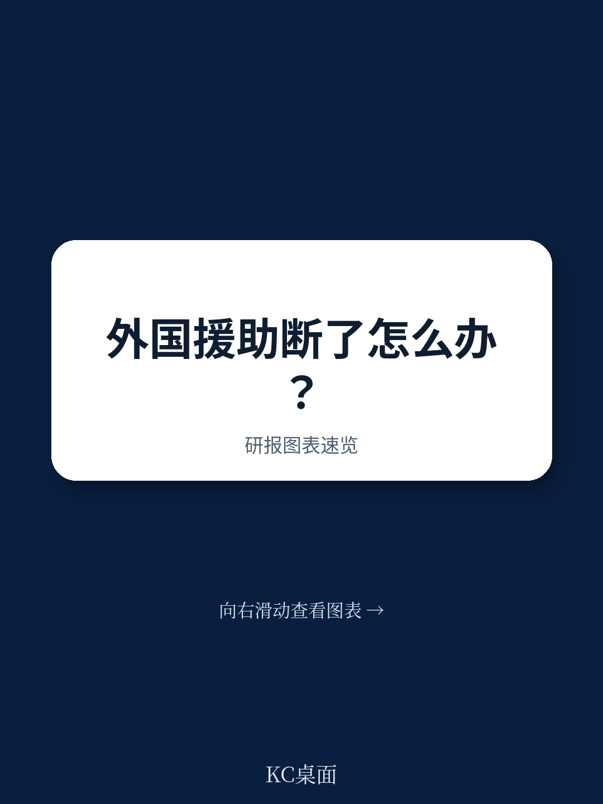
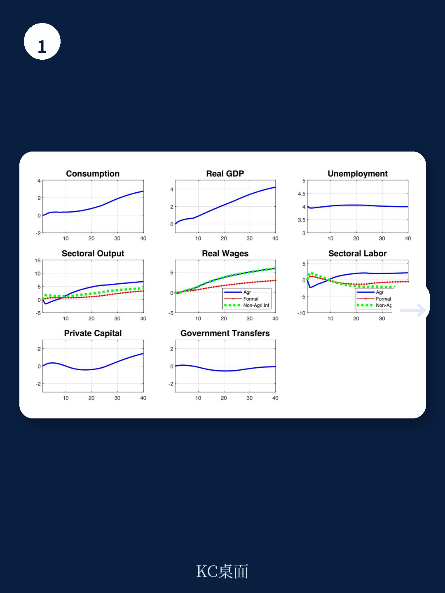
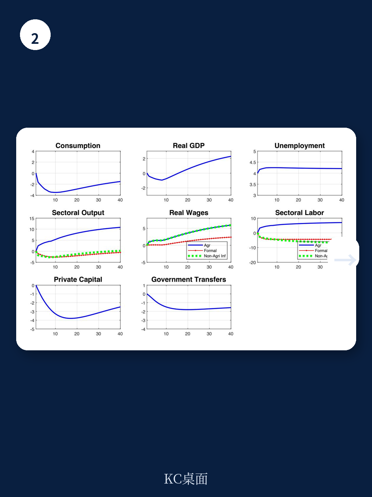

# IMF：援助依赖型地区的三条出路

当援助突然中断，一个高度依赖外部赠款的地区该如何应对？国际货币产品组织（IMF）最新工作论文以利比里亚为校准案例，模拟了3%GDP规模的永久性援助削减，并对比了三种政策回应：完全依赖非优惠借款、渐进式国内收入动员、以及不采取任何补偿措施的直接支出削减。结论清晰但残酷——三种选择都带来代价，但只有一种能在中期痛苦与长期可持续之间找到平衡。

利比里亚的援助依赖程度在低收入国家中属于极端案例。2010至2022年间，其净援助相当于国民总收入的22%，远高于低收入国家11%的平均水平。赠款占GDP的6%至14%，大约相当于政府收入的三分之一。一旦这些资金消失，财政赤字将接近两位数。更关键的是，利比里亚超过90%的外部公共债务已是优惠条件，IMF评估认为其财政可持续性完全建立在持续获得援助和高度优惠融资的基础上。这意味着，转向非优惠借款会迅速推高偿债负担，财政空间极为有限。

> **KC评论：** 利比里亚的极端依赖程度恰好让模型中的政策权衡变得清晰可见。对于其他援助依赖型地区，这个案例提供了一个“不确定性测试”式的参照——如果最坏情况发生，不同政策路径的代价会如何分布。

## 1. 完全依赖借款：短期延续换来长期更深的倒退

如果政府用非优惠借款填补援助缺口，公共研究短期内得以维持。但模型显示，这种“借来的时间”很快会被更高的偿债成本吞噬。到第五年，实际GDP已比基线低约0.8%，私人研究被挤出，失业率上升。更值得关注的是分配效应：基尼系数从0.35升至约0.45，底层十分位的收入增长从基线的8.1%骤降至4.4%，而顶层十分位却因国内债务利息收入获得约1.9%的年增长。这是一种典型的“先延续、后买单”模式——借款把调整不确定性推迟了，但最终由低收入群体承担了不成比例的代价。

## 2. 不补偿的支出削减：最糟糕的路径

如果政府直接削减等额发展支出，模型给出的结果最为悲观。第五年GDP比基线低约1.4%，正式部门产出低约1.2%，私人研究持续仍在调整，实际工资停滞。20年后基尼系数逼近0.59，底层十分位收入增长比基线低约4个百分点。报告将这一模式描述为“由人力与物质资本持续研究不足引发的负向结构转型”。这不是短期阵痛，而是长期发展轨迹的偏离。

## 3. 国内收入动员加过渡性借款：痛苦但唯一可持续的选择

第三种策略是先用非优惠借款作为过渡桥梁，同时分阶段推进国内收入动员改革。模型假设改革在约十年内逐步落地，税收收入最终达到2025年GDP的约13%。中期仍然调整——消费比基线低约3.1%，GDP低约0.7%——但债务趋于稳定，宏观环境活动、工资和部门产出开始恢复。分配效应明显更温和：基尼系数仅升至0.42，并在稳态中回落至约0.32；底层十分位收入增长仅下降约1个百分点，而非借款方案下的2至3个百分点。报告明确将其定位为“次优但清晰的选择”——它保留了核心公共研究，恢复了债务可持续性，同时控制了不平等上升的幅度。

> **KC评论：** 三种方案的核心差异不在于“要不要调整”，而在于“谁承担调整成本”。借款方案把成本推给未来的低收入群体，支出削减方案把成本直接压在当下，而国内收入动员方案试图在时间维度和群体维度上分散负担。模型结果提示，对于援助依赖型地区，调整速度不是越快越好——渐进式改革虽然中期痛苦，但避免了债务陷阱和结构性停滞两个更坏的结局。

## 一个可复用的观察框架

这篇论文的价值不仅在于利比里亚的具体模拟结果，更在于它提供了一个评估援助依赖型地区财政调整的通用框架：任何调整方案都可以从三个维度衡量——债务可持续性、宏观环境增长路径、以及收入分配效应。三个维度之间存在明确替代关系，但并非所有替代都是等价的。报告通过敏感性分析验证了结论的稳健性：在五种不同的增长-分配曲线设定、四种阻尼假设、以及多种尾部假设下，三种方案的排序始终不变。这意味着，结论背后的逻辑——借款方案“先甜后苦”、支出削减“全面出现变化”、国内收入动员“中期痛苦但长期可持续”——并非模型假设的产物，而是援助依赖型地区结构性约束的必然结果。

对于正在经历援助波动或考虑财政改革的地区而言，这个框架提供了一个比“紧缩还是刺激”更精细的决策坐标系。
