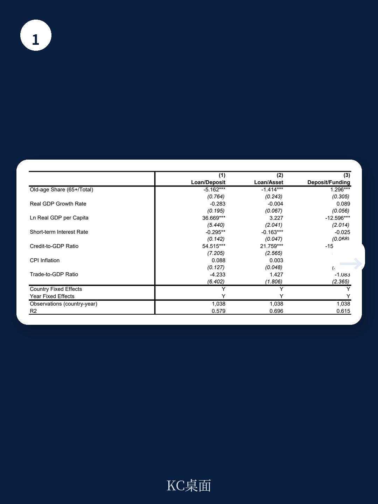
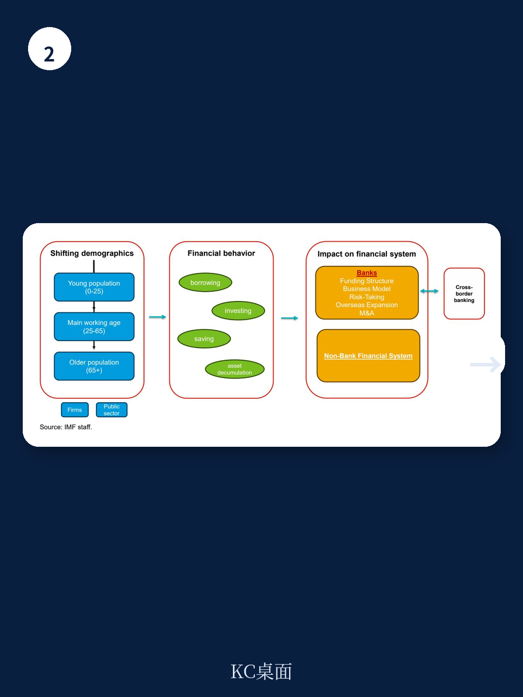

# IMF：亚洲老龄化重塑银行业-家庭存款增贷款降

亚洲的银行体系正在经历一场结构性的底层变化，而驱动因素并非利率或监管，而是人口。国际货币产品组织（IMF）最新工作论文《Graying Asia:How Aging Is Reshaping Banking》提供了一个清晰的传导链条：老龄化改变家庭资金行为，家庭行为改变银行资产负债表的配置，进而影响整个资金体系的稳定与跨境资本流动。这不是一个遥远的预测，报告用日本、韩国、中国等地区的数据表明，这一过程已经发生。

报告的核心判断是：随着老年人口占比上升，银行的贷款对存款比率和贷款对资产比率系统性下降，资产从传统贷款转向非贷款类资产，而这些资产并不必然更安全。对于以银行为主导的亚洲资金体系，这意味着盈利模式、不确定性轮廓和监管框架都需要重新审视。

## 1. 家庭行为变化是银行资产负债表调整的起点

报告从六个亚太地区的家庭调查数据出发，验证了一个经典但常被忽略的规律：随着年龄增长，家庭的杠杆率下降，存款偏好上升，不确定性资产配置减少。在日本和韩国的数据中，65岁以上家庭的存款占资金资产比重显著高于中年群体，而负债参与率则明显走低。

这一行为模式直接传导至银行端。当老年家庭更多存款、更少借贷，银行的负债端变得充裕，但资产端的优质贷款需求却在减少。报告通过国家层面的面板数据分析确认，老年人口占比每上升1个百分点，银行的贷款对存款比率下降约4-5个百分点。这个弹性系数在亚洲银行主导型地区中更为显著。

> **KC评论：** 很多人以为银行“钱多”是好事，但报告揭示了一个矛盾：存款增长若没有对应的贷款需求，银行要么降低息差，要么被迫将资金配置到不确定性更高的非贷款资产上。这才是老龄化对银行真正的不确定性点。

## 2. 银行资产“脱贷”不等于更安全，不确定性可能被重新定价

报告的一个重要发现是，老龄化导致的资产结构变化并非简单的“从贷款转向安全资产”。数据显示，银行在老龄化不确定性下确实减少了贷款占比，但增加的并非国债或现金，而是更多投向债券、同业资产和其他资金工具。这些资产的信用不确定性和流动性不确定性并不比贷款低，尤其是在新兴市场。

IMF的分析进一步指出，在银行主导型地区中，贷款对资产比率的下降幅度反而小于市场主导型地区。这意味着，亚洲的银行在老龄化面前，调整资产结构的速度更慢、路径更窄，可能积累更多隐性不确定性。报告引用Doerr等人（2024）的研究，提示老龄化可能激励银行为了维持盈利而承担额外不确定性——即“追逐收益”行为。

## 3. 跨境资金正在从“老”地区重配向“年轻”市场

报告提供了一个此前文献较少涉及的角度：人口结构的差异正在驱动跨境银行资产的重新配置。随着日本、韩国、中国等地区加速老龄化，银行和机构读者开始将资金向仍处于“早期人口红利”阶段的地区转移，如菲律宾、孟加拉国、印度尼西亚等。

这一趋势在IMF的跨境资产配置数据中得到验证。报告发现，银行的跨境贷款和组合观察更倾向于流向年轻人口占比高的地区。这种“资金跟着人口走”的逻辑，意味着老龄化地区可能面临资本外流不确定性，而年轻地区则获得额外的外部融资支持。但报告也提醒，这种流动可能加剧全球资金周期的分化，增加新兴市场的资本流入波动性。

> **KC评论：** 跨境资金重配的启示在于，人口结构正在成为全球资产配置的一个长期因子。对于亚洲的监管机构而言，既要关注国内银行在老龄化下的不确定性演变，也要留意跨境资本流动对本国资金稳定的影响——尤其是当资金从“老”地区撤出时，是否会造成本地信贷调整。

## 4. 银行主导型资金体系面临更大的调整不确定性

报告特别区分了银行主导型与市场主导型地区在老龄化冲击下的差异。亚洲多数新兴市场属于前者。数据显示，在银行主导型地区中，老龄化对贷款对存款比率的谨慎影响更大，而存款对融资比率的上升也更明显。这意味着，银行的盈利空间被进一步压缩——存款成本相对刚性，而贷款收益却在下降。

同时，银行主导型地区的贷款对资产比率下降幅度较小，说明这些银行更难以通过资产多元化来对冲贷款需求调整的影响。报告认为，这可能导致银行在资产端积累更多期限错配或信用不确定性，尤其是在利率环境变化时。

对于政策制定者而言，报告的隐含建议是：老龄化不是短期周期问题，而是需要从资金监管框架层面做出回应的结构性变量。银行不确定性测试、资本充足率要求和跨境监管协调，都需要纳入人口预测作为长期情景参数。

---

For informational purposes only. Portions may be generated,translated,summarized,or edited with AI assistance based on source materials and may contain omissions or errors. Please verify independently. This is not investment,legal,tax,accounting,or other professional advice.

