REPORT

KINGDOM OF LESOTHO

Public Investment Management Assessment (PIMA)

APRIL 2026

Prepared By

Ian Hawkesworth, Sybi Hida, Amitabh Tripathi, Garret Doocey, June Nyakahuma, Zhang Qianqian, Jack Ree, Mosito Ntema, and Tesfaye Ayele (World Bank)

Authoring Department

Fiscal Affairs Department

The contents of this document constitute technical advice provided by the staff of the International Monetary Fund to the authorities of Lesotho (the “CD recipient”) in response to their request for technical assistance. Unless the CD recipient specifically objects to such disclosure, this document (in whole or in part) or summaries thereof may be disclosed by the IMF to the IMF Executive Director for the Kingdom of Lesotho, to other IMF Executive Directors and members of their staff, as well as to other agencies or instrumentalities of the CD recipient, and upon their request, to World Bank staff, and other technical assistance providers and donors with legitimate interest (see Staff Operational Guidance on the Dissemination of Capacity Development Information). Publication or Disclosure of this report (in whole or in part) to parties outside the IMF other than agencies or instrumentalities of the CD recipient, World Bank staff, other technical assistance providers and donors with legitimate interest shall require the explicit consent of the CD recipient and the IMF’s Fiscal Affairs Department.

This technical assistance (TA) was provided with financial support from the GPFP Trust Fund.

Choose an item.

3. PUBLIC INVESTMENT MANAGEMENT INSTITUTIONS 21
A. The PIMA Framework 21
B. Overall Assessment 22
C. Investment Planning 23
D. Investment Allocation 32
E. Investment Implementation 42

## Contents

ABBREVIATIONS AND ACRONYMS 5

PREFACE 6

EXECUTIVE SUMMARY 7

RECOMMENDATIONS 11

1. PUBLIC INVESTMENT IN LESOTHO 13

A. Trends in Public Investment and Capital Stock 13

B. Drivers of Capital Spending 15

C. Financing of Public Investment 16

2. THE EFFICIENCY OF PUBLIC INVESTMENT 18

4. CROSS-CUTTING ISSUES 52

A. Legal and Regulatory Framework 52

B. Information Technology 53

C. Capacity 55

## Boxes

1. History of National Strategic Development Plans in Lesotho 26

2. How to Tailor Project Appraisal to the Size of the Project \_\_\_\_ 30

3. A Simple Method to Estimate the Aggregate Need for Maintenance Spending \_\_\_\_ 38

4 Example of Project Selection Criteria 40

5. Example of Performance Audit – New Royal Palace 48

6: Lesotho: Weaknesses in Asset Management identified in Audit Reports 49

7. Example of Public – Private Engagement Structures to Improve Capital Project Delivery \_\_\_\_ 56

## Figures

1. Design and Effectiveness Scores for Lesotho 9

2. GDP Per Capita 13

3 Lesotho Public Expenditure 13

4. Lesotho: Public and Private Investment in Lesotho 14

5. Public Investment in Lesotho and \_\_\_\_ 14

6. Lesotho: Current and Capital Sending 14

7. Current Spending vs. Capital 14

8. Lesotho: Public Investment and Capital Stock 15

9. Public Capital Stock per Capita: Comparison with Peers, 2019 \_\_\_\_ 15

10. Revenue and Capital Expenditure 16

11. Capital Expenditure Drivers 16
12. Lesotho: Capital Expenditure 16
13. Capital Expenditure, 1990-2024 16
14. Lesotho: Capital Expenditure by Financing Sources 17
15. Public Capital and External Debt, 1990 – 2019 17
16. Measures of Physical Access to Infrastructure, 2007-2019 18
17. Perception of Infrastructure Quality, 2007-2019 18
18. Access to Electricity, 2000-2022 19
19. People Using at Least Basic Drinking Water Services, 2000-2022 19
20. Fixed Broadband Subscriptions, 2000-2023 19
21. Mobile Cellular Subscriptions, 2000-2022 19
22. Efficiency Frontier, Hybrid Indicator 20
23. Efficiency Gap, Hybrid Indicator 20
24. PIMA Framework 21
25. Design of Public Investment Management Institutions 22
26. Effectiveness of Public Investment Management Institutions 23
27. Lesotho Public Debt, 2010-2024 25
28. Lesotho Actual and Projected Budget Deficit, FY2015/16-FY2026/27 25
29. Project Appraisal in Lesotho 29
30. Lesotho: MTFF Capital Expenditure Projections Versus Budget, 2020/21 – 2025/26 33
31. Lesotho GoL Capital Ceilings, Budget and Actuals, 2020/21 – 2025/26 33
32: Budget Allocations 35
33. Projects in Key Sectors in the FY 2025/26 Budget. 41
34: Cash Inflow and Outflow Forecast vs Actuals 43
35. Capital Budget Execution Rates – 46

## Tables

1. PIMA Summary Assessment for Lesotho 10  
2. PIMA Recommendations 11  
4. Actuals and Budget of Recurrent and Capital Maintenance Spending, FY2020/21 37  
5. Capital and Rehabilitation Projects, FY2024/25-FY2027/28, In Maloti 38  
6 Project Selection Criteria—Basic Practice 40  
7. Existing and Pending Legislation Relevant to Public Investment Management in Lesotho 53

## Annexes

1. PIMA Action Plan \_\_\_\_ 58
2. Detailed Scores \_\_\_\_ 63
3. Lesotho Highland Water Project (LWHP) \_\_\_\_ 64
4. PIMA Questionnaire \_\_\_\_ 66
5. Example of a Format to Include Total Project Costs and \_\_\_\_ 74

## Abbreviations and Acronyms

<table><tr><td>CLs</td><td>Contingent Liabilities</td></tr><tr><td>EBU</td><td>Extra-Budgetary Entities</td></tr><tr><td>GoL</td><td>Government of Lesotho</td></tr><tr><td>LIDC</td><td>Low-Income Developing Country</td></tr><tr><td>IFMIS</td><td>Integrated Financial Management Systems</td></tr><tr><td>IPSAS</td><td>International Public Sector Accounting Standards</td></tr><tr><td>NSDP</td><td>National Strategy Development Plan</td></tr><tr><td>MDAs</td><td>Ministries, Departments and Agencies</td></tr><tr><td>MoFDP</td><td>Ministry of Finance and Development Planning</td></tr><tr><td>MTFF</td><td>Medium-Term Fiscal Framework</td></tr><tr><td>PCs</td><td>Public Corporations</td></tr><tr><td>PFM</td><td>Public Financial Management</td></tr><tr><td>PFMA</td><td>Public Financial Management and Accountability Act</td></tr><tr><td>PSIC</td><td>Public Sector Investment Committee</td></tr><tr><td>PSIP</td><td>Public Sector Investment Program</td></tr><tr><td>SACU</td><td>Southern African Customs Union</td></tr><tr><td>SADC</td><td>Southern African Development Community</td></tr><tr><td>SNGs</td><td>Subnational Governments</td></tr><tr><td>SOE</td><td>State-Owned Enterprise</td></tr><tr><td>SSA</td><td>Sub-Saharan Africa</td></tr></table>

## Preface

At the request of the Ministry of Finance and Development Planning (MoFDP) of Lesotho, a team from the IMF's Fiscal Affairs Department (FAD) undertook a Public Investment Management Assessment (PIMA) during the period July 15-28, 2025. The mission team was led by Ian Hawkesworth and comprised Sybi Hida (both FAD), Amitabh Tripathi (Afritac South), Mosito Ntema (AFR), Tesfaye Ayele (World Bank), Garret Doocey, June Nyakahuma (both FAD experts). Qianqian Zhang and Jack Ree (both AFR) supported the mission remotely.

The mission met with Ms. Nthoateng Lebona, Principal Secretary, Ministry of Finance and Development Planning. Other senior MoFDP officials met by the mission included Ms. Masesibi Macheli, Deputy Budget Controller; Ms. Mabakubung Pitso, Ms. Retsepile Mosenene (Deputy Accountant Generals); Mr. Mothobi Letooane, Director, Project Cycle Management; Ms. Libako Leisanyane, Director, Macro Economic Planning; and Mr. Khotso Moleleki, Director, Debt Management.

The mission conducted meetings with ministries, departments and agencies (MDAs) involved in public investment management in Lesotho. Within the MoFDP, the mission held meetings with the departments of Macro Economic Policy, Treasury, Budget, State Owned Enterprise (SOE) Oversight and Fiscal Risk Management, Debt, Aid Coordination, PPP Unit, Project Cycle Management, Policy and Strategic Planning, and Monitoring and Evaluation. Additionally, the mission met with the Katiso Ntoane, Deputy Principal Secretary, Ministry of Public Works and Transport; Masebele Mponye, Commissioner of Lands, Department of Land Survey and Physical Planning and officials from the Ministry of Energy, the Ministry of Local Government and Chieftainship, the Ministry of Trade and Industry, and the Maseru City Council.

The mission team also met with a number of statutory bodies, special authorities and state-owned enterprises including Ms.Gail Mathabo Makenete, Auditor General; Mr. Lebekoane Ntoi, Chief Executive Officer, Public Procurement Authority; Teboho Mokhoane, Managing Director, Roads Directorate; Mats'epang Sekhokoane, Chief Executive Officer, Road Fund; and officials from the Lesotho Energy & Water Authority, the Lesotho Electricity Company and the Water & Sewerage Company. The mission team also held a meeting with Development Partners after the close of the mission.

The mission team would like to thank the Lesotho government for its cooperation and the participation of officials in constructive discussions during the mission and provide a special thanks to Mosito Ntema and Mpati Mphatsoe from the local IMF Office for supporting the mission. The mission would like to express its appreciation and gratitude to Mannete Seoli, Senior Economist and Nthati Moqecho, Economist, MoFDP for coordinating all the mission activities and providing logistical support.

## Executive Summary

Lesotho has sustained a high level of public investment over many years, but this has not translated into durable infrastructure or strong growth outcomes. Despite capital spending averaging around 10 percent of GDP, well above regional and low-income country peers, economic growth has remained weak and volatile, and GDP per capita remains among the lowest in the region. At the same time, the public capital stock has steadily eroded, declining sharply since the early 2000s, even as infrastructure gaps remain large. The central challenge facing Lesotho is therefore not the volume of public investment, but the effectiveness with which investment spending is planned, allocated, and implemented.

High public investment in Lesotho has been supported by periods of favorable financing conditions rather than by strong public investment institutions. Large and volatile Southern African Customs Union (SACU) transfers, together with capital grants - most notably for the Lesotho Highlands Water Project - have provided substantial fiscal space for investment without requiring sustained domestic revenue mobilization or extensive debt financing. While this has enabled high levels of capital spending, it has also weakened incentives to strengthen project preparation, budgeting discipline, and implementation capacity. As a result, increases in public investment have not been accompanied by commensurate improvements in infrastructure quality or durability.

Infrastructure outcomes in Lesotho remain weak relative to the scale of investment, reflecting low efficiency and persistent implementation bottlenecks. Access to electricity and basic services has improved only gradually, and service quality remains uneven, despite sustained capital spending. Lesotho's public investment efficiency gap is estimated at around 49 percent (2019), indicating that the country derives substantially less infrastructure output from its capital stock than more efficient peers. These weak outcomes are closely linked to low budget execution: on average, only about half of budgeted capital spending has been executed in recent years. Persistent under-execution has delayed project completion, weakened service delivery, and contributed to the erosion of the public capital stock, making execution failures the most immediate and binding constraint on the impact of public investment.

The assessment follows the standard PIMA approach, which evaluates 15 key public investment management “institutions” across the three stages of the investment cycle (planning, allocation, and implementation). Each institution is scored on both institutional design (the existence of rules, procedures, and organizational arrangements) and effectiveness (how well these arrangements work in practice), and the results are summarized to highlight the main strengths, weaknesses, and reform priorities (see Figure 1 and Annex 2).

These weak outcomes reflect broad-based shortcomings across the public investment management framework, with both institutional arrangements and their implementation remaining weak. The design of laws is stronger than its effective implementation, but the core issue encompasses both. While elements of the formal architecture for planning, budgeting, and implementing public investment are in place, they are incomplete, unevenly applied, and constrained by limited capacity across ministries. As a result, projects often enter the budget without being fully prepared, prioritized, or costed; funding is not predictable or sufficiently protected during implementation; and there is limited active management of the investment portfolio once projects are underway. Rather than a narrow gap between rules and practice,

Lesotho faces a system-wide weakness across the investment cycle, which helps explain persistently low execution and the limited translation of high investment spending into completed, durable infrastructure.

Compared with Sub-Saharan African and low-income developing country peers, Lesotho's public investment management framework underperforms somewhat both in design and in practice. While coordination mechanisms and elements of budget coverage are comparable to regional norms, effectiveness is weaker in national and sectoral planning, multi-year budgeting, project selection, availability of funding, portfolio management, and project implementation. These gaps are most pronounced in the downstream stages of the investment cycle, where weaknesses in execution, oversight, and active portfolio management limit the impact of public investment. As a result, despite investment levels that exceed those of many peers, Lesotho derives less infrastructure output from its spending than countries with stronger implementation capacity.

There are three key interconnected findings coming out of this report:

\- First, low budget execution is the most immediate and binding constraint on the impact of public investment: on average, only about 53 percent of budgeted capital spending has been executed over the past three fiscal years, despite reallocations and available fiscal space.

Second, weaknesses are evident across the investment cycle rather than concentrated in a single stage. In particular, projects often enter the budget without being fully appraised or costed; medium-term capital ceilings differ markedly from final budget allocations; and the release of funds to ongoing projects is not timely or predictable, with payments subject to cash rationing, delays, and the accumulation of arrears, resulting in stop-start implementation and repeated delays.

Third, limited institutional capacity and weak enforcement of existing processes constrain the system's ability to correct these problems in-year, including through effective portfolio monitoring and timely reallocation.

The proposed reform agenda focuses on strengthening execution and funding predictability through reforms to project preparation and budgeting to ensure that public investment translates more reliably into completed, durable infrastructure. The recommendations therefore focus on improving infrastructure outcomes by (i) strengthening the planning framework and project pipeline, (ii) establishing a firmer basis for appraisal and transparent project selection, (iii) improving multiyear capital budgeting and disclosure of total project costs to better fund ongoing projects, and (iv) tackling the most immediate execution constraints through operational procurement, improved cash and commitment controls, and stronger monitoring and performance-based reallocations—underpinned by enhanced audit transparency and better asset information.

Addressing the key issue of under execution means raising Lesotho's absorption capacity. In practice, this requires a sequenced focus on the binding constraints that most directly prevent budgeted funds from being converted into completed projects. Near-term priorities should therefore center on getting procurement fully operational and improving funding predictability for ongoing projects. Next, strengthening appraisal and selection and improving planning will raise “quality at entry” and reduce the risk of future stoppages. Finally, stronger portfolio monitoring, clearer performance-based reallocation procedures, and enhanced transparency and asset information will help identify blockages early, enable timely course-correction, and shift resources toward projects that can be implemented.

Figure 1. Design and Effectiveness Scores for Lesotho  
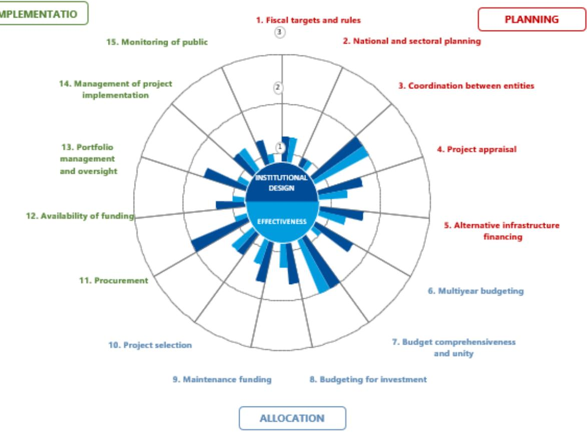

Table 1. PIMA Summary Assessment for Lesotho

<table><tr><td colspan="3">Phase/Institution</td><td>Institutional Strength</td><td>Effectiveness</td><td>Reform priority</td></tr><tr><td rowspan="5">A. Planning</td><td>1</td><td>Fiscal targets and rules</td><td>LOW. No debt target and fiscal rules; an MTFF distinguishes between capital and current and new projects.</td><td>LOW. MTFF does not anchor the budget and capital budget deviates significantly from medium-term ceilings.</td><td>Low</td></tr><tr><td>2</td><td>National and sectoral planning</td><td>LOW. Limited coverage of projects in strategies, no requirement for costing, no performance targets in plans.</td><td>LOW. Few projects in budget that are also in plans, no costings, performance targets not used.</td><td>High</td></tr><tr><td>3</td><td>Coordination between entities</td><td>MEDIUM. Requirement for SNG to share plans; transfers not rules based; requirement to report but not publish CLs.</td><td>MEDIUM. Plans submitted account for most investments; no predictable transfers and some CLs reported to Government.</td><td>Low</td></tr><tr><td>4</td><td>Project appraisal</td><td>MEDIUM. No legally mandated mechanism for systematic appraisal of projects, a standard methodology exists and it includes risk assessments.</td><td>LOW. Some projects undergo appraisal, standard methodology applied but gaps in appraisal quality and rigor of risk assessments.</td><td>High</td></tr><tr><td>5</td><td>Alternative infrastructure financing</td><td>MEDIUM. Competition supported in some markets; PPP lacks framework; no requirement for central oversight of SOE investment plans.</td><td>LOW. Significant private participation in several markets. One PPP only. SOE investment programs not overseen.</td><td>Low</td></tr><tr><td rowspan="5">B. Allocation</td><td>6</td><td>Multi-year budgeting</td><td>MEDIUM. Aggregate projections and non-binding ceilings by ministry are issued, costs of major projects are not published.</td><td>LOW. Budgets deviate significantly from spending projections; same for ceilings vs actuals and cost changes not explained.</td><td>Medium</td></tr><tr><td>7</td><td>Budget comprehensive-ness and unity</td><td>MEDIUM. Requirement for EBE investments, external funded in budget; capital and recurrent budgets are presented together.</td><td>MEDIUM. EBE, donor funds included, but some recurrent costs are reviewed during budget preparation.</td><td>Low</td></tr><tr><td>8</td><td>Budgeting for investment</td><td>MEDIUM. Total project costs are not in budget, restricted reallocation from capital and prioritization of ongoing projects.</td><td>LOW. Total project costs not in budget, but two outer years included, reallocation is not significant but major ongoing projects do not receive sufficient allocations.</td><td>Medium</td></tr><tr><td>9</td><td>Maintenance funding</td><td>MEDIUM. No standard methods for assessing routine or major maintenance; maintenance spending code in budget.</td><td>LOW. Insufficient funding for current and capital maintenance. Most funding is identified in the budget.</td><td>Medium</td></tr><tr><td>10</td><td>Project selection</td><td>LOW. No central review or standard criteria for selection, pipeline of appraised projects is mandated but not exclusively used.</td><td>LOW. No projects sent back from review, no criteria to be applied, most projects in budget in pipeline but retrofitted at times.</td><td>High</td></tr><tr><td rowspan="5">C. Implementation</td><td>11</td><td>Procurement</td><td>MEDIUM. Requirement of competitive procurement, no database; and requires an independent complaints body.</td><td>LOW. No evidence of competition for major projects, effective database. Independent complaints system is not yet in operation.</td><td>High</td></tr><tr><td>12</td><td>Availability of funding</td><td>LOW. Requirements for quarterly forecasts; no mechanism for timely funds release or for integration of external financing.</td><td>LOW. Forecasts are not reliable; there has been a large stock of arrears on capital projects and delays in reporting on access and release of external funds.</td><td>High</td></tr><tr><td>13</td><td>Portfolio management and oversight</td><td>MEDIUM. Requirement for project monitoring; reallocation possible; no formal requirement for ex post reviews.</td><td>LOW. Only partial data on delays, costs; capital execution rates low and ex post reviews not systematically conducted.</td><td>Medium</td></tr><tr><td>14</td><td>Management of project implementation</td><td>LOW. Project implementation plans are required; no standard adjustment rules; no SAI publication of ex post audits.</td><td>LOW. Most projects have plans, project adjustments not analyzed; limited SAI audits completed.</td><td>High</td></tr><tr><td>15</td><td>Monitoring of public assets</td><td>LOW. Asset registers required; accounting framework does not require values or depreciation to be reported.</td><td>LOW. Asset registers are limited in coverage and not updated, and financial statements do not reflect asset stock values or depreciation.</td><td>Medium</td></tr></table>

## Recommendations

Table 2. PIMA Recommendations

<table><tr><td colspan="3">Investment Planning</td></tr><tr><td>1</td><td>Update the NSDP to cover the main infrastructure sectors (energy, transport, water, education and heath care) including major infrastructure projects, with indicative costing and output targets.</td><td>MoFDP by Q1 2027.High</td></tr><tr><td>2</td><td>Introduce a rules-based system for capital transfers for key SNG investment programs to encourage medium-term planning and increase delivery efficiency.</td><td>MoFDP, Ministry of Local Government, Q2 2026.Low</td></tr><tr><td>3</td><td>Update the PFMA Act with a requirement that PCs include their investment plans in the mandated report to the MoFDP on activities for the next three years. Attach an annex to the Budget Estimates Book containing major investment projects of PCs.</td><td>MoFDP Q1 2026.Low</td></tr><tr><td colspan="3">Investment Allocation</td></tr><tr><td>4</td><td>Strengthen the budgeting for capital: i) require that the capital ceiling and final appropriation by ministry is aligned with the MTFF projections. All financing sources should be included; ii) include total costs of projects and their annual expenditures in the Budget Estimates Book (Budget year + medium term); iii) review the funding needs of ongoing projects to ensure that allocations are sufficient</td><td>MoFDP Q3 2025.Medium</td></tr><tr><td>5</td><td>Develop and formalize a framework for estimating routine maintenance and capital improvement needs and prepare a funding strategy. Publish them on the MoFDP website.</td><td>MDAs and MoFDP by Q3 2026.Medium</td></tr><tr><td>6</td><td>Mandate in law i) MoFDP must ensure major projects are fully appraised before being included in the pipeline for selection and ii) a selection process with use of standard criteria. Specific criteria can be defined in secondary regulation according to needs of the government. g (MoFDP by Q1 2026).</td><td>MoFDP by Q3 2025.High</td></tr><tr><td colspan="3">Investment Implementation</td></tr><tr><td>7</td><td>Operationalize the Public Procurement Act by finalizing implementing regulations and staff the Public Procurement Authority and Tender Board.</td><td>MoFDP, Q3, 2025. High</td></tr><tr><td>8</td><td>Improve cash availability for capital projects that have been prioritized. Enhance the IFMIS internal control framework, including commitment management and payment processing, to ensure timely payments for capital projects.</td><td>Accountant General Q4, 2026. High</td></tr><tr><td>9</td><td>Strengthen portfolio monitoring of major projects by requiring MDAs to monitor delivery against the total approved project schedule, and to notify the MoFDP in the event of project delays; review project delivery structures across MDAs to ensure alignment with best practice.</td><td>MDAs, MoFDP, Q3, 2026. Medium</td></tr><tr><td>10</td><td>Develop transparent rules and procedures regarding reallocations.</td><td>MoFDP, Q4 2026. Low</td></tr><tr><td>11</td><td>Provide sufficient financing resources to the Office of Auditor General to fill its vacancies and build capacity to implement its mandate and legally empower the Auditor General to submit directly to the legislature and publish the audit reports.</td><td>GoL, MoFDP, Q4 2026. High</td></tr><tr><td>12</td><td>Establish, update, and disclose a consolidated register of major government assets with information about the type of assets, owner, location, initial value and current value..</td><td>MoFDP, MDAs, Q3 2027. High</td></tr><tr><td></td><td>Cross-Cutting Issues</td><td></td></tr><tr><td>13</td><td>Develop a medium-term PIM capacity development strategy reviewing roles, responsibilities and skills, training needs and IT updates.</td><td>MoFDP, Q1 High</td></tr></table>

## 1. Public Investment in Lesotho

## A. Trends in Public Investment and Capital Stock

1. Lesotho has been facing economic challenges during the last decade. It has one of the lowest GDP per capita in Sub-Saharan Africa (SSA) and below low-income developing country (LIDC) median (Figure 2). While its income convergence with peers was broadly on track until 2010, Lesotho has since fallen behind. Its growth rate, once higher than SSA peers until the mid-1990s, has since declined and become more volatile. Unlike other BENL $^{1}$ countries, Lesotho did not transform its economy in the 2000s. Real per capita income shrank by 14 percent between 2016 and 2023. In 2024, Lesotho recorded a fiscal surplus of 9 percent of GDP—among the highest globally. This exceptional surplus was driven by record-high Southern African Customs Union (SACU) transfers and increased water royalties from South Africa following price renegotiations. $^{2}$ Some of these windfall revenues are expected to persist, supporting medium-term fiscal surpluses. However, Lesotho’s government expenditure remains disproportionately high and has been on a steady upward trend since 1990 (Figure 3).

Figure 2. GDP Per Capita (In Purchase Power Parity, USD)

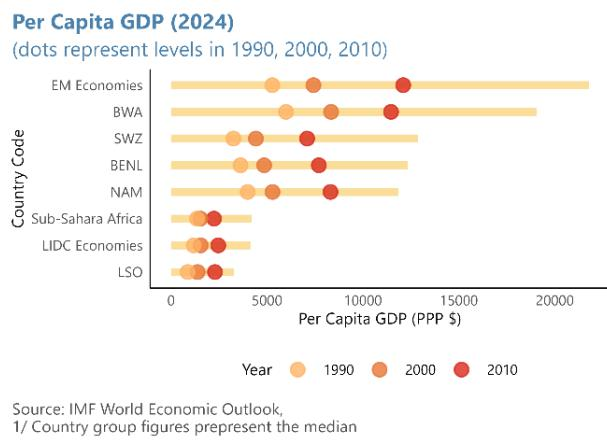  
Figure 3 Lesotho Public Expenditure (In percent of GDP)

Sources: Staff estimates based on official data.  
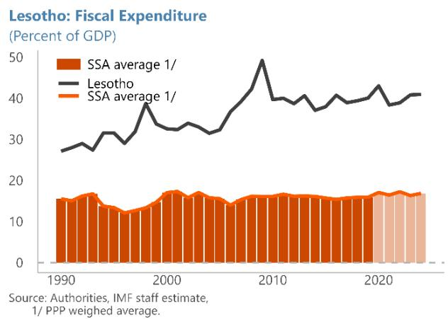  
Sources: Staff estimates based on official data.

2. Historically, Lesotho's public investment has been relatively high. Public investment peaked at 41 percent of GDP in 1994, declined to about 5 percent in 2006, and gradually recovered to around 10 percent in recent years. Private investment has shown a similar trend, albeit with less volatility, decreasing from an average of 25 percent of GDP in the 1990s to about 15 percent in 2024 (see Figure 4). Despite its fluctuations, Lesotho's capital expenditure has consistently surpassed the Sub-Saharan Africa (SSA) average. Since the mid-1990s, public investment levels have been significantly higher than the SSA average, nearly twice as high in terms of percentage of GDP (see Figure 5).

Figure 4. Lesotho: Public and Private Investment in Lesotho (Nominal in percent of GDP)  
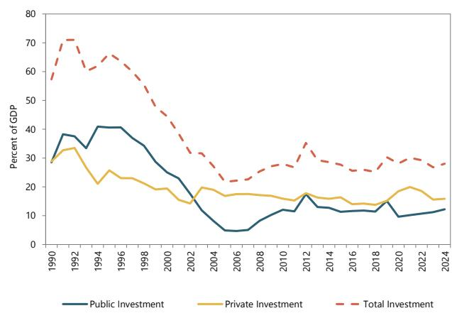  
Sources: Staff estimates based on official data.

Figure 5. Public Investment in Lesotho and SSA (Nominal in percent of GDP)  
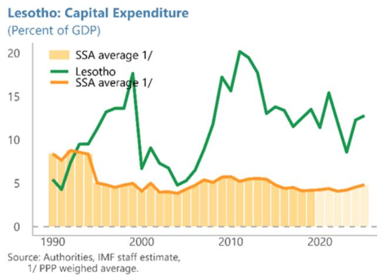  
Sources: Staff estimates based on official data.

3. Capital and current spending have historically moved in tandem, with synchronized cycles. However, since 2010, their trends have diverged: capital spending has moderated, while current spending has continued to rise (Figure 6). Over the long term (1990–2024), both spending categories have averaged about twice the LIDC median, although their relative shares in overall expenditure are broadly aligned with LIDC norms (Figure 7).

Figure 6. Lesotho: Current and Capital Sending (In percent of GDP)  
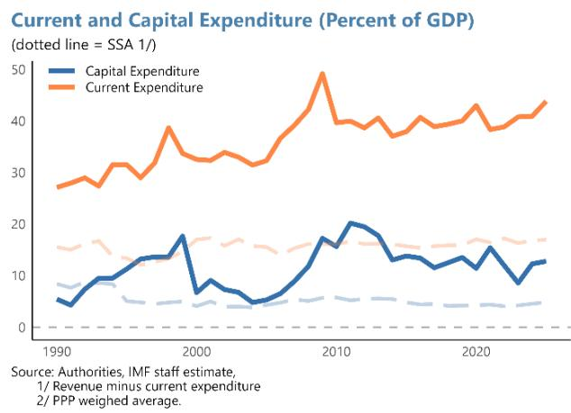  
Figure 7. Current Spending vs. Capital Spending (Nominal in percent of GDP)

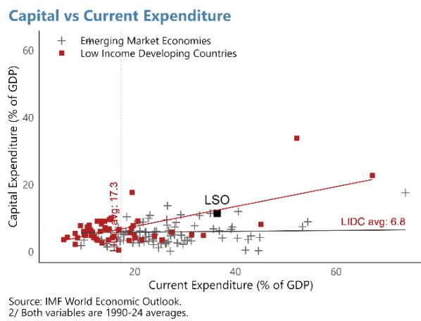  
Sources: Staff estimates based on official data.  
Sources: Staff estimates based on official data.

4. The decline in investment and inadequate maintenance have reduced the capital stock in Lesotho. After peaking at approximately 300 percent of GDP in 2003, Lesotho's public capital stock has sharply decreased due to a rapid decline in public investment, falling to 173 percent of GDP in 2019 (Figure 8). While there are no recent estimates of capital stock, maintenance spending has been insufficient to offset asset depreciation, as indicated in this report (see Table 4 and 5). Currently Lesotho does not have any public assets under a public private partnership contract. As of 2019, per capita capital stock in Lesotho is several times higher than the SSA median (Figure 9), following a significant

accumulation in the 1990s. However, Lesotho's long-term growth performance from 1990 to 2019 was modest, approximately 75 percent of the LIDC average.

Figure 8. Lesotho: Public Investment and Capital Stock

(Nominal in percent of GDP)

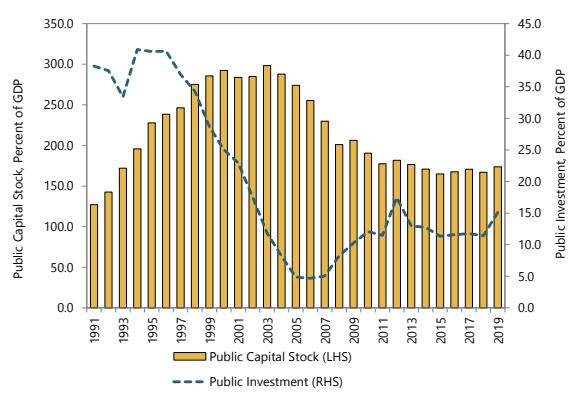  
Sources: Staff estimates based on official data.  
Figure 9. Public Capital Stock per Capita: Comparison with Peers, 2019 (In 2017 PPP USD-adjusted, thousands)

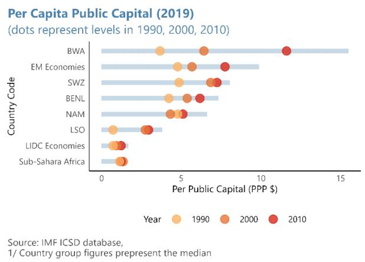  
Sources: Staff estimates based on official data.

## B. Drivers of Capital Spending

5. Capital expenditure has been driven by both SACU revenues and capital grants (Figure 10). SACU revenue surges have typically led to increased capital spending with a 5–7 year lag (Figure 11). In contrast, capital grants—particularly from South Africa to finance the Lesotho Highlands Water Project (LHWP)—have had a more immediate impact.

SACU transfers represent Lesotho's share of the common external tariff collected by South Africa on behalf of SACU members. These transfers are large relative to Lesotho's GDP and highly volatile, contributing to procyclical fiscal behavior.

The LHWP, a joint water project between Lesotho and South Africa under the 1986 treaty, captures water from Lesotho's highlands to supply South Africa. Construction plans are predetermined, and most costs are borne by South Africa through government-to-government capital transfers. Lesotho receives royalties for the water exported (Annex 3 provides more detail).

Figure 10. Revenue and Capital Expenditure (Nominal in Percent of GDP)  
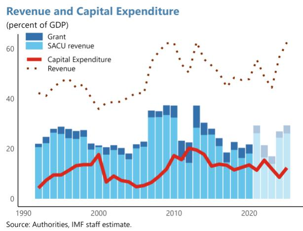  
Sources: Staff estimates based on official data.

Figure 11. Capital Expenditure Drivers (In Percent of GDP)  
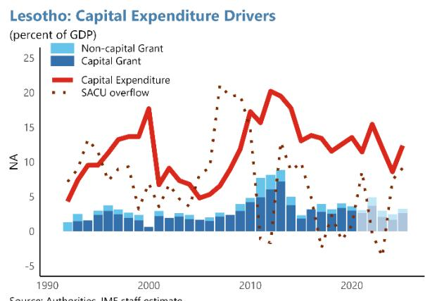  
Source: Authorities, IMF staff estimate,
1/ SACU overflow is estimated by SACU revenue subtracted by wage bill  
Sources: Staff estimates based on official data.

## C. Financing of Public Investment

6. Lesotho's favorable fiscal balances and procyclical spending patterns have reduced the need for debt-financed investment. Its long-term average fiscal deficit balance (1990–2024) of 0.7 percent of GDP is significantly better than the SSA average of 2.8 percent. Combined with access to concessional financing, this has helped maintain a relatively benign debt profile.

Figure 12. Lesotho: Capital Expenditure (Nominal in percent of GDP)  
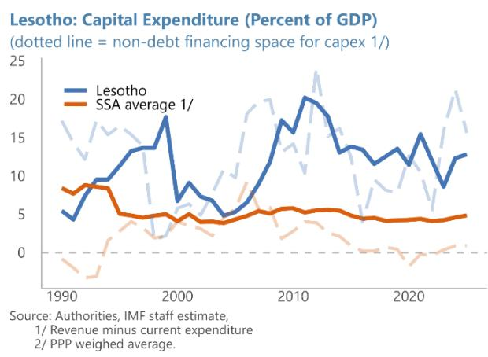  
Figure 13. Capital Expenditure, 1990-2024 (Cumulative, Percent of GDP)  
Capital Expenditure (Cumulative, Percent of GDP)
(dotted line = non-debt financing space for capex 1/)

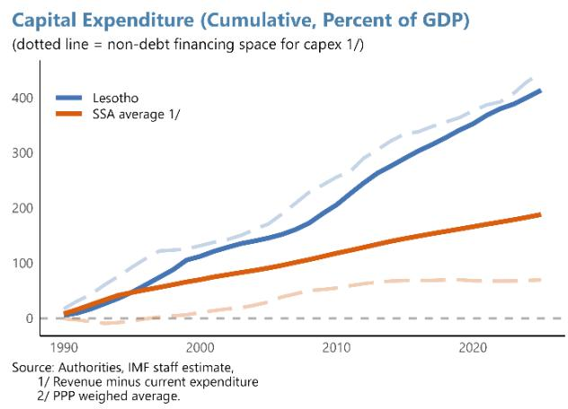  
Sources: Staff estimates based on official data.  
Sources: Staff estimates based on official data.

7. Capital spending has closely mirrored fluctuations in internal (non-debt) financing capacity, that is revenue remaining after current expenditure (Figure 12). Since 1990, the second variable (i.e., internal financing capacity) has followed three major cyclical waves, largely driven by SACU revenue volatility. The mirroring of the third wave by capital spending seems to be ongoing. On a

cumulative basis, internal savings have been sufficient to fully fund capital investment during 1990-2024, contrary to the average trend of SSA (Figure 13). Nonetheless, external debt has been used selectively, often to take advantage of concessional borrowing while building reserves (Figure 14). As a result, Lesotho's long-term average external debt ratio (49.6 percent of GDP) is well below the LIDC average (63.4 percent; Figure 15).

Figure 14. Lesotho: Capital Expenditure by Financing Sources (Nominal in percent of GDP)

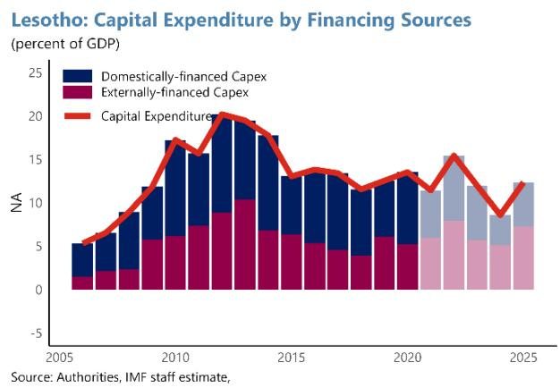  
Sources: Staff estimates based on official data.  
Figure 15. Public Capital and External Debt, 1990 – 2019 (In percent of GDP)

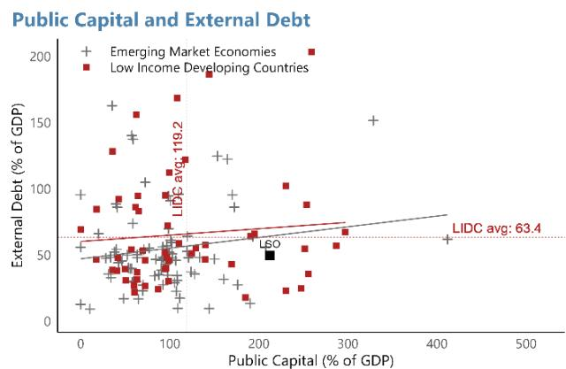  
Source: Haver, IMF ICSD, IMF staff estimate, 1/ Both variables are 1990-19 averages. ICSD data covers 1960-2019  
Sources: Staff estimates based on official data.

8. The government has set out an ambitious medium-term plan for capital investment. According to the 2025/2026 Budget Strategy Paper, public investment spending is projected to reach 16.5 percent of GDP in FY26/27, about 6 percent points of GDP higher than in FY23/24. This increase is in line with the strategic objectives of the National Strategic Development Plan and will be financed by the expected SACU windfall and pickup in donor grants.

## 2. The Efficiency of Public Investment

9. Measures of infrastructure access and quality are relatively low in Lesotho (see Figures 16 and 17). The number of hospital beds per 1,000 people stands at 1.3, and the number of secondary teachers per 1,000 people is 2.7, both lower than those in comparator countries $^{3}$ , emerging market economies, and low-income developing countries (LIDC). Additionally, perceptions of infrastructure quality have declined since 2015. Although there have been no recent updates to these indicators, the decline in capital stock and inadequate expenditure on capital asset maintenance, as outlined in this report, highlight the necessity for enhancements in public investment management.

Figure 16. Measures of Physical Access to Infrastructure, 2007-2019  
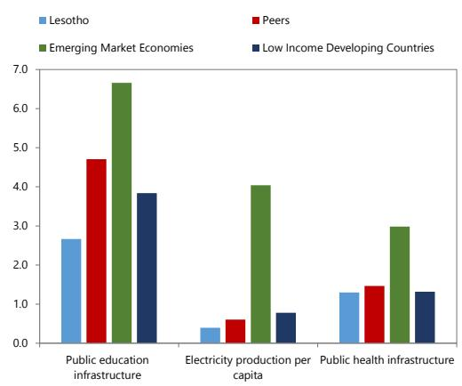  
Sources: World Bank Logistics and Performance Database.

Figure 17. Perception of Infrastructure Quality, 2007-2019  
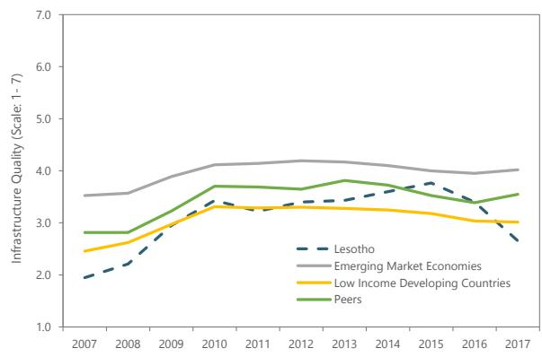  
Sources: World Bank Logistics and Performance Database.

10. Access to electricity and basic drinking water have continued to rise, but challenges remain. Despite low electricity production, access has steadily increased over the past twenty years, reaching 50 percent of the population in 2022. However, this remains below the average of approximately 63 percent for comparable countries and slightly below the average for Sub-Saharan Africa (SSA) (Figure 18). Access to basic drinking water in Lesotho has also improved slightly over the last decade, standing at 74 percent of the population in 2022, which is above regional averages, but it has not improved at the same rate as in comparative countries (see Figure 19).

Figure 18. Access to Electricity, 2000-2022 (percent of population)  
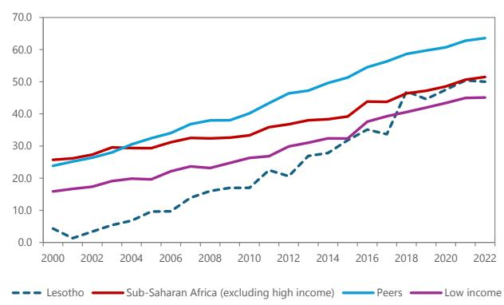  
Sources: World Bank, World Economic Forum, Global Competitiveness Index.

Figure 19. People Using at Least Basic Drinking Water Services, 2000-2022 (percent of population)  
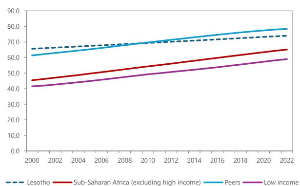  
Sources: World Bank, World Economic Forum, Global Competitiveness Index.

11. Digital and ICT infrastructure is also facing challenges. While fixed broadband subscriptions have increased, the penetration rate remains lower than the averages for LIDC and SSA, at just 0.4 per 100 people (Figure 20). Although mobile cellular subscriptions experienced rapid growth after 2008, they have since 2018 fallen below the SSA average, although they remain slightly above the LIDC average at 68 per 100 people (Figure 21).

Figure 20. Fixed Broadband Subscriptions, 2000-2023 (per 100 people)  
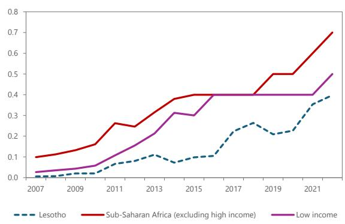

Figure 21. Mobile Cellular Subscriptions, 2000-2022 (per 100 people)  
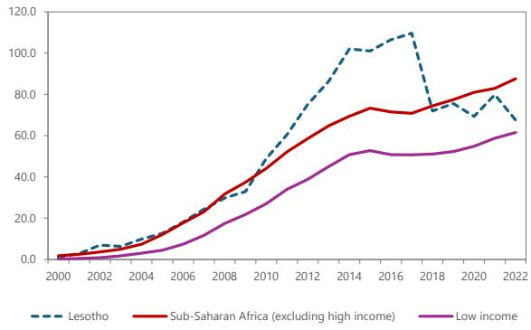  
Sources: World Bank, World Economic Forum, Global Competitiveness Index.  
Sources: World Bank, World Economic Forum, Global Competitiveness Index.

12. The public investment efficiency gap in Lesotho is approximately 49 percent. The hybrid indicator for infrastructure efficiency, which statistically summarizes the relationship between per capita capital stock and GDP (inputs) and access and quality indicators (outputs), reveals that Lesotho lags behind the most efficient countries with similar inputs (see Figures 22–23). While the most efficient countries attain a combined efficiency indicator of 100, Lesotho reaches 51. This indicates that, with the same inputs, the most efficient countries provide nearly twice the access to and quality of infrastructure. The efficiency index stands at 61 for the average of LIDC and 62 for the SSA average. Echoing these

findings, the IMF's latest Staff Report $^{4}$ underscores how Lesotho's PIM weakness hinders productive capital formation and its reform can lead to an upside growth scenario.

Figure 22. Efficiency Frontier, Hybrid Indicator  
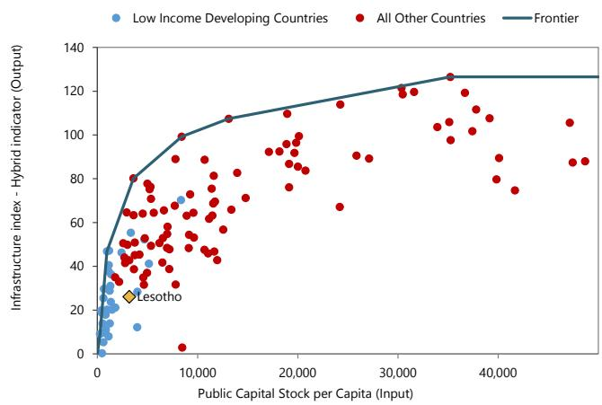

Figure 23. Efficiency Gap, Hybrid Indicator  
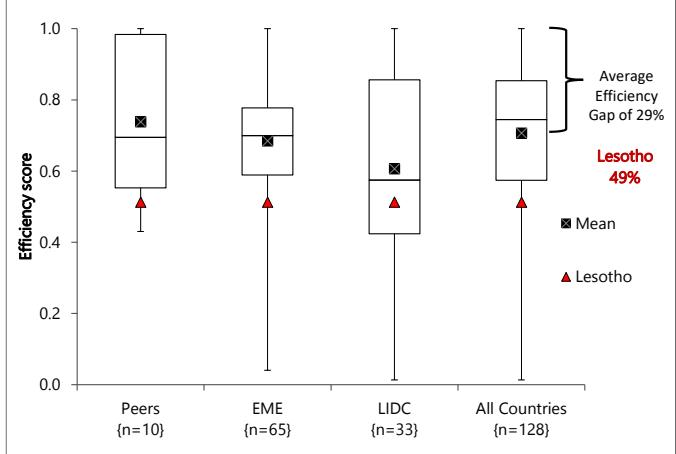

\* The hybrid indicator combines the physical and survey-based indicators into a synthetic index of the coverage and quality of infrastructure networks.

13. Lesotho has an opportunity to improve investment efficiency through better infrastructure governance. IMF research has shown that countries can achieve a better “bang” for their investment “buck” by reforming PIM processes. In addition to achieving a higher level of infrastructure output for a given level of input, staff analysis shows that countries with better infrastructure governance also achieve a higher growth return from the infrastructure they develop. $^{5}$

# 3. Public Investment Management Institutions

## A. The PIMA Framework

14. The IMF has developed the Public Investment Management Assessment (PIMA) framework to assess the quality of the public investment management of a country. It identifies the strengths and weaknesses of institutions and is accompanied by practical recommendations to strengthen them and increase the efficiency of public investment. The PIMA uses the term ‘institutions’ to refer to the framework, rules and regulations, processes and practices that underpin the public investment management framework for a country.

15. The tool evaluates 15 "institutions" involved in the three major stages of the public investment cycle (Figure 24). These are: (i) planning of investment levels for all public-sector entities to ensure sustainable levels of public investment; (ii) allocation of investments to appropriate sectors and projects, and (iii) delivering productive and durable public assets.

Figure 24. PIMA Framework  
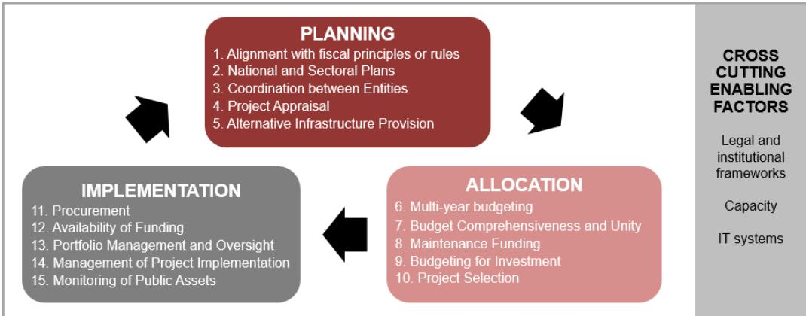  
Source: Public Investment Management Assessment Handbook.

16. For each of these 15 institutions, three indicators are analyzed and scored according to a scale that determines whether the criterion is met in full, in part, or not met (see Annex 2 for the PIMA Questionnaire). Each dimension is scored on three aspects: institutional design, effectiveness, and reform priority:

\- Institutional design refers to the objective facts indicating that appropriate organizations, policies, rules, and procedures are in place. The average score of the institutional design of three dimensions provides the score for the institution, which may be high, medium, or low.

Effectiveness refers to the degree to which the intended purpose is being achieved or there is a clear useful impact. The average score of the effectiveness of the three dimensions provides the effectiveness score for the institution, which may be high, medium, or low.

■ Reform priority refers to whether the issues contained within the institution are important to be improved in the specific conditions faced by Lesotho.

The following sections provide a detailed assessment of Lesotho according to this methodology.

## B. Overall Assessment

17. Similar to many countries, institutional design in Lesotho tends to be stronger than effectiveness (Figure 1) $^{6}$ . Effectiveness lags design in areas such as project appraisal, multiyear budgeting, budgeting for investment, maintenance funding, procurement, availability of funding, portfolio management and oversight, and maintenance of public assets. It should be noted, however, that in terms of performance the Allocation phase in Lesotho performs relatively well, whereas design and effectiveness in the Planning and Implementation phases in particular require enhancement.

18. Lesotho compares mostly on par with other countries in Sub Saharan Africa and LIDCs on some measures but lags on others (Figures 25 and 26). Lesotho performs relatively well in the institutional design on coordination between entities, appraisal, budget comprehensiveness and unity, maintenance funding and procurement. However, there are also notable design gaps compared to the region and LIDCs, particularly with respect to fiscal targets and rules, national development planning, alternative infrastructure financing multiyear budgeting, budgeting for investment, project selection, availability of funding, management of project implementation. In terms of effectiveness Lesotho outperforms peers with respect to coordination between entities and is broadly aligned with peers in project appraisal, budget comprehensiveness and unity, and procurement. It lags peer effectiveness with respect to fiscal rules, national and sectoral planning, multiyear budgeting and in a number of the implementation institutions including availability of funding, portfolio management, management of project implementation.

Figure 25. Design of Public Investment Management Institutions  
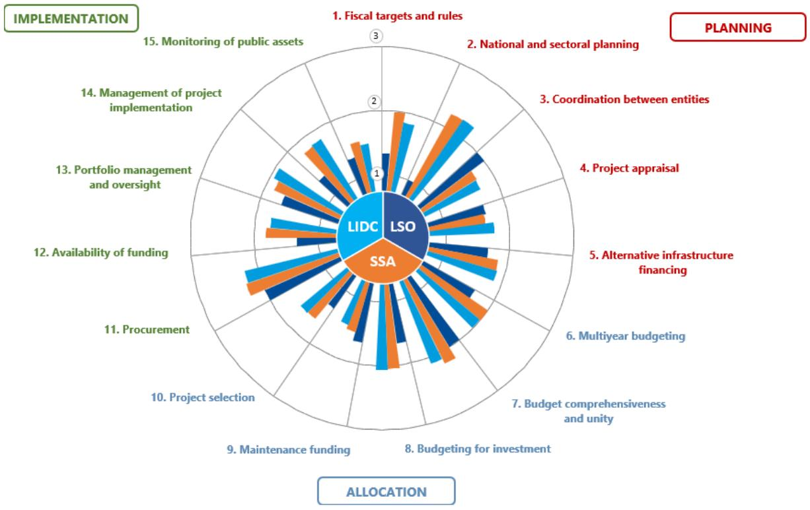

19. The following sections provide a detailed assessment of Lesotho's public investment institutions and recommendations to address challenges and issues identified during the mission. The assessment finds that Lesotho performs strongest in the allocation phase, but there are a number of issues preventing Lesotho from achieving greater impact from its investment input in the other two phases: In the Planning phase, there is a marked weakness with respect to national and sectoral planning which is somewhat fragmented and lacks key priorities linked to major costed investments including specific output measures. This lack of central alignment is also present in the appraisal and selection process, which fails to provide the MoFDP with sufficient legal basis to ensure that new projects entering the budget are of high quality and aligned with the main priorities of government. The Implementation phase has significant potential for improvement. Increasing procurement rigor, funding availability, portfolio oversight, management of project implementation and monitoring of public assets can enhance the impact of capital investment. In the short term the implementation of the Procurement Act, Competition Law and updating the PFMA Act should be core priorities for the MoFDP.

Figure 26. Effectiveness of Public Investment Management Institutions  
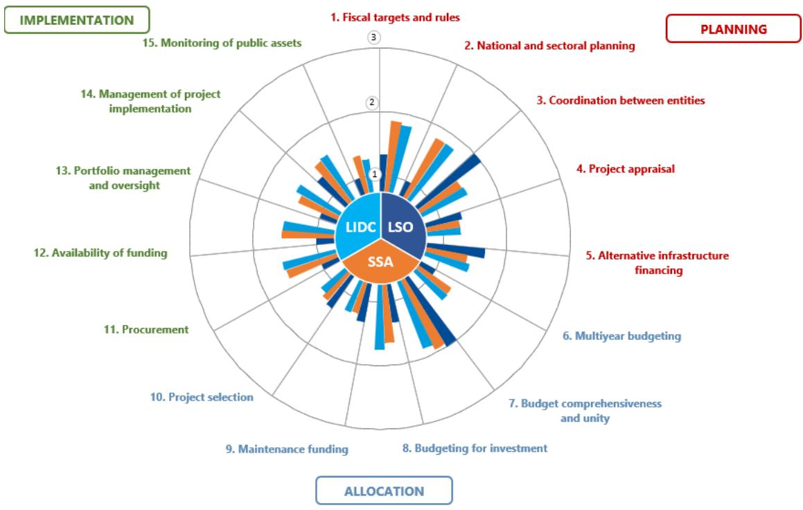  
Source: Staff calculations  
Note: SSA is Sub-Saharan Africa, and LIDC is Low Income Developing Countries.

## C. Investment Planning

1. Fiscal Targets and Rules (Strength—Low; Effectiveness—Low; Reform Priority-Low)

20. Fiscal rules enable governments to protect public investment spending from the economic cycle and promote fiscal sustainability. Fiscal rules linked to debt sustainability provide credible

commitment to fiscal plans that facilitate stable economic conditions. Fiscal rules help avoid volatility in investment spending, which tends to be pro-cyclical. Furthermore, fiscal rules can facilitate the adoption of a medium-term fiscal framework (MTFF), which sets multiyear targets for the leading fiscal indicators by incorporating the past budget outcomes and costing of new measures. A credible MTFF will promote a more strategic approach to the budget process and support medium-term planning for public investment.

21. Fiscal policy is not guided by permanent fiscal rules, but governments have kept a moderate risk of debt distress. here are no numerical legal constraints on fiscal aggregates to ensure debt sustainability. While fiscal policy has been guided by the Southern African Development Community (SADC) macroeconomic convergence criteria—a 60 percent debt anchor and a 3 percent of GDP budget deficit ceiling—these benchmarks are not legally binding and are only referenced in the Budget Strategy Paper. Despite the absence of formal rules, Lesotho has managed to maintain moderate debt distress (Figure 27) and keep the keep the public debt within the 60 percent debt limit as a percentage of GDP except for 2022 (64.55) and 2023 (61.51) $^{7}$ although the deficit limit of 3 percent has persistently been breached (Figure 28). Nonetheless, the current framework leaves the country exposed to procyclical fiscal pressures and underscores the need for a more robust institutional mechanism to support credible, forward-looking public investment planning.

22. Lesotho has an operational MTFF, but its impact on the capital budget has been limited. An MTFF is included in the Budget Strategy Paper and the Budget Call Circular, outlining the main economic classifications of expenditures and providing indicative ceilings for wages, operating costs, and capital expenditures by line ministry and departments. The MTFF suffers from weaknesses in the consistency and credibility of the MTFF that undermines its effectiveness. The country's reliance on volatile SACU revenues, limited economic diversification, and rigid public expenditures—particularly a large wage bill—have historically resulted in procyclical fiscal policies and limited shock absorption capacity, especially under a fixed exchange rate regime and constrained external financing. Consequently, the fiscal deficit ceilings – including estimates for development spending - have not been applied consistently across successive MTFFs. Also, as indicated in Figure 30 under Institution 6, the medium-term targets for capital spending in each MTFF differ significantly from the approved budget, providing little strategic guidance regarding the fiscal space for the budget process.

23. To strengthen fiscal management and support more credible medium-term planning, Lesotho should formalize and operationalize a rules-based fiscal framework. Despite past references to SADC convergence criteria and the inclusion of an MTFF in budget documents, the current framework lacks legally binding debt or deficit rules, and fiscal planning remains largely discretionary. Deficit targets in successive MTFFs have been inconsistent, providing little strategic guidance for annual budgeting. Institutionalizing simple, transparent, and legally grounded fiscal rules—centered on debt and deficit anchors—and aligning them with a consistent and credible MTFF should be a near-term priority. As the government is considering the introduction of a fiscal rules framework as part of the new Public Financial Management (PFM) Act, its design should be based on best international practices.

Figure 27. Lesotho Public Debt, 2010-2024 (in percent of GDP)  
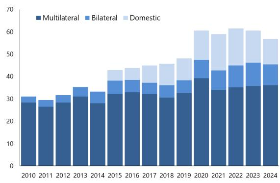  
Source: Budget Strategy Papers, and IMF Staff.

Figure 28. Lesotho Actual and Projected Budget Deficit, FY2015/16-FY2026/27 (percent of GDP)  
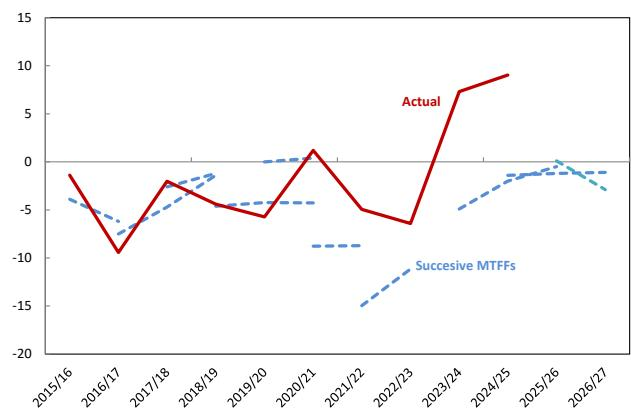

2. National and Sectoral Planning (Strength: Low; Effectiveness: Low; Reform Priority: High)

24. National and sectoral planning should ensure that public investment decisions are guided by clear goals, cost estimates, and measurable indicators and outcomes, enabling effective tracking of progress and impact. These plans and strategies should define a portfolio of investment projects that contribute to achieving the stated objectives. Fully costing these projects, particularly major ones, helps ensure that fiscal constraints are applied, enhancing alignment with medium-term fiscal policy and the annual budget. Linking measurable targets and expected outputs to development plans, strategies, and investment projects allows for systematic monitoring of their progress as well as their economic and social impact.

25. National development strategies in Lesotho provide high-level policy directions but do not specify major investment projects and do not effectively guide capital budget allocation. The government is finalizing the Extended National Strategic Development Plan (NSDP) II (2023/24–2027/28), which as with the previous ones focuses on priority areas without including investment projects (Box 1). While a Strategic Focus for NSDP II is available on the MoFDP website, most ministries lack publicly accessible sectoral plans, and existing strategies often do not align with the respective NSDPs or have exceeded their intended lifespan. For instance, various plans cover different timeframes, including the transport master plan (2024-2044) and the national housing policy (2018-2022), with some strategies currently being updated. Aside from the transport master plan, which contains a comprehensive list of projects, other strategies lack detailed investment plans. Furthermore, there is no mechanism to ensure that budgeted project investments are derived from these strategies. Since there are few specific projects in plans, their effectiveness is consequently low as the plans have little direct impact on which projects are approved in the budget and implemented.

## Box 1. History of National Strategic Development Plans in Lesotho

The first NSDP (2012/13–2016/17) focused on achieving sustained, broad-based economic growth as the primary pathway to poverty reduction through private sector development. The second NSDP (2018/19–2022/23) sought to create stable, long-term employment in the private sector beyond seasonal or informal work. Both NSDPs were formulated as implementation frameworks for the Lesotho National Vision 2020, published in 2004. However, both plans fell short of their objectives for several reasons. They were not fully aligned with the country's limited financial and non-financial resources, making it difficult to implement all identified priorities effectively. Additionally, the plans included too many strategic interventions, resulting in an overly complex framework that did not match available resources. The absence of a robust Monitoring and Evaluation framework in NSDP I further hindered planning and tracking progress, which may have contributed to the overly ambitious design of NSDP II.

The Extended NSDP II (2018/19–2023/24), expected to be published soon, now provides a streamlined strategic roadmap to shift Lesotho from a consumer- to a producer-based economy, targeting inclusive growth and job creation through the private sector with clearly defined, achievable goals.

The Extended NSDP II objectives will be incorporated into national policies, sector strategies, and regional frameworks. This ensures consistency across different levels of governance. Ministries and agencies will adapt their Annual Workplans to reflect the Plan's priorities. The Ministry of Finance will allocate resources to programs and projects based on their alignment with the NSDP II's strategic objectives.

Source: IMF Staff

26. The absence of cost estimates for investment projects in sector strategies hampers the strategic impact of the planning process and the ability to assess its effectiveness. Previous NSDPs and sector strategies did not require the inclusion of a list of investment projects, but the Extended NSDP II mandates that it be accompanied by a list of costed projects, which is still a work in progress (see Box 1). Without costing, it is difficult to assess the plan's accuracy and impact on subsequent budgets. The transport master plan includes budget needs outline in three scenarios (maximum, moderate, and minimum). However, appropriations in the budgets for FY2023/24 and FY2024/25 fall short of these requirements. For the minimum scenario, the budget allocated is only 60 percent of the estimated budget. Similarly, the electrification master plan estimated LSL 2.88 billion over 20 years (2018-2038), averaging LSL144 million (x percent of GDP) per year, yet actual spending in the last fiscal year was less than LSL70 million.

27. There are no measurable targets for public investment in sectoral masterplans and budget documents. The transport masterplan outlines some output and outcome targets for their budget programs or priority areas, but this is not the case in other sectors.

28. Enhancing national and sectoral planning is a high priority. The ongoing finalization of the Extended NSDP II presents an opportunity to improve the planning framework in Lesotho. To avoid outcomes like previous NSDPs, the Extended NSDP II should align its objectives with available resources, necessitating the costing of priorities and the inclusion of project lists with associated costs and outcome targets in sector strategies. While addressing sector needs, the planning process must be bound by a realistic assessment of available resources and focus on major projects that significantly impact the economy and budget. For instance, Tanzania's five-year Development Plan for 2021/22-

2025/26 includes 17 flagship projects identified as having the most substantial economic impacts and contributing to diversification, competitiveness, and inclusive growth. $^{8}$

3. Coordination Between Entities (Strength: Medium; Effectiveness: Medium; Reform Priority: Low)

29. In order to maximize the efficacy of public investment, it is important to ensure that capital investment by sub-national government is aligned with central government's objectives. Since Sub-national Governments (SNGs) depend largely on government transfers, they need reasonable certainty about budget resources available for investment. Given that investment projects are subject to uncertainty and risks that may impact the fiscal outcomes of SNGs, Public Corporations (PCs), and the central government, it is important to disclose and monitor these. In many countries, PCs and PPPs are major sources of fiscal risk.

30. Major SNG capital spending plans are published alongside central government investments, and there are formal discussions between central government and SNGs on investment priorities. The PFMA Act requires that all transactions between central government and SNGs be presented in a consolidated format in the annual budget, and all SNG major projects are funded by central government and subject to the PSIC appraisal process. There are formal and informal consultations as part of the budget process. Central government and SNG projects are comingled and sorted by common project type and location within the annual Budget Book.

31. There is a clear legal framework underpinning the transfer of funds between central government and SNGs; however, transfers are not based on a transparent and rules-based system. Capital transfers to SNGs occur within the context of annual considerations during the budget process without any specific allocation formula. SNGs have some flexibility in relation to utilization of funding provided under the programme ‘development fund for councils’, which accounts for approximately 5 to 10 percent of the total capital budget of the Ministry, with other funding programmes ring-fenced for specific activities. While formal and informal discussions take place each year between central government and SNGs in advance of, and during, the budget process, ultimately the current transfer system does not provide any predictability in relation to the amount of financial resources available to SNGs for capital investment in any given year.

32. While legal frameworks require Contingent Liabilities (CLs) to be reported to the central government, there is no mandate for their comprehensive disclosure in budget documents, resulting in significant reporting gaps. The PFMA Act provides a legal basis for financial reporting between central government and SNGs and PCs, including CLs, and the MoFDP publishes a quarterly debt transparency report which includes details of CLs by source. There is no legal requirement that CLs of SNGs, PCs and PPPs are comprehensively disclosed in budget documents and there are important gaps in the reporting when comparing CL details provided in the quarterly debt transparency report with the recently introduced Fiscal Risks Statement. The 2025/2026 Budget Strategy Paper recognises the need for clearer guidelines and procedures for managing and reporting CLs and the MoFDP is currently looking to develop a comprehensive framework in relation to CLs.

33. Introduction of a rules-based transfer system between central government and SNGs would enhance transparency and allow for medium-term investment planning by SNGs. The impact, and efficiency, of capital investment can be greatly enhanced if implementing agencies have greater certainty as regards medium-term funding. The introduction of a rules-based transfer system between central government and SNGs (together with the recommendations on multi-year budgeting made in institution 6) would allow for better planning by SNGs. The proposals to develop clear guidelines and procedures in relation to the management of contingent liabilities should also be pursued to ensure central government has a complete picture of its potential exposure to fiscal risks.

## 4. Project Appraisal (Strength: Medium; Effectiveness: Low; Reform Priority: High)

34. Rigorous project appraisal helps ensure that all relevant project costs, benefits, and risks are fully assessed before deciding whether to develop projects further or to fund them. Project appraisal comprises different stages, requiring increasing levels of analytical scope and depth, such as concept, pre-feasibility, and feasibility stages. Simple, standardized projects may be approved for funding consideration based on a concept note or a pre-feasibility study, whereas large, complex, and high-risk projects should be subject to a full feasibility analysis. To ensure consistent analysis of different projects, there should be common and standardized methodologies for project appraisal, including risk assessment and risk mitigation for all major projects, regardless of funding source. Good appraisal of projects is necessary to ensure that the selection for funding (see Institution 10) takes place on a sound, evidence-based foundation.

35. While there is no legal requirement for systematic appraisal, some capital projects are subject to rigorous technical, economic, and financial appraisal. The Government of Lesotho has taken steps to strengthen institutional arrangements for project appraisal and improve the overall appraisal process. In 2013, a Cabinet memorandum reinstated the Public Sector Investment Committee (PSIC) in response to concerns about funding unscreened projects. Since then, all projects, regardless of their source of financing, are instructed to undergo appraisal in accordance with PSIC guidelines before they are included in the Public Sector Investment Program (PSIP) (See Figure 29). While the PSIC guidelines do not have any legal or regulatory status, they do provide evaluation criteria for concept notes, focusing on relevance, effectiveness, feasibility, and sustainability, and include a framework for assessing full project proposals to ensure they are well-designed, financially viable, and aligned with intended objectives. In practice, some major projects, particularly those financed by Development Partners and account for about half capital spending, are systematically and rigorously appraised. However, appraisals of government-funded projects are not published, and the level of rigor applied varies in comparison to those carried out by Development Partners.

36. A standard methodology for project appraisal exists; however, central support to MDAs is limited, the methodology has limited impact and is not consistently applied. The Project Appraisal Guidelines, along with the Project Cycle Management and Public Sector Investment Policies and Procedures Manual and the Economic Planner's Manual, outline the required contents for Project Concept Notes and detailed Project Proposals, including pre-feasibility and feasibility studies. These cover technical, financial, and economic analysis using methodologies such as Cost-Benefit Analysis, Net Present Value, and Internal Rate of Return. However, a review of sample appraisals in the Public Works and Transport, Energy and Natural Resources sectors indicates that the standard methodology has had limited impact on the quality of project appraisals, and the process is not consistently applied across

projects. $^{9}$ This is partly due to limited central support to MDAs in ensuring that the set methodologies are properly and uniformly applied.

Figure 29. Project Appraisal in Lesotho  
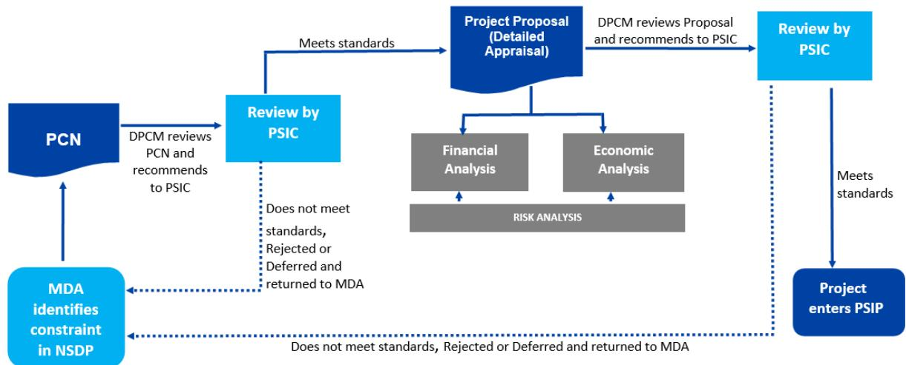  
Source: Derived from Public Sector Investment Committee Appraisal Guidelines for members of the PSIC.

37. The guidelines for project appraisal require risk analysis assessments, but in practice, appraisals do not sufficiently account for risk. Risk assessments are included in project proposals, but they are generally too limited to support effective risk management. While mitigation plans are required, there is no practical guidance to support them. Findings from audit reports and other sources indicate that major projects have frequently encountered significant risks and uncertainties, manifesting in cost overruns and delays in implementation. $^{10}$ These challenges appear to stem, in part, from inadequate risk assessment during project preparation, particularly in the planning phase, and during construction due to procurement issues, changes in design scope, and compensation delays.

38. Lesotho has established institutional arrangements for project appraisal, but their effectiveness is limited by the absence of a legal framework to enforce them. As discussed in Section 3 on Cross-cutting Issues, ensuring a robust appraisal process requires a clear legal and regulatory framework, supported by training and quality assurance mechanisms. Although the Project Appraisal Guidelines include elements of public investment management and summarize appraisal methods, they are not comprehensive. The uniform appraisal requirements for all projects, regardless of size or complexity, reduce efficiency. Box 2 provides practical guidance on tailoring the project appraisal process to better reflect the size and complexity of each project.

<table><tr><td>Stage1: Project Concept Note</td><td>Stage 2: Pre-feasibilityNeeds and demand analysis with specified outputs of the project *Option analysis</td></tr><tr><td>Stage 3: FeasibilityDemand analysisTechnical engineering analysis *Environmental analysis *Socio-economic analysis (Local procurement, community development, job creation) *Legal and regulatory due diligenceFinancial analysis (investment phase, and maintenance and operating phase) *Economic analysis (cost-benefit analysis, economic impact) *Risk assessment and sensitivity analysis (natural, economic, political, financial, litigation, disaster) *</td><td>Stage 4: Implementation preparationDetailed implementation plan and readiness confirmation *Institutional capacity (project management arrangements, in-house, outsourcing) *Procurement plan *</td></tr><tr><td colspan="2">Stage 5: Budget applicationProject concepts note (summary of appraisal information to apply for funding) *Requirements for medium-sized projects are indicated by *.Small projects only require needs assessment, terms of reference with description and key outputs of the project, and financial assessment.</td></tr><tr><td colspan="2">Source: IMF Staff</td></tr></table>

5. Alternative Infrastructure Financing (Strength: Medium; Effectiveness: Low; Reform Priority: Low)

39. This institution assesses the climate for the private sector, PPPs, and SOEs to finance infrastructure. When private firms find a stable environment in which they can achieve a fair return on long-term investment, responsibilities for some infrastructure can move from the public sector to the private sector, drawing on alternative sources of finance and management expertise.

40. There is enabling legislation and private participation in electricity, telecommunications and transport markets. The Lesotho Electricity and Water Authority (LEWA) $^{11}$ is an independent entity regulating two sectors. However, no private participation is possible in water sector $^{12}$ . The independent Lesotho Communications Authority (LCA) regulates the telecommunications sector $^{13}$ . The trucking, bus and air transport markets are not restricted, but are regulated by the respective central government ministries $^{14}$ . Domestic electricity generation happens mainly through the publicly owned Muela Hydro-Power plant (72 MW) and the Mafeteng solar power plant (30 MW). Transmission and distribution is undertaken through the SOE Lesotho Electricity Company (LEC). The Lesotho market, however, is also significantly served by power purchase agreements with South Africa's SOE Eskom and Mozambique's SOE Electricity de Mozambique. Currently the independent power provider, OnePower, operates a number of solar mini grids providing electricity to dispersed areas. The telecommunications market is largely structured around two private operators: Vodacom Lesotho and Econet Telecom Lesotho (ETL). The Government retains 30 percent of ETL. The airline market is open for competition and Maseru is primarily served by a private South African company, Airlink. Trucking and bus transport is largely private while a limited railway sector is state-owned and focused on freight transport. Urban transport (taxi and minibuses) is private.

41. There is a PPP strategy in place, but no underlying legal framework and experience has been mixed. The Government of Lesotho (GoL) has a PPP policy (2017) that addresses most of the key elements including objectives, principles and eligible infrastructure sectors for PPP; principles for sharing of risk; types of the PPP contracts, life cycle process for PPPs, and institutions responsible for procuring and managing PPPs. The Fiscal Risk Statement explicitly discusses PPPs and PPA contingent liabilities and legal exposure. However, there is no legal framework codifying the policy and MoFDP's PPP Unit is consequently in the process of drafting a new PPP Bill. Lesotho contracted one PPP, the Queen Mamohato Memorial Hospital Integrated Network which opened in 2010–11 as a partnership between the Ministry of Health of Lesotho and a multinational consortium. The project was subject to controversy and increasing tension between the GoL and the concessionaire and in mid-2021 the GoL assumed management of the hospital. The failure of the project exposed the government to considerable financial liabilities which the Fiscal Risk Statement indicates to be about 1 percent of GDP.

42. There is no legal framework for central oversight of SOE's investment plans and little coordination in practice. The PFMA Act Art 43 1 requires the SOEs to submit their financial statements, but there are no legally mandated arrangements for systematic and consistent information sharing regarding SOE's investment activities. The focus of MoFDP oversight of SOEs are financial risks, lately using the IMF's SOE Health Check Tool. As such any PPP investment, loan issuing by SOEs or budget funding of SOE investments necessarily require MoFDP approval. However, few SOE infrastructure investments over the past three years are covered by review arrangements. The current arrangement also weakens MoFDP's ability to assess whether SOEs are investing adequately to maintain the capital stock.

43. Enhanced oversight of PC's investment plans remains a priority. As in many countries across the world, the SOE sector in Lesotho is providing key services and increased oversight and support is needed from the central government in order to ensure that SOEs are on a sustainable path. The Electricity and Water sectors suffer from underfunding and degradation of assets which makes increased transparency about investment plans an important priority. PFMA Act Art 43 1 calls for SOEs to provide a statement of expected activities for the coming year. The MoFDP might want to investigate whether this provides sufficient legal basis for a more thorough oversight of investments plans until an updated PFMA Act is passed.

## Recommendations

Issue1: National and Sectorial Development Plans provide insufficient information about major public investment, related to their costs and outcome targets.

Recommendation 1: Update the NSDP to cover the main infrastructure sectors (energy, transport, water) including the main infrastructure projects, with indicative costing and output targets. (MoFDP by Q1 2027).

Issue 2: There is no rules-based system for capital transfer between central government and SNGs.

Recommendation 2: Introduce a rules-based system for capital transfers for key SNG investment programs to encourage medium-term planning and increase delivery efficiency. (Ministry of Local Government and Chieftainship by Q2 2026).

Issue 3: There is a lack of central government oversight of SOE investment plans.

Recommendation 3: Update the PFMA Act by requiring that PCs include their investment plans in the mandated annual report to the MoFP on activities for the next three years. Attach an annex to the Budget Estimates Book containing major investment projects of PCs (MoFDP Q1 2026).

See Recommendation 6 for issues linked to Appraisal.

## D. Investment Allocation

6. Multi-Year Budgeting (Strength: Medium; Effectiveness: Low; Reform Priority: Medium)

44. Multiyear budgeting gives MDAs better visibility of future resources and funding needs for investment projects, which often span multiple years with cost variations. Providing reliable medium-term capital expenditure ceilings enables more strategic budgeting by integrating investment programs into the budgeting process. Therefore, it is necessary to include total project costs in budget documents to ensure alignment between annual appropriations and long-term needs, support timely funding, and facilitate monitoring of cost overruns.

45. Projections of total capital spending are published in budget documentation, but subsequent allocations deviate significantly. The MTFF, presented in the Budget Strategy Paper, provides aggregate projections of capital expenditure for the upcoming fiscal year and indicative estimates for the subsequent two years. Additionally, the MTEF presented in the Budget Book is not aligned with the MTFF, and projections are sometimes limited to a single year, weakening its effectiveness in guiding multi-year capital spending priorities. Approved capital expenditure allocations often deviate from the ceilings set in the Budget Call Circular; and actual expenditure consistently falls short of approved levels in all years shown (Figure 30).

46. Although indicative multiyear ceilings on capital expenditure are set by MoFP, actual allocations often deviate from these ceilings. The Budget Call Circular provides indicative capital expenditure ceilings for the budget year and two subsequent years; however, these ceilings are not binding and are based on a rolling budget approach. The ceilings are issued only for GoL funded capital expenditure, and their presentation is inconsistent, sometimes provided by ministry only, and other times disaggregated by both ministry and project. In practice, approved capital allocations often deviate significantly from the indicative ceilings for the same year (above or below 15 percent). Additionally, over the past five years, actual capital spending has been, on average, 56 percent lower than the ceilings issued (Figure 31). The background for the lack of implementation is a combination of the regulatory and capacity issues across the investment cycle – in particular weak appraisal, selection, budgeting, availability of funding (e.g. arears, unreliable cash flow), portfolio and project management as discussed in more detail below.

Figure 30. Lesotho: MTFF Capital  
Expenditure Projections Versus Budget, 2020/21 – 2025/26 (Million Maluti)  
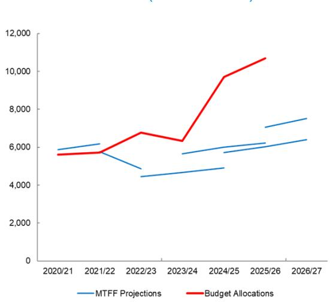  
Figure 31. Lesotho GoL Capital Ceilings, Budget and Actuals, 2020/21 – 2025/26 (Million Maluti)

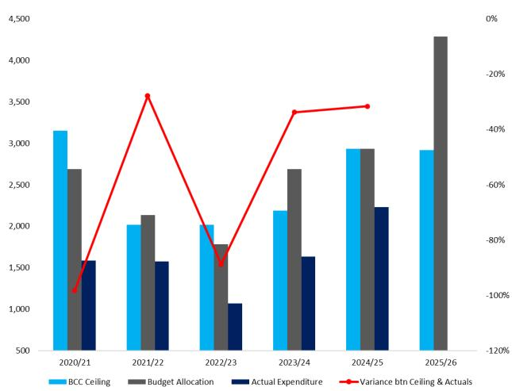  
Source: Budget Strategy Papers, Budget Call Circulars and Appropriation Acts, 2020/21-2025/26

47. Projections of total construction costs of major capital projects are not published. The Budget Book provides medium-term capital and recurrent expenditure projections for major projects but does not include total construction or full lifecycle cost estimates. While the PSIP includes total project costs, it is not published, and it is unclear whether these cost estimates are used to inform multi-year budgeting decisions. Without visibility of total project costs, it is difficult to know the total cost of public investment projects under implementation, or whether budget allocations are sufficient to complete ongoing projects on time. The Budget Strategy Papers for some years, such as FY2025/26 and FY2023/24, include indicative or pipeline investments and associated costs, but this is not done consistently across years, and it is unclear whether this information influences subsequent budget allocations.

48. Strengthening multi-year capital budgeting is an important reform initiative. Improving the credibility of multi-year budgeting requires publishing a Medium-Term Budget Framework that is aligned to the medium-term fiscal framework and clearly allocates resources to key investment priorities outlined in a medium-term PSIP. This will enhance effectiveness of the planning and budget system. Capital

expenditure ceilings should incorporate both government and external funding and be grounded in realistic public investment plans. Annex 5 contains a relevant example.

7. Budget comprehensiveness and unity (Strength—Medium; Effectiveness: Medium; Reform Priority: Low)

49. Public investment projects, regardless of their financing, should be authorized by the legislature and supplemented with recurrent funding for operation and maintenance. Policy makers should be able to simultaneously coordinate and share information while evaluating all spending proposals from Extra-Budgetary Entities (EBEs) and PCs/State-Owned Enterprises (SOEs) to resolve conflicting pressures and priorities by selecting from among all proposed capital projects. Decisions on capital projects should also consider the need for recurrent funding to operate and maintain them.

## 50. EBEs undertake significant capital spending that is disclosed in the budget

documentation along with project level details. The legal framework allows capital spending by EBEs. The Budget Call Circulars requires MDAs to include in their submissions estimates for special funds and EBEs. Capital spending by EBEs is disclosed in the budget documents at an aggregate level under respective MDAs along with project level estimates for the current and the two outer years including transfers from the special public funds like the Road Fund. However, there is a lack of MoFDP oversight on capital spending by the EBEs as their expenditure is executed outside of the Integrated Financial Management Systems (IFMIS).

## 51. As required in regulation, externally funded projects are presented in the budget

documentation, but SOE investments are not represented. The regulatory framework requires budget disclosure of projects funded through external sources. Budget Call Circulars require all projects financed through external loans and grants to be included in MDA submissions. The Budget Book consistently presents disaggregated funding composition for each project, including donor loans and grants for the current year and projections for the two outer years. Considering that donor funded projects are not executed through IFMIS, monitoring of project implementation poses a challenge for MFPD. Capital spending by SOEs, to the extent that these are funded through transfers from the national budget, are disclosed with project level details. But SOE own-resource investments are not included. While there are no arrangements for coordinating PPP projects, the lack of any capital projects currently being implemented under PPP arrangements limit the import of this (Institution 5).

52. Capital and recurrent budgets are consistently prepared and presented together in the budget, using a common budget classification. Budget Call Circulars require MDAs to ensure that the recurrent cost implications of the projects are adequately budgeted within their given recurrent ceilings. Budget preparation and presentation are integrated in the Central Budget Management System (CBMS). These cover costs arising from projects and those required for maintenance of existing assets and are presented in a consolidated manner in the budget documents. The MDA budget submissions are reviewed by the Budget department but not consistently for all major projects.

53. Budget comprehensiveness can be improved by strengthening linkages and coordination with the PSIP and incorporating disclosures on capital spending by SOEs from own revenues. This would enable prioritization of strategic projects within the overall fiscal constraint. Since the SOEs function independently, their capital projects will not be approved or appropriated in the budget process, but their disclosure will enhance the transparency of reporting of public investment in the budget. These improvements can also serve to strengthen the linkages between planning and budgeting for public investments (Institution 8).

8. Budgeting for Investment (Strength—Medium; Effectiveness: Low; Reform Priority: Medium)

54. Public investments should be protected and assured of funding during the budgeting process over the multiyear project cycle. It is important that total project costs are taken into consideration when the project is assessed and voted on by the legislature. To allow this oversight, the legislature should be provided with information on total project costs for the full duration of project implementation, costs already incurred, costs for the budget year as well as for the medium term. Limitations on transfer of capital expenditure and prioritization of allocations to ongoing projects is required to protect capital allocations in the budget.

55. Project outlays are appropriated for the budget year and information on total project cost is not included in the budget documentation. The regulatory framework does not require information on total project costs to be included in the budget. The PFMA Act and the Budget Call Circular require estimates to be submitted for the budget year and two subsequent years, and the budget estimated books present this information at the project level, but not the total cost (Institution 6). Information on total costs of some projects are available in the PSIP and the Capital Budget Annual Progress Report, but without a multiannual profile. These are, however, internal documents, and do not form part of the budget documentation that is published.

56. The legal framework restricts virement of funds from capital to current expenditure, and reallocations from capital budgets have not been significant in recent years. Section 15 of the PFMA Act restricts reallocations from capital projects and requires the approval of the Minister of Finance beyond the prescribed limits and prior approval of the Cabinet. In practice, there have been no significant budget reallocations from capital to current spending. In three of the last four years, capital budget allocations (Figure 32) have either been revised upwards or remained the same except in FY 2023/24 where they were revised downward (30%) but this did not involve reallocation from capital to current spending.

Figure 32: Budget Allocations  
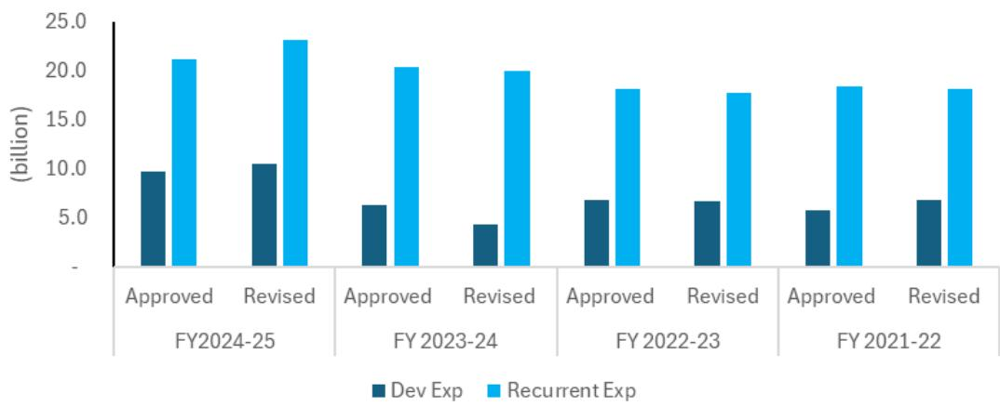  
Source: MoFDP Data, Staff Calculations

57. Budget preparation guidelines prioritize ongoing projects, but these are not effectively implemented. The Budget Call Circulars require inclusion of all existing commitments that will result in expenditures in the coming years, emphasizing the prioritization of meeting counterpart obligations and the timely completion of on-going projects. There is little evidence that this happens in practice. The PSIP has 119 on-going projects but only 69 of those were funded in the Budget for FY2025-26. All the ongoing projects of Ministries of Works, Energy, Local Government and Education received funding. $^{15}$ It is difficult to assess if these allocations were sufficient, but the use of Contingency Fund during 2019-22 to fund capital expenditure of some major projects, not of contingent nature, points to weaknesses in the budgeting process and an inability to fund major projects as per their needs $^{16,17}$ In addition, the Capital Budget Annual Progress Report reports have examples of projects not receiving sufficient budget allocations. Some of these include major projects like the Mpiti Sehlaaba Thebe Road, Marakabei Monont'sa Road (Public Works); Moshoeshoe International Airport (Transport) Khukhune Substation Upgrade, Belo Electrification (Energy), Village Water Supply Project, Lesotho Lowlands Rural Water Supply and Sanitation Project (Natural Resources) that have experienced delays because of funding shortages and required reallocations (Institution 13). In context of the overall significant under execution of the capital budget (Figure 35) this situation points to the rigidities in the budget process that limit reallocation to the projects that are actually being implemented.

58. Strengthening budgeting for public investment projects is a priority reform. Expanding the level of project information in the budget documents by including total project costs and distinguishing between ongoing and new projects would provide the legislature with a clear overview of required funding commitments for capital projects over the medium term. It would also enhance the focus on ongoing and critical investments, the affordability of new projects, facilitate protection of their funding, and obviate project delays. Annex 4 provides an example of a format that could be used to depict total project costs, commitments and expenditures, and multiyear projections. The integrated database of public investment projects planned by MoFDP should consider this functional requirement in its design.

9. Maintenance Funding (Institutional Strength: Low: Effectiveness: Low; Reform Priority: Medium)

59. Adequate maintenance of public infrastructure is essential to preserve asset quality and ensure effective service delivery. This requires regular condition assessments, robust methodologies to define maintenance and rehabilitation needs with corresponding cost estimates, and the integration of this information into planning and budgeting processes. Maintenance planning should also account for the effects of climate change and natural hazards on asset durability.

60. There is no standard assessment methodology for estimating the current maintenance needs of public assets, and spending has been insufficient. Line ministries are tasked with maintaining assets under their direct use, but none have developed a methodology for estimating maintenance needs for their assets or those managed by their respective SOEs. Current annual maintenance budgets are inadequate, with recurrent spending ranging from 1.1 to 2.4 percent of non-road fixed assets over the past seven years (Table 4)—insufficient to maintain these assets, let alone those acquired earlier, meaning a small fraction of their replacement value. Audit findings from the Auditor

General highlight this issue, relevant in the Ministry of Home Affairs, poor conditions of 12 out of 19 Johannesburg properties under the Ministry of Foreign Affairs and International Relations, and deteriorating infrastructure at Lesotho Agricultural College $^{18}$ .

Table 4. Actuals and Budget of Recurrent and Capital Maintenance Spending, FY2020/21-FY2027/28, Million Maluti

<table><tr><td></td><td>Actual2020/21</td><td>Revised2021/22</td><td>Actual2021/22</td><td>Budget2022/23</td><td>Actual2022/23</td><td>Revised2023/24</td><td>Actual2023/24</td><td>Budget2024/25</td><td>Revised2024/25</td><td>Budget2025/26</td><td>Proj2026/27</td><td>Proj2027/28</td></tr><tr><td colspan="13">Recurrent</td></tr><tr><td>Maintenance of Public Assets</td><td>72.2</td><td>137.4</td><td>95.2</td><td>137.4</td><td>97.8</td><td>109.3</td><td>92.3</td><td>142.4</td><td>251.4</td><td>165.4</td><td>196.7</td><td>207.2</td></tr><tr><td>Vehicle Maintenance and Repairs</td><td>47.9</td><td>63.2</td><td>50.1</td><td>63.2</td><td>59.5</td><td>48.7</td><td>3.0</td><td>42.6</td><td>57.9</td><td>57.9</td><td>142.0</td><td>153.8</td></tr><tr><td>Total</td><td>120.1</td><td>200.6</td><td>145.2</td><td>200.6</td><td>157.3</td><td>158.0</td><td>95.3</td><td>185.0</td><td>309.3</td><td>223.3</td><td>338.8</td><td>361.0</td></tr><tr><td>In percent of Acq of NF Assets from Fy2016/17</td><td>2.4</td><td></td><td>2.4</td><td></td><td>1.9</td><td></td><td>1.1</td><td></td><td></td><td></td><td></td><td></td></tr><tr><td colspan="13">Capital</td></tr><tr><td>Maintenance of Public Assets</td><td>1.4</td><td>9.3</td><td>86.9</td><td>9.3</td><td>9.1</td><td>40.3</td><td>6.7</td><td>140.5</td><td>300.2</td><td>354.9</td><td>354.9</td><td>112.2</td></tr><tr><td>Vehicle Maintenance and Repairs</td><td>126.5</td><td>23.0</td><td>1.7</td><td>23.0</td><td>1.7</td><td>7.5</td><td>3.0</td><td>28.2</td><td>38.5</td><td>38.5</td><td>37.9</td><td>45.5</td></tr><tr><td>Total</td><td>127.9</td><td>32.2</td><td>88.6</td><td>32.2</td><td>10.8</td><td>47.8</td><td>9.7</td><td>168.8</td><td>338.8</td><td>393.4</td><td>392.8</td><td>157.8</td></tr><tr><td>In percent of Acq of NF Assets from Fy2016/17</td><td>2.5</td><td></td><td>1.4</td><td></td><td>0.1</td><td></td><td>0.1</td><td></td><td></td><td></td><td></td><td></td></tr></table>

Source: Budget Books for FY2022/23 - FY2025/26; Audit Reports on the Consolidated Financial Statements of the Government of Lesotho, FY 2016/17 – FY2021/22. Note: Estimation of the value of Acquired Non-Financial Assets (Acq of NF Assets) is calculated as the sum of NF Assets accrued in previous years, starting from FY2016/17, minus capital spending for roads from Ministry of Public Works and Ministry of Local Government.

61. There is no systematic use of standardized methodologies for assessing needs for major capital improvements across government, and insufficient funding is leading to their premature degradation. The GoL has not developed a mandated standard methodology for the public sector. Apart from the Road Directorate, which employs privately developed software, the Road Transport Management System, to estimate maintenance and development needs for the road network, there is no standard methodology in use. For example, the Building Directorate lacks both a designated software system and a standardized methodology for assessing the capital maintenance of government buildings. The Road Directorate estimates a backlog of LSL15 billion for capital maintenance, with annual needs of about LSL3 billion. However, total spending on the roads program under the Ministry of Public Works and Transport over the past four fiscal years (FY2021-2024/25) was only LSL1.4 billion. Although the budget for FY2025/26 has been increased to LSL 2.4 billion, this amount remains insufficient and may encounter implementation challenges. A similar situation is evident in other line ministries, and Table 4 shows a substantial reduction in capital maintenance over the last two years. $^{19}$

62. Routine and capital maintenance funding is identifiable in the Budget Estimates Books for each ministry, using specific economic classifications. Expenditures on vehicle maintenance and repairs are reported separately from those related to public asset maintenance. Funding for capital maintenance and rehabilitation of roads and other infrastructure is allocated to specific projects, with corresponding budget appropriations and projections detailed in the Budget Estimates. However, the lack of systematic and standardized methodologies for assessing capital maintenance needs reduces overall effectiveness. For instance, the Transport Sector Masterplan 2024-2044 indicates that approximately LSL 400 million will be needed annually to maintain gravel roads after addressing backlog maintenance spending, in contrast to a recent estimate of about LSL 3 billion. The draft Extended National Spatial Development Plan II notes that poor maintenance is a leading cause of dilapidated infrastructure, such as buildings and roads, but it does not outline specific measures to address this issue. Budget documentation does not provide any analysis or protection of capital maintenance, which is also evidenced with large deviations from budget as shown in Table 4. However, capital and rehabilitation

<table><tr><td>Box 3. A Simple Method to Estimate the Aggregate Need for Maintenance SpendingIdeally, routine and capital maintenance needs should be estimated based on classes of assets (often sector-specific) and would cover:Identification of individual assets;Systematic inspection of individual assets to determine condition;Minimum condition standards;Strategies to manage future conditions above minimum levels at the least cost; andCosting of maintenance strategiesRather than making no estimate of the need for maintenance funding, an approximate estimate can be made with reasonable effort. This would provide a benchmark for seeing if budget spending for maintenance is roughly adequate to preserve the total value of the capital stock..Source: IMF staff</td></tr></table>

projects with their medium-term expenditure ceilings are included in the current fiscal year budget (Table 5).

Table 5. Capital and Rehabilitation Projects, FY2024/25-FY2027/28, In Maloti

<table><tr><td>Code</td><td>Project</td><td>Actual2024/2025</td><td>ApprovedBudget2024/2024</td><td>RevisedBudget2024/2025</td><td>ApprovedBudget2025/2026</td><td>Projection2027/2028</td><td>Projection2028/2029</td></tr><tr><td rowspan="3">399</td><td>Pavement Strengthening-Paved Roads</td><td></td><td></td><td></td><td></td><td></td><td></td></tr><tr><td>GOL-Government of Lesotho</td><td>76,233,608</td><td>189,396,000</td><td>728,974,146</td><td>728,974,146</td><td>155,551,276</td><td>532,748,025</td></tr><tr><td>RF-Road Fund</td><td>0</td><td>310,504,220</td><td>300,000,000</td><td>300,000,000</td><td>0</td><td>0</td></tr><tr><td rowspan="3">400</td><td>Pavement Strengthening-Unpaved Roads</td><td></td><td></td><td></td><td></td><td></td><td></td></tr><tr><td>GOL-Government of Lesotho</td><td>28,172,255</td><td>223,803,993</td><td>309,368,125</td><td>309,368,125</td><td>453,350,098</td><td>409,980,575</td></tr><tr><td>RF-Road Fund</td><td>0</td><td>3,000,000</td><td>0</td><td>0</td><td>0</td><td>0</td></tr><tr><td rowspan="2">2101</td><td>Moshoeshoe I Rehabilitation (Runway Rehabilitation)</td><td></td><td></td><td></td><td></td><td></td><td></td></tr><tr><td>GOL-Government of Lesotho</td><td>2,413,360</td><td>50,000,002</td><td>108,500,000</td><td>108,500,000</td><td>203,436,500</td><td>100,833,000</td></tr><tr><td rowspan="2">9057</td><td>Construction of Office Park And Residence Maintenance</td><td></td><td></td><td></td><td></td><td></td><td></td></tr><tr><td>GOL-Government of Lesotho</td><td>514,424</td><td>34,000,000</td><td>30,000,000</td><td>30,000,000</td><td>88,730,000</td><td>159,430,000</td></tr><tr><td rowspan="3">2504</td><td>Rehabilitation and Upgrading of Katse 1.1MW Hydropower Plant</td><td></td><td></td><td></td><td></td><td></td><td></td></tr><tr><td>Construction of Office Park And Residence Maintenance</td><td>0</td><td>26,328</td><td>24,695,461</td><td>24,695,461</td><td>0</td><td>0</td></tr><tr><td>Japan International Cooperation Agency</td><td>0</td><td>158,803,025</td><td>158,803,026</td><td>158,803,026</td><td>0</td><td>0</td></tr></table>

Source: Budget Estimates Books FY2025/26  
63. Developing a framework for determining maintenance needs and prioritizing funding is an important reform. There is a need to establish standard methodologies and provide relevant guidelines for estimating routine maintenance and capital improvement needs, as well as funding requirements, to be utilized by sector ministries during the budgeting process. While some capital improvement projects are implemented, the methodology for their costing should be formally mandated to avoid confusion. Additionally, it is essential to conduct a comprehensive assessment to estimate maintenance needs for all public assets and to prepare a strategy to ensure the adequacy and sustainability of resources for maintaining these assets (Box 3).

## 10. Project Selection (Strength: Low; Effectiveness: Low; Reform Priority: High)

64. Project selection involves choosing projects from a pool of appraised proposals, distinct from the earlier stages of planning and appraisal. Selecting projects for funding in the budget should be guided by well-defined, transparent criteria that reflect economic, social, environmental, and other strategic objectives. The process should include a central review mechanism to ensure the consistent application of these criteria and to prioritize projects that offer the highest value for money. This helps build a credible pipeline of well-appraised, high-impact investments and provides a structured framework for political leadership to reflect broader public policy priorities. A transparent and consistent selection process, based on reliable information on project quality, is essential to ensure that scarce public resources are allocated efficiently and effectively.

65. There is no formally required central review process for major capital investment projects before they are considered for inclusion in the budget. The PSIC approves projects in the PSIP; however, they are not subject to a central or independent review before being brought to the PSIC and subsequent inclusion in the budget. Cabinet reviews the consolidated national budget after project selection has taken place. Its role is largely limited to approving externally financed projects, which in some cases may also be approved independently by the MoFDP. Project selection is fragmented and uncoordinated across government entities, weakening the link between appraisal, selection, and budget allocation.

66. There are no specific, published project selection criteria, and the selection process is not explicitly defined in any law or regulation. The Annual Budget Call Circular provides general guidance for the selection and prioritization of projects, including alignment with national development priorities, fulfillment of counterpart funding obligations, and completion of ongoing government-funded projects, among others. However, this guidance has not been standard or consistent over the years, and there are no detailed criteria for assessing how projects align with this guidance. In practice, project selection occurs ad hoc through the budget process. Once budget ceilings are issued, MDAs are expected to prioritize projects within their envelopes, but without clear guidance or a standard methodology to support this process. Funding priority is typically given to ongoing projects, and the selection of new projects depends on the MDA's policy direction, project readiness, and, in most cases, availability of external financing. Box 4 provides an example of a simple project selection framework that can be applied in Lesotho.

<table><tr><td>Factor</td><td>Indicator</td><td>Range</td><td>Index</td><td>Selection</td></tr><tr><td>Financial viability</td><td>Project revenue/costs</td><td>Low – high</td><td>0 – 3</td><td>Minimum 1Weight 25%</td></tr><tr><td>Strategic priority</td><td>Qualitative assessment</td><td>Low – high</td><td>0 – 3</td><td>Minimum 1Weight 30%</td></tr><tr><td>Job creation</td><td>Number of jobs</td><td>Low – high</td><td>0 – 3</td><td>Minimum 1Weight 5%</td></tr><tr><td>Environmental effect</td><td>Qualitative assessment</td><td>Very negative –very positive</td><td>-3 – 3</td><td>Minimum 1Weight 10%</td></tr><tr><td>Social effect</td><td>Qualitative assessment</td><td>Very negative –very positive</td><td>-3 – 3</td><td>Minimum 1Weight 5%</td></tr><tr><td>Project readiness</td><td>Time to start project</td><td>Immediate – more than 6 months</td><td>0 – 3</td><td>Max 6 monthsWeight 25%</td></tr></table>

67. While the PSIP serves as a repository of appraised projects, there is no formal requirement that selection is limited to this pipeline, and some projects have subsequently been retrofitted into it. The PSIP is neither comprehensive nor regularly updated, and it is not publicly available. It includes total project costs and timelines, but lacks annual funding allocations, which limits its effectiveness in tracking implementation and supporting both current and future budget planning. Although project selection is not formally restricted to the PSIP, analysis of the FY2025/26 budget reveals that over 90 percent of infrastructure projects in the public works and transport, natural resources, and energy sectors are sourced from it (Figure 33). This high inclusion rate, however, does not ensure credibility in project selection, as some projects secure funding first and are subsequently retrofitted into the PSIP. $^{20}$

Figure 33. Projects in Key Sectors in the FY 2025/26 Budget.  
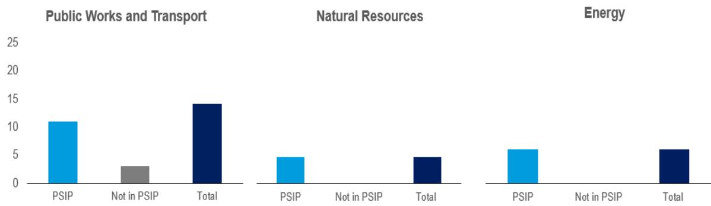  
Source: Staff Analysis of capital project allocations, Budget Book FY 2025/26, and Prioritized PSIP June 2025.

68. Establishing a rigorous project selection process on a firm legal basis is a high reform priority. Strengthening project selection will require building a credible pipeline of well-appraised projects, adopting a selection framework with clear, published criteria for guiding prioritization, and establishing a formal, centralized review process within the MoFDP to scrutinize major capital projects before their inclusion in the budget.

## Recommendations

Issue 4: Budgeting for capital is lacking in a number of key areas. i) capital projections in the MTFF do not guide the budget preparation process; ii) budget documentation does not provide a comprehensive account of public investment projects; project funding allocations are not protected during budget implementation.

Recommendation 4: Strengthen the budgeting for capital: i) require that the capital ceiling and final appropriation by ministry is aligned with the MTFF projections. All financing sources should be included; ii) include total costs of projects and their annual expenditures in the Budget Estimates Book (Budget year + medium term); iii) review the funding needs of ongoing projects to ensure that allocations are sufficient. (MoFDP Q1 2026).

Issue 5: There are no standard methodologies for assessing maintenance needs, and funding is volatile and insufficient.

Recommendation 5: Develop and formalize a framework for estimating routine maintenance and capital improvement needs and prepare a funding strategy. Publish them on the MoFDP website. (MDAs and MoFDP by Q3 2026).

Issue 6: The absence of a formal, structured framework for appraisal and project selection has resulted in the inclusion of poorly appraised projects in the budget.

Recommendation 6: Mandate in law i) MoFDP must ensure all major projects are fully appraised before being included in the pipeline for selection and ii) a selection process with use of standard criteria. Specific criteria can be defined in secondary regulation according to needs of the government. (MoFDP by Q1 2026).

## E. Investment Implementation

11. Procurement (Strength—Medium; Effectiveness—Low; Reform Priority—High)

69. Public procurement plays an increasingly strategic role in building modern infrastructure and delivering public services. Open competition for public procurement opportunities that leverage the use of technology strengthens transparency, enhances efficiency, helps generate fiscal savings, and builds trust in the government. A well-functioning system of independent procedures for dealing with procurement complaints can further support better outcomes.

70. The Procurement Act requires competitive procurement of projects but less than half of projects are subject to effective competition. The Lesotho Public Procurement Act, 2023, establishes the Lesotho Public Procurement Authority as an autonomous public procurement regulatory body under the MoFDP. Its mandate includes regulation, monitoring and enforcement of compliance, public procurement policy and control and formulating policy and standards for all aspects of public procurement. It is also given mandate to establish a Central Tender Board to carry out the procurement of major projects $^{21}$ . The Act mandates open, transparent, and competitive procurement for major projects, with timely and complete procurement information. It prohibits cartelization and collusion, requiring reliable data to be proactively disclosed, with clear rules on the type and timing of information to be published. For the Act to be operational, secondary regulations need to be put in place, including an updated Procurement Manual and standard procedures. However, this work has currently stalled. Only the Board and the Head of the Procurement Authority have been appointed. Currently, there is no operational database and a lack of data regarding effective competition for most projects. Anecdotal evidence indicates that while non-donor funded major projects are being procured, few are based on effective competitive procurement.

71. There is no central procurement database and no complete and timely information is made available. There is no requirement for a procurement database and standard reporting in the 2023 Act, except for the creation of a database of suppliers. It is unclear whether it will be included in the implementation regulations. Current regulations require the Public Procurement Authority to submit an annual report to the Minister of MoFDP to table before Parliament; however. No procurement database exist to monitor the procurement system. There is no online portal for stakeholders, including civil society and the public, that provides general public procurement information.

72. The 2023 Act requires an independent panel that reviews procurement complaints in a timely, public and enforceable manner but this is currently not in operation.. A Procurement Tribunal is required to review and decide on appeals against an award decision made by a procuring entity or the Central Tender Board. The Act provides for timely decision-making, publication and enforcement provisions. The Procurement Tribunal has not yet established. At the time of the Mission, there was no available data on the number of complaints in recent years, the time taken to resolve these, overturned procurement decisions, or procurement audits.

73. To ensure better implementation of its investment ambitions, Lesotho should swiftly operationalize the new procurement system. The new Act provides a sound and much needed basis for ensuring that assets are procured with integrity, transparency, and cost-efficiency. The new Central Tender Board's independence should be strongly supported and capital investment expertise should be prioritized when the board members are appointed.

12. Availability of Funding (Institutional Strength: Low; Effectiveness: Low; Reform Priority: High)

74. This institution assesses established systems, processes and tools to ensure that cash is available when needed to make payments for capital projects. Efficient implementation of investment projects requires certainty about availability of funds so that they can progress as planned. The three areas of focus include (i) cash flow forecasting and the reliability of cash flows; (ii) cash management mechanisms to ensure timely payments; and (iii) integration of external fund flows with the government bank account structure under the oversight of MoFDP. These aspects are meant to support smooth project delivery and are key to effective public investment management.

75. There is a legal and regulatory requirement for cash flow forecasting and quarterly allotments, but outturns deviate significantly from forecasts. The Treasury Regulations 2014 (Sections 12-14, 16-18) require the preparation of monthly cash flow forecasts, prescribe related mechanisms and procedures, and base the issuance of warrants on this. The Budget Call Circulars also reiterate this requirement as part of the budget preparation process. However, there is no requirement for these forecasts to be updated during the year, and the warrants to be issued quarterly in advance. The Cash Management Unit prepares quarterly and monthly cash forecasts; however, there are significant deviations between forecasts for cash inflows and outflows and outturns. Cash outflow forecasts were higher than actual payments by 14 and 11 percent, respectively, in 2023/24 and 2024/25. The inflows were overestimated by 25 percent and underestimated by 10 percent for the same years due to the absence of reliable information (Figure 34).

Figure 34: Cash Inflow and Outflow Forecast vs Actuals  
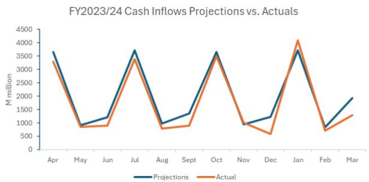

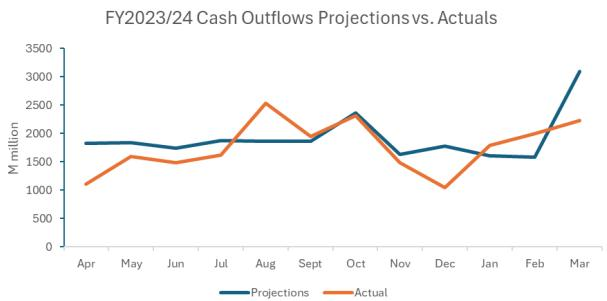

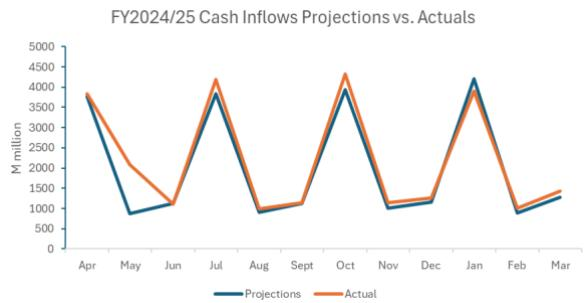  
Source: MoFDP Data and Staff Calculations

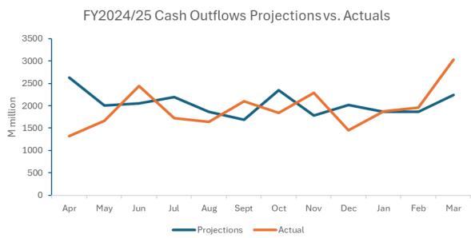

76. There are no formal mechanisms to ensure timely and predictable release of funds, payments are subject to cash rationing and there is evidence of arrears accumulation. The PFMA Act allows the Minister to withdraw the unspent and uncommitted balance of warrants in times of cash shortages, implying that payment of capital project invoices is not guaranteed. In practice, releases for capital expenditure are not made in advance for MDAs to be able to plan capital expenditure. Instead, these are released against individual payment requests by MDAs. The Capital Budget Annual Progress Report provides evidence of cash rationing, delays in payments, and accumulation of arrears on account of capital projects.. The stock of expenditure arrears stood at LSL1.285 billion in June 2023 (about 7 percent of total expenditure), $^{22}$ of which LSL1.199 billion that had supporting documentation has been paid by MoFDP. Of the amount paid, 19 percent related to arrears on capital projects. Of the new arrear claims of LSL615 million submitted by MDAs during FY2024/25, 39 percent relate to capital expenditure. $^{23}$

77. There is no legal requirement for external funding to be held in an account at the Central Bank and timely information on external financing is not available for cash management purposes. The bank accounts for the externally financed capital projects are held at the commercial banks. In practice, donors generally share information about their disbursements, but this is not available to MoFDP in a timely manner and is not used for cash forecasting or management purposes. The Budget Call Circulars require MDAs to submit balances in the project bank accounts for ongoing donor funded projects, but as these projects are implemented outside of the IFMIS, MoFDP has limited oversight on inflows and outflows during the year, from these bank accounts.

78. Enhancing the arrangements and practices for cash and commitment management will improve the predictability of funding for public investments. Strengthening the internal control framework, including at the commitment stage of the expenditure cycle in the IFMIS and further digitalization of the payment processes, will facilitate timely payments and prevent the recurrence of expenditure arrears. Further reforms should focus on comprehensive management of cash flows related to project expenditures through increasing the coverage of the cash flow forecasting to include externally funded projects, integration of donor's project bank accounts into the government TSA and better alignment of budget releases with commitments.

13. Portfolio Management and Oversight (Strength—Medium; Effectiveness: Low; Reform Priority: Medium)

79. A holistic approach to oversight across Government's wider public investment portfolio can assist with improved project delivery. This institution examines whether governments have adequate arrangements in place to monitor progress across its wider capital investment portfolio, the ability of MDAs to reallocate funding to those projects progressing more quickly than others and the role played by formalized ex post reviews in improving project performance.

80. The legal framework supports MoFDP's monitoring of major capital projects; however, there are weaknesses in project data which impact effectiveness. The PFMA Act requires MDAs to submit quarterly expenditure reports to the MoFDP, and the MoFDP utilizes these reports to produce quarterly and annual reports on the public investment program for submission to the Minister and the Cabinet. However, the information collected from MDAs does not include data for the majority of projects in relation to cost and schedule performance against the total project cost and overall project delivery schedule. Instead, it primarily focuses on the in-year performance against annual budget allocations. This negatively impacts the effectiveness of the current monitoring system to provide decision-makers with a portfolio-level perspective on delivery against the approved total project cost and schedule.

81. The PFMA Act provides a legal basis for the reallocation of funds between projects; however, there is no evidence that reallocation has accelerated implementation as the overall capital budget execution rate remains low. Section 15 of the PFMA Act allows for the reallocation of funds between capital projects subject to a certain financial threshold and the approval of both the Minister for Finance and Cabinet. The mechanism to allow for reallocation of funds between projects is not based on transparent and documented procedures but rather has evolved administratively. Under this system, MDAs submit reallocation proposals to the MoFDP for consideration during the financial year. The MoFDP then recommends proposals to the Minister, who ultimately seeks Cabinet approval. Notwithstanding the clear legal framework underpinning the reallocation of funds between projects, as well as the administrative process that has evolved to support that legal framework, reallocations have not contributed to a high execution rate for the capital budget with it averaging 53 percent over the last three financial years (Figure 35). Reasons for the lack of implementing capacity are found in weak appraisal and selection as well in the downstream implementing dimensions, especially with respect to the effectiveness as discussed under the institutions.

Figure 35. Capital Budget Execution Rates –  
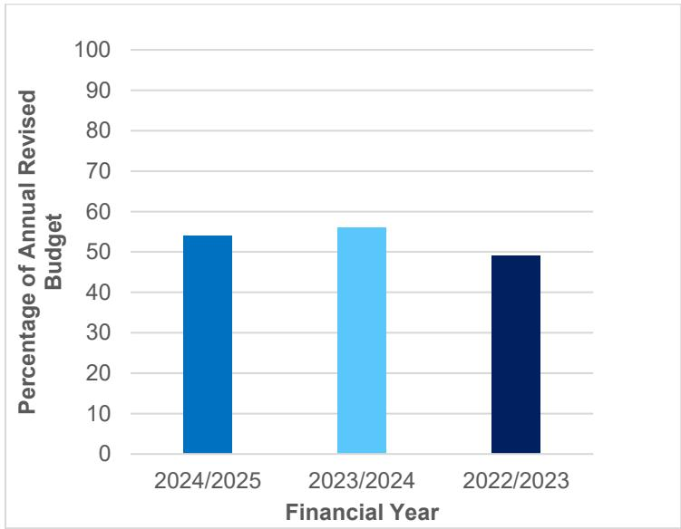  
Source: Staff Analysis of MoFDP Capital Budget Annual Progress Report

82. There is currently no formal requirement for ex post reviews of GOL funded major projects, although such reviews can be a feature of DP-funded projects. Ex post reviews of major projects focusing on project costs, deliverables, outputs and outcomes can share important lessons and improve the design, costing and implementation of future projects. In Lesotho there is no formal requirement for ex post reviews, although they do occur within some sectors such as roads and are also a feature of most development partner funded projects. As there is no systematic requirement for such reviews, the link between those that are conducted and changes to wider project implementation policies and procedures is weak. A new monitoring and evaluation policy has recently been approved which, if implemented, should help address identified deficiencies in this area.

83. Portfolio management and oversight should be strengthened with an increased focus on active management of the portfolio rather than reactive reporting of in-year variances. MoFDP's current reporting system provides a useful basis for further improvements to ensure performance measurement against overall budget and delivery schedule targets. The proposed development of the Public Sector Investment Database provides an opportunity to reconsider the nature and role of monitoring in informing budget reallocations to drive accelerated project implementation. It is important that the implementation of the new monitoring and evaluation policy is fully integrated within any proposed improvements to monitoring systems. This information could be used by the PSIC as it has a role in related areas (e.g. reallocation).

14. Management of Project Implementation (Strength: Low; Effectiveness: Low; Reform Priority: High)

84. Effective project implementation is required to realize the full benefits of public investment. MDAs should ensure that major projects have a suitably empowered senior responsible owner accountable for the execution of a comprehensive project implementation plan. As challenges arise during implementation there is a need to ensure procedures are in place to consider any proposed changes to project scope, function, schedule, or cost. Project specific audits conducted by the Supreme

Audit Institution can identify common problems and propose solutions in infrastructure governance and delivery.

85. Implementation plans are required in the appraisal process and prepared for most major projects but senior responsible officers are not required to be identified in advance. The MoFDP's Project Manual requires all projects to submit an implementation plan as part of the 'Proposal' appraisal stage. The Manual outlines requirements in relation to the structure of the plan, including submission of a detailed work breakdown structure; however, there is no requirement to identify a senior responsible officer. While most major projects do prepare implementation plans, they vary in terms of the level of detail provided and may require substantial amendment depending on the time elapsed between approval of the project proposal and securing project financing to allow for actual implementation. While the Manual does not specifically require identification of a senior responsible officer for projects, it does refer to implementation plans including the proposed management structure of a project. Authorities note that MDAs adopt different approaches toward project delivery structures, with some MDAs establishing Project Implementation Units due to donor requirements while others assign responsibilities as per existing functional areas.

86. There are no standardized rules and procedures for project adjustments, although there is a legal framework in relation to contract cost adjustments. The Procurement Act 2023 sets out clear rules in relation to the responsibilities of contracting entities regarding price escalation during contract implementation. The Act permits contracting entities to include a termination clause in contracts in instances where a price adjustment seeks to modify costs by more than 15 percent. However, there are no standardized rules and procedures regarding potential adjustments to a project's scope, location, function, schedule or cost and no evidence of any systematic approach to a fundamental review and reappraisal of major projects where significant adjustments are proposed.

87. There is a legal basis to allow the OAG to conduct audits of capital projects but very few special audits on major projects have been conducted in the last three years. Section 26 of the Audit Act 2016 provides for the OAG to conduct a special report on any matter, but transmittal to Parliament and publication is another matter. Only the responsible line Minister can present an OAG report to Parliament which allows for subsequent publication. . The OAG does not currently publish a work program outlining the type of audits it intends to conduct in each financial year and when it expects to publish its reports. Notwithstanding its legal basis, the number of special audits completed on major projects remains very low, with just one conducted since FY 2022 / 2023, which examined issues which arose during the construction of the New Royal Palace in Maseru and made a number of recommendations in relation to improving future project performance (see Box 5).

88. Strengthening accountability – both at the project level and the system level – can help improve major project performance. Major projects require a clearly identifiable senior responsible officer in the implementing agency with accountability for the successful implementation of the project. It would be useful to review the organizational project delivery structures across MDAs to ensure alignment with best practice and allow for lesson-learning among peers. A standardized approach toward the development and review of project implementation plans should ensure greater consistency and, subject to appropriate challenge of assumptions, provide greater assurance to authorities as to their feasibility. The potential benefits accruing from independent audits of project performance are well-documented internationally and evidenced also by the recent report of the OAG into the New Palace. It is important the

OAG has the resources to conduct such reviews on a regular basis and has the legal basis to submit those reviews directly to the legislature.

Box 5. Example of Performance Audit – New Royal Palace

By scrutinizing project performance national audit institutions can provide assurance to the legislature and citizens with regard to value for money and the realization of project outcomes and also make recommendations to improve the delivery of future projects.

In May 2025 the Office of the Auditor General submitted a report on the Construction of the New Royal Palace in Maseru to the responsible Minister for presentation to the National Assembly. In its report the OAG raised a number of issues with direct relevance to the effective management of project implementation, such as –

\- Poor project management: no formal appointment of a client-side project manager until some years after project inception

\- Document management system: failure to establish and maintain a fully functional document management system

• Absence of timelines: contracts did not stipulate timelines for delivery

\- Project adjustments: inadequate consideration of the impact of schedule extensions leading to time delays and cost increases

The timely designation of a senior responsible officer is important in providing a major project with a clear point of contact and a readily identifiable person accountable for delivery. A comprehensive project implementation plan should set out in detail issues such as a scope statement, work breakdown structure, schedule and cost baselines, as well as outlining the approach toward document management. Finally, having clear rules and procedures in relation to project adjustments applied systematically across all major projects can help mitigate the impact of major changes to project assumptions due to changes that occur during implementation.

This recent report of the OAG is a good example of the type of project specific audit that both examines issues with regard to historic performance and also makes recommendations which, if acted upon, can positively influence future project performance.

Source: Office of the Auditor General (2025); Audit Report on the Construction of the New Royal Palace in Maseru, Lesotho

## 15. Monitoring of Public Assets (Strength—Low; Effectiveness—Low; Reform Priority—Medium)

89. Monitoring of the accumulated infrastructure stock is a key prerequisite for effective planning for investments and management of the overall public stock, including maintenance. Efficient management of the asset portfolio requires comprehensive and up-to-date information on the existence, location, condition and the value of major public assets. This information is kept in an asset register and should be updated regularly. Information on the values and types of assets should be incorporated in the government's financial statements and depreciation charged as an indication of asset condition. This is a key input for informed decision making on asset maintenance, upgrades, renewal, replacements and the addition of new assets (Institution 9 and 10).

## 90. The legal and regulatory framework requires maintenance of asset registers, but the registers have only partial coverage and are not updated regularly. Section 5 of the PFMA Act

requires CAOs to register all assets within their respective spending units but there is no requirement for their regular updating. The Asset Management Policy and Asset Management Operating Procedural Guidelines (2020) approved by the Cabinet in August 2022 establishes an asset management framework that requires a consolidated asset register but this framework has not been operationalized. $^{24}$ Based on submissions from MDAs, Treasury has started work on consolidating a national asset register but this is limited in coverage and does not include the substantial infrastructure projects (roads, dams bridges, water supply networks). Fixed capital registers exist for some type of assets like roads which are maintained and updated by the Roads Directorate under the Ministry of Public Works and Transport. The Office of the Auditor General, in their annual reports have highlighted weaknesses in asset management practices (Box 6)

## Box 6: Lesotho: Weaknesses in Asset Management identified in Audit Reports

## The Audit Office has repeatedly identified gaps and weaknesses in asset management practices. These include:

■ Several MDAs fail to maintain and update asset registers

\- Inadequacy of disclosures of government owned assets including infrastructure, property and equipment

■ Differences in values of assets between valuation reports and financial statements

■ Missing assets not reported to Ministry of Finance

Road Construction equipment remaining idle

\- Neglect of government assets where they are in an abandoned and dilapidated state

■ Unauthorized use of government assets including land and buildings

Source: Audit Reports FY 2020, 2021 and 2022

91. There is no legal or regulatory requirement on providing systematic information about nonfinancial assets, and the accounting value of their stock is not disclosed in financial statements. The PFMA Act requires the preparation of annual financial statements based on International Public Sector Accounting Standards (IPSAS) but does not specify if it is cash or accrual. The Treasury Regulations require the AG to specify the basis of accounting for the financial statements. The financial statements are prepared on the cash-basis of accounting but are not in compliance with cash-basis IPSAS. Though it is not a mandatory requirement, cash-basis IPSAS encourage additional disclosures on the stock of non-financial assets in the financial statements. In the consolidated financial statements, fixed assets are expensed during the year and not capitalized and there is no additional disclosure on asset stocks. The Roads Directorate have information on asset values of roads, but this is not included in the consolidated financial statements.

92. There is no legal or regulatory requirement and depreciation is not recorded in the government financial statements. The current cash-basis accounting framework, which is based on the PFMA Act, and the Treasury Regulations, does not require recording or reporting of depreciation in the financial statements. The Asset Management Operating Procedural Guidelines (2020) that have not been operationalized prescribe the straight-line method over the asset's useful life for depreciation but the

guidance on the economic life of assets is incomplete as it does not cover the different categories of assets owned by GoL.

93. There are significant data gaps on the total value of Lesotho's public sector fixed assets and priority should be given to strengthen the management of asset registers. The first step should be to establish a comprehensive asset register of all major government assets with information about the type of asset, owner, location, and initial value based on simplified reports or surveys. More accurate and complete data will strengthen accountability for assets and provide better information for assessment and budgeting of maintenance needs of assets (Institution 9). MoFDP has decided on a version upgrade for their IFMIS and should consider activating the asset module in Epicor for the purposes of building the consolidated asset register. Preparing a comprehensive asset register will also require enforcement of the provisions in the PFMA Act, review, finalization and dissemination of the operational guidelines. Based on this information, the Treasury, as it works towards closing the compliance gaps with cash-basis IPSAS, should plan for including additional disclosures on the stock of non-financial assets in the annual financial statements.

## Recommendations

Issue 7: The Procurement Act (2023) is not operational, hindering effective procurement of infrastructure.

Recommendation 7: Operationalize the Act by finalizing implementing regulation, staff the Public Procurement Authority and Tender Board (MoFDP, Q3, 2025).

Issue 8: The release of funding to capital projects is not sufficient and is often delayed, leading to payment arrears and stalled projects.

Recommendation 8: Improve cash availability for capital projects that have been prioritized. Enhance the IFMIS internal control framework including commitment management and payment processing to ensure timely payments for capital projects. (MoFP, Accountant General Q4, 2026).

Issue 9: Insufficiently strong project delivery structures; weak monitoring of major project performance against total project cost

Recommendation 9: Strengthen portfolio monitoring of major projects by requiring MDAs to monitor delivery against total approved project cost and schedule and notify the MoFDP if projects are delayed; review project delivery structures across MDAs to identify improvements (MDAs, MoFDP, Q3, 2026).

Issue 10: The capital budget is underutilized.

Recommendation 10: Develop transparent rules and procedures regarding reallocations, (MoFDP, Q4 2026).

Issue 11: There is a lack of transparency and learning about project delivery performance.

Recommendation 11: Provide sufficient financing resources to the Office of Auditor General to fill its vacancies and build capacity to implement its mandate and legally empower the Auditor General to submit directly to the legislature and publish the audit reports (GoL, MoFDP, Q4 2026).

Issue 12: There is no comprehensive asset register incorporating all government assets.

Recommendation 12: Establish, update and disclose a consolidated register of major government assets with information about the type of assets, owner, location, initial value and current. (MoFDP, MDAs, Q3 2027).

## 4. Cross-Cutting Issues

## A. Legal and Regulatory Framework

94. There is currently no legal or regulatory framework specifically governing Public Investment Management in Lesotho. By strengthening the legal framework and providing clear tasks, duties and mandated processes a more effective and transparent PIM system can be put into operation. A key step in this process is the amendment of the Public Financial Management (PFM) Act. This will establish the legal authority for the PIM system, allocate key roles and responsibilities, and define the most important functions and procedures related to public investment, including how it is integrated with the budget process. Advice from the IMF on a previous PFM Bill may be of interest in this process.25

95. However, there are several related laws and regulations that are relevant to various aspects of the public investment process; some are already in place or are at different stages of development (See Table 7). It is essential to expedite the passage of key legislation, such as the Procurement Regulations and Competition Law and to establish a clear strategy for finalizing and enacting other necessary regulations, particularly those that are outdated and require revision to align with current Public Investment Management (PIM) objectives, to support a coherent and effective PIM system.

Table 7. Existing and Pending Legislation Relevant to Public Investment Management in Lesotho

<table><tr><td>LEGISLATION</td><td>STATUS</td><td>KEY ELEMENTS COVERED</td></tr><tr><td>1. Tenth Amendment of the Constitution</td><td>Tabled in Parliament</td><td>Strengthen procedures for supplementary budgets, public debt management, and mandating the independence and role of the Supreme Audit Institution to ensure accountability and transparency.</td></tr><tr><td>1. Public Debt and Aid Management Bill (2019)</td><td>Tabled in Parliament</td><td>Provide a framework for managing public debt and aid, for long-term debt and fiscal sustainability.</td></tr><tr><td>2. Public Financial Management Act (2021)</td><td>Enacted by Parliament and in force</td><td>Details the preparation, submission, approval, and execution of the annual government budget, linking it to national plans. Set out rules for the minister, borrowing and guarantees, PC oversight, financial reporting, audit and oversight.</td></tr><tr><td>3. Local Government Act (1996)</td><td>Enacted by Parliament</td><td>Provide for the establishment of Local Authorities</td></tr><tr><td>4. Competition Law (2022)</td><td>Enacted by Parliament, not promulgated</td><td>Ensures free market practices, competition authority, investigates anti-competitive behavior.</td></tr><tr><td>5. National Monitoring and Evaluation Policy (2025)</td><td>Draft</td><td>Institutional framework for the public sector monitoring and evaluation across the Government of Lesotho.</td></tr><tr><td>6. PPP policy, and the upcoming Act</td><td>No details</td><td>Provide a stronger enabling environment for use of PPP.</td></tr><tr><td>7. Procurement Act (2023)</td><td>Enacted by Parliament,</td><td>Establishment of the Public Procurement Authority; provides for procurement of works, supplies, and services in Government; and disposal of public assets.</td></tr><tr><td>8. Regulations of Procurement Act (2023)</td><td>To be soon approved by the Minister of Finance</td><td>To support the implementation of the Procurement Act (2023)</td></tr><tr><td>9. Updates to the Energy and Water Acts</td><td>Draft</td><td>To allow private participation.</td></tr></table>

## B. Information Technology

96. Efficient and transparent public investment management requires the support of strong information systems. While public investment management information systems (PIMIS) may be independent and separate, they will require integration with other government financial management information systems. The quality of the information system impacts the effectiveness of the different PIMA institutions. Depending on the country context, the IT functions important for efficient PIM include: project pipeline development (identification, preparation, design, and presentation); project appraisal; interfaces with the budgeting, procurement, budget execution, accounting, and asset management systems; project management; and project monitoring.

97. The IT system environment for planning, budgeting, accounting, and monitoring of public investments in Lesotho is weak and not highly automated. The existing systems supporting aspects of the PIM cycle include CBMS (budgeting); IFMIS (commitments controls, payments, accounting and reporting); Commonwealth Meridian (external financing); and Excel-based tools for fiscal analysis and cash flow forecasting. However, there is no system support for project planning, development, and approval. This fragmentation necessitates duplicate data entry, leading to inefficiencies and potential inaccuracies as in many other countries. The Department of Project Cycle Management in MoFDP manually collects information on public investment projects from various implementing agencies and maintains an Excel spreadsheet that is not regularly updated and does not effectively support the monitoring of projects throughout their life cycle.

98. The existing IT systems are limited in their coverage and not completely integrated to enable seamless processing of transactions and information. The IFMIS, for example, does not include externally financed projects or those implemented by EBUs, like the Road Directorate, which are implemented outside of the system. The IFMIS is integrated with CBMS but can only provide updated information on budget execution of some domestically funded projects. Monitoring of other projects is based on paper submissions from the respective MDAs. The Department of Project Cycle Management is unable to enforce timely submission, which hinders its ability to effectively perform its mandated PIM oversight role. The absence of a centralized database for projects complicates efforts to ensure that projects align with national priorities, budget constraints, and are monitored effectively. $^{26}$

99. The effectiveness and transparency of PIM functions could be enhanced by implementing a simple, fit-for-purpose PIMIS. The system should be practical, user-friendly, easy to maintain, and not require extensive support while also being fully integrated with existing MoFDP systems. The emphasis should be on using uniform project identification codes throughout the PIM cycle and standardizing data exchange protocols between the CBMS, IFMIS, and PIMIS. The system should be able to provide a consolidated overview of all public investment projects irrespective of funding sources, facilitate better decision making, and resource allocation. By focusing on a practical and easily manageable PIMIS, Lesotho could enhance its capacity to plan, implement, and monitor public investments in a transparent manner.

100. However, the global history of creating new systems, aligning them with current systems and ensuring that they are practical, user-friendly, easy to maintain, and not require extensive support is mixed. IT reforms routinely go over time and budget, prove difficult to develop as requested and can lead to extensive demands on senior management time. It will therefore be important for IT reforms not to be a distraction for the core reforms described elsewhere and be implemented in a gradual fashion. The IT updates needed should be considered as part of the PIM capacity development strategy.

## C. Capacity

101. The MoFDP plays a vital coordination role across MDAs in relation to investment planning and oversight and its capacity should be strengthened. It has established a structured framework to lead the investment planning process; however, there is a need to strengthen the role of the MoFDP in terms of portfolio monitoring and project appraisal. This presents an opportunity to reassess roles and responsibilities within the MoFDP to ensure alignment and coordination across the different departments currently involved in planning (including appraisal), allocation and implementation stages of the public investment cycle. There are various new initiatives proposed in areas such as PPPs, as well as monitoring and evaluation, and it is important that these initiatives complement rather than duplicate or diminish the critically important role to be developed in relation to portfolio monitoring. Authorities noted staffing gaps in various areas, along with inadequate expertise in public investment management. In addition to addressing any identified staffing gaps, the MoFDP should conduct an objective assessment of the mix of skills needed within MoFDP to effectively monitor and oversee public investment.

102. Ongoing issues with project implementation suggest a need to examine project delivery and oversight skills available within MDAs. The recent report by Parliamentary Committees on the Moshoeshoe airport project highlighted technical skills deficits both within the relevant Ministry and in terms of its capacity to oversee project implementation. $^{27}$ The report also noted evidence provided to the Committees that these issues are common to many other projects implemented by MDAs and are negatively impacting successful delivery. A recent academic study $^{28}$ noted particular issues in relation to the capacity of MDAs to actively manage contracts and while the newly established Lesotho Public Procurement Authority reports ambitious plans to upskill relevant staff across MDAs, to deliver on that ambition will require adequate, and sustained, resourcing.

<table><tr><td>Box 7. Example of Public – Private Engagement Structures to Improve Capital Project DeliveryIn Ireland Government established the Construction Sector Group (CSG) in 2018 to ensure regular and open dialogue between government and industry on how best to achieve, and maintain, a sustainable and innovative construction sector with the capacity and capabilities to assist with delivering Government’s capital investment portfolio.The CSG brings together representatives from relevant Ministries and a wide range of representative bodies from the construction sector, including architects, buildings materials, consulting engineers, construction industry, engineers, surveyors, planners and trade unions.The CSG focuses on issues that may impact on the successful delivery of the National Development Plan and also considers wider developments in the construction sector. Its remit includes:Working with industry and government bodies to (a) benchmark and improve productivity and environmental sustainability and (b) to modernize public works delivery.Considering opportunities to introduce reforms within the sector that will help in controlling construction price inflation, improving efficiency and delivering value for money.Assessing the supply of necessary skills and possible measures to enhance capacity (including potential use of overseas contractors).Issues arising from inadequate or ineffective regulation, poor performance and systemic poor quality.The Group is Chaired by the Secretary General of the Ministry of Public Expenditure, meets quarterly and reports to the Minister, with meeting agendas and minutes published on the Ministry’s website.Source: Department of Public Expenditure (2018);Construction Sector Group</td></tr></table>

103. Elsewhere there are significant areas for further capacity strengthening. The Office of the Auditor General is extremely restricted in terms of its activities due to staff resources which currently fill just over 25 percent of its approved staff complement. The Lesotho Public Procurement Authority has just one staff member at present, albeit recruitment is underway in relation to other posts. Authorities and stakeholders also noted capacity deficits with regard to the private sector, raising issues in relation to the regulation, and training, of professions in the construction sector and the need for better structured and transparent engagement between the public and private sectors to help address potential bottlenecks and improve delivery in the sector. Stakeholders also noted significant delays in payments from MDAs which impacts project delivery for ongoing projects and can make public contracts less attractive than those available in the private sector and potentially impacting competition for public capital projects.

Issue 13: Capacity issues are evident across the planning, implementation and monitoring phases of the project lifecycle

Recommendation 13: Develop a medium-term PIM capacity development strategy reviewing roles, responsibilities and skills, training needs and IT system upgrades (see above in Section B).

Planning & Allocation:

\- Review the roles, responsibilities and skills of different departments within MoFDP in relation to planning and budgeting to ensure a streamlined 'whole of Ministry' perspective both internally and externally.

As part of that review consider the training needs required within MoFDP both in terms of its internal roles and responsibilities and its external facing role in supporting MDAs in terms of their PIM responsibilities

## Implementation:

\- Review the project delivery structures, and available skillsets, of MDAs to drive greater consistency in delivery and/or development of centers of excellence

\- Consider establishing a structured and transparent forum for engagement between the public and private sector to discuss issues in relation to capital project delivery (See Box 7)

\- Implement the new M&E policy (noting the proposed review of roles, responsibilities and skills above) and formalize the role of the MoFDP in terms of portfolio oversight.

■ Develop a consolidated ICT Strategy for PIM and related activities.

Annex 1. PIMA Action Plan

<table><tr><td>Issue</td><td>Recommendations</td><td>Action</td><td>Responsibility</td><td>Timing</td></tr><tr><td colspan="5">Planning of Public Investment</td></tr><tr><td>1. National and sector strategies are inefficient in guiding investment planning.</td><td>Update the NSDP covering the main infrastructure sectors (energy, transport, water) including major infrastructure projects, with indicative costing and output targets.</td><td>Constitute a Working Group in the MoFDP and the Prime Minister Office to outline main objectives of the NSDPIssue clear guidelines to MDAs on the preparation of their major projects, cost estimates, outputsInclude 5-year or longer estimated capital resources for each ministryProvide support to MDAs in preparation of their investment plans in line with the guidelinesConsult other stakeholders within and outside government</td><td>MoFDP</td><td>Q1 2027</td></tr><tr><td>2. There is no rules-based system for capital transfer between central government and SNGs</td><td>Introduce a rules-based system for capital transfers for key SNG investment programs to encourage medium-term planning and increase delivery efficiency</td><td>Mandate a commission to study the current fiscal relations across levels of government and needed reforms including for capital transfers building on reginoal models and experiences from the last decade.Develop a rule-based formula for transfers for capital investment and the associated rules linking it to the planning process.</td><td>Ministry of Local Government, MoFDP</td><td>Q2 2026.</td></tr><tr><td>3. There is a lack of central government oversight of SOE investment plans.</td><td>Update the PFMA Act with a requirement that PCs include their investment plans in the mandated report to the MoFDP on activities for the next three years. Attach an annex tothe Budget Estimates Book containing major investment projects of PCs.</td><td>Prepare the needed edits and include in the draft PFMA Act to be submitted to Parliament for Approval along with other updates.</td><td>MoFDP</td><td>Q1 2026.</td></tr><tr><td colspan="5">Public Investment Allocation</td></tr><tr><td>4. Budgeting for capital is lacking in a number of key areas. i) capital projections in the MTFF do not guide the budget preparation process; ii) budget documentation does not provide a comprehensive account of public investment projects; project funding allocations are not protected during budget implementation.</td><td>Strengthen the budgeting for capital: i) require that the capital ceiling and final appropriation by ministry is aligned with the MTFF projections. All financing sources should be included; ii) include total costs of projects and their annual expenditures in the Budget Estimates Book (Budget year + medium term); iii) review the funding needs of ongoing projects to ensure that allocations are sufficient.</td><td>Align capital expenditure projections in the MTEF with the medium-term fiscal framework to ensure consistency over a rolling three-year period.Include both GoL and external financing in capital expenditure ceilings, based on public investment plans.Review the funding needs of ongoing projects and ensure that they have sufficient budgetary allocationsPrepare the needed edits and include in the draft PFMA Act to be submitted to Parliament for Approval along with other updates.</td><td>MoFDP</td><td>Q3 2025.</td></tr><tr><td>5. There are no standard methodologies for assessing maintenance needs, and funding is volatile and insufficient</td><td>Develop and formalize a framework for estimating routine maintenance and capital improvement needs and prepare a funding strategy. Publish them on the MoFDP website.</td><td>Develop routine and capital maintenance methodologies for MDA assets under its purview.Provide training to staff of MDAs on the use of methodologies.Estimate the cost of maintenance of assets and publish the results.Prepare a strategy on financing backlog maintenance requirements and future needs.</td><td>MDAs and MoFDP by</td><td>Q3 2026.</td></tr><tr><td>6. The absence of a formal, structured framework for appraisal and project selection has resulted in the inclusion ofpoorly appraised projects in the budget.</td><td>Mandate in law that the MoFDP must ensure all projects are fully appraised before being included in the pipeline for selection and thestandard criteria to be used for selecting projects to be included in the budget.</td><td>Amend the PFMA ActUpdate the Project Appraisal Guidelines to be comprehensive andrelate to the size and complexity of projects.Provide training on project appraisals to planning staff of MDAs responsible for public investments.Establish a scoring system, which includes criteria, to select projects.Build a credible list (pipeline) of appraised projects before the budget preparation process.Create a consolidated database of projects, which should be simple and accessible.</td><td></td><td>MoFDP by Q3 2025.</td></tr><tr><td colspan="5">Public Investment Implementation</td></tr><tr><td>7.The Procurement Act (2023) is not operational, hindering effective procurement of infrastructure.</td><td>Operationalize the Public Procurement Act by finalizing implementing regulations, fund and staff the Public Procurement Authority and Tender Board appropriately.</td><td>Finalize the implementing regulationsFully staff the Public Procurement AuthorityOperationalize the Tender BoardTrain the staff of the Public Procurement Authority and staff from MDAs planned to participate in the procurement processCollect and build databases to analyze and monitor the implementation of the Public Procurement Act</td><td>MoFDP</td><td>Q3, 2025</td></tr><tr><td>8. The release of funding to capital projects is not sufficient and is often delayed, leading to payment arrears and stalled projects.</td><td>Improve cash availability for capital projects that have been prioritized.</td><td>Continue to strengthen the cash management human capacity and IT systems.Enhance the IFMIS internal control framework, including commitment management and payment processing, to ensure timely payments for capital projects.</td><td>Accountant General</td><td>Q4, 2026.</td></tr><tr><td>9. Delivery capacity is lagging and weak monitoring of major project performance against total project cost and overall delivery schedule.</td><td>Review project delivery structures across MDAs to ensure alignment with best practice Strengthen portfolio monitoring of major projects by requiring MDAs to monitor delivery against the total approved project cost and schedule, and to include updates in relation to same in regular reports to MoFDP;.</td><td>· Review project delivery structures as part of the PIM Capacity Development Strategy and identify needed changes – possibly in cooperation with IFIs.· Develop the Public Sector Investment Database· Provide training to the staff of MDAs on implementation and monitoring of project investments· Issue guidelines to MDAs on requirements to periodically monitor their projects· Develop transparent performance-based rules and procedures regarding reallocations between projects</td><td>MDAs, MoFDP</td><td>Q3, 2026</td></tr><tr><td>10. Reallocations are not used to reroute excess funding in a timely manner to projects.</td><td>Develop transparent rules and procedures regarding reallocations.</td><td>· Identify the bottlenecks in the current procedures for reallocation.· Develop guidelines for a quicker and less bureaucratic procedure for reallocation within existing PFMA Act.</td><td>MoFDP,</td><td>Q4 2026.</td></tr><tr><td>11. There is a lack of transparency and learning about project delivery performance.</td><td>Provide sufficient financing resources to the Office of Auditor General to fill its vacancies and build capacity to implement its mandate and legally empower the Auditor General to submit directly to the legislature and publish the audit reports.</td><td>· Allocate additional ressources to the OAG· Update the PFMA Act giving the OAG the mandate to submit reports director to the Parliament and publish results.</td><td>GoL, MoFDP</td><td>Q4 2026.</td></tr><tr><td>12. There is no comprehensive asset register incorporating all government assets.</td><td>Establish, update, and disclose a consolidated register of major government assets with information about the type of assets, owner, location, initial value and current value in compliance with cash basis IPSAS.</td><td>· Prepare guidelines on registering public assets· Provide training to staff of MDAs on assets register· Develop a database for asset register</td><td>MoFDP, MDAs</td><td>Q3 2027</td></tr><tr><td>13. Capacity issues are evident across the planning, implementation and monitoring phases of the project lifecycle.</td><td>Develop a medium-term PIM capacity development strategy reviewing roles, responsibilities and skills, training needs and IT updates.</td><td>Review the roles, responsibilities and skills of different departments within MoFDP in relation to planning and budgeting to ensure a streamlined 'whole of Ministry' perspective both internally and externally.As part of that review consider the training needs required within MoFDP both in terms of its internal roles and responsibilities and its external facing role in supporting MDAs in terms of their PIM responsibilitiesReview the project delivery structures, and available skillsets, of MDAs to drive greater consistency in delivery and/or development of centers of excellenceConsider establishing a structured and transparent forum for engagement between the public and private sector to discuss issues in relation to capital project delivery (See Box 7)Implement the new M&amp;E policy (noting the proposed review of roles, responsibilities and skills above) and formalize the role of the MoFDP in terms of portfolio oversight.Develop a consolidated ICT Strategy for PIM and related activities.</td><td>MoFDP,</td><td>Q3, 2026</td></tr></table>

## Annex 2. Detailed Scores

The following color coding is used in presenting the scores:

<table><tr><td>Score</td><td>1</td><td>2</td><td>3</td></tr><tr><td>Color</td><td></td><td></td><td></td></tr></table>

<table><tr><td colspan="3">A. Planning</td></tr><tr><td></td><td>Institutional Design</td><td>Effectiveness</td></tr><tr><td>1.a.</td><td>1</td><td>2</td></tr><tr><td>1.b.</td><td>1</td><td>1</td></tr><tr><td>1.c.</td><td>2</td><td>1</td></tr><tr><td>2.a.</td><td>1</td><td>1</td></tr><tr><td>2.b.</td><td>1</td><td>1</td></tr><tr><td>2.c.</td><td>1</td><td>1</td></tr><tr><td>3.a.</td><td>3</td><td>3</td></tr><tr><td>3.b.</td><td>1</td><td>1</td></tr><tr><td>3.c.</td><td>2</td><td>2</td></tr><tr><td>4.a.</td><td>1</td><td>2</td></tr><tr><td>4.b.</td><td>2</td><td>1</td></tr><tr><td>4.c.</td><td>2</td><td>1</td></tr><tr><td>5.a.</td><td>2</td><td>2</td></tr><tr><td>5.b.</td><td>2</td><td>1</td></tr><tr><td>5.c.</td><td>1</td><td>2</td></tr></table>

<table><tr><td colspan="3">B. Allocation</td></tr><tr><td></td><td>Institutional Design</td><td>Effectiveness</td></tr><tr><td>6.a.</td><td>2</td><td>1</td></tr><tr><td>6.b.</td><td>2</td><td>1</td></tr><tr><td>6.c.</td><td>1</td><td>1</td></tr><tr><td>7.a.</td><td>2</td><td>2</td></tr><tr><td>7.b.</td><td>2</td><td>2</td></tr><tr><td>7.c.</td><td>2</td><td>2</td></tr><tr><td>8.a.</td><td>1</td><td>1</td></tr><tr><td>8.b.</td><td>2</td><td>2</td></tr><tr><td>8.c.</td><td>2</td><td>1</td></tr><tr><td>9.a.</td><td>1</td><td>1</td></tr><tr><td>9.b.</td><td>1</td><td>1</td></tr><tr><td>9.c.</td><td>3</td><td>2</td></tr><tr><td>10.a.</td><td>1</td><td>1</td></tr><tr><td>10.b.</td><td>1</td><td>1</td></tr><tr><td>10.c.</td><td>2</td><td>2</td></tr></table>

<table><tr><td colspan="3">C. Implementation</td></tr><tr><td></td><td>Institutional Design</td><td>Effectiveness</td></tr><tr><td>11.a.</td><td>2</td><td>1</td></tr><tr><td>11.b.</td><td>1</td><td>1</td></tr><tr><td>11.c.</td><td>3</td><td>1</td></tr><tr><td>12.a.</td><td>2</td><td>1</td></tr><tr><td>12.b.</td><td>1</td><td>1</td></tr><tr><td>12.c.</td><td>1</td><td>1</td></tr><tr><td>13.a.</td><td>2</td><td>1</td></tr><tr><td>13.b.</td><td>2</td><td>1</td></tr><tr><td>13.c.</td><td>1</td><td>1</td></tr><tr><td>14.a.</td><td>2</td><td>2</td></tr><tr><td>14.b.</td><td>1</td><td>1</td></tr><tr><td>14.c.</td><td>1</td><td>1</td></tr><tr><td>15.a.</td><td>2</td><td>1</td></tr><tr><td>15.b.</td><td>1</td><td>1</td></tr><tr><td>15.c.</td><td>1</td><td>1</td></tr></table>

## Annex 3. Lesotho Highland Water Project (LWHP)

The LHWP is a joint water project between Lesotho and South Africa conceived to address a simple question: "Can South Africa tap Lesotho's highland water resources to alleviate its structural water shortages—while also benefiting Lesotho and minimizing environmental and social impacts?"

## Genesis

This idea had been long circulated among hydrologists and civil engineers in the region, with its origins dating back to regional hydrological studies in the 1950s–70s. These studies confirmed that a mega water project involving (1) capturing water from Senqu/Orange River system within Lesotho using highland dams; and (2) transporting it to South Africa's industrial heartland (Gauteng); (3) using gravity-fed long underground concrete tunnel system was technically and economically feasible—despite large upfront costs. There concepts were eventually internalized by the authorities, leading to formal treaty negotiations between Kingdom of Lesotho and Republic of South Africa in the early 1980s.

## 1986 Treaty

1986 Treaty formalized LHWP and included following key elements: (1) Lesotho agreed to export its water to South Africa; (2) Engineering work within the Lesotho would be executed by Lesotho Highland Development Corporation (LHDC); (3) Costs related to South African export portion of the project would be borne by South Africa; and (4) Lesotho would receive water royalties in return.

Negotiations focused on three issues: (i) water pricing and royalty structure (ii) governance and sovereignty over infrastructure and (iii) environmental and social safeguards. These were resolved through (i) adopting a joint government model (ii) ensuring minimum water delivery volumes and (iii) putting in clear provisions for dispute resolution and treaty revision.

## Phase I

Phase I aimed at building capacity to deliver 18 m $^{3}$ /s of water to South Africa and also generate hydroelectric power for Lesotho (after first meeting minimum water delivery volumes). After delays due to financing negotiations, environment and social impact assessments, and other technical complications the construction began in 1996 and was implemented in two sub-phases:

■ Phase IA (1998) Katse Dam, transfer tunnel to South Africa.

■ Phase IB (2003): Mohale Dam.

Total cost was approximately \$2 billion, with modest overrun due to terrain and resettlement costs.

## Phase II

Phase II aims to expand water delivery to $23 \, m^{3}/s$ by building further capacity. Key components and their progress (as of 2025H1) are:

■ Polihali Dam (27 percent progress)

■ Pohali Transfer Tunnels (41 percent progress)

■ Sengu bridge (82 percent progress)

\- Khubelu & Mabunyaneng bridge (52 percent progress)

Like Phase I, Phase II faced a 4-year delay (2015–2019) due to financing and procurement issues. Further delays occurred due to the COVID-19 pandemic and other operational challenges. The project reached peak implementation in early 2025 and is expected to wind down over the next 4–5 years.

## Outcome

To date, the LHWP has delivered 19.58 billion cubic meters of water to South Africa. Lesotho has earned a cumulative R19.157 billion in water royalties. In 2024 alone, royalties reached R2 billion, and this is projected to increase by approximately 28% upon completion of Phase II.

## Annex 4. PIMA Questionnaire

<table><tr><td colspan="2" rowspan="2">Indicator</td><td colspan="3">Scoring</td></tr><tr><td>1 = To no or a lesser extent</td><td>2 = To some extent</td><td>3 = To a greater extent</td></tr><tr><td colspan="5">A. Planning Sustainable Levels of Public Investment</td></tr><tr><td colspan="5">1. Fiscal targets and rules: Does the government have fiscal institutions to support fiscal sustainability and to facilitate medium-term planning for public investment?</td></tr><tr><td>1.a.</td><td>Is there a target or limit for government to ensure debt sustainability?</td><td>There is no target or limit to ensure debt sustainability.</td><td>There is at least one target or limit to ensure central government debt sustainability.</td><td>There is at least one target or limit to ensure general government debt sustainability.</td></tr><tr><td>1.b.</td><td>Is fiscal policy guided by one or more permanent fiscal rules?</td><td>There are no permanent fiscal rules.</td><td>There is at least one permanent fiscal rule applicable to central government.</td><td>There is at least one permanent fiscal rule applicable to central government, and at least one comparable rule applicable to a major additional component of general government, such as subnational government (SNG).</td></tr><tr><td>1.c.</td><td>Is there a medium-term fiscal framework (MTFF) to align budget preparation with fiscal policy?</td><td>There is no MTFF prepared prior to budget preparation.</td><td>There is an MTFF prepared prior to budget preparation but it is limited to fiscal aggregates, such as expenditure, revenue, the deficit, or total borrowing.</td><td>There is an MTFF prepared prior to budget preparation, which includes fiscal aggregates and allows distinctions between recurrent and capital spending, and ongoing and new projects.</td></tr><tr><td colspan="5">2. National and Sectoral Planning: Are investment allocation decisions based on sectoral and inter-sectoral strategies?</td></tr><tr><td>2.a.</td><td>Does the government prepare national and sectoral strategies for public investment?</td><td>National or sectoral public investment strategies or plans are prepared, covering only some projects found in the budget.</td><td>National or sectoral public investment strategies or plans are published covering projects funded through the budget.</td><td>Both national and sectoral public investment strategies or plans are published and cover all projects funded through the budget regardless of financing source (e.g. donor, public corporation (PC), or PPP financing).</td></tr><tr><td>2.b.</td><td>Are the government's national and sectoral strategies or plans for public investment costed?</td><td>The government's investment strategies or plans include no cost information on planned public investment.</td><td>The government's investment strategies include broad estimates of aggregate and sectoral investment plans.</td><td>The government's investment strategies include costing of individual, major investment projects within an overall financial constraint.</td></tr><tr><td>2.c.</td><td>Do sector strategies include measurable targets for the outputs and outcomes of investment projects?</td><td>Sector strategies do not include measurable targets for outputs or outcomes.</td><td>Sector strategies include measurable targets for outputs (e.g., miles of roads constructed).</td><td>Sector strategies include measurable targets for both outputs and outcomes (e.g., reduction in traffic congestion).</td></tr><tr><td colspan="5">3. Coordination between Entities: Is there effective coordination of the investment plans of central and other government entities?</td></tr><tr><td>3.a.</td><td>Is capital spending by SNGs, coordinated with the central government?</td><td>Capital spending plans of SNGs are not submitted to, nor discussed with central government.</td><td>Major SNG capital spending plans are published alongside central government investments, but there are no formal discussions, between the central government and SNGs on investment priorities.</td><td>Major SNG capital spending plans are published alongside central government investments, and there are formal discussions between central government and SNGs on investment priorities.</td></tr><tr><td>3.b.</td><td>Does the central government have a transparent, rule-based system for making capital transfers to SNGs, and for providing timely information on such transfers?</td><td>The central government does not have a transparent rule-based system for making capital transfers to SNGs.</td><td>The central government uses a transparent rule-based system for making capital transfers to SNGs, but SNGs are notified about expected transfers less than six months before the start of each fiscal year.</td><td>The central government uses a transparent rule-based system for making capital transfers to SNGs, and expected transfers are made known to SNGs at least six months before the start of each fiscal year.</td></tr><tr><td>3.c</td><td>Are contingent liabilities arising from capital projects of SNGs, PCs, and PPPs reported to the central government?</td><td>Contingent liabilities arising from major projects of SNGs, PCs, and PPPs are not reported to the central government.</td><td>Contingent liabilities arising from major projects of SNGs, PCs, and PPPs are reported to the central government, but are generally not presented in the central government's budget documents.</td><td>Contingent liabilities arising from major projects of SNGs, PCs, and PPPs are reported to the central government, and are presented in full in the central government's budget documents.</td></tr><tr><td colspan="5">4. Project Appraisal: Are project proposals subject to systematic project appraisal?</td></tr><tr><td>4.a.</td><td>Are major capital projects subject to rigorous technical, economic, and financial analysis?</td><td>Major capital projects are not systematically subject to rigorous, technical, economic, and financial analysis.</td><td>Major projects are systematically subject to rigorous technical, economic, and financial analysis.</td><td>Major projects are systematically subject to rigorous technical, economic, and financial analysis, and selected results of this analysis are published or undergo independent external review.</td></tr><tr><td>4.b.</td><td>Is there a standard methodology and central support for the appraisal of projects?</td><td>There is no standard methodology or central support for project appraisal.</td><td>There is either a standard methodology or central support for project appraisal.</td><td>There is both a standard methodology and central support for project appraisal.</td></tr><tr><td>4.c.</td><td>Are risks taken into account in conducting project appraisals?</td><td>Risks are not systematically assessed as part of the project appraisal.</td><td>A risk assessment covering a range of potential risks is included in the project appraisal.</td><td>A risk assessment covering a range of potential risks is included in the project appraisal, and plans are prepared to mitigate these risks.</td></tr><tr><td colspan="5">5. Alternative Infrastructure Financing: Is there a favorable climate for the private sector, PPPs, and PCs to finance in infrastructure?</td></tr><tr><td>5.a.</td><td>Does the regulatory framework support competition in contestable markets for economic infrastructure (e.g., power, water, telecoms, and transport)?</td><td>Provision of economic infrastructure is restricted to domestic monopolies, or there are few established economic regulators.</td><td>There is competition in some economic infrastructure markets, and a few economic regulators have been established.</td><td>There is competition in major economic infrastructure markets, and economic regulators are independent and well established.</td></tr><tr><td>5.b.</td><td>Has the government published a strategy/policy for PPPs, and a legal/regulatory framework which guides the preparation, selection, and management of PPP projects?</td><td>There is no published strategy/policy framework for PPPs, and the legal/regulatory framework is weak.</td><td>A PPP strategy/policy has been published, but the legal/regulatory framework is weak.</td><td>A PPP strategy/policy has been published, and there is a strong legal/regulatory framework that guides the preparation, selection, and management of PPP projects.</td></tr><tr><td>5.c.</td><td>Does the government oversee the investment plans of public corporations (PCs) and monitor their financial performance?</td><td>The government does not systematically review the investment plans of PCs.</td><td>The government reviews the investment plans of PCs, but does not publish a consolidated report on these plans or the financial performance of PCs.</td><td>The government reviews and publishes a consolidated report on the investment plans and financial performance of PCs.</td></tr><tr><td colspan="5">B. Ensuring Public Investment is Allocated to the Right Sectors and Projects</td></tr><tr><td colspan="5">6. Multi-Year Budgeting: Does the government prepare medium-term projections of capital spending on a full cost basis?</td></tr><tr><td>6.a.</td><td>Is capital spending by ministry or sector forecasted over a multiyear horizon?</td><td>No projections of capital spending are published beyond the budget year.</td><td>Projections of total capital spending are published over a three to five-year horizon.</td><td>Projections of capital spending disaggregated by ministry or sector are published over a three to five-year horizon.</td></tr><tr><td>6.b</td><td>Are there multiyear ceilings on capital expenditure by ministry, sector, or program?</td><td>There are no multiyear ceilings on capital expenditure by ministry, sector, or program.</td><td>There are indicative multiyear ceilings on capital expenditure by ministry, sector, or program.</td><td>There are binding multiyear ceilings on capital expenditure by ministry, sector, or program.</td></tr><tr><td>6.c.</td><td>Are projections of the total construction cost of major capital projects published?</td><td>Projections of the total construction cost of major capital projects are not published.</td><td>Projections of the total construction cost of major capital projects are published.</td><td>Projections of the total construction cost of major capital projects are published, together with the annual breakdown of these cost over a three-five-year horizon.</td></tr><tr><td colspan="5">7. Budget Comprehensiveness and Unity: To what extent is capital spending, and related recurrent spending, undertaken through the budget process?</td></tr><tr><td>7.a.</td><td>Is capital spending mostly undertaken through the budget?</td><td>Significant capital spending is undertaken by extra-budgetary entities with no legislative authorization or disclosure in the budget documentation.</td><td>Significant capital spending is undertaken by extra-budgetary entities, but with legislative authorization and disclosure in the budget documentation.</td><td>Little or no capital spending is undertaken by extra-budgetary entities.</td></tr><tr><td>7.b.</td><td>Are all capital projects, regardless of financing source, shown in the budget documentation?</td><td>Capital projects are not comprehensively presented in the budget documentation, including PPPs, externally financed, and PCs' projects.</td><td>Most capital projects are included in the budget documentation, but either PPPs, externally financed, or PCs' projects are not shown.</td><td>All capital projects, regardless of financing sources, are included in the budget documentation.</td></tr><tr><td>7.c.</td><td>Are capital and recurrent budgets prepared and presented together in the budget?</td><td>Capital and recurrent budgets are prepared by separate ministries, and/or presented in separate budget documents.</td><td>Capital and recurrent budgets are prepared by a single ministry and presented together in the budget documents, but without using a program or functional classification.</td><td>Capital and recurrent budgets are prepared by a single ministry and presented together in the budget documents, using a program or functional classification.</td></tr><tr><td colspan="5">8. Budgeting for Investment: Are investment projects protected during budget implementation?</td></tr><tr><td>8.a.</td><td>Are total project outlays appropriated by the legislature at the time of a project's commencement?</td><td>Outlays are appropriated on an annual basis, but information on total project costs is not included in the budget documentation.</td><td>Outlays are appropriated on an annual basis, and information on total project costs is included in the budget documentation.</td><td>Outlays are appropriated on an annual basis and information on total project costs, and multiyear commitments is included in the budget documentation.</td></tr><tr><td>8.b.</td><td>Are in-year transfers of appropriations (virement) from capital to current spending prevented?</td><td>There are no limitations on virement from capital to current spending.</td><td>The finance ministry may approve virement from capital to current spending.</td><td>Virement from capital to current spending requires the approval of the legislature.</td></tr><tr><td>8.c</td><td>Is the completion of ongoing projects given priority over starting new projects?</td><td>There is no mechanism in place to protect funding of ongoing projects.</td><td>There is a mechanism to protect funding for ongoing projects in the annual budget.</td><td>There is a mechanism to protect funding for ongoing projects in the annual budget and over the medium term.</td></tr><tr><td colspan="5">9. Maintenance Funding: Are routine maintenance and major improvements receiving adequate funding?</td></tr><tr><td>9.a.</td><td>Is there a standard methodology for estimating routine maintenance needs and budget funding?</td><td>There is no standard methodology for determining the needs for routine maintenance.</td><td>There is a standard methodology for determining the needs for routine maintenance and its cost.</td><td>There is a standard methodology for determining the needs for routine maintenance and its cost, and the appropriate amounts are generally allocated in the budget.</td></tr><tr><td>9.b.</td><td>Is there a standard methodology for determining major improvements (e.g. renovations, reconstructions, enlargements) to existing assets, and are they included in national and sectoral investment plans?</td><td>There is no standard methodology for determining major improvements, and they are not included in national or sectoral plans.</td><td>There is a standard methodology for determining major improvements, but they are not included in national or sectoral plans.</td><td>There is a standard methodology for determining major improvements, and they are included in national or sectoral plans.</td></tr><tr><td>9.c.</td><td>Can expenditures relating to routine maintenance and major improvements be identified in the budget?</td><td>Routine maintenance and major improvements are not systematically identified in the budget.</td><td>Routine maintenance and major improvements are systematically identified in the budget.</td><td>Routine maintenance and major improvements are systematically identified in the budget, and are reported.</td></tr><tr><td colspan="5">10. Project Selection: Are there institutions and procedures in place to guide project selection?</td></tr><tr><td>10.a.</td><td>Does the government undertake a central review of major project appraisals before decisions are taken to include projects in the budget?</td><td>Major projects (including donor- or PPP-funded) are not reviewed by a central ministry prior to inclusion in the budget.</td><td>Major projects (including donor- or PPP-funded) are reviewed by a central ministry prior to inclusion in the budget.</td><td>All major projects (including donor- or PPP-funded) are scrutinized by a central ministry, with input from an independent agency or experts prior to inclusion in the budget.</td></tr><tr><td>10.b.</td><td>Does the government publish and adhere to standard criteria, and stipulate a required process for project selection?</td><td>There are no published criteria or a required process for project selection.</td><td>There are published criteria for project selection, but projects can be selected without going through the required process.</td><td>There are published criteria for project selection, and generally projects are selected through the required process.</td></tr><tr><td>10.c.</td><td>Does the government maintain a pipeline of appraised investment projects for inclusion in the annual budget?</td><td>The government does not maintain a pipeline of appraised investment projects.</td><td>The government maintains a pipeline of appraised investment projects but other projects may be selected for financing through the annual budget.</td><td>The government maintains a comprehensive pipeline of appraised investment projects, which is used for selecting projects for inclusion in the annual budget, and over the medium term.</td></tr></table>

<table><tr><td colspan="5">C. Delivering Productive and Durable Public Assets</td></tr><tr><td colspan="5">11. Procurement</td></tr><tr><td>11.a.</td><td>Is the procurement process for major capital projects open and transparent?</td><td>Few major projects are tendered in a competitive process, and the public has limited access to procurement information.</td><td>Many major projects are tendered in a competitive process, but the public has only limited access to procurement information.</td><td>Most major projects are tendered in a competitive process, and the public has access to complete, reliable and timely procurement information.</td></tr><tr><td>11.b</td><td>Is there a system in place to ensure that procurement is monitored adequately?</td><td>There is no procurement database, or the information is incomplete or not timely for most phases of the procurement process.</td><td>There is a procurement database with reasonably complete information, but no standard analytical reports are produced from the database.</td><td>There is a procurement database with reasonably complete information, and standard analytical reports are produced to support a formal monitoring system.</td></tr><tr><td>11.c</td><td>Are procurement complaints review process conducted in a fair and timely manner?</td><td>Procurement complaints are not reviewed by an independent body.</td><td>Procurement complaints are reviewed by an independent body, but the recommendations of this body are not produced on a timely basis, nor published, nor rigorously enforced.</td><td>Procurement complaints are reviewed by an independent body whose recommendations are timely, published, and rigorously enforced.</td></tr><tr><td colspan="5">12. Availability of Funding: Is financing for capital spending made available in a timely manner?</td></tr><tr><td>12.a.</td><td>Are ministries/agencies able to plan and commit expenditure on capital projects in advance on the basis of reliable cash-flow forecasts?</td><td>Cash-flow forecasts are not prepared or updated regularly, and ministries/agencies are not provided with commitment ceilings in a timely manner.</td><td>Cash-flow forecasts are prepared or updated quarterly, and ministries/agencies are provided with commitment ceilings at least a quarter in advance.</td><td>Cash-flow forecasts are prepared or updated monthly, and ministries/agencies are provided with commitment ceilings for the full fiscal year.</td></tr><tr><td>12.b</td><td>Is cash for project outlays released in a timely manner?</td><td>The financing of project outlays is frequently subject to cash rationing.</td><td>Cash for project outlays is sometimes released with delays.</td><td>Cash for project outlays is normally released in a timely manner, based on the appropriation.</td></tr><tr><td colspan="2" rowspan="2">Indicator</td><td colspan="3">Scoring</td></tr><tr><td>1 = To no or a lesser extent</td><td>2 = To some extent</td><td>3 = To a greater extent</td></tr><tr><td>12.c</td><td>Is external (donor) funding of capital projects fully integrated into the main government bank account structure?</td><td>External financing is largely held in commercial bank accounts outside the central bank.</td><td>External financing is held at the central bank, but is not part of the main government bank account structure.</td><td>External financing is fully integrated into the main government bank account structure.</td></tr><tr><td colspan="5">13. Portfolio Management and Oversight: Is adequate oversight exercised over implementation of the entire public investment portfolio</td></tr><tr><td>13.a</td><td>Are major capital projects subject to monitoring during project implementation?</td><td>Most major capital projects are not monitored during project implementation.</td><td>For most major projects, annual project costs, as well as physical progress, are monitored during project implementation.</td><td>For all major projects, total project costs, as well as physical progress, are centrally monitored during project implementation.</td></tr><tr><td>13.b</td><td>Can funds be re-allocated between investment projects during implementation?</td><td>Funds cannot be re-allocated between projects during implementation.</td><td>Funds can be reallocated between projects during implementation, but not using systematic monitoring and transparent procedures.</td><td>Funds can be re-allocated between projects during implementation, using systematic monitoring and transparent procedures.</td></tr><tr><td>13.c</td><td>Does the government adjust project implementation policies and procedures by systematically conducting ex post reviews of projects that have completed their construction phase?</td><td>Ex post reviews of major projects are neither systematically required, nor frequently conducted.</td><td>Ex post reviews of major projects, focusing on project costs, deliverables and outputs, are sometimes conducted.</td><td>Ex post reviews of major projects focusing on project costs, deliverables, and outputs are conducted regularly by an independent entity or experts, and are used to adjust project implementation policies and procedures.</td></tr><tr><td colspan="5">14. Management of Project Implementation: Are capital projects well managed and controlled during the execution stage?</td></tr><tr><td>14.a</td><td>Do ministries/agencies have effective project management arrangements in place?</td><td>Ministries/agencies do not systematically identify senior responsible officers for major investment projects, and implementation plans are not prepared prior to budget approval.</td><td>Ministries/agencies systematically identify senior responsible officers for major investment projects, but implementation plans are not prepared prior to budget approval.</td><td>Ministries/agencies systematically identify senior responsible officers for major investment projects, and implementation plans are prepared prior to budget approval.</td></tr><tr><td>14.b.</td><td>Has the government issued rules, procedures and guidelines for project adjustments that are applied systematically across all major projects?</td><td>There are no standardized rules and procedures for project adjustments.</td><td>For major projects, there are standardized rules and procedures for project adjustments, but do not include, if required, a fundamental review and reappraisal of a project's rationale, costs, and expected outputs.</td><td>For all projects, there are standardized rules and procedures for project adjustments and, if required, include a fundamental review of the project's rationale, costs, and expected outputs.</td></tr><tr><td>14.c.</td><td>Are ex post audits of capital projects routinely undertaken?</td><td>Major capital projects are usually not subject to ex post external audits.</td><td>Some major capital projects are subject to ex post external audit, information on which is published by the external auditor.</td><td>Most major capital projects are subject to ex post external audit information on whichis regularly published and scrutinized by the legislature.</td></tr><tr><td colspan="5">15. Monitoring of Public Assets: Is the value of assets properly accounted for and reported in financial statements?</td></tr><tr><td>15.a</td><td>Are asset registers updated by surveys of the stocks, values, and conditions of public assets regularly?</td><td>Asset registers are neither comprehensive nor updated regularly.</td><td>Asset registers are either comprehensive or updated regularly at reasonable intervals.</td><td>Asset registers are comprehensive and updated regularly at reasonable intervals.</td></tr><tr><td>15.b</td><td>Are nonfinancial asset values recorded in the government financial accounts?</td><td>Government financial accounts do not include the value of non- financial assets.</td><td>Government financial accounts include the value of some non- financial assets, which are revalued irregularly.</td><td>Government financial accounts include the value of most nonfinancial assets, which are revalued regularly.</td></tr><tr><td>15.c</td><td>Is the depreciation of fixed assets captured in the government's operating statements?</td><td>The depreciation of fixed assets is not recorded in operating statements.</td><td>The depreciation of fixed assets is recorded in operating statements, based on statistical estimates.</td><td>The depreciation of fixed assets is recorded in operating expenditures, based on asset-specific assumptions.</td></tr></table>

<table><tr><td colspan="2">Cross-cutting issues</td></tr><tr><td>A</td><td>IT support. Is there a comprehensive computerized information system for public investment projects to support decision making and monitoring?</td></tr><tr><td>B</td><td>Legal Framework. Is there a legal and regulatory framework that supports institutional arrangements, mandates, coverage, procedures, standards and accountability for effective PIM?</td></tr><tr><td>C</td><td>Staff capacity. Does staff capacity (number of staff and/or their knowledge, skills, and experience) and clarity of roles and responsibilities support effective institutions?</td></tr></table>

## Annex 5. Example of a Format to Include Total Project Costs and Multiyear Projections

<table><tr><td>1</td><td>2</td><td>3</td><td>4</td><td>5</td><td>6</td><td>7</td><td>8</td><td>9</td><td>10</td></tr><tr><td>Budget Organization</td><td>Project Details</td><td>Total Project Cost</td><td>Revised Total Cost</td><td>Spent to Date</td><td>Remaining Balance</td><td>Agency Budget Allocation</td><td>Year 1 allocation</td><td>Year 2 allocation</td><td>Remaining Balance</td></tr><tr><td></td><td></td><td></td><td></td><td></td><td></td><td></td><td></td><td></td><td></td></tr><tr><td></td><td></td><td></td><td></td><td></td><td></td><td></td><td></td><td></td><td></td></tr><tr><td></td><td></td><td></td><td></td><td></td><td></td><td></td><td></td><td></td><td></td></tr><tr><td></td><td></td><td></td><td></td><td></td><td></td><td></td><td></td><td></td><td></td></tr><tr><td></td><td></td><td></td><td></td><td></td><td></td><td></td><td></td><td></td><td></td></tr></table>

## Notes

1 Consistent with the groupings in the unified Chart of Accounts

2 Project code and title consistent with the Chart of Accounts

3 Including all contractual commitments and planned expenditures

4 Any planned revisions that have been discussed, reviewed, and verified

5 Spending to date by all funding sources for the project

6 Balance left for the duration of the project until completion

7 Budget allocation for the appropriated budget year inclusive of all funding sources

8 Budget allocation for the first outer year

9 Budget allocation for the second outer year

10 Remaining balance beyond the MTEF period required to complete the project