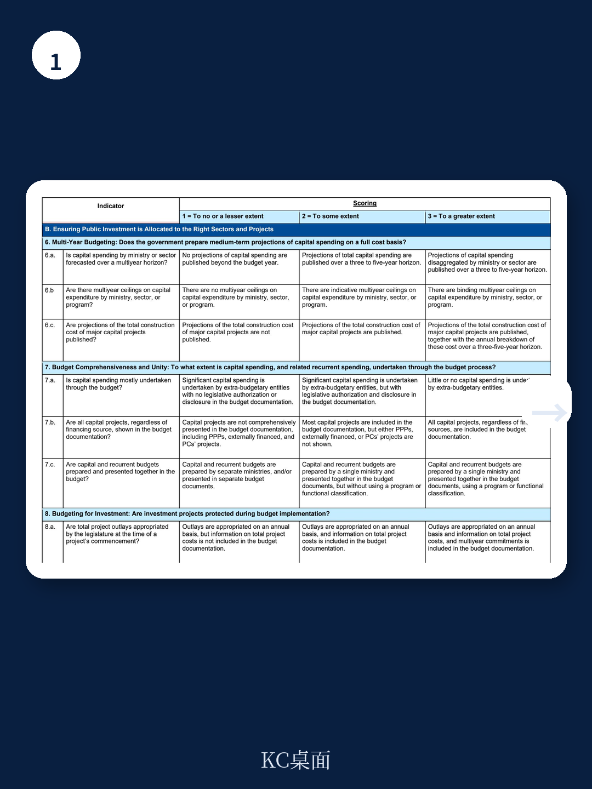
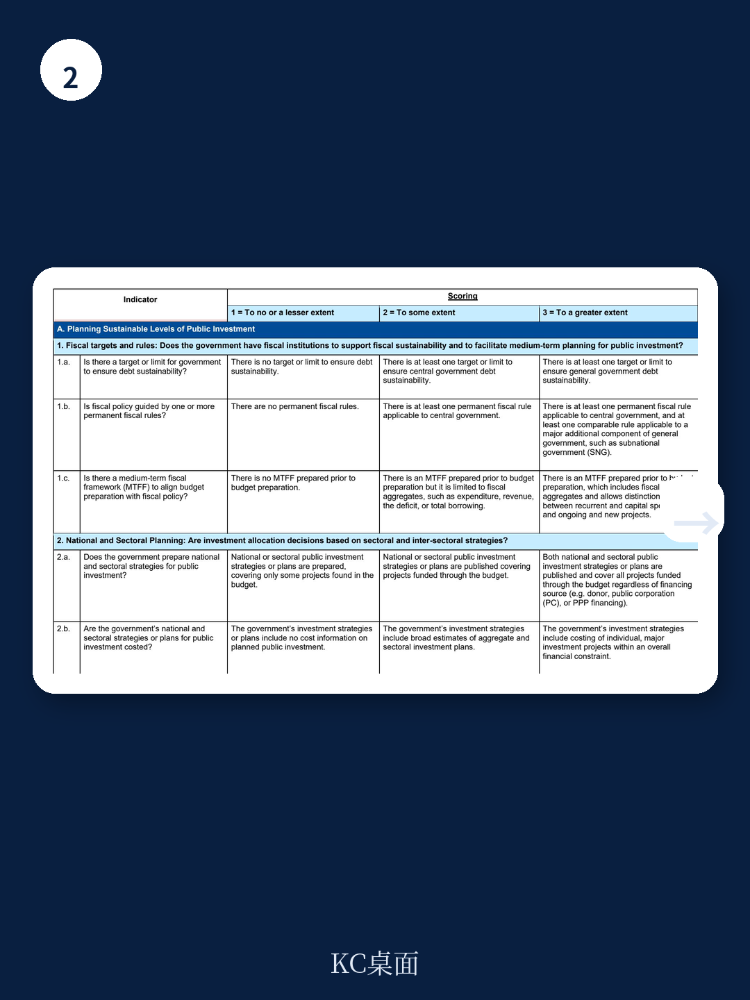

# IMF：IMF莱索托公共研究技术援助报告

莱索托的公共研究占GDP比重长期维持在10%左右，远超撒哈拉以南非洲和低收入国家平均水平，但基础设施质量与宏观环境增长并未同步提升。IMF最新发布的公共研究管理评估（PIMA）报告给出了一个反直觉的判断：这个国家的问题不是钱不够，而是花不出去。过去三个财年，预算中资本支出的实际执行率平均只有53%。这意味着，近一半已批准的项目资金被闲置，而公共资本存量自2000年代初以来持续下降。

报告认为，莱索托公共研究的核心矛盾在于制度设计无法将高额支出转化为可用的基础设施。这不是单一环节的失灵，而是贯穿规划、分配与执行全链条的系统性薄弱。

## 1. 项目在进入预算时往往未经充分准备

莱索托的国家与行业规划对项目的覆盖有限，多数项目缺乏成本测算和绩效目标。预算中列出的项目与规划文件中的项目重合度低。项目评估虽有标准方法，但并非法律强制要求，实际执行中评估质量参差不齐，不确定性分析流于形式。结果就是，许多项目在尚未完成可行性研究、成本估算和方案比选的情况下就进入了预算序列。

这种“低质量入口”直接推高了后续执行不确定性。一旦开工，成本超支、工期延误、设计变更等问题频发，进一步加剧了资金沉淀。

## 2. 中期预算框架形同虚设，资金拨付不可预测

莱索托设有中期财政框架（MTFF），区分经常性支出与资本支出，并发布各部门的非约束性资本支出上限。但实际预算与中期上限之间存在显著偏离。报告数据显示，2020/21至2025/26财年，政府资本支出预算与实际执行之间的差距持续扩大，预算编制阶段对中期框架的参考非常有限。

更关键的问题是资金拨付的不可预测性。已开工项目无法获得稳定的年度拨款，付款受制于现金配给和延迟，导致项目“走走停停”，反复延期。这种执行层面的不确定性，反过来又削弱了部门编制高质量项目预算的激励。

> **KC评论：** 报告没有直接说，但逻辑很清楚——当一个系统无法保证“好项目能拿到钱”，部门就没有动力去做“好项目”。这是制度设计层面的逆向选择。

## 3. 执行约束集中在采购与现金管理两个环节

报告将“低执行率”归因于两个最直接的瓶颈。一是采购流程尚未完全运转，从招标到合同授予的周期过长，部分项目在财年内无法完成采购程序。二是现金与承诺控制薄弱，预算执行过程中缺乏对已签约未付款项的实时监控，导致隐性债务积累，进一步压缩了后续年度的执行空间。

报告建议，短期应优先解决采购可操作性和资金拨付的可预测性，中期再推进项目评估与规划改革。这种排序本身说明，莱索托当前最缺的不是制度文本，而是将制度转化为行动的执行力。

## 4. 资产管理与事后审计的缺失加剧了资本存量侵蚀

莱索托的资产登记既不全面也未定期更新，政府财务报表不包含非资金资产价值，折旧也未计入运营支出。这意味着，政府无法准确掌握现有基础设施的存量、状态和维护需求。报告估算，莱索托的公共研究效率缺口约为49%（2019年数据），即同样规模的资本存量，莱索托产出的基础设施服务量仅为高效国家的约一半。

审计方面，重大项目的事后外部审计并不系统，审计报告也未常规公开。缺乏事后问责，意味着项目执行中的问题难以被识别、归因和纠正，系统性的低效也就难以被打破。

> **KC评论：** 49%的效率缺口是一个估算值，但它指向一个可验证的观察：莱索托的电力接入率、安全饮用水覆盖率、固定宽带普及率等基础设施指标，与其研究规模并不匹配。这不是研究不足的问题，是研究转化率的问题。

## 5. 改革路径：从执行端倒推，而非从规划端重来

报告提出的改革建议没有追求“一步到位”的制度重构，而是选择了一条务实路径：先从执行端最紧的约束入手——让采购运转起来、让资金拨付可预测。在此基础上，再逐步强化项目评估与选择标准，提升“质量入口”。最后，通过加强组合监测、绩效导向的预算再分配、审计透明度和资产信息，建立持续纠偏的能力。

这套逻辑的核心假设是：在现有能力约束下，与其追求完美的规划，不如先确保已批准的项目能落地。执行力的提升本身会创造改善规划的动力——当部门发现“好项目确实能拿到钱”，它们才有激励去做好项目。

For informational purposes only. Portions may be generated,translated,summarized,or edited with AI assistance based on source materials and may contain omissions or errors. Please verify independently. This is not investment,legal,tax,accounting,or other professional advice.

