# Macroeconomic Effects of Rare Earths Supply Chain Disruptions

Christian Bogmans, Maximiliano Jerez-Osses, Jorge Miranda-Pinto, Jean-Marc Natal

WP/26/73

IMF Working Papers describe research in progress by the author(s) and are published to elicit comments and to encourage debate. The views expressed in IMF Working Papers are those of the author(s) and do not necessarily represent the views of the IMF, its Executive Board, or IMF management.

2026
JUL

# IMF Working Paper

# Research Department

Macroeconomic Effects of Rare Earths Supply Chain Disruptions

Prepared by Christian Bogmans, Maximiliano Jerez-Osses, Jorge Miranda-Pinto, and Jean-Marc Natal

Authorized for distribution by Petya Koeva Brooks

July 2026

IMF Working Papers describe research in progress by the author(s) and are published to elicit comments and to encourage debate. The views expressed in IMF Working Papers are those of the author(s) and do not necessarily represent the views of the IMF, its Executive Board, or IMF management.

ABSTRACT: Rare earth elements (REEs) are critical inputs in high-tech manufacturing. In April 2025, shortly after the US imposed sizable tariffs on most of its trading partners, China announced new export licensing requirements on REEs and permanent magnets, raising concerns about the macroeconomic consequences of supply disruptions in import-dependent economies. Standard macroeconomic assessments based on “value added at risk” (VAAR) – a measure of economy-wide potential loss due to arrested production in REEs-dependent sectors – ignore production network linkages and input reallocation. To address these shortcomings, we develop a small open economy model with imported REEs and production networks, calibrated using an REE-augmented input–output table from USGS data. Applying the model to the United States, Germany, France, the United Kingdom, Japan, and India, we find substantial cross-country heterogeneity in response to an 80% reduction in REEs supply. The most exposed economies are Japan, the U.S. and Germany. Under low substitution elasticities (horizons under one year), these economies could experience a GDP loss of 1.8, 1.5, and 1.2 percent, respectively. These differences reflect heterogeneity in sectoral composition, factor shares, and the strength of backward and forward linkages of REE-intensive sectors. Under higher elasticities (longer horizons), aggregate losses become negligible.

RECOMMENDED CITATION: Bogmans, Christian., Jerez-Osses, Maximiliano., Miranda-Pinto, Jorge., Natal, Jean-Marc. 2026. "Macroeconomic Effects of Rare Earths Supply Chain Disruptions". IMF Working Paper 26/73, International Monetary Fund, Washington, DC.

JEL Classification Numbers:

C67, E21, F41, Q02

Keywords: Production Networks; Commodity Prices; Network-Adjusted Value-Added Share; Advanced Economies and Emerging Markets

Author's E-Mail Address: cbogmans@imf.org; mjerezosses@imf.org; jmirandapinto@imf.org; jnatal@imf.org

WORKING PAPERS

# Macroeconomic Effects of Rare Earths Supply Chain Disruptions

Prepared by Christian Bogmans, Maximiliano Jerez-Osses, Jorge Miranda-Pinto, and Jean-Marc Natal. $^{1}$

## 1 Introduction

Over the last 15 years the world has seen a five-fold increase in the number of export measures on critical minerals, with an acceleration since 2023 (OECD, 2025). Some of these measures were imposed with little advance notice, as was the case when on April 4, 2025, shortly after the US imposed higher import tariffs on most of its trading partners, China—the world’s top producer of rare earths elements (REEs)—introduced export licensing requirements for seven REEs and REE-based permanent magnets, citing national security concerns and international non-proliferation obligations (Ministry of Commerce of the People’s Republic of China, 2025). These export licensing requirements caused a sharp slowdown in Chinese magnet export volumes between April and June, with anecdotal evidence of supply disruptions emerging concurrently among manufacturers worldwide — particularly in the United States, Europe, and India. $^{1}$ Export volumes subsequently returned to their upward trend, however, displaying double-digit year-on-year growth rates.

Although short-lived, this latest disruption reminded policymakers in import-dependent countries that REEs supply chains are structurally vulnerable: REEs are hard-to-substitute inputs in high-technology manufacturing, and their production is highly geographically concentrated (e.g., Alvarez et al., 2026). As manufacturing regains strategic importance, understanding the economics of rare earths has become increasingly urgent. This paper therefore asks: What would be the macroeconomic impact of a major REEs supply disruption across sectors and countries? Industry and popular media analyses of the macroeconomic importance of rare earths have often relied on simple measures that aggregate the value added of all REE-dependent sectors. But this approach ignores the fact that, as shown in Figure I, sectors such as motor vehicles, electrical equipment, and semiconductors—key buyers of REEs—are central nodes in most economies. These sectors act as both buyers and suppliers of domestic intermediate inputs, giving them a key role in the propagation of an REE import shock. To incorporate these network effects, this paper uses a tractable small open economy model featuring production networks (domestic intermediates) and imported intermediates to quantify the domestic GDP losses from a large and permanent disruption of imports of rare earths and permanent magnets for a selection of major economies, namely the U.S., the UK, Japan, Germany, India, and France. $^{2}$

Figure I: Supply chains of rare earth elements (REEs).  
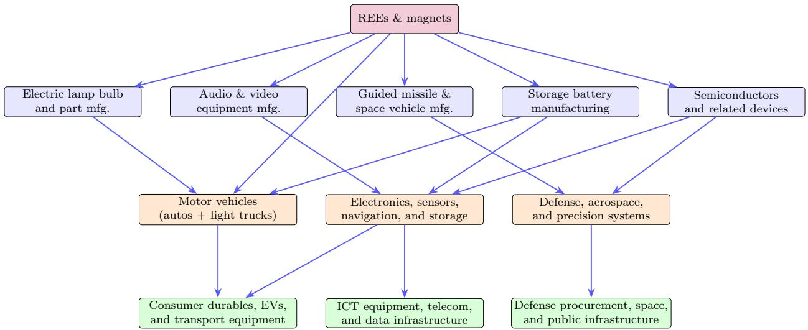  
Note: This figure illustrates a stylized domestic supply chain for REEs in advanced economies. Information on the main domestic REE-using sectors and their downstream buyers is based on the 2017 U.S. Bureau of Economic Analysis (BEA) input-output table at the 405-sector level.

As a first-pass measure of exposure, we construct a "value added at risk" (VAAR) metric. Using U.S. Geological Survey data from Nassar et al. (2025), we identify the sectors that use rare earths as inputs and aggregate their value added, weighted by their approximate exposure to REEs. This exposure is not an exact input share (intensive margin) but instead a measure of the fraction of total production exposed (extensive margin) to REEs. To extend this analysis beyond the United States, we map the USGS sectoral classification to the OECD

Input–Output tables using BEA-to-ISIC concordance tables, allowing us to compute VAAR for a broad set of economies. The key assumption we make is a technological assumption in the production of REE-intensive sectors. In particular, we assume that the exposure to REEs of a sector (e.g., electrical equipment or computer electronics sectors) is the same in the U.S., UK, Japan, Germany, India, and France. This common-intensity assumption should be interpreted as a benchmarking device: it holds fixed the direct REE exposure of a given sector across countries and therefore lets cross-country differences reflect sector size, factor shares, and network structure rather than country-specific engineering coefficients. Using these shares, we are able to capture the total economic output directly dependent on REE availability across countries.

VAAR analysis reveals that 34 of the 405 sectors in the U.S. economy rely on rare earth inputs, jointly accounting for \$155 billion in value added in 2017, or 0.8 percent of nominal GDP. REE and magnets exposure varies significantly across countries — from 0.4 percent of GDP in France to 2.5 percent in Germany — driven by cross-country differences in size of REE-intensive industries such as automotive, renewable energy, and electronics manufacturing. The analysis also highlights the outsized role of permanent magnets, which we include in our measure of REE-exposure. Permanent magnets account for roughly 70 percent of U.S. VAAR. However, VAAR is an imperfect measure of exposure to REEs. VAAR likely overstates GDP losses by assuming zero substitution between REEs, permanent magnets, and other inputs, and by treating the exposed share of sectoral production – likely overstated in this extensive margin measure – as fully lost. At the same time, VAAR understates GDP losses by abstracting from the role of REE-dependent sectors as both buyers and suppliers of intermediate inputs, and from the distortions created by binding quantity constraints.

To study the aggregate effects of REEs supply constraints in general equilibrium, we develop and calibrate a small open economy model with network linkages as in Silva et al.

(2024) and Gomez-Gonzalez et al. (2025), extended to incorporate imported REE supply constraints. The model analyzes a REE supply shock affecting REE-using sectors — both directly and through input-output linkages — with implications for prices, real wages, GDP, net foreign assets, and consumption. We assume that REE are imported intermediate inputs subject to supply constraints. In the short-run, given that firms cannot easily substitute this input, production is close-to-Leontief. In this case, a decline in REE inputs can create a significant decline in sectoral output. In addition to this quantity constraint, the shock increases the effective price that firms pay to use REEs. As a result, the quantity effect and the price distortion propagate through the production network. $^{3}$

To calibrate the model and incorporate a role for REEs as manufacturing inputs, we augment the 2017 U.S. Input–Output tables from the Bureau of Economic Analysis (405×405 sectors) to include explicit rare earth and permanent magnet sectors. Since neither appears as a standalone sector in the BEA classification, we split the relevant parent industries (NAICS 325180 and 332999) into REE and non-REE sub-sectors. We then impute rare earth and magnet demand across downstream industries using global rare earth requirement estimates from Alonso et al. (2023a), scaled to 2017 U.S. levels, and sectoral allocation guidance from Nassar et al. (2025). The resulting augmented I-O matrix covers 30 of the 33 rare-earth-using industries identified in the literature and serves as the empirical foundation for the network analysis that follows.

The calibrated model is then used to simulate the impact of a persistent reduction in REE supply. Our baseline exercise is best interpreted as a stress scenario rather than a forecast. For each country, the analysis considers a persistent 80 percent reduction in all rare earth inputs available for the economy — oxides, metals, compounds, and magnets — consistent with the average import dependence of each of the advanced economies on China.

Model simulations show that the magnitude of GDP losses depends critically on substitution possibilities in production. Under limited substitutability—arguably the relevant case over horizons shorter than one year (Nassar et al., 2025)—network amplification generates sizable output losses. In this setting, U.S. GDP declines by 1.5 percent, exceeding the 1.2 percent decline in Germany, despite Germany’s larger VAAR exposure. $^{4}$ Under the maintained assumption of common direct REE intensities across countries, this result reflects stronger forward and backward linkages in U.S. motor vehicles, electrical equipment, and computers and electronics. At the sectoral level, the REE shock contracts nineteen U.S. sectors, with automotive output falling by 9 percent, compared to 5.8 percent in Germany, where higher labor intensity in automotive production dampens exposure to REEs. When substitution elasticities are higher—capturing adjustment over horizons beyond five years (Alfaro et al., 2025)—estimated GDP losses become negligible, averaging just 0.006 percent across countries. Across both scenarios, Japan experiences the largest GDP decline, reflecting the combination of highly connected, REE-intensive sectors and large intermediate input shares.

We then study the role of the elasticity of substitution between REEs and other intermediate inputs, holding fixed the elasticity between labor and intermediates and the elasticity among domestic intermediates. This exercise allows us to distinguish between substitutability in upstream REE-intensive sectors and production elasticities in downstream sectors that use inputs from REE-intensive sectors. We assume that all downstream sectors have a substitution elasticity of 0.8. In upstream REE-intensive sectors, we assume an elasticity of substitution between REEs and domestic intermediates of 0.015, while keeping the elasticity between labor and intermediates and among domestic intermediates at 0.8. We find that this single elasticity – the elasticity of substitution between REEs and domestic intermediates – accounts for nearly all of the difference (97 percent) between the benchmark low- and high-elasticity cases. This result highlights the granular nature of the shock, which is concentrated in upstream sectors that rely on small quantities of highly specific, hard-to-substitute imported inputs.

In our final section, we study the effects of the shock on real GDP. In contrast to the previous section, which quantifies nominal GDP losses deflated by foreign prices of imported goods, we focus here on the implications of the shock for the economy's production possibility frontier. Our results show that a sufficient statistic for assessing the real GDP impact of an REE supply constraint—around an undistorted initial equilibrium-is the value of imported REEs relative to GDP. This statistic depends on the Domar weight of REE-intensive sector(s)—measured as the ratio of gross output to GDP-weighted by the share of imported REEs in sectoral production. In response to an 80 percent decline in REE supply, the German economy experiences a substantially larger contraction in real GDP (-2.1 percent) than the United States (-1.5 percent), while Japan again emerges as the most exposed economy (-2.3 percent). These differences reflect variation across countries in both the size of REE-intensive sectors and their intermediate input shares.

Contribution to the literature: Our paper contributes to a small but burgeoning literature on the (macro)economics of critical minerals, with Nassar et al. (2025) and Alfaro et al. (2025) being closest in spirit to our paper. Nassar et al. (2025) develop an economic model to estimate the effects of foreign trade disruptions of 84 mineral commodities on U.S. industries, using equilibrium displacement modeling and detailed input-output tables to quantify probability-weighted GDP losses by industry and mineral commodity. $^{5}$ Whereas Nassar et al. (2025) consider import supply disruptions of one mineral commodity at a time, this paper analyzes a shock that affects the supply of all REEs simultaneously. The resulting GDP losses exceed those of Nassar et al. (2025) by an order of magnitude, underscoring the macroeconomic importance of a simultaneous REE supply disruption. A further distinction is that we employ a dynamic general equilibrium model with micro-founded production networks, which allows prices, wages, and trade balances to adjust endogenously, whereas Nassar et al. (2025) use a partial equilibrium displacement framework with a fixed I–O structure.

Alfaro et al. (2025) study China's 2010 imposition of export duties and export quotas and show that limiting access to critical inputs can induce directed technological change in downstream industries abroad, increasing REE input-efficiency and reshaping trade patterns in REE-intensive sectors. Their analysis focuses on the medium-run adjustment — where the directed technological response substantially mitigates welfare losses — whereas our paper examines both the short-run impact, where substitution possibilities are limited and network amplification is strongest, and the medium-run horizon, where larger REE substitution possibilities attenuate losses. We also differ in emphasis and calibration: our analysis focuses on explaining cross-country variation in the macroeconomic response to a REE shock, and draws on more recent USGS data and I–O tables to capture the current structure of REE dependence rather than the supply chain landscape of the early 2010s.

Our paper also contributes to the recent literature investigating the role of production networks in amplifying sectoral and aggregate distortions such as markups and borrowing constraints (e.g., Bigio and La'o, 2020; Baqaee and Farhi, 2020; Miranda-Pinto et al., 2025). Different from previous papers, we focus on a small open economy production network model that is subject to supply constraints of a crucial input in production. The nature of the shock creates an endogenous wedge in the use of imported intermediates, which is then transmitted through the domestic production network. In the spirit of Atalay (2017), Boehm et al. (2019) and Miranda-Pinto and Young (2022), we emphasize the importance of the elasticity of substitution in production – in particular, the elasticity of substitution between REE inputs and other inputs of production – in shaping the macroeconomic effects of the shock.

We proceed as follows. In Section 2, we describe the REE market and its recent disruptions. In Section 3, we provide empirical metrics that describe the sectoral and aggregate exposure to REE inputs in the U.S., UK, Japan, France, Germany, and India. In Section 4, we develop a small open economy production network model with REE supply constraints to quantify the sectoral and aggregate consequences of a supply constraint shock, under different scenarios on the degree of production substitutability. In Section 5, we conclude.

## 2 REEs Market and Supply Disruptions

## 2.1 The (macro)economics of rare earth elements

Rare earth elements (REEs) are a group of 17 chemically similar metals, conventionally divided into light rare earth elements (LREEs) and heavy rare earth elements (HREEs), the latter being substantially less abundant in the earth's crust. REEs are valuable inputs across a wide range of high-technology manufacturing sectors including automotive production (especially electric vehicles), wind energy, defense systems, semiconductors, and consumer electronics. While REEs are typically employed in small quantities, they provide unique properties that are difficult to replicate cheaply, notably in applications requiring strong magnetic performance, thermal stability, catalytic versatility, or high-power density. Arguably their single most important application is neodymium permanent magnets-invented in 1983 by General Motors-, in which up to four REEs are combined with iron and boron to create an alloy that converts electricity into motion—or vice versa—across devices ranging from EV traction motors and wind turbine generators to precision robotics and MRI machines.

The economics of rare earths are increasingly driven by just four of the 17 elements: the LREEs neodymium (Nd) and praseodymium (Pr), and the HREEs terbium (Tb) and dysprosium (Dy). These "magnet-4" elements jointly account for 96 percent of total rare earth oxide (REO) market value despite representing only 23 percent of REO production by weight, reflecting both strong demand from permanent magnets—which consume 83 percent of all REO value—and the natural scarcity of these elements relative to lower-demand rare earths such as lanthanum and cerium (Morgan Stanley, 2025). In absolute terms, the REE market is small: rare earth oxides were valued at approximately \$6 billion and permanent magnets at approximately \$25 billion in 2024 (Market Data Forecast, 2025).

Yet the modest size of REE commodity markets belies their macroeconomic significance, which stems not from the commodity itself but from the critical applications it enables—above all, permanent magnets. Rare earths matter not because they account for a large share of firms' input costs, but because they enable production processes for which alternatives are difficult to develop on short notice. This vulnerability is compounded by the structure of rare earth supply chains themselves, which contain several potential chokepoints.

## 2.2 Rare earth supply chains

The rare earth supply chain involves multiple specialized stages: mining, concentration, separation of the chemically similar elements through solvent extraction, and refining to metals or alloys. These metals or alloys then serve as inputs for downstream manufacturers, including permanent magnet producers. The separation stage is particularly technically demanding, requiring hundreds of sequential processing steps, and it is also a pollution-intensive and energy-intensive process. Establishing new separation and refining capacity—the main stages of REE processing—requires billions in capital investment, years of regulatory approval, and specialized technical expertise, making rapid diversification of processing capacity extremely difficult.

Technical expertise acquired over decades, established infrastructure, flexible regulations, and farsighted policy support made China the world's largest producer of REEs during the 2000s. Today, China's market share varies significantly by rare earth type and supply chain stage. For LREEs, diversification in mining has reduced China's share of global output from 97 percent at its peak in 2010 to 58 percent in 2024 (U.S. Geological Survey, 2026), but China maintains 88 percent of oxide separation capacity and 93 percent of metal refining (Bedford, 2025). For HREEs, China retains a near-monopoly across the entire supply chain:

98 percent of mining (including mining out of Myanmar), 97 percent of oxide separation, 95 percent of metal refining, and 90 percent of permanent magnet production (Bedford, 2025). $^{6}$

This concentration creates potential chokepoints in the supply chain. A chokepoint emerges when three conditions align: extreme geographic concentration in a single country, potential for disruption, and barriers to rapid diversification. While the geographical concentration in HREE mining constitutes an important potential chokepoint, our baseline assessment is that the separation and refining stages are the most critical stages as nearly all rare earth concentrates, regardless of origin, flow through Chinese processing facilities. Relative to magnet manufacturing, these processing stages also appear to face higher technological, environmental, and scale-related barriers to rapid diversification. Permanent magnet manufacturing represents yet another stage in the supply chain where China holds a very large market share (90 percent). However, this segment faces lower barriers to capacity expansion: multiple established magnet producers already operate in the United States, Japan, and Europe, though typically at smaller scale than in China (International Energy Agency, 2025).

## 2.3 Dependence on Chinese imports

Global trade in rare earth compounds and metals totaled \$2.79 billion in 2024, with permanent magnets adding another \$4.56 billion—relatively small volumes compared to other commodities. Trade data show China supplied 77.3% of U.S. and 46.1% of EU rare earth compound and metal imports in 2024, with permanent magnet dependence at 75.3% and 92.1% respectively. However, these figures significantly understate true dependence on China for three reasons. First, they aggregate LREEs and HREEs despite China’s much stronger control over the latter (98 of HREE mining vs. 55-60 of LREEs). Second, they do not distinguish between concentrates and processed materials—even non-Chinese concentrates typically flow through Chinese separation facilities. Third, not all permanent magnets contain HREEs.

An alternative approach calculates import dependence by combining each country's share of global production, by supply chain segment, from Bedford (2025) with an estimate of China's domestic absorption. Following Shao et al. (2026), we assume that China consumes approximately 60 percent of global output at each stage, so that only the remaining 40 percent is available for international trade. This makes China the largest end user of rare earth elements globally, as a large share of its own production is absorbed domestically. Under this calculation, importing countries are on average not dependent on China for raw LREEs—consistent with non-Chinese mining capacity being sufficient to meet rest-of-world demand. For HREEs and for all downstream stages of both light and heavy rare earths, however, import dependence on China remains high, ranging from 69 to 95 percent (Figure II).

Figure II: Average import dependence on China by supply chain segment (in percentage)  
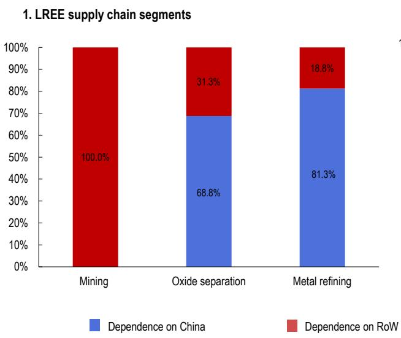

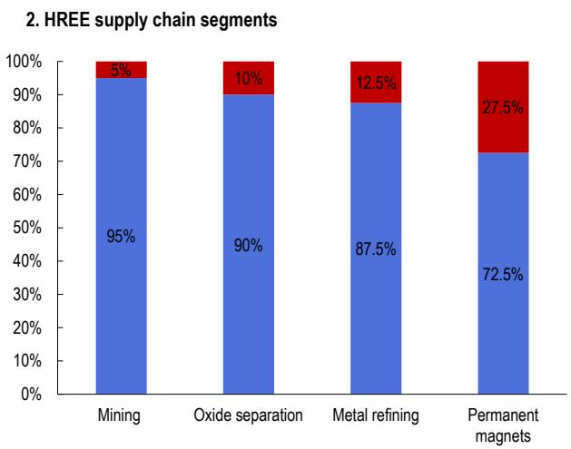  
Source: Bedford (2025); and IMF staff calculations (under assumption that China consumes 60% of each segment). HREE = heavy rare earth element; LREE = light rare earth element; ROW = rest of world.

## 2.4 Recent REE disruptions

On April 4 2025, shortly after the US imposed higher import tariffs on most of its trading partners, China introduced export licensing requirements on seven rare earth metals, predominantly HREE, along with their oxides, alloys, compounds, mixtures, and related products, including HREE-doped neodymium-iron-boron (NdFeB) permanent magnets and samarium-cobalt permanent magnets. The measures required Chinese companies to secure special export licenses to export the minerals and magnets to foreign importers.

These export licensing requirements caused a sharp drop in permanent magnet exports to the rest of the world between April and June. At the bottom of the decline in May, Chinese exports of permanent magnets stood roughly 70 percent lower year-over-year, but the disruption proved temporary, with monthly Chinese export volumes quickly resuming their double-digit year-on-year growth (Figure III). The magnitude of the decline suggests a temporary, system-wide disruption that extended beyond the formally controlled products, affecting exports of other ordinary NdFeB magnets that were not explicitly covered by the restrictions.

Later in 2025, on October 9, China's Ministry of Commerce announced it would further tighten its REE export licensing requirements by extending them, among other things, to China's REE manufacturing capabilities (e.g. machines, chemical solvents), but these were subsequently suspended in November as part of a broader agreement between the U.S. and China. Then, in January 2026, China curbed exports of many dual-use items, including HREE, to Japan as part of a broader dispute with its neighbor. Despite these developments, Chinese REE exports continued to grow strongly in January and February 2026.

As a result, policymakers in import-dependent countries have grown increasingly concerned about the macroeconomic consequences of prolonged supply disruptions to rare earth and permanent magnet markets.

Figure III: China's Exports of Rare-Earth Permanent Magnets and Rare-Earth Magnet Components Intended for Permanent Magnet Production (in metric kilotons)  
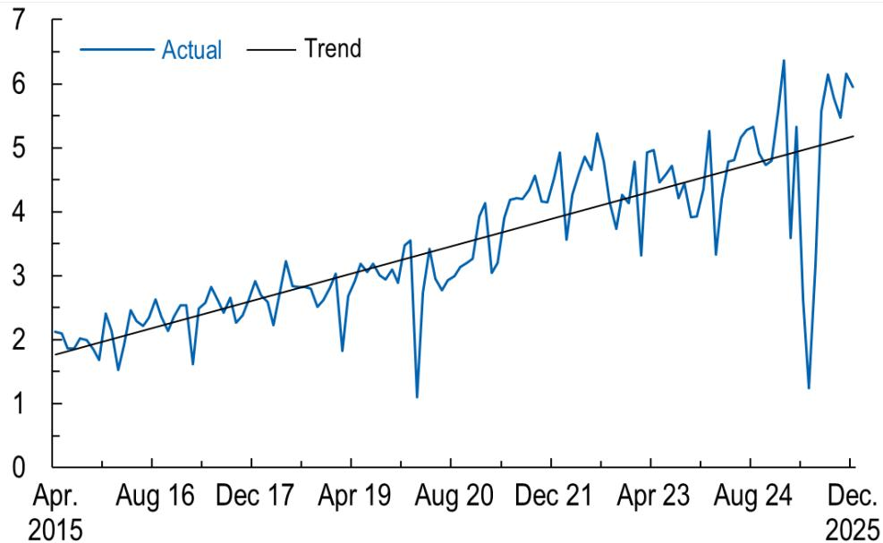  
Source: China Customs Statistics; General Administration of Customs of the People's Republic of China (GACC), and IMF staff calculations.  
Note: Data is from the series labeled “CN: Export: HS8: Permanent Magnets or Articles Going to Be Permanent Magnets, of Rare-Earth Metals.” Code HS 850511.

## 2.5 Limited substitutability of REEs

In many applications REEs are not truly irreplaceable: substitutes often exist but come with penalties in terms of efficiency, weight, size, or cost. Research suggests that the possibilities of substituting HREEs are significantly weaker than the average element, scoring 78 out of 100 in the substitutability index (where 100 indicates no adequate substitute exists), compared to 57 for non-REE elements Graedel et al. (2015). For some rare earths like dysprosium, a key constituent of permanent magnets, no substitute currently exists, while in other cases, (inferior) alternatives can be developed provided enough time and resources are invested. In laboratories around the world, the race is on to build powerful electric drive motors that eliminate the need for rare earth permanent magnets. $^{7}$

## 3 Sectoral and Aggregate Exposure to REEs

In this section, we provide descriptive statistics data on the sectors that use more intensively REEs and Magnets in the U.S. We then aggregate the U.S. data to match the level of aggregation of the OECD input-output tables. Then, by assuming that a given industry (e.g., motor vehicles) uses the same fraction of REEs in production in every country in our sample, we provide information on how connected to the rest of the sectors of the economy are these REEs-intensive sectors in each country.

We rely on two key datasets. The U.S. disaggregated input-output table with 405 sectors and the OECD input-output tables covering 50 sectors.

## 3.1 US Demand for REEs

In order to estimate the macroeconomic impact of a rare earth and magnet supply disruption, we begin by using the 2017 U.S. Input–Output (I–O) tables from the Bureau of Economic Analysis (BEA). These tables provide a highly granular representation of the U.S. economy, covering $405 \times 405$ sectors, which makes them particularly well suited for our analysis. However, the I–O tables do not include explicit sectors for rare earth elements or magnets, nor do they allow us to directly observe the downstream sectors that rely on these materials. As a result, we must construct these sectors and impute rare earth inputs into the corresponding demanding industries. To address this limitation, we rely on the report by Alonso et al. (2023b), which provides detailed estimates of rare earth requirements at the global level. These estimates include both raw and embedded rare earth usage (in metric tonnes), disaggregated by individual elements (e.g., lanthanum, neodymium, cerium) and by application (magnets, catalysts, ceramics, and others). Using this information, we estimate U.S. rare earth requirements by application and by element, expressed in tonnes.

Alonso et al. (2023b) report data for 2015, while our I–O tables are from 2017, so we adjust the estimates to ensure temporal consistency. Specifically, we compute the annual growth rate of rare earth requirements following Nkiawete and Vander Wal (2025) and apply it to scale the 2015 quantities to 2017 levels. Once quantities are obtained, we value rare earth elements using price data from Refinitiv/Workspace for those elements that are publicly traded $^{8}$ . Elements that are not listed on the exchange are excluded from the valuation exercise. This procedure yields the estimate total value of U.S. rare earth requirements by application and by element, which serves as the input for the imputation process. For the imputation of rare earth demand across industries, we rely on Nassar et al. (2025), who provide estimates of gross output dependence on rare earth elements and, in some cases, explicit guidance on how to allocate application-level requirements across sectors. When such guidance is available, we follow it directly. When it is not, we allocate application-level demand across relevant sectors in proportion to the share of gross output that uses rare earth. $^{9}$ Accordingly, the allocation rule combines REE-intensity information from Nassar et al. (2025) with sector size within the relevant application, so that larger REE-using sectors receive a larger share of application-level demand.

Since neither rare earths nor magnets exist as standalone sectors in the BEA classification, we explicitly create them. For rare earth elements, we split NAICS 325180 "Other basic inorganic chemical manufacturing" into two sectors: one consisting exclusively of rare earth production and another containing all remaining inorganic chemical activities. We apply a similar procedure for magnets by splitting NAICS 332999 "Other fabricated metal manufacturing into magnet and non-magnet sub-sectors". $^{10}$ This construction allows us to isolate rare earth and magnet inputs from other materials grouped under broader industry classififications. In some cases, the estimated requirements for rare earths and/or magnets exceed the total value of the parent sector from which they are split. This implies that mechanically splitting the sector would generate negative coefficients for the residual non-rare-earth or non-magnet sector. Since negative input coefficients are not allowed in our framework, we set these residual values to zero and recompute the intermediate input shares accordingly. Importantly, the subsequent increase in the final value of the REE and magnet sectors does not come from the zero bound itself; it reflects the combination of renormalization and the inclusion of some REE demand reported in broader “other” categories in Nassar et al. (2025). At the same time, we lose coverage of a small number of industries for which sufficient information is not available. For example, we are unable to estimate rare earth requirements for NAICS 33451A (“Watch, clock, and other measuring and controlling device manufacturing”) due to insufficient data in Nassar et al. (2025). Overall, however, we are able to calibrate 30 out of the 33 sectors identified in the report, providing broad coverage of rare-earth-using industries. $^{11}$ With these steps completed, we obtain a full 2017 U.S. Input–Output matrix augmented to include explicit rare earth and magnet sector as part of imported inputs.

Table I: Sectoral Purchases of REEs and Magnets (Millions USD)

<table><tr><td>Sector</td><td>REEs</td><td>Magnets</td><td>Sum</td></tr><tr><td>336112 Light truck and utility vehicle manufacturing</td><td>9.20</td><td>168.40</td><td>177.60</td></tr><tr><td>336111 Automobile manufacturing</td><td>1.70</td><td>51.70</td><td>53.40</td></tr><tr><td>336414 Guided missile and space vehicle manufacturing</td><td>0.00</td><td>43.30</td><td>43.30</td></tr><tr><td>335110 Electric lamp bulb and part manufacturing</td><td>22.70</td><td>0.00</td><td>22.70</td></tr><tr><td>324110 Petroleum refineries</td><td>18.80</td><td>0.00</td><td>18.80</td></tr><tr><td>334413 Semiconductor and related device manufacturing</td><td>17.30</td><td>0.00</td><td>17.30</td></tr><tr><td>3363A0 Motor vehicle steering, suspension, and brake systems manufacturing</td><td>0.00</td><td>13.50</td><td>13.50</td></tr><tr><td>334511 Search, detection, and navigation instruments manufacturing</td><td>0.00</td><td>13.10</td><td>13.10</td></tr><tr><td>331110 Iron and steel mills and ferroalloy manufacturing</td><td>13.10</td><td>0.00</td><td>13.10</td></tr><tr><td>335911 Storage battery manufacturing</td><td>11.40</td><td>0.00</td><td>11.40</td></tr></table>

Source: IMF staff calculations using 2017 BEA Input-Output table based on Nassar et al. (2025) data on REEs usage.  
Note: Purchases are expressed in million USD dollars of year 2017.

Table I shows the top-10 U.S. sectors, at the NAICS classification, in terms of dollar purchases of REEs and Magnets. The three largest users are Light truck and utility vehicle manufacturing, automobile manufacturing, and guided missile and space vehicle manufacturing. These sectors, together, spend more than 250 million dollars in REEs and Magnets per year.

Table II: Intermediate Input Share of REEs and Magnets (%)

<table><tr><td>Sector</td><td>REEs</td><td>Magnets</td><td>Total</td></tr><tr><td>335110 Electric lamp bulb and part manufacturing</td><td>3.18</td><td>0.00</td><td>3.18</td></tr><tr><td>334300 Audio and video equipment manufacturing</td><td>0.00</td><td>0.80</td><td>0.80</td></tr><tr><td>336414 Guided missile and space vehicle manufacturing</td><td>0.00</td><td>0.40</td><td>0.40</td></tr><tr><td>334112 Computer storage device manufacturing</td><td>0.00</td><td>0.21</td><td>0.21</td></tr><tr><td>335911 Storage battery manufacturing</td><td>0.18</td><td>0.00</td><td>0.18</td></tr><tr><td>333314 Optical instrument and lens manufacturing</td><td>0.16</td><td>0.00</td><td>0.16</td></tr><tr><td>336111 Automobile manufacturing</td><td>0.01</td><td>0.15</td><td>0.16</td></tr><tr><td>336112 Light truck and utility vehicle manufacturing</td><td>0.00</td><td>0.09</td><td>0.09</td></tr><tr><td>334413 Semiconductor and related device manufacturing</td><td>0.09</td><td>0.00</td><td>0.09</td></tr><tr><td>332999 Other fabricated metal manufacturing</td><td>0.08</td><td>0.00</td><td>0.08</td></tr></table>

Source: IMF staff calculations using 2017 BEA Input-Output table based on Nassar et al. (2025) data on REEs usage.  
Note: Requirements are expressed in percent (values multiplied by 100). We calculate the ratio between the purchases of REEs and Magnets and the total purchases of intermediate inputs.

Table II reports the top-10 sectors that most intensively use of REEs, as a share of their total input purchases. In this case, the electric lamp bulb and part manufacturing sector is by far the most intensive user of REEs. This sector spends 3.18% of its total intermediate input purchases in REEs inputs. The second most intensive sector in the use of REEs and Magnets is the audio and video equipment manufacturing which displays an intermediate input share of Magnets of 0.80%.

Three sectors that appear in the top-10 of purchases in Table I and input share in Table II are the semiconductor and related device manufacturing sector, the motor vehicle sector, and the storage battery manufacturing sector. These are by far the most popular sectors in the public policy arena when thinking about the most exposed sectors to REEs and Magnet supply disruptions (see, for example, Reuters, 2025a, 2026).

We now aggregate the BEA U.S. 405 sectors' data to the OECD U.S. 50 sectors' data. By aggregating to the sectoral classification of the OECD data, which covers several countries, we are able to study the macroeconomic consequences of REEs disruptions in other economies that produce REEs-intensive products such as Germany, Japan, India, France, and the UK.

We begin by harmonizing the U.S. input–output data with the OECD sectoral classification. Specifically, we translate NAICS industries into OECD sectors and aggregate the corresponding input–output flows accordingly. This procedure collapses the original U.S. input–output matrix, which is defined over 405 industries, into the OECD Total Input–Output framework comprising 50 sectors. For details on sectoral aggregation see Table X in our Appendix. The aggregation is implemented by summing flows across NAICS industries that map into the same OECD sector, thereby preserving total intermediate use while reducing dimensionality. The result is a synthetic U.S. OECD total input–output table that is on OECD sectoral format. Using this aggregated total input–output matrix, we compute the intermediate input shares, as a share of total intermediate purchases, of REEs elements and magnets for the United States at the 50-sector level. These shares are calculated using the total input flows in the OECD framework and serve as the benchmark for our cross-country analysis.

After aggregation, the key OECD sectors in the use of REEs and Magnets are Computer and Electronics, Electrical Equipments, and Motor Vehicles sectors. Table III shows the top-10 U.S. sectors, using OECD sectoral classification, in the use of REEs and Magnets, as a share of total intermediate purchases. Electrical equipments, motor vehicles, and computer electronic are the sectors with the largest intermediate input share of REEs, with a share of 0.048%, 0.046%, and 0.044%, respectively.

Table III: Sectoral requirements for REEs and Magnets in OECD sectors (percent)

<table><tr><td>Sector OECD data</td><td>REEs</td><td>Magnets</td><td>Total</td></tr><tr><td>Electrical equipment</td><td>0.043</td><td>0.005</td><td>0.048</td></tr><tr><td>Motor vehicles, trailers and semi-trailers</td><td>0.002</td><td>0.044</td><td>0.046</td></tr><tr><td>Computer, electronic and optical equipment</td><td>0.022</td><td>0.022</td><td>0.044</td></tr><tr><td>Manufacture of other transport equipment</td><td>0.002</td><td>0.021</td><td>0.023</td></tr><tr><td>Manufacture of basic iron and steel</td><td>0.013</td><td>0.000</td><td>0.013</td></tr><tr><td>Machinery and equipment, nec</td><td>0.002</td><td>0.007</td><td>0.009</td></tr><tr><td>Other non-metallic mineral products</td><td>0.006</td><td>0.000</td><td>0.006</td></tr><tr><td>Fabricated metal products</td><td>0.003</td><td>0.000</td><td>0.003</td></tr><tr><td>Coke and refined petroleum products</td><td>0.003</td><td>0.000</td><td>0.003</td></tr><tr><td>Chemical and chemical products</td><td>0.003</td><td>0.000</td><td>0.003</td></tr></table>

Source: IMF staff calculations using 2017 BEA Input-Output table based on Nassar et al. (2025) data on REEs usage.  
Note: Requirements are expressed in percent (values multiplied by 100). In particular, we calculate the ratio between the purchases of REEs and Magnets and the total purchases of intermediate inputs.

## 3.2 Heterogeneity in REEs-Intensive Sectors Characteristics

In this section, we use the sectoral U.S. shares in Table III as technology for these same sectors in other countries. This should be read as a common direct-exposure benchmark, not as a claim that engineering use of REEs is literally identical across countries. This approach ensures consistency in sectoral input intensities across countries while maintaining a common sectoral classification. Importantly, matching intermediate input shares across countries does not imply that overall reliance on rare earth elements is the same in all economies. Even when sectors use rare earths and magnets with identical input shares, total reliance can differ substantially because production networks are structured differently across countries. There are three main differences across countries.

First, there are differences in the sectoral composition. The same REEs-intensive sector can be substantially different in terms of its size as a share of total GDP of the economy. Second, there might be differences in the factor-intensity and total intermediate input intensity of REEs-intensive sectors. Third, sectors that directly use REEs can be connected to other sectors in distinct ways across national input–output matrices. As a result, rare earth inputs propagate through the economy differently across countries, generating heterogeneous levels of indirect reliance on these critical materials despite identical direct input shares.

Table IV shows the value-added size and factor shares of the motor vehicle sector across countries. We observe significant heterogeneity in relative size and factor shares across countries in the same sector (motor vehicle). In terms of aggregate value added, the German economy is much more specialized in the motor sector compared to the rest of the countries. Additionally, the German motor companies have production technologies that rely more intensively in labor and capital, and less in intermediate inputs.

Table IV: Size and Factor Share of the Motor Vehicle Sector Across Selected Economies

<table><tr><td>Country</td><td>Share in GDP (%)</td><td>Domar Weight</td><td>Factor Share (%)</td></tr><tr><td>Germany</td><td>4.54</td><td>13.6</td><td>33.40</td></tr><tr><td>France</td><td>0.67</td><td>3.99</td><td>16.66</td></tr><tr><td>United Kingdom</td><td>0.93</td><td>3.48</td><td>26.78</td></tr><tr><td>India</td><td>1.32</td><td>5.22</td><td>25.23</td></tr><tr><td>Japan</td><td>2.40</td><td>9.97</td><td>24.09</td></tr><tr><td>United States</td><td>0.87</td><td>3.28</td><td>26.62</td></tr></table>

Source: IMF staff calculations and OECD Input-Output data.  
Notes: This table reports the share of the motor vehicle sector in total GDP, the ratio of sectoral gross output to GDP (Domar weight), and its factor share in production, across countries.

Figure IV displays the forward and backward linkages of these REEs-intensive sectors in Germany, France, UK, India, Japan, and the U.S. Backward linkages represent the centrality of these sectors as buyers of intermediate inputs. This centrality is relevant for demand-like shocks (e.g., government spending shocks), see Acemoglu et al. (2016). Forward linkages, on the other hand, are relevant to understand the propagation of supply-like shocks to these sectors (e.g., Acemoglu et al., 2012).

Panel (a) of Figure IV shows that, on average, among the three sectors, motor vehicles is the most central buyer in the production network for all these countries. The country with the largest backward linkage in the Motor Vehicle sector is the U.S., followed by France, and Japan. To understand the magnitudes, the numbers indicate that a 1% increase in government spending to the Motor Vehicle sector would increase GDP by 4% in the U.S., by

2.9% in France and by 2.8% in Japan. The U.S. also presents the largest backward centrality in the Electrical Equipment sector. On the other hand, India and Japan are the sectors with the largest backward centrality.

Figure IV: Backward and Forward Linkages of REEs-intensive Sectors

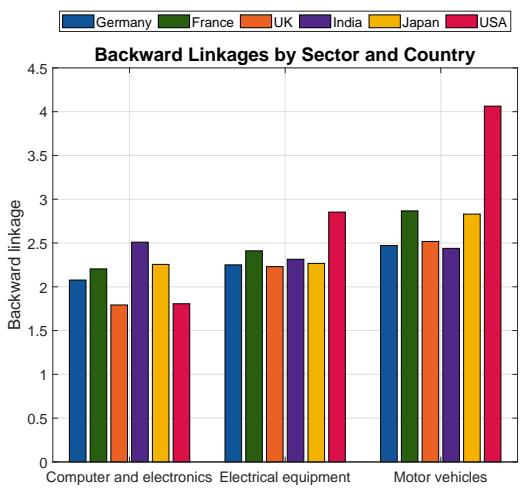  
(a) Backward Linkages

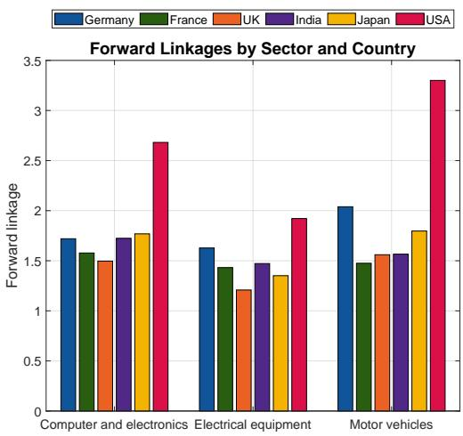  
(b) Forward Linkages  
Source: Input-Output data and IMF staff calculations.  
Note: Panels show backward and forward linkages derived from the Leontief inverse. Backward linkages measure the total input requirements of a sector as a downstream customer, whereas forward linkages measure the total requirements generated by the sector as an upstream supplier.

Panel (b) of Figure IV shows that the U.S. has the strongest forward linkages in all these REEs-intensive sectors. For instance, a 1% decrease in productivity of the motor vehicles sector would lead to a 3.2% decrease in real GDP in the U.S., while it would only lead to a 2.1% decrease in Germany.

## 3.3 Value-added at Risk

Before turning to the structural model and to the use of REE cost shares in sectoral production, we conduct a simple descriptive exercise. We measure the value added associated with REE-related activities in sectors that use REEs, based on whether a sector relies on REEs to any extent. Specifically, we classify a sector as exposed if it uses REEs in any component of production, regardless of the intensity of use. For example, in the motor vehicle sector, if a truck valued at USD 100,000 uses a rare-earth catalyst, the full value of the truck is counted as exposed. This approach contrasts with the exposure measure in the previous section, which captures the cost share of REEs (or REE-based inputs) in production. Table V shows that motor vehicles, coke and refined petroleum, and manufacture of other transport equipment are the sectors with more output associated to REEs and magnets.

Table V: Share of gross output reliant on rare earth elements and magnets

<table><tr><td>Sector</td><td>Share (%)</td></tr><tr><td>C29 Motor vehicles, trailers and semi-trailers</td><td>47.16</td></tr><tr><td>C19 Coke and refined petroleum products</td><td>34.98</td></tr><tr><td>C302T309 Manufacture of other transport equipment</td><td>15.81</td></tr><tr><td>C26 Computer, electronic and optical equipment</td><td>4.72</td></tr><tr><td>C28 Machinery and equipment, nec</td><td>2.63</td></tr><tr><td>C23 Other non-metallic mineral products</td><td>2.22</td></tr><tr><td>C27 Electrical equipment</td><td>2.18</td></tr><tr><td>C24A Manufacture of basic iron and steel</td><td>0.56</td></tr><tr><td>C20 Chemical and chemical products</td><td>0.25</td></tr><tr><td>C25 Fabricated metal products</td><td>0.05</td></tr><tr><td>Q Human health and social work activities</td><td>0.02</td></tr></table>

Source: OECD Input-Output Tables; estimates based on Nassar et al. (2025).  
Note: Sectoral shares are constructed using the industry-level estimates in Nassar et al. (2025), which quantify the percentage of U.S. BEA industry output relying on rare earth elements (REEs). These estimates are mapped to OECD sectors and aggregated using gross output weights to obtain the share of gross output dependent on REEs at the OECD sectoral level.

This analysis shows what would be the direct reduction in total value-added if these sectors stop using REEs. It assumes no substitutability and no spillovers.

Figure V reports the results of the VAAR analysis. We observe that Germany, Japan, and India would suffer the largest reduction in GDP. This means that the value-added generated by these sectors in these countries is large, compared to the whole economy. In Germany, 2.5% of value-added generated is dependent on REEs, while this number is 0.8% in the U.S. Two factors in Table IV, for the motor vehicle sector, help explain these results. First, the REEs-intensive sectors are larger sectors, relative to the other sectors, in Germany. Second, the German REE-intensive sectors are more intensive in the use factors (labor and capital) and less intensive in the use of intermediate inputs. Therefore, every unit of production

Figure V: Value added and Gross Output at Risk  
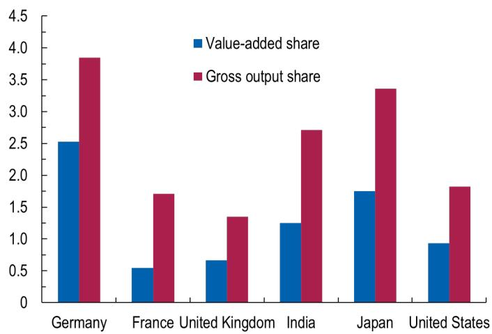  
Source: Organisation for Economic Co-operation and Development (OECD) Input-Output Tables; Nassar et al. (2025); and IMF staff calculations.

Note: Calculations are based on Nassar et al. (2025), which provides industry-specific measures of gross output dependence on rare earths at the Bureau of Economic Analysis $405 \times 405$ detailed input-output level. These dependence measures are first mapped onto the US input-output structure and then translated to the OECD industry classification input-output with 50 sectors from 2017. Using the OECD input-output framework, country-specific shares of rare-earth-dependent consumption are derived for each OECD-level industry across countries. The value-added share is computed as the value added attributable to rare-earth-dependent activities divided by total GDP. The gross output share is defined as an economy's gross output dependent on rare earths divided by its total gross output.

creates more value added.

## 4 A Small Open Economy Production Network Model

## 4.1 Set-up

This paper builds on the framework developed by Silva et al. (2024) and Gomez-Gonzalez et al. (2025), extending it to examine the transmission of supply constraints to imported intermediate inputs in a multi-sector open economy with input-output linkages. The economy has $N+1$ domestic production sectors. Firms in each sector use labor, domestic intermediate inputs, and imported intermediates (REEs) to produce output. The representative household supplies labor inelastically, consumes a composite bundle of goods, and can access to international financial markets, where it can borrow or save at a fixed interest rate r.

Households The household solves the following problem:

$$
\begin{array}{r l} & {\underset {\{C _ {t}, B _ {t} \} _ {t = 0} ^ {\infty}} {\max} \mathbb {E} _ {0} \sum_ {t = 0} ^ {\infty} \beta^ {t} \frac {C _ {t} ^ {1 - \rho} - 1}{1 - \rho}} \\ & {\quad \mathrm{s.t.} P _ {t} C _ {t} + P _ {N + 1, t} (B _ {t} + g (B _ {t})) \leq W _ {t} \bar {L} + (1 + r) P _ {N + 1, t} B _ {t - 1},} \\ & {\quad \mathrm{given} B _ {- 1},} \end{array}
$$

where $\beta$ denotes the discount factor, and $\rho$ is the inverse of the intertemporal elasticity of substitution. The variable $C_{t}$ refers to the aggregate consumption, with $P_{t}$ as its associated price index. The foreign asset position $B_{t}$ is denominated in units of the commodity good. Asset holdings are subject to adjustment costs captured by the function $g(B_{t}) = \frac{\chi}{2}(B_{t} - \bar{B})^{2}$ , where $\chi > 0$ determines the cost intensity and $\bar{B}$ is the steady-state level of debt. The (nominal) wage rate is denoted by $W_{t}$ and labor supply $\bar{L}$ is supplied inelastically.

Within a period, the household minimizes the cost of allocating consumption across goods:

$$
P C = \min _ {\left\{C _ {i} \right\} _ {i = 1} ^ {N + 1}, C _ {M}} \left\{\sum_ {i = 1} ^ {N + 1} P _ {i} C _ {i} + P _ {M} C _ {M} \right\}\tag{1}
$$

subject to the household consumption bundle:

$$
\left(\frac {C _ {M}}{\beta_ {M}}\right) ^ {\beta_ {M}} \cdot \prod_ {i = 1} ^ {N + 1} \left(\frac {C _ {i}}{\beta_ {i}}\right) ^ {\beta_ {i}} \geq C\tag{2}
$$

The parameters $\beta_{i}$ and $\beta_{M}$ are consumption shares, with $\sum_{i=1}^{N+1}\beta_{i}+\beta_{M}=1$ . Sectors $i=1,\ldots,N+1$ are domestic sectors of production, with sector $N+1$ corresponding to the exporter commodity sector, while sector M captures the bundle of imported goods. $^{12}$

Production Each sector in the economy produces output using labor and a composite of intermediate inputs, which includes both domestic and imported components. Variables with a bar denote their steady-state values. The production function for sector i is given by:

$$
\frac {Q _ {i}}{\bar {Q} _ {i}} = Z _ {i} \left(a _ {i} \left(\frac {L _ {i}}{\bar {L} _ {i}}\right) ^ {\frac {\sigma_ {i} - 1}{\sigma_ {i}}} + (1 - a _ {i}) \left(\frac {M _ {i}}{\bar {M} _ {i}}\right) ^ {\frac {\sigma_ {i} - 1}{\sigma_ {i}}}\right) ^ {\frac {\sigma_ {i}}{\sigma_ {i} - 1}},\tag{3}
$$

where $a_{i}$ is the labor share and $(1 - a_{i})$ is the share of intermediate inputs. The elasticity of substitution between labor and intermediates is denoted by $\sigma_{i}$ . The intermediate input bundle $M_{i}$ is composed of domestic and imported intermediate goods:

$$
\frac {M _ {i}}{\bar {M} _ {i}} = \left(\omega_ {i} ^ {D} \left(\frac {M _ {i} ^ {D}}{\bar {M} _ {i} ^ {D}}\right) ^ {\frac {\epsilon_ {i} - 1}{\epsilon_ {i}}} + (1 - \omega_ {i} ^ {D}) \left(\frac {M _ {i M}}{\bar {M} _ {i M}}\right) ^ {\frac {\epsilon_ {i} - 1}{\epsilon_ {i}}}\right) ^ {\frac {\epsilon_ {i}}{\epsilon_ {i} - 1}}\tag{4}
$$

The parameter $\omega_{i}^{D}$ is the expenditure share on domestic intermediates, while $(1 - \omega_{i}^{D})$ is the share of imported REEs. The elasticity of substitution between domestic intermediates $(M_{i}^{D})$ and imported REEs $(M_{i}^{M})$ inputs is given by $\epsilon_{i}$ .

The domestic intermediate bundle is itself a composite of inputs from all domestic sectors:

$$
\frac {M _ {i} ^ {D}}{\bar {M} _ {i} ^ {D}} = \left(\sum_ {j = 1} ^ {N + 1} \omega_ {i j} \left(\frac {M _ {i j}}{\bar {M} _ {i j}}\right) ^ {\frac {\epsilon_ {i} ^ {D} - 1}{\epsilon_ {i} ^ {D}}}\right) ^ {\frac {\epsilon_ {i} ^ {D}}{\epsilon_ {i} ^ {D} - 1}},\tag{5}
$$

Here, $\omega_{ij}$ denotes the share of expenditure on input $j$ within sector $i$ 's domestic intermediate bundle, satisfying $\sum_{j=1}^{N+1} \omega_{ij} = 1$ . The elasticity of substitution among domestic intermediates is denoted by $\epsilon_i^D$ .

Exogenous Processes The model incorporates three exogenous processes: the evolution of the commodity price in foreign currency, denoted by $P_{N+1,t}^{*}$ , sector-specific productivity, represented by $Z_{i,t}$ , and the quantity of imported REEs available to the small open economy

$\overline{M}_{M,t}$ :

$$
\log P _ {N + 1, t} ^ {*} = \rho_ {N + 1} \log P _ {N + 1, t - 1} ^ {*} + \varepsilon_ {N + 1, t}\tag{6}
$$

$$
\log Z _ {i, t} = \rho_ {Z} \log Z _ {i, t - 1} + \varepsilon_ {i, t}\tag{7}
$$

$$
\log \overline {{M}} _ {M, t} = (1 - \rho_ {M}) \log \bar {M} + \rho_ {M} \log \overline {{M}} _ {M, t - 1} + \varepsilon_ {M, t}\tag{8}
$$

The parameters $\rho_{N+1}$ , $\rho_{Z}$ , and $\rho_{M}$ govern the degree of persistence, and $\varepsilon_{N+1,t}$ , $\varepsilon_{i,t}$ , and $\varepsilon_{M,t}$ are assumed to be i.i.d. shocks.

Market Clearing In each period, goods, labor, and financial markets are assumed to clear. Output in each sector is fully absorbed by domestic final consumption and intermediate input demand. Labor supply is fixed and allocated inelastically across sectors, implying full employment. The evolution of the foreign asset position reflects the trade balance and captures the net resource flow between the domestic economy and the rest of the world. The market clearing conditions are given by Equations (9)–(12):

$$
Q _ {i, t} = C _ {i, t} + \sum_ {j = 1} ^ {N + 1} M _ {j i, t}, \quad \text { for } i = 1, 2, \dots , N\tag{9}
$$

$$
Q _ {N + 1, t} = C _ {N + 1, t} + X _ {t} + \sum_ {j = 1} ^ {N + 1} M _ {j, N + 1, t},\tag{10}
$$

$$
\bar {L} = \sum_ {i = 1} ^ {N + 1} L _ {i, t},\tag{11}
$$

$$
B _ {t} = (1 + r) B _ {t - 1} - g (B _ {t}) + \underbrace {X _ {t} - \frac {P _ {M , t}}{P _ {N + 1 , t}} \left(\sum_ {i = 1} ^ {N + 1} M _ {i M , t} + C _ {M , t}\right)} _ {\text {Trade Balance}}\tag{12}
$$

Rare Earths Supply Constraints We introduce a constraint to the supply of REEs materials. In particular, total domestic use of REEs is restricted by

$$
\sum_ {i = 1} ^ {N + 1} M _ {i M, t} \leq \overline {{M}} _ {M, t}\tag{13}
$$

with $M_{t}$ following the exogenous process in Equation (8). We assume that Equation (13) is always binding. To ensure this is the case, we first solve the unconstrained equilibrium, and then define a steady state value of $\overline{M}$ that is slightly below the total desired demand for REEs by domestic firms.

To understand how the supply constraint manifests in this economy, let $C_{i}(\cdot)$ be sector i's cost function for producing $Q_{i,t}$ , where $M_{iM,t}$ is one of the inputs. The economy-wide allocation can be represented as the solution to a single Lagrangian where the aggregate feasibility constraint is appended to the sum of sectoral cost problems. The Lagrangian is:

$$
\mathcal {L} _ {t} = \sum_ {i = 1} ^ {N + 1} \Big [ \underbrace {P _ {M} M _ {i M , t} + (\text {other input costs})} _ {\text {sectoral cost}} + \lambda_ {i, t} (Q _ {i, t} - F _ {i} (\text {inputs})) \Big ] + \mu_ {t} \Big (\sum_ {i = 1} ^ {N + 1} M _ {i M, t} - \bar {M} _ {M t} \Big),
$$

where $\lambda_{i,t}$ is the multiplier on sector $i$ 's production technology, and $\mu_t$ is the multiplier on the aggregate quota of REEs in Equation (13). The first order and necessary condition for imported intermediates is:

$$
\frac {\partial \mathcal {L} _ {t}}{\partial M _ {i M , t}} = P _ {M} - \lambda_ {i, t} \frac {\partial F _ {i}}{\partial M _ {i M , t}} + \mu_ {t} = 0.
$$

Rearranging gives:

$$
\lambda_ {i, t} \frac {\partial F _ {i}}{\partial M _ {i M , t}} = P _ {M, t} + \mu_ {t} = P _ {M, t} (1 + \tau_ {t}).\tag{14}
$$

where $\tau_{t}$ in an ad-valorem tax (wedge) in the use of imported intermediates. Given that in our economy the numeraire is the international price of imported goods $P_{M}$ , the wedge on the cost of imported inputs becomes $\tau_{t} \equiv \frac{\mu_{t}}{P_{M}}$ , implying $P_{M} + \mu_{t} = P_{M}(1 + \tau_{t})$ .

We assume that the rents generated by the binding aggregate import quota leave the domestic economy. In particular, firms pay an effective price $(P_{M}(1+\tau_{t}))$ for imported REEs, where $\tau_{t}$ is the endogenous shadow value of the aggregate import constraint. The total wedge payment is therefore $R_{t}^{\tau}=\tau_{t}P_{M}\sum_{i=1}^{N+1}M_{iMt}$ , which we interpret as foreign quotas or other costs associated with securing scarce imports (e.g., licensing fees, rationing costs, search costs, or payments to foreign intermediaries). These payments are not rebated to domestic households and therefore constitute a leakage from the domestic economy. Under this interpretation, the aggregate import constraint is equivalent to an endogenous tax on imported REEs, whose rate is determined endogenously by the scarcity of the imported input rather than by government policy.

Equation (14) shows that the aggregate constraint raises the effective marginal cost of imported intermediates by the common shadow value $\mu_{t}$ , and this term affects each sector using imported REEs.

A second effect of the constraint is a direct reduction in gross output of REEs-intensive sectors. To understand this let's start with the production function of sector importing REEs. For simplicity, assume that $\sigma_{i} = \sigma = \epsilon_{i} = \epsilon$ for all $i$ . Hence,

$$
\frac {Q _ {i}}{\bar {Q} _ {i}} = Z _ {i} \left(a _ {i} \left(\frac {L _ {i}}{\bar {L} _ {i}}\right) ^ {\frac {\sigma - 1}{\sigma}} + (1 - a _ {i}) \left(\omega_ {i} ^ {D} \left(\frac {M _ {i} ^ {D}}{\bar {M} _ {i} ^ {D}}\right) ^ {\frac {\sigma - 1}{\sigma}} + (1 - \omega_ {i} ^ {D}) \left(\frac {M _ {i M}}{\bar {M} _ {i M}}\right) ^ {\frac {\sigma - 1}{\sigma}}\right)\right) ^ {\frac {\sigma - 1}{\sigma}},
$$

We have that the decline in sector $i$ 's output of an arbitrary reduction in $M_{iM}$ is decreasing in the elasticity of substitution $\sigma$ . As in Bachmann et al. (2024), in the Leontief production function extreme when $\sigma = 0$ ,

$$
\frac {Q _ {i}}{\bar {Q} _ {i}} = Z _ {i} \min \{\frac {L _ {i}}{\bar {L} _ {i}}, \frac {M _ {i} ^ {D}}{\bar {M} _ {i} ^ {D}}, \frac {M _ {i M}}{\bar {M} _ {i M}} \}.\tag{15}
$$

Here, the decline in output of sector i is directly proportional to the decline in $M_{iM}$ . Indeed, $d \log Q = d \log M_{iM}$ . This shock propagates to sectors upstream to sector i. All else equal, this shock also increases the price of sector i, which then propagates to downstream sectors.

## 4.2 Calibration

We calibrate the model to match countries' input-output structure and the corresponding vector of imported shares of REEs. In particular, we set $\beta_{i}$ , the expenditure share of consumption in goods from sector $i$ , to be the observed expenditure share on sector $i$ , over the household's total consumption expenditure, for each of the countries in our sample.

We calibrate the sectoral use of value added inputs $a_{i}$ and the domestic input-output shares $\omega_{ij}$ to match the observed sectoral shares in the OECD 2017 data. For simplicity, we assume that the imported intermediates are all REEs inputs, which means that $1 - \omega_{i}^{D}$ represents the expenditure share of imported REEs in total intermediate input spending from Table III.

The discount factor $\beta$ , the intertemporal elasticity of substitution $\rho$ , and the bond holding's adjustment cost $\psi$ are taken from Silva et al. (2024). The shocks' persistence- $\rho_{M}, \rho_{Z}, \rho_{N+1^{-}}$ we assume it to be high and equal to 0.9.

Three key parameters in our analysis are the values of the elasticities of substitution in production. The elasticity of substitution between labor and intermediates $(\sigma)$ , the elasticity of substitution between domestic intermediates $(\epsilon^{D})$ , and the elasticity of substitution between REE inputs and the bundle of domestic intermediates. Given the limited empirical evidence on $\epsilon$ , especially in the short-run, we use different values and study different scenarios.

Another important element of the baseline calibration is the value of the REE supply constraint $\overline{M}$ and, therefore, the steady-state value of the wedge $\tau$ . Our baseline unconstrained economy delivers a steady state value of REEs demand - $\sum_{i=1}^{N+1} M_{iM}$ - of 3.69. Therefore, motivated by recent events in the REE markets, we assume that the economy's initial equilibrium is inefficient. In particular, we assume that the constraint in Equation (13) is binding $-\overline{M}=3.67<3.69$ — which implies $\tau=2.5$ . This initial equilibrium is somewhat conservative considering that observed increases in the effective price of some REEs in 2025 were larger than 4000% (e.g., yttrium). $^{13}$

## 4.3 Effects of a 80% Reduction in REEs Supply

We simulate a persistent reduction in REEs supply. In particular, we simulate an 80% reduction in the supply of REE available for the small open economy. In particular, we reduce $\epsilon_{M,t}$ from Equation (8). We start by studying the sectoral responses of REEs-intensive sectors under different values of the elasticity of substitution. We then assess the macroeconomic effects of the shock on countries' GDP, measured in units of the imported good price.

## 4.3.1 Sectoral Responses

Figure VI displays the impact response of all U.S. sectors in the economy with low input substitutability to a 80% decline in REEs supply. Nineteen sectors display a decline in output, with seven sectors showing a decline larger than 2% in output. Motor vehicle (-8.96%) and manufacturing of other equipments (-3.65%) are the two sectors with largest drop in output. On the other hand, eighteen sectors show a slight increase in output— $\in (0.1\%, 1\%)$ —due to sectoral reallocation.

We now compare the response of the motor vehicle sector across countries. Figure VII plots the impulse response function of motor vehicle sector output to a 80% decline in $\overline{M}_{Mt}$ . The left panel shows the output response for the low elasticity of substitution case ( $\sigma = 0.015$ ), while the right panel uses a higher elasticity of 0.8. In the low elasticity case, the U.S. automobile sector experiences a 9% reduction in output. The same sector, in Germany,

Figure VI: Impact Sectoral Output Response to a 80% Decline in $\overline{M}_{M}$

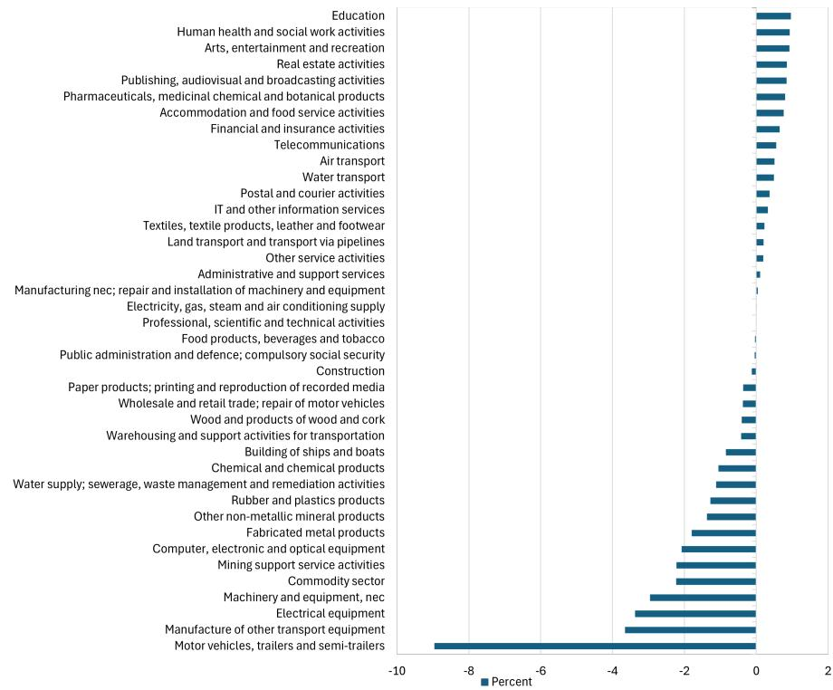  
Source: IMF staff calculations.

Note: This figure shows the first period response (in percent) of sectoral output $Q_{i}$ to the REEs supply shock.

only experiences a $5.8\%$ reduction in output. For the high-elasticity case, the automobile sector barely reduces production. In the U.S., the sector's output declines by $0.07\%$ , while in Germany the decline is $-0.038\%$ . One factor explaining these differences across countries is the heterogeneity in sectoral intermediate input shares. While $1 - \omega_{i}^{D}$ is the same across economies, $(1 - a_{i})(1 - \omega_{i}^{D})$ is not. For instance, the production exposure to REEs in the U.S. motor vehicle sector $((1 - a_{i})(1 - \omega_{i}^{D}))$ is larger than that in Germany.

## 4.3.2 GDP Responses

We assess the macroeconomic impact of the shock by studying the response of GDP, in units of the importable good price. Figure VIII shows the impact response of GDP to the 80% decline in $\bar{M}_{M}$ , for different countries, for different elasticity values.

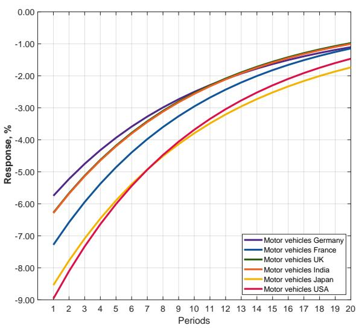  
(a) Low Elasticity $(\sigma = 0.015)$

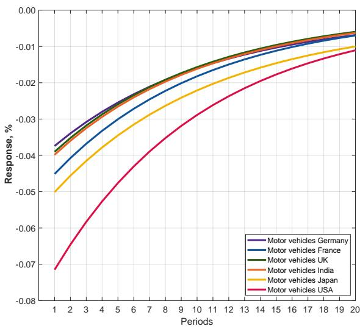  
(b) High Elasticity ( $\sigma = 0.8$ )  
Note: Both panels display the impulse response of motor vehicle sector to a 80% decline in REEs supply. The left panel assumes an elasticity of substitution of 0.015, while the right panel uses 0.8.

The results in Figure VIII indicate that Japan and the U.S. are the two countries with the largest decline in GDP after the disruption in REEs supply. To understand these results we can look back at the response of the motor vehicle sector in Japan and in the U.S. These are the two countries with the largest fall in output in the motor vehicle sector. The linkages of the motor vehicle sector in the U.S. and Japan are also relatively stronger than in other countries. Figure IV shows that, the U.S. motor vehicle is the most central in both dimensions, while the Japanese motor vehicle sector is the second and third most central in terms of backward and forward linkages, respectively.

These results are mainly driven by one elasticity of substitution. In particular, the elasticity of substitution between REEs and the bundle of domestic intermediates $\epsilon$ . We repeat the exercise above and compare a case with all elasticities equal to 0.8 vs a case in which only $\epsilon = 0.015$ but $\sigma = \epsilon^{D} = 0.8$ . Figure IX presents the IRF for this case, compared to the all low elasticity case. The results in the intermediate case in panel (b) account for approximately 96% to 98% of the IRF in Figure IX panel (a), when all elasticities are low.

Figure VIII: Output Losses by Country from a major REEs disruption by country

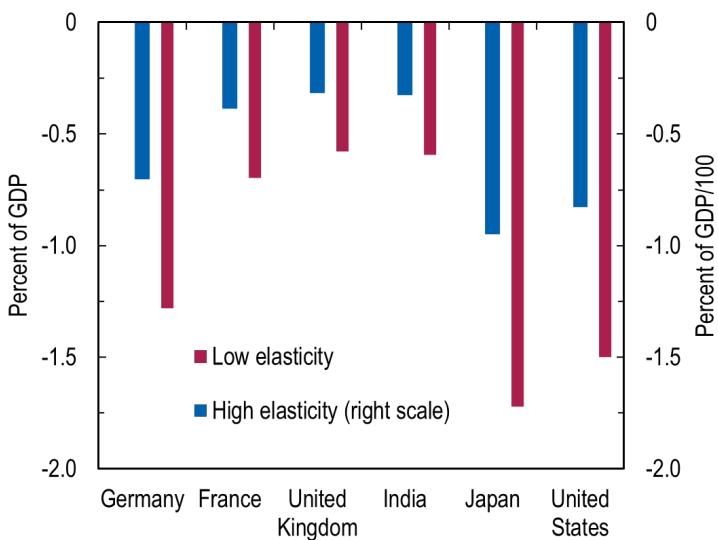  
Source: Organisation for Economic Co-operation and Development tables; and IMF staff calculations. Note: The scenarios are based on an 80 percent supply disruption affecting 80 percent of imported goods, specifically rare earths and magnets. The high-elasticity scenario uses a substitution elasticity of 0.8 between the imported goods and their varieties as in Alfaro et al. (2025), while the low-elasticity scenario uses an elasticity of 0.015. REEs= rare earth elements.

## 4.3.3 Effects on Real GDP

In our final section, we examine the response of real GDP to the supply shock of imported REEs. Unlike closed-economy model in which aggregate consumption is real GDP, in our small open economy with international borrowing and consumption smoothing real GDP does not equal aggregate consumption and we must properly separate nominal GDP fluctuations from fluctuations in the GDP deflator and fluctuations in real GDP. Consider the definition of nominal GDP. In our particular model,

$$
n G D P = \sum_ {i = 1} ^ {N + 1} P _ {i} Q _ {i} - \sum_ {i = 1} ^ {N + 1} \sum_ {j = 1} ^ {N + 1} P _ {j} M _ {i j} - \sum_ {i = 1} ^ {N + 1} P _ {M} (1 + \tau) M _ {i M}.
$$

Using the fact that $d \log X = \frac{1}{X} d X$ , Changes in nominal GDP thus satisfies

$$
\mathrm{d} \log n G D P = \frac {1}{n G D P} \sum_ {i = 1} ^ {N + 1} \left[ P _ {i} Q _ {i} \mathrm{d} \log \left(P _ {i} Q _ {i}\right) - \sum_ {j = 1} ^ {N + 1} P _ {j} M _ {i j} \mathrm{d} \log \left(P _ {j} M _ {i j}\right) - P _ {M} (1 + \tau) M _ {i M} \mathrm{d} \log \left(P _ {M} (1 + \tau) M _ {i M}\right) \right]
$$

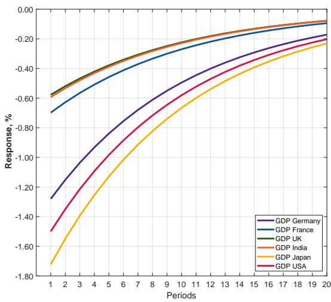  
(a) Low Elasticity ( $\sigma = \epsilon_{D} = \epsilon = 0.015$ )

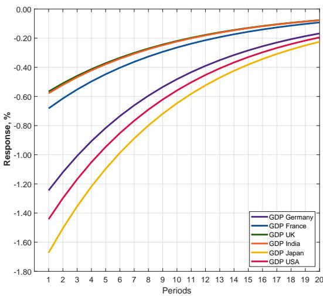  
(b) Low-High Elasticity ( $\sigma = \epsilon^{D} = 0.8$ , $\epsilon = 0.015$ )

Note: Both panels display the impulse response of motor vehicle sector to a 80% decline in REEs supply. The left panel assumes all elasticities of substitution of 0.015, while the right panel uses 0.8 for $\sigma$ and $\epsilon^{D}$ and $\epsilon = 0.015$ .

$$
\mathrm{d} \log n G D P = \sum_ {i = 1} ^ {N + 1} \frac {P _ {i} Q _ {i}}{n G D P} \left[ \mathrm{d} \log (P _ {i} Q _ {i}) - \sum_ {j = 1} ^ {N + 1} \frac {P _ {j} M _ {i j}}{P _ {i} Q _ {i}} \mathrm{d} \log (P _ {j} M _ {i j}) - \frac {P _ {M} (1 + \tau) M _ {i M}}{P _ {i} Q _ {i}} \mathrm{d} \log (P _ {M} (1 + \tau) M _ {i M}) \right].
$$

Therefore, real GDP, net of the GDP deflator, and using the definition of $Q_{i}$ , is

$$
\mathrm{d} \log r G D P = \sum_ {i = 1} ^ {N + 1} \frac {P _ {i} Q _ {i}}{n G D P} \left[ \mathrm{d} \log Z _ {i} + a _ {i} \mathrm{d} \log L _ {i} + \right] - \left(\sum_ {i = 1} ^ {N + 1} \frac {P _ {M} M _ {i M}}{n G D P}\right) (1 + \tau) \mathrm{d} \log (1 + \tau).\tag{16}
$$

The first in term in equation (16) is orthogonal to the REE supply shock and it is only a function of changes in sectoral productivity and aggregate labor supply (see Silva et al., 2024, for more details). The second term contains a sufficient statistic to understand the real GDP effect of a REE supply constraint (around $\tau \approx 0$ ): the total value of imported REE as a share of GDP - $\left(\sum_{i=1}^{N+1} \frac{P_M M_{iM}}{nGDP}\right)$ - in the economy. The fact that even around $\tau \approx 0$ , the shock can have aggregate effects stems from the endogenous nature of our wedge. This is consistent with the results in Baqaee and Farhi (2020) for endogenous wedges (e.g.,

endogenous markups).

Figure X: Real GDP Response to a 80% Decline in $\overline{M}_{M}$ (low-elasticity case)  
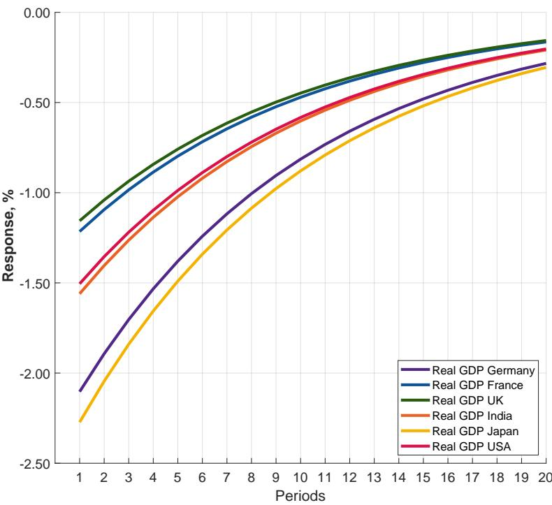  
Source: Authors' calculation. This figure shows the IRFs of real GDP to a $80\%$ decline in the supply of REE imported inputs. Production elasticities are all set to 0.015 (low-elasticity case).

We evaluate the change in real GDP at the initial steady state with $\tau = \tau^{SS} > 0$ . Here, $\mathrm{d}\log(1 + \tau)$ represents the changes in the Lagrange multiplier ( $\tau = \mu$ when $P_{M} = 1$ ) after the supply constraint shock. Figure X depicts the IRF of real GDP for the countries in our sample. The ranking of the most affected countries changes with respect to Figure VIII. Japan continues to be the most exposed country but now Germany is the second most exposed country instead of the U.S.

The key to understand the cross-country heterogeneity is embedded in the second term of Equation (16). The term $\frac{P_{M}M_{iM}}{nGDP}$ can be expressed as $\frac{P_{i}Q_{i}}{nGDP}\frac{P_{M}M_{iM}}{P_{i}Q_{i}}$ which represents the distortion-adjusted size of the REE-intensive sectors (cost-based Domar weight) weighted by how relevant REE purchases are as a fraction of sectoral gross output. This term can be furthered expressed as $\frac{P_{i}Q_{i}(1+\tau)}{nGDP}\frac{P^{M}M_{i}}{P_{i}Q_{i}}\frac{P_{M}M_{iM}}{P_{i}^{M}M_{i}}$ , where the last term – the share of REE purchases in total intermediate input purchases – is assumed to be common across countries (equal to the U.S. shares). Therefore, by assuming the same level of initial distortion across countries, cross-country differences in Domar weights $\left(\frac{P_{i}Q_{i}}{nGDP}\right)$ and intermediate input shares $\left(\frac{P_{i}^{M}M_{i}}{P_{i}Q_{i}}\right)$ can create heterogeneity in the response to the shock. Table IV provides the Domar weight and the factor shares (1-intermediate input share) of the motor vehicle sector across countries. Germany and Japan are by far the countries with the largest motor vehicle sector. Japan’s motor sector is also less intensive in factors and more intensive in intermediate inputs, which then increases the exposure to REE inputs.

In this case, although not apparent, there is also a role for the elasticity of substitution in production. Indeed, the change in the wedge - d log(1 + τ) - as a response to the REE supply shock is a function of production elasticities. As shown by Miranda-Pinto and Young (2022), in the context of sectoral working capital constraints, greater input substitutability reduces the increase in the wedge in response to sectoral collateral constraint shocks. This is exactly what occurs in this model. In non-reported results, we show that the decline in real GDP after the shock is smaller the greater the elasticity of substitution. This is precisely due to to the fact that the endogenous wedge increases less, for the same shock, when firms can more easily substitute REE for other inputs of production.

## 5 Conclusion

While rare earth elements account for a very small share of economic value in dollars, their importance stems from their critical role in key manufacturing sectors, such as motor vehicles, electrical equipment, semiconductors, renewable energy, and defense, where they enable high-performance applications, particularly through permanent magnets. Their limited short-run substitutability implies that disruptions to supply can directly constrain production, generating sizable GDP losses. Crucially, these effects extend well beyond the directly exposed sectors: because REE-intensive industries occupy central positions in production networks, both as suppliers and users of intermediate inputs, shocks propagate upstream and downstream, amplifying aggregate losses. As a result, GDP impacts can be disproportionately large relative to the small value-added share of REE-intensive sectors.

Over longer horizons, however, substitution and adjustment become possible. Firms can adopt alternative motor designs that do not rely on rare-earth permanent magnets. For example, some electric vehicles use induction motors, which generate motion through electromagnetic fields created by electric currents rather than permanent magnets. Because these designs do not require rare earth elements, they avoid the key supply bottleneck - albeit sometimes at the cost of lower efficiency and greater weight. In parallel, supply chains can be diversified and expanded outside key producers, as illustrated by Japan's response to the 2010 REE shortage, which combined upstream investment in mining abroad, recycling, stockpiling, and support for domestic magnet production.

## References

Acemoglu, D., U. Akcigit, and W. Kerr (2016). Networks and the macroeconomy: An empirical exploration. Nber macroeconomics annual 30(1), 273–335.

Acemoglu, D., V. M. Carvalho, A. Ozdaglar, and A. Tahbaz-Salehi (2012). The network origins of aggregate fluctuations. Econometrica 80(5), 1977–2016.

Alfaro, L., H. Fadinger, J. Schymik, and G. Virananda (2025, May). Trade and industrial policy in supply chains: Directed technological change in rare earths. Technical Report 33877, National Bureau of Economic Research, Cambridge, MA.

Alonso, E., D. G. Pineault, J. Gambogi, and N. T. Nassar (2023a). Mapping first to final uses for rare earth elements, globally and in the united states. Journal of Industrial Ecology 27(1), 312–322.

Alonso, E., D. G. Pineault, J. Gambogi, and N. T. Nassar (2023b). Mapping first to final uses for rare earth elements, globally and in the united states. Journal of Industrial Ecology 27(1), 312–322.

Alvarez, J., M. B. Andaloussi, C. Maggi, A. Sollaci, M. Stuermer, and P. Topalova (2026). Geoeconomic fragmentation and commodity markets. Journal of International Money and Finance, 103555.

Atalay, E. (2017). How important are sectoral shocks? American Economic Journal: Macroeconomics 9(4), 254–280.

Bachmann, R., D. Baqaee, C. Bayer, M. Kuhn, A. Löschel, B. Moll, A. Peichl, K. Pittel, and M. Schularick (2024). What if? the macroeconomic and distributional effects for germany of a stop of energy imports from russia. \*Economica\* 91(364), 1157–1200.

Baqaee, D. R. and E. Farhi (2020). Productivity and misallocation in general equilibrium. The quarterly journal of economics 135(1), 105–163.

Bedford, J. (2025, September). Rare earths and industry: Why dependence on china endures.
Technical Report 1843, East Asian Institute, National University of Singapore, Singapore.

Bigio, S. and J. La'o (2020). Distortions in production networks. The quarterly journal of economics 135(4), 2187–2253.

Boehm, C. E., A. Flaaen, and N. Pandalai-Nayar (2019). Input linkages and the transmission of shocks: Firm-level evidence from the 2011 tōhoku earthquake. Review of Economics and Statistics 101(1), 60–75.

Gomez-Gonzalez, P., M. Jerez-Osses, V. Maver, J. Miranda-Pinto, and J.-M. Natal (2025, October). Commodity-driven macroeconomic fluctuations: Does size matter? Technical Report WP/25/208, International Monetary Fund, Washington, DC.

Graedel, T. E., E. M. Harper, N. T. Nassar, and B. K. Reck (2015, May). On the materials basis of modern society. Proceedings of the National Academy of Sciences of the United States of America 112(20), 6295–6300.

International Energy Agency (2025, May). Global critical minerals outlook 2025. Technical report, International Energy Agency, Paris. Licence: CC BY 4.0.

Market Data Forecast (2025). Permanent magnets market size, share, trends & growth forecast.

Ministry of Commerce of the People's Republic of China (2025). Announcement on export controls of rare earth-related items. Technical report, MOFCOM.

Miranda-Pinto, J., E. I. Rojas, F. Saffie, and A. Silva (2025). Connected for better or worse? the role of production networks in financial crises. Technical report, National Bureau of Economic Research Working Paper Number 34604.

Miranda-Pinto, J. and E. R. Young (2022). Flexibility and frictions in multisector models. American Economic Journal: Macroeconomics 14(3), 450–480.

Morgan Stanley (2025, June). Mapping a potential ex-China rare earths supply chain. Metals & mining, Morgan Stanley Research.

Nassar, N. T., D. Pineault, S. M. Allen, D. M. McCaffrey, A. J. Padilla, J. L. Brainard, M. Bayani, E. Shojaeddini, J. W. Ryter, S. Lincoln, and E. Alonso (2025, August). Methodology and technical input for the 2025 u.s. list of critical minerals—assessing the

potential effects of mineral commodity supply chain disruptions on the u.s. economy. Technical Report 2025–1047, U.S. Geological Survey, Reston, VA.

Nkiawete, M. M. and R. L. Vander Wal (2025). Rare earth elements: Sector allocations and supply chain considerations. Journal of Rare Earths 43(1), 1–8.

OECD (2025). OECD inventory of export restrictions on industrial raw materials 2025: Monitoring the use of export restrictions amid growing market and policy tensions. Report, OECD Publishing, Paris.

Reuters (2025a, June). Auto companies in full panic over rare earths bottleneck. By Christina Amann, Nick Carey, and Kalea Hall. Accessed March 31, 2026.

Reuters (2025b, November). A new rare earth crisis is brewing as yttrium shortages spread. Reuters. Accessed April 1, 2026.

Reuters (2026, February). Rare earth shortages worsen in u.s. aerospace, chips despite trade truce, sources say. By Allison Lampert, Laurie Chen, Lewis Jackson, and Michael Martina. Accessed March 31, 2026.

Shao, L., K. Feng, Z. Wu, Z. Chen, J. Ge, G.-Q. Chen, B. Chen, B. Zhang, J. Li, and W.-Q. Chen (2026). Tracing China's unseen rare earth exports that sustain global consumption. Cell Reports Sustainability 3(1), 100553.

Silva, A., P. Caraiani, J. Miranda-Pinto, and J. Olaya-Agudelo (2024). Commodity prices and production networks in small open economies. Journal of Economic Dynamics and Control 168, 104968.

U.S. Geological Survey (2026). Rare earths statistics and information. Statistics and information on the worldwide supply, demand, and flow of rare earth elements.

## 6 Additional Resources

Table VI: Size and Factor Share of the Computer, Electronic and Optical Equipment Sector Across Selected Economies

<table><tr><td>Country</td><td>Share in GDP (%)</td><td>Domar Weight (%)</td><td>Factor Share (%)</td></tr><tr><td>Germany</td><td>1.42</td><td>2.99</td><td>47.34</td></tr><tr><td>France</td><td>0.49</td><td>1.19</td><td>41.15</td></tr><tr><td>United Kingdom</td><td>0.73</td><td>1.24</td><td>58.60</td></tr><tr><td>India</td><td>0.38</td><td>1.57</td><td>24.45</td></tr><tr><td>Japan</td><td>1.54</td><td>3.98</td><td>38.82</td></tr><tr><td>United States</td><td>1.36</td><td>1.95</td><td>70.17</td></tr></table>

Source: IMF staff calculations and OECD Input-Output data.  
Note: This table reports the share of the computer, electronic and optical equipment sector (OECD C26) in total GDP, the ratio of sectoral gross output to GDP (Domar weight), and the factor share in production across countries.

Table VII: Size and Factor Share of the Electrical Equipment Sector Across Selected Economies

<table><tr><td>Country</td><td>Share in GDP (%)</td><td>Domar Weight (%)</td><td>Factor Share (%)</td></tr><tr><td>Germany</td><td>1.51</td><td>3.69</td><td>41.00</td></tr><tr><td>France</td><td>0.37</td><td>1.11</td><td>33.27</td></tr><tr><td>United Kingdom</td><td>0.26</td><td>0.70</td><td>37.50</td></tr><tr><td>India</td><td>0.57</td><td>2.32</td><td>24.51</td></tr><tr><td>Japan</td><td>1.26</td><td>3.25</td><td>38.95</td></tr><tr><td>United States</td><td>0.32</td><td>0.68</td><td>46.45</td></tr></table>

Source: IMF staff calculations and OECD Input-Output data.  
Note: This table reports the share of the electrical equipment sector (OECD C27) in total GDP, the ratio of sectoral gross output to GDP (Domar weight), and the factor share in production across countries.

Table VIII: Sectoral values associated with REEs and Magnets (Millions USD in 2017)

<table><tr><td>Sector</td><td>REEs</td><td>Magnets</td><td>Sum</td></tr><tr><td>336112 Light truck and utility vehicle manufacturing</td><td>9.20</td><td>168.40</td><td>177.60</td></tr><tr><td>336111 Automobile manufacturing</td><td>1.70</td><td>51.70</td><td>53.40</td></tr><tr><td>336414 Guided missile and space vehicle manufacturing</td><td>0.00</td><td>43.30</td><td>43.30</td></tr><tr><td>335110 Electric lamp bulb and part manufacturing</td><td>22.70</td><td>0.00</td><td>22.70</td></tr><tr><td>324110 Petroleum refineries</td><td>18.80</td><td>0.00</td><td>18.80</td></tr><tr><td>334413 Semiconductor and related device manufacturing</td><td>17.30</td><td>0.00</td><td>17.30</td></tr><tr><td>3363A0 Motor vehicle steering, suspension, and brake systems manufacturing</td><td>0.00</td><td>13.50</td><td>13.50</td></tr><tr><td>334511 Search, detection, and navigation instruments manufacturing</td><td>0.00</td><td>13.10</td><td>13.10</td></tr><tr><td>331110 Iron and steel mills and ferroalloy manufacturing</td><td>13.10</td><td>0.00</td><td>13.10</td></tr><tr><td>335911 Storage battery manufacturing</td><td>11.40</td><td>0.00</td><td>11.40</td></tr><tr><td>33441A Other electronic component manufacturing</td><td>11.30</td><td>0.00</td><td>11.30</td></tr><tr><td>334300 Audio and video equipment manufacturing</td><td>0.00</td><td>10.30</td><td>10.30</td></tr><tr><td>33399A Other general purpose machinery manufacturing</td><td>0.00</td><td>9.30</td><td>9.30</td></tr><tr><td>333415 Air conditioning, refrigeration, and warm air heating equipment manufacturing</td><td>0.00</td><td>9.10</td><td>9.10</td></tr><tr><td>332999 Other fabricated metal manufacturing</td><td>7.60</td><td>0.00</td><td>7.60</td></tr><tr><td>333314 Optical instrument and lens manufacturing</td><td>5.50</td><td>0.00</td><td>5.50</td></tr><tr><td>336412 Aircraft engine and engine parts manufacturing</td><td>4.60</td><td>0.00</td><td>4.60</td></tr><tr><td>327200 Glass and glass product manufacturing</td><td>4.50</td><td>0.00</td><td>4.50</td></tr><tr><td>335312 Motor and generator manufacturing</td><td>0.00</td><td>4.10</td><td>4.10</td></tr><tr><td>621500 Medical and diagnostic laboratories</td><td>4.00</td><td>0.00</td><td>4.00</td></tr><tr><td>334112 Computer storage device manufacturing</td><td>0.00</td><td>3.90</td><td>3.90</td></tr><tr><td>325180 Other basic inorganic chemical manufacturing</td><td>3.80</td><td>0.00</td><td>3.80</td></tr><tr><td>325130 Synthetic dye and pigment manufacturing</td><td>3.80</td><td>0.00</td><td>3.80</td></tr><tr><td>3259A0 All other chemical product and preparation manufacturing</td><td>3.20</td><td>0.00</td><td>3.20</td></tr><tr><td>221100 Electric power generation, transmission, and distribution</td><td>1.40</td><td>0.00</td><td>1.40</td></tr><tr><td>334510 Electromedical and electrotherapeutic apparatus manufacturing</td><td>1.20</td><td>0.00</td><td>1.20</td></tr><tr><td>336120 Heavy duty truck manufacturing</td><td>1.20</td><td>0.00</td><td>1.20</td></tr><tr><td>333611 Turbine and turbine generator set units manufacturing</td><td>1.20</td><td>0.00</td><td>1.20</td></tr><tr><td>325211 Plastics material and resin manufacturing</td><td>0.20</td><td>0.00</td><td>0.20</td></tr><tr><td>335999 All other miscellaneous electrical equipment and component manufacturing</td><td>0.00</td><td>0.00</td><td>0.00</td></tr><tr><td>335920 Communication and energy wire and cable manufacturing</td><td>0.00</td><td>0.00</td><td>0.00</td></tr><tr><td>33451A Watch, clock, and other measuring and controlling device manufacturing</td><td>0.00</td><td>0.00</td><td>0.00</td></tr></table>

Table IX: Sector Intermediate Input Share Magnets and REEs (sorted by total)

<table><tr><td>Sector</td><td>Magnets</td><td>REEs</td><td>Total</td></tr><tr><td>335110 Electric lamp bulb and part manufacturing</td><td>0</td><td>3.180993</td><td>3.180993</td></tr><tr><td>334300 Audio and video equipment manufacturing</td><td>0.795045</td><td>0</td><td>0.795045</td></tr><tr><td>336414 Guided missile and space vehicle manufacturing</td><td>0.396829</td><td>0</td><td>0.396829</td></tr><tr><td>334112 Computer storage device manufacturing</td><td>0.210648</td><td>0</td><td>0.210648</td></tr><tr><td>335911 Storage battery manufacturing</td><td>0</td><td>0.175335</td><td>0.175335</td></tr><tr><td>333314 Optical instrument and lens manufacturing</td><td>0</td><td>0.160895</td><td>0.160895</td></tr><tr><td>336111 Automobile manufacturing</td><td>0.150365</td><td>0.005047</td><td>0.155412</td></tr><tr><td>336112 Light truck and utility vehicle manufacturing</td><td>0.088227</td><td>0.004837</td><td>0.093064</td></tr><tr><td>334413 Semiconductor and related device manufacturing</td><td>0</td><td>0.088236</td><td>0.088236</td></tr><tr><td>332999 Other fabricated metal manufacturing</td><td>0</td><td>0.079695</td><td>0.079695</td></tr><tr><td>325130 Synthetic dye and pigment manufacturing</td><td>0</td><td>0.073296</td><td>0.073296</td></tr><tr><td>334511 Search, detection, and navigation instruments manufacturing</td><td>0.070224</td><td>0</td><td>0.070224</td></tr><tr><td>33399A Other general purpose machinery manufacturing</td><td>0.054893</td><td>0</td><td>0.054893</td></tr><tr><td>3363A0 Motor vehicle steering, suspension component (except spring), and brake systems manufacturing</td><td>0.054696</td><td>0</td><td>0.054696</td></tr><tr><td>335312 Motor and generator manufacturing</td><td>0.048368</td><td>0</td><td>0.048368</td></tr><tr><td>333415 Air conditioning, refrigeration, and warm air heating equipment manufacturing</td><td>0.037203</td><td>0</td><td>0.037203</td></tr><tr><td>327200 Glass and glass product manufacturing</td><td>0</td><td>0.02802</td><td>0.02802</td></tr><tr><td>621500 Medical and diagnostic laboratories</td><td>0</td><td>0.024438</td><td>0.024438</td></tr><tr><td>325180 Other basic inorganic chemical manufacturing</td><td>0</td><td>0.019617</td><td>0.019617</td></tr><tr><td>331110 Iron and steel mills and ferroalloy manufacturing</td><td>0</td><td>0.017035</td><td>0.017035</td></tr><tr><td>333611 Turbine and turbine generator set units manufacturing</td><td>0</td><td>0.012731</td><td>0.012731</td></tr><tr><td>336412 Aircraft engine and engine parts manufacturing</td><td>0</td><td>0.0118</td><td>0.0118</td></tr><tr><td>3259A0 All other chemical product and preparation manufacturing</td><td>0</td><td>0.009959</td><td>0.009959</td></tr><tr><td>334510 Electromedical and electrotherapeutic apparatus manufacturing</td><td>0.008701</td><td>0</td><td>0.008701</td></tr><tr><td>336120 Heavy duty truck manufacturing</td><td>0</td><td>0.004718</td><td>0.004718</td></tr><tr><td>324110 Petroleum refineries</td><td>0</td><td>0.003443</td><td>0.003443</td></tr><tr><td>221100 Electric power generation, transmission, and distribution</td><td>0</td><td>0.001019</td><td>0.001019</td></tr><tr><td>325211 Plastics material and resin manufacturing</td><td>0</td><td>0.000255</td><td>0.000255</td></tr></table>

Source: IMF staff calculations using 2017 BEA Input-Output table based on Nassar et al. (2025) on REEs usage.  
Note: Requirements are expressed in percent (values multiplied by 100).

Table X: Mapping between NAICS and OECD sector classifications

<table><tr><td>NAICS Classification</td><td>OECD Classification</td></tr><tr><td>221100 Electric power generation, transmission, and distribution</td><td>D Electricity, gas, steam and air conditioning supply</td></tr><tr><td>327200 Glass and glass product manufacturing</td><td>C23 Other non-metallic mineral products</td></tr><tr><td>331110 Iron and steel mills and ferroalloy manufacturing</td><td>C24A Manufacture of basic iron and steel</td></tr><tr><td>332999 Other fabricated metal manufacturing</td><td>C25 Fabricated metal products</td></tr><tr><td>333314 Optical instrument and lens manufacturing</td><td>C28 Machinery and equipment, nec</td></tr><tr><td>333415 Air conditioning, refrigeration, and warm air heating equipment manufacturing</td><td>C28 Machinery and equipment, nec</td></tr><tr><td>333611 Turbine and turbine generator set units manufacturing</td><td>C28 Machinery and equipment, nec</td></tr><tr><td>33399A Other general purpose machinery manufacturing</td><td>C28 Machinery and equipment, nec</td></tr><tr><td>334112 Computer storage device manufacturing</td><td>C26 Computer, electronic and optical equipment</td></tr><tr><td>334413 Semiconductor and related device manufacturing</td><td>C26 Computer, electronic and optical equipment</td></tr><tr><td>33441A Other electronic component manufacturing</td><td>C26 Computer, electronic and optical equipment</td></tr><tr><td>334510 Electromedical and electrotherapeutic apparatus manufacturing</td><td>C26 Computer, electronic and optical equipment</td></tr><tr><td>334511 Search, detection, and navigation instruments manufacturing</td><td>C26 Computer, electronic and optical equipment</td></tr><tr><td>33451A Watch, clock, and other measuring and controlling device manufacturing</td><td>C26 Computer, electronic and optical equipment</td></tr><tr><td>334300 Audio and video equipment manufacturing</td><td>C26 Computer, electronic and optical equipment</td></tr><tr><td>335110 Electric lamp bulb and part manufacturing</td><td>C27 Electrical equipment</td></tr><tr><td>335312 Motor and generator manufacturing</td><td>C27 Electrical equipment</td></tr><tr><td>335911 Storage battery manufacturing</td><td>C27 Electrical equipment</td></tr><tr><td>335920 Communication and energy wire and cable manufacturing</td><td>C27 Electrical equipment</td></tr><tr><td>335999 All other miscellaneous electrical equipment and component manufacturing</td><td>C27 Electrical equipment</td></tr><tr><td>336111 Automobile manufacturing</td><td>C29 Motor vehicles, trailers and semi-trailers</td></tr><tr><td>336112 Light truck and utility vehicle manufacturing</td><td>C29 Motor vehicles, trailers and semi-trailers</td></tr><tr><td>336120 Heavy duty truck manufacturing</td><td>C29 Motor vehicles, trailers and semi-trailers</td></tr><tr><td>336412 Aircraft engine and engine parts manufacturing</td><td>C302T309 Manufacture of other transport equipment</td></tr><tr><td>336414 Guided missile and space vehicle manufacturing</td><td>C302T309 Manufacture of other transport equipment</td></tr><tr><td>3363A0 Motor vehicle steering, suspension component (except spring), and brake systems manufacturing</td><td>C29 Motor vehicles, trailers and semi-trailers</td></tr><tr><td>324110 Petroleum refineries</td><td>C19 Coke and refined petroleum products</td></tr><tr><td>325130 Synthetic dye and pigment manufacturing</td><td>C20 Chemical and chemical products</td></tr><tr><td>325180 Other basic inorganic chemical manufacturing</td><td>C20 Chemical and chemical products</td></tr><tr><td>325190 Other basic organic chemical manufacturing</td><td>C20 Chemical and chemical products</td></tr><tr><td>325211 Plastics material and resin manufacturing</td><td>C20 Chemical and chemical products</td></tr><tr><td>3259A0 All other chemical product and preparation manufacturing</td><td>C20 Chemical and chemical products</td></tr><tr><td>621500 Medical and diagnostic laboratories</td><td>Q Human health and social work activities</td></tr></table>

