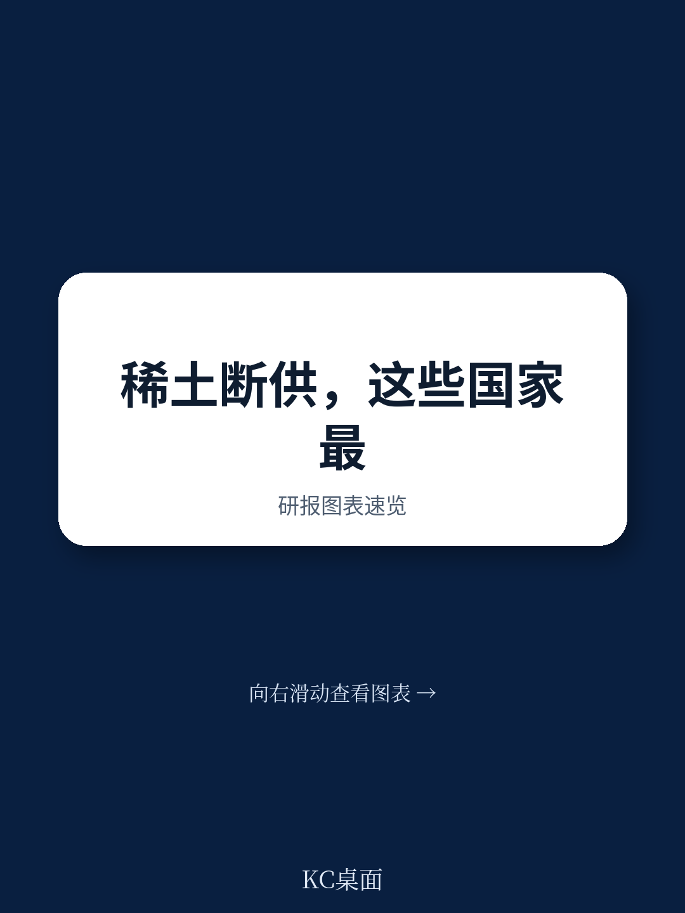
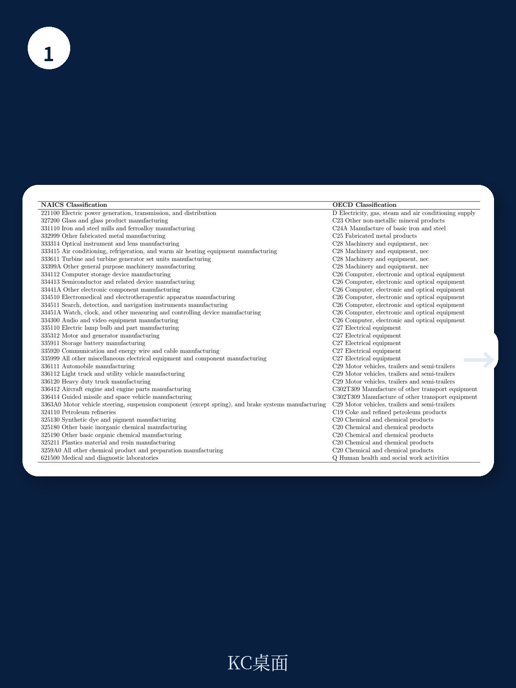
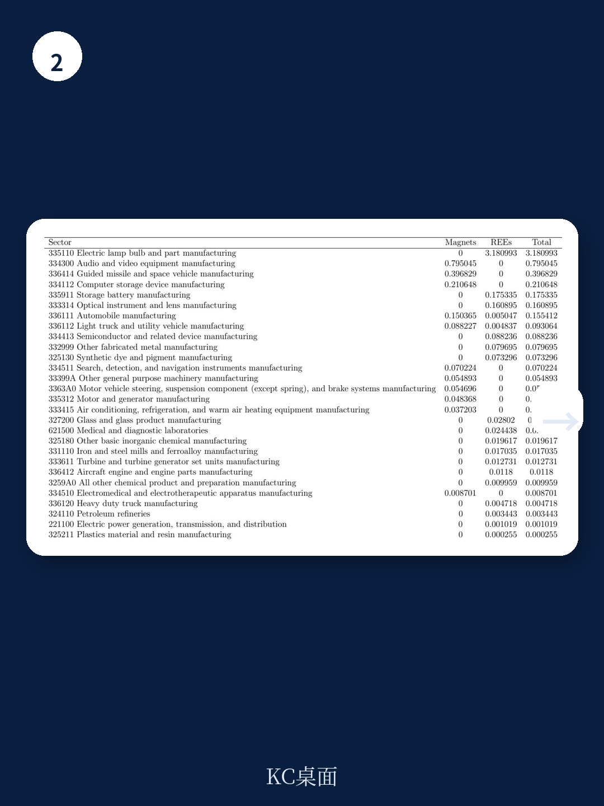

# IMF：稀土供应链中断的宏观宏观环境影响

2025年4月，中国对七类稀土及永磁体实施出口许可要求，引发全球供应链紧张。尽管出口量在数月后恢复，但IMF这份最新工作论文给出了一个更值得关注的判断：如果稀土供应出现80%的持续性中断，不同地区的损失差异远不止于“谁用得多谁伤得重”。

报告构建了一个包含生产网络的小型开放宏观环境模型，覆盖美国、日本、德国、法国、英国和印度。核心发现是：GDP损失不完全取决于稀土直接依赖度，而取决于稀土密集型产业在国内生产网络中的“枢纽”位置。

## 1. 日本损失最大，不是因为用量最多，而是因为网络传导更强

在低替代弹性（一年以内）情景下，日本GDP下降1.8%，美国1.5%，德国1.2%。日本之所以最脆弱，是因为其汽车、电气设备和电子产业不仅是稀土的直接使用者，更是国内中间品的核心买家与供应商。当稀土供给收紧，这些部门减产会通过投入产出链条向上下游扩散。

德国的VAAR（不确定性附加值）指标高达GDP的2.5%，远高于美国的0.8%，但模型显示美国GDP损失反而更大。原因在于美国汽车和电子部门的“前向-后向关联”更强——它们向更多下游行业供应零部件，同时从更多上游行业采购。一旦这些枢纽部门被卡住，传导面更广。

> **KC评论：** 传统VAAR指标假设零替代弹性，且只算直接依赖，容易高估德国、低估美国。模型揭示的真正变量是“网络中心度”——稀土密集型部门在产业链中的位置比其自身规模更重要。

## 2. 替代弹性是决定损失规模的单一变量

报告做了一个关键敏感性分析：在所有参数中，稀土与国内中间品之间的替代弹性解释了低弹性和高弹性情景之间97%的GDP损失差异。当替代弹性从0.015提高到0.8（对应五年以上调整周期），六国平均GDP损失从1.5%降至0.006%。

这意味着，短期冲击的破坏力几乎完全取决于企业能否在一年内找到替代方案。而稀土在永磁体、催化剂、抛光粉等应用中具有高度特异性，短期内几乎不可替代。报告引用Nassar等（2025）的研究指出，一年以内的替代弹性极低。

## 3. 真实GDP损失：德国反超美国，日本仍居首

当模型从名义GDP转向真实GDP（即生产可能性边界调整）时，结果出现反转：德国真实GDP下降2.1%，超过美国的1.5%。日本仍以2.3%居首。

这一差异源于一个简洁的统计量：真实GDP损失近似等于进口稀土价值占GDP的比重，乘以稀土密集型部门的Domar权重（总产出/GDP）。德国稀土密集型部门的中间投入份额更高，且其汽车和机械制造的总产出规模相对GDP更大，因此同样的供给调整在真实产出上体现得更剧烈。

## 4. 34个美国行业直接依赖稀土，永磁体占七成

报告基于USGS数据识别出美国405个行业中有34个直接使用稀土，合计附加值1550亿美元，占2017年名义GDP的0.8%。其中永磁体相关需求占VAAR的约70%。在行业层面，汽车产出在低弹性情景下下降9%，德国汽车仅下降5.8%——因为德国汽车生产劳动密集度更高，稀土暴露相对较低。

这一发现对政策制定者的含义是：永磁体供应链的集中度比稀土氧化物本身更值得关注。中国在永磁体加工环节的全球份额超过90%，且出口许可要求直接覆盖钕铁硼磁体。

报告最后指出，当调整周期拉长至五年以上，企业可以通过技术替代（如开发无稀土电机）和供应链多元化来大幅降低损失。但短期冲击的破坏力，取决于一个国家稀土密集型产业在自身生产网络中的“不可替代性”——而非仅仅看进口依赖度。

> **KC评论：** 这份报告最有价值的贡献不是预测损失数字，而是提供了一个评估框架：判断一个国家稀土脆弱性的三个维度——直接依赖度、产业网络中心度、短期替代弹性。三者缺一不可。

For informational purposes only. Portions may be generated,translated,summarized,or edited with AI assistance based on source materials and may contain omissions or errors. Please verify independently. This is not investment,legal,tax,accounting,or other professional advice.

