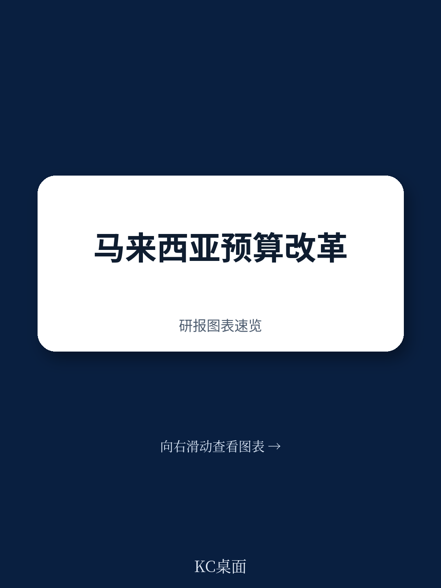

# IMF：马来西亚实施中期支出框架

马来西亚2023年通过的《公共财政与财政责任法案》为财政纪律设定了法律框架，但真正把规则变成日常操作，需要一套能跨越年度周期的预算工具。IMF最新技术援助报告指出，马来西亚的预算体系仍停留在“一年一议”的模式，这恰恰是改革最难跨越的坎。

报告的核心判断是：马来西亚已经建好了财政规则的“骨架”，但缺少让这些规则在每年预算中自动运转的“肌肉”——一个真正可操作的多年期支出框架。这不是技术细节问题，而是决定财政纪律能否从法律条文变成预算现实的制度性挑战。

## 1. 预算的“年度惯性”正在削弱财政规则的可信度

马来西亚目前的中期财政框架虽然每年发布三年期预测，但这些预测只给出总量，没有逐年分解。这意味着，财政规则中的赤字和债务上限，在年度预算中缺乏可追溯的执行路径。

更根本的问题在于预算流程本身。运营支出和发展支出由不同部门管理，各自使用独立的系统——MyBelanjawan和MyProjek——且互不联通。部门提交的预算请求只有一年，采用增量预算逻辑，不分析现有政策在中期内的成本变化。报告发现，预算上限只约束当年，年内频繁的预算调整和追加预算，进一步削弱了初始约束的严肃性。

> **KC评论：** 财政规则像“限速牌”，但如果没有多年期预算作为“测速摄像头”，限速就容易被忽略。马来西亚的问题不是规则不够严，而是预算流程还没有为规则服务。

## 2. 三个部委的试点，是检验改革可行性的关键一步

IMF建议马来西亚采取“先试点、再推广”的路径。交通、卫生、教育三个部委被选为首批试点，原因不难理解：这三个领域的支出不确定性大、政策连续性要求高，且成本驱动因素相对可识别。

试点的核心任务，是建立“三年期预算上限”的编制能力：第一年上限具有约束力，后两年为指示性。这要求部门学会计算现有政策的基线成本——即维持当前服务水平在未来三年需要多少资金——而不是像现在这样，只报下一年的增量需求。

报告特别强调，试点不只是技术练习，更是制度能力的检验。部门需要理解“支出不确定性”的计算逻辑，财政部需要有能力审核这些基线估算，而跨部门的协调机制——包括财政政策委员会下的常设工作组——需要真正运转起来。

## 3. 数据系统的割裂，是多年期预算最隐蔽的障碍

马来西亚的预算数据系统没有设计“跨年度承诺”的捕捉功能。一个项目在2025年签约、2026年和2027年仍需付款，这类信息在现有系统中无法被完整记录和汇总。这意味着，财政部在制定未来年度预算时，无法准确知道已经“锁死”的支出有多少，也就无法判断真正的财政空间。

报告建议升级公共财政管理系统，让运营和开发支出数据实现整合，并能够追踪多年期承诺。这听起来像IT项目，但本质上是预算透明度的基础设施——没有这个基础，任何中期预算框架都只能停留在纸面上。

## 4. 战略预算阶段的缺失，让“中期”沦为口号

马来西亚的预算周期缺少一个关键环节：在年度预算编制启动之前，先由财政部发布一份“财政战略声明”，明确中期财政目标、财政规则约束和总体支出上限。这份声明应该成为各部门编制预算的“天花板”，而不是等预算编完再倒推是否合规。

报告建议将这一战略阶段制度化，通过新的“战略预算通函”来启动，并由财政政策委员会的常设工作组负责协调。这个建议的实质，是把“中期视角”从一份年度报告中的章节，变成预算流程中不可跳过的第一步。

马来西亚的财政改革已经走完了“立法”这一步，接下来要走的，是让预算体系真正学会“往前看三年”。这需要的不只是技术升级，更是预算文化从“年度惯性”向“中期纪律”的转变。三个部委的试点结果，将是检验这一转变是否可行的最早信号。

For informational purposes only. Portions may be generated,translated,summarized,or edited with AI assistance based on source materials and may contain omissions or errors. Please verify independently. This is not investment,legal,tax,accounting,or other professional advice.

