# TECHNICAL ASSISTANCE REPORT

MAURITIUS

Report on the National Accounts Statistics Mission (May 18 – 22, 2026)

JUNE 2026

PREPARED BY

Peter Lee

AUTHORING DEPARTMENT

Statistics Department

©2026 International Monetary Fund

The contents of this document constitute technical advice provided by the staff of the International Monetary Fund to the authorities of Statistics Mauritius (the "CD recipient") in response to their request for technical assistance. Unless the CD recipient specifically objects to such disclosure, this document (in whole or in part) or summaries thereof may be disclosed by the IMF to the IMF Executive Director for Mauritius, to other IMF Executive Directors and members of their staff, as well as to other agencies or instrumentalities of the CD recipient, and upon their request, to World Bank staff, and other technical assistance providers and donors with legitimate interest including members of the Steering Committee of AFRITAC South (see Staff Operational Guidance on the Dissemination of Capacity Development Information). Publication or Disclosure of this report (in whole or in part) to parties outside the IMF other than agencies or instrumentalities of the CD recipient, World Bank staff, other technical assistance providers and donors with legitimate interest including members of the Steering Committee of AFRITAC South shall require the explicit consent of the CD recipient and the IMF's Statistics department.

The analysis and policy considerations expressed in this publication are those of the IMF's Statistics Department.

## Acknowledgments

## MEMBERS

  
Angola

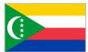  
Botswana  
Comoros

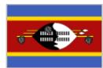  
Eswatini

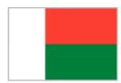

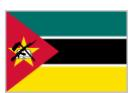

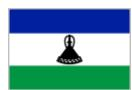  
Mauritius

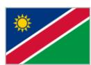  
Lesotho  
Madagascar  
Mozambique  
Namibia

  
Seychelles

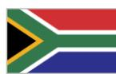  
South Africa

  
Zambia

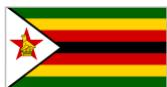  
Zimbabwe

## DEVELOPMENT PARTNERS

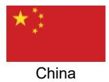

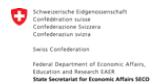  
European Union

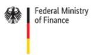  
Germany

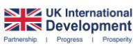

  
NORAD

  
Saudi Arabia  
SECO  
United Kingdom

## Contents

Acknowledgments....3   
Acronyms....5   
Summary of Mission Outcomes and Priority Recommendations....6   
Detailed Technical Assessment and Recommendations....7   
A.Financial Services Data....7   
B.Global Business Companies....8   
C. Officials Met During the Meeting....9

## Tables

1. Priority Recommendations....6
2. Work Plan....7

## Acronyms

SNA2008 System of National Accounts 2008

AFS IMF's Regional Technical Assistance Center for Southern Africa- AFRITAC South

BoM Bank of Mauritius

COICOP Classification of Individual Consumption According to Purpose

FISIM Financial Intermediation Services, Indirectly Measured

FSC Financial Services Commission

GBC Global Business Corporation

GDP Gros Domestic Product

GVA Gross Value Added

IFRS International Financial Reporting Standards

IMF International Monetary Fund

ISIC International Standard Industrial Classification of All Economic Activities

MoF Ministry of Finance

MoU Memorandum of Understanding

SM Statistics Mauritius

TA Technical Assistance

## Summary of Mission Outcomes and Priority Recommendations

1. A technical assistance (TA) mission on the National Accounts, sponsored by IMF AFRITAC South (AFS), was conducted from May 18 – 22, 2026, at the request of Statistics Mauritius (SM). This mission assisted SM with the treatment of Global Business Corporations (GBCs) and the wider financial corporations' sector within estimates of gross domestic product (GDP), partly as a result of concerns raised by domestic users.

2. The mission met with key domestic users, in order to ascertain concerns. Discussions were held with the chief economic advisor to the Prime Minister, the Financial Secretary at the Ministry of Finance (MoF), staff from the Bank of Mauritius (BoM), and staff from the Financial Services Commission (FSC), where questions were raised regarding possible missing activities within banking and GBCs.

3. The mission also met with two of the largest commercial banks in Mauritius, both with large cross-border activities, to identify possible missing activities. Both banks were confident that the questionnaires they receive from SM enable them to record, accurately and comprehensively, their range of activities, but the data they provide to the BoM are more granular and more timely. Better use of these data would, potentially, improve the quality and granularity of SM's financial data. One early benefit should be more accurate estimates of financial intermediation services indirectly measured (FISIM).

4. The majority of the recommendations of March 2025 mission regarding GBCs have been implemented. The exception is with regard to trading activities, where this has not yet been possible. The SM staff were considering using the sum-of-costs as a method for calculating output for these businesses, but this is not in line with the recommendations of the System of National Accounts 2025 (2025 SNA); therefore, the mission strongly recommended that the SNA should be followed. Further work will be required, in collaboration with the FSC, to better understand the data which they provide.

5. To support progress in the above work areas, the mission recommended an updated action plan with the following priority recommendations:

TABLE 1. Priority Recommendations

<table><tr><td>June 2026</td><td>Work collaboratively to understand more fully the GBC trading data</td><td>SM / FSC</td></tr><tr><td>September 2026</td><td>Incorporate more accurate estimates of FISIM in GDP estimates</td><td>SM</td></tr><tr><td>September 2026</td><td>Incorporate GBC trading activities in GDP, in line with SNA2008</td><td>SM</td></tr></table>

6. Further details on the priority recommendations and the related actions/milestones can be found in the detailed work plan under Detailed Technical Assessment and Recommendations.

# Detailed Technical Assessment and Recommendations

TABLE 2. Work Plan

<table><tr><td colspan="3">OUTCOME: Improved estimates of GBCs</td></tr><tr><td>H</td><td>Work with FSC to better understand the data supplied, particularly “other” categories.</td><td>June 2026</td></tr><tr><td>H</td><td>Include estimates of GBC trading in rebased GBC estimates.</td><td>September 2026</td></tr><tr><td colspan="3">OUTCOME: Improved estimates of the wider financial sector</td></tr><tr><td>H</td><td>Work with BoM to expand data sharing, particular with regard to supervision data.</td><td>December 2026</td></tr><tr><td>H</td><td>Make use of available BoM data to improve estimates of FISIM</td><td>September 2026</td></tr><tr><td>H</td><td>Review industrial classification (and output calculation) of businesses in the “other financial corporations” area.</td><td>June 2026</td></tr><tr><td>H</td><td>Incorporate the results of the above classification review in GDP estimates.</td><td>September 2026</td></tr><tr><td>H</td><td>Work with FSC to develop a plan for handling the insurance industry’s move to IFRS17 reporting.</td><td>December 2026</td></tr></table>

## A. FINANCIAL SERVICES DATA

7. Banking – unusually, SM surveys banks rather than using data from the BoM directly. The survey questionnaires were discussed with the commercial banks, and they were comfortable and clear that all their activities could be and were covered by the questionnaire. They did, however, highlight that they provide more granular data to the BoM, more frequently than the annual and quarterly surveys from SM.

8. The mission discussed the methodology used by the SM in estimating the gross value added (GVA) of banks. The team have a good understanding of the concepts relating to FISIM, fees and commissions and the margin activities of the banking industry (net spread earnings) and are applying the methodology correctly, although refinements can be made.

9. With regard to FISIM, the SM is using the midpoint between loan and deposit rates as their reference rate. This is then applied to the stocks of loans and deposits and actual interest receipts and payments data. Whilst this is commonly used in other countries, the nature of the Mauritius financial system means that this is leading to particular challenges. Specifically, it is generating implausibly high deposit FISIM, which is then adjusted to bring it more into line with BoM data using a long-standing fixed factor of indeterminate provenance. For cross-border FISIM, a more granular, accurate reference rate is provided by the BoM. The SM will be using this rate in GDP estimates.

10. The non-FISIM parts of bank output are estimated using data from the SM's survey of banks. This includes fees and commissions, which are explicitly collected on the questionnaire, as well as spread earnings on trading activities, which the banks confirmed are included in the data provided to the SM. The SM is using appropriate methodology to estimate these incomes.

11. The output of the Central Bank is estimated using the sum-of-cost approach. This is in accordance with SNA guidance.

12. The mission met with the BoM to discuss concerns and available data. At present the SM only makes use of the cross-border data, but highly granular data across the banking industry are held by the supervision department within the BoM. Currently the data sharing Memorandum of Understanding (MoU) with the BoM does not provide a facility for sharing of these detailed data. It would be beneficial for the SM to work closely with the BoM in order to increase the use made of these detailed data (amending the MoU as necessary). This would enable more detailed calculation of FISIM, more granular data on other banking activities, such as spread earnings and fees and commissions and, indeed, may obviate or at least reduce the need for the SM survey, reducing costs at the SM and the burden on businesses.

13. No obvious omissions in activities were identified. Through conversations with commercial banks and the BoM, there are no particular activities currently excluded from the GDP estimates in this area, but better use of the BoM data and more granular calculation of FISIM would lead to quality improvements. It should be noted that, after the end of the mission, some users in Mauritius still believe that some activities are missing, as a result, further TA may be requested on this issue.

14. Insurance – the mission reviewed the insurance methodology used by the SM. The current methodology was found to be in line with the SNA-defined insurance algorithms, for both life and non-life. The FSC highlighted that the insurance industry in Mauritius has recently moved to the IFRS 17 reporting standards, which poses challenges for national accountants, as some of the required variables are no longer explicitly identified. At present, businesses are dual reporting on the old and new bases, but this will not be a permanent arrangement. The SM will need to work closely with the FSC to develop a plan to deal with this, as it is a challenge for both institutions.

15. Other financial institutions – the mission reviewed the classification of businesses in this industry. The SM provided the list of businesses in their survey universe, along with their current classification according to the International Standard Industrial Classification, revision 4 (ISIC Rev.4). The review consisted of an internet search of the businesses' websites, this led to some questions regarding classification, which, if they lead to a change, would, in some cases lead to a change in the calculation of output (for example, changing from funds to fund managers or vice versa). The SM needs to carry out further investigations following up with the questions raised by the mission.

Recommended Actions:

\- SM to collaborate with BoM to increase data sharing and make better use of such data in the GDP estimates.

\- SM to refine reference rate calculations, taking account of different currencies and types of loans / deposits, removing fixed adjustment factors when possible.

■ SM to collaborate with the FSC to develop a handling plan for the transition to IFRS17.

■ SM to investigate ISIC classification questions for other financial institutions.

## B. GLOBAL BUSINESS COMPANIES

16. Given Mauritius's status as an international financial center, GBCs are of particular significance in the local economy. An earlier mission in March 2025 made several recommendations regarding appropriate methodology for incorporating these businesses correctly in GDP estimates.

17. The SM has implemented the recommendations in every area, with the exception of trading companies, which are not yet incorporated. There were questions regarding the results obtained using the correct methodology, which was leading to the consideration of using the sum-of-cost approach, as per non-market bodies. The impact of the changes already implemented were increases of an average of 0.9 per cent of GDP and, for the current account, an average of 0.7 percent of GDP for the years 2018–2023, mainly as a result of increased exports of services.

18. The mission discussed the available data with the FSC. A concern raised by the SM and the mission related to “other” categories within income and expenditure data provided by the FSC. FSC believed that these relate to revaluations. The mission took the view that, whilst this may be true in some cases, a deeper understanding is needed in some categories, particularly relating to expenditure. The SM will need to work with the FSC to understand these data more fully, in advance of incorporation into GDP estimates.

19. The mission discussed the methodology with the SM team. The sum-of-cost approach, whilst an expedient way of achieving plausible results, is not in line with the guidance in the SNA and should not be used. Once the data are fully understood and analyzed, they should be incorporated into GDP estimates using the SNA guidance. Specifically, this is a margin-based activity, so the output should be valued as the margin on traded products.

20. Management companies – key economic advisors raised concerns that some of these companies, which provide support functions to GBCs and others, are missed from the accounts. As a result of meetings with the FSC and discussions with the SM team, it appears that this is not the case as these businesses are incorporated within the administrative and support services industry. Specifically, those providing management services to cross-border businesses are licensed by the FSC and are included in the data they provide. Those which only provide services domestically are included in the SM survey.

## Recommended Actions:

SM to work with the FSC to develop a complete understanding of the GBC trading data.

■ SM to incorporate these market bodies in the GDP estimates in line with SNA guidance.

## C. OFFICIALS MET DURING THE MEETING

<table><tr><td>Name</td><td>Institution</td><td>Email</td></tr><tr><td>Acharuz Anandsing</td><td>Ministry of Finance</td><td>aacharuz@govmu.org</td></tr><tr><td>Gnany Gilbert</td><td>Prime Minister's Office</td><td>ggnany@govmu.org</td></tr><tr><td>Hittoo Ram</td><td>Ministry of Finance</td><td>rhittoo@govmu.org</td></tr><tr><td>Dawoonauth Mukesh</td><td>Statistics Mauritius</td><td>mdawoonauth@govmu.org</td></tr><tr><td>Bhonoo Sanjev</td><td>Statistics Mauritius</td><td>sbhonoo@govmu.org</td></tr><tr><td>Ramphul Dhanwantee</td><td>Statistics Mauritius</td><td>dhramphul@govmu.org</td></tr><tr><td>Papiah Sattyabhamah</td><td>Statistics Mauritius</td><td>sbhonoo@govmu.org</td></tr><tr><td>Pampusa Marjorie</td><td>Bank of Mauritius</td><td>Marjorie.Pampusa@bom.mu</td></tr><tr><td>Audit Dooneshsingh</td><td>Bank of Mauritius</td><td>Dooneshsingh.Audit@bom.mu</td></tr><tr><td>Jugoo Satishingh</td><td>Bank of Mauritius</td><td>Satishingh.Jugoo@bom.mu</td></tr><tr><td>Rutha Chandradeo</td><td>Bank of Mauritius</td><td>chandradeo.rutha@bom.mu</td></tr><tr><td>Mautadin Bihisht</td><td>Bank of Mauritius</td><td>Bihisht.Mautadin@bom.mu</td></tr><tr><td>Beegoo Ghanish</td><td>Bank of Mauritius</td><td>Ghanish.Beegoo@bom.mu&gt;</td></tr><tr><td>Lamothe Sebastien</td><td>Financial Services Commission</td><td>slamothe@fscmauritius.org</td></tr><tr><td>Jhoomuck Kavish</td><td>Financial Services Commission</td><td>kjhoomuck@fscmauritius.org</td></tr></table>