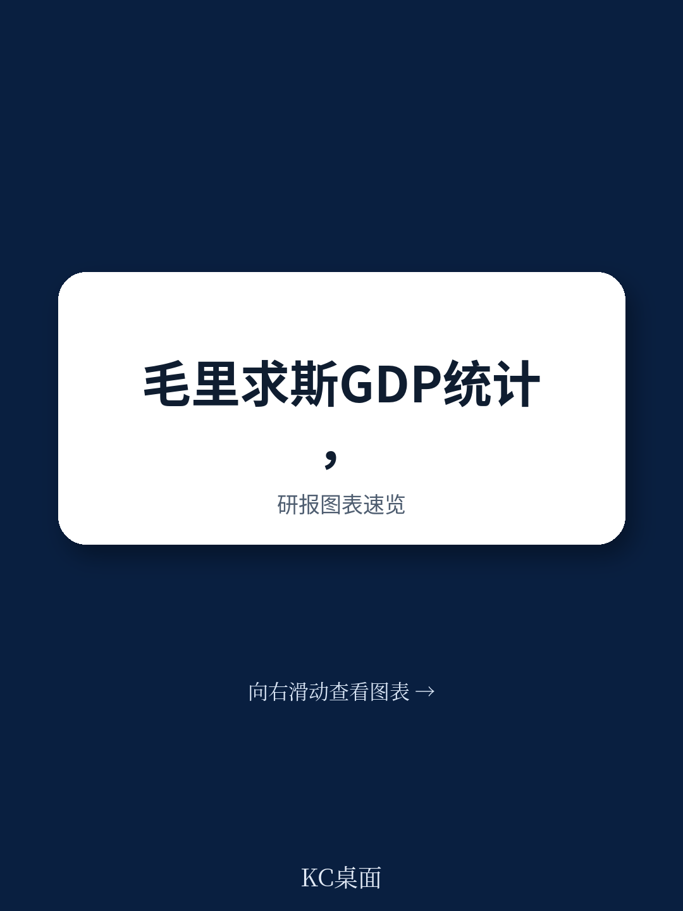
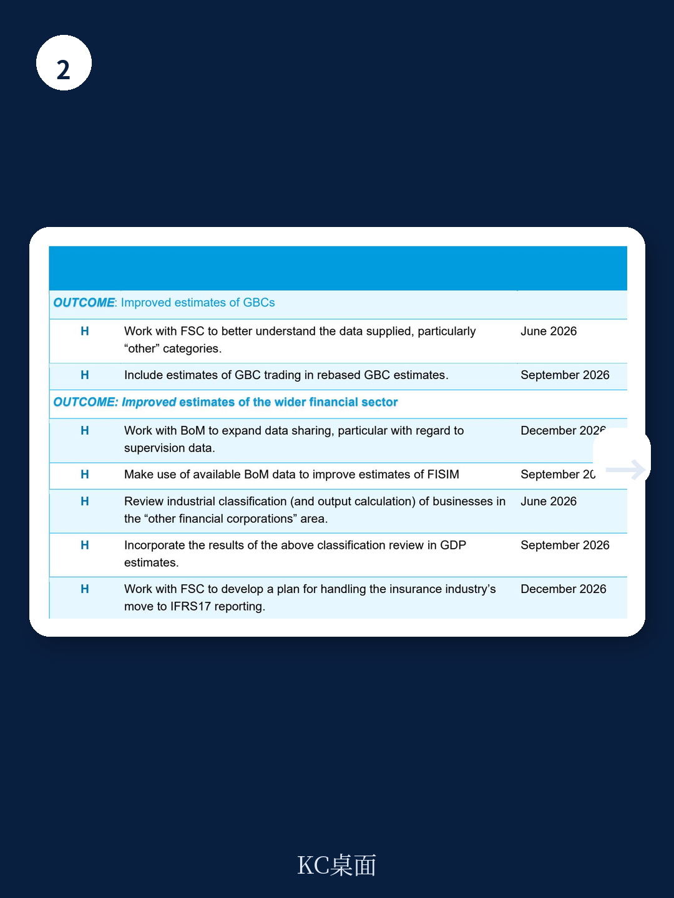

# IMF：IMF毛里求斯技术援助报告-国民账户

一份来自国际货币产品组织（IMF）统计部门的技术援助报告，揭示了毛里求斯GDP核算中一个被忽视的盲区。2026年5月的这次实地评估发现，该国最大的两家商业银行均确认，现有统计问卷已能完整覆盖其业务活动，不存在明显的漏报。真正的统计缺口，出现在全球商业公司（GBC）的交易活动上——这部分业务至今未被纳入GDP。

报告显示，2026年3月技术援助中关于GBC的大部分建议已被采纳，唯一未落实的正是交易活动的核算。毛里求斯统计局曾考虑使用成本加总法来计算这些企业的产出，但IMF明确反对，认为这不符合《国民账户体系2025》的指引。GBC作为毛里求斯国际资金中心地位的核心载体，其交易活动应以交易价差作为产出估值基础，而非成本。

> **KC评论：** 成本加总法看似简便，但会低估GBC这类市场主体的真实宏观环境贡献。IMF坚持用价差法，本质上是在保护毛里求斯GDP数据的国际可比性和可信度。

## 1. 银行数据不缺内容，缺的是颗粒度和时效

报告中最值得注意的发现之一是，毛里求斯统计局目前直接向商业银行发放问卷，而非使用央行数据。两家受访银行均表示，问卷已能覆盖其全部业务，包括手续费、佣金和交易利差。但问题在于，它们向毛里求斯银行（BoM）提交的监管数据，比统计局问卷更细、更及时。

IMF建议，统计局应与央行修订数据共享备忘录，直接利用监管数据来改进资金中介服务间接测算（FISIM）。当前，统计局使用存贷款利率中位数作为参考利率，这在毛里求斯资金体系下产生了“高得不可信”的存款FISIM，不得不依赖一个来源不明的长期固定调整因子来修正。改用央行提供的跨境业务参考利率，将直接提升GDP估算精度。

## 2. 保险业转向IFRS 17，统计方法面临断档

保险行业的统计挑战被报告单独点出。毛里求斯保险业已转向IFRS 17报告标准，而这一标准不再明确识别国民账户所需的某些变量。目前企业仍在按新旧两套标准并行报送，但这不可持续。统计局需要与资金服务委员会（FSC）合作，在2026年12月前制定过渡方案。

这不仅是毛里求斯的问题。IFRS 17在全球范围内的推广，正在系统性地改变保险业的数据供给结构，各国统计机构都面临类似的适配不确定性。

## 3. GBC交易活动是当前最大的统计盲区

GBC对毛里求斯宏观环境的重要性不言而喻。已实施的改进措施使2018至2023年GDP平均上调了0.9个百分点，经常账户平均上调0.7个百分点，主要来自服务出口的增加。但交易活动仍未纳入。

FSC提供的收支数据中存在大量“其他”类别，FSC认为这些与重估值有关，但IMF认为，尤其是支出类别的“其他”项，需要更深入的理解。统计局必须在2026年9月前，与FSC协作完成数据梳理，并按SNA指引将GBC交易活动纳入GDP。

> **KC评论：** 0.9%的GDP调整幅度已经不小，而交易活动尚未计入。一旦补齐，毛里求斯的GDP规模和服务出口数据可能还会进一步上修。这对依赖国际资金中心定位的国家来说，是一个值得关注的统计质量信号。

## 4. 一个可复用的观察框架：统计缺口往往藏在“其他”里

这份报告提供了一个实用的分析框架：当统计机构与数据提供方对“其他”类别的解释不一致时，往往就是漏报或错报的高发区。毛里求斯案例中，FSC认为“其他”是重估值，IMF则认为需要逐项核实。这种分歧本身，就是统计质量改进的切入点。

同样值得借鉴的是，IMF对银行数据的判断逻辑：先确认问卷覆盖是否完整，再追问数据来源的颗粒度和时效性，最后检查计算方法是否与SNA一致。这种从覆盖、来源到方法的递进式核查，适用于任何地区的GDP质量评估。

报告还提到，尽管IMF认为银行活动没有明显遗漏，但毛里求斯国内部分用户仍坚持认为存在漏报。这意味着，统计质量不仅是技术问题，也是沟通问题。未来可能还会有后续技术援助。

For informational purposes only. Portions may be generated,translated,summarized,or edited with AI assistance based on source materials and may contain omissions or errors. Please verify independently. This is not investment,legal,tax,accounting,or other professional advice.

