# Pumps and Plates

# Passthrough of International Fuel and Food Price Shocks to Domestic Markets

Huy Nguyen and Céline Thévenot

WP/26/148

IMF Working Papers describe research in progress by the author(s) and are published to elicit comments and to encourage debate. The views expressed in IMF Working Papers are those of the author(s) and do not necessarily represent the views of the IMF, its Executive Board, or IMF management.

2026
JUL

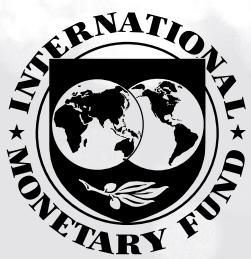

# IMF Working Paper Fiscal Affairs Department

Pumps and Plates:
Passthrough of International Fuel and Food Price Shocks to Domestic Markets
Prepared by Huy Nguyen and Celine Thevenot

Authorized for distribution by Rodrigo Cerda
July 2026

IMF Working Papers describe research in progress by the author(s) and are published to elicit comments and to encourage debate. The views expressed in IMF Working Papers are those of the author(s) and do not necessarily represent the views of the IMF, its Executive Board, or IMF management.

ABSTRACT: Fuel and food constitute significant portions of consumer baskets, yet their prices are highly volatile. The renewed energy price shock in March 2026, driven by war in the Middle East and supply constraints, has highlighted the macroeconomic and distributional importance of how international price shocks transmit to domestic markets. Spikes in these prices can have major social, political, and economic implications. The conventional policy approach is to allow domestic retail prices to align with international prices while protecting the most vulnerable. However, many countries intervene in price settings to shield their domestic markets from global fluctuations. This paper provides a comprehensive assessment of the passthrough from global to domestic retail prices for four commodities: gasoline, diesel, wheat, and rice over the past two decades in many countries. We employ a dynamic model of local projections building on the work of Kpodar and Abdallah (2017). Our findings indicate that average passthrough is incomplete, with fuel exhibiting higher and faster passthrough than food. The extent of passthrough varies by period, region, and between commodity exporters and importers. We also examine asymmetric responses to global price shocks and find evidence of a ratchet effect: price increases are more likely to be passed through than decreases.

RECOMMENDED CITATION: H. Nguyen, C. Thevenot (2026). Pumps and Plates: Passthrough of International Fuel and Food Price Shocks to Domestic Markets. IMF Working Paper.

JEL Classification Numbers:

L71, Q48, H23,

Keywords:

Passthrough; Local projection; Asymmetry; Fuel prices; Food prices.

Author's E-Mail Address:

cthevenot@imf.org, hnguyen4@imf.org,

WORKING PAPERS

# Pumps and Plates

# Passthrough of International Fuel and Food Price Shocks to Domestic Markets

Prepared by Huy Nguyen and Céline Thévenot $^{1}$

## Contents

Glossary ....4
Executive Summary ....5
Motivation ....7
Literature, Data and Methodology ....11
Literature ....11
Data ....11
Empirical Model ....12
Results ....13
Overall Results ....13
Results for Product Importers and Exporters ....16
Results by Region ....18
Results by Time Period and Net Export/Import Status ....20
Results by Shock Magnitude ....21
Results by Exchange Rate Regime ....22
Country Cases ....25
Asymmetric Passthrough....26
Conclusions....27
References....38
BOX
1. The Policy Trade-Offs of Price Passthrough....16
FIGURES
1. International Fuel and Food Prices ....7
2. Domestic and International Fuel and Food Retail Prices in Selected Countries ....8
3. Share of Calories Provided by Wheat and Rice in Food Consumption by Region ....9
4. Overall Passthrough for Fuel and Food Products ....15
5. Passthrough by Net Importer and Exporter ....17
6. Passthrough by Regions ....19
7. Passthrough by Period ....20
8. Results for Fuel by Periods and Fuel Exporting Status ....21
9. Results for Food by Periods and Food Exporting Status ....21
10. Passthrough by Exchange Rate Regimes and AE Status ....24
11. Passthrough by FX Regimes ....24
12. Asymmetric Passthrough ....26

## TABLE

1. Summary of Main Price Variables...... 12

## ANNEXES

I. Price Series....28
II Robustness Checks....31
III Passthrough by Shock Magnitude....33
IV. Asymmetric Passthrough Estimates....37

## Glossary

AE Advanced Economy
EMDE Emerging Markets and Developing Economies
EU European Union
FAO Food and Agriculture Organization
FE Fixed Effects
FPMA Food Prices Monitoring and Analysis
FX Foreign Exchange
GARCH Generalized Autoregressive Conditional Heteroskedasticity
GIEWS Global Information and Early Warning System
GMM Generalized Method of Moments
IMF International Monetary Fund
LAC Latin America Countries
LCU Local Currency Unit
MENA Middle East - North Africa
SD Standard Deviation
SOE State Owned Enterprise
SSA Sub-Saharan Africa
UN United Nations
US United States
USD US Dollar
VAR Vector Autoregressive Regression
VECM Vector Error-Correction Model
WEO World Economic Outlook

## Executive Summary

The renewed surge in global energy and food prices in early 2026, triggered by the war in the Middle East and supply constraints, has underscored the importance of understanding how international price shocks are transmitted to domestic markets, i.e., the passthrough. Such passthrough of international prices to domestic retail prices, and its dampening through policy actions, has significant implications for economic stability, social welfare, and policy formulation.

Despite a large literature on commodity price passthrough, evidence remains fragmented across products, regions, and methodologies. By examining fuel and staple food prices within a unified empirical framework, this paper provides a systematic comparison of the speed, completeness, and asymmetry of passthrough across commodities, time and country groups.

The estimates rely on a dynamic local projection model applied to an extensive dataset comprising over 30,000 price pairs matching international and domestic monthly prices across many countries since 2000. This methodology allows for a nuanced examination of the passthrough. The results account for various country-specific characteristics, including regions, net imports or exports, changes over time. Additionally, the asymmetric responses to price increases or decreases are discussed.

The study demonstrates that fuel prices generally exhibit a higher and faster passthrough than food prices. There is variation in passthrough across countries. Advanced economies tend to experience more immediate and complete passthrough, reflecting pricing frameworks that rely more heavily on market-based adjustment and involve limited fiscal or quasi fiscal intervention. By contrast, passthrough is typically lower in developing economies, particularly those in the Middle East and North Africa (MENA) and Sub-Saharan Africa (SSA). In these regions, frequent use of price-based policy measures, such as subsidies, tax adjustments, or administered pricing, dampen the transmission of international price shocks to domestic consumers but shift part of the adjustment burden to public finances or state-owned enterprises. These patterns highlight an inherent trade-off between short-term price stabilization and fiscal exposure. While flexible exchange rate regimes could in principle facilitate passthrough through currency depreciation, this channel is largely already reflected in the measured passthrough since both international and domestic prices are expressed in US dollars. A small residual exchange rate channel effect is detectable in the first few months for fuel products, likely operating through local-currency distribution costs, but otherwise negligible.

The paper highlights asymmetric passthrough, where the response of domestic retail prices to increases in international prices is significantly quicker than to decreases. This ratchet effect indicates that when global prices rise, domestic prices are quickly adjusted upwards, but they are much slower to decline when global prices fall, which complicates inflation control efforts.

This study underscores the need for policymakers to consider the implications of incomplete and asymmetric passthrough in economic strategies. Understanding these dynamics is crucial for assessing the trade-offs between price-based interventions and income-based mitigation measures, as well as for strengthening resilience to future commodity price volatility.

The table below provides a concise overview of the paper's core results:

<table><tr><td>Item</td><td>Gasoline</td><td>Diesel</td><td>Wheat</td><td> $Rice^1$ </td></tr><tr><td>Immediate passthrough (t = 0)</td><td>1/3 of shock</td><td>1/3 of shock</td><td>Very limited</td><td>Very limited</td></tr><tr><td>Peak cumulative passthrough (per USD1 intl. price increase)</td><td>0.8</td><td>0.8</td><td>0.81</td><td>0.69</td></tr><tr><td>Time to peak passthrough</td><td>~3 months</td><td>~3 months</td><td>~10 months</td><td>~3 months</td></tr><tr><td>By month 6</td><td>Stabilizes by ~3 months</td><td>Stabilizes by ~3 months</td><td>~0.50 by month 6</td><td>Peaks early, then plateaus</td></tr><tr><td>Importers vs. exporters</td><td>Importers: near full; Exporters: limited</td><td>Importers: near full; Exporters: limited</td><td>Importers near full, Exporters: &gt;1 (more than full)</td><td>Importers: weak (except LAC); Exporters: generally near zero</td></tr><tr><td>Regional extremes (importers)</td><td>Lowest: MENA; Below full: SSA, EMDE Asia; Near full: LAC, EMDE Europe; Highest: AEs</td><td>Lowest: MENA; Below full: SSA, EMDE Asia; Near full: LAC, EMDE Europe; Highest: AEs</td><td>SSA &amp; LAC importers exceed 1; EMDE Asia near full; MENA, EMDE Europe insignificant</td><td>Generally insignificant; LAC importers partial exception</td></tr><tr><td>Change over time</td><td>Lower passthrough in 2009–12 (global price surge)</td><td>Lower passthrough in 2009–12 (global price surge)</td><td>Higher pre-2009 (pre-food crisis), lower after</td><td>Higher pre-2009 (pre-food crisis), lower after</td></tr><tr><td>Shock size effect</td><td>Large shocks → lower passthrough</td><td>Large shocks → lower passthrough</td><td>Large shocks → higher passthrough</td><td>Little sensitivity</td></tr><tr><td>Asymmetry (price increase vs price decrease)</td><td>Increases pass faster than decreases</td><td>Statistically significant asymmetry</td><td>Pattern asymmetry</td><td>Limited asymmetry</td></tr><tr><td>Country coverage (number of countries)</td><td>185</td><td>184</td><td>46</td><td>63</td></tr></table>

Source: Authors' calculations.

## Motivation

Gasoline and diesel are crucial for economic development while wheat and rice are vital for human sustenance. Prices fluctuations in these commodities in international markets can be influenced by supply and demand factors, adverse economic and political events in key exporting and importing countries, or global macroeconomic trends. Figure 1 illustrates the general co-movement of the crude oil price index, wheat, and rice prices in major markets over the past two decades, with notable divergence during the last two years. Price spikes often coincide with major crises, such as financial crisis of 2007-2008, the world food price crises of 2010-2012, and the COVID-19 pandemic in 2022. High food and fuel prices are frequently cited as primary drivers of global inflation surges. $^{2}$

Figure 1. International Fuel and Food Prices  
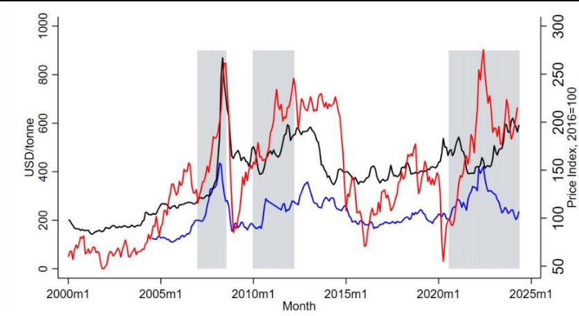  
Source: IMF Commodity Prices and FAO FPMA.  
Domestic retail prices can vary in response to international market price movements, as shown in

Figure 2. These price movements may be influenced by government market-intervention measures and/or economic agent behaviors. When fuel and food price volatility become a significant concern, governments often implement market intervention measures, resulting in varying degrees of price passthrough, the extent to which international price changes are reflected in domestic retail prices over time.

Governments use a variety of strategies for fuel and food price movement controls, such as fuel and food subsidies, support to state-owned enterprises (SOEs), quotas or export bans aimed at restricting market entry, tax, or administered prices of fuel and food pricing. For example, after the price hikes in 2022, many countries took actions to limit domestic price increases by reducing consumption taxes, freezing prices, imposing export bans or providing subsidies and transfers to households (Amaglobeli et al., 2022, 2023). Those measures can lead to partial or complete decoupling of domestic retail prices from international market prices. Previous IMF analysis suggests that for every \$10/barrel increase in oil prices sustained for one year, fuel subsidies in a typical low-income country increase by approximately 0.5-1.0 percent of GDP if domestic retail prices are frozen (Clements et al., 2013). During the 2022 commodity price shock, countries that maintained low passthrough faced subsidy bills reaching 2-4 percent of GDP in some cases (World Bank, 2024).

Lebanon

Figure 2. Domestic and International Fuel and Food Retail Prices in Selected Countries  
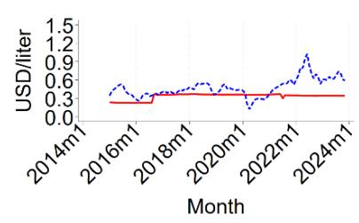

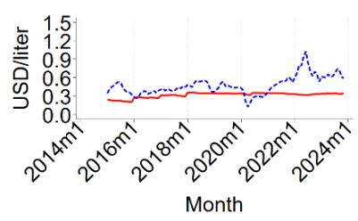

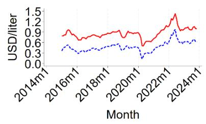

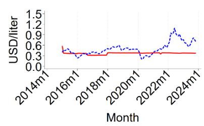

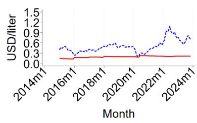

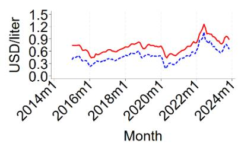

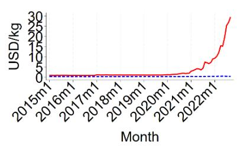

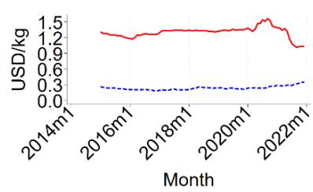

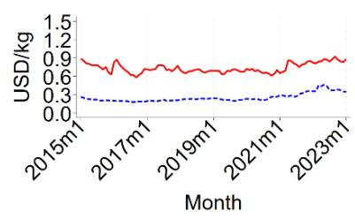

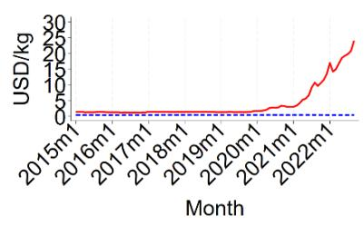

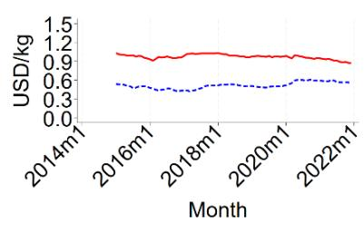  
Source: Authors' calculations (see Annex I for the data).

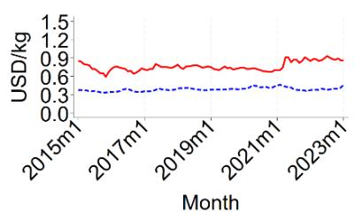  
Note: blue (red) lines represent international (domestic) product price.

This paper seeks to estimate and compare the extent of passthrough for the four key products: gasoline, diesel, wheat and rice, using a unified dynamic model. The focus on gasoline and diesel product prices rather than crude oil is due to the following reasons: (1) they are comparable products, hence, possess stronger link between global and domestic retail fuel prices. The latter directly affects consumers, which is the policy-relevant price for welfare analysis; (2) the margin between crude and refined products could vary significantly across countries and time.

In addition, gasoline and diesel are among the most widely used commodities globally, while wheat and rice are crucial food staples, jointly accounting for 36 percent of the world's caloric intake. These food products are particularly significant for low-income, food importing countries (

Figure 3). Understanding the passthrough of these commodities is essential due to their extensive trade. For example, nearly half of crude oil production is exported on average $^{3}$ . Additionally, international trade of wheat and rice account for 30 percent and 8 percent of total wheat and rice produced in the world, respectively $^{4}$ .

Figure 3. Share of Calories Provided by Wheat and Rice in Food Consumption by Region  
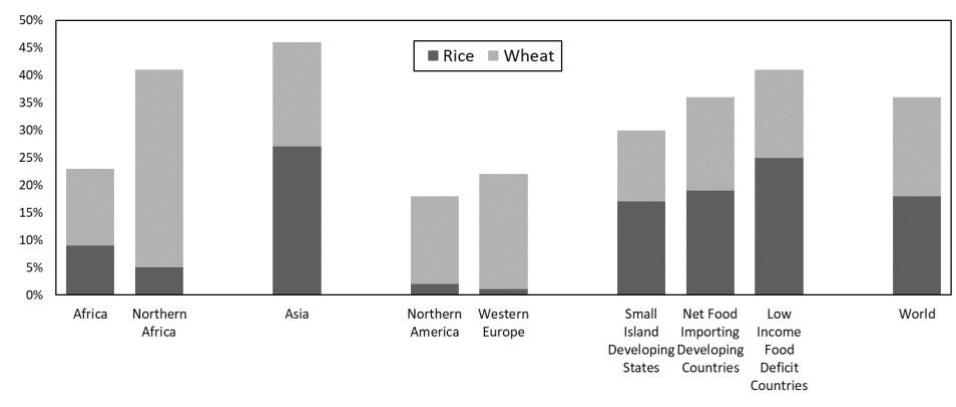  
Source: FAO Food Balance and authors calculations

This paper estimates the direct price effect, focusing on how changes in international product prices impact consumer retail prices in local markets. While indirect effects, such as the influence of oil price changes on other prices or production costs, are also important, they are not addressed in this paper. Our approach differs from existing passthrough estimates based on consumer prices indexes (IMF 2016, 2011), which aims to enhance our understanding of overall inflation mechanisms.

Two extensive strands of literature examine the passthrough of fuel and food prices using both static and dynamic parametric approaches. The extent of passthrough estimated using the former approach, typically measured by a ratio of changes in domestic product price and lagged changes of international prices, indicates an unconditional correlation between international and domestic price prices. Although this approach is flexible, intuitive, and easy to apply, its major disadvantage is the lack of time dimension and the inability to control for shocks and country-specific characteristics. To address these issues, this paper employs a dynamic model to illuminate the transition of passthrough over time.

This study utilizes the local projection model by Jorda (2005) to examine the dynamic extent of passthrough for food and fuel products over a 12-month period following an international product price shock.

We explore differences in passthrough during distinctive episodes of price movement over the last two decades and across country groups with varying exchange rate regimes and product import/export status. Additionally, we analyze asymmetric responses of domestic retail prices to international price increases and decreases. This paper contributes to the literature on food and fuel prices pass through by: (1) applying a unified approach for both fuel and food products; (2) updating and extending passthrough estimates with the latest data available for fuel products; (3) being the first to use the local projection model to estimate passthrough and examine asymmetry responses for food products.

The results can be summarized as follows: (1) the extent of passthrough for fuel and wheat are broadly similar, but the speed of passthrough is much faster for fuel than wheat and rice; (2) Advanced economies experience nearly full passthrough for fuel compared to other country groups; (3) Passthrough for wheat is higher than for rice but takes slightly longer time; (4) Passthrough due to price increases tend to be larger and takes longer time than for price decreases in both fuel and food products, likely reflecting an general mechanism of price adjustment over time.

The policy implications of our results are threefold. First, there is stickiness in price adjustment in many regions, which can have severe consequences when supply is limited, as demand adjusts more slowly without a full price signal. Second, the adjustment for fuel is quicker and more pronounced than for food. This implies that if commodity prices surge at the same time on international markets, food inflation could take more time to fully appear. Third, the ratchet effect, where price increases are more likely to be passed through than decreases, suggest that price adjustment might be diluted over time. Price increases are transmitted rapidly but imperfectly, while price decreases are less transmitted, allowing some profit smoothing over time. Although this can shield consumers, it may raise concerns about overall prices, especially when these products significantly impact the external balance.

The remainder of the paper is structured as follows. Section I discusses context and motivation. Section II outlines the literature, methodology and data. Section III presents the results, while section IV addresses the results for asymmetric shocks. Section V concludes.

## Literature, Data and Methodology

## Literature

The passthrough of international fuel prices to domestic retail prices consistently attracts attention from both policymakers and researchers due to its significant economic implication. Most existing literature, which dates back decades, focuses on the US market or advanced economies. Studies reveal that the passthrough of international fuel price changes to domestic retail prices varies widely across countries. In some, fuel prices are fully passed through, while in others, especially developing countries, domestic retail prices change little or not at all, due to substantial fuel subsidies. In the US and other advanced economies, passthrough is generally high and exhibits asymmetrical behavior (e.g., for recent studies, see Ozturk et al. (2020)). IMF studies, such as Coady et al. (2015), using a static approach, find that many developing countries failed to pass on price increases to consumers. In the MENA region, passthrough is notably low, with half of countries passing through less than 13 percent of international price increases. Factors influencing passthrough include exchange rate movements, international transportation costs, market structure, and government policies like taxes and subsidies. The closest study to this paper is Kpodar and Abdallah (2017) that uses Jorda's (2005) local projection approach on a comprehensive fuel price database for 162 countries over 2001:1 to 2014:12. They find that passthrough varies across regions and income groups and that asymmetric responses to price shocks exist.

Research on food prices passthrough dates to the 1990s (e.g., Mundlak and Larson, 1992; Quiroz and Soto, 1995). They conclude a limited passthrough for cereal products in many emerging and developing countries. Zorya et al. (2015) uses a vector error correction model to show that changes in international cereal prices are transmitted by about three-quarters to domestic retail prices on average across geographical regions over the long term. Greb et al. (2016), employing variants of VECM and a non-parametric approach, find that it takes six or seven months for half of an international cereal price shock to pass through to domestic markets, and about three-quarters eventually passthrough. Ceballos et al. (2016) employ multivariate GARCH to study price volatility transmission from world grain markets to 41 markets in 27 developing countries, finding that international grain price volatility is most likely to be transmitted to domestic markets for wheat, followed by rice and maize. Laborde et al. (2023) estimate that a percent increase in world price of rice, wheat, and maize corresponds to domestic price increase of 0.6 percent, 0.7 percent, and 0.8 percent, respectively, in the short run. Okou et al (2022) show that Sub-Saharan African countries are highly vulnerable to global food prices, with passthrough estimated close to unity for highly imported staples.

## Data

The paper utilizes the most recent version of the database on monthly domestic fuel prices from Kpodar and Abdallah (2017), complemented with the latest data from Global Petrol Prices. Monthly domestic and international prices for wheat and rice are collected from FAO GIEWS. International prices for gasoline and diesel are obtained from the IEA for three major markets in the US, Europe, and Singapore, and these prices are mapped to countries within the same region. The collected data contains over 30,000 pairs of monthly domestic and international prices for gasoline and diesel each, and approximately 7,000 pairs of monthly global and domestic prices for wheat and rice since January 2000. Annex 1 provides details of data coverage and sources. All prices are retail prices, measured in US dollars per unit (gallon for fuel, kilogram for food

commodities), and inclusive of taxes to ensure comparability across countries and eliminate exchange rate conversion issues in the dependent variable.

Table 1. Summary of Main Price Variables

<table><tr><td>Variable</td><td>N</td><td>Mean</td><td>Std. dev.</td><td>Min</td><td>Max</td></tr><tr><td>Domestic gas price</td><td>40,664</td><td>1.14</td><td>0.53</td><td>0.00</td><td>5.99</td></tr><tr><td>Domestic diesel price</td><td>40,336</td><td>1.03</td><td>0.51</td><td>0.00</td><td>5.24</td></tr><tr><td>International diesel spot price</td><td>53,940</td><td>0.50</td><td>0.21</td><td>0.13</td><td>1.09</td></tr><tr><td>International gas spot price</td><td>42,536</td><td>0.52</td><td>0.19</td><td>0.12</td><td>1.02</td></tr><tr><td>Domestic wheat price</td><td>8,537</td><td>0.78</td><td>0.73</td><td>0.15</td><td>29.45</td></tr><tr><td>International wheat price</td><td>7,879</td><td>0.26</td><td>0.07</td><td>0.11</td><td>0.52</td></tr><tr><td>Domestic rice price</td><td>11,399</td><td>7.76</td><td>70.40</td><td>0.00</td><td>987.74</td></tr><tr><td>International rice price</td><td>9,646</td><td>0.41</td><td>0.11</td><td>0.13</td><td>1.01</td></tr></table>

Source: Authors calculations.

## Empirical Model

Passthrough refers to the responses of domestic retail product prices to changes in the corresponding international market prices. The local projections method $^{5}$ by Jorda (2005) is well suited for this paper's objectives. This method is preferred over reduced-form or structural VARs because it offers several advantages: (1) suitability for assessing short-term responses to shocks in the variable of interest; (2) ability to accommodate sharp changes in price series; (3) no restrictions on the dynamic response pattern as in VARs; (4) robustness to misspecification; (5) flexibility with other nonlinear specifications; and (6) simple, analytic, and joint inference for impulse response coefficients.

The approach involves estimating the local projection of domestic retail price at each horizon using least squares or panel data regression. Specifically, the following reduced-form equation is estimated at each horizon h:

$$
\Delta_ {h} D P _ {i, j, t + h} = \mu_ {j, h} + \sum_ {p = 2} ^ {P} \alpha_ {j} P _ {i, j, t - p} + \sum_ {q = 1} ^ {Q} \beta_ {j, q} \Delta I P _ {j, t - q} + \theta_ {j, h} \Delta I P _ {j, t} + \sum_ {l = 1} ^ {h} \varphi_ {j, l} \Delta I P _ {j, t + l} + \gamma_ {j, h} \tau_ {j, t + h} + u _ {i} + \epsilon_ {i, j, t + h}
$$

where the subscript i indicates a country, j a product, and t time; $\Delta_{h}DP_{i,j,t+h}$ indicates cumulative monthly changes of domestic price from t-1 to $t+h$ , $h\geq0$ , for product j. $P_{i,j,t-p}$ lagged levels of domestic retail prices of product j, $\Delta IP_{j,t-q}$ lagged monthly changes in international product j's price, $\Delta IP_{j,t}$ monthly change of international product j's price at time t, $\theta_{j,h}$ indicates the cumulative response of domestic price at t+h to a shock of international product j's price at time t; $\Delta IP_{j,t+l}$ lead monthly change of international product j's price at t+l, $\tau_{j,t+h}$ time effect, $u_{i}$ country fixed effects, and $\epsilon_{i,j,t+h}$ error term. Note that, except for horizon h=0, the error term $\varepsilon_{i,j,t+h}$ will be serially correlated as it represents a moving average of forecast errors from t to $t+h$ , necessitating correction for serial correlation, such as the Newey-West (1987) correction. Notice that the specification includes lead shocks in the international price of product j, as suggested by Teulings and Zubanov (2014) to avoid biases in the local projection estimates of the response.

On asymmetric response analysis, the original shocks are redefined as follows:

$\left\{IP_{j,t}^{+} = \left\{\Delta IP_{j,t}\mid \Delta IP_{j,t} > 0;0\mid o.w.\right\} \right.$ $IP_{j,t}^{-} = \left\{\Delta IP_{j,t}\mid \Delta IP_{j,t} <   0;0\mid o.w.\right\}$

The original model is re-written as follows:

$$
\begin{array}{r} D P _ {i, j, t + h} = \mu_ {j, h} + \sum_ {q = 1} ^ {Q} \alpha_ {q, j, h} P _ {i, j, t - q} + \sum_ {k = 1} ^ {h} \theta_ {k, j, h} I P _ {j, t + k} ^ {+} + \gamma_ {j, h, +} I P _ {j, t} ^ {+} + \gamma_ {j, h, -} I P _ {j, t} ^ {-} + \sum_ {p = 1} ^ {P} \gamma_ {p, j, h} I P _ {j, t - p} ^ {-} \\ + \sum_ {l = 1} ^ {h} \theta_ {l, j, h} I P _ {j, t + l} ^ {+} + \sum_ {k = 1} ^ {h} \theta_ {k, j, h} I P _ {j, t + k} ^ {-} + \gamma_ {h} \tau_ {t + h} + u _ {i, j} + \epsilon_ {i, j, t + h} \end{array}
$$

The normalized confidence interval of the difference of the two estimated coefficients $\gamma_{j,+}$ and $\gamma_{j,-}$ is obtained using bootstrap with 1000 replications.

## Results

## Overall Results

The main model is separately estimated for each product using panel data regression with robust errors. The results are shown in Figure 4. The results are threefold:

First, for gasoline and diesel, the results indicate that about a third of an international price shock is contemporaneously (i.e., at time t = 0) passed to domestic retail prices. The estimated peak levels suggest that, on average, a dollar increase in international gasoline or diesel price is associated with 0.8 dollar increase in domestic retail price after three months. $^{6}$ These estimates are consistent with existing literature while providing a dynamic perspective of passthrough and timing of the peak. The results also indicate no full passthrough on average, likely due to various government strategies used to mitigate economic and social impact of market-driven fuel price fluctuations.

Second, for wheat and rice, the results show no full passthrough either. The peak passthrough for wheat is reached over ten months, while for rice, it peaks for around three months and remains at this level for seven months before declining. At peak level, a dollar increase in international prices of wheat and rice is associated with 0.81 and 0.69 dollar increase in domestic retail prices, respectively.

Third, the confidence intervals for fuel products are significantly tighter compared to relatively larger intervals for food products, especially rice. This likely reflects the fact that fuel retail prices are more directly linked to internationally traded benchmarks, whereas domestic food prices are also shaped by local supply conditions, including weather, domestic production, and transport costs, that are not captured in the bivariate specification. As shown in Fig All.3 of Annex II, controlling for weather and monetary policy rates does not materially change the passthrough estimates for wheat, suggesting that while these local factors contribute to wider confidence bands, they do not confound the estimated transmission from international to domestic prices.

The main results remain broadly consistent when the model is estimated using a different approach of two-step system generalized method of moments (system GMM) $^{7}$ (see robustness check results in Annex II).

Incomplete passthrough can reflect multiple factors along the supply chain, including transportation and distribution costs, retailer margins, regulatory interventions or fiscal policy. Among fiscal policy tools, the tax and subsidy structure can create a wedge between international and domestic retail prices that can either amplify or dampen passthrough. Ad valorem taxes (such as VAT) mechanically transmit a fixed proportion of international price changes, potentially generating passthrough coefficients exceeding unity when combined with specific excise taxes that remain constant in absolute terms. Conversely, fuel and food subsidies, prevalent in many emerging market and developing economies, act as buffers that absorb international price fluctuations, resulting in attenuated passthrough but at significant fiscal cost. The IMF estimates that global fossil fuel subsidies reached \$7 trillion in 2022, or 7.1 percent of GDP (Parry et al., 2023).

Our findings are consistent with the literature. For fuel products, our passthrough estimate of 0.80 aligns closely with Kpodar and Abdallah (2017), who report estimates of 0.70 – 0.82 using the same local projection methodology on an earlier sample period (2001–2014) $^{8}$ . The consistency of results across the two studies, despite our extended sample through 2024 and updated data sources, provides reassurance regarding the robustness of these findings. Our estimates exceed those of Coady et al. (2015), who document passthrough rates of 0.13 – 0.50 for MENA and SSA regions; however, this difference reflects both their focus on countries with administered pricing regimes and their static methodology, which does not capture cumulative dynamic adjustment.

For food products, the wheat passthrough estimate of 0.87 modestly exceeds prior estimates of approximately 0.70 – 0.75 reported by Zorya et al. (2015) and Laborde et al. (2023), potentially reflecting differences in sample composition and time period. The rice passthrough estimate of 0.69 aligns closely with Laborde et al. (2023), who report 0.60, and corroborates the finding from Ceballos et al. (2016) that wheat exhibits higher passthrough than rice. The time dimension of our estimates also accords with prior work: Greb et al. (2016) find that six to seven months are required for half of an international cereal price shock to transmit to domestic markets, consistent with our finding that wheat passthrough reaches approximately 0.50 by month six before peaking at 0.87 by month ten.

Figure 4. Overall Passthrough for Fuel and Food Products  
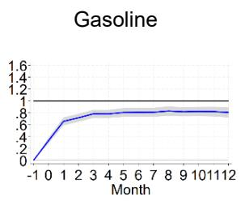

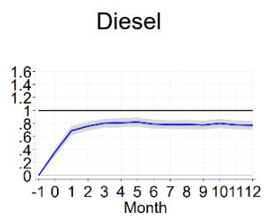

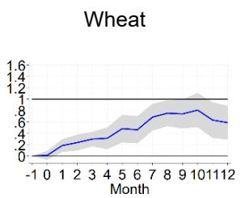

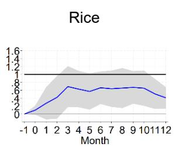  
Source: Authors' calculations (see Annex I for detailed data coverage).

The differences in passthrough for fuel and food products likely reflect structural and institutional mechanisms. Our results indicate that fuel prices adjust more rapidly and completely to international shocks than food prices. Gasoline and diesel passthrough quickly reach approximately 0.8 cumulatively less than three months and stabilizes after, whereas wheat and rice passthrough evolves more gradually, reaching 0.4 – 0.6 by month 6 and only approaching 0.8 by month 10 for wheat. Several potential mechanisms explain this divergence:

■ Market structure and pricing frequency: Fuel retail markets are characterized by high pricing frequency; gas station prices often adjust daily or weekly in response to wholesale cost changes, reflecting low menu costs and transparent benchmark pricing (e.g., Platts, NYMEX). In contrast, food retail prices exhibit greater stickiness reflecting less frequent retail pricing, more complex supply chains and higher menu costs (Nakamura and Steinsson, 2008; Gopinath and Rigobon, 2008).

Supply chain complexity: Fuel supply chains are relatively streamlined: crude oil is refined into standardized products and distributed through established logistics networks with limited transformation. Food supply chains are more complex, involving production, storage, processing, and distribution stages. The share of raw commodity costs in final retail prices is lower for food products, as processing, packaging, and retail margins constitute a larger proportion of the final price.

Regulatory environment and state intervention: The nature of government intervention differs across fuel and food markets. Fuel pricing in many countries is administered through price-setting mechanisms, possibly managed by state-owned enterprises or regulated with formal pricing formulas linked to international benchmarks. Food market interventions are typically more diffuse, operating through multiple channels: input subsidies, procurement prices, public distribution systems, strategic reserves, export restrictions, and import tariffs.

Role of SOEs: State-owned petroleum companies (e.g., Pertamina in Indonesia, NNPC in Nigeria until 2024, Pemex in Mexico) play a direct role in fuel price stabilization absorbing international price fluctuations through their balance sheets or receiving explicit budgetary transfers. In Nigeria, this practice was ended with the fuel subsidy reforms initiated in 2023. In food markets, by contrast, state involvement more commonly operates through marketing boards, buffer stock operations, or procurement agencies (e.g., India's Food Corporation, Egypt's GASC) that influence prices indirectly through quantity interventions rather than direct price-setting. This institutional contrast is consistent with the more uniform passthrough patterns observed for fuel prices relative to food, where interventions are more heterogeneous across countries and policy instruments.

## Box 1. The Policy Trade-Offs of Price Passthrough

## The case for full price pass through

Standard economic analysis suggests that passthrough of international commodity prices to domestic markets promotes allocative efficiency. When domestic prices reflect scarcity, consumers and firms receive accurate signals to adjust behavior, reducing consumption when commodities are scarce and increasing it when abundant. Price distortions, by contrast, encourage overconsumption during shortage periods, deplete fiscal resources, and often disproportionately benefit higher-income households who consume more fuel and energy-intensive goods in absolute terms (IMF Fiscal Monitor, 2025). The fiscal cost of incomplete passthrough can be substantial: the IMF estimates that fossil fuel subsidies, both explicit and implicit, reached \$7 trillion globally in 2022, equivalent to 7.1 percent of global GDP, with the richest 20 percent of households capturing over 40 percent of fuel subsidy benefits in many countries (Parry et al., 2023).

## Exceptional circumstances for buffering price shocks

When price shocks are unusually large compared to historical trends but likely temporary, governments may have a case for more active fiscal policy, provided their fiscal space allows it. In this case, most of the price increase should be passed through upfront, with any intervention aimed at smoothing the adjustment, rather than preventing it (IMF 2026a). As higher energy prices can immediately have severe effects, for individuals and businesses, the goals of fiscal support should reflect the diverse needs raised by the price hike, and follow the general principle to “protect people, not prices” (IMF, 2026b). Fiscal measures have a role to play would need to be temporary, targeted, timely, and tailored to let domestic energy prices reflect international costs; shield vulnerable households with targeted, temporary support; and support viable small businesses with liquidity, not price controls. Generalized subsidies and price caps should be reserved for exceptional shocks or countries with no options, for instance emerging market and developing economies with weaker safety nets, larger shares of consumer spending on food and energy, tight liquidity constraints and more fragile inflation expectations.

## Results for Product Importers and Exporters $^{9}$

The extent of passthrough is expected to be different between net importers and exporters of the products due to varying market strategies. A large net exporter may use its production capacity to stabilize domestic market prices, limiting passthrough during international price fluctuations. Conversely, a net product importer may purchase the product and sell it at administered prices, hence, using fiscal buffers to absorb international price shocks and stabilize domestic price. Another strategy for net product importers is to use their product reserves to stabilize domestic retail prices. Alternatively, allowing domestic retail prices to reflect international market price development can achieve higher passthrough, avoiding fiscal cost.

Figure 5 presents contrasting estimation results for these two country groups. While passthrough for fuel importers are like those for the overall sample, passthrough for fuel exporters are relatively small compared to fuel importers. This indicates that commodity exporters tend to use their resources to shield domestic consumers from international prices fluctuations, leading to opportunity costs and excessive fuel consumption behaviors. Notice that the confidence intervals for gasoline and diesel exporters indicate statistical insignificance of passthrough from the 5th to 10th month and nearly so for the 11th and 12th months, suggesting only limited passthrough during the first four months after the shocks. In contrast, fuel importers show near full passthrough on average.

There are notable differences in passthrough for wheat and rice exporters relative to these product importers. Wheat exporters experience more than full passthrough, whereas rice exporters show weak significance for the passthrough in the 2nd, 4th to 6th months. The former result likely captures the impact of taxes, which could be imposed to prevent domestic shortages when international prices are high. The latter result appears to suggest that there is on average no passthrough for rice exporters, likely due to their substantial domestic rice stock that buffer price shocks (e.g., export bans post-2008 global food crisis in India or Vietnam).

Figure 5. Passthrough by Net Importer and Exporter  
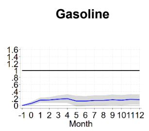

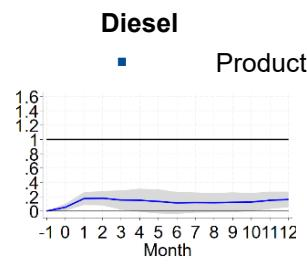

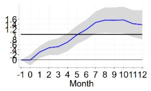

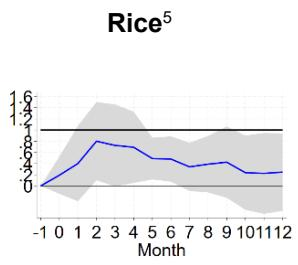

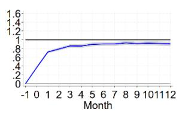

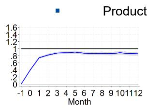

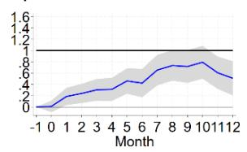

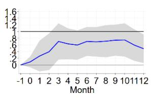

Source: Authors' calculations.

## Results by Region

Figure 6 presents passthrough by region, showing both product importers and exporters.

Passthrough estimates for gasoline and diesel importers are the lowest in the Middle East and North Africa (MENA), followed by Sub-Saharan Africa (SSA) and Emerging Asia. LAC importers show near-full passthrough for gasoline but somewhat lower for diesel, while advanced economies (AEs) and Emerging European countries exhibit full passthrough. This regional variation reflects differences in fuel pricing frameworks and policy interventions, including the design and use of fuel excises and other discretionary measures. Many countries, particularly in MENA and SSA, implemented temporary tax cuts, duty reductions or other price-smoothing interventions during price surges (Amaglobeli et al., 2022). As discussed in Prady et al. (2026), such interventions mechanically dampen observed passthrough from international reference prices. By contrast, advanced economies tend to rely on more transparent and rules-based tax systems, contributing to higher measured passthrough. Fuel exporters, present in MENA, SSA, Emerging Asia, and LAC, generally show substantially lower passthrough than importers in the same region, with MENA and SSA exporters showing near zero passthrough beyond the first few months, consistent with administered fuel pricing in oil-producing economies and the use of domestic production capacity to shield domestic prices from international fluctuations.

Passthrough estimates for wheat and rice importers show that wheat passthrough in SSA and LAC exceeds full passthrough while emerging countries in Asia approaches full passthrough, but remain below, suggesting possible market-intervention policies. Wheat passthrough for importers in MENA and Emerging Europe is statistically insignificant, consistent with extensive bread and flour subsidies and administered pricing in MENA, and domestic heterogeneous policy responses across Emerging European importers to shield consumers from the main staple's price fluctuations. Domestic rice prices for importers appear insulated from international markets fluctuations in all regions except LAC, where significant rice passthrough begins from the 5th month, indicating a slower response to international market shocks. Passthrough exceeding unity is likely due to taxes (for instance, ad valorem taxes, such as VAT), although we cannot rule out other explanations such as markup adjustments or anticipatory pricing. Turning to exporters, wheat exporters in LAC display passthrough that substantially exceed unity, well above importers in the same region, while wheat exporters in Emerging Europe also show passthrough exceeding unity despite insignificant passthrough for importers in that region, possibly reflecting supply diversion toward export markets or export-parity pricing dynamics that amplify domestic price responses. Wheat exporters in Emerging Asia, by contrast, show significant but below-unity passthrough, lower than importers in the same region. Rice exporters are present only in Emerging Asia and LAC; Emerging Asian rice exporters show modest but significant passthrough, while LAC rice exporters are statistically insignificant, broadly reflecting the structurally thin international rice market, heavy policy intervention on both sides of trade, and heterogeneity across rice varieties.

Figure 6. Passthrough by Regions  
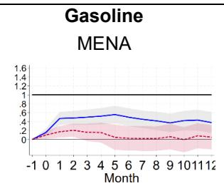

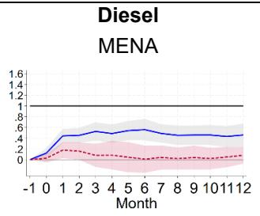

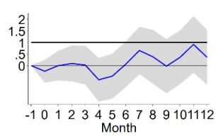

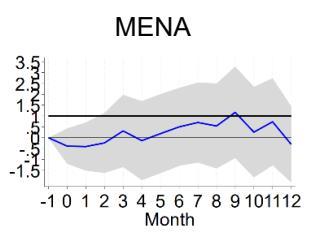

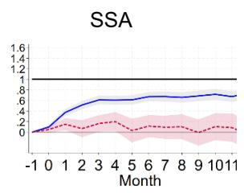

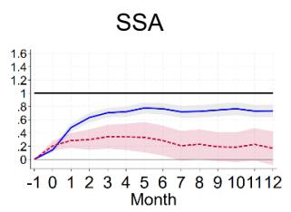

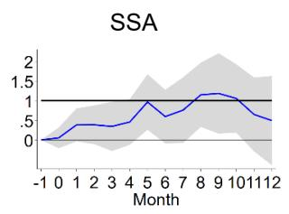

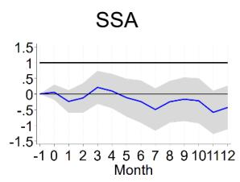

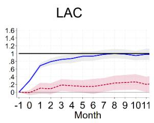

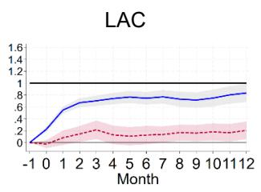

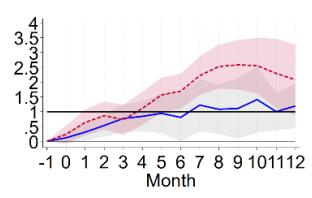

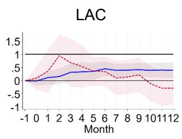

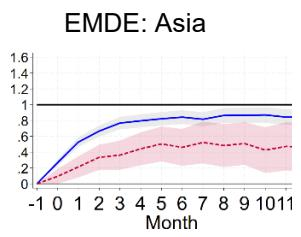

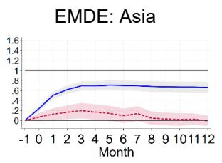

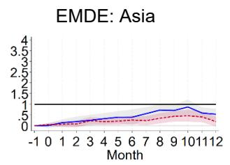

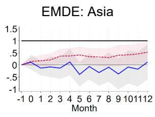

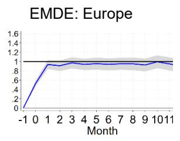

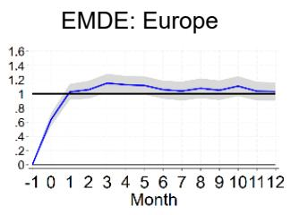

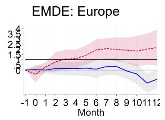

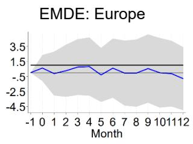

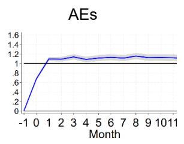

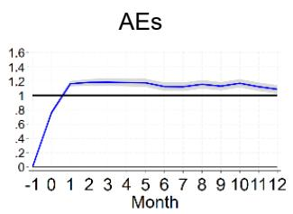  
Source: Authors' calculations (see Annex I for the data). Note: Red (blue) lines show IRFs for exporters (importers). Charts without a red line indicate the absence of product exporters in the region.

## Results by Time Period and Net Export/Import Status

The food and fuel price shocks at the end of the 2000s are often seen as catalyst for policy shift towards more protective measures (Maetz et al. 2012). Our estimates differentiate passthrough before, during, and after this period.

For gasoline and diesel, passthrough declined during 2009-2012 compared to other two periods (before 2009 and after 2012), which show no differences (Figure 7).

\- Further examination of these results by fuel importers and exporters shows that the passthrough remains predominantly influenced by fuel importers (Figure 8a). In contrast, the passthrough for fuel exporters shows only minimal variations across different time periods.

\- For wheat, the passthrough exceeded full passthrough before 2009 but fell below full passthrough from 2009 onward, reflecting protective measures adopted during post-food crisis in importing countries (Figure 8b). Results after 2009 suggest domestic rice markets diverged from international market trends.

\- For rice, the passthrough was above 1 before 2009, but went down after the food crisis, both for importing and exporting countries.

■ Estimates for fuel products and wheat after the GFC (2010) and for the full sample indicates small differences but render no passthrough for rice.

Figure 7. Passthrough by Period  
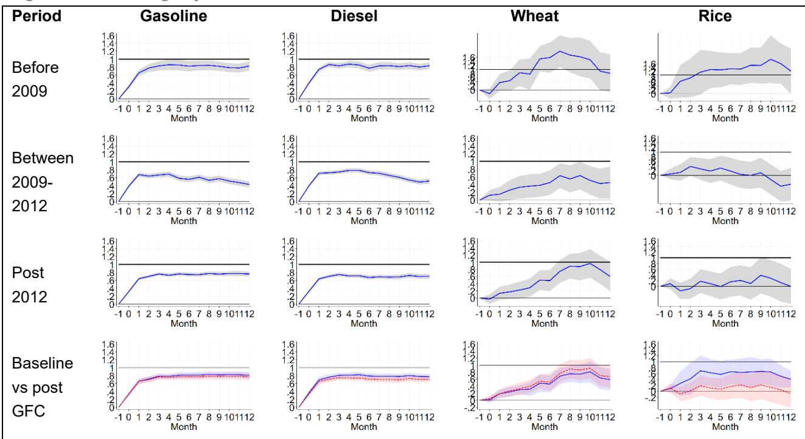  
Source: Authors' calculations (see Annex I for the data).

Figure 8. Results for Fuel by Periods and Fuel Exporting Status  
  
Source: Authors' calculations.

Figure 9. Results for Food by Periods and Food Exporting Status  
  
Source: Authors' calculations.

## Results by Shock Magnitude

Large shocks of international product prices are likely to prompt countries to implement aggressive measures to mitigate such impact, resulting in lower passthrough. Conversely, small price shocks are likely to result in higher passthrough, as countries could let market forces adjust prices. We then progressively raise the threshold that separates the sample into above- and below-threshold groups, at 1, 2, and 3 standard deviations (SD) of the product's monthly price change series. For example, the 2 SD threshold corresponds to monthly price changes exceeding approximately 0.10 USD/liter for gasoline and 0.09 USD/liter for diesel. At each cutoff, we estimate separate passthrough coefficients for the two groups. Annex III presents estimation results for each product and region.

For fuel products, passthrough for below-threshold shocks is consistently higher and more rapid than for above-threshold shocks, which exhibit attenuated passthrough and a longer adjustment period. This pattern holds across all three SD cutoffs.

For food products, the pattern differs. Wheat demonstrates a higher passthrough when price shocks exceeds the threshold, the opposite of the fuel results. Rice prices show no meaningful variation in passthrough across shock thresholds. This suggests that measures intended to shield domestic retail prices might be permanent rather than implemented in response to a shock.

These observations generally apply at the regional level, though some notable differences exist. For instance, there is no passthrough when fuel price shocks exceed two standard deviations in the LAC and Asian EMDE regions. Additionally, in the MENA region, there are no differences in passthrough across the magnitudes of shocks for all products except rice.

## Results by Exchange Rate Regime

Exchange rate (FX) fluctuations are theoretically a key factor in assessing the passthrough. In a floating exchange rate regime, domestic retail prices in dollars adjust with FX fluctuations, leaving the passthrough unchanged:

If the passthrough is low, the demand does not adjust to larger prices. This puts pressure on the fiscal balance and the exchange rate if international prices increase. $^{11}$

If the passthrough is large, the change in international prices will reflect on the demand and lower the pressure on exchange rate, leading to less volatility in the economy $^{12}$ .

In such cases, exchange rates adjust more rapidly than prices to unexpected commodity prices shocks. Additionally, commodities that account for a significant part of a country's imports or exports can drive the exchange rate fluctuations through demand for foreign currency. In case of fixed exchange rate regime and low pass through, domestic retail prices in dollars remain stable due to FX intervention, which can lower reserve or increase foreign exchange debt, potentially affecting macro-economic performance.

We include interaction terms with international price shock and dummies for free floating exchange rate regime $^{13}$ . We also add a dummy for advanced economy status (most Advanced economies fall under the floating ER case). Figure 10 presents the results (excluding rice due to data limitation). The findings align with previous results. The floating regime's effect is small and stable compared to the advanced economy effect, which shows a strong initial impact than dissipates over twelve months. For fuel products, the passthrough may be driven by non-FX factors like ad-valorem taxes on fuel, competition, or information flow. In contrast, FX fluctuations and advanced economies status (green line) have insignificant impacts on wheat, leaving price

shock as the main passthrough driver. Larger than unity passthrough in countries with free- floating exchange rate may relate to price stickiness, as suggested by Dornbush (1976). $^{14}$

The results below show that flexible exchange rate regime allows prices to pass through. In general, for commodity importers under floating regimes, currency depreciation during global price spikes amplifies domestic price increases (exchange rate acts as a shock amplifier). For fixed regime countries, the peg provides a buffer against this amplification channel. However, our results for wheat indicate that potential different mechanisms that affect domestic wheat price are at play.

Figure 10. Passthrough by Exchange Rate Regimes and AE Status  

Wheat  
  
Rice (N/A)  
Source: Authors' calculations (see Annex I for the data).

Figure 11. Passthrough by FX Regimes  

Source: Authors' calculations.

## Country Cases

This section presents case studies that illustrate how fiscal interventions have shaped passthrough dynamics in practice. Taken together, these reform episodes highlight the importance of combining price passthrough with compensatory measures, so that price signals are preserved while vulnerable households are protected (IMF, 2026a and b).

Nigeria (2012, 2016): Nigeria's attempt to remove fuel subsidies in January 2012 triggered nationwide protests, forcing a partial reversal. The subsidy removal would have increased gasoline prices by 117%, but was scaled back to a 49 percent increase. Our data show that Nigeria's fuel passthrough increased from approximately 0.15 during the heavy subsidy period (2005-2011) to 0.45 following partial liberalization (2012-2015), before declining again as subsidies were reinstated amid the 2016 oil price collapse. This illustrates both the potential for fiscal reform to increase passthrough and the political economy constraints that often lead to policy reversals. $^{15}$

\- Indonesia (2005, 2008, 2014-2015): Indonesia implemented three major subsidy reform episodes. The 2005 reform doubled fuel prices, while 2008 and 2014-15 reforms achieved increases of 25-33 percent and 30-35 percent respectively. Each reform was accompanied by temporary cash transfers to approximately 15-19 million poor households through the Bantuan Langsung Tunai (BLT) program.. Beyond these episodes, administered fuel prices were increased by 30 percent hike in September 2022, which was accompanied by reallocations to social spending including cash transfers to low-income households (IMF, 2023a).

Ghana (2001-2005, 2012): Ghana adopted an automatic fuel pricing mechanism in 2001 but abandoned it in 2003 due to political pressures when international prices spiked. A revised mechanism introduced in 2012 with built-in price smoothing bands has proven more durable. Ghana's experience illustrates the importance of institutional design and political commitment in sustaining pricing reforms.

Source: Authors' calculations (see Annex I for the data).

## Asymmetric Passthrough

Asymmetric passthrough refers to the differing extent and pattern of passthrough depending on whether to an international price rise or fall. This means that the domestic market responds differently to price increases compared to decreases. Such asymmetry may reflect ratchet effect - price stickiness – over time, as market participants gradually adjust their behaviors.

Evidence of asymmetry in passthrough extent during the study period would manifest as:

$$
\gamma_ {j, h, -} \neq \gamma_ {j, h, +}, h = 1 2
$$

where the statistical significance of the difference is assessed using a t-test.

Evidence of asymmetry in passthrough would manifest as:

$$
\gamma_ {j, h, -} \neq \gamma_ {j, h, +}, \text { for   some } h
$$

where the statistical significance of the difference is also assessed using a t-test.

We apply the revised model to account for positive and negative changes in the international prices for the four products. The estimated results, illustrating cumulative asymmetric passthrough, are presented in Figure 12. For diesel, the result indicates significant asymmetry, while the visual differences after one year (at h = 12) for gasoline, wheat and rice are not statistically significant. Regarding pattern asymmetry, the differences in passthrough between price increase and decreases are statistically significant for several time horizons h for gasoline, diesel, and wheat, but only significant for two horizons for rice. Regionally, there is no asymmetry for fuel products in MENA, LAC and Asian EMDE regions, while there is some for food products (see Annex IV). European EMDE region exhibits pattern asymmetry for all four products. Advanced economies also display pattern asymmetry but not amount asymmetry.

Figure 12. Asymmetric Passthrough  

Price increases tend to be passed through to consumers more rapidly and fully than price decreases. Pattern asymmetry is the predominant form of asymmetry across four products, with passthrough from price increase generally higher than from price decrease during t = 0 or t = 1 in most cases. However, for some intermediate periods, passthrough from price decrease exceeds that from price increase before the latter prevails by the end of the 12-month period. This indicates that domestic retail prices are more responsive to increases in international fuel and food prices than decreases. This asymmetric pass-through behavior may contribute to the "stickiness" observed in domestic retail prices, as supply chain agents do not immediately and fully adjust all prices in response to global shocks. When global prices rise, domestic agents are more likely to quickly pass these increases along to consumers to maintain profit margins. Conversely, when global prices fall, they are more hesitant to pass on the decreases, preferring to retain higher margins temporarily. This behavior allows domestic agents to balance profit margins over time, absorbing some global price volatility rather than fully transmitting it to consumers. The result is an imperfect and delayed pass-through of both price increases and decreases, with significant implications for policymakers aiming to manage the domestic impacts of global commodity price shocks.

## Conclusions

Our findings are broadly consistent with the literature on fuel and food prices passthrough while providing new dynamic insights on price passthrough for fuel (gasoline and diesel) and food (wheat and rice) products. Unlike vector error correction models that estimate long-run equilibrium relationships, our local projection approach traces the complete dynamic path of adjustment.

In addition, our analysis of dynamic estimates of price passthrough is novel in its unified framework. It reveals several important insights:

\- First, imperfect pass-through is common. Global fuel and food prices often do not fully translate to domestic markets. Energy prices typically take 2-3 months to fully pass through, while food prices can take 4 - 8 months. This indicates price stickiness and suggests that some countries actively prevent passthrough, particularly oil exporters. For food products, passthrough was greater before 2009 for both wheat and rice, likely due to measures introduced after 2008 rice prices peak. Advanced economies exhibit higher passthrough, possibly due to free floating exchange rate regime, taxation policies or market structure.

Another insight is the asymmetric nature of passthrough, with price increases more likely to pass through than decreases in the short term. This underpins overall price stickiness, as agents do not adjust all prices immediately or fully. They tend to pass on increases to maintain margins, while decreases area less likely to be pass through, allowing margin stabilization over time.

Future research could explore the interactions between fuel and food prices further. Changes in energy costs significantly impact agricultural production, processing, and transportation (see for instance Janda and Kristoufek, 2019). Understanding these cross-price effects is crucial for anticipating the full domestic impact of global price shocks.

The results highlight the trade-off between short-term price stabilization and fiscal sustainability and affordability. While price controls and emergency subsidies can provide immediate relief during price spikes, such interventions tend to distort price signals and can become fiscally unsustainable even in the near term. The experience of the 2022 commodity price surge underscores these risks, as extensive price insulation translated into large fiscal costs in several countries.

## Annex I. Price series

## Gasoline and Diesel Prices

Domestic retail prices. Monthly domestic retail prices for diesel and gasoline are sourced from the latest version of the database used by Kpodar and Abdallah (2017), supplemented with the most recent data from the Global Petroleum Price propriety database. These prices reflect retail pump prices, inclusive of taxes and excises borne by the final consumer.

International product prices: these are observed in major markets (USA, North-West Europe, and Singapore). Each country's international product price series is determined by aligning each country with a regional hub market for fuel products following the map below.

Figure AI.1 Matching Between International Spot Prices and Domestic Markets for Gasoline and Diesel  
  
Source: authors.

The dataset combining domestic and international prices covers 186 IMF country members from 2000 to early 2024. On average, each country is covered for 16 years. Although fuel price data is available for much earlier years in several countries, the dataset is restricted to post-2000 to align with the limited time coverage for wheat and rice prices. Since 2010, the data coverage represents nearly 100 percent of world GDP (see Figure AI.4). Prior to 2010, coverage was more limited, accounting for approximately 40-60 percent of world GDP.

## Wheat and Rice Prices

Domestic retail prices. Monthly price data for wheat flour and rice are sourced from FAO Food Price Data Monitoring and Analysis (FPMA). Domestic retail prices of wheat refer to flour or the nearest similar product price, while domestic retail rice 5 percent broken rice price. The dataset cover 54 countries from 2000 to the end of 2023. Price series reflects the national average, or the average of available series when a national average is unavailable.

International prices. The FPMA database provides series for seven international markets for wheat, and six for rice. Countries are matched to international markets based on their import structures.

Wheat: Five series are selected to construct international price series. The match of an international price series to a country is based on the main exporter (or a combination of the 2 or 3 main exporters) identified in regions using UN Comtrade database. For example, international prices for advanced economies are averaged from US and EU price series. Series with limited time availability, such as

those for Kazakhstan and Ukraine are excluded. The Black Sea series is also omitted, as UN Comtrade operates at country level and does not specify imports and exports for this area. These series are strongly correlated, suggesting minimal bias at this stage (Figure AI.2).

\- Rice: the FAO FPMA provides series for major international marketplaces (see Figure AI.3). When multiple types of rice are documented (India, Pakistan, Thailand, Vietnam), "Rice 2% broken" is prioritized. Similar to wheat, the allocation of international price series to countries is based on the main exporters identified in regions using UN Comtrade data. For example, international prices for sub-Saharan Africa are averaged from Thailand and India prices. Unlike wheat, these series appear less strongly correlated.

Figure AI.2. International Price Series for Wheat  
  
Source: FAO, FPMA Database.

Figure AI.3. International Price Series for Rice  

The dataset, combining domestic and international prices has a more limited coverage than for fuel products, encompassing approximately 15 percent of global GDP since 2015, and less than 10 percent before. On average, each country in the dataset has a 10 years series since 2000.

Table AI.1 Data Availability per Commodity

<table><tr><td></td><td>Gasoline</td><td>Diesel</td><td>Wheat</td><td>Rice</td></tr><tr><td>Number of countries</td><td>186</td><td>186</td><td>53</td><td>71</td></tr><tr><td>Of which</td><td></td><td></td><td></td><td></td></tr><tr><td>Advanced Economies</td><td>39</td><td>39</td><td>2</td><td>2</td></tr><tr><td>Emerging and Developing Europe</td><td>13</td><td>13</td><td>4</td><td>0</td></tr><tr><td>Emerging and Developing Asia</td><td>28</td><td>27</td><td>7</td><td>14</td></tr><tr><td>Caucasus and Central Asia</td><td>8</td><td>8</td><td>7</td><td>1</td></tr><tr><td>Latin America and the Caribbean</td><td>26</td><td>26</td><td>7</td><td>14</td></tr><tr><td>Middle East, North Africa, Afghanistan, and Pakistan</td><td>24</td><td>24</td><td>12</td><td>13</td></tr><tr><td>Sub-Sahara Africa</td><td>43</td><td>43</td><td>14</td><td>27</td></tr><tr><td>Number of international-domestic price monthly pairs</td><td>32,173</td><td>39,142</td><td>7,759</td><td>9485</td></tr><tr><td>Average number of months per country</td><td>195</td><td>195</td><td>146</td><td>134</td></tr><tr><td>Of which</td><td></td><td></td><td></td><td></td></tr><tr><td>Before 2009</td><td>10,553</td><td>10,553</td><td>790</td><td>1,206</td></tr><tr><td>2009-2012</td><td>5,851</td><td>5,851</td><td>1057</td><td>597</td></tr><tr><td>After 2012</td><td>19,795</td><td>19,795</td><td>5912</td><td>7,862</td></tr></table>

Source: Authors' calculations.

Figure AI.4: Share of GDP of Covered Economies in World GDP  
  
Source: Authors' calculations.

## Annex II: Robustness Checks

## Local Projections vs system GMM

Additional robustness checks were conducted by re-estimating the main model using two-step system GMM that employs longer lags as instruments for existing lags. The comparison between the Fixed Effects (FE) and GMM results is shown in the figures below. As seen, the GMM-based results are broadly consistent with those obtained from panel regression.

Figure All.1 System GMM vs. FE Overall Dynamic Passthrough for Fuel and Food  

  
Source: Authors' calculations.

Figure All.2. Results with Controlling Fuel Prices in Regression for Wheat and Rice  
  
Source: Authors' calculations.

Figure All.3. Results with Controlling for Weather and Monetary Policy Condition in Regression for Wheat  
  
Source: Authors' calculations.

Source: Authors' calculations. .

## Annex III. Passthrough by Shock Magnitude

For results shown below, SD indicates standard deviation. The red lines represent passthrough associated with shocks exceeding the selected standard deviation level, while the blue lines denote passthrough linked to shocks below this threshold. The black lines illustrate the difference between the passthrough levels for these two categories. A 2SD (3SD) shock corresponds to a monthly price change exceeding two (three) standard deviations from the sample mean, roughly representing the 97.5th (99.8 $^{th}$ ) percentile of observed price movements.

Figure AIII.1 Passthrough by Magnitude of the International Price Shock  

Source: Authors' calculations

  
Figure AIII.3 Passthrough by magnitude of international price shock in Middle East and North Africa

Figure AIII.2 Passthrough by Magnitude of International Price Shock in Sub-Saharan Africa (SSA)  
  
— Shocks below the selected standard deviation level — Shocks above the selected standard deviation level — Difference  
Shocks below the selected standard deviation level  
Source: Authors' calculations.

Figure AIII.4 Passthrough by magnitude of international price shock in Latin America Countries (LAC)  
1SD  

  
N/A

  
Shocks below the selected standard deviation level Shocks above the selected standard deviation level Difference  
Source: Authors' calculations

Figure AIII.5 Passthrough by magnitude of international price shock in Emerging and Developing Asia (EMDE-Asia)  

Source: Authors' calculations.

Source: Authors' calculations

Source: Authors' calculations.

Shocks below the selected standard deviation level Shocks above the selected standard deviation level Difference

— Shocks below the selected standard deviation level

Figure AIII.6 Passthrough by magnitude of international price shock in Emerging and Developing Europe (EMDE-Europe)  

Figure AIII.7 Passthrough by Magnitude of International Price Shock in Advanced Economies  

## Annex IV. Asymmetric Passthrough Estimates

## Figure AIV.1. Asymmetric Passthrough Estimates by Region

  
Source: Authors' calculations (see Annex I for the data).

  
— Responses to positive shocks

## References

Andrea Gazzani, Fabrizio Venditti, Giovanni Veronese. Oil price shocks in real time. Journal of Monetary Economics. Volume 144, 2024, 103547, ISSN 0304-3932. Link: Oil price shocks in real time - ScienceDirect

Amaglobeli, D., Gu, M., Hanedar, E., Hong, G. H., & Thévenot, C. (2023). Policy responses to high energy and food prices. International Monetary Fund.

Amaglobeli, D., Hanedar, E., Hong, G. H., & Thévenot, C. (2022). Fiscal policy for mitigating the social impact of high energy and food prices (IMF Note 2022/001). International Monetary Fund.

Arze del Granado, J., Coady, D., & Gillingham, R. (2012). The unequal benefits of fuel subsidies: A review of evidence for developing countries. World Development, 40(11), 2234–2248.

Ceballos, F., Hernandez, M. A., Minot, N., & Robles, M. (2016). Transmission of food price volatility from international to domestic markets: Evidence from Africa, Latin America, and South Asia. In Food price volatility and its implications for food security and policy (pp. 303–328).

Clements, B., Coady, D., Fabrizio, S., Gupta, S., Alleyne, T., & Sdralevich, C. (2013). Energy subsidy reform: Lessons and implications. Washington, DC: International Monetary Fund.

Coady, D., Arze del Granado, J., Eyraud, L., & Tuladhar, A. (2013). Automatic fuel pricing mechanisms with price smoothing: Design, implementation, and fiscal implications. IMF Technical Notes and Manuals, No. 2012/03.

Coady, D., Flamini, V., & Sears, L. (2015). The unequal benefits of fuel subsidies revisited: Evidence for developing countries. IMF Working Paper.

Coady, D., Parry, I., Sears, L., & Shang, B. (2017). How large are global fossil fuel subsidies? World Development, 91, 11–27.

Fiszbein, A., & Schady, N. (2009). Conditional cash transfers: Reducing present and future poverty. World Bank Policy Research Report. Washington, DC: World Bank.

Gopinath, G., & Rigobon, R. (2008). Sticky borders. Quarterly Journal of Economics, 123(2), 531–575.

Greb, F., Jamora, N. V., Mengel, C., Von Cramon-Taubadel, S., & Wurriehausen, N. (n.d.). Price transmission from international to domestic markets. Washington, DC: World Bank Group.
http://documents.worldbank.org/curated/en/889241468184795046/Price-transmission-from-international-to-domestic-markets

Inchauste, G., & Victor, D. (Eds.). (2017). The political economy of energy subsidy reform. World Bank.

International Monetary Fund. (2011). World economic outlook, September 2011: Slowing growth, rising risks. Washington, DC: International Monetary Fund. https://doi.org/10.5089/9781616351199.081

International Monetary Fund. (2008). Fuel and food price subsidies: Issues and reform options. IMF Policy Paper. Washington, DC: International Monetary Fund.

International Monetary Fund. (2016). World economic outlook, October 2016: Subdued demand: Symptoms and remedies. Washington, DC: International Monetary Fund. https://doi.org/10.5089/9781513599540.081

International Monetary Fund. (2023a). Indonesia: 2023 Article IV Consultation—Press Release; Staff Report; and Statement by the Executive Director for Indonesia. IMF Staff Country Report No. 2023/221. Washington, DC: International Monetary Fund.

International Monetary Fund (2023b). Climate crossroads: Fiscal policies in a warming world. Fiscal Monitor, October 2023.

International Monetary Fund. (2025). Fiscal Monitor, April 2025: Public Sentiment Matters: The Essence of Successful Energy Subsidy Reform. Washington, DC: International Monetary Fund.

International Monetary Fund (2026a) "Responding to the Energy and Food Price Shock: Getting the Policy Details Right." IMFBlog, May 20. https://www.imf.org/en/blogs/articles/2026/05/20/responding-to-the-energy-and-food-price-shock-getting-the-policy-details-right

International Monetary Fund (2026b) " The Energy Shock Is Testing Government Budgets" IMFBlog, June 18. https://www.imf.org/en/blogs/articles/2026/06/18/the-energy-shock-is-testing-government-budgetsJanda, K., & Krištoufek, L. (2019). The relationship between fuel and food prices: Methods and outcomes. Annual Review of Resource Economics, 11(1), 195–216.

Janda, K., & Kristoufek, L. (2019). The relationship between fuel and food prices: Methods, outcomes, and lessons for commodity price risk management. CAMA Working Paper No. 20/2019. Centre for Applied Macroeconomic Analysis, Crawford School of Public Policy, Australian National University.

Jordà, Ó. (2005). Estimation and inference of impulse responses by local projections. American Economic Review, 95(1), 161–182.

Kpodar, K., & Abdallah, C. (2017). Dynamic fuel price pass-through: Evidence from a new global retail fuel price database. Energy Economics, 66, 303–312. https://doi.org/10.1016/j.eneco.2017.06.017

Kpodar, K., & Abdallah, C. (2020). To pass (or not to pass) through international fuel price changes to domestic fuel prices in developing countries. IMF Working Paper No. 20/194.

Laborde, D., & Mamun, A. (2023). When policy responses make things worse: The case of export restrictions on agricultural products. ADBI Working Paper No. 1386. Asian Development Bank Institute. https://www.adb.org/sites/default/files/publication/885671/adbi-wp1386\_0.pdf

Leibtag, E. (2009). How much and how fast? Pass-through of commodity price changes to retail food prices. American Journal of Agricultural Economics, 91(5), 1462–1467.

Maetz, M., Aguirre, M., Kim, S., Matinroshan, Y., Pangrazio, G., & Pernechele, V. (2012). Food and agricultural policy trends after the 2008 food security crisis: Renewed attention to agricultural development. https://api.semanticscholar.org/CorpusID:207827433

Mundlak, Y., & Larson, D. F. (1992). On the transmission of world agricultural prices. The World Bank Economic Review, 6(3), 399–422. https://doi.org/10.1093/wber/6.3.399

Nakamura, E., & Steinsson, J. (2008). Five facts about prices: A reevaluation of menu cost models. Quarterly Journal of Economics, 123(4), 1415–1464.

Okou, C., Spray, J. A., & Unsal, F. D. (2022). Staple food prices in Sub-Saharan Africa: An empirical assessment. IMF Working Paper No. 135. https://doi.org/10.5089/9798400216190.001

Ozturk, O. (2020). Market integration and spatial price transmission in grain markets of Turkey. Applied Economics, 52(18), 1936–1948. https://doi.org/10.1080/00036846.2020.1726862

Parry, I., Black, S., & Vernon, N. (2023). IMF fossil fuel subsidies data: 2023 update. IMF Working Paper No. 23/169.

Prady, D., J. Pico-Mejia, G. Rota-Graziosi, and J.-F. Wen. 2026. How (Not) to Price Fuel Products. IMF How-To Note 2026/03, International Monetary Fund, Washington, DC.

Quiroz, J. A., & Soto, R. (1995). International price signals in agricultural markets: Do governments care? https://api.semanticscholar.org/CorpusID:894752

Sdralevich, C., Sab, R., Zouhar, Y., & Albertin, G. (2014). Subsidy reform in the Middle East and North Africa: Recent progress and challenges ahead. Washington, DC: International Monetary Fund.

Teulings, C. N., & Zubanov, N. (2014). Is economic recovery a myth? Robust estimation of impulse responses. Journal of Applied Econometrics, 29(3), 497–514.

World Bank. (2024). What have we learned from real-world experiences with energy subsidy reforms and cash transfers? World Bank Blogs – Energy.

Zorya, S., Von Cramon-Taubadel, S., Greb, F., Jamora, N., Mengel, C., & Würriehausen, N. (2014). Price transmission from world to local grain markets in developing countries: Why it matters, how it works, and how it should be enhanced. https://api.semanticscholar.org/CorpusID:156657616

