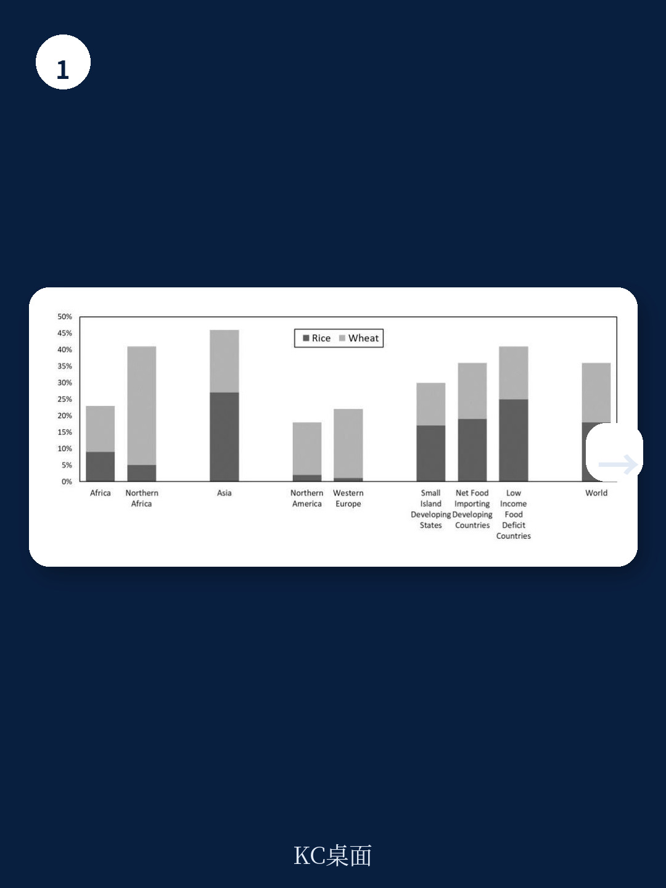
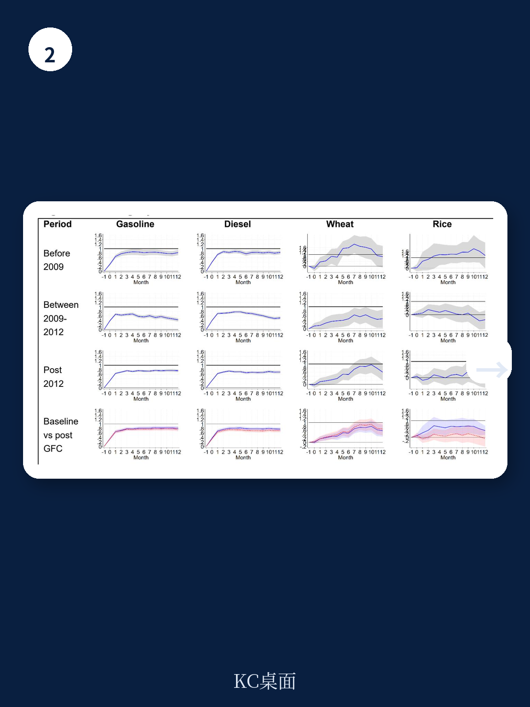

# IMF：国际燃料与粮食价格传导研究

国际油价在2026年3月因中东局势和供应约束再度飙升，IMF最新工作论文《Pumps and Plates》基于超过3万组价格配对数据，系统评估了全球燃料与粮食价格向国内零售市场的传导机制。核心发现是：传导不完全，且存在明显的“棘轮效应”——价格上涨时传导快，价格下跌时传导慢。这对理解当前全球通胀粘性、各国财政负担和消费者实际感受，提供了新的量化视角。

## 1. 燃料传导快且高，粮食传导慢且低

报告对185个国家的汽油、184个国家的柴油、46个国家的面粉和63个国家的大米价格进行了动态分析。结果显示，国际油价每上涨1美元，国内汽油和柴油零售价格在3个月内分别传导约0.8美元，达到峰值后趋于稳定。而小麦的传导过程更慢，需要约10个月才能达到0.81美元的峰值传导率；大米传导率更低，峰值仅0.69美元，且3个月后便进入平台期。

> **KC评论：** 这意味着，当全球油价飙升时，消费者在加油站感受到的不确定性几乎是即时的；而粮价上涨传导到餐桌则需要更长时间。这种时间差可能掩盖了通胀的真实累积效应。

## 2. 发达地区传导接近完全，新兴市场靠补贴“缓冲”

报告按区域和净进口/出口状态分组后发现，发达地区的燃料传导率接近完全，而中东和北非、撒哈拉以南非洲地区的传导率显著偏低。这些地区普遍采用补贴、税收调整或行政定价来抑制国际价格向国内零售价格的传导。报告指出，这种干预虽然短期内稳定了国内价格，但将调整负担转移到了公共财政或国有企业身上。以2022年价格冲击为例，维持低传导率的国家，其补贴账单在某些情况下达到了GDP的2%至4%。

## 3. 价格涨跌传导不对称，通胀控制面临“棘轮”困境

报告最引人关注的发现是价格传导的不对称性。数据显示，国际价格上涨时，国内零售价格调整的速度和幅度均显著高于价格下跌时。这种“棘轮效应”在汽油和柴油上尤为明显，在面粉上也有模式性体现，大米则相对有限。这意味着，即使全球大宗商品价格回落，国内消费者感受到的价格下降可能远慢于此前上涨的速度，通胀的“粘性”部分来源于此。

> **KC评论：** 这一发现解释了为什么全球油价已从高点回落，但许多国家的加油站价格依然坚挺。政策制定者在评估通胀前景时，不能简单用国际价格走势来推断国内物价走势。

## 4. 大冲击下传导模式分化：燃料“钝化”，粮食“加速”

报告还发现，冲击规模对传导率的影响因商品而异。对于燃料，大规模价格冲击反而导致更低的传导率——这可能是因为政府在极端情况下加大了干预力度。但对于小麦，大规模冲击反而带来更高的传导率，反映出粮食安全不确定性下，政府干预的空间和意愿可能更为有限。大米则对冲击规模不敏感，传导率始终较低。

这份研究为理解当前全球通胀的结构性特征提供了关键框架。它表明，各国在价格稳定与财政可持续之间面临真实权衡，而“棘轮效应”意味着即使全球价格不确定性缓解，国内通胀的回落也可能比预期更慢、更不平滑。

For informational purposes only. Portions may be generated,translated,summarized,or edited with AI assistance based on source materials and may contain omissions or errors. Please verify independently. This is not investment,legal,tax,accounting,or other professional advice.

