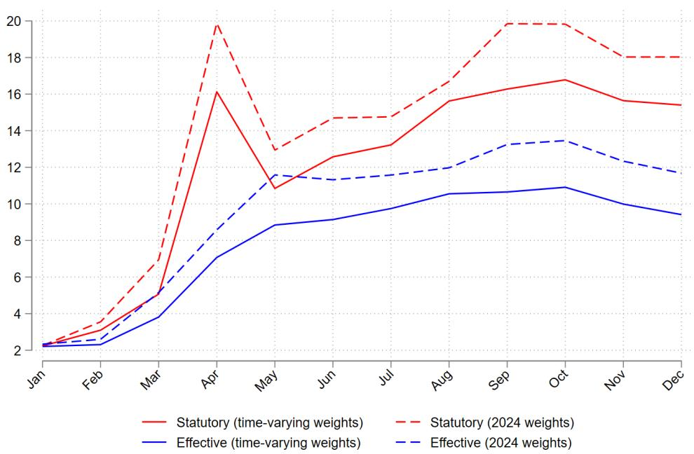
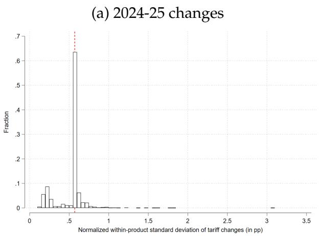
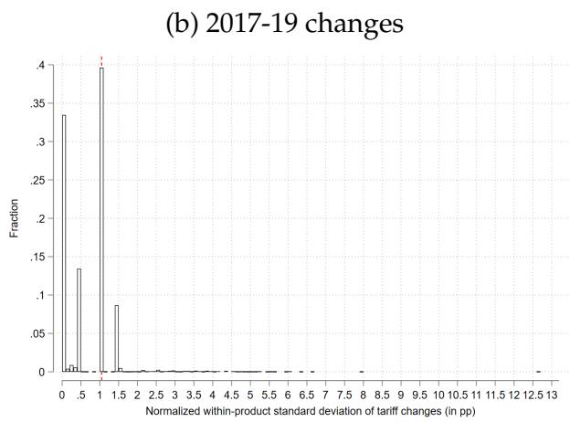
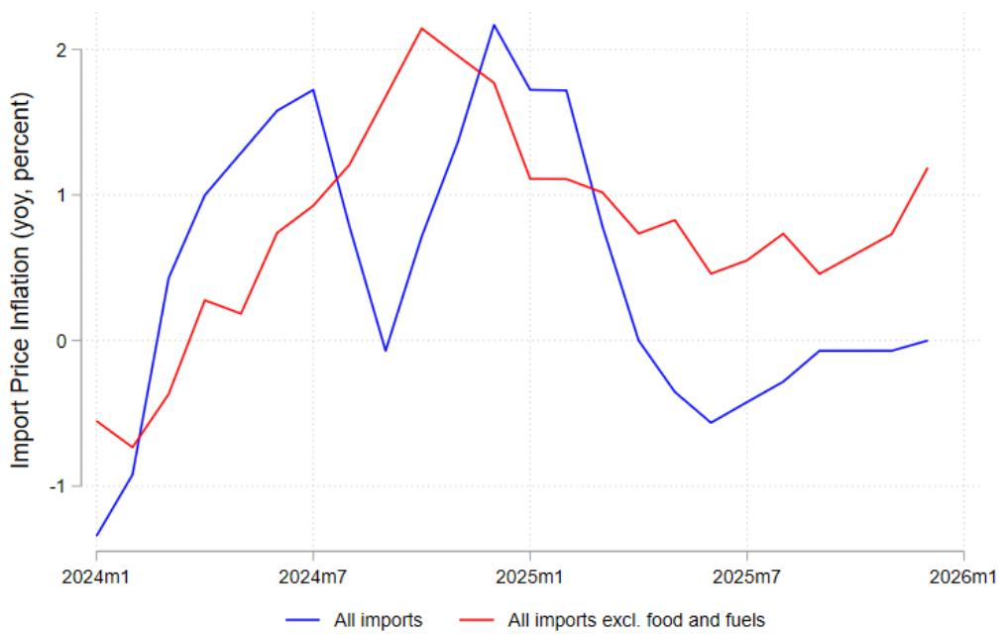
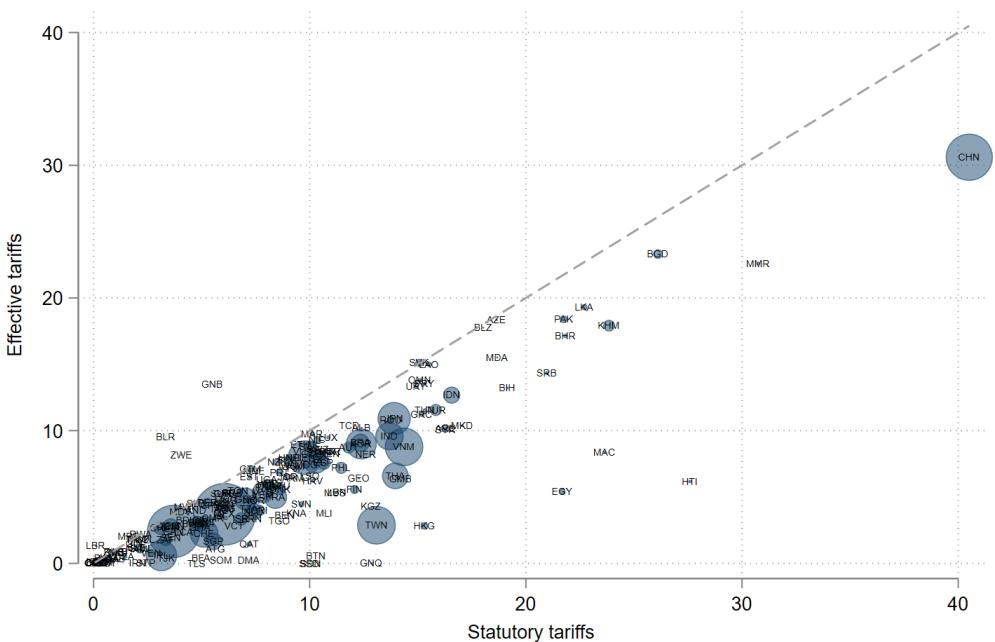

# Tariff Pass-Through and Import Reallocation

JaeBin Ahn, Lorenzo Rotunno, and Michele Ruta

WP/26/149

IMF Working Papers describe research in progress by the author(s) and are published to elicit comments and to encourage debate. The views expressed in IMF Working Papers are those of the author(s) and do not necessarily represent the views of the IMF, its Executive Board, or IMF management.

2026
JUL

# IMF Working Paper Strategy, Policy and Review Department & Western Hemisphere Department

Tariff Pass-Through and Import Reallocation

Authorized for distribution by Nigel Chalk and Daria Zakharova
July 2026

IMF Working Papers describe research in progress by the author(s) and are published to elicit comments and to encourage debate. The views expressed in IMF Working Papers are those of the author(s) and do not necessarily represent the views of the IMF, its Executive Board, or IMF management.

ABSTRACT: We study how U.S. tariff hikes in 2025 have transmitted to import prices. Consistent with recent evidence, we find that duty-exclusive import prices at the variety (country-product) level do not adjust to tariffs, implying full pass-through to duty-inclusive prices at the border. At the product level, however, duty-exclusive aggregate import prices decline significantly with tariff increases. We show that this product-level decline is driven by within-product reallocation toward lower-priced sources—stronger in products facing larger tariff hikes—and operates primarily through the entry of lower-priced varieties and the exit of higher-priced ones. Estimates of variety appeal indicate that part of this reallocation reflects shifts toward lower-quality varieties, a channel that is also present in the 2018–19 U.S.—China tariff episode. These reallocation effects carry implications for consumer welfare and productivity through the quality of imported goods and inputs.

RECOMMENDED CITATION: Ahn, J., Rotunno, L., and Ruta, M. (2026). Tariff Pass-Through and Import Reallocation. IMF Working Paper WP/26/149. International Monetary Fund.

JEL Classification Numbers:

F13; F14

Keywords:

Tariff pass-through; imports; reallocation; product appeal.

Author's E-Mail Address:

jahn@imf.org; lrotunno@imf.org; mruta@imf.org

# Tariff Pass-Through and Import Reallocation\*

JaeBin Ahn $^{\dagger}$ Lorenzo Rotunno $^{\ddagger}$ Michele Ruta $^{\S}$

July 17, 2026

## Abstract

We study how U.S. tariff hikes in 2025 have transmitted to import prices. Consistent with recent evidence, we find that duty-exclusive import prices at the variety (country-product) level do not adjust to tariffs, implying full pass-through to duty-inclusive prices at the border. At the product level, however, duty-exclusive aggregate import prices decline significantly with tariff increases. We show that this product-level decline is driven by within-product reallocation toward lower-priced sources—stronger in products facing larger tariff hikes—and operates primarily through the entry of lower-priced varieties and the exit of higher-priced ones. Estimates of variety appeal indicate that part of this reallocation reflects shifts toward lower-quality varieties, a channel that is also present in the 2018–19 U.S.—China tariff episode. These reallocation effects carry implications for consumer welfare and productivity through the quality of imported goods and inputs.

Keywords: Tariff pass-through, imports, reallocation, product appeal.
JEL codes: F13, F14.

## 1 Introduction

Recent U.S. tariff actions have sparked intense academic and policy debate regarding their economic implications for the U.S. and its trading partners. A central policy question concerns the incidence of these tariffs—namely, who ultimately bears their cost—and how this incidence translates into inflationary pressures within the U.S. economy. Addressing this issue requires examining how tariffs affect exporters' prices at the border and the extent to which these cost changes pass through to import prices, domestic producer prices, and ultimately consumer prices. In practice, tariff incidence and its inflationary impact depend on several interacting mechanisms, including the degree of border pass-through, market structure and pricing behavior along global value chains, and the reallocation of trade flows across foreign and domestic suppliers. Understanding these channels is essential for assessing whether tariffs generate sustained inflationary pressures or whether their effects are mitigated through adjustments in sourcing, markups, or international price setting. It is also key to understanding the broader effects of the tariffs on productivity and welfare.

This paper estimates tariff pass-through into U.S. import unit values at two levels: the most detailed 'variety' level (exporter-HS 10-digit product combinations) and the 'product' (HS 10-digit) level. The variety-level analysis identifies pass-through to exporters' prices (proxied by import unit values excluding duties) and follows the standard approach in the literature. The product-level analysis combines tariff effects on exporters' prices with shifts in sourcing across origin countries for a given product. This approach clarifies how tariff-induced import reallocation shapes import prices and, in turn, informs the incidence debate. $^{1}$ Additionally, we investigate how the reallocation affects the quality of U.S. imports, which is a crucial ingredient to assess the implications for welfare and productivity.

Our empirical analysis uses monthly U.S. Census data on imports and collected duties. The data report import values and quantities by country of origin and HS 10-digit product. We measure variety-level prices using unit values, both excluding collected duties (duty-exclusive or exporters' prices) and including duties (duty-inclusive or after-tariff import prices), all on an FOB (free on board) basis. At the same level of observation, we define the effective tariff rate as collected duties divided by import values—that is, the tariff protection effectively faced by importers

and exporters at U.S. customs.

In the baseline specification, we regress year-on-year monthly changes in U.S. import prices, values, and quantities on changes in U.S. import tariffs over the period from February 2025—when the U.S. administration began materially revising tariff policy—through December 2025. Year-on-year differencing removes seasonality, and monthly tariff variation captures high-frequency policy changes within the period, including both tariff increases and decreases. We study responses along the intensive margin using outcome variables in log changes, and along the extensive margin using entry and exit dummies for U.S. import varieties.

Our preferred estimates rely on a two-stage least squares approach that instruments effective tariff rates with statutory U.S. tariffs. We draw statutory tariff data from the WTO-IMF Tariff Tracker (WTO-IMF, 2026), available by trading partner at the HS 8-digit level. As documented by Gopinath and Neiman (2026), we note a widening gap between effective and statutory rates, partly driven by behavioral responses. Although effective tariffs capture policy as implemented at the border, they are potentially endogenous because the ratio of collected duties to import values can move with import responses, generating reverse causality. Statutory tariffs, by contrast, identify policy-driven variation in effective tariffs and therefore can serve as a valid instrument (Fajgelbaum and Khandelwal, 2026).

Our first set of findings aligns with recent evidence that exporters' prices respond little to U.S. tariffs, and that these tariffs promote reallocation of imports across trading partners. At the variety level, import prices inclusive of collected duties rise one-to-one with tariffs, while import values and quantities decline significantly. Our estimates suggest that an 8 percentage point increase in the effective U.S. tariff rate—similar to the rise observed between February and December 2025—implies an average import decline of about 3.6 percent. Crucially, these effects emerge from variation in tariff changes across varieties of the same import product. Our results indicate significant reallocation effects—imports of varieties hit by higher tariffs decrease relative to those of other varieties of the same product. We also find strong extensive-margin effects: higher statutory U.S. tariffs are robustly associated with greater exit and lower entry of U.S. import varieties within a product.

This substantial reallocation of imports across trading partners influences how tariffs affect product-level import prices. We find that import prices excluding collected duties fall significantly with increases in the average product-level U.S. effective tariffs—a striking contrast with the muted effect at the variety level. To unpack this result, we implement a decomposition exercise that isolates the contribution of distinct margins. Crucially, it shows how adjustment occurs through both the intensive margin (prices of continuing varieties) and the extensive margin (prices of entering and exiting varieties).

Our estimation results highlight a novel mechanism through which tariffs affect import prices. The estimates suggest that the strong negative effect of U.S. tariffs on product-level import prices is driven largely by reallocation from higher-priced to lower-priced varieties, particularly through extensive-margin adjustments. While the estimates indicate a (relatively small) negative effect of U.S. tariff changes on product-level average prices among incumbent varieties, they reveal that newly entering varieties are significantly cheaper, with the pattern being more pronounced in products facing larger U.S. tariff increases. Similarly, the exit of higher-priced varieties is stronger in products with larger tariff hikes. Together, these effects contribute to the negative association between tariffs and pre-tariff product-level import prices, a pattern that was also evident during the 2018-19 U.S. tariff episode.

Such a shift toward lower-priced sourcing raises the question of why this cost-reducing reallocation intensifies with higher tariffs. Two mechanisms could be at play, possibly at the same time: efficiency versus quality. One possibility is that the unprecedented tariff increases induced importers to incur substantial fixed costs of searching for alternative, more efficient suppliers, whereas the incentives to adjust sourcing are weaker with lower tariffs. $^{2}$ A second possibility is that the reallocation toward lower-priced varieties may entail shifts toward varieties with lower “appeal” (Redding and Weinstein, 2020, 2024), reflecting lower quality or weaker consumer preferences.

To gauge the relative importance of these two channels, we compare the estimated tariff effects on product-level price indexes constructed with and without adjustments for variety-level appeal. Specifically, we estimate the variety-specific appeal within a CES demand framework, where appeal acts as a demand shifter: varieties that command higher import shares despite higher unit prices are assigned higher estimated appeal (Redding and Weinstein, 2020; Khandelwal, 2010). Appeal captures a combination of quality differences and preference heterogeneity. To facilitate identification, we estimate appeal using pre-period data from 2023–24 and treat it as time-invariant. Consequently, changes in import-weighted appeal at the HS 10-digit product level arise solely from reallocation across source countries. As a second step, to distinguish between compositional effects associated with changes in appeal (e.g., quality downgrading) and genuine price movements net of appeal, we construct a model-consistent, appeal-adjusted price index at the HS 10-digit level based on the CES unit-expenditure function. This index aggregates exporter-level prices within a product, weighting each variety by its estimated appeal, and thus captures within-product variation in prices expressed in utility-equivalent units. Differences in the product-level CES price indexes over time capture adjustments along both the intensive and extensive margins.

Regression results using this appeal-adjusted CES price index show that the tariff-induced decline in product-level prices is weaker than the one obtained using unadjusted nominal price indexes. This finding indicates that the observed decline in nominal product-level import prices is not driven solely by an efficient reallocation toward lower-cost sources, but also reflects the reallocation toward lower-appeal varieties.

Using the CES price index constructed from duty-inclusive import prices further underscores the importance of accounting for the appeal of different varieties. With unadjusted nominal product-level CES prices, we find that tariff changes have a negligible or, in 2018-19, even negative effect on tariff-inclusive prices. This seemingly counterintuitive result however changes when we use appeal-adjusted prices: we find that appeal-adjusted duty-inclusive CES import prices increase significantly with product-level U.S. tariffs, albeit less than one-for-one. These patterns suggest that the lower import prices in products hit by higher U.S. tariffs reflect reallocation toward varieties with lower appeal. $^{3}$ Overall, these results suggest that the reallocation of imports toward lower-quality varieties in response to tariff hikes could have a material effect on welfare and productivity (e.g., through a reduction of the quality of imported inputs).

Our main contribution is to link the effects of tariffs on trade reallocation to their effects on import prices. Model-based and econometric work shows that U.S. tariffs in 2018-19 and again in 2025 shifted U.S. imports away from highly tariffed sources (notably China in 2018-19) toward alternative suppliers (Fajgelbaum and Khandelwal, 2026; Rotunno and Ruta, 2026; Fajgelbaum et al., 2024; Caliendo and Parro, 2022). The same literature finds limited pass-through of U.S. tariffs into exporters' prices in both episodes (Gopinath and Neiman, 2026; Amiti et al., 2026; Hinz et al., 2026; Fajgelbaum and Khandelwal, 2026; Fajgelbaum et al., 2020; Amiti, Redding and Weinstein, 2020), although transaction-level economies of scale suggest that exporters may absorb a larger share of the tariff through lower prices as shipment volumes decline (Ganapati and Hottman, 2026). $^{4}$ We confirm these findings and add that tariffs can lower product-level pre-tariff import prices through compositional shifts toward lower-priced varieties, even when exporters' prices at the variety level remain unchanged. $^{5}$

Among recent papers studying the price effects of U.S. tariffs, Chinagorom-Abiakalam and Leibovici (2025, 2026) study aggregate import price dynamics without explicitly relating them to tariff variation. They show that since the February 2025 tariff round, pre-tariff U.S. import prices have, if anything, increased slightly. Although unit values of individual varieties declined on average, aggregate imports shifted toward varieties whose unit prices have stronger growth. Our results suggest that the variation of U.S. tariffs across trading partners attenuated this aggregate pattern: products facing larger tariff increases reallocated relatively more toward lower-priced varieties. Import adjustments along the extensive margin (e.g., entry of lower-priced varieties) play a crucial role in explaining this reallocation.

The rest of the paper is organized as follows. Section 2 describes the data and presents stylized facts on statutory and effective U.S. tariffs. Section 3 outlines the empirical strategy and reports results for the 2025 U.S. tariff hike. It shows the findings at both the variety and product levels, with particular emphasis on the novel product-level evidence, and the estimates of tariff effects on product appeal. The following section reports additional results for the 2018-19 tariff episode. Finally, Section 5 summarizes the main findings and discusses avenues for future research.

## 2 Data and stylized facts

## 2.1 Data

The empirical analysis uses detailed product-level tariff and trade data covering 2024-25. Monthly U.S. import data come from the U.S. Census Bureau which reports import values (in current US\$), quantities, and duties by country of origin and HS 10-digit product. We measure prices using import unit values: values excluding collected duties define FOB (Free On Board) prices, while values including collected duties define tariff-inclusive unit values. $^{6}$

We consider two types of tariff measures: the ‘effective’ tariff rates, which are computed as the ratio of calculated duties to the value of imports for consumption; and the ‘statutory’ tariff rates, defined as the tariffs implemented by the U.S. administration through official documents (e.g., published in the Federal Register).

While effective tariff rates reflect the tariffs actually faced by importers at the border, they can deviate from statutory rates for several reasons. These include implementation practices, exemptions not fully captured in statutory schedules, shipment lags, and behavioral responses to tariff policy, such as changes in the use of preferential rates. Unlike statutory rates, effective rates are undefined when the tariff is ‘prohibitive’ and import values fall to zero.

By contrast, statutory tariff rates measure the trade policy that policymakers intend to implement through official legal measures. We obtain statutory tariff rates and their time variation from the WTO-IMF Tariff Tracker (WTO-IMF, 2026), a data initiative aimed at tracking recent tariff actions by the U.S. and related tariff responses by trading partners. The dataset includes the U.S. tariffs at the HS 8-digit level together with their daily date of implementation, as documented in official regulations and legislation.

Two adjustments are applied to better reflect the prescribed implementation of these tariffs (see WTO-IMF (2026)). First, the U.S. tariffs on Canada and Mexico are scaled down proportionally to the observed USMCA preference utilization rate at the product level—updated with a lag of a few months—to proxy for USMCA eligibility, a condition for exemption from the U.S. import tariffs. $^{7}$

Second, sectoral tariffs on steel and aluminum have been extended to derivative products for their steel or aluminum content. The WTO-IMF tracker data applies aggregated sectoral input-output coefficients to approximate the steel and aluminum contents of downstream products. $^{8}$ Both adjustments should narrow any difference between the statutory and effective tariffs.

The daily statutory tariffs from the WTO-IMF tracker are then aggregated at the monthly frequency by taking the most recurrent (i.e., modal) tariff rate for each month. Baseline statutory tariffs for 2024 are assigned to all months before February 2025, when the first tariff changes in the U.S. administration were implemented.

In the regression analysis, the effective tariff rate is our preferred tariff measure, as it captures actual tariff barriers faced by importers and exporters. To address potential endogeneity, we instrument the effective tariff rate with the statutory one, whose main advantage is its exogeneity with respect to trade responses—see also Fajgelbaum and Khandelwal (2026).

## 2.2 Stylized facts

Figure 1 illustrates the evolution of the import-weighted U.S. average statutory (in red) and effective (in blue) tariff rates since January 2025. The dotted lines use fixed weights from the 2024 import data, while the solid lines are based on time-varying (i.e., contemporaneous) import weights. For both statutory and effective rates, the solid lines lie below the dotted lines, reflecting the reallocation of imports in response to tariffs—from higher-tariff to lower-tariff goods and countries. Under both weighting schemes, the blue lines lie below the red lines, indicating the significant role of exemptions, implementation complexities and lags in the actual collection of statutory duties (Gopinath and Neiman, 2026).

As of December 2025, the average statutory rate using time-varying import weights was around 15.5 percent, approximately 6 percentage points higher than the average effective rate. Importantly, the difference was negligible in January 2025 but widened as the U.S. implemented tariff actions. Also across countries, average effective tariffs are below the statutory ones, with the gap being particularly large (around 10 percentage points) in the case of China (see Figure A.1.1).

Figure 1: Import-weighted average U.S. statutory and effective tariff rates  

The substantial variation in US tariff policy across trading partners emerges also within products. Figure 2 shows the distribution of the standard deviation of changes in U.S. statutory tariffs within HS 8-digit product (the level at which statutory tariffs are set) in 2025 (relative to 2024) and 2019 (relative to 2017). To ease comparison across tariff episodes, the within-product standard deviations are normalized by the overall standard deviation—which is higher in 2025 because tariff increases are more important in that episode than in 2018-19. Two main findings emerge. First, there is significant within-product variation in the latest tariff episode, even if tariff hikes target most countries and products. The 2024-25 tariff changes differ across countries in all products, with a median value for the within-product standard deviation of around 8 percentage points (57 percent of the overall standard deviation). Second, tariff changes vary more within products in the 2018-19 tariff episode, where tariffs target mainly imports from China. As panel (b) shows, the median of normalized within-product standard deviation of tariff changes is higher in the 2018-19 episode than in the 2025 one. $^{9}$ In the empirical analysis, we investigate whether this variation in tariff hikes across source countries leads to reallocation of import flows.

Figure 2: Distribution of within-product standard deviation of changes in U.S. tariffs over 2024-25 and 2017-19  

  
Note: Changes in U.S. tariffs in panel (a) are computed as differences between the modal U.S. statutory tariff rates in December 2025 and tariffs as of December 2024. In panel (b) they are the difference between U.S. statutory tariffs in December 2019 and those as of December 2017. The vertical dashed lines indicate the median values of within-product standard deviations. Products are defined by HS 8-digit codes since that is the level at which U.S. statutory tariffs are typically set.

While U.S. tariffs increased substantially during 2025, the aggregate U.S. import price index, exclusive of tariffs and compiled by the Bureau of Labor Statistics, exhibits a relatively swift deceleration in import price inflation following its peak ahead of the tariff hikes. As shown in Figure 3, year-over-year import price inflation for all imports rises through mid-2024, and then declines thereafter despite new tariffs. This disinflationary pattern is evident both for the headline import price index and for the series excluding food and fuels, although the latter remains consistently higher and more stable over the subsequent period. By mid-2025, headline import price inflation turns negative, while import prices excluding food and fuels moderate but remain positive, suggesting that the post-peak slowdown reflects broad-based price dynamics rather than being driven solely by volatile commodity components. The combination of rising U.S. tariffs and slowing pre-tariff import price inflation may appear difficult to reconcile with the evidence that exporters did not adjust their prices in response to the tariff increases. This tension suggests that other mechanisms may be driving the decline in aggregate import prices following higher tariffs—a possibility we investigate next.

Figure 3: U.S. Import price inflation dynamics  

## 3 Evidence from the 2025 U.S. tariffs

We investigate the effects of U.S. tariffs imposed during 2025 on import prices and trade flows. We begin at the most detailed ‘variety’ level, defined as an exporter (i)-HS 10-digit product (g) pair, to identify price responses and reallocation across exporters. We then move to the product level to examine how reallocation across varieties has shaped tariff pass-through to import prices. In the next section, we check whether the patterns found in the latest tariff period differ from the 2018-19 U.S. tariff hike episode.

The empirical approach relates changes in import values, quantities, and unit values with changes in import tariffs. The tariff effects are estimated from cross-sectional variation. For the variety-level analysis, the relevant comparison is across source countries of the same import product. For the regressions at the product level, the effects of average tariff changes are identified from variation across products. This reduced-form approach captures the empirical responses to changes in U.S. import tariffs, controlling for aggregate adjustments (e.g., in relative exchange rates and income) through fixed effects.

## 3.1 Trade and price effects at the variety level

The first step of our empirical analysis is to estimate the effects of U.S. tariffs on import prices and flows at the variety level. Our baseline specification is

$$
\Delta \ln Y _ {i g, t} = \beta \Delta \ln \left(1 + \tau_ {i g, t} ^ {U S, e f f}\right) + \mu_ {g, t} + \eta_ {i} + \varepsilon_ {i g, t}\tag{1}
$$

where Y can be U.S. import unit values (FOB: $P \equiv \frac{V}{Q}$ ; and inclusive of duties paid: $P^{*} \equiv \frac{V + T}{Q}$ , where T equals collected duties) and their components—import values (V) and quantities (Q). The term $\tau_{ig,t}^{US,eff}$ is the U.S. effective tariff rate, and all variables are measured in year-on-year log differences. The time unit is a month t, spanning the February-December 2025 period, when U.S. tariffs were modified.

The fixed effects absorb key confounders. Product-time fixed effects $\mu_{g,t}$ capture shocks common to HS 10-digit product g in month t (e.g., product-specific tariff changes common across countries, global supply shocks, U.S. demand shifts, and product-specific seasonality). Exporter fixed effects $\eta_{i}$ absorb exporter-specific trends (e.g., logistics access to the U.S. market and productivity differences). Importantly, the differencing over time wipes out the influence of time-invariant factors specific to an exporter and HS 10-digit product. Standard errors are clustered at the HS 8-digit product level, which is the level at which statutory tariffs are set.

The coefficient $\beta$ is identified from variation in import outcomes and tariff changes across exporters within an HS 10-digit product—the same type of variation descriptively explored in Figure 2. With product-time fixed effects included, identification comes from within-product cross-exporter responses, capturing both import reallocation and price adjustments following tariff changes. The set of fixed effects in the baseline specification is as in Fajgelbaum and Khandelwal (2026) and permits identification of reallocation effects across trading partners. In robustness checks, we introduce additional fixed effects, which might nonetheless absorb important tariff variation—e.g., country-time fixed effects capturing the influence of country-specific broad-based tariff changes.

A key concern is that reverse causality from imports to effective tariff rates can bias OLS estimates of the $\beta$ coefficient in equation 1. The direction of this bias is a priori ambiguous. Mechanically, the coefficient may be biased downward because the effective rate falls as import values rise (holding the statutory tariff rate fixed). However, the OLS coefficient may also be biased upward if, for example, enforcement is tighter for larger import shipments. To address these concerns, we instrument effective tariffs with time-varying statutory tariff rates $(\tau_{ig,t}^{US,sta})$ , which vary by product (HS 8-digit level) and exporter, and estimate the model by 2SLS (see also Fajgelbaum and Khan-delwal (2026)). The exclusion restriction requires that statutory tariffs affect trade outcomes only through their effect on effective tariff rates. Figures 1 and A.1.1 show a strong positive correlation between statutory and effective tariffs, consistent with our first-stage estimates.

When import unit values are the dependent variable, the coefficient $\beta$ indicates the extent of tariff pass-through to import prices. With duty-exclusive FOB prices, $\beta$ captures exporters' price responses. In neoclassical frameworks, import tariffs are expected to reduce exporters' prices through a terms-of-trade effect, particularly when the tariff-imposing country has monopsony power in the relevant market (e.g., Ossa and Redding, 2026). In models with imperfect competition and variable markups, exporters may further absorb part of the tariff through reduced markups. When the dependent variable is the duty-inclusive import price, a coefficient of 1 indicates full pass-through to import prices, whereas a lower coefficient implies incomplete pass-through.

Table 1: Price and import effects of U.S. tariffs at the variety level

<table><tr><td></td><td>(1)</td><td>(2)</td><td>(3)</td><td>(4)</td><td>(5)</td></tr><tr><td>Dep. variable:</td><td> $\Delta \ln \left( 1 + \tau_{ig,t}^{US,eff} \right)$ </td><td> $\Delta \ln V_{ig,t}$ </td><td> $\Delta \ln Q_{ig,t}$ </td><td> $\Delta \ln P_{ig,t}$ </td><td> $\Delta \ln P_{ig,t}^{*}$ </td></tr><tr><td>Estimator:</td><td>OLS</td><td>2SLS</td><td>2SLS</td><td>2SLS</td><td>2SLS</td></tr><tr><td> $\Delta \ln \left( 1 + \tau_{ig,t}^{US,eff} \right)$ </td><td></td><td>-0.478***(0.059)</td><td>-0.478***(0.080)</td><td>-0.000(0.054)</td><td>1.000***(0.054)</td></tr><tr><td> $\Delta \ln \left( 1 + \tau_{ig,t}^{US,sta} \right)$ </td><td>0.393***(0.008)</td><td></td><td></td><td></td><td></td></tr><tr><td>Obs</td><td>1,262,647</td><td>1,262,647</td><td>1,262,647</td><td>1,262,647</td><td>1,262,647</td></tr><tr><td>F-stat 1st stage</td><td></td><td>2195</td><td>2195</td><td>2195</td><td>2195</td></tr></table>

Note: Year-on-year monthly log changes in import and tariff variables. The sample includes changes from February to December 2025. All columns include HS 10-digit product-time and country fixed effects. Standard errors clustered at the HS 8-digit product level in parentheses. Significance levels: \*10 %, \*\*5%, \*\*\*1%.

The baseline estimates in Table 1 indicate that U.S. tariff changes have a muted effect on exporters' unit values (column (4)), implying full pass-through of U.S. tariffs to variety-level duty-inclusive import prices (column (5)). This finding is consistent with recent evidence based on alternative data and specifications (Gopinath and Neiman, 2026; Hinz et al., 2026; Amiti et al., 2026; Fajgelbaum and Khandelwal, 2026), and with results from the 2018-19 tariff episode (Amiti, Redding and Weinstein, 2019, 2020; Fajgelbaum et al., 2020; Fajgelbaum and Khandelwal, 2022). The positive and statistically significant first-stage coefficient in column (1) confirms that statutory tariff changes strongly predict effective tariff changes at the variety level.

Columns (2) and (3) of Table 1 show significant negative effects of U.S. tariffs on imports, pointing to substantial trade reallocation across exporters. The estimates imply that the 8 percentage point increase in the import-weighted average U.S. effective tariff between February and December 2025 (Figure 1) would reduce imports by about 3.6 percent on average. The trade elasticity in column (3), -0.5, should be interpreted as a short-run elasticity because it is estimated from year-on-year changes. $^{10}$ This estimate is close to those in recent studies of U.S. tariff changes (Hinz et al., 2026; Gopinath and Neiman, 2026), but smaller than estimates from the 2018-19 U.S.-China tariff episode obtained with similar specifications. $^{11}$ A plausible explanation is that the latest U.S. tariff actions were broader in scope and surrounded by greater uncertainty than in 2018-19. If importers expected further tariff increases, they may have responded less to initial hikes. $^{12}$ Moreover, although the significant coefficient indicates reallocation toward lower-tariff varieties, that adjustment may have been weaker than in 2018-19, when U.S. tariff increases were concentrated on China.

The reduced-form and OLS estimates in Table A.1.1 in the Appendix broadly confirm the direction of the estimated effects from the 2SLS baseline estimations. In particular, the 2SLS estimate in Table 1 lies between the (potentially biased) OLS second-stage estimate and the reduced-form estimate. The positive association between effective tariff rates and FOB unit values is consistent with the fact that the negative elasticity in the quantity regression (column (3)) is larger in absolute value than in the value regression (column (1)). The trade elasticity based on statutory tariff rates in column (4)—the same tariff measure used, for example, by Fajgelbaum et al. (2020) and Amiti, Redding and Weinstein (2019) for the 2018–19 episode—is even smaller than the baseline 2SLS estimate. Importantly, the reduced-form results confirm no response of exporters' prices to tariff variation (column (6)).

These findings—muted responses of exporters' unit values and negative effects of U.S. tariffs on variety-level imports—are robust to alternative fixed-effects structures. As shown in Panel (b) of Table A.1.2 in Appendix, the most restrictive specification adds country-time and country-HS 6-digit sector fixed effects to the baseline. In this specification, the estimated trade elasticity rises to -0.85, while tariff pass-through to import prices declines slightly. The effect on exporters' unit prices is negative but statistically insignificant, and the estimates on the duty-inclusive prices imply that up to 18 percent of tariff increases are absorbed by variety-level exporters' prices.

The results in Table 1 reveal how U.S. tariffs affect imports along the intensive margin—i.e., for varieties imported in months t and t - 12. To capture trade responses along the extensive margin, we also estimate the effects of tariffs on variety entry and exit:

$$
e _ {i g, t} = \beta \Delta \ln \left(1 + \tau_ {i g, t} ^ {U S, s t a}\right) + \mu_ {g, t} + \eta_ {i} + \varepsilon_ {i g, t}\tag{2}
$$

The variable e denotes entry and exit dummies. In entry regressions, the dummy equals one when a variety is imported in month t but not in t - 12; the sample therefore includes only varieties not imported in t - 12, i.e., those at risk of entry one year later. In exit regressions, the dummy equals one when a variety is not imported in month t but was imported in t - 12; accordingly, the sample is restricted to varieties at risk of exit at time t. Because effective tariff rates are undefined for non-imported varieties, both entry and exit regressions use changes in statutory tariff rates. Thus, $\beta$ in equation 2 is interpreted as an OLS reduced-form coefficient (the regression is estimated through a linear probability model).

Table 2: Extensive margin import effects of U.S. tariffs at the variety level

<table><tr><td></td><td>(1)</td><td>(2) Exit</td><td>(3)</td><td>(4)</td><td>(5) Entry</td><td>(6)</td></tr><tr><td> $\Delta \ln \left( 1 + {\tau }_{ig,t}^{US,sta} \right)$ </td><td>0.107***(0.006)</td><td>0.155***(0.012)</td><td>0.065***(0.009)</td><td>-0.025***(0.002)</td><td>-0.036***(0.003)</td><td>-0.015***(0.002)</td></tr><tr><td>Country FE</td><td>✓</td><td></td><td></td><td>✓</td><td></td><td></td></tr><tr><td>Product HS 10-time FE</td><td>✓</td><td>✓</td><td>✓</td><td>✓</td><td>✓</td><td>✓</td></tr><tr><td>Country-time FE</td><td></td><td>✓</td><td>✓</td><td></td><td>✓</td><td>✓</td></tr><tr><td>Country-HS 6 FE</td><td></td><td></td><td>✓</td><td></td><td></td><td>✓</td></tr><tr><td>Obs</td><td>1,723,217</td><td>1,723,183</td><td>1,690,529</td><td>29,255,790</td><td>29,255,790</td><td>29,241,264</td></tr></table>

Note: Entry and exit and year-on-year monthly log changes in statutory tariffs. The sample includes changes from February to December 2025. In columns (1) to (3), the estimation sample includes varieties imported into the U.S. at time t - 12. In columns (4) to (6), the estimation sample includes varieties that were not imported into the U.S. at time t - 12. Standard errors clustered at the HS 8-digit product level in parentheses. Significance levels: \*10 %, \*\*5%, \*\*\*1%.

The extensive-margin regressions reveal significant entry and exit responses to U.S. tariffs. Baseline estimates in column (1) of Table 2 imply that the increase in average U.S. statutory tariffs between February and December 2025 (from about 2 to 15.5 percent) raises the probability of exiting the U.S. market by 1.4 percentage points, relative to an average exit probability of 26 percent. The estimate in column (4) implies that the same tariff increase lowers the probability of entering the U.S. market by 0.3 percentage points, relative to a sample-average entry probability of 1.6 percent. These results suggest that tariff hikes are prohibitive for some varieties, inducing switching to alternative origins and delayed entry.

## 3.2 Price effects at the product level

The variety-level reallocation effects documented in Tables 1 and 2 have implications for the transmission of tariffs to import prices and, ultimately, domestic prices. As imports shift across exporters with different prices, tariff effects on product-level prices may differ from those estimated at the more disaggregated variety level.

To investigate price effects at the HS 10-digit product level, we apply a log approximation to aggregate product prices, which allows us to identify price responses separately along the intensive (i.e., for varieties that are imported both before and after the tariff increases) and extensive (i.e., for varieties that enter or exit the market) margins of importing. $^{13}$ Specifically, we adapt the decomposition introduced by Bartelsman and Doms (2000) to our empirical setting. Let the log aggregate price be approximated by the share-weighted average of log prices:

$$
p _ {g, t} \equiv \sum_ {i} w _ {i g, t} ^ {V} p _ {i g, t}\tag{3}
$$

with value-share weights, $w_{ig,t}^{V} \equiv V_{ig,t}/V_{g,t}$ and $V_{g,t} \equiv \sum_{i} V_{ig,t}$ , and where we adopt a compact lower-case notation for variables in logs: $p_{ig,t} \equiv \ln P_{ig,t}$ . The product-level import price inflation over a 12-month window is then given by:

$$
\pi_ {g, t} \equiv \Delta p _ {g, t} = \sum_ {i} w _ {i g, t} ^ {V} p _ {i g, t} - \sum_ {i} w _ {i g, t - 1 2} ^ {V} p _ {i g, t - 1 2},\tag{4}
$$

This expression can be further decomposed by partitioning varieties into continuing varieties C, entrants E, and exiters X:

$$
\begin{array}{l} \pi_ {g, t} = \underbrace {\sum_ {i \in C} w _ {i g , t - 1 2} ^ {V} (p _ {i g , t} - p _ {i g , t - 1 2})} _ {\text {Within}} + \underbrace {\sum_ {i \in C} (w _ {i g , t} ^ {V} - w _ {i g , t - 1 2} ^ {V}) (p _ {i g , t - 1 2} - p _ {g , t - 1 2})} _ {\text {Between}} \\ + \underbrace {\sum_ {i \in C} (w _ {i g , t} ^ {V} - w _ {i g , t - 1 2} ^ {V}) (p _ {i g , t} - p _ {i g , t - 1 2})} _ {\text {Interaction}} + \underbrace {\sum_ {i \in E} w _ {i g , t} ^ {V} (p _ {i g , t} - p _ {g , t - 1 2})} _ {\text {Entry}} - \underbrace {\sum_ {i \in X} w _ {i g , t - 1 2} ^ {V} (p _ {i g , t - 1 2} - p _ {g , t - 1 2})} _ {\text {Exit}}. \end{array} \tag {5}
$$

Here the value-import weights $w$ 's are defined over total imports at their respective periods ( $t$ or $t - 12$ ), but summed over the relevant set of varieties (incumbents $C$ , entrants $E$ and exiters $X$ ) in each term. This decomposition separates intensive-margin from extensive-margin components. The first three terms on the right-hand side of the equation capture the contribution of adjustments along the intensive margin. Specifically, the 'within' effect reflects price changes among incumbent varieties, holding their import shares fixed. The 'between' term does the opposite by measuring changes in import shares among incumbent varieties, evaluated at prices in $t - 12$ . The 'interaction' (or covariance) term identifies changes in both unit values and import shares among continuing varieties. The last two terms capture the effect of adjustments along the extensive margin: the entry term reflects the price of newly imported varieties, and the exit term reflects the prices of exiting varieties, both relative to the average price in $t - 12$ and weighted by their new

or previous market shares.

For consistency with the way price changes are constructed, product level tariff growth is defined as the change in the weighted average of variety-level tariffs in log, where the weights are exporter value shares in $t_{0} = 2024^{14}$ :

$$
\Delta \ln \left(1 + \tau_ {g, t} ^ {U S, k}\right) \equiv \sum_ {i} w _ {i g, t _ {0}} ^ {V} \ln \left(1 + \tau_ {i g, t} ^ {U S, k}\right) - \sum_ {i} w _ {i g, t _ {0}} ^ {V} \ln \left(1 + \tau_ {i g, t - 1 2} ^ {U S, k}\right),\tag{6}
$$

and $k \in \{eff, sta\}$ . The product-level version of the baseline specification in equation 1 is:

$$
\pi_ {g, t} = \beta \Delta \ln \left(1 + \tau_ {g, t} ^ {U S, e f f}\right) + \mu_ {t} + \varepsilon_ {g, t}\tag{7}
$$

where $\mu_{t}$ denotes time fixed effects. Importantly, the year-on-year differencing nets out the influence of product-specific factors. The $\beta$ coefficient of interest is therefore identified from variation across HS 10-digit products within a year-month. As in the baseline variety-level specification, the effective tariff rate variable is instrumented with the statutory tariff rate—both tariff variables being computed as in equation 6.

Table 3: Product-level pass-through of U.S. tariffs: log decomposition

<table><tr><td>Dep. Variable:Estimator:</td><td>(1)Overall2SLS</td><td>(2)Intensive2SLS</td><td>(3)Extensive2SLS</td><td>(4)Between2SLS</td><td>(5)Interaction2SLS</td><td>(6)Within2SLS</td><td>(7)Entry2SLS</td><td>(8)Exit2SLS</td></tr><tr><td> $\Delta \ln \left( 1 + \tau_{g,t}^{US,eff} \right)$ </td><td>-0.624***(0.052)</td><td>-0.223***(0.035)</td><td>-0.401***(0.035)</td><td>0.086***(0.022)</td><td>-0.127***(0.022)</td><td>-0.183***(0.033)</td><td>-0.257***(0.034)</td><td>0.144***(0.008)</td></tr><tr><td>Obs</td><td>171,206</td><td>171,206</td><td>171,206</td><td>171,206</td><td>171,206</td><td>171,206</td><td>171,206</td><td>171,206</td></tr><tr><td>F-stat 1st stage</td><td>7158</td><td>7158</td><td>7158</td><td>7158</td><td>7158</td><td>7158</td><td>7158</td><td>7158</td></tr></table>

Note: Year-on-year monthly log changes in import and tariff variables. The sample includes changes from February to December 2025. All columns include time fixed effects. Standard errors clustered at the HS 8-digit product level in parentheses. Significance levels: \*10 %, \*\*5%, \*\*\*1%.

Table 3 summarizes estimation results of the regression in equation 7 based on the log decomposition scheme. Column (1) shows that the overall effect of tariffs on product-level prices is negative, and both statistically and economically significant: the estimates imply that the 2025 increase in the average $\ln(1 + \tau_{g,t}^{US,eff})$ (around 8 percentage points) is associated with an approximate 5 per-

cent decline in before-tariff import prices. $^{15}$

Replacing the dependent variable $\pi_{g,t}$ with the intensive margin term (column (2)) and the extensive margin term (column (3)) shows that each contributed to the overall results, with the majority of the estimated effect (around 65 percent) being driven by the extensive margin. The intensive margin effects are further decomposed in columns (4) to (6): the negative coefficient in column (6) suggests that the price of continuing varieties declines in products subject to larger tariff hikes. Coupled with the zero effect at the variety-level (Table 1), this may reflect price reductions by competing varieties with relatively lower tariffs, allowing them to gain market share from varieties with higher tariffs, in products experiencing larger aggregate tariff hikes. This price-reducing effect through the 'within' channel is however attenuated by the positive coefficient in column (4), suggesting that the incumbent varieties gaining market share tended to be relatively higher-priced initially, particularly in products experiencing larger aggregate tariff hikes.

Similarly, the extensive margin effects are decomposed into columns (7) and (8), revealing that around 65 percent of the contribution by extensive margin adjustments can be attributed to the entry channel (i.e., new varieties with lower prices), while the remaining 35 percent is accounted for by the exit channel (i.e., exiting varieties with relatively higher prices). Together with the variety-level evidence that tariffs discourage entry and induce exit (Table 2), these findings point to systematic patterns of entry and exit based on varieties' prices relative to continuing varieties.

This evidence on the predominant role of the extensive margin is consistent with the results from an alternative decomposition applied to the 'level' of product-level unit values—see section A.2 in Appendix. The results of that exercise reported in Table A.2.1 suggest that most of the negative price effect of U.S. tariff at the product-level is due to 'mean' effect—i.e., (unweighted) average prices decreasing with changes in product-level average tariffs. The extensive margin results suggest that this mean effect is driven by greater entry of lower-priced varieties and exit of higher-priced varieties in products hit by higher tariffs. The negative tariff effect on the 'covariance' term—measuring covariance between import prices and import shares within products—further indicates reallocation away from the 'old' and relatively expensive varieties and toward the new and 'cheap' ones within products hit by higher tariff hikes. In contrast, the positive coefficient in column (4) of Table 3 suggests that reallocation among existing varieties—which influences the ‘covariance’ coefficient in column (3), Table A.2.1—has a smaller and, if anything, price-increasing effect.

Our results document systematic differences in the dynamics of import prices across products that correlate negatively with tariffs—import price inflation at the product level decreases with U.S. tariff changes. At the aggregate, Chinagorom-Abiakalam and Leibovici (2026) find that U.S. imports have reallocated toward varieties with stronger price growth since February 2025, a pattern that has been mostly offset by a reduction in prices for incumbent varieties. Our results suggest that in products facing larger tariff hikes, reallocation shifted less toward higher-priced varieties — and in some cases toward lower-priced ones. Furthermore, their descriptive results are consistent with our findings of a decrease in the ‘within’ component (column (6), Table 3) and an increase of the ‘between’ component (column (4), Table 3) of product-level prices in response to U.S. tariffs. The results of our decomposition also highlight a significant effect of U.S. tariffs on the extensive margin—an adjustment that is not separately identified in the price index by Chinagorom-Abiakalam and Leibovici (2026), and which is shown to have contributed importantly to movements in product-level import prices.

A closer look across product types using BEA end-use categories, summarized in Table A.1.3, confirms the baseline results broadly across sectors, albeit to varying degrees. Capital and consumer goods, including autos, tend to exhibit larger product-level price declines in response to tariffs, while foods and industrial goods show smaller negative responses. The role of extensive margin adjustments is particularly pronounced for consumer goods and autos.

Finally, we assess the robustness of our main results along several dimensions, including alternative fixed effects, the use of quarterly data, excluding AI-related products, and aggregation at the HS 8-digit level. Overall, the findings remain qualitatively unchanged and quantitatively similar across these specifications, suggesting that the baseline results are not driven by specific modeling choices or data definitions.

## (i) Alternative fixed effects

We re-estimate the baseline specifications at the product level using alternative fixed effects. Specifically, we replace the baseline time fixed effects with HS 8-digit and time fixed effects or with HS 8-digit-time fixed effects, thereby allowing for a more flexible treatment of unobserved heterogeneity. In particular, the HS 8-digit fixed effects control for product-specific trends (non-linearly when interacted with time effects). The estimated coefficients reported in Table A.1.5 in the Appendix are qualitatively similar and, if anything, larger in magnitude, confirming that the baseline results are preserved under alternative fixed effects structures.

## (ii) Quarterly data

Given that the baseline specification uses monthly data, which may be affected by lumpy trade flows, we re-estimate the specification using quarterly data. Aggregating to the quarterly frequency helps smooth idiosyncratic shipment patterns and reduces noise arising from infrequent transactions. The results displayed in Table A.1.6 in the Appendix remain broadly consistent, with coefficients about halved in magnitude, suggesting that the baseline findings are preserved at lower frequency, while indicating that some of the estimated effects in the monthly data may reflect high-frequency variation in unit values and tariffs.

## (iii) AI-related products

The recent surge in imports of AI-related goods has been remarkable, growing by nearly 73 percent between 2023 and 2025. This surge was accompanied by similarly pronounced price increases, while these imports faced relatively low effective tariffs owing to numerous exemptions (Waugh, 2026). As such, it is plausible that these products contributed importantly to our main finding—namely, the negative relationship between changes in tariffs and import prices across products. However, Table A.1.7 in the Appendix confirms the robustness of the main results to excluding AI-related products, suggesting that the baseline findings are not merely driven by developments in AI-related goods.

## (iv) HS 8-digit product level

Finally, we test the robustness of the results by using a more aggregated product classification at the HS 8-digit level. This is the level at which statutory tariffs from the WTO-IMF Tariff Tracker are defined. The results shown in Table A.1.8 in the Appendix remain consistent with the baseline estimates, indicating that the findings are not sensitive to the level of product aggregation and are not driven by compositional effects within HS 8-digit product categories.

## 3.3 Product quality and reallocation

In this subsection, we investigate the extent to which the price effect of the U.S. tariffs documented earlier reflects a decrease in the quality of imports rather than a switch to more efficient and lower-priced suppliers. Underlying this analysis is the notion that different prices across varieties may mask variation in quality of imported products—what Redding and Weinstein (2024) refer to as “appeal”. From a welfare perspective, what matters are changes in nominal prices relative to changes in appeal, or appeal-adjusted prices. This applies to consumers with different tastes across varieties and firms facing imported inputs of differing quality.

Specifically, we investigate whether the reallocation of imports across varieties triggered by U.S. tariffs has been accompanied by shifts across varieties with different appeal. To empirically measure product appeal, we exploit the properties of CES preferences. In particular, we assume that within an aggregated product category g defined at the HS 10-digit level, importers' utility over exporter–HS 10-digit varieties is CES:

$$
U _ {g} = \left(\sum_ {i} (\Theta_ {i g} Q _ {i g, t}) ^ {\frac {\sigma_ {s} - 1}{\sigma_ {s}}}\right) ^ {\frac {\sigma_ {s}}{\sigma_ {s} - 1}}, \quad \sigma_ {s} > 1.\tag{8}
$$

where $\Theta_{ig}$ and $Q_{ig,t}$ are the exporter-HS 10-digit product level appeal and total import quantity, respectively. $\sigma_{s}$ is the elasticity of substitution, associated with the HS 6-digit category s containing HS 10-digit product g. One key assumption underpinning the empirical estimation of appeal is that, while appeal varies at the variety (i.e., exporter–HS 10-digit product) level, it is time-invariant over the estimation window. Empirically, we estimate it using 2023–2024 data, before the 2025 tariff hikes.

The CES variety share of imports within an HS 10-digit product is

$$
w _ {i g, t} ^ {V ^ {*}} \equiv \frac {V _ {i g , t} ^ {*}}{V _ {g , t} ^ {*}} = \frac {\Theta_ {i g} ^ {\sigma_ {s} - 1} P _ {i g , t} ^ {* 1 - \sigma_ {s}}}{\Phi_ {g , t} ^ {*}}, \quad \Phi_ {g, t} ^ {*} \equiv \sum_ {i} \Theta_ {i g} ^ {\sigma_ {s} - 1} P _ {i g, t} ^ {* 1 - \sigma_ {s}}.\tag{9}
$$

where the “\*” superscript makes it explicit that import values are evaluated at buyer’s prices—i.e., inclusive of the tariffs, and $\Phi_{g,t}^{*}$ is the relevant CES price index defined at the HS 10-digit product level, g. Taking logs:

$$
\ln w _ {i g, t} ^ {V ^ {*}} = (1 - \sigma_ {s}) \ln P _ {i g, t} ^ {*} + (\sigma_ {s} - 1) \ln \Theta_ {i g} - \ln \Phi_ {g, t} ^ {*}.\tag{10}
$$

Taking the import shares and unit values from the data and placing them on the left hand side of the equation, the expression can be rewritten in an estimable form:

$$
\ln w _ {i g, t} ^ {V ^ {*}} + (\sigma_ {s} - 1) \ln P _ {i g, t} ^ {*} = \eta_ {i g} + \mu_ {g, t} + \varepsilon_ {i g, t},\tag{11}
$$

where $\eta_{ig}$ and $\mu_{g,t}$ are exporter–HS 10-digit and HS 10-digit–time fixed effects, respectively. We obtain estimated values for the elasticity of substitution parameter $\sigma_{s}$ , varying by HS 6-digit product, from the trade elasticities estimated by Fontagné, Guimbard and Orefice (2022). Since their estimated trade elasticity $\varepsilon$ is defined as the (negative) elasticity of imports with respect to tariffs, we set $\sigma = 1 - \varepsilon$ . Estimated appeal is thus obtained from the HS 10-digit-exporter fixed effect:

$$
\ln \Theta_ {i g} = \frac {\hat {\eta} _ {i g}}{\sigma_ {s} - 1}.\tag{12}
$$

In order to assess whether the observed decline in aggregate nominal import prices reflects a true reduction in prices or instead arises from quality downgrading due to compositional shifts across varieties, we consider the model-consistent quality-adjusted price index at the HS 10-digit level, which is given by the CES unit-expenditure function. This aggregates prices across exporters for a given HS 10-digit product, using the estimated appeal as a weight. Using appeal recovered at the exporter–HS 10-digit level, this index captures within-product (across-exporter) variation in quality-adjusted prices, holding product characteristics fixed.

Formally, the appeal-adjusted CES price index for product g at time t is given by

$$
P _ {g, t} ^ {C E S} = \left(\sum_ {i} \Theta_ {i g} ^ {\sigma_ {s} - 1} P _ {i g, t} ^ {1 - \sigma_ {s}}\right) ^ {\frac {1}{1 - \sigma_ {s}}},\tag{13}
$$

while the simple CES price index without adjusting appeal is expressed as

$$
P _ {g, t} ^ {C E S, n a} = \left(\sum_ {i} P _ {i g, t} ^ {1 - \sigma_ {s}}\right) ^ {\frac {1}{1 - \sigma_ {s}}}\tag{14}
$$

Importantly, we conduct the analysis using both duty-exclusive and duty-inclusive price indexes—where P can be replaced by $P^{*}$ in the latter case—as duty-inclusive prices are ultimately the welfare-relevant price indexes. We regress year-on-year monthly log changes in the CES price index on log changes in one plus weighted-average tariffs $(\widetilde{\tau}_{g,t} \equiv \widetilde{\tau}_{g,t}^{US,k} \equiv \sum_{i} w_{ig,t_{0}}^{V} \tau_{ig,t}^{US,k})$ at the product level, controlling for time fixed effects. $^{16}$ Since the CES price indexes are computed over the set of varieties observed in each period, their log changes incorporate an extensive-margin channel in addition to intensive-margin price adjustments (i.e., changes in the price of varieties imported at t and t - 12). This channel operates through the entry and exit of varieties, with, for instance, lower-priced entrants and higher-priced exiters contributing to declines in the product-level price index.

Table 4: Product-level quality-adjusted price effects of U.S. tariffs

<table><tr><td></td><td rowspan="2">(1) Δ ln  $P_{g,t}^{CES}$ 2SLS</td><td rowspan="2">(2) Δ ln  $P_{g,t}^{CES,na}$ 2SLS</td><td rowspan="2">(3) Δ ln  $P_{g,t}^{CES}$ 2SLS</td><td rowspan="2">(4) Δ ln  $P_{g,t}^{CES,na}$ 2SLS</td></tr><tr><td>Dep. Variable:Estimator:</td></tr><tr><td>Δ ln (1 +  $\widetilde{\tau}_{g,t}^{US,eff}$ )</td><td>-0.357***(0.074)</td><td>-0.642***(0.064)</td><td>0.375***(0.074)</td><td>0.059(0.065)</td></tr><tr><td>Obs</td><td>96,165</td><td>96,165</td><td>96,002</td><td>96,002</td></tr><tr><td>Appeal adjusted</td><td>Yes</td><td>No</td><td>Yes</td><td>No</td></tr><tr><td>Duty inclusive</td><td>No</td><td>No</td><td>Yes</td><td>Yes</td></tr><tr><td>F-stat 1st stage</td><td>4428</td><td>4428</td><td>4429</td><td>4429</td></tr></table>

Note: Year-on-year monthly log changes in CES price index and tariff variables. The sample includes changes from February to December 2025. All columns include time fixed effects. Columns (1) and (3) use the appeal-adjusted CES price index, while columns (2) and (4) use the standard CES index without appeal adjustments. Columns (1) and (2) use duty-exclusive prices, whereas columns (3) and (4) use duty-inclusive prices. Standard errors clustered at the HS 8-digit product level in parentheses. Significance levels: \*10%, \*\*5%, \*\*\*1%.

Table 4 evaluates how U.S. tariffs in 2025 affected product-level import prices once differences in exporter appeal are taken into account. When duty-exclusive prices are aggregated using the appeal-adjusted CES index (column (1)), tariff increases are associated with a statistically significant decline in quality-adjusted prices, indicating that the effective before-tariff cost of imported goods fell even when accounting for quality differences across exporters. This finding suggests that our baseline results do not simply reflect quality deterioration within products, but instead capture genuine declines in product-level import prices.

At the same time, column (2) in Table 4 importantly highlights that the reallocation of imports towards lower-quality varieties is indeed an important channel through which product-level prices respond to tariff hikes. When a product-level price index that is not adjusted for variety-level appeal is used, the coefficient on the tariff variable becomes more negative than that in column (1). This reveals that the observed reducing effect of tariffs on nominal import prices is only partly explained by efficient reallocation toward lower-cost sources; it also reflects a shift toward lower-appeal varieties. For the 2025 U.S. tariffs, this appeal-erosion channel accounts for roughly half of the estimated price reduction, implying potentially significant welfare and productivity costs—possibly through a reduction in the quality of imported inputs.

To better assess the welfare implications of the price effects of U.S. tariffs, columns (3) and (4) report the estimates using CES price indexes constructed from duty-inclusive import prices. Given the negative effect of tariffs on duty-exclusive product-level import prices, these additional regressions address the key question of whether U.S. tariffs ultimately raise import prices on a duty-inclusive basis. Without adjusting for differences in variety-level appeal, the positive and statistically insignificant coefficient in column (4) indicates that U.S. tariffs had a negligible effect on product-level import prices even after accounting for tariffs. This somewhat counterintuitive result, however, can be reconciled by the positive and significant coefficient in column (3), which underscores the importance of accounting for differences in appeal across varities: reallocation toward lower-priced varieties appears to overlap with a shift toward lower-appeal varieties. Once this channel is taken into account, the evidence points to the expected price-increasing effect of tariffs on a duty-inclusive basis. The estimated effect suggests that changes in average product-level tariffs increase duty-inclusive CES import prices less than one-for-one. $^{17}$

## 4 Revisiting the price effects of the 2018-19 U.S. tariffs

The empirical evidence on the product-level price effects of the most recent U.S. tariffs calls for a comparison with the responses observed during the 2018-19 U.S. tariffs. The literature has found a muted or statistically insignificant effect of U.S. tariff hikes during the 2018-19 period on exporters' prices at the variety level (e.g., see the review by Fajgelbaum and Khandelwal (2022)). Since they mainly targeted imports from China, the 2018-19 U.S. tariffs could have had an even more pronounced reallocation effect across exporters than the most recent U.S. tariff actions. To investigate this hypothesis, we replicate the empirical analysis of import prices at the product level and their decomposition using monthly data on U.S. imports, statutory and effective tariffs during the 2017-19 period, through December 2019. Data on imports and collected duties are from the U.S. Census as earlier, while data on statutory tariffs are sourced from Fajgelbaum et al. (2020).

Table 5: Product-level pass-through of U.S. tariffs: log decomposition (2018-19)

<table><tr><td>Dep. Variable:Estimator:</td><td>(1)Overall2SLS</td><td>(2)Intensive2SLS</td><td>(3)Extensive2SLS</td><td>(4)Between2SLS</td><td>(5)Interaction2SLS</td><td>(6)Within2SLS</td><td>(7)Entry2SLS</td><td>(8)Exit2SLS</td></tr><tr><td> $\Delta \ln \left( 1 + \tau_{g,t}^{US,eff} \right)$ </td><td>-0.809***(0.102)</td><td>0.076(0.053)</td><td>-0.885***(0.080)</td><td>0.059*(0.036)</td><td>-0.054(0.043)</td><td>0.071(0.049)</td><td>-0.669***(0.074)</td><td>0.216***(0.018)</td></tr><tr><td>Obs</td><td>271,980</td><td>271,980</td><td>271,980</td><td>271,980</td><td>271,980</td><td>271,980</td><td>271,980</td><td>271,980</td></tr><tr><td>F-stat 1st stage</td><td>1330</td><td>1330</td><td>1330</td><td>1330</td><td>1330</td><td>1330</td><td>1330</td><td>1330</td></tr></table>

Note: Year-on-year monthly log changes in import and tariff variables. The sample includes changes from May 2018 (relative to 2017) to December 2019. All columns include time fixed effects. Standard errors clustered at the HS 8-digit product level in parentheses. Significance levels: \*10 %, \*\*5%, \*\*\*1%.

The results reported in Table 5 indeed show a negative tariff coefficient at the product level that is stronger than the one in the baseline regressions using 2025 data in Table 3. The regression results using the intensive and extensive margin terms indicate a predominant role for the extensive margin: almost all of the negative response of product-level import prices to tariff changes is driven by adjustments along the extensive margin, with entry concentrated among relatively lower-priced varieties and exit among relatively higher-priced varieties, particularly in products hit by higher tariffs.

Overall, this evidence indicates that the negative relationship between duty-exclusive import prices and tariff changes at the product level is not specific to the latest U.S. tariff actions. Both in 2018-19 and 2025, U.S. tariffs triggered a reallocation of imports toward lower-priced varieties, thereby attenuating the product-level pass-through of tariffs to duty-inclusive import prices.

Table 6: Product-level quality-adjusted price effects of U.S. tariffs (2018-19)

<table><tr><td></td><td rowspan="2">(1) Δ ln  $P_{g,t}^{CES}$ 2SLS</td><td rowspan="2">(2) Δ ln  $P_{g,t}^{CES,na}$ 2SLS</td><td rowspan="2">(3) Δ ln  $P_{g,t}^{CES}$ 2SLS</td><td rowspan="2">(4) Δ ln  $P_{g,t}^{CES,na}$ 2SLS</td></tr><tr><td>Dep. Variable: Estimator:</td></tr><tr><td>Δ ln (1 +  $\widetilde{\tau}_{g,t}^{US,eff}$ )</td><td>-0.421***(0.121)</td><td>-1.024***(0.122)</td><td>0.274**(0.127)</td><td>-0.267**(0.125)</td></tr><tr><td>Obs</td><td>153,697</td><td>153,697</td><td>153,604</td><td>153,604</td></tr><tr><td>Appeal adjusted</td><td>Yes</td><td>No</td><td>Yes</td><td>No</td></tr><tr><td>Duty inclusive</td><td>No</td><td>No</td><td>Yes</td><td>Yes</td></tr><tr><td>F-stat 1st stage</td><td>3171</td><td>3171</td><td>3163</td><td>3163</td></tr></table>

Note: Year-on-year monthly log changes in CES price index and tariff variables. The sample includes changes from May 2018 (relative to 2017) to December 2019. All columns include time fixed effects. Columns (1) and (3) use the appeal-adjusted CES price index, while columns (2) and (4) use the standard CES index without appeal adjustments. Columns (1) and (2) use duty-exclusive prices, whereas columns (3) and (4) use duty-inclusive prices. Standard errors clustered at the HS 8-digit product level in parentheses. Significance levels: \*10 %, \*\*5%, \*\*\*1%.

Table 6 examines quality-adjusted price responses during the 2018–19 U.S. tariff episode using CES price indices with and without appeal adjustment, exclusive and inclusive of collected duties. $^{18}$ Columns (1) and (2) report results based on duty-exclusive prices. The negative and statistically significant coefficient in column (1) indicates that higher tariffs were associated with a genuine decline in quality-adjusted import prices at the product level. Similar to the 2025 tariff episode, we find a stronger negative coefficient with a CES import price index that does not adjust for variety-level appeal, suggesting that more than half of the tariff-induced decline in product-level import prices is driven by reallocation toward lower-appeal exporters, rather than by pure reallocation toward lower-priced varieties of a given quality. Together, these results reinforce the conclusion that import reallocation and quality downgrading played a central role in dampening the measured tariff pass-through to import prices during the 2018–19 episode.

Columns (3) and (4) further report the estimates obtained using a CES import price index constructed from duty-inclusive import prices. The results in column (4) suggest that changes in U.S. tariffs were associated with a decline in duty-inclusive import prices. As in the 2025 tariff episode, this seemingly counterintuitive finding can, however, be reconciled by the positive and statistically significant coefficient in column (3), where differences in appeal across varieties are taken into account. The positive coefficient indicates that appeal-adjusted, duty-inclusive CES import prices increased with tariff changes during 2018-19. These results confirm that accounting for differences in quality and appeal across exporters is crucial for assessing the welfare and productivity implications of U.S. tariffs and that this conclusion also applies to the 2018-19 tariffs.

## 5 Conclusion

This paper empirically estimates the effect of U.S. tariff actions on import prices. At the most granular exporter-product level of the data, we confirm the findings of the literature: exporters' prices did not respond to U.S. tariffs imposed during 2025. While imports decrease significantly with U.S. tariff hikes, the zero effect on exporters' unit values implies that import prices inclusive of collected duties increase one-to-one with tariffs. The product-level results, however, paint a different picture. Duty-exclusive import prices decrease significantly with tariff hikes, as imports reallocate toward varieties of the same product with lower prices. This shift of imports across sources occurs strongly along the extensive margin—higher tariffs lead to more entry of lower-priced import varieties and greater exit of higher-priced varieties. The estimated effects on the CES price index are larger without the appeal adjustment than with it, suggesting that the shift toward lower-priced varieties partly reflects a reallocation toward lower-quality imports. Importantly, we find that U.S. tariff hikes raise duty-inclusive import prices once differences in appeal across imported varieties are accounted for.

These results have important implications for the assessment of U.S. tariff actions. While the substitution of higher-priced with lower-priced varieties is a channel through which importers may cushion the price effect of tariffs, the switch toward varieties of lower quality may raise the (quality- or appeal-adjusted) price of goods. The shift to lower-quality import varieties represents a direct cost for consumers. Indirectly, this channel has implications for productivity as firms may have to opt for inputs of lower quality, thus lowering their efficiency. Future research could be devoted to identifying this potentially important effect of import tariffs.

## References

Ahn, JaeBin, and Brandon Tan. 2025. “Supply chain diversification and resilience.” International Monetary Fund Washington, DC, USA.

Alfaro, Laura, Mariya Brussevich, Camelia Minoiu, and Andrea F Presbitero. 2025. “Bank financing of global supply chains.” National Bureau of Economic Research.

Amiti, Mary, Chris Flanagan, Sebastian Heise, and David E. Weinstein. 2026. “Who Is Paying for the 2025 U.S. Tariffs?” Liberty Street Economics. Liberty Street Economics Blog, February 12.

Amiti, Mary, Stephen J Redding, and David E Weinstein. 2019. “The impact of the 2018 tariffs on prices and welfare.” Journal of Economic Perspectives, 33(4): 187–210.

Amiti, Mary, Stephen J Redding, and David E Weinstein. 2020. “Who’s paying for the US tariffs? A longer-term perspective.” AEA Papers and Proceedings, 110: 541–546.

Bartelsman, Eric J, and Mark Doms. 2000. “Understanding productivity: Lessons from longitudinal microdata.” Journal of Economic Literature, 38(3): 569–594.

Benguria, Felipe, and Felipe Saffie. 2024. “Escaping the trade war: Finance and relational supply chains in the adjustment to trade policy shocks.” Journal of International Economics, 152: 103987.

Boehm, Christoph E, Andrei A Levchenko, and Nitya Pandalai-Nayar. 2023. “The long and short (run) of trade elasticities.” American Economic Review, 113(4): 861–905.

Caliendo, Lorenzo, and Fernando Parro. 2022. “Trade policy.” Handbook of international economics, 5: 219–295.

Chinagorom-Abiakalam, Dawn, and Fernando Leibovici. 2025. Import Source Reallocation and Aggregate Price Dynamics in the United States. Wokring Paper. Federal Reserve Bank of St. Louis, Research Division.

Chinagorom-Abiakalam, Dawn, and Fernando Leibovici. 2026. “US Import Price Dynamics Following the 2025 Tariffs.” Federal Reserve Bank of St. Louis.

de Souza, Gustavo, Haishi Li, Ziho Park, and Yulin Wang. 2025. “Trade Policy Uncertainty and Supply Chain Disruptions: Firm-Level Evidence from "Liberation Day"." CESifo Working Paper.

Fajgelbaum, Pablo D, and Amit Khandelwal. 2026. “Tariffs in 2025: Short-Run Impacts on the US Economy.” National Bureau of Economic Research.

Fajgelbaum, Pablo D, and Amit K Khandelwal. 2022. “The economic impacts of the US–China trade war.” Annual Review of Economics, 14(1): 205–228.

Fajgelbaum, Pablo D, Pinelopi K Goldberg, Patrick J Kennedy, and Amit K Khandelwal. 2020. "The return to protectionism." The Quarterly Journal of Economics, 135(1): 1–55.

Fajgelbaum, Pablo, Pinelopi Goldberg, Patrick Kennedy, Amit Khandelwal, and Daria Taglioni. 2024. “The US-China trade war and global reallocations.” American Economic Review: Insights, 6(2): 295–312.

Fontagné, Lionel, Houssein Guimbard, and Gianluca Orefice. 2022. “Tariff-based product-level trade elasticities.” Journal of International Economics, 137: 103593.

Ganapati, Sharat, and Colin J Hottman. 2026. “Did Foreigners Pay America’s Tariffs? Quantity Discounts, Scale Economies and Incomplete Pass-Through.” National Bureau of Economic Research.

Gopinath, Gita, and Brent Neiman. 2026. “The Incidence of Tariffs: Rates and Reality.” National Bureau of Economic Research.

Hinz, Julian, Aaron Lohmann, Hendrik Mahlkow, and Anna Vorwig. 2026. “America’s own goal: Who pays the tariffs?” Kiel Policy Brief.

Ignatenko, Anna, Ahmad Lashkaripour, Luca Macedoni, and Ina Simonovska. 2025. “Making America great again? The economic impacts of Liberation Day tariffs.” Journal of International Economics, 104138.

Khandelwal, Amit. 2010. “The long and short (of) quality ladders.” The Review of Economic Studies, 77(4): 1450–1476.

Lumafield. 2026. "Cost of Quality Report." Lumafield, Cambridge, MA. Survey conducted in partnership with NewtonX.

NBC News. 2025. “Major Clothing Brands Cut Corners on Quality to Limit Price Hikes.” https://www.nbcnews.com/business/consumer/

major-clothing-brands-cut-corners-quality-limit-price-hikes-rcna190850, Published February 9, 2025.

Ossa, Ralph, and Stephen J Redding. 2026. “The economics of tariffs.” National Bureau of Economic Research.

Redding, Stephen J, and David E Weinstein. 2020. “Measuring aggregate price indices with taste shocks: Theory and evidence for CES preferences.” The Quarterly Journal of Economics, 135(1): 503–560.

Redding, Stephen J, and David E Weinstein. 2024. “Accounting for trade patterns.” Journal of International Economics, 150: 103910.

Rodríguez-Clare, Andrés, Feodora Teti, Mauricio Ulate, Jose P Vasquez, and Roman D Zarate. 2025. “The 2025 trade war: Dynamic impacts across US States and the global economy.” CESifo Working Paper.

Rotunno, Lorenzo, and Michele Ruta. 2026. “Trade partners’ responses to US tariffs.” IMF Economic Review, 1–38.

Waugh, Michael E. 2026. “Trade in AI-Related Products.” National Bureau of Economic Research.

WTO-IMF. 2026. “Methodology Note for the WTO-IMF Tariff Tracker.” World Trade Organization and International Monetary Fund.

## A Appendix

## A.1 Additional Tables and Figures

Figure A.1.1: Import-weighted average U.S. effective and statutory tariffs by country in 2025

Table A.1.1: Price and import effects of U.S. tariffs at the variety level (OLS and reduced form)

<table><tr><td></td><td>(1) Δ ln  $V_{ig,t}$ </td><td>(2)</td><td>(3) Δ ln  $Q_{ig,t}$ </td><td>(4)</td><td>(5) Δ ln  $P_{ig,t}$ </td><td>(6)</td><td>(7) Δ ln  $P^{*}_{ig,t}$ </td><td>(8)</td></tr><tr><td>Δ ln $(1 + \tau_{ig,t}^{US,eff})$ </td><td>-1.235***(0.031)</td><td></td><td>-1.430***(0.042)</td><td></td><td>0.195***(0.027)</td><td></td><td>1.195***(0.027)</td><td></td></tr><tr><td>Δ ln $(1 + \tau_{ig,t}^{US,sta})$ </td><td></td><td>-0.188***(0.024)</td><td></td><td>-0.188***(0.032)</td><td></td><td>-0.000(0.021)</td><td></td><td>0.393***(0.024)</td></tr><tr><td>Obs</td><td>1,262,647</td><td>1,262,647</td><td>1,262,647</td><td>1,262,647</td><td>1,262,647</td><td>1,262,647</td><td>1,262,647</td><td>1,262,647</td></tr></table>

Note: OLS estimations. Year-on-year monthly log changes in import and tariff variables. The sample includes changes from February to December 2025. All columns include product-time and country fixed effects. Standard errors clustered at the HS 8-digit product level in parentheses. Significance levels: \*10 %, \*\*5%, \*\*\*1%.

Table A.1.2: Price and import effects of U.S. tariffs at the variety level (alternative fixed effects)

<table><tr><td></td><td>(1)</td><td>(2)</td><td>(3)</td><td>(4)</td><td>(5)</td><td>(6)</td><td>(7)</td><td>(8)</td><td>(9)</td></tr><tr><td>Dep. variable:</td><td> $\Delta \ln \left( 1 + \tau_{ig,t}^{US,eff} \right)$ </td><td colspan="2"> $\Delta \ln V_{ig,t}$ </td><td colspan="2"> $\Delta \ln Q_{ig,t}$ </td><td colspan="2"> $\Delta \ln P_{ig,t}$ </td><td colspan="2"> $\Delta \ln P_{ig,t}^{*}$ </td></tr><tr><td>Estimator:</td><td>OLS</td><td>2SLS</td><td>OLS</td><td>2SLS</td><td>OLS</td><td>2SLS</td><td>OLS</td><td>2SLS</td><td>OLS</td></tr><tr><td colspan="10">Panel a: With country-time fixed effects</td></tr><tr><td> $\Delta \ln \left( 1 + \tau_{ig,t}^{US,eff} \right)$ </td><td></td><td>-1.228***(0.130)</td><td></td><td>-1.236***(0.187)</td><td></td><td>0.007(0.128)</td><td></td><td>1.007***(0.128)</td><td></td></tr><tr><td> $\Delta \ln \left( 1 + \tau_{ig,t}^{US,sta} \right)$ </td><td>0.295***(0.014)</td><td></td><td>-0.362***(0.041)</td><td></td><td>-0.364***(0.058)</td><td></td><td>0.002(0.038)</td><td></td><td>0.297***(0.041)</td></tr><tr><td>Obs</td><td>1,262,540</td><td>1,262,540</td><td>1,262,540</td><td>1,262,540</td><td>1,262,540</td><td>1,262,540</td><td>1,262,540</td><td>1,262,540</td><td>1,262,540</td></tr><tr><td>F-stat 1st stage</td><td></td><td>461</td><td></td><td>461</td><td></td><td>461</td><td></td><td>461</td><td></td></tr><tr><td colspan="10">Panel b: With country-time and country-sector fixed effects</td></tr><tr><td> $\Delta \ln \left( 1 + \tau_{ig,t}^{US,eff} \right)$ </td><td></td><td>-1.038***(0.176)</td><td></td><td>-0.858***(0.258)</td><td></td><td>-0.180(0.176)</td><td></td><td>0.820***(0.176)</td><td></td></tr><tr><td> $\Delta \ln \left( 1 + \tau_{ig,t}^{US,sta} \right)$ </td><td>0.218***(0.012)</td><td></td><td>-0.227***(0.040)</td><td></td><td>-0.187**(0.057)</td><td></td><td>-0.039(0.038)</td><td></td><td>0.179***(0.040)</td></tr><tr><td>Obs</td><td>1,247,437</td><td>1,247,437</td><td>1,247,437</td><td>1,247,437</td><td>1,247,437</td><td>1,247,437</td><td>1,247,437</td><td>1,247,437</td><td>1,247,437</td></tr><tr><td>F-stat 1st stage</td><td></td><td>355</td><td></td><td>355</td><td></td><td>355</td><td></td><td>355</td><td></td></tr></table>

Note: Year-on-year monthly log changes in import and tariff variables. The sample includes changes from February to December 2025. All columns include product-time and country fixed effects. "Sectors" in Panel b are HS 6-digit categories. Standard errors clustered at the HS 8-digit product level in parentheses. Significance levels: \*10 %, \*\*5%, \*\*\*1%.

Table A.1.3: Product-level pass-through of U.S. tariffs: log decomposition (BEA End-Use Category)

<table><tr><td></td><td>(1)</td><td>(2)</td><td>(3)</td><td>(4)</td><td>(5)</td><td>(6)</td><td>(7)</td><td>(8)</td></tr><tr><td colspan="9">BEA End-Use: 0: Foods/feeds/beverages</td></tr><tr><td>Dep. Variable: Estimator:</td><td>Overall 2SLS</td><td>Intensive 2SLS</td><td>Extensive 2SLS</td><td>Between 2SLS</td><td>Interaction 2SLS</td><td>Within 2SLS</td><td>Entry 2SLS</td><td>Exit 2SLS</td></tr><tr><td> $\Delta \ln \left(1 + \tau_{g,t}^{US,eff}\right)$ </td><td>-0.394*** (0.128)</td><td>-0.183* (0.094)</td><td>-0.211*** (0.074)</td><td>-0.012 (0.051)</td><td>0.067 (0.048)</td><td>-0.239*** (0.088)</td><td>-0.137* (0.070)</td><td>0.073*** (0.017)</td></tr><tr><td>Obs</td><td>22,544</td><td>22,544</td><td>22,544</td><td>22,544</td><td>22,544</td><td>22,544</td><td>22,544</td><td>22,544</td></tr><tr><td>F-stat 1st stage</td><td>541.7</td><td>541.7</td><td>541.7</td><td>541.7</td><td>541.7</td><td>541.7</td><td>541.7</td><td>541.7</td></tr><tr><td colspan="9">BEA End-Use: 1: Industrial supplies/materials</td></tr><tr><td>Dep. Variable: Estimator:</td><td>Overall 2SLS</td><td>Intensive 2SLS</td><td>Extensive 2SLS</td><td>Between 2SLS</td><td>Interaction 2SLS</td><td>Within 2SLS</td><td>Entry 2SLS</td><td>Exit 2SLS</td></tr><tr><td> $\Delta \ln \left(1 + \tau_{g,t}^{US,eff}\right)$ </td><td>-0.S52*** (0.062)</td><td>-0.219*** (0.035)</td><td>-0.332*** (0.047)</td><td>0.006 (0.023)</td><td>-0.064*** (0.022)</td><td>-0.161*** (0.030)</td><td>-0.255*** (0.046)</td><td>0.078*** (0.009)</td></tr><tr><td>Obs</td><td>61,348</td><td>61,348</td><td>61,348</td><td>61,348</td><td>61,348</td><td>61,348</td><td>61,348</td><td>61,348</td></tr><tr><td>F-stat 1st stage</td><td>6555</td><td>6555</td><td>6555</td><td>6555</td><td>6555</td><td>6555</td><td>6555</td><td>6555</td></tr><tr><td colspan="9">BEA End-Use: 2: Capital goods excl. auto</td></tr><tr><td>Dep. Variable: Estimator:</td><td>Overall 2SLS</td><td>Intensive 2SLS</td><td>Extensive 2SLS</td><td>Between 2SLS</td><td>Interaction 2SLS</td><td>Within 2SLS</td><td>Entry 2SLS</td><td>Exit 2SLS</td></tr><tr><td> $\Delta \ln \left(1 + \tau_{g,t}^{US,eff}\right)$ </td><td>-1.136*** (0.224)</td><td>-0.584*** (0.174)</td><td>-0.552*** (0.127)</td><td>0.234** (0.103)</td><td>-0.564*** (0.113)</td><td>-0.254 (0.170)</td><td>-0.393*** (0.123)</td><td>0.158*** (0.033)</td></tr><tr><td>Obs</td><td>30,734</td><td>30,734</td><td>30,734</td><td>30,734</td><td>30,734</td><td>30,734</td><td>30,734</td><td>30,734</td></tr><tr><td>F-stat 1st stage</td><td>1169</td><td>1169</td><td>1169</td><td>1169</td><td>1169</td><td>1169</td><td>1169</td><td>1169</td></tr><tr><td colspan="9">BEA End-Use: 3: Auto vehicles/parts/engines</td></tr><tr><td>Dep. Variable: Estimator:</td><td>Overall 2SLS</td><td>Intensive 2SLS</td><td>Extensive 2SLS</td><td>Between 2SLS</td><td>Interaction 2SLS</td><td>Within 2SLS</td><td>Entry 2SLS</td><td>Exit 2SLS</td></tr><tr><td> $\Delta \ln \left(1 + \tau_{g,t}^{US,eff}\right)$ </td><td>-0 .906** (0.439)</td><td>-0 .213 (0.281)</td><td>-0 .693** (0.307)</td><td>-0 .019 (0.148)</td><td>0 .024 (0.186)</td><td>-0 .218 (0.284)</td><td>-0 .515* (0.299)</td><td>0 .178** (0.077)</td></tr><tr><td>Obs</td><td>3,552</td><td>3,552</td><td>3,552</td><td>3,552</td><td>3,552</td><td>3,552</td><td>3,552</td><td>3,552</td></tr><tr><td>F-stat 1st stage</td><td>121.8</td><td>121.8</td><td>121.8</td><td>121.8</td><td>121.8</td><td>121.8</td><td>121.8</td><td>121.8</td></tr><tr><td colspan="9">BEA End-Use: 4: Consumer goods excl. food/auto</td></tr><tr><td>Dep. Variable: Estimator:</td><td>Overall 2SLS</td><td>Intensive 2SLS</td><td>Extensive 2SLS</td><td>Between 2SLS</td><td>Interaction 2SLS</td><td>Within 2SLS</td><td>Entry 2SLS</td><td>Exit 2SLS</td></tr><tr><td> $\Delta \ln \left(1 + \tau_{g,t}^{US,eff}\right)$ </td><td>-0. $778^{***}$ (0.123)</td><td>-0.094 (0.080)</td><td>-0.685*** (0.085)</td><td>0.208*** (0.057)</td><td>-0.189*** (0.049)</td><td>-0.113 (0.077)</td><td>-0.469*** (0.084)</td><td>0.216*** (0.018)</td></tr><tr><td>Obs</td><td>51,970</td><td>51,970</td><td>51,970</td><td>51,970</td><td>51,970</td><td>51,970</td><td>51,970</td><td>51,970</td></tr><tr><td>F-stat 1st stage</td><td>1091</td><td>1091</td><td>1091</td><td>1091</td><td>1091</td><td>1091</td><td>1091</td><td>1091</td></tr><tr><td colspan="9">BEA End-Use: 5: Other goods</td></tr><tr><td>Dep. Variable: Estimator:</td><td>Overall 2SLS</td><td>Intensive 2SLS</td><td>Extensive 2SLS</td><td>Between 2SLS</td><td>Interaction 2SLS</td><td>Within 2SLS</td><td>Entry 2SLS</td><td>Exit 2SLS</td></tr><tr><td> $\Delta \ln \left(1 + \tau_{g,t}^{US,eff}\right)$ </td><td>-1 .053 (1.147)</td><td>-0 .579 (0.767)</td><td>-0 .474 (0.791)</td><td>0 .081 (0.414)</td><td>0 .412 (0.688)</td><td>-1 .072 (0.997)</td><td>-0 .509 (0.823)</td><td>-0 .035 (0.195)</td></tr><tr><td>Obs</td><td>1,058</td><td>1,058</td><td>1,058</td><td>1,058</td><td>1,058</td><td>1,058</td><td>1,058</td><td>1,058</td></tr><tr><td>F-stat 1st stage</td><td>14.65</td><td>14.65</td><td>14.65</td><td>14.65</td><td>14.65</td><td>14.65</td><td>14.65</td><td>14.65</td></tr></table>

Note: Year-on-year monthly log changes in import and tariff variables by BEA End-use categories. The sample includes changes from February to December 2025. All columns include time fixed effects. Standard errors clustered at the HS 8-digit product level in parentheses. Significance levels: \*10 %, \*\*5%, \*\*\*1%.

Table A.1.4: Product-level pass-through of U.S. tariffs: log decomposition (OLS and reduced form)

<table><tr><td>Dep. Variable:</td><td>(1) Overall</td><td>(2) Intensive</td><td>(3) Extensive</td><td>(4) Between</td><td>(5) Interaction</td><td>(6) Within</td><td>(7) Entry</td><td>(8) Exit</td></tr><tr><td colspan="9">Panel a: OLS estimation with effective tariff rates</td></tr><tr><td> $\Delta \ln \left( 1 + \tau_{g,t}^{US,eff} \right)$ </td><td>-0.333***(0.039)</td><td>-0.057**(0.024)</td><td>-0.276***(0.028)</td><td>0.098***(0.016)</td><td>-0.105***(0.018)</td><td>-0.050**(0.024)</td><td>-0.166***(0.027)</td><td>0.110***(0.006)</td></tr><tr><td colspan="9">Panel b: OLS estimation with statutory tariff rates</td></tr><tr><td> $\Delta \ln \left( 1 + \tau_{g,t}^{US,sta} \right)$ </td><td>-0.357***(0.030)</td><td>-0.128***(0.020)</td><td>-0.229***(0.020)</td><td>0.049***(0.013)</td><td>-0.072***(0.012)</td><td>-0.104***(0.019)</td><td>-0.147***(0.020)</td><td>0.082***(0.004)</td></tr><tr><td>Obs</td><td>171,206</td><td>171,206</td><td>171,206</td><td>171,206</td><td>171,206</td><td>171,206</td><td>171,206</td><td>171,206</td></tr></table>

Note: Year-on-year monthly log changes in import and tariff variables. The sample includes changes from February to December 2025. All columns include time fixed effects. Standard errors clustered at the HS 8-digit product level in parentheses. Significance levels: \*10 %, \*\*5%, \*\*\*1%.

Table A.1.5: Product-level pass-through of U.S. tariffs: log decomposition (alternative fixed effects)

<table><tr><td>Dep. Variable:</td><td>(1)Overall</td><td>(2)Intensive</td><td>(3)Extensive</td><td>(4)Between</td><td>(5)Interaction</td><td>(6)Within</td><td>(7)Entry</td><td>(8)Exit</td></tr><tr><td colspan="9">Panel a: HS 8-digit product-time fixed effects</td></tr><tr><td> $\Delta \ln \left(1 + \tau_{g,t}^{US,eff}\right)$ </td><td>-1.172***(0.129)</td><td>-0.160**(0.068)</td><td>-1.012***(0.101)</td><td>-0.053(0.048)</td><td>-0.055(0.044)</td><td>-0.052(0.055)</td><td>-0.781***(0.100)</td><td>0.230***(0.018)</td></tr><tr><td>Obs</td><td>99,747</td><td>99,747</td><td>99,747</td><td>99,747</td><td>99,747</td><td>99,747</td><td>99,747</td><td>99,747</td></tr><tr><td>F-stat 1st stage</td><td>4989</td><td>4989</td><td>4989</td><td>4989</td><td>4989</td><td>4989</td><td>4989</td><td>4989</td></tr><tr><td colspan="9">Panel b: HS 8-digit product and Time fixed effects rates</td></tr><tr><td> $\Delta \ln \left(1 + \tau_{g,t}^{US,eff}\right)$ </td><td>-1.256***(0.082)</td><td>-0.392***(0.047)</td><td>-0.864***(0.064)</td><td>-0.147***(0.031)</td><td>-0.092***(0.029)</td><td>-0.153***(0.041)</td><td>-0.716***(0.062)</td><td>0.149***(0.011)</td></tr><tr><td>Obs</td><td>170,976</td><td>170,976</td><td>170,976</td><td>170,976</td><td>170,976</td><td>170,976</td><td>170,976</td><td>170,976</td></tr><tr><td>F-stat 1st stage</td><td>3218</td><td>3218</td><td>3218</td><td>3218</td><td>3218</td><td>3218</td><td>3218</td><td>3218</td></tr></table>

Note: Year-on-year monthly log changes in import and tariff variables. The sample includes changes from February to December 2025. Panel a includes HS 8-digit product-time fixed effects, while panel b includes HS 8-digit product fixed effects as well as time fixed effects. Standard errors clustered at the HS 8-digit product level in parentheses. Significance levels: \*10 %, \*\*5%, \*\*\*1%.

Table A.1.6: Product-level pass-through of U.S. tariffs: Log decomposition (quarterly version)

<table><tr><td>Dep. Variable:Estimator:</td><td>(1)Overall2SLS</td><td>(2)Intensive2SLS</td><td>(3)Extensive2SLS</td><td>(4)Between2SLS</td><td>(5)Interaction2SLS</td><td>(6)Within2SLS</td><td>(7)Entry2SLS</td><td>(8)Exit2SLS</td></tr><tr><td> $\Delta \ln \left( 1 + \tau_{g,t}^{US,eff} \right)$ </td><td>-0.380***(0.065)</td><td>-0.122***(0.042)</td><td>-0.258***(0.047)</td><td>0.179***(0.028)</td><td>-0.139***(0.028)</td><td>-0.162***(0.038)</td><td>-0.138***(0.046)</td><td>0.120***(0.009)</td></tr><tr><td>Obs</td><td>68,015</td><td>68,015</td><td>68,015</td><td>68,015</td><td>68,015</td><td>68,015</td><td>68,015</td><td>68,015</td></tr><tr><td>F-stat 1st stage</td><td>7609</td><td>7609</td><td>7609</td><td>7609</td><td>7609</td><td>7609</td><td>7609</td><td>7609</td></tr></table>

Note: Year-on-year quarterly log changes in import and tariff variables. The sample includes changes from Q1 to Q4 2025. All columns include time fixed effects. Standard errors clustered at the HS 8-digit product level in parentheses. Significance levels: \*10 %, \*\*5%, \*\*\*1%.

Table A.1.7: Product-level pass-through of U.S. tariffs: log decomposition (excl. AI-related products)

<table><tr><td>Dep. Variable:Estimator:</td><td>(1)Overall2SLS</td><td>(2)Intensive2SLS</td><td>(3)Extensive2SLS</td><td>(4)Between2SLS</td><td>(5)Interaction2SLS</td><td>(6)Within2SLS</td><td>(7)Entry2SLS</td><td>(8)Exit2SLS</td></tr><tr><td> $\Delta \ln \left( 1 + \tau_{g,t}^{US,eff} \right)$ </td><td>-0.621***(0.053)</td><td>-0.213***(0.035)</td><td>-0.408***(0.036)</td><td>0.084***(0.022)</td><td>-0.122***(0.022)</td><td>-0.175***(0.033)</td><td>-0.260***(0.035)</td><td>0.148***(0.008)</td></tr><tr><td>Obs</td><td>164,535</td><td>164,535</td><td>164,535</td><td>164,535</td><td>164,535</td><td>164,535</td><td>164,535</td><td>164,535</td></tr><tr><td>F-stat 1st stage</td><td>7035</td><td>7035</td><td>7035</td><td>7035</td><td>7035</td><td>7035</td><td>7035</td><td>7035</td></tr></table>

Note: Year-on-year monthly log changes in import and tariff variables. The sample includes changes from February to December 2025, while excluding AI-related products as classified à la Waugh (2026). All columns include time fixed effects. Standard errors clustered at the HS 8-digit product level in parentheses. Significance levels: \*10 %, \*\*5%, \*\*\*1%.

Table A.1.8: Product-level pass-through of U.S. tariffs: log decomposition (HS 8-digit)

<table><tr><td>Dep. Variable:Estimator:</td><td>(1)Overall2SLS</td><td>(2)Intensive2SLS</td><td>(3)Extensive2SLS</td><td>(4)Between2SLS</td><td>(5)Interaction2SLS</td><td>(6)Within2SLS</td><td>(7)Entry2SLS</td><td>(8)Exit2SLS</td></tr><tr><td> $\Delta \ln \left( 1 + \tau_{g,t}^{US,eff} \right)$ </td><td>-0.576***(0.064)</td><td>-0.212***(0.040)</td><td>-0.365***(0.046)</td><td>0.111***(0.027)</td><td>-0.103***(0.027)</td><td>-0.220***(0.036)</td><td>-0.232***(0.045)</td><td>0.134***(0.011)</td></tr><tr><td>Obs</td><td>105,071</td><td>105,071</td><td>105,071</td><td>105,071</td><td>105,071</td><td>105,071</td><td>105,071</td><td>105,071</td></tr><tr><td>F-stat 1st stage</td><td>8749</td><td>8749</td><td>8749</td><td>8749</td><td>8749</td><td>8749</td><td>8749</td><td>8749</td></tr></table>

Note: Year-on-year monthly log changes in import and tariff variables at HS 8-digit level. The sample includes changes from February to December 2025. All columns include time fixed effects. Standard errors clustered at the HS 6-digit product level in parentheses. Significance levels: \*10 %, \*\*5%, \*\*\*1%.

## A.2 A level decomposition approach to the product-level price regressions

The product-level estimation of the price effects of tariffs in the main text relies on a logarithmic approximation of price changes, as this allows us to distinguish between price adjustments along the intensive and extensive margins. In this section, we provide estimation results based on an alternative, level decomposition. We begin by defining product-level import prices as the ratio of the total value of imports to their total volume, which is identical to the quantity-weighted average of variety-level unit values:

$$
P _ {g, t} = \frac {\sum_ {i} V _ {i g , t}}{\sum_ {i} Q _ {i g , t}} = \sum_ {i} w _ {i g, t} ^ {Q} P _ {i g, t},\tag{A.1}
$$

with quantity-share weights, $w_{ig,t}^{Q} \equiv Q_{ig,t}/Q_{g,t}$ and $Q_{g,t} = \sum_{i} Q_{ig,t}$ . Likewise, we define the product-level tariff as the value-weighted average of variety-level tariff:

$$
\widetilde {\tau} _ {g, t} ^ {U S, k} \equiv \sum_ {i} w _ {i g, t _ {0}} ^ {V} \tau_ {i g, t} ^ {U S, k},\tag{A.2}
$$

where weights $w_{ig,t_{0}}^{V}$ are exporter value shares in U.S. imports of HS 10 product g, measured in base year $t_{0} = 2024$ , and $k \in \{eff, sta\}$ . The $\widetilde{\tau}$ notation is used to distinguish the weighted average import tariff used here from the weighted average of $\ln(1 + \tau_{ig,t}^{US,k})$ in the main text.

Noting that a weighted average can be decomposed into the simple average term and the covariance term, equation A.1 can be expressed as:

$$
P _ {g, t} = \bar {P} _ {g, t} + \sum_ {i} \left(P _ {i g, t} - \bar {P} _ {g, t}\right) w _ {i g, t} ^ {Q} \equiv \bar {P} _ {g, t} + N _ {g, t} C o v _ {g, t}.\tag{A.3}
$$

where $\bar{P}_{g,t} \equiv \frac{1}{N_{g,t}} \sum_{i} P_{ig,t}$ denotes the simple mean across varieties and $Cov_{g,t} \equiv Cov(P_{ig,t}, w_{ig,t}^{Q})$ is the cross-variety covariance between variety-level import prices and quantity shares. Defining $Z_{g,t} \equiv \frac{P_{g,t}}{\bar{P}_{g,t}} = 1 + \frac{N_{g,t} Cov_{g,t}}{\bar{P}_{g,t}}$ , the log change in the product-level aggregate import price can be written as:

$$
\Delta \ln P _ {g, t} = \Delta \ln \bar {P} _ {g, t} + \Delta \ln Z _ {g, t}.\tag{A.4}
$$

The first term captures changes in the average price across varieties. It reflects both price adjustments for continuing varieties (intensive margin) and composition changes from entry and exit (extensive margin): for example, this term declines when entering varieties are cheaper than continuing varieties or when exiting varieties are more expensive. The second term captures reallocation through the covariance between prices and shares. It also reflects adjustments through both the intensive and extensive margins. If importers shift demand toward lower-priced varieties—including lower-priced entrants that gain market share—the aggregate product-level import price declines through this channel.

We estimate the product-level regression similar to equation 7:

$$
\Delta \ln P _ {g, t} = \beta \Delta \ln \left(1 + \widetilde {\tau} _ {g, t} ^ {U S, e f f}\right) + \mu_ {t} + \varepsilon_ {g, t}\tag{A.5}
$$

where $P_{g,t}$ is aggregate import price and $\mu_{t}$ denotes time fixed effects.

Column (1) in Table A.2.1 confirms the negative and significant effect of tariffs on product-level import prices measured on a duty-exclusive basis, consistent with the estimation results from the log approximation reported in Table 3. Columns (2) and (3) report the level decomposition results, where the product-level price in the dependent variable is replaced by its two components in equation A.4. The simple average term and the covariance term account for about 77 percent and 23 percent of the overall effect of tariffs on import prices at the product level, respectively. The relatively stronger role of the 'mean' effect aligns with the evidence from the log decomposition in Table 3, which highlights the predominant role of the extensive margin—particularly through entrants. Lower-priced new varieties are more prevalent in products subject to larger tariff increases.

Table A.2.1: Product-level pass-through of U.S. tariffs: level decomposition

<table><tr><td></td><td rowspan="2">(1)Overall2SLS</td><td rowspan="2">(2)Mean2SLS</td><td rowspan="2">(3)Cov2SLS</td></tr><tr><td>Dep. Variable:Estimator:</td></tr><tr><td> $\Delta \ln \left( 1 + \widetilde{\tau}_{g,t}^{US,eff} \right)$ </td><td>-0.705***(0.050)</td><td>-0.544***(0.057)</td><td>-0.162***(0.052)</td></tr><tr><td>Obs</td><td>171,206</td><td>171,206</td><td>171,206</td></tr><tr><td>F-stat 1st stage</td><td>7634</td><td>7634</td><td>7634</td></tr></table>

Note: Year-on-year monthly log changes in import and tariff variables. The sample includes changes from February to December 2025. All columns include time fixed effects. Standard errors clustered at the HS 8-digit product level in parentheses. Significance levels: \*10 %, \*\*5%, \*\*\*1%.

We then apply the same robustness checks and extensions considered for the log decomposition in the main text. Table A.2.2 confirms the price-reducing effect of product-level tariffs and relatively more important role of the simple average term both in OLS and reduced-form. As for the varying effects across sectors, we confirm that the negative effect of tariffs on product-level prices is particularly pronounced in capital and consumer goods, including autos, with somewhat smaller effects found among foods and industrial goods. Adding HS 8-digit fixed effects or HS 8-digit-time fixed effects (Table A.2.4) and using quarterly frequency data (Table A.2.5) yields qualitatively similar results, confirming the robustness of the baseline findings. Finally, Table A.2.6 shows that excluding AI-related products does not qualitatively affect the findings, while Table A.2.7 confirms that the results are robust to aggregation at the HS 8-digit level.

Table A.2.2: Product-level pass-through of U.S. tariffs: level decomposition (OLS and reduced form)

<table><tr><td></td><td rowspan="2">(1)OverallOLS</td><td rowspan="2">(2)MeanOLS</td><td rowspan="2">(3)CovOLS</td><td rowspan="2">(4)OverallOLS</td><td rowspan="2">(5)MeanOLS</td><td rowspan="2">(6)CovOLS</td></tr><tr><td>Dep. Variable:Estimator:</td></tr><tr><td> $\Delta \ln \left( 1 + \widetilde{\tau}_{g,t}^{US,eff} \right)$ </td><td>-0.453***(0.037)</td><td>-0.302***(0.041)</td><td>-0.152***(0.038)</td><td></td><td></td><td></td></tr><tr><td> $\Delta \ln \left( 1 + \widetilde{\tau}_{g,t}^{US,sta} \right)$ </td><td></td><td></td><td></td><td>-0.513***(0.036)</td><td>-0.734***(0.044)</td><td>0.221***(0.036)</td></tr><tr><td>Obs</td><td>171,206</td><td>171,206</td><td>171,206</td><td>169,651</td><td>169,651</td><td>169,651</td></tr></table>

Note: Year-on-year monthly log changes in import and tariff variables. The sample includes changes from February to December 2025. All columns include time fixed effects. Standard errors clustered at the HS 8-digit product level in parentheses. Significance levels: \*10 %, \*\*5%, \*\*\*1%.

Table A.2.3: Product-level pass-through of U.S. tariffs: level decomposition (BEA End-Use Categry)

<table><tr><td>BEA End-Use:</td><td colspan="3">(1)0: Foods/feeds/beverages</td><td colspan="3">(4)1: Industrial supplies/materials</td><td colspan="3">(7)2: Capital goods excl. auto</td></tr><tr><td>Dep. Variable:Estimator:</td><td>Overall2SLS</td><td>Mean2SLS</td><td>Cov2SLS</td><td>Overall2SLS</td><td>Mean2SLS</td><td>Cov2SLS</td><td>Overall2SLS</td><td>Mean2SLS</td><td>Cov2SLS</td></tr><tr><td> $\Delta \ln \left( 1 + \widetilde{\tau}_{g,t}^{US,eff} \right)$ </td><td>-0.448***(0.118)</td><td>-0.294**(0.142)</td><td>-0.154(0.129)</td><td>-0.580***(0.060)</td><td>-0.381***(0.076)</td><td>-0.200***(0.065)</td><td>-1.059***(0.199)</td><td>-1.236***(0.205)</td><td>0.177(0.178)</td></tr><tr><td>ObsF-stat 1st stage</td><td>22,544621.3</td><td>22,544621.3</td><td>22,544621.3</td><td>61,3486833</td><td>61,3486833</td><td>61,3486833</td><td>30,7341169</td><td>30,7341169</td><td>30,7341169</td></tr><tr><td colspan="10"></td></tr><tr><td>BEA End-Use:</td><td colspan="3">3: Auto vehicles/parts/engines</td><td colspan="3">4: Consumer goods excl. food/auto</td><td colspan="3">5: Other goods</td></tr><tr><td>Dep. Variable:Estimator:</td><td>Overall2SLS</td><td>Mean2SLS</td><td>Cov2SLS</td><td>Overall2SLS</td><td>Mean2SLS</td><td>Cov2SLS</td><td>Overall2SLS</td><td>Mean2SLS</td><td>Cov2SLS</td></tr><tr><td> $\Delta \ln \left( 1 + \widetilde{\tau}_{g,t}^{US,eff} \right)$ </td><td>-1.130***(0.447)</td><td>-0.266(0.452)</td><td>-0.864**(0.424)</td><td>-1.063***(0.121)</td><td>-0.725***(0.126)</td><td>-0.338***(0.127)</td><td>-0.722(1.537)</td><td>-2.371*(1.291)</td><td>1.649(1.120)</td></tr><tr><td>ObsF-stat 1st stage</td><td>3,552129.8</td><td>3,552129.8</td><td>3,552129.8</td><td>51,9701114</td><td>51,9701114</td><td>51,9701114</td><td>1,05816.71</td><td>1,05816.71</td><td>1,05816.71</td></tr></table>

Note: Year-on-year monthly log changes in import and tariff variables by BEA End-use categories. The sample includes changes from February to December 2025. All columns include time fixed effects. Standard errors clustered at the HS 8-digit product level in parentheses. Significance levels: \*10 %, \*\*5%, \*\*\*1%.

Table A.2.4: Product-level pass-through of U.S. tariffs: level decomposition (alternative fixed effects)

<table><tr><td></td><td rowspan="2">(1)Overall2SLS</td><td rowspan="2">(2)Mean2SLS</td><td rowspan="2">(3)Cov2SLS</td><td rowspan="2">(4)Overall2SLS</td><td rowspan="2">(5)Mean2SLS</td><td rowspan="2">(6)Cov2SLS</td></tr><tr><td>Dep. Variable:Estimator:</td></tr><tr><td> $\Delta \ln \left( 1 + \widetilde{\tau}_{g,t}^{US,eff} \right)$ </td><td>-1.338***(0.130)</td><td>-1.016***(0.123)</td><td>-0.322***(0.115)</td><td>-1.304***(0.080)</td><td>-0.918***(0.091)</td><td>-0.386***(0.081)</td></tr><tr><td>HS 8-time FE</td><td>√</td><td>√</td><td>√</td><td></td><td></td><td></td></tr><tr><td colspan="4">HS 8-digit FE &amp; Time FE</td><td>√</td><td>√</td><td>√</td></tr><tr><td>Obs</td><td>99,747</td><td>99,747</td><td>99,747</td><td>170,976</td><td>170,976</td><td>170,976</td></tr><tr><td>F-stat 1st stage</td><td>5252</td><td>5252</td><td>5252</td><td>3433</td><td>3433</td><td>3433</td></tr></table>

Note: Year-on-year monthly log changes in import and tariff variables. The sample includes changes from February to December 2025. Columns (1)-(3) include HS 8-digit product-time fixed effects, while columns (4)-(6) include HS 8-digit product fixed effects as well as time fixed effects. Standard errors clustered at the HS 8-digit product level in parentheses. Significance levels: \*10 %, \*\*5%, \*\*\*1%.

Table A.2.5: Product-level pass-through of U.S. tariffs: level decomposition (quarterly version)

<table><tr><td></td><td>(1)</td><td>(2)</td><td>(3)</td></tr><tr><td>Dep. Variable:</td><td>Overall</td><td>Mean</td><td>Cov</td></tr><tr><td>Estimator:</td><td>2SLS</td><td>2SLS</td><td>2SLS</td></tr><tr><td> $\Delta \ln \left( 1 + \widetilde{\tau}_{g,t}^{US,eff} \right)$ </td><td>-0.470***(0.062)</td><td>-0.245***(0.079)</td><td>-0.225***(0.074)</td></tr><tr><td>Obs</td><td>68,015</td><td>68,015</td><td>68,015</td></tr><tr><td>F-stat 1st stage</td><td>8094</td><td>8094</td><td>8094</td></tr></table>

Note: Year-on-year quarterly log changes in import and tariff variables. The sample includes changes from Q1 to Q4 2025. All columns include time fixed effects. Standard errors clustered at the HS 8-digit product level in parentheses. Significance levels: \*10 %, \*\*5%, \*\*\*1%.

Table A.2.6: Product-level pass-through of U.S. tariffs: level decomposition (excl. AI-related products)

<table><tr><td></td><td>(1)</td><td>(2)</td><td>(3)</td></tr><tr><td>Dep. Variable:</td><td>Overall</td><td>Mean</td><td>Cov</td></tr><tr><td>Estimator:</td><td>2SLS</td><td>2SLS</td><td>2SLS</td></tr><tr><td rowspan="2"> $\Delta \ln \left( 1 + \widetilde{\tau}_{g,t}^{US,eff} \right)$ </td><td>-0.711***</td><td>-0.542***</td><td>-0.169***</td></tr><tr><td>(0.051)</td><td>(0.057)</td><td>(0.052)</td></tr><tr><td>Obs</td><td>164,535</td><td>164,535</td><td>164,535</td></tr><tr><td>F-stat 1st stage</td><td>7501</td><td>7501</td><td>7501</td></tr></table>

Note: Year-on-year monthly log changes in import and tariff variables. The sample includes changes from February to December 2025, while excluding AI-related products as classified à la Waugh (2026). All columns include time fixed effects. Standard errors clustered at the HS 8-digit product level in parentheses. Significance levels: \*10 %, \*\*5%, \*\*\*1%.

Table A.2.7: Product-level pass-through of U.S. tariffs: level decomposition (HS 8-digit)

<table><tr><td></td><td>(1)</td><td>(2)</td><td>(3)</td></tr><tr><td>Dep. Variable:</td><td>Overall</td><td>Mean</td><td>Cov</td></tr><tr><td>Estimator:</td><td>2SLS</td><td>2SLS</td><td>2SLS</td></tr><tr><td rowspan="2"> $\Delta \ln \left( 1 + \widetilde{\tau}_{g,t}^{US,eff} \right)$ </td><td>-0.657***</td><td>-0.423***</td><td>-0.235***</td></tr><tr><td>(0.062)</td><td>(0.074)</td><td>(0.069)</td></tr><tr><td>Obs</td><td>105,071</td><td>105,071</td><td>105,071</td></tr><tr><td>F-stat 1st stage</td><td>9434</td><td>9434</td><td>9434</td></tr></table>

Note: Year-on-year monthly log changes in import and tariff variables at HS 8-digit level. The sample includes changes from February to December 2025. All columns include time fixed effects. Standard errors clustered at the HS 6-digit product level in parentheses. Significance levels: \*10 %, \*\*5%, \*\*\*1%.

Level decomposition results for the 2018-19 tariffs episode. Table A.2.8 reports the estimation results from the level decomposition of product-level import prices for the 2018-19 tariff episodes. The negative coefficient in column (1), stronger than the one for the 2025 episode in Table A.2.1, is consistent with the log approximation reported in the main text. However, the relative importance of the covariance term to the simple average term is substantially larger in the 2018-19 episode.

Table A.2.8: Product-level pass-through of U.S. tariffs: level decomposition (2018-19)

<table><tr><td></td><td rowspan="2">(1)Overall2SLS</td><td rowspan="2">(2)Mean2SLS</td><td rowspan="2">(3)Cov2SLS</td></tr><tr><td>Dep. Variable:Estimator:</td></tr><tr><td> $\Delta \ln \left( 1 + \widetilde{\tau}_{g,t}^{US,eff} \right)$ </td><td>-1.123***(0.105)</td><td>-0.502***(0.105)</td><td>-0.621***(0.095)</td></tr><tr><td>Obs</td><td>271,980</td><td>271,980</td><td>271,980</td></tr><tr><td>F-stat 1st stage</td><td>1372</td><td>1372</td><td>1372</td></tr></table>

Note: Year-on-year monthly log changes in import and tariff variables. The sample includes changes from May 2018 to December 2019. All columns include time fixed effects. Standard errors clustered at the HS 8-digit product level in parentheses. Significance levels: \*10 %, \*\*5%, \*\*\*1%.

