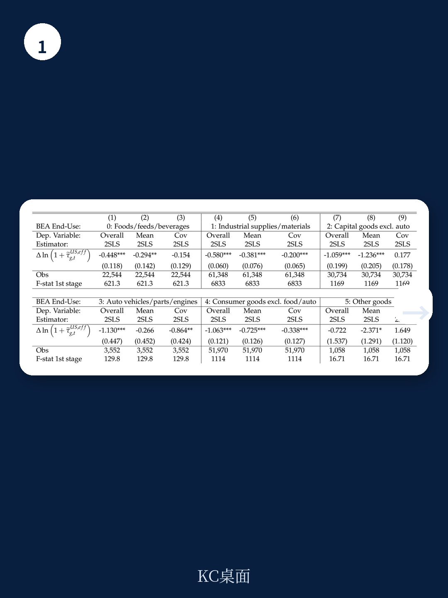
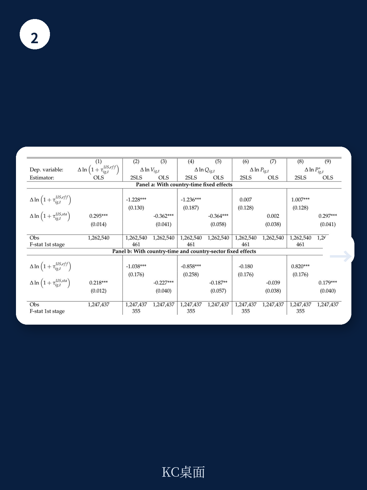

# IMF：关税传导与进口重组

2025年美国大规模加征关税后，一个反直觉的现象出现了：美国进口商品的平均价格（不含关税）不升反降。这份IMF工作论文给出了核心解释——不是出口商承担了关税，而是进口商将采购来源从高价格国家转向了低价格国家。但研究同时揭示，这种“成本节约”并非效率提升，而是质量降级。

报告基于2025年2月至12月的月度美国海关数据，覆盖HS 10位码产品层面的进口价格、数量和关税税率。作者使用法定关税作为工具变量，以解决有效关税率的潜在内生性问题。

## 1. 单个出口商的价格几乎没有调整，关税被完全传递

在品种层面（即同一产品来自同一出口国的组合），出口商价格（不含关税的FOB单位价值）对关税变化几乎没有反应。这意味着，关税每提高1个百分点，进口商在边境支付的含税价格就相应上升约1个百分点。出口商没有通过降价来分担关税成本。

这一发现与2018-19年中美贸易摩擦时期的证据一致。报告估计，2025年2月至12月间美国有效关税率平均上升约8个百分点，导致该品种层面的进口额平均下降约3.6%。关税的冲击集中在被加征关税的品种上，同一产品内不同来源国的进口出现显著分化。

> **KC评论：** 品种层面“零传递”意味着，关税的短期通胀不确定性直接体现在进口价格上。但产品层面的价格却下降了，这提示我们，只看平均价格会掩盖关税的真实分配效应。

## 2. 产品层面价格下降，驱动力是来源国重组

当把观察尺度从品种提升到产品层面（HS 10位码），结论截然不同。产品层面的平均进口价格（不含关税）与关税率呈显著负相关：关税越高的产品，其平均进口价格下降幅度越大。

分解分析显示，这种下降主要来自两个渠道。一是低价格品种的进入：关税越高的产品，新进入的美国进口品种价格越低。二是高价格品种的退出：关税越高的产品，原有高价格品种退出市场的概率越大。两个渠道共同作用，使得产品层面的平均进口价格在统计上显著下降。

报告特别指出，这种重组效应在2025年比2018-19年更为突出，说明关税规模越大，进口商调整供应链的动力越强。

## 3. 价格下降的背后是“吸引力”下降，而非效率提升

进口商转向更低价格的来源国，是否意味着找到了更高效的供应商？报告通过构建“吸引力调整后”的CES价格指数来检验这一假设。

吸引力（appeal）是一个综合指标，反映消费者对某一品种的偏好强度——如果一个品种在价格更高的情况下仍能占据更大的进口份额，就被认为具有更高的吸引力。报告使用2023-24年的数据估算每个品种的吸引力，并将其视为不随时间变化。

回归结果显示，当使用吸引力调整后的价格指数时，关税对产品层面价格的负向影响显著减弱。这意味着，名义价格下降的一部分实际上反映了进口组合向低吸引力（即低质量或低消费者偏好）品种的转移。换句话说，进口商确实找到了更便宜的来源，但这些来源的产品质量也更低。

这一结论在含税价格的分析中更加清晰。使用未调整的名义价格时，关税对含税产品价格的影响接近于零甚至为负——这似乎意味着关税没有推高消费者面对的进口价格。但使用吸引力调整后的价格后，关税对含税价格的正向影响变得显著且稳健。这表明，名义价格未上升的原因恰恰是进口商品的质量在下降。

## 4. 质量降级对生产率和福利的潜在影响

报告在结论部分谨慎指出，进口来源向低质量品种的转移可能对消费者福利和生产率产生实质性影响。尤其是当这些进口品是中间投入品时，低质量投入可能传导至下游生产环节，降低最终产品的质量或生产效率。

这一机制在2018-19年关税时期同样存在，但在2025年关税规模更大的背景下，其影响可能更为显著。报告没有量化这一福利损失，但为后续研究提供了一个清晰的因果链条：关税 -> 进口重组 -> 质量降级 -> 福利与生产率损失。

> **KC评论：** 这份报告的核心贡献在于区分了“价格下降”的两种可能：效率提升与质量降级。对于政策制定者而言，如果只关注进口价格指数，可能会误判关税的实际成本。对于企业而言，关税冲击下的供应链调整并非无代价——找到更便宜的供应商，可能意味着接受更低的质量。

For informational purposes only. Portions may be generated,translated,summarized,or edited with AI assistance based on source materials and may contain omissions or errors. Please verify independently. This is not investment,legal,tax,accounting,or other professional advice.

