# The Changing Landscape of Financial Integration in Asia-Pacific

Cristian Alonso, Tristan Hennig, Henry Hoyle, Haibo Li, Monica Petrescu, Ying Xu, and Yizhi Xu

WP/26/154

IMF Working Papers describe research in progress by the author(s) and are published to elicit comments and to encourage debate. The views expressed in IMF Working Papers are those of the author(s) and do not necessarily represent the views of the IMF, its Executive Board, or IMF management.

2026
JUL

# IMF Working Paper Asia and Pacific Department

The Changing Landscape of Financial Integration in Asia-Pacific
Prepared by Cristian Alonso, Tristan Hennig, Henry Hoyle, Haibo Li, Monica Petrescu, Ying Xu, and Yizhi Xu \*

Authorized for distribution Sonali Jain-Chandra
July 2026

IMF Working Papers describe research in progress by the author(s) and are published to elicit comments and to encourage debate. The views expressed in IMF Working Papers are those of the author(s) and do not necessarily represent the views of the IMF, its Executive Board, or IMF management.

ABSTRACT: Asia-Pacific has undergone a profound transformation over the past few decades, increasing its share in global trade and GDP. This paper assesses to what extent Asia-Pacific's role in global finance has expanded commensurately and whether it has become more integrated by systematically analyzing cross-border financial data. We combine descriptive analyses of past trends in financial positions with network analysis to understand how inter- and intra- regional financial linkages have evolved for economies in the region. We find that Asia-Pacific's role in global finance still significantly lags its role in global trade and that there is considerable heterogeneity within the region. Advanced economies in the region are well integrated into global financial markets, whereas most emerging markets exhibit more limited integration. Financial integration within the region is also low but diverges significantly by instrument. Intra-regional financial integration is advancing in foreign direct investment (FDI) and cross-border banking (the latter from low levels), but has remained limited in foreign portfolio investment (FPI). Gravity model analysis indicates a significant association between trade and FDI, but not between trade and FPI.

RECOMMENDED CITATION: Cristian Alonso, Tristan Hennig, Henry Hoyle, Haibo Li, Monica Petrescu, Ying Xu, and Yizhi Xu. 2026. "The Changing Landscape of Financial Integration in Asia-Pacific." IMF Working Paper 26/154.

<table><tr><td>JEL Classification Numbers:</td><td>F21, F36, G15</td></tr><tr><td>Keywords:</td><td>Financial integration; Foreign direct investment (FDI); Foreign portfolio investment (FPI); Cross-border banking; Gravity models; Network analysis</td></tr><tr><td>Author&#x27;s E-Mail Address:</td><td>CAlonso@imf.org, THennig2@imf.org; HHoyle@imf.org; HLi5@imf.org; MPetrescu@imf.org; YXu5@imf.org; YXu@imf.org</td></tr></table>

WORKING PAPERS

# The Changing Landscape of Financial Integration in Asia- Pacific

Prepared by Cristian Alonso, Haibo Li, Henry Hoyle, Monica Petrescu, Tristan Hennig, Ying Xu, and Yizhi Xu

## Contents

Glossary .... 3
Introduction .... 4
Asia-Pacific is not to Global Finance what it is to Global Trade .... 6
Methodological Considerations and a Primer in Network Analysis .... 8
FDI: Overall FDI Remains Low, However Intra-Regional Linkages are Growing .... 10
FPI: Limited Cross-Border Integration .... 12
Cross-Border Banking: Strong Global Links for AEs, Growing Regional Integration for EMs .... 16
Understanding Financial Positions: A Gravity Model .... 22
Conclusions .... 28
References .... 30
BOXES
1. Asia-Pacific's Financial Centers and Challenges for Capital Flow Surveillance .... 15
2. Trade and Financial Networks: Properties Compared .... 21
FIGURES
1. Asia-Pacific's Share of Selected Global Indicators: By Income Status .... 7
2. Gross Financial Account Flows as Percent of Regional GDP .... 7
3. Trade Network in Asia-Pacific .... 9
4. Eigenvector Centrality in the Trade Network .... 10
5. Country Centrality in the FDI Network .... 11
6. FDI Network in Asia-Pacific .... 12
7. Eigenvector Centrality in the CPIS Network .... 13
8. FPI Network in Asia-Pacific .... 14
9. Bank Lending to Asia-Pacific from Outside Asia-Pacific .... 16
10. Banking Lending to Outside Asia-Pacific from Asia-Pacific .... 17
11. Bank Lending to Asia-Pacific from within Asia-Pacific (Borrowers' Perspective) .... 18
12. Bank Lending to Asia-Pacific from within Asia-Pacific (Lenders' Perspective) .... 19
13. Eigenvector Centrality in the Bank Lending Network .... 20
14. Cross-Border Bank Lending Network in Asia-Pacific .... 20
15. Effects of Trade on Financial Positions .... 24
TABLES
1. Asia-Pacific's Share in Global Total of Selected Indicators (Percent) .... 6
2. Foreign Direct Investment and Foreign Portfolio Investment: Selected Measures .... 10
3. Origin-Country Domestic Factors Influencing Financial Positions .... 26
4. Destination-Country Domestic Factors Influencing Financial Positions .... 27

## Glossary

ADB: Asian Development Bank

AE: Advanced Economy

AI: Artificial Intelligence

AMRO: ASEAN+3 Macroeconomic Research Office

API: Application Programming Interface

AREAER: Annual Report on Exchange Arrangements and Exchange Restrictions

ASEAN: Association of Southeast Asian Nations

ASEAN+3: ASEAN plus China, Japan, and Korea

BIS: Bank for International Settlements

CDIS: Coordinated Direct Investment Survey

CFM: Capital Flow Management (Measures)

CPIS: Coordinated Portfolio Investment Survey

DOTS: Direction of Trade Statistics

EFI: Economic Freedom Index

EM: Emerging Market Economy

EU: European Union

FDI: Foreign Direct Investment

FPI: Foreign Portfolio Investment

FSB: Financial Stability Board

GDP: Gross Domestic Product

G-SIBs: Global Systemically Important Banks

IFC: International Financial Center

IMF: International Monetary Fund

IPF: Integrated Policy Framework

IPO: Initial Public Offering

IV: Institutional View (on Capital Flows)

ROW: Rest of the World

SAR: Special Administrative Region

WEO: World Economic Outlook

## Introduction

Asia-Pacific has undergone a profound transformation over the past few decades, increasing its share in global trade and GDP. $^{1}$ This paper assesses to what extent Asia-Pacific's role in global finance has expanded commensurately and whether it has become more integrated by systematically analyzing cross-border financial data. We combine descriptive analyses of past trends in financial positions with network analysis to understand how inter- and intra- regional financial linkages have evolved for economies in the region. We employ a gravity model to examine the interaction between trade and financial integration and identify the role of macroeconomic and policy variables in driving recent trends.

We find that Asia-Pacific's role in global finance still significantly lags its role in global trade. Importantly, while the region's overall financial integration is low—as measured by external assets and liabilities relative to GDP, this paper's primary measure of financial integration—there is considerably heterogeneity within the region. Advanced economies (AEs) in the region are well integrated into global financial markets, whereas most emerging markets (EMs) exhibit more limited integration.

Financial integration within the region is also low but diverges significantly by instrument. This points to significant potential for further intra-regional integration which could confer possible benefits from enlarged and more competitive markets for financial services and more regional diversification and external risk sharing (ADB, 2025). Intra-regional financial integration and linkages—in this paper measured through intra-regionally held cross-border assets and liabilities relative to regional GDP and network centrality scores—is advancing in foreign direct investment (FDI) and cross-border banking (the latter from low levels), but has remained limited in foreign portfolio investment (FPI). A few AEs act as primary recipients and sources of intra-regional FPI, with other economies playing a very minor role. In contrast, for FDI and cross border banking, intra-regional interlinkages are richer, with more economies engaged in intra-regional flows and multiple economies—including international financial centers – emerging as intra-regional intermediaries (henceforth referred to as ‘regional hubs’).

Trade and direct investment integration appear to reinforce each other. Gravity model analysis indicates a significant association between trade and FDI, but not between trade and FPI or cross-border banking liabilities. Thus, stronger regional trade integration would likely yield greater cross-border flows of direct investment but not necessarily of other flows such as FPI.

We conclude with policy considerations to promote resilient financial integration in Asia-Pacific as outlined in Alonso and others (forthcoming). As economies reach higher income levels and achieve domestic financial market deepening, cross-border financial integration typically deepens. Stronger financial integration can deliver benefits by reducing the cost of capital, improving risk management, enhancing efficiency in capital markets and other tradeable services, and harnessing economies of scale in regional financial hubs. Increasing FDI linkages would also raise prospects for improving productivity through technology transfer and knowledge diffusion. However, stronger financial integration can also raise risks by increasing the exposure to global shocks and the global financial cycle. Countries could aim to take advantage of the benefits of more financial integration in the region while mitigating the risks.

The remainder of the paper is organized as follows. Section II documents how Asia-Pacific's financial integration compares to its role in global trade and GDP, highlighting key cross-country and income-group heterogeneity. Section III outlines the data and methodology, including the use of network analysis to characterize regional and global financial linkages. Sections IV–VI examine cross-border integration by instrument—foreign direct investment, portfolio investment, and cross-border banking—combining descriptive evidence with network-based measures to assess the depth and structure of inter- and intra-regional connections. Section VII uses a gravity framework to explore the relationship between trade and financial positions, and to identify macroeconomic and institutional drivers of cross-border finance. Section VIII concludes.

## Asia-Pacific is not to Global Finance what it is to Global Trade

While Asia-Pacific's share in global GDP and trade has risen from less than a quarter in 2001 to a third by 2023, the pace of increase in financial integration has been slower, resulting in more limited financial integration overall. $^{2}$ Asia-Pacific's holdings of external assets and liabilities—based on IMF International Investment Position data—were only 21 and 16 percent of the global total in 2023, respectively, both up only modestly from 2001 (Table 1). Asia-Pacific's share in global FDI positions has gradually increased from 12 percent in 2009 to 20 percent in 2023, still below the region's share in global trade. Asia-Pacific's share in global FPI positions remained flat at around 14 percent since 2010. Asia-Pacific's share in cross-border banking claims has doubled over the past 15 years to a fifth in 2023, though remains well below its share in global GDP and trade. Compared to other regions, we show that Asia-Pacific's overall integration in global finance is relatively low; a finding documented in past work (Garcia-Herrero and others, 2008; Borensztein and Loungani, 2011; Ananchotikul and others, 2015, Llovet Montanes and Schmukler, 2018). $^{3}$ Unlike in those analyses, this paper also excludes positions between Hong Kong SAR and the Chinese mainland where possible. This approach makes the findings of low financial integration even more pronounced, particularly in FDI, where intra-China positions account for 30 percent of Asia-Pacific's FDI claims and 24 percent of its FDI liabilities. $^{4}$

Table 1. Asia-Pacific's Share in Global Total of Selected Indicators (Percent)

<table><tr><td></td><td>2001</td><td>2009</td><td>2019</td><td>2023</td></tr><tr><td>Trade</td><td>24</td><td>29</td><td>34</td><td>33</td></tr><tr><td>GDP</td><td>24</td><td>26</td><td>34</td><td>33</td></tr><tr><td colspan="5">External Assets and Liabilities</td></tr><tr><td>Liabilities</td><td>13</td><td>11</td><td>16</td><td>16</td></tr><tr><td>Assets</td><td>17</td><td>15</td><td>21</td><td>21</td></tr><tr><td colspan="5">By Instrument</td></tr><tr><td>Foreign Direct Investment</td><td>na</td><td>12</td><td>16</td><td>20</td></tr><tr><td>Foreign Portfolio Investment</td><td>12</td><td>12</td><td>14</td><td>14</td></tr><tr><td>Cross-Border Bank Lending</td><td>17</td><td>11</td><td>21</td><td>19</td></tr></table>

Sources: IMF World Economic Outlook, CDIS, CPIS, Bank for International Settlements, and IMF staff calculations. Note: Asia-Pacific's share of global trade and cross-border financial positions are measured in terms of aggregates of imports and exports and assets and liabilities, respectively. External assets and liabilities exclude FX reserves. FDI, FPI and bank lending exclude positions between the Chinese mainland and Hong Kong SAR.

Figure 1. Asia-Pacific's Share of Selected Global Indicators: By Income Status (Percent of global total)  
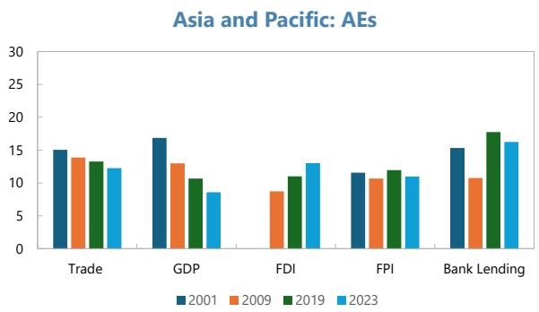

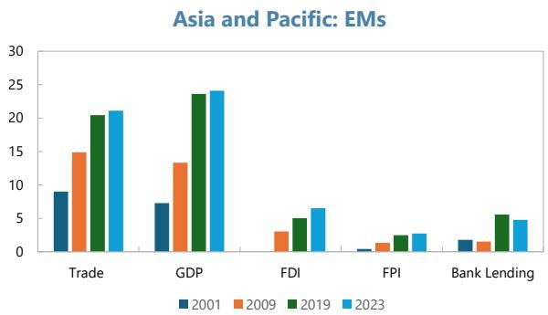  
Sources: IMF World Economic Outlook, CDIS, CPIS, Bank for International Settlements, and IMF staff calculations. Note: Asia-Pacific's share of global trade and instrument-level positions are measured in terms of aggregates of imports and exports and assets and liabilities, respectively. External assets and liabilities exclude FX reserves. FDI, FPI and bank lending exclude positions between the Chinese mainland and Hong Kong SAR.

The evolution of Asia-Pacific's financial integration varies within the region and specifically across income

groups, with Advanced Asia-Pacific increasingly well integrated and Emerging Asia-Pacific much less so. Advanced Asia-Pacific's share of global GDP and trade has decreased since the early 2000s, while its share of FDI, FPI, and cross-border banking claims has either stayed stable or grown, maintaining levels similar to those observed in GDP and trade (left panel of Figure 1). By contrast, Emerging Asia-Pacific's share of global finance has not matched its rapid growth in global GDP and trade (right panel of Figure 1). $^{5}$

Advanced Asia-Pacific's high degree of financial integration relative to Emerging Asia-Pacific is also reflected in the flows of cross-border assets and liabilities. While the stock perspective provides a more comprehensive view of financial integration, recent flow dynamics confirm that stock measures are not distorted by advanced economies' longer period of financial openness. Advanced Asia-Pacific's average annual increase in gross cross-border financial claims

Figure 2. Gross Financial Account Flows as Percent of Regional GDP (2014-2023 average) (Percent of country grouping GDP)  
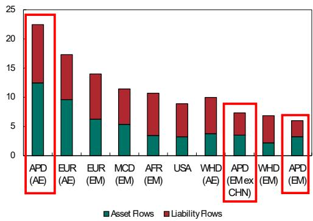

Sources: IMF World Economic Outlook and IMF staff calculations.

Note: Based on balance of payments data, which does not allow the exclusion of flows between the Chinese mainland and Hong Kong SAR.

in the decade up to 2023 (summing up cross-border asset and liabilities for FDI, FPI, and other investment) was higher than advanced economies in any other region over the same period, at 22.5 percent of GDP (Figure 2). EM Asia-Pacific's average annual increase in financial claims was the lowest of emerging markets in any

region over the same period, at 6 percent of GDP, and only slightly higher when the Chinese mainland is excluded from the country grouping. Advanced Asia-Pacific is also disproportionately responsible for the region's status as a major net exporter of capital. As measured by region-wide growth in FDI, FPI, and other investment claims less liabilities, Asia-Pacific's net capital exports roughly matched Europe's in dollar terms in the decade ending in 2023, and were about four times the size of its net accumulation of foreign exchange reserves. Advanced Asia-Pacific accounted for two-thirds of the region's net capital exports by this measure. $^{6}$

Asia-Pacific economies' capital has been geographically concentrated and largely flowed to elsewhere in Asia-Pacific and the Americas. As of 2023, 42 percent of Asia-Pacific economies' FDI claims were on other Asia-Pacific economies, while another 40 percent was roughly split between the Americas (mostly the US) and offshore financial centers in the Caribbean. Asia-Pacific economies' cross-border foreign portfolio holdings are vis-a-vis the Americas (45 percent), offshore financial centers (18 percent), and other Asia-Pacific economies (17 percent). Europe and other EMs have absorbed a relatively smaller share.

## Methodological Considerations and a Primer in Network Analysis

Before proceeding in the next sections to unpack the patterns of Asia-Pacific's financial integration in more detail by type of instrument, we briefly discuss here a few methodological choices and provide background on network analysis, with an application to trade.

This paper studies the evolution of financial integration in Asia-Pacific using a number of different data sources: (i) Balance of Payments and International Investment Position: Cross-border stocks and flows data aggregated by country; (ii) CDIS (Coordinated Direct Investment Survey): Bilateral data on foreign direct investment (FDI) positions, available since 2009; (iii) CPIS (Coordinated Portfolio Investment Survey): Bilateral data on foreign portfolio investment (FPI) positions, available since 2001, with some gaps in early 2000s (the Chinese mainland and India); (iv) DOTS (Direction of Trade Statistics): Bilateral data on imports and exports; (v) BIS Locational Banking Statistics: Bilateral data on cross-border banking exposures for select country pairs since 2005; and (vii) World Economic Outlook: Macroeconomic variables. Cross-border bank lending includes “all instruments” as defined in the BIS classification, which is dominated by loans and deposits but also includes debt securities and other instruments, some of which may overlap with FPI positions.

Network analysis offers a powerful lens to examine how economies are structurally connected through global trade and finance, and, unlike other approaches, captures both direct and indirect linkages, revealing a broader web of interdependencies. The measure of ‘centrality’, captures the importance of an individual economy (“node”) in the network of trade or financial flows, not only reflecting the strength and number of direct linkages but the extent of connectivity with other key players in the network. $^{7}$ This captures influence and systemic relevance of economies more effectively, making it particularly useful in financial networks where indirect

exposures and contagion channels matter. $^{8}$ For example, a financial center with fewer direct links may still be highly central if it connects other major hubs, indicating its potential role in amplifying or absorbing shocks. Separate from the centrality score of each individual node in the network, it is also possible to compute a ‘centralization’ score for the whole network. The centralization of the network captures the extent to which transactions in goods or financial instruments are primarily routed through a few key hubs (high centralization) or are more evenly spread among economies (low centralization). $^{9}$

Figure 3. Trade Network in Asia-Pacific  
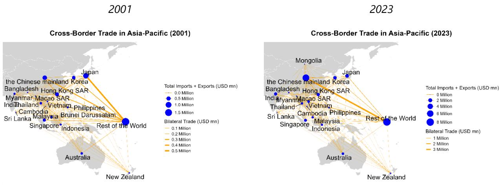  
Sources: DOTS and IMF staff estimates.

We apply this framework to the trade network, as a comparator for financial networks in the next sections. We find strong linkages within the region, but with changing roles for key players (Figure 4). Most notably, the Chinese mainland's centrality in the network expanded sharply in the late 1990s and 2000s consistent with its rapid integration into the global economy. The Chinese mainland's rise is mirrored by a reduction in Japan's centrality, which has become a distant second in relevance in the intra-regional trade network. India and ASEAN countries are generally well-integrated, with Vietnam's centrality rising especially in the 2010s. Hong Kong SAR and Singapore are much smaller players in this network than in the financial networks covered next. The trade network is not reliant on key hubs, with most economies bilaterally connected with regional counterparts, and centralization is low.

Figure 4. Eigenvector Centrality in the Trade Network  
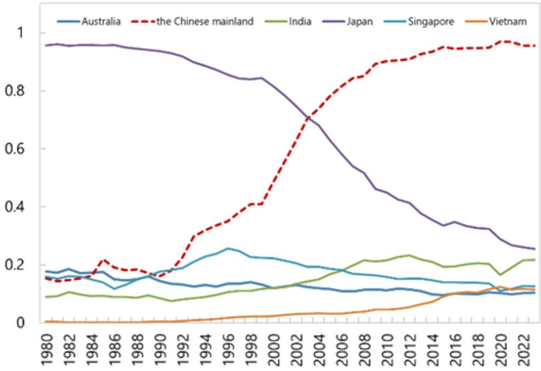  
Sources: DOTS and IMF staff estimates

## FDI: Overall FDI Remains Low, However Intra-Regional Linkages are Growing

## Table 2. Foreign Direct Investment and Foreign Portfolio Investment: Selected Measures

Foreign Direct Investment (FDI)

<table><tr><td colspan="2">In percent of regional GDP, 2023 (percent)</td><td colspan="2">Average growth rate, 2013-2023 (percent)</td></tr><tr><td>Inbound and Outbound</td><td>Intra-Regional</td><td>Inbound and Outbound</td><td>Intra-Regional</td></tr><tr><td>45</td><td>8</td><td>7</td><td>7</td></tr><tr><td>157</td><td>50</td><td>1</td><td>0</td></tr><tr><td>103</td><td>7</td><td>7</td><td>4</td></tr><tr><td>156</td><td>12</td><td>3</td><td>7</td></tr><tr><td>63</td><td>9</td><td>5</td><td>5</td></tr></table>

Foreign Portfolio Investment (FPI)

<table><tr><td colspan="2">In percent of regional GDP, 2023 (percent)</td><td colspan="2">Average growth rate, 2013-2023 (percent)</td></tr><tr><td>Inbound and Outbound</td><td>Intra-Regional</td><td>Inbound and Outbound</td><td>Intra-Region</td></tr><tr><td>59</td><td>5</td><td>6</td><td>7</td></tr><tr><td>279</td><td>86</td><td>4</td><td>2</td></tr><tr><td>80</td><td>6</td><td>8</td><td>6</td></tr><tr><td>108</td><td>2</td><td>4</td><td>10</td></tr><tr><td>152</td><td>33</td><td>9</td><td>12</td></tr></table>

Source: CDIS, CPIS, WEO, and IMF staff calculations

Note: Heat map colors indicate percentile value within a given column, with red equivalent to lower percentiles and green equivalent to higher percentiles. Asia-Pacific excludes FDI and FPI positions between the Chinese mainland and Hong Kong SAR. Growth rates are calculated based on US dollar values. Country groupings are based on IMF area department coverage.

Aggregate FDI in Asia-Pacific—summing up each country's inbound and outbound positions—remains comparatively low relative to regional GDP. Asia-Pacific's aggregate FDI positions were just 45 percent of GDP, compared to over 100 percent of GDP for Africa, Europe, and the Middle East and North Africa (Table 2, left panel).

Aggregate FDI in Asia-Pacific has nonetheless grown faster than in most regions in the decade ending in 2023 (Table 2). Notably, while there was a broad slowdown in global FDI post-COVID, Asia-Pacific remained less affected (United Nations, 2024). As such, Asia-Pacific's share in global FDI positions has expanded (Table 1). The resiliency of Asia-Pacific's FDI reflects the rapid growth of the region's economy, as well as its increasing participation in global trade, which is closely associated to FDI as is shown later in this working paper.

FDI positions between countries in the region are likewise smaller in Asia-Pacific than elsewhere, but are expanding. Intra-regional FDI stock amounted to about 8 percent of regional GDP in 2023 (Table 2). While this is far below Europe, which is unsurprisingly highly integrated by this intra-regional FDI measure, it is still slightly less than that in Africa, the Americas, and slightly above that in the Middle East and Central Asia. Nonetheless, intra-regional FDI has continued to grow in Asia-Pacific even as it has contracted relative to GDP in the rest of the world. In dollar terms, growth in intra-regional FDI in Asia-Pacific over the last decade has been faster than other regions except Africa.

Figure 5. Country Centrality in the FDI Network  
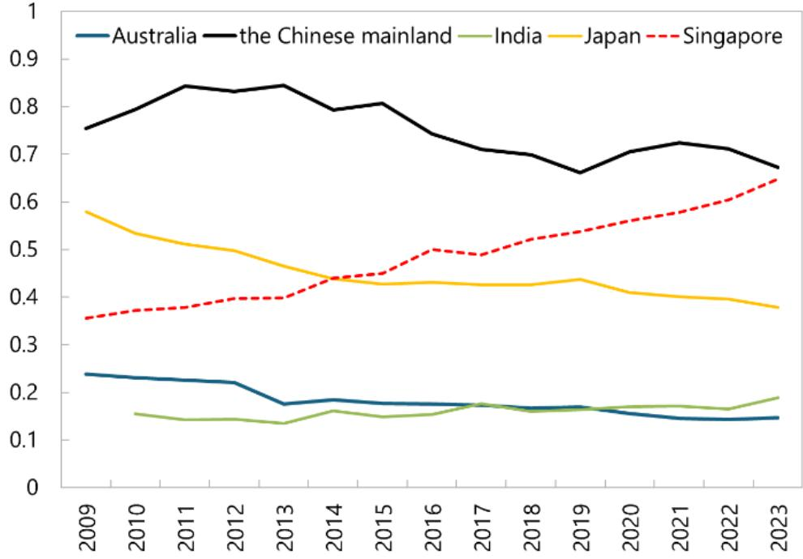  
Sources: CDIS and IMF staff estimates.

While FDI exposures are not large compared to other regions, network analysis reveals that FDI interconnections between regional economies are widespread, without reliance on a single central hub (much like with trade connections). This is consistent with findings of stronger links between trade and FDI than between trade and other financial instruments, as assessed in our empirical analysis below. While some economies serve the role of regional hubs for FDI (e.g., Singapore), other economies are also developing significant intra-regional positions (e.g., India and ASEAN countries). $^{10}$ Moreover, many smaller economies are bilaterally connected with a large number of regional counterparts, and not only with the regional hubs. As a result, centralization in the FDI network and trade networks is fairly low relative to that in other financial instruments. Within this decentralized FDI network, the Chinese mainland remains the most central node, in part reflecting its rapid growth in investments throughout the region. $^{11}$ Its importance as a source or destination in the Asia-Pacific FDI inter-regional network has nevertheless declined slightly over the past 15 years, a decrease likely attributable to a reduction in FDI into the Chinese mainland. $^{12}$

Figure 6. FDI Network in Asia-Pacific  
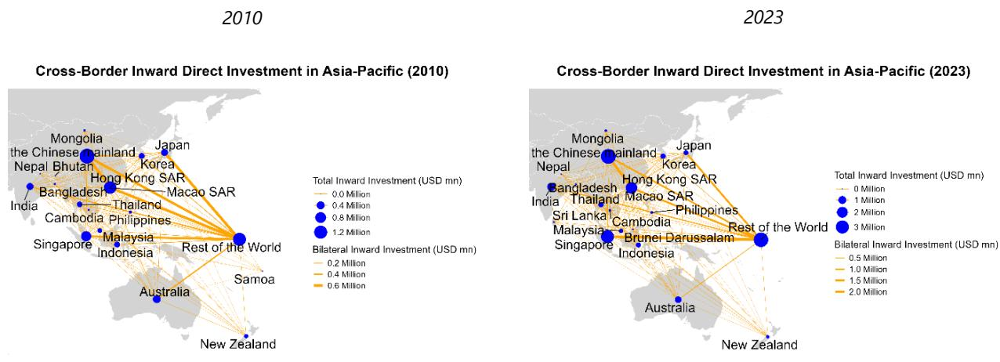  
Sources: CDIS and IMF staff estimates.

## FPI: Limited Cross-Border Integration

Asia-Pacific stands out globally for its relatively small stock of foreign portfolio investment relative to GDP. Gross FPI claims in Asia-Pacific —summing up each country's inbound and outbound positions—were 59 percent of regional GDP in 2023 while other regions range from 80 to 280 percent of GDP (Table 2). $^{13}$ Low FPI integration is driven in large part by Emerging Asia-Pacific, where many countries have capital controls, macroprudential regulations, or other measures that aim to limit excessive private external borrowing, in part reflecting the region's adverse experiences with past global market volatility. $^{14}$

Equity investment is more prevalent than debt among portfolio positions, both as assets and liabilities for the region. Over time, on the asset side, Asia-Pacific's portfolio investments both globally and within Asia-Pacific, experienced a larger increase in equity investments than debt investments, especially after the Global Financial Crisis when the total holding of equity investments surpassed debt investments. $^{15}$ On the liability side, global investors seem to hold more Asia-Pacific equities than Asia-Pacific debt securities historically (Shirai and Sugandi, 2018). By 2023, the total global holding of Asia-Pacific equity investments is almost twice the total holding of Asia-Pacific debt investments. Similarly, the share of non-residents participating in domestic debt markets in the region has been declining. While part of this trend is likely explained by narrower interest rate differentials in recent years, the persistently low level of portfolio integration suggests that structural factors are also at play.

The FPI that has come to the region is largely from advanced economies and financial centers and has not been evenly distributed. Advanced Asia-Pacific economies remain the main destinations of portfolio investments from outside Asia-Pacific, even though their share has declined from about 80 percent to 60 percent in the past 20 years. India and the Chinese mainland became a significant destination of portfolio investments over the past decades, but the Chinese mainland's share has shrunk slightly since the pandemic. ASEAN countries other than Singapore saw their share of this FPI increase until the early 2010s, reaching its highest point in 2012, and has decreased subsequently.

Asia-Pacific's intra-regional portfolio positions remain modest at just 5 percent of regional GDP in 2023 and have exhibited limited growth (Llovet Montanes and Schmukler, 2018). By comparison, the proportion is sixfold higher in the Americas and more than sixteen times higher in Europe, and in both cases has risen rapidly since the 2000s.

Figure 7. Eigenvector Centrality in the CPIS Network  
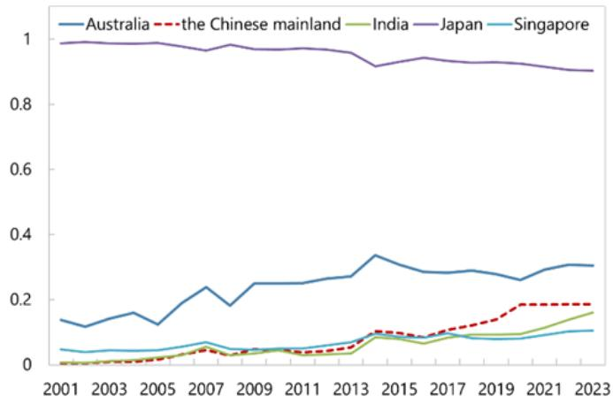  
Sources: CPIS and IMF staff estimates.

Network analysis reveals that FPI intra-regional linkages are very limited. Portfolio investment exposures within the region are firmly dominated by select AEs, and thus the network is highly centralized (Figure 7 and Figure 8). Japan remains by far the largest recipient and source in the network, even though its centrality has declined slightly over the past two decades as other regional players emerged. Australia is the second most significant economy in terms in intra-regional exposures and its role has been expanding gradually. The exposures of the Chinese mainland and India have grown but remain small, and the role of the former appears to have stagnated since 2019.

Figure 8. FPI Network in Asia-Pacific  
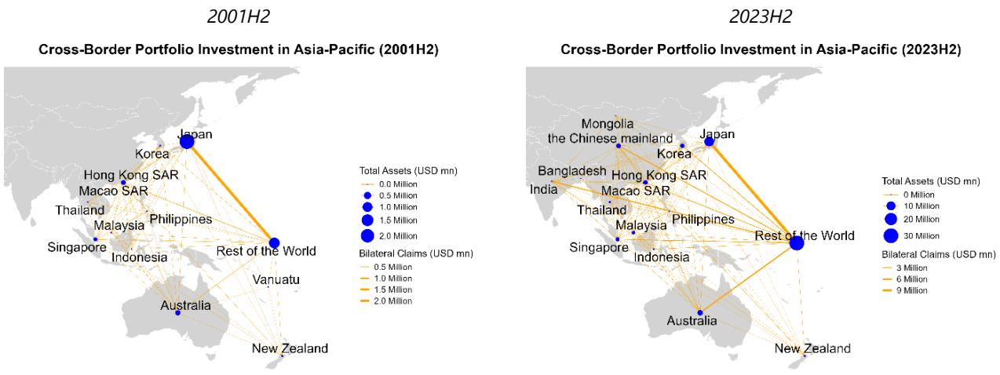  
Sources: CPIS and IMF staff estimates.

From a low base, Asia-Pacific's bond markets are showing slightly more intra-regional integration. Asia-Pacific countries' portfolio debt claims are still mostly on countries outside the region, but the share of claims on other Asia-Pacific countries has grown from 13 percent in 2012 to 20 percent in 2023. This reflected a notable slowing in Asia-Pacific countries' accumulation of portfolio debt claims on non-Asia-Pacific countries, particularly after 2018, led by a drawdown in European bond positions. Likewise, non-regional investors' share of Asia-Pacific's cross-border debt liabilities dropped slightly from 2013 to 2023, most notably in AEs and IFCs. $^{16}$

## Box 1. Asia-Pacific's Financial Centers and Challenges for Capital Flow Surveillance

Hong Kong SAR and Singapore, Asia's International Financial Centers (IFCs), play an increasingly important role in the region's financial integration of the region, particularly in FDI. Asia-Pacific's IFCs have accounted for more than half of total growth in inbound and outbound FDI positions from 2013-2023. Their share of FPI position growth over the same period was around 20 percent.

As noted in Coppola and others (2021) and Daamgard (2019), IFCs can pose complications for capital flow surveillance and assessments of financial integration. Specifically, IFCs' financial intermediation function can obscure the true source and destination of capital flows in standard data, overstate linkages to real economic activity (in the case of FDI into shell companies), and in some cases, the nature of the financial claim (e.g. when an international company issues bonds in an IFC but repatriates the funds through an FDI transaction). While this paper uncovers evidence of the salience of these data issues for Asia-Pacific's case, it leaves deeper exploration to future analysis.

Box Figure: Increase in Asia-Pacific's FDI and FPI stock by selected investment pairs, for 2013-2018 and 2018-2023 (In billions of US dollars)  
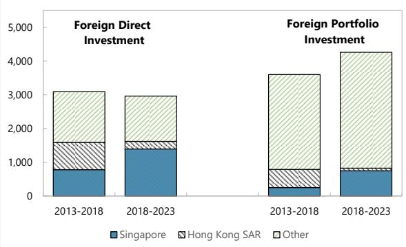

Source: CDIS, CPIS, and IMF staff calculations.
Note: Data shown captures five-year change in aggregated inbound and outbound investment positions of Asia-Pacific countries. Data for Hong Kong SAR and Singapore show aggregated inbound and outbound positions for each economy. Positions between Hong Kong SAR and Singapore are apportioned evenly to the two economies. Positions between the Chinese mainland and Hong Kong SAR are excluded from the data.

## The increasing prevalence of the IFCs in the

region—and the ubiquity of holding companies and funds in that network—points to growing potential for data gaps that complicate assessments of financial integration and links between financial and real activity. The majority of FDI investments into IFCs represent financial investments into holding companies or funds, which may not be directly linked to real economic activity in that region (e.g. if it redirects Malaysian capital to Europe via a private equity structure) or at all (e.g. if it establishes ownership links between networks of special purpose entities) (Daamgard, 2019). In Hong Kong SAR, over two-thirds of outbound and inbound FDI positions are investment and holding companies. In Singapore, investment and holding companies make up 50 and 62 percent of outbound and inbound FDI positions, respectively, but have grown rapidly, with most of its net growth in FDI from 2020 to 2023 into investment and holding companies.

## Cross-Border Banking: Strong Global Links for AEs, Growing Regional Integration for EMs

In this section, we explore changes in cross-border banking using BIS Locational Banking Statistics. We find that certain Asia-Pacific advanced economies are now prominent hubs for international banking, significantly influencing activities both within Asia-Pacific and globally. Meanwhile, in Asia-Pacific emerging markets, domestic banks still drive economic growth through lending, with cross-border lending playing a less significant role. While overall integration may be limited, there are several large Asia-Pacific banks with global presence. In particular, eight of the 29 Global Systemically Important Banks in 2024 are headquartered in Asia-Pacific, including five in China and three in Japan (BIS, 2024).

Asia-Pacific AEs have deepened their global cross-border banking integration over the last 20 years. Cross-border bank lending (stocks) to AEs in Asia-Pacific from outside the region has risen steadily from under 15 percent of borrower GDP in 2005 to over 30 percent by 2024, strongly outpacing economic growth; in nominal terms, amounts have nearly tripled over the same period (left panel of Figure 9). Asia-Pacific AEs have also become major sources of cross-border bank lending to other regions, with inter-regional claims increasing from under 2.3 percent of outside borrowers' GDP in 2005 to nearly 3.5 percent by 2024 (left panel of Figure 10). As of 2024, Asia-Pacific AEs had lent 2.6 trillion dollars to other regions. During the last two decades, lending from Asia-Pacific AEs to the United States grew the most, followed by lending to other advanced economies outside the region, while lending to the European Union and the United Kingdom increased moderately. Although lending from Asia-Pacific AEs to emerging markets outside the region recorded a higher growth rate than lending to advanced economies outside the region, the level remains very low relative to other regions. Among Asia-Pacific AEs, Japan and Hong Kong SAR are the largest hubs for inter-regional cross-border bank claims.

Figure 9. Bank Lending to Asia-Pacific from Outside Asia-Pacific  
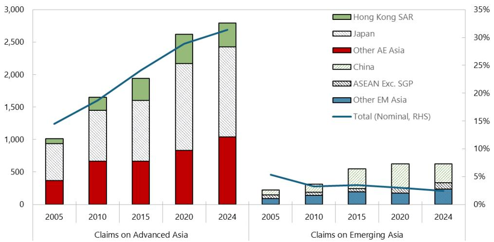  
Sources: BIS Banking Locational Statistics and IMF staff calculations.

Note: Bars denote the nominal value of claims received by each category in millions of U.S. dollars (left-hand y-axis); Lines denote the total claims on each group as a percentage of borrowers' GDP.

Figure 10. Banking Lending to Outside Asia-Pacific from Asia-Pacific  
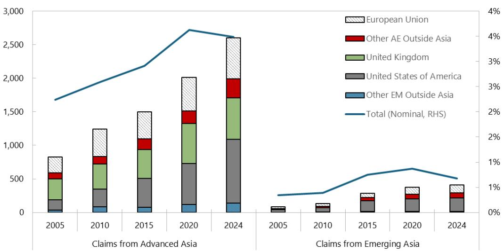  
Sources: BIS Banking Locational Statistics and IMF staff calculations.  
Note: Bars denote the nominal value of claims received by each category in millions of U.S. dollars (left-hand y-axis); Lines denote the total claims from each group as a percentage of borrowers' GDP.

EMs in Asia-Pacific are much less integrated into global cross-border banking networks. Cross-border bank lending to Asia-Pacific EMs from outside the region is much lower than that for Asia-Pacific AEs in percent of borrower GDP (right panel of Figure 9). It has not kept up with the region's rapid GDP growth, declining to just under 3 percent by 2024, a tenth of the level for AEs. In nominal terms, lending to Asia-Pacific EMs has risen from 0.2 trillion dollars in 2005 to 0.6 trillion in 2024. Among EMs, the Chinese mainland is the largest recipient of inter-regional cross-border lending, while the UK and Europe remain key sources of funding. Over the past two decades, Asia-Pacific EMs' lending to outside the region recorded a higher growth rate than that of Asia-Pacific AEs, though from a much lower base; it increased from approximate 0.3 percent of outside borrowers' GDP in 2005 to nearly 0.7 percent by 2024 (right panel of Figure 10). Lending to the United States and to other AEs outside the region experienced higher growth, followed by those to the UK and the European Union. Compared with the other country groups, EMs from outside the region received very little lending from Asia-Pacific EMs.

Intra-regional cross-border bank lending is becoming increasingly important for AEs, especially as borrowers. For Asia-Pacific AEs, borrowing from within the region nearly tripled as a percent of borrower GDP between 2005 to 2024, reaching 24 percent of GDP in 2024, although it remains lower than borrowing from outside the region (left panel of Figure 11). However, in terms of the percentage of borrowers' GDP, lending from Asia-Pacific AEs to Asia-Pacific economies plateaued (left panel of Figure 12). Lending from Asia-Pacific AEs to the Chinese mainland, Hong Kong SAR and ASEAN (excluding Singapore) grew rapidly between 2010 and 2015, but growth markedly slowed thereafter.

Intra-regional cross-border bank lending is also becoming increasingly important for EMs, especially as lenders, albeit from a low base. For Asia-Pacific EMs, intra-regional borrowing has also grown substantially in nominal terms over the same period, broadly keeping pace with borrower GDP growth (right panel of Figure 11). However, intra-regional cross border borrowing by EMs remains low overall. It has fluctuated around 2 percent of borrower GDP. In contrast to the plateaued lending from Asia-Pacific AEs to Asia-Pacific economies, lending from Asia-Pacific EMs to the region has been growing rapidly, with claims increasing from approximate 0.4 percent of borrowers' GDP in 2005 to more than 2.1 percent by 2024 (right panel of Figure 12). Notably, significant increase occurred between 2015 and 2020, mostly driven by lending to other advanced economies in the region, while lending to Japan and ASEAN also rose significantly.

Figure 11. Bank Lending to Asia-Pacific from within Asia-Pacific (Borrowers' Perspective)  
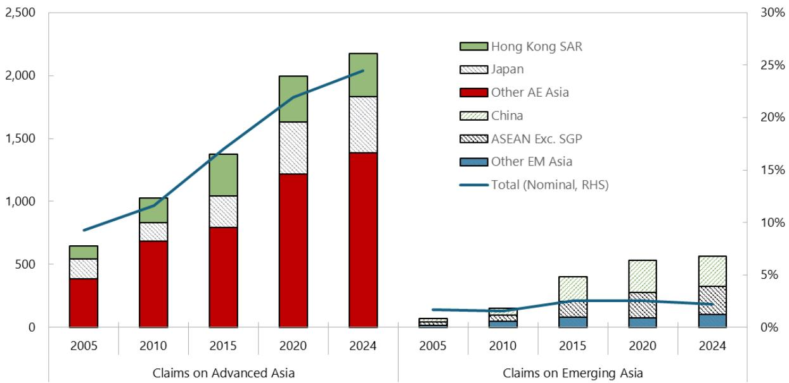  
Sources: BIS Banking Locational Statistics and IMF staff calculations.  
Note: Bars denote the nominal value of claims received by each category in millions of U.S. dollars (left-hand y-axis); Lines denote the percentage of claims in borrowers' GDP. The claim nexus between the Chinese mainland and Hong Kong SAR has been excluded.

Figure 12. Bank Lending to Asia-Pacific from within Asia-Pacific (Lenders' Perspective)  
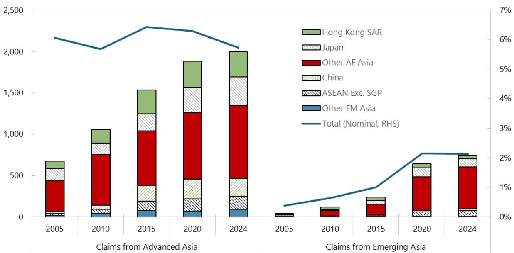  
Sources: BIS Banking Locational Statistics and IMF staff calculations.

Note: Bars denote the nominal value of claims in millions of U.S. dollars (left-hand y-axis); Lines denote the percentage of claims in borrowers' GDP. The claim nexus between the Chinese mainland and Hong Kong SAR has been excluded.

The intra-regional cross-border banking network is becoming less centralized. While cross-border banking within Asia-Pacific used to be dominated by a few economies, it has been marked by the emergence and growth of additional regional hubs in the last two decades, which have chipped away at the role of the most dominant economies (Figure 13). Hong Kong SAR has overtaken Japan and Singapore in relative importance as the primary regional hub. Japan remains a key source of cross-border bank lending, and maintains strong global connections, but its relative regional relevance has declined as other centers emerged. Singapore has remained steady as another key banking hub in the region, while Australia's growing importance in the network partly reflects connections with Pacific economies. The Chinese mainland's presence within the regional banking network has also grown in significance. The banking network has become less centralized over time as more regional hubs have grown in significance, although does not exhibit the same level of integration as trade and FDI networks, which also see many more substantive bilateral connections between smaller players (Figure 14).

Figure 13. Eigenvector Centrality in the Bank Lending Network  
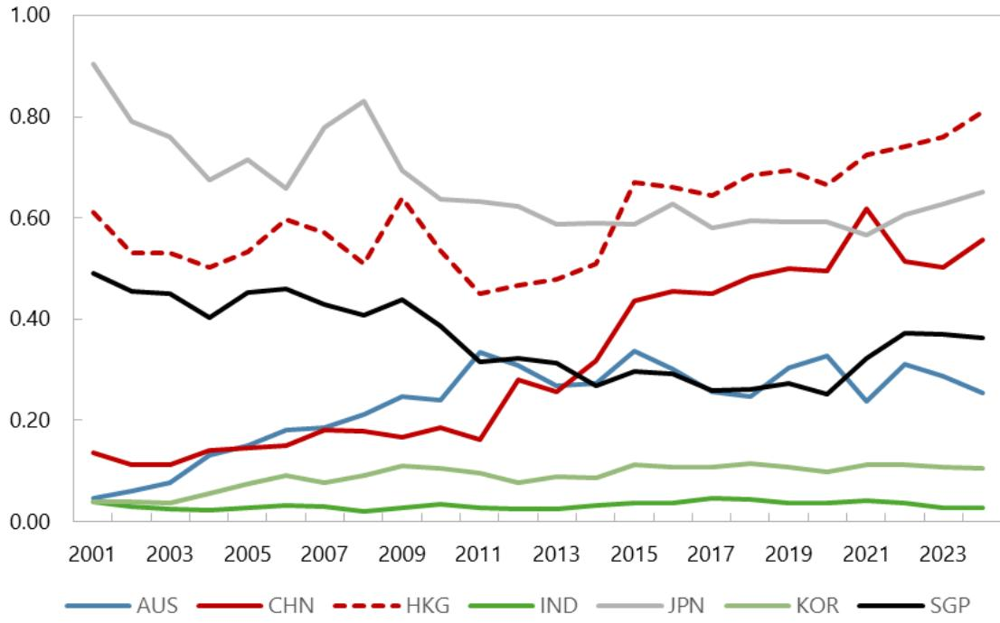  
Sources: BIS Banking Locational Statistics and IMF staff estimates.

Figure 14. Cross-Border Bank Lending Network in Asia-Pacific
2005
2024  
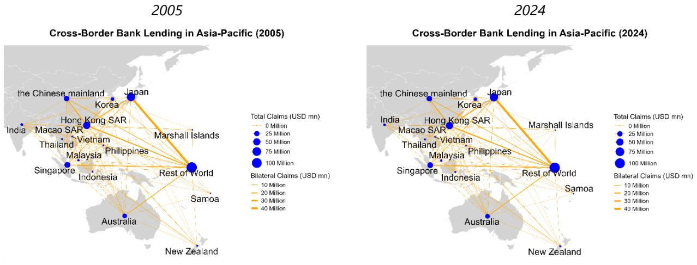  
Sources: BIS Banking Locational Statistics and IMF staff estimates.

## Box 2. Trade and Financial Networks: Properties Compared

This box delves deeper into two additional network properties. Centralization is a network-level measure of how unevenly centrality is distributed across nodes; high centralization means the network is organized around one or a few hubs (star-like), while low centralization means centrality is more evenly spread. Assortativity describes whether nodes tend to connect to similar nodes; high assortativity means that high centrality nodes (hubs) have the strongest connections with other high centrality nodes (and likewise for low centrality (peripheral) nodes) while low assortativity means that the strongest connections are between high and low centrality nodes.

Despite the long timeframes, overall changes in the assortativity and centralization of the four networks we study in this paper have been small. Dispersion can be observed primarily along the centralization dimension, with the portfolio network the most and FDI and trade the least centralized, confirming results from visual inspection earlier in the paper. In terms of dynamics, the bank lending network stands out as having become somewhat less centralized over time while the degree of centralization in the other networks has changed little. In the assortativity dimension, one observation is that all four networks have increased in assortativity over time, suggesting that connections between hubs and periphery countries have become weaker relative to hub-hub and periphery-periphery connections. However, keeping in mind that assortativity ranges from -1 to 1, the overall movements are still small in magnitude.

## Box Figure: Asia-Pacific Trade and Financial Network Properties

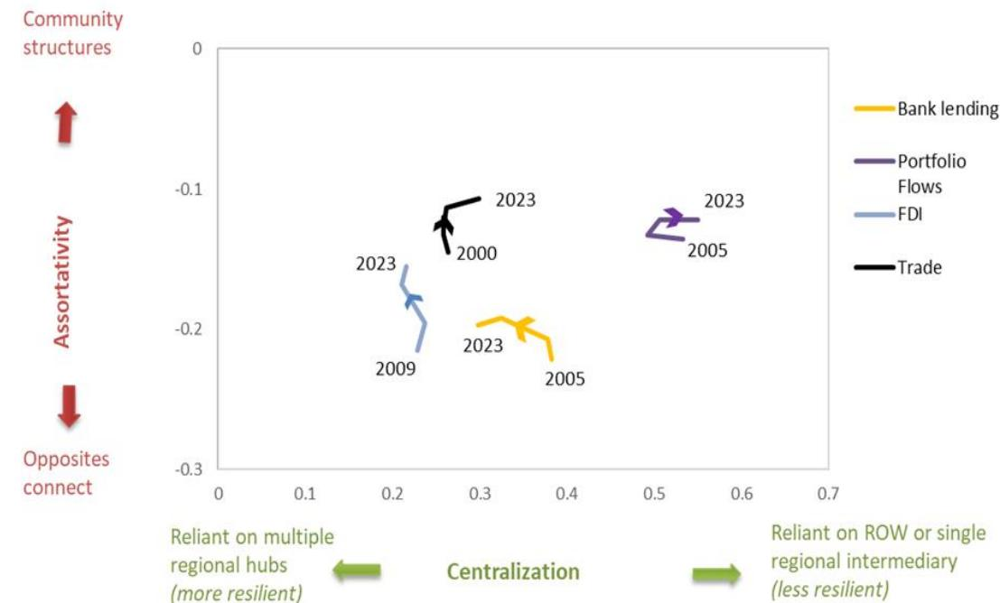  
Sources: CDIS, CPIS, DOTS, BIS Banking Locational Statistics and IMF staff estimates.

# Understanding Financial Positions: A Gravity Model

In this section, we investigate the relationship between trade and financial linkages using a gravity model. Beyond trade, we also look at the role of other drivers for cross-border financial positions. The goal of this analysis is to gain a better understanding of what determines the financial linkages between countries that have been fleshed out in the other sections of this paper. Looking ahead, given the ongoing restructuring of global trade and supply chains, a relevant question in this regard is whether changes in trade patterns could portend changes in asset allocation.

## Empirical Methodology

We construct a cross-country bilateral financial positions and trade database using the CDIS, CPIS, BIS Locational Banking Statistics, and DOTS and proceed in two steps. First, we build a gravity model for financial positions with trade flows as explanatory variable while controlling for other static and time-varying factors through multiple types of fixed effects. Second, we regress the fixed effects obtained in the first stage on various macroeconomic and policy variables to explore how economic and institutional factors correlate with cross-border financial positions. $^{17}$

Gravity models are considered workhorse tools for examining bilateral economic interactions such as trade, investment, migration, and cross-border financial linkages (Yotov et al., 2016). The underlying logic is analogous to Newton's law of gravitation: the intensity of interaction between two countries tends to rise with their economic size (GDP) and tends to decline with greater geographic or economic separation. Although the model was initially conceived to explain trade flows, the literature has shown that it is equally effective in accounting for cross-border financial transactions (Portes and Rey, 2005; Okawa and van Wincoop, 2012).

Recent research has applied the model to analyze how geoeconomic fragmentation shape global trade and finance, including contributions by Gopinath et al. (2024) and Catalan et al. (2024). In this same spirit, and in contrast to the canonical trade-gravity model which models trade as the dependent variable, we include trade flows as an explanatory variable for financial positions in the following specification:

$$
X _ {i j, t} = e x p \left[ \sum_ {k = 0} ^ {2} \beta_ {k} l o g (T r a d e _ {i j, t - k}) + \mu_ {i, t} + \delta_ {j, t} + \varphi_ {i, j} \right] + \varepsilon_ {i j, t}\tag{1}
$$

where, $X_{ij,t}$ are the levels of different bilateral financial positions of origin country i on destination country j, including outward FDI, portfolio assets (debt, equity, and total) and outward bank lending. $^{18}$

$\sum_{k=0}^{2} \log(Trade)_{ij,t-k}$ denotes the contemporaneous, one-period lagged, and two-period lagged log trade, where trade is measured as the sum of imports and exports between countries $i$ and $j$ . Therefore $\sum_{k=0}^{2} \beta_k$ measures the correlation between trade flows and financial positions. As recommended by Yotov et al. (2016), we include country-time fixed effects of both origin country i and destination country j ( $\mu_{i,t}$ and $\delta_{j,t}$ ) to absorb all the domestic factors specific to each country at each point in time and common across its counterparts, such as economic growth, interest rates, policy mix, and country risk. We also include asymmetric country–pair fixed effects ( $\varphi_{i,j}$ ) to capture all time-invariant bilateral factors between the two countries, such as distance, contiguity, common language, and colonial ties, while allowing for asymmetries in how these factors affect financial positions. Thus, our “fully saturated” specification captures the effect of trade on financial positions after accounting for a very rich set of other factors. We estimate (1) using the Poison Pseudo-Maximum Likelihood estimator for unbalanced panels and cluster standard errors at the country-pair level (Correia et al., 2020).

In the second step, we regress the fixed effects estimated in (1) on macroeconomic and policy variables to understand the role of other factors on financial positions. In particular, we regress the country-time fixed effects of origin country $(\mu_{i,t})$ and destination country $(\delta_{j,t})$ on their domestic macroeconomic conditions and institutional metrics:

$$
\mu_ {i, t} = \mathrm{B} _ {o} M a c r o \_ o r i _ {i, t} + \Gamma_ {o} I n s t i t u t i o n a l \_ o r i _ {i, t} + \zeta_ {i} + \kappa_ {t} + \upsilon_ {i, t}\tag{2}
$$

$$
\delta_ {j, t} = \mathrm{B} _ {d} M a c r o \_ d e s _ {j, t} + \Gamma_ {d} I n s t i t u t i o n a l \_ d e s _ {j, t} + \eta_ {j} + \kappa_ {t} + \tau_ {j, t}\tag{3}
$$

In equation (2), $Macro\_ori_{i,t}$ represents a series of domestic macroeconomic variables in the origin country, including log real GDP, real short-term interest rate, fiscal balance measured as percentage of GDP, and current account balance measured as percentage of GDP, and $B_o$ represents their coefficient vector. $Institutional\_ori_{i,t}$ denotes a series of institutional variables in the origin country, including financial development as measured by the Global Financial Development Database of the World Bank (Sahay et al., 2015), capital flow controls as measured by category “XI. Capital Transactions” in the IMF’s AREAER database (IMF, 2024), and economic freedom in government and money as measured by the Fraser Institute’s Economic Freedom Index (Gwartney et al., 2023). $\Gamma_o$ represents their coefficient vector. In addition, $\zeta_i$ includes country fixed effects to capture static country characteristics and $\kappa_t$ controls for global time trends through year fixed effects. Equation (3) is the mirror of equation (2), examining the domestic factors influencing the financial positions in the destination country.

We set a high standard for significance of these drivers by clustering at the country-of-origin and country-of-destination, respectively. This modeling choice allows for arbitrary correlation of shocks across counterparts and over time. We prefer this conservative approach, even when it comes at the expense of larger standard errors and lower statistical power and significance. $^{19}$

## First-Stage Results: The Link Between Trade and Financial Positions

We document a strong link between trade and FDI, but not with other financial instruments. Figure 15 presents the results obtained by estimating (1), where the bars show the sum of the coefficients of the contemporaneous, one-period lag and two-period lag trade for different financial instruments. The lines indicate 95 percent confidence intervals. Trade flows are significantly positively correlated with the outward FDI position. A one percent increase in trade flows between the origin and destination country is associated with an increase in the stock of outward FDI of 0.14 percent. Meanwhile, the results also show that trade flows are not significantly associated with all other financial positions. A one percent increase in trade is associated with higher crossborder bank lending by 0.05 percent, but the result is not statistically significant. The coefficients are smaller and not statistically significant for portfolio investments. Thus, while stronger trade and FDI links are mutually reinforcing, there is no clear relationship between trade and portfolio investments or bank lending. $^{20}$ Trade integration may facilitate direct investment (or vice versa), but this does not necessarily translate into broader financial integration. $^{21}$

Figure 15. Effects of Trade on Financial Positions  
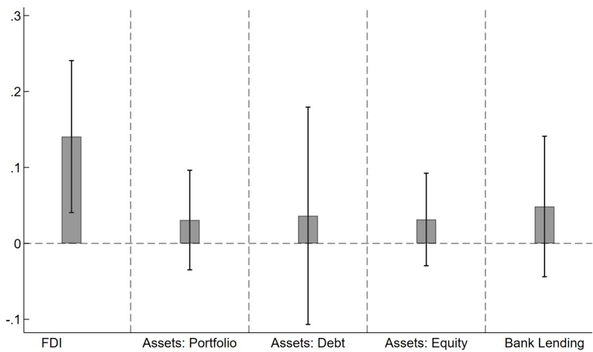  
Sources: CDIS, CPIS, DOTS, BIS Banking Locational Statistics and IMF staff estimates.
Note: Bars represent the estimated coefficients, and lines represent the 95% confidence interval based on standard errors clustered at the country-pair level.

## Second-stage Results: Domestic Drivers of Financial Positions

We then examine the relationship between financial positions and other factors absorbed in the gravity model using a second-stage regression. Table 3 and Table 4 report the results of estimating equations (2) and (3), respectively. In both tables, the first four rows capture the correlations between financial positions and domestic macroeconomic factors, while the following rows capture the correlation with institutional factors, including financial development, capital controls, and economic freedom in two areas. The dependent variables in both cases are the financial positions of the origin country in the destination country.

Economic size strongly correlates with financial positions. The log real GDP in both the origin and destination countries are significantly and positively associated with bilateral financial positions except bank lending for the origin country. That is consistent with the intuition that more developed economies tend to be more financially integrated with other economies, accumulating stronger cross-border positions. This is consistent with Corbacho and Peiris (2018).

Real short-term rates are positively correlated with cross-border financial positions both in the origin and destination economies, although some of the relationships are not statistically significant. In the destination economy, it is intuitive that higher domestic real interest rates enhance the expected returns on their financial assets, and so leads to higher cross-border inflows. The result is less intuitive for the origin economy. However, it may reflect that higher domestic real interest rates raise the incentive for saving in the origin economy, leading to higher accumulation of assets both domestically and internationally.

We do not find strong statistical significance for current account balances, but the signs are intuitive. Greater past current account surpluses typically correlate with larger financial positions in source countries and smaller financial positions in recipient countries, which is consistent with their balancing role wherein changes in the current account reflect changes in net foreign assets. However, the statistical significance is weak for most categories, except for FDI and equity. Thus, the results suggest that past current account deficits are associated with accumulated foreign liabilities, particularly significant FDI inward positions.

Fiscal deficits predict the stock of inward liabilities in portfolio debt. Higher fiscal surplus in the destination country is significantly associated with smaller inward bank lending, reflecting stronger public finances reducing the need for foreign financing of government borrowing. For the origin country, higher fiscal surplus is associated with lower financial positions overseas, although the relationship is not statistically significant. Given that we are already controlling for the current account balance, a higher fiscal surplus would imply lower private savings net of investment, and so, less resources to invest financially abroad.

Financial development affects FPI and cross-border banking positions, but not so much FDI. Stronger financial development in the origin country is associated with larger outward cross-border financial positions across all asset classes, particularly significant for FPI in portfolio equity and bank lending. In contrast, stronger financial development in the destination country is only significantly associated with larger inward bank lending position, but not for inward FDI and FPI in equity, which appear driven more by real-economy fundamentals and investment regimes than by domestic financial development.

Capital flow management remains relatively tight in the Asia-Pacific region with mixed effects in financial positions. The composite index of capital flows management measures (CFMs) (IMF, 2024) shows that while the region has eased CFMs since 2000, it remains one of the most restrictive regions (second only to sub-Saharan Africa). Significant controls remain on liquidation of direct investment, real estate transactions, and personal capital transactions. Capital flow freedom, defined as fewer controls, in both the origin and destination countries is positively associated with bilateral cross-border financial positions except for bilateral FDI, although all the relationships are not statistically significant at 10 percent, except for FPI and equity FPI in the origin country. This pattern is consistent with the intuition that fewer restrictions on cross-border transactions tend to be associated with larger FPI positions. The relationship between capital flow freedom and bilateral FDI is negative, likely because FDI is more strongly driven by other long-horizon fundamentals.

Other institutional factors also play a key role in determining financial positions. We consider economic freedom in government and money as measured by the Fraser Institute's Economic Freedom Index. For both indices, greater values indicate the economy is more economically free in the corresponding sphere.

A smaller government in the destination country is positively associated with all the inward financial positions but equity, reflecting the attractiveness for foreign investors of an institutional environment with a smaller state footprint, although the relationships are not statistically significant at 10 percent confidence. A smaller government in the origin country is also associated with larger outward portfolio and equity positions, suggesting that a more liberal institutional environment facilitating cross-border financial allocation, but again the correlation is not significant.

Sounder money in the origin country is significantly associated with greater outward FPI in portfolio, reflecting greater domestic price stability and fewer restrictions on holding and transacting in foreign currency, which facilitate overseas portfolio diversification. $^{22}$ In the destination country, the relationships between soundness of money and inward positions are mixed and insignificant.

Table 3. Origin-Country Domestic Factors Influencing Financial Positions

<table><tr><td>Independent Variables</td><td>(1) FDI from origin to destination</td><td>(2) Assets: Portfolio from origin to destination</td><td>(3) Assets: Debt from origin to destination</td><td>(4) Assets: Equity from origin to destination</td><td>(5) Bank Lending from origin to destination</td></tr><tr><td rowspan="2">Ln Real GDP</td><td>0.580**</td><td>1.208***</td><td>0.862**</td><td>1.622***</td><td>0.117</td></tr><tr><td>(0.284)</td><td>(0.397)</td><td>(0.379)</td><td>(0.383)</td><td>(0.189)</td></tr><tr><td rowspan="2">Real Short-term Interest Rate</td><td>0.001</td><td>0.008***</td><td>0.008***</td><td>0.006**</td><td>0.003***</td></tr><tr><td>(0.001)</td><td>(0.002)</td><td>(0.002)</td><td>(0.003)</td><td>(0.001)</td></tr><tr><td rowspan="2">Current Account (% GDP)</td><td>0.004</td><td>0.008</td><td>0.003</td><td>0.007</td><td>0.003</td></tr><tr><td>(0.004)</td><td>(0.006)</td><td>(0.006)</td><td>(0.008)</td><td>(0.004)</td></tr><tr><td rowspan="2">Fiscal Budget (% GDP)</td><td>-0.005</td><td>-0.002</td><td>-0.004</td><td>-0.001</td><td>-0.007</td></tr><tr><td>(0.005)</td><td>(0.007)</td><td>(0.008)</td><td>(0.008)</td><td>(0.006)</td></tr><tr><td rowspan="2">Financial Development Index</td><td>0.212</td><td>1.623***</td><td>0.721</td><td>2.332**</td><td>1.420**</td></tr><tr><td>(0.503)</td><td>(0.585)</td><td>(0.597)</td><td>(0.880)</td><td>(0.623)</td></tr><tr><td>Capital Flow</td><td>-0.098</td><td>0.295*</td><td>0.157</td><td>0.597*</td><td>0.122</td></tr><tr><td>Freedom</td><td>(0.181)</td><td>(0.168)</td><td>(0.149)</td><td>(0.323)</td><td>(0.222)</td></tr><tr><td rowspan="2">EFI: Size of Government</td><td>0.027</td><td>0.083</td><td>-0.019</td><td>0.105</td><td>-0.078**</td></tr><tr><td>(0.058)</td><td>(0.110)</td><td>(0.120)</td><td>(0.100)</td><td>(0.034)</td></tr><tr><td rowspan="2">EFI: Soundness of Money</td><td>0.008</td><td>0.099**</td><td>0.089</td><td>0.128*</td><td>0.022</td></tr><tr><td>(0.037)</td><td>(0.048)</td><td>(0.060)</td><td>(0.072)</td><td>(0.024)</td></tr><tr><td>Country fixed effect</td><td>Y</td><td>Y</td><td>Y</td><td>Y</td><td>Y</td></tr><tr><td>Year fixed effect</td><td>Y</td><td>Y</td><td>Y</td><td>Y</td><td>Y</td></tr><tr><td>R2</td><td>0.983</td><td>0.977</td><td>0.968</td><td>0.972</td><td>0.973</td></tr><tr><td>Observations</td><td>78,033</td><td>103,574</td><td>88,699</td><td>78,728</td><td>96,244</td></tr></table>

Note: Standard errors clustered by origin country are shown in parentheses. \* p<0.10, \*\* p<0.05, \*\*\* p<0.01.

Table 4. Destination-Country Domestic Factors Influencing Financial Positions

<table><tr><td>Independent Variables</td><td>(1) FDI from origin to destination</td><td>(2) Assets: Portfolio from origin to destination</td><td>(3) Assets: Debt from origin to destination</td><td>(4) Assets: Equity from origin to destination</td><td>(5) Bank Lending from origin to destination</td></tr><tr><td rowspan="2">Ln Real GDP</td><td>0.965***</td><td>1.879***</td><td>2.379***</td><td>1.212***</td><td>0.684***</td></tr><tr><td>(0.283)</td><td>(0.339)</td><td>(0.420)</td><td>(0.296)</td><td>(0.202)</td></tr><tr><td>Real Short-term</td><td>0.004</td><td>0.007**</td><td>0.012*</td><td>0.003</td><td>0.002</td></tr><tr><td>Interest Rate</td><td>(0.003)</td><td>(0.004)</td><td>(0.006)</td><td>(0.003)</td><td>(0.002)</td></tr><tr><td>Current Account</td><td>-0.005**</td><td>-0.011</td><td>-0.008</td><td>-0.012*</td><td>-0.005</td></tr><tr><td>(% GDP)</td><td>(0.003)</td><td>(0.007)</td><td>(0.009)</td><td>(0.007)</td><td>(0.004)</td></tr><tr><td>Fiscal Budget</td><td>0.003</td><td>-0.010</td><td>-0.015</td><td>0.003</td><td>-0.011*</td></tr><tr><td>(% GDP)</td><td>(0.004)</td><td>(0.009)</td><td>(0.013)</td><td>(0.008)</td><td>(0.006)</td></tr><tr><td>Financial Development</td><td>-0.402</td><td>0.440</td><td>1.428</td><td>-0.255</td><td>1.666***</td></tr><tr><td>Index</td><td>(0.543)</td><td>(0.691)</td><td>(0.886)</td><td>(0.570)</td><td>(0.580)</td></tr><tr><td>Capital Flow</td><td>-0.082</td><td>0.174</td><td>0.013</td><td>0.332</td><td>0.159</td></tr><tr><td>Freedom</td><td>(0.127)</td><td>(0.195)</td><td>(0.315)</td><td>(0.204)</td><td>(0.159)</td></tr><tr><td rowspan="2">EFI: Size of Government</td><td>0.039</td><td>0.121</td><td>0.183</td><td>-0.014</td><td>0.024</td></tr><tr><td>(0.045)</td><td>(0.089)</td><td>(0.125)</td><td>(0.083)</td><td>(0.044)</td></tr><tr><td rowspan="2">EFI: Soundness of Money</td><td>-0.008</td><td>-0.001</td><td>-0.044</td><td>0.025</td><td>0.009</td></tr><tr><td>(0.027)</td><td>(0.051)</td><td>(0.059)</td><td>(0.039)</td><td>(0.029)</td></tr><tr><td>Country fixed effect</td><td>Y</td><td>Y</td><td>Y</td><td>Y</td><td>Y</td></tr><tr><td>Year fixed effect</td><td>Y</td><td>Y</td><td>Y</td><td>Y</td><td>Y</td></tr><tr><td>R2</td><td>0.966</td><td>0.946</td><td>0.916</td><td>0.944</td><td>0.969</td></tr><tr><td>Observations</td><td>71,258</td><td>80,441</td><td>71,073</td><td>65,924</td><td>99,366</td></tr></table>

Note: Standard errors clustered by destination country are shown in parentheses. \* p<0.10, \*\* p<0.05, \*\*\* p<0.01.

## Conclusions

Asia-Pacific does not hold the same position in global finance as it does in international trade. Although the region's share of global financial flows and foreign direct investment is growing—particularly intra-regionally—its participation in portfolio investments and cross-border bank lending remains comparatively limited. While AEs in Asia-Pacific are strongly integrated with global financial markets, Asia-Pacific EMs continue to lag peers in other regions. While our analysis does not directly assess the factors behind this trend, we do find evidence that Asia-Pacific's trade-oriented growth models appear more conducive to FDI integration, rather than integration of portfolio investment or bank flows. As Asia-Pacific continues to grow and its financial markets continue to develop, we expect to see stronger cross-border financial position accumulate, as has already been the case for the region's AEs.

Indeed, stronger financial integration can benefit economies in the region, especially EMs, but progress needs to be balanced with mitigation of the associated vulnerabilities. The policy considerations outlined below are consistent with themes emphasized in recent IMF work on financial integration and resilience in Asia and the Pacific (Alonso and others, forthcoming).

Financial integration can deliver substantial economic gains. It expands access to financing and lowers the cost of capital, which can stimulate growth and job creation (Obstfeld, 1994). For emerging markets, it can support a transition from export-led growth to a model centered on domestic investment and consumption. Integration can also encourage the development of domestic financial markets, reducing overreliance on banks (Levine, 1997), enhancing both macro and financial resilience (BIS, 2024; IMF, 2025), and strengthening capital markets discipline and governance (Rajan and Zingales, 2003; Kose et al., 2009). From a risk management perspective, it enables investors to diversify portfolios and helps local borrowers preserve access to financing during localized economic shocks (Colacito and Croce, 2010). The evolution of regional financial hubs can help augment access to liquidity and generate economies of scale. FDI may facilitate the diffusion of knowledge, including technological or managerial know-how and on-the-job training (Borensztein and others, 1998; Berthelemy and Demurger, 2000).

However, deeper financial integration also brings vulnerabilities. It increases exposure of the domestic economy and financial system to regional and global shocks, as well as shifts in global investor sentiment. The resilience of financial networks becomes critical as integration increases (Gai and Kapadia, 2010); in this context, the presence of multiple hubs (such as the roles played by financial centers Singapore and Hong Kong SAR in the region), instead of a single hub, can help reduce exposure to localized shocks in a systemic economy. Policymakers must also navigate complex cross-country regulatory differences, which can hinder coordination and oversight. Moreover, effective risk analysis is often constrained by data gaps and the opaque routing of financial flows through multiple financial centers.

Rising protectionism and geoeconomic fragmentation across the world threaten Asia-Pacific's cross-border financial integration. Barriers to trade and FDI can dampen cross-border flows of capital. Geopolitical tensions have been found to affect portfolio investment allocations (Catalan and others, 2024; Gopinath and others, 2025). Fostering integration within the region can help navigate complex global dynamics.

To harness the benefits of financial integration while mitigating its risks, policymakers could consider a balanced and forward-looking strategy. This could include maintaining up-to-date financial sector regulations, implementing well-calibrated macroprudential policies, and strengthening supervisory frameworks to ensure systemic stability. Effective risk monitoring requires addressing data gaps—particularly around non-bank financial institutions and the ultimate source and destination of investments. Gradual liberalization of capital transactions could be pursued in tandem with continued progress in cross-border payment infrastructure to facilitate smoother financial flows. Important preconditions for gradual capital account liberalization, include domestic financial market deepening, strong macroprudential frameworks, exchange rate flexibility, and adequate reserve buffers, with such reforms being especially important for EMs. Real-time cross-border payments, open banking and API-based ecosystems, and the use of AI and blockchain in trade finance could materially reshape regional financial integration. Regional cooperation can be enhanced by expanding intra-regional swap lines to bolster the financial safety net and by aligning regulatory standards in areas such as investor protection, dispute resolution, and bankruptcy procedures. Finally, the IMF's Integrated Policy Framework (IPF) and Institutional View (IV) on capital flows offers guidance on how capital flow management measures could be used judiciously to mitigate volatility.

## References

Allen, F., and D. Gale. 2000. "Financial Contagion." Journal of Political Economy 108 (1): 1–33.

Alonso, C., T. Hennig, H. Hoyle, H. Li, M. Petrescu, Y. Xu, and Y. Xu. Forthcoming. "The Changing Landscape of Financial Integration in Asia and Pacific." In Shaping the Future of Asia: Opportunities and Challenges, edited by R. Anand, T. Helbling, and K. Srinivasan. International Monetary Fund.

Ananchotikul, N., S. Piao, and E. Zoli. 2015. Drivers of Financial Integration: Implications for Asia. International Monetary Fund.

Asian Development Bank (ADB). 2025. Asian Economic Integration Report 2025: Harnessing the Benefits of Regional Cooperation and Integration. March.

ASEAN+3 Macroeconomic Research Office (AMRO). 2022. Capital Flow Management and Macroprudential Policy Measures in the ASEAN+3: A Database. Background Paper PPP/22–03.

Bank for International Settlements (BIS). 2024. “Towards Liquid and Resilient Government Debt Markets in EMEs.” BIS Quarterly Review, March.

Berthélemy, J.-C., and S. Demurger. 2000. “Foreign Direct Investment and Economic Growth: Theory and Application to China.” Review of Development Economics 4 (2): 140–155.

Borensztein, E., J. De Gregorio, and J.-W. Lee. 1998. "How Does Foreign Direct Investment Affect Economic Growth?" Journal of International Economics 45 (1): 115–135.

Borensztein, E., and P. Loungani. 2011. Asian Financial Integration: Trends and Interruptions. IMF Working Paper 11/4, International Monetary Fund, Washington, DC.

Capelle D. and B. Pellegrino. 2025. "Unbalanced Financial Globalization." NBER Working Paper 34121.

Catalan, M., S. Fendoglu, and T. Tsuruga. 2024. A Gravity Model of Geopolitics and Financial Fragmentation. IMF Working Paper.

Colacito, R., and M. M. Croce. 2010. “The Short- and Long-Run Benefits of Financial Integration.” American Economic Review 100 (2): 527–531.

Correia, S., P. Guimarães, and T. Zylkin. 2020. “Fast Poisson Estimation with High-Dimensional Fixed Effects.” The Stata Journal 20 (1): 95–115.

Corbacho, A., and S. J. Peiris. 2018. The ASEAN Way: Sustaining Growth and Stability. International Monetary Fund.

Elliott, M., B. Golub, and M. O. Jackson. 2014. "Financial Networks and Contagion." American Economic Review 104 (10): 3115–3153.

Financial Stability Board (FSB). 2024. 2024 List of Global Systemically Important Banks (G-SIBs). Basel, November 26.

https://www.fsb.org/2024/11/2024-list-of-global-systemically-important-banks-g-sibs/

Fung, L. K.-P., C.-S. Tam, and I.-W. Yu. 2008. “Assessing the Integration of Asia’s Equity and Bond Markets.” In Regional Financial Integration in Asia: Present and Future, BIS Papers No. 42, 83–113. Bank for International Settlements.

Gai, P., and S. Kapadia. 2010. “Contagion in Financial Networks.” Proceedings of the Royal Society A 466 (2120): 2401–2423.

Garcia-Herrero, A., D. Yang, and P. Wooldridge. 2008. Why Is There So Little Regional Financial Integration in Asia? BIS Working Papers No. 42. Basel.

Gopinath, G., P.-O. Gourinchas, A. F. Presbitero, and P. Topalova. 2025. “Changing Global Linkages: A New Cold War?” Journal of International Economics 153: 104042.

Gwartney, J., R. Lawson, and R. Murphy, with M. Abubaker, A. Celico, A. R. Hammond, F. McMahon, and M. Rode. 2023. Economic Freedom of the World: 2023 Annual Report. Fraser Institute.

International Monetary Fund (IMF). 2024a. Annual Report on Exchange Arrangements and Exchange Restrictions 2023. Monetary and Capital Markets Department.

——. 2024b. People's Republic of China: Selected Issues. IMF Country Report No. 24/276. August.

——. 2025a. Singapore: Selected Issues. IMF Staff Country Reports No. 193.

——. 2025b. Global Shocks, Local Markets: The Changing Landscape of Emerging Market Sovereign Debt. Global Financial Stability Report, Chapter 3, October.

——. 2025c. Asia and Pacific Regional Economic Outlook. Navigating Trade Headwinds and Rebalancing Growth. Chapter 3: Investment Efficiency and Capital Allocation: The Role of Financial Structure, October.

Kim, S., and J. Lee. 2008. Real and Financial Integration in East Asia. Working Paper Series on Regional Economic Integration No. 17. Asian Development Bank.

Kose, A., E. Prasad, K. Rogoff, and S.-J. Wei. 2009. "Financial Globalization: A Reappraisal." IMF Staff Papers 56 (1): 8–62.

Levine, R. 1997. “Financial Development and Economic Growth: Views and Agenda.” Journal of Economic Literature 35 (2): 688–726.

Liu, L. 2016. “The Empirical Evidence on Government Bond Market Integration in East Asia.” East Asian Economic Review 20 (1): 37–65.
https://doi.org/10.11644/KIEP.JEAI.2016.20.1.304

Llovet Montanes, R., and S. L. Schmukler. 2018. Financial Integration in East Asia and Pacific: Regional and Interregional Linkages. World Bank Research and Policy Brief No. 126031.

Nier, E., J. Yang, T. Yorulmazer, and A. Alentorn. 2007. "Network Models and Financial Stability." Journal of Economic Dynamics and Control 31 (6): 2033–2060.

Okawa, Y., and E. Van Wincoop. 2012. "Gravity in International Finance." Journal of International Economics 87 (2): 205–215.

Pellegrino, B., E. Spolaore, and R. Wacziarg. 2025. “Barriers to Global Capital Allocation.” The Quarterly Journal of Economics 140(4): 3067–3131. November,

Portes, R., and H. Rey. 2005. "The Determinants of Cross-Border Equity Flows." Journal of International Economics 65 (2): 269–296.

Rajan, R., and L. Zingales. 2003. “The Great Reversals: The Politics of Financial Development in the Twentieth Century.” Journal of Financial Economics 69 (1): 5–50.

Sahay, R., et al. 2015. Rethinking Financial Deepening: Stability and Growth in Emerging Markets. International Monetary Fund.

Shirai, S., and E. A. Sugandi. 2018. Cross-Border Portfolio Investment and Financial Integration in Asia and the Pacific Region. ADBI Working Paper No. 841.

Tan, J. 2024. How Widespread Is FDI Fragmentation? IMF Working Paper No. 179.

United Nations. 2024. World Investment Report 2024: Investment Facilitation and Digital Government.

Yotov, Y. V., R. Piermartini, and M. Larch. 2016. An Advanced Guide to Trade Policy Analysis: The Structural Gravity Model. WTO iLibrary.

