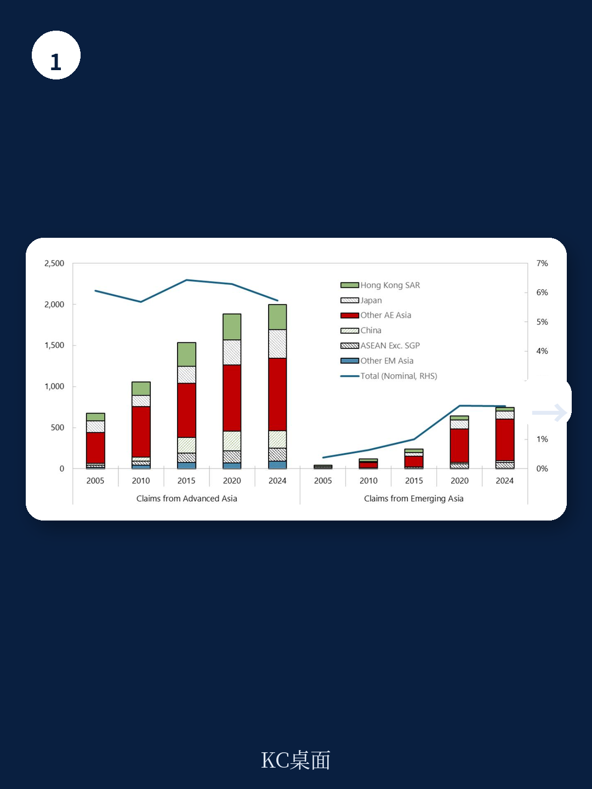
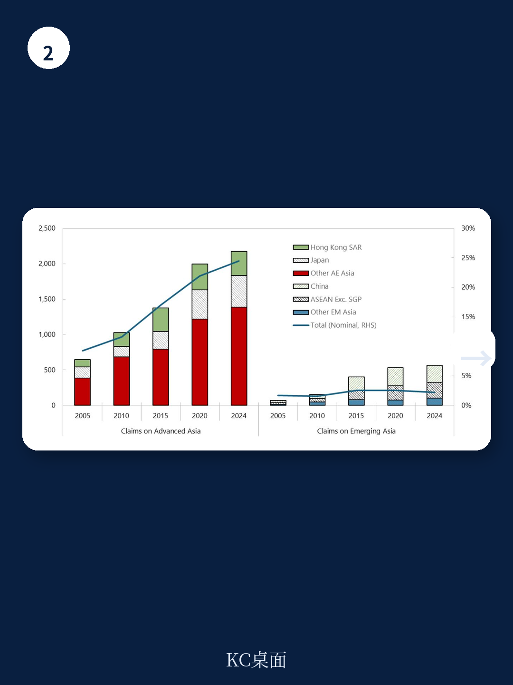

# IMF：亚太资金一体化格局的变迁

亚太地区贡献了全球三分之一的贸易和GDP，但在全球资金版图中的存在感却远不成比例。IMF最新工作论文《亚太资金一体化格局的变迁》用一套系统性的跨境资金数据分析得出一个核心判断：亚太在全球资金中的角色，显著落后于其在全球贸易中的角色。这种落差不是暂时的，而是结构性的，且在不同地区和不同资金工具之间呈现出高度异质性。

报告特别指出，如果剔除中国内地与香港之间的双向头寸——这部分在亚太FDI资产中占30%、负债中占24%——亚太资金一体化的真实程度比表面数据还要低。换言之，区域内部的资金联系，很大一部分是单一地区内部的资金循环，而非真正意义上的跨境融合。

## 1. 先进地区与新兴市场之间，出现了一条资金“断层线”

亚太内部的资金一体化水平，按地区收入水平出现了明显分化。报告用外部资产和负债占GDP的比例作为资金一体化的主要衡量指标，发现亚太先进地区的资金一体化程度已经接近甚至超过其贸易一体化水平。日本、澳大利亚、新加坡等地区的跨境资金头寸占全球比重，与其GDP和贸易份额基本匹配。

但新兴亚太地区的情况完全不同。尽管这些地区在全球GDP和贸易中的占比从2001年的不到四分之一跃升至2023年的三分之一，其资金一体化程度却远未跟上。以2014至2023年的平均流量来看，新兴亚太地区每年的跨境资金资产和负债增量仅相当于其GDP的6%，是所有新兴市场区域中最低的。而亚太先进地区同期的这一数字是22.5%，甚至高于其他区域的先进地区。

> **KC评论：** 这一差距意味着，亚太新兴市场在全球资金体系中的“接入深度”仍然有限。它们更多是通过贸易渠道参与全球化，而非通过资本流动渠道。这既是不确定性隔离，也是发展瓶颈。

## 2. FDI和银行信贷在“走近”，但标的研究几乎原地踏步

报告按资金工具拆解后发现，亚太区域内部的资金一体化在不同领域进展不一。外商直接研究和跨境银行信贷的区域内联系正在增强，但标的研究领域的区域内融合几乎停滞。

FDI方面，亚太地区42%的对外直接研究头寸投向了区域内其他地区，且网络分析显示，多个地区——包括国际资金中心——正在成为区域内的“中介枢纽”。跨境银行信贷的区域内联系虽然起点较低，但增长显著，尤其是新兴市场之间的银行借贷网络正在变得更为密集。

然而，标的研究的情况截然不同。亚太地区持有的跨境标的研究头寸中，只有17%投向区域内其他地区，而45%投向了美洲（主要是美国），18%投向了加勒比离岸资金中心。报告用网络中心度指标进一步证实：在标的研究网络中，只有少数几个先进地区扮演核心角色，大多数新兴市场的参与度极低。

## 3. 贸易和资金之间的“传导链”只对FDI有效

报告还通过引力模型检验了贸易与各类资金头寸之间的关系。结果发现，贸易与FDI之间存在显著的正向关联——两个地区之间的贸易往来越密切，其FDI头寸也越大。但贸易与标的研究、跨境银行负债之间没有发现类似的统计关联。

这一发现对政策制定者有直接含义。如果区域贸易一体化继续深化，最可能受益的是直接研究，而非标的研究或银行信贷。换句话说，贸易不会自动“溢出”到所有资金领域。那些希望通过加强贸易联系来带动区域资本市场融合的设想，可能需要在标的研究领域单独设计机制。

> **KC评论：** 贸易和FDI之间的强关联，某种程度上反映了供应链驱动的研究逻辑——企业在哪里生产，就在哪里研究。但标的研究的决策逻辑完全不同，它更多受制于资本市场深度、信息披露质量、汇率可兑换性等制度因素。这些不是贸易协议能解决的。

## 4. 资金一体化不是终点，而是需要管理的双刃剑

报告在结论部分提出了一个审慎的政策框架。一方面，更深的资金一体化可以降低资本成本、改善不确定性管理、提升资本市场效率，FDI的增加还能通过技术转移和知识扩散提高生产率。另一方面，更强的资金联系也会放大对全球冲击和全球资金周期的暴露。

对亚太新兴地区而言，挑战在于如何在推进资金一体化的同时，建立足够的缓冲和不确定性管理工具。报告指出，随着地区收入水平提高和国内市场深化，跨境资金一体化通常会自然加深。但这一过程并非自动平稳——它需要配套的宏观审慎政策、资本流动管理工具，以及足够稳健的机构能力。

亚太的资金一体化故事，目前还只写了上半章。下半章怎么写，取决于各地区如何在开放与稳定之间找到自己的平衡点。
