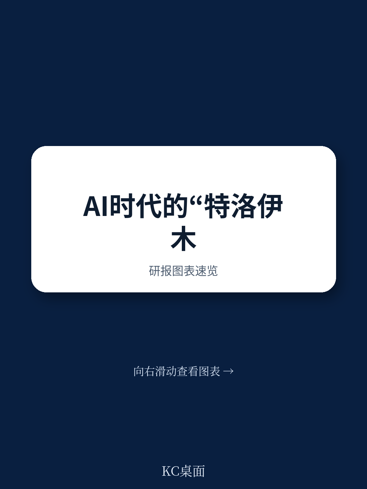
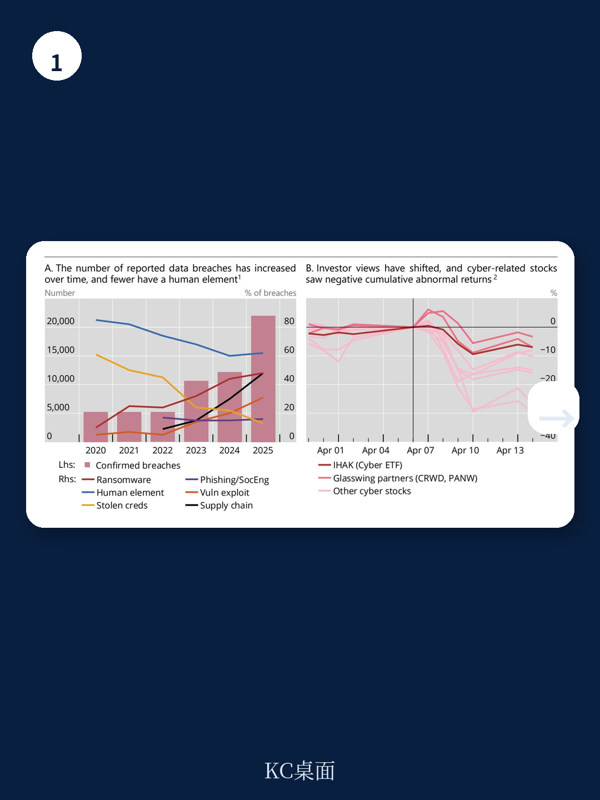
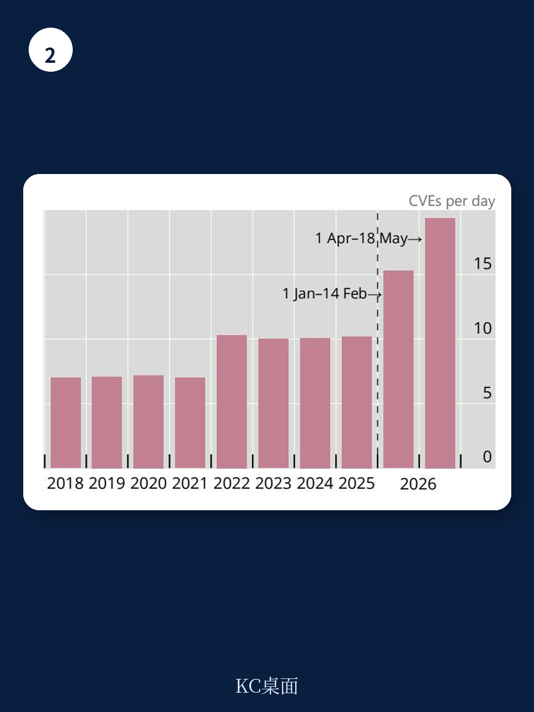

# 国际清算银行：前沿AI与网络风险的Mythos时刻

2026年4月7日，Anthropic发布Mythos模型，随后几周内OpenAI的GPT-5.5也公开上线。国际清算银行（BIS）最新Bulletin认为，这组事件可能构成一个“Mythos时刻”——一个迫使资金基础设施重新评估网络韧性的转折点。报告的核心判断是：前沿AI模型同时增强了攻击和防御能力，但成本结构不对称，天平可能向攻击方倾斜。

BIS的论证基于一组可核验的测试数据。英国AI安全研究院（AISI）的评估显示，Mythos在专家级网络攻防任务中的通过率达到68.6%，GPT-5.5更高，为71.4%。在32步企业网络攻击模拟中，两个模型都在部分尝试中实现了完整的网络接管。一次完整攻击链消耗约1亿个token，按当前云服务价格计算，使用Mythos的成本约为5000至10000美元，而使用DeepSeek等更便宜的模型，成本可低至50至100美元。

> **KC评论：** 关键不在于模型能否找到漏洞——这早已不是新闻。真正的转折点是模型能自主完成多步骤、多漏洞的连续攻击，且成本正在快速下降。这意味着攻击者不再需要顶尖人力，资金门槛也在降低。

## 1. 防御方已在行动，但修复速度能否持续仍是未知数

BIS观察到，Mythos发布后，Firefox浏览器的月度安全漏洞修复量跃升了六倍。更宏观的数据也指向同一方向：每日新增的关键级通用漏洞披露（CVSS评分9.0及以上）数量，从2018至2021年的约7个，升至2022至2025年的10个，2026年4月后进一步跳升至近20个。

报告谨慎指出，这些数字不能完全归因于AI能力提升——软件产业规模扩大和安全研究社区增长也是重要因素。但时间节点上的跳跃，与GitHub Copilot（2021年6月）、OpenAI API（2020年6月）以及2026年的Mythos等工具发布高度吻合。一个开放问题是：修复速度是否会保持结构性高位，还是会随着已知漏洞被清理而回落。这取决于新模型能否持续发现新的攻击路径。

## 2. 市场给出了一个反直觉的信号

Mythos发布后，多家网络安全公司的公司出现了显著的累计异常负回报。BIS指出，这一市场反应值得注意——更危险的威胁环境按理应推高安全产品的需求，但读者似乎更担心现有产品和服务被淘汰。

这个信号揭示了一个深层矛盾：防御方需要保护每一个系统，而攻击方只需要一条可行路径。即使双方以相同速度采用前沿AI，降低漏洞发现和利用成本的工具，仍可能使攻击方获得不对称优势。市场情报还显示，防御策略可能需要投入更多算力来应对更廉价、更频繁的攻击。

## 3. 短期行动有明确优先级，长期框架需要重新设计

BIS认为，短期内最紧迫的行动是确保防御方在攻击方之前获得前沿模型访问权。资金行业、央行和监管机构可以与国家安全机构合作，加速漏洞修复，强化核心网络卫生实践，并更新演练场景以模拟第三方软件被攻破的情况。

从更长期看，现有韧性框架需要适应AI塑造的新威胁环境。BIS建议，标准制定机构可以将现有原则转化为极端场景设计工具包，并随威胁演变持续更新。对于系统性重要的资金基础设施，运营方应参与新AI模型的预测试。跨境信息共享机制也需要重新校准，以提高时效性、互惠性和法律保护。

报告特别强调，支付、交易和结算平台规模巨大、互联紧密，软件栈复杂且供应链漫长，一旦被攻破，检测和恢复都极为困难。这些基础设施正是意图造成大规模宏观环境损失的攻击者的首选目标。
