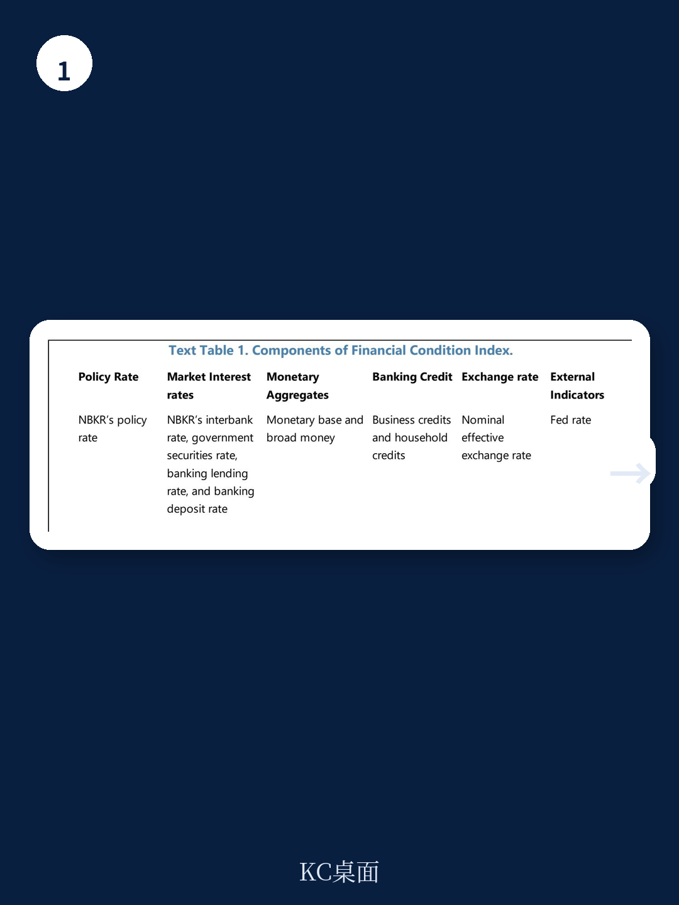
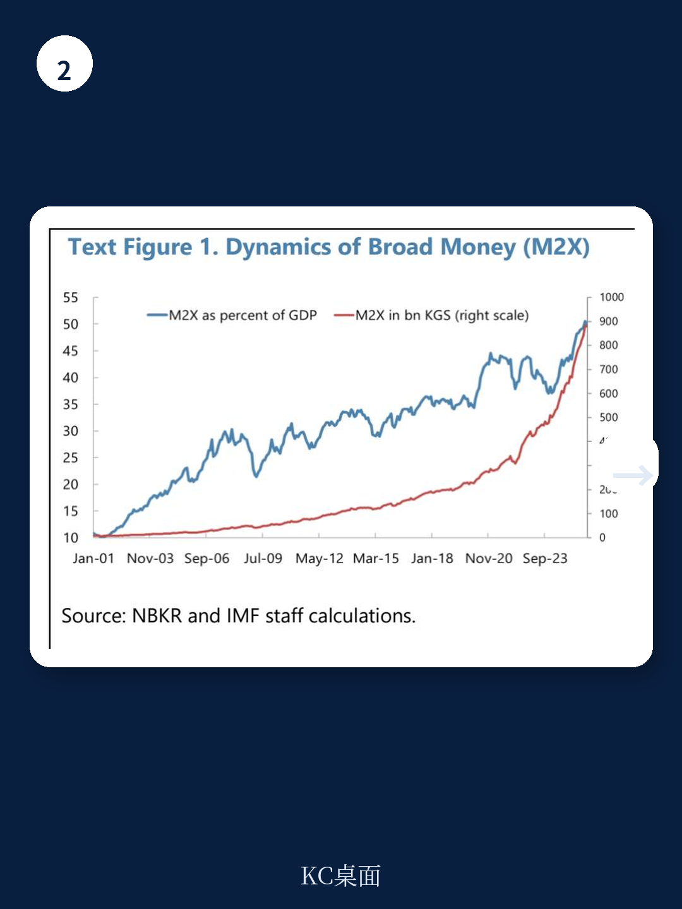

# IMF：超越政策利率-货币与资金的宏观视角

吉尔吉斯斯坦国家银行（NBKR）的基准利率自2024年以来维持在高位，但一份由IMF工作人员完成的专题研究指出，真实的资金条件已经显著宽松。研究团队构建了一个覆盖流动性、市场利率、货币总量、信贷动态和外部因素的资金条件指数（FCI），结果显示，自2024年初以来，该指数持续节奏变化，表明融资环境比政策利率所暗示的要宽松得多。这一判断的核心依据是：尽管名义政策利率保持紧缩信号，但银行间市场利率长期低于政策利率，信贷增速超过名义GDP，且家庭贷款占比达到历史高位。对于关注中亚地区货币政策传导效率的观察者而言，这份报告提供了一个清晰的警示：在结构性流动性过剩的环境下，单一盯住政策利率可能高估紧缩力度，低估通胀不确定性。

## 1. 流动性过剩让政策利率信号失效，走廊下限成为实际锚

报告明确指出，吉尔吉斯斯坦银行体系自2021年以来持续处于结构性流动性过剩状态。过剩流动性从2021年的约30亿索姆（占GDP的3.8%）攀升至近期的约1500亿索姆（占GDP的9.2%）。更关键的是，央行吸收这些流动性的手段高度依赖隔夜存款工具——超过80%的流动性以隔夜形式被吸收，这意味着它们随时可能重新进入信贷体系。在这种结构下，银行间市场交易变得稀薄，市场利率被拉向利率走廊的下限，而非政策利率本身。报告引用的实证文献表明，过剩流动性会显著削弱货币政策的传导效率。对于央行而言，这意味着即便维持高利率，实际融资成本可能远低于预期。

> **KC评论：** 政策利率与市场利率之间的“楔子”是理解这份报告的核心。当银行不需要向央行借钱，反而把多余资金存回央行时，央行实际上变成了银行体系的净借款人。此时，走廊下限利率才是真正的市场锚，而不是那个被广泛报道的政策利率。

## 2. 信贷扩张与货币增长是资金条件宽松的主要推手

FCI的分解结果进一步揭示了宽松的来源。报告采用等权重、主成分分析（PCA）和结构向量自回归（SVAR）三种方法构建指数，结果一致显示，自2024年初以来的资金条件宽松，主要驱动力是信贷快速增长和货币扩张，以及市场利率的下降。SVAR方法给出的权重分布尤其值得注意：银行信贷的权重高达0.403，政策利率的权重为0.263，而市场利率的权重仅为0.016。这意味着，在影响实际宏观环境活动的维度上，信贷量的变化远比利率信号重要。报告还指出，新增贷款中家庭部门的占比在2024-25年达到历史高位，短期消费贷和按揭贷款增长尤为迅猛。这种结构性的信贷扩张，正在将需求不确定性持续输入地区系。

## 3. 实际利率缺口为负，印证宽松实质

为了更直观地判断货币政策的真实立场，报告还估算了吉尔吉斯斯坦的实际中性利率。基于泰勒规则的滚动估计显示，当前实际中性利率约为2%，低于2014-19年期间平均约3%的水平。将实际政策利率（名义政策利率减去预期通胀）与中性利率比较，得到的实际利率缺口目前为负值。这意味着，即便名义利率处于高位，经通胀调整后的实际利率仍低于中性水平，货币政策在实质上是宽松的。报告指出，2023-24年期间实际利率缺口曾短暂转正，当时资金条件收紧，通胀也向目标区间回落，这反过来验证了实际利率缺口作为判断依据的有效性。当前缺口再次转负，叠加FCI显示的宽松趋势，意味着通胀不确定性可能持续。

## 4. 政策建议：多工具协同，而非单一加息

报告在结论部分提出了四方面的政策建议，其核心逻辑是：在结构性流动性过剩的环境下，单纯提高政策利率难以有效收紧资金条件。第一，需要提高流动性吸收的持久性，减少对隔夜工具的依赖，增加更长期限的冲销工具。第二，优化利率走廊设计，提高走廊下限，使其更接近政策利率。第三，加强央行与财政部在政府存款管理和国有银行注资方面的协调，减少自主性流动性波动。第四，针对快速扩张的家庭信贷，应引入宏观审慎工具，从需求端抑制信贷过热。这些建议指向一个共同的方向：货币政策需要从“单一利率工具”转向“流动性管理+利率信号+宏观审慎”的组合框架。

For informational purposes only. Portions may be generated,translated,summarized,or edited with AI assistance based on source materials and may contain omissions or errors. Please verify independently. This is not investment,legal,tax,accounting,or other professional advice.

