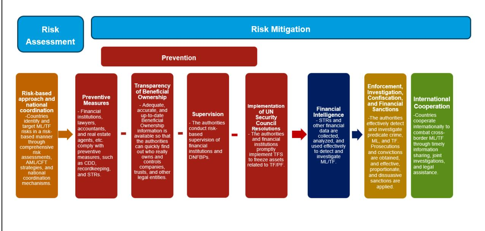
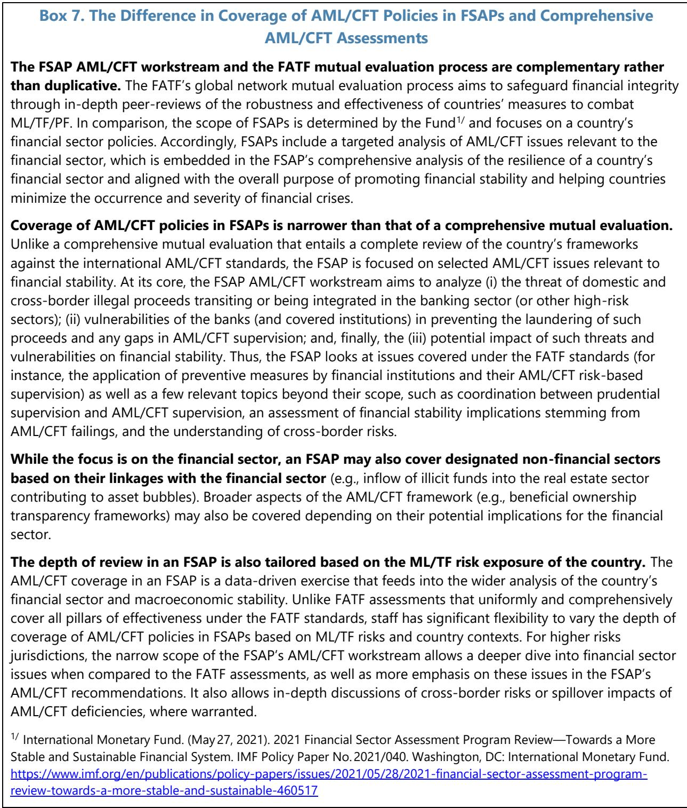
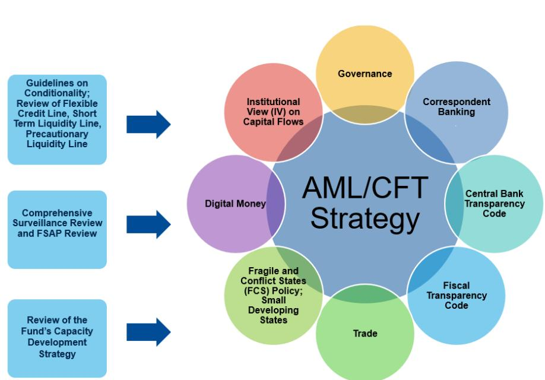

July 2026

# GUIDANCE NOTE FOR ADDRESSING ANTI MONEY LAUNDERING/COMBATING THE FINANCING OF TERRORISM ISSUES IN SURVEILLANCE, FINANCIAL SECTOR ASSESSMENT PROGRAMS, AND USE OF FUND RESOURCES

IMF staff regularly produces papers proposing new IMF policies, exploring options for reform, or reviewing existing IMF policies and operations. The Report prepared by IMF staff and completed on [date on page 1 of final report circulated], has been released.

The staff report was issued to the Executive Board for information. The report was prepared by IMF staff. The views expressed in this paper are those of the IMF staff and do not necessarily represent the views of the IMF's Executive Board.

The IMF's transparency policy allows for the deletion of market-sensitive information and premature disclosure of the authorities' policy intentions in published staff reports and other documents.

Electronic copies of IMF Policy Papers are available to the public from http://www.imf.org/external/pp/ppindex.aspx

International Monetary Fund
Washington, D.C.

June 25, 2026

## GUIDANCE NOTE FOR ADDRESSING ANTI MONEY LAUNDERING/COMBATING THE FINANCING OF TERRORISM ISSUES IN SURVEILLANCE, FINANCIAL SECTOR ASSESSMENT PROGRAMS, AND USE OF FUND RESOURCES

## EXECUTIVE SUMMARY

This Note provides guidance to staff on the inclusion of financial integrity and anti-money laundering/combating the financing of terrorism (AML/CFT) issues in surveillance, financial sector assessment programs (FSAPs), and Use of Fund Resources (UFR), updating previous guidance issued in 2012. Specifically, in line with the 2023 Review of the Fund's AML/CFT Strategy, the Guidance Note provides a framework for and illustrates how staff can deepen the integration of financial integrity and AML/CFT issues, based on staff's enhanced understanding of money laundering (ML), financial crimes, and terrorism financing (TF) risks and of their macroeconomic and financial stability impact.

## Approved By Yan Liu

Prepared by the Legal Department's Financial Integrity Group in consultation with other departments by a team led by Carolina Claver, and comprising Ke Chen, Grace Jackson, Maksym Markevych, Luisa Malcherek, Indulekha Thomas, and Miho Tanaka, with contributions by Richard Berkhout, Nadine Schwarz, Jonathan Swanepoel, and administrative support from Rosemary Fielden and Rachel Paz. The work was supervised by Brian Patterson, Wolfgang Bergthaler, and Chady El Khoury.

## CONTENTS

Glossary 4

SECTION I. INTRODUCTION 6

## SECTION II. MACROECONOMIC AND FINANCIAL STABILITY IMPLICATIONS OF MONEY

LAUNDERING, FINANCIAL CRIMES, AND TERRORISM FINANCING 8

A. Definitions 8

B. Context Matters—Key Macroeconomic Consequences 10

C. Terrorism Financing Risks 13

D. Cross-Border Spillovers 14

E. Economic and Financial Crises Heighten ML/TF and Financial Crimes Risks 15

F. Assessing National Efforts Against ML, Financial Crimes, and TF \_\_\_\_ 16

SECTION III. SURVEILLANCE 21

A. Mandatory Coverage of Financial Integrity Analysis and Advice in AIV Consultation \_\_\_\_ 22

B. Voluntary Coverage in AIV Consultations 24

SECTION IV. FINANCIAL SECTOR ASSESSMENT PROGRAM 25

SECTION V. USE OF FUND RESOURCES 28

A. Inclusion of AML/CFT-Related Conditionality in the Use of Fund Resources 28

B. Key Principles for AML/CFT-Related Program Design and Conditionality \_\_\_\_ 29

C. Application of Anti Money Laundering/Combating the Financing of Terrorism -Related

Conditionality Across Different Instruments 32

D. Monitoring and Supporting Implementation of Anti-Money Laundering/Combating the

Financing of Terrorism-Related Conditionality 37

1. Key Pillars of the FATF Recommendations 17

## BOXES

1. Twenty-One Categories of Offenses Generating Ill-gotten Proceeds or Financial Crimes \_\_\_\_ 9
2. Key Channels Through Which ML/TF Affect Economic Outcomes in Fund Engagements, with Country Examples \_\_\_\_ 12
3. Analytical Framework to Guide AML/CFT Coverage in Bilateral Surveillance \_\_\_\_ 18
4. IMF Policy Recommendations on Issues Not Covered Under the FATF Standards and Mutual Evaluation Reports \_\_\_\_ 20
5. Legal Basis for the Inclusion of Financial Integrity Related Issues in Surveillance \_\_\_\_ 21
6. FATF Grey Listing \_\_\_\_ 23
7. The Difference in Coverage of AML/CFT Policies in FSAPs and Comprehensive AML/CFT Assessments \_\_\_\_ 26
8. Illustrative Types of AML/CFT-Related Conditionality \_\_\_\_ 30
9. Cross-Conditionality and FATF Listing \_\_\_\_ 31
10. Targeted CD Supporting Implementation of AML/CFT-Related Conditionality \_\_\_\_ 38

## FIGURE

## ANNEXES

I. Expectations for Coverage of Anti-Money Laundering/Combating the Financing of Terrorism and Financial Integrity Issues in Surveillance, Financial Sector Assessment Programs, and Fund-Supported Programs 39
II. Relevance of Anti-Money Laundering/Combating the Financing of Terrorism to other Fund Policies 41
III. Financial Crimes, ML/TF Risks,and Economic Impacts Across Country Types 43

Glossary

<table><tr><td>AML/CFT</td><td>Anti-Money Laundering and Combating the Financing of Terrorism</td></tr><tr><td>AIV</td><td>Article IV</td></tr><tr><td>CBDC</td><td>Central Bank Digital Currency</td></tr><tr><td>CBI</td><td>Citizenship by Investment</td></tr><tr><td>CBRs</td><td>Correspondent Banking Relationships</td></tr><tr><td>CD</td><td>Capacity Development</td></tr><tr><td>CDD</td><td>Customer Due Diligence</td></tr><tr><td>DNFBPs</td><td>Designated Non-Financial Businesses and Professions</td></tr><tr><td>ECF</td><td>Extended Credit Facility</td></tr><tr><td>EFF</td><td>Extended Fund Facility</td></tr><tr><td>EMDEs</td><td>Emerging Market and Developing Economies</td></tr><tr><td>FATF</td><td>Financial Action Task Force</td></tr><tr><td>FCL</td><td>Flexible Credit Line</td></tr><tr><td>FCS</td><td>Fragile and Conflict-Affected States</td></tr><tr><td>FSA</td><td>Financial Sector Assessment</td></tr><tr><td>FSAP</td><td>Financial Sector Assessment Program</td></tr><tr><td>FSRB</td><td>FATF-Style Regional Body</td></tr><tr><td>FSSA</td><td>Financial System Stability Assessment</td></tr><tr><td>GRA</td><td>General Resources Account</td></tr><tr><td>ICRG</td><td>International Co-operation and Review Group</td></tr><tr><td>IFF</td><td>Illicit Financial Flows</td></tr><tr><td>IMS</td><td>International Monetary System</td></tr><tr><td>IO.</td><td>Immediate Outcome</td></tr><tr><td>ISD</td><td>Integrated Surveillance Decision</td></tr><tr><td>LIC</td><td>Low-income Countries</td></tr><tr><td>MEFP</td><td>Memorandum of Economic and Financial Policies</td></tr><tr><td>ML</td><td>Money Laundering</td></tr><tr><td>NRA</td><td>National Risk Assessment</td></tr><tr><td>OFC</td><td>Offshore Financial Center</td></tr><tr><td>PA</td><td>Prior Actions</td></tr><tr><td>PEP</td><td>Politically Exposed Persons</td></tr><tr><td>PF</td><td>Proliferation Financing</td></tr><tr><td>PLL</td><td>Precautionary and Liquidity Line</td></tr><tr><td>R.</td><td>Recommendation</td></tr><tr><td>RCF</td><td>Rapid Credit Facilities</td></tr><tr><td>RFI</td><td>Rapid Financing Instruments</td></tr><tr><td>SDS</td><td>Small Developing States</td></tr><tr><td>SMP</td><td>Staff Monitored Programs</td></tr><tr><td>TF</td><td>Terrorism Financing</td></tr><tr><td>TFS</td><td>Targeted Financial Sanctions</td></tr><tr><td>TN</td><td>Technical Note</td></tr></table>

UFR Use of Fund Resources
UNSCR United Nations Security Council Resolution
VAs Virtual Assets
VASPs Virtual Asset Service Providers

## SECTION I. INTRODUCTION

1. This Guidance Note updates and replaces earlier guidance provided under the 2012 Guidance Note, “Anti-Money Laundering and Combating the Financing of Terrorism Inclusion in Surveillance and Financial Stability Assessments—Guidance Note” (2012 Guidance Note). It establishes criteria and provides examples on how financial integrity issues $^{1}$ should be incorporated into surveillance, FSAPs, $^{2}$ and UFR, with an aim to further deepen the coverage of financial crimes and AML/CFT issues across these workstreams. $^{3}$ It provides practical guidance to staff based on the 2023 Review of the Fund’s AML/CFT Strategy (the AML/CFT Strategy) and other existing policies, and is not intended to create new policy commitments beyond those already established. $^{4}$ The scope of coverage has been expanded to include Fund-supported programs, in addition to surveillance and FSAPs previously covered under the 2012 Guidance Note.

2. ML, financial crimes, and TF continue to threaten the integrity and stability of Fund members' financial systems and the broader economy, with negative implications for inclusive and sustainable growth. ML and related financial crimes (or predicate offences), TF, as well as proliferation financing (PF) issues can significantly influence present or prospective balance of payments and domestic stability, making AML/CFT policies macro-critical in such cases. $^{5}$ These issues can not only threaten the stability of a country's financial system and its broader economy, but also trigger cross-border spillovers, potentially impacting financial stability beyond the domestic level, undermining inclusive and sustainable economic growth on the regional or global levels. An effective, risk-based AML/CFT framework is crucial for preventing the negative impact of a lack of financial integrity on the economy. The global AML/CFT standards provide building blocks for countries to develop an effective AML/CFT framework to combat ML/TF/PF.

3. As noted in the AML/CFT Strategy, financial integrity issues are an integral part of the Fund's core workstreams. The Fund closely engages with its member countries to help them

address macro-relevant financial integrity risks, systematically incorporating AML/CFT issues across all Fund workstreams—surveillance (including financial sector assessments—FSAs), UFR, FSAPs, and capacity development (CD) where warranted—as well as in a wide range of Fund policies and thematic areas, such as correspondent banking relationships (CBR), Fintech and digital money, Governance, Fragile and Conflict-affected States (FCS), and Small Developing States (SDS).

4. In the AML/CFT Strategy, the Executive Board agreed to further deepen the integration of financial integrity issues in the Fund's core functions through enhanced focus on AML/CFT issues that have macroeconomic impacts. Underpinning this approach is the Executive Board's overall guidance that staff will continue to enhance its understanding of the nature and severity of financial integrity risks faced by each member, with a greater focus on assessing and mitigating negative macroeconomic impacts, which will help staff further prioritize the depth and scope of its engagements. Specifically, the AML/CFT coverage is guided by the nature and significance of the countries' AML/CFT deficiencies for surveillance and countries' risks and the financial stability implications of financial integrity issues for FSAPs. For UFR, AML/CFT-related conditionality will generally be established, consistent with the Guidelines on Conditionality, where the measure is critical for achieving the goals of the member's program or for monitoring the implementation of the program, or necessary for implementation of the Articles of Agreement or policies adopted under them. The design of AML/CFT-related conditionality should be guided by the nature and severity of country-specific ML/TF risks and their macroeconomic implications.

5. The Guidance Note is structured as follows: Section II sets out the analytical framework, explaining how ML, financial crimes, and TF can undermine domestic macroeconomic and financial stability and generate spillovers affecting the effective functioning of the International Monetary System (IMS). It provides the analytical foundation for assessing country-specific risks and contexts, which subsequent sections translate into tailored guidance for surveillance, FSAPs, and Fund-supported programs. Section II also reviews the AML/CFT international standards and the associated peer-review process and explains their relevance to the Fund's mandate. Section III discusses the coverage of AML/CFT policies in surveillance. Section IV considers the treatment of AML/CFT issues in FSAPs. Finally, Section V outlines the inclusion and design of AML/CFT-related conditionality in Fund-supported programs. The Guidance Note also comprises three Annexes: Annex I on the expectations for coverage of AML/CFT and financial integrity issues in surveillance, FSAPs, and Fund-supported programs, Annex II on relevance of AML/CFT to other Fund policies, and Annex III on financial crimes, ML/TF risks, and economic impacts across country types.

## SECTION II. MACROECONOMIC AND FINANCIAL STABILITY IMPLICATIONS OF MONEY LAUNDERING, FINANCIAL CRIMES, AND TERRORISM FINANCING

## A. Definitions

6. Financial integrity is a global objective requiring concerted and cooperative action. It is a broad concept, which includes AML/CFT measures to prevent and combat ML, financial crimes, TF, PF, and associated illicit financial flows (IFF): $^{6}$ Beyond the prevention and law enforcement dimensions, financial integrity is fundamentally linked to macroeconomic stability and the sound functioning of the financial system. Achieving this objective requires mitigating the adverse macroeconomic and financial stability implications of ML, financial crimes, TF, and PF. Strengthening financial integrity is therefore essential to safeguarding economic resilience, supporting sustainable growth, and preserving trust in the financial sector and broader economy. More precisely:

\- ML is the process by which the illicit sources of assets obtained or generated by criminal activity are concealed to enable these assets to enter the financial system and broader economy. Under domestic criminal law, the offense of ML should apply to all serious types of predicate offenses or financial crimes capable of generating illicit revenue, with a view to including the widest range of offenses.

\- TF includes the raising and processing of funds to supply terrorists or terrorist activities with resources. While ML and TF differ in many ways, they often exploit the same vulnerabilities in financial systems and business regulations that allow for an inappropriate level of anonymity and opacity in the incorporation of business enterprises and execution of financial transactions, as well as weaknesses in law enforcement frameworks that hinder effective deterrence, detection, investigation and prosecution. PF measures are related to United Nations Security Council Resolutions (UNSCRs) applying targeted financial sanctions (TFS) relating to the financing of proliferation of weapons of mass destruction (WMD). $^{7}$ This Guidance Note will only cover ML, financial crimes, and TF.

\- Financial crimes, for purposes of this Guidance Note, include all 21 designated categories of offences or predicate crimes as per the Financial Action Task Force (FATF) standard. These are crimes generating ill-gotten proceeds and financial gain and are not limited to crimes abusing the financial system. These include, inter alia, participation in organized crime, fraud, drug trafficking, corruption and bribery, tax crimes, and environmental crimes.

<table><tr><td colspan="3">Box 1. Twenty-One Categories of Offenses Generating Ill-gotten Proceeds or Financial Crimes</td></tr><tr><td>Organized crime &amp; racketeering</td><td>Corruption &amp; bribery</td><td>Smuggling (customs/excise)</td></tr><tr><td>Terrorism (incl. TF)</td><td>Fraud</td><td>Tax crimes</td></tr><tr><td>Human trafficking &amp; migrant smuggling</td><td>Currency counterfeiting</td><td>Extortion</td></tr><tr><td>Sexual exploitation</td><td>Counterfeiting &amp; product piracy</td><td>Forgery</td></tr><tr><td>Drug trafficking</td><td>Environmental crime</td><td>Piracy</td></tr><tr><td>Arms trafficking</td><td>Murder &amp; grievous bodily injury</td><td>Insider trading &amp; market manipulation</td></tr><tr><td>Trafficking in stolen goods</td><td>Kidnapping</td><td>Robbery or Theft</td></tr></table>

7. ML, financial crimes, and TF have various channels of economic impact. They can threaten the integrity and stability of member's financial systems and their broader economies, negatively affecting inclusive and sustainable growth. ML, financial crimes, as well as TF, can undermine the domestic and/or balance of payments stability in the following ways: (i) by destabilizing the member's financial system and external sector activity; (ii) through important inward or outward spillover effects; (iii) through an adverse structural effect on the broader economy; and (iv) by undermining the stability of and trust in the economy and financial system as a whole, (v) by distorting prices and investment decisions. While financial integrity issues attract the most attention at the time of a destabilizing financial integrity breach (e.g., a scandal in a financial institution), they generally pose long-term barriers to inclusive and sustainable growth.

8. Due to the transnational nature of financial crimes and related cross-border ML/TF, and regulatory arbitrage, spillover effects are particularly relevant for AML/CFT in the context of surveillance. As ML often takes place through cross-border transactions to conceal criminal proceeds, ineffectiveness of one country's AML/CFT regime, and its vulnerability to financial crimes, can have spillover effects by exporting criminal activity and exposing other countries to the negative impact of laundering of foreign criminal proceeds. Similarly, ineffective AML/CFT policies in one country provide the opportunity for ML/TF facilitation by foreign criminals and terrorist organizations.

9. For purposes of assessing risks to a country's financial and external stability, it is often neither feasible nor analytically meaningful to disentangle ML or TF from the financial crimes that generate the illicit proceeds. In practice, there is a close and intrinsic relationship between underlying financial crimes (e.g., drug trafficking, tax evasion, corruption) and the laundering of their proceeds, just as TF activities are frequently inseparable from the planning and execution of terrorist acts themselves. From a risk-based and macroeconomic impact perspective, the relevant concern is therefore the broader universe of financial crimes rather than a strict legal distinction among underlying financial crimes, laundering, and financing activities. For instance, organized criminal networks typically engage in multiple forms of financial crime simultaneously, making it difficult—absent highly granular data or specialized methodologies—to isolate and assess the macroeconomic impact of individual crime categories, except in country-specific contexts where certain crimes are particularly acute. Moreover, once illicit proceeds are laundered and transferred across borders, often far from the jurisdiction where the underlying crimes were committed, assessing their impact on the financial institutions and economies involved in the laundering process becomes even more complex, reinforcing the case for a holistic approach to macro-financial risk analysis.

## B. Context Matters—Key Macroeconomic Consequences

10. ML, financial crimes, and TF, if sufficiently severe, can undermine financial stability, economic growth, and quality of institutions. These threats can weaken fiscal revenues and quality of expenditures, destabilize financial systems and external sectors, and impose structural barriers to growth and development in addition to direct costs imposed by increased criminal activity. Longer-term, unaddressed significant financial crimes degrade public institutions and their independence, undermining rules-based voluntary economic order. Beyond domestic impacts, financial crimes and weak AML/CFT regimes create regional and global spillovers. This section integrates findings from recent country engagements, policy papers, and guidance notes to provide a typology-based, macro-focused analysis that highlights threats, vulnerabilities, macroeconomic implications, and policy priorities.

11. Because country contexts give rise to different dominant channels through which financial integrity risks affect the economy, engagement must be tailored accordingly. The nature and intensity of ML/TF impacts vary across countries, reflecting differences in the severity of financial crimes, countries' roles in tackling ML/TF, and their broader risk profiles and institutional contexts. Some behaviors or practices described below may not be criminalized under domestic law:

\- FCS generally face the most acute institutional and structural vulnerabilities, where ML, financial crimes, and TF can reinforce fragility, conflict, and erode state capacity. In FCS, weak governance and conflict dynamics are often reinforced by illicit economies and rent seeking (notably in extractive sectors) that remain unaddressed due to the state weaknesses, creating incentives for further conflicts and fragility. In such environments, terrorist organizations and organized crimes (whether domestic or transnational) often gain access to financial and natural resources, exacerbating the risks of terrorism, violent crimes, and TF both domestically and across borders. Structural vulnerabilities are generally severe, which may include entrenched corruption, weak rule of law, and erosion of institutional legitimacy.

\- In Low-Income Countries (LICs), tax crimes can hamper revenue mobilization and widespread economic crime often deteriorates the quality of governance, thereby weakening prospects for inclusive development and stability. High informality, limited supervisory and enforcement capacity, and weak tax administration amplify ML/TF risks. Revenue administration may be affected by smuggling, corruption, high informality, and tax evasion, which reduces the domestic resource envelope. Limited public sector institutional capacity (e.g., supervisory, law enforcement) may be unable to address ML/TF and economic crimes. De-risking by international banks often inhibits capital and remittance inflows, pushing financial services into informal systems, further reducing transparency. Criminal vested interests may maintain weak governance and constrain capacity for reform implementation.

\- Many SDS face low ML/TF risk and should benefit from simplified AML/CFT measures. Low domestic criminality and immaterial cross-border financial flows can allow for the application of simplified AML/CFT measures both domestically and internationally in many SDS. However, small market size and CBR pressures, especially when disproportionate to the level of ML/TF risks in the country, may result in increased informality and/or fragile connectivity of SDS to the global financial system, critical due to their typically high dependence on remittances.

\- Some SDS, particularly those with offshore-oriented or non-resident business models, face elevated financial integrity risks as transit or destination hubs of cross-border proceeds of crimes. Risks include non-resident misuse of opaque legal persons and arrangements, economic citizenship/residency schemes and associated reputational costs and risk perceptions, laundering through banks with weak supervision and strict banking secrecy, as well as through real estate agents, lawyers, and accountants. Financial and external channels typically dominate. Reputational risks from grey listing by the FATF or other international scrutiny (including inclusion in the EU list of non-cooperative jurisdictions for tax purposes and/or the EU list of high-risk third countries) can cause correspondent banking pressures and jurisdictional de-risking. While SDS with offshore characteristics facilitate only a minor share of global cross-border financial services as compared to the advanced economies with global financial centers, they face significant challenges in mitigating ML/TF risks from non-resident activity disproportionate to the size of the domestic economy and institutions.

\- Other emerging markets and developing economies (EMDEs) can face financial integrity risks in various sectors and via diverse channels. Large-scale tax evasion, corruption, and associated ML and illicit capital flight, contribute to fiscal vulnerabilities, such as revenue leakages, inefficient spending, contingent liabilities, eroded revenues, distorted expenditures quality, and reduced fiscal space. Financial sector risks are heightened by laundering through banks, capital markets, and high-value assets (e.g., real estate, precious metals and stones), which distort asset prices, may trigger financial instability and undermine regulatory credibility. Negative structural impacts emerge when illicit financing reduces competitiveness, encourages rent-seeking, lowers economic growth, and widens inequality.

\- Advanced economies face ML/TF risks from both domestically generated proceeds of crime and, to a significant extent, from the integration of foreign criminal proceeds into their open and interconnected financial systems. Since these jurisdictions typically have stable institutions, high capacity, and large, diversified economies, ML/TF and related financial crimes tend to constitute structural impediments to economic efficiency and growth, rather than immediate sources of financial or external instability. However, deep integration into the global financial system, strong investment attractiveness, and robust property rights expose advanced economies to illicit inflows from abroad, which can generate sectoral distortions (notably in real estate) and elevate risks of institutional corruption. Advanced economies are also frequently destination jurisdictions for laundered funds originating in less-advanced economies, reflecting criminals' preference for stable environments offering a wide range of financial products and services. Where such assets are not effectively detected, confiscated, and recovered, the resulting safe-haven effect can exacerbate instability in source countries by entrenching illicit economies, weakening state capacity, and undermining development—underscoring the fight against ML/TF as a global public good.

## Box 2. Key Channels Through Which ML/TF Affect Economic Outcomes in Fund Engagements, with Country Examples

\- Risk of external instability: Unwinding of foreign exchange restrictions and controls in Argentina facilitated cross-border movement of funds, requiring the application of targeted AML controls to mitigate the risk of disorderly outflows and associated pressure on foreign exchange reserves and external stability. Staff assists the authorities with the analysis of cross-border ML/TF risks and prioritized development of AML/CFT regulatory and supervisory mitigation measures. $^{1}$

\- Risk of financial instability: Between 2010 and 2014, at least US\$20 billion of foreign proceeds of crime were moved through Moldovan banks into Europe, followed by US\$1 billion fraud from three banks and cross-border ML between 2012 and 2014. Three banks were liquidated, and losses estimated to be equivalent to 12 percent of Moldova's GDP at the time. The largest remaining banks have been placed under special supervision, while some foreign banks cancelled their CBRs.

$^{1}$ November 2025 Structural Benchmark supported by Fund technical assistance.

International Monetary Fund. 2025. Argentina: First Review Under the Extended Arrangement Under the Extended Fund Facility; Press Release; Staff Report; and Statement by the Executive Director for Argentina. IMF Country Report No. 25/219. Washington, DC: International Monetary Fund. August 1.
https://www.imf.org/en/publications/cr/issues/2025/08/01/argentina-first-review-under-the-extended-arrangement-under-the-extended-fund-facility-569162

Markevych, Maksym. 2025. Argentina: Targeted Anti-Money Laundering Diagnostic and Reform Roadmap. Technical Assistance Report. Washington, DC: International Monetary Fund.
https://www.argentina.gob.ar/sites/default/files/argentina\_aml\_diagnostic.pdf

Box 2. Key Channels Through Which ML/TF Affect Economic Outcomes in Fund Engagements, with Country Examples (concluded)

Under a Fund-supported program, Moldova has notably strengthened bank ownership transparency, AML/CFT supervision, and cross-border risk mitigation. $^{2}$

\- Longer-term impact on economic growth: Correspondent banking pressures led to the fragile connectivity of Pacific Island Countries to the global financial system, resulting in slow, expensive payments and informal transfers. Staff recommended to the Samoan authorities to coordinate with the Australian and New Zealand authorities on the simplification of AML/CFT requirements applicable to low-risk remittances, to improve inclusion and speed of payments, as well as to lower regulatory burden and supervisory uncertainty contributing to lower costs (Samoa 2024 Article IV (AIV) Consultation). $^{3}$

\- Trust in the economy and financial system: Lebanon's bank secrecy law was a key barrier to effective banking sector supervision, tax administration, detection and investigation of financial crimes, and a cornerstone of its financial sector model. Adoption of a new bank secrecy law was a key step towards restoring trust in the jurisdiction and the financial system. $^{4}$

\- Spillover effects: As a global financial center, the United Kingdom is exposed to foreign proceeds of financial crimes and its AML/CFT policies have a spillover effect. Staff recommended strengthening AML/CFT measures to address the concealment of foreign proceeds of crime, specifically: (i) intensifying efforts to ensure consistency of AML/CFT supervisory approaches for "gatekeepers," namely trust and company service providers (TCSPs), and accountancy and legal sectors, and (ii) adopting measures to enhance the accuracy of beneficial ownership information of legal entities and pursuing legal reform to require the public disclosure of beneficial ownership information of foreign entities owning U.K. real property (2022 FSAP Technical Note). $^{5}$

$^{2}$ International Monetary Fund. 2026. Republic of Moldova: Financial System Stability Assessment. IMF Country Report No. 26/61. Washington, DC: International Monetary Fund.

https://www.imf.org/en/publications/cr/issues/2026/03/05/republic-of-moldova-financial-system-stability-assessment-574442

$^{3}$ Markevych, Maksym and Miho Tanaka. 2025. Remittances to Samoa: A Safe Payment Corridor. IMF Selected Issues Paper No. SIP/2025/061. Washington, DC: International Monetary Fund.

https://www.imf.org/en/publications/selected-issues-papers/issues/2025/05/14/remittances-to-samoa-a-safe-payment-corridor-566996

$^{4}$ International Monetary Fund. (2025, June 5). IMF Staff Concludes Mission to Lebanon.
https://www.imf.org/en/news/articles/2025/06/05/pr-25182-lebanon-imf-staff-concludes-mission-to-lebanon

$^{5}$ International Monetary Fund. 2022. United Kingdom: Financial Sector Assessment Program—Some Forward-Looking Cross-Sectoral Issues. IMF Country Report No.22/108. Washington, DC: International Monetary Fund. April 7. https://www.imf.org/en/publications/cr/issues/2022/04/07/united-kingdom-financial-sector-assessment-program-some-forward-looking-cross-sectoral-516282

## C. Terrorism Financing Risks

12. TF represents a specific challenge, particularly relevant in some fragile and conflict contexts. TF risks can create particularly acute effects in FCS and LICs, where state institutions and oversight are generally weak, and informal channels dominate. As TF enables the execution of attacks and recruitment, it undermines international peace and security, erodes country's governance as well as trust in the economy, financial institutions, and public authorities. In addition, as TF often uses the same channels as humanitarian aid, it potentially diverts resources away from legitimate needs and increases scrutiny on nongovernmental organizations, hindering their operations. $^{8}$ TF also poses a risk to “transit” jurisdictions providing non-resident services, highlighting the global nature of the TF challenge.

## D. Cross-Border Spillovers

13. Cross-border proceeds of financial crimes (or IFF) and weak AML/CFT frameworks generate cross-border spillovers. Spillovers manifest through balance of payments distortions related to IFFs, non-resident impact on asset prices (notably housing), proliferation of transnational organized crime, and pressures on CBRs. On the one hand, elevated levels of economic crime in some countries have a negative spillover on other countries, as criminal networks grow into transnational crime, expanding the reach of their criminal activity, including the ML/financial component of their operations. $^{9}$ On the other hand, weak policies to address ML and economic crime in the transit and destination countries create arbitrage opportunities for illicit actors in search of financial institutions and company formation for misuse, as well as attractive jurisdictions to integrate the criminal proceeds. $^{10}$ Cyber fraud and the emergence of new channels to transfer value, such as virtual assets (VAs), including stablecoins, with associated ML/TF vulnerabilities, provide new opportunities for arbitrage and pose novel challenges in detecting and addressing IFFs. This

transnational feedback impacting the operation of the IMS underscores the need for international cooperation, global AML/CFT efforts, multilateral surveillance, and cross-border information sharing. Global initiatives, including the G-20 and Sustainable Development Goals, $^{11}$ increasingly emphasize tackling IFF as essential to sustainable growth. The Fund is uniquely positioned to address the AML/CFT cross-border spillovers due to its near universal membership and developed macroeconomic toolkit to assess their impact, safeguarding financial integrity as a global public good underpinning the international monetary system.

## E. Economic and Financial Crises Heighten ML/TF and Financial Crimes Risks

14. Financial and economic crises do more than erode macroeconomic fundamentals—they also transform the financial integrity landscape in ways that amplify ML/TF and broader financial crimes risks. $^{12}$ Periods of acute stress typically drive economic activity into more opaque and informal channels, increase reliance on cash-based or unregulated transactions, and weaken institutional controls. This surge in informality and anonymity creates fertile ground for criminal exploitation, elevates vulnerabilities across the financial system, and ultimately heightens ML/TF threats at a time when resilience is already strained. On the other hand, systemic breaches of financial integrity (e.g., high value fraud or cross-border ML event) might pose systemic risk, resulting in a broader disruption of the financial system, for example, if foreign counterparties de-risk the jurisdiction altogether and reevaluate their relationships with all financial institutions in the country, which might impair the functioning of the broader economy, for example through the negative impact on the cost and speed of payments, halting of external funding, restricted access to assets abroad, and recall of cross-border liabilities.

15. During crises, financial transactions and other economic activities often shift toward cash-based and informal channels, capital outflows and dollarization may occur, and the shadow economy expands. Collapse of the payments network and the investors' and households' demand for safe havens for their assets amidst withdrawal restrictions and capital controls often push financial transactions into informal or illicit channels, undermining the effectiveness of the AML/CFT regimes. This includes unregistered remittance services, trade-based ML techniques, cross-border cash transportation, and gold smuggling, and the use of VAs, including stablecoins, which challenges the capital flows management and pressures the balance of payments. Inflation and scarcity of goods create opportunities for illicit actors to smuggle commodities through price mis-

invoicing and other trade-based ML techniques and operate in informal channels, while evading detection and enforcement. Shifting of the activity into informal and non-transparent channels might also result from the authorities' policy choices, including taxation or overly stringent AML/CFT requirements.

16. Exchange restrictions as well as multiple currency practices subject to Article VIII, Sections 2(a) and 3 and sharp currency devaluations often create arbitrage opportunities that criminals exploit to generate and launder illicit gains. In FCS, such as Lebanon, Iraq, and Libya, post-crisis capital controls and exchange restrictions such as withdrawal limits led to the emergence of parallel exchange markets. Discrepancies between exchange rates compounded by weaknesses in trade-related controls enable price mis-invoicing and other trade-based ML techniques, contributing to capital outflows and widening current account deficit (for instance, see Lebanon 2023 AIV SR). $^{13}$

## 17. Crises also increase vulnerabilities of the country's AML/CFT and governance

framework. Crises could weaken the authorities' ability to ensure AML/CFT compliance, governance, and rule of law by depleting the resources of regulatory and supervisory bodies, law enforcement agencies, and the judiciary. During times of crisis, institutional resources and capacities are often affected, undermining the role of institutions usually focused on fiscal, monetary, and financial adjustments. Crises also provide rent-seekers with opportunities to exploit such amplified vulnerabilities and weakened controls, including through emergency public procurement contracts.

## F. Assessing National Efforts Against ML, Financial Crimes, and TF

18. The 2023 AML/CFT Strategy focuses on financial integrity issues which pose macroeconomic and financial stability risks to the Fund's members. Fund staff works closely with the FATF and other multilateral institutions to safeguard the global financial system. The FATF, the global AML/CFT standard-setting and monitoring body, works to protect the financial system against ML/TF through standard setting. The AML/CFT standards $^{14}$ developed by the FATF are used to assess the AML/CFT frameworks of all FATF members and FATF-style regional bodies' (FSRB) members. Staff closely cooperates with the FATF through participation in and contributions to standard setting, typologies work, and assessments of member countries' AML/CFT frameworks, and coordination of CD engagement.

Figure 1. Key Pillars of the FATF Recommendations  

19. The Fund's approach does not suggest that ML, financial crimes, or TF risks can be addressed through AML/CFT reforms alone. The effectiveness of AML/CFT frameworks is closely linked to the overall quality of institutions and governance. Weak governance and corruption can significantly undermine the design, implementation, and enforcement of AML/CFT measures, limiting their impact in practice. Accordingly, governance and anti-corruption reforms—including strengthening the rule of law, enhancing transparency and accountability, and improving institutional capacity and integrity—are essential complements to AML/CFT policies. From a macroeconomic perspective, reforms aimed at reducing structural incentives for illicit activity, such as curbing rent-seeking opportunities, addressing policy distortions, and increasing transparency in public finance and markets, can materially reduce vulnerabilities to ML, financial crimes, and TF. These reforms are therefore complementary to, and should be pursued in tandem with, AML/CFT measures as part of a coherent policy framework to support macroeconomic and financial stability.

20. While the Fund Executive Board endorsed the FATF standards in 2002, staff is guided by the Fund's mandate to promote macroeconomic and financial stability among its member countries. The FATF Recommendations serve as a basis for a coordinated response across jurisdictions to protect the integrity of their financial system and the global financial system as a whole. $^{15}$ The FATF 40 Recommendations consist of measures that countries should implement to combat ML, financial crimes, and TF, including measures on (i) understanding their specific risks and policy priorities, (ii) preventing ML/TF and PF (e.g., customer due diligence (CDD)), (iii) enforcement (e.g., investigation, prosecution, and sanction), and (iv) international cooperation and asset recovery. Staff prioritizes issues that are the most relevant to the country's macroeconomic and financial

stability, based on the country's risk and context, including its role as origination, transit and destination country of IFFs, the size and economic status.

## Box 3. Analytical Framework to Guide AML/CFT Coverage in Bilateral Surveillance

Coverage of AML/CFT policies in bilateral surveillance is required when financial integrity issues have, or may have, an impact on a member's domestic or external stability. Determining whether AML/CFT policies require coverage is based on a holistic assessment of: (i) the domestic and cross-border ML/TF threats to which the member is exposed; (ii) vulnerabilities in the member's AML/CFT, governance, and broader institutional frameworks; and (iii) the actual or potential macroeconomic or financial stability consequences resulting from these threats and vulnerabilities.

The framework is driven by a range of quantitative and qualitative data sources, supplemented by staff judgment and country-specific expertise. Staff also collaborates with other international financial institutions, where appropriate, to leverage further analytical tools and data sources.

The scope and depth of expected coverage in bilateral surveillance are determined by the macro-critical nature of the overall combination of threats, vulnerabilities, and actual or potential consequences. Mandatory coverage would generally not be expected where the overall impact of AML/CFT issues is not assessed to affect domestic or external stability. Conversely, where such issues are assessed to pose risks to macroeconomic or financial stability, coverage in bilateral surveillance would be expected commensurate with the level of risk. The three sequential tests are illustrated in the Figure below:

Framework at a glance

## Are there identified threats?

Are there vulnerabilities that could be exploited by these threats?

Could the combination of threats and vulnerabilities have macroeconomic consequences?

Domestic and cross-border threats from ML, financial crime, and TF

AML/CFT and broader Institutional, legal, regulatory, supervisory, enforcement, governance, and structural weaknesses

Actual or potential macroeconomic and financial stability implications

Threats: Domestic and cross-border threats from ML, financial crime, and TF

## How is this criterion assessed?

To assess domestic and cross-border threats, staff analyzes the scale and nature of illicit proceeds generated by ML, financial crime, and TF, as well as jurisdictions' exposure to foreign illicit proceeds and cross-border risks from illicit flows through their financial systems and external sectors.

## What data sources do staff rely on?

The analysis draws on national risk assessments, data on correspondent banking connectivity, non-resident activity, financial flow patterns, and broader external interconnectedness, supported by SWIFT payment data, outlier financial flow analysis, direction of trade statistics, OECD-WTO balanced trade in services data, and coordinated portfolio and direct investment surveys. Staff is also developing analytical modules for emerging and thematic risks, including VAs, cyber-enabled fraud, correspondent banking pressures, and trade-based ML.

<table><tr><td colspan="2">Box 3. Analytical Framework to Guide AML/CFT Coverage in Bilateral Surveillance (concluded)</td></tr><tr><td colspan="2">Vulnerabilities: AML/CFT and broader institutional, legal, regulatory, supervisory, enforcement, governance, and structural weaknesses</td></tr><tr><td>How is this criterion assessed?</td><td>The assessment of AML/CFT vulnerabilities focuses on institutional, legal, regulatory, supervisory, enforcement, and structural weaknesses that could be exploited by identified threats. This includes analysis of the effectiveness of AML/CFT supervision, law enforcement, beneficial ownership transparency, governance frameworks, financial sector oversight, and levels of informality and cash reliance, based on quantitative and qualitative data and informed by staff judgment.</td></tr><tr><td>What data sources do staff rely on?</td><td>The analysis draws on FATF mutual evaluation reports as the main source of information on the AML/CFT effectiveness, national risk assessments, analysis of financial secrecy, world governance indicators, estimates of the shadow economy and cash intensity in the economy, and harmful tax practices.</td></tr><tr><td colspan="2">Consequences: Actual or potential macroeconomic and financial stability implications</td></tr><tr><td>How is this criterion assessed?</td><td>The macroeconomic and financial stability consequences, considering the country groupings set out in Annex III. Staff assesses whether identified threats and vulnerabilities are &quot;macro-critical&quot; in the sense that their combination could generate material impacts on domestic or external stability, including fiscal, financial, and structural issues.</td></tr><tr><td>What data sources do staff rely on?</td><td>The assessment considers the relevance and severity of fiscal, financial, and structural implications and broader macroeconomic performance across different country circumstances.For instance, significant exposure to foreign illicit flows or offshore non-resident activity could generate &quot;hot money&quot; dynamics and increase vulnerability to abrupt reversals, liquidity pressures, or asset price cycles. Significant AML/CFT deficiencies or FATF grey listing could contribute to de-risking, reduced access to external financing, and pressures on balance of payments stability and financial intermediation. In fragile and conflict-affected states, ML/TF and financial crimes may reinforce fragility and weaken state capacity; in low-income countries, risks may materialize through informality, reduced revenue mobilization, and correspondent banking pressures; while in offshore-oriented small developing states, emerging markets, and advanced economies, cross-border illicit flows and non-resident activity may create reputational risks, asset price distortions, financial stability concerns, and spillovers.</td></tr></table>

Note: Assessment is supplemented by staff judgment and country input.

## 21. Where appropriate, the Fund may recommend a closer alignment of Fund member countries' policies with best practices that go beyond the FATF standards or mutual

evaluation recommendations. Based on the issues facing specific members, policy advice provided under AIV consultations and FSAPs, as well as conditionality included in Fund-supported programs often draws on the AML/CFT assessments conducted under the FATF standards. Policy advice and conditionality may include measures that go beyond the requirements of FATF standards or recommendations of the above-mentioned assessments, when such measures are considered critical for the member's macroeconomic or financial stability or for achieving program goals or for monitoring program implementation, or necessary for the implementation of specific provisions of the Articles of Agreement or policies adopted under them, in the context of Fund-supported programs. The criticality of AML/CFT policies, informed by the quantitative considerations of ML/TF risk and materiality, might result in financial integrity policy recommendations which were not identified in the mutual evaluations.

## Box 4. IMF Policy Recommendations on Issues Not Covered Under the FATF Standards and Mutual Evaluation Reports

For example, trade mis-invoicing and trade-based ML could distort the balance of payments of the Fund's members. Mis-invoicing to launder the counter-trade value of goods and services could be mitigated by collecting and verifying cross-border trade data, and enhanced coordination between customs and AML authorities. Such measures could be recommended by the Fund while not prescribed by the FATF standards. In addition, reducing informality and reliance on cash could also limit criminal activities. Such measures could be advised by staff from a financial inclusion perspective.

Further, many countries that received COVID-19-related emergency financing committed to implementing measures to promote financial integrity and good governance, transparency, and accountability of public spending. One of such measures was to “publish” the names of the beneficial owners of legal entities awarded procurement contracts—a novel measure in an area that is at high risk of corruption. While not prescribed in the FATF standards, the publication of such information in member countries has contributed to enhancing transparency of public procurement, strengthening fiscal governance, and detecting fraudulent deals through increased public oversight and financial management information systems. In addition, given the wide range of impacts of illicit financial flows, including as a contributing factor for real estate bubbles in some countries, the Fund has promoted beneficial ownership transparency in a wide range of sectors with a focus on real estate. $^{1/}$

$^{1/}$ Examples include supporting the establishment of a dedicated politically exposed persons–risk analysis function at the financial intelligence unit (FIU) in Ukraine, advising on measures to strengthen the independence of the FIU in Lebanon, and recommending AML/CFT supervision targeted at tax-crime risks in Greece. Such cases underscore the value of Fund-tailored, risk-based advice that is distinct from, though informed by the FATF standard.

## SECTION III. SURVEILLANCE

22. Under the framework for surveillance, staff should assess financial integrity policies that address ML/TF risks that affect domestic and external stability. Threats to financial stability and macroeconomic performance can be directly attributable to ML/TF and financial crimes in certain cases. Staff should address financial integrity policies in AIV consultations when (i) in the context of bilateral surveillance, they significantly impact the relevant member's present or prospective domestic or balance of payments stability, or (ii) in the context of multilateral surveillance, they give rise to spillovers which may significantly influence the effective operation of the IMS, including by undermining global economic and financial stability.

23. Assessing the importance of financial integrity issues, as well as the scope and depth of engagement for members should be guided by an evidence-based assessment of risks, taking into account both the likelihood and magnitude of possible outcomes. This assessment is guided by evidence and context, bearing in mind the Fund's mandate and expertise, rather than external standards such as the FATF Recommendations. Where appropriate, staff may recommend policy adjustments that go beyond the FATF standards and/or recommendations of the AML/CFT assessments to safeguard financial stability, reduce IFF, and strengthen entity transparency—examples include enhanced beneficial ownership registries, monitoring of trade-based ML, or measures to reduce informality and cash reliance.

24. In assessing whether AML/CFT policies are macro-critical in the context of surveillance, staff should evaluate both the likelihood and potential macroeconomic impact of financial integrity risks, taking into account country-specific circumstances, transmission channels, and institutional contexts. As outlined in Box 3 above, this assessment combines quantitative and qualitative indicators with staff judgment to analyze: (i) threats from proceeds of crime, including domestic and cross-border risks; (ii) AML/CFT vulnerabilities; and (iii) the actual or potential macroeconomic or financial stability consequences resulting from these threats and vulnerabilities. The assessment focuses on whether identified risks could materially affect macroeconomic or financial stability through, for example, pressures on CBRs, disruptions to external financing and payments, capital flow volatility, banking sector instability, fiscal losses, governance deterioration, or structural distortions in key sectors of the economy. Consistent with the typology-based analysis in Annex III, the relevance of financial integrity risks will differ across country types and institutional settings, requiring a tailored and risk-based approach to surveillance coverage and policy advice.

Box 5. Legal Basis for the Inclusion of Financial Integrity Related Issues in Surveillance

Article IV, Section 1 of the Fund's Articles of Agreement and the 2012 Integrated Surveillance Decision (ISD) establish the legal framework for Fund surveillance. Under Article IV, the Fund is required to oversee the compliance of each member with its obligations under Article IV, Section 1 (bilateral surveillance), and to oversee the IMS to ensure its effective operation (multilateral surveillance).

Box 5. Legal Basis for the Inclusion of Financial Integrity Related Issues in Surveillance (concluded)

In bilateral surveillance, the Fund assesses whether members are in compliance with their obligations under Article IV, Section 1. Under this provision, members undertake to collaborate with the Fund and other members to assure orderly exchange arrangements and to promote a stable system of exchange rates ("systemic stability") and, in particular, to conduct their domestic and exchange rate policies in a manner to promote their own domestic and balance of payments stability.

The ISD confirms that systemic stability is most effectively achieved by each member adopting policies that promote its own balance of payments stability and domestic stability. The concept of "balance of payments stability" refers to "a balance of payments position that does not and is not likely to give rise to disruptive exchange rate movements." The ISD requires bilateral surveillance to focus on those policies of members that can significantly influence present or prospective balance of payments and domestic stability. In particular, it provides that exchange rate policies and monetary, fiscal, and financial sector policies (both their macroeconomic aspects and macroeconomically relevant structural aspects) will always be the subject of the Fund's bilateral surveillance with each member. Other policies will be examined in surveillance only to the extent that they significantly influence present or prospective balance of payment or domestic stability (the "macro-criticality" criterion).

In multilateral surveillance, the Fund focuses on issues that may affect the effective operation of the IMS. These include the spillovers arising from policies of individual members that may significantly influence the effective operation of the IMS, including by undermining global economic and financial stability.

Under the ISD, an AIV consultation is a vehicle for both bilateral and multilateral surveillance. In an AIV consultation, staff should, in particular, discuss outward spillovers arising from a member's policies where the member is not promoting its own domestic or balance of payments stability, or where the spillover may undermine global stability.

25. As financial integrity risks differ across members, staff should consider the risk typology and transmission channels outlined in Section II to assess, in light of country circumstances, whether these issues signal that AML/CFT policies warrant coverage, which specific policies require such coverage, and the appropriate depth of that coverage. Where this threshold is met, surveillance should focus on the most relevant vulnerabilities and associated policy gaps. Coverage should then be calibrated to the member's specific risks and their implications for domestic or balance of payments stability.

## A. Mandatory Coverage of Financial Integrity Analysis and Advice in AIV Consultation

## Bilateral Surveillance

26. Financial integrity issues are most often related to members' financial sector policies and should be covered under surveillance to the extent they could impact domestic or external stability. AML/CFT issues are typically addressed under discussions of financial sector policies, given their close linkages to financial integrity, stability, and soundness. $^{16}$ Weaknesses in AML/CFT frameworks can amplify financial vulnerabilities and undermine confidence in financial institutions. AML/CFT analysis and advice can form part of the broader financial sector policy agenda, alongside prudential regulation, financial oversight, and crisis management.

27. The authorities' AML/CFT policies may also be relevant in discussions of exchange rate, monetary, and fiscal policies and, if their impact is sufficiently critical, warrant mandatory coverage. For exchange rate policies, weak AML/CFT frameworks can, for example, affect external stability by reducing investor confidence, triggering capital outflows, or causing banks to lose CBRs, which can limit access to foreign currency or the effective implementation of the member's exchange rate policies. For monetary policy, informal or cash-based activity linked to AML/CFT enforcement can reduce the effectiveness of monetary policy and make liquidity management challenging. For fiscal policy, weak AML/CFT controls can facilitate tax evasion, corruption, or other IFF to occur, which can undermine revenue collection and fiscal stability.

## Box 6. FATF Grey Listing $^{1/}$

FATF's International Co-operation Review Group (ICRG) process identifies jurisdictions considered to have strategic AML/CFT deficiencies that may pose a significant risk to the international financial system (FATF grey list). Under the ongoing round of AML/CFT assessments of countries' compliance with the FATF standards, a significant number of Fund members have been publicly identified by the FATF as having strategic AML/CFT deficiencies.

A member country can face negative macroeconomic impacts for being FATF grey listed. The observed impacts of grey listing can include facing correspondent banking pressures, increasing cost of payments critically on remittances, restricting access to markets, impacting cross-border trade, and reducing capital inflows. Grey listed countries can also face reductions in access to overseas development assistance. $^{2/}$

been grey listed. In cases where financial integrity issues warrant coverage under AIV consultations, staff provided targeted policy advice to flag the negative impacts that grey listing could have and, when required, supported the member state to swiftly exit the grey list and mitigate any significant macroeconomic impacts from being grey listed. In line with a multipronged approach and ensuring synergies across the Fund's workstreams, staff has also provided technical assistance to member countries to help them address the identified vulnerabilities in their AML/CFT framework.

$^{1/}$ A key objective of the FATF is to continually identify jurisdictions with significant weaknesses in their AML/CFT regimes, and to work with them to address those weaknesses. This box captures instances where a country is listed as having serious AML/CFT strategic deficiencies that may pose a significant risk to the international financial system, and the impact that such listing can have.

$^{2}$ / Kida, Mizuho, and Simon Paetzold. 2021. The Impact of Gray-Listing on Capital Flows: An Analysis Using Machine Learning. IMF Working Paper No. WP/21/153. Washington, DC: International Monetary Fund.

https://www.imf.org/en/publications/wp/issues/2021/05/27/the-impact-of-gray-listing-on-capital-flows-an-analysis-using-machine-learning-50289

## B. Voluntary Coverage in AIV Consultations

28. Even when not macro-critical, when requested by a member, financial integrity policy analysis and advice may be provided, on a voluntary basis. In such cases, such advice legally constitutes Fund technical assistance, notwithstanding its inclusion in the AIV staff report. The most frequent example of this voluntary discussion is where a member has a series of identified AML/CFT deficiencies, though AML/CFT policies may not warrant coverage under the ISD for the member. For example, in some advanced economies, AML/CFT frameworks may already be broadly effective, and remaining gaps (e.g., beneficial ownership/entity transparency, enforcement against foreign proceeds of crimes) may not rise to the level of macro-criticality under the ISD, even though staff and the authorities may find it useful to engage voluntarily on selected issues, including where such gaps could have potential spillovers for other jurisdictions and where engagement can be efficiently scoped to focus on the most relevant issues. Voluntary discussions may also raise emerging financial integrity issues where current or future impacts on the member's domestic or balance of payments stability may not yet be well understood. As with any part of staff advice and analysis in AIV staff reports, the language used in the staff report cannot be negotiated with the member.

29. Financial integrity issues may also be discussed if a member volunteers for an assessment of transnational aspects of corruption in the context of an AIV consultation. $^{17}$ Given limited resources, a risk-based approach has been developed to ensure countries are encouraged to volunteer for an assessment of facilitation issues, in line with the assessed levels of risk.

## Multilateral Surveillance

30. Assessment and advice on AML/CFT policies may feature in multilateral surveillance either (i) where there are risks to global economic or financial stability or (ii) in the context of AIV consultations where the spillovers arising from policies of individual members may significantly influence the effective operation of the IMS, including by undermining global economic and financial stability. In the context of multilateral surveillance, the Fund may not require a member to change its policies in the interests of the effective operation of the IMS. It may, however, discuss the impact of members' policies on the effective operation of the IMS and may suggest alternative policies that, while promoting the member's own stability, better promote the effective operation of the IMS. While noting that mandatory coverage of spillovers is required only where the spillovers are significant, certain financial integrity policies are more relevant to be raised in the context of multilateral surveillance, where their spillovers "may significantly impact the effective operation of the IMS." Financial integrity policies covering issues such as IFF, financial stability of banks and ML shocks, and emerging issues from VAs and other digital technologies are particularly relevant when regions have strong regional integration.

## SECTION IV. FINANCIAL SECTOR ASSESSMENT PROGRAM

31. Fund policy requires timely and accurate AML/CFT input in every FSAP, while allowing the scope and depth of the discussion of AML/CFT issues to be tailored to members' circumstances. $^{18}$ This policy applies to FSAPs of members identified as having systemically important financial sector (for which FSAs are part of surveillance) as well as other members (for which the FSAP is conducted at members' request) alike. The selection of issues and the depth of analysis depend on the extent to which financial integrity risks may undermine the soundness and stability of a member's domestic financial system. $^{19}$ Since AML/CFT input related to the financial sector in the context of AIV consultations would generally be relevant for the FSAP discussions, staff should ensure proper complementarity in discussions of AML/CFT policies in AIV consultations and FSAPs. The 2021 FSAP Review notes that inclusion of AML/CFT issues in the FSAP has helped deepen global understanding of the FATF standards and highlighted that robust AML/CFT implementation contributes to financial stability and development.

32. In 2023, the Executive Directors called for deepened integration of AML/CFT policies in future FSAPs with greater focus on the nexus between financial integrity and financial stability. Directors found the current policy of mandatory coverage of AML/CFT issues with flexibility in scope and depth to remain appropriate. Going forward, staff should further integrate financial integrity issues into future FSAPs with greater emphasis on the nexus between financial integrity and financial stability. $^{20}$

33. While complementary, AML/CFT analysis in FSAP and comprehensive assessments against the FATF standards differ in objectives, scope, and depth. Rather than assessing compliance with or effectiveness against the full set of the FATF standards per se, the AML/CFT analysis in FSAPs should focus on selected weaknesses in financial integrity that can give rise to risks to financial stability. Where financial integrity failures can amplify shocks, undermine confidence, and transmit stress across the financial system (e.g., where risk exposures are concentrated, cross-border in nature, or linked to systemically important institutions or markets), the AML/CFT analysis in FSAP should go beyond the scope of the comprehensive assessment, even where the assessment reflects acceptable technical compliance and effectiveness outcomes. Such analysis should be aimed to identify the specific AML/CFT weaknesses that could give rise to negative impact on financial

stability, potential channels through which such impact could materialize and provide targeted policy advice to prevent the impact.

$^{1/}$ International Monetary Fund. (May 27, 2021). 2021 Financial Sector Assessment Program Review—Towards a More Stable and Sustainable Financial System. IMF Policy Paper No. 2021/040. Washington, DC: International Monetary Fund. https://www.imf.org/en/publications/policy-papers/issues/2021/05/28/2021-financial-sector-assessment-program-review-towards-a-more-stable-and-sustainable-460517

## 34. The selection of specific issues to be covered and the depth of analysis will be informed by the country context, and the relevance of the ML/TF risks to the financial sector's soundness and stability. Specifically, staff should consider the specific threats the country faces, the characteristics of the country's exposure to domestic and cross-border proceeds of crimes (as

origination/transit/destination countries), the scale and sophistication of its financial system, the strengths and weaknesses of the member's AML/CFT systems as well as other contexts of the member. The scoping of AML/CFT analysis in FSAP should be determined case-by-case, taking into account the overall scope of the FSAP to ensure complementarity, and in consultation with the authorities.

35. For members identified as having a systemically important financial sector, many of which are either transit or destination countries, particular attention will be paid to cross-border issues. Such issues may include AML/CFT measures in the financial sector and supervision for compliance with such measures to tackle potential incoming or passing through proceeds of crime generated abroad. Designated non-financial businesses and professions (DNFBPs) acting as professional gatekeepers to the financial system (such as lawyers, accountants, and TCSPs) may have a potentially significant impact on the financial sector (e.g., attracting non-resident deposits), which may warrant coverage under the FSAP. AML/CFT issues in the real estate sector, or Fintech/crypto assets sector will be discussed when they may have important implications for the member's financial sector and its stability, e.g. weaknesses in the AML/CFT regulation of real estate agents or the crypto asset sector contribute to volatile inflows and outflows that can threaten the member's balance of payments stability.

36. AML/CFT weaknesses can directly undermine financial stability by disrupting countries' access to the international financial system. For all members—particularly countries that are sources of IFF—AML/CFT weaknesses can pose material risks to financial stability by constraining access to the international financial system, often through heightened scrutiny or the withdrawal of CBRs by foreign banks and authorities. In such circumstances, reduced access to cross-border payment and settlement channels can disrupt trade, remittance flows, and capital movements, amplify liquidity pressures in the financial sector, and weaken confidence, thereby increasing vulnerability to external shocks.

37. The focus for most countries will remain on the banking sector (see background note II AML/CFT Strategy). This is the case for some LICs and emerging economies where the banking sector is prone to high financial integrity risks coupled with liquidity constraints. Liquidity pressures stemming from financial integrity failures may be higher for small- and medium-sized banks. Quantifying the impacts of potential AML/CFT failures on banks could help inform coordinated efforts by prudential and AML/CFT supervision to mitigate such systemic impacts. When cross-border issues are prioritized (e.g., for countries identified as having a systemically important financial sector), the analysis can be expanded to further consider cross-border impact and cover group-level AML/CFT controls and supervision (including groups that combine banking and other financial activities).

38. When warranted, the scope of stress testing can be expanded to include financial integrity risks. This inclusion could be determined on a case-by-case basis, where significant ML, financial crimes, TF risks (e.g., high threats from ML/TF combined with very weak AML/CFT supervision and preventive measures) are present in the banking sector. Specifically, stress testing scenarios could incorporate potential impacts of financial integrity scandals on banks' liquidity,

capital, and interbank exposures, caused by deposit outflows, increase in credit default swap spreads and decrease in equity prices (see the key findings in the Nordic-Baltic Project). $^{21}$

39. When ML/TF-related issues are identified as a major source of risk to financial stability, to the extent possible, staff should explain any possible triggers and transmission mechanisms and the potential impact on financial stability and on the broader economy. Some examples of such triggers include large cross-border flows combined with weak AML/CFT controls and/or supervision, sanctions against or enhanced scrutiny of a country due to AML/CFT concerns, regulatory capture by criminal elements or weaknesses in the regulatory or criminal justice systems hampering effective supervision of the financial sector. Deeper analysis of AML/CFT issues were reflected in financial system stability assessments (FSSAs) and/or technical notes based on the member's risk profile, including the financial flow analysis that informed the prioritized coverage of cross-border ML/TF risks (United Kingdom 2022, Ireland 2022, China 2024).

40. Comprehensive assessments against the FATF standards are an important, though not exclusive, source for AML/CFT coverage in FSAPs. Where a sufficiently recent and quality assessment of the member's AML/CFT regime under the auspices of the FATF is available, the AML/CFT input to the FSAP will draw from the assessment's key findings but complement them through a further focus on financial sector issues through a financial stability lens. In the absence of a sufficiently recent and quality comprehensive assessment, or when the potential impact of ML/TF risks on financial stability is significant, staff will complement FATF reports with additional analysis of selected issues as discussed above, drawing from other credible sources of information. In either case; the approach taken will minimize resource burdens on authorities.

## SECTION V. USE OF FUND RESOURCES

## A. Inclusion of AML/CFT-Related Conditionality in the Use of Fund Resources

41. Financial integrity-related issues continue to be addressed in the use of Fund resources. Consistent with the Guidelines on Conditionality, AML/CFT-related conditionality will generally be included in Fund-supported programs when such measures are critical to achieving program objectives, for monitoring the implementation of the program, or necessary for the implementation of specific provisions of the Articles of Agreement or policies adopted under them. The 2024 Operational Guidance Note on Program Design and Conditionality elaborates on the key principles governing conditionality, which are applicable to the design and assessment of AML/CFT-related conditionality, as described below. $^{22}$

## B. Key Principles for AML/CFT-Related Program Design and Conditionality

42. In the design of AML/CFT-related conditionality, staff is guided by the key principles established under the Guidelines on Conditionality. As a threshold issue, Fund-supported programs should be directed primarily toward the goals of solving a member's balance of payments problem and achieving medium-term external viability, while fostering sustainable economic growth. National ownership of program policies and capacity to implement programs—including any AML/CFT-related conditionality—are critical for the success of Fund-supported programs. AML/CFT-related cross-conditionality is prohibited (see below, including Box 9). $^{23}$ Staff's assessment of whether financial integrity-related issues (such as protecting the integrity of the member's financial system against abuse or leveraging the use of the AML/CFT system to tackle corruption) are critical to achieving program objectives will guide the design of AML/CFT-related conditionality in Fund-supported programs.

43. Staff should apply its understanding of the evolving nature and severity of risks to financial integrity of members and their potential macroeconomic impact to assist area departments in designing AML/CFT-related conditionality. LEG staff will draw on a wide range of quantitative and qualitative data to identify country-specific ML/TF risks and their macroeconomic impact on members (see also Section II). For Fund-supported programs, the identified financial integrity risks and their macroeconomic implications should then guide the design of tailored AML/CFT-related conditionality, where such measures meet the criticality test under the Guidelines on Conditionality as noted above. Staff should also leverage work on AML/CFT-related issues in surveillance and CD to assist area departments in assessing the criticality of financial integrity-related issues and to support reform efforts under Fund-supported programs. $^{24}$

44. Early engagement between the relevant area department and LEG is key to the development and design of effective AML/CFT-related conditionality. Upon identifying reforms considered critical for achieving the goals of the member's program or for monitoring implementation of the program, the area department should proactively reach out to LEG and other functional departments. LEG will advise and closely coordinate with the relevant area and functional departments on the measures and help with the design and formulation of the conditionality, which should be clear and capture all relevant elements for action. In addition, staff should actively coordinate with other technical assistance providers to test viability, maximize the impact of assistance measures, and create synergies between program conditionality and other reform measures proposed for the member (see "Monitoring and Supporting Implementation of AML/CFT-Related Conditionality" below). With regards to overall assessment of AML/CFT-related conditionality, as with any conditionality under a Fund-supported program, it is the Fund Executive Board that sets, assesses, and modifies conditionality, except for Prior Actions (PAs) which are set, assessed, and modified, as needed, by the Managing Director.

## Types of AML/CFT-Related Conditionality

45. AML/CFT-related conditionality is generally intended to support specific program objectives geared towards solving the balance of payments problem, such as facilitating members' access to the international financial system (e.g., through CBRs) and leveraging the AML system to tackle corruption and foster transparency. AML/CFT-related conditionality therefore aims to support the member's efforts in making their AML/CFT regimes more effective in combatting financial crimes. Generally, the types of measures can be grouped into three main categories: (i) strengthening of the AML/CFT legal and regulatory framework; (ii) AML/CFT institutional reforms; and (iii) strengthening the effectiveness of the AML/CFT framework (see Box 8).

46. Staff should propose measures whose implementation timeframes generally correspond to the duration of the Fund-supported program. The area department and LEG staff should therefore coordinate closely and discuss options and expected implementation timeframes. If applicable in the individual member's context, staff should also consider how the timing of its political cycle (e.g., electoral or parliamentary cycles) could affect or support the administration's efforts to implement reform measures, particularly those that require passage by the legislature.

## Box 8. Illustrative Types of AML/CFT-Related Conditionality $^{1/}$

The following examples, which are based on past conditionality, reflect the broad scope of types of AML/CFT measures that can be considered. They are illustrative and, if a similar measure is considered in a given member's Fund-supported program, it will need to be further refined and adapted to be more specific to the individual member's circumstances.

## 1) Strengthening of AML/CFT legal and regulatory framework

Measures could include, for example:

\- Enacting new AML/CFT legislation to bring the national legal framework in line with the FATF standards.

\- Adopting by-laws or sectoral regulations to implement UNSCRs related to terrorism/terrorism financing, or implementing AML/CFT preventive measures (e.g., CDD, suspicious transaction reporting) in a specific sector such as banks, non-bank financial institutions, and real estate.

## 2) AML/CFT institutional reforms

Measures could include, for example:

\- Designating AML/CFT supervisors for high-risk sectors (e.g., real estate agents, dealers in precious metals and stones, casinos, TCSPs) and formally establishing their risk-based supervisory powers.

\- Establishing a beneficial ownership registry that is accessible to competent authorities and reporting entities for CDD purposes.

Enacting specific reforms to the governance structure of an FIU to ensure its independence.

## Box 8. Illustrative Types of AML/CFT-Related Conditionality (Concluded)

## 3) Strengthening effectiveness of AML/CFT framework

Measures could include, for example:

• Completing and approving an updated NRA to better identify and prioritize ML/TF risks.

\- Establishing an AML/CFT risk-based supervisory approach that (i) assigns clear supervisory responsibilities, (ii) introduces sector-specific ML/TF risk assessment methodologies, (iii) develops onsite and offsite supervisory manuals, and (iv) sets out supervisory plans targeting the highest-risk sectors.

\- Operationalizing a beneficial ownership registry with accurate, accessible, and up-to-date information that is available to the public and competent national authorities. (Threshold could be included to make information available on 80–90 percent of entities).

\- Requiring proactive dissemination of an FIU's financial intelligence reports to law enforcement agencies (threshold could be included on the number of reports to be disseminated).

$^{1/}$ For an overview of AML/CFT-related conditionality in Fund-supported programs from 2014 to 2023, see IMF (2023), 2023 Review of the Fund's AML/CFT Strategy, pp. 21–22.

## Avoidance of Cross-Conditionality and FATF Listing

## Box 9. Cross-Conditionality and FATF Listing

## Cross-conditionality, under which the use of Fund resources would be directly subjected to the rules or decisions of another organization, is prohibited (as specified in the Fund's Guidelines on

Conditionality). The Fund is fully responsible for establishing and monitoring all conditions attached to the use of Fund resources. The 2023 AML/CFT Strategy specifically discusses the process for avoiding cross-conditionality for AML/CFT-related conditionality, particularly related to cases where a member has been included on the FATF's grey list. $^{1/}$ Specific action items in a member's AML/CFT action plan with the FATF can be integrated as conditionality if this is warranted in accordance with the Fund's Guidelines on Conditionality, and this assessment is based on staff's own judgment of the macroeconomic implications of the related action items or measures.

Once the Fund has set a condition in a Fund-supported program, staff makes its own assessment of whether the member has satisfactorily implemented the measure and the conditionality is met, proposing staff's conclusion to the Executive Board for its ultimate and final decision.

## For a grey-listed member, different scenarios can apply:

1) Staff assesses that a specific action item is critical for achieving program goals or for monitoring program implementation: Integration of AML/CFT-related conditionality based on the action item, or a related measure in support of it.

2) Staff assesses that a specific action item is not critical for achieving program goals or for monitoring program implementation: No integration of AML/CFT-related conditionality based on the action item. Where measures to address ML/TF risks other than, or not tied to, the action item are judged by staff to satisfy the criticality standard and other principles in the Guidelines on Conditionality, AML/CFT-related conditionality on such measures would be integrated in the Fund-supported program.

$^{1/}$ IMF (2023), 2023 Review of the Fund's AML/CFT Strategy, p. 23.

## Depth of Structural Conditionality

47. In the design of AML/CFT-related conditionality, staff should also consider whether proposed conditionality has adequate depth, as required in the Fund's 2024 Operational Guidance Note on Program Design and Conditionality. $^{25}$ Depth in this context describes the degree of structural change and durability the conditionality would bring about if implemented. Staff should therefore analyze the structural and lasting impact a given AML/CFT measure is intended to achieve and the extent of stakeholder buy-in required. The ultimate judgement of depth remains with staff and management taking into account the member's circumstances. Considering the depth of AML/CFT measures is also very important in the design of effective conditionality in FCS and low-capacity members, where ML/TF risks coupled with resource constraints and weak institutional capacity can substantially affect the capacity of key institutions to implement reforms.

## 48. From a financial integrity perspective, AML/CFT-related conditionality could fall under the following depth categorizations: $^{26}$

Low-depth: "Stepping stone" measures supporting more significant, in-depth reforms in the future, e.g., AML/CFT diagnostics, country engagement plans, or action plans.

Medium-depth: Measures producing immediate effects but requiring additional follow-up measures for implementation and lasting results, e.g., adoption of an annual AML/CFT risk-based supervision plan, or passage of a decree to start publishing beneficial ownership information.

High-depth: Measures producing long-lasting, structural impact such as legislative changes and permanent institutional changes. Ex post monitoring is critical to follow up on implementation, since high-depth measures can take time beyond a program's end date to yield results. Additional conditionality, including PAs, can be considered, e.g., drafting by the authorities and enactment by Parliament of a new AML/CFT law, creation of a dedicated AML/CFT supervisory unit within an existing financial or non-financial sector supervisor, or creation of a beneficial ownership registry.

## C. Application of Anti Money Laundering/Combating the Financing of Terrorism -Related Conditionality Across Different Instruments

49. AML/CFT-related conditionality may be included, as appropriate, in the use of Fund resources across different instruments. The program objectives, the facility/instrument, and its duration are taken into consideration to determine the potential scope of AML/CFT-related conditionality. As with all conditionality, when considering AML/CFT-related conditionality, staff should rely on the key principles in the Guidelines on Conditionality, which include not only criticality, but also considerations of parsimony, ownership, tailoring and evenhandedness, and control by the members' authorities. $^{27}$ Over the past years, the number of AML/CFT-related conditionality has increased $^{28}$ in Fund-supported programs both under the General Resources Account (GRA) and under the Poverty Reduction and Growth Trust. In addition, AML/CFT measures have been included in emergency financing disbursed under the Rapid Financing Instrument (RFI) and the Rapid Credit Facility (RCF) (in the form of PAs). $^{29}$ For the non-financing Policy Coordination Instruments (PCI), AML/CFT measures may allow the member to demonstrate their commitment to critical AML/CFT reforms. In Staff Monitored Programs (SMP), including SMPs with Executive Board Involvement (PMB), AML/CFT-related measures may be included to help the authorities establish a track record for Fund financial support. For medium-term Fund-supported programs, staff may focus on corresponding medium-term structural reforms to the AML/CFT framework, whereas emergency financing based on urgent balance of payments needs under the RCF/RFI calls for short-term measures, for example ML/TF risks related to a pandemic or natural disasters. AML/CFT-related conditionality may also be set in arrangements intended to be treated on a precautionary basis to strengthen specific deficiencies related to effective financial sector supervision (see “AML/CFT issues in Flexible Credit Line (FCL), Short-term Liquidity Line (SLL) and PLL Arrangements” below).

## AML/CFT-Related Conditionality in FCS, LICs, SDS, and EMDEs

## FCS

50. The 2022 Fund Strategy for FCS lays out specific challenges that can impact conditionality design and effectiveness for FCS. $^{30}$ The 2023 Staff Guidance Note on the Implementation of the Fund's Strategy for FCS identifies specific AML/CFT issues, closely linked to governance vulnerabilities. Subject to the Fund's Guidelines on Conditionality, and other applicable operational guidance notes, including relevant considerations in the 2023 FCS staff guidance note, potential AML/CFT-related conditionality could consider types of measures such as:

\- Establishing legal and institutional AML/CFT frameworks and risk-based supervisory arrangements.

## AML/CFT GUIDANCE NOTE

\- Developing basic ML/TF risk understanding of key risks/high-risk sectors (e.g., corruption, TF, environmental crimes).

• Enhancing beneficial ownership transparency (e.g., in public procurement or real estate).

\- Establishing a counter-terrorism financing legal and regulatory framework.

## Examples of conditionality included in Fund-supported programs with FCS:

\- Enact the Targeted Financial Sanctions Law and issue related regulations (Structural benchmark (SB), Somalia—July 2023, Extended Credit Facility (ECF)).

\- Amend the AML/CFT Law to re-establish enhanced due diligence measures on politically exposed persons (PEPs) consistent with the risk-based approach consistent with the FATF standards (SB, Ukraine—March 2023, Extended Fund Facility (EFF)).

\- Submit to the Council of Ministers and publish in the Government Gazette a Decree Law ensuring collection of adequate, accurate and up-to-date beneficial ownership information of legal persons in the Centralized Registry of Legal Entities in line with FATF R.24 (SB, Mozambique—March 2024, ECF).

## LICs

51. Section I of this Guidance Note lays out specific vulnerabilities impacting development and stability in many LICs, including high informality, limited supervisory and enforcement capacity, and weak tax administration, which all increase ML/TF risks. Subject to the Fund's Guidelines on Conditionality and other applicable operational guidance notes, potential AML/CFT-related conditionality could include measures, such as:

\- Deepening risk understanding and developing legal and institutional AML/CFT frameworks and risk-based supervisory arrangements.

\- Mitigating risks related to the informal economy, money or value transfer services, and increasing financial inclusion.

\- Enhancing beneficial ownership transparency and PEP-focused CDD (e.g., in high-risk sectors such as public procurement or real estate).

\- Leveraging AML/CFT measures to tackle tax crimes and strengthen tax frameworks (i.e., tax administration).

• Strengthening AML/CFT risk-based supervision of high-risk sectors (e.g., real estate).

\- Addressing CBR pressures.

## Examples of conditionality included in Fund-supported programs with LICs:

\- In accordance with law no. 2024-362 of June 11, 2024 (i) operationalize the centralized register of beneficial ownership information on all legal persons and arrangements incorporated or authorized to do business in Côte d'Ivoire, (ii) take measures, including the adoption of internal verification procedures for use by register staff and the cross-checking of the information provided with data held by the tax authority and in other databases, to ensure that the information contained in the register is complete, accurate, and up-to-date, and (iii) make this information available to the competent authorities in a timely manner through direct electronic access to the centralized register. (SB, Côte d'Ivoire—End-March 2026, EFF/ECF).

\- Publish the decree creating the coordination and orientation committee for AML/CFT under the 2018 AML/CFT law. (SB, Madagascar—March 2021, ECF).

## SDS

52. The 2024 Staff Guidance Note on the Fund's Engagement with SDS outlines the distinctive characteristics and vulnerabilities of SDS. $^{31}$ From a financial integrity perspective, SDS are particularly exposed to ML/TF risks from IFF, especially if their economies operate as offshore financial centers (OFC), offer citizenship/resident by investment (CBI/RBI) programs, or embrace digital money. Subject to the Fund's Guidelines on Conditionality and other applicable operational guidance notes, potential AML/CFT-related conditionality could include types of measures that can address ML/TF vulnerabilities, such as:

• Enhancing ML/TF risk understanding on cross-border flows/IFF.

\- Strengthening legal and institutional AML/CFT frameworks for compliance with international standards (including preventive measures, CDD, focus on PEPs).

\- Enhancing risk-based AML/CFT supervision for high-risk sectors (e.g., DNFBPs/professional enablers).

\- Mitigating risks related to offshore financial sector activities (e.g., citizenship/residency by investment programs and impact of VAs/VASPs).

\- Addressing risks related to digital money adoption, including through preventive, investigative, and prosecutorial measures.

\- Addressing reputational risks from weak tax frameworks.

## Examples of conditionality included in Fund-supported programs with SDS:

\- President to enact the new Public Procurement law that enables the collection and online publication of beneficial ownership information for companies awarded public procurement contracts. (SB, São Tomé and Príncipe—March 2026, ECF)

\- Amend the Beneficial Ownership Act to broaden access to the FIU's central beneficial ownership database to financial institutions, reporting institutions with AML/CFT obligations. (SB, Seychelles—2023 May, EFF).

## EMDEs

53. Section I lays out specific fiscal and structural vulnerabilities in some EMDEs, including large-scale tax evasion, corruption, and illicit capital flight. These can heighten risks of ML through banks, capital markets, and high-value assets. Subject to the Fund's Guidelines on Conditionality and other applicable operational guidance notes, potential AML/CFT-related conditionality could include types of measures such as:

\- Deepening understanding of country-specific ML/TF risks (e.g., misuse of legal persons and arrangements).

\- Enhancing AML/CFT preventive measures and beneficial ownership transparency in high-risk sectors (e.g., focus on DNFBPs/professional enablers, real estate sector).

\- Strengthening risk-based AML/CFT supervisory frameworks (including for high-risk domestic and foreign customers, cross-border activities).

• Tackling proceeds of tax evasion and strengthening tax frameworks.

## Examples of conditionality included in Fund-supported programs with EMDEs:

\- Publish a Fund TA report on the implementation of several of the key FATF recommendations, with early priority on monitoring and strategic analysis measures to address cross-border ML risks and the implementation of risk-based exemptions to enhance public sector efficiency (SB, Argentina—November 2025, EFF).

\- To continue strengthening the AML/CFT framework, including the effectiveness of the ultimate beneficial ownership registry and information on resident agents, the Superintendency of Non-Financial Entities will undertake a process of identification and compilation of information, maintained by law firms acting as resident agents, on companies and their beneficial owners and upload at least 18,000 companies to the registry, with the corresponding beneficial ownership information. (PA, Panama—July 2022, Precautionary and Liquidity Line (PLL)).

## AML/CFT Issues in Flexible Credit Line (FCL), Short-term Liquidity Line (SLL), and PLL Arrangements

54. Over the past years, discussions of financial integrity issues have increasingly featured in the context of qualification assessments for requests for SLL, FCL, and PLL arrangements. In response, the 2023 Review of the FCL, SLL, and PLL explicitly integrated the assessment of AML/CFT issues in the overall qualification assessment of criterion 8 regarding “effective financial sector supervision.” The FCL and SLL rely on ex ante conditionality (i.e., a qualification assessment), whereas the PLL combines elements of ex ante and ex post conditionality. $^{32}$ Under PLL arrangements for members with strategic AML/CFT deficiencies relevant to financial sector supervision, the member would generally be expected to commit to addressing those deficiencies, likely supported by structural conditionality if critical to achieving program objectives. $^{33}$ Staff assessment should therefore consider apparent shortcomings related to the supervision, monitoring, and regulation of the financial sector, application of AML/CFT preventive measures, and suspicious transaction reporting (related to Immediate Outcome (IO.) 3 of the FATF Methodology). The 2023 Review of the Fund’s AML/CFT Strategy describes relevant indicators on AML/CFT.

## 55. As described above, the Fund's Guidelines on Conditionality prohibit cross-

conditionality. The 2023 Review of the FCL, SLL, and PLL clarifies that a grey listing does not automatically disqualify a member, though a grey-listed member would be unlikely to qualify for the FCL or the SLL, if staff assesses that deficiencies underpinning the listing indicate that the effective financial sector supervision criterion is not met. Such assessment would look at how deep and persistent AML/CFT deficiencies are and review the substantive aspects of the FATF listing and the member's action plan related to effective supervision. Staff assesses, on a case-by-case basis and independently from the FATF's determinations, the nature and extent of any deficiencies $^{34}$ and the macroeconomic impact of the grey listing.

## D. Monitoring and Supporting Implementation of Anti-Money

Laundering/Combating the Financing of Terrorism-Related Conditionality

56. Staff's follow-up on the status of implementation of AML/CFT-related conditionality during program reviews has shown that such conditionality in Fund-supported programs is often met, but common challenges relate to lack of political will coupled with capacity constraints. $^{35}$ AML/CFT-related reform measures, e.g., establishing greater transparency and oversight over PEPs or beneficial ownership information, can present implementation challenges, while disruptions to the legislative or parliamentary process (e.g., due to upended electoral cycles) create practical hurdles. To address these challenges, staff should strive to identify such possible hurdles early on and contemplate ways to address them. Where appropriate, staff may propose

rescheduling implementation dates, elevating unmet structural benchmarks to prior actions, or building on prior conditionality in subsequent program reviews.

57. Going forward, staff should also focus more strongly on developing greater synergies between AML/CFT-related conditionality in Fund-supported programs and targeted CD support. Targeted, well-sequenced CD tailored to a member's circumstances may be a critical tool to support members in effectively implementing AML/CFT-related conditionality under their Fund-supported programs, strengthen reform ownership, and increase the likelihood that structural measures deliver sustained macroeconomic benefits.

<table><tr><td colspan="3">Box 10. Targeted CD Supporting Implementation of AML/CFT-Related Conditionality</td></tr><tr><td colspan="3">LEG&#x27;s CD supports members in strengthening their AML/CFT frameworks, in line with their individual AML/CFT priority reform areas and types of measures described above.</td></tr><tr><td colspan="3">CD assistance projects are either focused on a single member or address thematic financial integrity issues, which affect members across the spectrum of FCS, LICs, SDS, and EMDEs.</td></tr><tr><td>AML/CFT Priority Area</td><td>Member-Specific Conditionality</td><td>Targeted CD Support from LEG</td></tr><tr><td>Enhancing beneficial ownership transparency in high-risk sectors—FCS</td><td>Haiti: Publish all new procurement contracts, including beneficial ownership information (name and nationality of the beneficial owners). (SB)</td><td>Beneficial Ownership Transparency (thematic CD project)</td></tr><tr><td>Corruption vulnerabilities, strengthening AML/CFT framework—LIC</td><td>Sri Lanka: Enact asset recovery law in line with U.N. Convention Against Corruption and in consultation with Fund staff. (SB)</td><td>Support Fund Lending (thematic CD project)</td></tr><tr><td>Strengthening AML/CFT legal framework (beneficial ownership transparency PEPs, VA/VASP)—EMDEs</td><td>Suriname: Amend AML/CFT legislation to bring it in line with FATF standard (including on PEPs and beneficial ownership transparency). (SB)</td><td>Suriname AML/CFT single-country CD project</td></tr><tr><td>Strengthening AML/CFT legal framework, mitigating risks related to VA/VASP—EMDEs</td><td>El Salvador: Submission to the Legislative Assembly of law strengthening the regulation and supervision of crypto-asset activities and markets (including crypto-asset issuers and service providers). (SB)</td><td>Support Fund Lending (thematic CD project)</td></tr></table>

# Annex I. Expectations for Coverage of Anti-Money Laundering/Combating the Financing of Terrorism and Financial Integrity Issues in Surveillance, Financial Sector Assessment Programs, and Fund-Supported Programs

Overall, the severity of financial integrity risks and their potential macroeconomic and financial stability implications will drive the need for and the depth of coverage of AML/CFT policies across surveillance, FSAPs, and Fund-supported programs.

## Bilateral Surveillance

58. It is a priority to ensure sufficient depth and breadth of mandatory coverage of financial integrity issues when required under the ISD. Therefore, staff will continue to prioritize resources for coverage of mandatory financial integrity issues in AIV consultations across the Fund's membership, $^{1}$ while voluntary coverage would be accommodated in deserving cases based on materiality.

## FSAP

59. The AML/CFT key findings and recommendations will be reflected in the FSSAs. Staff will propose the most appropriate form of coverage of AML/CFT issues in the FSAPs, including relevant TNs and/or background notes, where applicable, and whether this will be a deep-dive or limited assessment. These considerations would also determine the modality of staff's participation (i.e., virtual or in-person). Depending on the scope and depth of the issue discussed, the analysis and key findings could be presented in TNs exclusively focused on AML/CFT or as input into TNs covering other relevant issues (e.g., Fintech or digital assets-related TNs). A background note on AML/CFT may be considered in exceptional circumstances where AML/CFT issues are highly relevant to financial stability, but sensitivities in the discussion do not allow for a published TN. Further, where the FSAP includes the assessment of the member country's framework against the Basel Core Principles, staff will ensure consistency in findings and recommendations of the AML/CFT workstream and the assessment of Core Principle 29 (Abuse of Financial Services). Following the AML/CFT coverage in the FSAP, staff's recommendations will be followed up in surveillance for S47 members. $^{2}$

## Fund-Supported Programs

60. Consistent with the Fund's Guidelines on Conditionality, staff will cover AML/CFT issues in Fund-supported programs, where appropriate. This requires, inter alia, an assessment of whether AML/CFT-related conditionality is critical to achieve the objectives of the relevant Fund-supported program or to monitoring program implementation. In doing so, the design of AML/CFTrelated conditionality is guided by staff's assessment of the severity of risks to the financial integrity of members and the potential macroeconomic and financial stability impacts of these risks. Understanding the evolving nature of risks is also relevant to determine the depth and scope of the AML/CFT measures, with appropriate tailoring to the specific member circumstances.

# Annex II. Relevance of Anti-Money Laundering/Combating the Financing of Terrorism to other Fund Policies $^{1}$

As discussed in the 2023 AML/CFT Review, AML/CFT and broader financial integrity issues are relevant to other Fund policies. Coverage of AML/CFT issues in Fund workstreams is also based on the Fund's relevant policies on surveillance, FSAPs, UFR, and CD. Figure 1 illustrates the range of Fund policies that integrate financial integrity issues.

Figure 1. Examples of Fund Policies and Thematic Topics Integrating Financial Integrity Issues $^{1/}$  
  
$^{1}$ This figure is illustrative and is not meant to be an exhaustive list of policies or thematic areas that integrate financial integrity issues or influence the coverage of these issues in Fund workstreams. Coverage of financial integrity issues is based on and guided by policies and operational guidance notes referenced throughout this document, including, for instance, the Operational Guidance Note on Program Design and Conditionality (2024).

This Annex provides a brief update on the nexus between AML/CFT and five relevant Fund policies.

## Governance and Anti-Corruption Policy

## AML Measures To Tackle Domestic Proceeds Of Corruption

AML/CFT Is A Core State Function Under The Fund's Governance Framework and is assessed when relevant, and when governance and anti-corruption policies are considered macro-critical for a given member. Staff focuses on the economic impact of corruption proceeds, whether corruption weakens AML/CFT measures, and the most relevant mitigation measures, including oversight of PEPs and beneficial ownership transparency, international cooperation, asset recovery, and enforcement.

## Transnational Aspects Of Corruption

Member states can volunteer for assessments of transnational corruption risks, even where corruption vulnerabilities have not been considered macro-critical for the member. Discussion of AML measures to tackle foreign proceeds of corruption can be part of this coverage.

## SDS

SDSs typically face low financial crimes risk and limited impact on the macroeconomy, but vulnerability increases when economies rely on foreign flows or host OFCs. Key risk sectors include banking, non-bank finance, VAs, real estate, professional enablers, and CBI/RBI programs. Staff focuses on targeted measures, including strengthened supervision, improved transparency, and limiting misuse of CBI/RBI.

## FCS Policy

FCSs are prone to high levels of domestic crime and TF. Crime proceeds are often laundered locally or abroad, and fragility or conflict can worsen macroeconomic pressures and financial vulnerabilities, including elevated security and military spending.

## Digital Money

Staff's work on financial integrity implications of Fintech—especially digital money, VAs and central bank digital currencies (CBDCs)—has significantly increased across workstreams. In surveillance, staff has advised members on understanding and mitigating the risks arising from VAs—including against granting legal tender status to VAs (e.g., El Salvador)—and CBDCs (e.g., China, the Bahamas).

## Fiscal Transparency

The Fiscal Transparency Code serves as a structured basis for assessing transparency, accountability, and vulnerabilities to financial crimes in public finances. AML/CFT considerations can inform, and be informed by, existing Public Financial Management diagnostic tools, such as Public Investment Management Assessments (PIMAs) and Fiscal Transparency Evaluations (FTEs). Findings from these tools can help identify structural vulnerabilities within the broader fiscal governance framework that may facilitate financial crimes (e.g., corruption, fraud, and tax offenses), particularly in areas such as public procurement. Based on these findings, staff may provide advice on mitigating such risks, including by enhancing the transparency of public procurement processes and the parties involved.

<table><tr><td>Country Type</td><td>Country Examples</td><td>Macro Trends of Financial Crimes, ML and TF</td><td>Potential economic impacts of financial crimes, ML and TF</td><td>Priority AML/CFT Reform Areas</td></tr><tr><td>FCS</td><td>Ukraine, Papua New Guinea</td><td>Common origin of IFFLow-capacity institutions (and the limited provision of public goods due to extreme poverty, forced displacement, and war)Domestic proceeds of crime (e.g., corruption, tax evasion) laundered via informal channels and creating illicit outflowsElevated terrorism/TF risks</td><td>Fiscal: impact on revenues (e.g., from corruption/tax evasion), misallocation of public resources affecting longer-term economic growthFinancial/External: pressures on CBR, reduced foreign direct investment (FDI), terrorism /TF affect key economic sectors and have stifling impact on investment including FDI.Structural: weak governance and AML/CFT capacity; high informality</td><td>Establish core AML/CFT legal, institutional, and supervisory arrangementsHave basic ML/TF risk understanding in place (e.g., NRA), enhance risk understanding of key risks/sectors, (e.g., corruption, environmental crime, TF)AML measures to tackle proceeds of corruption, such as enhanced CD for PEPs, beneficial ownership transparency (including in public procurement)Leverage AML/CFT measures to tackle tax crimes, including through customs-related reformsEstablish / strengthen TFS framework to implement UNSCRsEfforts to reduce informality (e.g., understand the risks/ strengthen detection of cash/gold smuggling)</td></tr><tr><td>LIC</td><td>Madagascar, Nepal, Sierra Leone, Moldova</td><td>Common origin of IFFWeak institutions with high level of corruptionPresence of extractive sectors and informalityDomestic proceeds of crime (e.g., corruption, tax evasion) laundered via informal channels or the banking sector and creating illicit outflowsRisks of grey listing due to low technical compliance (TC) / effectiveness ratings in the mutual evaluation process</td><td>Fiscal: revenue losses and misallocation; inflation pressures can emerge with weak frameworksFinancial/External: grey listing impacts CBRs, FDI, portfolio and other investment flowsStructural: persistent informality and capacity constraints hinder compliance</td><td>Build AML/CFT legal, institutional, supervisory arrangements; deepen risk understandingEnhance beneficial ownership transparency (incl. public procurement) and PEP-focused CDD Leverage AML/CFT measures to tackle tax crimes including through customs-related reformsStrengthen TFS legal/regulatory frameworkEfforts to reduce informality and improve financial inclusion (e.g., IDs, simplified CDD) where appropriate</td></tr><tr><td>SDS—With OFC</td><td>Seychelles, Curaçao, Cayman Islands</td><td>Common transit hub for IFFReliance on revenues from the offshore sectorWeak or uneven AML/CFT supervision and limited law enforcement capacityExposure to IFF via offshore financial institutions (incl. offshore VASPs), legal persons/arrangements (facilitated by professional enablers), and real estatePresence of CBI/RBI schemes</td><td>Financial/External: CBR pressures and/or de-risking leading to higher transaction costs; IFF affecting exchange rate and undermining the balance of payments.Structural: reputational risk from gatekeeper/professional enablers and opaque legal persons and arrangementsFiscal: Fiscal implications (e.g., revenue volatility) arising from the CBI/RBI program, which are</td><td>Use cross-border payments data to deepen understanding on the flow of IFFsStrengthen risk-based supervision for high-risk sectors, including professional enablers (TCSPs, lawyers, accountants)Leverage AML/CFT measures to tackle tax crimes; including through customs-related reformsEnhance beneficial ownership transparencyMitigate the risks of misuse of CBI/RBI programsRegulate and supervise VASPs, including offshore VASPs</td></tr><tr><td></td><td></td><td></td><td>important but distinct from financial integrity risks.</td><td></td></tr><tr><td>SDS—Without OFC</td><td>Vanuatu, Comoros, Tonga</td><td>Common origin/transit country of IFFWeak AML/CFT supervision with limited enforcement capacityLimited domestic ML/TF risks in some countriesRemittances are one of the critical income sources; likely presence of remittance corridors with low ML/TF-risksSusceptibility to CBR pressures and de-riskingPresence of CBI/RBI schemes</td><td>Financial/External: CBR pressures affect remittance inflows and FDI; higher transaction costsStructural: capacity constraints elevate compliance burdens; informality remains high</td><td>Strengthen AML/CFT legal, institutional, supervisory arrangements and risk understandingEnhance risk-based supervision focused on CDD/PEPs/beneficial ownership and effective TFS implementationLimit misuse of CBI/RBI programs where applicableFacilitate financial inclusion and reduce compliance costs (e.g., national IDs, simplified CDD)</td></tr><tr><td>Other EMDEs</td><td>Mexico, Philippines, South Africa, United Arab Emirates</td><td>Common origin/transit countries of IFF, including those related to organized crime, corruption, tax evasion and trade-based MLAML/CFT effectiveness gaps and institutional vulnerabilities</td><td>Fiscal: tax revenue erosion; distorted expenditure allocationFinancial/External: investment and transaction frictions; CBR/portfolio flow</td><td>Deepen ML/TF risk understanding and strengthen legal, institutional, and supervisory frameworks including on cross-border ML/TF risks.Enhance effectiveness of the AML/CFT framework (onsite/offsite</td></tr><tr><td></td><td></td><td>·Risks of grey listing due to the lower level of effectiveness of the AML/CFT frameworks</td><td>sensitivity; distortions to the trade balance and balance of payments data·Structural: governance weaknesses undermine compliance and enforcement; organized crimes affecting firms revenues and reducing productivity (by diverting firms' and/or public resources [e.g., overspending on crime prevention] and weakening incentives for investment and innovation)</td><td>risk-based supervision, financial intelligence, enforcement)·Leverage AML/CFT measures to tackle tax crimes including through customs-related reforms.·Enhance beneficial ownership transparency of legal persons/arrangements</td></tr><tr><td>Advanced Economies (AE)</td><td>United States, United Kingdom, Canada, Switzerland</td><td>·Global financial and economic centers with robust financial and real estate market, therefore being highly attractive destinations of IFFs·Misuse of corporate structures; active role of professional enablers/gatekeepers·Integration of illicit funds (both domestic and foreign origins) into the mainstream economy through key sectors (e.g., financial and real estate)</td><td>·Financial: asset price misalignment; financial stability risks (reputational impacts due to financial integrity breaches leading to deposit outflows and tightened credit conditions with potential contagion)·Structural: opacity in legal persons/arrangements and real estate impairs</td><td>·Deepen understanding of key ML/TF risks (e.g., cross-border ML/TF risks leveraging transaction data, risks of misuse of legal entities/arrangements)·Strengthen supervision of high-risk nonresident and cross-border activities·Reinforce CDD in real estate and among professional enablers/gatekeepers; intensify supervision/enforcement·Enhance beneficial ownership</td></tr><tr><td></td><td></td><td></td><td>market integrity.• Monetary: Potential distortion of credit allocation, creation / acceleration of inflationary pressures and impacts on monetary policy due to increase in money supplies due to illicit inflows.</td><td>transparency across sectors, including the real estate sector• Leverage AML/CFT measures to tackle tax crimes including through customs-related reforms.• Enhance international cooperation on risk assessment and mitigation (e.g., supervision, investigation, prosecution, and asset recovery)</td></tr></table>