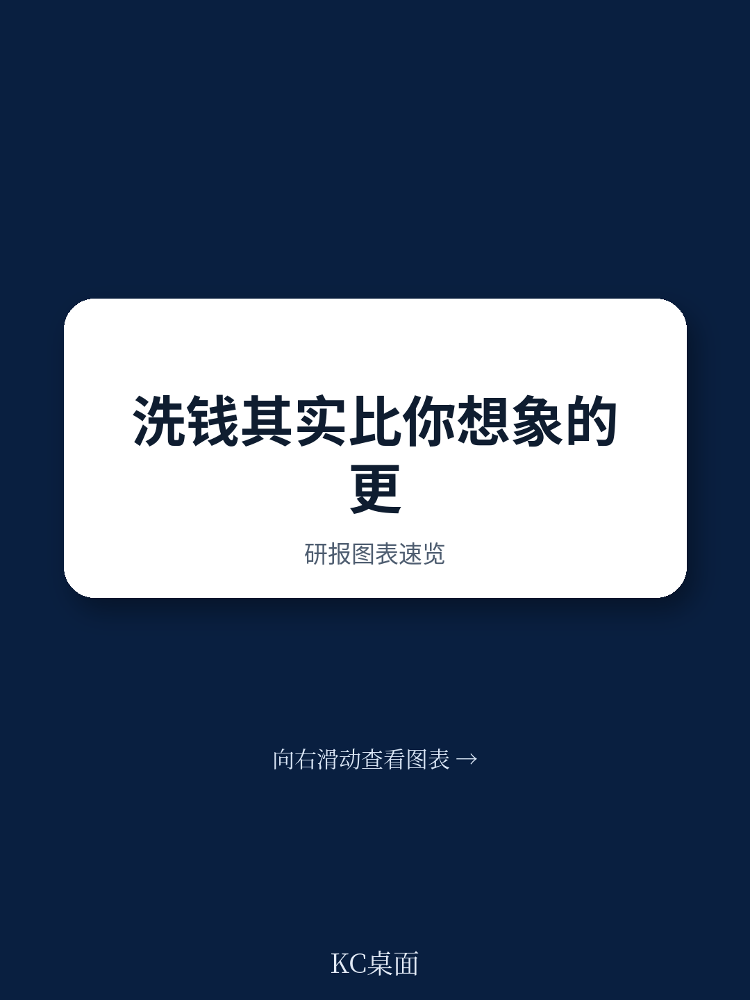
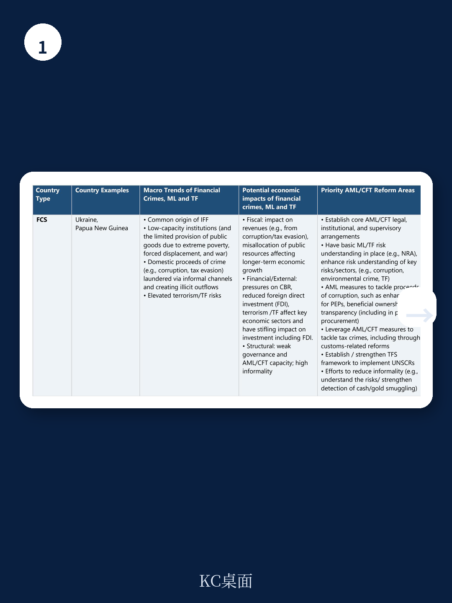
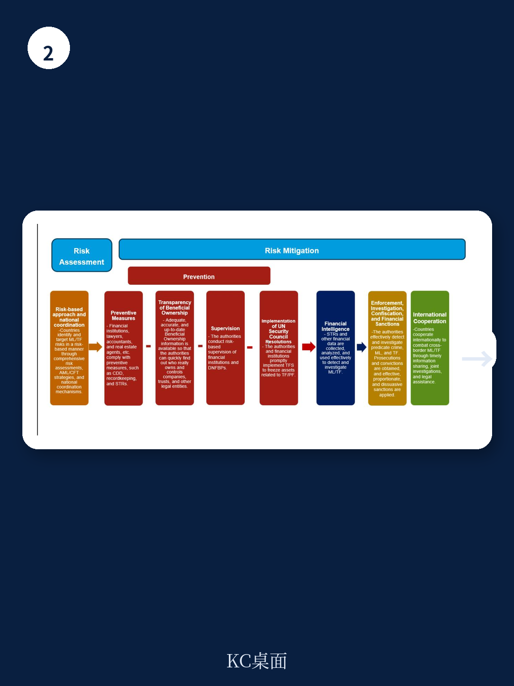

# IMF：IMF反洗钱与反恐融资指引

国际货币产品组织（IMF）在2026年6月发布的最新反洗钱/反恐融资（AML/CFT）指引中，做了一个关键判断：洗钱、资金犯罪和恐怖融资不再只是法律执行层面的问题，它们已经具备了威胁一国国际收支平衡、资金体系稳定甚至跨境传染的宏观冲击力。这份长达数十页的指引，核心是在回答一个更根本的问题——当资金诚信出现系统性漏洞时，宏观宏观环境政策工具是否还够用。

报告明确将AML/CFT议题纳入IMF的三大核心工作流：双边监督（Article IV磋商）、资金部门评估规划（FSAP）和产品资源使用（UFR）。这比2012年版指引的覆盖范围更广，尤其是首次系统性地将AML/CFT条件性纳入产品支持的项目设计。IMF认为，资金诚信的缺失不仅会扭曲资产价格和研究决策，还可能通过跨境交易渠道将一国的制度弱点输出到其他国家。

> **KC评论：** 这份指引的潜台词是，过去IMF更多把洗钱当作“合规问题”交给FATF去处理，但现在它认为，如果一个国家的反洗钱框架存在系统性缺陷，这个国家的外部账户、汇率、财政甚至货币政策都会受到实质影响。这意味着，未来IMF的贷款条件中，反洗钱改革可能成为和财政整顿、货币政策一样常见的硬约束。

## 1. 洗钱对宏观宏观环境的冲击路径，比想象中更具体

报告在第二章专门搭建了一个分析框架，梳理了洗钱和资金犯罪影响宏观环境结果的几条关键渠道。最值得注意的不是理论推导，而是报告列举的具体国家案例——虽然指引没有点名，但它在多个地方暗示，某些新兴市场和发展中地区因为反洗钱框架薄弱，导致资本外流、银行体系被渗透、甚至国际收支数据失真。

报告特别指出，洗钱往往通过跨境交易完成，因此一国的制度弱点具有“溢出效应”。如果一个国家的AML/CFT体系无效，它不仅会吸引外国犯罪资金流入，还可能成为犯罪活动的“出口基地”，把不确定性转嫁给其他国家。这种跨境传染机制，正是IMF将其纳入双边监督的法定依据——因为根据IMF的《综合监督决定》，成员国可以就影响国际货币体系稳定的政策缺陷进行讨论。

## 2. 不同国家面临的不确定性类型完全不同，不能一刀切

报告的附录三做了一个非常细致的分类，把成员国按照宏观环境特征和不确定性暴露程度分成六类：脆弱和受冲突影响国家（FCS）、小型发展中地区（SDS，再细分为有离岸资金中心和无离岸资金中心两类）、其他新兴市场和发展中地区、以及发达地区。

每一类的不确定性画像和应对重点都不同。例如，FCS国家面临的主要问题是治理薄弱、非正规宏观环境占比高、以及恐怖融资不确定性；而发达地区的不确定性则集中在房地产市场和专业中介机构（律师、会计师、信托服务提供商）被利用来洗钱。报告认为，发达地区虽然是全球资金中心，但恰恰因为市场深度和复杂性，它们成为非法资金“整合”进入主流宏观环境的主要目的地。

这种分类的意义在于，它让IMF的监督和贷款条件设计有了更精准的切入点。对于FCS国家，重点可能是建立基本的法律和监管框架；对于有离岸资金中心的小型地区，重点则是加强跨境资金流动的监控和受益所有权透明度。

## 3. 产品资源使用中的AML/CFT条件性，正在成为新常态

指引的第五章详细讨论了如何在IMF贷款项目中加入AML/CFT相关的条件性。报告明确，这类条件性通常会被纳入，前提是它对于实现项目目标或监督项目执行“至关重要”。具体形式可以包括：先决行动、量化绩效标准、结构性基准，以及项目审查中的评估指标。

报告还特别提到了“交叉条件性”问题——即FATF的灰名单或黑名单状态与IMF贷款条件之间的关系。指引指出，虽然IMF不会自动因为一个国家被FATF列入灰名单就施加条件，但如果灰名单状态本身反映了该国存在宏观关键性的AML/CFT缺陷，那么IMF完全有理由将其纳入项目设计。

> **KC评论：** 这意味着，未来如果一个国家被FATF灰名单标记，它可能同时面临IMF贷款条件的收紧。这不是两个独立的问题，而是会形成政策联动。对于正在申请IMF贷款的新兴市场国家来说，反洗钱改革不再是“加分项”，而是“准入门槛”。

## 4. 这份指引的真正信号：资金诚信正在成为宏观政策的“第三支柱”

如果把这份指引放在IMF过去几年的政策演变中看，一个清晰的趋势是：资金诚信正在从边缘议题走向核心。2023年的AML/CFT战略评估已经定下了基调，而2026年的这份操作指引则是把战略落地为具体的工作流程。

报告在多个地方强调，AML/CFT问题与IMF其他政策领域高度相关，包括代理行关系、资金科技和数字货币、治理、脆弱国家、以及小型发展中地区。这意味着，未来IMF在讨论数字人民币、跨境支付、或者加密货币监管时，反洗钱视角将成为默认的分析维度。

对于政策制定者和市场参与者来说，这份指引传递的信息很明确：资金诚信不再只是合规部门的事，它正在成为影响资本流动、汇率稳定和主权信用的宏观变量。那些在反洗钱框架上存在系统性漏洞的国家，未来可能面临更高的融资成本和更严格的外部监督。
