# Health Spending Efficiency in Portugal: Drivers, Challenges and Reform Priorities

Carolina Bloch

SIP/2026/064

IMF Selected Issues Papers are prepared by IMF staff as background documentation for periodic consultations with member countries. It is based on the information available at the time it was completed on May 28, 2026. This paper is also published separately as IMF Country Report No 26/148.

2026
JUL

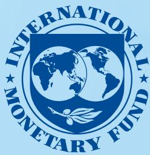

# IMF Selected Issues Paper European Department

# Health Spending Efficiency in Portugal: Drivers, Challenges and Reform Priorities Prepared by Carolina Bloch

Authorized for distribution by Jean-François Dauphin
July 2026

IMF Selected Issues Papers are prepared by IMF staff as background documentation for periodic consultations with member countries. It is based on the information available at the time it was completed on May 28, 2026. This paper is also published separately as IMF Country Report No 26/148.

ABSTRACT: Portugal's health system is facing increasing spending pressures driven by population aging, constraints in the availability and deployment of health workers, and rising input costs, while access bottlenecks persist. Although health spending levels are broadly comparable to those of peer countries, recent spending growth (particularly in personnel, pharmaceuticals, and outsourced services) has not consistently translated into sustained improvements in access or in operational system performance. This paper analyzes the drivers of health spending growth in Portugal and the scope for efficiency gains, focusing on spending composition, input costs, and institutional and budgetary factors that affect how resources are allocated and used in the health sector.

RECOMMENDED CITATION: Bloch, Carolina. 2026. Health Spending Efficiency in Portugal: Drivers, Challenges and Reform Priorities. IMF Selected Issues Paper (SIP/26/064) Portugal. International Monetary Fund, Washington, DC.

<table><tr><td>JEL Classification Numbers:</td><td>H51, I18, D24, H68</td></tr><tr><td>Keywords:</td><td>Portugal, health spending efficiency, public health expenditure, population aging, healthcare workforce, pharmaceuticals, health system reform, spending reviews, fiscal sustainability, SNS.</td></tr><tr><td>Author&#x27;s E-Mail Address:</td><td>CDubeuxBloch@imf.org</td></tr></table>

# Health Spending Efficiency in Portugal: Drivers, Challenges and Reform Priorities

Portugal

Prepared by Carolina Bloch $^{1}$

# PORTUGAL

SELECTED ISSUES

May 28, 2026

Approved By

Prepared By Carolina Bloch (FAD).

European Department

## CONTENTS

Acronyms 2

HEALTH SPENDING EFFICIENCY IN PORTUGAL: DRIVERS, CHALLENGES AND REFORM PRIORITIES 3
A. Introduction 3
B. Healthcare Model and Spending Composition 5
C. Input-Related Cost Drivers 8
D. System-Level and Budgeting Reforms and Constraints 11
E. Conclusion and Policy Options to Enhance Health Spending Efficiency 13

## BOXES

1. Overview of the Portuguese Health System 6

2. Portugal's Health Spending Review: Scope and Implementation Constraints \_\_\_\_ 13

## FIGURES

1. Benchmarking and Recent Trends of Current Health Spending \_\_\_\_ 4

2. Health Spending by Financing Schemes and Funding Sources \_\_\_\_ 7

3. Composition of Current Health Expenditure in Portugal and EU Countries \_\_\_\_ 8

4. Hospital Spending: Signs of High Costs and Continued Strain \_\_\_\_ 8

5. Contributions of Main Spending Components to SNS CHE Growth, 2019-2024 \_\_\_\_ 9

6. Employment and Compensation of Healthcare Professionals 10

7. SNS Spending on Pharmaceuticals: Changes in Volume and Price \_\_\_\_ 11

References 15

## Acronyms

<table><tr><td>ADM</td><td>Assistência na Doença aos Militares (Health subsystem for the Armed Forces)</td></tr><tr><td>ADSE</td><td>Assistência na Doença aos Servidores do Estado (Health subsystem for civil servants)</td></tr><tr><td>CHE</td><td>Current Health Expenditure</td></tr><tr><td>CRI</td><td>Centros de Responsabilidade Integrada (Integrated Responsibility Centers)</td></tr><tr><td>ECG</td><td>Excess Cost Growth</td></tr><tr><td>INFARMED</td><td>Autoridade Nacional do Medicamento e Produtos de Saúde (National Authority of Medicines and Health Products)</td></tr><tr><td>LTC</td><td>Long-Term Care</td></tr><tr><td>MTEF</td><td>Medium-Term Expenditure Framework</td></tr><tr><td>PRR</td><td>Plano de Recuperação e Resiliência (Recovery and Resilience Plan)</td></tr><tr><td>SNS</td><td>Serviço Nacional de Saúde (National Health System)</td></tr><tr><td>ULS</td><td>Unidades Locais de Saúde (Local Health Units)</td></tr><tr><td>UNPP</td><td>United Nations World Population Prospects</td></tr><tr><td>WHO</td><td>World Health Organization</td></tr></table>

## HEALTH SPENDING EFFICIENCY IN PORTUGAL: DRIVERS, CHALLENGES AND REFORM PRIORITIES $^{1}$

Portugal's health system is facing increasing spending pressures driven by population aging, constraints in the availability and deployment of health workers, and rising input costs, while access bottlenecks persist. Although health spending levels are broadly comparable to those of peer countries, recent spending growth (particularly in personnel, pharmaceuticals, and outsourced services) has not consistently translated into sustained improvements in access or in operational system performance. This paper analyzes the drivers of health spending growth in Portugal and the scope for efficiency gains, focusing on spending composition, input costs, and institutional and budgetary factors that affect how resources are allocated and used in the health sector.

## A. Introduction

1. Health spending efficiency has become a policy priority for Portugal amid rising fiscal pressures and rapid population aging. Nearly a quarter of the population is aged 65 or older, one of the highest shares in Europe. Aging is driving demand for chronic disease management and long-term care, and increasing the load on hospitals and primary care (Economic Policy Committee, Ageing Working Group, 2024). At the same time, technological change and higher expectations for quality and timely access contribute to further pushing costs up. Together with workforce constraints, higher input prices—as well as the need to address a persistent stock of arrears—they are expected to further raise overall health spending needs (OECD, 2023).

2. Total current health expenditure (CHE) has remained broadly stable over the past two decades, fluctuating around 12-14 percent of total government spending (Figure 1.A). Total (private and public) current health expenditure has been close to 10 percent of GDP, above the EU average. It has grown in real per-capita terms broadly in line with the EU-27 since 2000 (Figure 1.B), with only a few advanced European countries (such as Germany, France, Austria, and Belgium) allocating a larger share of national income to health. As population aging and excess cost growth are projected to increase public health spending by around 2 percentage points of GDP by 2050 under baseline policies (Figure 1.C), the health system is likely to remain an important source of fiscal pressure in the medium-term absent reforms.

Figure 1. Benchmarking and Recent A. Health spending is stable relative to GDP but absorbs a growing share of government spending.  
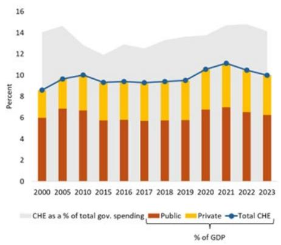

Trends of Current Health Spending
B. . Per capita health spending has grown broadly in line with EU peers.  
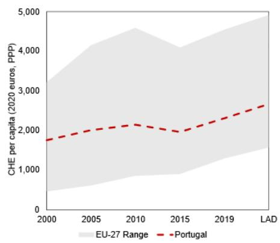  
D. Portugal has moved closer to the efficiency frontier, but significant gaps remain.

C. Population aging and cost pressures are expected to continue pushing public health spending upwards over the medium term.  
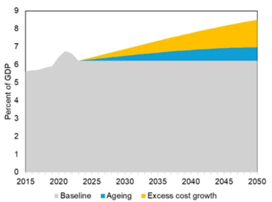

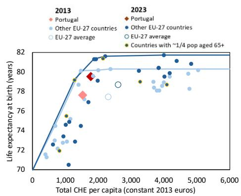  
Source: IMF staff estimates based on WHO, OECD and UNPP data.

Notes: Panel C (Projections): our approach is decomposing historical spending growth into an excess cost growth (ECG) component and a demographic component. The ECG component includes technological progress, Baumol's cost disease (i.e., wages rising faster than productivity in labor-intensive health services), rising demand for health services unrelated to demographic, and other unobserved components. The ECG is based on the average country specific growth rate of health expenditure/GDP during 1980–2019 holding the demographic profile constant. The demographic component is based on the size of the population age groups from the UN World Population Prospects by year, combined with age-health spending profiles developed by the OECD and National Transfer Accounts, to create an aging scaling factor. The aging scaling factor and the ECG are then combined to project health expenditure share estimate.

Panel D: The frontier is estimated non-parametrically. Input-oriented gaps indicate how much spending per capita could be reduced to reach the best-practice frontier while keeping the outcome fixed (a leftward move toward the frontier). Results are sensitive to indicator choice and methodology; in particular, DEA-based estimates using cross-country macro data should be interpreted with caution and as indicative orders of magnitude rather than precise estimates (e.g., cross-country differences in needs, risk factors, and reporting are not fully controlled for). Countries circled in yellow have at least 22% of the population aged 65 or over (Portugal has 24%).

3. Benchmarking against EU peers suggests that Portugal's health spending level is broadly consistent with its income level and demographic profile, but efficiency gaps persist. Aggregate health outcomes, while solid, are comparable to those of countries that spend less, indicating scope to improve how resources are allocated and managed rather than simply increasing spending to address growing needs. Efficiency frontier analysis $^{2}$ shows that despite improvement, Portugal still operates inside the frontier: between 2013 and 2023 Portugal moved closer to the curve that relates life expectancy at birth to health spending per capita; however, bearing in mind methodological limitations, estimates suggest that savings in the order of $\frac{1}{4}$ of current spending could be achieved while preserving outcome levels if Portugal were to operate at the frontier (Figure 1.D). This is consistent with similar estimates from Banco de Portugal 2023.

4. This paper looks at the main drivers of health spending growth in Portugal, assesses the scope for efficiency gains, and discusses policy implications. It focuses on separating activity/volume effects from cost-related drivers: e.g., whether higher hospital spending reflects more patients treated or higher unit costs, wage-bill growth is mainly due to salary increases or staffing expansion, and pharmaceutical outlays are rising because of greater consumption or higher prices. By linking these trends to key institutional and governance features, the analysis seeks to distinguish pressures that are largely structural or unavoidable (such as aging and the burden of chronic disease) from those that can be reduced through policies and improved management. The next three sections explore potential sources of inefficiency, focusing on spending composition, input cost drivers, and system-level constraints. The last section concludes with policy implications for containing fiscal pressures while considering access and quality concerns.

## B. Healthcare Model and Spending Composition

5. Portugal's health system relies on a public universal national health service, which is mostly tax-financed. Public health services are predominantly financed through general government schemes, with limited "own revenues," especially since the elimination of moderating fees (Box 1). Government financing (tax-financed direct transfers from the State budget) accounts for around 59 percent of CHE (higher than the EU average), while social health insurance (schemes financed primarily through earmarked Social Security contributions) represents only about 3 percent (vs. over 40 percent in EU) (Figure 2). This financing structure implies that changes to SNS spending directly translate into pressures on the central budget, even though a significant share of overall health spending is borne by households through out-of-pocket payments, as discussed below. As a result, fiscal consolidation episodes tend to affect the health sector through budget envelopes rather than through contribution rates or earmarked pools.

## Box 1. Overview of the Portuguese Health System

Portugal's public health system is built around the national health service (Serviço Nacional de Saúde, SNS), which guarantees universal access. General practitioners (family doctors) are intended to act as gatekeepers to specialist and hospital care. The SNS was created in 1979 with the prospect of providing free-at-point-of-use access while allowing complementary financing arrangements, including moderating fees, which were later mostly eliminated except for hospital visits without referrals. The Ministry of Health centralizes the resources and contracts annual budgets of around €14 billion (4.8 percent of GDP) with local health entities.

Since 2024, most public hospitals and primary care centers have been integrated into 39 Local Health Units (Unidades Locais de Saúde, ULS), which brought these entities together within single administrative and financial structures and now cover the entire country. These ULS are predominantly public providers within the SNS, while some hospitals have been managed under public–private partnership arrangements, and some specialized institutions (such as oncology institutes) remain outside the ULS model.

Alongside the SNS, several occupation-based and private schemes provide additional coverage, especially for faster access to elective care and diagnostics. These include ADSE for civil servants, ADM and SAD for military and security forces, and various corporate or mutual schemes (e.g., SAMS), as well as voluntary health insurance.

6. Portugal stands out for the high share of health spending paid directly by households, reflecting a large recourse to private health providers paid out of pocket. Out-of-pocket spending amounts to around 30 percent of CHE, about 10 percentage points higher than the EU average and above Spain and Italy (Figure 2.A). This has implications for financial protection and equity in access, particularly if households are paying because timely care is not available in the SNS rather than out of provider preference. It also complicates how system performance is measured: part of the response to SNS constraints is an expansion of private utilization (including voluntary health insurance; Figure 2.B), which may relieve some pressure in the short run (although capacity constraints have also emerged in private providers in recent years), but can also weaken incentives to address bottlenecks in the public sector.

B. The share of household direct payments in CHE remains persistently high, while that of government has decreased.

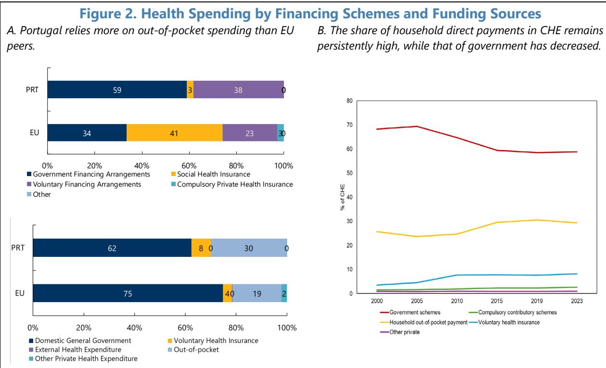  
Source: IMF staff calculations based on WHO GHE database.  
Note: In the top graph of panel A, "Voluntary Financing Arrangements" includes household voluntary health insurance as well as out-of-pocket payments to providers (both private and public).

7. Since 2000, curative care has significantly shifted from inpatient to outpatient and day care, while preventive and long-term care have remained limited compared to peers. This evolution is consistent with past reforms aimed at expanding ambulatory care and integrating primary and secondary services. Relative to the EU, outpatient curative care absorbs a comparatively high share of CHE and inpatient spending is somewhat lower (Figure 3). While a lower reliance on inpatient care could reflect efficiency gains through substitution away from costly hospital admissions toward ambulatory treatment, this can also result from misallocation across levels of care: limited access to primary care and weak gatekeeping can push patients into hospital outpatient departments for services that could be delivered more cheaply in community care. Similarly, the relatively low provision of long-term care reflects limited formal capacity, resulting in a heavy reliance on family-based support and, in some cases, the use of hospital services for patients with long-term care needs. At the same time, notwithstanding some increase in recent years, the low levels of spending on preventive and long-term care suggests that the system remains more disease-centered than prevention-oriented, despite aging and the burden of chronic conditions.

of High Costs and Continued Strain
B. Hospital costs and length of stay are higher in Portugal than in EU peers

Figure 3. Composition of Current Health Expenditure in Portugal and EU Countries  
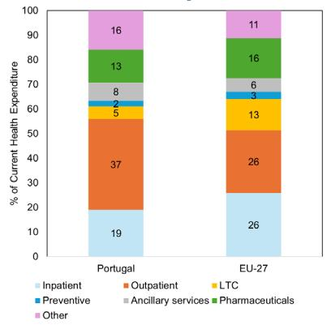  
Source: IMF staff elaboration based on WHO Government Health Expenditure dataset.  
Note: the shift to ULS and integrated healthcare is still at early stages and, as the data are from 2022, numbers do not necessarily reflect the current situation.

8. Spending and activity have increased, but access bottlenecks remain. Part of the post-2021 acceleration in the expansion of activity reflects catch-up from the pandemic and efforts to reduce backlogs. The authorities reported a sizable increase in hospital output (e.g., 5 percent increases in consultations and in surgeries between 2023 and 2024). However, despite higher resources absorbed by hospitals, long waits for elective surgery persist. This reflects continued capacity constraints, which are exacerbated by higher cost per patient and inpatient length of stay (Figure 4). This is compounded by continuing gaps in system gatekeeping: the authorities estimate that around 1.6 million SNS users do not have a family doctor, which increases reliance on emergency departments as an entry point. The authorities also highlighted that many hospital beds are occupied by patients who should be in long-term or home care, adding pressure to the system.

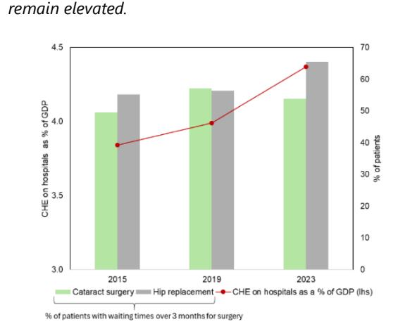  
Source: IMF staff calculations based on WHO and OECD.

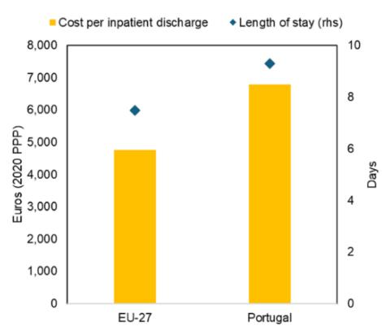

## C. Input-Related Cost Drivers

B. Wages and pharmaceuticals account for a large share of recent spending growth.

9. The recent acceleration in SNS spending is concentrated on wages, medical goods (especially pharmaceuticals), and outsourcing. During 2019-24, SNS CHE increased by 20 percent in real terms (Figure 5.A). Almost half of the growth was explained by personnel spending, and around a third by purchase of medical goods (20 percent from pharmaceuticals) (Figure 5.B). The remaining 20 percent is linked to external provision and services, which include services and externally procured pharmaceuticals. As discussed below, each of these components is linked to concrete constraints identified by the authorities, particularly the management of the health workforce (including use of temporary staff), challenges in containing growth in volumes of pharmaceuticals, and fragmented procurement/clinical decisions outside standardized protocols. Figure 5 decomposes the recent evolution of SNS current health expenditure to help frame where fiscal pressure is coming from, where savings are most likely and determine what could be realistic magnitudes for efficiency gains in public spending.

Figure 5. Contributions of Main Sp
A. Spending growth between 2019 and 2024 is concentrated in personnel, medical goods, and external services.

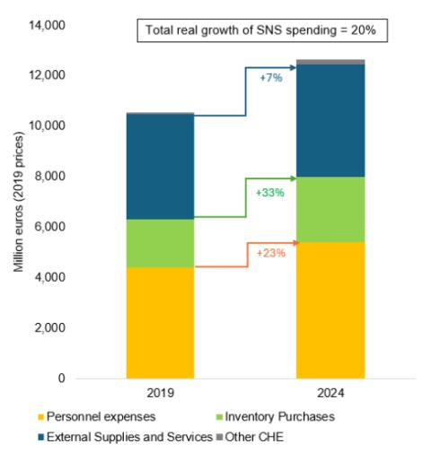

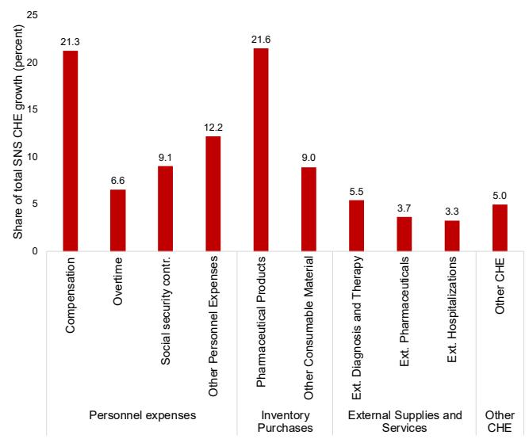  
Source: IMF staff calculation based on SNS accounts data provided by the Portuguese authorities.

10. Rising personnel costs reflect wage dynamics, staffing gaps, and heavy reliance on overtime and temporary work. The healthcare wage bill explains the largest share of spending growth since 2019. While recent trends reflect hiring more than wage increases (Figure 6.A), shortages persist in family medicine, obstetrics, and nursing, and overtime has risen sharply, increasing costs and risking undermining motivation and productivity. The lack of exclusivity for nurses and physicians, combined with a tight labor market, facilitates dual public/private practice and reduces effective availability for the SNS. This is compounded by the use of personnel outside the payroll through acquisition of services (tarefeiros) as a structural workaround for workforce and capacity constraints, which may raise costs and weaken accountability over performance. The result is that overall personnel-related spending keeps increasing, while staff output is broadly flat. Evidence suggests that productivity in the SNS has been declining since 2015 despite rising

B. Healthcare professional remuneration divided by average annual wages.

spending (Barros and Santos, 2024), implying that lower productivity is both a contributor to, and a consequence of, rising costs.

11. As the demand for more complex services grows with population aging and technology, so will the pressure to hire and motivate (including through higher pay) qualified professionals. Latest benchmarking data on healthcare workforce compensation suggests that salaries in Portugal may be less competitive than in peers (especially for nurses), which affects attraction and retention (Figure 6.B). Workforce aging and the emigration of many young health professionals to higher-paying countries leave mid-career gaps that make replacement and knowledge transfer difficult. Flexibility in training and task shifting to strengthen both the number and role of nurses could help but faces resistance from professional groups. These upward pressures related to salaries have already started to materialize through recent multi-year wage-increase agreements (on average, around 24 percent for nurses and 10 percent for doctors by 2027). It is likely that future pressures will increasingly come from compensation, in addition to employment.

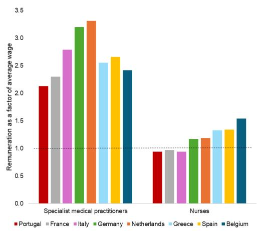  
Source: IMF staff calculations based on OECD and Fiscal Council (original data from DGAEP for panel A). Notes (Panel A): Latest available data are from 2023 for Portugal, and variable for other countries. Remuneration comparisons should be read cautiously: data are not fully harmonized across countries and may differ in coverage (public vs. public+private), employment concept (headcount vs. FTE), and inclusion of supplements/overtime. In Portugal, dual practice and the public-private mix further complicate interpretation, especially for physicians and nurses.

## 12. Pharmaceuticals are a growing source of pressure, despite increased use of generics.

Recent growth appears to be driven primarily by volumes rather than prices, except in 2020 (Figure 7). Authorities identified hospital drugs (including oncology, diabetes, and rare diseases) as the main source of pressure, where both volume growth and the diffusion of expensive therapies matter. From an efficiency perspective, a volume-driven profile may reflect appropriate expansion of access and treatment intensity (including catch-up in activity after the pandemic). However, the volume growth could also stem from clinical practice variation and new therapies expanding beyond initial indications which, while difficult to verify with data, was highlighted by the authorities as having important cost implications ("health budget is ultimately determined at doctor's pen").

Figure 7. SNS Spending on Pharmaceuticals: Changes in Volume and Price  
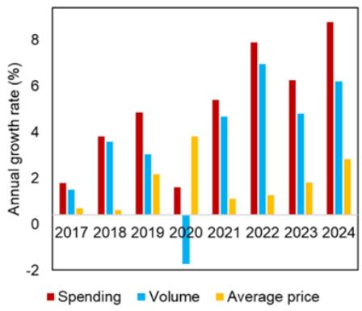  
Source: IMF staff elaboration based on WHO and SNS Transparency Portal; see INFARMED data.

## D. System-Level and Budgeting Reforms and Constraints

13. In response to access bottlenecks and rise in chronic care needs, the authorities have initiated reforms to better integrate care and strengthen accountability. A key step has been the generalization of the ULS, integrating hospitals and primary care centers within single administrative and financial structures in the entire country (Goiana-da-Silva et al, 2024). This has also changed financing: from 2024, hospital contracting shifted from a volume-based approach (compromisso assistencial, under which transfers to providers were largely based on agreed activity volumes) to a capitation-based model. $^{3}$ While these reforms strengthen the framework for analyzing and addressing efficiency, many are still at an early implementation phase. For example, analytical cost accounting is being designed and tested, aiming to produce comparable data across hospitals and ULS starting in 2026. More generally, frequent institutional changes have been identified as a cause of delay in the implementation of reforms and measures (Conselho das Finanças Públicas, 2025). As a result, early evidence on the impact of ULS integration and capitation contracting on efficiency will likely remain partial in the near term, and careful monitoring will be needed to distinguish possible reform implementation gaps from reform design limitations.

14. Underbudgeting, bailouts, and arrears have been weakening efficiency incentives and SNS reform efforts. As overspending is regularly covered through end-year support, an underlying efficiency concern is that entities face weaker incentives to internalize cost control as they expect ex-post financing. This dynamic interacts with the contracting framework: counterparts noted that, under “contratos-programa,” ULSs often know at the start of the year that targets and budgets are not feasible, and that related spending will then “explode”, leading to government bailouts. In this setting, the shift to capitation-based contracting in 2024 is unlikely to deliver its intended efficiency effects (better management of defined patient populations and cost control) if deficits and arrears are later socialized (and if providers price these risks into contracts). Finally, while Portugal has an ambitious pipeline of health investments under the PRR and national plans, the chronic under-execution of health infrastructure projects—reflecting, as in other sectors, weaknesses in planning, implementation and oversight (see 2025 PIMA)—masks inefficiencies as it offsets overruns in current health spending and adds to challenges in budgeting (Barros and Santos, 2025).

15. Program budgeting and a strengthened spending review process are important steps to enhance the credibility of reforms. Until the 2025 budget law, measures and targets in health plans and budgets were not systematically costed, which undermined prioritization (e.g., without costing, it is difficult to weigh community-care against hospital expansions) and translation of access commitments (e.g., reducing waiting lists) into credible delivery models (e.g., integrated and continuous care). Program budgeting, introduced in the 2026 budget cycle, is an opportunity to enhance planning. Ex-ante costing of reforms is also expected to improve as Portugal has been strengthening its spending review framework (Box 2).

16. The reform agenda relies heavily on better data infrastructure to support planning, monitoring, and accountability across public health entities. The government is rolling out a new waitlist management system, with improved tracking of waiting times, prioritization rules, and referral to private or social sector providers if the SNS cannot respond within the guaranteed time limit. Other operational reforms include efforts to clean and strengthen the national user registry, expand and harmonize electronic health records (including integration of private sector information). While these reforms are promising, fragmentation limits their impact, given the uneven capacity of institutions and personnel to work with different systems. Interoperability challenges persist because hospitals historically adopted different IT systems, and harmonizing data fields and standards remains work in progress even when digital coverage is high. Advancing digital transformation will also support authorities' efforts to improve planning, effectively implementing program budgeting and estimating savings from spending reviews more accurately (as well as strengthening monitoring of system performance).

## Box 2. Portugal's Health Spending Review: Scope and Implementation Constraints

Portugal has been moving toward a more structured spending review framework, with clearer governance and a tighter link to the budget process. The 2024 cycle was the first under a new methodology, guided by a dedicated manual that standardized analytical steps and governance arrangements for reviews. Building on this experience, a decree adopted in July 2025 formally clarified roles, reporting obligations, and the intended integration of spending review outputs into annual budgets and medium-term expenditure frameworks (MTEF). The new decree also strengthens transparency requirements and introduces an incentive/adjustment logic. Documented and validated savings may partly revert to the entity/sector, while deviations from the planned trajectory should be justified and compensated through additional measures.

The process is designed to start early. Under the July 2025 framework, spending review reports (diagnosis and policy options) are meant to be approved before the start of the budget year and factored into the draft budget and MTEF update. Topics are selected about two years ahead, based on fiscal relevance and government priorities.

Health is among the priority spending areas. The 2024 health spending review focused on two intervention areas: (i) contracted care in dialysis and physical therapy/rehabilitation services; and (ii) medicines, with an emphasis on generics and biosimilars. The scope of the review of pharmaceutical spending will be expanded in 2026, and human resources in health is already being considered for the 2027 cycle.

Initial savings estimates have not materialized as expected, largely due to implementation delays. Spending reviews produce estimate of savings, (e.g., about €70 million in the 2024 health spending review) but achieving them has proved difficult. Broadly, three constraints recur in discussions with stakeholders: (i) baseline construction remains difficult, including because of data access limits and reliance on historical extrapolation; (ii) limited comparable cost and activity data across providers weakens ex post verification and attribution; and (iii) frequent institutional/political changes can interrupt implementation momentum (precisely when sustained follow-through is needed to convert “identified measures” into realized savings and service improvements).

References: Governo de Portugal, Conta Geral do Estado 2024 (2024) and Decreto-Lei n.º 87/2025, de 25 de julho (revisão da despesa pública) (2025), and Tribunal de Contas, Auditoria ao Exercício de Revisão da Despesa (Spending Review) (2024).

## E. Conclusion and Policy Options to Enhance Health Spending Efficiency

17. While Portugal's health expenditure is broadly in line with peers, recent spending acceleration and persistent access bottlenecks suggest scope for efficiency gains. Activity has recovered since the pandemic, but wait times remain high and hospitals report persistent congestion. Pressures are concentrated in personnel, pharmaceuticals, and outsourced services, pointing to challenges in how resources are deployed rather than overall spending levels. Key areas include the balance between hospital and non-hospital care, workforce management (including reliance on outsourcing), the use of clinical protocols to manage pharmaceutical spending, and fiscal governance arrangements to ensure that reforms translate into sustained savings. As the ULS and capitation reforms progress, improvements in costing, data, and accountability will be critical to monitor results and contain medium-term spending pressures.

18. The ULS rollout and the shift to capitation-based contracting are steps toward a model that rewards integration and population management rather than activity alone. But the reforms are still recent, and key enablers are not yet fully operational. In particular, analytical cost accounting and interoperable information systems are still being developed, which limits near-term comparability of costs and activity across providers and makes it harder to attribute changes in spending and performance to specific measures. Moreover, while the elimination of moderating fees strengthened financial protection, it also reduced a potential demand-management instrument, increasing the importance of effective gatekeeping and supply-side controls to prevent avoidable utilization.

19. The short-term efficiency challenge is less about service volumes than throughput and patient flow. Personnel costs, medical goods (notably pharmaceuticals), and external provision account for most of the increase in SNS spending. This pattern is consistent with a system relying on costly workarounds (e.g., overtime, and outsourcing) and volume-driven growth in high-cost therapies. Gaps in primary care gatekeeping and limited long-term and home-care capacity continue to shift demand toward hospitals and emergency departments and reduce effective capacity for elective care. These constraints help explain why higher spending has not consistently translated into sustained improvements in access.

20. Policy options to improve health spending efficiency fall into two broad areas: completing ongoing reforms and addressing remaining incentive and capacity gaps. First, sustained implementation of reforms already underway is critical. These include the rollout of the ULS, the shift to capitation-based contracting, and the development of analytical cost accounting and interoperable information systems, which are essential to support better planning and accountability but are still at an early stage. Second, additional measures could help address persistent bottlenecks. These include strengthening primary care gatekeeping, expanding long-term and home-care capacity to reduce pressure on hospitals, and reinforcing clinical protocols and prescribing controls to limit volume-driven spending growth. As moderating fees were largely removed, these non-price-related instruments currently play a central role in limiting avoidable utilization while preserving access and financial protection. Over the medium term, authorities could also consider a carefully designed and targeted reintroduction of moderating fees to complement gatekeeping reforms as a demand-management tool, particularly for non-urgent or avoidable use of hospital and emergency services.

21. Strengthening budgeting and spending review governance is central to sustaining efficiency gains. Repeated underbudgeting followed by ex-post bailouts weakens cost discipline and reduces incentives for providers to operate within budget constraints. Health budgets could be set using more transparent and objective criteria, with clearer expectations on expenditure paths.

22. The spending review framework has become more structured and better aligned with the budget cycle, but implementation remains a key challenge. Strengthening governance—particularly through a more prominent role for the Ministry of Finance and senior government coordination in monitoring implementation—would help ensure that identified measures translate into realized savings. Improving reporting on realized savings and linking them more clearly to budget decisions would also help move the process from identifying measures to demonstrating results.

## References

Barros, Pedro Pita, and Carolina Santos. 2024. Orçamento do Estado para a Saúde 2025. Observatório da Despesa em Saúde, Nota 08. Nova SBE / BPI "la Caixa" Foundation Chair in Health Economics. November.

Barros, Pedro Pita, and Carolina Santos. 2025. Orçamento do Estado para a Saúde: Ambição ou Ficção? Observatório da Despesa em Saúde, Nota 10. Nova SBE / BPI "la Caixa" Foundation Chair in Health Economics. October.

Banco de Portugal. 2023. "A macro approach to the relative efficiency of the Portuguese health system." Banco de Portugal Economic Studies 9(4). October. (Cláudia Braz and Sónia Cabral).

Conselho das Finanças Públicas. 2025. Evolução do Desempenho do Serviço Nacional de Saúde em 2024. Relatório n.º 05/2025. July.

Economic Policy Committee, Ageing Working Group. 2024. 2024 Ageing Report: Country fiche—Portugal.

Goiana-da-Silva, Francisco, Juliana Sá, Miguel Cabral, Raisa Guedes, Rafael Vasconcelos, João Sarmento, Alexandre Morais Nunes, Rita Moreira, Marisa Miraldo, Hutan Ashrafian, Ara Darzi, and Fernando Araújo. 2024. "The Portuguese NHS 2024 reform: transformation through vertical integration." Frontiers in Public Health 12:1389057. Published May 23.

doi:10.3389/fpubh.2024.1389057.

OECD/European Observatory on Health Systems and Policies. 2023. Portugal: Country Health Profile 2023. State of Health in the EU. OECD Publishing, Paris / European Observatory on Health Systems and Policies, Brussels.

Portugal. 2025. Decreto-Lei n.º 87/2025, de 25 de julho (Revisão da Despesa Pública). Diário da República, 1.ª série, n.º 142.

Portugal, Ministério das Finanças. 2024. Orçamento do Estado 2025: Relatório. (Prepared with information available up to 10 October 2024).

Portugal, Ministério das Finanças. 2025. Orçamento do Estado 2026: Relatório. (Prepared with information available up to 9 October 2025).

Portugal, Ministério das Finanças. 2025. Conta Geral do Estado 2024: Situação Financeira das Administrações Públicas—Relatório (section on Revisão da Despesa Pública / Spending Review).

Tribunal de Contas. 2024. Auditoria ao Exercício de Revisão da Despesa (Spending Review). Relatório n.º 3/2024, 2.ª Secção. June.