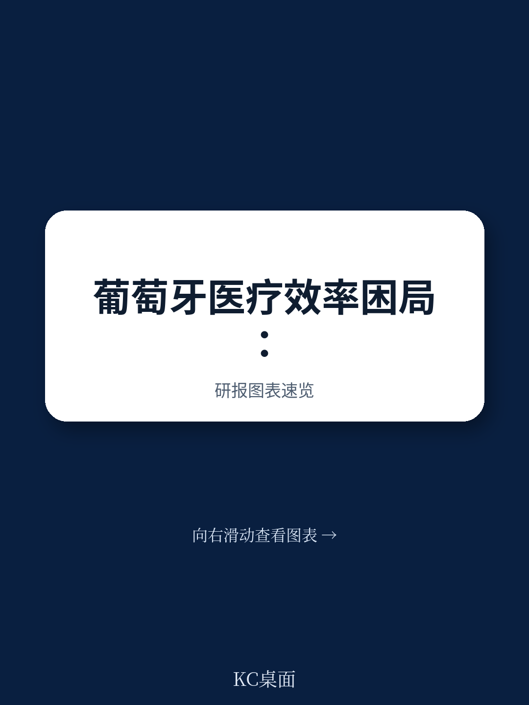
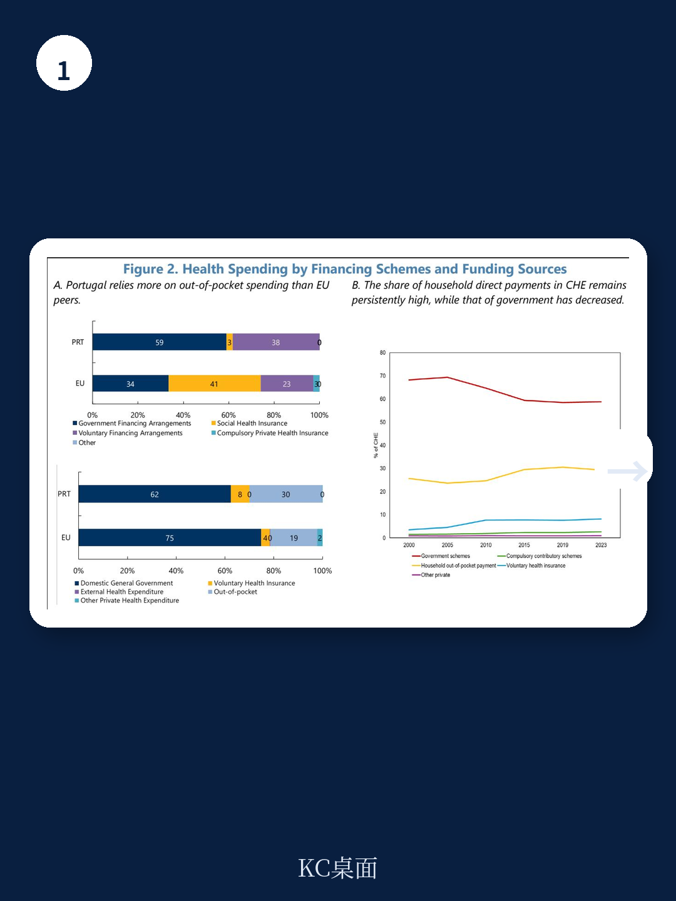
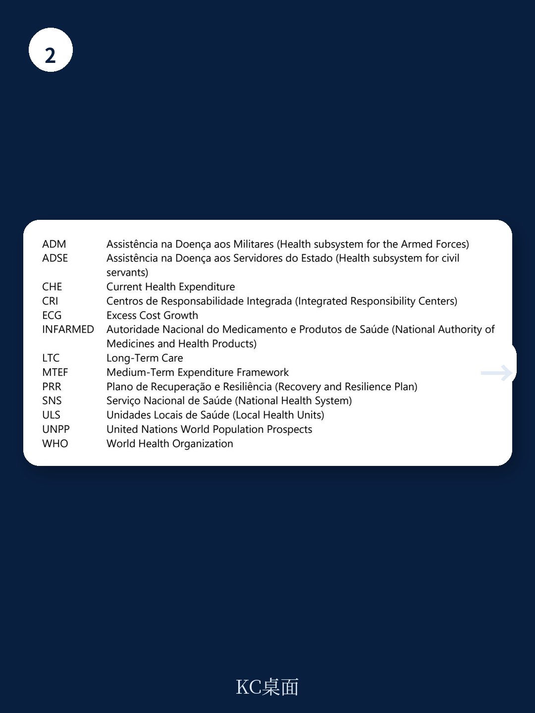

# IMF：葡萄牙卫生支出效率-驱动因素与挑战

葡萄牙的医疗系统正在经历一个令人困惑的阶段：钱花得不少，但效果没有同步跟上。IMF最新发布的国别报告指出，葡萄牙当前卫生支出占GDP比重已超过10%，高于欧盟平均水平，且人均支出增速与欧盟整体基本持平。但问题在于，这笔钱没有持续转化为可感知的医疗服务改善——等待时间依然漫长，家庭医生覆盖率仍有缺口，医院床位被本应转入长期护理的病人占据。

这份由IMF财政事务部Carolina Bloch执笔的报告，核心判断是：葡萄牙医疗系统的效率瓶颈不在资金总量，而在资金如何被分配、定价和管控。报告通过拆解2019至2024年国家卫生服务支出增长的结构，区分了“多治了病人”和“每个病人更贵”两种效应，并指出后者才是支出膨胀的主因。

## 1. 支出增长主要来自“更贵”，而不是“更多”

报告将SNS支出增长拆解为活动量效应和成本效应。以医院支出为例，2019至2024年间，人员费用、药品和外包服务是三大增长引擎。其中，人员费用增长主要来自工资调整和加班补偿，而非医生护士数量的大幅扩张。药品支出方面，新药和高价疗法对价格端的拉动远大于处方量增长。

这意味着，如果只是继续增加预算，而不改变定价机制和采购方式，资金会持续被成本端吸收，而非转化为更多服务产出。报告特别指出，葡萄牙医院的平均住院天数高于欧盟同行，而每例住院成本也偏高，说明资源使用效率仍有压缩空间。

> **KC评论：** 拆解“量”和“价”是理解医疗支出效率的关键。很多国家看到医疗支出上升就认为是老龄化或需求增加，但真正需要追问的是：单位成本是否合理？如果每个病人、每张床、每盒药都比别国贵，那多拨预算只会让成本继续膨胀，而不是解决排队问题。

## 2. 家庭直接支付占比高，反映的是公共系统供给不足

葡萄牙医疗支出的另一个结构性特征是：家庭直接支付占经常性卫生支出的比重接近30%，比欧盟平均水平高出约10个百分点。报告认为，这并非单纯反映消费偏好，而更可能是公共系统供给瓶颈的溢出效应——当SNS无法及时提供诊疗时，患者被迫转向私人机构自费支付。

这种结构会带来两个问题。一是财务保护不足，低收入群体可能因费用推迟就医。二是弱化了公共系统改革的紧迫感：私人部门承接了一部分需求，反而让SNS的堵点不那么显眼。报告还提到，自愿健康保险的覆盖也在扩大，但私人供给端同样面临容量约束。

## 3. 长期护理和预防投入偏低，加重了医院负担

葡萄牙在长期护理和预防方面的支出占比低于欧盟平均水平。报告指出，这导致大量本应进入社区或居家护理的老年患者滞留在医院床位，既推高了住院成本，也挤占了急性期治疗的容量。与此同时，约160万SNS用户没有固定家庭医生，这意味着他们更可能通过急诊进入系统，进一步加重了医院的不确定性。

报告认为，这种“以医院为中心”的资源配置模式，在人口快速老龄化的背景下不可持续。葡萄牙65岁以上人口占比已达24%，是欧洲老龄化程度最高的国家之一。如果不扩大初级保健和长期护理的供给，医院将继续充当“兜底”角色，效率改善无从谈起。

## 4. 改革方向明确，但执行和治理仍是短板

报告对葡萄牙近年推进的整合式地方医疗单元改革给予肯定，认为将医院和初级保健纳入统一管理和预算框架，是提升协调性的正确方向。但报告也指出，关键支撑工具尚未到位：分析性成本核算和可互操作的信息系统仍在开发中，导致不同机构之间的成本和绩效难以横向比较，改革效果也难以归因。

此外，预算编制方式本身也构成约束。报告提到，反复出现的预算不足与事后追加拨款，削弱了供给方的成本纪律。如果预算不能基于客观标准和透明预期，改革措施就难以转化为可持续的财政结果。

> **KC评论：** 医疗改革最容易被忽视的是“治理基础设施”——没有统一的成本口径、没有可比的绩效数据、没有清晰的预算规则，再好的组织结构设计也难以落地。葡萄牙的ULS改革方向是对的，但真正的考验在于能否把信息系统和成本核算补上，让管理者能看清每一笔钱去了哪里、换回了什么。

## 5. 效率提升的关键不在“少花钱”，而在“换种方式花钱”

报告最后给出的政策建议，核心不是压缩支出，而是调整支出结构。具体包括：强化初级保健的守门人作用，扩大长期护理和居家照护能力，加强临床路径和处方管控以抑制高价药品的用量增长，以及在预算编制中引入更透明的标准和中期支出框架。

报告也谨慎提到，在取消大部分使用者共付费用后，需求侧的价格信号几乎消失，这使得供给侧的管控工具变得更加重要。如果能在不损害公平的前提下，重新引入针对非紧急或可避免就医的适度共付，可能有助于引导需求回到更合适的层级。

IMF这份报告的价值，在于它把“效率”从一个抽象概念拆解成了可追踪的变量：人员成本是涨工资还是增人手，药品支出是量增还是价升，医院不确定性是来自需求增长还是床位错配。对于任何正在经历医疗支出上升的国家，这套分析框架都有参考意义。

For informational purposes only. Portions may be generated,translated,summarized,or edited with AI assistance based on source materials and may contain omissions or errors. Please verify independently. This is not investment,legal,tax,accounting,or other professional advice.

