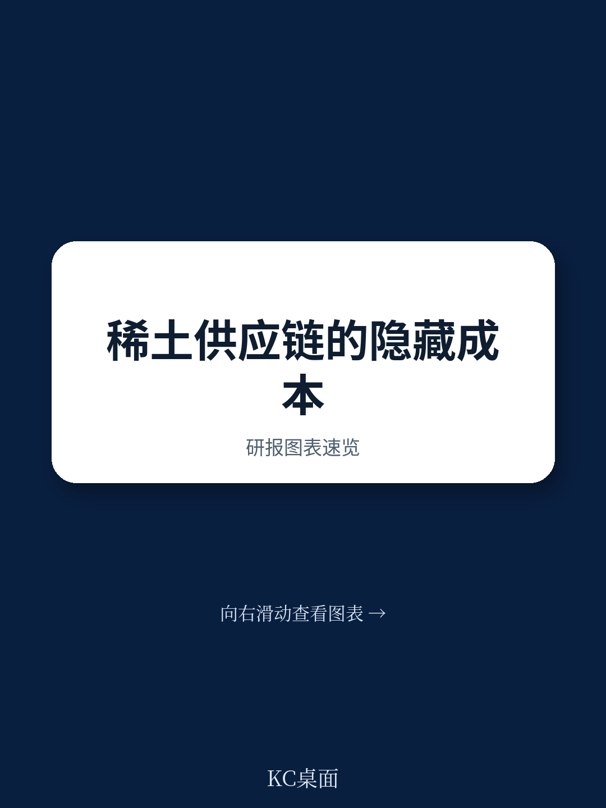
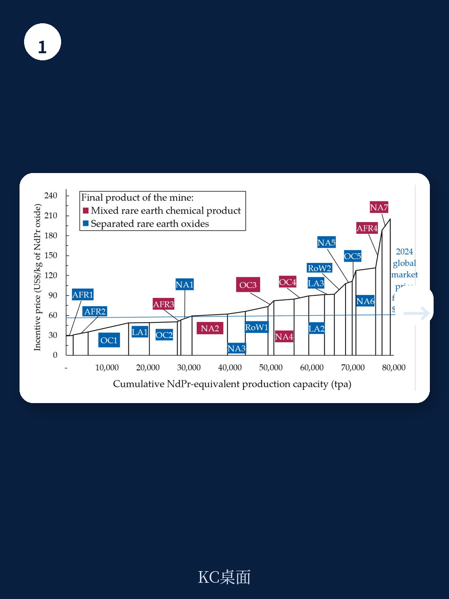
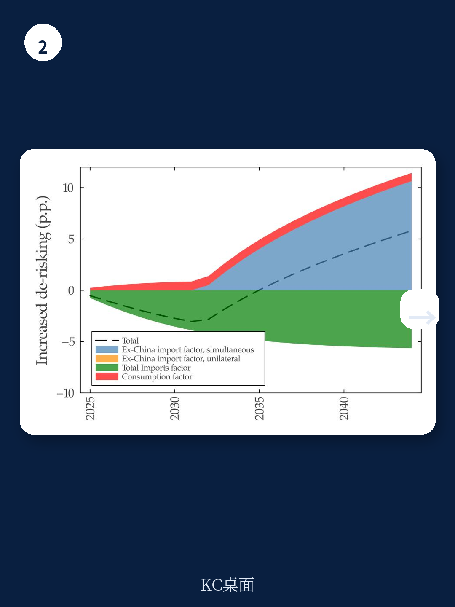

# IMF：产业政策与大宗商品供应链瓶颈

2025年4月，中国对七种稀土元素和永磁体实施出口许可要求，全球稀土市场瞬间绷紧。虽然出口量在两个月内迅速恢复，但这一事件暴露了一个结构性问题：全球稀土供应链的瓶颈不在采矿，而在冶炼分离环节——而这一环节的集中度远超采矿。

国际货币产品组织（IMF）最新工作论文首次系统量化了稀土供应链去不确定性的成本。核心结论是：通过研究补贴实现适度去不确定性，财政成本可控，且多国协同行动能显著降低单一国家的负担。但去不确定性程度越高，边际成本上升越快——这意味着“少量多元化”才是性价比最高的策略。

## 1. 冶炼分离才是真正的瓶颈，采矿环节的集中度被高估

报告将稀土供应链拆解为两个环节：上游采矿和下游冶炼分离。数据显示，全球稀土采矿集中度虽高，但中国以外仍有多个项目在推进。真正的瓶颈在冶炼分离环节——中国在这一环节的全球产能占比超过85%，且短期内难以被替代。

模型校准基于21个中国以外稀土项目的可行性研究，通过计算每公斤氧化镨钕的盈亏平衡价格，构建了非中国地区的宏观环境供给曲线。结果显示，即便在2024年每公斤55美元的市场价格下，仍有相当数量的非中国项目具备宏观环境可行性。但问题在于，这些项目大多只涉及采矿，冶炼分离能力的建设需要更长的研究周期和更高的资本支出。

> **KC评论：** 这张宏观环境供给曲线揭示了关键信息：非中国地区的采矿潜力并不小，但真正稀缺的是冶炼分离能力。这意味着，去不确定性政策如果只补贴采矿，可能无法解决供应链最脆弱的一环。

## 2. 研究补贴比价格支持更高效，但短期财政不确定性更大

报告模拟了两种政策工具：研究补贴（CAPEX补贴）和收入支持（价格下限），目标是将美国对单一最大供应源的依赖度从10%提升至25%。在单边行动场景下，研究补贴需覆盖74.4%的资本成本才能实现这一目标；价格下限则需设定为市场价格的2.18倍。

从财政成本看，研究补贴更高效。原因是研究补贴只针对新增产能，而价格下限会为现有产能创造“意外收益”。以美国为例，单边研究补贴的十年财政成本约为美国稀土市场规模的134%（约11.3亿美元），而价格下限的成本更高。但研究补贴的劣势在于前期支出集中，短期财政不确定性更大。

多国协同行动能显著降低成本。当美国、欧盟、日本、澳大利亚等净进口国同时实施研究补贴时，美国财政成本降至市场规模的90%（约7.6亿美元）。原因在于，协同行动避免了单一国家独自承担全部产能建设不确定性，且各国可以发挥各自的比较优势——美国在稀土加工环节的相对效率更高。

> **KC评论：** 协同去不确定性的本质是“分摊成本+利用比较优势”。但报告也隐含了一个前提：各国需要就政策工具和补贴水平达成一致，这在现实中可能比模型假设的复杂得多。

## 3. 去不确定性程度越高，边际成本上升越快——适度多元化才是最优解

报告最值得关注的发现是：财政成本随去不确定性目标非线性上升。将去不确定性目标从25%提高到50%，所需补贴率从74.4%升至88.7%，但财政成本的增幅更大。这意味着，追求“完全去不确定性”的成本极高，而“适度去不确定性”的性价比最高。

这一结论与克莱顿等人（2024）的理论一致：对于“咽喉点”投入品，适度的多元化就能显著改善韧性。报告用数据验证了这一点：将依赖度从10%降至25%，成本可控；但再往下走，每降低一个百分点，成本都会大幅跳升。

对政策制定者而言，这意味着去不确定性策略应设定合理目标，而非追求零依赖。对读者而言，这意味着稀土供应链的重构将是一个渐进过程，而非一蹴而就——短期内，中国在冶炼分离环节的主导地位难以被撼动。

## 4. 一个可复用的观察框架：识别“咽喉点”的三个条件

报告提供了一个识别供应链“咽喉点”的通用框架：当一个投入品难以替代，且同时满足三个条件时，咽喉点最可能出现——极端的地理集中、潜在的 disruption 不确定性、以及快速多元化的障碍。

稀土满足所有三个条件。但报告也指出，并非所有集中度高的供应链都是咽喉点。关键在于“难以替代”这一前提。例如，某些稀土元素在永磁体中的应用目前尚无宏观环境可行的替代方案，这才是真正的不确定性所在。

这一框架可用于评估其他关键矿产供应链，如锂、钴、镍等。读者和政策制定者可以据此判断：哪些供应链的集中度是“脆弱的”，哪些只是“集中的但可替代的”。

---

For informational purposes only. Portions may be generated,translated,summarized,or edited with AI assistance based on source materials and may contain omissions or errors. Please verify independently. This is not investment,legal,tax,accounting,or other professional advice.

