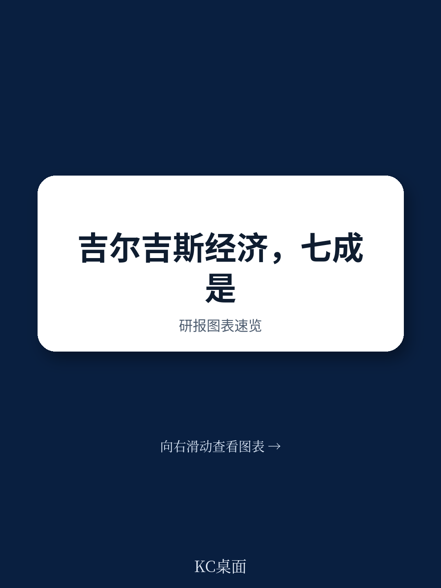
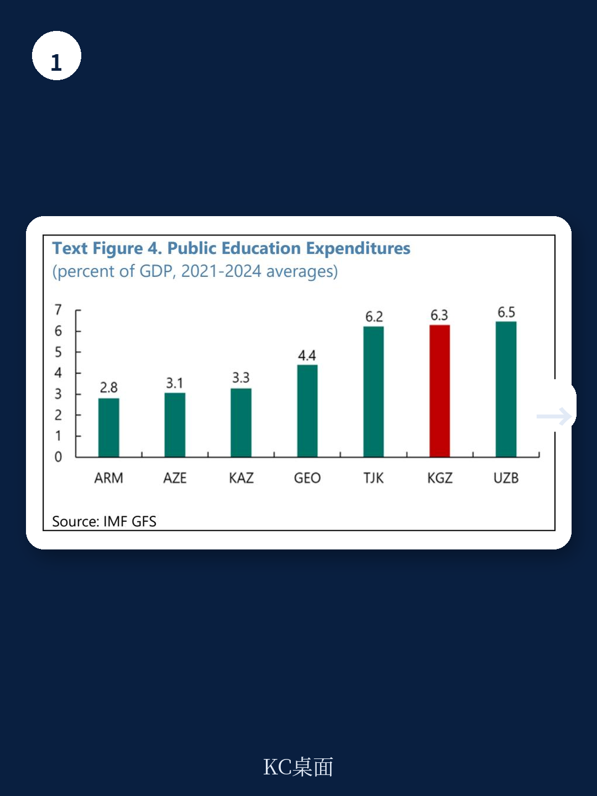
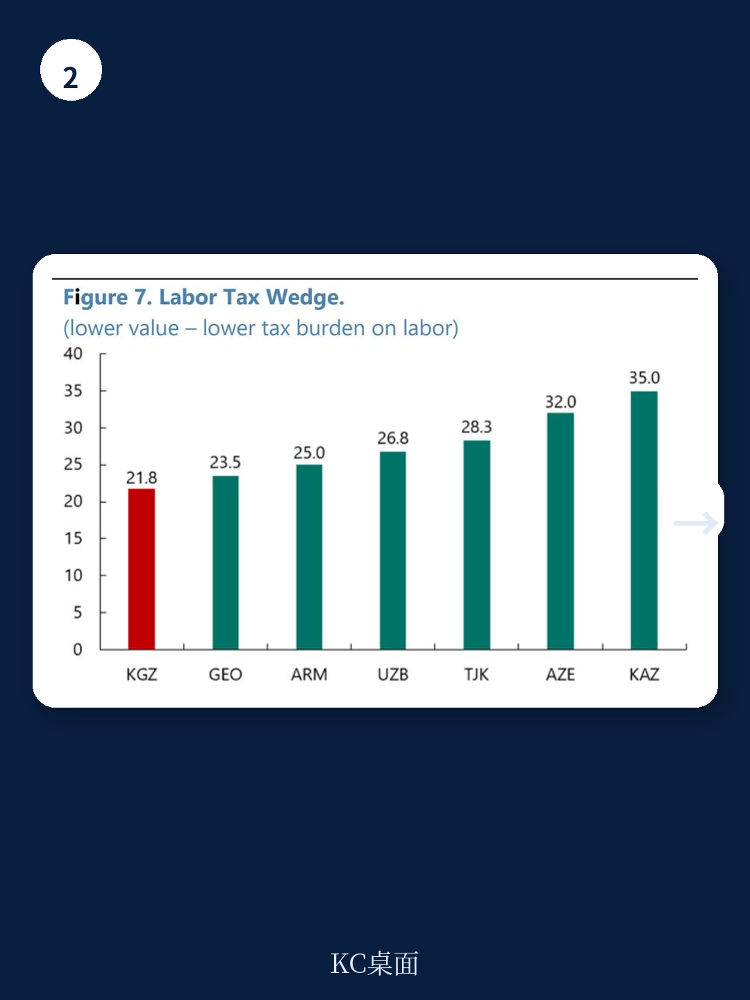

# IMF：吉尔吉斯斯坦非正式宏观环境占GDP19%

吉尔吉斯斯坦约65%的劳动力在非正式部门就业，非正式宏观环境贡献了约19%的GDP。IMF最新发布的国别报告指出，这个中亚国家的非正式宏观环境并非简单的“逃税”问题，而是一个由教育质量、制度碎片化和社保缺位共同塑造的结构性困境。报告的核心判断是：降低非正式化，不能靠强制取缔，而应通过系统性改革让“正式”变得更有吸引力。

## 1. 教育投入不低，但产出与劳动力市场严重脱节

吉尔吉斯斯坦对教育的公共支出占GDP约6%，在中亚地区属于较高水平。但学习调整后的受教育年限平均仅8.4年，64%的小学毕业生阅读能力不达标。这种“高投入、低产出”的教育体系导致大量年轻人进入劳动力市场时缺乏正式部门所需的技能。每年约5万名新增劳动力，多数最终流入非正式部门。报告特别指出，15至24岁青年中，既不就业也不接受教育或培训的比例仍达16.7%。人力资本积累不足，是制约正式化的深层瓶颈。

> **KC评论：** 教育投入与产出之间的巨大落差，意味着单纯增加预算无法解决问题。报告隐含的逻辑是，技能错配才是非正式就业的“供给端”根源——企业找不到合适的人，年轻人也缺乏进入正式部门的议价能力。

## 2. 税制整体有竞争力，但碎片化和频繁变动推高合规成本

从税率看，吉尔吉斯斯坦的企业所得税仅10%，个人所得税10%，总社保缴款率12.25%，均为中亚地区最低水平之一。但报告揭示了一个反直觉的现象：低税率并未有效推动正式化。症结在于税制高度碎片化。除主要税种外，还存在专利制、单一税制、宏观环境特区、高科技园区、电商、加密货币挖矿等十余种特殊税制。企业需根据行业、交易方式、客户类型选择不同规则，合规复杂度极高。2022年新税法实施后，法人实体税务会计时间从年均44.2个工作日骤增至76.3个工作日。世界银行调查显示，当地企业每年花在报税上的时间超过280小时，是地区平均水平的两倍以上。

## 3. 社保覆盖极低，正式就业的“安全溢价”几乎不存在

报告提供了一组对比数据：吉尔吉斯斯坦的失业救济金覆盖率仅为0.3%，而中亚地区平均为5.4%，新兴欧洲国家平均为20%。在正式就业无法提供显著收入保障或不确定性缓冲的情况下，工人没有动力为社保缴费。报告认为，社保体系的设计缺陷——覆盖面窄、福利水平低、缺乏逆周期自动调节机制——使得非正式就业成为一种理性的“自我保险”策略。这与高税率导致的非正式化有本质区别：后者是成本驱动，前者是收益缺失。

## 4. 改革路径：以提升“正式化吸引力”为核心，而非强制取缔

报告明确反对激进的非正式宏观环境清理。它提出的改革框架围绕四个支柱展开：一是简化税制、降低合规成本，同时稳定政策预期；二是扩大社保覆盖并引入可携带福利制度，让工人不再因换工作而失去保障；三是改革教育支出效率，强化职业培训与私营部门需求的对接；四是提升治理能力，包括数字化政府服务和加强合同执行。报告特别强调，这些改革需要“渐进且全面”，因为非正式宏观环境在低收入国家承担着就业缓冲功能，粗暴取缔可能导致失业和贫困出现变化。

吉尔吉斯斯坦的非正式宏观环境案例，对许多面临类似困境的发展中地区具有参照意义。它说明，当正式制度的“收益”不足以覆盖其“成本”时，低税率本身并不能成为正式化的充分条件。真正的杠杆，在于制度质量、人力资本和社会安全网的协同改善。
