# Portugal's Productivity Gap vis-à-vis Europe and the United States: A Firm- Level Analysis

Ippei Shibata

SIP/2026/065

IMF Selected Issues Papers are prepared by IMF staff as background documentation for periodic consultations with member countries. It is based on the information available at the time it was completed on May 28, 2026. This paper is also published separately as IMF Country Report No 26/148.

2026
JUL

# IMF Selected Issues Paper European Department

# Portugal's Productivity Gap vis-à-vis Europe and the United States: A Firm-Level Analysis Prepared by Ippei Shibata

Authorized for distribution by Jean-François Dauphin
July 2026

IMF Selected Issues Papers are prepared by IMF staff as background documentation for periodic consultations with member countries. It is based on the information available at the time it was completed on May 28, 2026. This paper is also published separately as IMF Country Report No 26/148.

ABSTRACT: Portugal's large GDP-per-capita gap with the highest-income euro area economies and the US is primarily driven by a productivity shortfall. At the EU level, European leading firms, particularly in the tech sector, trail leading global counterparts in productivity and innovation, partly reflecting far less R&D investment rooted in less reliance on equity. In Portugal, those factors are compounded by a broader lack of dynamism. Firms enter the market small and rarely scale up, resulting in a much smaller economic footprint of young high-growth firms than in European peers and—even more so—the US. This rarer occurrence of “gazelles” in Portugal partly reflects limited access to venture capital and inadequate human capital, as well as tax and regulatory obstacles to firms’ growth. Taken together, this comparative lack of dynamism of leading and young high-growth firms alike explains Portugal’s larger share of small firms. Potential policy remedies include streamlining Portugal’s product market regulations and red tape and improving young firms’ access to long-term risk capital through EU-level initiatives.

RECOMMENDED CITATION: Shibata, Ippei. 2026. "Portugal's Productivity Gap vis-à-vis Europe and the United States: A Firm-Level Analysis." In Portugal: Selected Issues, IMF Country Report No. 26/065. Washington, DC: International Monetary Fund.

JEL Classification Numbers:

D24, G24, J24, L25, L26, O31, O47

Keywords:

Portugal; productivity gap; total factor productivity; firm dynamics; firm scale-up; young high-growth firms (gazelles); venture capital; R&D investment

Author's E-Mail Address:

ishibata@imf.org

SELECTED ISSUES PAPERS

# Portugal's Productivity Gap Vis-À-Vis Europe and the United States: A Firm-Level Analysis

Portugal

Prepared by Ippei Shibata $^{1}$

## PORTUGAL

SELECTED ISSUES

May 28, 2026

Approved By

Prepared By Ippei Shibata (EUR).

European Department

## CONTENTS

## PORTUGAL'S PRODUCTIVITY GAP VIS-À-VIS EUROPE AND THE UNITED STATES:

A FIRM-LEVEL ANALYSIS 2

A. Background and Motivation 2

B. Challenges Faced by Firms to Scale Up in Portugal \_\_\_\_ 4

C. Policy Options to Boost Productivity 6

## FIGURES

1. Aggregate Productivity Gap: Portugal vis-à-vis Europe and the United States \_\_\_\_ 2

2. European Listed Firms in International Comparison: Productivity, R&D, and Equity

Issuance 5

3. Firm Dynamics in Portugal \_\_\_\_ 4

4. Gazelles in Portugal 6

5. Portugal's Innovation Ecosystem 8

## ANNEX

I. Data Sources 11

References 12

## PORTUGAL'S PRODUCTIVITY GAP VIS-À-VIS EUROPE AND THE UNITED STATES: A FIRM-LEVEL ANALYSIS $^{1}$

Portugal's large GDP-per-capita gap with the highest-income euro area economies and the US is primarily driven by a productivity shortfall. At the EU level, European leading firms, particularly in the tech sector, trail leading global counterparts in productivity and innovation, partly reflecting far less R&D investment rooted in less reliance on equity. In Portugal, those factors are compounded by a broader lack of dynamism. Firms enter the market small and rarely scale up, resulting in a much smaller economic footprint of young high-growth firms than in European peers and—even more so—the US. This rarer occurrence of “gazelles” in Portugal partly reflects limited access to venture capital and inadequate human capital, as well as tax and regulatory obstacles to firms’ growth. Taken together, this comparative lack of dynamism of leading and young high-growth firms alike explains Portugal’s larger share of small firms. Potential policy remedies include streamlining Portugal’s product market regulations and red tape and improving young firms’ access to long-term risk capital through EU-level initiatives.

## A. Background and Motivation

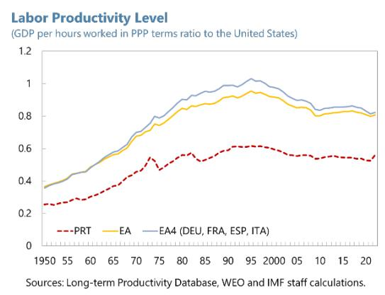  
gal vis-à-vis Europe and the United States
The GDP-per-capita gap vis-à-vis the US primarily reflects lower total-factor productivity (TFP).

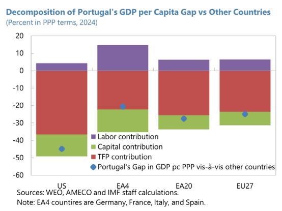

1. Portugal's significant per-capita income gap with the highest-income euro area economies and the United States primarily reflects a wide productivity shortfall (Figure 1). In 2024, Portugal's income per capita in PPP terms stood nearly 45 and 21 percent below that of the US and the four largest euro area economies (Germany, France, Italy and Spain, or EA4), respectively. While Portugal's total working hours contributed positively to reducing the gap (at 4 and 15 percentage points, vis-à-vis US and EA4, respectively), both lower capital intensity and weaker total factor productivity explained most of the gap vis-à-vis the US and EA4, with the latter driving over four-fifths of it. In the second half of the 20th century, European economies significantly narrowed— and some of them closed—their hourly productivity gap with the US, often considered to define the "global productivity frontier". Meanwhile, after narrowing the gap vis-à-vis US to about 40 percent by 1990, the productivity gap of the Portuguese economy with respect to the US has remained flat over the past three decades while in other euro area countries saw a widening productivity gap in the late 1990s before stabilizing again in the 2010s.

TFP of large firms lags US counterparts, particularly in tech...

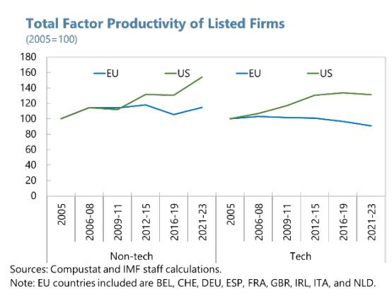  
Sources: Compustat and IMF staff calculations. Note: EU countries included are BEL, CHE, DEU, ESP, FRA, GBR, IRL, ITA, and NLD.

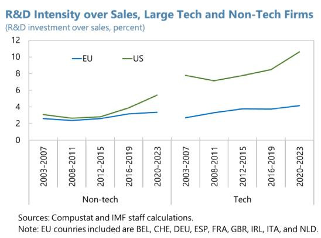  
Sources: Compustat and IMF staff calculations.
Note: EU countries included are BEL, CHE, DEU, ESP, FRA, GBR, IRL, ITA, and NLD.

Listed European firms also issue less equity than US peers.  
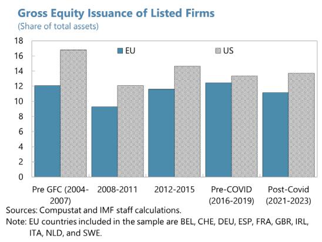

2. Leading European firms in general are trailing their US competitors on both productivity growth and—even more so—R&D investment, especially in the tech sector (Figure 2). In non-tech sectors US listed firms increased their productivity by around 60 percent during 2005-23, while European listed firms achieved a cumulative productivity growth of just around 20 percent—one third of US gains—over the same period. $^{2}$ In the tech sector, US-listed firms increased their productivity by over 30 percent, while their European counterparts experienced a productivity decline of around 10 percent. This wide productivity growth gap partly reflects the lower R&D investment of European firms. For instance, European firms’ R&D investment is only about three fifths and two fifths of that for US firms in non-tech and tech sectors, respectively.

...resulting in a higher share of small firms.

Related to this, leading European firms also issue significantly less equity, which is typically a key source of innovation financing as it is difficult to collateralize R&D investments. No Portuguese firm features among the top 100 global firms in terms of market capitalization. $^{3}$

3. This annex examines the underlying factors behind Portugal's productivity gap from a firm-level perspective. Drawing on IMF (2024) and Adilbish and others (2025), it analyzes these issues by focusing on firms behind the frontier (particularly young firms). It leverages extensive cross-country datasets at firm, sector, and aggregate levels (see Data Sources and References).

## Figure 3. Firm Dynamics in Portugal

Portuguese firms' entry rates are broadly similar to those in Europe and the US, but they enter smaller than in the US.

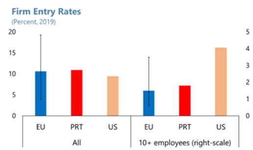  
Sources: OECD DynEmp, BDS (US) and IMF staff calculations.
Note: EU sample includes AT, BE, BG, CH, CY, CZ, DE, DK, ES, EE, FI, FR, GR, HR, HU, IS, IT, LT, LU, LV, MT, NL, NO, PL, PT, RO, SK, SI, SE, and TR. The sample for "10+" excludes CH and GR.  
The exit rate of large firms is comparatively higher in Portugal...

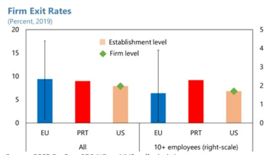  
Sources: OECD DynEmp, BDS (US) and IMF staff calculations.
Note: EU sample includes BE, BG, CY, CZ, DE, DK, ES, EE, FI, FR, GR, HR, HU, IS, IT, LT, LU, LV, MT, NL, NO, PL, PT, RO, SK, SI, SE. The sample for "10+" excludes GR.

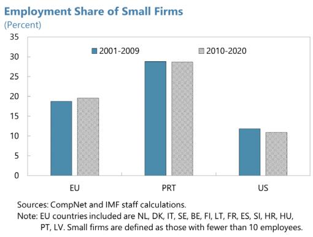

## B. Challenges Faced by Firms to Scale Up in Portugal

## 4. The Portuguese economy is characterized by an overabundance of small firms

(Figure 3). While average entry and exit rates are broadly comparable across Portuguese, European and US firms, Portuguese and European firms tend to enter small: the entry rates of larger firms (those with 10 or more employees) are lower than in the US. Furthermore, Portuguese and European firms struggle to scale up and the exit rates for Portuguese large firms are comparatively higher than in the US and the EU. As a result, many Portuguese firms remain small, and a sizable fraction of the workforce is employed in small firms.

5. Young high-growth firms—so called “gazelles”—are rare in Portugal (Figure 4). We define “gazelles” as firms that are younger than 10 years old, achieve at least a 20 percent annualized sales growth for three consecutive years, and reach 100 employees at some point. On average, gazelles outperform mature large firms in sales growth by nearly 20 percentage points, although this overperformance has diminished compared to pre-GFC years. As a fraction of their birth cohort, Portuguese gazelles are rarer than in other countries. While a typical European country sees about 0.5 percent of a given cohort of firms grow into gazelles, only about 0.1 percent of new businesses in Portugal reach this status. On an encouraging note, high-tech firms have been increasing their share among gazelles in recent years.

6. The scarcity of gazelles in Portugal could reflect in part financing challenges and less competition-friendly market regulation. Gazelles have higher average revenue per unit of assets than large mature firms. This, under some conditions, indicates greater marginal productivity of capital and higher returns on investment. Given that most young firms generally also face higher borrowing costs compared to their large mature counterparts, increasing venture capital investment, which is typically used to support risky ventures, could help foster the emergence of gazelles and boost productivity. Such venture capital investment is particularly important in industries (such as high tech) where hard-to-collateralize intangible capital is predominant. However, Portugal has significantly lower levels of venture capital investment than leading European countries and the US. Moreover, Portugal has a less competition-friendly product market than other EA countries, mainly reflecting its higher barriers to market entry and greater distortions by state involvement (IMF Portugal 2024 Article IV, Annex VII). In particular, the burdensome administrative and regulatory procedures needed to establish a new business, especially within the service sectors, hinder the entry of new companies.

7. Portugal's innovation ecosystem—the interplay between R&D policies, tertiary education, and businesses—is lagging global and European technological frontiers (Figure 5). Despite some improvement, Portugal innovation outcomes are lagging European and global technological leaders. For instance, patent applications represent 54 percent of the EU average, although Portugal's direct and indirect government support for business R&D, particularly indirect support—including tax incentives for R&D investments, is higher than in most other European countries. Human capital, which IMF staff analysis finds to be an important driver of gazelles' emergence (Adilbish and others, 2025), remains hampered by educational mismatches: although the share of people aged 25-34 who have completed tertiary education almost reached the EU average (43 vs. 44 percent in 2024), there remains a significant mismatch between educational training and the skills required in the job market. Moreover, Portugal also has a much higher old-age dependency ratio compared to the EU average (38 vs. 34 percent in 2024), which is negatively correlated with gazelle formation (Figure 5). However, Portugal compares favorably to the EU average in several areas positively correlated with the formation of gazelles: its female labor force

participation rate among 20-64 year-olds (81 vs. 75 percent in 2024), migrant share (16 vs. 14 percent in 2024), and the share of non-nationals with a college degree (37 vs. 31 percent in 2024).

Figure 4. Gazelles in Portugal

Gazelles are rarer in Portugal than in European peers....

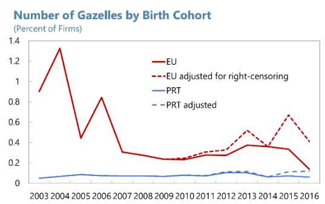  
Sources: Orbis and IMF staff calculations. Note: EU countries included are AT, BE, CH, CZ, DE, DK, ES, FR, GB, GR, HU, IE, IS, IT, NL, PL, PT, RO, SE, SI, and SK.  
Gazelles' overperformance vis-à-vis large firms is sizeable although smaller than before the GFC.  
Gazelle Sales Growth Overperformance over Large Firms (Percentage points)

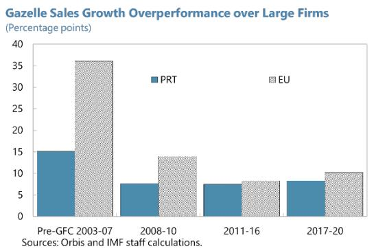  
Note: EU countries included are AT, BE, CH, CZ, DE, DK, ES, FR, GB, GR, HU, IE, IS, IT, NL, PL, PT, RO, SE, SI, and SK.  
While Portuguese gazelles are rare, the share of high-tech firms among them has grown in recent years....

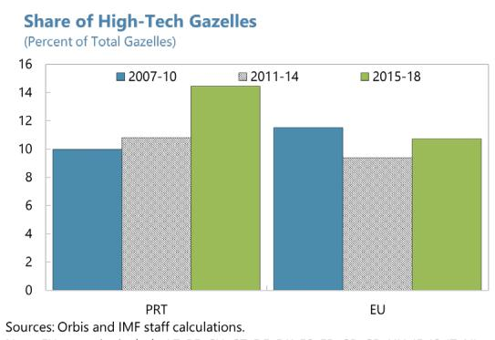  
Sources: Orbis and Imm. Stat. calculations.

Note: EU countries include AT, BE, CH, CZ, DE, DK, ES, FR, GB, GR, HU, IE, IS, IT, NL, PL, PT, RO, SE, SI, and SK.  
Gazelles have higher average revenue per unit of assets than large firms.  
Average Revenue per Unit of Assets: Gazelle vs Large Firms (Percent)

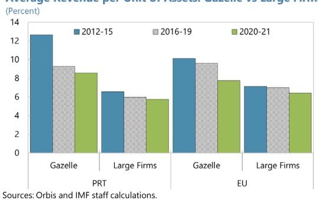  
Note: EU countries include AT, BE, CH, CZ, DE, DK, ES, FR, GB, GR, HU, IE, IS, IT, NL, PL, PT, RO, SE, SI, and SK.  
Portuguese gazelles face higher borrowing costs than larger firms, albeit less so than their European peers.  
Interest Rate Gap between Gazelle and Large Firms (Percentage points, by intangible asset share quintiles)

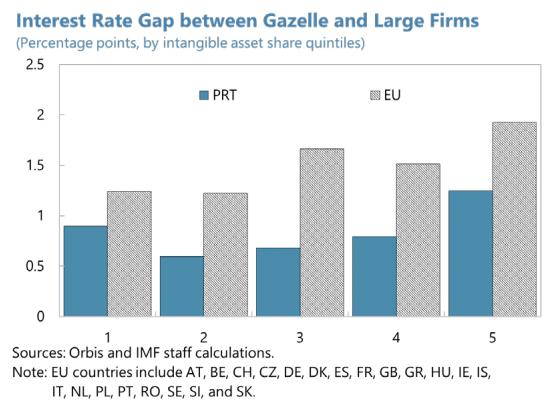  
Aggregate venture capital investment is much smaller in Portugal than in leading advanced countries.

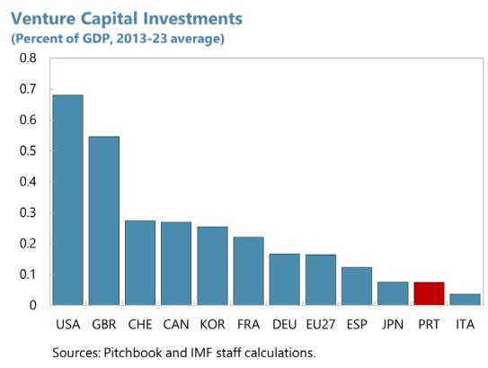

## C. Policy Options to Boost Productivity

8. Closing Portugal's productivity gap vis-à-vis leading European economies and the US requires actions on both EU-level and domestic fronts to facilitate firms' scaling-up and strengthen the innovation ecosystem, including:

\- Reducing red tape and adjusting regulations to foster more competition. This would promote business formation and firms scaling up.

\- Working with EU partners to deepen the EU single market. Initiatives like the Competitiveness Compass and the introduction of a 28 $^{th}$ corporate regime should lower cross-country barriers to trade in goods and services, and thereby facilitate the expansion of highly productive young firms.

\- Increasing the availability of long-term risk capital. This should include further developing the domestic venture capital market through enhanced information provision to investors, as well as advancing the EU saving and investment union. This is needed to ease financing constraints on the creation and growth of highly-productive young firms and, as such, a key complement to enhancing product-market integration.

\- Streamlining size-based tax and regulatory thresholds—with a focus on the size-dependent labor regulation and tax system. Priorities include abolishing progressive corporate income taxation, which discourages business growth.

Continuously increasing the highly-skilled labor force and reducing educational mismatches to spur productivity through better labor reallocation. Continuously improving the share of high-skilled labor force could promote the emergence of gazelles. Although the educational mismatch reflects both demand and supply side factors (Montt, 2015), reducing the educational mismatch could promote productivity through more efficient allocation of labor, including by further strengthening the links between firms and universities.

Figure 5. Portugal's Innovation Ecosystem

Portugal is lagging global technological frontiers on innovation outcomes...

European Innovation Scoreboard, 2024  
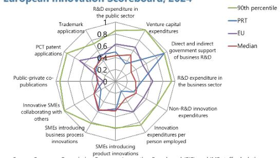  
Source: European Commission European Innovation Scoreboard (EIS), and IMF staff calculations. Note: Most underlying indicators are quantitative and not perception-based. The original scores are normalized and expressed as a share of the highest score in each category by IMF staff. For some countries, the values were imputed using the latest available data. Details for the underlying data are available in the EIS methodology report.

...despite its large R&D indirect tax support.

Government Direct Funding and Tax Support for Business R&D (Percent of GDP)

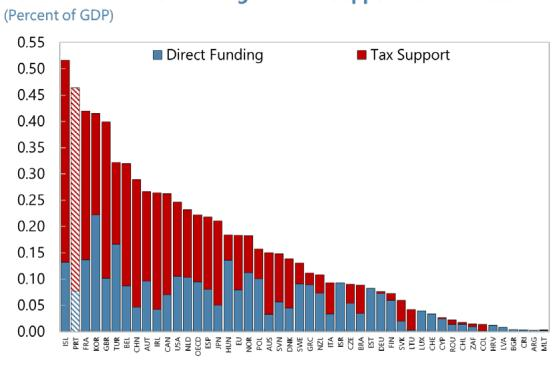

## Human capital is important for gazelle formation.

Determinants of Gazelle Formation  
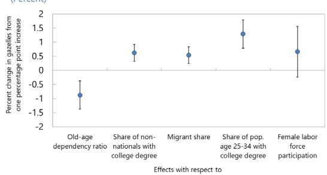  
Sources: Orbis, and IMI Start calculations.
Note: Coefficients show the correlation of each variable on the number of gazelles depending on the unit of respective variables. For instance, for regressions on logs, coefficients are interpreted as the perchange in gazelle formations in response to 1 percent change of the regressor. Europe includes Austria, Belgium, the Czech Republic, Denmark, France, Germany, Greece, Hungary, Iceland, Ireland, Italy, the Netherlands, Poland, Portugal, Romania, the Slovak Republic, Slovenia, Spain, Sweden, Switzerland, and the United Kingdom. FTE = Full-time equivalent.  
Portugal faces a higher old-age dependency ratio and lower educational attainment among its young population than the EU average.  
Portugal's Position for Gazelle Formation (Percent)

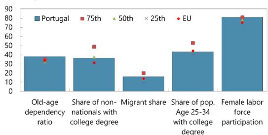  
Sources: Eurostat and IMF staff calculations.  
Note: Old-dependency ratio is population 65 years or over as a share of population 15 to 64 years. Migrant share is the share of foreign borns as a share of total population. Female labor force participation is for women between 20 and 64 years

## Mismatch in field of study is severe in Portugal.

Field of Study Mismatch  
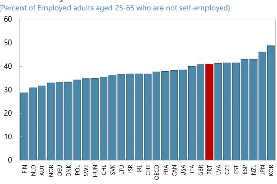  
Source: OECD 2023 PIACC Survey.

## Annex I. Data Sources

The analysis in this annex utilizes five distinct corporate datasets (see Adilbish and others (2025) for more details). Aggregate comparisons rely on three databases: (i) Business Dynamics Statistics (BDS), which provides aggregated firm-level data for the U.S. (see Decker and Haltiwanger (2024)), (ii) CompNet, which allows to replicate many of the data points available in BDS for European countries, and (iii) the OECD's DynEmp database, which tracks entry and exit similarly to BDS. Additionally, our two firm-level databases are (iv) Compustat, used to analyze the performance of listed firms in Europe and the U.S., and (v) Orbis, used for firm-level analysis of young high-growth firms. A few additional databases are also used including AMECO—an annual macro-economic database of the European Commission's Directorate General for Economic and Financial Affairs—, long-term productivity database to measure labor productivity, and Pitchbook for venture capital landscape. Finally, Portuguese innovation ecosystem was assessed using various data sources including the Program for the International Assessment of Adult Competencies (PIAAC), the European Innovation Scoreboard, WIPO Statistics Database, and the European University Association Autonomy Scoreboard.

## References

Adilbish O. E., D. A. Cerdeiro, R. A Duval, G. H. Hong, L. Mazzone, L. Rotunno, H. H Toprak, and M. Vaziri. (2025). "Europe's Productivity Weakness: Firm-Level Roots and Remedies", IMF Working Papers 2025/040. https://doi.org/10.5089/9798229001441.001.

Decker, R.A., and J. Haltiwanger. (2024). "Surging Business Formation in the Pandemic: A Brief Update." Brookings Papers on Economic Activity, Fall 2023: 249-302.

International Monetary Fund. (2024). Europe's Declining Productivity Growth: Diagnoses and Remedies. Regional Economic Outlook Notes: Europe, 2024 Nov. https://www.imf.org/en/Publications/REO/EU/Issues/2024/10/24/regional-economic-outlook-Europe-october-2024.

Montt, Guillermo (2015). "The causes and consequences of field-of-study mismatch: an analysis using PIAAC." OECD Social, Employment and Migration Working Papers No. 167.