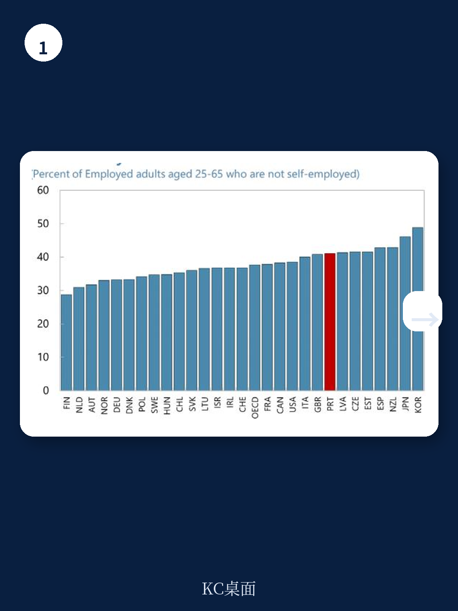
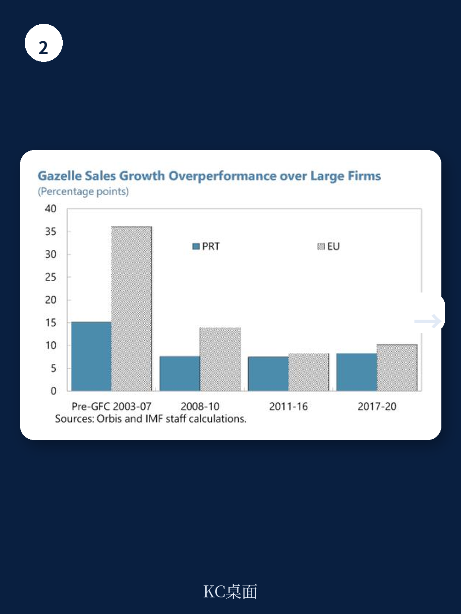

# IMF：葡萄牙生产率差距-对比欧洲与美国

葡萄牙人均GDP与欧元区头部地区及美国的差距，核心不是工作时长，而是全要素生产率。IMF最新一期国别报告以企业层面数据切入，发现一个反直觉的事实：葡萄牙的企业进入率并不低，但新企业普遍规模小，且几乎无法长大。真正稀缺的，是那些能在十年内从零长到百人以上的“瞪羚企业”——年轻高增长公司。这一现象，解释了葡萄牙为何拥有异常高比例的小企业，也指向了比宏观政策更具体的结构性堵点。

## 1. 欧洲头部企业已在研发投入上落后美国，葡萄牙则没有一家进入全球市值百强

报告首先拆解了欧洲整体与美国的生产率差距。在非科技领域，2005至2023年间，美国上市企业累计生产率增长约60%，欧洲企业仅约20%。科技领域的差距更为刺眼：美国科技企业生产率增长超过30%，欧洲同行反而下降了约10%。差距的根源之一在于研发投入——欧洲非科技企业的研发支出仅为美国同行的五分之三，科技领域更降至五分之二。报告指出，欧洲企业股权融资规模显著低于美国，而股权融资恰恰是难以抵押的研发研究最关键的融资来源。在这一背景下，葡萄牙没有一家企业进入全球市值百强，并不令人意外。

> **KC评论：** 报告将欧洲生产率问题从“宏观叙事”拉到了“企业融资结构”层面。欧洲企业研发投入少，不是因为不想投，而是因为融资工具不支持。这对理解欧洲科技生态的底层逻辑，比单纯比较专利数量更有解释力。

## 2. 葡萄牙“瞪羚”出现概率仅为欧洲平均水平的五分之一

报告的核心发现来自对“瞪羚”企业的追踪。IMF将“瞪羚”定义为成立不足十年、连续三年销售额年增长不低于20%、且曾达到百人规模的企业。这类企业的销售额增速平均比成熟大企业高出近20个百分点。然而，在葡萄牙，每批新创企业中最终成长为“瞪羚”的比例仅为0.1%，而欧洲典型国家约为0.5%。换言之，葡萄牙的“瞪羚”密度只有欧洲平均水平的五分之一。报告同时指出，葡萄牙大型企业的退出率也高于美国和欧盟均值，这意味着企业不仅长不大，而且好不容易长大的也更容易消失。

## 3. 不确定性资本不足与教育错配，是“瞪羚”稀缺的两大结构性原因

报告进一步分析了“瞪羚”稀缺的成因。首先是融资端：葡萄牙的不确定性资本研究规模显著低于欧洲领先国家和美国。而“瞪羚”企业的单位资产收入高于成熟大企业，这通常意味着更高的资本边际回报，但年轻企业普遍面临更高的借贷成本。在无形资产占比高的行业（如高科技），不确定性资本的作用尤为关键。其次是人力资本端：尽管葡萄牙25至34岁人口的高等教育完成率已接近欧盟均值（43%对44%），但“教育错配”问题严重——所学专业与岗位需求不匹配。报告引用IMF团队此前的研究，证实人力资本是“瞪羚”形成的重要驱动因素。此外，葡萄牙的老龄化程度高于欧盟均值（老年抚养比38%对34%），也与“瞪羚”形成呈负相关。

## 4. 政策方向已明确：减少规模依赖型税制，打通不确定性资本通道

报告提出的政策建议集中在四个方向：简化产品市场监管与行政程序、深化欧盟单一市场（如推进“竞争力指南针”和第28套公司制度）、扩大长期不确定性资本供给（包括发展本土风投市场和推进欧盟储蓄与研究联盟），以及改革规模依赖型的税收与劳动法规。其中，废除累进式企业所得税被列为优先事项，因为这种税制直接惩罚企业扩张。报告还建议加强企业与大学之间的衔接，以减少教育错配，提升劳动力配置效率。

葡萄牙的生产率问题，不是一个简单的“投得不够多”的故事。它揭示了一个更微妙的困境：企业能生，但长不大；能活，但长不快。而“瞪羚”的稀缺，正是这一困境最浓缩的体现。

For informational purposes only. Portions may be generated,translated,summarized,or edited with AI assistance based on source materials and may contain omissions or errors. Please verify independently. This is not investment,legal,tax,accounting,or other professional advice.

