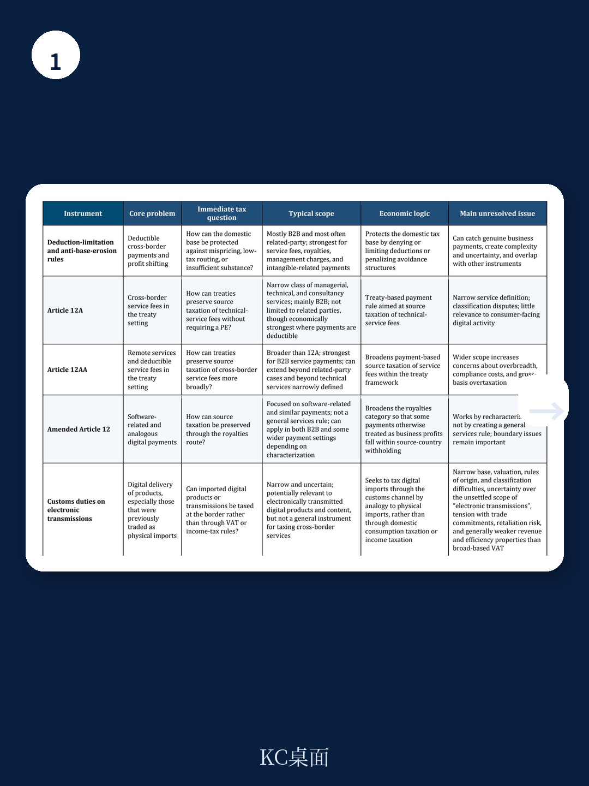
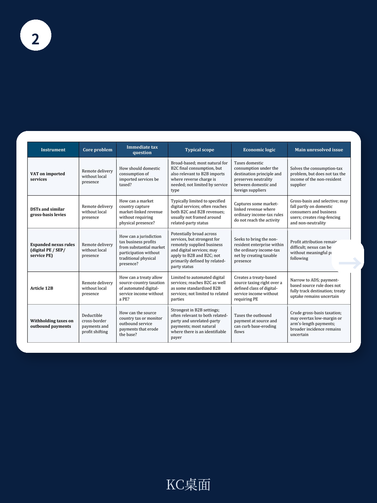

# IMF：跨境服务征税-目的地原则为正解

全球跨境服务贸易已占世界贸易的27.2%，创下2005年以来的最高纪录。但国际税收框架仍停留在1928年以物理存在为前提的规则体系中。当企业可以远程提供广告、云计算、流媒体和中介服务，却不需要在任何市场国设立办公室或工厂，传统税制就出现了两个漏洞：市场国无法对没有本地实体的外国企业利润征税，同时企业通过跨境服务费将利润转移出市场国。IMF这份工作论文的核心判断是：与其用数字服务税等碎片化工具修补漏洞，不如系统性地转向目的地原则征税。

## 1. 数字服务税看似直接，实际效果与设计初衷存在偏差

报告对已实施数字服务税的国家进行了实证分析。数据显示，数字服务税的实施与数字服务进口下降存在统计关联。这意味着税负很可能通过价格上涨转嫁给了消费者或企业用户，而非真正落在外国供应商的利润上。数字服务税按总收入而非利润征税，本身具有扭曲性；同时它只针对少数大型跨国企业，存在明显的“围栏效应”——全球收入门槛通常设定在7.5亿欧元，法国和英国的实际纳税企业分别只有37家和不到20家。报告指出，数字服务税在法律设计上刻意避开传统税收协定的适用范围，这增加了双重征税不确定性。

## 2. 目的地型增值税在逻辑上最自洽，实施挑战在于操作细节

报告将目的地型增值税列为所有跨境服务税制工具中“最连贯、扭曲最小”的方案。现代增值税体系可以通过供应地规则、非居民简化登记、反向征收机制和平台代收等方式，将进口数字服务纳入税网。关键在于有效执行。报告特别对比了增值税与数字服务税在在线广告场景下的差异：增值税按广告购买方所在地征税，数字服务税则按广告受众所在地征税。这两种目的地原则指向不同国家，结果截然不同。增值税覆盖整个供应链并允许进项抵扣，而数字服务税只针对单一环节且不设抵扣机制，容易造成税负叠加。

> **KC评论：** 报告没有直接点名，但这一对比暗示了一个容易被忽略的政策选择困境——如果市场国想对数字服务征税，首先要明确“市场”的定义是购买方所在地还是用户所在地。两种目的地原则指向不同的税基和不同的国家，这不是技术细节，而是根本性的政策取舍。

## 3. 扩大征税连接点解决不了利润归属问题，这是现有框架的结构性瓶颈

一些国家试图通过“数字常设机构”或“重大宏观环境存在”规则来扩大征税权。但报告指出一个关键矛盾：认定连接点存在，不等于能算出该分配多少利润。如果企业在市场国没有本地人员、资产或不确定性，传统利润归属规则可能只分配极少甚至为零的利润给这个“被认定的存在”。联合国税收协定范本第12B条提供了另一种路径：不认定常设机构，而是直接赋予来源国对自动化数字服务的征税权。但这同样面临如何确定税基的难题。报告认为，反避税规则在付款方所在地明确时效果较好，但仍是修补结构性缺陷的不完美工具。

## 4. 各税种之间存在交互影响，孤立评估会误导政策判断

报告在比较分析中强调，不同税种的法律范围、宏观环境归宿和行为效应会相互重叠，可能强化也可能削弱政策目标。例如，预提税和数字服务税可能对同一笔跨境支付产生叠加效应；反避税规则在宏观环境效果上可能类似预提税。报告的核心政策建议是：如果多边方案无法达成，各国更广泛地依赖目的地型征税，比继续堆叠碎片化的单边措施更有效。在一个服务可以全球远程交付的世界里，税制大概率会继续向市场国倾斜，而非向企业注册地倾斜。但如果没有全球协调，结果将是一个各国税制重叠、不一致的多玩家格局，行政复杂度和双重征税不确定性都会上升。

这份报告的价值不在于给出一个完美答案，而在于系统性地拆解了每个工具的设计逻辑、宏观环境后果和法律边界。对于正在考虑或已经实施数字服务税的国家，它提供了一个比“要不要征税”更难的追问：你选择的工具，真的在解决你想解决的问题吗？
