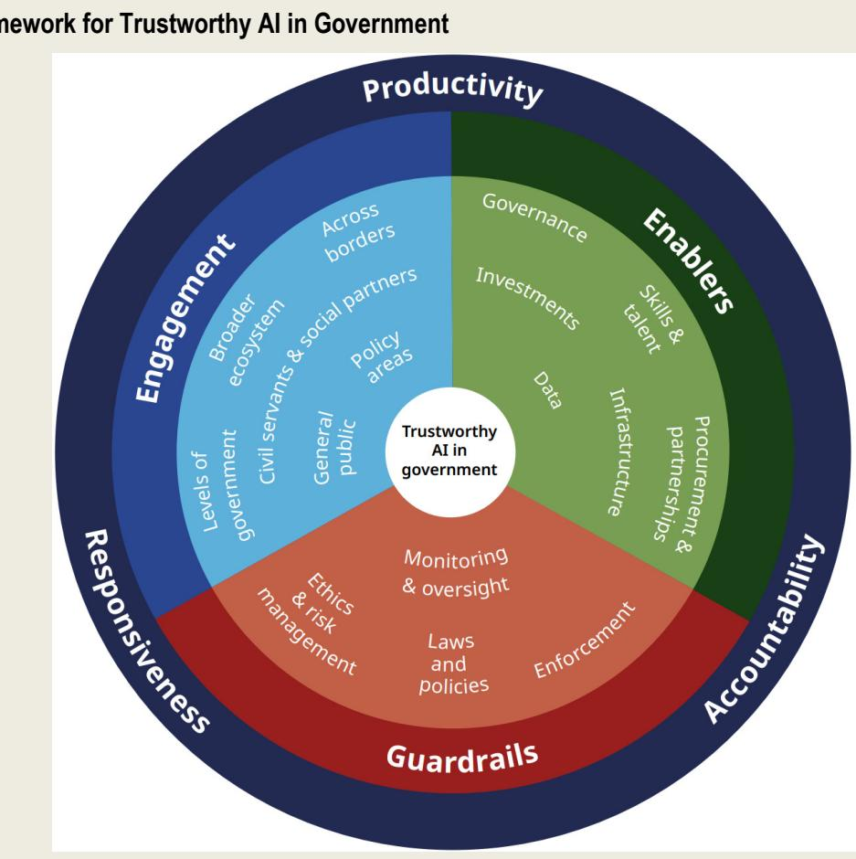
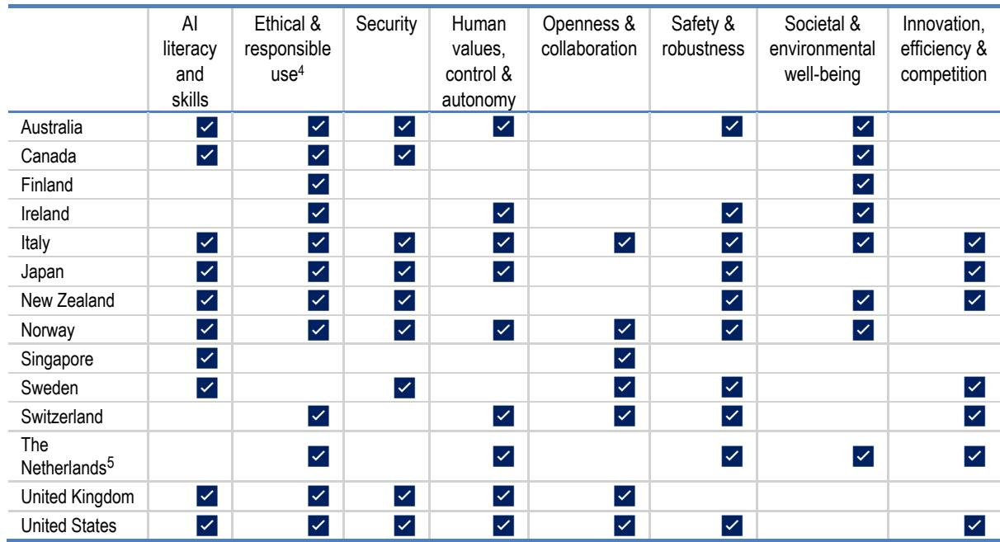
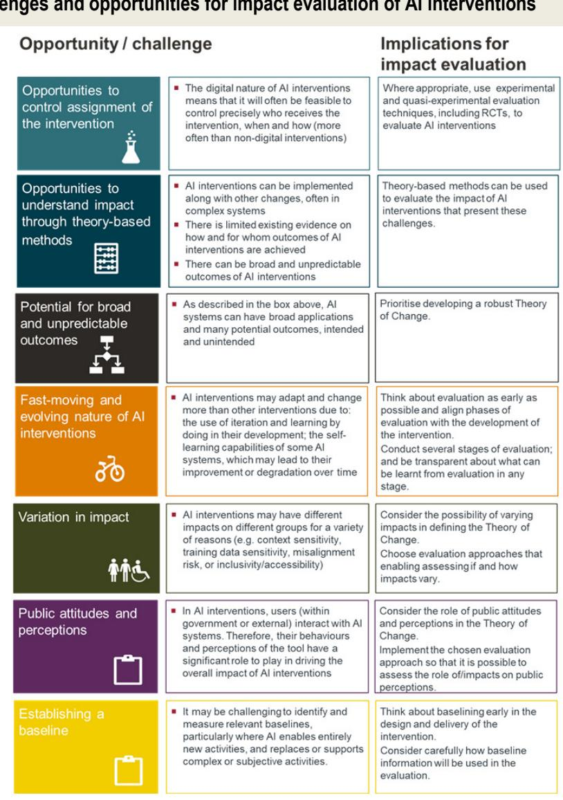
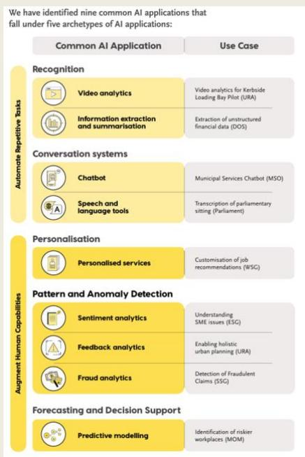
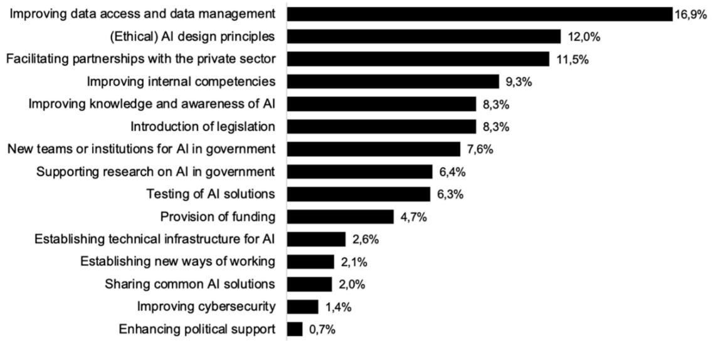

## OECD Working Papers on Public Governance No. 93

Generative AI

experimentation

in government: Learning

from emerging guidelines

https://dx.doi.org/10.1787/42815683-en

OECD Working Papers on Public Governance

# Generative AI experimentation in government

Learning from emerging guidelines

## Abstract

Public servants are increasingly adopting generative artificial intelligence (GenAI), often without formal oversight. This paper addresses the widening gap between rapid, decentralised GenAI uptake and lagging public governance mechanisms. It focuses on structured experimentation as a critical pathway for governments to build capabilities, manage risks, and ensure responsible technology adoption before full-scale deployment. Drawing on a systematic review of official guidelines across 14 countries, academic literature, and case studies, the paper examines how jurisdictions translate high-level ethical principles into operational practice. The findings reveal that while guidelines are widespread, they remain highly fragmented and uneven, leading to risk aversion or inconsistent practices. Furthermore, monitoring and evaluation are identified as critical weaknesses, with few governments systematically measuring performance, impact, or compliance. To bridge the gap between national strategies and daily public administration, the paper presents an evaluation framework across five core areas: performance, public value, feasibility, usability, and risk management.

# Acknowledgements

This paper was prepared by the OECD Directorate for Public Governance (GOV), under the leadership of Elsa Pilichowski, Director.

The paper was produced by the Government Indicators and Performance (GIP) and Public Management and Budgeting (PMB) divisions under the direction of Valerie Frey and Jon Blondal.

The paper was written by Piret Tônurist (PMB) and Moritz von Knebel (external consultant).

Gillian Dorner, Marianna Karttunen, Jamie Berryhill, Alana Baker, Becky King, Margo Enthoven, Jose Diaz, Joaquin Collao and Angela Hanson from the Governance Directorate provided substantive comments to this paper. Directorate for Science, Technology and Innovation and Directorate for Employment, Labour and Social Affairs contributed to the finalisation of the work. Administrative support was provided by Sarah Babay.

The OECD extends thanks to the Observatory of Public Sector Innovation National Contact Point Network for providing feedback to the paper.

This publication was co-funded by the European Union. Its contents are the sole responsibility of the OECD and do not necessarily reflect the views of the European Union.

## Table of contents

Abstract 2   
Acknowledgements 3   
Executive summary 6   
1 Introduction 8 General AI governance frameworks 9 Need for operational level guidance in experimenting with generative AI 12   
2 Overview of existing guidance for experimenting with GenAI 14 Existing guidelines for experimenting with generative AI: Common themes and divergence 14   
3 Prioritisation, monitoring and evaluation of generative AI experimentation 25 Prioritisation 25 Monitoring and evaluation 26 Developing criteria for prioritisation, monitoring and evaluation 26   
4 Factors and conditions for successful experimentation and evaluation 37 (Non-)Material resources and assets 37 Lessons from the experimental practice 43   
5 The road towards more systemic experimentation 51   
1) Establish public trust in GenAI experiments 52   
2) Provide AI literacy training and upskilling opportunities to civil servants 53   
3) Prevent fragmentation of projects and AI systems 53   
4) Prioritise investments in shared tools, data and secure testing mechanisms 53   
5) Limit and mitigate risks 54   
6) Invest in experimental AI research 54   
7) Make AI experimentation frameworks future-fit 55   
8) Ensure efficiency through prioritisation 55   
9) Plan experiments and their evaluation early 55   
10) Create environments that encourage experimentation 56   
References 57   
Annex A. List of AI guidelines 66 Notes 67

FIGURES
Figure 5.1. Policy initiatives to improve the use of AI in public administration 52
TABLES
Table 1.1. OECD AI principles 10
Table 2.1. Criteria covered in countries' AI guidelines 15

# Executive summary

Artificial intelligence, and especially generative artificial intelligence (GenAI), is already being used by public servants across government, often without formal approval or clear oversight. This paper addresses the growing gap between rapid, decentralised GenAI uptake and the slower development of practical governance arrangements. It focuses on experimentation, not full-scale deployment, as a way for governments to learn early, manage risks and make more informed decisions about whether and how generative artificial intelligence should be used in public administration.

The paper examines how governments approach experimentation with generative artificial intelligence and how existing guidance supports or limits that process. It is based on a systematic review of official government guidelines from 14 countries, complemented by academic literature and documented case studies. The analysis compares how different jurisdictions define principles, translate them into operational guidance, and assess experiments, with particular attention to prioritisation, monitoring and evaluation.

## Fragmented guidance and uneven operational support

The report finds that guidance on GenAI experimentation is widespread but highly fragmented. Many governments have issued high-level principles on ethical or responsible use, yet provide limited operational direction on how to design, run and assess experiments. Guidance varies in scope and detail, ranging from general value statements to detailed playbooks and checklists. This unevenness creates uncertainty for public servants and contributes to risk aversion or inconsistent practice across and within administrations. The absence of shared operational tools also increases duplication and reduces opportunities to learn from experiments conducted elsewhere.

## Experimentation as a bridge between strategy and practice

Structured experimentation can bridge the gap between national artificial intelligence strategies and day-to-day use in government. GenAI systems behave in probabilistic ways, meaning their performance and risks cannot be fully understood in advance. The paper shows that governments increasingly use pilots, sandboxes and trials to test suitability for specific tasks, starting with low-risk internal uses before moving to more sensitive applications. Effective experimentation is presented not as an optional activity, but as a necessary condition for responsible adoption in contexts where impacts on rights, services and public trust may be significant.

## Weak and inconsistent evaluation of experiments

The paper identifies monitoring and evaluation as a major weakness in current practice. Few governments systematically assess whether experiments deliver expected benefits, create new risks or justify scaling. Where evaluation occurs, it often relies on basic indicators such as usage or user satisfaction, rather than structured assessments of performance, impact, cost and compliance. There is growing recognition that generative artificial intelligence requires output auditing, given that identical prompts can produce different results. Without agreed criteria and comparable metrics, governments struggle to stop unsuccessful experiments, learn from failures or prioritise future investments. To address this gap, the paper identifies five key areas against which GenAI experiments could be assessed: (1) performance of GenAI pilots and quality of inputs/outputs; (2) projected impact and public value; (3) cost, feasibility, and institutional integration; (4) usability and acceptability; (5) risk management and compliance.

The paper concludes that governments are at an early stage of learning how to experiment systematically with generative artificial intelligence. Existing guidance provides a starting point but rarely offers the operational clarity needed for consistent practice. Experimentation can support learning, risk management and trust, but only if it is planned, resourced and evaluated in a structured way. The findings identify a set of high-priority actions to support the effective and trustworthy adoption of AI in government, aligned with the OECD Framework for Trustworthy AI in Government. These actions include:

• establishing public trust in GenAI experiments;

• strengthening AI literacy and upskilling opportunities for civil servants;

• preventing the fragmentation of AI projects and systems;

• prioritising investments in shared tools, data and secure testing mechanisms;

• supporting experimental AI research;

• limiting and mitigating risks throughout the experimentation lifecycle.

The analysis also identifies actions that are critical for GenAI experimentation itself:

• making AI experimentation frameworks future-fit;

• ensuring efficiency through clear prioritisation and problem definition;

\- planning experiments and evaluation approaches from the outset;

\- creating environments that encourage experimentation.

Without this, experiments are likely to remain isolated pilots rather than informing broader policymaking on the role of generative artificial intelligence in government.

## 1 Introduction

Artificial intelligence (AI), including generative AI (GenAI) technologies are developing rapidly, presenting major opportunities for productivity gains and supporting innovation and entrepreneurship. Governments have been quick to identify the potential benefits of generative AI and produced guidelines for the use of generative AI tools in government (e.g. The AI Playbook for the UK Government (Government Digital Service, 2025[1]) and the Australian Government's Interim guidance on government use of public generative AI tools (Australian Government, 2025[2])). Based on a survey conducted at the end of 2023, researchers at the UK's Alan Turing Institute found that 'generative AI is already widespread in the public sector', with $22\%$ of survey respondents actively using a GenAI system (Bright et al., 2025[3]). Furthermore, recent research points to AI supporting up to $41\%$ of tasks across the public sector, offering significant time savings when applied systematically (Hashem et al., 2025[4]). Much of the uptake, however, is "shadow AI" i.e., unsanctioned use without the formal approval or oversight and is happening in a disorganised fashion without clear guidelines (OECD, 2024[5]; Bright et al., 2025[3]).

AI is predicted to be one of the most transformative forces of the 21st century (Sharma, 2023[6]). It is reshaping industries, economies, governments, and societies at an unprecedented pace. If governments and other AI actors are successful in seizing AI's benefits while mitigating its risks, AI experts and researchers envision a future in which AI contributes to scientific, medical and economic breakthroughs. In line with the Collingridge dilemma, the full spectrum of AI risks often remains invisible until technologies are deeply embedded and difficult to reverse. To navigate this inherent trade-off, governments require a robust anticipatory capacity – not to predict every outcome, but to use strategic foresight and experimentation as early-warning systems that allow for agile, real-time governance (Tönurist and Orlik, 2025[7]).

However, the opaque and probabilistic nature of GenAI models makes it difficult to anticipate the tasks and activities in which generative AI can deliver reliable and consistent benefits. This uneven distribution of AI capabilities – sometimes referred to as the ‘jagged frontier’ - means that tasks commonly assumed to be complex (e.g., creative idea generation) may be performed effectively by AI systems, while seemingly simple tasks (e.g., certain forms of basic calculation or reasoning) may expose the limitations of large language models (LLMs) (Dell'Acqua et al., 2023[8]).

As a result, identifying appropriate use cases for enhancing policymaking, internal processes, and public service delivery, requires governments to responsibly test, validate, and continuously monitor GenAI systems in safe-to-fail environments. Recent public sector experiments illustrate this approach, including a 6-month trial of Microsoft Copilot in March 2024 across 50 public agencies in Australia (Digital Transformation Agency, 2024[9]), the piloting of AI-Based Smart Search piloted in Estonia (Pungas, Traat and Liiv, 2025[10]) and the testing of an experimental AI chatbot tested in the United Kingdom (UK) (Department of Science, Innovation and Technology, 2024[11]).

Despite these initiatives, progress towards AI adoption remains uneven. Within many government entities, factors such as time pressures to complete other tasks, concerns about the risks of using generative AI and the limited capacity for developing and applying innovative approaches means that promising applications are slow to be identified, tested and scaled. Indeed, the recent Governing with Artificial Intelligence report identified inaction itself as one of the most significant risks connected to AI adoption in the public sector (OECD, 2025[12]). Furthermore, much of this friction stems from treating experimentation primarily as an isolated, operational practice within individual public sector organisations. Without a clear bridge connecting these individual trials to broader national AI strategies, experimentation risks remaining a disjointed portfolio of ad-hoc pilots rather than a structured pipeline toward formalized policy implementation. Consequently, systematic experimentation (see definition in Box 1.1) with AI solutions has yet to emerge as an established practice across most public administrations.

## Box 1.1. Definition of experimentation

Experimentation is understood as creating new knowledge by putting an approach in place with the necessary structures to find out if something works in practice. (Often it involves a situation where one or more variables are manipulated whilst controlling all of the others and measuring the resultant effects). There is a wide range of experimental methods suited to different purposes from randomised control trials (RCTs) to A/B tests and environments (e.g., regulatory sandboxes, accelerators etc.) through with experimentation may be encouraged.

There are various routes to experimentation that all can generate causal or context-specific knowledge and be used to amend and tailor the design of a policy by taking into account the specificities of a given policy context, leading to more efficient use of public resources, as well as greater accountability and transparency, given the evidence collected. The OECD's Seven Routes to Experimentation in Policymaking provides a practical framework to help policymakers identify the most appropriate method for their context, guided by key questions and a visual roadmap of experimental and non-experimental options.

OECD Declaration on Public Sector Innovation encourages use of experimentation (Principle 4: Support exploration, iteration, and testing) and sees it as integral to innovation processes within the public sector. The OECD Framework for Trustworthy AI in Government also counts experimentation among the key enablers needed for successful AI adoption in government.

Source: (OECD, 2022[13]; Tõnurist and Orlik, 2025[7]; Varazzani et al., 2023[14]; OECD, 2020[15]; OECD, 2025[16]; OECD, 2025[17])

Challenges in scaling successful solutions mean that many government AI initiatives often remain in pilot phases. Skills gaps and difficulties accessing, sharing and re-using high-quality data are common across government functions. Moreover, although strategies for AI in government are common, the lack of concrete operational guidance often limits their translation into practice. Together, these factors reinforce risk aversion and complicate governments' abilities to effectively balance innovation and risk management.

Even when public servants use AI, this does not guarantee appropriate or effective application. Risks such as automation bias – when users unduly defer to AI outputs, and selective adherence – where outputs are accepted or rejected based on prior beliefs – can undermine sound decision making (OECD, Forthcoming $^{[18]}$ ). At the same time, insufficient monitoring and evaluation mechanisms restrict public servants' ability to track progress, detect emerging risks and demonstrate the return on investment of AI initiatives. Financial constraints further compound these challenges. While there is a mounting pressure in the public and private sector to act on AI, failing to allocate sufficient time and resources for experimentation has been identified as a key contributor to unsuccessful AI deployment (Ryseff, Newberry and De Bruhl, 2024 $^{[19]}$ ).

## General AI governance frameworks

Robust governance frameworks for AI are imperative to ensure strategic, effective and trustworthy use of AI in government. As governments increasingly integrate AI into their internal operations and public service design and delivery, developing clear governance structures and arrangements becomes crucial to address potential ethical, operational and other risks. It will also support governments to ensure compliance with international standards and norms, including the OECD AI principles (Table 1.1), European Union (EU) AI Act (Box 1.2) and the OECD Framework for Trustworthy AI in Government (Box 1.3) and the Council of Europe's Framework Convention on Artificial Intelligence and human rights, democracy and the rule of law (if a signatory), which lay out comprehensive requirements or expectations for transparency, accountability, risk assessment and human oversight of AI systems.

Table 1.1. OECD AI principles

<table><tr><td></td><td>Principle</td><td>Description</td></tr><tr><td rowspan="5">Value-based principles</td><td>Inclusive growth, sustainable development and well-being (Principle 1.1)</td><td>Highlights the potential for trustworthy AI to contribute to overall growth and prosperity for all – individuals, society, and planet – and advance global development objectives.</td></tr><tr><td>Respect for the rule of law, human rights and democratic values, including fairness and privacy (Principle 1.2)</td><td>AI systems should be designed in a way that respects the rule of law, human rights, democratic values and diversity, and should include appropriate safeguards to ensure a fair and just society.</td></tr><tr><td>Transparency and explainability (Principle 1.3)</td><td>About transparency and responsible disclosure around AI systems to ensure that people understand when they are engaging with them and can challenge outcomes.</td></tr><tr><td>Robustness, security and safety (Principle 1.4)</td><td>AI systems should function in a robust, secure and safe way throughout their lifetimes, and potential risks should be continually assessed and managed.</td></tr><tr><td>Accountability (Principle 1.5)</td><td>Organisations and individuals developing, deploying or operating AI systems should be held accountable for their proper functioning in line with the OECD&#x27;s values-based principles for AI.</td></tr><tr><td rowspan="5">Recommendations for policymakers</td><td>Investing in AI research and development (Principle 2.1)</td><td>Governments should facilitate public and private investment in research &amp; development to spur innovation in trustworthy AI.</td></tr><tr><td>Fostering an inclusive AI-enabling ecosystem (Principle 2.2)</td><td>Governments should foster accessible AI ecosystems with digital infrastructure and technologies, and mechanisms to share data and knowledge.</td></tr><tr><td>Shaping and enabling interoperable governance and policy environment for AI (Principle 2.3)</td><td>Governments should create a policy environment that will open the way to deployment of trustworthy AI systems.</td></tr><tr><td>Building human capacity and preparing for labour market transformation (Principle 2.4)</td><td>Governments should equip people with the skills for AI and support workers to ensure a fair transition.</td></tr><tr><td>International co-operation for trustworthy AI (Principle 2.5)</td><td>Governments should co-operate across borders and sectors to share information, develop standards and work towards responsible stewardship of AI.</td></tr></table>

Source: https://oecd.ai/en/ai-principles.

## Box 1.2. The European Union (EU) AI Act and its implications for the public sector

The European Union (EU) AI Act is a regulation on AI that entered into force in August 2024. The regulation establishes obligations for AI based on its potential risks and level of impact, distinguishing between 4 different categories:

\- Unacceptable risk: AI uses under this category are prohibited by the AI Act. Examples include predictive policing, ‘real-time’ remote biometric identification (including facial recognition) in publicly accessible spaces for law enforcement, social scoring, or assessing the risk of an individual committing criminal offenses. Law enforcement and justice are among the public sector policy areas most concerned by this category, although some exceptions apply, such as use cases concerned with national security and those remaining subject to judicial oversight.

\- High-risk: AI uses under this category are allowed but regulated due to their significant potential harm to health, safety, fundamental rights, environment, democracy, and the rule of law. Due to its potential impact on these aspects, many public sector uses of AI might fall under this category. Examples include systems used to influence the outcome of elections and voter behaviour, automated processing of personal data to assess various aspects of a person's life, assessing eligibility to benefits and services, and safety components used in the management and operation of critical infrastructure. Obligations include establishing a risk management system, conducting data governance, having in place technical documentation to demonstrate compliance, mandatory fundamental rights impact assessment, among others.

\- Limited risk: These might include systems intended to communicate with individuals, such as chatbots, systems that generate content such as text and images, emotion recognition systems, among others, and have transparency obligations where developers and deployers must ensure that end-users are aware that they are interacting with AI.

\- Minimal risk: These systems are unregulated, but a code of conduct is suggested. For example, using AI tools used within public offices for scheduling meetings or basic word-processing features like predictive text in official reports.

The EU AI Act explicitly recognizes that traditional regulatory frameworks may struggle to keep pace with rapid AI evolution. To address this, Article 58 (complemented by Article 57) outlines the establishment of AI regulatory sandboxes – controlled environments where innovative AI systems can be developed, tested, and validated under the supervision of national authorities before being placed on the market.

Source: (OECD, 2024[20])

## Box 1.3. The OECD Framework for Trustworthy AI in Government

The OECD Framework for Trustworthy AI in the Government supports governments to address key policy challenges around AI. The framework aims to provide a comprehensive approach to navigating the complexities of AI use in government, ensuring that AI is used in a trustworthy and efficient manner. It was developed to address three significant policy questions, including:

\- What concrete policy actions and tools can governments develop to address existing challenges for a trustworthy use of AI in government?

\- Who should governments engage when developing and implementing the enablers and guardrails for the trustworthy use of AI in government?

• What impact does the public sector strive to achieve when using trustworthy AI?

The framework calls for strengthening enablers (Pillar 1), establishing guardrails (Pillar 2), and engaging a diverse range of stakeholders during both the design and implementation stages of AI projects (Pillar 3).

\- Enablers to facilitate trustworthy adoption, including governance, data, digital infrastructure, skills, financial investments, agile procurement processes, and capacities to partner with non-governmental actors.

\- Guardrails to guide the responsible use of AI, including, rules and policies, guidance and frameworks, transparency and accountability mechanisms that span the AI system lifecycle, and oversight and advisory bodies to guide and evaluate efforts.

\- Engagement approaches to shape user-centred and responsive approaches, including mechanisms to engage with key stakeholders, including the public, civil society and businesses.

## Need for operational level guidance in experimenting with generative AI

While existing frameworks often provide high-level strategic direction, they often fall short of supporting concrete decision-making or addressing the practical challenges faced by governments experimenting with GenAI. For example, providing concrete development evaluation criteria for GenAI experimentation projects. In seeking to adapt international standards and norms to their specific institutional, legal, and cultural contexts, governments have begun developing their own guidance and frameworks – at national, sub-national and organisational levels.

However, the overall landscape of guidance on GenAI experimentation in government remains highly fragmented. The field of course is complex as such guidance needs to cover a very broad range of experiments from quick tests in low-risk areas to full scale randomized control experiments that require regulatory adjustment and are perhaps impacting citizen services and decision making. As such in practice, both overarching principles and operational recommendations vary significantly across jurisdictions and regions. For example, EU institutions have adopted more restrictive approaches to the use of publicly available Large Language Models (LLMs) reflecting heightened concerns regarding data protection, confidentiality and foreign interference (Weerts, 2025[21]). Such fragmentation risks to generate regulatory uncertainty for both companies and citizens; raising costs in government processes; leading to uneven or unsafe adoption; complicating cross-border co-operation, and, ultimately, undermining public trust in government use of AI. These challenges underscore the importance of robust data, model, and technology management frameworks that place individuals' rights at their core (Kremer et al., 2023[22]).

Guidance also differs considerably in scope and level of operational details. Some frameworks apply broadly across public and private sectors, or across multiple AI types, while others focus specifically on GenAI or on public sector use cases. Even among public sector specific documents, there is wide variation in how guidance translates principles into actional support for experimentation. Some documents remain high level, emphasising general values and heuristics (like Finland's Ethical Guidelines for AI in Public Administration (Ministry of Finance, 2025[23]). Others provide more prescriptive approaches, including "do's and don'ts" (e.g. Canada (2024[24])) as well as practical checklists, tools, and playbooks tailored to specific use cases such as Singapore's Public Sector AI Playbook (Government of Singapore, 2025[25]), Italy's AI guidelines for the public administration (AGID, 2025[26]) or Australia's Staff guidance on public generative AI (Australian Government, 2025[2]).

Complementing national approaches, the European Union's High-Level Expert Group on AI developed an “Assessment List for Trustworthy AI” (ALTAI) (European Commission, 2020[27]), targeted at both public and private actors involved in developing and deploying AI systems. In addition to synthesised checklists derived from core principles and values, ALTAI includes a web-based self-assessment tool to support practical application (Ala-Pietilä, 2020[28]). A small number of governments have gone further still by providing product-specific resources, such as prompt recommendations for tools like ChatGPT (Besuccess, 2023[29]) though such approaches remain the exception. More recently, the Government of Ukraine has published Tips for the Responsible Use of Artificial Intelligence by Public Servants (Government of Ukraine, 2025[30]), illustrating continued diversification of guidance formats.

Despite these developments, not all countries have issued guidance tailored to the public sector, and many frameworks remain advisory in nature, with limited mechanisms to monitor uptake or implementation. An analysis of these documents (see analysis in the next section) also reveals divergent approaches to how guidance is developed, with a trend towards involving a wider range of stakeholders – including academia, the private sector, civil society and citizens – through consultations, surveys, and multi-stakeholder fora. Against this backdrop, the following section adopts a more systematic approach to analysing government guidelines on experimenting with g enerative AI.

# 2 Overview of existing guidance for experimenting with GenAI

This section provides an overview of existing frameworks and guidance on experimenting with GenAI. It describes existing specific guidance on GenAI across different countries offering a comparative analysis of commonly recurring themes and topics as well as notable differences. It concludes by highlighting a few select examples that have been identified as best practices to be emulated and built upon by countries with less developed frameworks and guidelines.

## Existing guidelines for experimenting with generative AI: Common themes and divergence

Numerous countries have released frameworks and guidance for the use of AI in government that explicitly include experimental approaches, while others are still in the process of developing such guidance (Government of the Netherlands, 2024[31]; Government Digital Service, 2025[1]; Government of Canada, 2025[32]; OBM, 2025[33]). Many of these documents are built around a broadly similar set of criteria, an overview of which is provided in Table 2.1 below. $^{1}$ Although these criteria are not always explicitly framed around GenAI experimentation, they often directly shape the institutional environment in which pilots, trials and experiments can be undertaken in the public sector.

This overview is based on a systematic review of publicly available documents and materials related to the use of and experimentation with generative AI in government. The analysis specifically focused on documents that go beyond high-level national AI strategies and instead provide more specific guidance for public sector use. $^{2}$ As such, it includes only official documents whose primary purpose is to establish rules, principles, or guidance for the use or experimentation with generative AI in government. Additional work on agentic AI is ongoing at the OECD (OECD, 2026 $^{[34]}$ ).

To uncover relevant documents, a structured web search was conducted and complemented with a review of existing databases such as the OECD.AI Policy Navigator's live repository of policies, strategies and initiatives. This was further supplemented by a scan of government websites of OECD countries and a systematic review of the academic literature addressing public sector AI guidance. This process yielded a set of guidance documents from 14 countries: Australia, Canada, Finland, Ireland, Italy, Japan, New Zealand, Norway, Sweden, Switzerland, the Netherlands the United Kingdom, the United States and Singapore. $^{3}$ Details of the analysed documents are provided in Annex A.

The analysis summarised in Table 2.1 reveals marked differences in emphasis across criteria. While there is extensive guidance on ethical and responsible use of AI, comparatively limited attention has been given to areas such as openness and collaboration, innovation – both of which are critical to experimentation – as well as efficiency and competition. Moreover, even within commonly identified domains, the depth and operational detail of guidance varies considerably. Some frameworks primarily articulate overarching principles, while others provide more comprehensive and actionable support, including concrete recommendations, technical guidelines and toolkits for public servants and public sector institutions interested in experimenting with and evaluating generative AI. Notable examples include frameworks developed in Australia, Canada, the United Kingdom and Singapore (which are highlighted in Box 2.2, Box 2.3, Box 2.1 and Box 2.5 respectively).

The following sections examine each of the identified criteria clusters in more detail. Although these criteria are often presented in general terms, each plays an important role in enabling practical GenAI experimentation and informing decision about whether and how such initiatives should be scaled within government.

Table 2.1. Criteria covered in countries' AI guidelines  
  
Source: Authors elaborations based on guidelines presented in Annex.

## Ethical and responsible use

This set of criteria includes a wide range of ethical principles and values such as transparency, fairness, accountability and privacy. Several countries (e.g., Australia, Chile, France, New Zealand and the UK) have issued standards and guidance related to algorithmic transparency and algorithmic impact assessments in the public sector. Comparable frameworks, however, are less developed or still absent for other ethical principles such as proportionality and accountability (GPAI, 2024[35]; New Zealand Government, 2023[36]).

Some countries have issued more specific recommendations highlighting the importance of using representative training data and ensuring that humans can intervene to prevent adverse outcomes arising from incomplete or skewed data used by AI systems (Ministry of Internal Affairs and Communications Ministry of Economy, Trade and Industry, 2024[37]; Government of Canada, 2025[32]; Government Digital Service, 2025[1]; Australian Government, 2025[2]). To protect the privacy of affected users, most guidance documents make reference to existing data protection and privacy regulation (Ministry of Internal Affairs and Communications Ministry of Economy, Trade and Industry, 2024[37]). Measures such as privacy impact assessments and “privacy-by-design” approaches (New Zealand Government, 2025[38]) are suggested as measures to guarantee safeguard of personal data and user privacy, alongside practices such as data minimisation or purpose limitation (Government Digital Service, 2025[1]; Government Digital Service, 2024[39]; Australian Government, 2025[2]).

Transparency is typically promoted through recommendations to enable external verification of AI outputs and to improve the interpretability and explainability of system behaviour, allowing affected individuals to better understand how decisions and action are produced (Ministry of Internal Affairs and Communications Ministry of Economy, Trade and Industry, 2024[37]; Government of Canada, 2025[32]; Australian Government, 2025[2]). This includes guidance on the use of open-source models where appropriate (Government Digital Service, 2025[1]), and on the provision of accessible information on how an AI model was trained, its intended use within a public body, and its capabilities and limitations (New Zealand Government, 2025[38]; New Zealand Government, 2025[40]). Here, ex-ante (proactive) operational instruments are very important. For instance, GobLab UAI in Chile promotes the use the "Four Ethical Algorithm Tools" (Herramientas Algoritmos Éticos, 2026[41]) mandating algorithmic transparency datasheets and rigorous impact assessments for every pilot before deployment. All of these can have long-term impacts on costs, reusability and adaptability of the AI models. This information should be intelligible to both technical and non-technical audiences (Federal Council, 2020[42]; Government of the Netherlands, 2024[43]). Some frameworks further distinguish between different kinds of transparency including technical, process-based, outcome-based, internal and public transparency (Government Digital Service, 2025[1]).

In parallel, some governments (e.g., Singapore and the US), often in collaboration with the private sector, are experimenting with so-called “protective layers” to manage interactions with LLMs. These include internal LLMs with access layers, API gateway filters, secure LLM sandboxes, and automated content redaction mechanisms (see for example the case of Pair in Singapore (GovTech Singapore, 2025[44])) (Stone, 2025[45]; Masood, 2025[46]). Such systems are designed to filter or redact sensitive information before it reaches the model, and in some cases to enforce compliance with national security, privacy, or data-residency rules. These are important components of privacy enhancing technologies (PETs) and play a growing role in supporting trustworthy AI systems (OECD, 2025[47]).

To strengthen accountability, public sector entities experimenting with generative AI are encouraged to improve traceability, document system use, designate responsible actors as points of contact, explain conformity with existent rules and regulations, and make relevant information publicly available where possible (Ministry of Internal Affairs and Communications Ministry of Economy, Trade and Industry, 2024[37]). Accountability also encompasses the introduction of clear rules and regulations around the liability and contestability of AI systems (Federal Council, 2020[42]; Government Digital Service, 2025[1]) and the implementation of monitoring, oversight, evaluation and auditing mechanisms (Government of Canada, 2025[32]; New Zealand Government, 2025[40]; Evaluation Taskforce, 2024[48]). The UK government, for example, distinguishes between three types of accountability: answerability, auditability and liability (Government Digital Service, 2025[1]) – see further in Box 2.1.

## Box 2.1. AI guidance in the government: The United Kingdom

The cornerstone of the UK's guidance for civil servants is the AI Playbook. It includes 10 principles to guide the safe, responsible and effective use of artificial intelligence (AI) in government organisations as well as a section on governance, institutional requirements and best practices (e.g. acquiring skills and talents, doing user research etc.). The appendix contains case studies of concrete tools to showcase their use by the public sector (e.g. the GOV.UK chat).

The AI Playbook also clarifies that accountability is not a single "on/off" switch but a three-layered structure. By breaking it down into answerability, auditability, and liability, the government ensures that there is a clear trail from the technical output back to a responsible human being. Answerability is the duty of a public official or department to provide an explanation for an AI-driven decision. Auditability refers to the ability to inspect and verify the AI system's development and performance history. Liability defines who is legally responsible when things go wrong and harm occurs.

The generative AI Framework for HMG supersedes the previous guidance to civil servants on use of generative AI, which was based on two general principles:

1. You should always be aware of what information you have access to, what rights and restrictions apply to that information (from either private or government sources) and the conditions under which that information can or should be shared.

2. You should always be mindful of any systems into which you enter information. Does that information need to be entered in that system? What will be done with the information once it has left your possession? What rights are being given away in placing the information elsewhere?

An earlier “guide to using Artificial Intelligence in the public sector” (2020) contained guidance on assessing if AI is the right solution to a problem, provided information on expected personnel needs for proper AI use and integration and outlined how governments could go from the alpha to the beta phase of testing and experimenting. In the same year, guidelines for AI procurement were published, which detailed criteria for both impact assessments and prioritisation, as well as suggesting governance measures related to risk mitigation and team diversity.

The UK Government has also provided a “Guidance on the Impact Evaluation of AI Interventions” which details best practice, including evaluation design, methodology, and timing, for evaluating the impact of new AI tools and technologies being introduced in the public sector.

Source: (Evaluation Taskforce, 2024[48]; Government Digital Service, 2025[1])

## Human values, control and autonomy

AI systems in government are expected to be designed and used in ways that “puts people first” (Federal Council, 2020[42]), operate in accordance with the rule of law (New Zealand Government, 2025[40]) as respect human and fundamental rights (AGID, 2025[26]; Federal Council, 2020[42]; Ministry of Finance, 2025[49]; Ministry of Finance, 2025[50]). Preserving human values while ensuring control and autonomy is therefore a central concern across reviewed guidance documents and is closely aligned with the OECD’s Recommendation on Human-Centred Public Administrative Services (OECD, 2024[51]).

Across countries, this principle is operationalised in different ways. Guidance often emphasises the protection of human dignity and the need to pay close attention to how AI systems may influence, manipulate or unduly shape human emotions, judgment, or decision-making processes. Human oversight mechanisms feature prominently as a means of maintain control over AI-supported decisions. Many guidelines highlight the use of “humans-in-the-loop” (New Zealand Government, 2025[38]) approaches to ensure that AI systems remain aligned with the interest of their operators ad that meaningful human intervention remains possible when required (AGID, 2025[26]; Australian Government, 2025[2]; Department of Public Expenditure NDP Delivery and Reform, 2024[52]). See more about the Australian case in Box 2.2 These approaches are particularly relevant in experimental and high-risk use cases, where system behaviour and impacts may not be fully understood.

In addition, several frameworks recommend establishing mechanisms that allow users to report issues, flag unexpected behaviours, or challenge AI-supported outcomes. Continuous monitoring and evaluation of system performance – both during experimentation and after deployment – are emphasised as essential safeguards to preserve human control over time and to prevent the gradual erosion of autonomy as AI systems become embedded in administrative processes (Government Digital Service, 2025[1]).

## Box 2.2. AI guidance in government: Australia

Australia was one of the first movers when it comes to issuing guidance for the public sector use of AI, publishing a “Better Practice Guide” on Automated Decision-making in 2020. Intended to be a practical tool for agencies, it includes a checklist designed to assist managers and project officers during the design and implementation of new automated systems, and with ongoing assurance processes once a system is operational. It also listed a number of best practices with regards to governance structures and monitoring and evaluation, highlighting among other factors the importance of multi-disciplinary teams and customer feedback mechanisms. As suitable variables for assessing a given practice, it suggests “business outcomes, [...] system statistics and client outcomes [...], budget and spending patterns, user and/or client numbers and feedback, and the ongoing monitoring and management of risks”.

In 2023, the “Interim guidance on government use of public generative AI tools” was released, anchoring more specific recommendations on 2 “golden rules”:

1. You should be able to explain, justify and take ownership of your advice and decisions

2. Assume any information you input into public generative AI tools could become public. Don't input anything that could reveal classified, personal or otherwise sensitive information)

It further specifies 5 principles to guide decision-making by public bodies when it comes to the use of generative AI:

\- Accountability

• Transparency and explainability

• Privacy protection and security

• Fairness and human-centred values

• Human, societal and environmental wellbeing

One year later, the “Policy for the responsible use of AI in government” was released. Among other specifications, it outlined governance practices and measures to be taken by agencies, such as the establishment of clear reporting structures and the designation of accountable officials to manage the respective responsibilities associated with the policy, while also providing guidance and assistance (e.g. in the form of a risk matrix) to those bodies. The guidelines are since 2025 also accompanied by an AI technical standard, which was updated to include the Agentic AI addendum in the beginning of June 2026.

Additionally, the Data and Digital Ministers Meeting working group – as part of the National Framework for the Assurance of Artificial Intelligence in Government – has issued recommendations on how Australia’s AI principles can be put into practice..Individual agencies (like the Department of Finance) have issued recommendations on how Australia’s AI principles can be put into practice, as have regional governments like the New South Wales government’s Department of Education.

Source: (Australian Government, 2025[2])

## Safety and robustness

To protect the safety of individual users as well as societies more broadly, AI systems used in the public sector must be robust against malicious attacks, reliably controllable by human operators and managed in line with state-of-the-art risk management standards and best practices (Ministry of Internal Affairs and

Communications Ministry of Economy, Trade and Industry, 2024[37]). These requirements are particularly critical in high-risk policy areas such as health care, policing, and justice, where system failures or misuse can have significant and irreversible consequences (Government Digital Service, 2025[1]). For example, Canada's AI guidance suggests first to experiment with low-risk AI uses before they consider higher-risk use cases (Box 2.3).

Preventing misuse further requires clearly defining the scope and intended applications of AI systems, alongside the proactive identification and mitigation of emerging risks (Ministry of Internal Affairs and Communications Ministry of Economy, Trade and Industry, 2024[37]). For governments experimenting with AI, recommended measures include but are not limited to, the decentralisation of networked AI systems, the use of best practices such as red-teaming, and the implementation of early warning and detection mechanisms to identify vulnerabilities and unintended behaviours at an early stage (Federal Council, 2020[42]).

## Box 2.3. AI guidance in government: Canada

Canada's core framework is the Guide on the use of generative artificial intelligence for federal institutions. It provides an overview of generative AI, identifies challenges relating to its use and puts forward principles for using it responsibly. It also offers policy considerations and collects best practices. Among other suggestions, it recommends that federal institutions experiment with low-risk AI uses before they consider higher-risk use cases. Having received input from a wide variety of external stakeholders, the guide is regularly updated to keep pace with regulatory and technological change.

There is also the guide “Generative AI in your daily work” which provides guidance for civil servants to use generative AI responsibly and in line with the Values and Ethics Code for the Public Sector. It includes “Do’s and Don’ts” in alignment with the FASTER principles (Fair, Accountable, Secure, Transparent, Educated, Relevant).

Additionally, Canada's School of Public Service has developed a series of training modules and virtual courses for government employees interested in using generative AI for their work.

Source: (Government of Canada, 2024[24]; Government of Canada, 2025[32])

## Security

Security measures are needed to “prevent the behaviours of AI from being unintentionally altered or stopped by unauthorised manipulations” (Ministry of Internal Affairs and Communications Ministry of Economy, Trade and Industry, 2024[37]). To achieve this, guidance consistently emphasises the need for robust protective measures including cybersecurity controls to identify and eliminate vulnerabilities throughout the AI lifecycle (AGID, 2025[26]; Department of Public Expenditure NDP Delivery and Reform, 2024[52]).

Many frameworks prioritise “security-by-design” approaches, ensuring the security considerations are embedded from the earliest stages of system development rather than added post hoc (New Zealand Government, 2025[40]; Government of Singapore, 2025[25]). Recommended measures include restricting AI use to accredited and vetted systems (New Zealand Government, 2025[38]) and safeguarding the infrastructure on which AI systems depend (Government of Canada, 2025[32]). Others clearly instructing public servants not to input personal, confidential, or sensitive information into AI tools emphasising security in use (Government of Canada, 2024[24]; New Zealand Government, 2025[38]).

Several guidance documents further identify specific security risks and threats vectors relevant to AI and GenAI. These include data and model poisoning, data leakage, perturbation and adversarial attack, prompt-injection attacks, phishing, and broader cyber-attacks targeting AI-enabled services (Government Digital Service, 2025[1]). In response to such risks, many governments have also issued additional guidelines on the use of privacy enhancing technologies (PETs) in relation to AI (these are often wider than just the public sector and led by data protection authorities) to reduce exposure of sensitive data during development and use (OECD, 2025[47]).

Finally, several international analyses highlight the importance of putting in place specific incident tracking and reporting mechanisms, including the logging and disclosure of AI-related incidents, breaches, and near-misses. Such systems support learning across government, enable timely corrective action, and contribute to the trustworthy and secure adoption of AI in the public sector (OECD, 2025[53]).

## AI literacy and skills

To ensure that users and affected persons can better understand the effect that AI use by the public sector has on them and their lives, governments are exploring investments in developing AI literacy and skills (Government of the Netherlands, 2024[31]; New Zealand Government, 2025[38]). Guidance emphasises the need for training and education approaches that take into account the different levels of digital skills and AI familiarity across society, recognising the citizens and public sector users do not start from the same baseline of knowledge (Ministry of Internal Affairs and Communications Ministry of Economy, Trade and Industry, 2024[37]).

Within government, AI literacy among public servants is treated as a prerequisite for the responsible and effective use of AI in public service delivery. As a result, many guidance documents include introductory explanations of core AI concepts, techniques, capabilities, and limitations, as well as the associated risks and ethical considerations (Federal Council, 2020[42]; Government of Canada, 2025[32]; Government of the Netherlands, 2024[31]; New Zealand Government, 2025[38]; Government Digital Service, 2025[1]). This includes initiatives like Australia's AI in Government Mandatory Training module, which reflects a growing push toward standardized public sector readiness (Australian Government, 2025[54]). This foundational understanding is intended to help public servants critically assess AI outputs, avid over-reliance, and recognise when human judgment and intervention is required.

Several countries have complemented written guidance with targeted training modules and structured learning opportunities for public servants. Examples include dedicated AI courses and resources (Canada School of Public Service, 2025[55]; Government Digital Service, 2025[1]). In Sweden, national AI guidelines are paired with training programmes to support implementation in practice (Government of Sweden, 2025[56]). The United Kingdom has gone further by offering free red-teaming workshops, enabling public servants to actively test AI systems and identify potential risks and failure modes as part of the experiential learning (The Department for Science Technology and Innovation, 2024[57]). In Singapore, the AI Playbook is supplemented with a dedicated government platform to capture evolving ideas (Box 2.4).

For GenAI, literacy is not only conceptual but also operational: public servants involved in pilots need hands-on skills in prompt design and evaluation, recognition of hallucinations and inconsistency, safe handling of sensitive data, use of guardrails and “protective layers,” and participation in red teaming and safe-to-fail trials. Public servants also need critical judgement about when GenAI should or should not be used in an experiment. Training should therefore include experiment design basics (hypotheses, success and no-go criteria, A/B testing, logging), risk-tiered, human-in-the-loop practices, and evidence packaging for go/no-go scale decisions. This capability mix turns literacy into a practical enabler of responsible GenAI experimentation and accelerates learning while controlling risk. This is important for both public servants who design experiments, but also those who participate in pilots and testing.

Collectively, these initiatives highlight that AI literacy is not only about technical knowledge but also about developing the capacity to critically engage with AI systems, understanding their limitations, and applying them appropriately in public sector contexts – especially where experimentation and innovation are encouraged.

## Box 2.4. Public Sector AI Playbook: Singapore

Singapore launched its “Public Sector AI Playbook” in 2024 to inform public officers (especially non-technical officers) how AI can be adopted in their area of work. In addition to providing an introduction into how AI systems work and how they are developed, it illustrates their usefulness by outlining nine common applications of AI in government, before providing clear and step-by-step guidance and tips on how to start an AI Project, complemented by concrete examples of possible metrics, data sources, partners, etc. The Playbook also contains a compendium of use cases for public officers to draw inspiration from.

This is supplemented by a dedicated government platform for public officers to brainstorm ideas, experiment with AI tools, and learn about AI applications, called the GovTech Singapore LaunchPad. It has reportedly attracted over 3,000 monthly active users across all government agencies, sparking over 400 ideas and 20 prototypes.

Source: (Government of Singapore, 2025[25])

## Societal and environmental well-being

Human welfare is commonly understood as encompassing not only physical health and safety, but also personal and professional autonomy (Government of the Netherlands, 2024[31]). In the context of AI use in government, guidance therefore considers impacts at both the societal level – such as social cohesion and trust in public institutions – and the individual level, including citizens' productivity, wellbeing and ability to meaningfully engage with public services (Government Digital Service, 2025[1]; New Zealand Government, 2025[40]). Several documents also underline the importance of ensuring that AI development and deployment support equal and equitable access to technology, rather than reinforcing existing digital divides.

Environmental considerations are increasingly recognised as a core component of this criterion, particularly in relation to generative AI models, which can be computationally intensive and energy demanding. When deciding whether and how to use GenAI in public administration, governments are encouraged to weigh the environmental footprint of these systems against their potential benefits, including opportunities to improve efficiency, reduce resource use, and support climate-mitigation efforts through more streamlined processes and services (Federal Council, 2020[42]; Government of the Netherlands, 2024[31]). A more detailed discussion of these trade-offs is provided by the International Energy Agency (IEA, 2025[58]).

Across reviewed guidance, a number of practical measures are recommended to minimise negative environmental impacts and maximise societal value. These include hosting AI systems in net-zero or carbon-neutral data centres, limiting GenAI use to cases where it serves a clear and well-defined public purpose, and conducting environmental impact assessments as part of decision making and experimental processes (Government of Canada, 2025[32]; Government Digital Service, 2025[1]).

From an experimental perspective, this criterion implies that pilots and trials with GenAI should not only assess technical performance and service improvements, but also explicitly test societal and environmental impacts. This may include evaluating whether GenAI applications improve accessibility for different user groups, identifying unintended distributional effects, and measuring energy consumption and carbon intensity during experiments. Embedding such assessments early enables governments to determine whether GenAI use cases deliver net public value before scaling, and to discontinue or redesign applications whose societal or environmental costs outweigh their benefits.

## Innovation, efficiency and competition

Fair competition in the adoption of GenAI in governments is understood as a requirement for the creation of new businesses and services that contribute to societal progress and wellbeing (Ministry of Internal Affairs and Communications Ministry of Economy, Trade and Industry, 2024[37]). Experimentation and use of AI in the public sector can serve broader innovation and productivity goals, particularly when public administrations act as early adopters, test beds or conveners of emerging technologies – see example in Box 2.5 In this sense, experimentation with GenAI has the potential to lower barriers to innovation by enabling faster prototyping, content generation and decision-support tools that can be adapted across a wide range of policy domains.

Innovation can further be fostered through cross-sectoral partnerships as well as interconnective and interoperable systems based on common standards. This is particularly relevant for GenAI, where shared technical standards, common evaluation frameworks, and interoperable data infrastructures can help avoid fragmented experimentation and vendor lock-in, while enabling reuse and scaling of successful solutions across administrations.

Concrete examples are already emerging. In Germany an AI Marketplace for Opportunities (Marktplatz der KI-Möglichkeiten) is being piloted by the Federal Ministry of the Interior of Germany Data Lab, ITZBund, and other public organisations to connect ministries and agencies with AI solutions that address concrete public sector needs (Federal Ministry of the Interior of Germany, 2025[59]). By cataloguing AI applications and implementation experiences within government departments, such initiatives can also support responsible GenAI experimentation by reducing duplication of efforts, increasing transparency, and facilitating peer learning on what works and under what conditions.

At the same time, regulatory and policy frameworks need to be designed with innovation and competitiveness in mind (Federal Council, 2020[42]) in order to accelerate scientific research and development while maintaining trust (Government of the Netherlands, 2024[31]). In this respect regulatory sandboxes $^{6}$ have become an important instrument to enable controlled AI experimentation in the private sector and, in some cases, in partnership with public authorities to address societal challenges (OECD, 2023[60]; OECD, 2025[17]). For GenAI in particular, sandboxes can provide a structures environment to test novel capabilities, assess impacts on workflows and service quality, and evaluate risks related to bias, explainability, or intellectual property before wider deployment.

Some countries have gone further by envisioning dedicated ‘safe space’ sandboxes in which civil servants and public organisations are encouraged to experiment with AI tools in collaboration with private sector partners. Examples include initiatives in Ireland and Slovakia (Department of Enterprise, Tourism and Employment, 2024[61]; Ministry of Investments, Regional Development and Informatization, 2023[62]). These collaborative sandboxes function as mutual "de-risking" environments where public organizations build the institutional capacity to evaluate and govern emerging tech, while private partners refine their tools to meet the unique regulatory and ethical standards required for public service. For GenAI experimentation, such safe spaces can help develop institutional capacity, digital skills and organisational learning, while ensuring that experimentation remain decoupled from high-stakes operational systems and frontline service delivery.

At the European level, collaborative initiatives also highlight the role of experimentation frameworks in supporting both innovation and competition. Under the GovTech4All umbrella, partners from Estonia,

Lithuania, Sweden, Greece, Malta, and Spain, are working toward a shared experimentation framework to develop reusable AI-based solutions for the public sector, with a GovTech AI Sandbox already launched in Lithuania (European Commission, 2025[63]). For GenAI, this collective approach can help create a more level playing field by enabling smaller firms and start-ups to engage with public-sector challenges, while supporting interoperability, reuse, and the responsible scaling of successful experimental solutions across borders.

## Box 2.5. Accelerating AI Innovation: the US directive to federal agencies

The OMB Memorandum M-25-21, "Accelerating Federal Use of AI through Innovation, Governance, and Public Trust," was adopted by the Executive Office of the President's Office of Management and Budget (OMB) on April 3, 2025. It serves as comprehensive federal guidance to all Executive Branch departments and agencies on the responsible and rapid deployment of Artificial Intelligence.

The directive's primary goal is to empower agencies to drive AI innovation, apply the best of American AI to improve services to the public, and ensure global AI dominance for the United States, all while maintaining strong safeguards for civil rights, civil liberties, and privacy. It addresses the need for a unified strategy that promotes human flourishing, economic competitiveness, and national security through technology.

This guidance is structured around three interconnected core pillars: innovation, governance, and public trust. The innovation pillar, detailed below, focuses specifically on concrete actions agencies must take to reduce bureaucratic friction and promote the beneficial adoption and scaling of AI technology.

Under the innovation pillar directs federal agencies to adopt a "forward-leaning and pro-innovation approach" to accelerate the use of Artificial Intelligence and enhance government efficiency. To achieve this, agencies must fulfil the following specific directives:

\- Remove barriers: Agencies must actively remove unnecessary and bureaucratic requirements that inhibit the responsible and effective adoption of AI technologies.

\- Maximise existing investments: Agencies are required to maximize the value of current investments by encouraging the reuse and sharing of agency data, models, code, and assessments of AI performance.

\- Prioritize American AI: When pursuing new AI acquisitions, agencies should invest in the American AI marketplace and maximize the use of AI products and services that are developed and produced in the United States.

\- Develop talent: Agencies must prioritize efforts to develop and retain AI and AI-enabling talent with the technical experience necessary to scale and govern AI solutions to improve mission outcomes.

\- Increase transparency: Agencies must develop public-facing AI strategies that elevate AI adoption and innovation as an agency priority while increasing transparency to the American public, civil society, and industry regarding their AI activities.

Source: (OBM, 2025[33])

## Openness and collaboration

Guidelines sometimes (but not always) highlight the importance of consultation processes that involve a wider range of stakeholders, and contributions to international AI governance efforts (Federal Council, 2020[42]; Government of the Netherlands, 2024[31]). These principles are strongly embedded in the OECD

Recommendation on Open Government (OECD, 2017[64]) and the connected practices are essential for experimentation in the public sector.

For GenAI experimentation, openness and collaboration play an even more central role. Given the novelty, opacity, and rapid evolution of GenAI systems, early and continuous engagement with a broad range of stakeholders can help identify unintended effects, surface contextual risks, and shape acceptable boundaries for experimentation. This includes not only technical experts and private-sector developers, but also end users, civil society organisations, and groups that may be disproportionately affected by AI-enabled public services.

To promote collaboration with the private sector, some guidelines include practical advice on selecting solution providers and procuring AI systems (Federal Council, 2020[42]; Service Manual Team, 2024[65]; Department for Science, Innovation and Technology, 2020[66]). In the context of GenAI experimentation, such guidance is particularly important to ensure transparency around training data, model capabilities and limitations, licensing conditions, and ongoing responsibilities between public authorities and vendors. Collaborative procurement and co-development approaches can also help public organisations retain sufficient control and understanding of GenAI systems during experimental phases.

Recommendations under this criterion further emphasise the importance of engaging in dialogues with workers, residents, trade unions and entrepreneurs (Government of the Netherlands, 2024[31]). This is especially relevant for GenAI, given its potential implications for work practices, skill requirements, and professional autonomy within public administrations. Involving public servants and frontline staff in experimentation processes can support organisational learning, build trust, and reduce resistance to adoption, while helping to identify practical constraints and ethical concerns early on.

Some guidance documents also encourage the establishment of so-called “data partnerships” as a means to enable collaboration and innovation across organisational boundaries (Government Project Delivery, 2024 $^{[67]}$ ). For GenAI experimentation, such partnerships can support access to high-quality, representative, and legally reusable data, while encouraging shared responsibility for data governance, stewardship, and protection. However, these arrangements also require clear rules on data ownership, reuse, and accountability to maintain public trust.

Some guidelines make explicit reference to existing “communities of practice” and encourage engagement with these networks (Service Manual Team, 2024[65]). Communities of practice can be particularly valuable in the GenAI context, enabling public organisations to share lessons learned from experimentation, develop common interpretative frameworks, and collectively reflect on risks, failures, and successes without duplicating efforts.

One challenge that remains insufficiently addressed in existing guidance relates to language and culture, particularly the coverage of minority and low-resource languages. For countries operating in non-English or low-resource languages, this is a foundational concern; reliance on foreign proprietary models trained predominantly on English data raises critical quality, data protection, and digital sovereignty issues that condition the entire experimentation agenda. To address this baseline risk, some nations are building sovereign-adjacent infrastructures, such as Türkiye's public sector initiative BİLGE – a Turkish foundation model family developed at the TÜBİTAK BİLGEM Artificial Intelligence Institute to centre local context and cultural nuances. While many smaller countries are actively working to address this issue, GenAI experimentation risks reinforcing these issues if models are predominantly trained and tested in dominant languages. Openness and collaboration - especially through cross-border co-operation, shared datasets, and open benchmarks - can help mitigate these risks and ensure that experimentation supports accessible public services open to all.

# 3 Prioritisation, monitoring and evaluation of generative AI experimentation

Given limited public sector resources and the need to rigorously monitor and evaluate experimental uses of GenAI, governments face growing pressure to make explicit choices about which GenAI systems and applications to develop, pilot and deploy. In practice these choices are often guided - explicitly or implicitly – by a combination of general principles and more concrete prioritisation criteria embedded in national guidelines, strategy, and experimentation frameworks.

This chapter examines how countries approach the prioritisation, monitoring, and evaluation of GenAI experimentation in government. It provides an overview of the criteria used to select and sequence GenAI use cases, as well as the mechanisms in place to assess their performance, risks, and broader impacts. By reviewing existing frameworks, the chapter highlights which criteria are already relatively well established and where further development, standardisation, or refinement is needed to support informed decision-making and responsible scaling.

## Prioritisation

When prioritising certain generative AI applications over others or when to even invest in GenAI experiments, most existing frameworks analysed in this report adopt a use-case-centred approach (Government Digital Service, 2024[39]). This approach typically starts by identifying concrete problems affecting the effectiveness or efficiency of public service work and assessing whether GenAI could offer meaningful advantages in addressing them. Central to this process is an evaluation of problem-solution fit, including whether the task at hand is suitable for GenAI (e.g. text-heavy, repetitive, or exploratory) and whether alternative, less complex technologies might be more appropriate.

A further and widely used distinction is made between low-risk and high-risk (and low-impact and high-impact) use cases, with experimentation in low-risk domains generally encouraged before moving on to higher-risk applications (Government of Canada, 2025[32]; Department of Public Expenditure NDP Delivery and Reform, 2024[52]; Digital Transformation Agency, 2024[68]). This sequencing reflects both resource constraints and a learning-oriented approach, whereby public organisations build technical, organisational, and ethical capacity through smaller-scale GenAI pilots before extending experimentation to more sensitive areas. In this line, the Australian Government (2026[69]) has released guidance on AI proof of concept to scale to support Australian Government agencies move beyond AI experiments and achieve meaningful business AI adoption to deliver value at scale.

At a more strategic level, different GenAI systems and applications can be also categorised and prioritised based on the broader governance function they serve (OECD, 2024[5]). Some GenAI tools primarily support internal administrative operations and productivity gains (Efficiency), while others aim to improve policy design and decision-making processes (Effectiveness), enhance service delivery and user interaction (Responsiveness) or strengthen oversight, auditing, and risk detection (Accountability). To systematically guide this prioritization, governments can map experiments against a taxonomy of functional areas of opportunity, ensuring that each pilot targets a clear dimension of public value. Explicitly linking GenAI experimentation to these governance objectives can help governments clarify value propositions, manage expectations, and align experimentation efforts with broader public-sector reform agendas.

## Monitoring and evaluation

Both during and after their implementation, experiments with generative AI in government require systematic monitoring and evaluation to determine whether they deliver intended benefits, introduce new risks, or merit further scaling. However, guidance in this area remains relatively sparse and existing practices differ significantly across countries (GPAI, 2024[70]; OECD, 2025[16]). While some countries have tracked basic indicators such as website usage statistics or user satisfaction through simple feedback forms, these approaches rarely amount to a coherent evaluation regime capable of informing strategic prioritisation decisions across GenAI use cases.

While traditional algorithmic auditing focuses on the quality of training data and the logic of the code, the black box nature of GenAI necessitates also systematic output auditing (read further in (OECD, Forthcoming $^{[71]}$ )). Unlike rule-based systems, GenAI can produce varying responses to the same prompt, making it essential to evaluate the heuristic and probabilistic nature of its results.

As a result, the ability to compare GenAI experiments, learn from failures, and make evidence-based decisions about continuation, modification, or termination remains limited in many contexts. Nevertheless, notable exceptions exist. For example, Singapore uses AI to assess the performance of its digital services and AI solutions through the Whole-of-Government Application Analytics (WOGAA) platform, enabling more systematic and data-driven evaluation (Government Technology Agency, 2025[72]). A key example is WOGAA's "smart sentiments summary," an AI-powered tool that automatically categorises and distills thousands of citizen feedback comments into actionable insights. In this case, AI is used to evaluate the human-perceived quality of a digital service. Governments are increasingly adopting sample-based auditing and evaluations, where AI-generated outputs are regularly tested against a rigorous rubric of predefined criteria: factual accuracy (hallucination checks), non-discrimination, and context-appropriateness for administrative use.

Recognising this gap, some countries have begun to develop more structured validation and evaluation mechanisms for GenAI experimentation. The Netherlands has established a “Government AI Validation Team”, with the explicit mandate to make the risks and opportunities of GenAI more measurable (Netherlands $(2024_{[31]}$ ). Staffed with software engineers working closely with policymakers, the team focuses on developing standardised evaluation frameworks and automated testing tools that can support consistent assessment across different experiments and inform future prioritization and scaling decisions.

## Developing criteria for prioritisation, monitoring and evaluation

Both prioritising and evaluating use cases and experiments involving GenAI in government require the use of objective, valid and, where possible, measurable metrics. Such criteria are essential not only to guide decisions on which experiments to pursue, scale, or discontinue, but also to ensure that limited public-sector resources are allocated in ways that maximise public value while managing risks.

The following section provides an overview of the criteria currently used or recommended by governments to support these decisions. It draws on official policies and guidance documents as well as insights from the broader academic literature and a growing number of empirical studies that apply selected criteria to evaluate the performance of AI systems or their integration into public sector work (Fitzpatrick et al.,

2025[73]; Yun, Yun and Xue, 2024[74]; Esposito, Gaudet and K., 2024[75]; Gesk and Leyer, 2022[76]; Chen, Gascó-Hernandez and Esteve, 2023[77]; Straub et al., 2023[78]; Ada Lovelace Institute, 2024[79]). Taken together, these sources illustrate both converging concerns, such as performance, cost, and risk, and significant variation in how these aspects are operationalised and measured in practice,

A recurring challenge highlighted across frameworks and studies is the lack of consistency in methodologies and metrics used to assess GenAI experiments. While some criteria lend themselves to relatively standardised benchmarks (e.g. measures related to data quality), others rely more heavily on quantitative assessments, self-reports, or user surveys (such as acceptability, trust or perceived usefulness). Moreover, some findings are sector-specific (see e.g. Bukar et al. (2024[80]) for the education sector) while others are relevant to the public sector more broadly. For GenAI in particular, this heterogeneity complicates comparison across experiments and limits the ability to generate cumulative evidence to inform prioritisation and scaling decisions. Based on the reviewed literature and the analysis of existing frameworks and guidelines, five broad but interrelated dimensions can be identified as particularly relevant for prioritising and evaluating generative AI experiments in government: (1) performance of models and their quality of inputs and outputs; (2) projected impact and value; (3) cost, feasibility and institutional integration; (4) usability and acceptability; (5) risk and compliance. Together, these dimensions provide a structured basis for comparing GenAI use cases and experiments across different policy areas and stages of development, while allowing sufficient flexibility to account for sectoral specificities and contextual constraints. In the following sections, each dimension is examined in more detail, highlighting common metrics, emerging practices, and remaining gaps.

## Performance of models and quality of inputs and outputs

The first group of criteria relates to the performance of the models and systems used by public administrations, as well as the quality of both their inputs and outputs. This dimension is foundational, as input quality strongly conditions model behaviour, and output quality directly affects the reliability, fairness, and usefulness of AI-supported public-sector work. Inputs to GenAI systems may include text, image, audio, video, sensor data, structured data, commands or prompts provided by users. Variation in the quality, representativeness and structure of these inputs can significantly influence model performance and the consistency of outputs. Outputs generated by GenAI systems may likewise take a variety of forms including text (e.g., translations, code, answers to queries), images (AI-generated art, object detection, enhanced or generated visuals), audio, video, predictions or even actions (e.g., in robotics or automation). Evaluating performance therefore requires metrics that are adaptable to different modalities and use contexts.

## Metrics used by governments to measure performance include, but are not limited to:

\- Accuracy, precision, completeness and recall: Refers to the ability of a generative AI model to retrieve and generate relevant and correct information. Accuracy and precision refer to factual correctness of outputs, while completeness and recall measure how comprehensively relevant information is captured and presented.

\- Skew: Measures the degree to which a model's inputs and outputs are representative and may disproportionately affect different users or group in an adverse manner. This can include skewed results resulting from uneven training data, confirmation bias, or noise, and is particularly relevant for decisions affecting eligibility, entitlements, or access to services.

\- Fault tolerance: Describes a system's ability to continue operating effectively and producing correct outputs despite possible hardware or software failures.

\- Data quality: Provides a measure of the quality of the data that was used to train the model, which may include representativeness, comprehensiveness, timeliness or validity.

\- Robustness / reliability: Assesses a model's ability to produce reliable and accurate results when under external attack (e.g. by attempts to poison training data or inject prompts that seek to alter the output of a model).

\- Maturity of the AI system: Evaluates the degree to which a model or system has undergone repeated testing and evaluation, ideally across a number of varied use cases and deployment scenarios.

While some of metrics (e.g. aspect of data quality) can be assessed at the model level, many performance criteria require context-specific evaluation. Metrics such as skew, robustness or reliability depend heavily on how a GenAI system is embedded in a particular public sector process and interact with specific users, datasets, and decision contexts. For instance, a government could evaluate skew and adverse outcomes in public service eligibility cases by running the AI model on a synthetic dataset representing different demographic profiles (e.g., age, sex, ethnicity, income level). This approach allows evaluations to assess whether certain groups are disproportionately affected by system outputs and to test mitigation strategies before real-world deployment. Related work by the UAE's Behavioral Economics Group has shown how synthetic participants, built using large-scale national data, can be used not just to capture attitudes but to test how different interventions may influence behavioural outcomes (Behavioral Economics Institute, 2025[81]). Applying similar methods in GenAI experimentation can strengthen both fairness and effectiveness by anticipating behavioural responses and unintended consequences.

Likewise, when GenAI systems real-time or sensor-based data (e.g., in emerging response co-ordination or traffic management) government could simulate adversarial scenarios – such as corrupted sensor inputs or misleading prompts. Observing how the system behaves under such conditions provides practical insights into its robustness and reliability and helps determine whether performance thresholds are adequate for operational use. Together, these evaluation approaches illustrate how performance metrics for GenAI systems must be applied not only in abstract benchmarking exercises, but also through experimentation grounded in realistic usage scenarios. This enables governments to make more informed decisions about which systems to prioritise, refine, or restrict, and under what conditions they may be safely and effectively deployed.

## Impact and value

Ultimately, using generative AI for the purpose of increasing the efficiency, effectiveness, responsiveness or accountability of government is justified by its ability to create public value and generate positive, measurable impact. These impacts may materialise in the day-to-day work of public servants – through time savings, reduced administrative burden, or improved analytical capacity – as well as in the experiences and outcomes of members of the public affected by AI-supported services, decisions and policies. As a result, governments and researchers alike have emphasised the importance of conducting impact assessments during planning, implementation and evaluation phases of experiments. For experimental uses of GenAI, impact assessment plays a dual role: it supports the ex-ante identification of expected value and risks, while also enabling ex post learning about whether anticipated benefits have materialised in practice and at what cost. See example of guidance on impact evaluation of AI from the UK in Box 3.2.

One approach that has gained increasing traction among governments is the use of algorithmic impact assessments (see example in Box 3.1). These assessments typically focus on evaluating the potential and actual effects of automated or AI-supported systems on individuals, groups, and society, with a strong emphasis on fundamental rights and fairness considerations $^{7}$ .

## Box 3.1. Impact assessment for AI (Italy)

In its “Draft guidelines for the adoption of AI in public administration” (AGID, 2025[26]), the Italian digital agency provides a support tool for public administrations that will have to carry out impact assessments.

It is structured as a checklist and divided into six sheets plus two appendices, which summarise the main aspects that should be evaluated before adopting an AI system. Each form presents closed-ended questions (yes, no, not applicable) as well as open-ended questions, some of them mandatory and others optional. The worksheets are structured as follows:

\- General questions. The worksheet consists of a series of introductory questions and is divided into the sections "purpose of the system" and "impact of the system". In the first section, "purpose of the system", the outcome of the risk assessment (see risk level) of the AI system must be reported; If the risk is unacceptable, the system cannot be introduced and the impact assessment will not have to be completed.

\- Fundamental rights and equity. The fact sheet consists of the sections "Fundamental rights", "Bias" and "Stakeholder participation".

\- Technological robustness. The sheet is divided into the sections "Accuracy", "Reliability", "Technical implementation", "Replicability" and "Explainability".

\- Data governance. The sheet is divided into the sections "Data quality and integrity" and "Privacy and protection of personal data".

\- Risk management. The tab is divided into the sections "Cyber Risk Management", "Alternative Procedure" and "Hacking Attacks and System Corruption".

\- Accountability. The sheet is divided into the sections "Communication", "Verifiability", "Archiving", "Sustainability".

Finally, there is an appendix that addresses different risk levels, which allows public administrations to map the level of risk (unacceptable, high, medium and low) for a given application or tool.

Source: (AGID, 2025[26])

## Box 3.2. Impact evaluation of AI interventions: the case of the UK

The UK Government has also provided a document “Guidance on the Impact Evaluation of AI interventions” (Evaluation Taskforce, 2024[48]) which details best practice, including evaluation design, methodology, and timing, for evaluating the impact of new AI tools and technologies being introduced in the public sector.

Noting challenges and opportunities that are unique to AI, it recommends best practices for impact evaluation:

  
The guidance also includes a number of hypothetical case studies, outlining for each use case how a possible evaluation would be scoped, what approach and method is best-suited to conduct and implement it, how (and what) data can be collected and analysed and what learnings can be expected. This provides a blueprint for evaluations conducted in the real world.

Source: (Evaluation Taskforce, 2024[48]).

Metrics used by governments to measure impact and value delivered include, but are not limited to:

\- Time to value: Measures the duration between the introduction of a new model or service and the time it starts to deliver value, keeping in mind initial costs of transfer, onboarding, upskilling etc.

\- Efficiency: Measures here including computational efficiency, productivity gain, whole-of-life cost savings, task completion rate, automatization rate, average response time/mean time to response and reduction tin human intervention.

\- Sustainability/Environmental impact: Provides data on the environmental impact of a given model from development through diffusion all the way to its decommissioning, e.g. its reliance on energy (e.g., energy consumptions, carbon intensity), water cooling, or other inputs (like physical hardware) that have an environmental footprint.

\- Human and socio-economic impact, public value $^{8}$ : Measures effects on societies, economies and political communities more broadly. Metrics here could include economic and labour indicators connected to labour displacement and augmentation, wage volatility versus cost to access; to social and political metrics connected to misinformation rates, representational harms and public value metrics such as accessibility or information literacy.

For GenAI experimentation, measuring impact often requires combining quantitative indicators (e.g. time saved, costs avoided, error rates reduced) with qualitative evidence (e.g. perceived usefulness, changes in professional judgement, or user trust). Importantly, impact may vary considerably depending on how GenAI systems are integrated into workflows and whether they complement or substitute existing practices. When assessing the overall value of a given GenAI system, there could be ancillary benefits (like when a model used to reduce congestion and improve traffic flow thereby also contributes to the reduction of carbon emissions) as well as reputational gains for the institution that successfully trials and implements an innovative solution (Fagan, 2024[82]). Conversely, there may be reputational risks in case of data or privacy breaches or other failures that result from the premature use of AI systems.

In practice, many impact and value criteria can be directly operationalised within GenAI experiments themselves. For example, a government could design an experiment around an AI assistant that supports the processing of different types of administrative applications. During the pilot, evaluators can measure the time between system deployment and the point at which the AI system begins reducing average processing time per application. This shows how “time to value” is used to assess whether the AI system delivers benefits quickly enough to justify further investment or scaling. Similarly, governments may test GenAI tools in policy analysis and in drafting briefing materials by comparing the number of brief completed per week before and after deployment, alongside qualitative quality ratings provides by supervisors and peers. Changes in output volume and assessed quality can be used to demonstrate productivity gains while ensuring that efficiency improvements do not come at the expense of analytical rigour.

Impact assessments may also extend to equity and fairness considerations (OECD, Forthcoming $^{[71]}$ ). Within an algorithmic impact assessment framework, it is possible to examine whether an AI-supported or human decision-making process disproportionately deprioritises requests from certain demographic groups in service delivery contexts. Such evaluations can help identify whether observed disparities stem from the AI system, from existing administrative processes, or from broader structural factors.

For sustainability-oriented AI solutions, impact metrics can be derived from conditions before and after AI system deployment. For example, if a city deploys an AI model to optimise traffic light timing, governments may use sensor data to track changes in congestion level, fuel consumption and emissions over time, enabling an evidence-informed assessment of environmental impact.

Accountability impacts can also be measured directly. Government agencies may log AI-generated responses to citizen requests and combine these logs with survey instruments to verify if outputs produced by chatbots or AI agents are understandable, traceable, and appropriately acted upon by users. This approach supports evaluation of transparency and explainability in real operational contexts.

Finally, assessments of whole-of-life cost savings typically compare the total costs associated with manual processes against those of AI-assisted solutions. These calculations should account not only for development and deployment costs, but also for training, ongoing maintenance, oversight, and eventual decommissioning. Incorporating these cost dimensions into experiments enables governments to evaluate the long-term value proposition of GenAI systems, rather than focusing solely on short-term efficiency gains.

## Cost, feasibility and institutional integration

To complement a holistic assessment of both the realised benefits and the emerging risks,, and to inform decisions about whether to scale up, modify, or discontinue a Gen AI experiment, governments must carefully evaluate costs, feasibility, and institutional integration. This includes not only the direct costs of the experimental phase itself, but also the projected costs of wider deployment. These considerations are particularly relevant resources for the public sector where budgetary constraints, legacy systems, sovereignty requirements (such as compute location and model controllability), and workforce capacity can significantly shape the viability of GenAI solutions.

Relevant costs extend across the full lifecycle of a GenAI system and include the acquisition and maintenance of technical infrastructure (see further in (OECD, Forthcoming[71]), access to and governance of data, and the availability of human resources with appropriate skills. Feasibility also depends on how easily a tool or application can be integrated into existing organisational structures, workflows, and IT environments, as well as on the degree of institutional change required to support its sustained use.

Metrics that are used to track these factors include, but are not limited to:

\- Administrative burden: Denotes the overall level of organisational effort needed to introduce and operate a new system, platform or tool. $^{9}$

• Required resources:

\- Availability of suitable data: Measures the availability and access to data needed to train and operate a GenAI system, which may vary in different contexts and use case scenarios, , including considerations around data provenance and data sovereignty.

\- Computing and technical infrastructure: Refers to the access to adequate computing capacity, storage, secure environments, high bandwidth connectivity or specialised hardware or cloud services, as well as the distinct cost and risk profiles of sovereign or sovereign-adjacent compute arrangements.

☐ Financial resources (acquisition, maintenance, decommission): Describes the monetary cost of acquiring or licensing GenAI systems, maintaining and updating them over time, ensuring cybersecurity and compliance, and ultimately decommissioning or replacing them.

Labour/staff time: Encompasses the time and effort required from public servants, IT staff, and management to introduce, operate, evaluate, and improve GenAI tools, including coordination with vendors or external partners.

○ Training coverage rate and training costs: Measures the percentage of employees who receive adequate and timely training needed to operate new systems and tools effectively, as well as the financial resources required to run these trainings.

\- Updating frequency: Provides an assessment of how regularly models need to be updated to remain accurate, secure, and aligned with evolving operational needs.

\- Adaptability to the needs of the user: Describes the flexibility of a GenAI system to be used by different teams and for different purposes (or dynamically adapted once implemented). This may be measured, for example, through uptake rates across organisational units or the range of distinct tasks supported by the system.

In practice, many of these criteria can be assessed directly through well-designed GenAI experiments. For example, when piloting a GenAI tool to help public servants retrieve internal policy documents more efficiently, a government could track the number of new workflows, approvals, and IT support tickets required to deploy and maintain the tool. These indicators provide a concrete measure of administrative burden and help determine whether the tool genuinely streamlines operations or introduces additional complexity.

Similarly, availability of suitable data can be evaluated during experimental phases to assess scalability. For example, governments may test whether existing document repositories or historical datasets are sufficiently complete, structured, and representative to support training or fine-tuning of GenAI models. Where gaps are identified, experiments can help estimate the effort and cost required to improve data readiness before committing to wider deployment.

Comparable approaches can be applied across most resourcing dimensions outlined above by using control groups, before-and-after comparisons, or staged rollouts. Doing so enables governments to move beyond abstract cost projections and base scaling decisions on observed organisational, technical, and financial implications – hereby supporting more realistic and sustainable GenAI adoption strategies

## Usability and acceptability

For generative AI tools and applications to deliver meaningful improvements in public services, they must be usable, trusted and widely accepted. Accordingly, many frameworks that provide guidance for prioritisation as well as monitoring and evaluation include criteria focused on usability and acceptability, both among direct users (public servants) and those affected by AI-supported services and decisions (the general public). This dimensions also encompasses the degree to which GenAI systems and their outputs are understandable and explainable, whether solutions can be adopted in different contexts, and how easy successful experiments can be scaled from local pilots to national or cross-border applications.

Metrics that track this dimension include, but are not limited to:

\- Uptake / usage rates: Measures the proportion of eligible users who adopt a new system and the frequency of its use over time.

\- Public engagement and approval: Captures the degree to which the decision to use a GenAI system has involved public consultation or stakeholder engagement, and the extent of public support or acceptance of its use.

\- User satisfaction: Assesses how public servants evaluate the usefulness and ease of use of a GenAI tool, as well as how citizens perceive the quality and accessibility of AI-supported public services.

\- Scalability / load adaptation: Provides a measure of how easily a system could be adopted at a larger scale and in other contexts, and how well it would adapt to the increased demand or more divers use cases.

\- Explainability rate: Denotes the percentage of AI-generated outputs that meet a minimum standard of transparency and interpretability such as such as providing intelligible reasoning, traceable sources, or meaningful explanations of how and why a given output was produced

In practice, experiments involving GenAI integration into government workflows can track uptake among eligible staff over time to assess whether tools are becoming embedded in daily practices and to identify factors influencing adoption or resistance. Usage logs, combined with surveys or interviews, can help distinguish between initial curiosity-driven use and sustained, productive reliance on the system.

To assess explainability, governments may audit samples of AI-generated outputs to determine what proportion include clear, comprehensible reasoning, references, or citations. These outputs can be benchmarked against human-generated content to evaluate whether explainability thresholds are consistently met and whether users are able to understand and appropriately act on the information provided.

## Risk and compliance

Finally, prioritisation and evaluation of GenAI experimentation must account for the legal, regulatory and risk management context in which such systems operate. Governments therefore tend to prioritise solutions that can reliably ensure compliance with existing laws and regulations and that have adequately developed flexible risk management measures (see Box 3.3 below). Similarly, when evaluating the results of an experiment involving generative AI, outcomes must be assessed against the requirements imposed by existing legal and regulatory frameworks. This risk management is particularly acute for citizen-facing applications. For instance, data from Chile's Public Algorithm Repository (GobLab UAI) highlights that virtual assistants carry high risks of incorrect or biased answers, a lack of transparency, and data misuse. To mitigate this, governments may need minimum technical safeguards for pilots, such as clearly informing users they are interacting with AI, providing human escalation channels, ensuring data minimization, logging incidents, auditing response quality in the local language context, and strictly restricting their use in decisions affecting citizen rights without significant human oversight. While compliance is often seen as a pre-assessment condition for entering an experiment, the non-deterministic nature of GenAI means that compliance must also be treated as a continuous outcome to be monitored throughout the lifecycle of the pilot. This includes not only sector-specific legislation, but also horizontal frameworks such as data protection, administrative law, and, where applicable, AI-specific regulations (see in the case of Italy in Box 3.4).

Metrics that seek to ensure compliance and proper risk management include, but are not limited to:

\- Compliance verification rate: Measures the share of relevant legal and regulatory frameworks with which a GenAI system and its specific use case are compliant (for example the EU AI Act, the GDPR, copyright, privacy, confidentiality and other frameworks as well as rules and regulations on a domestic or regional level).

\- Risk management processes and procedures: Assesses the existence and quality of risk management mechanisms, such as risk analyses, audits, escalation procedures, and mitigation plans. This may be measured as the proportion of identified risks for which management processes are in place, as well as their demonstrated effectiveness over time.

\- Tracks the frequency and severity of unintended consequences, failures, or negative externalities associated with the use of GenAI, drawing on internal reporting mechanisms or external resources such as incident databases (e.g. OECD AI Incidents Monitor).

In high-risk policy areas, legal and compliance audits of GenAI outputs during experimental phases are particularly advisable. For example, before scaling an AI assistant designed to support citizens in complying with national tax or data protection requirements, a government should test whether the system consistently operates within legal boundaries and produces advice that aligns with authoritative guidance.

However, traditional compliance checks may not be sufficient to uncover emerging or context-specific risks associated with GenAI. As illustrated by the UK Government's Mitigating Hidden AI Risks Toolkit (Cabinet Office, 2025[83]), governments can complement regulatory checks with scenario-based and anticipatory methods. These approaches combine structured thought experiments with behavioural science to stress-test AI systems against plausible but previously unobserved failures modes, enabling policymakers to identify and address “unknown unknowns” before they materialise in live environments. For example, behavioural science can also be used to identify how civil servants or citizens might interact with a GenAI tool in ways that lead to harm (OECD, 2025[12]). For example, researchers use sludge audits to see if an AI tool inadvertently adds cognitive friction or "sludge" to a process, or conversely, if "automation bias" leads users to uncritically accept incorrect AI advice.

## Box 3.3. Summary overview of AI risks

Governments face a complex array of risks when developing and deploying artificial intelligence (AI), which can undermine public trust and the legitimacy of public institutions. These risks are dynamic and evolving, requiring continuous oversight and mitigation strategies. The key categories of AI risks include:

\- Ethical risks: These include AI uses that undermine the free exercise of human rights and freedoms, including privacy, potentially infringing on human-centred values either deliberately or inadvertently. AI algorithms can introduce ethical risks from the digital realm to the physical world through biased algorithms and unethical behaviours like invasive surveillance. Key concerns include threats to trust, fairness, freedom, dignity, individual autonomy and labour rights.

\- Operational risks: These include technical and operational failures that might affect data privacy, the quality of AI outcomes and internal government operations due to cybers threats, unintended consequences, hallucinations, systematic errors and overreliance on AI systems.

\- Exclusion risks: These risks relate to gaps that arise when citizens without access to technology or digital literacy can be left behind and unable to benefit from AI advancements in public services.

\- Public resistance risks: These include public resistance to government use of AI. This can be driven by distrust in government AI systems or processes, or by the spread of false or misleading information about how AI is implemented in public administrations and its potential impacts.

\- Risks of inaction: Although often overlooked, this risk includes government delays in using AI to yield positive benefits. This can result in significant financial and non-financial costs — which could have otherwise been avoided with AI’s successful adoption — and a widening gap between public sector and private sector capabilities.

Source: (OECD, 2025[16]).

## Box 3.4. Monitoring and evaluation of AI: the case of Italy

With its “Draft guidelines for the adoption of AI in public administration,” Italy has one of the most comprehensive frameworks to date.

It begins by introducing 20 principles around which the guidelines are built (Compliance, Respect for EU fundamental values, Risk Management, Protection of personal data, Responsibility, Accessibility, inclusiveness and non-discrimination, Transparency, Information, Data Quality, Reliability, Robustness, Cyber Security, Human supervision, Logging, Adoption of technical standards, Efficiency and quality of services, Innovation and ongoing improvement, Environmental sustainability, Training and skills development and Strengthening of the organisation and infrastructure).

The document mandates the definition and monitoring of the effectiveness of the organisational and technical measures planned by the public administration for the management of AI, the technical performance of AI systems, the impact of the system on the internal processes of the PA and on fundamental rights and the added value for the PA produced by the AI system. To facilitate this, it provides one of the most detailed frameworks for monitoring and evaluation, listing a number of Key Performance Indicators (KPIs) centred around model performance, data quality, robustness and reliability, computational efficiency, usability and accessibility, ethical impact and regulatory compliance and as well as cost and sustainability. For each of these, the use of specific and measurable metrics are recommended, which include the following:

\- Fault tolerance

Accuracy rate

\- Scalability capacity

\- Flexibility of adaptation

• Compliance risk index

• Average response time

• Operational efficiency

\- Load adaptation capabilities

• Implementation and maintenance costs

\- Automation rate

• Reduction in human intervention

• Energy efficiency rate

Equity rate

\- Explainability rate

\- User experience score

\- Training coverage rate

• Continuous learning support rate

• Mean time to response

• Frequency of updates and maintenance

Additionally, it makes recommendations for governance measures such as the adoption of a code of ethics, the formation of Independent Ethics Committees and algorithmic registers as well as so-called "AI Steering Groups". It also highlights the need for proper resourcing with high-quality data, AI algorithms and models, IT infrastructure and human resources. Finally, it provides a support tool for conducting impact assessments, structured as a checklist.

Source: Authors based on (AGID, 2025[26]).

# 4 Factors and conditions for successful experimentation and evaluation

The in-depth analysis from the OECD's Governing with AI report showed why pilots in the public sector stall: skills shortages, data access and sharing hurdles, costs, outdated regulation, legacy IT (OECD, 2025[16]). Consequently, successful experimentation with generative AI in government requires a set of conditions which are conducive to conducting and evaluating trials of new tools and applications $^{10}$ . This section analyses what conditions help to provide an ecosystem that is encouraging and enabling experimentation and innovation. Case studies of real-world experiments and trials serve to facilitate a gap analysis, identifying potential challenges and implementation difficulties.

## (Non-)Material resources and assets

At the most fundamental level, governments that seek to experiment with generative AI – beyond simply licensing proprietary systems – require access to the inputs that shape modern AI development: data, compute (computational resources) and algorithms or models (Center for Security and Emerging Technology, 2020[84]). Data partnerships and public-private partnerships can help public administrations access relevant and reliable data (e.g., in the case of Portugal (OPSI, 2023[85])). Where experimentation involves sensitive or protected data, access to advanced cybersecurity capabilities is essential to prevent attaches, including those targeting critical infrastructure.

While less critical than secure data access, compute capacity or model availability – the establishment of a use cases register, or inventory of tools and applications can nonetheless play an important enabling role. Such registers help systematically capture emerging applications, support prioritisation decisions, and identify opportunities for experimentation. Ten states in the US have established such databases, along with several countries in Europe, Asia and South America (GPAI, 2024[35]). Complimentary monitoring mechanisms can further help public servants by enabling the collection of user feedback and the early identification of emerging risks throughout change processes and across the system life cycle.

Some countries have begun to develop practical toolkits and experimentation platforms to guide public servants in assessing and deploying AI tools. Examples include Australian Government AI Impact Assessment Tool (Australian Government, 2025[86]), New Zealand's Algorithm Impact Assessment Toolkit (Government of New Zealand, 2023[87]), Singapore's government platform for AI tool experimentation for public officers (GovTech Singapore, 2025[88]) or the UAE's plan to establish a continuously updated repository of use cases. These instruments typically provide questionnaires, templates and, enabling agencies to better prioritise and evaluate different use cases, available technologies and their impact (Prime Minister's Office, 2023[89]).

## Fostering skills

Successful experimentation with generative AI in government requires multidisciplinary teams that bridge the gap between technical development and public value. Beyond traditional IT roles, this necessitates a different typologies of emerging AI skills (OECD, 2025[12]): AI practitioners (data scientists, architects, and software engineers) to build and test models; subject matter experts to ensure contextual relevance; and AI leaders capable of navigating ethical, legal, and commercial complexities. Initiatives like the UK's work on mitigating hidden risks emphasize the need for expertise in human behaviour and organizational dynamics to maintain public trust and anticipate unintended consequences (UK Cabinet Office, 2025[90]). The success of GenAI experiments and their eventual scaling depends heavily on the collaboration between technical specialists and professionals with deep institutional and operational knowledge. Experience from AI implementation cases suggests that 'siloed' development often leads to systems that are technically sound but operationally irrelevant or legally non-compliant. Scaling requires cross-functional teams where software engineers work alongside policy, legal, and frontline service professionals from the outset. To foster this, governments may need to implement organisational incentives that reward this multidisciplinary contribution.

However, many governments face a persistent pilot-to-scale challenge, where promising experiments fail to transition into systemic transformations. This is often driven by AI skills shortages and the limitations of outdated legacy IT systems. To relieve these bottlenecks, governments are investing in sovereign AI capabilities and centralized enablers.

Furthermore, the rise of AI adoption amplifies the need for AI literacy across the entire civil service. As routine technical tasks are automated, adaptive and innovative skills – such as ethical judgment, complex problem-solving, and cross-functional collaboration – become essential enablers of trustworthy AI. Governments must recalibrate their learning and development strategies to avoid the risk of inaction, ensuring the public sector does not become a mere 'technology-taker' but remains an 'option-shaper' in the digital landscape. However, becoming an option-shaper requires more than just training programmes; it demands a strategy for addressing the structural rigidities and workforce displacements that arise as AI scales. A significant limitation of current 're-skilling' narratives is the assumption that all staff can or will transition into higher-value roles. In reality, as GenAI scales, specific administrative functions may become obsolete, creating a transition gap that traditional upskilling cannot bridge. Furthermore, structural organizational rigidity – such as rigid job descriptions, seniority-based promotion tracks, and siloed department structures – often constrains the ability to scale AI more than a lack of technical skills does. These issues are compounded by a performance management culture that often fails to reward the 'experimental' and cross-functional work necessary for AI maturity. Without a shift toward more flexible workforce management, the public sector risks a 'stagnation trap' where organisational anxiety over job security stalls technological progress

## Oversight arrangements

An adjacent and equally important domain of the human resources required for effective AI adoption concerns oversight arrangements. Policy guidance and national strategies increasingly emphasise the need for dedicated governance structures – often in the form of boards and councils composed of senior leaders and technical, legal and ethics experts – tasked with setting guiding principle and reviewing whether proposed AI uses are consistent with those principles.

Several countries have already put such arrangements in place. In Ireland, the AI Advisory Council provides policymakers with expert advice to support critical reflection on context, potential impact, and both anticipated and unintended consequences of AI adoption (Department of Enterprise, Tourism and Employment, 2024[91]). Italy has established an “AI Steering Group”, a technical body designed to support decision-making authorities within public institutions on AI-related matters (AGID, 2025[26]). In the United

States, federal agencies are required to designate Chief AI Officers and establish AI Governance Boards to co-ordinate AI use and ensure consistency across agencies (OECD, 2025[16]). Similarly, under the Australian Public Service AI Plan (Australian Government, 2025[92]) released in November 2025, the Australian Government committed to establishing an AI Review Committee to oversee and review public sector AI uses.

Beyond formal governance bodies, oversight mechanisms also require accessible and clearly identified points of contact for public servants wishing to raise ethical issues, operational concerns or risk related to AI use. Approaches to assign these responsibilities vary across jurisdictions. In some cases, oversight is concentrated in a single role or unit; in others, responsibilities are distributed across existing or newly created functions, such as Chief Information Officers, Chief Technology Officers or Chief Data Officers.

Preliminary research suggests that these models entail different trade-offs. Dedicated or stand-alone structures may strengthen technical expertise and oversight capacity, while the integration of AI and data teams within existing operational units can improve alignment between AI systems and core organisational processes (Selten and Klievink, 2024[93]). Additional institutional arrangements proposed in the literature include the creation of dedicated change management teams to support organisational adaptation, as well as independent ethics committees with the mandate to scrutinise, challenges and advise on high-impact or high-risk AI-related decisions.

## Creating space for experimentation

Governments can further strengthen the conditions for experimentation with generative AI by deliberately crating protected spaces for testing and learning. Among the most prominent instruments used for this purpose are sandboxes, which provide controlled environments in which new tools, application or governance approaches ca be trialled with reduced risk. France, for example, has established a public service AI sandbox which presented as a “support device for innovators in a sector concerning emerging issues” (CNIL, 2023[94]). In addition to offering a safe testing environment, this initiative introduces a competitive element, with selected participation receiving tailored support. Preliminary evidence suggests that AI regulatory sandboxes are particularly effective for “contained experimentation”, including the testing of novel regulatory or governance arrangements alongside technological solutions (Gonzalez Torres and Sawhney, 2023[95])).

Beyond formal regulatory sandboxes, government innovation units and labs are increasingly leveraging AI to strengthen the innovation process itself, from problem definition and idea generation to prototyping and evaluation (see Box 4.1). These teams often act as intermediaries, enabling experimentation while ensuring alignment with public values, administrative constrains and strategic priorities.

To support informed decision-making about when and how to experiment with generative AI, some countries and regions have developed self-assessment and readiness tools. In Latin American, the IDB Lab provides instrument to help the public sector actors assess risks, capacities and potential impact priori to experimentation (2025[96]) Complementary mechanisms such as audit trails can further support transparency, learning and accountability by improving record-keeping and facilitating information sharing over the full system life cycle.

Creating effective spaces for experimentation also requires clear boundaries. This includes articulating rules and heuristics on when not to use AI, as well as commitment to evidence-based decision-making throughout design, testing and deployment. While small-scale pilots offer important advantages – particularly in terms of rapid iteration and early problem identification – they also entail inherent limitations. Highly controlled or narrow testing environments may fail to capture the full range of risks, behaviours and unintended consequences that emerge only when systems are deployed at scale in real world contexts. Governments therefore face a persistent trade-off between the safety of contained experimentation and the need to generate evidence that is sufficiently robust and representative to inform decisions about wider adoption. However, even when an experiment provides overwhelming evidence of success, it often encounters a second, more formidable barrier: institutional resistance to new ways of working. The transition from the protected sandbox to the live public sector environment can often trigger a cultural immune response, where existing hierarchies and legacy processes revert to the status quo. The disincentives for working in new, AI-augmented ways are frequently rooted in structural rigidities. Often, the effort to scale AI stops at technical integration, failing to address the necessary adaptation of human resource processes and performance management required to incentivise its use. Without changing how staff are evaluated, how risk is rewarded, or how inter-departmental collaboration is funded, even the most 'proven' technology will struggle to overcome the gravitational pull of traditional administrative habits

## Networks and communities of practice

Successful experimentation with generative AI in government requires active and sustained connections between experts and practitioners, supported through week-resourced communities of practice (Service Manual Team, 2024[65]). Such communities play a critical role in facilitating knowledge exchange across departments and organisational boundaries, helping to diffuse lessons learned, avoid duplication of efforts, and build shared understanding of emerging technologies and risks.

Engagement in broader professional and stakeholder networks is also essential to ensure that experimentation reflects a diversity of perspectives and lived experiences throughout the life cycle of a use case. Meaningful involvement of groups that are often under-represented or marginalised – including people living with disabilities, multi-cultural and religious communities, and individuals from different socio-economic backgrounds – can help challenge assumptions, surface blind spots, and identify impacts that may otherwise be overlooked. To this end, processes that guarantee broad stakeholder input are needed to ensure that guidelines are developed with these different perspectives in mind.

A further enabler of safe and innovative experimentation is the cultivation of a positive risk culture. This involves creating organisational environments in which uncertainties, trade-offs and potential failures cab discussed openly, and where public servants are encouraged to raise concerns without fear of negative consequences. Clear escalation pathways are necessary to ensure that risks are addressed in a timely and proportionate manner. Leadership plays a decisive role in this regard: senior officials must visibly model openness, learning and responsible risk-taking if such behaviours are to become embedded across the organisations.

## Alignment with existing frameworks and regulations

Finally, for experimentation with generative AI in government to be both effective and capable of supporting wider diffusion, it must be aligned with existing national and international frameworks. This includes consistency with national AI and digital strategies, procurement policies, risk management and quality assurance procedures, security requirements, anti-discrimination policies, privacy and data protection regimes, and applicable codes of ethics. In particular, experimentation must comply with established risk management and assurance requirements (including clearly defined “Go/No Go” decision points). These mechanisms help ensure that experimental uses of GenAI remain proportionate, lawful and aligned with public sector value, while providing decision makers with structured opportunities to halt, adapt or scale initiatives based on evidence. Furthermore, it enables that governments can actually use GenAI in innovation processes (see Box 4.1).

Given the rapid evolution of GenAI models and capabilities, alignment cannot be static. Regular review and update cycles are essential to ensure that guidelines, standards and governance frameworks remain fit-for-purpose and responsive to emerging risks, opportunities and use cases. Embedding such adaptive mechanisms enables governments to support innovation while maintaining legal certainty, public trust and accountability over time.

## Box 4.1. The use of AI across the innovation process in government

Innovation teams within public administrations are increasingly adopting AI across the innovation cycle, from research and ideation to prototyping, implementation and evaluation. Current evidence from countries such as Australia, Chile, Korea, the UK, Singapore, Ukraine, and others shows that AI can complement innovation teams in five distinct roles with diverse practices:

\- Insight finder: Accesses, aggregates, and analyses large datasets to frame problems, benchmark performance, and design evaluation strategies.

\- Pattern detector: Interprets structured and unstructured data to reveal correlations, outliers, and trends that inform decision-making.

\- Idea booster: Supports creative and strategic thinking by proposing innovative concepts, framing trade-offs, and offering alternative models.

\- Scenario tester: Simulates outcomes of policy options or prototypes, stress-testing designs and reducing uncertainty.

\- Message shaper: Tailors and delivers information clearly through stakeholder mapping, visualisation, and persuasive communication.

<table><tr><td>Innovation cycle</td><td>AI practices</td></tr><tr><td>Research</td><td>- Insight finder: NLP to scan large datasets and identify policy challenges- Pattern detector: Detects patterns in stakeholder sentiment and risks</td></tr><tr><td>Ideation</td><td>- Idea booster: Generates new policy ideas from global databases- Message shaper: Visualises trade-offs for decision-making</td></tr><tr><td>Prototyping</td><td>- Scenario tester: Simulates user journeys and system dynamics- Message shaper: Creates mock-ups and visual demos</td></tr><tr><td>Implementation</td><td>- Scenario tester: Models scale-up scenarios for pilots- Message shaper: Designs adoption campaigns and training content</td></tr><tr><td>Evaluation</td><td>- Scenario tester: Predicts long-term policy impacts and risks- Insight finder: Prepares interactive dashboards for monitoring and learning</td></tr></table>

AI roles are not confined to one stage. For example, insight finding and pattern detection are central to research and evaluation, while idea boosting and scenario testing are critical during ideation and prototyping. Message shaping is a cross-cutting role that strengthens communication at all stages.

However, for AI to deliver its full value across innovation processes and their outcomes, governments also need to address enabling conditions such as:

\- Data and technology availability, including access to reliable, interoperable, and proprietary datasets.

\- New competencies, including AI literacy and reinforced innovation skills across the public workforce.

\- Ethics and accountability frameworks to safeguard transparency, fairness, and trust in AI-enabled processes.

\- Evaluation mechanisms to measure the effectiveness and long-term impacts of innovations, including AI-powered solutions.

Source: OECD research.

One area that deserves special attention when aligning novel guidelines and frameworks with existing regulations and recommendations is public procurement. Experimentation with Gen AI frequently requires close collaboration between public authorities and external service providers and developers, making public procurement an important lever for shaping how AI is developed, tested and deployed in the public interest. As a result, experimentation-oriented guidance must be consistent with established procurement rules and best practices, while also providing sufficient flexibility to accommodate iterative development and learning.

In recognition of this challenge, a growing number of countries have issued standalone guidelines on the public procurement of AI (Department for Science, Innovation and Technology, 2020[66]; NSW Government, 2024[97]) or have embedded respective advice and good practices within broader AI strategies and regulatory frameworks (Government of Singapore, 2025[25]). In some cases, these efforts are supported by the private sector and international organisations, which have developed complementary guidance and tools to promote responsible and effective AI procurement (IDC, 2024[98]; WEF, 2020[99]). See an example of guidelines for AI procurement from the UK in Box 4.2.

Approaches remain uneven across countries. In several jurisdictions, the development of dedicated procurement guidance for AI is still underway (Digital Agency, 2025[100]), while others have moved forward by establishing pre-qualified AI vendor procurement programmes, designed to reduce transaction costs and mitigate risks associated with supplier selection (Galindo, Perset and Sheeka, 2021[101]). At the same time evidence suggests persistent capacity gaps, particularly at the subnational level. A 2024 report found that many local governments lack the necessary knowledge and expertise to procure AI systems in ways that effectively safeguard public value and the public interest (Ada Lovelace Institute, 2024[79]).

The OECD has recently addressed these challenges in a working paper on procuring public-sector innovation, which explores procurement as part of a broader system of interconnected policy, organisational and market elements (Monteiro, Hlacs and Boéchat, 2024[102]). This work underscores the importance of treating AI procurement not as a purely transactional exercise, but as a strategic function that can enable responsible experimentation, support innovation, and reinforce alignment with existing governance and regulatory frameworks.

## Box 4.2. Guidelines for AI procurement: The UK

The UK government has published a summary of best practices addressing specific challenges of acquiring AI in the public sector, aimed at central government departments who are considering the suitability of AI technology to improve existing services or as part of future service transformation.

It is centred around 10 core guidelines:

1. Include your procurement within a strategy for AI adoption

2. Make decisions in a diverse multidisciplinary team

3. Conduct a data assessment before starting your procurement process

4. Assess the benefits and risks of AI deployment

5. Engage effectively with the market from the outset

6. Establish the right route to market and focus on the challenge rather than a specific solution

7. Develop a plan for governance and information assurance

8. Avoid Black Box algorithms and vendor lock in

9. Focus on the need to address technical and ethical limitations of AI deployment during your evaluation

## 10. Assess the benefits and risks of AI deployment

It further highlights special considerations related to AI procurement during four phases of procurement: 1) Preparation and Planning, 2) Publication, 3) Selection, Evaluation and Award and 4) Contract Implementation and Ongoing Management.

Source: (Office for Artificial Intelligence, 2020[103])

## Lessons from the experimental practice

While efforts from governments to facilitate and encourage experimentation with generative AI are still in their infancy, a growing number of trials are underway (OECD, 2025[104]). To date, however, relatively few of these initiatives have been formally concluded and publicly reported. Those that have reached completion provide valuable insights into both the potential benefits of generative AI and the practical challenges and barriers that were encountered during the process.

One illustrative example comes from the United Kingdom. In addition to deploying AI to streamline public services (see Box 4.3), the UK government provided more than 20,000 civil servants with access to advanced generative AI tools for a 3-month trial period. Participants used these tools for tasks such as drafting documents summarising meetings and supporting routines administrative work (Department for Science, Innovation and Technology, 2025[105]). Evaluation results indicate the participants saved an average of 26 minutes per day, amounting to nearly 2 weeks of working time per year per employee. At scale, this corresponds to the equivalent of approximately 1,130 full-time staff years annually. While this type of individual daily time savings provides immense institutional value, early evidence suggests that the deployment of generative AI should also be strategically directed toward high-impact internal processes rather than solely focused on generalized staff productivity.

These findings are consistent with broader evidence on the potential productivity impacts of GenAI in the public sector. Research by the Turing Institute indicates that more than 40% of tasks across the public sector could benefit from time savings when supported by GenAI tools (Hashem et al., 2025[4]). Moving beyond localized administrative support to transform core operations allows governments to achieve dramatic macro-efficiency. For example, Chile's National Consumer Service (SERNAC) implemented a real-time protection alert system that integrates generative AI with complex statistical engines. By utilizing natural language processing at a massive scale to parse 1,700 to 1,800 daily citizen complaints, the system effectively reduced the time required to detect systemic market crises from several weeks to under 24 hours. Taken together, these early results highlight the significant efficiency gains that may be achievable, while also underscoring the importance of systematically evaluating trials and sharing evidence to inform future experimentation and scaling decisions.

## Box 4.3. "Humphrey" – leveraging AI for the streamlining of public services (the UK)

## Goal

The declared goal of the programme is to streamline public services, to eliminate delays through improved data sharing and to reduce costs, including consultant spending.

## Description

"Humphrey" is a collection of tools that can be used for a variety of governmental functions and services:

\- Consult: Analyses the thousands of responses any government consultation might receive in hours, before presenting policy makers and experts with interactive dashboards to explore what the public are saying directly.

\- Parlex: a tool to help policymakers search through and analyse decades of debate from the Houses of Parliament, so they can shape their thinking and better manage bills through the Commons and the Lords

\- Minute: a secure AI transcription service for meetings, producing customisable summaries in the formats that public servants need.

\- Redbox: a generative AI tool designed specifically to help civil servants with day-to-day tasks, like summarising policy and preparing briefings

\- Lex: a tool which helps officials research the law by providing analysis and summarisation of relevant laws for specific, complex issues

## Results

No evaluation has taken place yet as the programme was only launched in early 2025.

## Challenges

More strongly relying on the use of AI systems for the delivery of public services requires a significant amount of public trust in AI systems and their outputs, which may present a barrier to acceptance. Previous efforts by the UK government to embed AI tools and applications into their work procedures and systems have revealed problems with scalability, testing and bias/discrimination.

Source: Shake up of tech and AI usage across NHS and other public services to deliver plan for change - GOV.UK

Similar trials have also been conducted in Australia and New Zealand using Microsoft Co-Pilot licences (see Box 4.4). These experiments similarly showcase that GenAI can generate time savings and allow public servants to reallocate efforts towards. Crucially, however, the trials also highlight a set of persistent implementation challenges that need to be addressed prior to full-scale adoption. These include difficulties related to workflow integration, data security and information management practices, all of which can limited the effectiveness of GenAI if not adequately anticipated.

The findings further underline the importance of continuous and targeted training. In particular, sustained capacity building in prompt engineering, alongside the development of use cases tailored to specific organisational needs, is essential for building both capability and confidence in the use of GenAI tools across the public sector.

Evidence from Singapore, where a wide range of AI experiments have been conducted – Box 4.5–suggests that the benefits of experimentation extend beyond time savings alone. In several cases, generative and analytical AI systems have contributed to measurable improvements in the efficiency and effectiveness of public services. Together, these experiences illustrate both the tangible performance gains that AI experimentation can deliver and the organisational, technical and skills-related conditions that must be in place for those gains to be realised sustainably.

Box 4.4. A Co-Pilot for public servants (Australia and New Zealand)

## Goal

The goal of the trial was to collect information about how AI can enhance productivity and develop skills, capabilities, and preparedness for generative artificial intelligence (AI) among 50 Australian Public Service Agencies (more than 7,400 participants) by trialling the use of Microsoft Co-Pilot. In New Zealand, 300+ licenses were distributed.

## Description

Microsoft Co-Pilot was expected to mostly support routine, day-to-day tasks – such as meeting summaries and action items, internal correspondence, or presentation outlines – to free more of the day for detailed, substantive work of civil servants.

## Results

\- Most trial participants across classifications and job families were optimistic about Copilot and wished to keep using it. Only a third of trial participants used Copilot daily. The majority of managers (64%) perceived uplifts in efficiency and quality in their teams. Auto-generated calculations estimated savings of 10 hours per user per month, but some users reported saving 15 hours per month.

• Copilot was predominantly used to summarise information and re-write content.

Trial participants estimated time savings of up to an hour when summarising information, preparing a first draft of a document and searching for information.

\- 40% of trial participants reported their ability to reallocate their time to higher-value activities such as staff engagement and strategic planning.

\- The most popular use cases for Copilot were Teams, Word, Bischat, Outlook and PowerPoint. The biggest benefits were reported for the following use cases:

\- Reduced time and effort writing meeting notes

○ Getting recaps of meetings

\- Speeding up content creation

○ Improving content quality

\- Quickly generating ideas

\- Reducing time and improving reporting and data processing

## Challenges

A number of challenges arose during the trial:

\- Technical and access barriers: Connectivity issues specifically prevented the use of Copilot within Outlook, highlighting integration "bottlenecks."

\- Performance and accuracy: Users rated the quality of AI-generated content at 7.21/10, indicating a solid baseline but a clear need for human-in-the-loop verification.

\- Infrastructure and security readiness: Success depends on robust data security and information management protocols.

\- Governance and policy clarity: adaptive planning is required to keep pace with the rapid release cycles of commercial AI features. Clearer policies are needed to define accountabilities and set realistic expectations for AI use.

\- Capability building: Generic tools are insufficient; agencies require specialized training in prompt engineering and use cases tailored to specific administrative functions.

\- Financial feasibility: Given the technology's infancy, the total cost of ownership (TCO) must be weighed against current performance limitations.

\- Socio-cultural risks: LLM outputs demonstrate a persistent Western-centric bias, often failing to appropriately handle or respect diverse cultural data and indigenous information.

Finally, there are also broader concerns regarding vendor lock-in and competition, as well as the use of generative AI on the APS' environmental footprint.

Source: https://www.dta.gov.au/blogs/aps-trials-generative-ai-explore-safe-and-responsible-use-cases-government; https://pub-c2c1d9230f0b4abb9b0d2d95e06fd4ef.r2.dev/sites/433/2024/11/MSFT\_Public-Sector-Organisation-Slide-Pack\_V1.pdf

## Box 4.5. Efficiency gains abound (Singapore)

## Goals

The two main goals of adopting AI in Singaporean government agencies are to automate repetitive tasks and to augment human capabilities.

## Description

Singapore has experimented with a number of tools in different areas, including recognition, conversation systems, personalisation, pattern and anomaly detection, forecasting and decision support (see figure below).

## Use cases of AI applications of the Singapore Government

  
Source: public-sector-ai-playbook.pdf

## Results

\- The introduction of a new AI-powered transcription feature enabled Parliament to reduce the manpower required for each sitting. Processing times for 15-minute transcripts were cut by $40\%$ , falling from 2.5 hours to just 1.5 hours while improving accuracy.

\- After implementing these new models for job or course recommendations, job applications on the platform increased by 9.1% and successful job placements using the platform that was part of the trial increased by 21.5%.

\- The introduction of automated sentiment analysis has saved the relevant agency about 30 hours each month.

\- When tested against historical data, the new fraud detection model identified a known fraud case five months earlier than traditional methods. Crucially, the AI flagged the issue when less than 1% of the fraudulent funds had been paid out, compared to the much larger losses incurred in the real-world event.

Source: public-sector-ai-playbook.pdf

Estonia offers a different approach of AI experimentation. The country has pursued a very practical, bottom-up approach to GenAI, with experimentation involving large language models dating back to the early 2010s (see Box 4.6Box 4.6). As a result, Estonia does not feature among the countries in section 2 that have adopted formal, centrally defined experimentation guidelines.

Following an initial risk analysis, the Estonian government concluded that – given the pace of technological change – it was preferable to leave substantial room for experimentation within existing regulatory frameworks, notably those related to data protection and cyber security, rather than introducing bespoke rules for GenAI (Government of Estonia, 2025[106]). Instead, success depended on close collaboration between individuals with strong IT and engineering backgrounds and policy analysts, service designers and legal experts. This interdisciplinary, hands-on model enabled public organisation to develop solutions tailored to specific policy and service contexts.

At the same time, Estonia's bottom-up approach has also revealed important limitations. Decentralised experimentation can lead to fragmentation, duplication of efforts, and a “project-based” mindset, thereby increasing the risk that pilots remain isolated experiments rather than being scaled or institutionalised (OECD, 2026[107]). Additional challenges have emerged where the rapid pace of technological development outpaces the pace of procurement procedures, and where rigid funding arrangements limit the ability to iterate -or to discontinue unsuccessful experiments – across multiple funding sources.

Significant barriers in Estonia relate less to formal regulation and more to awareness and capability gaps and include limited understanding of technological possibilities, uncertainty about where AI use is permissible in the public sector, cyber security constraints, and limitations posed by legacy IT systems. These factors highlight both the strengths and the trade-offs of a permissive, bottom-up experimentation model in the public sector.

## Box 4.6. Experimental approach in Estonia

While Estonia lacks a formal playbook for GenAI, several governance principles are actively followed:

• Human-in-the-loop requirement for critical decisions

\- No black-box automation in legally or ethically sensitive contexts.

• Use of privacy-enhancing technologies (PETs) and data protection by design practices.

\- Citizens have access to tools to see how their data is used and manage permissions.

\- There is a clear cultural resistance to over-regulation – guidance is designed to be practical, minimal, and adaptable, aligning with Estonia's iterative “learn-by-doing” ethos.

Examples of completed and ongoing experiments:

\- AI-based smart search. The Government Office and several ministries experimented with a GenAI-powered knowledge management tool for which a prototype was developed based on GPT-4o + retrieval-augmented generation technology to answer questions based on 220,000+ policy documents, laws, strategies, and memos. The tool aims to help civil servants quickly find relevant content when drafting regulations, policy papers, or briefing notes and feature transparent source referencing for trust and traceability.

\- AI Knowledge Assistant. A GenAI tool was designed to assist Estonian Parliament (Riigikogu) staff in accessing, synthesising, and reusing legislative knowledge. It is based on GPT-style large language models, combined with Estonian language content and workflows. The tool helps users formulate questions, generate summaries, and draft parliamentary materials. It frees up staff time by making the institutional memory searchable and conversational and is in active testing within the Parliament with integration with internal systems ongoing.

\- Custom GPTs. Estonia's Government Office is proactively piloting Custom GPTs as virtual assistants to support internal work, knowledge reuse, and communication. Example use cases include personalised assistants; AI Strategy Expert (provides contextual insights on Estonia's AI strategies), onboarding FAQ bot (answers new employees' questions), procurement assistant (helps prepare procurement documents), question predictor (forecasts possible questions before briefings or debates), expert panels (simulates viewpoints from different expert roles) and media monitoring tool (summarises and filters media coverage).

\- Bürokratt, a network of virtual assistants designed by the Ministry of Economic Affairs and Communications, aims to improve public sector communication. It works via chat (voice support planned), understands and replies in Estonian (and other languages) and helps users navigate services and find answers. It is developed open-source and free to reuse Personalisation features are still in development. Is noteworthy due to its early integration of PETs into its procurement. $^{11}$

\- The Estonian Unemployment Insurance Fund uses AI to predict long-term unemployment risks of different people and offers customised recommendations on re-education and reskilling. The initial results have been positive. Additionally, an AI system called OTT is used to optimise the processing of unemployment insurance applications.

\- HANS is a speech recognition tool, is being used to transcribe the plenary sessions of the Estonian Parliament. While the precision in different use cases for speech recognition in parliament has come close to 95%, the AI is still unable to predict the source when a member of parliament has never spoken before during their term.

Source: OECD based on an interview with the Government Office 6 June 2025 and Government Office presentation “Estonia’s Approach to GenAI Experimentation in Government” and (OECD, 2025[47]).

Other countries have focused their experimentation efforts on specific enabling components of LLM adoption rather than on broad organisational trials. For example, the Netherlands has conducted pilot projects across public sector organisations to test and promote the use of human rights and algorithmic impact assessments (see Box 4.7). These pilots aimed to ensure that the development and deployment of algorithmic systems (including LLM-based applications) are aligned with human rights principles and to reduce the risk of unintended negative impacts.

By embedding experimentation within impact-assessment processes, these initiatives illustrate how governments can use targeted trials to strengthen governance, build institutional capability, and integrate safeguards into AI adoption from the outset, rather than retrofitting them once systems are already in use.

## Box 4.7. Piloting the Fundamental Rights and Algorithms Impact Assessment (FRAIA) in the Netherlands

The Fundamental Rights and Algorithms Impact Assessment (FRAIA) is a tool to identify the impact of a specific algorithm on fundamental rights. It was originally developed by the Utrecht University for the Ministry of the Interior and Kingdom Relations in 2021. The FRAIA can be used when a government organisation considers the development, procurement or use of AI systems.

In 2023, the Ministry of the Interior and Kingdom Relations instructed Utrecht University and Rijks ICT Gilde (the National ICT Guild) to conduct pilots with the FRAIA to gain experience and promote its use in government organisations. A total of fifteen pilots were conducted with various government organisations. The pilots included algorithms that had yet to be developed, algorithms under development and algorithms already in use, from LLMs to rules-based systems. The pilots identified the need to train staff internally in algorithmic impacts and also the need to integrate such tools into existing laws and regulations putting more attention on GenAI impacts and using such frameworks for accountability.

Source: (Muis, Straatman and Kamphorst, 2025[108]; Straatman et al., 2024[109])

In addition to the challenges identified through the case studies above, a number of cross-cutting difficulties have been observed by scholars and practitioners. At a fundamental level, the requirements of innovation and experimentation are inextricably linked with the need for flexible and adaptive organisational arrangements. This sits in tension with the often rigid, highly formalised structures and procedures that characterise public administration. When combined with prevailing risk averse cultures, these structural features can create environments that are poorly suited to experimentation and innovation (Selten and Klievink, 2024[93]). This is reflected in the limited number of countries that have developed dedicated guidelines and frameworks for experimentation with gen AI.

Even when such guidance exists, it has been criticised for important gaps. In particular, existing frameworks often provide insufficient direction on ethical sourcing practices, including issues related to copyright protection, labour conditions and worker protection across GenAI value chains, as well as limited guidance on mitigating environmental impacts (Attard-Frost, Brandusescu and Sieber, 2023[110]). Other analyses point to a lack of specificity, as well as inconsistencies and potential conflicts across different legal and regulatory instruments governing AI use (Ada Lovelace Institute, 2024[79]).

Public bodies may also struggle to access relevant data and information needed to embed Gen AI into public sector systems (IDC, 2024[98]; van Noordt, Medaglia and Tangi, 2023[111]). Many of these assets are proprietary, reflecting the fact that most Gen AI models are developed within the private sector. In addition, some public organisations lack the necessary digital and computational to process and manage large amounts of data efficiently, a problem that is not limited to – but is particularly pronounced in – low and middle income countries (Kulal et al., 2024[112]).

These constraints are often compounded by intellectual property and confidentiality restrictions, financial constraints, and shortage of relevant skills and expertise (GPAI, 2024[70]; GPAI, 2024[113]). Governments frequently face intense competition from well-resourced private sector employers, making it difficult to attract and retain the talent needed to plan, conduct and evaluate experiments with Gen AI. Survey evidence suggests that up to 70% of respondents identified difficulties in recruiting or retaining staff with AI skills as the biggest barrier to adoption (National Audit Office, 2024[114]). Complimenting this, scholars have highlighted persistent gaps in AI literacy among public servants more broadly (Beltran, Ruiz Mondragon and Han, 2024[115]).

Finally, governments may face tensions between transparency and security when experimenting with Gen AI. While openness is critical for public trust and institutional learning, cybersecurity concerns can limit the extent to which information about ongoing experiments can be shared publicly. The use of generative AI in government has been associated with risks such as information leakage, data-privacy breaches and broader security vulnerabilities, all of which can undermine trust if not carefully managed (Beltran, Ruiz Mondragon and Han, 2024[115]). At the same time, overly restrictive approaches to information sharing can hinder inter-organisational collaboration, limiting opportunities to exchange lessons learned, share best practices and harmonise approaches both domestically and internationally (van Noordt, Medaglia and Tangi, 2023[111]).

# 5 The road towards more systemic experimentation

Based on the synthesis of findings from the analysis of governance documents and the review of the academic literature provided above, this section provides ten actions for governments seeking to provide practical and actionable guidance to civil servants interested in experimenting with generative AI. Many of these actions align with priorities already reflected in existing policy initiatives (such as improvements in data access and data management), while others address areas that have received comparatively limited attention in current strategic documents. These include, for example, the facilitation of information and best-practice sharing through the development of comparable metrics and interoperable frameworks.

The analysis points to highly uneven distribution of policy attention across different dimensions of AI development and implementation in the public sector. While data governance, AI design principles, public-private partnerships, and investments in skills, literacy and awareness are widely emphasised in national strategies, other critical enablers remain unexplored. In particular, political support, cybersecurity, solution-sharing mechanisms, the establishment of technical infrastructure and the adoption of new ways of working remain underexplored in existing guidance. In line with this prior OECD analysis suggests that successful AI adoption is contingent upon several critical determinants. Beyond the fundamental requirements of high-performance computing and specialised data spaces, the shift towards experimentation requires dedicated testing and experimentation facilities and regulatory sandboxes (OECD, 2025[116]). These environments allow public servants to "test before invest," mitigating risk while ensuring that ethics principles are integrated from the outset. However, while data governance and skill-building are frequently cited in policy, there remains a persistent implementation gap (OECD, 2025[116]). Practical experimentation is often stifled by a lack of interoperable frameworks and technical infrastructure, necessitating a move toward more active policy interventions that support the scaling of successful pilots into mainstream public services.

For example, the analysis by van Noordt et al. (2023) examined more than 1,000 individual policy initiatives extracted from national digital and AI strategies (see Figure 5.1). Only 6.3% included initiatives explicitly related to the testing or piloting of AI solutions (see Figure 5.1 below). This finding underscores a significant gap between high-level ambitions for AI adoption in government and the practical guidance needed to support responsible experimentation, learning and scale-up in practice.

## Figure 5.1. Policy initiatives to improve the use of AI in public administration

The authors used inductive coding to categorise policy initiatives with the aim to tackle challenges to AI development and implementation in the public sector. Shown in graph the frequency of mentions in strategy documents expressed as percentages (N = 1050) of coded policy initiatives.

  
Source: (van Noordt, Medaglia and Tangi, 2023[117])

The analysis presented in prior sections highlights a set of high-priority actions needed to support the effective and trustworthy adoption of AI in government, including adaptations specific to GenAI experimentation and aligned with the OECD Framework for Trustworthy AI in Government. These actions include:

## 1) Establish public trust in GenAI experiments

The public perception of adoption in government matters and it can be assessed early through experimental and participatory approaches, prior to the roll out of specific GenAI tools and systems (Arnesen et al., 2024[118]). To support user acceptance and mitigate concerns among those affected by the use of GenAI, governments can invest in technical approaches that enhance transparency and intelligibility, such as explainable $\mathrm{Al}^{12}$ or mechanistic interpretability (understanding the internal workings of neural networks by analysing the mechanisms present in their computations). These approaches can help clarify how outputs are generated and how decisions are informed, therefore supporting trust and informed scrutiny.

In parallel, clear and enforceable guidelines are required to ensure transparency about when and how GenAI systems are used in public sector contexts (OECD, 2025[16]). This includes communicating the role of AI in decision making processes and – where appropriate – distinguish between human and AI-generated content. Technical solutions – such as watermarking or labelling of AI-generated outputs - will therefore need to be further developed and integrated into existing and emerging models and systems.

Beyond technical measures, meaningful public engagement is essential. Citizens and other affected stakeholders should be given opportunities to express their views and provide input into decisions about when and where and for what purpose Gen AI is deployed in the public sector. This can be achieved through targeted communication initiatives, deliberative processes or multi-stakeholder consultation processes (Kinder et al., 2023[119]). To strengthen democratic legitimacy and public buy in, guidance and framework for generative AI experimentation and adoption should be developed in close collaboration with actors from industry, academia and civil society, ensuring that a broad range of perspectives and concerns are reflected.

## 2) Provide AI literacy training and upskilling opportunities to civil servants

Both targeted hiring and systematic internal upskilling and training programmes – as already implemented in several, as discussed above – can help governments build the internal capacity needed for the widespread use of gen AI across the public service. Training tends to works best when it is closely tied to real project work and especially when is role-specific. Together these approaches support not only the adoption of new tools, but also their responsible and effective integration into everyday workflows.

Training modules are most effective when they combine foundational knowledge and practical, application-oriented skills. Foundational models can provide public servants with a general understanding of AI systems, including how generative models function, the role of data and infrastructure, and the key risks and limitation associated with their use. More applied components may include training in prompt engineering, enabling users to formulate clear instructions and obtain more relevant and reliable outputs from generative AI tools.

Equally important is targeted training on the interpretation and critical assessment of generative AI outputs. By improving users' ability to recognise limitations, biases and uncertainties in system responses, such training helps prevent overreliance on AI-generated content and supports more informed decision-making when using generative AI in experimental and operational contexts (OECD, 2023[120]).

## 3) Prevent fragmentation of projects and AI systems

Enhancing coherency across government frameworks is essential to avoid an increasingly fragmented landscape of guidelines and recommendations issued by individual agencies. Rathen than relying on isolated, organisation-specific approaches, countries are encouraged to develop cross-agency guidance that provides shared resources and materials which can be readily used adapted and exchanged with other departments and divisions. Rather than leaving individual agencies to experiment in isolation, central units act as internal consultants. These teams provide the technical and evaluative muscle to support diverse government offices, ensuring that experimental designs are robust and that 'shared databases' of code and lessons learned are accessible to the whole of government

Such coherence is particularly important to ensure continuous learning from experimentation, enabling insights and lessons to be transferred across agencies and experiments. Common frameworks facilitate comparisons, reduce duplication of effort and help identify what works, under what conditions and why.

Where possible, this guidance is more useful when it goes beyond general principles and heuristics. It is most effective when complemented by standardised yet adaptable operational tools, such as checklist, recommended metrics and evaluation methods and reusable. These instruments can provide public organisations with concrete support for designing, conducting and assessing generative AI experiments, while retaining sufficient flexibility to accommodate differing institutional contexts and policy objectives.

## 4) Prioritise investments in shared tools, data and secure testing mechanisms

A recurring challenge across the trials described above was a lack of available infrastructure, ranging from shortages of reliable high-quality data to insufficient access to computing resources. These constraints can significantly limit both the scope and effectiveness of experimentation with gen AI in the public sector. Governments can address these gaps through a combination of novel funding and delivery mechanisms.

Public-private partnerships for example can help mobilise investment and expertise in data infrastructure, compute capacity and supporting services, while sharing costs and risks across sectors (Ryseff, De Bruhl and Newberry, 2024[121]). In parallel, reducing the burden on individual countries by enhancing cross-border data flows and by investing in durable energy production (intra and inter countries) to support energy-intensive computing workloads can further enhance access to these critical inputs.

Together, these measures can help ensure more reliable access to the resources needed to deploy specialised AI systems (through inference) and, where appropriate, to adapt or further develop them (through training), thereby supporting more robust, scalable and sustainable experimentation with generative AI in government.

## 5) Limit and mitigate risks

To continuously assess and mitigate risks arising from the use of Gen AI in the public service, government guidance and frameworks should clearly communicate the limitations of specific models to their intended users. This is particular important in high-risk areas, such as those involving citizen's privacy or personal data, or where insufficient data quality or availability constrain the reliable use of a given system (see further in (OECD, Forthcoming[71])).

Special caution is warranted in low-data or poor-data contexts, when model performance can be uneven or unreliable. This includes for examples, use cases involving languages that are underrepresented in training data sets of widely diffused GenAI models. In such contexts, guidance should explicitly flag heightened risks of error or exclusion and provide criteria for determining whether the use of generative AI is appropriate at all.

Relatedly, governance frameworks should include clear standards for cybersecurity and provide practical guidance on risk management practices aimed at reducing vulnerabilities associated with the use of AI in public sector environments. This means working collaboratively with model providers. This is especially critical where generative AI systems interact with or support critical public infrastructure where failures, breaches or misuse could have significant operational or societal consequences.

## 6) Invest in experimental AI research

To address the challenge of inaccurate or unreliable outputs from GenAI systems used in public service, governments can invest in targeted research and model testing pre-deployment aimed at addressing these limitations. Priority areas include technical investigations on model safety, robustness and reliability, with a particular focus on reducing well-documented failure modes such as hallucinations in large language models (Farquhar et al., 2024[122]; Lin et al., 2024[123]; Tocchetti et al., 2025[124]; Tocchetti et al., 2025[124]).

Where accuracy cannot be guaranteed or technical challenges persist, governments should complement research efforts with rigorous testing and evaluation practices. This includes systematic pre-deployment testing, as well as external evaluations and red-teaming exercises conducted by independent third parties. Such approaches can help build a more nuanced understanding of a model's capabilities, limitations and risk profile, thereby supporting more informed decisions about appropriate use, safeguards and deployment contexts in the public sector.

## 7) Make AI experimentation frameworks future-fit

Guidelines issued by governments should be designed to be adaptable reflecting the rapid evolution of GenAI capabilities and the continuously shifting state of the art. To remain relevant, clear mechanisms should be established for the regular review and updating of guidance as needed.

Review cycles may be defined in different ways. They can be set at fixed intervals (e.g. every 6 months) or be linked to development in AI research and development – such as progress in domain-specific benchmarks or changes in compute thresholds, as seen in regulatory approaches such as the EU AI Act. These mechanisms help ensure that guidance keeps pace with technological change without requiring constant ad hoc revisions.

At the same time, governments should seek to provide a sufficient degree of predictability and stability. Clear expectations around review processes and timelines allow AI project leaders and public organisations to plan, invest and commit to more systematic and sustained experimentation with generative AI over longer time horizons, rather than relying on short-term or fragmented initiatives (Ryseff, De Bruhl and Newberry, 2024[121]).

## 8) Ensure efficiency through prioritisation

Problem-based approaches that start from a clearly defined policy or service challenges and assess the suitability of potential AI tools accordingly – are more likely to result in successful outcomes than those that prioritise the deployment of technology for its own sake (Ryseff, Newberry and De Bruhl, 2024[19]). Governments should therefore focus experimentation efforts on use-cases where generative AI can demonstrably add value, rather than dispersing resources across a large number of low-impact pilots (see further on impact evaluation in (OECD, Forthcoming[71])).

Prioritisation should also take into account resource intensity and environmental impact. Given the high energy consumption associated with some frontier AI models, applications with lower computational and environmental footprints should be favoured where they can deliver comparable outcomes. This can be supported by systematically evaluating model performance, usefulness and efficiency using the metrics and assessment criteria outlined in earlier chapters of this report.

## 9) Plan experiments and their evaluation early

Establishing clear criteria, thresholds and timelines early on helps avoid post hoc rationalisation and shifting objectives, while strengthening accountability among those conducting the experiments. This is needed to also help stop, redesign, or discontinue AI experiments when evidence is weak. While there is limited evidence on underperforming AI experiments, strengthening capacity for go/no-go decisions, and for communicating underperformance clearly to senior leaders, could be a core component of AI experimentation governance

The planning should cover, at a minimum, the frequency of evaluations; the specific data and indicators to be monitored; the tools and methods used to assess progress and outcomes; and the actions to be taken in response to evaluation findings, including decisions to adapt, scale or discontinue initiatives. Importantly, evaluation frameworks should extend beyond technical performance to include behavioural and organisational outcomes such as user engagement, human oversight, and potential unintended impacts on different groups. Furthermore, it should be ensured that sufficient resources and time are dedicated to the evaluation itself (not just its planning).

## 10) Create environments that encourage experimentation

Public administrations can face structural barriers to innovation and the rapid adoption of novel technologies. To address this, governments have increasingly experimented with enabling institutional arrangements, such as regulatory or policy sandboxes, that lower barriers to testing while maintaining appropriate safeguards.

Where experimentation is supported through facilitated compliance, clear guidance and access to shared infrastructure, it becomes easier to identify promising use cases and to move from isolated pilots to scalable solutions. Creating such environments signals institutional support for responsible risk-taking and learning, helping public organisations experiment with generative AI in ways that are both innovative and aligned with public-sector values.

## References

Ada Lovelace Institute (2024), Buying AI Is the public sector equipped to procure technology in the public interest?.
AGID (2025), Bozza di linee guida per l'adozione.
Ala-Pietilä, P. (2020), The assessment list for trustworthy artificial intelligence (ALTAI).
Alon-Barkat, S. and M. Busuioc (2024), "Public administration meets artificial intelligence: Towards a meaningful behavioral research agenda on algorithmic decision-making in government", Journal of Behavioral Public Administration, Vol. 7, https://doi.org/10.30636/jbpa.71.261.
Arnesen, S. et al. (2024), "Knowledge and support for AI in the public sector: a deliberative poll experiment", AI &amp; SOCIETY, Vol. 40/5, pp. 3573-3589, https://doi.org/10.1007/s00146-024-02104-w.
Attard-Frost, B., A. Brandusescu and R. Sieber (2023), "Comments on "Guide on the use of Generative AI"', SSRN Electronic Journal, https://doi.org/10.2139/ssrn.4624621.
Australian Government (2026), Guidance for AI proof of concept to scale. The pathway to scale – from idea to an operational AI system..
Australian Government (2025), Australian Government AI Impact Assessment Tool.
Australian Government (2025), Australian Public Service AI Plan.
Australian Government (2025), Guidance for staff training on AI. Version 2.0..
Australian Government (2025), Staff guidance on public generative AI.
Behavioral Economics Institute (2025), New: The Behavioral Economics Guide 2025.
Beltran, M., M. Ruiz Mondragon and S. Han (2024), "Comparative Analysis of Generative AI Risks in the Public Sector", Proceedings of the 25th Annual International Conference on Digital Government Research, pp. 610-617, https://doi.org/10.1145/3657054.3657125.
Besuccess, M. (2023), Korean intelligence agency to release security guidelines for ChatGPT amid rising cybersecurity threats.
Bright, J. et al. (2025), "Generative AI is already widespread in the public sector: evidence from a survey of UK public sector professionals", Digital Government: Research and Practice, Vol. 6/1, pp. 1-13, https://doi.org/10.1145/3700140.

Bukar, U. et al. (2024), “Decision-Making Framework for the Utilization of Generative Artificial Intelligence in Education: A Case Study of ChatGPT”, IEEE Access, Vol. 12, pp. 95368-95389, https://doi.org/10.1109/access.2024.3425172.

Cabinet Office (2025), The Mitigating ‘Hidden’ AI Risks Toolkit.

Canada School of Public Service (2025), Using Generative AI in the Government of Canada (DDN321). [55]

Center for Security and Emerging Technology (2020), The AI Triad and What It Means for National Security Strategy, Center for Security and Emerging Technology, https://doi.org/10.51593/20200021.

Central Digital and Data Office (2024), Generative AI framework for HM Government Created by the Central Digital and Data Office V1.0. [128]

Chen, T., M. Gascó-Hernandez and M. Esteve (2023), “The Adoption and Implementation of Artificial Intelligence Chatbots in Public Organizations: Evidence from U.S. State Governments”, The American Review of Public Administration, Vol. 54/3, pp. 255-270, https://doi.org/10.1177/02750740231200522.

Clarke, S. and J. Whittlestone (2022), “A Survey of the Potential Long-term Impacts of AI”, Proceedings of the 2022 AAAI/ACM Conference on AI, Ethics, and Society, pp. 192-202, https://doi.org/10.1145/3514094.3534131.

CNIL (2023), Artificial intelligence and public services “sandbox”: the CNIL supports 8 innovative projects. [94]

Collao, J., A. Hanson and A. Leone (Forthcoming), Skills for Public Sector Innovation: Meeting Needs of the Future.. [146]

Corrêa, N. et al. (2023), “Worldwide AI ethics: A review of 200 guidelines and recommendations for AI governance”, Patterns, Vol. 4/10, https://doi.org/10.1016/j.patter.2023.100857. [127]

Dell'Acqua, F. et al. (2023), "Navigating the Jagged Technological Frontier: Field Experimental Evidence of the Effects of AI on Knowledge Worker Productivity and Quality", SSRN Electronic Journal, https://doi.org/10.2139/ssrn.4573321.

Department for Science, Innovation and Technology (2025), Landmark government trial shows AI could save civil servants nearly 2 weeks a year. [105]

Department for Science, Innovation and Technology (2020), Guidelines for AI procurement. [66]

Department of Enterprise, Tourism and Employment (2024), Artificial Intelligence Advisory Council will provide independent expert advice to Government. [91]

Department of Enterprise, Tourism and Employment (2024), National AI Strategy Refresh 2024. [61]

Department of Public Expenditure NDP Delivery and Reform (2024), Interim Guidelines for Use of AI in the Public Service. [52]

Department of Science, Innovation and Technology (2024), Government's experimental AI chatbot to help people set up small businesses and find support. [11]

European Commission (2025), GovTech4All. [63]

Digital Agency (2025), Opinions will be invited on the (proposed) Guidelines for the Procurement and Utilization of Generated AI for the Advancement and Renovation of Administration.

Digital Transformation Agency (2024), APS trials generative AI to explore safe and responsible use cases for government. [9]

Digital Transformation Agency (2024), Policy for the responsible use of AI in government.

Esposito, M., G. Gaudet and L. K. (2024), Four Ways to Ensure Ethical Experimentation with AI in the Public Sector. [75]

EU (2024), Regulation (EU) 2024/1689 of the European Parliament and of the Council of 13 June 2024 laying down harmonised rules on artificial intelligence and amending various existing regulations and directives (Artificial Intelligence Act).

European Commission (2020), Assessment List for Trustworthy Artificial Intelligence (ALTAI) for self-assessment. [27]

Evaluation Taskforce (2024), Guidance on the Impact Evaluation of AI Interventions.

Fagan, M. (2024), AI for the People: Use Cases for Government..

Farquhar, S. et al. (2024), “Detecting hallucinations in large language models using semantic entropy”, Nature, Vol. 630/8017, pp. 625-630, https://doi.org/10.1038/s41586-024-07421-0. [122]

Federal Council (2020), Guidelines on Artificial Intelligence for the Confederation General frame of reference on the use of artificial intelligence within the Federal Administration. [42]

Federal Ministry of the Interior of Germany (2025), Willkommen auf dem Marktplatz der KI-Möglichkeiten. [59]

Feldstein, S. (2023), “Evaluating Europe’s push to enact AI regulations: how will this influence global norms?”, Democratization, Vol. 31/5, pp. 1049-1066, https://doi.org/10.1080/13510347.2023.2196068. [132]

Fitzpatrick, T. et al. (2025), “Assessing Generative AI value in a public sector context: evidence from a field experiment.”, arXiv Preprint, https://doi.org/10.48550/arXiv.2502.09479. [73]

Galindo, L., K. Perset and F. Sheeka (2021), “An overview of national AI strategies and policies”, [101] OECD Going Digital Toolkit Notes, No. 14, OECD Publishing, Paris, https://doi.org/10.1787/c05140d9-en.

Gerlich, M. (2024), “Public Anxieties About AI: Implications for Corporate Strategy and Societal Impact”, Administrative Sciences, Vol. 14/11, p. 288, https://doi.org/10.3390/admsci14110288.

Gesk, T. and M. Leyer (2022), “Artificial intelligence in public services: When and why citizens accept its usage”, Government Information Quarterly, Vol. 39/3, p. 101704, https://doi.org/10.1016/j.giq.2022.101704.

Gonzalez Torres, A. and N. Sawhney (2023), “Role of Regulatory Sandboxes and MLOps for AI-Enabled Public Sector Services”, The Review of Socionetwork Strategies, Vol. 17/2, pp. 297-318, https://doi.org/10.1007/s12626-023-00146-y.

Government Digital Service (2025), AI Playbook for the UK Government. [1]
Government Digital Service (2024), Guidance to civil servants on use of generative AI. [39]
Government of Canada (2025), Guide on the use of generative artificial intelligence. [32]
Government of Canada (2024), Generative AI in your daily work. [24]
Government of Estonia (2025), Estonia's Approach to GenAI Experimentation in Government". [106]
Government of Luxembourg (2025), L'initiative stratégique "Accélérer la Souveraineté Numérique 2030". [140]
Government of New Zealand (2023), Algorithm Impact Assessment toolkit. [87]
Government of Singapore (2025), Public Sector AI Playbook. [25]
Government of Sweden (2025), Guidelines for generative AI in public administration. [56]
Government of the Netherlands (2024), Government-wide vision on generative AI of the Netherlands. [31]
Government of the Netherlands (2024), Government-wide vision on generative AI of the Netherlands. [43]
Government of Ukraine (2025), Government of Ukraine (2025), Tips for the Responsible Use of Artificial Intelligence by Public Servants - Ministry of Digital Transformation of Ukraine. [30]
Government Project Delivery (2024), Data Analytics and AI in Government Project Deliver. [67]
Government Technology Agency (2025), Whole of Government Application Analytics (WOGAA). [72]
Govinsider (2025), Japan trials AI for parliament use. [141]
GovTech Singapore (2025), LaunchPad. [88]
GovTech Singapore (2025), Pair. [44]
GPAI (2024), Algorithmic Transparency in the Public Sector. Case studies of repositories of public algorithms in Chile, the EU and the UK. [70]
GPAI (2024), Algorithmic Transparency in the Public Sector. Recommendations for Governments to Enhance the Transparency of Public Algorithms. [113]
GPAI (2024), Algorithmic Transparency in the Public Sector.A state-of-the-art report of algorithmic transparency instruments.. [35]
Hashem, Y. et al. (2025), Mapping the Potential: Generative AI and Public Sector Work. Using time use data to identify opportunities for AI adoption in Great Britain's public sect. [4]
Herramientas Algoritmos Éticos (2026), Herramientas Algoritmos Éticos. Recursos y metodologías para desarrollar e implementar IA y algoritmos transparentes y responsables. [41]
Hjaltalin, I. and H. Sigurdarson (2024), "The strategic use of AI in the public sector: A public values analysis of national AI strategies", Government Information Quarterly, Vol. 41/1, p. 101914, https://doi.org/10.1016/j.qiq.2024.101914. [129]

Hooshidary, S., C. Canada and W. Clark (2024), Artificial Intelligence in Government: The Federal and State Landscape.
IDB Lab (2025), S3 Ethical Self Assessment Tool.
IDC (2024), Moving from “Why AI” to “How to AI” — A Playbook for Governments Procuring AI and GenAI.
IEA (2025), Energy and AI.
Kinder, T. et al. (2023), “Local public services and the ethical deployment of artificial intelligence”, Government Information Quarterly, Vol. 40/4, p. 101865, https://doi.org/10.1016/j.qiq.2023.101865.
Kremer, A. et al. (2023), As gen AI advances, regulators—and risk functions—rush to keep pace.
Kulal, A. et al. (2024), “Enhancing public service delivery efficiency: Exploring the impact of AI”, Journal of Open Innovation: Technology, Market, and Complexity, Vol. 10/3, p. 100329, https://doi.org/10.1016/j.joitmc.2024.100329.
Lin, Z. et al. (2024), “Towards trustworthy LLMs: a review on debiasing and dehallucinating in large language models”, Artificial Intelligence Review, Vol. 57/9, https://doi.org/10.1007/s10462-024-10896-y.
Masood, A. (2025), LLM Gateways for Enterprise Risk — Building an AI Control Plane.
Meincke, L. et al. (2025), Call Me A Jerk: Persuading AI to Comply with Objectionable Requests..
Ministry of Finance (2025), Guidelines on using generative artificial intelligence to support and assist work in public administration. Public Sector ICT..
Ministry of Finance (2025), When using artificial intelligence in public administration.
Ministry of Finance (2025), When using artificial intelligence in public administration.
Ministry of Internal Affairs and Communications Ministry of Economy, Trade and Industry (2024), AI Guidelines for Business Ver.1.0.
Ministry of Investments, Regional Development and Informatization (2023), Action plan of the digital transformation for the years 2023-2026.
Monteiro, B., A. Hlacs and P. Boéchat (2024), “Public procurement for public sector innovation: Facilitating innovators’ access to innovation procurement”, OECD Working Papers on Public Governance, No. 80, OECD Publishing, Paris, https://doi.org/10.1787/9aad76b7-en.
Muis, I., J. Straatman and B. Kamphorst (2025), “Responsible AI innovation in the public sector: Lessons from and recommendations for facilitating Fundamental Rights and Algorithms Impact Assessments”, Journal of Responsible Technology, Vol. 22, p. 100118, https://doi.org/10.1016/j.jrt.2025.100118.
National Audit Office (2024), Use of artificial intelligence in government.
NCSL (2024), Artificial Intelligence in Government The Federal and State Legislative Landscape.

New Zealand Government (2025), Public Service AI Framework.
New Zealand Government (2025), Responsible AI Guidance for the Public Service.
New Zealand Government (2023), Algorithm Impact Assessment toolkit.
NSW Government (2024), ICT/Digital Sourcing releases guidance on procurement of Artificial Intelligence.
OBM (2025), Memorandum for the Heads of Executive Departments and Agencies.
OECD (2026), Public sector innovation capacity assessment: gap analysis.
OECD (2026), “The agentic AI landscape and its conceptual foundations”, OECD Artificial Intelligence Papers, No. 56, OECD Publishing, Paris, https://doi.org/10.1787/396cf758-en.
OECD (2025), “AI and the future of social protection in OECD countries”, OECD Artificial Intelligence Papers, No. 42, OECD Publishing, Paris, https://doi.org/10.1787/7b245f7e-en.
OECD (2025), Governing with Artificial Intelligence: The state of play and way forward in core government functions, OECD Publishing.
OECD (2025), Governing with Artificial Intelligence: The State of Play and Way Forward in Core Government Functions, OECD Publishing, Paris, https://doi.org/10.1787/795de142-en.
OECD (2025), Progress in Implementing the European Union Coordinated Plan on Artificial Intelligence (Volume 1): Member States’ Actions, OECD Publishing, Paris, https://doi.org/10.1787/533c355d-en.
OECD (2025), Regulatory sandbox toolkit: A comprehensive guide for regulators to establish and manage regulatory sandboxes effectively, OECD Publishing, Paris, https://doi.org/10.1787/de36fa62-en.
OECD (2025), “Sharing trustworthy AI models with privacy-enhancing technologies”, OECD Artificial Intelligence Papers, No. 38, OECD Publishing, Paris, https://doi.org/10.1787/a266160b-en.
OECD (2025), “Towards a common reporting framework for AI incidents”, OECD Artificial Intelligence Papers, No. 34, OECD Publishing, Paris, https://doi.org/10.1787/f326d4ac-en.
OECD (2024), “Assessing potential future artificial intelligence risks, benefits and policy imperatives”, OECD Artificial Intelligence Papers, No. 27, OECD Publishing, Paris, https://doi.org/10.1787/3f4e3dfb-en.
OECD (2024), “Fixing frictions: ‘sludge audits’ around the world: How governments are using behavioural science to reduce psychological burdens in public services”, OECD Public Governance Policy Papers, No. 48, OECD Publishing, Paris, https://doi.org/10.1787/5e9bb35c-en.
OECD (2024), “Governing with Artificial Intelligence: Are governments ready?”, OECD Artificial Intelligence Papers, No. 20, OECD Publishing, Paris, https://doi.org/10.1787/26324bc2-en.
OECD (2024), “Governing with Artificial Intelligence: Are governments ready?”, OECD Artificial Intelligence Papers, No. 20, OECD Publishing, Paris, https://doi.org/10.1787/26324bc2-en.

OECD (2024), Recommendation of the Council on Human-Centred Public Administrative Services.
[51]
OECD (2023), Public Employment and Management 2023: Towards a More Flexible Public Service, OECD Publishing, Paris, https://doi.org/10.1787/5b378e11-en.
[120]
OECD (2023), “Regulatory sandboxes in artificial intelligence”, OECD Digital Economy Papers, No. 356, OECD Publishing, Paris, https://doi.org/10.1787/8f80a0e6-en.
[60]
OECD (2022), Anticipatory Innovation Governance Model in Finland: Towards a New Way of Governing, OECD Public Governance Reviews, OECD Publishing, Paris, https://doi.org/10.1787/a31e7a9a-en.
[13]
OECD (2020), Improving Governance with Policy Evaluation: Lessons From Country Experiences, OECD Public Governance Reviews, OECD Publishing, Paris, https://doi.org/10.1787/89b1577d-en.
[15]
OECD (2017), Recommendation of the Council on Open Government.
[64]
OECD (Forthcoming), Blueprint for Behavioural Public Administration: Next Generation Behavioural Public Administration in Italy..
[18]
OECD (Forthcoming), Governing with Artificial Intelligence. Measuring impact and demonstrating returns on AI investments.
[71]
Office for Artificial Intelligence (2020), Guidelines for AI procurement.
[103]
OPSI (2023), Virtual Assistant for Public Services.
[85]
papers, O. (ed.) (forthcoming), The use of AI across the innovation process in government.
[145]
Prime Minister’s Office (2023), AI Adoption Guidelines in Government Services.
[89]
Pungas, T., S. Traat and J. Liiv (2025), Smart Search Supports Policymakers’ Work.
[10]
Röttger, P. et al. (2025), “SafetyPrompts: A Systematic Review of Open Datasets for Evaluating and Improving Large Language Model Safety”, Proceedings of the AAAI Conference on Artificial Intelligence, Vol. 39/26, pp. 27617-27627, https://doi.org/10.1609/aaai.v39i26.34975.
[137]
Ryseff, J., B. De Bruhl and S. Newberry (2024), The Root Causes of Failure for Artificial Intelligence Projects and How They Can Succeed.
[121]
Ryseff, J., S. Newberry and B. De Bruhl (2024), The Root Causes of Failure for Artificial Intelligence Projects and How They Can Succeed: Avoiding the Anti-Patterns of AI..
[19]
Saheb, T. (2022), “Ethically contentious aspects of artificial intelligence surveillance: a social science perspective”, AI and Ethics, Vol. 3/2, pp. 369-379, https://doi.org/10.1007/s43681-022-00196-y.
[131]
Selten, F. and B. Klievink (2024), “Organizing public sector AI adoption: Navigating between separation and integration”, Government Information Quarterly, Vol. 41/1, p. 101885, https://doi.org/10.1016/j.qiq.2023.101885.
[93]
Service Manual Team (2024), Artificial Intelligence community.
[65]

Sharma, R. (2023), “The Transformative Power of AI as Future GPTs in Propelling Society Into a New Era of Advancement”, IEEE Engineering Management Review, Vol. 51/4, pp. 215-224, https://doi.org/10.1109/emr.2023.3315191.

Spence, M. (2025), Adam Smith at 250 - Project-syndicate.org, https://www.project-syndicate.org/commentary/adam-smith-economic-specialization-being-reversed-and-challenged-by-ai-by-michael-spence-2025-08.

Stone, A. (2025), Proving Grounds: Governments Build Sandboxes to Test AI.

Straatman, J. et al. (2024), FRAIA in action. Lessons learned from 15 FRAIA projects at Dutch government organisations.. [109]

Straub, V. et al. (2023), “Artificial intelligence in government: Concepts, standards, and a unified framework”, Government Information Quarterly, Vol. 40/4, p. 101881, https://doi.org/10.1016/j.qiq.2023.101881.

TechDispatch (2023), Explainable Artificial Intelligence, https://doi.org/10.2804/132319.

The Department for Science Technology and Innovation (2024), The Model for Responsible Innovation. [57]

Thian, S. (2025), Apolitical develops AI self-assessment tool for public officers in diverse roles. [138]

Tocchetti, A. et al. (2025), “A.I. Robustness: a Human-Centered Perspective on Technological Challenges and Opportunities”, ACM Computing Surveys, Vol. 57/6, pp. 1-38, https://doi.org/10.1145/3665926.

Tõnurist, P. and J. Orlik (2025), “Towards anticipatory governance guidelines for public sector organisations”, OECD Working Papers on Public Governance, No. 82, OECD Publishing, Paris, https://doi.org/10.1787/a5203d0b-en.

UK Cabinet Office (2025), https://www.gov.uk/government/publications/a-human-centred-approach-to-scaling-and-de-risking-ai-tools/the-mitigating-hidden-ai-risks-toolkit-html#step-by-step-how-to-use-the-mitigating-hidden-ai-risks-framework. [90]

Valle-Cruz, D., R. García-Contreras and J. Gil-Garcia (2023), “Exploring the negative impacts of artificial intelligence in government: the dark side of intelligent algorithms and cognitive machines”, International Review of Administrative Sciences, Vol. 90/2, pp. 353-368, https://doi.org/10.1177/00208523231187051.

van Noordt, C., R. Medaglia and L. Tangi (2023), “Policy initiatives for Artificial Intelligence-enabled government: An analysis of national strategies in Europe”, Public Policy and Administration, Vol. 40/2, pp. 215-253, https://doi.org/10.1177/09520767231198411.

van Noordt, C., R. Medaglia and L. Tangi (2023), “Policy initiatives for Artificial Intelligence-enabled government: An analysis of national strategies in Europe”, Public Policy and Administration, Vol. 40/2, pp. 215-253, https://doi.org/10.1177/09520767231198411.

Varazzani, C. et al. (2023), “Seven routes to experimentation in policymaking: A guide to applied behavioural science methods”, OECD Working Papers on Public Governance, No. 64, OECD Publishing, Paris, https://doi.org/10.1787/918b6a04-en.

Weerts, S. (2025), “Generative AI in public administration in light of the regulatory awakening in the US and EU”, Cambridge Forum on AI: Law and Governance, Vol. 1/e3, https://doi.org/10.1017/cfl.2024.10.

WEF (2020), AI Procurement in a Box: AI Government Procurement Guidelines. [99]

Wu, J. (ed.) (2024), “Improving citizen-government interactions with generative artificial intelligence: Novel human-computer interaction strategies for policy understanding through large language models”, PLOS ONE, Vol. 19/12, p. e0311410, https://doi.org/10.1371/journal.pone.0311410.

## Annex A. List of AI guidelines

<table><tr><td>Country</td><td>Document</td><td>Publication</td><td>Target Group</td></tr><tr><td rowspan="7">United Kingdom</td><td>AI Playbook</td><td>2025</td><td>Government departments and public sector organisations</td></tr><tr><td>Generative AI framework for HM Government</td><td> $2024^{13}$ </td><td>Government departments and public sector organisations</td></tr><tr><td>GUIDANCE ON THE IMPACT EVALUATION OF AI INTERVENTIONS</td><td>2024</td><td>Evaluators</td></tr><tr><td>A guide to using artificial intelligence in the public sector</td><td>2020</td><td>Organisation leads / delivery leads</td></tr><tr><td>Guidelines for AI procurement</td><td>2020</td><td>Buyers in the public sector</td></tr><tr><td>Guidance to civil servants on use of generative AI</td><td>2024</td><td>Civil servants</td></tr><tr><td>Report: Data Analytics and AI in Government Project Delivery</td><td>2024</td><td>Government project leaders</td></tr><tr><td>Ireland</td><td>Guidelines for the Responsible Use of AI in the Public Service</td><td>2025</td><td>Public sector organisations</td></tr><tr><td rowspan="8">Australia</td><td>Guidance for staff training on AI | digital.gov.au</td><td>2025</td><td>Government agencies</td></tr><tr><td>Agency guidance on public generative AI</td><td>2025</td><td>Government agencies</td></tr><tr><td>Staff guidance on public generative AI</td><td>2025</td><td>Australian Government personnel</td></tr><tr><td>NSW Government guidance for GenAI use in the domain of education</td><td>Last updated 2024</td><td>Department staff</td></tr><tr><td>Department of Finance: Implementing Australia's AI Ethics Principles in government</td><td>2024</td><td>Government</td></tr><tr><td>Policy for the responsible use of AI in government</td><td>2024</td><td>Departments and agencies</td></tr><tr><td>Automated Decision-making: Better Practice Guide</td><td>2020</td><td>Agencies</td></tr><tr><td>Public Service Artificial Intelligence Framework</td><td>Last updated 2025</td><td>Agencies</td></tr><tr><td rowspan="2">New Zealand</td><td>Responsible AI Guidance for the Public Service: GenAI</td><td>Last updated 2025</td><td>Leaders, decision-makers and those in the New Zealand Public Service</td></tr><tr><td>Ethical Guidelines for AI in Public Administration</td><td>Not dated</td><td>Government authorities</td></tr><tr><td>Finland</td><td>The government-wide vision on Generative AI of the Netherlands</td><td>2024</td><td>Not specified</td></tr><tr><td>Netherlands</td><td>Guide on the use of generative artificial intelligence for federal institutions</td><td>Last modified 2024</td><td>Federal institutions</td></tr><tr><td rowspan="2">Canada</td><td>Generative AI in your daily work</td><td>Last modified 2024</td><td>Public sector employees</td></tr><tr><td>Public Sector AI Playbook</td><td>2024</td><td>Public officers</td></tr><tr><td rowspan="2">Singapore</td><td>Responsible AI Playbook</td><td>2025</td><td>Application developers in the government</td></tr><tr><td>AI Adoption Guideline in Government Services</td><td>2023</td><td>UAE Government and any agency engaged in delivering public sector services</td></tr><tr><td>United Arab Emirates</td><td>Guidelines on Artificial Intelligence for the Confederation</td><td>2020</td><td>Not specified</td></tr><tr><td>Switzerland</td><td>Guidelines for the Use of Chat-GPT in government</td><td>2023</td><td>Not specified</td></tr><tr><td>Korea</td><td>Draft guidelines for the adoption of AI in public administration</td><td>2025</td><td>Public administration</td></tr><tr><td>Italy</td><td>AI Guidelines for Business</td><td>2024</td><td>All AI users (across sectors)</td></tr><tr><td>Japan</td><td>Accelerating Federal Use of AI through Innovation, Governance, and Public Trust</td><td>2025</td><td>Federal agencies</td></tr><tr><td>The United States</td><td>Guidance for responsible development and use of artificial intelligence in the public sector</td><td>2025 (open beta)</td><td>Public sector organisations</td></tr><tr><td>Norway</td><td>Guidance for the responsible use and development of artificial intelligence (AI)</td><td>2023</td><td>Public sector</td></tr><tr><td>Sweden</td><td>Guidelines for Generative AI</td><td>2025</td><td>Public administration</td></tr></table>

## Notes

$^{1}$ Table 2.1 only lists countries whose guidance documents and frameworks explicitly refer to certain principles. Other countries (whose guidelines and frameworks are covered in later sections of this report) have decided not to include general principles, focusing instead on use cases or standards to be adopted by government agencies. Some countries like the United States have issued guidance documents and frameworks for select agencies or on a state or city level, which are not represented in this table. For an overview of the federal and state legislative landscape in the US, see NCSL (2024 $_{[126]}$ ).

$^{2}$ Some general principles of AI experimentation can be embedded in country-level AI strategies – e.g., in the Government of Luxembourg (2025 $^{[140]}$ ) – but these were left out of the analysis to not keep the scope of the paper on topic.

$^{3}$ For a more general and comprehensive overview of the prevalence of different ethical principles in official AI Governance documents, see Correa et al. (2023 $^{[127]}$ ). Furthermore, Straub et al. (2023 $^{[78]}$ ) provide a summary of key concepts in the study of AI systems in government across three domains (operational, epistemic, normative).

$^{4}$ Includes transparency, fairness, accountability, privacy, etc.

$^{5}$ Development of a guide is still in progress.

$^{6}$ For example, the EU AI Act mandates that Member States shall ensure that their competent authorities establish at least one AI regulatory sandbox at the national level. AI regulatory sandboxes are controlled environments for innovation, facilitating the development, training, regulatory testing, and validation of innovative AI systems before they are placed on the market. EUSAiR is a two-year project funded by the European Union's Digital Europe programme, working in cooperation with the AI office to support the implementation of AI regulatory sandboxes across the EU. This initiative aims to foster AI innovation and competitiveness, improve legal certainty for innovators, and facilitate regulatory compliance with the AI Act. The key objectives are to collect the key requirements related to AI sandboxes, create a concept for sandboxes implementation, and pilot sandboxes in three different pilots (Italy, Spain and Finland).

For example, some states in the United States like Connecticut, Maryland, Vermont, Virginia and Washington mandated that state agencies run impact assessments to ensure that the AI systems in use are ethical, trustworthy and beneficial (Hooshidary, Canada and Clark, 2024[139]).

$^{8}$ Hjaltalin & Sigurdason ( $(2024_{[129]}$ ) have compared what notions of public value are emphasised in the discourse of government use of AI, finding that efficiency and service delivery dominate the discourse. Meanwhile, citizen engagement remains underexplored as one important facet of public value.

$^{9}$ Here sludge audits on the use of AI tools, governments can understand and address the barriers to take-up acceptance that may limit AI adoption and scaling. The methodology can help in various ways: 1. understand the sludge that stops people using AI tools; 2. use AI tools as solutions to sludge, an AI chatbot can be a one-stop-shop that sits in front of a burdensome service; 3. use AI tools in the sludge audit itself to identify burdens. See about the methodology in (OECD, 2024 $^{[144]}$ ).

$^{10}$ Previous scholarship has mostly focused on what factors are conducive to public sector adoption of established technologies rather than what it needed to encourage and facilitate experimentation. For instance, Chen, Gasco-Hernandez and Esteve (2023 $^{[77]}$ ) have investigated what influences the decision to adopt chatbots in public administration. They find that ease of use and relative advantage of chatbots, leadership and innovative culture, external shock, and individual past experiences are the main drivers.

$^{11}$ The procurement process for Bürokratt has been strategically focused on integrating PETs such as federated learning and synthetic data (OECD, 2025 $^{[47]}$ ). Federated learning allows Bürokratt to learn from user interactions across government services without centralising personal data, thereby maintaining privacy. Meanwhile, the use of synthetic data enables the safe publication and use of public sector data, ensuring that the information used to train and refine Bürokratt does not compromise citizen privacy.