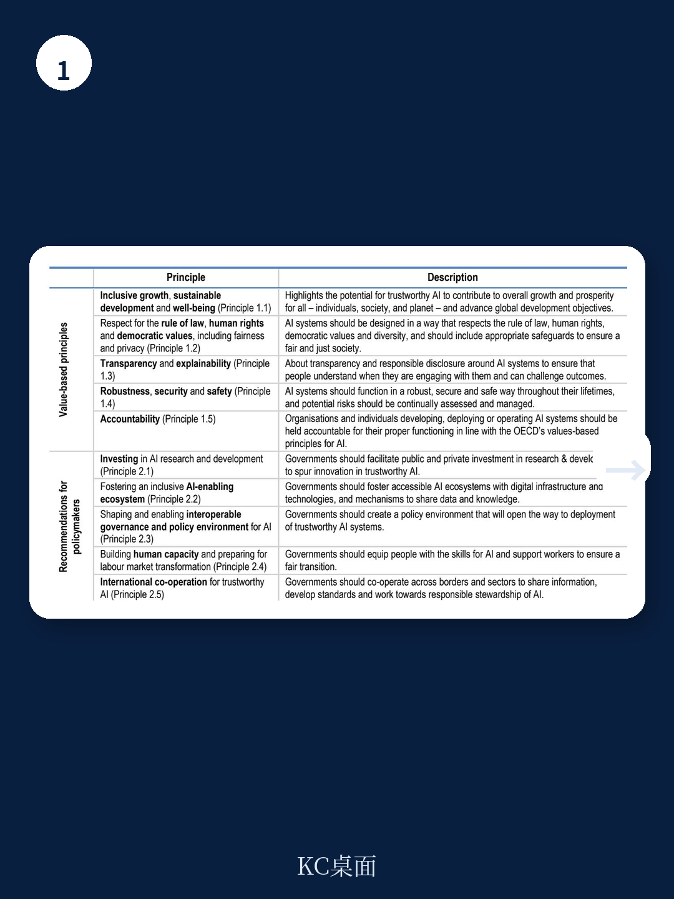
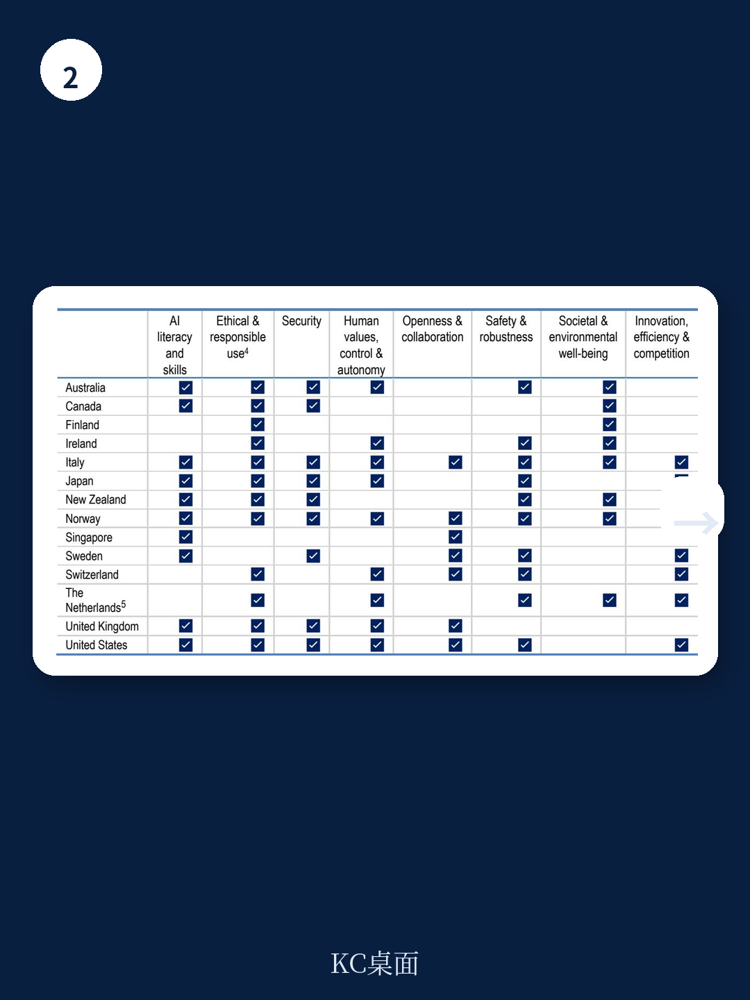

# 经合组织：政府生成式AI实验

公共部门员工正在大规模使用生成式AI，其中相当一部分是未经正式批准的“影子AI”。经合组织这份聚焦政府AI实验的工作论文，揭示了一个被多数战略文件忽略的断层：各国已发布大量伦理原则和操作指南，但真正能帮助公务员设计、执行和评估AI实验的框架，仍然高度碎片化且缺乏可操作性。报告的核心判断是，结构化实验不是AI部署前的可选步骤，而是政府在概率性技术面前建立能力、管理不确定性并赢得公众信任的必要路径。

## 1. 指南泛滥，但操作指引严重不足

报告对14个国家的官方AI指南进行了系统梳理，发现一个普遍矛盾：几乎所有国家都发布了高层次的负责任AI原则，但只有少数提供了足够详细的实验操作指导。例如，英国政府的AI操作手册和澳大利亚政府的临时指南属于少数例外，多数国家的文件停留在价值声明层面，缺少关于如何设计试点、设定评估指标、处理失败实验的具体方法。

这种不均衡直接导致两种后果。一是公务员在缺乏明确操作框架的情况下，要么因不确定性规避而不敢尝试，要么在无监督状态下自行使用工具，形成“影子AI”的蔓延。二是不同部门甚至同一部门内部的做法高度不一致，实验成果难以横向比较和复制，重复建设严重。报告引用2023年底英国艾伦图灵研究所的调查数据，22%的公共部门受访者已在使用生成式AI系统，但其中大量使用并未经过正式审批。

> **KC评论：** 这份报告最值得注意的不是“政府应该用AI”这个结论，而是它把问题从“要不要用”推进到了“怎么实验、怎么评估、怎么停掉失败的实验”。多数讨论还停留在原则层面，而经合组织直接指向了操作层面的缺失——这是目前政策讨论中最容易被跳过的环节。

## 2. 评估是最大短板，多数政府不知道实验是否有效

报告明确指出，监测和评估是当前政府AI实验中最薄弱的环节。很少有政府系统性地衡量实验是否带来了预期收益、是否产生了新不确定性、是否值得扩大规模。即便有评估，也往往依赖使用量或用户满意度这类基础指标，而非对性能、影响、成本和合规的结构化评估。

生成式AI的概率性特征放大了这一缺陷。相同的提示词可能产生不同输出，这意味着传统的静态测试方法不够用，需要引入输出审计机制。报告认为，如果没有统一的评估标准和可比指标，政府将无法判断哪些实验应该终止、哪些失败经验值得学习、哪些方向值得继续投入。为此，报告提出五个评估维度：性能与输入输出质量、预期影响与公共价值、成本可行性与制度整合、可用性与可接受性、不确定性管理与合规。

## 3. 实验不是孤立操作，需要系统性基础设施

报告将实验视为连接国家AI战略与日常行政操作的桥梁，而不是单个部门的临时试点。要实现这一功能，需要配套的制度和资源支持。报告列举了几个关键条件：共享工具和数据基础设施、安全的测试环境、公务员的AI素养培训、以及允许失败的组织文化。

以澳大利亚为例，2024年3月启动的微软Copilot六个月试点覆盖了50个公共机构，这种跨部门联合实验的设计本身就体现了系统性思维。但报告也指出，多数国家的实验仍然停留在孤立试点阶段，缺乏从实验到规模化部署的清晰管道。如果不解决这个问题，实验只会成为“展示橱窗”，而不会真正影响政策制定。

## 4. 十个优先行动，核心是让实验可评估、可复制

报告在结尾提出了十个优先行动方向，其中与实验本身直接相关的四条值得特别关注：让AI实验框架具备未来适应性、通过明确优先级和问题定义确保效率、从实验启动时就规划评估方法、创造鼓励实验的环境。这四条的核心逻辑是：实验不能等到做完再想怎么评估，评估框架必须在实验设计阶段就嵌入。

报告还特别提到，政府需要防止AI项目和系统的碎片化。这一点与评估短板直接相关——如果每个部门各自为政，实验成果无法共享，评估标准无法统一，系统性学习就不可能发生。经合组织认为，没有这些基础条件，实验大概率停留在孤立试点阶段，无法为更广泛的AI治理决策提供有效支撑。

---

For informational purposes only. Portions may be generated,translated,summarized,or edited with AI assistance based on source materials and may contain omissions or errors. Please verify independently. This is not investment,legal,tax,accounting,or other professional advice.

