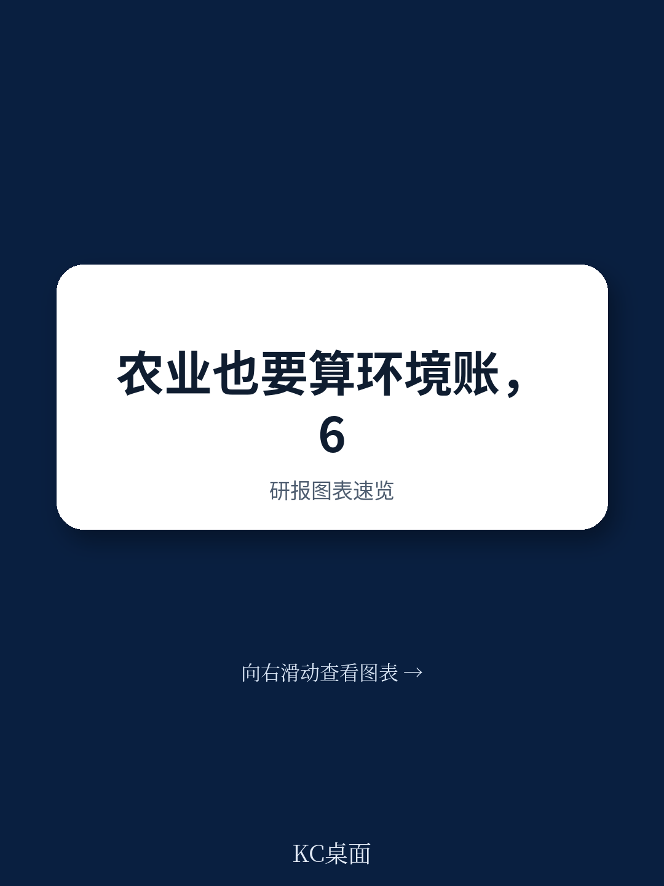
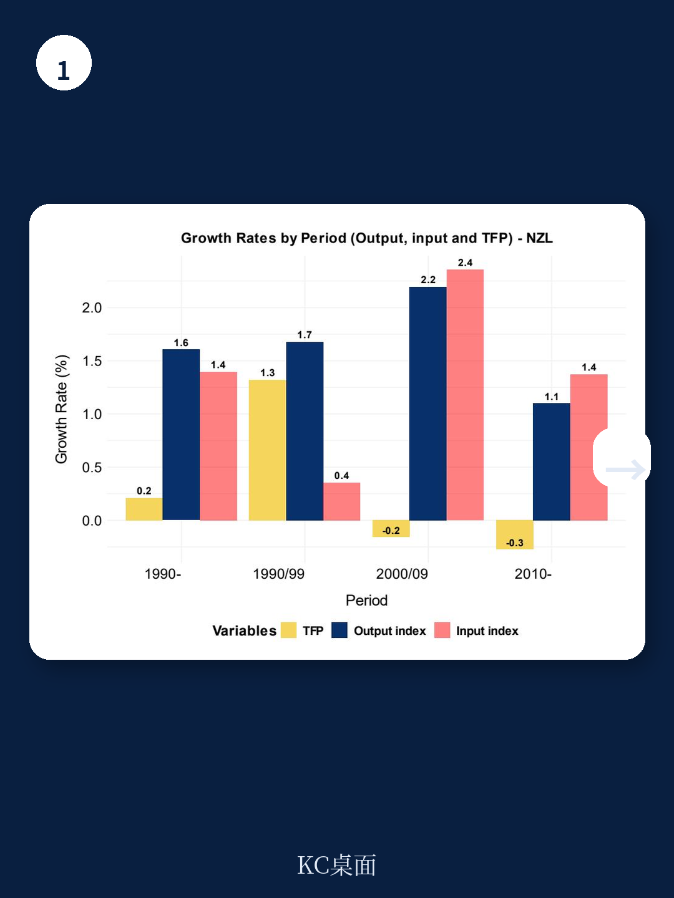
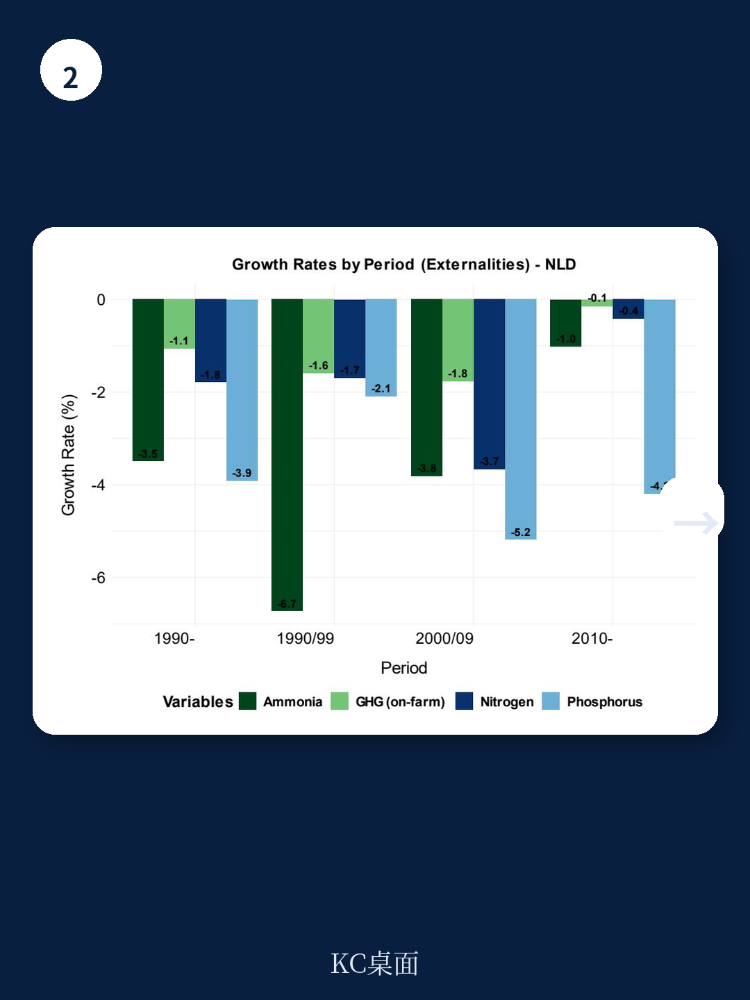

# 经合组织：环境可持续生产率增长的衡量

衡量农业是否在环境可持续的前提下实现增长，长期以来缺乏一个公认的标尺。传统全要素生产率只算产出和投入，把温室气体、氨排放、氮磷流失等环境外部性排除在外。经合组织最新发布的这份工作论文，系统比较了六种“环境可持续生产率增长”指标，并用墨西哥、荷兰、新西兰三个国家的三十年数据做了实证检验。结论并不复杂：不同指标对“可持续”的定义差异巨大，而选择哪种指标，直接决定一个国家农业表现是被判定为“进步”还是“不足”。

报告的核心发现是，六种指标可以归为两类。第一类要求环境外部性增长慢于产出或投入增长，即“相对脱钩”；第二类要求外部性绝对下降，即“绝对脱钩”。当环境权重较低时，两类指标差异很小；但随着权重上升，分歧迅速扩大。这意味着，如果政策制定者只采用相对脱钩指标，可能掩盖外部性总量仍在上升的事实。

## 1. 荷兰的监管经验证明，绝对脱钩是可以实现的

三个案例国家中，荷兰是唯一一个在六种指标下环境可持续生产率都高于传统全要素生产率的国家。报告指出，1990年至2010年间，荷兰农业的氨排放和养分投入显著下降，这直接拉大了可持续生产率与传统生产率之间的差距。关键驱动力是监管：针对粪肥、氨气和化肥的法规，推动了农场管理和技术升级。

从数据看，荷兰的环境外部性在产出和投入仍在增长的同时实现了下降，这符合绝对脱钩的定义。报告特别提到，氨排放的下降贡献最大——在荷兰，氨排放的社会估值权重高达0.39至0.42，远高于其他两个案例国家。这意味着，当环境外部性被赋予较高的社会成本时，监管带来的改善会显著反映在可持续生产率指标中。

> **KC评论：** 荷兰案例的关键不在于技术本身，而在于监管创造了明确的成本信号。氨排放的社会估值权重高，是因为荷兰人口密度大、畜牧业密集，氨排放对生态系统和公众健康的实际影响更大。这提醒我们，环境权重的设定不是技术问题，而是政策选择。

## 2. 墨西哥和新西兰：产出扩张掩盖了外部性总量的上升

墨西哥和新西兰的情况与荷兰形成对比。报告显示，这两个国家在相对脱钩指标下，环境可持续生产率高于传统全要素生产率；但在绝对脱钩指标下，可持续生产率反而更低。原因在于，虽然单位产出的环境外部性在下降，但外部性总量仍在上升。

墨西哥的驱动力来自贸易协定带来的市场准入改善和农业支持政策调整。1990年至2019年间，墨西哥农业产出大幅增长，温室气体、氨排放和养分流失也随之增加，只是增速慢于产出。新西兰的情况类似，1990年代畜群规模快速扩张，导致氨和温室气体排放激增；直到2010年代中期，畜群规模稳定后，单位投入和产出的环境外部性价值才开始下降。

报告特别指出，在这两个国家，传统产出和投入的增长仍是解释可持续生产率变化的主要因素，环境调整的贡献相对较小。这意味着，如果只看相对脱钩指标，政策制定者可能误以为农业环境表现已经足够好。

## 3. 指标选择背后是价值判断，不是技术问题

报告没有回避指标选择中的主观性。六种指标在如何对待环境外部性上存在根本差异：有的把环境视为一种“产出”，有的视为一种“投入”；有的用生产者视角估值，有的用社会视角估值。这些选择直接影响结果。

例如，当环境权重较低时，所有指标的增长率差异很小，因为传统全要素生产率主导了结果。但当权重上升，差异开始显现。报告用参数gamma统一表达了不同指标对环境权重的处理方式，并给出了每种指标下可持续生产率超过传统生产率的条件。这为政策制定者提供了一个清晰的决策框架：选择哪种指标，取决于你希望鼓励“相对改善”还是“绝对改善”。

> **KC评论：** 报告没有给出“最佳指标”的结论，而是提供了一个工具箱。对于读者或产业观察者来说，关键不是记住六种指标的计算公式，而是理解：任何声称“农业绿色增长”的数据，都必须追问它用的是相对脱钩还是绝对脱钩定义。同一个国家，用不同指标可能得出完全相反的结论。

## 4. 一个可复用的观察框架：从“增长率”转向“增长率+总量”

报告虽然没有明确给出分析框架，但其方法论隐含了一个可复用的思路：评估农业环境表现时，不能只看可持续生产率增长率，还必须同时追踪环境外部性的绝对水平。报告明确写道：“正的可持续生产率增长率并不一定意味着良好的环境表现或外部性下降。”

这个框架可以拆解为三步：第一，计算传统全要素生产率增长率；第二，计算环境外部性的增长率及其社会成本权重；第三，判断外部性是否在绝对下降。如果外部性总量仍在上升，即使可持续生产率高于传统生产率，也不能断言农业已经走上可持续路径。

对于关注农业政策、食品供应链和农村发展的读者来说，这个框架的价值在于提供了一个通用的诊断工具。无论是评估某个国家的农业补贴改革效果，还是判断一家农业科技公司的技术是否真正降低了环境不确定性，都可以用这个逻辑来检验。

For informational purposes only. Portions may be generated,translated,summarized,or edited with AI assistance based on source materials and may contain omissions or errors. Please verify independently. This is not investment,legal,tax,accounting,or other professional advice.

