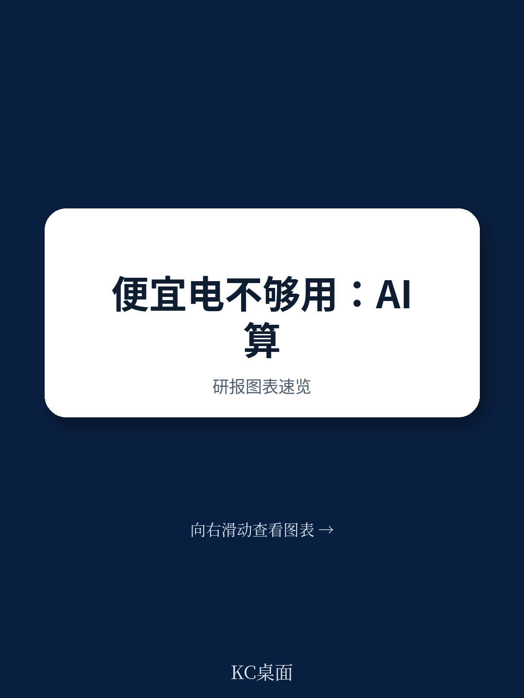
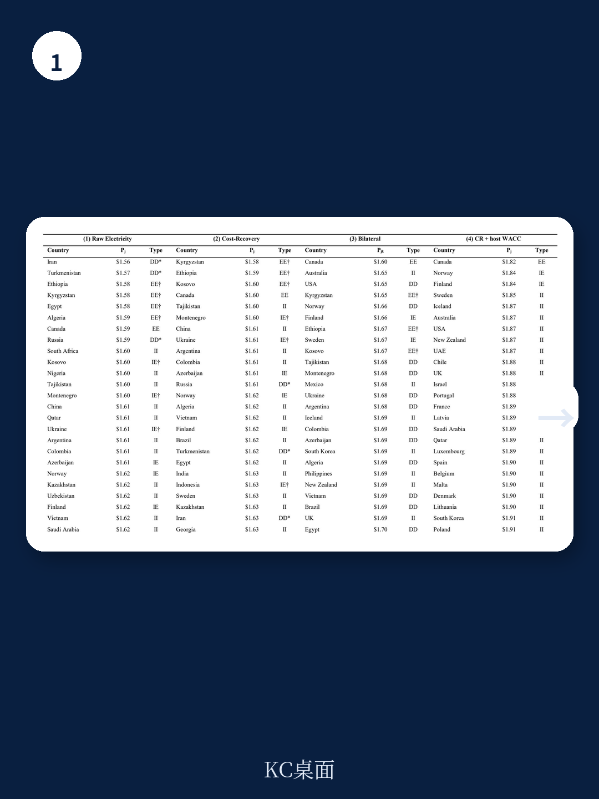
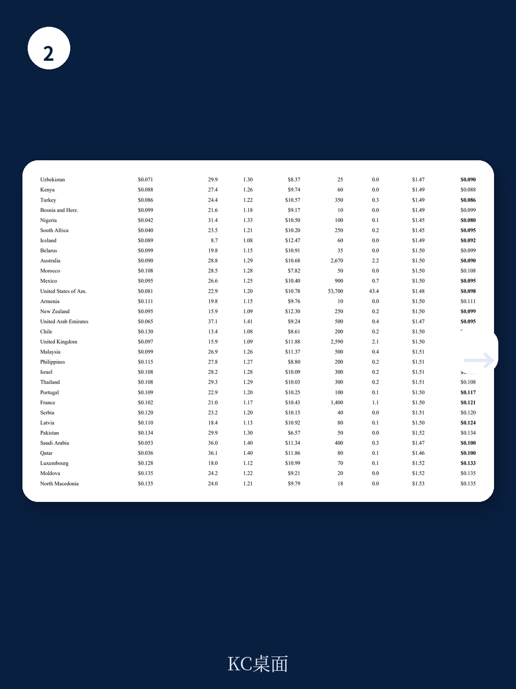

# 世界银行：廉价电力不足以创造AI算力出口优势

能源富集的发展中国家能否把廉价电力转化为AI算力出口？世界银行一份最新工作论文给出了一个反直觉的答案：不能。不是因为技术门槛，而是因为成本优势本身太薄。

论文构建了一个包含产能约束、双边制度摩擦和延迟成本的算力贸易模型，覆盖85个地区。核心发现是：硬件摊销占算力单位成本的约90%，且硬件在全球统一定价，因此各国算力生产成本差异只有12%到20%。这个狭窄的区间，意味着任何一点制度摩擦——数据治理可信度、监管稳定性、电力合同可执行性、融资可得性、地缘政治信任——都足以抹平廉价电力带来的成本优势。

报告以吉尔吉斯斯坦为例。该国是模型校准中成本最低的潜在算力生产国，但仅有5兆瓦的装机容量，几乎没有数据中心外商直接研究。而吸引最多研究的发展中地区——马来西亚、印度、巴西——在成本排名中仅处于中游位置。廉价电力本身不创造算力出口。

## 1. 硬件成本全球统一定价，压缩了各国成本差异的空间

模型将算力单位成本拆解为电力、硬件摊销和数据中心建设三部分。其中硬件成本（GPU采购价除以使用寿命和利用率）由全球市场决定，各国相同。电力成本虽然因能源禀赋不同而有差异，但只占单位成本的一小部分。

校准结果显示，在成本回收定价假设下，多个发展中国家进入低成本生产国行列。但一旦引入双边主权溢价——即买方因制度信任、监管兼容性、地缘政治距离等因素对跨境算力采购施加的隐性成本——这些国家的出口潜力几乎全部消失。

报告特别指出，融资成本差距进一步强化了这一结论。OECD超大规模云服务商与本地融资的发展中国家运营商之间，加权平均资本成本每差10个百分点，每GPU小时单位成本增加约0.29美元，这大约是前20名生产国之间电力成本差距的四倍。

> **KC评论：** 这意味着，对于想发展算力出口的发展中国家，降低融资成本、提升制度可信度，可能比争取更低的工业电价更关键。模型中的主权溢价不是抽象概念，而是可量化的贸易壁垒。

## 2. 训练与推理：两类算力服务的贸易壁垒结构完全不同

模型区分了两种算力服务：训练和推理。训练工作负载（如大模型预训练、微调）对延迟不敏感，数据可以在数天到数周内完成传输和处理，因此理论上可以完全离岸化，由全球最低成本的生产国提供。推理工作负载（如聊天机器人响应、实时决策）对延迟高度敏感，超过200到300毫秒的往返时间就会使服务不可用，因此市场高度本地化。

这意味着，即使发展中国家在训练算力出口上具有成本优势，推理算力市场仍然会被靠近终端用户的国家占据。而随着AI应用从训练转向推理，以及智能体推理等中间工作负载的增长，可离岸化的算力份额可能比当前模型假设的更小。

报告还指出，跨境算力贸易面临一个独特的合约密集型问题：买方将敏感数据发送给远程卖方，依赖卖方司法管辖区来执行保密、服务水平和数据删除义务。在合约执行能力弱的国家，买方会对卖方的有效价格打折扣，折扣幅度取决于双边制度环境的强度。这种制度摩擦在传统商品贸易中也有，但在算力贸易中因为数据主权和国家安全议题而被放大。

## 3. 对称调整后的成本排名：清洁电力而非廉价电力才是真正优势

报告附录做了一个重要的稳健性检验：对OECD和高收入国家的工业电价也进行对称调整，纳入碳价和工业交叉补贴的修正。原始版本只对13个存在明确化石燃料补贴的发展中国家做了长期边际成本替代，这实际上偏向了OECD地区。

对称调整后，成本最低的前五名生产国变为吉尔吉斯斯坦、埃塞俄比亚、科索沃、加拿大和塔吉克斯坦。加拿大从第二名降至第四名，仅因适度的碳价调整。波兰下降21位，德国、美国和法国各下降10到12位。北欧低碳电网国家和瑞士的排名变动不超过两位。

这个结果强化而非推翻核心结论：拥有廉价且清洁电力的国家保留成本优势，但优势仍然很薄。真正决定谁能把优势转化为出口的，不是电力价格本身，而是制度可信度、融资条件和地缘政治定位。

对于政策制定者而言，这份报告提供了一个可操作的观察框架：算力出口竞争力不是单一维度的电价竞赛，而是电力成本、硬件成本、融资成本、制度成本和地缘政治成本的复合函数。其中后三项的改善空间，可能比前两项更大。

For informational purposes only. Portions may be generated,translated,summarized,or edited with AI assistance based on source materials and may contain omissions or errors. Please verify independently. This is not investment,legal,tax,accounting,or other professional advice.

