# Regularization and the Formation of Social Capital Evidence from Forced Migrants in Colombia

Sandra V. Rozo

POLICY RESEARCH WORKING PAPER 11427

## Abstract

This paper estimates the medium-run effects, 4.5 years after launch, of a regularization program that granted temporary legal status, freedom of movement, work authorization, and access to social programs to nearly half a million Venezuelan forced migrants in Colombia with no criminal record. Because the program was announced unexpectedly and applied retroactively to migrants who had registered in a census before a sharp eligibility cutoff, the paper identifies its effects using a fuzzy regression discontinuity design and a unique two-wave panel survey. The largest medium-run gains were in social capital. At the cutoff, eligible migrants scored 0.95 standard deviation higher than ineligible peers on a social integration index capturing belonging, friendships with Colombians, community participation, and attachment to Colombia, and 0.97 standard deviation higher on a prosocial behavior index measuring generalized trust and trust toward both Colombians and Venezuelans.

Neither effect is detectable in the short run, and both emerge only over time. Economic gains, by contrast, arose immediately and largely persisted. Eligible migrants earned 69 percent higher monthly labor income, scored 2.6 standard deviations higher on a service access index, and made substantial investments in housing, with housing quality increasing from 0.60 to 1.27 standard deviations between survey waves. The implied fiscal savings to Colombia also increased over time, rising from roughly 40 to 70 percent of the fiscal cost associated with irregular households as beneficiaries moved toward fiscal balance. These findings suggest that the largest social capital and fiscal returns to regularization accrued gradually through sustained legal inclusion and repeated positive interactions with institutions and host communities rather than through the act of legalization itself.

# Regularization and the Formation of Social Capital: Evidence from Forced Migrants in Colombia\*

Sandra V. Rozo $^{†}$

Authorized for distribution by Dean Jolliffe, Research Manager, Development Research Group, Development Economics, World Bank Group

JEL codes: F22, J15, J61, O15, R23, I31.

Keywords: forced migration; regularization; social capital; Venezuela; Colombia.

## 1 Introduction

More than 8 million Venezuelans have fled their country since 2013, creating the largest forced displacement crisis in the Western Hemisphere and one of the largest in the world. Colombia absorbed more of this flow than any other country and, in 2018, became the first country in Latin America to grant large-scale legal status to undocumented Venezuelan migrants without criminal records. The program, known as the Permiso Especial de Permanencia for migrants registered in the Registro Administrativo de Migrantes Venezolanos (PEP-RAMV), provided temporary legal status, freedom of movement, formal work authorization, access to the financial system, and eligibility for social programs to approximately half a million Venezuelans. Its positive short-run effects on consumption, labor income, and health are well documented (Ibáñez et al., 2025). Whether obtaining legal status continues to shape migrants' well-being in the medium run, and whether it strengthens the social capital investments that underpin migrants' relationships with both the host society and the state, is the central question of this paper.

We answer that question affirmatively, with three main takeaways at the medium-run horizon, which throughout this paper denotes four and half years after program launch. First, and most importantly, large social capital gains emerge in the medium run. At Wave 1, eligible and ineligible migrants are statistically indistinguishable on a social integration index, capturing sense of belonging, attachment to Colombia, social ties with Colombians, and community engagement; and on a prosocial-behaviors index, capturing generalized trust, trust in Colombians and Venezuelans, and perceptions of the helpfulness of fellow Venezuelans. By Wave 2, eligible migrants score nearly one standard deviation higher than ineligible peers on both indices. Trust and prosocial cooperation have largely been shown to increase economic growth via a reduction in transaction costs, higher investments in education, and higher institutional efficiency (Algan and Cahuc, 2010; Goldin and Katz, 1999; Knack and Keefer, 1997; La Porta et al., 1997). Hence, the large social capital gains we document may generate benefits for Colombia that extend beyond the forced migrants targeted by the program.

Second, the economic gains documented in the short run largely persist and, in some cases, grow. Monthly labor income remains 69 percent higher among eligible migrants, the service-access index increases from two standard deviations in the short run to 2.60 in the medium run, and the housing quality index rises from 0.60 to 1.27 standard deviations as eligible households invest in their dwellings. The one exception is per-capita consumption, whose short-run advantage fades as ineligible households catch up.

Third, the fiscal returns to the host country strengthen over time. A fiscal accounting exercise that nets formal-sector tax contributions against public-service benefits implies that the savings from regularizing a forced-migrant household, relative to leaving it undocumented, rise from roughly 40 to 70 percent of the fiscal cost of irregular status between the short and medium run.

How these effects line up is informative about how regularization operates. The short-run gains in consumption, labor income, and access to formal services are mechanical and emerge immediately after the program's launch. What is new in the medium run is the emergence of social capital gains and larger investments in housing improvements, an immovable asset that is not portable (Michalopoulos et al., 2025) and which has been shown to be highly associated with investments in social capital (DiPasquale and Glaeser, 1999; Glaeser et al., 2002). Our conceptual framework identifies four candidate mechanisms for the observed improvements in social capital. The first three correspond to margins directly affected by the program's mechanical effects: increased access to services, reduced material precarity, and greater cognitive bandwidth. Each can be evaluated through mediation analysis. Conditioning the Wave 2 estimates on observable proxies for each channel leaves the estimated effects on social capital virtually unchanged, ruling out these channels as primary explanations. The evidence instead points to a fourth mechanism: a stable status channel through which legal inclusion and repeated positive contact gradually build social capital over time. This interpretation is consistent with two literatures. First, the intergroup contact theory which predicts that sustained equal status cooperative contact can reduce prejudice and build trust between groups (Allport, 1954; Pettigrew and Tropp, 2006). Second, the social capital literature which predicts that individual investments in social relations and communities are inversely related with expected mobility (Glaeser et al., 2002; Putnam, 2000). Hence, in our context this implies that such investments are more likely when individuals have clear and durable legal status in their host communities. The timing of our estimates matches both conditions. Wave 1 was fielded during the COVID-19 pandemic, when migrants had the mechanical benefits of regularization but could not engage in direct sustained contact with hosts. By Wave 2, social contact restrictions had lifted and four and a half years of stable status had accumulated. The timing of the effects is consistent with this interpretation as the social capital effects of regularization emerge only in the medium run, when sustained legal inclusion and repeated positive contact were both possible.

Our empirical strategy exploits a sharp institutional feature of the rollout. The RAMV was a one-time national registration of undocumented Venezuelan migrants administered by the Colombian government between April 6 and June 8, 2018, originally intended to count and characterize the irregular Venezuelan population. Six weeks after registration closed, on July 25, 2018, the government unexpectedly issued a presidential decree extending PEP eligibility to all migrants who had registered. As a result, migrants who arrived in Colombia before the RAMV deadline and registered during the open enrollment period became eligible for the permit, whereas those who arrived after the deadline could not have registered and were therefore ineligible. We exploit this discontinuity through a fuzzy regression discontinuity design that compares migrants arriving just before and just after the eligibility cutoff, using arrival date as a source of local quasi-random variation in program access. The same identification strategy was applied to the Wave 1 sample by Ibáñez et al. (2025). Because PEP-RAMV was not announced until after the registration period had ended, anticipatory manipulation of arrival dates is mechanically impossible. Migrants could not have timed their arrival to qualify for a program that did not yet exist.

We carry out the analysis using the Venezuelan Refugees Panel Survey (VenRePS), a two-wave longitudinal survey we designed and fielded for this study. The survey is representative of Venezuelan migrants who arrived irregularly in Colombia between January 2017 and December 2018 and resided, at the time of fielding, in the four regions that hosted the largest share of the Venezuelan diaspora. Wave 1 was fielded between October 2020 and January 2021 and provides the data underlying the short-run estimates. Wave 2 was fielded between October and December 2021 and forms the basis of the medium-run analysis in this paper. Because the short-run estimates were obtained during the COVID-19 pandemic, they may partly capture resilience to that shock rather than durable effects of regularization. We therefore follow the same migrants one year later, outside the pandemic period, to examine whether the early gains persist four and half years after the program was implemented. We also expand the analysis to social capital outcomes that the short-run literature has been unable to measure, including integration into Colombian society and prosocial behavior.

The results are robust to a standard battery of tests. Most importantly, although panel attrition between Wave 1 and Wave 2 is correlated with baseline characteristics, it is not discontinuous at the eligibility cutoff, preserving the local randomization underlying the regression discontinuity design. Lee (2009) rank based trimming bounds for all Wave 2 estimates leave the headline findings on the same side of zero. The results are also robust to adjustments for multiple hypothesis testing, alternative bandwidth choices, different sample composition, and estimating the design in sharp rather than fuzzy form.

These findings carry a clear policy message. Granting forced migrants the legal right to work, move freely, and access the host country's social programs does more than relieve short-run hardship. It improves economic well-being, increases participation in the formal economy, strengthens integration with the host society, and encourages investment in immovable assets such as housing. At the same time, it reduces the net fiscal cost of hosting migrants, as regularized households contribute more in taxes and rely proportionately less on public services as stable legal status accumulates. The returns to legal status are economic, social, and fiscal, and they strengthen rather than fade as stable status endures over time.

Our paper makes three contributions. First, we provide the first medium-run causal estimates of a regularization program for forced migrants in a host developing country. The earnings effect we document at the four and half year horizon is comparable in magnitude to the short-run earnings response in U.S. and European regularization studies (Devillanova et al., 2018; Kossoudji and Cobb-Clark, 2002; Kuka et al., 2020; Monras et al., 2020); what our setting adds is the finding that the labor market gains do not attenuate at the medium-run horizon. Second, we extend the regularization outcome set beyond the labor market into the social domain that the short-run literature had not measured. Generalized trust and prosocial behaviors are central long-run determinants of economic performance (Algan and Cahuc, 2010) and the historical literature on immigrant assimilation treats integration as the slow-moving margin (Abramitzky et al., 2014, 2020; Pérez, 2021). The finding that a regularization program shifts an integration and prosocial indices by nearly one standard deviation within four and half years is therefore remarkable. Third, we contribute to the economics of forced displacement, which has so far concentrated on the consequences of refugee inflows for destination countries (e.g., Becker and Ferrara, 2019; Dustmann et al., 2017; Foged and Peri, 2016; Rozo and Grossman, 2025; Steinmayr, 2021; Verme and Schuettler, 2021) and on the immediate consequences of displacement for migrants themselves (e.g., Chiovelli et al., 2021; Michalopoulos et al., 2025), by showing that a legal-status change for forced migrants produces durable economic, social, and fiscal gains.

Our analysis is on the migrant-side throughout. A parallel literature studies how Venezuelan in-flows and PEP-RAMV in particular shape outcomes for Colombian natives, finding modest negative labor-market effects concentrated among low-skilled informal workers (Bahar et al., 2021), violent crime reductions attributable to the program (Ib áñez et al., 2024), and no detectable electoral or political effects despite the program's scale (Rozo et al., 2025). The political null is itself informative. Migration is not a highly salient cleavage in Colombian politics, Venezuelans and Colombians share language and culture, and PEP-RAMV did not become a partisan flashpoint in the way comparable programs have elsewhere. The migrant-and native-side analyses speak to different questions, whether the program helps the population it targets and whether it imposes costs on the host population. We focus on the first because the medium-run social capital returns to legal status are the part of the picture the literature has not been able to measure.

## 2 Context: Venezuelan Migration to Colombia

By 2025, roughly 7.9 million Venezuelans had left the country, representing nearly one-third of Venezuela's pre-crisis population (UNHCR, 2025). Colombia has emerged as the world's largest host country, receiving approximately 2.9 million Venezuelan forced migrants—equivalent to 5.4 percent of its population (R4V, 2025).

Although Venezuelans are not formally classified as refugees, the United Nations Refugee Agency counts them in its forcibly displaced statistics and treats them as a population of interest. The substantive case for treating Venezuelans as forcibly displaced is nonetheless strong. Departures have been driven by economic collapse, hyperinflation, hunger, the breakdown of public services, and political persecution rather than by individual labor-market choice, and for the vast majority of Venezuelans abroad return is not a meaningful option (Cabra-Ruiz et al., 2024).

## 2.1 Regularization programs in Colombia

Colombia's regularization response to the Venezuelan crisis has unfolded in waves since 2017. The Permiso Especial de Permanencia (PEP), launched in early 2017, is a temporary residency permit, renewable every two years, that grants Venezuelan migrants free mobility, the right to work in the formal sector and to access publicly provided services including health care, education, and the means-tested social-protection system (SISBEN). The first two PEP waves, in January 2017 and February 2018, were targeted at Venezuelans who had entered Colombia through official border crossings with valid documentation and together issued close to 182,000 permits.

By early 2018, however, most Venezuelans in Colombia held no documentation. Many had entered through informal border crossings or overstayed tourist permits because the cost and processing time of a Venezuelan passport had become prohibitive following the collapse of public services in the República Bolivariana de Venezuela. To measure and characterize the undocumented population, the Colombian government ran the Registro Administrativo de Migrantes Venezolanos (RAMV) between April 6 and June 8, 2018. The registration operated 1,109 stations across 441 of Colombia's 1,122 municipalities, located in border municipalities, in municipalities with a substantial Venezuelan presence, and in municipalities whose local authorities requested them. To register, a migrant had to present proof of Venezuelan citizenship. The exercise identified 442,462 undocumented Venezuelans in 253,575 households.

The Colombian government had publicly stated that registering in the RAMV carried no immediate benefits or costs and would not lead to deportation. On July 25, 2018, days before leaving office, President Juan Manuel Santos unexpectedly issued a decree extending PEP eligibility to every migrant who had registered in the RAMV. This PEP wave was the first to target undocumented migrants. Of the 442,462 RAMV registrants, 281,307 (64 percent) applied for and received a permit. This wave, rolled out in the fall of 2018, is the program studied in this paper.

A series of expansions followed. Subsequent waves and the Permiso Especial Complementario extended PEP to additional groups. The most consequential expansion became effective in 2022, when the Colombian government enacted the Estatuto Temporal de Protección para Migrantes Venezolanos (ETPV). The ETPV scaled up regularization dramatically. It established a ten-year permit known as the Permiso por Protección Temporal (PPT) for every Venezuelan migrant. The new permit confers the same bundle of rights as the PEP and is valid through November 2031 (Urbina et al., 2023). As of July 2025, approximately 1.95 million PPT permits had been issued, with another 330,000 in process (IDB, 2025). The PPT issuance occurred after the close of the second VenRePS wave in December 2021, so our Wave 2 measurements remain a clean reflection of the PEP-RAMV treatment-versus-control design. Because the ETPV ultimately regularized our post-cutoff comparison group, the medium-run horizon studied here is the longest at which the PEP-RAMV regression-discontinuity design can be cleanly implemented. Together, the PEP and the ETPV constitute one of the largest and most comprehensive regularization efforts ever implemented by a developing country.

## 2.2 Regularization programs around the world

Regularization programs have become a central instrument of migration policy in Latin America and the Caribbean. Between 2010 and 2025, 26 LAC countries implemented 70 extraordinary regularization programs comprising 88 distinct implementation phases (IDB, 2025). The pace accelerated sharply after 2017 in response to the Venezuelan crisis. Programs explicitly modeled on the Colombian PEP have been adopted in Peru (2017), Brazil (2018), Ecuador (2019 and 2020), Chile (2018 and 2021), Trinidad and Tobago (2019), Costa Rica (2022), Curaçao (2022), Guyana (2022), Panama (2022), and the Dominican Republic (2023). These programs share PEP's temporary nature and its basic bundle of rights but vary in eligibility criteria, permit duration, and the depth of access to public services.

Outside Latin America, regularization is a recurring policy instrument. The Immigration Reform and Control Act of 1986 and the Deferred Action for Childhood Arrivals program in the United States granted status to large undocumented populations, and Canada's Temporary

Resident Permit fulfills a similar function. In Europe, Spain, Italy, Portugal, and Ireland all introduced regularization measures in 2020, with Spain's program covering roughly 600,000 individuals. This trend is likely explained by the fact that irregular populations have grown faster than the absorptive capacity of formal migration channels in most receiving countries.

## 3 Data: The Venezuelan Refugee Panel Survey

The data come from the Venezuelan Refugee Panel Survey (VenRePS), a longitudinal household survey designed to estimate the causal effects of the PEP-RAMV program on the lives of Venezuelan forced migrants. To our knowledge, VenRePS is the only longitudinal survey of Venezuelan forced migrants in Colombia that combines the eligible (RAMV-registered) and ineligible (non-RAMV) populations and tracks the same individuals over time.

Five features distinguish it from administrative records and from standard household surveys. First, VenRePS was designed ex ante to support causal identification of the PEP-RAMV effect rather than for general migrant statistics. Both the sampling frame and the questionnaire were constructed to compare RAMV-eligible migrants with a comparable group of non-RAMV migrants who differed only in registration status. Second, the survey captures a hard-to-reach population. Colombia has no Venezuelan refugee camps, and forced migrants are mobile, dispersed across the territory, and often distrustful of authorities, so standard household surveys substantially under-represent them. Third, the questionnaire covers a much richer set of dimensions than the labor-market focus typical of the regularization literature, including mental and physical health, social integration, prosocial behaviors, housing quality, food security, and migration intentions. Fourth, the survey collects detailed pre-migration covariates through respondent recall, which permits balance and continuity tests on traits fixed at the time of migration. Fifth, the labor module is harmonized with the Colombian Labor Force Survey (Gran Encuesta Integrada de Hogares), which makes our labor estimates directly comparable to existing administrative data on monthly wages, weekly hours, employment, and formality.

VenRePS was designed from the outset as a panel and addresses two related questions. The first is the immediate causal effect of PEP-RAMV on the well-being of Venezuelan forced migrants, on which short-run evidence is already available. The second, taken up here, is whether those effects persist, attenuate, or expand over time as eligible migrants accumulate experience under stable legal status, and whether the program reshapes the broader set of social outcomes. Hence, the second wave expands the questionnaire to a number of social and prosocial outcomes not collected in Wave 1. Both questions are identified from the same regression discontinuity design on the same sampling frame.

## 3.1 Sampling frame

The sample is representative of the four geographical regions that hosted the largest share of Venezuelan forced migrants according to the 2018 Colombian Population Census. The regions are Bogotá, Medell'ın, Barranquilla, and a fourth area aggregating ten smaller cities (Cúcuta, Villa del Rosario, Cali, Cartagena, Riohacha, Maicao, Uribia, Valledupar, Santa Marta, and Arauca). To enter the sample, an individual had to be at least 18 years old, be the household head or partner, have arrived in Colombia between January 1, 2017, and December 31, 2018, and have been undocumented upon arrival.

The frame combines two complementary sources. The RAMV frame was drawn directly from the RAMV registration of 442,462 individuals. From that registration we constructed a representative sample of 13,083 households across the four regions and randomly surveyed 1,135 of them. The non-RAMV frame had no administrative analog. We built it by combining databases shared by Venezuelan migrant associations in the four regions with referrals from migrants surveyed under the RAMV frame. The resulting non-RAMV frame covered 12,554 households, 81 percent obtained from associations and 19 percent from referrals, from which we randomly sampled 1,097 households (527 from associations and 570 from referrals).

The Wave 1 baseline sample comprises 2,232 households and 3,896 individuals. Within each household, the head and the partner (or, in the absence of a partner, another randomly selected adult) responded to modules requiring individual-level information. RAMV and non-RAMV migrants in the analysis sample are similar in pre-migration characteristics. The one small difference, in length of settlement in Colombia, follows mechanically from the timing of the RAMV registration (Ibáñez et al., 2025, Online Appendix B).

## 3.2 Survey instrument

The questionnaire has five modules. The first elicits standard sociodemographic information for every household member. The second collects detailed information on RAMV and PEP registration histories, including each member's PEP status and issue date, perceived benefits, and reasons for registering or not registering. The third is a labor module designed to mirror the Colombian Labor Force Survey, with monthly wages, weekly hours worked, employment status, formality, and pre-migration labor history in the República Bolivariana de Venezuela and Colombia. The fourth is a health module that includes the EQ-5D-3L instrument, a validated scale that captures physical and mental health symptoms across five dimensions. The fifth module, asked at

the household level, covers migration history and intentions, integration into Colombian society, connections to migrant networks, prosocial preferences, housing quality, food security, expenditure, and remittances.

The instrument was informed by a pre-survey qualitative study of 42 semi-structured interviews with forced migrants who had and had not registered in the RAMV (Romero and Uribe, 2021). That work surfaced the language and trust constraints that shaped the final design. Venezuelans and Colombians both speak Spanish, but everyday vocabulary differs enough that Venezuelans found instructions phrased in Colombian Spanish difficult to follow. Forced migrants also reported high levels of mistrust, fearing deportation and having been targeted by scams over text and social media. The final design responded to these constraints in three ways. The survey was administered by Venezuelan enumerators, many of them forced migrants themselves. The instrument was reviewed for everyday language differences before fielding. And Venezuelan migrant associations in each region disseminated information about the survey's purpose and scope. Each interview lasted on average one hour and forty minutes. Respondents received an incentive of 27,000 COP (about USD 9), delivered through cellphone credit, supermarket vouchers, or electronic transfer because most forced migrants are excluded from the formal financial system.

## 3.3 Survey waves and panel structure

Wave 1 was administered between October 2020 and January 2021, and Wave 2 between October and December 2021. Both waves were conducted by phone. The original design called for in-person interviews, but the COVID-19 pandemic forced a switch to phone enumeration. The Wave 2 instrument retained the modules of Wave 1 and added questions on social integration, prosocial behaviors, detailed government transfers, and updated migration intentions.

The two-wave structure observes the same household at two different horizons after the program. Wave 1 captures outcomes approximately 42 months (3.5 years, what we refer to as short-run) after the PEP-RAMV decree, and Wave 2 captures outcomes 54 months (4.5 years, what we refer to as medium-run) after the decree.

## 3.4 Tracking and attrition rates

Tracking forced migrants between waves is challenging because the target population is mobile, often distrustful of unknown callers, and excluded from the formal labor, financial, and social system that anchors most contact information. We made repeated contact attempts across several channels (cellphone calls, WhatsApp messages, and intermediation through migrant associations) and used the same Venezuelan enumerators across waves to preserve trust. Of the 2,311 households interviewed in Wave 1, 1,400 were re-contacted and successfully re-interviewed in Wave 2, a panel-tracking rate of 60 percent. By the standards of longitudinal surveys of hard-to-reach mobile undocumented migrant populations, this rate is conventional (Tamim et al., 2025).

Attrition between Wave 1 and Wave 2 is not random with respect to baseline conditions (Online Appendix, Section A). Particularly, better-off households are less likely to drop out. Crucially for the identification, however, the attrition gap is not discontinuous at the RAMV-eligibility cutoff. The sharp regression discontinuity on the panel-membership indicator (one for households re-interviewed in Wave 2, zero otherwise) returns a coefficient of -0.067 (p = 0.507) at the MSE-optimal bandwidth, with no evidence of a jump at the cutoff (Online Appendix, Section A). Consequently, local randomness at the cutoff, the only attrition-related continuity assumption that the RD design requires, is satisfied even on the Wave-2 sample. Importantly, non-random attrition over the full running-variable support does not, by itself, threaten the RD identification.

To address the residual concern that within-side attrition (rather than across-side discontinuity) could shift the Wave-2 effects, we report Lee (2009) rank-based trimming bounds for every Wave-2 result. The bounds trim the over-represented side of the cutoff at each outcome's MSE-optimal bandwidth by the differential-attrition share, which yields lower and upper bounds on the Wave-2 LATE that bracket the true effect under monotonic selection. We treat a Wave-2 estimate as robust to attrition when both bounds lie on the same side of zero. The Lee-bounds figure is reported as Figure 5, with the full per-outcome bounds in Online Appendix A.

## 3.5 Outcomes

We organize outcomes into seven main thematic groups. Each group has a standardized summary index, constructed following Kling et al. (2007) by averaging standardized components and then standardizing the average to the within-wave control mean and standard deviation. The groups correspond to the most policy-relevant margins of the program. Within every index, all components are signed so that higher values denote a better outcome. Components that are naturally measured in the opposite direction, such as the deprivation items in the food-security group (e.g., skipped meals, went without food) and the adverse items in the health group (e.g., anxiety and depression), are reverse-coded before standardization, so that a positive index coefficient always means an improvement and the components within

a group move in the same direction.

1. Socioeconomic well-being. This group is built from three variables, namely log per-capita household consumption, log monthly labor income, and a principal-component index of physical and mental health.

2. Service access. The service access index aggregates three indicators of access to the formal public-services system, namely registration in the SISBEN poverty-targeting system, enrollment in subsidized health insurance, and receipt of any government transfer.

3. Labor market. The labor index combines an indicator for being currently employed, an indicator for formal-sector employment (a job that contributes to social security), and log weekly hours conditional on salaried work.

4. Social integration. The integration index draws on five items, namely a sense of belonging in Colombia, a self-reported feeling of integration, the count of close Colombian friends, membership in a community organization, and a strong attachment to Colombia.

5. Prosocial behaviors. The prosocial-behaviors index averages four 1-to-5 items, capturing general trust in people, trust in Colombians (the out-group), trust in Venezuelans (the in-group), and the perceived helpfulness of fellow Venezuelans.

6. Food security. The food security index covers three items, namely an indicator for any household member having skipped a meal in the past month, an indicator for any household member having gone without food, and the count of days per week on which the household consumed protein. The two deprivation indicators are reverse-coded before standardization so that higher values of the index always denote improved food security.

7. Housing quality. The housing quality index brings together four indicators of dwelling adequacy, namely adequate housing materials and overcrowding, access to electricity, access to running water, and access to sewage.

The Online Appendix B examines three additional thematic groups that the questionnaire elicited and we tested but for which we found no relevant effects of the program.

Because the number of outcomes is large and individual components are correlated within each thematic group, we adjust for multiple hypothesis testing. Within each group we report Benjamini and Hochberg (1995) false-discovery-rate q-values alongside the conventional p-values, with the family of tests defined as the components of the index plus the index itself. The summary indices themselves provide a complementary, lower-dimensional form of multiple-testing protection. Full variable definitions, summary statistics by wave, and index-construction details for both the headline and the appendix groups are reported in Online Appendix B.

## 4 Conceptual Framing

Regularization programs change forced migrants' legal status and grant access to markets and public services. Hence, the consequences for the beneficiaries' well-being could unfold along several margins that adjust on different timescales. The distinction between fast-moving and slow-moving margins shapes what we should expect to observe in the short and medium run.

The fastest-moving margins are mechanical. Legal status can directly unlock registration in social programs and public services, such as subsidized health insurance, access to financial products, and eligibility for formally contracted employment. Effects on these outcomes should appear relatively quickly and persist as long as legal status remains valid. Labor formality may be an exception, since it also depends on labor demand, employer behavior, search frictions, and macroeconomic conditions. The short-run evidence on PEP-RAMV is consistent with this prediction (Ibáñez et al., 2025).

The slower-moving margins are cumulative. They require repeated interactions with host communities and local institutions, more settled material conditions, relief from chronic uncertainty, or some combination of these forces. Trust in host-country institutions may build through repeated positive experiences. A sense of belonging may accrue through everyday social interaction. Durable investments in housing, neighborhoods, and relationships may require both resources and a credible expectation of remaining in the country. These outcomes are not mechanically delivered on the day a permit is issued. They emerge as eligible households accumulate time under stable status and experience with host-country institutions and communities.

Within these slower-moving margins, four mechanisms generate distinct empirical predictions about the sources of improvements in social capital we observe.

1. Material precarity. Once basic security in food, housing, and income is achieved, households may have greater capacity to invest in higher-order goods such as community ties, identity, and generalized trust. This argument has Maslowian roots in the ordering of needs (Maslow, 1943). The prediction is that improvements in material outcomes, such as housing quality, food security, employment, and household labor income, should mediate improvements in social outcomes.

2. Cognitive bandwidth. Irregular status and material insecurity can create chronic uncertainty that consumes cognitive resources and crowds out forward-looking and other-regarding behavior (Mani et al., 2013; Mullainathan and Shafir, 2013). Stable status may relax this constraint by reducing uncertainty, stress, and the perceived costs of engaging with institutions and host communities. The prediction is that improvements in health, mental well-being, and perceived discrimination should mediate improvements in social integration and prosocial behavior.

3. Service-access cascade. Regularization may improve social outcomes by increasing contact with effective formal institutions. Positive interactions with public agencies, health systems, financial institutions, and government programs may update beliefs about the host state and strengthen social capital (Rothstein and Stolle, 2008). The prediction is that access to services and institutions should mediate improvements in social integration and prosocial behavior.

4. Duration of stable status. Stable legal status sustained over time may allow two reinforcing processes to emerge that mechanisms (1)–(3) do not fully capture. First, the intergroup-contact theory predicts that repeated contact between migrants and hosts can reduce prejudice and build trust, especially when interactions occur under conditions of institutional support, cooperation, common goals, and relatively equal status (Allport, 1954; Pettigrew and Tropp, 2006). Second, the social-capital literature predicts that mobility and uncertainty drives down social capital investments (Glaeser et al., 2002; Putnam, 2000). As such migrants will under-invest in social capital when their legal horizon is uncertain. These channels share a common implication: social capital improvements require both time under stable status and opportunities for sustained positive contact with the host society. Unlike the first three mechanisms, this process is unlikely to be captured by a single observable mediator, because it operates through the evolving relationship between migrants, institutions, and host communities.

These four mechanisms are not mutually exclusive, but they generate distinct empirical implications. The first three predict that the social capital gains observed in the medium run should be explained by the economic and well-being improvements that emerged in the short run and for which we have observable proxies. Accordingly, controlling for these proxies should absorb part of the estimated effects on social integration and prosocial behavior. The fourth predicts that the effects should emerge only after migrants have accumulated sufficient time under stable legal status and opportunities for repeated positive contact with hosts and local institutions. We test these implications in Section 7.

## 5 Empirical Strategy

We cannot estimate the PEP-RAMV effect by comparing outcomes of RAMV-registered (PEP-eligible) and non-RAMV (ineligible) migrants in each wave of VenRePS. Registration in the RAMV registration was voluntary, and the decision to register depended on observable and unobservable characteristics that are also likely to shape the outcomes of interest. Consequently, a simple comparison of means between eligible and ineligible households would be likely biased as it confounds the causal effect of PEP-RAMV with selection into program eligibility.

We address this problem by employing a fuzzy regression-discontinuity design at the RAMV registration deadline of June 8, 2018. The design exploits two institutional facts about the PEP-RAMV rollout. First, the program was announced unexpectedly. President Juan Manuel Santos issued the PEP-RAMV decree on July 25, 2018, days before leaving office and after the RAMV registration had already closed on June 8, 2018. Migrants who registered in the RAMV could not have anticipated that registration would later confer eligibility for a regularization program. Second, eligibility for PEP-RAMV rested on a single sharp criterion, namely whether a migrant had registered in the RAMV during the April 6 to June 8, 2018, window. Migrants who arrived in Colombia after June 8, 2018, could not have registered and were therefore ineligible for PEP-RAMV. Migrants who arrived before that date and registered were eligible. The combination of these two facts generates a discontinuity in the probability of receiving PEP-RAMV at the RAMV cutoff, which we use to identify the program's effects on outcomes measured in each subsequent wave of VenRePS.

Importantly, since the program was announced unexpectedly in July and eligible migrants would have had to arrive six months earlier to be eligible, the cutoff date of June 8, 2018, is not subject to manipulation by migrants. We provide more evidence on the validity of the design in Section 6.

A related concern is that the 2017–2018 arrival cohort included migrants who later left Colombia (to Ecuador, Peru, the United States, or back to the República Bolivariana de Venezuela) before our Wave-1 fieldwork in 2020 and are not in the sampling frame. If PEP-RAMV eligibility influenced the decision to stay in Colombia, the analysis sample would itself be selected on treatment. The McCrary density test on the surveyed sample addresses this directly, because differential

out-migration of ineligibles after the cutoff would show up as a discontinuous density drop just to the right of $T^{-}$ . The test returns p = 0.170 and the density is visually smooth at the cutoff (Figure 1, panel a). The local average treatment effect we estimate is therefore local to migrants who arrived around the cutoff and remained in Colombia at the time of sampling.

## 5.1 Empirical specification

Let $T_{i}$ denote the date on which migrant i first arrived in Colombia, $T$ denote June 8, 2018, the date the RAMV registration closed, and $d_{i} = T - T_{i}$ the running variable, measured

in days from the cutoff and signed so that positive values denote arrivals strictly before the cutoff (eligible) and negative values denote arrivals on or after the cutoff (ineligible). The arrival date is the variable that determined whether a migrant could have registered in the RAMV and is therefore the source of the local quasi-random variation that identifies the program effect. Let PEP $_{i}$ denote the take-up indicator, equal to one if migrant i holds a PEP-RAMV permit at the time of the relevant survey wave and zero otherwise. The eligibility instrument is I[ $T_{i} < T^{-}$ ].

For wave $w \in \{1, 2\}$ , the fuzzy-RDD two-stage specification is

$$
\mathbf {P E P} _ {i, w} = \beta_ {1, w} + \beta_ {2, w} \mathbf {I} [ T _ {i} <   T ] + f _ {w} (d _ {i}) + \varepsilon_ {i, w},\tag{1}
$$

$$
Y _ {i, w} = \alpha_ {0, w} + \alpha_ {1, w} \mathbf {E P} _ {i, w} + g _ {w} (d _ {i}) + \mu_ {i, w},\tag{2}
$$

where $Y_{i,w}$ is the outcome of interest measured in wave w. The function $f_{w}(d_{i})$ is a local-linear polynomial in the running variable that allows the slope to differ on each side of the cutoff, and $g_{w}(d_{i})$ is its second-stage analog.

The PEP indicator $PEP_{i,w}$ is defined at the individual level for outcomes that are mechanically individual (e.g., employment, formal employment, hours worked, integration, prosocial behaviors) and at the household level (equal to one if any household member holds a permit) for outcomes whose access is legally defined at the household level (e.g., per-capita consumption, government transfers). Following Cattaneo et al. (2020), we select the MSE-optimal bandwidth separately for each (outcome, wave) pair and report the bias-corrected robust point estimate of $\alpha_{1,w}$ as our headline statistic. Inference uses the standard robust variance estimator from the RD literature, and we adjust within-group multiple-hypothesis testing via Benjamini-Hochberg false-discovery-rate q-values (Benjamini and Hochberg, 1995).

Estimating equations (1)-(2) wave by wave yields two LATE estimates, $\bar{\alpha}_{1,1}$ and $\bar{\alpha}_{1,2}$ , one for each survey wave. These are the cross-sectional fuzzy-RD estimates of PEP-RAMV's effect on Y at 3.5 years and at 4.5 years after the program decree, respectively. The dynamic question, namely whether and how PEP-RAMV's effect on Y changes over time, is tested by examining the difference

$$
\bar {\Delta} = \bar {\alpha} _ {1, 2} - \bar {\alpha} _ {1, 1}.\tag{3}
$$

The two wave-specific estimates are obtained on partially overlapping but separately drawn samples and are estimated without imposing a panel structure. We test the null hypothesis $\Delta = 0$ using a standard two-sided normal-approximation p-value computed from the wave-specific robust standard errors, assuming the two estimates are approximately independent. The body tables report $\bar{\Delta}$ alongside the two wave-specific estimates and the dynamic p-value as our preferred dynamic estimator.

A panel-based alternative is not suitable for this context as PEP-RAMV take-up is essentially time-invariant after the 2018 rollout, so the within-individual change $\Delta PEP_{i}$ in program status between waves is mechanically near zero and the first stage of a within-individual fuzzy RD collapses.

## 5.2 Internal validity

The fuzzy RDD identifies the local average treatment effect of PEP-RAMV under three assumptions. First, the distribution of arrival dates in Colombia must be continuous at the June 8, 2018, cutoff, and migrants must not have been able to manipulate their arrival date in anticipation of becoming eligible. Second, pre-migration characteristics must vary smoothly through the cutoff so that the local-randomization interpretation of the design holds. Third, eligibility must induce a sizable discontinuity in PEP-RAMV take-up so the first stage is not weak. The institutional setting plausibly supports all three. The PEP-RAMV decree was unexpected, eligibility was set ex post, and the migrants in the analysis sample left the República Bolivariana de Venezuela in response to economic collapse and humanitarian crisis rather than in anticipation of regularization in Colombia. We test each assumption directly.

No manipulation of the arrival date. We apply the McCrary (2008) density test to the analysis sample of each wave. The test does not reject smoothness of the running-variable density at the cutoff in either wave (Panel A of Table 1). Manipulation is also implausible on substantive grounds, since the program was announced six weeks after the RAMV registration closed and a migrant would have had to arrive months before the announcement to be eligible. Because the arrival date is the variable our identification rests on, we measure it with care. The RAMV registration recorded it from administrative documents, our survey re-elicited it from each respondent, the two sources rarely disagree, and our qualitative work indicates that migrants recall the arrival date accurately because it is a salient event in their migration history.

Local continuity of pre-migration characteristics. We estimate sharp regression-discontinuity coefficients at the cutoff for each of 19 pre-migration covariates measured at arrival. Table 2 reports the full per-covariate results in Panel A and a joint F-test of eligibility on all covariates in Panel B. The joint test reject discontinuity and individual significance tests reject discontinuity in 16 out of 19 tests for each wave, supporting the local-randomization interpretation of the design.

A strong first stage. The discontinuity in PEP-RAMV take-up at the cutoff is large and significant in both waves. Figure 1 plots the take-up rate against the date of arrival in Colombia. The first-stage coefficient $\beta_{2,w}$ in equation (1) is approximately 0.43 in Wave 1 and 0.45 in Wave 2 at the individual level, and 0.43 and 0.50 at the household level, all significant at the 1 percent level (Panel B of Table 1).

## 6 Results

This section describes the results of the specifications presented in equations (1) and (2). We organized the discussion around two groups of outcomes. We lead with the social effects, namely social integration and prosocial behaviors, because these are the novel and most robust medium-run results of the paper. We then trace what happens to the economic margins, which showed visible improvements in the short run. The full estimates are reported in Tables 5–9, each of which presents the wave-specific coefficient and the dynamic difference for one thematic index together with its components. Figure 2 displays the underlying regression-discontinuity plots for each index by wave.

## 6.1 Regularization and social capital

The novel and most robust medium-run results are on the two social capital margins, namely social integration and prosocial behaviors. Both are statistically indistinguishable from zero in the short run and emerge only by the medium run.

Integration. Table 3 documents the program effects on social integration, and the contrast between waves is the sharpest in the paper. In Wave 1 the integration index and four of its five components are statistically indistinguishable from zero and the count of Colombian friends is in fact lower among eligibles. In Wave 2 the integration index rises by 0.95 standard deviations (SD), significant at the 1 percent level with a Benjamini-Hochberg q-value of 0.016. The dynamic test rejects equality of the two wave coefficients, supporting a genuine medium-run change in this dimension for eligible migrants. The shift is among the largest dynamic gains we estimate. Beneath the index, the components move together. Eligible migrants in Wave 2 report a stronger sense of belonging in Colombia (a 1.31-point gain on a 1-to-4 scale from a control mean of 2.81) and a sharper feeling of being integrated (a 1.41-point gain from a control mean of 2.78). The most striking change is in friendships. Eligibles report 0.89 fewer close Colombian friends than ineligible in Wave 1 and 1.06 more in Wave 2, a swing of 1.95 friends significant at the 1 percent level. The Wave 2-only indicator of strong attachment to Colombia is positive and significant; only the community-organization indicator fails to move in either wave.

Prosocial behaviors. Table 4 reports the program effects. The prosocial behaviors index is statistically zero in Wave 1 (0.005 SD) and reaches 0.97 SD in Wave 2 with q = 0.053, a swing significant at the 5 percent level and similar in magnitude to the integration shift. Within the index the estimates are consistent. Generalized trust in people rises by 0.79 points on a 1-to-5 scale from a control mean of 2.50, and the perceived helpfulness of Venezuelans rises by 1.24 points. Trust in Colombians, the out-group margin, rises by 0.65 points, while trust in Venezuelans, the in-group margin, rises by 1.14 points. Most of the Wave 1 coefficients are centered on zero, which leaves little room for mean reversion to explain the Wave 2 jump, and the close co-movement with the integration index points to a shared underlying force on the social outcomes.

Social integration and prosocial behaviors are the deepest test of whether regularization remakes the relationship between forced migrants and their host country. The fact that a single regularization decision shifts the integration and prosocial indices by nearly one standard deviation in the medium run is therefore remarkable.

## 6.2 Regularization and economic outcomes

The social gains documented above coincide with economic gains that were already visible in the short run. We now verify what happens to each economic margin between the two waves. Most persist; the one exception is per-capita consumption, which we examine in detail. We close with housing quality, a longer-horizon household investment that strengthens in the medium run.

Well-being. Table 5 summarizes the effects on the well-being index and its components. Of the three components of the wealth index, household labor income and the health principal component are positive in both waves with no dynamic growth distinguishable from zero. Eligible households report monthly labor income 32 and 69 percent higher than ineligible households in Wave 1 and Wave 2; the wave-to-wave difference is positive but too imprecise to interpret. The health principal component, which combines physical and mental health, is about 1.5 SD higher for eligible individuals relative to those who were ineligible in both waves.

The one component that does not persist between waves is consumption. The positive Wave-1 effect on per-capita household consumption (0.57 SD, significant at the 1 percent level) falls to a small and imprecise effect in Wave 2 (0.14 SD). The attenuation is not an artifact of how consumption is measured. Online Appendix D shows that it survives trimming the top 1 percent of per-capita consumption, holds for raw non-log levels and for household-total consumption, and is not driven by a differential change in household roster size at the cutoff. A plausible reading is that ineligible households' consumption recovered between the 2020 and 2021 survey rounds while the eligible level was flat, so the eligible advantage in a fast-moving expenditure flow narrowed as the control group caught up. One caveat is that consumption item nonresponse rises from about 0.1 percent in Wave 1 to about 4.5 percent in Wave 2 and is somewhat higher among eligibles, which could bias the Wave-2 estimate downward. With that exception, the well-being margins documented in the short run remain present in the medium-run horizon.

As a consequence of the change in significance of the consumption variable in wave 2, the well-being index of eligible individuals exceeds that of ineligible peers by 1.1 SD in Wave 1 and loses significance in Wave 2 although it is still positive; yet, the estimates between waves are not statistically distinguishable. All in all, the results suggest persistent positive effects in labor income and health between eligible and ineligible individuals.

Service access. Table 6 displays the estimates on the service access index and its components. The service access index averages SISBEN registration, subsidized health, and government transfers, each a durable margin of access to the formal public-services system. The index sits at two SD in Wave 1 and grows to 2.60 SD in Wave 2, the largest level among the economic margins and a persistent one. Each component is positive and significant in both waves, although we are only able to identify statistical temporal changes for government transfers. The size and persistence of the service access effect speak directly to the policy mechanism of regularization. The legal status that PEP-RAMV grants is, in concrete terms, a key to a specific bundle of public services and rights; the regularization literature for the

United States (Kossoudji and Cobb-Clark, 2002), Italy (Devillanova et al., 2018), and Spain (Monras et al., 2020) documents that the immediate post-program window is dominated by the mechanical effects of legal status on access to formal labor and public services. What our setting adds is that the access advantage does not fade, and on the government transfers margins it grows.

Labor market. Table 7 reports the program effects on labor-market outcomes. The summary index is positive in both waves but imprecisely estimated (only barely significant for Wave 2), so we focus on the components.

The clearest margin of adjustment is earnings. Monthly labor income is 32 percent higher among eligible individuals in Wave 1 and 69 percent higher in Wave 2, both significant at the 1 percent level and surviving the Benjamini-Hochberg adjustment within the labor group; the dynamic difference of 36 log points is positive and sizable but not statistically distinguishable from zero. By contrast, the employment and weekly-hours margins are small and imprecise in both waves, and the formal-employment indicator rises from 16 to 28 percentage points, but it is imprecisely measured and without a detectable dynamic change. The program therefore operates on the intensive margin of earnings, rather than on the extensive margin of employment.

Food security. Food insecurity is a canonical example of the material precarity that crowds out attention, planning, and forward-looking behavior (Mani et al., 2013; Mullainathan and Shafir, 2013), so it is a natural margin to expect early gains from legal status. Table 8 shows that PEP-RAMV shifts this margin, but moderately. The food-security index reaches 0.55 SD in Wave 2 (significant at the 10 percent level), about half the size of the integration and prosocial responses in the same wave, and the dynamic change of 0.48 SD does not survive multiple-hypothesis adjustment. The two deprivation items (skipped meals, went without food) move in the expected direction but are not individually significant; the most informative subcomponent is dietary diversity, with days per week with protein rising by 2.5 days in Wave 2 from a control-side mean of 4.5, a 51 percent increase. The modest food-security response, set against the sharp shifts in the social outcomes, is revealing. If the medium-run gains were driven mainly by reductions in contemporaneous material precarity, food security would be moving in step with the social margins rather than lagging them.

Housing quality. Housing is one of the few economic margins where regularization shows its effect already in Wave 1 and then deepens further in Wave 2. Table 9 reports the housing-quality index rising by 0.60 SD in Wave 1 and 1.27 SD in Wave 2, both significant at the

1 percent level and both surviving the within-group multiple-hypothesis adjustment, with a dynamic gain of 0.67 SD. Adequate housing, electricity, and sewage all improve in Wave 2. The exception is running water, which rises in Wave 1 and returns to zero in Wave 2 as ineligible households catch up on this near-universal service margin.

The notable feature is the persistence and growth of the gap over time. Households that expect to relocate, to lose access to the formal labor market, or to be deported should not commit to durable housing arrangements, because they cannot recover the cost (Glaeser et al., 2002; Michalopoulos et al., 2025). The housing gap widens precisely as the eligible cohort reaches a horizon at which regularization durability can translate into investments into a non-portable asset. This reads as a revealed-preference signal of the migrant's expected duration in the host country, suggests that secure status raises household investment in immovable assets, and is consistent with the duration-of-stable-status channel developed in Section 7.

## 6.3 Other outcomes

The other thematic groups are reported in the Online Appendix D only, because their Wave-2 estimates are either statistically indistinguishable from zero or imprecisely estimated.

## 6.4 Additional robustness exercises

The medium-run results survive a battery of checks including differential panel attrition, bandwidth choices, sample sensitivity, and the multiple-hypothesis exposure that comes with several outcomes per thematic group. We summarize the main checks here and report the full results in the Online Appendix.

Differential attrition and sample sensitivity. If attrition between waves were correlated with eligibility status, the Wave-2 LATE could be biased even when the within-wave RD assumptions hold. We address this in three complementary ways. We estimate Lee (2009) rank-based trimming bounds for every Wave-2 estimate, reported in Figure 5 and in Online Appendix A (Table A.4). The lower bound of the integration index remains positive and significant, and the bounds for the prosocial-behaviors index and the housing-quality index also exclude zero. We test for differential attrition by eligibility status at the RAMV cutoff and find no statistically significant discontinuity in the probability of being re-interviewed in Wave 2 (Online Appendix A, Table A.1). Moreover, re-estimating the headline specification on the Wave-1 / Wave-2 panel sub-sample yields estimates qualitatively in line with the full-sample results (Table A.3).

Bandwidth sensitivity. The MSE-optimal bandwidth selector picks one bandwidth per outcome, and the headline results could in principle be sensitive to that single choice. The continuous bandwidth sweep from 30 to 190 days reported in Figure 3 leaves the headline estimates qualitatively unchanged.

Sharp versus fuzzy specifications. The fuzzy-RD LATE rescales the reduced-form sharp-RD estimate by the first-stage take-up gap. If the take-up gap were unstable across outcomes, or if eligibility were operating through a channel other than PEP-RAMV itself, the sharp and fuzzy estimates would diverge once rescaled. They do not. The sharp-RD intent-to-treat estimates deliver the same qualitative conclusions as the fuzzy LATE once scaled by the first-stage take-up gap (Online Appendix D).

Multiple-hypothesis testing. With several outcomes per thematic group, conventional p-values overstate significance relative to a procedure that controls the false discovery rate within the group. Benjamini-Hochberg false-discovery-rate q-values within each thematic group are reported alongside the conventional p-values in Tables 5–9. The medium-run integration, prosocial, and housing-quality effects survive the within-group adjustment.

## 7 Why Regularization Can Improve Social Capital

Understanding the mechanism behind the medium-run social effects is critical for policy design. If the gains arise mechanically from access to formal services, then any regularization program that grants such access should generate them regardless of permit duration. If they arise from reduced material deprivation, the key policy lever is the generosity of the post-program safety net. If they arise from the relief of uncertainty and stress associated with irregular status, the relevant mechanism is the reduction in the psychological burden of irregularity itself. Finally, if they arise through slower processes of identity formation, social-capital accumulation, and trust-building that require both stable legal status and sustained engagement with the host society, then permit duration becomes essential. In that case, short-term regularization programs may generate the mechanical benefits of legal status without producing broader social integration gains. We use an augmented mediation exercise to rule out the first three channels and then provide evidence consistent with the fourth.

Ruling out alternative channels. If service access, material conditions, or psychological well-being explain the social effects, conditioning on measures that capture these channels should attenuate the estimated impacts on integration and prosocial behavior. We therefore augment our baseline specification by adding potential mediators one at a time. For service access, we include SISBEN enrollment, subsidized health insurance, government transfers, and a financial-access index. For material conditions, we include the housing-quality index, food security, employment status, and log household labor income. For cognitive bandwidth, we include the EQ-5D and Visual Analog Scale health PCA, the mental-health composite, and the discrimination index. Across all eleven specifications and for both outcomes, the estimated PEP effect remains remarkably stable (Table 10). Because these mediators are themselves outcomes of the PEP-RAMV program, this exercise does not constitute a formal causal mediation analysis and is descriptive. Nevertheless, the stability of the treatment coefficients suggests that none of these channels accounts for the medium-run social effects.

Stable status and sustained contact. The remaining explanation is that the social gains emerge through processes that operate in the relationship between migrants and the host society rather than through changes in resources, service access, or psychological well-being alone. Long-term legal status creates incentives to invest in local relationships, identities, and institutions, while sustained interactions with members of the host community provide opportunities for trust and reciprocity to develop. Importantly, these mechanisms are complementary. Stable legal status without meaningful contact opportunities is unlikely to generate social integration. Likewise, contact opportunities without credible long-term status may not induce migrants to invest in local social capital.

The COVID-19 natural experiment. The timing of our data collection provides suggestive evidence consistent with this interpretation. Wave 1 was fielded shortly after the introduction of PEP-RAMV and during the COVID-19 pandemic, when public-health restrictions severely limited social interactions. As a result, migrants experienced the benefits of legal status, but opportunities for sustained contact with the host population were constrained. By Wave 2, pandemic restrictions had largely disappeared and migrants had accumulated several additional years under regularized status. Thus, both ingredients hypothesized by the contact and social-capital mechanisms—stable status and repeated interaction—were present.

The empirical pattern aligns closely with this prediction. Economic and well-being improvements are persistent in both waves. In contrast, substantial gains in social integration and prosocial behavior emerge only in Wave 2. Because eligible and ineligible households faced the same macroeconomic environment, the most salient difference between them was the additional time spent under legal status and the opportunities for sustained engagement with Colombian institutions and host communities.

Overall, the evidence is most consistent with theories emphasizing contact and social-capital accumulation. These processes are inherently slow-moving and require both durable legal status and repeated interactions with the host society. For policy, the implication is clear: regularization programs can quickly generate economic and institutional benefits, but broader social integration requires time and sustained contact with host communities and the state.

## 8 Dynamic Fiscal Analysis

The medium-run gains documented above have a fiscal counterpart that is rarely measured in the regularization literature, because most prior studies observe only the short-run window during which regularized migrants are absorbing public services and accumulating taxable income. With two waves of the VenRePS in hand we extend the short-run cost-benefit analysis of Ibáñez et al. (2025) to a medium-run horizon and ask whether the program moves toward fiscal self-sufficiency as duration of stable status accumulates. We hold all tax rates, per-member unit costs, and service-access assumptions at the values previously used, so that the wave-to-wave contrast isolates how medium-run changes in consumption, labor income, and formality reshape the net fiscal footprint of a representative eligible household.

Expenditure. We estimate the cost of providing forced migrants with public services and social assistance by household-member age group (0 to 5, 6 to 18, 19 to 25, 26 to 45, and 46 to 65 years), migratory status (PEP versus non-PEP), and formality of employment. Three categories of public expenditure are aggregated. Health care is valued at the Unidad de Pago por Capitación (UPC), the annual per-capita premium the Colombian state pays insurance companies. In 2020 the UPC was USD 225 for the subsidized regime (SISBEN enrollees) and USD 242 for the contributory regime (formal employees). Health care for migrants without health insurance is valued at the subsidized UPC plus an emergency-room extra cost of USD 183 per year, reflecting Constitutional Court ruling T-274/21 which mandates emergency care for all individuals regardless of nationality. Education is valued at the per-student government expenditure for primary, secondary, and tertiary schooling, plus school meals (Programa de Alimentación Escolar) and school transport for children aged 6 to 18. Social assistance covers early-childhood programs and the Familias en Acción conditional cash transfer. We report two scenarios. The de jure scenario assigns the full per-member cost of each service to every household, consistent with the universal-access mandate established by Colombian law. The de facto scenario scales each cost component by the service-access rate measured in the survey.

Revenue. Revenue is the sum of two sources. Value-added taxes are imputed by applying the standard Colombian VAT rate of 19 percent to non-food consumption and a basket-weighted 5.3 percent rate to food, where the food rate is the simple average of the VAT rates across items in the DANE reference consumption basket. Per-capita household consumption is imputed equally to each household member when computing VAT, which avoids intra-household distributional assumptions. Payroll taxes apply only to PEP holders in formal employment. The statutory rates are 12.5 percent of monthly labor income for the health system and 16 percent for the pension system. Personal income tax is excluded because individuals in our sample earn below the Colombian exemption threshold of approximately USD 10,990 per year. Migrants without PEP and PEP holders in informal jobs do not contribute payroll taxes but still pay VAT through their consumption.

Net fiscal cost. Figure 4 reports the implied per-capita net fiscal cost (revenue minus expenditure) in Wave 1 and in Wave 2 for the PEP-eligible group and for the ineligible comparison group under the de facto scenario, which uses observed service-access rates. The per-member, per-category construction is reported in Table J.44. Three features are visible. First, the Wave 1 balance is negative for both groups, which is expected during the early-arrival window when public-service take-up rises faster than formal-sector earnings. Second, the eligible group's balance improves substantially between Wave 1 and Wave 2, driven by higher monthly labor income, a larger share of formal employment (rising to approximately 15 percent of the Wave 2 eligible sample), and lower health care costs of insured households. In fact, the health cost of a regularized household is estimated to be about 81 percent lower than that of an irregular household, as they use more preventive relative to emergency health care services. Third, the relative fiscal advantage of regularization grows in the medium run. The implied fiscal saving rises from 42 percent of the ineligible net cost in Wave 1 to 68 percent in Wave 2. $^{1}$

The exercise is descriptive rather than causal. Its purpose is to characterize how the gap between contributions and benefits evolves over time for the population the program reaches, holding the institutional cost structure fixed. The estimated fiscal saving should be read as a lower bound. We exclude firm capital-tax contributions and migrant-driven firm creation (Bahar et al., 2023; Clemens, 2022), the eventual personal income-tax revenue if formal-employment growth persists, and any long-run effects on the macroeconomic tax base. We also abstract from medium-run spillovers on the host population. The negligible short-run labor-market effects on Colombian workers reported in Bahar et al. (2021) suggest that labor-market displacement is unlikely to overturn the calculation. The potential for health-system congestion is more uncertain, although the substitution of preventive for emergency care could potentially alleviate rather than aggravate that pressure. By the second year of the survey the average eligible migrant in our sample has moved meaningfully toward fiscal balance.

## 9 Conclusion

This paper examines how a large-scale regularization program shaped the medium-run economic well-being and social capital of forcibly displaced Venezuelans in Colombia. The PEP-RAMV program granted eligible migrants legal status, freedom of movement, and access to labor markets and social programs and was available only to individuals without a criminal record. It promoted economic self-reliance without providing separate humanitarian assistance, instead incorporating migrants into Colombia's social protection system on the same terms as other vulnerable populations.

Four and a half years after launch, hosting a displaced household under the program costs less than hosting the same household with irregular status. The implied fiscal saving increased over time, from 42 percent of that cost in the first wave to 68 percent in the second, as beneficiaries raised their labor incomes, became more likely to hold formal jobs, and made greater use of preventive rather than emergency health care. Over the same period, beneficiaries reported a stronger sense of belonging to Colombia and large gains in prosocial behavior toward Colombians. They also increased investments in immovable assets by upgrading the quality of their homes, a form of long-term investment that forcibly displaced populations are less likely to undertake once trust in institutions has been disrupted (Michalopoulos et al., 2025).

By contrast, evidence from more restrictive hosting models for forcibly displaced populations, which typically confines them to camps, and restricts their access to labor markets leaving them dependent on humanitarian aid, suggests these models are economically, socially, and fiscally unsustainable (Rozo and Grossman, 2025). They strain relations between displaced and host communities, raise crime (Rozo et al., 2026), and further worsen the mental health of an already vulnerable population (Hussam et al., 2022).

Developing countries are most often the ones that border nations at war or in humanitarian crises, so they host a disproportionate share of the people these emergencies displace. For these countries, the evidence from Colombia's hosting model supports giving forcibly displaced populations the chance to contribute economically by building their own self-reliance. Such an approach does more than raise migrants' well-being. It reduces overall crime and human rights violations (Ibáñez et al., 2024), costs the host country less, and strengthens the prosocial behavior and social integration of displaced populations—a key variable that has been shown to improve overall economic growth (Algan and Cahuc, 2010). It achieves this while inducing null effects on the labor market prospects of Colombian workers (Bahar et al., 2021).

## References

Abramitzky, Ran, Leah Platt Boustan, and Katherine Eriksson, “A Nation of Immigrants: Assimilation and Economic Outcomes in the Age of Mass Migration,” Journal of Political Economy, 2014, 122(3), 467–506.

\_, \_ , and \_, “Do Immigrants Assimilate More Slowly Today than in the Past?,” American Economic Review: Insights, 2020, 2 (1), 125–141.

Algan, Yann and Pierre Cahuc, “Inherited Trust and Growth,” American Economic Review, 2010, 100(5), 2060–2092.

Allport, Gordon W., The Nature of Prejudice, Cambridge, MA: Addison-Wesley, 1954.

Bahar, Dany, Ana Mar'1a Ib áñ ez, and Sandra V. Rozo, "Give Me Your Tired and Your Poor: Impact of a Large-scale Amnesty Program for Undocumented Refugees," Journal of Development Economics, 2021, 151, 102652.

— , Bo Cowgill, and Jorge Guzman, “Legal Status and Entrepreneurship: Evidence from a Large-scale Amnesty Program,” Journal of the European Economic Association, 2023.

Becker, Sascha O. and Andreas Ferrara, “Consequences of Forced Migration: A Survey of Recent Findings,” Labour Economics, 2019, 59, 1–16.

Benjamini, Yoav and Yosef Hochberg, “Controlling the False Discovery Rate: A Practical and Powerful Approach to Multiple Testing,” Journal of the Royal Statistical Society, Series B (Methodological), 1995, 57(1), 289–300.

Cabra-Ruiz, Nicolás, Sandra V. Rozo, and Mar'1a Micaela Sviatschi, “The Venezuelan Forced Migration Crisis,” NBER Working Paper, National Bureau of Economic Research 2024.

Cattaneo, Matias D., Nicolás Idrobo, and Roc'10 Titiunik, A Practical Introduction to Regression Discontinuity Designs: Foundations Cambridge Elements: Quantitative and Computational Methods for the Social Sciences, Cambridge University Press, 2020.

Chiovelli, Giorgio, Stelios Michalopoulos, Elias Papaioannou, and Sandra Sequeira, “Forced displacement and human capital: Evidence from separated siblings,” National Bureau of Economic Research Working Paper Series, 2021, (w29589).

Clemens, Michael A, “The fiscal effect of immigration: Reducing bias in influential estimates,” 2022.

Devillanova, Carlo, Francesco Fasani, and Tommaso Frattini, “Employment of Undocumented Immigrants and the Prospect of Legal Status: Evidence from an Amnesty Program,” ILR Review, 2018, 71(4), 853–881.

DiPasquale, Denise and Edward L Glaeser, “Incentives and social capital: Are homeowners better citizens?,” Journal of urban Economics, 1999, 45 (2), 354–384.

Dustmann, Christian, Francesco Fasani, Tommaso Frattini, Luigi Minale, and Uta Schönberg, "On the Economics and Politics of Refugee Migration," Economic Policy, 2017, 32 (91), 497–550.

Foged, Mette and Giovanni Peri, “Immigrants’ Effect on Native Workers: New Analysis on Longitudinal Data,” American Economic Journal: Applied Economics, 2016, 8 (2), 1–34.

Glaeser, Edward L., David Laibson, and Bruce Sacerdote, “An Economic Approach to Social Capital,” Economic Journal, 2002, 112 (483), F437–F458.

Goldin, Claudia and Lawrence F. Katz, “Human Capital and Social Capital: The Rise of Secondary Schooling in America, 1910–1940,” Journal of Interdisciplinary History, 1999, 29 (4), 683–723.

Hussam, Reshmaan, Erin M Kelley, Gregory Lane, and Fatima Zahra, “The psychosocial value of employment: Evidence from a refugee camp,” American Economic Review, 2022, 112 (11), 3694–3724.

Ib áñ ez, Ana Mar'1a, Andrés Moya, Mar'1a Adelaida Ortega, Sandra V Rozo, and Maria José Urbina, "Life out of the shadows: the impacts of regularization programs on the lives of forced migrants," Journal of the European Economic Association, 2025, 23 (3), 941–982.

\_, Sandra V. Rozo, and Dany Bahar, “Empowering Migrants: Impacts of a Migrant’s Amnesty on Crime Reports,” Journal of Development Economics, 2024.

IDB, The Right to Belong: Migrant Regularization in Latin America and the Caribbean number IDB-MG-1315. In ‘IDB Monograph.’, Washington, D.C.: Inter-American Development Bank, Migration Unit, 2025.

Kling, Jeffrey R., Jeffrey B. Liebman, and Lawrence F. Katz, “Experimental Analysis of Neighborhood Effects,” Econometrica, 2007, 75 (1), 83–119.

Knack, Stephen and Philip Keefer, “Does Social Capital Have an Economic Payoff? A Cross-Country Investigation,” Quarterly Journal of Economics, 1997, 112 (4), 1251–1288.

Kossoudji, Sherrie A. and Deborah A. Cobb-Clark, “Coming Out of the Shadows: Learning about Legal Status and Wages from the Legalized Population,” Journal of Labor Economics, 2002, 20 (3), 598–628.

Kuka, Elira, Na'ama Shenhav, and Kevin Shih, "Do Human Capital Decisions Respond to the Returns to Education? Evidence from DACA," American Economic Journal: Economic Policy, 2020, 12 (1), 293–324. Published 2020 (cite key retains 2019 from working-paper version).

Lee, David S., “Training, Wages, and Sample Selection: Estimating Sharp Bounds on Treatment Effects,” Review of Economic Studies, 2009, 76 (3), 1071–1102.

Mani, Anandi, Sendhil Mullainathan, Eldar Shafir, and Jiaying Zhao, “Poverty Impedes Cognitive Function,” Science, 2013, 341 (6149), 976–980.

Maslow, A. H., “A Theory of Human Motivation,” Psychological Review, 1943, 50 (4), 370–396.

McCrary, Justin, “Manipulation of the Running Variable in the Regression Discontinuity Design: A Density Test,” Journal of Econometrics, 2008, 142 (2), 698–714.

Michalopoulos, Stelios, Elie Murard, Elias Papaioannou, and Seyhun Orcan Sakalli, “Uprootedness, human capital, and skill transferability,” Technical Report, National Bureau of Economic Research 2025.

Monras, Joan, Javier Vázquez-Grenno, and Ferran Elias, “Understanding the Effects of Granting Work Permits to Undocumented Immigrants,” CEPR Discussion Paper, 2020.

Mullainathan, Sendhil and Eldar Shafir, Scarcity: Why Having Too Little Means So Much, New York: Times Books, 2013.

Pérez, Santiago, “The (South) American Dream: Mobility and Economic Outcomes of First- and Second-generation Immigrants in Nineteenth-century Argentina,” Journal of Economic History, 2021.

Pettigrew, Thomas F. and Linda R. Tropp, “A Meta-Analytic Test of Intergroup Contact Theory,” Journal of Personality and Social Psychology, 2006, 90 (5), 751–783.

Porta, Rafael La, Florencio Lopez de Silanes, Andrei Shleifer, and Robert W. Vishny, “Trust in Large Organizations,” American Economic Review Papers and Proceedings, 1997, 87(2), 333–338.

Putnam, Robert D., Bowling Alone: The Collapse and Revival of American Community, New York: Simon & Schuster, 2000.

R4V, “Refugees and Migrants from Venezuela: RMRP Regional Statistics,” Inter-Agency Coordination Platform for Refugees and Migrants from Venezuela (UNHCR-IOM) 2025.

Romero, Tatiana and Andrea Uribe, “Qualitative Study of Venezuelan Forced Migrants in Colombia: Findings from Pre-survey Focus Groups,” IDB Working paper, 2021.

Rothstein, Bo and Dietlind Stolle, “The State and Social Capital: An Institutional Theory of Generalized Trust,” Comparative Politics, 2008, 40 (4), 441–459.

Rozo, Sandra, Maria Urbina, Alvin Etang Ndip, and Christina Wieser, “Refugees and Humanitarian Aid: The Rohingya Impact on Bangladesh’s Development,” World Development, Forthcoming, 2026.

Rozo, Sandra V. and Guy Grossman, “Refugees and Other Forcibly Displaced Populations,” VoxDevLit, March 2025, 14 (1).

— , Andrés Quintana, and Mar'1a José Urbina, “The Electoral Consequences of Easing the Integration of Forced Migrants,” World Development, 2025. Forthcoming.

Steinmayr, Andreas, “Contact versus Exposure: Refugee Presence and Voting for the Far Right,” Review of Economics and Statistics, 2021, 103 (2), 310–327.

Tamim, Abdulrazzak, Emma C Smith, Bailey Palmer, Edward Miguel, Samuel Leone, Sandra V Rozo, and Sarah Stillman, “Housing subsidies for refugees: Experimental evidence on life outcomes and social integration in Jordan,” National Bureau of Economic Research, 2025.

UNHCR, “Refugees and Migrants from Venezuela: Global Figures,” United Nations High Commissioner for Refugees, Geneva 2025. Accessed 2026.

Urbina, Mar'1a José, Andrés Moya, and Sandra V Rozo, “The Fine Line between Nudging and Nagging,” World Bank Policy Research Working Paper, 2023.

Verme, Paolo and Kirsten Schuettler, “The Impact of Forced Displacement on Host Communities: A Review of the Empirical Literature in Economics,” Journal of Development Economics, 2021, 150, 102606.

(a) PEP-RAMV take-up by date of arrival  
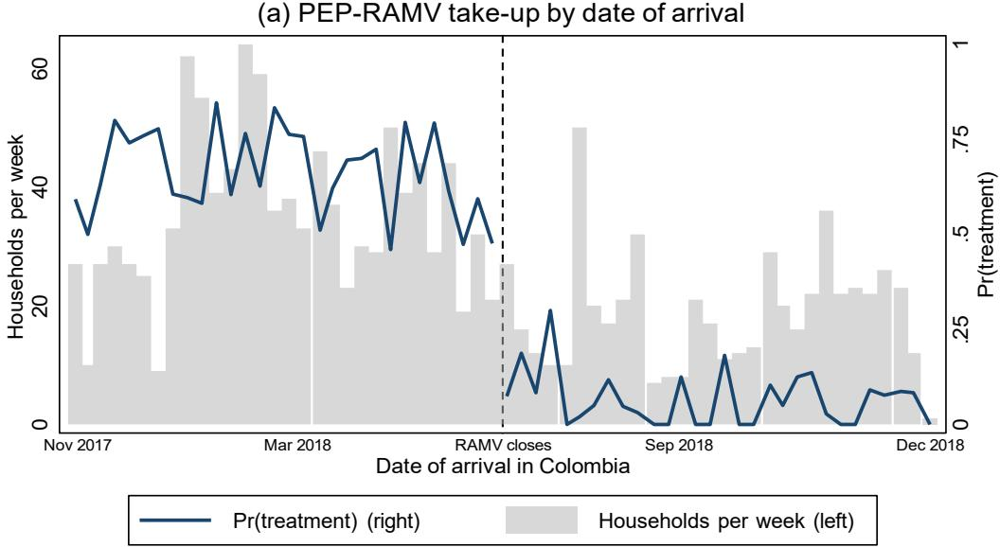

(b) Individual PEP take-up  
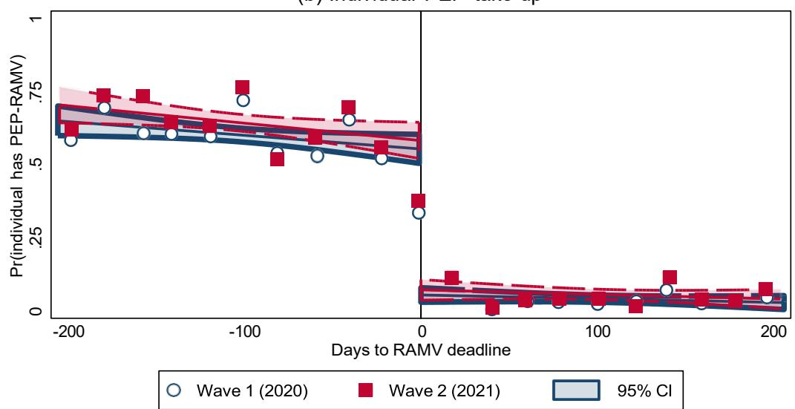  
Figure 1: First-Stage Discontinuity in PEP-RAMV Take-Up at the Program-Eligibility Cut-off

Notes: Panel (a) plots the weekly mean of the household-level PEP-RAMV take-up indicator (navy line, left axis) against date of arrival in Colombia. Gray bars show the weekly count of households in the analysis sample (right axis). The vertical short-dashed line marks the RAMV registration deadline (June 8, 2018), which is the eligibility cutoff for the PEP-RAMV program. Households whose first member arrived strictly before this date were eligible. Panel (b) plots the individual PEP-RAMV indicator against the running variable (days from the eligibility cutoff). Markers are bin means with 20-day bins. Hollow circles report Wave 1 (2020) and filled squares report Wave 2 (2021). Solid (Wave 1) and dashed (Wave 2) lines are local linear fits estimated separately on each side of the cutoff. Shaded bands are 95 percent confidence intervals around each fitted line.

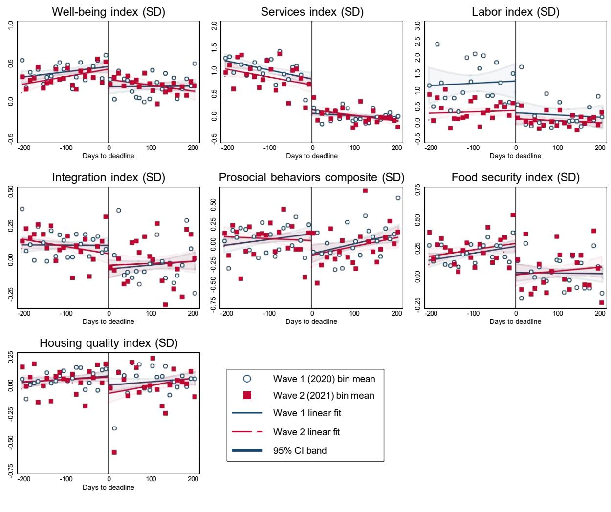  
Figure 2: Regression-Discontinuity Plots for the Seven Thematic Indices, by Wave

Notes. Each panel plots one standardized thematic index against the running variable (days from the eligibility cutoff of June 8, 2018). Each index is standardized to the within-wave control-group mean and standard deviation. Markers are bin means with 10-day bins. The y-axis is scaled per panel from the bin-mean range within $\pm200$ days of the cutoff (padded and snapped to 0.5 increments) so the local jump is clearly visible in each panel. Hollow circles report Wave 1 (2020) and filled squares report Wave 2 (2021). Solid (Wave 1) and dashed (Wave 2) lines are local linear fits estimated by OLS separately on each side of the cutoff, with shaded bands giving 95 percent confidence intervals around each fitted line.

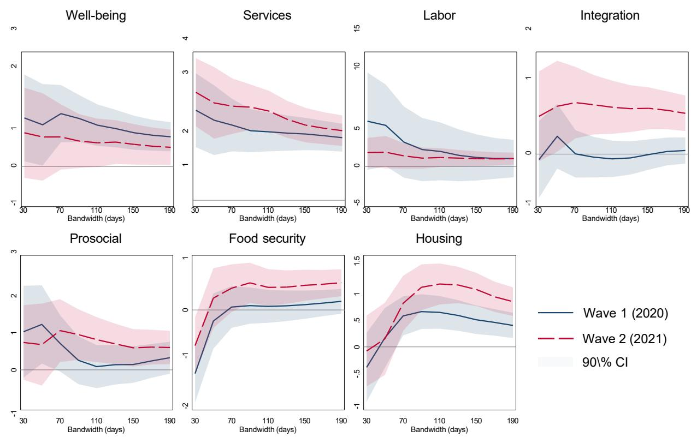  
Figure 3: Bandwidth Sensitivity of Fuzzy-RD Coefficients for the Seven Main Indices, by Wave

Notes. Each panel traces the fuzzy-RD bias-corrected robust coefficient on one of the seven main thematic indices across bandwidths from 30 to 190 days (in 20-day steps), separately by wave. The solid navy line is Wave 1 (2020) and the dashed cranberry line is Wave 2 (2021). Shaded bands are 95 percent confidence intervals from the robust standard errors. The horizontal line at zero separates positive from negative effects. A coefficient that is approximately flat across the bandwidth grid indicates that the local-linear fit is not driven by points far from the cutoff. Non-monotone traces suggest sensitivity to the window choice. The estimator is fuzzy regression-discontinuity with a triangular kernel, a local-linear polynomial $p = 1$ , and the eligibility instrument.

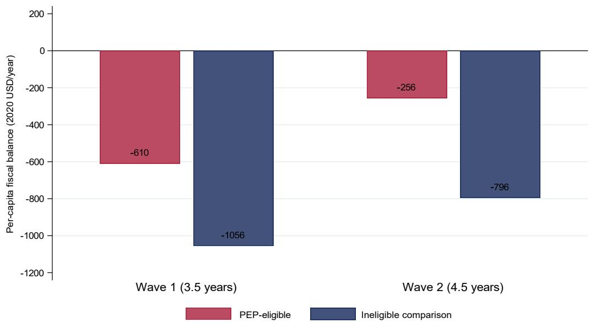  
Figure 4: Per-Capita Fiscal Balance by Wave and Eligibility Group

Notes. The figure plots the per-capita fiscal balance (fiscal revenue minus public expenditure, 2020 USD per household per year) by survey wave and eligibility group. The PEP-eligible bar reports the “PEP partial-formal” scenario, in which the observed within-sample share of formal employment among PEP holders drives the payroll-tax component. Wave-1 values are the published numbers from Ib áñez et al. (2025, Online Appendix N, Table 7) and Wave-2 values are computed from VenRePS Wave-2 household averages of per-capita consumption, monthly labor income, formality status, and household composition, with tax rates and per-user unit costs held at their published values. A negative balance indicates that the average migrant household receives more in implied public-service benefits than is contributed in implied taxes; an improvement in the balance between Wave 1 and Wave 2 for the PEP-eligible group means the fiscal cost of regularization shrinks as duration of stable status accumulates.

W2 RD coefficient + Lee bounds

(g) Housing quality
Housing quality index (SD)

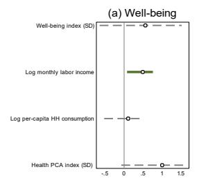

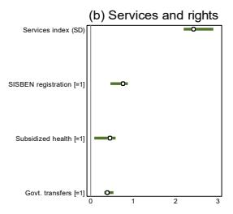

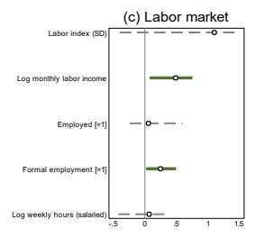

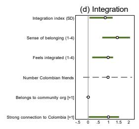

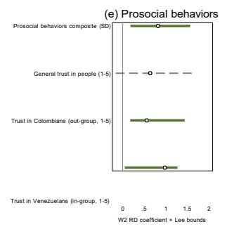

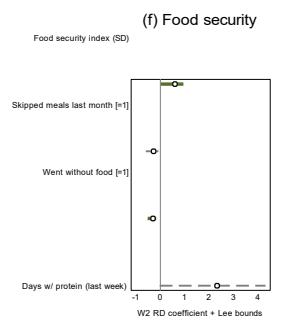

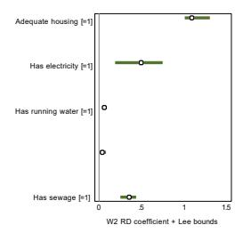  
Bounds robust to attrition
Bounds straddle zero
Point estimate  
Figure 5: Lee (2009) Bounds for the Wave-2 Fuzzy-RD Estimates by Thematic Group

Notes. Each panel reports, for the index and key components of one thematic group (well-being, services, labor, integration, prosocial behaviors, food, and housing), the Wave-2 fuzzy-RD point estimate together with the Lee (2009) rank-based trimming bounds. The point estimator is rdrobust with a triangular kernel, a local-linear polynomial $p = 1$ , and the MSE-optimal bandwidth. The bounds are computed by trimming the upper or lower tail of the eligible-group outcome distribution by the differential-attrition fraction between Wave 1 and Wave 2. Hollow circles report point estimates. Horizontal bars report the Lee bounds. Solid bars indicate bounds on the same side of zero. Dashed bars indicate bounds that straddle zero.

Table 1: Examining the Local Continuity Assumption

<table><tr><td></td><td>Wave 1 (2020) (1)</td><td>Wave 2 (2021) (2)</td></tr><tr><td colspan="3">Panel A. McCrary (2008) Density Test</td></tr><tr><td>T-statistic</td><td>0.905</td><td>0.768</td></tr><tr><td>p-value</td><td>0.365</td><td>0.442</td></tr><tr><td colspan="3">Panel B. First-Stage</td></tr><tr><td rowspan="2">Individual PEP</td><td>0.413**</td><td>0.453**</td></tr><tr><td>(0.058)</td><td>(0.073)</td></tr><tr><td rowspan="2">Household PEP (any HH member)</td><td>0.431**</td><td>0.501**</td></tr><tr><td>(0.057)</td><td>(0.064)</td></tr><tr><td>Effective N (individual / HH)</td><td>830 / 936</td><td>500 / 625</td></tr></table>

Notes: This table reports the McCrary density test of the fuzzy regression-discontinuity design at the RAMV registration deadline of June 8, 2018, together with the first-stage discontinuity in PEP-RAMV take-up at the cutoff. Panel A reports the McCrary (2008) local-polynomial density test for manipulation of the running variable at the cutoff, using a local-quadratic fit and jackknife variance. The null is no manipulation; large p-values support the assumption that households cannot precisely manipulate their arrival date relative to the deadline. Panel B reports the sharp regression-discontinuity in PEP-RAMV take-up at the cutoff at the MSE-optimal bandwidth, with a triangular kernel and a local-linear polynomial; the coefficient is the first-stage discontinuity that scales the fuzzy LATE in the body tables. The joint balance test of eligibility on the pre-migration covariate set, and the per-covariate balance, are reported in Table 2. Significance: $^{+}p < 0.10$ , $^{*}p < 0.05$ , $^{**}p < 0.01$ .

<table><tr><td rowspan="2"></td><td colspan="3">Wave 1 (2020)</td><td colspan="3">Wave 2 (2021)</td></tr><tr><td>Coef.(1)</td><td>SE(2)</td><td>p(3)</td><td>Coef.(4)</td><td>SE(5)</td><td>p(6)</td></tr><tr><td colspan="7">Panel A. Sharp-RD coefficient on each predetermined covariate at the cutoff</td></tr><tr><td>Female [=1]</td><td>0.011</td><td>0.075</td><td>0.881</td><td>-0.026</td><td>0.086</td><td>0.764</td></tr><tr><td>Age (years)</td><td>-1.092</td><td>1.785</td><td>0.541</td><td>-0.560</td><td>2.164</td><td>0.796</td></tr><tr><td>Years of education</td><td>1.254**</td><td>0.399</td><td>0.002</td><td>1.827**</td><td>0.405</td><td>0.000</td></tr><tr><td>Years in Colombia</td><td>-0.732</td><td>1.017</td><td>0.471</td><td>-1.632</td><td>1.244</td><td>0.190</td></tr><tr><td>Had a job offer in Colombia [=1]</td><td>-0.107+</td><td>0.064</td><td>0.095</td><td>-0.089</td><td>0.084</td><td>0.286</td></tr><tr><td>Worked in Venezuela [=1]</td><td>0.015</td><td>0.018</td><td>0.396</td><td>0.023</td><td>0.032</td><td>0.463</td></tr><tr><td>Worked in agric./manual (VZ) [=1]</td><td>-0.055</td><td>0.071</td><td>0.440</td><td>0.183+</td><td>0.107</td><td>0.088</td></tr><tr><td>Worked in services (VZ) [=1]</td><td>0.109*</td><td>0.052</td><td>0.037</td><td>0.087</td><td>0.060</td><td>0.149</td></tr><tr><td>Worked in skilled occ. (VZ) [=1]</td><td>-0.071</td><td>0.067</td><td>0.289</td><td>-0.080</td><td>0.074</td><td>0.280</td></tr><tr><td>Had written contract (VZ) [=1]</td><td>0.018</td><td>0.068</td><td>0.797</td><td>0.100</td><td>0.088</td><td>0.252</td></tr><tr><td>Owned smartphone in VZ [=1]</td><td>0.085</td><td>0.078</td><td>0.276</td><td>0.064</td><td>0.077</td><td>0.411</td></tr><tr><td>Homeowner in VZ [=1]</td><td>-0.058</td><td>0.054</td><td>0.283</td><td>-0.044</td><td>0.078</td><td>0.574</td></tr><tr><td>Had running water in VZ [=1]</td><td>0.062</td><td>0.050</td><td>0.219</td><td>0.080</td><td>0.059</td><td>0.173</td></tr><tr><td>Had sewage in VZ [=1]</td><td>0.060</td><td>0.044</td><td>0.174</td><td>0.115*</td><td>0.053</td><td>0.031</td></tr><tr><td>Spouse born in VZ [=1]</td><td>0.088</td><td>0.065</td><td>0.179</td><td>0.048</td><td>0.093</td><td>0.603</td></tr><tr><td>Other HH members born in VZ [=1]</td><td>0.028</td><td>0.041</td><td>0.495</td><td>0.009</td><td>0.048</td><td>0.843</td></tr><tr><td>Healthy at migration [=1]</td><td>-0.015</td><td>0.061</td><td>0.810</td><td>0.011</td><td>0.071</td><td>0.875</td></tr><tr><td>Network in Colombia [=1]</td><td>0.053</td><td>0.063</td><td>0.403</td><td>-0.013</td><td>0.082</td><td>0.878</td></tr><tr><td>Has child born in Venezuela [=1]</td><td>-0.304+</td><td>0.170</td><td>0.074</td><td>-0.329</td><td>0.246</td><td>0.182</td></tr><tr><td colspan="7">Panel B. Joint balance test (regression of eligibility indicator on all listed covariates within |date| ≤ 40 days)</td></tr><tr><td>F-statistic</td><td></td><td>1.070</td><td></td><td></td><td>1.329</td><td></td></tr><tr><td>p-value (null: covariates do not predict eligibility)</td><td></td><td>0.378</td><td></td><td></td><td>0.160</td><td></td></tr><tr><td colspan="7">Notes: This table reports a sharp regression-discontinuity estimate at the RAMV cutoff for each predetermined covariate, separately by wave. Each cell is the jump in the covariate at the cutoff under rdrobust at the MSE-optimal bandwidth with triangular kernel and local-linear polynomial (p = 1); columns 2 and 5 give conventional standard errors and columns 3 and 6 give the corresponding two-sided p-value. The running variable is days from the RAMV deadline (June 8, 2018), reflected so positive values indicate eligibility. Significance: + p &lt; 0.10, * p &lt; 0.05, ** p &lt; 0.01.</td></tr></table>

Table 2: Covariate Balance at the Cutoff

Table 3: Fuzzy Regression Discontinuity Estimates: Social Integration Index

<table><tr><td></td><td>Wave 1 (2020) (1)</td><td>Wave 2 (2021) (2)</td><td>Δ (W2-W1) (3)</td></tr><tr><td>Integration index (SD) [Ind.]</td><td>-0.086(0.271)</td><td>0.951**(0.341)</td><td>1.036*(0.436)</td></tr><tr><td>BH q-value</td><td>[0.925]</td><td>[0.016]</td><td>[0.017]</td></tr><tr><td>First-stage</td><td>0.413**</td><td>0.453**</td><td></td></tr><tr><td>Mean of dep. var. (control)</td><td>-0.036</td><td>-0.031</td><td></td></tr><tr><td>Effective obs.</td><td>813</td><td>634</td><td></td></tr><tr><td>Sense of belonging (1-4) [Ind.]</td><td>0.468(0.380)</td><td>1.754**(0.489)</td><td>1.286*(0.619)</td></tr><tr><td>BH q-value</td><td>[0.547]</td><td>[0.002]</td><td>[0.038]</td></tr><tr><td>First-stage</td><td>0.413**</td><td>0.453**</td><td></td></tr><tr><td>Mean of dep. var. (control)</td><td>2.796</td><td>2.622</td><td></td></tr><tr><td>Effective obs.</td><td>974</td><td>503</td><td></td></tr><tr><td>Feels integrated (1-4) [Ind.]</td><td>0.031(0.332)</td><td>1.311**(0.499)</td><td>1.280*(0.599)</td></tr><tr><td>BH q-value</td><td>[0.925]</td><td>[0.017]</td><td>[0.033]</td></tr><tr><td>First-stage</td><td>0.413**</td><td>0.453**</td><td></td></tr><tr><td>Mean of dep. var. (control)</td><td>2.794</td><td>2.816</td><td></td></tr><tr><td>Effective obs.</td><td>1056</td><td>503</td><td></td></tr><tr><td>Number Colombian friends [Ind.]</td><td>-0.890*(0.385)</td><td>1.069*(0.467)</td><td>1.959**(0.605)</td></tr><tr><td>BH q-value</td><td>[0.104]</td><td>[0.027]</td><td>[0.001]</td></tr><tr><td>First-stage</td><td>0.413**</td><td>0.453**</td><td></td></tr><tr><td>Mean of dep. var. (control)</td><td>1.736</td><td>1.846</td><td></td></tr><tr><td>Effective obs.</td><td>1160</td><td>705</td><td></td></tr><tr><td>Belongs to community org [=1] [Ind.]</td><td>-0.005(0.045)</td><td>0.032(0.102)</td><td>0.037(0.112)</td></tr><tr><td>BH q-value</td><td>[0.925]</td><td>[0.757]</td><td>[0.743]</td></tr><tr><td>First-stage</td><td>0.413**</td><td>0.453**</td><td></td></tr><tr><td>Mean of dep. var. (control)</td><td>0.007</td><td>0.048</td><td></td></tr><tr><td>Effective obs.</td><td>1153</td><td>674</td><td></td></tr><tr><td>Strong connection to Colombia [=1] [Ind.]</td><td></td><td>1.087*(0.457)</td><td></td></tr><tr><td>BH q-value</td><td></td><td>[0.026]</td><td></td></tr><tr><td>First-stage</td><td>0.413**</td><td>0.453**</td><td></td></tr><tr><td>Mean of dep. var. (control)</td><td></td><td>2.958</td><td></td></tr><tr><td>Effective obs.</td><td></td><td>705</td><td></td></tr></table>

Notes: All variables are defined in Appendix B. Treatment: individual PEP. Each block reports the fuzzy-RD coefficient (conventional-p stars), the robust standard error (parentheses), the within-group Benjamini-Hochberg q-value (brackets), the first-stage take-up jump, the control-side mean within bandwidth, and the effective sample size. [Ind.] and [HH] denote individual and household PEP-RAMV. Estimator: rdrobust with triangular kernel, p = 1, MSE-optimal bandwidth. Running variable: days from the June 8, 2018 cutoff, signed so positive values are eligible arrivals. $\Delta$ column (3): difference of column (2) and column (1) under independence. $^{+}p < 0.10$ , $^{*}p < 0.05$ , $^{**}p < 0.01$ .

Table 4: Fuzzy Regression Discontinuity Estimates: Prosocial Behavior Index

<table><tr><td></td><td>Wave 1 (2020) (1)</td><td>Wave 2 (2021) (2)</td><td>Δ (W2-W1) (3)</td></tr><tr><td>Prosocial behaviors composite (SD) [Ind.]</td><td>0.005(0.370)</td><td>0.966*(0.450)</td><td>0.961+(0.583)</td></tr><tr><td>BH q-value</td><td>[0.988]</td><td>[0.053]</td><td>[0.099]</td></tr><tr><td>First-stage</td><td>0.413**</td><td>0.453**</td><td></td></tr><tr><td>Mean of dep. var. (control)</td><td>-0.052</td><td>-0.087</td><td></td></tr><tr><td>Effective obs.</td><td>1002</td><td>493</td><td></td></tr><tr><td>General trust in people (1-5) [Ind.]</td><td>-0.156(0.446)</td><td>0.794+(0.460)</td><td>0.950(0.640)</td></tr><tr><td>BH q-value</td><td>[0.988]</td><td>[0.084]</td><td>[0.138]</td></tr><tr><td>First-stage</td><td>0.413**</td><td>0.453**</td><td></td></tr><tr><td>Mean of dep. var. (control)</td><td>2.632</td><td>2.531</td><td></td></tr><tr><td>Effective obs.</td><td>1125</td><td>566</td><td></td></tr><tr><td>Trust in Colombians (out-group, 1-5) [Ind.]</td><td>-0.082(0.505)</td><td>0.656+(0.342)</td><td>0.739(0.610)</td></tr><tr><td>BH q-value</td><td>[0.988]</td><td>[0.069]</td><td>[0.226]</td></tr><tr><td>First-stage</td><td>0.413**</td><td>0.453**</td><td></td></tr><tr><td>Mean of dep. var. (control)</td><td>3.157</td><td>2.939</td><td></td></tr><tr><td>Effective obs.</td><td>668</td><td>312</td><td></td></tr><tr><td>Trust in Venezuelans (in-group, 1-5) [Ind.]</td><td>0.694(0.459)</td><td>1.143**(0.403)</td><td>0.449(0.610)</td></tr><tr><td>BH q-value</td><td>[0.651]</td><td>[0.022]</td><td>[0.462]</td></tr><tr><td>First-stage</td><td>0.413**</td><td>0.453**</td><td></td></tr><tr><td>Mean of dep. var. (control)</td><td>3.062</td><td>2.914</td><td></td></tr><tr><td>Effective obs.</td><td>646</td><td>353</td><td></td></tr><tr><td>Colombians help me (1-5) [Ind.]</td><td></td><td></td><td></td></tr><tr><td>BH q-value</td><td></td><td></td><td></td></tr><tr><td>First-stage</td><td>0.413**</td><td>0.453**</td><td></td></tr><tr><td>Mean of dep. var. (control)</td><td></td><td></td><td></td></tr><tr><td>Effective obs.</td><td></td><td></td><td></td></tr><tr><td>Venezuelans help me (1-5) [Ind.]</td><td>-0.415(0.561)</td><td>1.242**(0.478)</td><td>1.657*(0.737)</td></tr><tr><td>BH q-value</td><td>[0.988]</td><td>[0.023]</td><td>[0.025]</td></tr><tr><td>First-stage</td><td>0.413**</td><td>0.453**</td><td></td></tr><tr><td>Mean of dep. var. (control)</td><td>3.344</td><td>3.023</td><td></td></tr><tr><td>Effective obs.</td><td>468</td><td>322</td><td></td></tr></table>

Notes: All variables are defined in Appendix B. Treatment: individual PEP. Each block reports the fuzzy-RD coefficient (conventional-p stars), the robust standard error (parentheses), the within-group Benjamini-Hochberg q-value (brackets), the first-stage take-up jump, the control-side mean within bandwidth, and the effective sample size. [Ind.] and [HH] denote individual and household PEP-RAMV. Estimator: rdrobust with triangular kernel, p = 1, MSE-optimal ba $_{3}$ n $_{9}$ dwidth. Running variable: days from the June 8, 2018 cutoff, signed so positive values are eligible arrivals. Δ column (3): difference of column (2) and column (1) under independence. + p < 0.10, \* p < 0.05, \*\* p < 0.01.

Table 5: Fuzzy Regression Discontinuity Estimates: Socioeconomic Well-being

<table><tr><td></td><td>Wave 1 (2020) (1)</td><td>Wave 2 (2021) (2)</td><td>Δ (W2-W1) (3)</td></tr><tr><td rowspan="2">Well-being index (SD) [Ind.]</td><td>1.061**</td><td>0.636</td><td>-0.425</td></tr><tr><td>(0.350)</td><td>(0.400)</td><td>(0.532)</td></tr><tr><td>BH q-value</td><td>[0.005]</td><td>[0.149]</td><td>[0.425]</td></tr><tr><td>First-stage</td><td>0.413**</td><td>0.453**</td><td></td></tr><tr><td>Mean of dep. var. (control)</td><td>0.170</td><td>0.218</td><td></td></tr><tr><td>Effective obs.</td><td>1015</td><td>662</td><td></td></tr><tr><td rowspan="2">Log monthly labor income [Ind.]</td><td>0.322**</td><td>0.685**</td><td>0.363</td></tr><tr><td>(0.123)</td><td>(0.207)</td><td>(0.241)</td></tr><tr><td>BH q-value</td><td>[0.012]</td><td>[0.004]</td><td>[0.132]</td></tr><tr><td>First-stage</td><td>0.413**</td><td>0.453**</td><td></td></tr><tr><td>Mean of dep. var. (control)</td><td>0.262</td><td>0.293</td><td></td></tr><tr><td>Effective obs.</td><td>729</td><td>373</td><td></td></tr><tr><td rowspan="2">Log per-capita HH consumption [HH]</td><td>0.565**</td><td>0.138</td><td>-0.427</td></tr><tr><td>(0.175)</td><td>(0.201)</td><td>(0.266)</td></tr><tr><td>BH q-value</td><td>[0.005]</td><td>[0.492]</td><td>[0.109]</td></tr><tr><td>First-stage</td><td>0.431**</td><td>0.501**</td><td></td></tr><tr><td>Mean of dep. var. (control)</td><td>1.403</td><td>1.505</td><td></td></tr><tr><td>Effective obs.</td><td>1122</td><td>773</td><td></td></tr><tr><td rowspan="2">Health PCA index (SD) [Ind.]</td><td>1.524*</td><td>1.450+</td><td>-0.074</td></tr><tr><td>(0.629)</td><td>(0.741)</td><td>(0.972)</td></tr><tr><td>BH q-value</td><td>[0.015]</td><td>[0.101]</td><td>[0.939]</td></tr><tr><td>First-stage</td><td>0.413**</td><td>0.453**</td><td></td></tr><tr><td>Mean of dep. var. (control)</td><td>0.030</td><td>-0.056</td><td></td></tr><tr><td>Effective obs.</td><td>851</td><td>606</td><td></td></tr></table>

Notes: All variables are defined in Appendix B. Per-capita consumption uses household PEP; other outcomes use individual PEP. Each block reports the fuzzy-RD coefficient (conventional-p stars), the robust standard error (parentheses), the within-group Benjamini-Hochberg q-value (brackets), the first-stage take-up jump, the control-side mean within bandwidth, and the effective sample size. [Ind.] and [HH] denote individual and household PEP-RAMV. Estimator: rdrobust with triangular kernel, p = 1, MSE-optimal bandwidth. Running variable: days from the June 8, 2018 cutoff, signed so positive values are eligible arrivals. $\Delta$ column (3): difference of column (2) and column (1) under independence. $^{+}p < 0.10$ , $^{*}p < 0.05$ , $^{**}p < 0.01$ .

Table 6: Fuzzy Regression Discontinuity Estimates: Service Access Index

<table><tr><td></td><td>Wave 1 (2020) (1)</td><td>Wave 2 (2021) (2)</td><td>Δ (W2-W1) (3)</td></tr><tr><td rowspan="2">Services index (SD) [Ind.]</td><td>2.002**</td><td>2.601**</td><td>0.600</td></tr><tr><td>(0.399)</td><td>(0.410)</td><td>(0.572)</td></tr><tr><td>BH q-value</td><td>[0.000]</td><td>[0.000]</td><td>[0.294]</td></tr><tr><td>First-stage</td><td>0.413**</td><td>0.453**</td><td></td></tr><tr><td>Mean of dep. var. (control)</td><td>-0.036</td><td>0.017</td><td></td></tr><tr><td>Effective obs.</td><td>865</td><td>527</td><td></td></tr><tr><td rowspan="2">SISBEN registration [=1] [Ind.]</td><td>0.544**</td><td>0.811**</td><td>0.267</td></tr><tr><td>(0.109)</td><td>(0.132)</td><td>(0.171)</td></tr><tr><td>BH q-value</td><td>[0.000]</td><td>[0.000]</td><td>[0.118]</td></tr><tr><td>First-stage</td><td>0.413**</td><td>0.453**</td><td></td></tr><tr><td>Mean of dep. var. (control)</td><td>0.031</td><td>0.060</td><td></td></tr><tr><td>Effective obs.</td><td>982</td><td>585</td><td></td></tr><tr><td rowspan="2">Subsidized health [=1] [Ind.]</td><td>0.334**</td><td>0.509**</td><td>0.175</td></tr><tr><td>(0.124)</td><td>(0.155)</td><td>(0.199)</td></tr><tr><td>BH q-value</td><td>[0.010]</td><td>[0.001]</td><td>[0.379]</td></tr><tr><td>First-stage</td><td>0.413**</td><td>0.453**</td><td></td></tr><tr><td>Mean of dep. var. (control)</td><td>0.029</td><td>0.087</td><td></td></tr><tr><td>Effective obs.</td><td>808</td><td>578</td><td></td></tr><tr><td rowspan="2">Govt. transfers [=1] [HH]</td><td>0.213*</td><td>0.421**</td><td>0.208+</td></tr><tr><td>(0.090)</td><td>(0.082)</td><td>(0.122)</td></tr><tr><td>BH q-value</td><td>[0.018]</td><td>[0.000]</td><td>[0.088]</td></tr><tr><td>First-stage</td><td>0.431**</td><td>0.501**</td><td></td></tr><tr><td>Mean of dep. var. (control)</td><td>0.064</td><td>0.029</td><td></td></tr><tr><td>Effective obs.</td><td>1115</td><td>591</td><td></td></tr></table>

Notes: All variables are defined in Appendix B. Government transfers use household PEP; other outcomes use individual PEP. Each block reports the fuzzy-RD coefficient (conventional-p stars), the robust standard error (parentheses), the within-group Benjamini-Hochberg q-value (brackets), the first-stage take-up jump, the control-side mean within bandwidth, and the effective sample size. [Ind.] and [HH] denote individual and household PEP-RAMV. Estimator: rdrobust with triangular kernel, p = 1, MSE-optimal bandwidth. Running variable: days from the June 8, 2018 cutoff, signed so positive values are eligible arrivals. $\Delta$ column (3): difference of column (2) and column (1) under independence. $^{+}p < 0.10$ , $^{*}p < 0.05$ , $^{**}p < 0.01$ .

Table 7: Fuzzy Regression Discontinuity Estimates: Labor Market Index

<table><tr><td></td><td>Wave 1 (2020) (1)</td><td>Wave 2 (2021) (2)</td><td>Δ (W2-W1) (3)</td></tr><tr><td>Labor index (SD) [Ind.]</td><td>1.862(2.329)</td><td>1.197+(0.712)</td><td>-0.665(2.435)</td></tr><tr><td>BH q-value</td><td>[0.530]</td><td>[0.177]</td><td>[0.785]</td></tr><tr><td>First-stage</td><td>0.413**</td><td>0.453**</td><td></td></tr><tr><td>Mean of dep. var. (control)</td><td>0.071</td><td>0.030</td><td></td></tr><tr><td>Effective obs.</td><td>675</td><td>458</td><td></td></tr><tr><td>Log monthly labor income [Ind.]</td><td>0.322**(0.123)</td><td>0.685**(0.207)</td><td>0.363(0.241)</td></tr><tr><td>BH q-value</td><td>[0.046]</td><td>[0.005]</td><td>[0.132]</td></tr><tr><td>First-stage</td><td>0.413**</td><td>0.453**</td><td></td></tr><tr><td>Mean of dep. var. (control)</td><td>0.262</td><td>0.293</td><td></td></tr><tr><td>Effective obs.</td><td>729</td><td>373</td><td></td></tr><tr><td>Employed [=1] [Ind.]</td><td>0.178(0.200)</td><td>0.040(0.265)</td><td>-0.138(0.332)</td></tr><tr><td>BH q-value</td><td>[0.530]</td><td>[0.880]</td><td>[0.678]</td></tr><tr><td>First-stage</td><td>0.413**</td><td>0.453**</td><td></td></tr><tr><td>Mean of dep. var. (control)</td><td>0.565</td><td>0.658</td><td></td></tr><tr><td>Effective obs.</td><td>1067</td><td>583</td><td></td></tr><tr><td>Formal employment [=1] [Ind.]</td><td>0.160(0.101)</td><td>0.276(0.171)</td><td>0.116(0.199)</td></tr><tr><td>BH q-value</td><td>[0.285]</td><td>[0.177]</td><td>[0.558]</td></tr><tr><td>First-stage</td><td>0.413**</td><td>0.453**</td><td></td></tr><tr><td>Mean of dep. var. (control)</td><td>0.005</td><td>0.019</td><td></td></tr><tr><td>Effective obs.</td><td>666</td><td>464</td><td></td></tr><tr><td>Log weekly hours (salaried) [Ind.]</td><td>-0.140(0.252)</td><td>0.121(0.280)</td><td>0.261(0.377)</td></tr><tr><td>BH q-value</td><td>[0.578]</td><td>[0.831]</td><td>[0.488]</td></tr><tr><td>First-stage</td><td>0.413**</td><td>0.453**</td><td></td></tr><tr><td>Mean of dep. var. (control)</td><td>3.881</td><td>3.936</td><td></td></tr><tr><td>Effective obs.</td><td>703</td><td>387</td><td></td></tr></table>

Notes: All variables are defined in Appendix B. Treatment: individual PEP. Each block reports the fuzzy-RD coefficient (conventional-p stars), the robust standard error (parentheses), the within-group Benjamini-Hochberg q-value (brackets), the first-stage take-up jump, the control-side mean within bandwidth, and the effective sample size. [Ind.] and [HH] denote individual and household PEP-RAMV. Estimator: rdrobust with triangular kernel, p = 1, MSE-optimal bandwidth. Running variable: days from the June 8, 2018 cutoff, signed so positive values are eligible arrivals. $\Delta$ column (3): difference of column (2) and column (1) under independence. $^{+}p < 0.10$ , $^{*}p < 0.05$ , $^{**}p < 0.01$ .

Table 8: Fuzzy Regression Discontinuity Estimates: Food Security Index

<table><tr><td></td><td>Wave 1 (2020) (1)</td><td>Wave 2 (2021) (2)</td><td>Δ (W2-W1) (3)</td></tr><tr><td>Food security index (SD) [Ind.]</td><td>0.075(0.233)</td><td>0.552*(0.258)</td><td>0.476(0.347)</td></tr><tr><td>BH q-value</td><td>[0.814]</td><td>[0.065]</td><td>[0.170]</td></tr><tr><td>First-stage</td><td>0.413**</td><td>0.453**</td><td></td></tr><tr><td>Mean of dep. var. (control)</td><td>0.014</td><td>-0.012</td><td></td></tr><tr><td>Effective obs.</td><td>1006</td><td>580</td><td></td></tr><tr><td>Skipped meals last month [=1] [Ind.]</td><td>-0.081(0.185)</td><td>-0.230(0.184)</td><td>-0.149(0.261)</td></tr><tr><td>BH q-value</td><td>[0.814]</td><td>[0.211]</td><td>[0.568]</td></tr><tr><td>First-stage</td><td>0.413**</td><td>0.453**</td><td></td></tr><tr><td>Mean of dep. var. (control)</td><td>0.489</td><td>0.414</td><td></td></tr><tr><td>Effective obs.</td><td>1056</td><td>705</td><td></td></tr><tr><td>Went without food [=1] [Ind.]</td><td>-0.254(0.169)</td><td>-0.397+(0.221)</td><td>-0.143(0.278)</td></tr><tr><td>BH q-value</td><td>[0.536]</td><td>[0.096]</td><td>[0.607]</td></tr><tr><td>First-stage</td><td>0.413**</td><td>0.453**</td><td></td></tr><tr><td>Mean of dep. var. (control)</td><td>0.334</td><td>0.322</td><td></td></tr><tr><td>Effective obs.</td><td>1128</td><td>501</td><td></td></tr><tr><td>Days w/ protein (last week) [Ind.]</td><td>0.169(0.721)</td><td>2.494**(0.952)</td><td>2.325+(1.194)</td></tr><tr><td>BH q-value</td><td>[0.814]</td><td>[0.035]</td><td>[0.052]</td></tr><tr><td>First-stage</td><td>0.413**</td><td>0.453**</td><td></td></tr><tr><td>Mean of dep. var. (control)</td><td>4.524</td><td>4.452</td><td></td></tr><tr><td>Effective obs.</td><td>1175</td><td>695</td><td></td></tr></table>

Notes: All variables are defined in Appendix B. Treatment: individual PEP. Each block reports the fuzzy-RD coefficient (conventional-p stars), the robust standard error (parentheses), the within-group Benjamini-Hochberg q-value (brackets), the first-stage take-up jump, the control-side mean within bandwidth, and the effective sample size. [Ind.] and [HH] denote individual and household PEP-RAMV. Estimator: rdrobust with triangular kernel, p = 1, MSE-optimal bandwidth. Running variable: days from the June 8, 2018 cutoff, signed so positive values are eligible arrivals. $\Delta$ column (3): difference of column (2) and column (1) under independence. $^{+}p < 0.10$ , $^{*}p < 0.05$ , $^{**}p < 0.01$ .

Table 9: Fuzzy Regression Discontinuity Estimates: Housing Quality Index

<table><tr><td></td><td>Wave 1 (2020) (1)</td><td>Wave 2 (2021) (2)</td><td>Δ (W2-W1) (3)</td></tr><tr><td rowspan="2">Housing quality index (SD) [Ind.]</td><td>0.602**</td><td>1.272**</td><td>0.670*</td></tr><tr><td>(0.187)</td><td>(0.279)</td><td>(0.336)</td></tr><tr><td>BH q-value</td><td>[0.007]</td><td>[0.000]</td><td>[0.046]</td></tr><tr><td>First-stage</td><td>0.413**</td><td>0.453**</td><td></td></tr><tr><td>Mean of dep. var. (control)</td><td>0.007</td><td>-0.064</td><td></td></tr><tr><td>Effective obs.</td><td>1162</td><td>608</td><td></td></tr><tr><td rowspan="2">Adequate housing [=1] [Ind.]</td><td>0.261</td><td>0.558**</td><td>0.297</td></tr><tr><td>(0.169)</td><td>(0.196)</td><td>(0.259)</td></tr><tr><td>BH q-value</td><td>[0.123]</td><td>[0.007]</td><td>[0.251]</td></tr><tr><td>First-stage</td><td>0.413**</td><td>0.453**</td><td></td></tr><tr><td>Mean of dep. var. (control)</td><td>0.673</td><td>0.640</td><td></td></tr><tr><td>Effective obs.</td><td>1128</td><td>701</td><td></td></tr><tr><td rowspan="2">Has electricity [=1] [Ind.]</td><td>0.044</td><td>0.077*</td><td>0.033</td></tr><tr><td>(0.027)</td><td>(0.036)</td><td>(0.044)</td></tr><tr><td>BH q-value</td><td>[0.123]</td><td>[0.037]</td><td>[0.455]</td></tr><tr><td>First-stage</td><td>0.413**</td><td>0.453**</td><td></td></tr><tr><td>Mean of dep. var. (control)</td><td>0.990</td><td>0.992</td><td></td></tr><tr><td>Effective obs.</td><td>1073</td><td>694</td><td></td></tr><tr><td rowspan="2">Has running water [=1] [Ind.]</td><td>0.186**</td><td>0.032</td><td>-0.154+</td></tr><tr><td>(0.067)</td><td>(0.050)</td><td>(0.084)</td></tr><tr><td>BH q-value</td><td>[0.014]</td><td>[0.524]</td><td>[0.066]</td></tr><tr><td>First-stage</td><td>0.413**</td><td>0.453**</td><td></td></tr><tr><td>Mean of dep. var. (control)</td><td>0.962</td><td>0.967</td><td></td></tr><tr><td>Effective obs.</td><td>1160</td><td>598</td><td></td></tr><tr><td rowspan="2">Has sewage [=1] [Ind.]</td><td>0.193+</td><td>0.411**</td><td>0.218</td></tr><tr><td>(0.114)</td><td>(0.114)</td><td>(0.161)</td></tr><tr><td>BH q-value</td><td>[0.123]</td><td>[0.001]</td><td>[0.176]</td></tr><tr><td>First-stage</td><td>0.413**</td><td>0.453**</td><td></td></tr><tr><td>Mean of dep. var. (control)</td><td>0.922</td><td>0.917</td><td></td></tr><tr><td>Effective obs.</td><td>1020</td><td>658</td><td></td></tr></table>

Notes: All variables are defined in Appendix B. Treatment: individual PEP. Each block reports the fuzzy-RD coefficient (conventional-p stars), the robust standard error (parentheses), the within-group Benjamini-Hochberg q-value (brackets), the first-stage take-up jump, the control-side mean within bandwidth, and the effective sample size. [Ind.] and [HH] denote individual and household PEP-RAMV. Estimator: rdrobust with triangular kernel, p = 1, MSE-optimal bandwidth. Running variable: days from the June 8, 2018 cutoff, signed so positive values are eligible arrivals. $\Delta$ column (3): difference of column (2) and column (1) under independence. $^{+}p < 0.10$ , $^{*}p < 0.05$ , $^{**}p < 0.01$ .

Table 10: Testing Candidate Mediating Channels for the Social Effects

<table><tr><td>Specification</td><td>PEP coef. (BC robust)</td><td>Robust SE</td><td>Effective N</td></tr><tr><td colspan="4">Panel A. Integration index (Wave 2)</td></tr><tr><td>(a) Service access</td><td></td><td></td><td></td></tr><tr><td>+ SISBEN enrollment [=1]</td><td>1.643*</td><td>(0.735)</td><td>457</td></tr><tr><td>+ Subsidized health insurance [=1]</td><td>1.065*</td><td>(0.486)</td><td>453</td></tr><tr><td>+ Govt. transfers received [=1]</td><td>1.208*</td><td>(0.484)</td><td>430</td></tr><tr><td>+ Financial-access index</td><td>1.010*</td><td>(0.433)</td><td>359</td></tr><tr><td>(b) Material precarity</td><td></td><td></td><td></td></tr><tr><td>+ Housing-quality index</td><td>1.069*</td><td>(0.443)</td><td>489</td></tr><tr><td>+ Food security (no hunger) [=1]</td><td>1.065*</td><td>(0.430)</td><td>482</td></tr><tr><td>+ Employed [=1]</td><td>1.036*</td><td>(0.418)</td><td>457</td></tr><tr><td>+ Log HH max labor income</td><td>0.955*</td><td>(0.392)</td><td>493</td></tr><tr><td>(c) Cognitive bandwidth</td><td></td><td></td><td></td></tr><tr><td>+ Health PCA index</td><td>1.021*</td><td>(0.417)</td><td>441</td></tr><tr><td>+ Mental-health composite</td><td>1.035*</td><td>(0.415)</td><td>474</td></tr><tr><td>+ Discrimination index</td><td>1.013*</td><td>(0.409)</td><td>417</td></tr><tr><td colspan="4">Panel B. Prosocial-behaviors composite (Wave 2)</td></tr><tr><td>(a) Service access</td><td></td><td></td><td></td></tr><tr><td>+ SISBEN enrollment [=1]</td><td>1.686+</td><td>(0.979)</td><td>282</td></tr><tr><td>+ Subsidized health insurance [=1]</td><td>1.169+</td><td>(0.628)</td><td>382</td></tr><tr><td>+ Govt. transfers received [=1]</td><td>1.320*</td><td>(0.614)</td><td>366</td></tr><tr><td>+ Financial-access index</td><td>1.008*</td><td>(0.494)</td><td>391</td></tr><tr><td>(b) Material precarity</td><td></td><td></td><td></td></tr><tr><td>+ Housing-quality index</td><td>1.053*</td><td>(0.526)</td><td>391</td></tr><tr><td>+ Food security (no hunger) [=1]</td><td>1.133*</td><td>(0.548)</td><td>359</td></tr><tr><td>+ Employed [=1]</td><td>1.063*</td><td>(0.513)</td><td>385</td></tr><tr><td>+ Log HH max labor income</td><td>0.948+</td><td>(0.487)</td><td>370</td></tr><tr><td>(c) Cognitive bandwidth</td><td></td><td></td><td></td></tr><tr><td>+ Health PCA index</td><td>1.070*</td><td>(0.512)</td><td>377</td></tr><tr><td>+ Mental-health composite</td><td>1.104*</td><td>(0.519)</td><td>366</td></tr><tr><td>+ Discrimination index</td><td>1.107*</td><td>(0.514)</td><td>366</td></tr></table>

Notes: Each row reports a separate Wave-2 fuzzy regression-discontinuity specification on the indicated outcome with one candidate mediator added as a control. Mediators are organized into three theoretical channels that cover the alternative explanations for the medium-run social effects, namely (a) service access (SISBEN, subsidized health insurance, government transfers, and the financial-access index), (b) material precarity (housing quality, food security, an employment indicator, and log household maximum labor income), and (c) cognitive bandwidth (the EQ-5D+VAS health PCA, the mental-health composite, and the discrimination index). Components of the integration and prosocial indices, such as the count of Colombian friends, the sense of belonging, community-organization membership, and connection to Colombia, are excluded as mediators because including them as controls would amount to controlling for the dependent variable. Estimator: rdrobust with triangular kernel, MSE-optimal bandwidth, local-linear polynomial $p = 1$ ; the individual PEP indicator is instrumented by eligibility. The PEP coefficient is the bias-corrected robust point estimate; standard errors are robust. Significance: $^{+}p < 0.10$ , $^{*}p < 0.05$ , $^{**}p < 0.01$ .

# Online Appendix to “Regularization and the Formation of Social Capital: Evidence from Forced Migrants in Colombia”

Sandra V. Rozo

June 24, 2026

## Contents

A Attrition and Lee Bounds 4  
B Data and Outcome Construction 9  
C Full RD results: Per-Item Tables 19  
D Additional Robustness Exercises 24  
E Fiscal cost-benefit analysis, Wave 2 26

## List of Tables

A.1 Panel retention between Wave 1 (2020) and Wave 2 (2021) ..... 5
A.2 Pre-migration characteristics and PEP-RAMV take-up: W1 full sample versus panel sub-sample ..... 6
A.3 Wave-by-wave fuzzy RD on the panel sub-sample (households interviewed in both waves) ..... 7
A.4 Lee (2009) bounds for all Wave-2 outcomes ..... 8
B.5 Descriptive Statistics: Economic Well-being ..... 10
B.6 Descriptive Statistics: Services and Rights ..... 11
B.7 Descriptive Statistics: Labor Market ..... 11
B.8 Descriptive Statistics: Integration ..... 12
B.9 Descriptive Statistics: Prosocial Behaviors ..... 13
B.10 Descriptive Statistics: Food Security ..... 13
B.11 Descriptive Statistics: Housing Quality ..... 14
B.12 Descriptive Statistics: Discrimination (appendix only) ..... 14
B.13 Descriptive Statistics: Migration Intentions (appendix only) ..... 15
B.14 Descriptive statistics: Adult Education (appendix only) ..... 15
B.15 Descriptive Statistics: M. Remittances (appendix only) ..... 16
B.16 Descriptive Statistics: Demographics ..... 16
B.17 Descriptive Statistics: Pre-migration Economic Conditions in Venezuela ..... 17
B.18 Descriptive Statistics: Family / migration network in Colombia ..... 18
C.19 Fuzzy RD estimates: Discrimination (full) ..... 19
C.20 Fuzzy RD estimates: Migration intentions (full) ..... 20
C.21 Fuzzy RD estimates: Education (full) ..... 20
C.22 Fuzzy RD estimates: Remittances (full) ..... 21
C.23 Robustness of the Wave-2 per-capita consumption attenuation ..... 23
D.24 Reduced-form versus fuzzy local average treatment effect, by wave ..... 25
E.25 Wave 2 Fiscal Net Cost of a Representative Migrant Household, Replicating Ibañez et al. (2024) Table 7..... 27

## List of Figures

B.1 Per-capita Household Consumption and Monthly Labor Income, by Wave . . 10
D.2 Running-variable density at the RAMV deadline, by wave....24

## A Attrition and Lee Bounds

## A.1 Attrition between Wave 1 and Wave 2

We document panel retention between Wave 1 (2020) and Wave 2 (2021) and assess whether attrition threatens the local-randomness identification of the body fuzzy-RD specifications. Three pieces of evidence are reported in Tables A.1 and A.2.

First, attrition is mildly non-random in the population. Wave-2 retention rates are 1.8 percentage points higher among eligible (PEP-RAMV) households than among ineligible households (61.8% versus 60.0%). Predetermined pre-migration covariates also differ between the W1 full sample and the panel sub-sample at small magnitudes (Table A.2), and the joint F - test of all covariates against the panel-membership indicator is significant. The panel sub-sample is therefore not a random subset of the full Wave-1 sample.

Second, and this is the relevant test for our identification strategy, attrition is not discontinuous at the eligibility cutoff. A sharp regression-discontinuity estimate of the panel-membership indicator on the running variable returns a precise zero (Table A.1, Panel C, coefficient -0.067, p = 0.507). Local randomness at the cutoff, the only continuity assumption that the RD design requires, is therefore satisfied even for the Wave-2 sample. Non-random attrition over the full running-variable support does not, by itself, threaten the main conclusions.

Third, we additionally report Lee (2009) trimming bounds as a defensive worst-case sensitivity check in Table A.4. The bounds discipline the influence of hypothetical non-random selection at the cutoff that the sharp-RD attrition test failed to detect, and most headline coefficients survive their Lee bounds.

To verify that the wave-by-wave story in the body is not driven by sample-composition shifts between waves, the table below re-estimates each headline coefficient on the panel sub-sample only. Comparison with Table A3 shows that the headline estimates survive.

Table A.1: Panel retention between Wave 1 (2020) and Wave 2 (2021)

<table><tr><td></td><td>Households</td></tr><tr><td colspan="2">Panel A. Retention counts</td></tr><tr><td>Wave 1 households (JEEA-style sample)</td><td>2311</td></tr><tr><td>Re-interviewed in Wave 2 (panel sub-sample)</td><td>1400 (60.6%)</td></tr><tr><td>Attrited between Wave 1 and Wave 2</td><td>911 (39.4%)</td></tr><tr><td colspan="2">Panel B. Retention rate by eligibility status</td></tr><tr><td>Retention rate, eligible (D = 1) households</td><td>62.0%</td></tr><tr><td>Retention rate, ineligible (D = 0) households</td><td>60.1%</td></tr><tr><td>Difference (eligible – ineligible)</td><td>1.9 pp</td></tr><tr><td colspan="2">Panel C. Sharp-RD on the panel-membership indicator</td></tr><tr><td>Discontinuity at cutoff (eligibility → in panel)</td><td>-0.067</td></tr><tr><td>Standard error</td><td>(0.100)</td></tr><tr><td>p-value</td><td>0.507</td></tr><tr><td>Effective N (within bandwidth)</td><td>560</td></tr><tr><td>MSE-optimal bandwidth (days)</td><td>72.1</td></tr></table>

Notes: Panel A reports household-level counts in the JEEA-style analysis sample. Panel B reports the share of Wave-1 households re-interviewed in Wave 2 separately for eligible (date < 0, arrived strictly before the RAMV deadline of June 8, 2018) and ineligible households. Panel C reports a sharp-RD estimate on the panel-membership indicator: it tests whether being re-interviewed in Wave 2 jumps discontinuously at the eligibility cutoff.

Table A.2: Pre-migration characteristics and PEP-RAMV take-up: W1 full sample versus panel sub-sample

<table><tr><td></td><td>W1 full (1)</td><td>Panel sub-sample (2)</td><td>Difference (2)-(1)</td><td>p-value</td></tr><tr><td colspan="5">Panel A. Pre-migration characteristics</td></tr><tr><td>Female [=1]</td><td>0.551</td><td>0.566</td><td>0.014</td><td>[0.084]</td></tr><tr><td>Age (years)</td><td>31.813</td><td>32.129</td><td>0.316</td><td>[0.119]</td></tr><tr><td>Years of education</td><td>13.174</td><td>13.283</td><td>0.108</td><td>[0.026]</td></tr><tr><td>Years in Colombia</td><td>51.169</td><td>51.350</td><td>0.181</td><td>[0.490]</td></tr><tr><td>Had a job offer in Colombia [=1]</td><td>0.334</td><td>0.348</td><td>0.014</td><td>[0.072]</td></tr><tr><td>Worked in Venezuela [=1]</td><td>0.974</td><td>0.977</td><td>0.004</td><td>[0.188]</td></tr><tr><td>Worked in agric./manual (VZ) [=1]</td><td>0.605</td><td>0.604</td><td>-0.002</td><td>[0.856]</td></tr><tr><td>Worked in services (VZ) [=1]</td><td>0.149</td><td>0.155</td><td>0.006</td><td>[0.381]</td></tr><tr><td>Worked in skilled occ. (VZ) [=1]</td><td>0.170</td><td>0.175</td><td>0.005</td><td>[0.487]</td></tr><tr><td>Had written contract (VZ) [=1]</td><td>0.471</td><td>0.478</td><td>0.008</td><td>[0.378]</td></tr><tr><td>Owned smartphone in VZ [=1]</td><td>0.582</td><td>0.585</td><td>0.003</td><td>[0.678]</td></tr><tr><td>Homeowner in VZ [=1]</td><td>0.866</td><td>0.861</td><td>-0.005</td><td>[0.395]</td></tr><tr><td>Had running water in VZ [=1]</td><td>0.868</td><td>0.858</td><td>-0.010</td><td>[0.073]</td></tr><tr><td>Had sewage in VZ [=1]</td><td>0.936</td><td>0.936</td><td>0.000</td><td>[0.909]</td></tr><tr><td>Spouse born in VZ [=1]</td><td>0.525</td><td>0.541</td><td>0.017</td><td>[0.048]</td></tr><tr><td>Other HH members born in VZ [=1]</td><td>0.108</td><td>0.108</td><td>0.000</td><td>[0.983]</td></tr><tr><td>Healthy at migration [=1]</td><td>0.105</td><td>0.101</td><td>-0.003</td><td>[0.522]</td></tr><tr><td>Network in Colombia [=1]</td><td>0.727</td><td>0.741</td><td>0.013</td><td>[0.074]</td></tr><tr><td>Has child born in Venezuela [=1]</td><td>1.499</td><td>1.545</td><td>0.046</td><td>[0.066]</td></tr><tr><td colspan="5">Panel B. PEP-RAMV take-up</td></tr><tr><td>PEP-RAMV (individual) [=1]</td><td>0.439</td><td>0.470</td><td>0.031</td><td>[0.000]</td></tr><tr><td>PEP-RAMV (any HH member) [=1]</td><td>0.495</td><td>0.523</td><td>0.027</td><td>[0.001]</td></tr><tr><td>Joint F-test (covariates)</td><td></td><td></td><td>2.000</td><td>[0.006]</td></tr></table>

Notes: Panel A reports the predetermined covariates; Panel B reports the individual and household PEP-RAMV indicators measured in Wave 1. Column (1) reports the mean in the full Wave-1 sample; column (2) reports the mean in the panel sub-sample (Wave-1 households re-interviewed in Wave 2); column (3) is the difference; column (4) reports the two-sided p-value from a regression of the panel-membership indicator on the row variable. The bottom row reports the joint F-test p-value from a single regression of the panel-membership indicator on all the predetermined covariates listed in Panel A.

Table A.3: Wave-by-wave fuzzy RD on the panel sub-sample (households interviewed in both waves)

<table><tr><td></td><td>Wave 1(1)</td><td>Wave 2(2)</td><td> $\Delta (W2-W1)$ (3)</td></tr><tr><td>Well-being index (SD)</td><td>1.146*(0.471)</td><td>0.611(0.442)</td><td>-0.535(0.646)[0.408]</td></tr><tr><td>Services index (SD)</td><td>2.123**(0.432)</td><td>2.774**(0.449)</td><td>0.651(0.623)[0.296]</td></tr><tr><td>Labor index (SD)</td><td>0.021(3.639)</td><td>1.058(0.747)</td><td>1.037(3.715)[0.780]</td></tr><tr><td>Integration index (SD)</td><td>0.620*(0.294)</td><td>0.810**(0.303)</td><td>0.190(0.422)[0.653]</td></tr><tr><td>Prosocial composite (SD)</td><td>0.461(0.487)</td><td>0.884*(0.450)</td><td>0.423(0.663)[0.523]</td></tr><tr><td>Food security index (SD)</td><td>-0.161(0.273)</td><td>0.490+(0.264)</td><td>0.651+(0.380)[0.087]</td></tr><tr><td>Housing quality index (SD)</td><td>1.046**(0.290)</td><td>1.322**(0.296)</td><td>0.276(0.414)[0.505]</td></tr></table>

Notes: Wave-by-wave fuzzy regression-discontinuity estimates restricted to the panel sub-sample (households interviewed in both Wave 1 and Wave 2). Each outcome block reports three rows: the bias-corrected robust point estimate (with conventional-p stars), the robust standard error in parentheses, and the difference-test p-value [in brackets] testing equality of the W1 and W2 coefficients. Estimator: rdrobust with triangular kernel, MSE-optimal bandwidth, local-linear polynomial (p = 1); eligibility (arrival before the RAMV deadline) is the instrument for PEP-RAMV take-up. Significance: $^{+}$ p < 0.10, $^{*}$ p < 0.05, $^{**}$ p < 0.01.

Table A.4: Lee (2009) bounds for all Wave-2 outcomes

<table><tr><td></td><td>Point (1)</td><td>Lower (2)</td><td>Upper (3)</td><td>Trim q (4)</td><td>Verdict (5)</td></tr><tr><td>Well-being index (SD)</td><td>0.554</td><td>-0.636</td><td>1.497</td><td>0.386</td><td>crosses 0</td></tr><tr><td>Log monthly labor income</td><td>0.486</td><td>0.076</td><td>0.749</td><td>0.359</td><td>robust</td></tr><tr><td>Log per-capita HH consumption</td><td>0.106</td><td>-0.518</td><td>0.464</td><td>0.429</td><td>crosses 0</td></tr><tr><td>Log HH-max labor income</td><td>0.247</td><td>-0.142</td><td>0.544</td><td>0.424</td><td>crosses 0</td></tr><tr><td>Employed [=1]</td><td>0.056</td><td>-0.238</td><td>0.592</td><td>0.404</td><td>crosses 0</td></tr><tr><td>Labor index (SD)</td><td>1.097</td><td>-0.398</td><td>1.474</td><td>0.462</td><td>crosses 0</td></tr><tr><td>Formal employment [=1]</td><td>0.246</td><td>0.019</td><td>0.492</td><td>0.464</td><td>robust</td></tr><tr><td>Log weekly hours (salaried)</td><td>0.068</td><td>-0.419</td><td>0.304</td><td>0.413</td><td>crosses 0</td></tr><tr><td>Services index (SD)</td><td>2.425</td><td>2.193</td><td>2.892</td><td>0.360</td><td>robust</td></tr><tr><td>SISBEN registration [=1]</td><td>0.762</td><td>0.465</td><td>0.875</td><td>0.351</td><td>robust</td></tr><tr><td>Subsidized health [=1]</td><td>0.454</td><td>0.084</td><td>0.586</td><td>0.339</td><td>robust</td></tr><tr><td>Govt. transfers [=1]</td><td>0.391</td><td>0.320</td><td>0.535</td><td>0.362</td><td>robust</td></tr><tr><td>Health PCA index (SD)</td><td>0.990</td><td>-0.072</td><td>1.603</td><td>0.340</td><td>crosses 0</td></tr><tr><td>Severe anxiety/depression [=1]</td><td>-0.035</td><td>-0.034</td><td>-0.035</td><td>0.369</td><td>robust</td></tr><tr><td>Mental-health composite (SD)</td><td>-0.121</td><td>-1.026</td><td>0.550</td><td>0.429</td><td>crosses 0</td></tr><tr><td>Life satisfaction (0-10)</td><td>-0.441</td><td>-2.824</td><td>1.506</td><td>0.386</td><td>crosses 0</td></tr><tr><td>EQ-5D anx/depr (5-low to 1-high)</td><td>0.080</td><td>-0.545</td><td>0.634</td><td>0.429</td><td>crosses 0</td></tr><tr><td>Self-rated health (0-100)</td><td>-0.660</td><td>-14.844</td><td>13.444</td><td>0.350</td><td>crosses 0</td></tr><tr><td>Food security index (SD)</td><td>0.596</td><td>0.020</td><td>0.938</td><td>0.365</td><td>robust</td></tr><tr><td>Skipped meals last month [=1]</td><td>-0.275</td><td>-0.596</td><td>0.021</td><td>0.430</td><td>crosses 0</td></tr><tr><td>Went without food [=1]</td><td>-0.299</td><td>-0.519</td><td>-0.169</td><td>0.339</td><td>robust</td></tr><tr><td>Days w/ protein (last week)</td><td>2.312</td><td>-0.026</td><td>4.284</td><td>0.425</td><td>crosses 0</td></tr><tr><td>Housing quality index (SD)</td><td>1.086</td><td>1.003</td><td>1.297</td><td>0.335</td><td>robust</td></tr><tr><td>Adequate housing [=1]</td><td>0.493</td><td>0.188</td><td>0.744</td><td>0.426</td><td>robust</td></tr><tr><td>Has electricity [=1]</td><td>0.062</td><td>0.068</td><td>0.047</td><td>0.435</td><td>robust</td></tr><tr><td>Has running water [=1]</td><td>0.038</td><td>0.008</td><td>0.081</td><td>0.339</td><td>robust</td></tr><tr><td>Has sewage [=1]</td><td>0.353</td><td>0.434</td><td>0.249</td><td>0.401</td><td>robust</td></tr><tr><td>Integration index (SD)</td><td>0.833</td><td>0.065</td><td>1.191</td><td>0.390</td><td>robust</td></tr><tr><td>Sense of belonging (1-4)</td><td>1.418</td><td>0.687</td><td>2.034</td><td>0.373</td><td>robust</td></tr><tr><td>Feels integrated (1-4)</td><td>0.974</td><td>0.200</td><td>1.214</td><td>0.373</td><td>robust</td></tr><tr><td>Number Colombian friends</td><td>0.969</td><td>-0.242</td><td>2.132</td><td>0.437</td><td>crosses 0</td></tr><tr><td>Belongs to community org [=1]</td><td>0.010</td><td>-0.097</td><td>0.076</td><td>0.433</td><td>crosses 0</td></tr><tr><td>Strong connection to Colombia [=1]</td><td>0.987</td><td>0.028</td><td>1.502</td><td>0.437</td><td>robust</td></tr><tr><td>Prosocial behaviors composite (SD)</td><td>0.814</td><td>0.180</td><td>1.558</td><td>0.364</td><td>robust</td></tr><tr><td>General trust in people (1-5)</td><td>0.636</td><td>-0.163</td><td>1.647</td><td>0.348</td><td>crosses 0</td></tr><tr><td>Trust in Colombians (out-group, 1-5)</td><td>0.555</td><td>0.174</td><td>1.433</td><td>0.328</td><td>robust</td></tr><tr><td>Trust in Venezuelans (in-group, 1-5)</td><td>0.972</td><td>0.047</td><td>1.265</td><td>0.397</td><td>robust</td></tr><tr><td>Discrimination index (SD)</td><td>-0.135</td><td>-0.957</td><td>0.453</td><td>0.438</td><td>crosses 0</td></tr><tr><td>Ever discriminated against [=1]</td><td>-0.209</td><td>-0.788</td><td>0.487</td><td>0.444</td><td>crosses 0</td></tr><tr><td>COVID resilience index (SD)</td><td>0.627</td><td>0.097</td><td>1.099</td><td>0.378</td><td>robust</td></tr><tr><td>Received COVID aid [=1]</td><td>-0.235</td><td>-0.616</td><td>0.219</td><td>0.455</td><td>crosses 0</td></tr><tr><td>Remittances index (SD)</td><td>0.092</td><td>-0.326</td><td>0.517</td><td>0.440</td><td>crosses 0</td></tr><tr><td>Sends remittances now [=1]</td><td>0.8027</td><td>-0.551</td><td>0.361</td><td>0.435</td><td>crosses 0</td></tr><tr><td>Financial access index (SD)</td><td>-0.097</td><td>-0.831</td><td>0.806</td><td>0.426</td><td>crosses 0</td></tr><tr><td>Digital access index (SD)</td><td>-0.133</td><td>-0.439</td><td>0.238</td><td>0.345</td><td>crosses 0</td></tr></table>

## B Data and Outcome Construction

The analysis combines two waves of the Venezuelan Refugees Panel Survey (VenRePS). Wave 1 was fielded in October 2020 through January 2021 (3.5 years after the PEP-RAMV decree) and Wave 2 in October through December 2021 (4.5 years after the decree), with the Wave-2 sample re-interviewing Wave-1 households.

Outcome variables are organized into thematic groups, namely economic well-being, labor market, services, integration, prosocial behaviors, food security, housing quality, discrimination, migration intentions, adult education, and remittances. Three additional groups of pre-migration covariates are also used, namely demographics, pre-migration economic conditions in the República Bolivariana de Venezuela, and family or migration network in Colombia. The body of the paper reports results for the seven outcome groups most relevant to the medium-run dynamics (well-being, services, labor, integration, prosocial behaviors, food security, and housing). The remaining groups are reported in this appendix.

Index construction. Each thematic index reported in the body of the paper is constructed as the equal-weighted average of its standardized components. Standardization follows the within-wave-control-mean convention. Each component variable is z-scored using the mean and standard deviation of the ineligible group within the same wave (subtract the wave-specific control mean and divide by the wave-specific control standard deviation). The unweighted average of the standardized components is then z-scored to the within-wave control mean and standard deviation, so each index has mean zero and standard deviation one in the control group of each wave. Components that enter with the opposite sign of the substantive direction (e.g., skipped meals, anxiety items) are reverse coded before averaging, so higher index values denote better outcomes. Index coefficients in the body fuzzy-RD tables are therefore interpretable as standard-deviation effects relative to the wave-specific control distribution. Variables flagged “(SD)” in the labels are standardized indices and variables flagged “[=1]” are 0/1 indicators reported in their raw scale.

## B.1 Distributions of consumption and labor income

Figure B.1 plots the wave-by-wave distributions of per-capita household consumption and monthly labor income in raw units.

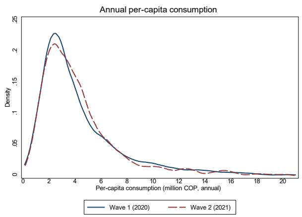

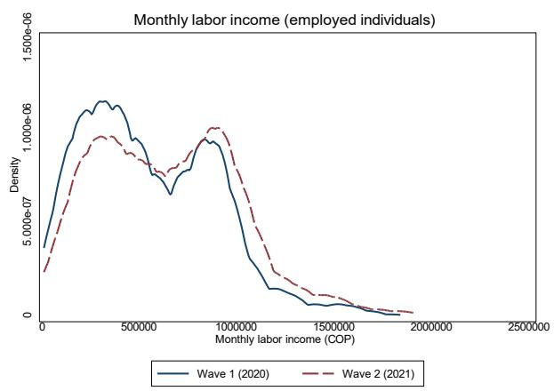  
Figure B.1: Per-capita Household Consumption and Monthly Labor Income, by Wave Notes. Variables are plotted in raw units (not standardized). Wave 1 (2020) is in navy and Wave 2 (2021) in cranberry.

## B.2 Descriptive statistics by outcome group

Table B.5: Descriptive Statistics: Economic Well-being

<table><tr><td rowspan="2">Variable</td><td rowspan="2">Level</td><td rowspan="2">Construction</td><td colspan="3">Wave 1 (2020)</td><td colspan="3">Wave 2 (2021)</td></tr><tr><td>Mean</td><td>SD</td><td>N</td><td>Mean</td><td>SD</td><td>N</td></tr><tr><td>Well-being index (SD)</td><td>Ind.</td><td>Equal-weighted mean of standardized log labor income, log per-capita consumption, and employed indicator</td><td>0.318</td><td>0.906</td><td>4,328</td><td>0.252</td><td>0.896</td><td>2,801</td></tr><tr><td>Log monthly labor income</td><td>Ind.</td><td>Log of monthly labor income (COP) for working individuals</td><td>0.306</td><td>0.279</td><td>2,692</td><td>0.338</td><td>0.300</td><td>1,896</td></tr><tr><td>Log per-capita HH consumption</td><td>HH</td><td>Log of annual per-capita household consumption (millions of COP)</td><td>1.488</td><td>0.522</td><td>4,325</td><td>1.500</td><td>0.509</td><td>2,669</td></tr><tr><td>Health PCA index (SD)</td><td>Ind.</td><td>First principal component of self-rated and physical-health items (PCA index)</td><td>0.035</td><td>1.495</td><td>4,322</td><td>0.104</td><td>1.537</td><td>2,794</td></tr></table>

Notes: The level column indicates the unit at which each variable is recorded in the survey: Ind. for individual-level items (asked of each roster member) and HH for household-level items (asked of the head and assigned to all members for the analysis). The Construction column gives a brief description of how the variable is constructed; full coding is in the project replication files. Variables labeled “(SD)” are standardized to mean 0 and SD 1 within each wave (see Section A introduction for the index-construction convention); “[=1]” are 0/1 indicators.

Table B.6: Descriptive Statistics: Services and Rights

<table><tr><td rowspan="2">Variable</td><td rowspan="2">Level</td><td rowspan="2">Construction</td><td colspan="3">Wave 1 (2020)</td><td colspan="3">Wave 2 (2021)</td></tr><tr><td>Mean</td><td>SD</td><td>N</td><td>Mean</td><td>SD</td><td>N</td></tr><tr><td>Services index (SD)</td><td>Ind.</td><td>Equal-weighted mean of standardized SISBEN, subsidized health, bank, and government transfers</td><td>0.733</td><td>1.510</td><td>4,328</td><td>0.663</td><td>1.387</td><td>2,799</td></tr><tr><td>SISBEN registration [=1]</td><td>Ind.</td><td>1 if registered in SISBEN social registry</td><td>0.264</td><td>0.441</td><td>4,304</td><td>0.329</td><td>0.470</td><td>2,662</td></tr><tr><td>Subsidized health [=1]</td><td>Ind.</td><td>1 if enrolled in subsidized health insurance</td><td>0.152</td><td>0.359</td><td>4,328</td><td>0.229</td><td>0.420</td><td>2,625</td></tr><tr><td>Bank account (incl. savings) [=1]</td><td>HH</td><td>1 if has a savings or transactional bank account</td><td>—</td><td>—</td><td>—</td><td>—</td><td>—</td><td>—</td></tr><tr><td>Govt. transfers [=1]</td><td>HH</td><td>1 if household received any government transfer</td><td>0.107</td><td>0.309</td><td>4,325</td><td>0.089</td><td>0.284</td><td>2,795</td></tr></table>

Notes: The level column indicates the unit at which each variable is recorded in the survey: Ind. for individual-level items (asked of each roster member) and HH for household-level items (asked of the head and assigned to all members for the analysis). The Construction column gives a brief description of how the variable is constructed; full coding is in the project replication files. Variables labeled “(SD)” are standardized to mean 0 and SD 1 within each wave (see Section A introduction for the index-construction convention); “[=1]” are 0/1 indicators.

Table B.7: Descriptive Statistics: Labor Market

<table><tr><td rowspan="2">Variable</td><td rowspan="2">Level</td><td rowspan="2">Construction</td><td colspan="3">Wave 1 (2020)</td><td colspan="3">Wave 2 (2021)</td></tr><tr><td>Mean</td><td>SD</td><td>N</td><td>Mean</td><td>SD</td><td>N</td></tr><tr><td>Labor index (SD)</td><td>Ind.</td><td>Equal-weighted mean of standardized formal-employment indicator and log weekly hours</td><td>0.916</td><td>3.996</td><td>2,371</td><td>0.260</td><td>1.231</td><td>1,546</td></tr><tr><td>Log monthly labor income</td><td>Ind.</td><td>Log of monthly labor income (COP) for working individuals</td><td>0.306</td><td>0.279</td><td>2,692</td><td>0.338</td><td>0.300</td><td>1,896</td></tr><tr><td>Employed [=1]</td><td>Ind.</td><td>1 if individual is currently employed</td><td>0.592</td><td>0.492</td><td>4,007</td><td>0.631</td><td>0.483</td><td>2,451</td></tr><tr><td>Formal employment [=1]</td><td>Ind.</td><td>1 if individual contributes to social security (formal job)</td><td>0.054</td><td>0.226</td><td>2,371</td><td>0.075</td><td>0.264</td><td>1,546</td></tr><tr><td>Log weekly hours (salaried)</td><td>Ind.</td><td>Log of weekly hours worked, conditional on being salaried</td><td>3.862</td><td>0.629</td><td>2,305</td><td>3.941</td><td>0.514</td><td>1,479</td></tr></table>

Notes: The level column indicates the unit at which each variable is recorded in the survey: Ind. for individual-level items (asked of each roster member) and HH for household-level items (asked of the head and assigned to all members for the analysis). The Construction column gives a brief description of how the variable is constructed; full coding is in the project replication files. Variables labeled “(SD)” are standardized to mean 0 and SD 1 within each wave (see Section A introduction for the index-construction convention); “[=1]” are 0/1 indicators.

Table B.8: Descriptive Statistics: Integration

<table><tr><td rowspan="2" colspan="2">Variable</td><td rowspan="2">Level</td><td rowspan="2">Construction</td><td colspan="3">Wave 1 (2020)</td><td colspan="3">Wave 2 (2021)</td></tr><tr><td>Mean</td><td>SD</td><td>N</td><td>Mean</td><td>SD</td><td>N</td></tr><tr><td>Integration index (SD)</td><td>index</td><td>Ind.</td><td>Equal-weighted mean of standardized belonging, feels integrated, count of Colombian friends, community-org membership, and connection-to-Colombia indicators</td><td>0.078</td><td>0.612</td><td>4,328</td><td>0.061</td><td>0.592</td><td>2,670</td></tr><tr><td>Sense of belonging (1-4)</td><td>Ind.</td><td>Sense of belonging in Colombia (1=low, 4=high)</td><td>2.953</td><td>0.920</td><td>4,322</td><td>2.850</td><td>0.904</td><td>2,666</td><td></td></tr><tr><td>Feels integrated (1-4)</td><td>Ind.</td><td>Self-reported feeling of integration in Colombia (1=low, 4=high)</td><td>2.939</td><td>0.918</td><td>4,326</td><td>2.821</td><td>0.984</td><td>2,666</td><td></td></tr><tr><td>Number Colombian friends</td><td>Ind.</td><td>Count of close Colombian friends</td><td>1.911</td><td>1.101</td><td>4,328</td><td>1.951</td><td>1.081</td><td>2,668</td><td></td></tr><tr><td>Belongs to community org [=1]</td><td>Ind.</td><td>1 if member of a community organization</td><td>0.013</td><td>0.114</td><td>4,304</td><td>0.024</td><td>0.153</td><td>2,667</td><td></td></tr><tr><td>Strong connection to Colombia [=1]</td><td>Ind.</td><td>1 if reports a strong connection to Colombia</td><td>—</td><td>—</td><td>0</td><td>3.124</td><td>0.946</td><td>2,662</td><td></td></tr></table>

Notes: The level column indicates the unit at which each variable is recorded in the survey: Ind. for individual-level items (asked of each roster member) and HH for household-level items (asked of the head and assigned to all members for the analysis). The Construction column gives a brief description of how the variable is constructed; full coding is in the project replication files. Variables labeled “(SD)” are standardized to mean 0 and SD 1 within each wave (see Section A introduction for the index-construction convention); “[=1]” are 0/1 indicators.

Table B.9: Descriptive Statistics: Prosocial Behaviors

<table><tr><td rowspan="2">Variable</td><td rowspan="2">Level</td><td rowspan="2">Construction</td><td colspan="3">Wave 1 (2020)</td><td colspan="3">Wave 2 (2021)</td></tr><tr><td>Mean</td><td>SD</td><td>N</td><td>Mean</td><td>SD</td><td>N</td></tr><tr><td>Prosocial behaviors composite (SD)</td><td>Ind.</td><td>Equal-weighted mean of standardized general trust, trust in Colombians, and trust in Venezuelans</td><td>0.067</td><td>1.004</td><td>4,317</td><td>0.037</td><td>0.987</td><td>2,661</td></tr><tr><td>General trust in people (1-5)</td><td>Ind.</td><td>General trust in people (1=low, 5=high)</td><td>2.731</td><td>1.134</td><td>4,309</td><td>2.612</td><td>1.052</td><td>2,660</td></tr><tr><td>Trust in Colombians (out-group, 1-5)</td><td>Ind.</td><td>Trust in Colombians, out-group (1-5)</td><td>3.175</td><td>1.048</td><td>2,167</td><td>3.051</td><td>1.010</td><td>1,325</td></tr><tr><td>Trust in Venezuelans (in-group, 1-5)</td><td>Ind.</td><td>Trust in Venezuelans, in-group (1-5)</td><td>3.157</td><td>1.021</td><td>2,184</td><td>3.026</td><td>0.984</td><td>1,331</td></tr><tr><td>Colombians help me (1-5)</td><td>Ind.</td><td>Perception that Colombians want to help me (1-5)</td><td>3.735</td><td>0.894</td><td>2,162</td><td>3.560</td><td>0.915</td><td>1,324</td></tr><tr><td>Venezuelans help me (1-5)</td><td>Ind.</td><td>Perception that Venezuelans want to help me (1-5)</td><td>3.285</td><td>1.001</td><td>2,176</td><td>3.201</td><td>0.970</td><td>1,331</td></tr></table>

Notes: The level column indicates the unit at which each variable is recorded in the survey: Ind. for individual-level items (asked of each roster member) and HH for household-level items (asked of the head and assigned to all members for the analysis). The Construction column gives a brief description of how the variable is constructed; full coding is in the project replication files. Variables labeled “(SD)” are standardized to mean 0 and SD 1 within each wave (see Section A introduction for the index-construction convention); “[=1]” are 0/1 indicators.

Table B.10: Descriptive Statistics: Food Security

<table><tr><td rowspan="2">Variable</td><td rowspan="2">Level</td><td rowspan="2">Construction</td><td colspan="3">Wave 1 (2020)</td><td colspan="3">Wave 2 (2021)</td></tr><tr><td>Mean</td><td>SD</td><td>N</td><td>Mean</td><td>SD</td><td>N</td></tr><tr><td>Food security index (SD)</td><td>HH</td><td>Equal-weighted mean of standardized skipped meals, went without food, days with protein, and food-assistance-seeking indicators (signs aligned to higher = more food security)</td><td>0.128</td><td>0.693</td><td>4,328</td><td>0.146</td><td>0.651</td><td>2,801</td></tr><tr><td>Skipped meals last month [=1]</td><td>HH</td><td>1 if any HH member skipped meals last month</td><td>0.400</td><td>0.490</td><td>4,328</td><td>0.304</td><td>0.460</td><td>2,789</td></tr><tr><td>Went without food [=1]</td><td>HH</td><td>1 if any HH member went a full day without eating last month</td><td>0.287</td><td>0.453</td><td>4,328</td><td>0.289</td><td>0.453</td><td>2,801</td></tr><tr><td>Days w/ protein (last week)</td><td>HH</td><td>Days last week with protein consumption (0–7)</td><td>4.572</td><td>2.292</td><td>4,320</td><td>4.753</td><td>2.218</td><td>2,794</td></tr></table>

Notes: The level column indicates the unit at which each variable is recorded in the survey: Ind. for individual-level items (asked of each roster member) and HH for household-level items (asked of the head and assigned to all members for the analysis). The Construction column gives a brief description of how the variable is constructed; full coding is in the project replication files. Variables labeled “(SD)” are standardized to mean 0 and SD 1 within each wave (see Section A introduction for the index-construction convention); “[=1]” are 0/1 indicators.

Table B.11: Descriptive Statistics: Housing Quality

<table><tr><td rowspan="2">Variable</td><td rowspan="2">Level</td><td rowspan="2">Construction</td><td colspan="3">Wave 1 (2020)</td><td colspan="3">Wave 2 (2021)</td></tr><tr><td>Mean</td><td>SD</td><td>N</td><td>Mean</td><td>SD</td><td>N</td></tr><tr><td>Housing quality index (SD)</td><td>HH</td><td>Equal-weighted mean of standardized adequate housing, electricity, water, and sewage indicators</td><td>0.023</td><td>0.601</td><td>4,328</td><td>0.009</td><td>0.584</td><td>2,796</td></tr><tr><td>Adequate housing [=1]</td><td>HH</td><td>1 if dwelling meets minimum adequacy standards</td><td>0.715</td><td>0.452</td><td>4,328</td><td>0.739</td><td>0.439</td><td>2,796</td></tr><tr><td>Has electricity [=1]</td><td>HH</td><td>1 if dwelling has electricity service</td><td>0.989</td><td>0.103</td><td>4,328</td><td>0.995</td><td>0.074</td><td>2,728</td></tr><tr><td>Has running water [=1]</td><td>HH</td><td>1 if dwelling has running water</td><td>0.962</td><td>0.192</td><td>4,327</td><td>0.967</td><td>0.179</td><td>2,728</td></tr><tr><td>Has sewage [=1]</td><td>HH</td><td>1 if dwelling has sewage connection</td><td>0.915</td><td>0.280</td><td>4,316</td><td>0.922</td><td>0.268</td><td>2,727</td></tr></table>

Notes: The level column indicates the unit at which each variable is recorded in the survey: Ind. for individual-level items (asked of each roster member) and HH for household-level items (asked of the head and assigned to all members for the analysis). The Construction column gives a brief description of how the variable is constructed; full coding is in the project replication files. Variables labeled “(SD)” are standardized to mean 0 and SD 1 within each wave (see Section A introduction for the index-construction convention); “[=1]” are 0/1 indicators.

Table B.12: Descriptive Statistics: Discrimination (appendix only)

<table><tr><td rowspan="2">Variable</td><td rowspan="2">Level</td><td rowspan="2">Construction</td><td colspan="3">Wave 1 (2020)</td><td colspan="3">Wave 2 (2021)</td></tr><tr><td>Mean</td><td>SD</td><td>N</td><td>Mean</td><td>SD</td><td>N</td></tr><tr><td>Discrimination index (SD)</td><td>Ind.</td><td>Equal-weighted mean of standardized discrimination indicators (signs aligned)</td><td>-0.441</td><td>0.653</td><td>4,323</td><td>-0.433</td><td>0.621</td><td>2,670</td></tr><tr><td>Ever discriminated against [=1]</td><td>Ind.</td><td>1 if ever felt discriminated against in Colombia</td><td>0.517</td><td>0.500</td><td>4,323</td><td>0.457</td><td>0.498</td><td>2,670</td></tr><tr><td>Discrimination frequency (1-5)</td><td>Ind.</td><td>Frequency of discrimination experienced (1=never, 5=very often)</td><td>1.870</td><td>0.679</td><td>2,236</td><td>1.880</td><td>0.681</td><td>1,221</td></tr><tr><td>Filed discrimination complaint [=1]</td><td>Ind.</td><td>1 if ever filed a discrimination complaint</td><td>0.088</td><td>0.283</td><td>4,328</td><td>0.111</td><td>0.314</td><td>2,670</td></tr></table>

Notes: The level column indicates the unit at which each variable is recorded in the survey: Ind. for individual-level items (asked of each roster member) and HH for household-level items (asked of the head and assigned to all members for the analysis). The Construction column gives a brief description of how the variable is constructed; full coding is in the project replication files. Variables labeled “(SD)” are standardized to mean 0 and SD 1 within each wave (see Section A introduction for the index-construction convention); “[=1]” are 0/1 indicators.

Table B.13: Descriptive Statistics: Migration Intentions (appendix only)

<table><tr><td rowspan="2">Variable</td><td rowspan="2">Level</td><td rowspan="2">Construction</td><td colspan="3">Wave 1 (2020)</td><td colspan="3">Wave 2 (2021)</td></tr><tr><td>Mean</td><td>SD</td><td>N</td><td>Mean</td><td>SD</td><td>N</td></tr><tr><td>Intends to stay in Colombia [=1]</td><td>Ind.</td><td>1 if intends to stay in Colombia</td><td>0.901</td><td>0.298</td><td>4,003</td><td>0.910</td><td>0.286</td><td>2,586</td></tr><tr><td>Plans to stay 5+ years [=1]</td><td>Ind.</td><td>1 if plans to stay in Colombia for five or more years</td><td>0.550</td><td>0.498</td><td>3,904</td><td>0.572</td><td>0.495</td><td>2,533</td></tr><tr><td>Considered returning to Venezuela [=1]</td><td>Ind.</td><td>1 if has considered returning to Venezuela</td><td>0.627</td><td>0.484</td><td>4,328</td><td>0.642</td><td>0.480</td><td>2,670</td></tr></table>

Notes: The level column indicates the unit at which each variable is recorded in the survey: Ind. for individual-level items (asked of each roster member) and HH for household-level items (asked of the head and assigned to all members for the analysis). The Construction column gives a brief description of how the variable is constructed; full coding is in the project replication files. Variables labeled “(SD)” are standardized to mean 0 and SD 1 within each wave (see Section A introduction for the index-construction convention); “[=1]” are 0/1 indicators.

Table B.14: Descriptive statistics: Adult Education (appendix only)

<table><tr><td rowspan="2" colspan="2">Variable</td><td rowspan="2">Level</td><td rowspan="2">Construction</td><td colspan="3">Wave 1 (2020)</td><td colspan="3">Wave 2 (2021)</td></tr><tr><td>Mean</td><td>SD</td><td>N</td><td>Mean</td><td>SD</td><td>N</td></tr><tr><td colspan="2">Currently studied [=1]</td><td>Ind.</td><td>1 if currently studying</td><td>0.024</td><td>0.152</td><td>4,153</td><td>0.067</td><td>0.251</td><td>2,777</td></tr><tr><td colspan="2">Currently enrolled in school [=1]</td><td>Ind.</td><td>1 if currently enrolled in a Colombian institution</td><td>0.039</td><td>0.193</td><td>4,322</td><td>0.048</td><td>0.214</td><td>2,799</td></tr><tr><td colspan="2">Foreign degree validated [=1]</td><td>Ind.</td><td>1 if foreign degree validated in Colombia</td><td>0.004</td><td>0.067</td><td>4,012</td><td>0.008</td><td>0.092</td><td>2,477</td></tr></table>

Notes: The level column indicates the unit at which each variable is recorded in the survey: Ind. for individual-level items (asked of each roster member) and HH for household-level items (asked of the head and assigned to all members for the analysis). The Construction column gives a brief description of how the variable is constructed; full coding is in the project replication files. Variables labeled “(SD)” are standardized to mean 0 and SD 1 within each wave (see Section A introduction for the index-construction convention); “[=1]” are 0/1 indicators.

Table B.15: Descriptive Statistics: M. Remittances (appendix only)

<table><tr><td rowspan="2" colspan="2">Variable</td><td rowspan="2">Level</td><td rowspan="2">Construction</td><td colspan="3">Wave 1 (2020)</td><td colspan="3">Wave 2 (2021)</td></tr><tr><td>Mean</td><td>SD</td><td>N</td><td>Mean</td><td>SD</td><td>N</td></tr><tr><td>Remittances index (SD)</td><td>index</td><td>HH</td><td>Equal-weighted mean of standardized remittance indicators</td><td>-0.039</td><td>0.508</td><td>4,326</td><td>-0.079</td><td>0.504</td><td>2,796</td></tr><tr><td>Sends remittances now [=1]</td><td>remittances</td><td>HH</td><td>1 if currently sends remittances to Venezuela</td><td>0.326</td><td>0.469</td><td>4,326</td><td>0.278</td><td>0.448</td><td>2,796</td></tr><tr><td>Remits to parents [=1]</td><td>parents [=1]</td><td>HH</td><td>1 if remits to parents in Venezuela</td><td>0.645</td><td>0.479</td><td>3,348</td><td>0.664</td><td>0.472</td><td>1,994</td></tr></table>

Notes: The level column indicates the unit at which each variable is recorded in the survey: Ind. for individual-level items (asked of each roster member) and HH for household-level items (asked of the head and assigned to all members for the analysis). The Construction column gives a brief description of how the variable is constructed; full coding is in the project replication files. Variables labeled “(SD)” are standardized to mean 0 and SD 1 within each wave (see Section A introduction for the index-construction convention); “[=1]” are 0/1 indicators.

Table B.16: Descriptive Statistics: Demographics

<table><tr><td rowspan="2">Variable</td><td rowspan="2">Level</td><td rowspan="2">Construction</td><td colspan="3">Wave 1 (2020)</td><td colspan="3">Wave 2 (2021)</td></tr><tr><td>Mean</td><td>SD</td><td>N</td><td>Mean</td><td>SD</td><td>N</td></tr><tr><td>Female [=1]</td><td>Ind.</td><td>1 if female</td><td>0.557</td><td>0.497</td><td>4,328</td><td>0.562</td><td>0.496</td><td>2,801</td></tr><tr><td>Age (years)</td><td>Ind.</td><td>Age in years at survey</td><td>31.746</td><td>12.153</td><td>4,324</td><td>33.123</td><td>12.225</td><td>2,702</td></tr><tr><td>Years of education</td><td>Ind.</td><td>Years of education at arrival in Colombia</td><td>13.209</td><td>2.868</td><td>4,328</td><td>13.308</td><td>2.791</td><td>2,801</td></tr><tr><td>Years in Colombia</td><td>Ind.</td><td>Months in Colombia at the time of the survey</td><td>50.877</td><td>13.582</td><td>4,231</td><td>51.088</td><td>15.105</td><td>2,721</td></tr><tr><td>Has child born in Venezuela [=1]</td><td>Ind.</td><td>Number of children born in Venezuela</td><td>1.558</td><td>1.502</td><td>4,328</td><td>1.588</td><td>1.482</td><td>2,801</td></tr></table>

Notes: The level column indicates the unit at which each variable is recorded in the survey: Ind. for individual-level items (asked of each roster member) and HH for household-level items (asked of the head and assigned to all members for the analysis). The Construction column gives a brief description of how the variable is constructed; full coding is in the project replication files. Variables labeled “(SD)” are standardized to mean 0 and SD 1 within each wave (see Section A introduction for the index-construction convention); “[=1]” are 0/1 indicators.

Table B.17: Descriptive Statistics: Pre-migration Economic Conditions in Venezuela

<table><tr><td rowspan="2">Variable</td><td rowspan="2">Level</td><td rowspan="2">Construction</td><td colspan="3">Wave 1 (2020)</td><td colspan="3">Wave 2 (2021)</td></tr><tr><td>Mean</td><td>SD</td><td>N</td><td>Mean</td><td>SD</td><td>N</td></tr><tr><td>Had a job offer in Colombia [=1]</td><td>Ind.</td><td>1 if had a job offer in Colombia at arrival</td><td>0.338</td><td>0.473</td><td>4,328</td><td>0.351</td><td>0.477</td><td>2,801</td></tr><tr><td>Worked in Venezuela [=1]</td><td>Ind.</td><td>1 if worked in Venezuela before migrating</td><td>0.976</td><td>0.153</td><td>4,328</td><td>0.979</td><td>0.142</td><td>2,801</td></tr><tr><td>Worked in agric./manual (VZ) [=1]</td><td>Ind.</td><td>1 if worked in agriculture or manual labor in Venezuela</td><td>0.596</td><td>0.491</td><td>3,948</td><td>0.586</td><td>0.493</td><td>2,601</td></tr><tr><td>Worked in services (VZ) [=1]</td><td>Ind.</td><td>1 if worked in services in Venezuela</td><td>0.152</td><td>0.359</td><td>3,948</td><td>0.159</td><td>0.366</td><td>2,601</td></tr><tr><td>Worked in skilled occ. (VZ) [=1]</td><td>Ind.</td><td>1 if worked in skilled occupations in Venezuela</td><td>0.175</td><td>0.380</td><td>3,948</td><td>0.184</td><td>0.388</td><td>2,601</td></tr><tr><td>Had written contract (VZ) [=1]</td><td>Ind.</td><td>1 if had a written contract in Venezuela</td><td>0.461</td><td>0.499</td><td>3,948</td><td>0.458</td><td>0.498</td><td>2,601</td></tr><tr><td>Avg. days worked / week (VZ)</td><td>Ind.</td><td>Average days worked per week in Venezuela</td><td>0.921</td><td>3.963</td><td>3,922</td><td>0.959</td><td>4.149</td><td>2,589</td></tr><tr><td>Owned smartphone in VZ [=1]</td><td>HH</td><td>1 if owned a smartphone in Venezuela</td><td>0.572</td><td>0.495</td><td>4,328</td><td>0.579</td><td>0.494</td><td>2,801</td></tr><tr><td>Homeowner in VZ [=1]</td><td>HH</td><td>1 if homeowner in Venezuela</td><td>0.865</td><td>0.342</td><td>4,328</td><td>0.865</td><td>0.341</td><td>2,801</td></tr><tr><td>Had electricity in VZ [=1]</td><td>HH</td><td>1 if had electricity in Venezuela dwelling</td><td>0.994</td><td>0.077</td><td>4,328</td><td>0.994</td><td>0.075</td><td>2,801</td></tr><tr><td>Had running water in VZ [=1]</td><td>HH</td><td>1 if had running water in Venezuela dwelling</td><td>0.866</td><td>0.341</td><td>4,328</td><td>0.859</td><td>0.348</td><td>2,801</td></tr><tr><td>Had sewage in VZ [=1]</td><td>HH</td><td>1 if had sewage in Venezuela dwelling</td><td>0.935</td><td>0.246</td><td>4,328</td><td>0.937</td><td>0.243</td><td>2,801</td></tr></table>

Notes: The level column indicates the unit at which each variable is recorded in the survey: Ind. for individual-level items (asked of each roster member) and HH for household-level items (asked of the head and assigned to all members for the analysis). The Construction column gives a brief description of how the variable is constructed; full coding is in the project replication files. Variables labeled “(SD)” are standardized to mean 0 and SD 1 within each wave (see Section A introduction for the index-construction convention); “[=1]” are 0/1 indicators.

Table B.18: Descriptive Statistics: Family / migration network in Colombia

<table><tr><td rowspan="2">Variable</td><td rowspan="2">Level</td><td rowspan="2">Construction</td><td colspan="3">Wave 1 (2020)</td><td colspan="3">Wave 2 (2021)</td></tr><tr><td>Mean</td><td>SD</td><td>N</td><td>Mean</td><td>SD</td><td>N</td></tr><tr><td>Spouse born in VZ [=1]</td><td>Ind.</td><td>1 if spouse born in Venezuela</td><td>0.548</td><td>0.498</td><td>4,328</td><td>0.562</td><td>0.496</td><td>2,801</td></tr><tr><td>Other HH members born in VZ [=1]</td><td>Ind.</td><td>1 if any other HH member born in Venezuela</td><td>0.103</td><td>0.304</td><td>4,328</td><td>0.102</td><td>0.303</td><td>2,801</td></tr><tr><td>Healthy at migration [=1]</td><td>Ind.</td><td>1 if reported good health at the time of migration</td><td>0.103</td><td>0.303</td><td>4,328</td><td>0.099</td><td>0.299</td><td>2,801</td></tr><tr><td>Network in Colombia [=1]</td><td>Ind.</td><td>1 if had family or friends in Colombia at arrival</td><td>0.728</td><td>0.445</td><td>4,328</td><td>0.736</td><td>0.441</td><td>2,801</td></tr></table>

Notes: The level column indicates the unit at which each variable is recorded in the survey: Ind. for individual-level items (asked of each roster member) and HH for household-level items (asked of the head and assigned to all members for the analysis). The Construction column gives a brief description of how the variable is constructed; full coding is in the project replication files. Variables labeled “(SD)” are standardized to mean 0 and SD 1 within each wave (see Section A introduction for the index-construction convention); “[=1]” are 0/1 indicators.

## C Full RD Results: Per-Item Tables

The body of the paper reports fuzzy-RD estimates for the seven main thematic indices and their underlying items. This appendix reports per-item fuzzy-RD tables for the remaining outcome groups not shown in the body. All tables follow the same two-column structure (Wave 1, Wave 2) used in the body.

## C.1 Per-item Tables, appendix-only outcome groups

Table C.19: Fuzzy RD estimates: Discrimination (full)

<table><tr><td></td><td>Wave 1 (2020) (1)</td><td>Wave 2 (2021) (2)</td></tr><tr><td>Discrimination index (SD)</td><td>-0.052(0.255)</td><td>-0.135(0.266)</td></tr><tr><td>Ever discriminated against [=1]</td><td>-0.407*(0.179)</td><td>-0.298(0.205)</td></tr><tr><td>Discrimination frequency (1-5)</td><td>-0.183(0.311)</td><td>-0.658(0.485)</td></tr><tr><td>Filed discrimination complaint [=1]</td><td>0.244+(0.138)</td><td>0.111(0.183)</td></tr></table>

Notes: This table reports fuzzy regression-discontinuity estimates for every outcome we construct within the theme indicated in the title. Each cell is a coefficient from rdrobust estimated at the MSE-optimal bandwidth with triangular kernel and local-linear polynomial $p = 1$ ; conventional standard errors are in parentheses on the row below. The instrument is the eligibility indicator (date $\geq 0$ after reflection); treatment is the household PEP indicator for household-level outcomes (per-capita consumption, household-max labor income, bank account, government transfers, remittances) and the individual PEP indicator otherwise. No covariate adjustment is applied. Outcomes labeled “(SD)” are standard-ized to the within-wave control mean and standard deviation; outcomes labeled “[=1]” are 0/1 indicators; remaining variables are in the natural units indicated. Significance: $^{+}p < 0.10$ , $^{*}p < 0.05$ , $^{**}p < 0.01$ .

## C.2 Robustness of the Wave-2 consumption attenuation

The body of the paper notes that the positive Wave-1 effect on per-capita household consumption (0.59 SD) attenuates to 0.13 SD in Wave 2, while the other well-being components persist. Because consumption is the only economic margin whose effect does not carry into the medium run, we document here that the attenuation is a genuine feature of the data rather than an artifact of how consumption is measured.

Table C.23 reports six checks. Panel A is the baseline log per-capita consumption estimate. Panel B trims the top one percent of per-capita consumption, guarding against a few large households driving the result; the Wave-2 estimate remains small and insignificant. Panel C

Table C.20: Fuzzy RD estimates: Migration intentions (full)

<table><tr><td></td><td>Wave 1 (2020) (1)</td><td>Wave 2 (2021) (2)</td></tr><tr><td>Intends to stay in Colombia [=1]</td><td>-0.029(0.097)</td><td>-0.068(0.086)</td></tr><tr><td>Plans to stay 5+ years [=1]</td><td>-0.473*(0.214)</td><td>-0.279(0.233)</td></tr><tr><td>Considered returning to Venezuela [=1]</td><td>0.194(0.183)</td><td>0.250(0.198)</td></tr></table>

Notes: This table reports fuzzy regression-discontinuity estimates for every outcome we construct within the theme indicated in the title. Each cell is a coefficient from rdrobust estimated at the MSE-optimal bandwidth with triangular kernel and local-linear polynomial $p = 1$ ; conventional standard errors are in parentheses on the row below. The instrument is the eligibility indicator (date $\geq 0$ after reflection); treatment is the household PEP indicator for household-level outcomes (per-capita consumption, household-max labor income, bank account, government transfers, remittances) and the individual PEP indicator otherwise. No covariate adjustment is applied. Outcomes labeled “(SD)” are standardized to the within-wave control mean and standard deviation; outcomes labeled “[=1]” are 0/1 indicators; remaining variables are in the natural units indicated. Significance: $^{+}p < 0.10$ , $^{*}p < 0.05$ , $^{**}p < 0.01$ .

Table C.21: Fuzzy RD estimates: Education (full)

<table><tr><td></td><td>Wave 1 (2020) (1)</td><td>Wave 2 (2021) (2)</td></tr><tr><td>Currently studying [=1]</td><td>0.034(0.022)</td><td>-0.096(0.128)</td></tr><tr><td>Currently enrolled in school [=1]</td><td>-0.026(0.082)</td><td>-0.094(0.131)</td></tr><tr><td>Foreign degree validated [=1]</td><td>-0.000(0.001)</td><td>-0.050(0.055)</td></tr></table>

Notes: This table reports fuzzy regression-discontinuity estimates for every outcome we construct within the theme indicated in the title. Each cell is a coefficient from rdrobust estimated at the MSE-optimal bandwidth with triangular kernel and local-linear polynomial $p = 1$ ; conventional standard errors are in parentheses on the row below. The instrument is the eligibility indicator (date $\geq 0$ after reflection); treatment is the household PEP indicator for household-level outcomes (per-capita consumption, household-max labor income, bank account, government transfers, remittances) and the individual PEP indicator otherwise. No covariate adjustment is applied. Outcomes labeled “(SD)” are standardized to the within-wave control mean and standard deviation; outcomes labeled “[=1]” are 0/1 indicators; remaining variables are in the natural units indicated. Significance: $^{+}p < 0.10$ , $^{*}p < 0.05$ , $^{**}p < 0.01$ .

Table C.22: Fuzzy RD estimates: Remittances (full)

<table><tr><td></td><td>Wave 1 (2020) (1)</td><td>Wave 2 (2021) (2)</td></tr><tr><td>Remittances index (SD)</td><td>0.009(0.191)</td><td>0.089(0.150)</td></tr><tr><td>Sends remittances now [=1]</td><td>0.239(0.149)</td><td>0.040(0.155)</td></tr><tr><td>Remits to parents [=1]</td><td>0.167(0.226)</td><td>0.091(0.161)</td></tr></table>

Notes: This table reports fuzzy regression-discontinuity estimates for every outcome we construct within the theme indicated in the title. Each cell is a coefficient from rdrobust estimated at the MSE-optimal bandwidth with triangular kernel and local-linear polynomial $p = 1$ ; conventional standard errors are in parentheses on the row below. The instrument is the eligibility indicator (date $\geq 0$ after reflection); treatment is the household PEP indicator for household-level outcomes (percapita consumption, household-max labor income, bank account, government transfers, remittances) and the individual PEP indicator otherwise. No covariate adjustment is applied. Outcomes labeled “(SD)” are standardized to the within-wave control mean and standard deviation; outcomes labeled “[=1]” are 0/1 indicators; remaining variables are in the natural units indicated. Significance: $^{+}p < 0.10$ , $^{*}p < 0.05$ , $^{**}p < 0.01$ .

uses raw non-log consumption levels, and Panel D uses log household-total consumption, which removes the per-capita denominator entirely; in both the Wave-1 effect is large and significant and the Wave-2 effect is small (and, for raw levels, slightly negative). Panel E estimates the fuzzy-RD effect on household roster size, the per-capita denominator, and finds a small, insignificant jump in both waves, so the attenuation is not a mechanical consequence of differential household growth at the cutoff. The attenuation therefore reflects a real economic fact, namely that ineligible households' consumption recovered between the 2020 and 2021 survey rounds while the eligible level was flat, so the eligible advantage in this fast-moving, mean-reverting flow closed as the control group caught up. Consumption is the most cyclically sensitive of our outcomes and the one most exposed to the differential timing of the COVID-19 recovery across survey years. Panel F reports the one genuine data-quality concern, namely that consumption item nonresponse rises from about 0.1 percent in Wave 1 to about 4.5 percent in Wave 2 and is slightly higher among eligibles, which could bias the Wave-2 estimate downward.

Table C.23: Robustness of the Wave-2 per-capita consumption attenuation

<table><tr><td></td><td>Wave 1 (2020) (1)</td><td>Wave 2 (2021) (2)</td></tr><tr><td colspan="3">Panel A. Log per-capita consumption (baseline)</td></tr><tr><td rowspan="2">Fuzzy-RD LATE</td><td>0.594**</td><td>0.132</td></tr><tr><td>(0.184)</td><td>(0.199)</td></tr><tr><td colspan="3">Panel B. Trimming the top 1% of per-capita consumption</td></tr><tr><td rowspan="2">Fuzzy-RD LATE</td><td>0.552**</td><td>0.222</td></tr><tr><td>(0.180)</td><td>(0.204)</td></tr><tr><td colspan="3">Panel C. Raw (non-log) per-capita consumption, million COP</td></tr><tr><td rowspan="2">Fuzzy-RD LATE</td><td>3.165**</td><td>-1.657</td></tr><tr><td>(1.060)</td><td>(1.770)</td></tr><tr><td colspan="3">Panel D. Log household-total consumption (denominator-free)</td></tr><tr><td rowspan="2">Fuzzy-RD LATE</td><td>0.843**</td><td>0.208</td></tr><tr><td>(0.193)</td><td>(0.168)</td></tr><tr><td colspan="3">Panel E. Household roster size (per-capita denominator)</td></tr><tr><td rowspan="2">Fuzzy-RD LATE</td><td>0.409</td><td>0.087</td></tr><tr><td>(0.752)</td><td>(0.788)</td></tr><tr><td colspan="3">Panel F. Item-nonresponse rate on consumption (share missing)</td></tr><tr><td>All respondents</td><td>0.001</td><td>0.046</td></tr><tr><td>Eligible</td><td>0.001</td><td>0.049</td></tr><tr><td>Ineligible</td><td>0.000</td><td>0.036</td></tr></table>

Notes: The table documents that the Wave-2 attenuation of the per-capita consumption effect is robust to alternative specifications. Panels A–E report fuzzy-RD LATEs (rdrobust, triangular kernel, MSE-optimal bandwidth, local-linear polynomial) on the indicated consumption measure, separately by wave; the household PEP indicator is instrumented by eligibility. Panel A is the baseline log per-capita consumption. Panel B trims the top 1% of per-capita consumption. Panel C uses raw consumption levels (million COP). Panel D uses log household-total consumption, which removes the per-capita denominator. Panel E estimates the RD effect on household roster size, the per-capita denominator. Panel F reports the share of respondents with missing consumption, by wave and eligibility. The attenuation survives outlier trimming, the raw-level and household-total specifications, and is not driven by a differential change in roster size at the cutoff (Panel E is small and insignificant in both waves). The one genuine data-quality concern is the rise in item nonresponse from roughly 0.1% in Wave 1 to roughly 4.5% in Wave 2 (Panel F), slightly higher for eligibles, which could bias the Wave-2 estimate downward. $^{*}p < 0.10$ , $^{*}p < 0.05$ , $^{**}p < 0.01$ .

## D Additional Robustness Exercises

## D.1 McCrary density

Figure D.2 plots the running-variable density at the RAMV deadline, separately by wave.

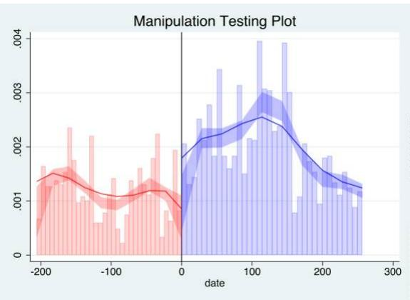  
(a) Wave 1 (2020)

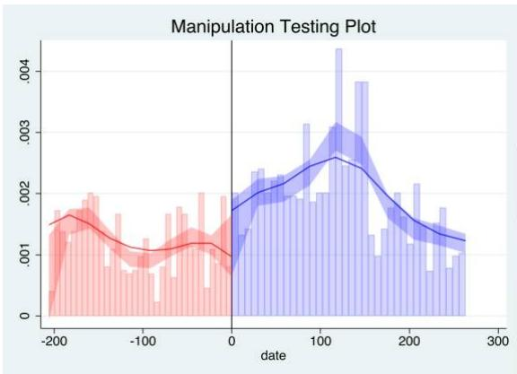  
(b) Wave 2 (2021)  
Figure D.2: Running-variable density at the RAMV deadline, by wave.

Notes. Each panel plots the McCrary (2008) local-polynomial density estimate of the running variable (days from the RAMV registration deadline of June 8, 2018, signed so that positive values denote eligible arrivals). The test rejects the null of no manipulation if the density is discontinuous at the cutoff. Both panels show smooth densities at the cutoff, with p-values reported in Table 1 of the main paper. Bins are 10 days wide and shaded bands are 95 percent confidence intervals on the local-quadratic fit on each side of the cutoff.

## D.2 Reduced-form versus fuzzy LATE

Tables 4-9 of the main paper report the bias-corrected fuzzy LATE. The table below reports the underlying reduced-form coefficient (the discontinuity in the outcome at the eligibility cutoff, with no rescaling by the first stage) alongside the fuzzy LATE for the seven main thematic indices. The ratio of the two columns is the inverse of the first-stage take-up discontinuity.

Table D.24: Reduced-form versus fuzzy local average treatment effect, by wave

<table><tr><td rowspan="2"></td><td colspan="2">Wave 1 (2020)</td><td colspan="2">Wave 2 (2021)</td></tr><tr><td>Reduced form(1)</td><td>Fuzzy LATE(2)</td><td>Reduced form(3)</td><td>Fuzzy LATE(4)</td></tr><tr><td>Well-being index (SD)</td><td>0.573**(0.171)</td><td>1.063**(0.355)</td><td>0.291+(0.167)</td><td>0.701(0.437)</td></tr><tr><td>Services index (SD)</td><td>0.888**(0.148)</td><td>1.996**(0.401)</td><td>1.384**(0.251)</td><td>2.757**(0.440)</td></tr><tr><td>Labor index (SD)</td><td>0.604(1.110)</td><td>1.839(2.365)</td><td>0.282(0.297)</td><td>1.077(0.753)</td></tr><tr><td>Integration index (SD)</td><td>-0.030(0.107)</td><td>-0.122(0.276)</td><td>0.436**(0.155)</td><td>0.906**(0.329)</td></tr><tr><td>Prosocial index (SD)</td><td>0.079(0.161)</td><td>-0.108(0.366)</td><td>0.427*(0.167)</td><td>0.966*(0.445)</td></tr><tr><td>Food security index (SD)</td><td>0.052(0.112)</td><td>0.030(0.234)</td><td>0.380**(0.131)</td><td>0.604*(0.266)</td></tr><tr><td>Housing index (SD)</td><td>0.293**(0.084)</td><td>0.639**(0.192)</td><td>0.478**(0.103)</td><td>1.260**(0.284)</td></tr></table>

Notes: Each cell reports the bias-corrected robust point estimate, with the corresponding robust standard error in parentheses. Columns (1) and (3) report the reduced-form coefficient: a sharp regression-discontinuity estimate of the outcome on the eligibility indicator at the RAMV cutoff. Columns (2) and (4) report the fuzzy local average treatment effect, in which PEP-RAMV take-up is instrumented by the eligibility indicator. The fuzzy LATE equals the reduced form divided by the first-stage discontinuity in PEP-RAMV take-up at the cutoff (reported in body Table ??); columns (2) and (4) are therefore the magnitudes most directly comparable to the body coefficients in Tables ??-??. Estimator: rdrobust with triangular kernel, local-linear polynomial (=1), andtheMSE - optimalbandwidth; therunningvariableisdaysfromtheRAMV deadline(June8, 2018), reflectedsothatpositivevaluesden RAMV take - upamongeligiblecompliersatthecutoffiswellbelowone.Significance :+< 0.10, \* i0.05,\*\* < 0.01.

## E Fiscal Cost-Benefit Analysis, Wave 2

This appendix extends the cost-benefit analysis of Ib á ñ ez et al. (2025, Online Appendix N) to the Wave-2 (2021) inputs of our medium-run sample. We adopt the same accounting framework so that the Wave-1 and Wave-2 numbers are directly comparable. Three families of survey-measured quantities are recomputed on the Wave-2 sample, namely per-capita household consumption, monthly labor income, formality status, and household composition. The PEP take-up rates required by the de facto scenario are also re-estimated on the Wave-2 sample. All tax rates and per-member unit costs are held at the published values reported in Ib á ñ ez et al. (2025) Online Appendix N (2020 USD). The Wave-1 to Wave-2 contrast therefore isolates how survey-measured changes between waves shift the net fiscal footprint of a representative regularized household, holding the institutional cost structure fixed. The table below illustrates the net cost measured as public expenditure minus fiscal revenue; however, the figure in the main paper reports revenue minus expenditures for ease of illustration.

Revenue components. The revenue side aggregates value-added taxes on consumption and payroll taxes on formal labor income. Value-added taxes are computed by applying the standard Colombian VAT rate of 19 percent to non-food consumption and a basket-weighted 5.3 percent rate to food. The food rate is the simple average of the VAT rates applied to the items in the DANE reference consumption basket, the majority of which are VAT-exempt. We compute per-capita household consumption separately for PEP and non-PEP households and by formality status, and impute the per-capita value to each household member regardless of age. This imputation avoids intra-household distributional assumptions while still permitting a per-member net-cost calculation. Payroll taxes are computed only for PEP holders in formal employment. The statutory rates are 12.5 percent of monthly labor income for the health system and 16 percent for the pension system. Migrants without PEP and PEP holders in informal jobs do not contribute payroll taxes. Personal income tax is excluded because annual labor incomes in our sample fall below the Colombian exemption threshold of approximately USD 10,990.

Expenditure components. The expenditure side aggregates three categories. Health care is the largest. We value publicly provided health care at the Unidad de Pago por Capitación (UPC), the per-capita annual premium the Colombian state pays insurance companies. In 2020 the UPC was USD 225 for the subsidized regime and USD 242 for the contributory regime. PEP holders enrolled in the subsidized regime through SISBEN are valued at the subsidized UPC, and PEP holders in formal employment are valued at the contributory UPC. Migrants without insurance access are valued at the subsidized UPC plus an emergency-room extra cost of USD 183 per year. The ER extra cost is constructed as the product of an ER premium (the ER usage fee plus the difference between the ER consult fee and a physician's clinic consult fee) and the average count of non-urgent ER visits, defined as the difference between average clinic visits and ER visits for the Colombian population. PEP holders insured in the contributory or subsidized regime stop using the ER for non-urgent conditions, which saves the state the ER extra cost while still consuming roughly the same per-capita UPC value. Education is the per-student government expenditure for primary, secondary, and tertiary schooling, plus school meals (Programa de Alimentación Escolar) and school transport for children aged 6 to 18. Education access is universal in Colombia for all children regardless of nationality or migratory status, so the per-student cost does not vary by PEP status in the de jure scenario. Social assistance covers early-childhood programs (also universal for young children) and the Familias en Acción conditional cash transfer, valued at the per-beneficiary transfer reported by Prosperidad Social.

Scenarios. The de jure columns assign the full per-member cost of each service to every household, consistent with the universal-access mandate established by Colombian law and Constitutional Court rulings. The de facto columns scale costs by the in-sample service-access rates measured on the Wave-2 sample. Within the PEP group the partitioning between fully formal (column 3 or 7) and partial formal (column 4 or 8) applies a fixed share of formal employment. Column (8), the policy-relevant headline, fixes that share at the Wave-2 observed value of approximately 15 percent.

Table E.25: Wave 2 Fiscal Net Cost of a Representative Migrant Household, Replicating Ibañez et al. (2024) Table 7

<table><tr><td rowspan="2"></td><td colspan="4">Universal access (de jure)</td><td colspan="4">In-sample access (de facto)</td></tr><tr><td>Without PEP (1)</td><td>PEP informal (2)</td><td>PEP formal (3)</td><td>PEP partial formal (4)</td><td>Without PEP (5)</td><td>PEP informal (6)</td><td>PEP formal (7)</td><td>PEP partial formal (8)</td></tr><tr><td>Fiscal revenue</td><td>546</td><td>772</td><td>2882</td><td>1074</td><td>546</td><td>772</td><td>2882</td><td>1074</td></tr><tr><td>VAT</td><td>546</td><td>772</td><td>831</td><td>772</td><td>546</td><td>772</td><td>831</td><td>772</td></tr><tr><td>Payroll</td><td>0</td><td>0</td><td>2051</td><td>302</td><td>0</td><td>0</td><td>2051</td><td>302</td></tr><tr><td>Expenditure</td><td>2538</td><td>2011</td><td>2011</td><td>2011</td><td>1342</td><td>1331</td><td>1331</td><td>1331</td></tr><tr><td>Healthcare</td><td>1443</td><td>801</td><td>801</td><td>801</td><td>779</td><td>470</td><td>470</td><td>470</td></tr><tr><td>Education</td><td>924</td><td>924</td><td>924</td><td>924</td><td>544</td><td>779</td><td>779</td><td>779</td></tr><tr><td>Social assistance</td><td>171</td><td>286</td><td>286</td><td>286</td><td>19</td><td>81</td><td>81</td><td>81</td></tr><tr><td>Net fiscal cost</td><td>1992</td><td>1239</td><td>-871</td><td>936</td><td>796</td><td>559</td><td>-1551</td><td>256</td></tr></table>

Notes: Fiscal cost-benefit analysis using Wave 2 (2021) household averages of per-capita consumption, labor income, formality status, and household composition. Tax rates and unit costs are held at their JEEA-published values (2020 USD; Online Appendix N), so any difference from JEEA Table 7 reflects survey-measured changes between waves. Quantities are in 2020 USD (per HH per year). Net cost = Expenditure – Fiscal revenue. De jure columns assume universal access to services as established by Colombian law; de facto columns scale healthcare, education, and social-assistance costs by the within-sample access shares from JEEA Online Appendix N. Without PEP (cols. 1, 5): all eligible HH members are non-regularized. PEP informal (cols. 2, 6): all PEP holders, none formally employed. PEP formal (cols. 3, 7): all PEP holders formally employed, paying payroll taxes. PEP partial formal (cols. 4, 8): observed share of formal employment in the W2 PEP working-age sample.

Column (8) (PEP partial formal, de facto) is the policy-relevant headline. PEP holders are formal at the Wave-2 observed share of approximately 15 percent, with revenue and expenditure interpolated accordingly. Comparing column (5) (without PEP) with column (8) gives the medium-run analog of the Wave-1 contrast between USD 1,056 and USD 610 net cost per household per year reported in Ib áñ ez et al. (2025, Table 7). The Wave-2 contrast is USD 796 (without PEP) versus USD 256 (PEP partial formal), a 68 percent reduction in net cost. The estimates are a simple accounting exercise, not a structural fiscal-impact assessment. Long-run revenue channels (firm capital tax, firm creation, and eventual personal income-tax revenue if formal-employment growth persists) are out of scope. The estimated fiscal saving should therefore be read as a lower bound on the medium-run net fiscal benefit of PEP-RAMV.

## References

Ana Mar'1a Ibáñez, Andrés Moya, Mar'1a Adelaide Ortega, Sandra V Rozo, and Maria José Urbina. Life out of the shadows: the impacts of regularization programs on the lives of forced migrants. Journal of the European Economic Association, 23(3):941–982, 2025.

David S. Lee. Training, wages, and sample selection: Estimating sharp bounds on treatment effects. Review of Economic Studies, 76(3):1071–1102, 2009.